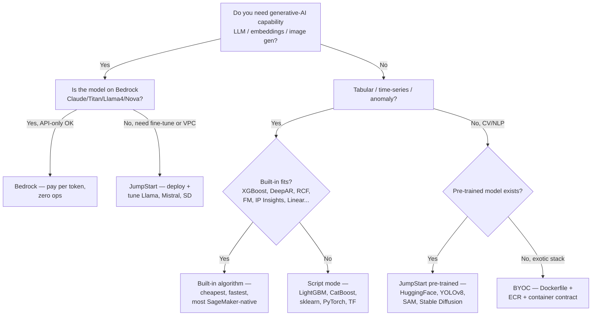
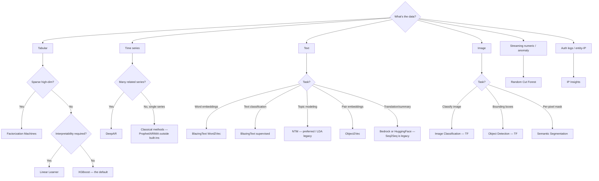

# Chapter 23 — SageMaker Built-in Algorithms: What Each Is For

> **Goal of this chapter.** Give you a fluent, exam-ready map of the ~19 algorithms that AWS ships pre-packaged as SageMaker Docker images, so that when a question begins *"you have [tabular sparse high-dim / time-series / image / anomaly / topic] data — which built-in?"* you reach for the right one without hesitation. Every later chapter in Part E builds on this: Chapter 24 takes you off the built-in path into script mode for non-built-in frameworks (LightGBM, CatBoost, custom PyTorch); Chapter 26 shows how JumpStart layers pre-trained model hubs on top of the same Estimator API; Chapter 27 covers Autopilot, which ensembles built-ins plus AutoGluon under one auto-ML façade. Knowing the *catalogue* — what's in it, what each algorithm is for, what input format it wants, what instance class it runs on — is the unit of recognition the exam tests under Task 2.1 *"Choose a modeling approach"* and Task 2.2 *"Train and refine models."*
>
> **The 2026 reality.** Of the ~19 built-ins, roughly three are doing the real production work in 2026: **XGBoost** dominates tabular, **DeepAR** dominates time-series (especially as Amazon Forecast closed to new customers on July 29, 2024), and **Random Cut Forest** dominates streaming anomaly detection (especially as Amazon Lookout for Metrics reaches EOL on October 10, 2025). Almost everything text and image has been swallowed by JumpStart or Bedrock. The exam, however, tests the catalogue — including legacy entries like Seq2Seq and BlazingText — because it credentialed candidates against a fixed list. This chapter teaches you the catalogue, then flags which entries you should actually reach for on a real 2026 project.

---

## 23.1 Why built-ins still matter (and where they don't)

Twenty-plus algorithms ship as **pre-packaged SageMaker Docker images**, each addressable via `sagemaker.image_uris.retrieve(<algo>, region, <version>)`, each with a fixed contract for input formats, channel names, instance types, distributed-training behavior, and Pipe-mode support. You do not have to write a training script; you call `.fit()` on a CSV (or RecordIO-protobuf, or JSON Lines, depending on the algorithm) in S3, set a small set of hyperparameters, and the container does the rest.

The case for built-ins in 2026 reduces to four points:

1. **Zero-friction starter.** No Dockerfile, no `train.py`, no framework version juggling. For a tabular problem on Monday morning, you can go from CSV-in-S3 to a deployed endpoint by lunch.
2. **AWS-maintained security posture.** The container image is patched by AWS, signed, and on the short-list of approved images that many regulated-finance security teams pre-approve for SageMaker use. In banks and healthcare shops, *"is this container image on the approved list?"* is the question that determines whether your project ships in three weeks or three months. Built-ins win that question by default.
3. **Native integration with the rest of SageMaker.** Built-in algorithms compose cleanly with SageMaker Pipelines (Chapter 43), Automatic Model Tuning (Chapter 25), Clarify (Chapter 50), Model Monitor (Chapter 48), and Inference Recommender (Chapter 37). Script mode and BYOC work too but cost you small bits of boilerplate at each integration boundary.
4. **The exam credentials you against the list.** Whether you'd reach for them in production or not, you have to recognize them on the exam.

The case *against* built-ins on a real 2026 project reduces to two:

1. **You're locked into the catalogue.** No LightGBM, no CatBoost, no YOLOv8, no Llama, no scikit-learn pipeline. The instant you need anything outside the catalogue, you move to script mode (Chapter 24), JumpStart (Chapter 26), or Bedrock (Part J).
2. **Several entries are stale.** Seq2Seq is functionally dead (Bedrock or HuggingFace replaces it). BlazingText is a museum piece (Titan Embeddings or sentence-transformers replace it). The MXNet-based Image Classification and Object Detection are 2017-era ResNet/SSD and lose to JumpStart's pre-trained ViT/EfficientNet or to YOLOv8 in script mode.

The 2026 working rule: **start every tabular problem with XGBoost built-in. Start every multi-series time-series problem with DeepAR built-in. Start every streaming anomaly problem with RCF built-in. For everything else, walk past the built-in catalogue and go straight to JumpStart, Bedrock, or script mode.** That is the shape of a 2026 SageMaker shop. The exam still tests the full catalogue — and so does this chapter.

⚠️ **Exam alert.** When a multiple-choice question lists four algorithm names, three of which are real SageMaker built-ins and one of which is famous-but-not-AWS (DBSCAN, t-SNE, isolation forest, gensim Word2Vec, Prophet), the famous-but-not-AWS option is almost always the wrong answer. AWS only credentials you against algorithms it ships.

---

## 23.2 The AWS Parameters table (memorize this shape)

This is the master reference, distilled verbatim from the AWS [Parameters for Built-in Algorithms](https://docs.aws.amazon.com/sagemaker/latest/dg/common-info-all-im-models.html) doc. Every other table in this chapter follows from it.

| Algorithm | Channel(s) | Input mode | File type | Instance class | Distributed? |
|---|---|---|---|---|---|
| **Linear Learner** | train, validation, test | File or Pipe | recordIO-protobuf or CSV | CPU or GPU | Yes |
| **XGBoost** | train, validation | File or Pipe | CSV, LibSVM, Parquet | CPU (GPU 1.2-1+) | Yes |
| **K-NN** | train, test | File or Pipe | recordIO-protobuf or CSV | CPU or GPU (single GPU/instance) | Yes |
| **Factorization Machines** | train, test | File or Pipe | **recordIO-protobuf only** | CPU (GPU for dense) | Yes |
| **K-Means** | train, test | File or Pipe | recordIO-protobuf or CSV | CPU or GPU (single GPU/instance) | No |
| **PCA** | train, test | File or Pipe | recordIO-protobuf or CSV | CPU or GPU | Yes |
| **Random Cut Forest** | train, test | File or Pipe | recordIO-protobuf or CSV | **CPU only** | Yes |
| **IP Insights** | train, validation | File | CSV | CPU or GPU | Yes |
| **BlazingText** | train | File or Pipe | Text (one sentence/line, space-separated tokens) | CPU or GPU (single instance) | No (Yes via `batch_skipgram`) |
| **Seq2Seq** | train, validation, vocab | File | recordIO-protobuf | **GPU only (single instance)** | No |
| **NTM** | train, validation, test | File or Pipe | recordIO-protobuf or CSV | CPU or GPU | Yes |
| **LDA** | train, test | File or Pipe | recordIO-protobuf or CSV | **CPU only (single instance)** | No |
| **Object2Vec** | train, validation, test | File | **JSON Lines** | CPU or GPU (single instance) | No |
| **DeepAR** | train, test | File | **JSON Lines or Parquet** | CPU or GPU | Yes |
| **Image Classification — MXNet** | train, validation, train_lst, validation_lst, model | File or Pipe | recordIO or .jpg/.png | **GPU** | Yes |
| **Image Classification — TensorFlow** | training, validation | File | .jpg/.jpeg/.png | CPU or GPU | Yes (multi-GPU on one instance only) |
| **Object Detection — MXNet (SSD)** | train, validation, …annotation, model | File or Pipe | recordIO or image files | **GPU** | Yes |
| **Object Detection — TensorFlow** | training, validation | File | image files | **GPU** | Yes (multi-GPU on one instance only) |
| **Semantic Segmentation** | train, validation, train_annotation, validation_annotation, label_map, model | File or Pipe | Image files | **GPU (single instance only)** | No |

**Five facts to lock in from this table** (each is a recurring exam-question shape):

1. **Factorization Machines accepts recordIO-protobuf only.** No CSV. *"Sparse high-dimensional data, you've chosen FM, which format?"* → `application/x-recordio-protobuf`. Always.
2. **Random Cut Forest and LDA are CPU-only.** If a stem pairs either with a GPU instance, it's wrong.
3. **Semantic Segmentation and Seq2Seq are single-instance only.** Any stem mentioning distributed training across instances eliminates them.
4. **DeepAR input is JSON Lines or Parquet — not CSV.** *"My time series is in CSV"* → step one is convert to JSON Lines.
5. **Object2Vec input is JSON Lines.** Same gotcha as DeepAR; distinguish from FM (also pair-style data, but FM is recordIO-protobuf).

The channel names matter because `TrainingInput(channel_name=…)` calls bind to them — but on the exam they matter less than the file-type and instance-class columns. The "(optionally)" markers tell you which channels can be omitted (test, validation).

---

## 23.3 Supervised — tabular

The exam's single largest cluster of "which built-in?" questions is tabular. Four algorithms cover the territory.

### 23.3.1 Linear Learner

**1-line purpose.** Learn a *linear* function for regression or a *linear threshold* function for classification — fast, interpretable baseline that scales to billions of rows.

**Input.** `application/x-recordio-protobuf` (recommended for performance) or `text/csv`. File or Pipe mode. `train`, `validation`, `test` channels. For CSV, **the first column is the label**.

**Key hyperparameters.**

| Hyperparameter | What it controls | Exam-relevant values |
|---|---|---|
| `predictor_type` | The problem | `binary_classifier`, `multiclass_classifier`, `regressor` |
| `num_classes` | For multiclass | Integer ≥ 3 |
| `loss` | Loss function | `logistic`, `softmax_loss`, `squared_loss`, `absolute_loss`, `huber_loss`, `eps_insensitive_squared_loss`, `hinge_loss` |
| `mini_batch_size` | Per-step batch | Default 1000; raise for stability on huge data |
| `learning_rate` | SGD step | `auto` runs an internal sweep |
| `feature_dim` | Required | Number of features |
| `l1`, `wd` | L1 / L2 regularization | Combat overfitting |
| `normalize_data`, `normalize_label` | Auto-normalize | Default `true` |
| `num_models` | Parallel models w/ different hyperparams | `auto` (the killer feature) |
| `balance_multiclass_weights` | Class-imbalance reweighting | `true` for imbalanced multiclass |

**Recommended instance.** CPU (`ml.c5`, `ml.m5`) is the default; GPU (`ml.p3`, `ml.g5`) supported and faster on dense data. Data-parallel distributed training supported.

**Exam-relevant gotchas.**

1. **Parallel HPO is built-in.** `num_models=auto` trains *multiple* models with different learning rates and regularization in a single training job, returns the best. Cheaper than an Automatic Model Tuning job for simple linear models — the right answer when the stem says *"select the best linear model with minimum tuning overhead."*
2. **`balance_multiclass_weights=true`** auto-counters class imbalance — the answer when the stem says *"linear classifier on imbalanced data, minimum code change"* (vs SMOTE which requires preprocessing).
3. **Not a tree-based model.** When the stem mentions *"non-linear interactions"* or *"feature crossing"*, Linear Learner is wrong; XGBoost or FM or a neural net is right.
4. **CSV label-first column** is shared with XGBoost — easy to forget.

### 23.3.2 XGBoost (the workhorse)

**1-line purpose.** Gradient-boosted trees for classification, regression, and ranking — the *default safe answer* for tabular problems under ~100 GB. The single most-used built-in in production.

**Input.** `text/csv`, `text/libsvm`, or `application/x-parquet` (Parquet added in XGBoost 1.7-1). File or Pipe. `train` and `validation` channels.

**Key hyperparameters.**

| Hyperparameter | Default | What it does |
|---|---|---|
| `objective` | `reg:squarederror` | `binary:logistic`, `multi:softmax`, `multi:softprob`, `reg:linear`, `reg:logistic`, `rank:pairwise`, `rank:ndcg`, `rank:map`, `count:poisson` |
| `num_round` | required | Number of boosting rounds — the single most important hyperparameter |
| `max_depth` | 6 | Tree depth — raise for capacity, lower for regularization |
| `eta` | 0.3 | Learning rate (shrinkage per round) |
| `subsample` | 1.0 | Row sampling per tree |
| `colsample_bytree` | 1.0 | Column sampling per tree |
| `gamma` | 0 | Min loss reduction to split |
| `lambda`, `alpha` | L2 / L1 weights | Regularization |
| `scale_pos_weight` | 1 | Imbalanced binary classification — set to `n_neg/n_pos` |
| `early_stopping_rounds` | — | Stop if validation metric doesn't improve for N rounds; pairs with Hyperband AMT |
| `tree_method` | `auto` | Set to `gpu_hist` (1.2-1+) for GPU training |
| `num_class` | — | Required for `multi:*` |

**Recommended instance.** CPU (`ml.m5`, `ml.c5`) by default. GPU via `tree_method=gpu_hist` on `ml.p3` / `ml.g5` from 1.2-1+. Distributed via the Dask backend (`use_dask_data_loader=true` in 1.7-1+).

**Exam-relevant gotchas.**

1. ⚠️ **Exam alert — CSV is label-first, no header.** `text/csv` content type requires the label as column 0 and **no header row**. Forgetting this is the single most-tested data-format detail on the exam.
2. **`early_stopping_rounds` requires a `validation` channel.** Forget that channel → silent failure to early-stop.
3. **For imbalanced classification, prefer `scale_pos_weight`** over SMOTE — boosting handles class imbalance via loss reweighting effectively.
4. **Parquet support is recent (1.7-1).** Older XGBoost containers won't accept Parquet — sometimes hidden in stems about migrating an old job.
5. **Two flavors.** The *built-in* (`image_uris.retrieve("xgboost", region, "1.7-1")` — locked-down, easy) and the *framework* (`sagemaker.xgboost.estimator.XGBoost` — script mode, you control). Both are "built-in algorithms" on the exam.
6. **SHAP via Clarify is native.** *"XGBoost + per-prediction feature attribution"* → SageMaker Clarify SHAP explanations.
7. **Why XGBoost dominates.** ML Contests' *State of Machine Learning Competitions 2024* report counted **16 LightGBM, 13 CatBoost, and 8 XGBoost winning solutions** in 2024 — GBDTs as a family own tabular. SageMaker ships only XGBoost as a GBDT built-in; LightGBM / CatBoost require script mode. So inside the built-in catalogue, XGBoost is GBDT.

### 23.3.3 K-Nearest Neighbors (k-NN)

**1-line purpose.** Non-parametric classification or regression — predict from the average / vote of the *k* closest training points using a FAISS index.

**Input.** `recordIO-protobuf` or `text/csv`. File or Pipe. `train` and (optional) `test` channels.

**Key hyperparameters.**

| Hyperparameter | What it does |
|---|---|
| `feature_dim` | Required |
| `k` | Number of neighbors (typical 1–100) |
| `sample_size` | How many training points to keep as the index — subsamples for memory |
| `predictor_type` | `classifier` or `regressor` |
| `dimension_reduction_target` | If set, projects features down via random projection before indexing |
| `dimension_reduction_type` | `sign` or `fjlt` |
| `index_type` | `faiss.Flat`, `faiss.IVFFlat`, `faiss.IVFPQ` — accuracy vs memory tradeoff |
| `faiss_index_ivf_nlists` | Inverted-file granularity |

**Recommended instance.** CPU or GPU. Distributed across instances, but only one GPU per instance is used (the FAISS index is sharded).

**Exam-relevant gotchas.**

1. **Two-phase training.** Phase 1 builds the FAISS index (sample + optional dim reduction); phase 2 is the actual predict loop. Long training time = phase 1.
2. **k-NN is *not* k-Means.** Constant exam distractor swap. k-NN is *supervised* (uses labels); K-Means is *unsupervised*.
3. **`faiss.IVFPQ`** (product quantization) is the right answer for *"k-NN on 100M points, memory-constrained."*
4. **Inference uses the same image** — there's no separate inference container. The deployed endpoint runs the FAISS query.

### 23.3.4 Factorization Machines (FM)

**1-line purpose.** Linear model + low-rank feature-interaction term — designed for *very sparse, very high-dimensional* data (recommender systems with implicit feedback, click prediction, ad CTR).

**Input.** ⚠️ **Exam alert — `recordIO-protobuf` only.** No CSV. `train` and (optional) `test` channels. File or Pipe.

**Key hyperparameters.**

| Hyperparameter | What it does |
|---|---|
| `predictor_type` | `binary_classifier` or `regressor` |
| `num_factors` | Latent dimension for the interaction matrix (typical 2–1000) |
| `feature_dim` | Required |
| `mini_batch_size` | Default 1000 |
| `epochs` | Training passes |
| `bias_lr`, `linear_lr`, `factors_lr` | Per-component learning rates |
| `bias_init_method`, `linear_init_method`, `factors_init_method` | `uniform`, `normal`, `constant` |

**Recommended instance.** CPU is recommended (sparse data wastes GPU). GPU works for *dense* data only. Distributed supported.

**Exam-relevant gotchas.**

1. **`recordIO-protobuf` is mandatory** — the format encodes sparsity as `(index, value)` pairs which is essential at FM's scale. CSV would force you to materialize a giant dense matrix. *"Why can't I just use CSV with Factorization Machines?"* → because the algorithm container expects the sparse protobuf layout.
2. **Recommender-system stems pointing to FM are usually about implicit feedback** (impressions, clicks) where the user-item matrix is 99.99% empty. If the stem is about *content-based* recommendations with dense features (user demographics, item descriptions), the answer is more likely XGBoost or a NN, not FM.
3. **FM does not output user/item embeddings directly** — it outputs predictions. If you need embeddings, use Object2Vec.
4. **Industry reality (2026):** Personalize ate FM's lunch for standard recsys. FM survives only as a *feature generator* feeding a downstream XGBoost ranker, or where VPC isolation rules out Personalize.

---

## 23.4 Unsupervised

### 23.4.1 K-Means

**1-line purpose.** Web-scale clustering — partition data into `k` groups by Euclidean distance from learned centroids using a mini-batch implementation with an oversample-then-reduce twist.

**Input.** `recordIO-protobuf` or `text/csv`. File or Pipe. `train` and (optional) `test` channels.

**Key hyperparameters.**

| Hyperparameter | What it does |
|---|---|
| `k` | Number of clusters |
| `feature_dim` | Required |
| `mini_batch_size` | Default 5000 (large because it's mini-batch K-means) |
| `init_method` | `random` or `kmeans++` (better) |
| `local_lloyd_max_iter` | Refinement iterations after init |
| `extra_center_factor` | Trains with `extra_center_factor * k` initial centers then reduces to `k`; `auto` or integer |
| `epochs` | Training passes |
| `eval_metrics` | `["msd", "ssd"]` |

**Recommended instance.** CPU (`ml.c5`) or GPU (single GPU per instance only). Not parallelizable across multiple instances.

**Exam-relevant gotchas.**

1. **Outputs centroids, not assignments.** Call the deployed K-Means endpoint with new points to get cluster IDs.
2. **`extra_center_factor`** is the SageMaker-specific trick for k-means++ accuracy at mini-batch speed.
3. **K-Means ≠ k-NN.** See §23.3.3. Constant distractor swap.

### 23.4.2 PCA

**1-line purpose.** Linear dimensionality reduction — project data onto the top-`k` principal components (eigenvectors of the covariance matrix).

**Input.** `recordIO-protobuf` or `text/csv`. File or Pipe. `train` and (optional) `test` channels.

**Key hyperparameters.**

| Hyperparameter | What it does |
|---|---|
| `feature_dim` | Required |
| `num_components` | How many principal components to keep |
| `algorithm_mode` | **`regular`** (in-memory classical SVD) or **`randomized`** (sketch-based, for very wide / sparse data) |
| `subtract_mean` | Center the data before SVD (almost always `true`) |
| `mini_batch_size` | Default 1000 |
| `extra_components` | Oversample-then-reduce, like K-Means |

**Recommended instance.** CPU or GPU. Distributed supported.

**Exam-relevant gotchas.**

1. **`algorithm_mode=randomized` for wide / sparse data.** Classic stem: *"PCA on 100k features × 10M rows, must complete in 24h"* → `randomized`. `regular` mode would OOM.
2. **PCA does not preserve class separation.** If the stem mentions *"reduce dims before classification while preserving separability"*, the right answer might be supervised dim-reduction (or an LDA classifier), not PCA.
3. **The only built-in for dim reduction.** t-SNE and UMAP are *not* SageMaker built-ins; they appear only as distractors.

### 23.4.3 Random Cut Forest (RCF)

**1-line purpose.** Unsupervised anomaly detection — assign each point an anomaly score by how often random tree splits "cut it off" from the rest of the data.

**Input.** `recordIO-protobuf` or `text/csv`. File or Pipe. `train` and (optional) `test` channels.

**Key hyperparameters.**

| Hyperparameter | What it does |
|---|---|
| `feature_dim` | Required |
| `num_samples_per_tree` | Default 256; raise for higher-resolution scores |
| `num_trees` | Default 100; more trees = smoother scores |
| `eval_metrics` | `["accuracy", "precision_recall_fscore"]` if you have eval labels |

**Recommended instance.** ⚠️ **Exam alert — CPU only.** Distributed across multiple CPU instances.

**Exam-relevant gotchas.**

1. **CPU only.** If a stem pairs RCF with a GPU instance, RCF is the wrong answer.
2. **Same algorithm as Kinesis Data Analytics' `RANDOM_CUT_FOREST` SQL function.** *"Detect anomalies in a Kinesis stream in near-real time, same algorithm as our offline SageMaker model"* → KDA's RANDOM_CUT_FOREST. They share the algorithm.
3. **Output is an anomaly score, not a label.** Threshold the score (e.g., top 1%) to declare anomalies.
4. **2026 reality:** RCF has *gained* relative importance because Amazon Lookout for Metrics is shutting down (EOL **October 10, 2025**; no new customers since October 2024). AWS guidance for ML-engineering teams: build it yourself on SageMaker, typically with RCF.

### 23.4.4 IP Insights

**1-line purpose.** Detect anomalous usage patterns between entities (user IDs, account numbers) and IPv4 addresses — flag *"this user has never logged in from this country."*

**Input.** **CSV only.** Two columns: `entity_id, ipv4_address`. `train` and (optional) `validation` channels.

**Key hyperparameters.**

| Hyperparameter | What it does |
|---|---|
| `num_entity_vectors` | Hash space size for entities (default 20k) |
| `vector_dim` | Embedding dimensionality (default 128) |
| `mini_batch_size` | Default 10000 |
| `epochs` | Training passes |
| `random_negative_sampling_rate` | Negative-sample multiplier for contrastive loss |
| `shuffled_negative_sampling_rate` | Within-batch negative sampling |

**Recommended instance.** CPU or GPU. Distributed. No real GPU advantage — embeddings are small and the model is shallow.

**Exam-relevant gotchas.**

1. **Use case = security / fraud detection on auth logs.** *"Flag suspicious sign-ins where the user has never used that IP block"* → IP Insights. Distractors: RCF (general anomaly), Fraud Detector (the AWS managed service for transactional fraud), Macie (PII discovery).
2. **Output is an anomaly score per `(entity, IP)` pair**, batchable at inference.
3. **The CSV `entity, ipv4` pair format is the tell.** Not a list of IPs, not a list of users — *pairs*.
4. **Industry use:** banking 2FA triggers, SaaS account-takeover lockouts, ad-tech bot filtering. Narrow but sticky niche.

---

## 23.5 Text / NLP

The text built-ins are technically GA, functionally obsolete for new work. The exam tests them; production reaches past them to JumpStart embeddings or Bedrock.

### 23.5.1 BlazingText

**1-line purpose.** Two-in-one container: (a) unsupervised **Word2Vec** to learn word embeddings, (b) supervised **fastText-style text classification**.

**Input.** **Text** — one sentence per line, space-separated tokens. For supervised mode, prefix each line with `__label__<class>`. Augmented manifest also supported. `train` channel. File or Pipe.

**Key hyperparameters.**

| Hyperparameter | What it does |
|---|---|
| `mode` | `Word2Vec` (with `skipgram`, `cbow`, `batch_skipgram` sub-modes) or `supervised` |
| `vector_dim` | Embedding dimension (default 100) |
| `window_size` | Word2Vec context window |
| `min_count` | Drop rare words |
| `epochs` | Training passes |
| `learning_rate` | SGD step |
| `negative_samples` | Negative sampling count |
| `subwords` | Use subword embeddings (fastText-style) — helps OOV |
| `evaluation` | Print intrinsic word-similarity metrics during training |

**Recommended instance.** CPU or single-instance GPU. **GPU recommended** for Word2Vec on large corpora (10x+ speedup). `batch_skipgram` is the only mode that supports multi-CPU distribution; `skipgram` / `cbow` / `supervised` are single-machine.

**Exam-relevant gotchas.**

1. **Mode-vs-instance pairing.** `batch_skipgram` = distributed CPU. `skipgram` / `cbow` = single CPU or single GPU. `supervised` = single CPU or single GPU. Mismatched mode + cluster shape is a frequent distractor.
2. **`subwords=true`** is the answer when the stem says *"handle OOV words, e.g., medical terminology not in pretraining."*
3. **2026 reality:** Dead for new projects. Modern embeddings come from Bedrock Titan Embeddings, Cohere on Bedrock, or sentence-transformers via JumpStart. BlazingText is a museum piece — but it's still the *exam answer* for *"fast Word2Vec training on a large corpus at native scale"*.

### 23.5.2 Sequence-to-Sequence (Seq2Seq)

**1-line purpose.** Encoder-decoder RNN/Transformer for translation, summarization, and speech-to-text.

**Input.** `recordIO-protobuf` only. Three channels: `train`, `validation`, `vocab`.

**Key hyperparameters.**

| Hyperparameter | What it does |
|---|---|
| `num_layers_encoder`, `num_layers_decoder` | Stack depth |
| `rnn_num_hidden` | Hidden state size |
| `rnn_cell_type` | `lstm` or `gru` |
| `learning_rate` | SGD step |
| `batch_size` | Default 64 |
| `max_seq_len_source`, `max_seq_len_target` | Sequence-length caps |
| `optimizer_type` | `adam`, `sgd`, `rmsprop` |
| `bleu_sample_size` | BLEU eval batch |

**Recommended instance.** ⚠️ **Exam alert — GPU only, single instance.** Cannot be distributed across instances.

**Exam-relevant gotchas.**

1. **Status: effectively dead in 2026.** Modern AWS answer for translation is **Amazon Translate** (managed) or a **HuggingFace marianmt / T5 fine-tune via `HuggingFaceEstimator`** or a **Bedrock model** (Claude / Titan). Seq2Seq is still GA but unlikely to be the *intended* right answer on a 2025+ exam scenario unless the stem explicitly names the algorithm.
2. **GPU-only, single-instance** — eliminates it for stems mentioning CPU training or multi-instance scale-out.
3. **Three channels required** including a separate `vocab` channel — easy to forget.

### 23.5.3 Neural Topic Model (NTM)

**1-line purpose.** Discover latent topics in a corpus using a neural variational autoencoder.

**Input.** `recordIO-protobuf` or CSV (sparse bag-of-words representation). `train`, `validation`, `test` channels. File or Pipe.

**Key hyperparameters.**

| Hyperparameter | What it does |
|---|---|
| `num_topics` | K (required) |
| `feature_dim` | Vocabulary size |
| `mini_batch_size` | Default 256 |
| `epochs` | Training passes |
| `encoder_layers` | Hidden layers in the VAE encoder |
| `optimizer` | `adam`, `sgd`, `adagrad`, `rmsprop` |

**Recommended instance.** CPU or GPU. Distributed.

**Exam-relevant gotchas.**

1. **NTM vs LDA: NTM is the modern answer.** NTM trains faster, scales better (GPU + distributed), and handles larger vocabularies. LDA is the legacy / distractor.

### 23.5.4 Latent Dirichlet Allocation (LDA)

**1-line purpose.** Classical Bayesian topic model — same end as NTM, different math.

**Input.** `recordIO-protobuf` or CSV (sparse BoW). `train`, `test` channels. File or Pipe.

**Key hyperparameters.**

| Hyperparameter | What it does |
|---|---|
| `num_topics` | K |
| `feature_dim` | Vocabulary size |
| `mini_batch_size` | Default 1000 |
| `alpha0` | Sum of the document-topic Dirichlet prior |

**Recommended instance.** **CPU only, single instance.**

**Exam-relevant gotchas.**

1. **CPU-only + single-instance** — eliminates LDA for any stem that mentions GPU or distributed. The right answer in those cases is NTM.
2. **LDA on the exam is usually a distractor.** When the stem says *"topic modeling at scale on GPU"*, LDA is wrong; NTM is right.

### 23.5.5 Object2Vec

**1-line purpose.** Learn low-dimensional dense embeddings of arbitrary *pairs* of objects (user-item, sentence-sentence, query-document) — a general-purpose two-tower embedding model.

**Input.** **JSON Lines.** Each line is a pair + a label/score. `train`, `validation`, `test` channels.

**Key hyperparameters.**

| Hyperparameter | What it does |
|---|---|
| `enc0_network`, `enc1_network` | Encoder type per tower: `hcnn`, `bilstm`, `pooled_embedding` |
| `enc_dim` | Output embedding dimension |
| `enc0_vocab_size`, `enc1_vocab_size` | Per-tower vocab |
| `mini_batch_size` | Default 32 |
| `optimizer` | `adam`, etc. |
| `output_layer` | `mean_squared_error` (regression-on-pairs) or `softmax` (classification-on-pairs) |

**Recommended instance.** CPU or GPU, single instance.

**Exam-relevant gotchas.**

1. **Embedding learning for *pairs*, not single objects.** For single-word embeddings use BlazingText Word2Vec. For arbitrary pairs (e.g., learn that "Star Wars" ≈ "Star Trek" from co-watch data) use Object2Vec.
2. **Output is two encoders — one per tower.** You typically use the encoder side at inference, not the full pair model.
3. **JSON Lines format** is the tell on the exam — distinguish from FM (which is also pair-style but uses recordIO-protobuf).

---

## 23.6 Time series

### 23.6.1 DeepAR

**1-line purpose.** RNN-based **probabilistic** forecasting for one or many related time series — outputs quantile predictions (P10/P50/P90), not just point forecasts. The surprise winner of the post-Forecast era.

**Input.** ⚠️ **Exam alert — JSON Lines or Parquet.** Each line: `{"start": "2020-01-01 00:00:00", "target": [v1, v2, …], "cat": [...], "dynamic_feat": [[...]]}`. `train` and (optional) `test` channels. File mode (Pipe supported per algorithm docs).

**Key hyperparameters.**

| Hyperparameter | What it does |
|---|---|
| `context_length` | History window the model conditions on |
| `prediction_length` | Forecast horizon (required) |
| `time_freq` | `1min`, `5min`, `1H`, `1D`, `1W`, `1M`, `1Y` (required) |
| `epochs` | Training passes |
| `mini_batch_size` | Default 128 |
| `learning_rate` | Default 1e-3 |
| `num_cells` | RNN hidden size |
| `num_layers` | RNN stack depth |
| `dropout_rate` | Regularization |
| `likelihood` | `gaussian`, `beta`, `negative-binomial`, `student-T`, `deterministic-L1` |
| `num_dynamic_feat` | Number of time-varying covariates |
| `cardinality` | List of cardinalities for categorical features |

**Recommended instance.** CPU or GPU; GPU recommended for large training sets. Distributed across instances.

**Exam-relevant gotchas.**

1. **Many related series, not one long series.** DeepAR's magic is learning a global model across hundreds-to-millions of related series (every SKU in a category, every server in a fleet). For a single isolated series, classical methods (ARIMA, Prophet, ETS) often beat DeepAR.
2. **JSON Lines or Parquet — never CSV.** Stems mentioning *"my time series is in CSV"* often have *"convert to JSON Lines first"* as a step in the right answer.
3. **`prediction_length` ≤ `context_length`** is the rule of thumb; the exam may test it.
4. **Probabilistic output.** Quantiles (P10, P50, P90) come from one call — no separate model for confidence intervals.
5. **`likelihood` must match the data:** `gaussian` for symmetric continuous, `student-T` for heavy-tailed, `beta` for `[0,1]` data, `negative-binomial` for counts, `deterministic-L1` for point forecast.
6. **2026 reality:** Amazon Forecast was closed to new customers on **July 29, 2024**. AWS's recommended migration path is SageMaker Canvas (no-code, wraps DeepAR + statistical models under the hood) or **SageMaker DeepAR (built-in)** for code-first. *"Replace Amazon Forecast"* → DeepAR or Canvas.

---

## 23.7 Vision

The three CV built-ins are 2016–2017 era architectures. They work. They are also five-to-eight years behind state of the art and are almost never the final production model in 2026 (JumpStart's pre-trained ViT / SAM / EfficientNet or YOLOv8/v11 via script mode wins). Exam tests them; production reaches past them.

### 23.7.1 Image Classification

**1-line purpose.** Train a CNN to assign one or more labels per image. Two flavors: **Image Classification — MXNet** (ResNet-based, legacy) and **Image Classification — TensorFlow** (transfer learning on TF Hub models, modern path).

**Input.** Image files (.jpg / .jpeg / .png) or recordIO (MXNet variant). For MXNet: `train`, `validation`, `train_lst`, `validation_lst`, `model` channels. For TensorFlow: `training`, `validation` channels.

**Key hyperparameters (MXNet variant).**

| Hyperparameter | What it does |
|---|---|
| `num_classes` | Required |
| `num_training_samples` | Required |
| `num_layers` | ResNet depth: **18, 34, 50, 101, 152** (no other values) |
| `image_shape` | `channels,height,width`, e.g., `3,224,224` |
| `mini_batch_size` | Default 32 |
| `epochs` | Training passes |
| `learning_rate` | Default 0.1 |
| `use_pretrained_model` | `0` (from scratch) or `1` (ImageNet weights — transfer learning) |
| `augmentation_type` | `crop`, `crop_color`, `crop_color_transform` |
| `optimizer` | `sgd`, `adam`, `rmsprop`, `nag` |

**Key hyperparameters (TensorFlow variant).** Adds `model_id` (which TF Hub model to fine-tune, e.g., `tensorflow-ic-imagenet-resnet-50-classification-4`), `train_only_top_layer` (freeze backbone), `dropout_rate`, `regularizers_l2`.

**Recommended instance.** **GPU required** for MXNet; CPU or GPU for TF (CPU is impractically slow). Distributed: yes for MXNet, but TF variant only across multiple GPUs *on a single instance*.

**Exam-relevant gotchas.**

1. **Transfer learning is the default.** `use_pretrained_model=1` initializes from ImageNet — almost always the right answer vs from-scratch training.
2. **MXNet path is deprecation-watch.** AWS DLCs no longer ship new MXNet releases; the built-in still works but TF is the modern answer.
3. **Augmented manifest format** lets you combine images + bounding boxes + class labels in a single JSON Lines file from Ground Truth — common exam pattern.
4. **GPU-only** for MXNet variant — eliminates it from CPU cost-optimization stems.
5. **`num_layers`** must be one of `{18, 34, 50, 101, 152}` for the MXNet variant. Other values fail.

### 23.7.2 Object Detection

**1-line purpose.** Detect *bounding boxes* and *class labels* of objects in images. MXNet variant uses **SSD** (Single Shot Detector); TensorFlow variant fine-tunes TF Hub detectors (Faster R-CNN, EfficientDet, etc.).

**Input.** Image files (.jpg / .jpeg / .png) or recordIO. Annotations via separate `*_annotation` channels (MXNet) or augmented manifest.

**Key hyperparameters (MXNet/SSD variant).**

| Hyperparameter | What it does |
|---|---|
| `base_network` | `vgg-16` or `resnet-50` |
| `num_classes`, `num_training_samples` | Required |
| `image_shape` | Typically 300 or 512 |
| `use_pretrained_model` | 0 or 1 |
| `learning_rate`, `mini_batch_size`, `epochs` | Standard |
| `nms_threshold` | Non-max suppression IoU threshold |
| `overlap_threshold` | Positive-anchor threshold |

**Recommended instance.** **GPU required.** TF variant is GPU-only and parallel only across GPUs on a single instance.

**Exam-relevant gotchas.**

1. **SSD** is the algorithm name under the MXNet variant; sometimes named explicitly in distractors.
2. **Distinguish from Semantic Segmentation** — Object Detection draws *boxes*; Semantic Segmentation labels *pixels*. Constant exam distractor.
3. **Ground Truth `object-detection` task type output manifest** plugs in directly via augmented manifest.
4. **2026 reality:** Real CV teams ship **YOLOv8 / YOLO11 via script mode**, often with TensorRT export. Built-in SSD reaches "a metrics check that informs the YOLO build" — almost never production-final.

### 23.7.3 Semantic Segmentation

**1-line purpose.** Classify *every pixel* in an image — used for self-driving, medical imaging, satellite analytics, industrial defect inspection.

**Input.** Image files in `train` / `validation` + matching label-mask images in `train_annotation` / `validation_annotation` + optional `label_map`. File or Pipe.

**Key hyperparameters.**

| Hyperparameter | What it does |
|---|---|
| `algorithm` | **`fcn`** (Fully Convolutional Network), **`psp`** (Pyramid Scene Parsing), **`deeplab`** (DeepLab V3) |
| `backbone` | `resnet-50` or `resnet-101` |
| `num_classes`, `num_training_samples` | Required |
| `learning_rate`, `mini_batch_size`, `epochs` | Standard |
| `crop_size` | Input crop dimension |
| `use_pretrained_model` | 0 or 1 |
| `optimizer` | `sgd`, `adam`, `rmsprop`, `nag` |

**Recommended instance.** **GPU only, single instance.** Cannot scale across instances.

**Exam-relevant gotchas.**

1. **Three algorithm choices** — FCN, PSP, DeepLab V3. DeepLab V3 is the highest-accuracy default.
2. **Single-instance only** — eliminates segmentation from multi-instance distributed-training stems.
3. **Output is a PNG-encoded mask** (one channel of class IDs per pixel). *"Return a probability per pixel"* requires post-processing.
4. **Accepts Ground Truth's semantic-segmentation output manifest** directly — the right answer when the stem says *"feed labeled segmentation masks from Ground Truth into training."*

---

## 23.8 Pipe-mode support table

A quick reference: which built-ins benefit from Pipe (vs File) mode? Stems mentioning *"dataset too large to fit on EBS"* or *"reduce time to first epoch"* point to Pipe mode (or FastFile) — assuming the chosen algorithm supports it.

| Algorithm | Pipe supported? | Comment |
|---|---|---|
| Linear Learner | Yes | Recommended for big data |
| XGBoost | Yes | Recommended for big data; CSV + Pipe is a common combo |
| K-NN | Yes | Less benefit (index lives in memory) |
| Factorization Machines | Yes | Recommended; sparse data is huge in CSV-equivalent form |
| K-Means | Yes | Recommended |
| PCA | Yes | Recommended |
| Random Cut Forest | Yes | Recommended for streaming-like training |
| IP Insights | **No** (File only) | Small inputs typically |
| BlazingText | Yes | Huge speedup on big corpora |
| Seq2Seq | **No** (File only) | Single-instance algorithm |
| NTM | Yes | Recommended |
| LDA | Yes | Even though LDA is CPU-only |
| Object2Vec | **No** | JSON Lines pairs, typically modest size |
| DeepAR | Yes (File commonly used) | JSON Lines / Parquet inputs |
| Image Classification (MXNet) | Yes | Huge speedup on big image datasets |
| Image Classification (TF) | **No** (File only) | |
| Object Detection (MXNet) | Yes | |
| Object Detection (TF) | **No** | |
| Semantic Segmentation | Yes | |

See Chapter 10 for the full File vs Pipe vs FastFile vs FullyReplicated mode discussion. The rule of thumb above is enough for built-in exam questions.

---

## 23.9 Built-in vs script mode vs BYOC vs JumpStart vs Bedrock — the decision tree

This is *the* architectural decision in 2026 SageMaker work, and the exam phrases it five different ways. The honest tree:

The five archetypes:

| Path | When | Cost shape | Friction |
|---|---|---|---|
| **Built-in algorithm** | Standard tabular / TS / anomaly, no custom logic | Pay per instance-hour. Algorithm free. | Lowest — no Dockerfile, no script |
| **Script mode** | Need a non-built-in framework (LightGBM, CatBoost, custom PyTorch) | Pay per instance-hour; bring your own `train.py` | Medium — write training script |
| **BYOC (Bring Your Own Container)** | Truly exotic dependency stack | Pay per instance-hour; you maintain the image | High — Dockerfile + ECR + container contract |
| **JumpStart** | Pre-trained CV / NLP / FM you want to fine-tune or deploy | Pay per instance-hour; some marketplace models add per-instance-hour fee | Low — one-click deploy, then optional fine-tune |
| **Bedrock** | LLMs, embeddings, image gen via API; no infra | Pay per token / per image; zero instance management | Lowest of all — but least control |

Two non-obvious points the exam probes:

1. **JumpStart vs Bedrock is not "which is better"** — it's a *control axis*. Bedrock is the rapid-prototype, no-ops, API-only path; JumpStart is "I want the same model inside my VPC, with my own scaling policy, possibly fine-tuned on my data." The hybrid (Bedrock for customer-facing chat, JumpStart for proprietary workloads) is increasingly common.
2. **A "built-in algorithm" is itself a container.** When you use the built-in XGBoost, SageMaker pulls a managed image from ECR. Built-in vs script-mode vs BYOC is a spectrum of *how much of that container you own*, not a binary distinction. This is why moving from built-in to script-mode XGBoost is trivial — it's literally the same container in a different mode.

---

## 23.10 Decision matrix — problem stem → first-choice built-in

The recognition pattern. Memorize it.

Expanded as a table:

| Problem stem | First-choice built-in | Why / distractors |
|---|---|---|
| Tabular regression or classification, ≤100 GB, no special structure | **XGBoost** | Safest default. Distractors: Linear Learner (if linear is enough), AutoGluon-Tabular (via Autopilot) |
| Tabular, must be **interpretable** | **Linear Learner** | Linear coefficients are directly explainable. XGBoost + Clarify SHAP is runner-up |
| Tabular, sparse high-dim (CTR, ads, recsys implicit feedback) | **Factorization Machines** | The `recordIO-protobuf`-only format is the tell. Distractors: XGBoost (no interaction term at FM's sparsity), Linear Learner (no interaction term) |
| Tabular, predict by similarity to stored examples | **k-NN** | Lazy learner. Distractors: K-Means (unsupervised), Object2Vec (pair embedding, not similarity lookup) |
| Tabular, AutoML / ensemble multiple algos | **Autopilot — Ensembling** (wraps AutoGluon) | Out of scope here; the exam pairs it with built-ins (see Ch 27) |
| **Time-series forecasting**, many related series | **DeepAR** | JSON Lines / Parquet format. Quantile output |
| **Anomaly detection**, tabular / streaming | **Random Cut Forest** | CPU only. Same algo as Kinesis Data Analytics RCF. Distractor: IP Insights (entity-IP only) |
| **Anomaly detection**, user-IP behavioral | **IP Insights** | CSV with `entity, ip` pairs. Distractors: RCF (generic), Fraud Detector (transactional fraud) |
| **Topic modeling** | **NTM** (preferred) or LDA | NTM is GPU + distributed. LDA is CPU + single-instance legacy |
| **Clustering** | **K-Means** | `recordIO-protobuf` or CSV + `k` is the tell. Distractor: k-NN (supervised) |
| **Dimensionality reduction** | **PCA** | `algorithm_mode=randomized` for wide / sparse data |
| **Word embeddings** | **BlazingText Word2Vec** | Text input. Distractor: Object2Vec (for pairs, not single words) |
| **Text classification at scale, fast** | **BlazingText supervised** | One-sentence-per-line with `__label__` prefix |
| **Translation / summarization** (legacy stem) | **Seq2Seq** | GPU-only, single-instance. Modern answer: HuggingFace / Bedrock / Amazon Translate |
| **Embed pairs of objects** (user-item, query-doc) | **Object2Vec** | JSON Lines pair input |
| **Image classification, transfer learning** | **Image Classification — TensorFlow** | Modern path. Distractor: Image Classification — MXNet (legacy ResNet) |
| **Object detection** (bounding boxes) | **Object Detection — TensorFlow** | Modern path. Distractors: SSD-MXNet (legacy), Semantic Segmentation (wrong granularity) |
| **Pixel-level segmentation** | **Semantic Segmentation** | FCN / PSP / DeepLab V3, GPU single-instance. Distractor: Object Detection (boxes, not pixels) |
| **Foundation models, LLMs, Stable Diffusion** | **JumpStart** (not built-in) | The access pattern. See Ch 26 |

---

## 23.11 Distractor map — how the exam writes plausible wrong answers

The exam constructs distractors by picking algorithms that *almost* fit. Pattern:

| If the right answer is… | …the distractor is usually… | Because… |
|---|---|---|
| **k-NN** | K-Means | Names look identical. Always check supervised-vs-unsupervised intent |
| **K-Means** | k-NN | Same as above, reversed |
| **Random Cut Forest** | IP Insights | Both are "anomaly detection" — IP Insights is *entity-IP behavioral specifically* |
| **IP Insights** | Random Cut Forest, Fraud Detector | Anomaly bucket; entity-IP signal is the tell |
| **NTM** | LDA | Both topic models; NTM is the GPU / scalable one |
| **Factorization Machines** | XGBoost or Linear Learner | All three on tabular; FM wins for high-cardinality sparse pairs (recsys) |
| **Object Detection** | Semantic Segmentation | Both vision; OD = boxes, SS = pixels |
| **BlazingText (supervised)** | Image Classification — TF (as text classifier? distractor in disguise) | Both classify; BlazingText is fastest, TF variant is most accurate |
| **BlazingText (Word2Vec)** | Object2Vec | Both embedding; Word2Vec = single words, Object2Vec = arbitrary pairs |
| **DeepAR** | XGBoost (with lagged features) | XGBoost on engineered lag features is a real alternative for *single* series; DeepAR wins for many related series |
| **Seq2Seq** | HuggingFace / Bedrock | Both translate; Seq2Seq is legacy native built-in |
| **Image Classification — TensorFlow** | Image Classification — MXNet | Same use case; TF is modern, MXNet is legacy |
| **Image Classification** | Object Detection | OD includes IC, but if the stem only says *"label the image"* (no boxes), use IC |
| **Semantic Segmentation** | Object Detection | Pixel vs box; granularity question |
| **PCA** | t-SNE / UMAP | Neither is a built-in. PCA is the only AWS built-in for dim reduction |
| **K-Means** | Hierarchical clustering / DBSCAN | Neither is a built-in. Always wrong |

**Trap to memorize:** the exam will list four algorithm names, three of which are real SageMaker built-ins and one of which is famous-but-not-AWS (DBSCAN, t-SNE, isolation forest, Word2Vec via gensim, Prophet). The famous-but-not-AWS option is almost always wrong.

---

## 23.12 Hyperparameter cheat sheet — what the exam actually tests

Not the full list — just the levers the exam loves:

| Algorithm | Exam-favorite hyperparameter(s) | Why it shows up |
|---|---|---|
| Linear Learner | `predictor_type`, `num_models`, `balance_multiclass_weights` | Task; parallel model training; class imbalance |
| XGBoost | `num_round`, `max_depth`, `eta`, `subsample`, `scale_pos_weight`, `early_stopping_rounds`, `objective` | Whole boosting controls + imbalance + early stopping |
| K-NN | `k`, `sample_size`, `predictor_type`, `index_type` | Fundamentals + memory tradeoff |
| Factorization Machines | `num_factors`, `predictor_type`, `feature_dim` | Latent dim is the key choice |
| K-Means | `k`, `init_method`, `extra_center_factor` | Cluster count + k-means++ + oversample-then-reduce |
| PCA | `num_components`, `algorithm_mode` | Output dim + `randomized` for wide data |
| Random Cut Forest | `num_trees`, `num_samples_per_tree` | Score smoothness |
| IP Insights | `vector_dim`, `num_entity_vectors` | Embedding size + hash space |
| BlazingText | `mode`, `vector_dim`, `subwords` | Word2Vec vs supervised; OOV handling |
| Seq2Seq | `num_layers_encoder/decoder`, `rnn_num_hidden` | Capacity |
| NTM | `num_topics`, `epochs` | K |
| LDA | `num_topics`, `alpha0` | K + Dirichlet concentration |
| Object2Vec | `enc0_network`, `enc1_network`, `enc_dim` | Two-tower architecture + embedding dim |
| DeepAR | `context_length`, `prediction_length`, `time_freq`, `likelihood` | History / horizon / frequency / output distribution |
| Image Classification | `num_layers`, `use_pretrained_model`, `augmentation_type` | Depth + transfer learning + augmentation |
| Object Detection | `base_network`, `nms_threshold`, `use_pretrained_model` | Backbone + NMS + transfer |
| Semantic Segmentation | `algorithm` (fcn/psp/deeplab), `backbone`, `crop_size` | Architecture + backbone |

---

## 23.13 Exam gotchas — the 25 that decide the test

1. **Factorization Machines requires `recordIO-protobuf` — no CSV.** Single most-tested format gotcha for FM.
2. **Random Cut Forest is CPU-only.** Reject any answer pairing RCF with a GPU instance.
3. **LDA is CPU-only and single-instance.** When the stem says *"GPU-accelerated topic modeling"*, the answer is NTM, not LDA.
4. **Seq2Seq is GPU-only and single-instance.** On a 2025+ exam, the modern right answer for translation is usually HuggingFace, Bedrock, or Amazon Translate — not Seq2Seq.
5. **Semantic Segmentation is single-instance.** Cannot be distributed.
6. **DeepAR takes JSON Lines or Parquet — not CSV.** Stems mentioning CSV time-series often have *"convert to JSON Lines first"* as a step in the right answer.
7. **Object2Vec takes JSON Lines.** Distinguish from FM (recordIO-protobuf) when the stem is about pair-style data.
8. **XGBoost CSV: label is the first column, no header.** Standard exam detail.
9. **`use_pretrained_model=1` is almost always the right answer** for Image Classification, Object Detection, Semantic Segmentation. Training from scratch is rarely the intent.
10. **BlazingText `batch_skipgram` is the only multi-CPU-distributed mode.** `skipgram`, `cbow`, `supervised` are single-machine.
11. **k-NN vs K-Means.** k-NN is *supervised* (labels at train time); K-Means is *unsupervised* (no labels). Exam swaps them in distractors constantly.
12. **k-NN training has two phases.** Phase 1 builds the FAISS index from a sample (`sample_size`); phase 2 is the actual predict loop. Long training time usually means phase 1.
13. **PCA `algorithm_mode=randomized`** is the right answer for *"very wide / very sparse"* data. `regular` would OOM.
14. **K-Means' `extra_center_factor`** is the SageMaker-specific trick for k-means++ accuracy with mini-batch speed.
15. **IP Insights wants `entity, ipv4` pairs in CSV** — not a list of IPs, not a list of users, but *pairs*. The CSV format is the tell.
16. **JumpStart is *not* a built-in algorithm.** It's a model hub. *"Foundation model"* or *"pretrained Stable Diffusion / BERT / Llama"* → JumpStart, not the §23.3–23.7 algorithms.
17. **AutoGluon-Tabular, CatBoost, LightGBM, TabTransformer are all single-instance.** When the stem says *"tabular ML, must scale across instances"*, the right answer is XGBoost or Linear Learner.
18. **Object Detection — TensorFlow is parallel across GPUs on one instance only.** Cannot scale across instances. Image Classification — TensorFlow has the same limitation.
19. **Semantic Segmentation accepts Ground Truth's semantic-segmentation output manifest directly** — the right answer when the stem says *"feed labeled segmentation masks from Ground Truth into training."*
20. **For ranking / learning-to-rank**, XGBoost with `objective=rank:pairwise` (or `rank:ndcg` / `rank:map`) is the built-in answer; no dedicated rank built-in exists.
21. **For very high-cardinality categorical features**, CatBoost is the built-in answer (single-instance only); XGBoost requires you to encode them yourself.
22. **`text/csv` works for most but not all algorithms.** Memorize §23.2: FM, Seq2Seq, Object2Vec, and DeepAR are *not* CSV-compatible.
23. **Image Classification — MXNet's `num_layers`** must be one of `{18, 34, 50, 101, 152}` (ResNet-fixed). Other values fail.
24. **DeepAR's `likelihood`** must match the data: `gaussian` (symmetric continuous), `student-T` (heavy-tailed), `beta` (`[0,1]`), `negative-binomial` (counts), `deterministic-L1` (point forecast).
25. **Linear Learner's `num_models=auto`** is the answer for *"select the best linear model with minimum tuning overhead"* — cheaper than AMT for simple linear models.

---

## 23.14 The 2026 industry-relevance scorecard

A blunt summary of where each built-in stands in real-world 2026 production, based on AWS blog cadence, customer references, and what's actually wired into the JumpStart UI today:

| Algorithm | 2026 status | Replacement of choice when displaced |
|---|---|---|
| **XGBoost** | Dominant — the single most-used built-in | (none — still king) |
| **Linear Learner** | Niche; very-large-feature linear baselines | scikit-learn or XGBoost with linear booster |
| **DeepAR** | Healthy; rising as Forecast shuts to new customers | SageMaker Canvas (wraps DeepAR + statistical) |
| **Image Classification / Object Detection (SSD/ResNet)** | Quick baselines; rarely production-final | JumpStart pretrained CV or script-mode YOLOv8/v11 |
| **Semantic Segmentation** | Niche (industrial inspection) | JumpStart SAM or script-mode |
| **Seq2Seq** | Effectively dead | Bedrock (Claude / Titan) for translation |
| **BlazingText** | Dead for new projects | Bedrock Titan Embeddings, OpenSearch hybrid, JumpStart sentence-transformers |
| **Factorization Machines** | Rare; Personalize ate this lunch | Amazon Personalize, or two-tower in script mode |
| **Random Cut Forest** | Healthy in IoT / fraud / clickstream; *gained* as Lookout for Metrics shuts down | Still preferred — managed alternatives shutting down |
| **IP Insights** | Niche but sticky in fraud / account-takeover | Custom GNN or hosted fraud platforms |
| **K-Means, PCA, KNN, LDA, NTM** | Educational / one-off batch | sklearn in a Processing job; embeddings + vector DB for topic-modeling-like tasks |

The single-row summary: **XGBoost dominates supervised tabular, DeepAR dominates time-series, RCF dominates streaming anomaly. Everything text/image has migrated up the stack to JumpStart or Bedrock, or sideways into Personalize / Comprehend / Rekognition.**

### 23.14.1 The cost story — what "built-in is free" actually means

A frequent confusion: *"SageMaker built-in algorithms are free"* means **the algorithm container itself is free** — AWS doesn't charge a per-training-job algorithm licensing fee. You pay only for the underlying SageMaker compute (instance-hours), storage (EBS, S3), and data transfer.

| Path | Algorithm cost | Compute cost | Notes |
|---|---|---|---|
| **Built-in algorithm** | Free | Per instance-hour | Standard EBS / S3 |
| **Script mode** | Free | Per instance-hour | Standard EBS / S3 |
| **BYOC** | Free | Per instance-hour | ECR storage for the image |
| **JumpStart (open-source models)** | Free | Per instance-hour | EBS / S3 |
| **JumpStart (proprietary marketplace models)** | **Per-instance-hour marketplace fee on top** | Per instance-hour | Always check the model card |
| **Bedrock** | N/A | **Per-token / per-image** (no instance fee) | Cross-region inference may add fees |
| **Amazon Personalize** | N/A | Per training-hour + per-recommendation API call | |
| **SageMaker Canvas (Forecast replacement)** | N/A | Compute-only | AWS markets up to 45% cheaper than Forecast |

Non-obvious traps:

1. **Some JumpStart models carry per-instance-hour marketplace fees** even though *"JumpStart is free"* gets repeated as a slogan.
2. **Bedrock looks pricey per-token** until you compare against keeping a Llama-70B endpoint warm 24/7 on `ml.p4d.24xlarge`. Crossover ≈ millions of tokens/day, steady-state.
3. **Personalize charges per training-hour AND per recommendation API call.** Self-hosting FM on a small endpoint is sometimes cheaper at very high QPS — but almost always more expensive once you count engineer time.

### 23.14.2 Built-in vs Amazon AI Services — the build-vs-buy axis

| Task | AI Service answer | Built-in answer | When AI service wins |
|---|---|---|---|
| Sentiment / entity / PII extraction | Comprehend | BlazingText (don't) / script-mode BERT | Almost always |
| Translation | Translate (or Bedrock) | Seq2Seq (don't) | Always |
| Speech-to-text | Transcribe | None | Always |
| Image labelling, face detection | Rekognition | Image Classification (don't) | When labels are generic |
| Custom image classification | Rekognition Custom Labels | JumpStart ResNet/ViT, or built-in IC | Rekognition Custom Labels for small datasets; JumpStart for control |
| Time-series forecasting | Forecast (closed) / Canvas / DeepAR | DeepAR | Canvas / DeepAR for new builds; Forecast in maintenance |
| Recommendations | Personalize | Factorization Machines | Personalize for standard recsys; FM only for embedded use cases |
| Anomaly detection on metrics | Lookout for Metrics (EOL Oct 2025) | RCF | RCF — Lookout is shutting down |
| Industrial defect detection (CV) | Lookout for Vision (EOL Oct 2025) | Image Classification or JumpStart SAM/YOLO | SageMaker — Lookout is shutting down |
| Document understanding | Textract | None practical | Always |

The 2025–2026 AWS pattern: **consolidating the long tail of "one service per ML problem" into SageMaker / Bedrock.** Lookout for Metrics, Lookout for Vision, and (effectively) Forecast are all on the same glide path. A candidate who learns *"the right service for each problem"* using 2022-era guidance will get the wrong answer on a 2026 exam.

The reverse pattern — AI services still beat training your own — applies to:

- **Translate, Transcribe, Polly, Textract** — undefeated in their niche.
- **Comprehend for routine NLP** — marginal value of fine-tuning rarely exceeds engineering cost.
- **Rekognition for generic image content** — face detection, celebrity recognition, content moderation.

---

## 23.15 Putting it together — the three-sentence mental model

If you internalize three sentences from this chapter, make it these:

1. **Tabular work means XGBoost (built-in). Time series means DeepAR (built-in). Streaming anomaly means RCF (built-in). Almost everything else has migrated up the stack to JumpStart or Bedrock, or sideways into Personalize / Comprehend / Rekognition.**
2. **The decision between built-in, script mode, BYOC, JumpStart, and Bedrock is a control-vs-friction trade. Built-in is lowest-friction-least-control; Bedrock is no-friction-no-control. JumpStart sits in the middle — pre-trained weights *plus* a deployable endpoint inside your VPC.**
3. **AWS is actively retiring the long tail of "one managed service per ML problem" — Forecast closed to new customers July 29, 2024; Lookout for Metrics and Lookout for Vision EOL October 10, 2025. The 2026-correct answer to *"which managed service for X?"* is usually *"build it on SageMaker now."***

The exam will sometimes test you on the *old* mental model (Forecast = forecasting, Lookout = anomaly). Answer with the catalogue; in real life, build with the trend.

---

## 23.16 Cross-links

- **Forward:** Chapter 24 (Script Mode — when no built-in fits) for LightGBM, CatBoost, custom PyTorch / TF. Chapter 25 (Automatic Model Tuning) for hyperparameter optimization on built-ins. Chapter 26 (JumpStart) for pre-trained model hubs. Chapter 27 (Autopilot) for AutoML wrapping built-ins + AutoGluon. Chapter 28 (Experiment tracking and Model Registry) for the artifact side of any training job.
- **Back:** Chapter 9 (Instance families — `ml.m5` / `ml.c5` / `ml.g5` / `ml.p3` / Inferentia / Trainium) for the compute side of every "recommended instance" line above. Chapter 10 (Data formats — RecordIO-protobuf, JSON Lines, Parquet, Pipe vs File vs FastFile) for the input side. Chapter 5 (IAM for ML) for the execution-role pattern that every training job needs.
- **Sideways:** Part J (Bedrock and GenAI) for the layer above built-ins. Part H (Monitoring and Governance — Model Monitor, Clarify, Model Cards) for what happens after the model deploys.

---

## 23.17 Exercises

1. **Identify the built-in.** A team needs to forecast inventory demand for 5,000 SKUs, each with 18 months of weekly history, and the inventory planner wants P10/P50/P90 quantiles. Which built-in algorithm, which input format, and which channel(s) do you configure?

2. **Identify the trap.** A practice question reads: *"Detect anomalies in a high-throughput stream of GPU-instrumented IoT metrics. Pick one: (A) Random Cut Forest on `ml.p3.2xlarge`, (B) Random Cut Forest on `ml.c5.4xlarge`, (C) Isolation Forest via SageMaker built-in, (D) DeepAR on `ml.g5.xlarge`."* Which option is correct and why are the other three wrong?

3. **Data format mapping.** A team has 50M rows of user-item click data in S3 as Parquet. They want to use Factorization Machines to model implicit-feedback recommendations. List the steps required to take the data from its current format to a successful training run, and explain why CSV would not work.

4. **Distractor decoder.** Without looking back, write down what makes each of these pairs different: (a) k-NN vs K-Means, (b) NTM vs LDA, (c) Object Detection vs Semantic Segmentation, (d) BlazingText Word2Vec vs Object2Vec, (e) Factorization Machines vs XGBoost.

5. **The 2026 architectural choice.** A bank's fraud team currently uses Amazon Forecast for ATM cash-replenishment forecasting. AWS has closed Forecast to new customers and the team is planning their 2026 migration. They need (a) probabilistic quantile forecasts, (b) VPC-isolated training, (c) the ability to integrate with their existing SageMaker Pipelines stack. Which path — built-in, script mode, JumpStart, Bedrock, Canvas — and why? Identify at least one trade-off you'd flag to the team.

6. **Hyperparameter intent.** For each of the following stems, name the *one* hyperparameter that's the right lever and explain in one sentence why: (a) *"XGBoost on a 99%-negative binary classification dataset, no preprocessing changes allowed"*, (b) *"PCA on 100k features × 10M rows, must complete in 24h"*, (c) *"BlazingText Word2Vec, vocabulary contains medical terminology not seen at pretraining"*, (d) *"DeepAR on retail sales counts, want correct uncertainty quantification"*, (e) *"k-Means with k-means++ accuracy at mini-batch speed"*.

7. **Decision tree at scale.** Walk through the §23.9 decision tree for each of these problems and pick the path (built-in / script mode / BYOC / JumpStart / Bedrock): (a) *"Add a customer-support chat assistant to a public-facing site"*, (b) *"Predict next-day energy demand for 10,000 substations"*, (c) *"Fine-tune Llama-3-70B on internal documentation, deploy inside our VPC"*, (d) *"Detect defects in semiconductor wafer images, 200 labeled examples available"*, (e) *"Re-rank search results from OpenSearch using a feature-rich model with monotonic constraints"*.

---

## 23.18 Sources

- AWS docs — [Built-in algorithms and pretrained models in SageMaker](https://docs.aws.amazon.com/sagemaker/latest/dg/algos.html)
- AWS docs — [Parameters for Built-in Algorithms](https://docs.aws.amazon.com/sagemaker/latest/dg/common-info-all-im-models.html) (the §23.2 master table)
- AWS docs — [XGBoost](https://docs.aws.amazon.com/sagemaker/latest/dg/xgboost.html), [DeepAR](https://docs.aws.amazon.com/sagemaker/latest/dg/deepar.html), [Random Cut Forest](https://docs.aws.amazon.com/sagemaker/latest/dg/randomcutforest.html), [Factorization Machines](https://docs.aws.amazon.com/sagemaker/latest/dg/fact-machines.html), [BlazingText](https://docs.aws.amazon.com/sagemaker/latest/dg/blazingtext.html), [Object2Vec](https://docs.aws.amazon.com/sagemaker/latest/dg/object2vec.html), [Sequence-to-Sequence](https://docs.aws.amazon.com/sagemaker/latest/dg/seq-2-seq.html), [Image Classification — MXNet](https://docs.aws.amazon.com/sagemaker/latest/dg/image-classification.html) and [— TensorFlow](https://docs.aws.amazon.com/sagemaker/latest/dg/image-classification-tensorflow.html), [Semantic Segmentation](https://docs.aws.amazon.com/sagemaker/latest/dg/semantic-segmentation.html)
- AWS blog — [Introducing the open-source SageMaker XGBoost container](https://aws.amazon.com/blogs/machine-learning/introducing-the-open-source-amazon-sagemaker-xgboost-algorithm-container/)
- AWS blog — [Transition your Amazon Forecast usage to SageMaker Canvas](https://aws.amazon.com/blogs/machine-learning/transition-your-amazon-forecast-usage-to-amazon-sagemaker-canvas/)
- AWS blog — [Use the built-in SageMaker RCF for anomaly detection](https://aws.amazon.com/blogs/machine-learning/use-the-built-in-amazon-sagemaker-random-cut-forest-algorithm-for-anomaly-detection/)
- AWS blog — [Transitioning off Amazon Lookout for Metrics](https://aws.amazon.com/blogs/machine-learning/transitioning-off-amazon-lookout-for-metrics/)
- AWS blog — [Detect suspicious IP addresses with the SageMaker IP Insights algorithm](https://aws.amazon.com/blogs/machine-learning/detect-suspicious-ip-addresses-with-the-amazon-sagemaker-ip-insights-algorithm/)
- AWS Decision Guide — [Amazon Bedrock or Amazon SageMaker AI?](https://docs.aws.amazon.com/decision-guides/latest/bedrock-or-sagemaker/bedrock-or-sagemaker.html)
- Research notes — `research_inputs/14_aws_ml_engineer_associate/notes/ch23_docs.md` (canonical list + per-algorithm cards), `ch23_practice.md` (2026 relevance scorecard), `01_sagemaker_core.md` §3.4 (the source table this chapter expands)
- ML Contests — [State of Machine Learning Competitions 2024](https://mlcontests.com/state-of-machine-learning-competitions-2024/) (the 16/13/8 LightGBM/CatBoost/XGBoost win count)
- DeepAR paper — [Salinas et al. 2017 (arXiv)](https://arxiv.org/pdf/1704.04110)
- Exam Guide — MLA-C01 Task 2.1 *"Choose a modeling approach"* and Task 2.2 *"Train and refine models"*
