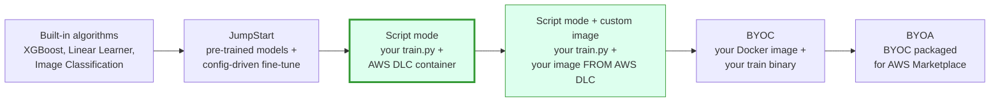
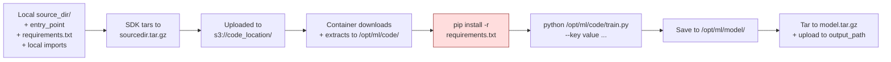
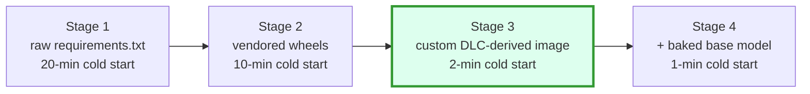
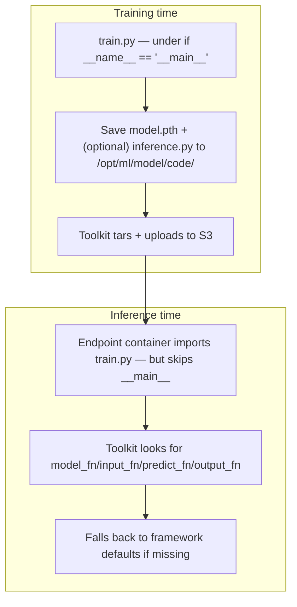

# Chapter 24 — Script Mode: TensorFlow, PyTorch, HuggingFace, Sklearn

> **Goal of this chapter:** to make you fluent in the *one* SageMaker training pattern that roughly 70% of real-world model owners actually use — bring your own `train.py`, point an AWS-provided framework container at it, hit `.fit()`, and let SageMaker handle the container, data plumbing, rendezvous, and artifact upload. By the end you should be able to write a SageMaker-compliant `train.py` from a blank file; instantiate the right framework Estimator for any of the five supported frameworks; configure distributed training via `distribution=` without writing a Dockerfile; test locally with `instance_type='local'`; and explain when *not* to use script mode and reach for BYOC (Ch 25) or JumpStart (Ch 26).

> **Primary internal sources:** [`notes/ch24_docs.md`](../../../research_inputs/14_aws_ml_engineer_associate/notes/ch24_docs.md) (SDK v2 + toolkit reference); [`notes/ch24_practice.md`](../../../research_inputs/14_aws_ml_engineer_associate/notes/ch24_practice.md) (2025–2026 industry stack); [`notes/01_sagemaker_core.md`](../../../research_inputs/14_aws_ml_engineer_associate/notes/01_sagemaker_core.md) §3.1 container directory contract, §3.2 script mode vs. BYOC, §4 distributed training.

> **Exam tasks targeted:** **Task 2.2** ("Use SageMaker AI script mode with SageMaker AI–supported frameworks") is home base. The same Estimator surface is the substrate for **Task 2.3** (HPO — Ch 31) and **Task 3.1** (deployment — the `inference.py` contract in §10).

---

## 24.0 Why script mode dominates: the 70/10/10/10 split

The MLA-C01 blueprint elevates script mode to a first-class skill (Task 2.2 is literally named after it). AWS doesn't publish official adoption numbers, but the honest split — synthesized from the volume of AWS blog samples, the `aws-samples/amazon-sagemaker-script-mode` repo, and the relative footprint of script-mode vs. BYOC docs — looks like this:

| Mode | Typical user | Share of real training jobs |
| --- | --- | --- |
| **Built-in algorithms** (XGBoost, Linear Learner) | Tabular baselines, ETL teams who don't own the model | ~10% |
| **JumpStart fine-tune** | PoC velocity, non-ML engineers | ~10% |
| **Script mode** (managed container + your `train.py`) | **Serious ML teams** — PyTorch and HuggingFace dominate | **~70%** |
| **BYOC** (your Docker image to ECR) | Custom CUDA, JAX, regulated base-image control | ~10% |

If you remember nothing else from §24.0, remember the 70%. Script mode is *not* an intermediate stop on the way to BYOC. The exam loves to phrase BYOC as "advanced," but in production the advanced option is *script mode plus a custom image baked from an AWS DLC base* — toolkit conventions plus zero `requirements.txt` install latency. §5 walks the progression.

What "script mode" means, concretely:

1. You instantiate a framework Estimator (`PyTorch`, `TensorFlow`, `HuggingFace`, `SKLearn`, `XGBoost`) from the SageMaker Python SDK.
2. You pass `entry_point='train.py'` and (optionally) `source_dir='./src'`.
3. The SDK uploads your code to S3 as a `sourcedir.tar.gz` and calls `CreateTrainingJob`.
4. SageMaker launches an AWS-published Deep Learning Container (DLC) for the framework/version you picked.
5. The container's entrypoint runs `sagemaker-training-toolkit`, which downloads your tarball to `/opt/ml/code/`, runs `pip install -r requirements.txt` if present, sets all the `SM_*` environment variables, and executes `python /opt/ml/code/train.py --key value ...`.
6. Your script trains, saves to `/opt/ml/model/`, exits 0.
7. The toolkit tars `/opt/ml/model/` into `model.tar.gz` and uploads to `s3://{output_path}/{job_name}/output/model.tar.gz`.

No Dockerfile. No ECR push. No `train` binary on `$PATH`. Just Python. That is the entire offer.

### 24.0.1 Where script mode sits on the "how custom is your code?" spectrum



**Sweet spot.** You have a Python training script, you don't want to maintain a Dockerfile, and the framework you need (TensorFlow / PyTorch / HuggingFace / SKLearn / XGBoost / MXNet [legacy]) has an AWS Deep Learning Container. Script mode wins.

**Out of sweet spot.** You need JAX, a custom CUDA kernel, Triton runtime, a specific MKL build, or a system library that AWS DLCs don't ship → BYOC (Chapter 25). You're going to sell your algorithm on AWS Marketplace → BYOA. You want a foundation-model pretraining run that lasts weeks on hundreds of GPUs → HyperPod (Chapter 32).

### 24.0.2 What the exam tests

Task 2.2 questions cluster around three competencies the chapter is organized to make automatic:

1. **When to use script mode.** "Working PyTorch script, minimum operational overhead" → `PyTorch` Estimator with `entry_point='train.py'`. Wrong: "Build a Docker image" (BYOC, too much work). Wrong: "Use Autopilot" (doesn't accept arbitrary scripts).
2. **The script contract.** "Where does SageMaker expect the trained model?" → `/opt/ml/model/` (or `SM_MODEL_DIR`). Distractors reliably include `/tmp/model`, `/opt/ml/output/data`, `~/model`.
3. **Distributed training without a Dockerfile.** "Enable PyTorch DDP on multi-node with AWS-optimized AllReduce" → `distribution={"smdistributed": {"dataparallel": {"enabled": True}}}` paired with EFA-equipped instances (or `torch_distributed` for the modern path).

---

## 24.1 The SageMaker Python SDK framework Estimators

### 24.1.1 The five (six) framework Estimator classes

All five live in the SDK v2. Each inherits from `sagemaker.estimator.Framework` → `EstimatorBase`. Parameter surface is shared; only `framework_version`, `py_version`, `distribution`, and framework-specific kwargs differ.

| Estimator class | Import | Picks the DLC for | When to use |
| --- | --- | --- | --- |
| `sagemaker.tensorflow.TensorFlow` | `from sagemaker.tensorflow import TensorFlow` | TensorFlow 2.x | Existing Keras / TFX estates; LiteRT (TF Lite) edge deployment targets; CV with `tf.distribute` strategies. |
| `sagemaker.pytorch.PyTorch` | `from sagemaker.pytorch import PyTorch` | PyTorch (1.13+, 2.x) | Any greenfield deep-learning workload. The default 2026 choice for new projects. Distributed via `torch.distributed` / FSDP / DDP. |
| `sagemaker.huggingface.HuggingFace` | `from sagemaker.huggingface import HuggingFace` | HF DLC bundling `transformers` + `accelerate` + `peft` + `bitsandbytes` + the right CUDA, wrapping either a PT or TF base | **The dominant entry point for NLP/LLM training and fine-tuning on AWS.** See §24.1.4. |
| `sagemaker.sklearn.SKLearn` | `from sagemaker.sklearn import SKLearn` | Scikit-learn | Classical ML on tabular data; small workloads; one-instance training. **Does not support distributed training.** |
| `sagemaker.xgboost.XGBoost` | `from sagemaker.xgboost import XGBoost` | XGBoost (script mode, not the built-in algorithm) | When you want custom feature engineering co-located with training in one script, vs. using the built-in XGBoost algorithm. |
| `sagemaker.mxnet.MXNet` | `from sagemaker.mxnet import MXNet` | MXNet 1.9 (final release) | **Legacy.** MXNet is no longer actively developed. Appears in old exam questions; pick TF/PT for any greenfield. |

### 24.1.2 The Estimator parameter table (the one you must know)

Grouped by intent — all appear verbatim in SDK v2 docs and reliably on the exam:

| Concern | Parameters |
| --- | --- |
| **What code runs** | `entry_point` (script filename), `source_dir` (tarred to `/opt/ml/code/`), `dependencies` (additional dirs on `PYTHONPATH`) |
| **What container** | `framework_version`, `py_version`, `image_uri` (override DLC with custom image — Stage 3 in §5) |
| **What hardware** | `instance_type` (incl. `'local'`/`'local_gpu'`), `instance_count` (`>1` needs `distribution`), `volume_size` |
| **What data** | `.fit(inputs={})` — channel names → S3 URIs; become `SM_CHANNEL_<NAME>` |
| **What hyperparams** | `hyperparameters` — both `/opt/ml/input/config/hyperparameters.json` and CLI args `--key value` |
| **What distribution** | `distribution` — see §4. Required when `instance_count > 1`. |
| **What gets saved** | `output_path` (`model.tar.gz`), `code_location` (`sourcedir.tar.gz`), `model_dir` (TF-specific), `checkpoint_s3_uri` (synced from `/opt/ml/checkpoints/`; required for Spot), `checkpoint_local_path` |
| **What gets observed** | `metric_definitions` (stdout regex → CloudWatch metrics — required for HPO), `enable_sagemaker_metrics`, `disable_profiler` |
| **What's secured** | `enable_network_isolation` (no internet egress, breaks pip install), `subnets`/`security_group_ids` (VPC), `enable_inter_container_traffic_encryption`, `volume_kms_key`, `output_kms_key` |
| **What's cost-managed** | `use_spot_instances`/`max_wait`/`max_run` (Spot), `keep_alive_period_in_seconds` (Warm Pools — amortize pip install across HPO trials), `tags` |

### 24.1.3 A canonical PyTorch example — the pattern you reuse

```python
from sagemaker.pytorch import PyTorch
from sagemaker import get_execution_role

pt_estimator = PyTorch(
    entry_point='train.py', source_dir='./src',     # ./src contains train.py + requirements.txt
    role=get_execution_role(),
    framework_version='2.1.0', py_version='py310',
    instance_type='ml.p4d.24xlarge', instance_count=2,
    hyperparameters={'epochs': 10, 'batch-size': 64, 'learning-rate': 1e-4},
    distribution={'smdistributed': {'dataparallel': {'enabled': True}}},
    metric_definitions=[
        {'Name': 'train:loss', 'Regex': r'train_loss=([0-9\.]+)'},
        {'Name': 'val:acc',    'Regex': r'val_acc=([0-9\.]+)'},
    ],
    output_path='s3://my-bucket/jobs/',
    checkpoint_s3_uri='s3://my-bucket/ckpts/',
    use_spot_instances=True, max_run=24*3600, max_wait=48*3600,
    enable_sagemaker_metrics=True,
    tags=[{'Key': 'project', 'Value': 'recsys'}],
)

pt_estimator.fit({
    'training':   's3://my-bucket/data/train/',
    'validation': 's3://my-bucket/data/val/',
})
```

The two channels `training` and `validation` become `SM_CHANNEL_TRAINING` and `SM_CHANNEL_VALIDATION` inside the container. `fit()` returns when the job is `Completed` (or raises on `Failed`).

### 24.1.4 The HuggingFace Estimator — the quiet 2026 default for NLP/LLM

Between 2021 and 2026, AWS and HuggingFace co-developed a SageMaker Estimator that became the path of least resistance for any transformer training, fine-tuning, or RLHF workload. Most AWS ML blog posts on LLM fine-tuning now use it without explanation:

```python
from sagemaker.huggingface import HuggingFace

hf_estimator = HuggingFace(
    entry_point='train.py',
    source_dir='./scripts',
    instance_type='ml.p4d.24xlarge',
    instance_count=2,
    role=role,
    transformers_version='4.36',
    pytorch_version='2.1',
    py_version='py310',
    hyperparameters={'model_id': 'meta-llama/Llama-2-7b-hf', 'epochs': 3},
    distribution={'torch_distributed': {'enabled': True}},
)
hf_estimator.fit({'train': train_s3_uri})
```

Why this became the default:

1. **The container is the integration.** The HF DLC bakes in `transformers`, `accelerate`, `datasets`, `peft`, `trl`, `bitsandbytes`, and matching NCCL/CUDA. Pre-tested together. No CUDA-toolkit drift.
2. **`Trainer` handles `/opt/ml/...` conventions.** With `TrainingArguments(output_dir='/opt/ml/model')`, `save_model()` puts files in the right place and SageMaker tars+uploads automatically. (Caveat: §9 on > 5 GB tarballs.)
3. **Spot + checkpoint + resume is *actually* easy.** `use_spot_instances=True`, `checkpoint_s3_uri=...`, `TrainingArguments(save_strategy='steps', save_steps=500, output_dir='/opt/ml/checkpoints')` and SageMaker syncs transparently.
4. **PEFT / LoRA / QLoRA is first-class.** Pair with `torch_distributed` and you can QLoRA-fine-tune a 70B model on 2× p4d.24xlarge without writing a line of NCCL code.

⚠️ **Exam alert — HuggingFace Estimator picks.** The HF Estimator wraps *either* PyTorch *or* TensorFlow DLC. Pass `pytorch_version` *or* `tensorflow_version`, not both (SDK error). Always pair with `transformers_version`. On the exam, "fine-tune a Hugging Face model with minimum overhead" → `HuggingFace` Estimator with `pytorch_version`, *not* a `PyTorch` Estimator with `pip install transformers` (trades away pre-tested CUDA compatibility, adds 5–10 minutes per job).

**The Anthropic footnote.** Anthropic does NOT use the HF Estimator — they train on Trainium with custom orchestration co-engineered with Annapurna Labs. The HF Estimator is the tool for the *next 9,999 teams* who fine-tune on their own data. Exam shapes: "fine-tune Llama on support transcripts" → HF Estimator + script mode. "Train 70B from scratch over 4 weeks on 1,000 GPUs" → HyperPod (Ch 32).

### 24.1.5 PyTorch over TensorFlow — the 2022–2026 shift

AWS docs treat TF and PyTorch as peers. They are not, anymore. By 2026, PyTorch is in ~85% of NeurIPS-class papers, ~37.7% of ML job postings (vs ~32.9% for TF; crossover 2023–2024), and is the default for new projects. TensorFlow has a long tail in TFX/Keras estates and TF Lite/LiteRT edge.

Implications for script mode:

- Greenfield transformer / generative model → **PyTorch** (better: **HuggingFace**, which is PyTorch underneath).
- Existing TFX pipeline, retraining a CNN → **keep TF**.
- Mobile/edge to millions of devices → TF Lite / LiteRT still wins.

**Exam trap**: don't pick TF just because the question shows a Keras snippet. Look at what the *organization* is doing. A bank with a 5-year TF estate stays on TF. A 2026 startup fine-tuning Mistral picks PyTorch + HF.

---

## 24.2 The training script contract — `train.py`

### 24.2.1 Anatomy of the canonical `train.py`

```python
import argparse, json, logging, os, sys
import torch, torch.nn as nn, torch.optim as optim
from torch.utils.data import DataLoader

logger = logging.getLogger(__name__); logger.setLevel(logging.INFO)
logger.addHandler(logging.StreamHandler(sys.stdout))


def parse_args():
    p = argparse.ArgumentParser()
    # Hyperparameters (from --key value)
    p.add_argument('--epochs',        type=int,   default=10)
    p.add_argument('--batch-size',    type=int,   default=32)
    p.add_argument('--learning-rate', type=float, default=1e-3)
    p.add_argument('--model-name',    type=str,   default='resnet50')

    # SageMaker-injected paths (read from env)
    p.add_argument('--model-dir',  default=os.environ['SM_MODEL_DIR'])
    p.add_argument('--train-dir',  default=os.environ['SM_CHANNEL_TRAINING'])
    p.add_argument('--val-dir',    default=os.environ['SM_CHANNEL_VALIDATION'])
    p.add_argument('--output-dir', default=os.environ['SM_OUTPUT_DATA_DIR'])

    # Distributed context
    p.add_argument('--hosts',        type=list, default=json.loads(os.environ['SM_HOSTS']))
    p.add_argument('--current-host',            default=os.environ['SM_CURRENT_HOST'])
    p.add_argument('--num-gpus',     type=int,  default=int(os.environ['SM_NUM_GPUS']))
    return p.parse_args()


def train(args):
    device = torch.device('cuda' if torch.cuda.is_available() else 'cpu')
    model = build_model(args.model_name).to(device)
    optimizer = optim.AdamW(model.parameters(), lr=args.learning_rate)
    criterion = nn.CrossEntropyLoss()
    train_loader = make_loader(args.train_dir, args.batch_size)

    for epoch in range(args.epochs):
        model.train()
        for x, y in train_loader:
            x, y = x.to(device), y.to(device)
            optimizer.zero_grad()
            loss = criterion(model(x), y); loss.backward(); optimizer.step()
            # IMPORTANT: print metrics in a regex-friendly format
            logger.info(f'epoch={epoch} train_loss={loss.item():.6f}')
        logger.info(f'epoch={epoch} val_acc={val_acc:.6f}')

    # PyTorch convention: model.pth in /opt/ml/model
    torch.save(model.state_dict(), os.path.join(args.model_dir, 'model.pth'))


if __name__ == '__main__':
    train(parse_args())
```

### 24.2.2 The six structural rules

Every one of these is exam-relevant and production-load-bearing:

1. **`if __name__ == '__main__':` is mandatory.** SageMaker's *inference* path will later import this same script to find `model_fn`, `input_fn`, etc. (See §10.) Without the guard, training code runs on every endpoint invocation — your endpoint silently retrains the model on the input data and returns nonsense. Bizarre import-time errors are the second symptom; "subprocess failed" with cryptic exit codes is the third.
2. **Use `argparse`.** SageMaker translates each hyperparameter dict entry to a `--key value` CLI argument. `--batch-size 64` ↔ hyperparameter `'batch-size': 64`. Note the *hyphen* form on the CLI, *underscore* in `args.batch_size` (argparse converts).
3. **Read paths from `SM_*` environment variables.** Never hardcode `/opt/ml/...`. This makes the same script run locally (where these variables can be set by hand or by local mode) and on SageMaker without modification.
4. **Save to `SM_MODEL_DIR` (= `/opt/ml/model/`).** Anything you write here is captured into `model.tar.gz` and uploaded to S3. Side artifacts (training curves, val predictions, confusion matrices) go to `SM_OUTPUT_DATA_DIR` (= `/opt/ml/output/data/`), which is uploaded separately and *not* included in the model tarball.
5. **Print metrics in a regex-matchable format.** Pair with `metric_definitions=` on the Estimator to surface them in CloudWatch and make them visible to HPO (Chapter 31). Without this, your `print('train_loss=...')` lines stay in CloudWatch Logs but don't become CloudWatch *metrics*, and HPO has nothing to optimize on.
6. **Exit code matters.** Non-zero → job marked Failed. SageMaker reads `/opt/ml/output/failure` if present for the displayed failure reason.

⚠️ **Exam alert — `/opt/ml/model/` vs `/opt/ml/output/data/`.** The single most-tested fact in the entire script-mode surface: **the model goes to `/opt/ml/model/`; side artifacts go to `/opt/ml/output/data/`.** Distractors on the exam reliably include `/tmp/model`, `/opt/ml/output/`, `~/model`, and `/var/sagemaker/model`. All wrong. `SM_MODEL_DIR` resolves to `/opt/ml/model`; `SM_OUTPUT_DATA_DIR` resolves to `/opt/ml/output/data`. Anything in `/opt/ml/model/` is tarred into `model.tar.gz`; anything in `/opt/ml/output/data/` is uploaded as `output.tar.gz` separately. Confusing the two means either (a) you saved your model to a path that's never uploaded → empty `model.tar.gz` in S3, or (b) you stuffed loss plots into the model tarball and ballooned its size past 5 GB, breaking deployment. See gotcha #1 and gotcha #5 in §9.

### 24.2.3 The `SM_*` environment variables you reach for most

The toolkit populates these from `/opt/ml/input/config/{hyperparameters,inputdataconfig,resourceconfig}.json` at container startup:

| Variable | Example | What it gives you |
| --- | --- | --- |
| `SM_MODEL_DIR` | `/opt/ml/model` | Where to save the final model (tarred into `model.tar.gz`). |
| `SM_OUTPUT_DATA_DIR` | `/opt/ml/output/data` | Side artifacts (uploaded separately as `output.tar.gz`, *not* in model tarball). |
| `SM_CHANNEL_<NAME>` | `/opt/ml/input/data/training` | File-mounted path for each channel. Matches the key in `fit({'training': ...})`, uppercased. |
| `SM_HPS` | `{"epochs":"10","batch-size":"64"}` | All hyperparameters as JSON (values are strings). |
| `SM_NUM_GPUS` | `8` | GPUs visible to this container. |
| `SM_HOSTS` | `["algo-1","algo-2"]` | All hosts in cluster, sorted. `algo-1` is rank 0 by convention. |
| `SM_CURRENT_HOST` | `algo-1` | This container's hostname. |
| `SM_NETWORK_INTERFACE_NAME` | `eth0` | NIC for inter-host traffic — used by MPI/NCCL/SMDDP rendezvous. |

Canonical reference: [`sagemaker-training-toolkit` ENVIRONMENT_VARIABLES.md](https://github.com/aws/sagemaker-training-toolkit/blob/master/ENVIRONMENT_VARIABLES.md).

---

## 24.3 Source-code packaging — `source_dir`, `requirements.txt`, `dependencies`

### 24.3.1 The packaging pipeline



The pink step (`pip install`) is the one that bites teams. We unpack the cost in §24.5.

### 24.3.2 The three packaging knobs

- **`entry_point='train.py'`** — the script to execute. Required.
- **`source_dir='./src'`** — directory packaged into `sourcedir.tar.gz`. `train.py` must live inside. Optional but typical.
- **`dependencies=['./mylib', './mylib2']`** — additional local directories shipped alongside, added to `PYTHONPATH`. Use for shared internal libs outside `source_dir`.

Container sees `/opt/ml/code/` with `train.py`, `requirements.txt`, any local imports, and `dependencies` directories.

### 24.3.3 `requirements.txt` semantics

Place `requirements.txt` at the root of `source_dir`. At job startup, the toolkit runs `pip install -r /opt/ml/code/requirements.txt`. Consequences:

- **Cost.** Adds 30–120 seconds to startup for trivial requirements, 10–25 minutes for heavy ones (anything with `flash-attn`, `bitsandbytes`, `xformers`, or other CUDA-compiled deps). On a 4× `ml.p4d.24xlarge` job at ~$32/hr per instance, that's ~$60 of pure pip-install cost *per run*.
- **Reproducibility.** *Pin versions* (`numpy==1.26.4`, not `numpy>=1.26`). DLCs already pin transitively; an unconstrained requirement can silently downgrade `torch`.
- **Caching.** SageMaker does *not* cache `pip install` across jobs. Warm Pools (`keep_alive_period_in_seconds`) preserve the container between jobs and skip the reinstall — the standard amortization across HPO trials.
- **No internet?** If `enable_network_isolation=True`, the container can't reach PyPI. Use a private CodeArtifact + `pip.conf` shipped in `source_dir`, or pre-bake into a custom DLC (Stage 3 in §5).

⚠️ **Exam alert — `requirements.txt` cold-start cost.** The exam will frame this as a cost-optimization scenario: *"A team's SageMaker training jobs take 14 minutes to start due to package installation. What is the most cost-effective fix?"* The right answer is **build a custom Docker image from the AWS DLC base, pre-install dependencies, push to ECR, reference via `image_uri`.** The wrong-but-tempting answer is "switch to BYOC" — that abandons all the SageMaker toolkit conventions and forces you to reimplement the `/opt/ml/...` contract yourself. *Extending* the DLC is the right answer; *replacing* it is wrong. Distractors will also include "use a larger instance" (irrelevant) and "increase `max_run`" (irrelevant — the install still happens). See §5.

---

## 24.4 Distributed training via `distribution=`

The `distribution=` parameter selects a launcher. SageMaker handles process rendezvous, MPI / `torchrun` invocation, and EFA configuration; your script handles `init_process_group` and per-rank logic.

### 24.4.1 The six distribution strategies

| Strategy | `distribution=` value | Frameworks | What runs |
| --- | --- | --- | --- |
| **Horovod / MPI** | `{"mpi": {"enabled": True, "processes_per_host": N, "custom_mpi_options": "-x ..."}}` | TF, PT (legacy) | `mpirun` on rank 0, sets up SSH between nodes, runs your script under `mpirun`. Use `hvd.init()` in script. |
| **PyTorch DDP via mpirun** | `{"pytorchddp": {"enabled": True}}` | PyTorch ≥ 1.12.0 | Uses `mpirun` under the hood; expects `torch.distributed.init_process_group(backend='nccl')` in script. |
| **Torch Distributed (torchrun)** | `{"torch_distributed": {"enabled": True}}` | PyTorch ≥ 1.13.1, Trainium | Uses `torchrun` — the modern way. Passes `LOCAL_RANK`/`WORLD_SIZE` automatically. For Trainium, `backend='xla'`. |
| **SMDDP — SageMaker Distributed Data Parallel** | `{"smdistributed": {"dataparallel": {"enabled": True}}}` | PyTorch, HuggingFace (PT backend) | Sets up SMDDP collective backend. In script: `import smdistributed.dataparallel.torch.torch_smddp` + `init_process_group(backend='smddp')`. Only worth it on EFA-equipped instances. |
| **SMP v2 — Model Parallel** | `{"smdistributed": {"modelparallel": {"enabled": True, "parameters": {...}}}}` | PyTorch | Wraps FSDP with tensor / context / expert parallelism. For >70B-param models. |
| **Parameter Server** | `{"parameter_server": {"enabled": True}}` | TF | TF's `ParameterServerStrategy`. Mostly legacy. |

### 24.4.2 PyTorch DDP — pick `torch_distributed` for new code

```python
PyTorch(
    entry_point='train_ddp.py',
    source_dir='./src',
    role=role,
    framework_version='2.1.0',
    py_version='py310',
    instance_type='ml.p4d.24xlarge',
    instance_count=4,
    distribution={'torch_distributed': {'enabled': True}},
)
```

In `train_ddp.py`:

```python
import os, torch
import torch.distributed as dist
from torch.nn.parallel import DistributedDataParallel as DDP

dist.init_process_group(backend='nccl')           # NCCL is the default on GPU
local_rank = int(os.environ['LOCAL_RANK'])        # injected by torchrun
torch.cuda.set_device(local_rank)
model = DDP(model.to(local_rank), device_ids=[local_rank])
```

`torchrun` calculates `WORLD_SIZE`, `LOCAL_RANK`, `RANK`, `MASTER_ADDR`, `MASTER_PORT` for you — no need to derive them from `SM_HOSTS`.

### 24.4.3 SMDDP — when and how

Pick SMDDP **only** when (a) you have 2+ instances and (b) those instances are EFA-equipped (`ml.p3dn.24xlarge`, `ml.p4d.24xlarge`, `ml.p4de.24xlarge`, `ml.p5.48xlarge`, `ml.trn1.32xlarge`). Single-node training: NCCL is fine, don't bother.

```python
distribution={'smdistributed': {'dataparallel': {'enabled': True}}}
```

In script:

```python
import smdistributed.dataparallel.torch.torch_smddp  # registers smddp backend
import torch.distributed as dist
dist.init_process_group(backend='smddp')
```

SMDDP replaces NCCL's AllReduce + AllGather with EFA-optimized implementations. Speedup of 20–40% on inter-node gradient sync vs. NCCL is typical on P4d/P5. AWS publishes the [SMDDP intro](https://docs.aws.amazon.com/sagemaker/latest/dg/data-parallel-intro.html) with the supported-instance matrix as the source of truth.

### 24.4.4 HuggingFace Accelerate + FSDP/DeepSpeed

HF Accelerate handles distributed boilerplate transparently. Pair the `HuggingFace` Estimator with `distribution={'torch_distributed': {'enabled': True}}` and use `accelerate.Accelerator()` in the script — it auto-detects launcher and matches DDP/FSDP/DeepSpeed transparently. For DeepSpeed, ship `ds_config.json` in `source_dir`.

The layered mental model — **these compose, they don't compete**:

```
Application:   HuggingFace Trainer / Accelerate
Sharding:      PyTorch FSDP  |  DeepSpeed ZeRO  |  SMP v2
Collective:    SMDDP (EFA-optimized) | NCCL (fallback)
Infra:         SageMaker Training Job | HyperPod
```

- **FSDP** — native PyTorch. Shards parameters/gradients/optimizer states. Right default for most 2–8 GPU fine-tunes; HF Trainer has first-class support via `TrainingArguments(fsdp=...)`.
- **DeepSpeed** — Microsoft's library, more mature on **CPU/NVMe offloading**. Wins when optimizer state alone exceeds aggregate GPU VRAM (30B+ on g5/g6 vs p4d). One IBM/ETH benchmark: FSDP ~60% GPU util, DDP ~57%, DeepSpeed ZeRO ~45%. *Throughput on a fitting workload → FSDP wins; fitting a model that wouldn't otherwise fit → DeepSpeed wins.*
- **SMP v2** — AWS library, now refactored to wrap FSDP with AWS-specific optimizations. Use after a working FSDP baseline.

### 24.4.5 MPI / Horovod — still on the exam, mostly TF

```python
TensorFlow(
    entry_point='train_horovod.py',
    source_dir='./src',
    framework_version='2.13.0',
    py_version='py310',
    instance_type='ml.p3.16xlarge',
    instance_count=2,
    distribution={
        'mpi': {
            'enabled': True,
            'processes_per_host': 8,          # = number of GPUs per instance
            'custom_mpi_options': '-x NCCL_DEBUG=INFO',
        }
    },
)
```

In script:

```python
import horovod.tensorflow.keras as hvd
hvd.init()
gpus = tf.config.experimental.list_physical_devices('GPU')
tf.config.experimental.set_visible_devices(gpus[hvd.local_rank()], 'GPU')
opt = hvd.DistributedOptimizer(opt)
callbacks = [hvd.callbacks.BroadcastGlobalVariablesCallback(0)]
```

⚠️ **Exam alert — distribution config selection.** A reliable trap: a question gives you `instance_count=4` and a PyTorch script, then asks why training only uses one GPU. The answer is that **`distribution=` is missing**. Without it, your script runs as a single process on the first node and the other three sit idle, billing you 4× the cost for 1× the work. Always set `distribution` when `instance_count > 1`. The picker:

- PyTorch ≥ 1.13, EFA-equipped P-family → `{'smdistributed': {'dataparallel': {'enabled': True}}}` (or `torch_distributed` if you don't need SMDDP's AllReduce optimization).
- PyTorch ≥ 1.13, non-EFA (G5, etc.) → `{'torch_distributed': {'enabled': True}}`.
- PyTorch < 1.13 → `{'pytorchddp': {'enabled': True}}` (mpirun-based).
- TensorFlow + Horovod → `{'mpi': {'enabled': True, 'processes_per_host': N}}`.
- Trainium → `{'torch_distributed': {'enabled': True}}` with `backend='xla'` in your script.
- SKLearn — **doesn't support distributed training at all.** `instance_count > 1` errors out.

---

## 24.5 The four-stage production progression for packaging

Every team running serious SageMaker training eventually asks: *"Why does the job take 14 minutes to start before any GPU work happens?"* Answer: `requirements.txt` is installing 40 packages, three of which compile native extensions on every job start. The mature progression:

**Stage 1 — Raw `requirements.txt`.** Pinned, in `source_dir/requirements.txt`. Fine for one-off experiments. Painful at >10 jobs/day. Heavy compile deps like `flash-attn` (~8 min) and `bitsandbytes` (~3 min) recompile every job.

**Stage 2 — Vendor the wheels.** Pre-build wheels for slow packages, store in S3, install with `pip install --no-index --find-links s3://...`. Cuts compile time, still pays install tax.

**Stage 3 — Bake a custom image FROM the AWS DLC base.** Start from the AWS DLC, `pip install` deps at *image build time*, push to ECR, reference via `image_uri` on the Estimator.

```dockerfile
FROM 763104351884.dkr.ecr.us-east-1.amazonaws.com/huggingface-pytorch-training:2.1-transformers4.36-gpu-py310-cu118-ubuntu20.04

# Slow-compiling deps installed once at build time, not on every job start
RUN pip install --no-cache-dir \
    flash-attn==2.5.0 \
    bitsandbytes==0.43.0 \
    peft==0.10.0 \
    trl==0.8.6 \
    deepspeed==0.14.0

# Do NOT COPY your training script — SageMaker mounts it at runtime to /opt/ml/code
# Iterate on code without rebuilding the image

ENV PYTHONUNBUFFERED=1
```

You then point your Estimator at this image:

```python
PyTorch(
    entry_point='train.py',
    source_dir='./src',
    image_uri='123456789012.dkr.ecr.us-east-1.amazonaws.com/my-training:v1',
    # framework_version / py_version are no longer needed — they're baked in
    instance_type='ml.p4d.24xlarge',
    ...
)
```

Job startup drops to ~2 minutes (just the image pull on cold start; warm starts on the same instance are seconds). This is the answer to the "14-minute job startup" exam question.

**Stage 4 — Bake base model weights into the image.** For inference, teams often bake weights into the image too, avoiding the S3 download tax. For training this is rarer (weights change), but for fine-tuning the base model (Llama, Mistral) can be baked in.

### The packaging pipeline visualized



**The architectural lesson** — and the one the exam tests — is that Stage 3 is *still script mode*. You are extending the DLC, not replacing it. The SageMaker training toolkit, the `/opt/ml/...` contract, the `SM_*` env vars, the `distribution=` machinery — all still apply. BYOC (Chapter 25) is what you do when no DLC works as a base, not what you do to speed up `pip install`.

---

## 24.6 Local mode — develop without a single CreateTrainingJob

### 24.6.1 What it does

`instance_type='local'` (CPU) or `'local_gpu'` (GPU) tells the SDK to run the job in a Docker container on your Studio kernel / laptop. Same DLC pulled from ECR, same toolkit, same `SM_*` env vars. The canonical way to debug before incurring P4d costs.

```python
estimator = PyTorch(
    entry_point='train.py',
    source_dir='./src',
    role=role,
    framework_version='2.1.0',
    py_version='py310',
    instance_type='local',                   # ← key change
    instance_count=1,
)
estimator.fit({'training': 'file://./data/train/'})   # ← local file:// channels
```

Five things worth knowing:

1. **`file://` channels are mounted, not uploaded.** No S3 roundtrip — iterate fast.
2. **Multi-instance local mode is supported** with `instance_count>1` and `instance_type='local'` — the SDK spins up multiple Docker containers on the same host. Useful for catching rendezvous bugs.
3. **`local_gpu` requires nvidia-docker** and a working CUDA install on the host.
4. **Distributed local mode** can simulate MPI / DDP behavior end-to-end.
5. **Pricing: $0.** It's your hardware. Just the (free) ECR pull cost for AWS DLCs.

### 24.6.2 The dev loop

```
write train.py → local mode (CPU, tiny data, instance_type='local')
              → fix → local mode (single GPU, instance_type='local_gpu')
              → small real instance (ml.g5.xlarge × 1, real S3 channel)
              → full run (ml.p4d.24xlarge × N, distributed)
```

Each step catches a different failure class. Skipping local mode and going straight to P4d is how people light $300/hr on fire chasing a typo.

### 24.6.3 The CI pattern that works

Mature teams converge on: lint → unit tests (no SageMaker) → **local-mode smoke test** (real container, fake-tiny data, `instance_type='local'`, `max_run=300`) → real submit only from main with approval. The local-mode smoke test catches ~90% of "forgot to update `requirements.txt`" or "checkpoint path typo" errors. The remaining 10% — distributed-only issues that only manifest on multi-GPU — require real instances but are rare once script mode + local mode + CI is in place.

### 24.6.4 Local mode limits

Doesn't simulate distributed training across *physical* instances (single-host multi-process only). Doesn't catch IAM / VPC / KMS issues. GPU local mode requires Docker with NVIDIA runtime — unavailable on Apple Silicon (CPU-only fallback). Known papercut for Mac-based teams.

---

## 24.7 The DLC matrix and framework versions

### 24.7.1 How AWS publishes containers

Tags follow: `{account}.dkr.ecr.{region}.amazonaws.com/{repo}:{fw_version}-{cpu|gpu}-py{ver}-cu{ver}-ubuntu{ver}-sagemaker`. Example: `763104351884.dkr.ecr.us-east-1.amazonaws.com/pytorch-training:2.1.0-gpu-py310-cu121-ubuntu20.04-sagemaker`.

You almost never write the URI directly. Either pass `framework_version` + `py_version` to the Estimator (SDK looks it up), or for Processing/Inference jobs without a Framework subclass call `sagemaker.image_uris.retrieve(framework='pytorch', region='us-east-1', version='2.1.0', py_version='py310', instance_type='ml.p4d.24xlarge', image_scope='training')`.

### 24.7.2 Supported framework versions (mid-2026, indicative)

These shift quarterly; source of truth is the [SageMaker DLC release notes](https://github.com/aws/deep-learning-containers/blob/master/available_images.md):

| Framework | Recent supported versions | Python | CUDA |
| --- | --- | --- | --- |
| PyTorch | 1.13.1, 2.0.1, 2.1.0, 2.2.0, 2.3.0, 2.4.0, 2.5.1, 2.6.0 | py310 / py311 | cu121 / cu124 / cu126 |
| TensorFlow | 2.12.x, 2.13.x, 2.14.x, 2.16.x | py310 / py311 | cu118 / cu121 |
| HuggingFace | transformers 4.36, 4.42, 4.45, 4.49 (paired with PT/TF) | py310 / py311 | matches paired PT/TF |
| SKLearn | 0.23-1, 1.0-1, 1.2-1 | py3 / py310 | n/a (CPU) |
| XGBoost (script mode) | 1.3-1, 1.5-1, 1.7-1 | py3 / py310 | optional GPU |
| MXNet | 1.9.x (final) — **legacy** | py38 | cu112 |

Exam relevance: don't memorize the matrix. Know that (a) for unsupported versions you build BYOC, (b) `image_uris.retrieve()` exists, and (c) the `-sagemaker` tag suffix indicates SageMaker-customized DLCs (with profiler/debugger hooks).

### 24.7.3 What the HuggingFace DLC bundles

What makes the HF Estimator the 2026 default: the HF Trainer DLC ships with `transformers`, `accelerate`, `datasets`, `peft`, `bitsandbytes`, `trl`, `evaluate`, `tokenizers`, matching CUDA/cuDNN/NCCL, and the SageMaker training toolkit. QLoRA-fine-tune a 70B model out of the box without `requirements.txt`. Ship `requirements.txt` only for app-level extras (custom metric library, data adapter) — not the foundation model stack.

---

## 24.8 BYOM — deploying a pre-trained model with the framework Model class

Same packaging contract on the *deploy* side. Tarball your model artifact + optionally `code/inference.py` and `code/requirements.txt`:

```
model.tar.gz
├── model.pth          # or model.joblib, saved_model.pb, etc.
└── code/
    ├── inference.py
    └── requirements.txt
```

Then instantiate a framework `Model` class:

```python
from sagemaker.pytorch import PyTorchModel

model = PyTorchModel(model_data='s3://my-bucket/models/model.tar.gz', role=role,
                    framework_version='2.1.0', py_version='py310',
                    entry_point='inference.py', source_dir='code/')
predictor = model.deploy(initial_instance_count=1, instance_type='ml.g5.xlarge')
```

The standard pattern for "trained elsewhere (laptop, Databricks, on-prem), host on SageMaker." All script-mode toolkit machinery applies — including the `requirements.txt` cold-start tax. For latency-sensitive endpoints, bake into a custom image (Stage 3, §5).

### 24.8.1 The `inference.py` contract — four optional handlers

The framework's inference toolkit (`sagemaker-pytorch-inference-toolkit`, `sagemaker-tensorflow-serving-container`, `sagemaker-sklearn-container`, etc.) invokes up to four functions on each request:

| Handler | Signature | Default behavior |
| --- | --- | --- |
| `model_fn(model_dir, context=None)` | Load the model. Called once at container start. | PyTorch: looks for `model.pth` and calls `torch.load`. SKLearn: `joblib.load('model.joblib')`. TF: looks for SavedModel under `model_dir`. |
| `input_fn(request_body, content_type, context=None)` | Deserialize request. | Supports `application/json`, `text/csv`, `application/x-npy`, `application/x-image` depending on framework. |
| `predict_fn(input_object, model, context=None)` | Run inference. | Calls `model(input)` (PyTorch) or `model.predict(input)` (SKLearn). |
| `output_fn(prediction, accept_type, context=None)` | Serialize response. | Inverse of `input_fn`. |

All four are optional. Override only what you need. For SKLearn, if your model takes a NumPy array and returns one, all four defaults work and you can ship an empty `inference.py` (or omit it entirely).

For PyTorch ≥ 1.3.1, a `requirements.txt` inside `code/` is honored at endpoint startup but adds cold-start latency. Bake heavy deps into a custom inference image when latency matters (same Stage 3 pattern as training, §5).

### 24.8.2 HuggingFace — the inference toolkit auto-detects the task

The HuggingFace inference toolkit auto-detects the task from `config.json` (`task='text-classification'`, `'fill-mask'`, etc.) and runs the appropriate `pipeline()`. You usually don't need an `inference.py` at all — just `model.tar.gz` with the standard HF model artifacts:

```python
from sagemaker.huggingface import HuggingFaceModel

hf_model = HuggingFaceModel(
    model_data='s3://my-bucket/hf-model.tar.gz',
    role=role,
    transformers_version='4.36.0',
    pytorch_version='2.1.0',
    py_version='py310',
)
hf_model.deploy(instance_type='ml.g5.2xlarge', initial_instance_count=1)
```

Override `model_fn` only for custom inference logic (sliding-window attention, custom batching, prompt-templating that wraps the underlying model).

---

## 24.9 Script mode vs. BYOC — the decision matrix

Script mode = AWS-published container + your script. BYOC = your container + your binary. The boundary moves up one layer in script mode, and that has consequences:

| Concern | Script mode | BYOC |
| --- | --- | --- |
| Who patches CVEs in CUDA / cuDNN / OS? | AWS (DLC release cadence) | You |
| Who chooses framework version? | You, but only from supported DLC matrix | You |
| Where do dependencies come from? | `requirements.txt` at job start (or pre-baked into a custom DLC-derived image, Stage 3 in §5) | Baked into image at build time |
| Job startup cold time | Image pre-warmed in region; +30–90 s for `pip install`; +5–25 min if heavy compile | Image pull from ECR; longer first time, comparable to baked DLC after |
| Custom CUDA / system packages? | No (only pip-installable; otherwise extend the DLC) | Yes |
| Marketplace-eligible? | No | Yes (as BYOA) |
| GPU runtime version locked? | Yes, to the DLC's CUDA version | You choose |
| Run as non-root with specific UID? | No (DLCs run as root) | Yes |

The exam compresses this to: *"Customer wants minimum operational overhead and is happy with framework version X.Y"* → script mode. *"Customer needs a Triton inference server with a custom CUDA kernel"* → BYOC. *"Customer wants to sell algorithm on Marketplace"* → BYOA. *"Customer's preferred framework (JAX) has no DLC"* → BYOC.

### 24.9.1 The decision matrix in one table

| Situation | Pick | Why |
| --- | --- | --- |
| Standard PyTorch / TF / HF / SKLearn / XGBoost workload | **Script mode** | Zero Dockerfile maintenance, AWS handles CVEs. |
| Need a framework not in the DLC matrix (JAX/Flax) | **BYOC** | No DLC exists. |
| Need a system library not pip-installable (libsndfile dev, ffmpeg ≥ 6.0, Triton runtime) | **BYOC** (or Stage 3 custom DLC) | `requirements.txt` is pip-only; system packages need `apt-get` at build time. |
| Need a specific CUDA version different from the DLC | **BYOC** | DLC's CUDA is fixed at build. |
| Want to publish on AWS Marketplace | **BYOC → BYOA** | Marketplace listings require self-owned images. |
| Air-gapped / VPC-only with no PyPI access | Script mode + private CodeArtifact, **or** BYOC | Either pre-stage wheels or bake into image. |
| Need custom entrypoint logic, sidecar daemons | **BYOC** | Script mode launches a single Python process. |
| Multi-language training (Rust extension + Python) | Script mode if Rust ext is on PyPI; otherwise **BYOC** | |
| Container must run as non-root with specific UID | **BYOC** | DLCs run as root by default. |
| `requirements.txt` adds 14 minutes of cold start to every job | **Stage 3: custom image FROM AWS DLC** | Still script mode — extend, don't replace. |

---

## 24.10 The training-vs-inference split in script mode



Two valid layouts for inference code:

1. **Inference handlers live in `train.py`** alongside the training logic, behind the `__main__` guard. Convenient but conflates concerns.
2. **Inference handlers live in a separate `inference.py`** packaged under `code/` inside `model.tar.gz`. Cleaner, and required if your training and inference dependencies differ.

The framework `Model` class lets you point at a *different* `entry_point` and `source_dir` from the training Estimator — typical pattern: train with `entry_point='train.py'`, deploy with `entry_point='inference.py'`.

---

## 24.11 Seven common script-mode gotchas — the silent killers

The failures that cost teams the most time. Most surface only after a 4-hour run completes and you find no model in S3 — or an endpoint that won't deploy.

**1. Model not saved to `/opt/ml/model`.** Symptom: training succeeds but `model.tar.gz` is 100 bytes. Cause: script saved to `./model.pt` (cwd) or `/tmp/model/`. SageMaker only tars `/opt/ml/model`. Fix: always `os.path.join(os.environ['SM_MODEL_DIR'], ...)`. For HF, `TrainingArguments(output_dir=os.environ['SM_MODEL_DIR'])` + `trainer.save_model()`.

**2. Missing `if __name__ == '__main__':`.** Symptom: bizarre import-time errors, training runs twice, cryptic "subprocess failed". Cause: toolkit *imports* your script for inference handlers. Module-level training code runs at import time. Fix: wrap everything except imports in the guard. **Single most important pattern in script mode.**

**3. Checkpoint vs. model dir confusion.** Symptom: spot instances die and resume but training starts from scratch. Cause: checkpoints written to `/opt/ml/model/checkpoint-500/` instead of `/opt/ml/checkpoints/checkpoint-500/`. The `checkpoints` directory is continuously synced to `checkpoint_s3_uri`; the `model` directory uploads only on success. Fix: `output_dir='/opt/ml/checkpoints'` for in-training checkpoints, final model to `/opt/ml/model`. Two directories, two purposes.

**4. TensorBoard logs that don't appear (reserved paths).** Symptom: `TensorBoardOutputConfig` set, no logs in Studio. Real cause: `TensorBoardOutputConfig.local_path` **cannot start with `/opt/ml`, `/tmp`, or `/usr/local/nvidia`** — AWS reserves these. Use `/local_tensorboard_log_dir` or similar. [GitHub #3620](https://github.com/aws/amazon-sagemaker-examples/issues/3620).

**5. Model tarball > 5 GB blocking deployment.** Symptom: endpoint deploy fails with "model artifact too large" or download takes forever. Cause: HF Trainer with `output_dir='/opt/ml/model'` and no checkpoint limits saves every intermediate checkpoint into the model tarball. Fix: `save_total_limit=1`, or write intermediate checkpoints to `/opt/ml/checkpoints` and only final to `/opt/ml/model`.

**6. Wrong `source_dir`.** Symptom: `pip install -r requirements.txt` fails / "no module named X". Cause: `source_dir='./scripts/train.py'` (a file path) or omitted entirely. Fix: `source_dir='./scripts/'` with `entry_point='train.py'` inside it. The entire directory is tarred and shipped.

**7. Distributed training without distribution config.** Symptom: `instance_count=4` but only one GPU used, 31 idle, bills 4× expected. Cause: forgot `distribution={'torch_distributed': {'enabled': True}}` (or `smdistributed` / `mpi`). Without it, script runs as single process on `algo-1`. Fix: always set `distribution` when `instance_count > 1`, *and* make sure the script uses `torch.distributed` / `accelerate` / HF Trainer's distributed paths. Config and script have to agree.

---

## 24.12 The three fine-tune doors — Bedrock, JumpStart, or script mode + HF

The most common architecture decision in 2026: a team has a use case ("classify support tickets," "summarize legal contracts," "extract structured data from PDFs") and wants to fine-tune. They have three doors.

| Path | Effort | Customization | Cost shape | Data-residency control |
| --- | --- | --- | --- | --- |
| **Bedrock fine-tune** | Lowest | Limited (curated FMs only — Cohere Command R, Llama 2, Claude Haiku at time of writing) | Pay per token, no idle cost; serverless inference | High (AWS account; data not used to train base) |
| **JumpStart fine-tune** | Low | Wider model selection (Llama, Mistral, FlanT5, hundreds more) but config-driven UI/SDK | Pay for training instance + endpoint while running | High |
| **Script mode + HF Trainer** | Medium-high | Total — any model on HF Hub, any PEFT method (LoRA, QLoRA, DoRA), any custom loop | Pay for training instance + endpoint; cheapest at scale with consistent traffic | Total (full container/code control) |

### 24.12.1 The decision rule

```
If model is on Bedrock's supported-for-fine-tune list AND your data fits the
Bedrock fine-tune format AND you don't need a custom loss/objective:
    → Bedrock fine-tune. Done in hours, not weeks.

Else if you want a popular open model (Llama-3, Mistral, Falcon) AND vanilla
SFT/LoRA/QLoRA is enough AND you want minimal scripting:
    → JumpStart fine-tune (Chapter 26). UI-driven, no custom code,
      registers to Model Registry.

Else if you need:
  - Custom loss, RLHF, DPO, KTO, ORPO
  - A model not in JumpStart's catalog
  - Multi-stage training (SFT then DPO)
  - Custom data collator / tokenizer behavior
  - Multi-node distributed training with custom sharding
    → Script mode + HuggingFace Estimator. The full power.
```

**Real-world frequencies.** Prototypes start in Bedrock, PoCs that need a specific open model move to JumpStart, production-grade fine-tunes that the org *owns* the IP for almost always land on script mode + HuggingFace. Bedrock fine-tune is best when you want a model "with a slight accent change" — same capabilities, your tone of voice. Script mode is best when you want a model that does something the base model can't.

### 24.12.2 The cost crossover

Under ~50M output tokens/day, Bedrock's serverless per-token billing is typically cheaper than running a dedicated HuggingFace endpoint, because you don't pay for idle GPU. Above that, dedicated endpoints with reserved capacity often beat per-token pricing. The break-even depends on instance type and model size — model this carefully for any production decision, but as a rule of thumb: low-volume internal tools → Bedrock; high-volume customer-facing apps with steady traffic → SageMaker endpoint.

**The MLA-C01 lesson.** The exam often presents "team has 10M domain documents and needs to fine-tune a model on them." The right answer depends on the rest of the prompt: *"minimal infrastructure management, pay only for what you use"* → Bedrock. *"Needs to deploy a custom model with full control over training hyperparameters"* → script mode + HuggingFace. *"Wants a no-code UI experience"* → JumpStart. Read the constraints, don't pattern-match on "fine-tune Llama → JumpStart."

---

## 24.13 The 2026 industry stack — what mature teams actually ship

For a team starting a fresh "fine-tune Mistral on internal data" project, the right-shaped stack:

```
Code:        HF Trainer in train.py, guarded by if __name__ == '__main__'
             Helpers in scripts/utils.py, packaged via source_dir='./scripts/'

Container:   Custom image FROM aws-dlc-huggingface-pytorch-training,
             slow-compile deps pre-installed (flash-attn, bitsandbytes, peft),
             pushed to ECR, referenced via image_uri (Stage 3 in §5)

Estimator:   HuggingFace(image_uri=..., distribution={'torch_distributed':{'enabled':True}},
             ml.p4d.24xlarge × 2, use_spot_instances=True,
             max_run=86400, max_wait=129600,
             checkpoint_s3_uri='s3://bucket/checkpoints/')

Checkpoints: TrainingArguments(output_dir='/opt/ml/checkpoints', save_steps=500,
             save_total_limit=2)         # for spot resumability
Final model: trainer.save_model('/opt/ml/model')    # gets tarred to S3

Dev loop:    Local mode → CI local-mode smoke test → real submit from main

Orchestration: Standalone retraining → direct .fit()
               Multi-step (process → train → eval → register) → Pipelines (Ch 43)
                  with TrainingStep + PipelineSession

Distributed: HF Trainer → FSDP (2-8 GPUs default)
             → DeepSpeed ZeRO-3 offload when optimizer doesn't fit
             → SMDDP auto-enabled on supported p4d/p5

Scale:       Up to ~16 GPUs / days → Training Job (this chapter)
             > 100 GPUs / multi-week → HyperPod (Ch 32)
```

The four layers worth memorizing — they **compose, they don't compete**:

1. **HF Trainer / Accelerate** (application).
2. **FSDP / DeepSpeed / SMP** (sharding strategy).
3. **SMDDP / NCCL** (collective comms).
4. **Training Job / HyperPod** (infrastructure).

---

## 24.14 Exercises

These exercises mirror the way the exam frames script-mode questions. Answers (with reasoning) are in §24.15.

### Exercise 1 — The empty `model.tar.gz`

A data scientist on your team submits a PyTorch training job. The job runs for 90 minutes, CloudWatch shows the training loss decreasing nicely, the job ends in `Completed` status, but the `model.tar.gz` in S3 is 132 bytes. The script saves the model with:

```python
torch.save(model.state_dict(), 'model.pth')
```

What is wrong, and what is the one-line fix?

### Exercise 2 — The 14-minute cold start

A team's HuggingFace training jobs take 14 minutes from `InProgress` to first GPU utilization. CloudWatch shows the time is spent in `pip install`. The `requirements.txt` includes `flash-attn`, `bitsandbytes`, `peft`, and `deepspeed`. The team submits 30+ jobs per day. Rank the following mitigations from best to worst for cost reduction, and justify:

(a) Switch to BYOC.
(b) Use Warm Pools (`keep_alive_period_in_seconds=1800`).
(c) Bake dependencies into a custom Docker image FROM the HuggingFace DLC and reference via `image_uri`.
(d) Increase `max_run` to give jobs more time.
(e) Pre-build wheels for the slow packages and `pip install --find-links s3://...`.

### Exercise 3 — The single-GPU multi-node mystery

A PyTorch training job is submitted with `instance_count=4`, `instance_type='ml.p4d.24xlarge'`. CloudWatch shows that only the first node's first GPU is utilized; the other 31 GPUs are idle. What is almost certainly missing from the Estimator configuration, and what should it be set to for modern PyTorch 2.1 code?

### Exercise 4 — The HuggingFace + sklearn + something else question

For each of the following workloads, pick the right Estimator class and justify in one sentence:

(a) Fine-tune Llama-3-8B on customer support transcripts.
(b) Train an XGBoost classifier on a Pandas-shaped CSV with 50 engineered features.
(c) Train a scikit-learn `RandomForestRegressor` on 10M rows of tabular data.
(d) Fine-tune a custom Keras CNN that the team has been iterating on for two years.
(e) Train a JAX model implementing a novel architecture from a recent NeurIPS paper.

### Exercise 5 — The distribution config picker

A team is running PyTorch 2.1 training. Pick the right `distribution=` value for each scenario:

(a) Single instance, single GPU (`ml.g5.xlarge`).
(b) Single instance, 8 GPUs (`ml.g5.48xlarge`).
(c) Four instances, EFA-equipped (`ml.p4d.24xlarge × 4`), want AWS-optimized AllReduce.
(d) Two instances, non-EFA (`ml.g5.12xlarge × 2`), want simple DDP.
(e) Trainium cluster (`ml.trn1.32xlarge × 8`).

### Exercise 6 — The inference handlers

A team trains a scikit-learn `LogisticRegression`, saves it as `model.joblib` to `/opt/ml/model/`, and deploys via `SKLearnModel(model_data=..., entry_point='inference.py', source_dir='code/')`. Their `inference.py` is empty. Inference requests with NumPy arrays return correct predictions. Explain why — what handlers are running, and where do they come from?

### Exercise 7 — The three doors

For each business scenario, pick Bedrock fine-tune, JumpStart, or script mode + HuggingFace:

(a) "Internal tool with ~200 queries/day; need a Claude-style assistant trained on our knowledge base; minimum ops overhead."
(b) "Customer-facing chat product, 50M output tokens/day, need to control model behavior precisely with DPO."
(c) "Marketing team wants to fine-tune Stable Diffusion on brand imagery; no ML engineer assigned; needs a UI."
(d) "Regulated bank needs to fine-tune a 70B model with multi-stage SFT-then-RLHF on PII-laden training data with full container control."

---

## 24.15 Exercise answers

**Exercise 1.** Model is saved to the *current working directory*, not `/opt/ml/model/`. SageMaker only tars what's in `/opt/ml/model/`. Fix: `torch.save(model.state_dict(), os.path.join(os.environ['SM_MODEL_DIR'], 'model.pth'))`. (Gotcha #1, the single most-tested fact in the chapter.)

**Exercise 2.** Ranked best → worst: **(c) Bake into a custom image** (canonical production answer — eliminates cost entirely), **(b) Warm Pools** (helps back-to-back jobs, especially HPO; doesn't help the first cold job), **(e) Pre-built wheels** (cuts compile time, still pays install time), **(a) BYOC** (overkill — abandons toolkit conventions; *extending* the DLC is the right move, not replacing), **(d) Increase `max_run`** (irrelevant). The exam wants (c); BYOC is the tempting distractor.

**Exercise 3.** Missing `distribution=`. Without it, the script runs as a single process on `algo-1` and the other 31 GPUs idle. For PyTorch 2.1 on non-EFA, `{'torch_distributed': {'enabled': True}}`. For EFA-equipped P4d, upgrade to `{'smdistributed': {'dataparallel': {'enabled': True}}}` for a 20–40% AllReduce speedup. The script must also call `torch.distributed.init_process_group(...)` and wrap in `DistributedDataParallel` — Estimator config and script have to agree.

**Exercise 4.** (a) **`HuggingFace`** — HF DLC bundles `transformers`/`peft`/`bitsandbytes`. (b) **`XGBoost`** script mode — co-locates feature engineering with training; pick over built-in XGBoost when you need custom Python preprocessing. (c) **`SKLearn`** — single-instance only, but right for 10M rows on `ml.m5.4xlarge`. (d) **`TensorFlow`** — existing TF/Keras estate; don't rewrite. Trap: don't reflexively pick PyTorch when the org is on TF. (e) **BYOC** (Ch 25) — no JAX DLC exists.

**Exercise 5.** (a) No `distribution=` (single GPU). (b) `{'torch_distributed': {'enabled': True}}` (need `torchrun` to launch 8 processes). (c) `{'smdistributed': {'dataparallel': {'enabled': True}}}` (EFA-equipped P4d). (d) `{'torch_distributed': {'enabled': True}}` (NCCL via `torchrun`; SMDDP unavailable). (e) `{'torch_distributed': {'enabled': True}}` with `backend='xla'` (Trainium).

**Exercise 6.** Default handlers from `sagemaker-sklearn-container` are running. `model_fn` → `joblib.load('model.joblib')`. `input_fn` → deserialize `application/x-npy` to NumPy. `predict_fn` → `model.predict(input)`. `output_fn` → serialize NumPy back. As long as the client sends `.npy` payloads and accepts NumPy, no custom handlers needed. SKLearn BYOM can ship with literally `model.joblib` in a tarball and nothing else.

**Exercise 7.** (a) **Bedrock fine-tune** — low volume, minimum ops. (b) **Script mode + HuggingFace** — DPO not on Bedrock's curated list; 50M tokens/day justifies dedicated endpoint. (c) **JumpStart** (Ch 26) — UI-driven, no MLE assigned. (d) **Script mode + HuggingFace** — multi-stage SFT→RLHF needs custom logic; 70B + PII needs container + VPC control.

---

## 24.16 Where this goes next

- **Ch 25 — BYOC** — the escape hatch: your Dockerfile + SageMaker contract (`/opt/ml/...`, `train`/`serve` binaries on `$PATH`), and how to extend a DLC as the production middle ground.
- **Ch 26 — JumpStart fine-tune** — the lower-effort cousin of script mode + HF; catalog-driven, auto-registers to Model Registry.
- **Ch 31 — Automatic Model Tuning (HPO)** — wraps the Estimator surface in a `HyperparameterTuner`, using `metric_definitions` (§24.1.2) as the optimization target.
- **Ch 32 — Distributed training at scale and HyperPod** — picks up where §24.4 leaves off: multi-week pretraining, persistent clusters, Slurm orchestration.
- **Ch 22 — Studio** — visual front end for submitting these jobs from notebooks.
- **Ch 9 — Instance families** — *which* `instance_type` to pick: G5 vs P4d vs P5 vs Inf2 vs Trn1.

---

## 24.17 Sources

**Internal:** [`notes/ch24_docs.md`](../../../research_inputs/14_aws_ml_engineer_associate/notes/ch24_docs.md), [`notes/ch24_practice.md`](../../../research_inputs/14_aws_ml_engineer_associate/notes/ch24_practice.md), [`notes/01_sagemaker_core.md`](../../../research_inputs/14_aws_ml_engineer_associate/notes/01_sagemaker_core.md) §3–§4.

**AWS / SDK docs:** [PyTorch Estimator guide](https://sagemaker.readthedocs.io/en/v2/frameworks/pytorch/using_pytorch.html); [HuggingFace Estimator API](https://sagemaker.readthedocs.io/en/v2/frameworks/huggingface/sagemaker.huggingface.html); [SKLearn Estimator guide](https://sagemaker.readthedocs.io/en/v2/frameworks/sklearn/using_sklearn.html); [`sagemaker-training-toolkit` ENVIRONMENT_VARIABLES.md](https://github.com/aws/sagemaker-training-toolkit/blob/master/ENVIRONMENT_VARIABLES.md); [Adapt your own training container](https://docs.aws.amazon.com/sagemaker/latest/dg/your-algorithms-training-algo.html); [SMDDP intro](https://docs.aws.amazon.com/sagemaker/latest/dg/data-parallel.html); [SMP v2](https://docs.aws.amazon.com/sagemaker/latest/dg/model-parallel-v2.html); [DLC available images](https://github.com/aws/deep-learning-containers/blob/master/available_images.md); [`image_uris.retrieve()`](https://sagemaker.readthedocs.io/en/v2/api/utility/image_uris.html); [Model checkpoints](https://docs.aws.amazon.com/sagemaker/latest/dg/model-checkpoints.html); [Pipelines local mode](https://docs.aws.amazon.com/sagemaker/latest/dg/pipelines-local-mode.html); [HuggingFace SageMaker training docs](https://huggingface.co/docs/sagemaker/en/train).

**Industry / case studies:** [`aws-samples/amazon-sagemaker-script-mode`](https://github.com/aws-samples/amazon-sagemaker-script-mode); [Scale LLM fine-tuning with HF + SageMaker AI](https://aws.amazon.com/blogs/machine-learning/scale-llm-fine-tuning-with-hugging-face-and-amazon-sagemaker-ai/); [Philipp Schmid — SageMaker FSDP for GPT](https://www.philschmid.de/sagemaker-fsdp-gpt); [Anthropic + AWS Trainium](https://www.anthropic.com/news/anthropic-amazon-trainium); [PyTorch vs TensorFlow 2026 — JetBrains](https://blog.jetbrains.com/pycharm/2026/05/pytorch-vs-tensorflow-choosing-framework-2026/); [FSDP vs DeepSpeed — Romeo Kienzler](https://romeokienzler.medium.com/fsdp-vs-deepspeed-9df47ee5ccbb); [TensorBoard reserved paths GH #3620](https://github.com/aws/amazon-sagemaker-examples/issues/3620).
