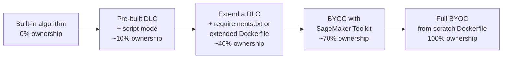
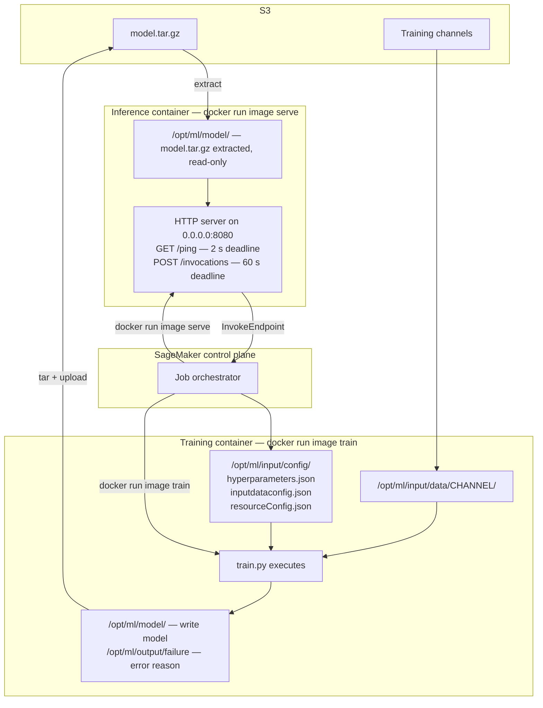
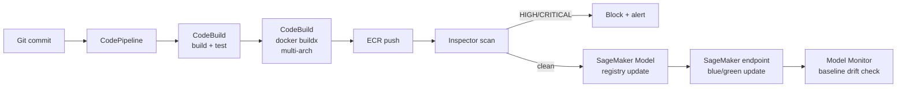

# Chapter 25 — BYOC: Bring Your Own Container

> **Goal of this chapter:** make you fluent in the *full Docker contract* SageMaker imposes on training and inference containers, and the patterns industry teams use to satisfy it — from "extend a Deep Learning Container with a `requirements.txt`" all the way to "build a CUDA base image from scratch with a custom JAX runtime, multi-arch for Graviton, hash-pinned for supply-chain audit." By the end you should be able to look at any Dockerfile and predict whether SageMaker will accept it, name every path and HTTP route the container must implement, defend the choice of BYOC against script mode in a design review, and recognize the BYOC-shaped questions the MLA-C01 will throw at you on exam day. Where [Chapter 24](24_script_mode.md) taught you how to *avoid* writing a Dockerfile by leaning on script mode, this chapter teaches you how to write one well when you have to.

---

## 25.1 When script mode is not enough

In Chapter 24 you built training and serving with no Dockerfile. You handed SageMaker a `train.py`, a `requirements.txt`, and the SDK pulled the right AWS-managed Deep Learning Container (DLC), dropped your script in at `/opt/ml/code/`, set `SAGEMAKER_PROGRAM=train.py`, and ran. No image build. No ECR push. No CVE backlog. No multi-arch headaches.

So when does a working MLE put down script mode and pick up a Dockerfile? When the script-mode contract breaks against a real constraint the pre-built containers can't satisfy — almost always one of these:

- **A framework AWS doesn't ship a DLC for.** JAX/Flax. Rust `burn-rs`. R running an `xgboost`+`mlr3` ensemble. Julia with `Flux.jl`. There is no DLC; script mode has nothing to drop your code into.
- **A patched or forked framework.** A FlashAttention-3 build that hasn't landed in the PyTorch DLC yet. A custom CUDA kernel for a research operator. A forked PyTorch with patches to autograd. The DLC ships an immutable framework version.
- **Heavy native dependencies.** A proprietary `libthing.so` from a vendor. OpenCV with custom GStreamer plugins. FFmpeg with NVENC. GDAL with non-default drivers. `pip install` only installs Python; native deps need a Dockerfile change.
- **A custom inference server.** **NVIDIA Triton Inference Server** (the big one, §25.7). vLLM with custom routing. TorchServe with custom handlers. Ray Serve. BentoML. TGI with non-default flags. The script-mode contract assumes the SageMaker inference toolkit's multi-model server — anything else is BYOC.
- **A proprietary algorithm.** You cannot reveal the training code as `.py` source on a customer's S3 bucket — it must be a compiled binary baked into the image. Script mode uploads `source_dir` to S3.
- **Multi-framework runtime in one container.** TensorFlow for preprocessing, PyTorch for the model, in the same process. Each DLC pins to one framework.
- **Compliance and supply-chain control.** An org-wide hardened base image (Chainguard, Red Hat UBI, internal Ubuntu). FIPS-validated crypto. Signed-and-attested images for a SOC 2 audit. AWS DLCs are AWS-managed; you don't get to fold your hardened base into them.
- **Cold-start image-size optimization.** A 14 GB PyTorch DLC vs a 2 GB hand-built image for a single-purpose model. Smaller image, faster pull, faster autoscale.
- **Slow `requirements.txt` at runtime.** Script mode runs `pip install` on every job start. If your dependency tree takes four minutes to resolve, you pay four minutes per training job and per inference cold start. Baking deps into a container moves that cost to build time once instead of runtime forever — Vikesh Pandey at AWS calls this a "primary motivation for BYOC adoption."
- **Air-gapped deployments.** SageMaker in a VPC with `EnableNetworkIsolation=true` cannot reach PyPI. You pre-bake everything or stand up a CodeArtifact proxy. The first is usually less work — and it's pure BYOC.

There is a spectrum of "how much of the container you own," and the exam expects you to know where each option sits on it:



Moving right buys flexibility (custom CUDA, exotic frameworks, proprietary IP, smaller images) and costs you AWS-managed convenience (patching, security scans, framework upgrades). The exam hands you a scenario and asks you to pick the *minimum* point on this spectrum that satisfies the constraints — picking a higher-ownership option when a lower one would do is always wrong.

### The anti-patterns

A senior MLE pushes back on BYOC just as often as they reach for it: **"we want full control"** (95% of it is available via script mode + `source_dir=` + pinned `requirements.txt`); **"we need a specific Python version"** (the DLC matrix usually has it — check before forking); **"we need three extra pip packages"** (use `requirements.txt`; container overhead is not worth it for three packages); **"we need the model to ship with inference code for reproducibility"** (script mode handles this with `source_dir=` and a pinned DLC tag).

When the middle option — **extend an existing DLC** — is available, it is almost always the right answer. Take the official PyTorch inference DLC, add `apt-get install libgl1`, push to your ECR, point your endpoint at it. You inherit AWS's framework, CUDA, toolkit, `/ping`, `/invocations`, and patching cadence, and only own the diff. §25.4.2 covers it. **Always try the rung below full BYOC before committing.**

Vikesh Pandey (AWS) compresses the trade-off: *"Now it's your own container instead of SageMaker managed. Which also means you are responsible for patching and maintaining it, so your total cost of ownership on managing and running the container is higher."* The honest operational tax, from a Fortune-100 financial-services ML platform team:

| Activity | Frequency | Effort |
|---|---|---|
| CVE patching (high/critical) | ~weekly | 1–4 hours per image |
| Base image upgrade | quarterly | 1–3 days |
| Framework upgrade (e.g., PyTorch minor) | ~quarterly | 2–5 days incl. regression |
| Multi-arch rebuild test | every release | 1–2 hours |
| ECR lifecycle / tag cleanup | continuous | ~1 day/month |

Roughly one FTE SRE per ~30 long-lived ML images. The MLA-C01 will not test this number, but it decides whether your team should pick BYOC at all.

---

## 25.2 The `/opt/ml/` contract — exhaustively

This is the single most-tested topic in BYOC. Memorize the paths — the exam shows you a path and asks what's in it, describes a behavior and asks which file controls it, or hands you a failing Dockerfile and asks which contract element it violates. The full layout:

```
/opt/ml/
├── input/
│   ├── config/
│   │   ├── hyperparameters.json       # training: HPs as flat string→string JSON map
│   │   ├── inputdataconfig.json       # training: per-channel content type + mode
│   │   └── resourceConfig.json        # training: cluster topology
│   └── data/<channel_name>/           # training: input channel mounted here
├── model/                              # training: write here; inference: read from here
├── code/                               # SDK uploads source_dir; inference.py lives here
├── output/
│   ├── data/                          # training: aux outputs bypassing model.tar.gz
│   └── failure                        # training: plaintext error reason
└── checkpoints/                        # training: synced to CheckpointS3Uri (if set)
```

Notice the dual role of `/opt/ml/model/`: a **write target** during training (SageMaker tars into `model.tar.gz` and uploads to S3 at exit-0) and a **read source** during inference (SageMaker downloads `model.tar.gz` from `ModelDataUrl` and extracts here before launching your serving process). The same path serves both phases.

### 25.2.1 The training-side contract

**Entrypoint.** SageMaker invokes your training container as:

```
docker run <image> train
```

Your container's `ENTRYPOINT` (or `CMD`) must accept `train` as the first argument and dispatch to the training routine. Most hand-rolled BYOC training Dockerfiles use the pattern:

```dockerfile
COPY train.py /opt/program/train       # note: no .py extension
RUN chmod +x /opt/program/train
ENV PATH="/opt/program:${PATH}"
ENTRYPOINT ["train"]                    # ENTRYPOINT in exec form — see §25.2.2
```

…with `train` being a Python script whose first line is `#!/usr/bin/env python3`. The toolkit pattern in §25.4 hides this behind `sagemaker-training` and is the recommended path for new code.

> ⚠️ **Exam alert.** SageMaker's training argv is *always* `train` — exactly the literal string `train`, not `train.py`, not `python train.py`. SageMaker's inference argv is *always* `serve`. Any question that shows you `docker run <image> python /opt/program/train.py` is wrong on its face. Any question that shows a `tini` init wrapper in front of the entrypoint is also wrong — see §25.2.2.

**Hyperparameters.** `/opt/ml/input/config/hyperparameters.json` is a **flat string-to-string JSON map**:

```json
{"num_round": "128", "eta": "0.001", "max_depth": "6"}
```

Even numeric values arrive as strings — the contract is JSON-string-typed. Your code must cast: `int(hp["num_round"])`. Exam pattern: "training fails because `eta * 2` raises `TypeError: unsupported operand type for *: 'str' and 'int'`. What's wrong?" Answer: hyperparameters arrive as strings; you forgot the cast.

**Input data config.** `/opt/ml/input/config/inputdataconfig.json` describes each channel:

```json
{
  "train":      {"ContentType": "text/csv", "TrainingInputMode": "File", "S3DistributionType": "FullyReplicated"},
  "evaluation": {"ContentType": "text/csv", "TrainingInputMode": "File", "S3DistributionType": "FullyReplicated"}
}
```

`S3DistributionType` is always `FullyReplicated` on EFS or FSx for Lustre. `TrainingInputMode` is written `"File"` for both `File` and `FastFile` modes (backward compatibility — `FastFile` uses S3 streaming under the hood but looks like a normal filesystem).

**Resource config.** `/opt/ml/input/config/resourceConfig.json` exposes cluster topology for distributed training:

```json
{
  "current_host": "algo-1",
  "hosts": ["algo-1", "algo-2", "algo-3"],
  "network_interface_name": "eth1"
}
```

The docs warn: *"Do not use the information in `/etc/hostname` or `/etc/hosts` because it might be inaccurate"* and *"add a retry policy on hostname resolution operations as nodes become available."* Hosts are sorted lexicographically (so `algo-1` is the master by convention) but **do not hard-code it** — the convention is documented as subject to change.

**Input modes.** Where your channel data shows up depends on the mode:

| Mode | Path | Source | Note |
|---|---|---|---|
| `File` | `/opt/ml/input/data/<channel>/` | S3 / EFS / FSxL | Whole channel downloaded before train starts; channel dir is the full filesystem view |
| `FastFile` | `/opt/ml/input/data/<channel>/` | S3 only (S3Prefix) | Mounted read-only, FUSE-style streaming; `inputdataconfig.json` still says `"File"` |
| `Pipe` | `/opt/ml/input/data/<channel>_<epoch>` | S3 only | Named FIFOs per epoch (`training_0`, `training_1`, …); read sequentially until EOF, retry on missing |

Pipe mode is awkward and only relevant if your algorithm streams epochs without random access. Most modern algorithms use File or FastFile.

**Failure signaling.** On error, write a plaintext reason string to `/opt/ml/output/failure` and exit non-zero. The string appears in `TrainingJob.FailureReason` via `DescribeTrainingJob`. Without this file, CloudWatch logs are your only diagnostic — and the exam answer is always *"write the reason to `/opt/ml/output/failure`."*

**Environment variables.** SageMaker sets `TRAINING_JOB_NAME`, `TRAINING_JOB_ARN`, and anything you passed in `Estimator(environment={...})`. The Training Toolkit (§25.4) additionally sets a long list of `SM_*` conveniences (`SM_MODEL_DIR`, `SM_CHANNEL_TRAINING`, `SM_HPS`, `SM_NUM_GPUS`, `SM_HOSTS`, `SM_CURRENT_HOST`) — toolkit conveniences, not part of the raw contract.

Note: **port 8080 has no meaning during training.** The training container is a batch process: starts, reads inputs, writes a model, exits. Port 8080 only matters at inference time, in §25.2.2.

### 25.2.2 The inference-side contract

The serving substrate is much stricter than training because it's a live HTTP service that has to talk to SageMaker's invoke router on a strict timing budget. Memorize this table — it shows up on the exam in three or four flavors:

| Knob | Value | Why it matters |
|---|---|---|
| **Entrypoint argv** | `docker run <image> serve` | SageMaker overrides any `CMD`; your `ENTRYPOINT` must handle `serve` |
| **Port** | **8080** | Hardcoded by SageMaker. Your web server *must* bind `0.0.0.0:8080` |
| **Routes** | `GET /ping`, `POST /invocations` | Plus `GET /invocations-bidirectional-stream` (WebSocket) if you opt in |
| **Socket-accept deadline** | **250 ms** | Container must accept a TCP connection within 250 ms |
| **`/invocations` deadline** | **60 s** | Model has up to 60 s to respond. SDK socket timeouts should be ~70 s. |
| **`/ping` deadline** | **2 s** | Each `/ping` request times out at 2 seconds |
| **Startup readiness window** | **8 minutes** | Container must consistently return 200 from `/ping` within 8 min of launch, or instance launch fails |
| **Model artifact** | `/opt/ml/model/` | SageMaker extracts `model.tar.gz` here; **read-only** — never write to it |
| **User** | **root** | "SageMaker AI expects all containers to run with root users." Non-root causes permission issues |
| **NVIDIA drivers** | NOT bundled | Host provides them via `nvidia-docker`; bundling breaks the runtime injection |
| **Init system** | NOT `tini` | "You can't use `tini` as entry point" — confuses the `train`/`serve` argv contract |
| **Entrypoint form** | `ENTRYPOINT ["executable", "param1", …]` | Exec form forwards `SIGTERM`/`SIGKILL`; shell form swallows them |
| **Shutdown** | `SIGTERM`, then `SIGKILL` after 30 s | 30-second grace period on scale-in / update |

> ⚠️ **Exam alert.** Four numbers and one route to memorize: **port 8080**, **2 s** for `/ping`, **60 s** for `/invocations`, **8 minutes** of startup readiness, two routes `GET /ping` and `POST /invocations`. If a question says the container listens on port 8443, or asks you about a `/healthz` route, or implies a 30-second `/ping` deadline, the question is testing whether you know the contract — the answer is "port 8080, `GET /ping` with 2 s, `POST /invocations` with 60 s." The exam will phrase it half a dozen ways. The numbers don't change.

`GET /ping` deserves its own callout. The docs say: *"The simplest requirement on the container is to respond with an HTTP 200 status code and an empty body,"* and *"if the container does not begin to pass health checks by consistently responding with 200s during the 8 minutes after startup, the new instance launch fails."*

But returning a static 200 forever is an anti-pattern AWS now warns against: *"If your container always returns 200 — even when the model has failed to load, run out of memory, or entered a bad state — SageMaker AI continues routing inference requests to that instance."* A meaningful `/ping` checks (1) the model artifact is loaded, (2) critical resources are available, (3) a lightweight self-test predict succeeds. When `/ping` returns non-200 in steady state, SageMaker auto-replaces the instance.

**Bidirectional streaming** is a newer addition: label the image `com.amazonaws.sagemaker.capabilities.bidirectional-streaming=true` and implement WebSocket on `/invocations-bidirectional-stream` (still on port 8080). Largely out-of-scope for MLA-C01 today but worth knowing.

### 25.2.3 The full contract flow



The diagram captures the only two interactions your container has with SageMaker: `docker run … train` for training, and `docker run … serve` plus HTTP traffic on port 8080 for inference. Get those right; everything else is up to you.

---

## 25.3 Dockerfile patterns

### 25.3.1 Minimal training Dockerfile

```dockerfile
FROM python:3.11-slim                                            # ~150 MB; nvidia/cuda for GPU (§25.3.3)
RUN apt-get update && apt-get install -y --no-install-recommends \
        build-essential ca-certificates wget \
    && rm -rf /var/lib/apt/lists/*
COPY requirements.txt /tmp/requirements.txt
RUN pip install --no-cache-dir -r /tmp/requirements.txt
COPY train.py /opt/program/train                                 # no extension
RUN chmod +x /opt/program/train
ENV PATH="/opt/program:${PATH}"
ENTRYPOINT ["train"]                                             # SageMaker runs: docker run <image> train
```

By copying `train.py` to `/opt/program/train` (no extension), adding `/opt/program` to `PATH`, and using `ENTRYPOINT ["train"]`, SageMaker's `docker run <image> train` becomes "run executable `train` with arg `train`" — which works because the executable ignores `argv[1]`. Teams who want to skip this footwork use the SageMaker Training Toolkit (§25.4).

### 25.3.2 Minimal inference Dockerfile (Flask + nginx, no toolkit)

```dockerfile
FROM python:3.11-slim
RUN apt-get update && apt-get install -y --no-install-recommends ca-certificates nginx \
    && rm -rf /var/lib/apt/lists/*
RUN pip install --no-cache-dir flask gunicorn numpy pandas scikit-learn
COPY serve.py /opt/program/serve
COPY predictor.py nginx.conf /opt/program/
RUN chmod +x /opt/program/serve
ENV PATH="/opt/program:${PATH}"
WORKDIR /opt/program
ENTRYPOINT ["serve"]              # bind 0.0.0.0:8080 inside serve.py / nginx.conf
```

`serve.py` starts nginx (proxying port 8080 to local gunicorn workers) and launches gunicorn against a Flask app exposing `/ping` and `/invocations`. Canonical reference: the [scikit-learn BYOC example](https://github.com/aws/amazon-sagemaker-examples/tree/main/advanced_functionality/scikit_bring_your_own).

### 25.3.3 GPU base image pattern

For GPU, use NVIDIA's CUDA base image — but *not* `-devel` in production (it carries the entire CUDA compiler toolchain, ~5 GB extra). Use `-runtime`:

```dockerfile
FROM nvidia/cuda:12.4.1-runtime-ubuntu22.04
ENV DEBIAN_FRONTEND=noninteractive
RUN apt-get update && apt-get install -y --no-install-recommends \
        python3.11 python3-pip ca-certificates \
    && rm -rf /var/lib/apt/lists/*
RUN pip install --no-cache-dir torch==2.4.0 \
        --index-url https://download.pytorch.org/whl/cu124
ENTRYPOINT ["serve"]
```

**Don't bundle NVIDIA drivers.** The host already has them; `nvidia-docker` injects them at runtime. Bundling either does nothing or breaks the runtime injection. CUDA *libraries* (cuDNN, cuBLAS) come with the base image and are fine.

### 25.3.4 Multi-stage builds

Multi-stage lets you compile in a "fat" stage and `COPY --from=` only the artifacts into a "thin" runtime stage — the single highest-leverage optimization for cold-start latency:

```dockerfile
FROM python:3.11 AS builder
RUN apt-get update && apt-get install -y build-essential git
COPY requirements.txt .
RUN pip wheel --wheel-dir /wheels -r requirements.txt

FROM python:3.11-slim
COPY --from=builder /wheels /wheels
RUN pip install --no-cache-dir /wheels/*.whl && rm -rf /wheels
COPY serve.py predictor.py /opt/program/
ENV PATH="/opt/program:${PATH}"
ENTRYPOINT ["serve"]
```

Typical wins: a Python-ML image drops from ~3 GB (with `gcc`, headers) to ~700 MB (pure runtime). Size-cutting tactics: `--no-cache-dir` on every `pip install`; `rm -rf /var/lib/apt/lists/*` after `apt-get install`; combine related `RUN` commands; use `.dockerignore` to exclude `__pycache__`, `.git`, `.venv`; pick the smallest base (`python:3.11-slim` is the ML sweet spot — `-alpine` usually breaks because no glibc).

### 25.3.5 Layer ordering for cache hits

Layers cache top-down — a changed layer invalidates everything below. Order from least-likely-to-change to most-likely:

```dockerfile
FROM python:3.11-slim                    # never changes
RUN apt-get install -y ca-certificates   # rarely changes
COPY requirements.txt /tmp/              # changes with deps
RUN pip install -r /tmp/requirements.txt # rebuilds only on requirements change
COPY src/ /opt/program/                  # changes every commit
```

A team that iterates 20× a day on `src/` and reuses the cached `pip install` layer rebuilds in 5 seconds instead of 5 minutes.

---

## 25.4 SageMaker Toolkits — the easy path

The two open-source libraries that implement the BYOC contract for you so you don't have to think about argv parsing, `/opt/ml/` file plumbing, or HTTP framing:

| Toolkit | Repo | What it gives you |
|---|---|---|
| **`sagemaker-training-toolkit`** | [github.com/aws/sagemaker-training-toolkit](https://github.com/aws/sagemaker-training-toolkit) | The `train` entrypoint; reads `hyperparameters.json`; parses `inputdataconfig.json` and `resourceConfig.json`; sets `SM_*` env vars; invokes your `entry_point` script; handles distributed-training rendezvous; writes `failure` on uncaught exceptions |
| **`sagemaker-inference-toolkit`** | [github.com/aws/sagemaker-inference-toolkit](https://github.com/aws/sagemaker-inference-toolkit) | Runs Multi Model Server (MMS) on port 8080; wires `/ping` and `/invocations`; calls your `model_fn`/`input_fn`/`predict_fn`/`output_fn`; default serializers for JSON/CSV/NumPy/JSONLines |

A typical toolkit-based BYOC inference Dockerfile:

```dockerfile
FROM python:3.11-slim
RUN pip install --no-cache-dir sagemaker-inference multi-model-server
RUN pip install --no-cache-dir torch scikit-learn numpy
COPY inference.py /opt/ml/code/inference.py
ENV SAGEMAKER_PROGRAM=inference.py
ENTRYPOINT ["python", "-m", "sagemaker_inference.model_server"]
```

…and `inference.py` is the four handler functions. The toolkit handles binding port 8080, implementing `/ping`, parsing `Content-Type`, calling your handlers, serializing responses, and error-mapping uncaught exceptions to HTTP 5xx.

### 25.4.1 The four inference handler functions

The same handler shape script mode uses (Chapter 24), so you can move freely between script mode and toolkit-based BYOC without rewriting inference code:

```python
# /opt/ml/code/inference.py
import joblib, json
import numpy as np

def model_fn(model_dir):
    """Load model. Called once at startup. model_dir is /opt/ml/model."""
    return joblib.load(f"{model_dir}/model.joblib")

def input_fn(request_body, request_content_type):
    if request_content_type == "application/json":
        return np.array(json.loads(request_body)["instances"])
    elif request_content_type == "text/csv":
        return np.loadtxt(request_body.splitlines(), delimiter=",")
    raise ValueError(f"Unsupported content type: {request_content_type}")

def predict_fn(input_data, model):
    return model.predict(input_data)

def output_fn(prediction, accept):
    if accept == "application/json":
        return json.dumps({"predictions": prediction.tolist()}), accept
    raise ValueError(f"Unsupported accept type: {accept}")
```

Skip any of the four and the toolkit's default handler kicks in (JSON-in/JSON-out and NPY for NumPy-array inputs).

> ⚠️ **Exam alert.** The model artifact at inference time lives at `/opt/ml/model/`, extracted by SageMaker from `model.tar.gz` *before* `serve` runs. Your container does not unpack the tar; SageMaker does. Treat the directory as read-only. Any question that suggests writing model state back to `/opt/ml/model/` at request time, or that asks where to read the model from in `model_fn`, is testing the same fact. Answer: `/opt/ml/model/`, read-only, already extracted.

### 25.4.2 Extending a DLC — the middle path

A surprising amount of production "BYOC" is just *extending* an AWS Deep Learning Container with extra system packages or Python deps:

```dockerfile
# Official PyTorch inference DLC for your region/version
FROM 763104351884.dkr.ecr.us-east-1.amazonaws.com/pytorch-inference:2.4.0-gpu-py311-cu124-ubuntu22.04-sagemaker
RUN apt-get update && apt-get install -y libgl1 ffmpeg && rm -rf /var/lib/apt/lists/*
RUN pip install --no-cache-dir albumentations==1.4.0 opencv-python-headless
# Keep the DLC's entrypoint — it already includes the inference toolkit
```

You inherit the toolkit, the entrypoint, `/ping`, `/invocations`, the framework, CUDA, and SageMaker compatibility — and you only override what you need. **Always prefer this to a from-scratch BYOC** when a DLC carries the framework you want. The DLC URIs are catalogued at [github.com/aws/deep-learning-containers — available_images.md](https://github.com/aws/deep-learning-containers/blob/master/available_images.md); the account ID (`763104351884`) varies by region — use `sagemaker.image_uris.retrieve()` to fetch the right one programmatically.

---

## 25.5 ECR — repository, push, lifecycle

ECR is the only registry SageMaker pulls from for BYOC. No Docker Hub. No GHCR. Push to ECR; SageMaker pulls from ECR.

### 25.5.1 Create a private repo

```bash
aws ecr create-repository \
    --repository-name my-byoc-inference \
    --image-scanning-configuration scanOnPush=true \
    --image-tag-mutability IMMUTABLE \
    --encryption-configuration encryptionType=KMS
```

Three knobs that matter:

| Knob | Default | Recommendation | Why |
|---|---|---|---|
| `imageScanningConfiguration.scanOnPush` | `false` | `true` | Free CVE scan on every push; results visible in ECR console |
| `imageTagMutability` | `MUTABLE` | `IMMUTABLE` for prod | Prevents anyone from overwriting `myimage:v1.2.0` — critical for reproducibility and audit |
| `encryptionConfiguration.encryptionType` | `AES256` | `KMS` for regulated workloads | Customer-managed key for layer encryption at rest |

> ⚠️ **Exam alert.** Production ECR repos must be `IMMUTABLE`-tagged. If a stem says "the same image tag was overwritten in ECR but the endpoint still serves the old model," or "audit cannot reproduce which exact image was deployed last quarter," the answer is **set `IMMUTABLE` tag mutability and adopt semver or git-SHA tags**. SageMaker caches the image on the instance at endpoint-create time; pulling a new `:latest` requires a fresh `UpdateEndpoint`, and even then your audit trail is gone because the old image bytes were overwritten. Never reference `:latest` in `EndpointConfig`.

### 25.5.2 Authenticate, push, tag

```bash
aws ecr get-login-password --region us-east-1 | docker login --username AWS \
    --password-stdin 123456789012.dkr.ecr.us-east-1.amazonaws.com
docker build -t my-byoc-inference:v1.0.0 .
docker tag my-byoc-inference:v1.0.0 \
    123456789012.dkr.ecr.us-east-1.amazonaws.com/my-byoc-inference:v1.0.0
docker push 123456789012.dkr.ecr.us-east-1.amazonaws.com/my-byoc-inference:v1.0.0
```

The pushed URI is what you pass to `CreateModel.PrimaryContainer.Image` (or `Estimator(image_uri=)` for training). Tag strategy:

| Tag | Mutability | Use |
|---|---|---|
| `:v1.2.0` (semver) | Immutable | Production — pin in `EndpointConfig` |
| `:<git-sha>` | Immutable | Implicit immutability; ideal for CI/CD audit |
| `:latest` | Mutable (dangerous) | Local dev only; never in production endpoints |
| `:nightly`, `:rc` | Mutable | Dev/test endpoints |

### 25.5.3 Lifecycle policies

ECR storage is $0.10/GB/month. A team building 50 images/day with no cleanup pays for terabytes of dead bytes within a quarter:

```json
{
  "rules": [
    {"rulePriority": 1, "description": "Keep last 10 release tags",
     "selection": {"tagStatus": "tagged", "tagPrefixList": ["v"],
       "countType": "imageCountMoreThan", "countNumber": 10},
     "action": {"type": "expire"}},
    {"rulePriority": 2, "description": "Expire untagged after 7 days",
     "selection": {"tagStatus": "untagged", "countType": "sinceImagePushed",
       "countUnit": "days", "countNumber": 7},
     "action": {"type": "expire"}}
  ]
}
```

One client cut **~$1,800/month in ECR storage** the first time they applied a policy like this.

### 25.5.4 Scanning — basic vs Inspector enhanced

ECR ships two scanning tiers; ML containers should always be on enhanced:

1. **Basic scanning** — Clair-based OS package scan on push. Free, OS-only, runs once per push.
2. **Enhanced scanning (Amazon Inspector)** — OS *and* application-layer (pip, npm, Maven, NuGet). Continuous re-scan as new CVEs land. ~$0.09/image/month at typical volumes.

Application-layer scanning is non-optional for ML: nearly every interesting CVE in the ML stack lives in pip-land (`pytorch` `torch.load` pickle vector; `transformers` RCE via `trust_remote_code=True`; `numpy`/`pandas`/`pillow` memory-corruption; `urllib3`/`requests`/`cryptography` transitive deps).

Inspector emits findings to EventBridge — the integration point you actually want:

```
ECR push → Inspector scan → EventBridge rule (severity ≥ HIGH) → SNS → Slack
                                                              ↘ Lambda → JIRA ticket
                                                              ↘ Step Function → rebuild + redeploy
```

### 25.5.5 IAM and cross-account

The SageMaker execution role needs `ecr:GetAuthorizationToken`, `ecr:BatchCheckLayerAvailability`, `ecr:GetDownloadUrlForLayer`, and `ecr:BatchGetImage` on the repository ARN.

For **cross-account** image pulls (org-shared registry pattern), the ECR repository policy on account A must explicitly allow the SageMaker role from account B:

```json
{
  "Version": "2012-10-17",
  "Statement": [{
    "Sid": "AllowAccountBPull",
    "Effect": "Allow",
    "Principal": {"AWS": "arn:aws:iam::222222222222:root"},
    "Action": ["ecr:BatchGetImage", "ecr:GetDownloadUrlForLayer"]
  }]
}
```

Common exam gotcha: *"Cross-account model registry deployment fails"* is almost always **missing ECR repository policy**, not missing IAM role permissions.

---

## 25.6 BYOC for inference only

A common pattern: the model is trained elsewhere — a research cluster, a laptop, a different cloud, a SageMaker job using a DLC — but the inference container is custom because the serving stack is custom. The Python SDK shortcut is `sagemaker.Model` (the generic Model class, not framework-specific):

```python
from sagemaker.model import Model
model = Model(
    image_uri="123456789012.dkr.ecr.us-east-1.amazonaws.com/my-byoc-inference:v1.0.0",
    model_data="s3://my-bucket/models/model.tar.gz",
    role="arn:aws:iam::123456789012:role/SageMakerExecutionRole",
    env={"MODEL_THREADS": "4"},
)
predictor = model.deploy(instance_type="ml.m5.xlarge", initial_instance_count=1)
```

Your container's `model_fn` opens `/opt/ml/model/model.joblib` — SageMaker has already extracted `model.tar.gz` into that directory before launching your serving process.

---

## 25.7 NVIDIA Triton Inference Server — the canonical BYOC pattern

If there is one BYOC scenario the exam asks about more than any other, it is Triton. **NVIDIA Triton Inference Server** is the industry-standard general-purpose model server: multi-framework (TensorRT, PyTorch, TF, ONNX, OpenVINO, Python backend), multi-model-per-GPU, dynamic batching, model ensembling, GPU-shared memory. AWS publishes Triton as a pre-built SageMaker DLC, so it is not strictly "from-scratch" BYOC — but the majority of production Triton-on-SageMaker deployments wrap that DLC with custom config, custom Python pre/post-processing, and custom backends, which puts you squarely in BYOC territory.

```python
from sagemaker import image_uris
image_uri = image_uris.retrieve(
    framework="sagemaker-tritonserver", region="us-east-1", version="23.10"
)
```

Your "model" in S3 is a Triton model repository, not a single artifact:

```
model_repository/
├── my_pytorch_model/{config.pbtxt, 1/model.pt}
├── my_onnx_model/{config.pbtxt, 1/model.onnx}
└── ensemble/{config.pbtxt, 1/}        # ensemble of the two above
```

The whole repo gets tar.gz'd and pointed at by `model_data`. Triton serves multiple models behind one endpoint and dynamically batches across requests in flight.

### 25.7.1 Why Triton wins for GPU serving

Triton's design assumes you have *many* models that need to share *expensive* GPU hardware:

- **Concurrent model execution** (instance groups). N copies of the same model running in parallel on one GPU.
- **Dynamic batching.** Incoming requests buffered for a few ms, then issued as a single GPU batch. Huge throughput win.
- **Multi-framework backends in one process.** TensorRT, ONNX Runtime, PyTorch, TensorFlow, Python, OpenVINO, custom C++ — all in the same server.
- **Ensemble models.** A DAG of models where the output of one feeds the next, executed server-side without HTTP hops between.

AWS has [benchmarked the combined wins](https://aws.amazon.com/blogs/machine-learning/achieve-hyperscale-performance-for-model-serving-using-nvidia-triton-inference-server-on-amazon-sagemaker/) on BERT-large for a 500 ms / 500 RPS target:

| Configuration | Instance | Invocations / min / instance | Latency (ms) | $ / hour |
|---|---|---|---|---|
| Baseline PyTorch | ml.g4dn.xlarge | 490 | 1500 | $45.66 |
| Triton + TensorRT + dyn batching + instance groups | ml.g4dn.xlarge | 3,192 | 783 | $7.36 |
| Baseline PyTorch | ml.g4dn.12xlarge | 2,138 | 906 | $73.35 |
| Triton fully optimized | ml.g4dn.12xlarge | 5,235 | 439 | $29.34 |

The cost reduction is up to **84%** vs vanilla PyTorch serving. Three rows of a spreadsheet are the entire financial case for Triton.

> ⚠️ **Exam alert.** When the exam stem says "multiple models on a single GPU," "multi-framework serving on one endpoint," "ensemble of models served server-side," or "dynamic batching for higher GPU throughput," the answer is **NVIDIA Triton Inference Server on SageMaker**. SageMaker Multi-Model Endpoints (MME) on GPU are *implemented* on top of Triton — there is no other way to do GPU MME on SageMaker. (Forward: [Chapter 39](../part_g_deployment_orchestration/39_mme_mce.md) covers MME and MCE end-to-end.)

### 25.7.2 When Triton loses — and the Pinterest counter-example

- Custom Python preprocessing not trivially expressible in Triton's Python backend.
- Frameworks Triton has no backend for (rare in 2026).
- Sub-millisecond latency on a single tiny CPU model — Triton has overhead; raw Flask wins.
- **Pinterest.** Pinterest's flagship ranking infrastructure runs on a homegrown CPU-bound server called the **Scorpion Model Server (SMS)** — see Pinterest Engineering's [GPU-Accelerated ML Inference at Pinterest](https://medium.com/@Pinterest_Engineering/gpu-accelerated-ml-inference-at-pinterest-ad1b6a03a16d). When they moved ranking models to GPU, they kept SMS as the serving frontend and added GPU acceleration underneath. At Pinterest's scale, every microsecond of CPU↔GPU coordination matters enough that owning the serving layer paid for itself. *Triton is the default, not the law.*

### 25.7.3 What goes in your BYOC Triton container

```dockerfile
FROM nvcr.io/nvidia/tritonserver:24.10-py3       # NVIDIA's official Triton image
COPY requirements-runtime.txt /tmp/
RUN pip install --no-cache-dir -r /tmp/requirements-runtime.txt
COPY backends/my_custom_backend.so /opt/tritonserver/backends/
ENV SAGEMAKER_TRITON_DEFAULT_MODEL_NAME=my_ensemble
ENTRYPOINT ["/opt/tritonserver/sagemaker/serve"]
```

The `nvcr.io/nvidia/tritonserver:24.10-py3` base image is about **7–9 GB on its own**, before you add a single dependency — which sets up the next section.

---

## 25.8 Image bloat — and why it's worse than the bytes suggest

Modern ML containers are *fat*. A naive PyTorch-CUDA-transformers-OpenCV image lands at **5–10 GB** without effort. An LLM-serving container with vLLM, weight-free, hits **15–20 GB**. Bake model weights in (a common but discouraged anti-pattern) and you're at **30–80 GB**.

The components (per [aws/deep-learning-containers #3165](https://github.com/aws/deep-learning-containers/issues/3165)): a PyTorch 2.0 SageMaker training DLC ballooned to **~14 GB compressed / ~30 GB uncompressed** by bundling NCCL, cuDNN, cuBLAS, Apex, FlashAttention, multiple CUDA architectures (SM 7.0/7.5/8.0/8.6/9.0), and SageMaker tooling. CUDA Toolkit with cuDNN: ~3 GB. PyTorch CUDA wheel: ~2 GB. `transformers`+`accelerate`+`bitsandbytes`: ~1.5 GB. OpenCV+FFmpeg: ~500 MB.

### Why it hurts more than the bytes suggest

1. **Cold start.** Every new SageMaker instance, every K8s pod, every Lambda container `docker pull`s from ECR before any code runs. AWS's [container caching benchmark](https://aws.amazon.com/blogs/machine-learning/supercharge-your-auto-scaling-for-generative-ai-inference-introducing-container-caching-in-sagemaker-inference/) for Llama 3.1 70B on p4d.24xlarge measured **6m 19s to scale on an existing instance, 9m 40s to add a new one** — almost all of it container pull plus model load. Caching cut those to 2m 46s (-56%) and 6m 47s (-30%). Without caching, you're shipping a 10-minute scale-up tail.
2. **ECR storage cost.** $0.10/GB-month. A 20 GB image × 30 retained versions = 600 GB = $60/month per image. 50 models = $3,000/month before serving a request.
3. **ECR cross-region pull.** Same-region is free; cross-region is $0.02/GB. A multi-region deployment pulling 20 GB × 1000 times = $400 per push.
4. **SageMaker Serverless Inference 10 GiB cap.** [Common re:Post complaint](https://repost.aws/questions/QU90699ONgQD2t2HUKzm9AUA/failure-reason-image-size-12704675783-is-greater-than-supported-size-10737418240-when-creating-serverless-endpoint-in-sagemaker): a 12 GB image is rejected with `Image size 12704675783 is greater than supported size 10737418240`. Slim or switch off serverless.

### The multi-stage pattern AWS recommends

AWS's [AI on EKS image-size guide](https://awslabs.github.io/ai-on-eks/docs/guidance/container-startup-time/reduce-container-image-size/optimize-image-size) is the most concrete reference. The standard recipe extends §25.3.4 with a GPU base:

```dockerfile
FROM nvcr.io/nvidia/pytorch:24.10-py3 AS builder
RUN apt-get update && apt-get install -y --no-install-recommends \
        build-essential git cmake && rm -rf /var/lib/apt/lists/*
COPY requirements.txt /tmp/
RUN pip install --no-cache-dir --target=/install -r /tmp/requirements.txt

FROM nvcr.io/nvidia/pytorch:24.10-py3-runtime          # -runtime, not -devel
COPY --from=builder /install /usr/local/lib/python3.11/site-packages
COPY src/ /opt/program/
ENV PYTHONUNBUFFERED=1 PYTHONDONTWRITEBYTECODE=1
ENTRYPOINT ["python", "/opt/program/serve.py"]
```

Key choices per AWS benchmarks: **`-runtime` instead of `-devel` saves 3–4 GB** on the PyTorch DLC (`2.7.1-cuda11.8-cudnn9-devel` is 6.66 GB vs `-runtime` at 3.03 GB). **Strip CUDA architectures you don't need** — Ampere-only? `TORCH_CUDA_ARCH_LIST="8.0;8.6"` saves 1–2 GB. **Never bake model weights into the image** — keep in S3 and pull at startup, decoupling model release from container release. **Don't waste effort on layer-combining tricks** — AWS notes gains are "often negligible" and they cost cache efficiency.

**Reality-check targets:** 3–4 GB transformer inference, 6–8 GB vLLM-class, 2–3 GB CPU-only XGBoost/sklearn. Above that, reviewers assume you skipped multi-stage builds.

---

## 25.9 Vannevar Labs — case study

The single most useful BYOC-optimization case study in the public AWS catalog is [Vannevar Labs' Containers Blog post](https://aws.amazon.com/blogs/containers/how-vannevar-labs-cut-ml-inference-costs-by-45-using-ray-on-amazon-eks/) (defense-tech ML, running on EKS not SageMaker, but the BYOC lessons port directly).

**The problem.** Vannevar Labs ran ML inference inside one **monolithic 25 GB container** with every model baked in: a CV model, an embedding model, an NLP classifier, a translation model. Simple to manage, catastrophic to scale. ECR pull took several minutes; worker nodes were still doing `pip install` at startup; pod-launch P99 was so high that autoscaling couldn't keep up with bursts.

**What they did.** Instead of multi-staging the monolith, they made an *architectural* call: **split the monolith into specialized per-model images.** One image per model class, sized for actual dependencies. Model weights and Python deps baked at build time — no startup `pip install`. A standardized Ray Serve frontend wrapped each.

**The results:**

| Metric | Before | After |
|---|---|---|
| Container image size | 25 GB monolith | **2–12 GB specialized** |
| Pod launch time | baseline | **50–90% faster** |
| Network egress | PyPI ingress every pod startup | eliminated |
| ML inference cost | baseline | **45% reduction** (image specialization + Karpenter + fractional GPUs combined) |

Four takeaways: (1) **The fastest 10× win on container size is architectural, not Dockerfile-level** — multi-stage shaves 30–50%, splitting a monolith shaves 60–90%. (2) **Move runtime `pip install` to build time** — every startup `pip install` is slow *and* may fail on a drifted transitive dep. (3) **Specialized images compound with fractional GPUs** — smaller images fit more pods per node, which lets GPU MIG or Ray fractional-GPU scheduling actually pay off. (4) **The cost story is non-obvious** — the 45% reduction wasn't purely from smaller images; it was smaller images → faster scaling → tighter autoscaling → less over-provisioning → less idle GPU. Platform wins compound.

---

## 25.10 The reproducibility ladder — `requirements.txt` → Bazel/Nix

The dirty secret of ML containers: rebuild your `Dockerfile` two months later and you get a different image. `pip install transformers` resolves to 4.46.0 today and 4.51.2 in March. Even with `transformers==4.46.0` pinned, the transitive `tokenizers`, `huggingface_hub`, `safetensors` versions float, and any one can break inference. The bug you can't reproduce is the bug that lives forever.

Industry has been climbing a reproducibility ladder for a decade:

| Tier | What you commit | What it guarantees |
|---|---|---|
| 0 | `requirements.txt` with `>=` | Nothing |
| 1 | `==` for direct deps | Direct-dep versions; transitive still floats |
| 2 | `pip freeze > requirements.txt` | One machine / OS / arch snapshot |
| 3 | `pip-tools` (`pip-compile` → `requirements.lock`) | Full transitive lock for one Python/arch |
| 4 | **Poetry** (`poetry.lock`) or **uv** (`uv.lock`) | Cross-platform locked resolution |
| 5 | **Hash-pinned lockfile** (`--require-hashes`) | Bytes-exact; supply-chain attack resistance |
| 6 | **Bazel / Nix** | Hermetic build: same inputs → byte-identical outputs across machines |

Most ML teams sit at tier 3–4 in 2025–2026 (`pip-tools` or Poetry/uv). Hardened-supply-chain teams (banks, defense, healthcare) are at tier 5. A small handful of tooling-platform teams (Google, plus infra teams at Stripe, Shopify, Two Sigma) are at tier 6 with Bazel. [PEP 751](https://peps.python.org/pep-0751/) was accepted in 2024, defining a standard `pylock.toml` that pip, Poetry, uv, and PDM all consume.

In a BYOC Dockerfile:

```dockerfile
FROM python:3.11-slim AS builder
COPY pyproject.toml poetry.lock ./
RUN pip install poetry==1.8.3 && \
    poetry export -f requirements.txt --output requirements.lock.txt
RUN pip install --no-deps --require-hashes \
        -r requirements.lock.txt --target=/install

FROM python:3.11-slim
COPY --from=builder /install /usr/local/lib/python3.11/site-packages
COPY src/ /opt/program/
ENTRYPOINT ["python", "/opt/program/serve.py"]
```

The `--require-hashes` flag is the underrated detail. pip refuses to install if the wheel's SHA256 doesn't match. This is the *only* mechanism that defends against a malicious PyPI upload of a previously-trusted package. The 2024 **ultralytics supply-chain attack** (crypto miner injected via a compromised maintainer flow) would have been blocked by `--require-hashes` for any consumer with a pre-attack lockfile. SOC 2 / FedRAMP environments treat tier 5 as a floor, not a ceiling.

Bazel/Nix pays off in two situations only: many-language monorepos where cross-language dependency graphs and remote caching are the only thing that scales, and auditability requirements where "this exact binary built from this exact commit on this exact date" is contractual. The MLA-C01 will not test Bazel or Nix; it *will* care that you pin dependencies with a lockfile. **Tier 4 is the realistic minimum bar.**

### Hardened base images

A growing pattern in regulated environments: start from a hardened distroless image instead of `nvidia/cuda` or `python:3.11-slim`.

- **Chainguard** — distroless-style, near-zero CVE counts, SBOM included. [Chainguard announced AWS Inspector support in 2024](https://www.chainguard.dev/unchained/announcing-aws-inspector-scanner-support-for-chainguard-libraries) for native scanning.
- **Red Hat UBI** — required for some FedRAMP/HIPAA workloads where Red Hat support contracts are part of the compliance story.

Real numbers: switching from `python:3.11` (Debian-based, ~120 MB, 30–50 medium+ CVE findings) to `cgr.dev/chainguard/python:3.11` (~20 MB, near-zero CVE backlog) cut one team's weekly CVE triage from 4 hours to 30 minutes across ~40 images. The cost: no shell, no `apt-get` in the runtime image.

---

## 25.11 Multi-arch images for Graviton

AWS Graviton (ARM64) instances are **20–40% cheaper** than equivalent x86, and Karpenter (the K8s autoscaler) will mix Graviton and x86 nodes in the same cluster based on price and availability. An ML container built only for `linux/amd64` will be silently provisioned onto an ARM64 node, the OCI runtime will fall back to QEMU emulation, and inference latency jumps 5–20×. Silent slow failures are the worst kind.

The right answer is `docker buildx`:

```bash
docker buildx create --name multi-arch --use --bootstrap
docker buildx build \
  --platform linux/amd64,linux/arm64 \
  --tag 123456789012.dkr.ecr.us-east-1.amazonaws.com/my-model:v1.0.3 \
  --push .
```

ECR stores a **manifest list** (OCI image index) referencing both architecture-specific images. The pulling node's daemon picks the variant matching its arch. No application change.

The gotchas:

- **Emulated builds are painfully slow.** Building an `arm64` PyTorch image on an `amd64` runner under QEMU takes **5–10× longer** than native. A 15-minute build becomes 2 hours. Fix: native ARM runners (GitHub Actions has them in beta; CodeBuild has `arm64` build environments; or use a Graviton EC2 host directly).
- **Not every Python wheel exists for ARM64.** `torch`, `numpy`, `pandas`, `tensorflow` ship ARM wheels; the long tail doesn't. `bitsandbytes` famously lagged. Check `pip install` resolves cleanly on ARM before promising multi-arch.
- **CUDA on ARM is for Grace Hopper, not Graviton.** Graviton has no GPU. If your image needs CUDA, the ARM target is for NVIDIA GH200 systems or for CPU-only inference paths.
- **The segfault gotcha.** Building `amd64` *on* an ARM host (M-series Mac, Graviton CI) has its own demons. [docker/buildx issue #2168](https://github.com/docker/buildx/issues/2168) traces gcc segfaults in QEMU when compiling amd64 from ARM. Workaround: separate build runners per native arch, or use `--platform=$BUILDPLATFORM` in the `FROM` line so the build stage runs on the native arch and only the runtime artifact is cross-compiled.

When BYOC + Graviton genuinely wins: CPU-bound inference on `ml.c7g` / `ml.m7g`. Sklearn, XGBoost, LightGBM, classic NLP, embedding lookups, preprocessors. Real-world result for a well-tuned XGBoost service: **~30% lower $/request on c7g.4xlarge vs c6i.4xlarge** with no latency regression. For a $50k/month service, $15k/month picked up by spending an afternoon on multi-arch.

---

## 25.12 CodeArtifact — pip in the build pipeline

If you've gone BYOC because of the air-gapped/regulated case in §25.1, your build pipeline cannot reach pypi.org. AWS's answer is **CodeArtifact** — a managed artifact repo that hosts private packages or **proxies** PyPI/npm/Maven/NuGet through a single corporate-controlled endpoint.

Even in non-air-gapped shops, a proxy buys three things: a **cache** (faster builds, lower egress), a **choke point** to blocklist malicious packages org-wide in seconds, and an **audit trail** auditors can point at to prove every build dependency came through one gateway.

```dockerfile
FROM python:3.11-slim AS builder
ARG CODEARTIFACT_AUTH_TOKEN
ARG CODEARTIFACT_REPO_URL
ENV PIP_INDEX_URL=https://aws:${CODEARTIFACT_AUTH_TOKEN}@${CODEARTIFACT_REPO_URL#https://}
COPY requirements.lock /tmp/
RUN pip install --no-cache-dir -r /tmp/requirements.lock
# Token in a build arg, NOT a layer — verify with `docker history`
```

In CodeBuild, prefer BuildKit's `--secret` so the token never lands in image history at all:

```yaml
phases:
  pre_build:
    commands:
      - export CODEARTIFACT_AUTH_TOKEN=$(aws codeartifact get-authorization-token \
            --domain my-domain --query authorizationToken --output text)
  build:
    commands:
      - docker buildx build --platform linux/amd64,linux/arm64 \
          --secret id=ca,env=CODEARTIFACT_AUTH_TOKEN \
          --push -t $IMAGE_URI .
```

Full pattern: AWS's posts on [private package installation in SageMaker running in internet-free mode](https://aws.amazon.com/blogs/machine-learning/private-package-installation-in-amazon-sagemaker-running-in-internet-free-mode/) and [secure CodeArtifact access for isolated SageMaker notebook instances](https://aws.amazon.com/blogs/machine-learning/secure-aws-codeartifact-access-for-isolated-amazon-sagemaker-notebook-instances/).

---

## 25.13 Local testing — close the build/deploy loop

The single biggest productivity win in BYOC is testing the container locally before pushing to ECR and waiting 8 minutes for `CreateEndpoint` to fail.

**Plain `docker run`** mirrors SageMaker's invocation. For training, prepare the `/opt/ml` layout on disk and bind-mount it:

```bash
mkdir -p test/input/{data/training,config} test/model test/output
echo '{"eta":"0.001","num_round":"100"}' > test/input/config/hyperparameters.json
echo '{"training":{"ContentType":"text/csv","TrainingInputMode":"File"}}' \
    > test/input/config/inputdataconfig.json
cp my_training_data.csv test/input/data/training/
docker run --rm -v $(pwd)/test:/opt/ml my-byoc-training:dev train
```

For inference, extract `model.tar.gz`, mount, hit `/ping`, then `POST /invocations`:

```bash
mkdir -p test_inf/model && tar -xzf model.tar.gz -C test_inf/model
docker run --rm -p 8080:8080 -v $(pwd)/test_inf/model:/opt/ml/model \
    my-byoc-inference:dev serve &
until curl -sf http://localhost:8080/ping; do sleep 1; done
curl -X POST http://localhost:8080/invocations \
    -H 'Content-Type: application/json' -d '{"instances": [[1.0, 2.0, 3.0]]}'
```

If those two work, the container is contract-correct. Push to ECR with confidence.

**SageMaker Local Mode** is the SDK shortcut for the same idea — `Estimator(instance_type="local", ...)`. The SDK mounts local data, runs the container, surfaces logs to your terminal, and produces the same `model.tar.gz`. For multi-instance distributed-training simulation, use `instance_count=N` — the SDK spins up N containers on a docker-compose network with the right `resourceConfig.json` baked in. Indispensable for debugging distributed-training topology before paying for real GPUs.

---

## 25.14 CI/CD for BYOC — the CodeBuild → ECR → SageMaker pipeline

Script-mode CI/CD is approximately *nothing*: push code to git, SageMaker pulls the DLC, runs your script. BYOC CI/CD is a real pipeline you have to build and own. The reference pattern:



AWS's [SageMaker projects + image-building CI/CD reference](https://aws.amazon.com/blogs/machine-learning/create-amazon-sagemaker-projects-with-image-building-ci-cd-pipelines/) is the canonical AWS-native version. [Chapter 46](../part_h_monitoring_governance/46_cicd_codepipeline.md) covers CodePipeline + CodeBuild + CodeDeploy end-to-end.

**Where teams stumble:**

- **No staging endpoint.** Building a container and shipping straight to prod is a 3 a.m. page. Standard pattern: build → push to `:staging` → deploy to staging endpoint → smoke tests + Model Monitor baseline → promote to `:prod` → deploy with `Auto` traffic-shifting.
- **No image promotion.** Building separately for staging and prod doubles non-determinism. Build once, tag, promote tags. Same image bytes through every environment.
- **Forgetting `docker buildx imagetools create --tag $PROD_TAG $STAGING_TAG`** — pure metadata operation, no image bytes moved.

---

## 25.15 BYOC vs script mode — the exam comparison

The exam hands you a scenario and asks you to pick between script mode and BYOC. The criteria:

| Concern | Script mode | BYOC |
|---|---|---|
| First-time setup | Minutes | Days |
| Code change → live inference | Minutes (no image build) | 15–60 min (build + push + redeploy) |
| Dependency control | `requirements.txt` only, runtime install | Full Dockerfile, build-time bake |
| CVE patching ownership | AWS owns DLC patching | You own it |
| Cold start | Fast (DLC cached AWS-wide) | Slower until container caching kicks in |
| Reproducibility | Weak (pip resolves at runtime) | Strong with lockfile + hashes |
| Custom inference server (Triton, vLLM, TGI) | Not supported | Yes |
| Multi-framework runtime in one container | No | Yes |
| Compiled / proprietary algorithm | No (source on S3) | Yes (binary in image) |
| Air-gapped support | Painful (needs proxy) | Native (everything pre-baked) |
| Native deps (apt-get, `.so` files) | Limited | Full control |
| Image-size / cold-start optimization | Stuck with DLC size | Can shrink to 2–4 GB |
| Multi-arch (Graviton + x86) | Inherited from DLC | You own with `buildx` |
| CI/CD complexity | Minimal | Full pipeline required |

The exam-friendly framing: **script mode is for development velocity, BYOC is for production control.** Most production-grade ML platforms run both — script mode for fast iteration, BYOC for long-lived serving images.

---

## 25.16 The 15-point pre-flight checklist

A practitioner's check before shipping any BYOC image to production. Score yourself honestly.

| # | Check | § |
|---|---|---|
| 1 | Is BYOC actually the right choice, or would script mode (or DLC-extension) suffice? | 25.1 |
| 2 | Does `ENTRYPOINT` correctly handle `train` and `serve` argv? | 25.2 |
| 3 | Are model weights *outside* the image (S3-loaded or via model artifact)? | 25.8 |
| 4 | Inference bound to **0.0.0.0:8080** with `GET /ping` (2 s) and `POST /invocations` (60 s)? | 25.2.2 |
| 5 | Does `/ping` do a real model-loaded check, not a static `return 200`? | 25.2.2 |
| 6 | Container running as **root**, no `tini`, exec-form `ENTRYPOINT`? | 25.2.2 |
| 7 | Final image under 8 GB (or 4 GB CPU-only)? Multi-stage with `-runtime` not `-devel`? | 25.3.4, 25.8 |
| 8 | ECR tags **IMMUTABLE**, semver or git-SHA, never `:latest` in `EndpointConfig`? | 25.5.3 |
| 9 | ECR enhanced scanning (Inspector) enabled with EventBridge alerts? | 25.5.4 |
| 10 | ECR lifecycle policy expiring old images? | 25.5.3 |
| 11 | Committed lockfile (`poetry.lock` / `uv.lock`) and build uses `--require-hashes`? | 25.10 |
| 12 | Image builds for both `linux/amd64` and `linux/arm64` (if Graviton in play)? | 25.11 |
| 13 | CodeArtifact auth passed as `--secret`, never baked into a layer? | 25.12 |
| 14 | Container tested locally (`docker run` or Local Mode) against both `train` and `serve`? | 25.13 |
| 15 | CI builds once and promotes tags, with staging endpoint smoke test before prod? | 25.14 |

Twelve-plus yeses: production-grade. Eight to eleven: workable, with technical debt. Fewer than eight: you have not yet paid the BYOC tax, and you will pay it later, at a worse time, with less context.

---

## 25.17 Exercises

1. **Walk a path.** Write the literal `docker run …` invocation SageMaker uses for (a) a training job and (b) an inference endpoint. For each, list the four to five `/opt/ml/` paths the container reads from or writes to. Describe what happens if training exits non-zero *without* writing to `/opt/ml/output/failure`.

2. **Pick the rung.** For each, decide: built-in algorithm, script mode, DLC-extension, toolkit-based BYOC, or full BYOC. Defend each in one sentence:
   - Fine-tune Llama-3-8B with a new LoRA technique not yet in the PyTorch DLC.
   - Host five XGBoost models, each ~50 MB, behind one CPU endpoint.
   - Deploy a JAX/Flax model with custom CUDA kernels.
   - Compliance mandates all bank containers use a Chainguard-hardened Python base.
   - Train a standard PyTorch ResNet with two extra pip packages, `albumentations` and `monai`.

3. **Debug the contract.** Identify every violation in this inference Dockerfile and write the corrected version:
   ```dockerfile
   FROM python:3.11-slim
   USER nobody
   RUN pip install flask gunicorn
   COPY serve.py /app/serve.py
   EXPOSE 8443
   ENTRYPOINT /usr/bin/tini -- python /app/serve.py
   ```

4. **Triton or not.** Decide Triton vs hand-built Flask for each:
   - A real-time recommender serving four PyTorch model variants on one GPU with dynamic batching.
   - A single CPU sklearn model with a 50 ms p99 SLO and modest QPS.
   - A pipeline of ONNX → PyTorch → TensorRT on one GPU, called sequentially per request.
   - A custom Python preprocessing step doing 30 ms of regex parsing before a tiny PyTorch model.

5. **Image audit.** You inherit a 14 GB BYOC inference image with 7-minute pod-launch P99. List the first five things you investigate (in order) to cut the image under 4 GB, naming the specific Dockerfile or operational change for each.

6. **The cross-account failure.** Account B's SageMaker endpoint points at Account A's ECR image. `CreateEndpoint` succeeds but the endpoint fails to launch with an "image pull" error. The Account B execution role has full `ecr:*` on Account A's repo. What is missing, and what JSON fixes it?

7. **The reproducibility test.** You rebuild your `Dockerfile` six months later with the same `requirements.txt`. Seven packages have drifted to new minor versions. Walk through the four changes (across `requirements.txt`, lockfile generation, and the `pip install` invocation) that would have prevented this, and explain why each matters.

---

## 25.18 Cross-links

- **Back** to [Ch 9 — Compute primitives](../part_b_aws_foundations/09_compute_primitives.md) for the container fundamentals (ECR, ECS, EKS, OCI runtime) this chapter builds on; [Ch 24 — Script mode](24_script_mode.md) for the lower-ownership alternative.
- **Forward** to [Ch 35 — Endpoint types](../part_g_deployment_orchestration/35_endpoint_types.md) for how a BYOC image plugs into real-time, async, serverless, and batch endpoints; [Ch 39 — MME/MCE](../part_g_deployment_orchestration/39_mme_mce.md) for the GPU multi-model endpoint pattern implemented on top of Triton; [Ch 46 — CI/CD with CodePipeline](../part_h_monitoring_governance/46_cicd_codepipeline.md) for the full build → push → deploy pipeline a BYOC team operates.

---

## 25.19 Sources

**AWS docs.** [Custom Inference Code with Hosting Services](https://docs.aws.amazon.com/sagemaker/latest/dg/your-algorithms-inference-code.html); [Containers with custom training algorithms](https://docs.aws.amazon.com/sagemaker/latest/dg/your-algorithms-training-algo.html); [How SageMaker provides training information](https://docs.aws.amazon.com/sagemaker/latest/dg/your-algorithms-training-algo-running-container.html); [SageMaker Training and Inference Toolkits](https://docs.aws.amazon.com/sagemaker/latest/dg/amazon-sagemaker-toolkits.html); [Using Triton Inference Server with SageMaker AI](https://docs.aws.amazon.com/sagemaker/latest/dg/triton.html); [ECR enhanced scanning (Inspector)](https://docs.aws.amazon.com/AmazonECR/latest/userguide/image-scanning-enhanced.html).

**AWS ML / Containers Blog.** [Hyperscale serving with NVIDIA Triton on SageMaker](https://aws.amazon.com/blogs/machine-learning/achieve-hyperscale-performance-for-model-serving-using-nvidia-triton-inference-server-on-amazon-sagemaker/); [Container caching for SageMaker auto-scaling](https://aws.amazon.com/blogs/machine-learning/supercharge-your-auto-scaling-for-generative-ai-inference-introducing-container-caching-in-sagemaker-inference/); [SageMaker projects + image-building CI/CD](https://aws.amazon.com/blogs/machine-learning/create-amazon-sagemaker-projects-with-image-building-ci-cd-pipelines/); [Private package installation in SageMaker (internet-free)](https://aws.amazon.com/blogs/machine-learning/private-package-installation-in-amazon-sagemaker-running-in-internet-free-mode/); [Secure CodeArtifact access for isolated SageMaker notebooks](https://aws.amazon.com/blogs/machine-learning/secure-aws-codeartifact-access-for-isolated-amazon-sagemaker-notebook-instances/); [AI on EKS — image-size optimization](https://awslabs.github.io/ai-on-eks/docs/guidance/container-startup-time/reduce-container-image-size/optimize-image-size); [Vannevar Labs — 45% inference cost reduction](https://aws.amazon.com/blogs/containers/how-vannevar-labs-cut-ml-inference-costs-by-45-using-ray-on-amazon-eks/); [re:Post — 10 GiB serverless cap](https://repost.aws/questions/QU90699ONgQD2t2HUKzm9AUA/failure-reason-image-size-12704675783-is-greater-than-supported-size-10737418240-when-creating-serverless-endpoint-in-sagemaker).

**Third-party.** NVIDIA — [MME on GPU powered by Triton](https://developer.nvidia.com/blog/run-multiple-ai-models-on-same-gpu-with-sagemaker-mme-powered-by-triton/); Pinterest Engineering — [GPU-Accelerated ML Inference](https://medium.com/@Pinterest_Engineering/gpu-accelerated-ml-inference-at-pinterest-ad1b6a03a16d); Vikesh Pandey (AWS) — [Why BYOC to SageMaker and how to do it right](https://medium.com/@pandey.vikesh/why-bring-your-own-container-to-amazon-sagemaker-and-how-to-do-it-right-bc158fe41ed1); Chainguard — [AWS Inspector support](https://www.chainguard.dev/unchained/announcing-aws-inspector-scanner-support-for-chainguard-libraries); [PEP 751 — pylock.toml](https://peps.python.org/pep-0751/); [Docker Multi-platform builds](https://docs.docker.com/build/building/multi-platform/).

**GitHub.** [aws/sagemaker-training-toolkit](https://github.com/aws/sagemaker-training-toolkit), [aws/sagemaker-inference-toolkit](https://github.com/aws/sagemaker-inference-toolkit), [aws/deep-learning-containers — available images](https://github.com/aws/deep-learning-containers/blob/master/available_images.md), [scikit BYOC example](https://github.com/aws/amazon-sagemaker-examples/tree/main/advanced_functionality/scikit_bring_your_own), [triton-inference-server/server](https://github.com/triton-inference-server/server). Issues: [DLC #3165 (PyTorch 2.0 bloat)](https://github.com/aws/deep-learning-containers/issues/3165), [docker/buildx #2168 (amd64-on-ARM segfault)](https://github.com/docker/buildx/issues/2168).

**Internal.** `notes/01_sagemaker_core.md` §3, `notes/02_deployment.md` §9, `notes/ch09_docs.md` §9, `notes/ch25_docs.md`, `notes/ch25_practice.md`.
