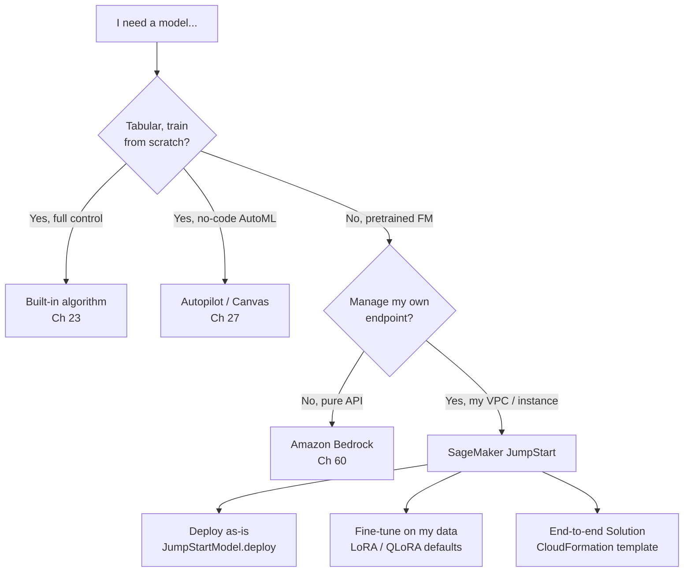
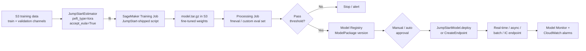
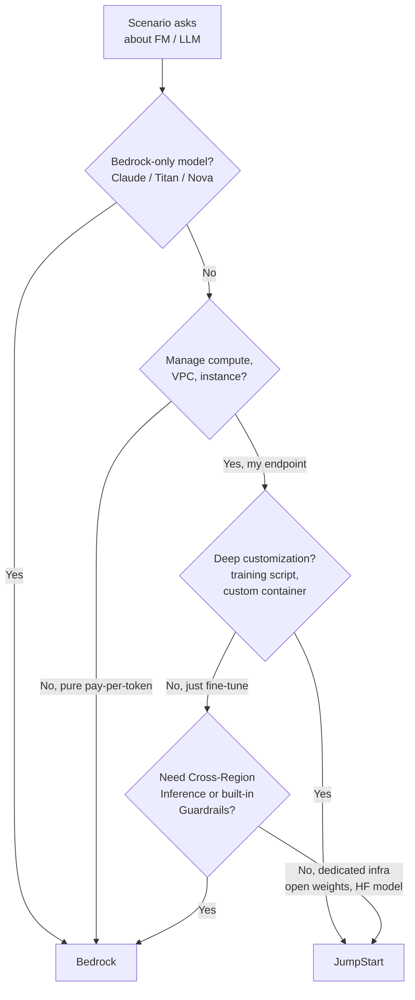

# Chapter 26 — SageMaker JumpStart: Foundation Models & Pre-Built Solutions

> **Goal of this chapter:** make you fluent in *what JumpStart is*, *what it ships that you cannot easily replicate yourself*, and *exactly when an exam scenario — or a real architecture meeting — wants JumpStart instead of Bedrock, instead of a built-in algorithm, instead of script mode with a Hugging Face DLC, instead of a Solution from another AWS team*. By the end you should be able to read any MLA-C01 scenario that mentions Llama / Mistral / Stable Diffusion / foundation models / "pre-built end-to-end ML workflow" and route it confidently, name the two SDK classes (`JumpStartModel`, `JumpStartEstimator`) and the one mandatory keyword argument (`accept_eula=True`), describe LoRA / QLoRA defaults from memory, articulate the JumpStart-vs-Bedrock decision rule out loud to a CFO, and recognize the four traps the exam reuses (EULA contract, Marketplace fees, `merge_lora_weights=False` for multi-tenant serving, and the "Bedrock default vs JumpStart's specific justifying constraint" framing). Where [Chapter 23](23_builtin_algorithms.md) gave you the catalog of *AWS-trained* algorithms and [Chapter 24](24_script_mode.md) gave you the path to your own training script, this chapter covers the third leg of the SageMaker model-acquisition stool: *AWS-curated pretrained model weights, deployable in one SDK call, fine-tunable in two.*

---

## 26.1 What JumpStart actually is

JumpStart is **a model hub plus a solutions hub baked into SageMaker Studio**, fronted by two Python-SDK classes (`JumpStartModel`, `JumpStartEstimator`) and a Studio UI that lets you browse, deploy, fine-tune, and evaluate hundreds of pretrained models without writing the boilerplate you'd write to do the same from a vanilla Hugging Face DLC. The most important fact about JumpStart for the exam — and one almost every study guide gets wrong by implication — is that **there is no "JumpStart service."** No ARN namespace, no separate billing line, no separate IAM action verb. Every resource JumpStart produces — a training job, an endpoint, a model artifact in S3, a model package in the registry — is a vanilla SageMaker resource that any non-JumpStart code path could have produced. JumpStart is a *curation and packaging layer* sitting on top of SageMaker training and hosting. That's the whole architectural story.

What it gives you, concretely:

| Capability | What JumpStart adds | What you'd otherwise do |
|---|---|---|
| Curated model catalog | Hundreds of foundation models + pretrained CV/NLP models, each with maintained Deep Learning Container (DLC) bindings and supported instance lists | Browse Hugging Face, pick a DLC tag from `aws/deep-learning-containers`, write `serving.py`, handle tokenizer/config download and license acceptance yourself |
| Pre-baked inference container | Each JumpStart model ships with a tested inference handler (TGI / DJL / vLLM / framework-specific) so streaming, batching, and prompt formatting "just work" | Build or extend a container, decide between TGI and DJL, debug the streaming response contract |
| Pre-baked training script | `JumpStartEstimator.fit()` runs an opinionated training script (LoRA/QLoRA for LLMs, full SFT for vision) you didn't write | Author a HF Trainer / PEFT / Accelerate script, mount channels, manage chat templates and tokenizer quirks |
| EULA enforcement | `accept_eula=True` is gated *at the SDK level* for licensed models so deploys can't accidentally bypass the license | Manually agree on the Hugging Face model page and stash a token in your container |
| Solution templates | End-to-end use-case stacks (churn, fraud, demand forecasting) that deploy via CloudFormation | Write the CFN yourself |
| Private Hub | Curated, approved org-internal model catalog with role-based access | Build an internal model registry from scratch with custom IAM scaffolding |
| Evaluation framework | One-click text-generation eval against built-in benchmarks + LLM-as-judge, backed by the open-source `fmeval` library | Stand up your own eval harness on a Processing job |

What it does *not* give you — and the exam will use these as wrong-answer distractors:

- **No global API endpoint.** Invoking a JumpStart model always means invoking *your own* SageMaker endpoint. There is no `jumpstart.amazonaws.com` URL the way Bedrock has `bedrock-runtime`.
- **No serverless pay-per-token.** Pricing is SageMaker hourly compute (plus, for some models, a Marketplace fee — §26.7). If the endpoint sits idle overnight, you pay for the instance hours.
- **No model-router, no cross-region failover.** That's Bedrock Cross-Region Inference; JumpStart inherits SageMaker Hosting's per-region semantics.
- **No Guardrails.** JumpStart models don't get Bedrock Guardrails out of the box. You wire in your own content filtering (Comprehend toxic-content detection, a self-hosted classifier, third-party tooling) at the application layer.

> ⚠️ **Exam alert — the Bedrock default vs JumpStart's specific justifying constraint.** AWS's own [decision guide](https://docs.aws.amazon.com/decision-guides/latest/bedrock-or-sagemaker/bedrock-or-sagemaker.html) frames the choice this way and the cert echoes it: **Bedrock is the default for foundation-model workloads; JumpStart is the answer when one of a small number of specific constraints bites** — open weights required, model not in Bedrock's catalog, deep fine-tuning control needed, sustained high throughput past the per-token break-even, or sub-150ms first-token latency on dedicated GPUs. If a scenario question doesn't name a constraint that justifies dedicated compute, the right answer is almost always Bedrock. The exam loves to dangle "managed, no infra to maintain, pay only for what you use" in the question stem — that's the Bedrock signature.

The rest of this chapter is built around that framing. We define what's inside JumpStart, what's outside, and the decision rules between them.



---

## 26.2 The model hub — providers, categories, and licenses

### 26.2.1 Providers

As of the 2025–2026 catalog, JumpStart aggregates models from roughly a dozen providers. The exam will not test specific model versions; it will test the *pattern* — "Cohere = Marketplace = subscribe first" and "Llama = EULA = `accept_eula=True`."

| Provider | Notable models | License pattern |
|---|---|---|
| **Meta** | Llama 2 (7B/13B/70B), Llama 3 (8B/70B), Llama 3.1 (8B/70B/405B), Llama 3.2 (1B/3B + 11B/90B Vision), Code Llama | Llama Community License (EULA gated) |
| **Mistral AI / Hugging Face** | Mistral 7B, Mixtral 8x7B, Mistral Small / Large | Apache 2.0 (open) or Mistral Research License (non-commercial unless purchased) |
| **Stability AI** | Stable Diffusion XL, Stable Diffusion 3 Medium, SDXL Turbo | CreativeML Open RAIL++-M (EULA) |
| **AI21** | Jurassic-2 (Ultra / Mid / Light), Jamba 1.5 | Proprietary — **AWS Marketplace subscription required** |
| **Cohere** | Command, Command Light, Command R / R+, Embed | Proprietary — Marketplace |
| **AWS** | Trainium-optimized Llama, AWS-published code models, Alexa Teacher models | Mostly Apache 2.0 / ATM license |
| **TII** | Falcon 7B / 40B / 180B | TII Falcon License |
| **Google** | Gemma, FLAN-T5 (XL/XXL), T5 | Gemma Terms / Apache 2.0 |
| **Microsoft** | Phi-3 (mini / small / medium) | MIT-style |
| **DeepSeek** | DeepSeek-Coder, DeepSeek-Math | Permissive with use restrictions |
| **Salesforce** | CodeGen, CodeT5 | BSD / Apache 2.0 |
| **BigScience** | BLOOM, BLOOMZ | BigScience RAIL v1.0 |

Three things worth pinning before we move on. **First**, the Hugging Face long tail (think `intfloat/e5-large-v2`, `BAAI/bge-base-en-v1.5`, exotic biomedical or legal fine-tunes) shows up under "Hugging Face" as a category in JumpStart — you get a curated subset surfaced in the UI, but the *full* HF Hub is reachable only through script mode or BYOC. **Second**, what is *not* in JumpStart is as important as what is: **Anthropic Claude is not in JumpStart. Amazon Titan is not in JumpStart. Amazon Nova is not in JumpStart.** All three are Bedrock-only families. If a scenario names Claude / Titan / Nova, the answer is Bedrock by elimination. **Third**, the proprietary providers (AI21, Cohere) gate deployment behind an **AWS Marketplace subscription**, per account and per region — and that gate is the source of one of the two big pricing surprises the cert tests (§26.7).

### 26.2.2 Task categories

JumpStart partitions models by *task*, and the Studio UI lets you filter by category:

- **Text generation** (LLMs — chat, completion, instruct variants).
- **Text-to-image** (Stable Diffusion family, FLUX where available).
- **Image-to-text / VQA** (Llama 3.2 Vision, LLaVA, BLIP-2).
- **Text embedding** (BGE, E5, GTE, Cohere Embed — *not* Titan Text Embed, which is Bedrock-only).
- **Named entity recognition (NER)**.
- **Sentiment / text classification**.
- **Object detection / instance segmentation / semantic segmentation** (vision pretrained, YOLO, DETR variants).
- **Image classification**.
- **Question answering** (extractive QA via BERT / RoBERTa variants).
- **Code generation** (Code Llama, StarCoder, CodeGen, DeepSeek Coder).
- **Tabular** (XGBoost / LightGBM / CatBoost / TabTransformer wrapped as JumpStart "recipes" — these overlap with the built-in-algorithms catalog from [Ch 23](23_builtin_algorithms.md)).
- **Recipe** — a newer category of pre-configured *fine-tuning* recipes for popular FMs (e.g., a SmolVLM recipe, a Llama-3-instruct DPO recipe).
- **Fine-tuning-ready** — a cross-cutting tag for any model that exposes a `JumpStartEstimator` interface.

### 26.2.3 The model card — "deployable" vs "trainable"

Every JumpStart model has a **model card** in Studio that exposes:

- `model_id` — the stable string used in the SDK, e.g. `meta-textgeneration-llama-3-8b-instruct`.
- `model_version` — a semver-like string; `"*"` means latest, otherwise pin (e.g. `"2.0.1"`).
- Supported tasks.
- Default + supported instance types — each model has a *minimum* and *recommended* instance. Llama 3 70B requires multi-GPU; FLAN-T5 XL is fine on `ml.g5.2xlarge`.
- A **Deployable** badge — one-click → endpoint.
- A **Fine-tunable** badge — one-click → training job. *Only* present if a JumpStart training script ships for that model.
- License text + EULA link.
- A sample notebook (read-only template you can open in Studio).

> **Exam-critical asymmetry:** **the deployable set is larger than the fine-tunable set.** Not every JumpStart model is fine-tunable. If a question says "I want to fine-tune Llama 3.1 405B in JumpStart" — note that 405B was *deployable* well before any fine-tune recipe shipped (the instance footprint for a one-click LoRA on 405B is enormous; AWS published the QLoRA recipe later in a [dedicated blog post](https://aws.amazon.com/blogs/machine-learning/fine-tune-meta-llama-3-1-models-for-generative-ai-inference-using-amazon-sagemaker-jumpstart/), but it requires 4× `ml.p5.48xlarge` and is not a default UI option). For exam purposes, expect the 7B / 8B / 13B fine-tune story to be tested, not the giant variants.

### 26.2.4 Licenses — the families you need to recognize

AWS's [Model sources and license agreements](https://docs.aws.amazon.com/sagemaker/latest/dg/jumpstart-foundation-models-choose.html) page lays out the contract: *"Be sure to review the license for any foundation model that you use. You are responsible for reviewing and complying with any applicable license terms and making sure they are acceptable for your use case before downloading or using the content."* The license families you'll see, ordered roughly by permissiveness:

- **Apache 2.0** — Mistral 7B base, BLOOMZ, AWS-published, many HF models. Most permissive; commercial use unrestricted, attribution required.
- **MIT** — Phi-3, a few others. Effectively as permissive as Apache 2.0 for most purposes.
- **Llama Community License** — Meta Llama family. Permissive for commercial use *up to* 700M monthly active users (the famous "Facebook clause"). EULA acceptance required at deploy time.
- **Gemma Terms of Use** — Google Gemma family. EULA required, includes use restrictions.
- **CreativeML Open RAIL++-M** — Stable Diffusion family. Usage restrictions on harmful content; EULA required.
- **BigScience RAIL v1.0** — BLOOM. Similar to RAIL++.
- **Mistral Research License** — Mistral Large, some Mixtral variants. **Non-commercial** unless you buy a separate commercial license.
- **TII Falcon License** — Falcon family. Permissive but with attribution / use restrictions.
- **Proprietary** — AI21, Cohere, some vertical-specialist models. Gated through **AWS Marketplace subscription**; the model won't deploy until you've subscribed to the Marketplace product in the AWS console.

The cert won't ask you to recite a license clause. It *will* ask scenario questions like "the data science team wants to fine-tune Mistral Large for a commercial product" — the right answer involves recognizing that you need the *commercial* Mistral license, not the Research License, before you start.

---

## 26.3 The two SDK objects you must know cold

The entire JumpStart Python surface area for the exam reduces to two classes. Memorize their signatures.

### 26.3.1 `JumpStartModel` — for inference

```python
from sagemaker.jumpstart.model import JumpStartModel
from sagemaker.serverless import ServerlessInferenceConfig
from sagemaker.async_inference import AsyncInferenceConfig

model = JumpStartModel(
    model_id="meta-textgeneration-llama-3-8b-instruct",
    model_version="*",                # pin in prod, e.g. "2.0.1"
    instance_type="ml.g5.2xlarge",    # JumpStart picks a sensible default if omitted
    role=execution_role,
)

predictor = model.deploy(
    accept_eula=True,                 # MANDATORY for licensed models
    endpoint_name="llama3-8b-instr",
    initial_instance_count=1,
    # Optional alternate endpoint shapes:
    # serverless_inference_config=ServerlessInferenceConfig(memory_size_in_mb=4096,
    #                                                       max_concurrency=10),
    # async_inference_config=AsyncInferenceConfig(output_path="s3://my-bucket/async/"),
)

response = predictor.predict({
    "inputs": "Explain SageMaker JumpStart in one sentence.",
    "parameters": {"max_new_tokens": 128, "temperature": 0.2},
})
```

Things to recognize on the exam:

- `accept_eula=True` is **required at deploy time for EULA-gated models** — Llama, Mistral commercial variants, Gemma, Stable Diffusion. The SDK call raises an explicit exception if you skip it. There is no CLI / console workaround.
- The default deployment shape is **real-time** — a single `Endpoint` backed by an `EndpointConfig` and a `Model`. This is identical to any other SageMaker hosted model; JumpStart adds nothing to the runtime contract.
- For **serverless** inference you pass `serverless_inference_config=ServerlessInferenceConfig(memory_size_in_mb=..., max_concurrency=...)`. Serverless has hard limits (≤6 GB memory, **no GPU**), so it only fits small embedding / classification models — *not* Llama 3 8B, *not* Mistral 7B, *not* Stable Diffusion.
- For **async** inference you pass `async_inference_config=AsyncInferenceConfig(output_path="s3://...")`. Use this for long prompts (>60 s end-to-end), large payloads, or batched summarization where the caller can poll an S3 location for output.
- For **batch transform** you call `model.transformer(...)` and then `.transform("s3://input/")`, exactly like any other SageMaker model.

### 26.3.2 `JumpStartEstimator` — for fine-tuning

```python
from sagemaker.jumpstart.estimator import JumpStartEstimator

estimator = JumpStartEstimator(
    model_id="meta-textgeneration-llama-3-8b",   # base model, not the -instruct variant
    instance_type="ml.g5.12xlarge",
    role=execution_role,
    hyperparameters={
        "epoch": "3",
        "learning_rate": "5e-5",
        "instruction_tuned": "True",
        "chat_dataset": "False",
        "peft_type": "lora",              # LoRA is default; "qlora" also supported
        "lora_r": "8",
        "lora_alpha": "32",
        "lora_dropout": "0.05",
        "max_input_length": "1024",
        # For multi-tenant LoRA serving (§26.10):
        # "merge_lora_weights": "False",
    },
)

estimator.fit(
    {
        "train":      "s3://my-bucket/llama-finetune/train/",
        "validation": "s3://my-bucket/llama-finetune/val/",
    },
    accept_eula=True,                     # required for fit() on EULA models
)

# Deploy the fine-tuned artifact (no second EULA accept needed — AWS docs)
predictor = estimator.deploy(
    instance_type="ml.g5.2xlarge",
    initial_instance_count=1,
)
```

Things to recognize:

- The default PEFT method for LLM fine-tuning in JumpStart is **LoRA**, with **QLoRA** available via `peft_type="qlora"`. **Full-parameter SFT is not the default.** If a scenario insists on full SFT, you either (a) override the training script — at which point you've effectively left JumpStart and you're in script-mode land with a Hugging Face DLC ([Ch 24](24_script_mode.md)), or (b) write a vanilla custom training job.
- The `instruction_tuned` / `chat_dataset` toggle determines the prompt template the training script applies. Use one or the other, not both. Get the chat template wrong and your fine-tune learns garbage — Llama 3 expects `<|begin_of_text|><|start_header_id|>user<|end_header_id|>...` and the JumpStart script *does not* apply it for you if you toggle the wrong flag.
- After `fit()`, the model artifact (`model.tar.gz`) lands in the estimator's S3 output path. The fine-tuned model is now **just a SageMaker `Model`** — you can:
  - `.deploy()` it directly,
  - wrap it in a `JumpStartModel(...)` if you need to redeploy from a saved `model_data` later,
  - register it in the **Model Registry** as a `ModelPackage`,
  - export the image / weights to ECR for cross-account use.
- After fine-tuning, the weights are no longer the original Meta weights, so **EULA acceptance is no longer programmatically required at deploy time** for the *fine-tuned* artifact (per AWS docs). The upstream license still applies legally — you accepted it once at training time — but the SDK flag is not required for the redeploy.

> ⚠️ **Exam alert — the `accept_eula=True` contract.** This keyword argument is the single most-tested mechanical detail in JumpStart. Three rules to memorize: **(1)** it's mandatory at `.deploy()` time for licensed-model deployments; **(2)** it's mandatory at `.fit()` time for licensed-model fine-tunes; **(3)** it's *per account*, not per organization — accepting in dev does not propagate to prod, so bake it into your IaC. The Marketplace subscription (for AI21/Cohere etc.) is also per-account *and* per-region — subscribing to Cohere Command in `us-east-1` does not entitle you to deploy in `us-west-2`. If a question mentions "the deploy failed with an EULA error in production but worked in dev," the answer is one of these three.

### 26.3.3 Helper APIs you may see

- `JumpStartModel.list_jumpstart_models(filter=...)` — programmatic catalog query. Useful for "list every Llama-3 fine-tunable model" sweeps.
- `JumpStartModel.list_versions(model_id=...)` — list all available versions for a given `model_id`.
- The boto3 surface for the Private Hub: `sagemaker.create_hub`, `sagemaker.import_hub_content`, `sagemaker.describe_hub` (§26.9).
- There is **no `aws sagemaker jumpstart-*` CLI verb**. Everything goes through the standard `sagemaker` API surface; JumpStart is a Python-SDK + Studio-UI abstraction over those primitives.

---

## 26.4 Deployment shapes inside JumpStart

JumpStart endpoints are just SageMaker endpoints, so they support the full hosting menu we will detail in [Ch 35](../part_g_deployment_orchestration/35_endpoint_types.md). The JumpStart-specific caveats are what the exam tests:

| Shape | When | JumpStart caveat |
|---|---|---|
| **Real-time** (`Endpoint`) | Default. Interactive LLM chat, low-latency CV inference | Most JumpStart LLMs ship with a TGI (Text Generation Inference) or LMI/vLLM container that supports streaming responses on a single endpoint. |
| **Serverless inference** | Tiny models (embeddings, classifiers, small T5) with bursty / unpredictable traffic | Hard limits: ≤6 GB memory, **no GPU**. Llama, Mistral, Stable Diffusion → not eligible. |
| **Async inference** | Long-running generations (>60 s), large prompt payloads, queue-style batched summarization | Output written to S3; queue-based. Great for "summarize this 100-page PDF" use cases where the caller polls. |
| **Batch transform** | Bulk scoring over an S3 dataset | Spins up ephemeral instances per job; pay per duration; no live endpoint. Often paired with JumpStart vision models for offline classification of millions of images. |
| **Multi-model endpoint (MME)** | Many small fine-tuned variants sharing one host | Requires container with MME support — *most JumpStart LLM containers are not MME-compatible*. MME works best with small JumpStart CV / NLP models. See [Ch 39](../part_g_deployment_orchestration/39_mme_mce.md). |
| **Inference Components (IC)** | Pack multiple LLMs on a single GPU-rich instance with independent scaling per model | Supported for JumpStart LLM containers since late 2024; the modern way to fit several 7B-class models on one `ml.g5.48xlarge`. |

**Exam pattern.** "I want to host Llama 3 8B and Mistral 7B on the *same* `ml.g5.48xlarge` and scale each independently." → **Inference Components**, not MME. MME and IC look superficially similar but solve different problems: MME loads/unloads small homogeneous models on demand from S3; IC packs heterogeneous large models with independent autoscaling on a shared instance. We'll spend more time on this in [Ch 39](../part_g_deployment_orchestration/39_mme_mce.md).

**Exam pattern.** "I need cheap hosting for an embedding model that gets 50 requests/hour with sub-second latency." → **Serverless inference on a JumpStart embedding model.** Most embedding models (BGE-base, E5-small) fit the 6 GB serverless ceiling and don't need GPUs. Real-time would burn money on an idle endpoint 23 hours a day.

**Exam pattern.** "I want to run Stable Diffusion XL generations from a queue, with users picking up images from S3 30–60 seconds later." → **Async inference on a JumpStart SDXL model.** SDXL doesn't fit serverless (it needs a GPU), and a real-time endpoint would mean clients waiting on synchronous HTTP for 30+ seconds.

---

## 26.5 JumpStart fine-tuning — LoRA, QLoRA, and the cost math

The fine-tuning story is where JumpStart's depth shows up. AWS has published a series of canonical posts that any AI architect on this path should have read at least once:

- [Fine-tune Llama 3 for text generation on JumpStart](https://aws.amazon.com/blogs/machine-learning/fine-tune-llama-3-for-text-generation-on-amazon-sagemaker-jumpstart/)
- [Fine-tune Meta Llama 3.1 models on JumpStart](https://aws.amazon.com/blogs/machine-learning/fine-tune-meta-llama-3-1-models-for-generative-ai-inference-using-amazon-sagemaker-jumpstart/)
- [Fine-tune Meta Llama 3.2 text generation models on JumpStart](https://aws.amazon.com/blogs/machine-learning/fine-tune-meta-llama-3-2-text-generation-models-for-generative-ai-inference-using-amazon-sagemaker-jumpstart/)
- [Fine-tune Code Llama on JumpStart](https://aws.amazon.com/blogs/machine-learning/fine-tune-code-llama-on-amazon-sagemaker-jumpstart/)
- Phil Schmid's deep dive on [Llama 3 with PyTorch FSDP + QLoRA on SageMaker](https://www.philschmid.de/sagemaker-train-deploy-llama3)

### 26.5.1 The two-line API and what it hides

The headline AWS likes to use, from the [two-lines-of-code blog post](https://aws.amazon.com/blogs/machine-learning/deploy-and-fine-tune-foundation-models-in-amazon-sagemaker-jumpstart-with-two-lines-of-code/):

```python
estimator = JumpStartEstimator(model_id="meta-textgeneration-llama-3-1-8b")
estimator.fit({"training": "s3://my-bucket/my-training-data/"})
```

Two lines is the marketing claim. What it hides is real, material, and exam-relevant:

| Hidden decision | Where it lives | Production impact |
|---|---|---|
| LoRA vs full fine-tune | `peft_type="lora"` (default for large models); `instruction_tuned=True` | A full fine-tune of Llama 3 70B is a 1-day, 8-node `p4d.24xlarge` job (~$20K). LoRA is a single-node, hours-long, ~$200 job. |
| `lora_r` / `lora_alpha` | Hyperparameters block | `lora_r=8, lora_alpha=32` is the JumpStart default; the [AWS Llama 3 post](https://aws.amazon.com/blogs/machine-learning/fine-tune-llama-3-for-text-generation-on-amazon-sagemaker-jumpstart/) calls out that you fine-tune *less than 1%* of Llama 3 8B's parameters at these settings. |
| QLoRA quantization (4-bit NF4) | `peft_type="qlora"` or `int8_quantization=True` with bnb config | Drops 8B fine-tune from a `p4d.24xlarge` to a single `g5.2xlarge` (~$1.50/hr vs ~$33/hr). The cost difference is the whole reason QLoRA exists. |
| FSDP sharding strategy | Custom training-script override | For 70B+ models, full sharding (`FULL_SHARD`) is necessary; for 8B, `HYBRID_SHARD` is faster. |
| Chat template | Prompt formatting in your CSV / JSONL | Get this wrong and the fine-tune learns garbage. JumpStart does *not* apply the template for you if you pass `chat_dataset=False`. |
| `merge_lora_weights` | Hyperparameter (default `True`) | `True` produces a merged 14GB+ checkpoint per fine-tune; `False` produces a ~30-300MB adapter-only artifact — the foundation of multi-tenant LoRA serving (§26.10). |

### 26.5.2 Concrete cost reference points

Rough order-of-magnitude costs for a single fine-tune pass on a few thousand instruction examples (1 epoch, sequence length 2048), from the public posts and practitioner logs:

| Model | Method | Instance | Wall time | Spot cost (est.) |
|---|---|---|---|---|
| Llama 3 8B | QLoRA | 1× `ml.g5.2xlarge` | 2–4 hr | $2–5 |
| Llama 3 8B | LoRA (fp16) | 1× `ml.g5.12xlarge` | 1–2 hr | $7–15 |
| Llama 3 70B | QLoRA | 1× `ml.p4d.24xlarge` | 3–6 hr | $70–150 (no spot for p4d) |
| Llama 3.1 405B | QLoRA | 4× `ml.p5.48xlarge` | 6–12 hr | $1,500–3,500 |
| Mistral 7B Instruct | QLoRA | 1× `ml.g5.2xlarge` | 1–3 hr | $1–4 |
| Stable Diffusion XL | full SFT (DreamBooth) | 1× `ml.g5.2xlarge` | 30–90 min | $1–3 |

Compare these to Bedrock fine-tuning, which is opaque (priced per fine-tuning-unit hour) but typically lands in the $20–200 range for an equivalent small-model job and scales steeply for larger models — and Bedrock 405B fine-tune simply isn't available as of this writing. That asymmetry is the technical argument for JumpStart fine-tune even when Bedrock could host the resulting model.

### 26.5.3 The QLoRA fp8 deployment trick

After QLoRA fine-tuning, the LMI container can quantize the merged weights to fp8 precision so that a 70B fine-tune deploys on a single `ml.p5.48xlarge` rather than needing a multi-instance configuration. The [Llama 3.1 405B post](https://aws.amazon.com/blogs/machine-learning/fine-tune-meta-llama-3-1-models-for-generative-ai-inference-using-amazon-sagemaker-jumpstart/) walks through the exact recipe. This is the kind of detail that doesn't show up on the cert but doubles or halves your deploy cost in real life — without fp8 the deploy cost roughly doubles.

### 26.5.4 The fine-tune → registry → deploy flow

Here's the canonical pipeline an MLE wires up for a JumpStart fine-tune in production. The exam will hand you scenarios that pattern-match to a subset of these steps; recognize the shape end-to-end.



Every node in this graph is a vanilla SageMaker primitive. JumpStart's contribution is the first two and the last two — it gives you the curated training script, the EULA handling, and the deployment containers. Everything in the middle (eval, registry, approval, monitoring) is exactly the same as for a script-mode or BYOC model.

---

## 26.6 JumpStart Solutions — pre-built templates

JumpStart Solutions are *not* models. They're **end-to-end CloudFormation stacks** for canonical use cases. The catalog includes (non-exhaustive):

- **Predict churn with text and tabular data** — SageMaker training job + Lambda + endpoint.
- **Fraud detection in financial transactions** — GNN / Neptune-backed solution (the [sagemaker-graph-fraud-detection](https://github.com/awslabs/sagemaker-graph-fraud-detection) repo is the canonical example).
- **Predictive maintenance for vehicle fleets**.
- **Demand forecasting** (DeepAR-based).
- **Document understanding** (Textract + LLM RAG).
- **Computer vision pipeline** (image classification + object detection orchestration).
- **Document summarization with foundation models**.
- **Privacy-preserving ML for healthcare**.

Each solution drops:

- A **CloudFormation stack** (so you can tear it all down with one delete).
- One or more **Jupyter notebooks** in Studio showing the use-case-specific data prep, training, deployment.
- An **IAM role** scoped to the solution's resources.
- **S3 buckets / artifacts** with sample data.

### 26.6.1 The honest framing — mostly demos

For the MLA-C01: know that solution templates exist, know they're one-click CloudFormation-backed end-to-end workflows, know the canonical categories (fraud, churn, personalization, demand forecasting, document understanding, predictive maintenance). The exam will ask "the data science team wants a reference architecture they can take and modify, not just a model — what does AWS recommend?" The blessed answer is **JumpStart Solution**, not "SageMaker Pipelines + a CloudFormation template you write from scratch."

For the field: treat them as **instructive demos and copyable patterns, not as production-ready systems.** In every conversation with AWS field SAs and customer ML platform leads, the same pattern emerges — solution templates are used in the demo and proof-of-concept phase, and almost never in production as-is. The reasons are mundane and consistent:

| Used for | Not used for |
|---|---|
| Internal lunch-and-learns ("here's how SageMaker does fraud detection in one click") | The actual production fraud detection model |
| Sales-engineering POCs to prospects | Anything with a real SLA |
| Architect onboarding to SageMaker | Anything with real data volumes |
| A starting-point skeleton you copy and gut | A pipeline you adopt unchanged |

Concretely:

1. **The sample data isn't your data.** The notebook is wired to a public dataset (IEEE-CIS for fraud, the Telco churn dataset for churn). Adapting the feature engineering to your schema is the same work as building from scratch.
2. **The model choice is generic.** XGBoost on tabular fraud features is the default for the JumpStart fraud template; a real fraud system probably wants a hybrid of gradient boosting + a GNN on the customer-merchant graph + a sequence model on the transaction history. The template ships only the first.
3. **The MLOps is missing.** The template gives you a notebook, not a CI/CD pipeline, not a Model Registry hookup, not Feature Store integration, not Model Monitor wiring. Production teams need all of those.
4. **The CloudFormation is monolithic.** It's easier to copy the relevant snippets into your own Terraform / CDK than to inherit and parametrize the template's CFN.

The exception that proves the rule: at organizations brand-new to SageMaker, the solution templates do see production-ish use as **starter kits** — the platform team uses the churn-prediction template as the skeleton for their first model, then progressively replaces every component over six months. By the time it's in real production, none of the original template's code remains. The template was scaffolding.

> ⚠️ Cost gotcha: deploying a Solution can spin up multiple resources (endpoint + Lambda + S3 + sometimes RDS / Neptune). Always tear down the CFN stack when done — otherwise you're paying for an idle endpoint and possibly a Neptune cluster. The "I forgot to tear down the demo and got a $4K bill" failure mode is very real.

---

## 26.7 Pricing — what you actually pay

JumpStart itself is **free**. You pay for the underlying SageMaker resources it provisions, plus (for proprietary models) a Marketplace fee. The pricing claim AWS makes — *"There is no additional charge for using JumpStart models or solutions; you will be charged for the underlying Training and Inference instance hours used"* — is true for the public-hub open-weights models. It is **not** true for the subset of models that route through AWS Marketplace, and that distinction has caused finance-team surprises in real billing cycles.

| You provision | You pay |
|---|---|
| Training job from `JumpStartEstimator.fit()` | SageMaker Training per-instance-hour for the chosen instance type (e.g., `ml.g5.12xlarge` ~$7.09/hr us-east-1) + S3 + CloudWatch logs |
| Real-time endpoint from `.deploy()` | SageMaker Hosting per-instance-hour, *as long as the endpoint exists* — even idle, 24/7 |
| Serverless endpoint | Per-request + per-GB-second of memory consumed |
| Async endpoint | Per-instance-hour while the worker pool is up + per-request S3 ops |
| Batch transform | Per-instance-hour for the duration of the job |
| Solution stack | Sum of every resource the CFN creates (endpoint + Lambda + storage + ...) |
| Proprietary model (AI21, Cohere, some Stability variants) | Above SageMaker cost **plus** a Marketplace per-hour or per-token fee published on the model's Marketplace listing |

### 26.7.1 The Marketplace fee gotcha

A non-trivial fraction of JumpStart-visible models — typically vendor-published proprietary models, some Stability AI variants, some industry-specific (financial, healthcare) models — are surfaced in JumpStart via [AWS Marketplace](https://aws.amazon.com/marketplace/pp/prodview-2tht3y6us3xow). The model card in JumpStart looks identical to a free open-weights model: same Deploy button, same hyperparameter form. But the billing path is different. AWS Marketplace's vendor adds an **hourly software fee on top of the underlying EC2 / SageMaker instance fee**, billed through Marketplace.

In practice, a `ml.g5.12xlarge` that lists at $7.09/hr SageMaker on-demand can come in at $9–15/hr once the Marketplace software fee is applied. For a 24×7 endpoint that's the difference between ~$5,200/month and $7,000–11,000/month — a **30–110% delta** that doesn't show up in any SageMaker pricing-page estimate.

How to spot it before it ships:

1. **The model card explicitly references a Marketplace product.** Look for the AWS Marketplace logo and a "Subscribe in AWS Marketplace" or "Continue to subscribe" button before the Deploy step. Free JumpStart models go straight to Deploy.
2. **First-time deployment requires a Marketplace subscription click-through.** If you're prompted to accept a vendor EULA and a per-hour software fee, that's the gotcha.
3. **The pricing tab shows an additional "Software" line.** AWS Marketplace surfaces both rates: infrastructure + software.

A well-run platform team gates JumpStart Marketplace deployments behind a FinOps approval flow — typically by IAM-denying `aws-marketplace:Subscribe` on engineering roles and routing all Marketplace subscriptions through a finance-approved central account. This is the same anti-pattern that hit organizations with surprise Datadog or Snowflake Marketplace bills before Marketplace governance matured.

> ⚠️ **Exam alert — Marketplace fees on top of compute.** When the question hands you a JumpStart cost-modeling scenario and one of the options is "the bill is higher than the SageMaker pricing calculator predicted because the model is sold through AWS Marketplace and incurs an additional per-hour software fee on top of the instance hours" — that's almost always the right answer if the model in the scenario is AI21, Cohere, or a vertical-specialist proprietary model. The free, open-weights models (Llama, Mistral, Falcon, Phi, Gemma) never trigger this surcharge. Build the three-column cost spreadsheet: **instance hours × instance rate**, **storage**, **Marketplace software fee (if applicable)** — never the two-column version.

### 26.7.2 Cost-modeling shortcut for the exam

**"Need to minimize idle cost for an unpredictable, low-RPS LLM workload"** → if the model fits the serverless limits (≤6 GB, no GPU), serverless. If it doesn't (Llama-class), **Bedrock on-demand**, not JumpStart real-time. The exam loves to dangle JumpStart as a wrong answer here precisely because junior candidates default to "if it's an LLM, it must be JumpStart."

---

## 26.8 Model evaluation in JumpStart — `fmeval`

JumpStart Studio includes a **built-in text-generation evaluation framework** (released 2024). The mechanics:

1. Pick a foundation model from the JumpStart catalog (deployed *or* not — you can evaluate a model card directly without standing up an endpoint, by spinning up a one-shot evaluation endpoint).
2. Pick an **evaluation task**: question-answering accuracy, summarization quality, toxicity, factual knowledge, semantic robustness, prompt stereotyping.
3. Pick a **dataset**: either a built-in benchmark (BoolQ, TriviaQA, WikiText, RealToxicityPrompts, etc.) or a custom dataset uploaded to S3.
4. Pick an **evaluator**:
   - **Algorithmic** — ROUGE, BLEU, F1, accuracy. For tasks where ground truth exists.
   - **LLM-as-judge** — an evaluator model (typically Claude or Llama 3) scores the candidate model's outputs.
5. Launch the eval job. Internally this runs a SageMaker Processing job using **`fmeval`** — the open-source AWS Foundation Model Evaluations library, available on PyPI as `fmeval`.
6. Results — a downloadable HTML/JSON report with per-task scores and per-sample drill-down.

> Exam framing: **"How do I systematically compare two foundation models before picking one?"** → JumpStart evaluation (or the standalone `fmeval` library on a Processing job). Not Clarify (that's for tabular bias + SHAP). Not Model Monitor (that's for drift on a deployed endpoint, after the fact).

This is *also* the right answer for **"choose between an open-source FM and a fine-tuned variant before promoting to prod."** Both can be evaluated head-to-head with the same dataset and the same judge.

The `fmeval` library matters in its own right — it's the same engine the Studio UI calls, and you can use it directly from a notebook or a Processing job in a SageMaker Pipeline ([Ch 43](../part_h_monitoring_governance/43_pipelines_native.md)) to gate model promotion on eval scores. The pattern is: train fine-tune → run `fmeval` Processing step → `ConditionStep` checking ROUGE / BLEU / LLM-judge score → register-and-promote if pass, alert if fail. That `ConditionStep` is the production safety net for "we shipped a fine-tune that was actually *worse* than the base model."

---

## 26.9 JumpStart Private Hub — the enterprise catalog

The single most useful JumpStart enterprise feature, and one the cert barely mentions, is the **Private Hub**. Background reading: AWS's [launch post](https://aws.amazon.com/blogs/machine-learning/manage-amazon-sagemaker-jumpstart-foundation-model-access-with-private-hubs/), the [admin guide](https://docs.aws.amazon.com/sagemaker/latest/dg/jumpstart-curated-hubs-admin-guide.html), the [user guide](https://docs.aws.amazon.com/sagemaker/latest/dg/jumpstart-curated-hubs-user-guide.html), and the more recent [fine-tuning-in-Private-Hub post](https://aws.amazon.com/blogs/machine-learning/amazon-sagemaker-jumpstart-adds-fine-tuning-support-for-models-in-a-private-model-hub/).

### 26.9.1 The problem it solves

Without a Private Hub, every data scientist in the org sees the full public JumpStart catalog — a few hundred models with varying licenses (Apache 2.0, MIT, Llama Community License, Falcon License, Stability RAIL++, proprietary), varying provenance (Meta vs HF mirror vs AWS-fine-tuned variant), and varying approval status (vendor-supported, deprecated, community-only). In a regulated org you cannot allow a data scientist to one-click-deploy a model whose license forbids commercial use, or whose weights came from an unverified mirror. The Private Hub is the gate.

### 26.9.2 The pattern in practice

1. **Central ML platform team curates.** An admin role iterates through the public JumpStart hub, evaluates each candidate against the org's model risk framework (license OK, training data provenance OK, eval results within tolerance, no known data-leak issues, vendor support contract in place), and `ImportHubContent`s the approved ones into the org's Private Hub.
2. **IAM gates consumption.** Data scientists get IAM permission to `DescribeHub` and `ListHubContents` on the Private Hub, but not on the public hub. From their Studio, they see only approved models.
3. **Versions are pinned.** When Meta releases Llama 3.2 → 3.3, the Private Hub doesn't auto-upgrade. The platform team re-evaluates, runs regression evals against the org's prompt suite, then promotes a specific version. This decouples model-release cadence from production-deployment cadence — exactly the discipline SR 11-7 expects in banking.
4. **Cross-account sharing via AWS RAM.** A Fortune-500 with 30+ AWS accounts shares the Private Hub from a central "ml-models" account to all consumer accounts via AWS Resource Access Manager, preserving the single-curation, many-consumer pattern.
5. **Custom models go in too.** The Private Hub supports custom in-house models alongside JumpStart-imported ones — your org's own fine-tunes live in the same catalog as the upstream base models, with the same IAM and discovery semantics.

### 26.9.3 Fine-tuning from a Private Hub

The June 2024 launch of [fine-tuning support inside the Private Hub](https://aws.amazon.com/blogs/machine-learning/amazon-sagemaker-jumpstart-adds-fine-tuning-support-for-models-in-a-private-model-hub/) closed an awkward gap. Before, you could deploy a Private-Hub model but had to escape to the public hub to fine-tune it; now the entire lifecycle — discover, deploy, fine-tune, redeploy — happens inside the curated boundary. For a regulated org, that's the difference between "Private Hub is a useful catalog" and "Private Hub is the production substrate for all foundation-model work."

### 26.9.4 The shape that ships at a Fortune-500

A typical Private Hub at a regulated enterprise:

| Model | Why it's in the hub | Who uses it |
|---|---|---|
| Llama 3.1 70B Instruct | Internal-only fine-tune target | Customer service AI |
| Mistral 7B Instruct | Cheap latency-sensitive workloads | Search reranker, classifier |
| Mixtral 8x7B | MoE for code-heavy workloads | Internal devtools |
| Phi-3-Mini | Edge / offline scenarios | Mobile app team |
| BGE-large embedding | Vector search across all RAG apps | Platform team |
| Custom: support-ticket-classifier-v3 | In-house fine-tune of Mistral | CSAT team |
| Custom: clinical-summarizer-v1 | In-house, HIPAA-reviewed | Clinical informatics |

Three foundation models, a couple of variants, and a handful of in-house fine-tunes. Not three hundred. **The discipline of "what's not in the Private Hub" is the value.**

Boto3 sketch of the admin pattern:

```python
import boto3
sm = boto3.client("sagemaker")

sm.create_hub(
    HubName="acme-approved-models",
    HubDescription="Risk-approved FMs for AcmeCorp",
)

sm.import_hub_content(
    HubName="acme-approved-models",
    HubContentType="Model",
    HubContentName="meta-textgeneration-llama-3-8b-instruct",
    HubContentVersion="2.0.1",       # pinned, not '*'
    DocumentSchemaVersion="1.0.1",
)
```

For the exam, recognize the Private Hub as the right answer when the scenario says **"we need approved-only models exposed to data scientists in Studio"** or **"we need to add our internal model alongside the public JumpStart catalog with the same IAM model."**

---

## 26.10 Multi-adapter LoRA hosting — the 100× cost reduction story

The pattern that has displaced "one LoRA fine-tune per endpoint" in the last 18 months is **multi-adapter inference**: deploy the base model once, register hundreds of fine-tuned LoRA adapters against it, and route each request to the appropriate adapter. The economic argument is irresistible — a 7B base model on a `ml.g5.12xlarge` runs ~$7/hr; sharing that base across 50 customer-specific fine-tunes means $0.14/hr per customer fine-tune instead of $7. The AWS launch is [SageMaker Multi-Adapter Model Inference](https://aws.amazon.com/about-aws/whats-new/2024/11/amazon-sagemaker-multi-adapter-model-inference/), with the deep dive at [Easily deploy and manage hundreds of LoRA adapters with SageMaker efficient multi-adapter inference](https://aws.amazon.com/blogs/machine-learning/easily-deploy-and-manage-hundreds-of-lora-adapters-with-sagemaker-efficient-multi-adapter-inference/).

### 26.10.1 Container choice — LMI > Triton MME for this case

[Chapter 25](25_byoc.md) paired "multi-model on GPU" with Triton + MME. For **multi-LoRA-adapter** specifically, the production-blessed path is **SageMaker LMI containers with the vLLM or LMI-Dist backend**, not Triton MME. Reasons:

1. **vLLM has native LoRA support.** vLLM's PagedAttention plus its multi-LoRA inference path can hot-swap adapters without GPU memory thrashing; Triton MME treats each model as opaque and reloads.
2. **LMI integrates with SageMaker Inference Components.** The LMI container exposes adapters as first-class SageMaker `InferenceComponent`s — `create_inference_component(name="customer-A-adapter", ...)` and `delete_inference_component` with no endpoint redeployment.
3. **Memory tiering is built in.** `OPTION_MAX_LORAS` controls how many adapters live in GPU memory; `OPTION_MAX_CPU_LORAS` controls the CPU tier; overflow spills to local SSD. Triton MME has model-load/unload logic but isn't specifically optimized for LoRA's small-delta-on-shared-base profile.

### 26.10.2 The request-routing model

A multi-LoRA endpoint serves requests like this:

```python
sagemaker_runtime.invoke_endpoint(
    EndpointName="my-llama3-base",
    InferenceComponentName="customer-A-adapter",
    Body=json.dumps({"inputs": "...", "parameters": {...}}),
)
```

The `InferenceComponentName` tells the LMI container which LoRA delta to apply on top of the shared base weights for this specific request. From the caller's perspective it looks like distinct endpoints; from the infrastructure's perspective it's one base model, one container, one GPU pool, with the adapter weights paged in and out as needed.

### 26.10.3 The `merge_lora_weights=False` setting that gates everything

JumpStart's LoRA fine-tune flow produces, by default, a **merged** model — base weights + LoRA delta combined into a single 14GB+ checkpoint per fine-tune. For multi-tenant LoRA serving you want the *opposite*: the base stays singular, the adapter is the small delta. You get that by setting `merge_lora_weights=False` (or the equivalent in your custom training script) so the JumpStart estimator writes out only the adapter weights — typically 30–300MB depending on `lora_r`. Those small adapter artifacts are what you feed to the LMI multi-adapter container.

```python
estimator = JumpStartEstimator(
    model_id="meta-textgeneration-llama-3-8b",
    instance_type="ml.g5.12xlarge",
    hyperparameters={
        "peft_type": "lora",
        "merge_lora_weights": "False",   # <-- the critical setting
        "lora_r": "8",
        "lora_alpha": "32",
        # ...
    },
)
```

> ⚠️ **Exam alert — `merge_lora_weights=False` for multi-tenant LoRA hosting.** This subtle setting is the architectural decision that gates whether you can do multi-tenant LoRA serving at all. The default (`True`) produces fat, mutually-exclusive merged checkpoints — one endpoint per fine-tune, no sharing. The opposite (`False`) produces small adapter-only artifacts that the LMI container can hot-swap on a shared base. If a scenario asks "we want to host 100 per-customer fine-tunes of Llama 3 8B as efficiently as possible," the answer involves three things: `merge_lora_weights=False` during JumpStart fine-tuning, **LMI / vLLM** container at deploy time, and **Inference Components** as the routing primitive — not MME, not one endpoint per customer.

### 26.10.4 The economics

For an LLM-as-a-service platform with 100 customer-specific fine-tunes:

| Pattern | Endpoints | Instance cost | Per-customer cost |
|---|---|---|---|
| One fine-tune per endpoint, merged | 100 × `ml.g5.12xlarge` | ~$700/hr | $7/hr/customer |
| Multi-adapter on LMI | 1 × `ml.g5.12xlarge` | ~$7/hr | $0.07/hr/customer |

The 100× cost reduction is real. It's also why every SaaS company shipping per-customer LLM fine-tunes has converged on this architecture in the last 18 months. We'll come back to the MME / IC distinction in [Ch 39](../part_g_deployment_orchestration/39_mme_mce.md).

---

## 26.11 JumpStart in Studio Classic, new Studio, and Canvas — the migration story

JumpStart's UI surface has bifurcated over the past two years, and the migration semantics are exam-adjacent and field-essential.

### 26.11.1 The three surfaces

1. **JumpStart in Studio Classic** — the original 2020-era JupyterLab 3 interface. Browse models, click Deploy, get an endpoint. Documented at [JumpStart in Studio Classic](https://docs.aws.amazon.com/sagemaker/latest/dg/jumpstart-studio-classic.html).
2. **JumpStart in the new Studio** — the post-2023 unified UX (JupyterLab 4 + Code Editor + Canvas + MLflow + Pipelines). Models live in a Models landing page with deploy / fine-tune / evaluate tabs.
3. **JumpStart via Canvas** — the no-code business-analyst surface. The [Canvas + JumpStart fine-tune post](https://aws.amazon.com/blogs/machine-learning/transform-customer-engagement-with-no-code-llm-fine-tuning-using-amazon-sagemaker-canvas-and-sagemaker-jumpstart/) walks through it: a business analyst uploads a CSV, picks a JumpStart or Bedrock model, clicks Fine-tune, gets a deployed endpoint. Zero Python touched.

### 26.11.2 The deprecation timeline

Per [Migration from Studio Classic](https://docs.aws.amazon.com/sagemaker/latest/dg/studio-updated-migrate.html):

- **Nov 30, 2023.** The previous Studio experience is officially renamed "Studio Classic." The new Studio becomes default.
- **May 15, 2024.** JupyterLab 3 reaches end of maintenance. Critical fixes only.
- **Dec 31, 2024.** AWS stops providing critical-issue fixes for Studio Classic notebooks on JupyterLab 3.
- **Ongoing.** Studio Classic is still available for existing domains but **no longer available for onboarding** — you cannot create new Studio Classic apps in 2026.

Any team you walk into in 2026 that still has notebooks in Studio Classic is on borrowed time. For JumpStart specifically, the migration is mostly seamless — the catalog is the same backend, the SDK is identical, the endpoints look the same to downstream callers. The change is the UX skin around the same APIs.

### 26.11.3 Canvas as the third surface

The July 2024 [productionize-fine-tuned-models from Canvas](https://aws.amazon.com/about-aws/whats-new/2024/07/productionize-fine-tuned-foundation-models-sagemaker-canvas/) launch closed the last gap — Canvas fine-tunes can now go straight to a SageMaker real-time inference endpoint that production applications can call. The exam framing: **Canvas is no-code for business analysts, Studio is code-first for ML engineers, they share the same JumpStart backend.** The field reality: Canvas + JumpStart is becoming the on-ramp for line-of-business teams who want to do prompt-engineered fine-tunes without filing tickets to the ML platform team. It's a legitimately useful adoption pattern in 2026.

---

## 26.12 JumpStart vs Bedrock — the decision rule, expanded

This is the single most likely scenario question on the MLA-C01 from Task 2.1. Memorize the discriminators.



| Dimension | JumpStart | Bedrock |
|---|---|---|
| **Pricing model** | SageMaker hourly compute (+ Marketplace fee, sometimes) | Per-token on-demand or hourly Provisioned Throughput |
| **Idle cost** | Yes — endpoint keeps running until you delete it | No — on-demand is per-invocation |
| **VPC isolation** | Native — endpoint lives in your VPC | Possible via Bedrock VPC endpoints (PrivateLink), but the model still runs on AWS-managed multi-tenant infra |
| **Model catalog** | HF + Meta + Mistral + Stability + AI21 + Cohere + Falcon + Gemma + Phi + DeepSeek + ... (broader open-source coverage) | Anthropic + Amazon (Titan, Nova) + Cohere + AI21 + Meta (Llama via Bedrock) + Mistral + Stability (subset). **No HF long tail, no Falcon, no Phi, no DeepSeek.** |
| **Customization** | Full fine-tune control (LoRA / QLoRA defaults, hyperparameter override, custom training script possible) | Bedrock Custom Models — fine-tune Titan / Llama / Cohere with a managed job, narrower hyperparameter surface |
| **Inference container** | Open — TGI, DJL, vLLM, LMI; you control versions and can SSH in for debugging | Black box; no container access |
| **Cross-Region failover** | DIY (Route 53 + multi-region endpoints) | Built-in: Cross-Region Inference |
| **Guardrails** | DIY (Comprehend, custom filter, application layer) | Built-in: Bedrock Guardrails |
| **RAG plumbing** | DIY (Kendra / OpenSearch + Lambda) | Built-in: Bedrock Knowledge Bases |
| **Agents** | DIY (Step Functions + Lambda) | Built-in: Bedrock Agents |
| **Best for** | Custom fine-tunes, open-weights compliance, VPC-isolated workloads, niche models, sustained high throughput | API-simplicity workloads, Claude-specific use cases, RAG / Agents, guardrailed enterprise apps |

The pithy rule: **need control → JumpStart; need convenience → Bedrock.** The exam's favorite tie-breaker: **"need a Hugging Face model specifically" → JumpStart, always.**

### 26.12.1 The five constraints that justify JumpStart

In 2026 the AWS field has converged on a clear framing — Bedrock is the default, JumpStart is for specific constraints. The five that show up in real adoption decisions:

1. **Open weights are a hard requirement.** The model has to live in your VPC, on your encryption keys, on your instances. For a defense contractor, a clinical-trial sponsor, or a bank with a "no third-party model inference on covered data" control, Bedrock's multi-tenant inference fleet is disqualifying even with the BAA.
2. **The model isn't on Bedrock.** Code-specific models (StarCoder, DeepSeek-Coder), vision-language hybrids, specialized biomedical models (BioMedLM), and most of the HF long-tail are only reachable through JumpStart or direct SageMaker hosting.
3. **Fine-tuning depth.** Bedrock fine-tune exists but is API-driven, opinionated, and restricted to a curated subset of models with limited hyperparameter exposure. JumpStart hands you the full LoRA / QLoRA hyperparameter surface and lets you bring custom training scripts.
4. **Sustained high throughput.** Bedrock per-token pricing is wonderful up to a point and brutal past it. The break-even is somewhere around **500M tokens/month** at typical input/output ratios; at multi-billion tokens/month a provisioned `ml.g6e.48xlarge` running vLLM at 80% utilization is dramatically cheaper than Bedrock On-Demand or Bedrock Provisioned Throughput.
5. **Latency floor.** A JumpStart endpoint inside the same VPC and AZ as your application removes a network hop, a tenant-isolation queue, and the cross-AZ tax. For sub-150ms first-token latency at scale, a dedicated `ml.g6.12xlarge` JumpStart endpoint frequently beats Bedrock On-Demand.

The honest operational tax of a JumpStart deployment that the exam will not test: roughly **one platform engineer per ~20 long-lived JumpStart endpoints**, mostly spent on capacity right-sizing, scaling-policy tuning, base-model upgrades (every upgrade is a re-fine-tune + re-eval), and endpoint security review. That number is what decides whether Bedrock or JumpStart belongs in your roadmap.

We'll spend [Ch 62](../part_j_ai_services_genai/62_bedrock_vs_jumpstart.md) on this comparison in full, after we've built up the Bedrock side of the picture in [Ch 60](../part_j_ai_services_genai/60_bedrock_platform.md).

---

## 26.13 Operational integration points

JumpStart fits into the rest of SageMaker like any other model. The integration surface to remember:

| Other SageMaker feature | How it composes with JumpStart |
|---|---|
| **Model Registry** | Register the fine-tuned artifact as a `ModelPackage`, version it, gate on approval status, deploy from the approved package |
| **Pipelines** | `JumpStartEstimator.fit()` lives inside a `TrainingStep`; `JumpStartModel.deploy()` inside a `CreateModelStep` + `RegisterModel` step (see [Ch 43](../part_h_monitoring_governance/43_pipelines_native.md)) |
| **Model Monitor** | Attach Data Quality / Model Quality monitors to a JumpStart endpoint exactly like any other endpoint |
| **Clarify** | Bias and explainability work on JumpStart classification / regression models; for LLMs use the JumpStart eval framework (`fmeval`) instead |
| **Feature Store** | Not relevant for FMs (no tabular features); relevant if you're using JumpStart's tabular recipes |
| **Shadow Tests** | Route a percentage of live traffic to a JumpStart fine-tune as a shadow variant to compare against the current production endpoint |
| **Inference Recommender** | Run on a `JumpStartModel` to find the cheapest instance type that meets your latency / throughput SLO |
| **MLflow on SageMaker** | Track JumpStart fine-tune runs as MLflow experiments — both can register to the same Model Registry |
| **Canvas** | The no-code UI; under the hood, Canvas's "generative AI" tab calls JumpStart for FM tasks |

The MLOps integration is genuinely clean — `JumpStartEstimator` quacks like an `Estimator` for Pipelines' purposes, and `JumpStartModel` quacks like a `Model`. The MLOps overhead of using JumpStart inside Pipelines is essentially the same as using any other SageMaker training job inside Pipelines. AWS's [Implementing MLOps practices with JumpStart pre-trained models](https://aws.amazon.com/blogs/machine-learning/implementing-mlops-practices-with-amazon-sagemaker-jumpstart-pre-trained-models/) post walks through the canonical pipeline pattern.

Where this matters for the exam: questions of the form "which AWS service should you use to orchestrate a recurring fine-tune-and-deploy workflow for a JumpStart model" have the answer **SageMaker Pipelines**, not Step Functions, not Airflow on MWAA. The Pipelines + JumpStart integration is the exam-blessed pattern.

---

## 26.14 A customer reference — Workday

Public customer references for "we run JumpStart in production" are rarer than you'd expect; most enterprise GenAI references are framed as "we run SageMaker" or "we run Bedrock," with JumpStart being one of several SageMaker tools rather than a headline. AWS's [Workday case study](https://aws.amazon.com/solutions/case-studies/workday-case-study/) is the closest thing to a public JumpStart-at-scale story:

- Workday's engineers use JumpStart to compare and evaluate new foundation models.
- They fine-tune LLMs with high-quality data using SageMaker Notebook Instances for data prep and processing, then deploy to JumpStart endpoints.
- Pilot result: **5× improvement in ML inference latency** during a pilot analyzing job descriptions, invoices, and contracts.

That latency improvement is one of the cleanest public numbers for why a high-volume enterprise app picks JumpStart over Bedrock for hosted inference. It maps directly onto constraint #5 from §26.12.1 — when sub-150ms first-token latency at scale matters, a dedicated JumpStart endpoint inside the application's VPC frequently beats Bedrock On-Demand.

The implicit pattern across regulated industries (synthesizing field SA conversations, never on the cert directly):

- **Healthcare / payers (covered entities).** JumpStart + Private Hub + VPC-only endpoints + KMS encryption are the substrate. Bedrock with HIPAA BAA is fine for de-identified data; for PHI inference the architecture lands on JumpStart in a private subnet ~80% of the time.
- **Financial services.** Same pattern, driven by model-risk-management policies. The bank's MRM committee can audit a JumpStart endpoint's weights, data flow, and infra; they cannot audit Bedrock's underlying inference fleet in the same way.
- **Defense / public sector.** GovCloud restrictions push toward JumpStart + open-weights models; Bedrock's GovCloud catalog is a proper subset of commercial Bedrock.
- **High-volume consumer SaaS.** Bedrock for cold-start use cases, then JumpStart + multi-adapter LoRA serving (§26.10) once per-customer fine-tuning becomes the product differentiator.

---

## 26.15 Common gotchas — exam-flavored

1. **`accept_eula=True` is mandatory at deploy time for licensed models.** No CLI / console workaround — the SDK call fails with an explicit error if you skip it.
2. **EULA is per-account.** Accepting in dev does not propagate to prod. Bake it into your IaC.
3. **Marketplace subscription is per-account, per-region, per-product.** Subscribing to Cohere Command in `us-east-1` does not entitle you to deploy in `us-west-2`.
4. **`model_version='*'`** pulls the latest at the moment of the call. **Pin a specific version in production** so a new model release doesn't silently change endpoint behavior on the next deploy.
5. **Default fine-tuning is LoRA / QLoRA, not full SFT.** If you need full-parameter fine-tuning, override the training script (and you're now in script-mode land) or write your own.
6. **Not every JumpStart model is fine-tunable.** Catalog lists Deployable and Fine-tunable as separate badges; the deployable set is larger.
7. **Serverless inference is GPU-less and ≤6 GB.** Llama / Mistral / Stable Diffusion → not serverless-eligible. The exam loves this trap.
8. **JumpStart is not Bedrock.** Anthropic Claude, Amazon Titan, Amazon Nova are *not* in JumpStart. If a scenario names any of the three, the answer is Bedrock by elimination.
9. **Solutions are CloudFormation.** Deleting the Solution from the Studio UI deletes the CFN stack — but if you removed the stack manually, the Studio UI listing won't auto-sync.
10. **JumpStart Private Hub vs Bedrock Custom Model Import** are different things. Private Hub *curates* public models for org consumption inside SageMaker. Bedrock Custom Model Import *brings your own weights* into Bedrock-managed hosting.
11. **`merge_lora_weights=True` (the default) blocks multi-tenant LoRA serving.** For LMI multi-adapter inference, set it to `False` so the artifact is the adapter delta, not the merged checkpoint.
12. **EULA on fine-tuned models** — per AWS docs, *"After fine-tuning a pre-trained model, the weights of the original model are changed. Therefore, when you deploy the fine-tuned model later, you do not need to accept a EULA."* The license still applies legally — you accepted it once at training time — but the programmatic flag is not required for redeploy.

---

## 26.16 Sample exam-style scenarios + answers

**Q1.** A team wants to deploy Llama 3.1 70B inside a non-internet-routable VPC for processing PHI. Latency target is interactive (sub-second per token). They have GPU quota for one `ml.p4d.24xlarge`. Which approach minimizes engineering work while meeting the constraints?

→ **JumpStart `JumpStartModel.deploy()` of `meta-textgeneration-llama-3-1-70b-instruct` to a real-time endpoint with `enable_network_isolation=True` and a VPC config.** Bedrock would expose the workload outside the VPC (PrivateLink helps but the model still runs on AWS-managed multi-tenant infra, harder to defend for HIPAA-PHI under some org policies); BYOC is more work.

**Q2.** A risk team must approve every foundation model before any data scientist can use it inside Studio. They want a single Studio surface showing only approved models.

→ **JumpStart Private Hub.** Add only the approved models; deny IAM access to the public hub via SCP.

**Q3.** A platform team needs to compare four candidate LLMs (Llama 3 8B, Llama 3.1 8B, Mistral 7B, Phi-3 mini) on their domain Q&A dataset before choosing one.

→ **JumpStart model evaluation** (or the standalone `fmeval` library on a Processing job) with the team's dataset and an LLM-as-judge evaluator. Run once per candidate, compare scores.

**Q4.** A startup wants an end-to-end demand-forecasting reference architecture they can ship in a week — including training pipeline, endpoint, sample dashboard.

→ **JumpStart Solution: Demand forecasting.** Deploys the whole stack via CloudFormation, including notebooks they can customize. (Field note: they will rewrite it before it sees production, but for a one-week POC, it's exactly the right tool.)

**Q5.** A team wants the cheapest hosting for an embedding model that gets 50 requests/hour with sub-second latency.

→ **JumpStart serverless inference.** Most embedding models fit the 6 GB ceiling and don't need GPU. Real-time would burn money on an idle endpoint.

**Q6.** They want to fine-tune Llama 3 8B on 100k chat conversations without writing a training script. They have one `ml.g5.12xlarge`.

→ **`JumpStartEstimator(model_id="meta-textgeneration-llama-3-8b", hyperparameters={"chat_dataset": "True", ...})`** with data in S3. JumpStart will use LoRA by default; switch to QLoRA if memory is tight.

**Q7.** They need Anthropic Claude with built-in PII redaction.

→ **Bedrock with a Guardrail.** Claude is not in JumpStart at all; Guardrails are a Bedrock feature.

**Q8.** They need to host *three* different fine-tuned Llama 3 8B variants on one `ml.g5.48xlarge` with independent autoscaling per variant.

→ **JumpStart fine-tune with `merge_lora_weights=False`, deploy with LMI / vLLM container, register one Inference Component per variant.** MME would not work because the JumpStart LLM container is not MME-compatible.

**Q9.** A finance team notices the AWS bill is 40% higher than the SageMaker pricing calculator predicted for a Cohere Command endpoint. Why?

→ **AWS Marketplace software fee** on top of the SageMaker instance hours. Cohere ships through Marketplace; the model card had a "Subscribe in AWS Marketplace" gate that added a per-hour software fee.

**Q10.** A SaaS company hosts a base Llama 3 8B model on a single `ml.g5.12xlarge`. They want to add per-customer fine-tunes for 50 enterprise customers without spinning up 50 new endpoints.

→ **JumpStart fine-tune with `merge_lora_weights=False` per customer, deploy adapters as Inference Components on the existing LMI endpoint.** ~100× cheaper than per-customer endpoints.

---

## 26.17 Cheat sheet — APIs in one screen

```python
# === Deploy a JumpStart model ===
from sagemaker.jumpstart.model import JumpStartModel

m = JumpStartModel(model_id="meta-textgeneration-llama-3-8b-instruct",
                   model_version="2.0.1")              # pin in prod
p = m.deploy(accept_eula=True)                          # real-time
p.predict({"inputs": "...", "parameters": {...}})

# === Fine-tune ===
from sagemaker.jumpstart.estimator import JumpStartEstimator

e = JumpStartEstimator(model_id="meta-textgeneration-llama-3-8b",
                       instance_type="ml.g5.12xlarge",
                       hyperparameters={
                           "peft_type": "lora",
                           "lora_r": "8", "lora_alpha": "32",
                           "merge_lora_weights": "False",     # multi-tenant ready
                           "instruction_tuned": "True",
                       })
e.fit({"train": "s3://...", "validation": "s3://..."},
      accept_eula=True)
p2 = e.deploy()                                         # deploy the tuned artifact

# === Serverless / Async / Batch ===
from sagemaker.serverless import ServerlessInferenceConfig
from sagemaker.async_inference import AsyncInferenceConfig

m.deploy(serverless_inference_config=ServerlessInferenceConfig(memory_size_in_mb=4096))
m.deploy(async_inference_config=AsyncInferenceConfig(output_path="s3://..."))
m.transformer(instance_count=1, instance_type="ml.g5.2xlarge").transform("s3://input/")

# === List & filter the hub ===
JumpStartModel.list_jumpstart_models(filter="task == llm")

# === Private Hub admin (boto3) ===
import boto3
sm = boto3.client("sagemaker")
sm.create_hub(HubName="approved-models", HubDescription="Risk-approved FMs")
sm.import_hub_content(HubName="approved-models",
                      HubContentType="Model",
                      HubContentName="meta-textgeneration-llama-3-8b-instruct",
                      HubContentVersion="2.0.1",
                      DocumentSchemaVersion="1.0.1")
```

---

## 26.18 The architect's JumpStart decision checklist

When someone walks into your office and asks *"should we use JumpStart for this?"*, run this checklist:

1. **Is this Bedrock-first?** If the use case fits Bedrock's catalog and the volume is below the cost crossover (~500M tokens/month), default to Bedrock. JumpStart is the answer to specific constraints, not the default.
2. **Which specific constraint is forcing JumpStart?** Open weights / VPC-only? Model not in Bedrock? Deep fine-tune control? Sustained high throughput? Sub-150ms latency floor? Name the constraint explicitly; if you can't, reconsider.
3. **Is the model in the org's Private Hub?** If yes, fast-path. If no, route through the ML platform team's curation process before deploying.
4. **Watch the Marketplace fee.** Before quoting cost to finance, verify the model card. If "Subscribe in AWS Marketplace" appears, add the software fee to the spreadsheet.
5. **Pick the right fine-tune flavor.** QLoRA for cost-sensitive single-tenant fine-tunes; LoRA with `merge_lora_weights=False` for multi-tenant LoRA serving.
6. **Pick the right serving pattern.** Single-tenant → JumpStart endpoint. Multi-tenant per-customer fine-tunes → LMI multi-adapter on a shared base. Many small homogeneous models on GPU → Triton MME ([Ch 39](../part_g_deployment_orchestration/39_mme_mce.md)). Vision / multi-modal → check whether vLLM or TGI handles your model variant.
7. **Plan the lifecycle.** Every JumpStart endpoint is a long-lived asset. Who owns the upgrade decision when Meta ships Llama 3.4? Who runs the regression eval? Who decides whether to re-fine-tune?
8. **Plan the MLOps.** JumpStart-in-Pipelines is the path; treat the fine-tune as a recurring CI job, not a one-off notebook.
9. **Plan the migration.** If your team is still in Studio Classic, you have an active 2025/2026 migration debt. Pay it before it pays you.
10. **Document the why.** Six months from now, someone will ask "why are we on JumpStart and not Bedrock?" Have the answer written down in a one-page ADR. The constraint that justified JumpStart in Q1 may not justify it in Q3.

---

## 26.19 Exercises

1. **The EULA contract.** A junior MLE writes `JumpStartModel(model_id="meta-textgeneration-llama-3-8b-instruct").deploy()` in a CDK pipeline. The deploy succeeds in dev and fails in production with an EULA error. Walk through the three most likely causes and the exact line(s) of code that fix each.

2. **The serverless trap.** A team wants to deploy Llama 3 8B on serverless inference to minimize idle cost. The deploy call fails. (a) Why? (b) What's the correct alternative for the team's actual constraint ("we have unpredictable, low-RPS traffic and don't want to pay for idle compute")?

3. **The Marketplace surprise.** Build a one-page TCO model for a 24×7 endpoint hosting Cohere Command on `ml.g5.12xlarge` for one year. List every cost line — instance hours, storage, CloudWatch logs, and the Marketplace software fee — and show how the bill differs from a hypothetical equivalent free-license model on the same instance.

4. **The fine-tune decision.** You need to fine-tune Llama 3 70B on 50k internal support tickets. (a) Pick LoRA vs QLoRA and justify in two sentences. (b) Pick the instance type and a wall-time estimate. (c) Sketch the `JumpStartEstimator(...)` call with all hyperparameters set.

5. **The multi-tenant LoRA architecture.** You're building an LLM-as-a-service platform with 100 customer-specific fine-tunes of Mistral 7B. Sketch the architecture end-to-end: fine-tune job hyperparameters (especially `merge_lora_weights`), training output shape, container choice at deploy time, routing primitive, and how a customer's request gets to the right adapter. Defend in three sentences why this beats one endpoint per customer.

6. **Bedrock vs JumpStart on the whiteboard.** A product manager asks you to host Claude 3.5 Sonnet for an internal chat app. After ten minutes you redirect them to a different model. (a) Why is Claude impossible on JumpStart? (b) Walk through the two-question decision tree you'd use to pick the right service. (c) If the requirement was actually "Llama 3 in our VPC, with HIPAA controls," what changes?

7. **The Private Hub design.** Your bank's MRM committee wants every foundation model approved before any data scientist can deploy it. Design the Private Hub: list the approved models (3 base FMs + 2 internal fine-tunes is enough), the IAM model (who can `DescribeHub`, who can `ImportHubContent`, who can `DeleteHubContent`), and the upgrade workflow (when Meta releases Llama 3.4, what runs?).

---

## 26.20 Cross-links

- **Back to [Chapter 22 — Studio lifecycle](22_studio_lifecycle.md)** for how JumpStart surfaces inside Studio and the migration from Studio Classic.
- **Back to [Chapter 23 — Built-in algorithms](23_builtin_algorithms.md)** for the *other* curated-model story — AWS-trained tabular and CV algorithms — and the decision rule between built-ins and JumpStart for tabular workloads.
- **Back to [Chapter 24 — Script mode](24_script_mode.md)** for what you do when you've outgrown JumpStart's training-script defaults and need a custom HF Trainer / PEFT setup with a DLC.
- **Forward to [Chapter 35 — Endpoint types](../part_g_deployment_orchestration/35_endpoint_types.md)** for the deep dive on real-time, async, serverless, and batch endpoints that JumpStart deploys against.
- **Forward to [Chapter 39 — MME / MCE / Inference Components](../part_g_deployment_orchestration/39_mme_mce.md)** for the multi-model and multi-LoRA-adapter hosting patterns referenced in §26.4 and §26.10.
- **Forward to [Chapter 60 — Bedrock platform](../part_j_ai_services_genai/60_bedrock_platform.md)** for the full Bedrock surface — models, Knowledge Bases, Agents, Guardrails, Cross-Region Inference — that JumpStart is repeatedly compared against in this chapter.
- **Forward to [Chapter 62 — Bedrock vs JumpStart](../part_j_ai_services_genai/62_bedrock_vs_jumpstart.md)** for the long-form decision rubric and the case studies (Workday, regulated finance, regulated healthcare) that the §26.12 decision tree compresses.

---

## 26.21 Sources

- AWS Docs — [SageMaker JumpStart](https://docs.aws.amazon.com/sagemaker/latest/dg/jumpstart.html)
- AWS Docs — [JumpStart foundation models](https://docs.aws.amazon.com/sagemaker/latest/dg/jumpstart-foundation-models.html)
- AWS Docs — [Model sources and license agreements](https://docs.aws.amazon.com/sagemaker/latest/dg/jumpstart-foundation-models-choose.html)
- AWS Docs — [Use foundation models with the SageMaker Python SDK](https://docs.aws.amazon.com/sagemaker/latest/dg/jumpstart-foundation-models-use-python-sdk.html)
- AWS Docs — [Foundation model customization](https://docs.aws.amazon.com/sagemaker/latest/dg/jumpstart-foundation-models-customize.html)
- AWS Docs — [Evaluate a text generation foundation model in Studio](https://docs.aws.amazon.com/sagemaker/latest/dg/jumpstart-foundation-models-evaluate.html)
- AWS Docs — [End-to-end JumpStart solution templates](https://docs.aws.amazon.com/sagemaker/latest/dg/jumpstart-solutions.html)
- AWS Docs — [Admin guide for private model hubs in JumpStart](https://docs.aws.amazon.com/sagemaker/latest/dg/jumpstart-curated-hubs-admin-guide.html)
- AWS Docs — [User guide for private model hubs in JumpStart](https://docs.aws.amazon.com/sagemaker/latest/dg/jumpstart-curated-hubs-user-guide.html)
- AWS Docs — [JumpStart in Studio Classic](https://docs.aws.amazon.com/sagemaker/latest/dg/jumpstart-studio-classic.html)
- AWS Docs — [Migration from SageMaker Studio Classic](https://docs.aws.amazon.com/sagemaker/latest/dg/studio-updated-migrate.html)
- AWS Decision Guide — [Amazon Bedrock or Amazon SageMaker AI?](https://docs.aws.amazon.com/decision-guides/latest/bedrock-or-sagemaker/bedrock-or-sagemaker.html)
- AWS ML Blog — [Fine-tune Llama 3 for text generation on JumpStart](https://aws.amazon.com/blogs/machine-learning/fine-tune-llama-3-for-text-generation-on-amazon-sagemaker-jumpstart/)
- AWS ML Blog — [Fine-tune Meta Llama 3.1 on JumpStart](https://aws.amazon.com/blogs/machine-learning/fine-tune-meta-llama-3-1-models-for-generative-ai-inference-using-amazon-sagemaker-jumpstart/)
- AWS ML Blog — [Fine-tune Meta Llama 3.2 on JumpStart](https://aws.amazon.com/blogs/machine-learning/fine-tune-meta-llama-3-2-text-generation-models-for-generative-ai-inference-using-amazon-sagemaker-jumpstart/)
- AWS ML Blog — [Fine-tune Code Llama on JumpStart](https://aws.amazon.com/blogs/machine-learning/fine-tune-code-llama-on-amazon-sagemaker-jumpstart/)
- AWS ML Blog — [Deploy and fine-tune foundation models in JumpStart with two lines of code](https://aws.amazon.com/blogs/machine-learning/deploy-and-fine-tune-foundation-models-in-amazon-sagemaker-jumpstart-with-two-lines-of-code/)
- AWS ML Blog — [Manage JumpStart foundation model access with private hubs](https://aws.amazon.com/blogs/machine-learning/manage-amazon-sagemaker-jumpstart-foundation-model-access-with-private-hubs/)
- AWS ML Blog — [JumpStart adds fine-tuning support for models in a private model hub](https://aws.amazon.com/blogs/machine-learning/amazon-sagemaker-jumpstart-adds-fine-tuning-support-for-models-in-a-private-model-hub/)
- AWS ML Blog — [Easily deploy and manage hundreds of LoRA adapters with SageMaker efficient multi-adapter inference](https://aws.amazon.com/blogs/machine-learning/easily-deploy-and-manage-hundreds-of-lora-adapters-with-sagemaker-efficient-multi-adapter-inference/)
- AWS ML Blog — [Efficient and cost-effective multi-tenant LoRA serving with SageMaker](https://aws.amazon.com/blogs/machine-learning/efficient-and-cost-effective-multi-tenant-lora-serving-with-amazon-sagemaker/)
- AWS ML Blog — [Implementing MLOps practices with JumpStart pre-trained models](https://aws.amazon.com/blogs/machine-learning/implementing-mlops-practices-with-amazon-sagemaker-jumpstart-pre-trained-models/)
- AWS ML Blog — [Transform customer engagement with no-code LLM fine-tuning using Canvas and JumpStart](https://aws.amazon.com/blogs/machine-learning/transform-customer-engagement-with-no-code-llm-fine-tuning-using-amazon-sagemaker-canvas-and-sagemaker-jumpstart/)
- AWS What's New — [Productionize Fine-tuned Foundation Models from SageMaker Canvas](https://aws.amazon.com/about-aws/whats-new/2024/07/productionize-fine-tuned-foundation-models-sagemaker-canvas/)
- AWS What's New — [SageMaker launches Multi-Adapter Model Inference](https://aws.amazon.com/about-aws/whats-new/2024/11/amazon-sagemaker-multi-adapter-model-inference/)
- AWS Case Study — [Workday Accelerates Generative AI / ML Product Development Using SageMaker](https://aws.amazon.com/solutions/case-studies/workday-case-study/)
- AWS Pricing — [SageMaker AI Pricing](https://aws.amazon.com/sagemaker/ai/pricing/)
- AWS Marketplace — [SageMaker JumpStart product listing](https://aws.amazon.com/marketplace/pp/prodview-2tht3y6us3xow)
- vLLM Blog — [Efficiently serve dozens of fine-tuned models with vLLM on SageMaker and Bedrock](https://blog.vllm.ai/2026/02/26/multi-lora.html)
- Phil Schmid — [Fine-tune Llama 3 with PyTorch FSDP and Q-Lora on SageMaker](https://www.philschmid.de/sagemaker-train-deploy-llama3)
- Caylent — [Amazon Bedrock vs SageMaker JumpStart](https://caylent.com/blog/amazon-bedrock-vs-sage-maker-jumpstart)
- DEV Community — [AWS Bedrock vs SageMaker: Choosing the Right GenAI Stack in 2026](https://dev.to/jubinsoni/aws-bedrock-vs-sagemaker-choosing-the-right-genai-stack-in-2026-k1)
- AWS Solutions Library — [fraud-detection-using-machine-learning](https://github.com/aws-solutions-library-samples/fraud-detection-using-machine-learning)
- AWS Labs — [sagemaker-graph-fraud-detection](https://github.com/awslabs/sagemaker-graph-fraud-detection)
- Internal — `notes/01_sagemaker_core.md` §6 (JumpStart APIs, fine-tuning, Private Hub, EULA gotchas)
- Internal — `notes/06_ai_services_genai.md` (Bedrock comparison)
- Internal — `notes/ch26_docs.md`, `notes/ch26_practice.md`
