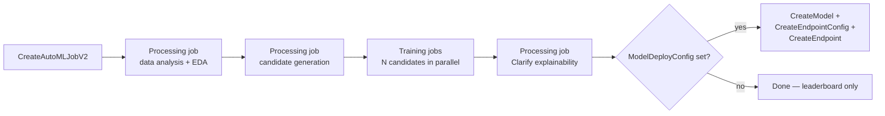
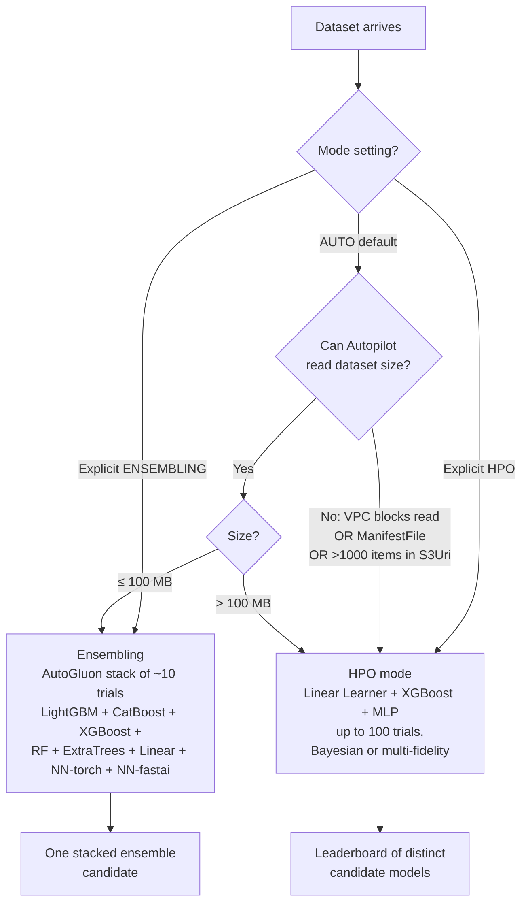
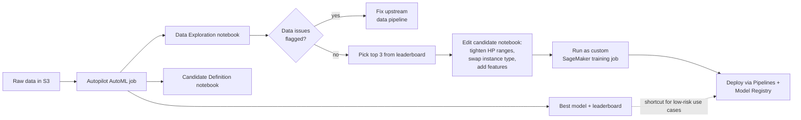
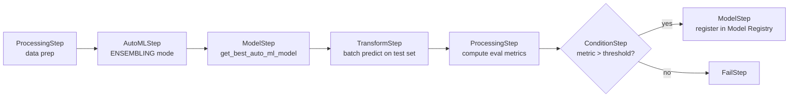

# Chapter 27 — SageMaker Autopilot: AutoML Done Right

> **Goal of this chapter:** to give you a sturdy, working model of where SageMaker Autopilot sits in the AWS ML stack — what it *is*, what it deliberately *isn't*, and the specific scenarios on the MLA-C01 exam where "use Autopilot" is the right answer versus the trap. By the end you should be able to: read a problem statement and decide between Autopilot, JumpStart, a built-in algorithm, and script mode in under thirty seconds; pick between Ensembling, HPO, and Auto mode; pick the right objective metric from the supported set of fifteen; predict which of the four output artifacts you'll get and which you won't; recognize the three Auto-mode fallback triggers that trip up otherwise-careful engineers; and explain to a hiring manager why most teams who adopt Autopilot use it *once*, harvest the candidate notebook, and then graduate to a hand-iterated derivative.
>
> **Source angle:** Official AWS docs cross-referenced against published AutoGluon benchmarks, the AWS ML Blog, and what production teams actually do. The two research notes that fed this chapter are `notes/ch27_docs.md` (the API-and-feature reference) and `notes/ch27_practice.md` (the production-trade-off layer).

---

## 27.1 When AutoML wins — and when it traps you

Imagine it is Tuesday afternoon and the analytics lead at your bank drops a Slack message:

> "We have a 60 MB CSV of credit-card application outcomes. Marketing wants a binary 'will this applicant accept the upsell?' score by end of next week. Can you spin something up?"

You have three honest options, and the MLA-C01 exam expects you to know which one to reach for first:

1. **Hand-write an XGBoost training script** with script mode + AMT (Ch 24), package with `ModelBuilder`, deploy. Production-grade, but four to eight days of work.
2. **Reach for a JumpStart foundation model** (Ch 26), fine-tune as text-like prompts. Usually overkill for tabular, and FMs are a poor first-fit for structured data.
3. **Submit one `CreateAutoMLJobV2` call**, walk away for thirty minutes, come back to a leaderboard, a notebook that reproduces every step, a Clarify SHAP report, and (optionally) a live endpoint. This is what Autopilot is for.

This chapter teaches that selection reflex — and the four or five places where Autopilot's apparent simplicity hides a foot-gun.

### 27.1.1 The five things AutoML automates (and the one it doesn't)

Every AutoML product on the market — Autopilot, DataRobot, H2O Driverless AI, Vertex AI AutoML — automates the same five steps: (1) data exploration, (2) feature engineering, (3) algorithm selection, (4) hyperparameter optimization, (5) evaluation + optional deployment.

What AutoML **does not** automate is step 0: *deciding the right target column, where labels came from, whether they're free of leakage, whether the use case is well-posed.* Autopilot will cheerfully optimize against a leaky target and hand you a `0.999 AUC` model that crashes in production. The single biggest AutoML trap to memorize: **automated metric optimization is not a substitute for problem framing.**

### 27.1.2 When Autopilot is the right tool (and when it isn't)

Autopilot wins when **all five** are true: the problem is **supervised** (target column exists); it fits one of the **six supported problem types** (tabular regression/classification, text classification, image classification, TS forecasting, LLM fine-tuning); the dataset is tabular-shaped or small-modality (under hundreds of GB); the team values **a defensible baseline plus reproducible notebook** over squeezing the last 1% of accuracy; and the team has discipline to set cost guardrails and tear down auto-deployed endpoints.

Autopilot loses when **any one** is true: unsupervised problem (clustering, anomaly detection, topic modeling — Autopilot requires `TargetAttributeName`; reach for K-Means / RCF / NTM in Ch 23); generative or FM-territory (LLM inference, image gen, RAG — JumpStart Ch 26 or Bedrock); regulatory-grade explainability needed (reason codes, monotonic constraints, decomposable SHAP — Ensembling's stacker hides causality, see §27.13); severely imbalanced rare-event detection (hand-tune XGBoost's `scale_pos_weight`); time-series with strong cross-series sharing (use DeepAR directly, Ch 23); multi-objective or custom loss; or off-AWS deployment (Autopilot outputs are SageMaker artifacts and don't port cleanly).

The mental shortcut: **Autopilot is for the "I have a labeled tabular dataset and want a defensible first model by end of day" lane.** Everything else has a better tool. The exam will reward you for picking that other tool when the question wanders out of this lane.

---

## 27.2 The five-step Autopilot pipeline

Under the covers, an Autopilot job is not a single training job. It is a managed orchestration of three processing jobs and N training jobs, plus an optional deploy sequence. Knowing the shape helps you (a) read the output S3 bucket, and (b) diagnose failures when something dies in the middle.



The five high-level steps map onto these jobs:

| Step | What happens | Output you can inspect |
|------|--------------|------------------------|
| 1. Data analysis & preprocessing | Schema profile, imputation strategy selection, target-leakage detection, class-imbalance flagging, scaling, encoding, text vectorization | **Data Exploration notebook** in S3 |
| 2. Candidate definition | Pick algorithms based on problem type, data size, chosen mode | **Candidate Definition notebook** in S3 |
| 3. Hyperparameter optimization | HPO mode: Bayesian (≤100 MB) or multi-fidelity (>100 MB) over algorithm-specific HP spaces. Ensembling mode: AutoGluon runs ~10 trials with varied model + meta-parameter combos | Per-trial metrics in CloudWatch + AutoML job history |
| 4. Training & evaluation | Train/val split (80/20 if you didn't pass a validation channel), k-fold CV (5-fold in HPO ≤50K rows; AutoGluon-chosen k in Ensembling), per-candidate scoring against the objective metric | **Model leaderboard** via `ListCandidatesForAutoMLJob` + Performance report |
| 5. Deployment (optional) | If `ModelDeployConfig` is set, Autopilot calls `CreateModel` + `CreateEndpointConfig` + `CreateEndpoint` pointing at the best candidate | A live real-time endpoint |

From the API caller's perspective this is one `CreateAutoMLJobV2` call and one IAM role-pass. From the AWS account's perspective it is dozens of orchestrated jobs sharing the same execution role, billing per-second on each underlying instance.

---

## 27.3 V1 vs V2 — the API split that matters on the exam

There are **two AutoML API generations**, and the exam loves this distinction because the wrong one is a tempting distractor:

| API | Supported problem types | Status |
|-----|-------------------------|--------|
| `CreateAutoMLJob` (V1) | **Tabular only** — regression, binary classification, multiclass classification | Legacy. Still supported but deprecated for anything non-tabular. The original Studio Classic UI calls this. |
| `CreateAutoMLJobV2` | **All six** problem types — tabular regression/classification, text classification, image classification, time-series forecasting, text-generation LLM fine-tuning | The modern path. Required for non-tabular and for LLM fine-tuning. |

A common exam pattern: a Python snippet calls `CreateAutoMLJob` (V1) with `ProblemType='ImageClassification'`. **That's the bug** — V1 is tabular-only. The fix is to switch to `CreateAutoMLJobV2` with the appropriate problem-type config block.

V2 also restructured the request payload. Instead of stuffing every option into `AutoMLJobConfig.AlgorithmsConfig`, V2 routes problem-type-specific options into `AutoMLProblemTypeConfig.{TabularJobConfig | TextClassificationJobConfig | ImageClassificationJobConfig | TimeSeriesForecastingJobConfig | TextGenerationJobConfig}`. This makes the API more orthogonal (each problem type gets its own dedicated config block) but it also means **V1 snippets do not port to V2 by renaming the call** — the whole payload shape changes.

---

## 27.4 The six supported problem types

| Problem type | Input | Mode availability | Auto-deploy? | Explainability? | Candidate notebook? |
|--------------|-------|-------------------|--------------|-----------------|---------------------|
| **Tabular regression** | CSV / Parquet, target column required | Ensembling, HPO, Auto | Yes | Yes (Clarify SHAP) | Yes |
| **Tabular binary classification** | CSV / Parquet | Ensembling, HPO, Auto | Yes | Yes | Yes |
| **Tabular multiclass classification** | CSV / Parquet | Ensembling, HPO, Auto | Yes | Yes | Yes |
| **Text classification** | CSV / Parquet with text column + label column | Fixed pipeline | Yes | Yes | No |
| **Image classification** | PNG / JPEG | Fixed pipeline | Yes | Yes | No |
| **Time-series forecasting** | CSV / Parquet with timestamp + target + grouping columns | Fixed pipeline (AutoGluon-TimeSeries: DeepAR+, CNN-QR, Prophet, NPTS, ARIMA, ETS) | Yes | **No** | No |
| **Text-generation LLM fine-tuning** | CSV / Parquet with prompt + completion columns | Fixed pipeline (JumpStart bridge) | Yes (to JumpStart-style endpoint) | **No** | No |

Three rows worth memorizing:

- **Only tabular gets mode choice.** Text, image, TS, and LLM-FT all use fixed pipelines. If a question says "the team chose Ensembling mode for image classification" — that's nonsense; image classification doesn't have a mode.
- **Time-series and LLM-FT get no explainability report.** This is a popular trick question.
- **Only tabular emits the candidate notebook.** The reproducibility handoff is tabular-only.

### 27.4.1 Column data types Autopilot understands (tabular)

| Type | Example | How Autopilot handles it |
|------|---------|--------------------------|
| Numerical | `1.42`, `9000` | Min-max or standard scaling; median imputation for missing |
| Categorical | `Region=NorthEast` | One-hot for low cardinality; target encoding or feature hashing for high cardinality |
| Text | `"This product was great"` | TF-IDF + truncated SVD, or token-level features depending on candidate |
| Time-series-as-string | `"1.0,1.2,1.4,1.5,1.6"` (comma-separated floats in one cell) | Treated as a fixed-length feature vector |

There is no support for image columns, JSON blobs, nested structures, or graph data inside a tabular schema. If the data is image- or text-heavy, switch to the dedicated image- or text-classification problem type rather than trying to flatten it.

---

## 27.5 The two training modes — Ensembling vs HPO vs Auto

This is the highest-yield section in the chapter. AWS documents three options on `AutoMLProblemTypeConfig.TabularJobConfig.Mode`: **Ensembling**, **HyperparameterTuning** (HPO), and **Auto**.



### 27.5.1 Ensembling mode — the small-data default since 2022

**Engine:** AutoGluon-Tabular, the AWS-maintained open-source AutoML library. AWS made this the default for small-data tabular in September 2022, citing benchmarks of up to **8× faster** than HPO at 250 trials, **5.8× faster** at 100 trials, **12× faster** on <1 MB datasets — and accuracy uplift of **+7.58% F1** on binary, **+4.92%** on multiclass, **+4% R²** on regression. *Better*, not just faster.

**Algorithms in the pool** (eight total): **LightGBM**, **CatBoost**, **XGBoost**, **Random Forest**, **Extra Trees**, **Linear Models** (scikit-learn LR/logistic), **Neural net (PyTorch MLP)**, **Neural net (fast.ai)**.

**How the ensemble forms.** AutoGluon runs ~10 trials with different (model, meta-parameter) combinations, then **stacks** them: train N base models, generate out-of-fold (OOF) predictions on each, use those OOF predictions as features into a meta-learner, emit one combined model.

**Cross-validation.** Always uses k-fold (k chosen automatically by AutoGluon), regardless of dataset size. This is the key distinguishing fact from HPO mode (which only does k-fold for small datasets).

**Output.** **One** stacked model — not a leaderboard of separable algorithms. `ListCandidatesForAutoMLJob` returns the ensemble as the best candidate; the underlying base models are not independently deployable.

**Speed.** Often <30 minutes for typical <100 MB datasets on a single `ml.m5.4xlarge`.

**Sample weights.** Supported for *all* metrics **except** `BalancedAccuracy` and `InferenceLatency`. (See §27.7.3.)

**Best for.** Tabular datasets under ~100 MB; latency-sensitive use cases that need the `InferenceLatency` metric; any workflow that wants the maximum-accuracy single model with minimum tuning.

### 27.5.2 HPO mode — for large datasets and per-candidate transparency

**Engine:** SageMaker Automatic Model Tuning (AMT) under the hood. HPO mode is *literally* an AMT tuning job, which means the trial budget and parallelism settings are AMT concepts.

**Algorithms in the pool** (three only — much smaller than ensembling):

- **Linear Learner** — SageMaker built-in (Ch 23), supervised classification or regression
- **XGBoost** — the SageMaker built-in implementation
- **Deep learning algorithm** — a multilayer perceptron (MLP) feedforward neural net

That's it. The exam will sometimes offer "Autopilot in HPO mode" with LightGBM or CatBoost as answer choices — those are wrong. LightGBM/CatBoost only live in Ensembling mode.

**Search strategy:**

| Dataset size | Search algorithm |
|--------------|------------------|
| **≤ 100 MB** | Bayesian optimization (same engine AMT uses) |
| **> 100 MB** | Multi-fidelity optimization — metrics continuously emitted from training containers; poorly-performing trials are stopped early; well-performing trials get more compute. Equivalent to AMT's Hyperband strategy. |

**Trial budget.** Up to **100 trials by default**, configurable via `MaxCandidates`. The hard upper bound is 250.

**Cross-validation.** **5-fold k-fold for ≤ 50,000 training rows.** Larger datasets skip CV (a single hold-out gives enough signal). The exam will quote this specific number: **k=5 in HPO mode for ≤50K rows.**

**Output.** A **leaderboard** of distinct candidate models — each row is a (algorithm, hyperparameter config) pair with its validation metric. You can deploy any candidate, not just the best.

**Sample weights.** Not supported. The weight column is silently ignored.

**Best for.** Datasets above ~100 MB (up to "hundreds of GB" per docs); workflows that need per-candidate deployability for A/B testing; teams that want a single transparent XGBoost / Linear / MLP they can port to ONNX or hand-tune further.

### 27.5.3 Auto mode — the default, and the trap

When you don't set `Mode`, Autopilot defaults to `AUTO`. The rule is simple:

- **Dataset ≤ 100 MB → Ensembling mode**
- **Dataset > 100 MB → HPO mode**

But Autopilot has to *read the dataset size* to make this decision. There are **three cases where it can't**, and in all three it **falls back to HPO mode**:

1. **VPC mode is on** and the S3 bucket policy blocks the public Autopilot reader from seeing the data (e.g. bucket allows access only via the VPC endpoint).
2. **`S3DataType` is `ManifestFile`** — Autopilot doesn't expand the manifest to compute total size.
3. **`S3Uri` contains more than 1000 items** — Autopilot doesn't enumerate beyond the first 1000.

This is one of the most-tested edge cases in the entire Autopilot surface. If you have a small VPC-bound dataset and rely on `AUTO`, you will get HPO mode — slow, expensive, and not what you wanted.

⚠️ **Exam alert — the three Auto fallback triggers.** A question describes a 50 MB tabular dataset in an S3 bucket inside a VPC with a bucket policy restricting access to the VPC endpoint, called via Autopilot with `Mode=AUTO`. The right answer is **HPO mode** (Autopilot can't read the size from the locked-down bucket, so it falls back). The same fallback fires for `S3DataType=ManifestFile` and for `S3Uri` prefixes with >1000 objects. The practical fix in production code: **always set `Mode` explicitly** — don't trust `AUTO` in any environment more sensitive than a sandbox.

### 27.5.4 The side-by-side cheat sheet

| Property | Ensembling | HPO |
|----------|-----------|-----|
| Engine | AutoGluon-Tabular | SageMaker AMT |
| Algorithms | LightGBM, CatBoost, XGBoost, RF, ExtraTrees, Linear, NN-torch, NN-fastai (8) | Linear Learner, XGBoost, MLP (3) |
| Trial budget | ~10 (AutoGluon-chosen) | Up to 100 default, 250 max |
| Search | Stacking of varied algorithms | Bayesian (≤100MB) or multi-fidelity (>100MB) |
| CV | Always k-fold, k auto-chosen | 5-fold only for ≤50K rows |
| Output | One stacked model | Leaderboard of N candidates |
| Sample weights | Yes (most metrics) | No |
| Best for dataset size | < 100 MB | > 100 MB (up to hundreds of GB) |
| Typical wall-clock | < 30 min | Hours, depends on parallelism |
| Per-candidate deployable? | No (ensemble only) | Yes (any leaderboard entry) |
| `InferenceLatency` metric? | Yes | No |
| `AutoMLStep` pipeline integration? | Yes | No |

⚠️ **Exam alert — algorithm pool by mode.** "Which mode includes LightGBM?" → **Ensembling.** "Which mode includes Linear Learner (the SageMaker built-in)?" → **HPO.** The Ensembling pool's "Linear Models" (plural) refers to scikit-learn LR/logistic regression, *not* the SageMaker Linear Learner. This is a deliberate distractor pattern.

---

## 27.6 Inputs and validation splits

### 27.6.1 The minimal V2 call

```python
import boto3
sm = boto3.client('sagemaker')

sm.create_auto_ml_job_v2(
    AutoMLJobName='customer-churn-2026',
    AutoMLJobInputDataConfig=[{
        'ChannelType': 'training',
        'ContentType': 'text/csv;header=present',
        'CompressionType': 'None',
        'DataSource': {'S3DataSource': {
            'S3DataType': 'S3Prefix',
            'S3Uri': 's3://my-bucket/churn/train/'
        }}
    }],
    OutputDataConfig={'S3OutputPath': 's3://my-bucket/churn/out/'},
    AutoMLProblemTypeConfig={
        'TabularJobConfig': {
            'TargetAttributeName': 'churned',
            'Mode': 'ENSEMBLING'  # or 'HYPERPARAMETER_TUNING' or 'AUTO'
        }
    },
    RoleArn='arn:aws:iam::123456789012:role/SageMakerExecutionRole'
)
```

Notable parameter contracts:

| Parameter | Required? | Notes |
|-----------|-----------|-------|
| `TargetAttributeName` | Yes (tabular / text-class / image-class) | **Autopilot is fully supervised — there is no unsupervised mode.** |
| `Mode` | No (defaults to `AUTO`) | Only meaningful for tabular. Other problem types have fixed pipelines. |
| `AutoMLJobObjective.MetricName` | No (per-problem-type default) | See §27.7 for the full catalog. |
| `ProblemType` | No (auto-inferred from the target) | Override to force `Regression`, `BinaryClassification`, `MulticlassClassification`. |

### 27.6.2 Custom train/validation split

Two options:

1. **Auto split** (default) — Autopilot does an **80/20 random split**.
2. **Custom split** — pass a second channel with `ChannelType='validation'`. Autopilot uses your channel verbatim, no further splitting.

```python
AutoMLJobInputDataConfig=[
    {'ChannelType': 'training',   'DataSource': {...}, 'ContentType': '...'},
    {'ChannelType': 'validation', 'DataSource': {...}, 'ContentType': '...'},
]
```

When you need this:

- **Temporal data** — a chronological hold-out where random splitting would leak future information into training (churn, fraud, finance).
- **Group structure** — per-customer rows where leakage across customers would inflate validation metrics; you want group-aware splitting.
- **Hold-out comparison** — a fixed validation set you've been benchmarking against historical baselines.

### 27.6.3 Sample weights

Add a column of per-row weights to the training data and reference it via `SampleWeightAttributeName` in `TabularJobConfig`. **Only Ensembling mode consumes it**; HPO mode silently ignores the weight column. Useful for imbalanced datasets where you don't want to up/downsample but want the model to "see" minority rows as more important.

Two metrics ignore sample weights even in Ensembling mode:
- **`BalancedAccuracy`** — has its own internal imbalance handling.
- **`InferenceLatency`** — a physical timing metric; weights are meaningless.

### 27.6.4 Completion criteria — your cost guardrails

`TabularJobConfig.CompletionCriteria` lets you cap:

| Field | What it bounds |
|-------|----------------|
| `MaxCandidates` | Hard cap on number of trial training jobs |
| `MaxRuntimePerTrainingJobInSeconds` | Per-trial timeout |
| `MaxAutoMLJobRuntimeInSeconds` | Whole-job wall-clock cap |

For HPO mode, all three apply. For Ensembling mode, only the runtime caps matter — `MaxCandidates` is ignored because AutoGluon picks its own trial count.

These are not optional in production. See §27.10 for the cost-blowup math.

---

## 27.7 The fifteen supported metrics

Autopilot supports a fixed, curated set of objective metrics passed via `AutoMLJobObjective.MetricName`.

### 27.7.1 The full catalog

| `MetricName` | Problem type(s) | Range | Direction | Notes |
|--------------|-----------------|-------|-----------|-------|
| `Accuracy` | Binary, Multiclass | 0–1 | Higher better | TP+TN over total. Default for multiclass. |
| `AUC` | Binary | 0–1 (0.5 = random) | Higher better | Area under ROC. Use when probabilities matter and you want threshold-agnostic measure. |
| `BalancedAccuracy` | Binary, Multiclass | 0–1 | Higher better | `0.5 * (TP/P + TN/N)`. Use for class-imbalanced data. **Does not honor sample weights.** |
| `F1` | Binary | 0–1 | Higher better | Harmonic mean of precision & recall. Default for binary. |
| `F1macro` | Multiclass | 0–1 | Higher better | Per-class F1 averaged. Treats every class equally regardless of frequency. |
| `Precision` | Binary | 0–1 | Higher better | TP / (TP+FP). Use when false positives are expensive. |
| `PrecisionMacro` | Multiclass | 0–1 | Higher better | Per-class precision averaged. |
| `Recall` | Binary | 0–1 | Higher better | TP / (TP+FN). Use when false negatives are expensive (cancer screening). |
| `RecallMacro` | Multiclass | 0–1 | Higher better | Per-class recall averaged. |
| `LogLoss` | Binary, Multiclass | 0–∞ | **Lower** better | Cross-entropy. Penalizes confidently-wrong predictions. |
| `MSE` | Regression | 0–∞ | **Lower** better | Squared error. Default for regression. |
| `RMSE` | Regression | 0–∞ | **Lower** better | Square root of MSE. Same units as the target. |
| `MAE` | Regression | 0–∞ | **Lower** better | Mean absolute error. Robust to outliers. |
| `R2` | Regression | -∞ to 1 (typically -1 to 1) | Higher better | Coefficient of determination. Negative = worse than the mean baseline. |
| `InferenceLatency` | Tabular | seconds | **Lower** better | **Only available in Ensembling mode.** A timing constraint disguised as a metric. |

### 27.7.2 Defaults per problem type

If you don't pass `AutoMLJobObjective`, you get:

| Problem type | Default metric |
|--------------|----------------|
| Binary classification | `F1` |
| Multiclass classification | `Accuracy` |
| Regression | `MSE` |
| Text classification | `Accuracy` |
| Image classification | `Accuracy` |
| Time-series forecasting | `AverageWeightedQuantileLoss` (wQL) |

The most common production override: binary classification with severe imbalance, where `F1` is reasonable but `AUC` or `BalancedAccuracy` is often better. The exam may ask you to fix this in a one-line code snippet.

### 27.7.3 Sample-weight × metric × mode matrix

| Mode | Metric | Sample weights honored? |
|------|--------|------------------------|
| Ensembling | Any except `BalancedAccuracy` and `InferenceLatency` | Yes |
| Ensembling | `BalancedAccuracy` | No — metric has its own imbalance handling |
| Ensembling | `InferenceLatency` | No — physical timing metric |
| HPO | Any metric | No |

### 27.7.4 Picking the right metric (the exam pattern)

The exam will give you a business context and ask you to pick:

| Business context | Right metric |
|------------------|--------------|
| Fraud detection on 99/1 imbalanced data, false negatives are costly | `Recall` or `BalancedAccuracy` |
| Marketing campaign — false positives waste money | `Precision` |
| Need probability calibration for downstream decision system | `AUC` or `LogLoss` |
| Regression with expected outliers (income prediction) | `MAE` (robust) over `MSE`/`RMSE` (squared penalty inflates outliers) |
| Multiclass where rare classes matter equally | `F1macro`, not `Accuracy` |
| Latency-sensitive real-time recommender | `InferenceLatency` (Ensembling only) |

---

## 27.8 The four output artifacts

For every successful Autopilot job, the output S3 bucket contains a predictable directory tree:

```
s3://<output-bucket>/<job-name>/
├── data-processor-models/             # sklearn .pkl preprocessor pipelines
├── documentation/
│   ├── SageMakerAutopilotDataExplorationNotebook.ipynb     # ① EDA notebook
│   └── SageMakerAutopilotCandidateDefinitionNotebook.ipynb # ② Candidate notebook
├── preprocessed-data/                  # Feature-engineered data (Parquet)
├── sagemaker-automl-candidates/        # Per-candidate model artifacts
│   ├── <candidate-1>/model.tar.gz
│   └── ...
├── tuning/                             # AMT tuning-job artifacts (HPO mode only)
└── transformed-data/                   # Held-out validation predictions
```

The four artifacts you should know by name:

### 27.8.1 The Data Exploration notebook

A Jupyter notebook generated by the **data analysis processing job** that runs first. Contents: dataset summary (rows/columns/dtypes), per-column statistics (mean/median/min/max/unique/null counts), target column analysis (class balance or distribution histogram), target-leakage warnings, high-cardinality warnings, class-imbalance flag (minority class < 5%).

The exam framing: "the data science team wants to understand how Autopilot interpreted their data before promoting the model; which file do they look at?" → **Data Exploration notebook.**

### 27.8.2 The Candidate Definition notebook

A Jupyter notebook with the **exact Python code** for every candidate pipeline Autopilot tried. Per candidate: the feature-engineering pipeline (sklearn `Pipeline` with transformers), the model algorithm and its hyperparameter grid (HPO) or final config (Ensembling), and the training-job invocation as actual SageMaker SDK code.

This is the **reproducibility and customization handoff** — you can re-run any candidate with modified hyperparameters, strip the AutoGluon stacker and deploy a single base model (Ensembling), modify the preprocessor and rerun, or use the notebook as the seed of a hand-tuned production model.

The exam trap: the candidate notebook is **only generated for tabular problem types**. Image, text, TS, and LLM-FT do not emit one. (Per the AWS docs: "For tabular data use cases such as regression or classification, Autopilot offers additional visibility … by generating notebooks.")

### 27.8.3 The model leaderboard

Accessed via `ListCandidatesForAutoMLJob`. Each entry looks like:

```json
{
  "CandidateName": "...",
  "FinalAutoMLJobObjectiveMetric": {
    "MetricName": "F1", "Value": 0.842, "Type": "Maximize"
  },
  "InferenceContainers": [...],
  "CandidateStatus": "Completed",
  "CreationTime": "...",
  "EndTime": "..."
}
```

For HPO mode you get N distinct candidates. For Ensembling mode you get one (the stacker).

You can deploy any candidate by calling `CreateModel` with the candidate's `InferenceContainers`, then `CreateEndpointConfig` + `CreateEndpoint`.

### 27.8.4 The Clarify explainability + performance report

Generated by a final **explainability processing job** that runs Clarify under the hood. Outputs (in `documentation/`):

- **Performance report** — summary metrics, confusion matrix, ROC curve, PR curve, calibration plot.
- **Explainability report** — per-feature global importance (SHAP), with bar chart.

**Available for:** tabular regression/classification, text classification, image classification.
**Not available for:** time-series forecasting, LLM fine-tuning.

The Clarify section bridges directly to Chapter 29 — Autopilot's explainability *is* a Clarify job. See §27.14 for the cross-link map.

---

## 27.9 Auto-deploy — and the cost gotcha that follows

Set `ModelDeployConfig` on the `CreateAutoMLJobV2` call:

```python
ModelDeployConfig={
    'AutoGenerateEndpointName': True,        # or pass EndpointName explicitly
    'EndpointName': 'my-autopilot-endpoint'  # if you don't want a generated name
}
```

When set, after the best candidate is chosen Autopilot will:

1. Call `CreateModel` with the best candidate's `InferenceContainers`.
2. Call `CreateEndpointConfig` with a single production variant (default `ml.m5.xlarge`, 1 instance).
3. Call `CreateEndpoint`.

The endpoint is **real-time only**. There is no built-in option to auto-create a batch transform, async endpoint, or serverless endpoint. For those you'd take the best-candidate model artifact and deploy it manually using the patterns in Part G.

**The cost gotcha:** an auto-deployed endpoint runs (and bills) 24/7 until you call `DeleteEndpoint`. At default `ml.m5.xlarge` pricing (~$0.23/hour in us-east-1), a forgotten endpoint costs roughly **$170/month**. The single most common "I ran a tiny demo and got a $400 bill" story in the AWS support forums is exactly this: someone enabled auto-deploy on a one-off Autopilot experiment, never looked at the resulting endpoint, and discovered it two billing cycles later.

The production discipline is to **never enable auto-deploy in interactive experiments** — always inspect the leaderboard first, then deploy explicitly. Auto-deploy is appropriate inside a pipeline (`AutoMLStep` → `ModelStep`) where the next step gates deployment on a metric threshold and the endpoint is owned by a long-lived service.

---

## 27.10 Cost shape and guardrails

Autopilot itself charges nothing; you pay only for the underlying resources it orchestrates: a data-analysis processing job at start, 1–250 candidate training jobs in the middle, an explainability processing job at end, and (if auto-deploy is on) a real-time endpoint that bills continuously until you delete it.

### 27.10.1 The HPO fan-out problem

HPO mode defaults to **100 trials**, running up to 4 in parallel. On `ml.m5.4xlarge` ($0.92/hour), 100 trials × 30 minutes average ≈ **$46 per run**. Bump to `MaxCandidates=250` with multi-hour trials on a big dataset and you are in five-figure territory. If you forget to set `MaxAutoMLJobRuntimeInSeconds`, the job runs until it finishes — up to the 30-day hard cap.

Back-of-envelope cost shapes:

| Setup | Approx cost |
|-------|------------|
| 50 MB dataset, Ensembling, default config | $5–15 |
| 1 GB dataset, Ensembling, 8-hour cap | $30–80 |
| 1 GB dataset, HPO, 100 candidates, 4-hour cap | $100–250 |
| 50 GB dataset, HPO, 250 candidates, no cap | $1000+ |

### 27.10.2 The production checklist

Before submitting any non-sandbox Autopilot job:

- [ ] `Mode` set **explicitly** — don't rely on `AUTO`.
- [ ] `MaxCandidates`, `MaxAutoMLJobRuntimeInSeconds`, and `MaxRuntimePerTrainingJobInSeconds` all set (10–25 candidates for exploration, 50–100 for serious; 1 hour exploration runtime, 4–8 hours serious).
- [ ] Objective metric chosen deliberately (not the default for imbalanced data).
- [ ] Target column verified for leakage; Data Exploration notebook reviewed *before* trusting the leaderboard.
- [ ] Cost alarm on SageMaker training spend (Budgets + EventBridge).
- [ ] If pipelined: `AutoMLStep` + `ConditionStep` gating + Model Registry approval.
- [ ] If auto-deployed: `DeleteEndpoint` runbook entry.

---

## 27.11 The "graduate from the candidate notebook" pattern

Very few teams run **untouched Autopilot models** in high-stakes production. The dominant pattern is closer to:

```
Autopilot run #1 ──► candidate notebook ──► hand-edit ──► custom training job
       │
       └──► (rarely) deploy best candidate as a "first cut" baseline
```

This is the workflow you should describe in any interview answer about Autopilot adoption.



The shortcut path (E → K) is what marketing material assumes. The real-world path (E → H → I → J → K) is what experienced teams do.

### 27.11.1 What you can edit in the candidate notebook

Per AWS docs, all of these are encouraged modifications: preprocessors used on the data, number of HPO runs and their parallelism, algorithms to try, instance types for HPO jobs, hyperparameter ranges. The fact that AWS publishes this list as "go ahead and modify" is the explicit signal that **the notebook, not the model, is the deliverable for serious users**.

### 27.11.2 The trust ladder

| Tier | What's deployed | Who owns risk |
|------|-----------------|---------------|
| 0 — Sandbox | Autopilot best candidate, never deployed | Data scientist |
| 1 — Internal tool | Best candidate, batch transform only | DS + 1 reviewer |
| 2 — Customer-facing low-risk | Best candidate with monitoring | DS + ML platform |
| 3 — Customer-facing high-risk | Hand-iterated model derived FROM candidate notebook | DS + governance |
| 4 — Regulated decisions | Custom model with full lineage; Autopilot may seed features only | Full model risk org |

---

## 27.12 Studio Classic → Canvas rebrand

Exam-relevant trivia because the UI surfaces have moved:

| Era | Where the Autopilot UI lives |
|-----|------------------------------|
| Pre-Nov 2023 | **Studio Classic** — "Autopilot Experiments" tab in the Studio Classic sidebar. Supports tabular regression/classification only via UI. |
| Nov 30, 2023 onward | The Autopilot UI **migrated to SageMaker Canvas** as part of the unified Studio rollout. Canvas exposes the no-code experience. |
| Now (2025–2026) | Studio Classic still has the legacy Autopilot UI for backward compatibility. **Canvas is the recommended UI for new no-code work.** **The `CreateAutoMLJobV2` API is unchanged** — same endpoint behind both UIs. |

A common exam pattern: "An analyst wants a no-code AutoML experience in the unified SageMaker Studio. Which feature should they use?" → **Canvas** (not Autopilot directly, not Studio Classic). The API stays the same; only the UI moved. Forward to Chapter 22 for the broader Studio object model.

---

## 27.13 Autopilot vs JumpStart vs script mode vs built-in — the decision tree

This is Task 2.1 dead-center on the exam.

| Need | Right tool |
|------|------------|
| "Build the best tabular model fast, no code" | **Autopilot Ensembling** |
| "Tune my own XGBoost across 50 HP combinations" | **AMT directly** (not Autopilot — Autopilot encapsulates AMT internally and you don't get fine HP control) |
| "Deploy Llama 3 for inference" | **JumpStart** (not Autopilot — Autopilot only does FM **fine-tuning**, not generic deployment) |
| "Fine-tune Llama 3 on my data with no ML expertise" | **Autopilot text-generation** (V2 API, uses JumpStart under the hood) |
| "Fine-tune Llama 3 with custom PEFT, distributed config" | **JumpStart fine-tuning** (more knobs) or **script mode with HuggingFace estimator** |
| "Train a custom Triton kernel" | **BYOC** (Autopilot can't help) — see Ch 25 |
| "AutoML on tabular but my dataset is 500 GB" | **Autopilot HPO mode** (Ensembling tops out at ~100 MB for best perf) |
| "Stacking + bagging with my own algorithm pool" | **AutoGluon directly** (script mode) — Autopilot Ensembling's pool is fixed |
| "Standard regression with my own algorithm choice and full control" | **Built-in algorithm** (Ch 23) + AMT (Ch 30) |

The shortcut framing: **Autopilot trains from scratch on your data. JumpStart starts from someone else's pretraining and adapts.** If your dataset is small relative to the problem complexity, pretraining wins — reach for JumpStart. If your dataset is rich enough to learn from and the problem is tabular, Autopilot's Ensembling is the strongest first move.

### 27.13.1 When Autopilot is the wrong tool (the four sharpest cases)

**Regulated SHAP-on-stacks.** Ensembling mode produces a stacked model; SHAP runs on the stacker with model-agnostic KernelSHAP, which is approximate and can be misleading for downstream-of-stacking explanations. HPO mode produces a single model where SHAP works well — but at that point you might as well train it yourself with full visibility, monotonic constraints (XGBoost supports these), and a curated explanation layer. For regulated credit-decisioning, the defensible recommendation is to use Autopilot for the *baseline experiment*, then re-implement the chosen architecture under your own lineage. Chapter 29 dives into Clarify integration in depth.

**Imbalanced classes (rare-event detection).** Autopilot auto-subsamples large datasets and can quietly drop rare-class observations. Its default `F1` for binary classification doesn't capture cost-sensitive learning needs in fraud / churn / medical-diagnosis use cases. Fix paths: pre-process the data yourself with controlled SMOTE / class weighting before handing to Autopilot; or set the objective to `BalancedAccuracy`; or skip Autopilot and hand-build XGBoost with `scale_pos_weight` tuned.

**Time-series with strong cross-series sharing.** Autopilot v2 added time-series forecasting as a problem type, stacking DeepAR+ / CNN-QR / Prophet / NPTS / ARIMA / ETS. For high-cardinality forecasting with many related time series and shared seasonality, **use DeepAR directly** (Chapter 23) — better quantile forecasts, more control over the loss function, and you can tune the embedding dimension. Autopilot's TS pipeline is good for the small/medium intermittent-demand case but loses to direct DeepAR usage at scale.

**Off-AWS deployment.** Autopilot outputs are SageMaker model artifacts; they don't port cleanly to POJO/MOJO/ONNX-with-custom-kernels. If the deployment target is JVM-only or on-device, H2O Driverless AI is a better fit. Out of scope for the exam but appears in design-review interviews.

---

## 27.14 Autopilot in SageMaker Pipelines — `AutoMLStep`

Before November 2022, integrating Autopilot into a Pipeline required custom Lambda or Processing steps to poll the AutoML job. `AutoMLStep` is a native pipeline component that handles this end-to-end.

### 27.14.1 Canonical pipeline shape



### 27.14.2 Code skeleton

```python
from sagemaker.workflow.automl_step import AutoMLStep
from sagemaker.automl.automl import AutoML, AutoMLInput

automl = AutoML(
    role=execution_role,
    target_attribute_name='churned',
    sagemaker_session=pipeline_session,
    total_job_runtime_in_seconds=14400,
    mode='ENSEMBLING',           # required — see exam alert below
)

train_args = automl.fit(
    inputs=[AutoMLInput(
        inputs=s3_train_val,
        target_attribute_name='churned',
        channel_type='training',
    )]
)

step_auto_ml = AutoMLStep(
    name='AutoMLTrainingStep',
    step_args=train_args,
)
```

⚠️ **Exam alert — `AutoMLStep` is ENSEMBLING-only.** The pipeline-native `AutoMLStep` was launched alongside Ensembling mode and **does not support HPO mode**. If a question describes a Pipelines-orchestrated AutoML workflow with HPO mode requested, the correct answer is either (a) "switch to Ensembling" if the dataset allows it, or (b) "fall back to custom Lambda + Processing steps that poll the AutoML job". For most production workflows this isn't a constraint — small data → Ensembling is the right choice anyway — but it's a sharp design-review trap question.

---

## 27.15 End-to-end example: tabular classification with custom split and auto-deploy

The kind of code the exam may show and ask you to identify the issue with:

```python
import boto3
sm = boto3.client('sagemaker')

response = sm.create_auto_ml_job_v2(
    AutoMLJobName='customer-churn-2026',
    AutoMLJobInputDataConfig=[
        {'ChannelType': 'training',
         'ContentType': 'text/csv;header=present',
         'DataSource': {'S3DataSource': {
             'S3DataType': 'S3Prefix',
             'S3Uri': 's3://my-bucket/churn/train/'}}},
        {'ChannelType': 'validation',          # custom temporal hold-out
         'ContentType': 'text/csv;header=present',
         'DataSource': {'S3DataSource': {
             'S3DataType': 'S3Prefix',
             'S3Uri': 's3://my-bucket/churn/val/'}}},
    ],
    OutputDataConfig={'S3OutputPath': 's3://my-bucket/churn/output/'},
    AutoMLProblemTypeConfig={
        'TabularJobConfig': {
            'TargetAttributeName': 'churned',
            'SampleWeightAttributeName': 'weight',     # ensembling only
            'ProblemType': 'BinaryClassification',
            'Mode': 'ENSEMBLING',                      # explicit, not AUTO
            'CompletionCriteria': {
                'MaxRuntimePerTrainingJobInSeconds': 3600,
                'MaxAutoMLJobRuntimeInSeconds': 14400,
            },
        }
    },
    AutoMLJobObjective={'MetricName': 'AUC'},          # override F1 default
    ModelDeployConfig={
        'AutoGenerateEndpointName': False,
        'EndpointName': 'churn-prod-endpoint'},
    RoleArn='arn:aws:iam::123456789012:role/SageMakerExecutionRole',
)
```

Five things worth noticing: (1) the validation channel disables the 80/20 split; (2) `SampleWeightAttributeName` works **only** because `Mode='ENSEMBLING'` — under `HYPERPARAMETER_TUNING` it would be silently ignored, no error, just a quietly-wrong model; (3) `AUC` overrides the default `F1` for binary classification; (4) `Mode` is explicit, not relying on `AUTO`'s dataset-size read; (5) `ModelDeployConfig` auto-creates `churn-prod-endpoint` — don't forget `DeleteEndpoint` when done.

---

## 27.16 Quotas worth remembering

| Quota | Default |
|-------|---------|
| Concurrent AutoML jobs per account per region | 1–4 (Service Quotas adjustable) |
| Max input dataset columns (tabular) | ~1,000 (soft) |
| Max candidate trials per HPO job | 250 (hard upper bound on `MaxCandidates`) |
| Max wall-clock per AutoML job | 30 days (hard) |
| Max parallel training jobs per AutoML job | 20 |
| Default target subsample size | 5 GB |
| Input dataset default | 100 GB (soft) |

---

## 27.17 Exam gotchas — the high-frequency list

| # | Question | Answer |
|---|----------|--------|
| 1 | Auto mode + `S3DataType=ManifestFile` → which mode runs? | HPO (Autopilot can't read size from a manifest) |
| 2 | Auto mode + VPC-locked bucket → which mode runs? | HPO (Autopilot's reader can't see the bucket) |
| 3 | Auto mode + `S3Uri` prefix with >1000 items → which mode? | HPO (Autopilot doesn't enumerate beyond 1000) |
| 4 | Can you deploy individual base models from Ensembling mode? | No — only the stacker. Use HPO for per-candidate deployability. |
| 5 | Which problem types do NOT get an explainability report? | Time-series forecasting and LLM fine-tuning |
| 6 | Which problem types do NOT get a candidate-definition notebook? | Anything non-tabular — only tabular emits it |
| 7 | Default train/val split? | 80/20 if no validation channel |
| 8 | Default k for k-fold CV in HPO mode? | k=5, only for ≤50,000 rows |
| 9 | Which mode supports sample weights? | Ensembling only |
| 10 | Does Autopilot support unsupervised problems? | No — `TargetAttributeName` is required |
| 11 | Default trial budget in HPO mode? | 100 (hard upper bound 250) |
| 12 | Which mode includes LightGBM / CatBoost? | Ensembling. HPO has only Linear Learner, XGBoost, MLP. |
| 13 | Which mode includes Linear Learner (the SageMaker built-in)? | HPO. Ensembling's "Linear Models" = scikit-learn LR/logistic. |
| 14 | Auto-mode dataset-size cutoff? | 100 MB |
| 15 | API required for LLM-FT / image / TS? | `CreateAutoMLJobV2`. V1 is tabular-only. |
| 16 | Default metric for binary / multiclass / regression? | `F1` / `Accuracy` / `MSE` |
| 17 | Metric available only in Ensembling mode? | `InferenceLatency` |
| 18 | Does sample-weighting work with `BalancedAccuracy`? | No — metric has its own imbalance handling |
| 19 | Where does the Autopilot UI live in 2025+? | SageMaker Canvas (Studio Classic UI is backward-compat only) |
| 20 | Auto-deploy endpoint type? | Real-time only. No async / serverless / batch auto-deploy. |
| 21 | Which pipeline step type integrates Autopilot natively? | `AutoMLStep` — **ENSEMBLING mode only** |
| 22 | Single API call to stop a forgotten auto-deployed endpoint bill? | `DeleteEndpoint` |

---

## 27.18 Exercises

1. **Mode selection drill.** For each scenario, decide whether Autopilot will run in Ensembling or HPO mode, and explain why in one sentence:
   - A 40 MB CSV in a public S3 bucket, `Mode='AUTO'`.
   - A 40 MB CSV in a VPC-only S3 bucket, `Mode='AUTO'`.
   - A 500 MB Parquet file, `Mode='AUTO'`.
   - A 50 MB dataset referenced via `S3DataType='ManifestFile'`, `Mode='AUTO'`.
   - A 50 MB dataset in an S3 prefix containing 2,500 files, `Mode='AUTO'`.
   - A 200 GB Parquet dataset, `Mode='ENSEMBLING'` set explicitly.

2. **Pick the right tool.** For each problem, decide whether the right answer is Autopilot, JumpStart, a built-in algorithm + AMT, script mode, or Bedrock. Defend each choice in one sentence:
   - 80 MB labeled tabular dataset, binary classifier needed in <1 day, no DS team.
   - Deploy Llama-3-70B for batch summarization.
   - Fine-tune Llama-3-8B on customer-support transcripts with no ML expertise on the team.
   - Train a custom transformer architecture with a new attention variant.
   - Anomaly detection on 200 GB of unlabeled telemetry data.
   - Forecast next-quarter demand across 50,000 SKUs with shared seasonal patterns.

3. **The metric and weight matrix.** Your training data has 2% positive class. You want the model to penalize misses on the minority class. Three options on the table: (a) `BalancedAccuracy` metric, (b) `SampleWeightAttributeName='weight'` with hand-tuned weights, (c) `F1`. For Ensembling mode, which combinations work as intended? For HPO mode? Identify the silent-failure case.

4. **Debug the snippet.** This `CreateAutoMLJob` call returns a validation error. Find the bug:
   ```python
   sm.create_auto_ml_job(
       AutoMLJobName='img-class-2026',
       InputDataConfig=[{'DataSource': {...}, 'TargetAttributeName': 'label'}],
       OutputDataConfig={'S3OutputPath': 's3://bucket/out/'},
       ProblemType='ImageClassification',
       RoleArn='...',
   )
   ```

5. **Auto-deploy cost incident.** A junior engineer enables `ModelDeployConfig.AutoGenerateEndpointName=True` on an Autopilot demo, then goes on vacation for three weeks. The endpoint runs on `ml.m5.xlarge`. Calculate the approximate cost (us-east-1 pricing, ~$0.23/hr). Then write the one-API-call mitigation, and the three production guardrails you'd add to prevent recurrence.

6. **The graduation workflow.** A team runs Autopilot once on 75 MB of churn data, gets a leaderboard with a stacked Ensembling model at F1=0.84. The compliance team rejects deployment because they can't get a per-feature explanation that survives audit. Walk through the four-step graduation path you would propose to deliver a deployable, defensible model in two weeks, citing which Autopilot artifact you use at each step.

7. **`AutoMLStep` design trap.** A platform team wants to integrate Autopilot into a SageMaker Pipeline with `AutoMLStep`. They specifically need HPO mode because the dataset is 1.5 GB. What goes wrong, and what are the two valid mitigation paths?

---

## 27.19 Cross-links

- **Back to [Chapter 22 — Studio lifecycle](22_studio_lifecycle.md)** for the unified Studio / Studio Classic / Canvas object model that hosts the Autopilot UI.
- **Back to [Chapter 23 — Built-in algorithms](23_builtin_algorithms.md)** for the Linear Learner, XGBoost, MLP, DeepAR, K-Means, and RCF surfaces that Autopilot draws from (HPO mode) and that you reach for directly when Autopilot is the wrong fit.
- **Back to [Chapter 26 — JumpStart](26_jumpstart.md)** for the foundation-model lane Autopilot delegates to for LLM fine-tuning, and for the deployment surface that does *not* overlap with Autopilot (JumpStart deploys; Autopilot trains-and-optionally-deploys).
- **Forward to [Chapter 28 — Experiments + MLflow](../part_e_model_development/28_experiments_mlflow.md)** for the experiment-tracking layer that captures Autopilot run metadata and integrates with the candidate-graduation workflow.
- **Forward to [Chapter 29 — Clarify](../part_e_model_development/29_clarify.md)** for the explainability engine that powers Autopilot's SHAP report and the bias-detection surface that Autopilot does *not* expose by default.
- **Forward to [Chapter 30 — AMT / HPO](../part_f_hpo_distributed_training/30_amt_hpo.md)** for the tuning service that Autopilot HPO mode wraps — the place to go when you need direct control over the HP search space.
- **Forward to [Chapter 43 — Pipelines](../part_g_deployment_orchestration/43_pipelines.md)** for the `AutoMLStep` integration and the broader DAG that promotes an Autopilot candidate into a registered, gated, production-ready model.

---

## 27.20 Sources

- AWS — [Amazon SageMaker Autopilot overview](https://docs.aws.amazon.com/sagemaker/latest/dg/autopilot-automate-model-development.html)
- AWS — [Training modes and algorithm support](https://docs.aws.amazon.com/sagemaker/latest/dg/autopilot-model-support-validation.html)
- AWS — [Metrics and validation](https://docs.aws.amazon.com/sagemaker/latest/dg/autopilot-metrics-validation.html)
- AWS — [Datasets and problem types](https://docs.aws.amazon.com/sagemaker/latest/dg/autopilot-datasets-problem-types.html)
- AWS — [Notebooks generated to manage AutoML tasks](https://docs.aws.amazon.com/sagemaker/latest/dg/autopilot-automate-model-development-notebook-output.html)
- AWS — [Explainability with SageMaker Clarify](https://docs.aws.amazon.com/sagemaker/latest/dg/autopilot-explainability.html)
- AWS — [Autopilot quotas](https://docs.aws.amazon.com/sagemaker/latest/dg/autopilot-quotas.html)
- AWS — [Create an Autopilot experiment for time-series forecasting](https://docs.aws.amazon.com/sagemaker/latest/dg/autopilot-create-experiment-timeseries-forecasting.html)
- AWS ML Blog — [Autopilot is up to eight times faster with the new ensemble training mode powered by AutoGluon](https://aws.amazon.com/blogs/machine-learning/amazon-sagemaker-autopilot-is-up-to-eight-times-faster-with-new-ensemble-training-mode-powered-by-autogluon/)
- AWS ML Blog — [Launch Autopilot experiments from within SageMaker Pipelines (AutoMLStep)](https://aws.amazon.com/blogs/machine-learning/launch-amazon-sagemaker-autopilot-experiments-directly-from-within-amazon-sagemaker-pipelines-to-easily-automate-mlops-workflows/)
- AWS ML Blog — [Move Autopilot ML models from experimentation to production using Pipelines](https://aws.amazon.com/blogs/machine-learning/move-amazon-sagemaker-autopilot-ml-models-from-experimentation-to-production-using-amazon-sagemaker-pipelines/)
- AWS ML Blog — [Creating high-quality ML models for financial services using Autopilot](https://aws.amazon.com/blogs/machine-learning/creating-high-quality-machine-learning-models-for-financial-services-using-amazon-sagemaker-autopilot/)
- AWS ML Blog — [Explaining Autopilot models with SHAP](https://aws.amazon.com/blogs/machine-learning/explaining-amazon-sagemaker-autopilot-models-with-shap/)
- AWS re:Post — [Autopilot pricing thread](https://repost.aws/questions/QUtygH4cAsTjuBsxth6gOkFQ/sagemaker-autopilot-pricing)
- AWS re:Post — [Forecasting in AWS Autopilot — historical guidance](https://repost.aws/questions/QUlcwt3TxNSqyzhsxszvXuSw/forecasting-in-aws-autopilot)
- AWS Examples — [Customer churn prediction with Autopilot](https://sagemaker-examples.readthedocs.io/en/latest/autopilot/autopilot_customer_churn.html)
- AWS Examples — [AutoMLStep example notebook](https://github.com/aws/amazon-sagemaker-examples/blob/main/sagemaker-pipelines/tabular/automl-step/sagemaker_autopilot_pipelines_native_auto_ml_step.ipynb)
- AutoGluon — [AutoGluon-Tabular project page](https://auto.gluon.ai/)
- Comparative — [SageMaker vs DataRobot (Leanware)](https://www.leanware.co/insights/sagemaker-vs-datarobot)
- Comparative — [Autopilot vs H2O Driverless AI (iartificial.blog)](https://iartificial.blog/en/learning/sagemaker-autopilot-vs-h2o-driverless-ai-automl-compared/)
- Comparative — [Autopilot vs Vertex AI (Slashdot)](https://slashdot.org/software/comparison/Amazon-SageMaker-Autopilot-vs-Vertex-AI/)
- Internal — `notes/01_sagemaker_core.md` §7, `notes/ch27_docs.md`, `notes/ch27_practice.md`
