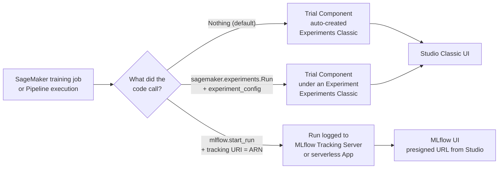
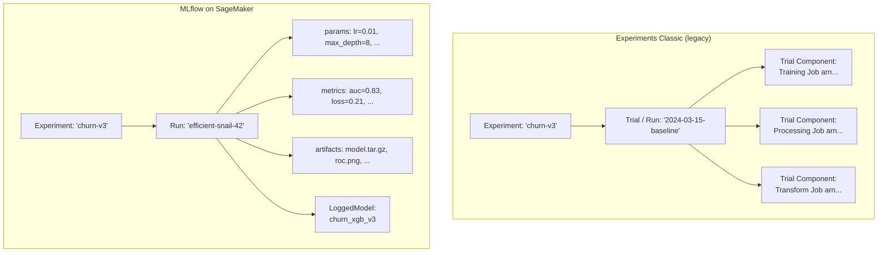
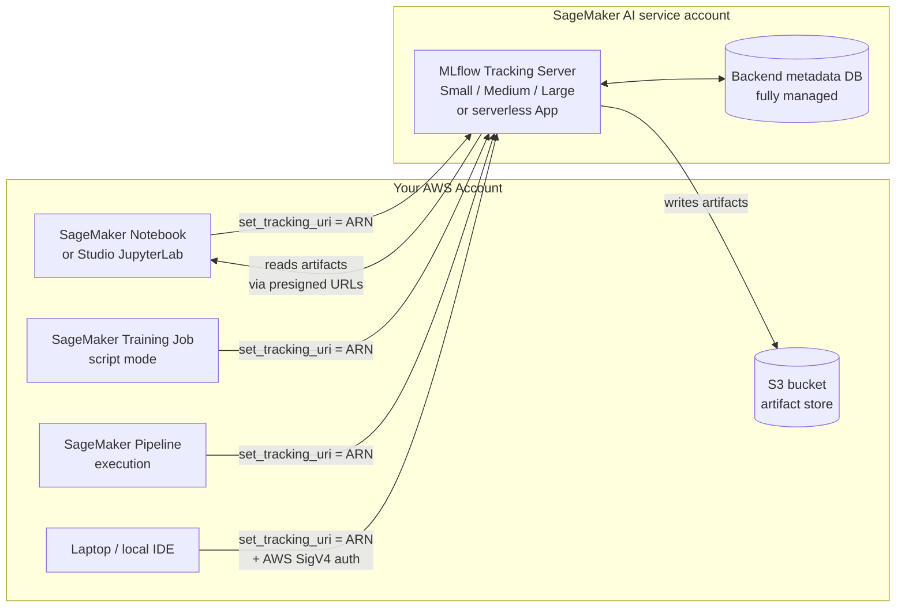
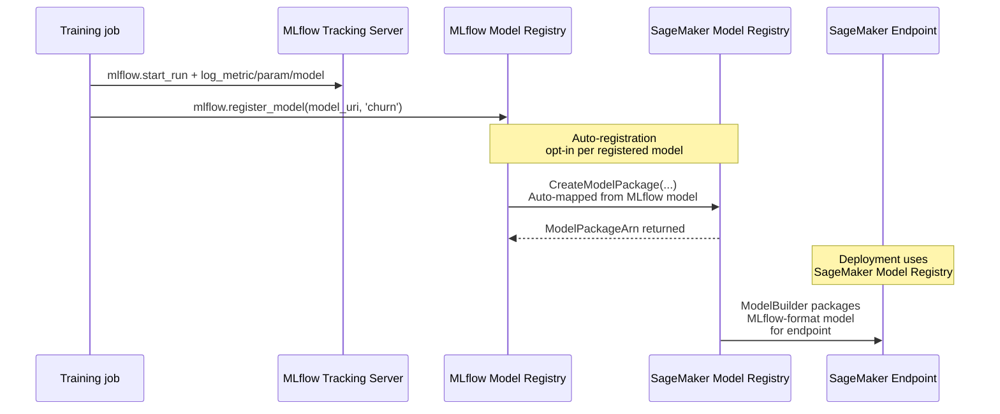
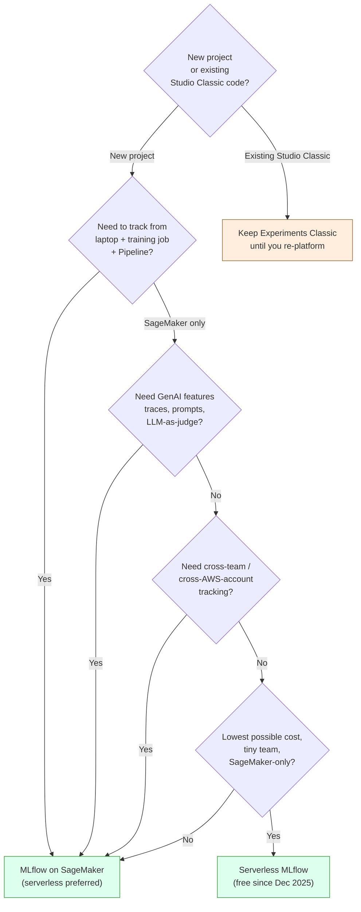

# Chapter 28 — SageMaker Experiments + MLflow on SageMaker

> **Goal of this chapter:** make you fluent in *every* exam-relevant way to track an ML experiment on SageMaker — from the legacy `sagemaker.experiments.Run` SDK that still ships in production code, through the auto-tracking that SageMaker training jobs do for free, to the AWS-managed **MLflow Tracking Server** that became the 2024 default and the **serverless MLflow App** that quietly replaced it in December 2025. By the end of this chapter you should be able to (a) name every level of both hierarchies (Experiment → Run → Trial Component vs. Experiment → Run → Logged Model), (b) write a training script that logs to either system from the same `train.py` body, (c) wire MLflow Model Registry into SageMaker Model Registry, (d) reason about pricing and lifecycle for the managed tracking server, (e) instantly pick the right tracking system for any scenario the exam can throw, and (f) recognize the three reproducibility failure modes that no tracking system fixes for you. Where [Chapter 23](23_builtin_algorithms.md) and [Chapter 24](24_script_mode.md) made you fluent in *producing* a trained model and [Chapter 25](25_byoc.md) showed you how to *package* one, this chapter teaches you how to *remember which one you trained*.

---

## 28.1 The reproducibility crisis — "you trained a model six months ago"

Picture a fraud-detection model your team shipped in November. It performs beautifully through Q4, and then in mid-May a regression appears: false-positive rate has crept from 0.8% to 2.1%, the call-center is drowning in disputes, and the VP wants the previous version back by Friday. You pull v2.3 from the registry — done. But the eval metrics on v2.3 don't match what was reported in November. The November test set was overwritten by a nightly job in December; the training script's `pandas>=1.5` constraint now resolves to 2.1 and crashes on a deprecated function; `numpy` is now 1.26 and the same seed produces different floats. *You can no longer reproduce the model that worked.*

This is the **reproducibility crisis**, and it is the failure mode the MLA-C01 exam quietly probes every time it puts Experiments + MLflow questions on the test. Task 2.3 of the exam guide is verbatim:

> Task 2.3 — *"Performing reproducible experiments by using AWS services."* (Knowledge: experiment trackers; SageMaker Experiments; MLflow.)

The experiment tracker is the **structural backbone** of any ML team that has survived more than one retraining cycle. It is the *only* artifact that connects:

- a row in a training dataset →
- a hyperparameter sweep →
- a specific git SHA + container image →
- a model in the registry →
- an endpoint serving real traffic →
- a complaint from a downstream consumer six months later.

Get this layer wrong and you get the most expensive class of MLOps failure: **"the model is broken in production and we can no longer reproduce the version that worked."** No amount of clever training code makes up for not being able to answer the question *"which version of which dataset was this?"* at audit time.

The 2024–2026 industry plot twist is that **AWS has effectively walked away from the native `SageMaker Experiments` SDK as the recommended path** and converged on **managed (now serverless) MLflow** as the answer. That single shift is what this chapter is *really* about. Everything else is detail — vocabulary, IAM, lifecycle, pricing — and we will walk all of it, but the strategic story is *AWS picked MLflow*, and you need to understand why before you memorize the surface area.

### 28.1.1 Three tracking surfaces, simultaneously

For an organization that has been on SageMaker since 2020, **three tracking surfaces coexist** in the same AWS account on the same day:



Modern teams should land on the right-most branch. Pre-2024 codebases live in the middle. The exam tests all three. You will see scenario questions that hand you the *symptoms* (Trial Components piling up in *Unassigned*, two clients writing to two different surfaces, an MLflow run that does not appear in the Studio Classic Experiments view) and ask you to diagnose which surface is being written to and what to change to consolidate.

---

## 28.2 The vocabulary tax — three hierarchies, one chapter

Both subsystems use the word "Run." Both use the word "Experiment." They do *not* mean the same thing. Internalize the table below before reading anything else, because every confusion in this chapter starts with someone using "Trial" when they mean "Run."

| Level | Experiments Classic (legacy) | Experiments Classic rename (2022) | MLflow on SageMaker |
|-------|---------------------------------|----------------------------------------|---------------------|
| Top container | `Experiment` | `Experiment` | `Experiment` |
| One "attempt" | `Trial` | **`Run`** (same object, renamed) | `Run` (different object, MLflow-native) |
| Sub-step of a Run | `TrialComponent` (one per training/processing/transform job) | `TrialComponent` (now a child of the renamed Run) | None at the data-model level — a Run contains *params, metrics, tags, artifacts, logged models* directly |
| Versioned model produced | (registered separately in Model Registry) | (registered separately in Model Registry) | `LoggedModel` (MLflow 2024 concept) — a first-class entity inside a Run |

**Two things to anchor:**

- **"Run" became the user-facing name for what was historically called a Trial.** AWS shipped a rename in 2022, kept the underlying `TrialComponent` plumbing, and added the `sagemaker.experiments.Run` Python wrapper. Boto3 still uses `CreateTrial`, `CreateTrialComponent`. You will see both terms in the same paragraph in AWS docs.
- **MLflow flattens the model.** It has Experiment → Run → (params, metrics, artifacts, tags, logged models). There is no "trial component" in MLflow. A SageMaker training job that logs to MLflow becomes *one Run*, not "a Run that has a Trial Component."



If a question shows you the *string* "TrialComponent" anywhere — in a Boto3 call, a JSON event, a CloudTrail entry, a Studio Classic URL — you are looking at **Experiments Classic**, not MLflow. The two systems are wire-incompatible; one Run cannot become the other Run without a rewrite.

---

## 28.3 Native SageMaker Experiments (Classic)

Before MLflow shipped on SageMaker (March 2024), this was *the* AWS-native tracking subsystem. It still exists, still works, and pre-existing customer code still uses it — so the exam still tests it. But every new team should start in §28.4.

### 28.3.1 The three pieces

| Object | Boto3 API | Python SDK | Lifetime |
|--------|-----------|------------|----------|
| **Experiment** | `CreateExperiment` / `DescribeExperiment` | `Experiment.create(experiment_name=...)` | Long-lived (months/years). The "project" bucket. |
| **Run** (was: Trial) | `CreateTrial` | `sagemaker.experiments.Run(...)` context manager | Short-lived (one attempt). Holds params/metrics for one logical iteration. |
| **Trial Component** | `CreateTrialComponent` / `AssociateTrialComponent` | (auto-created from jobs) | One per SageMaker job (Training, Processing, Transform). |

A Run can have **multiple Trial Components** when one logical iteration spans several jobs — e.g. a Processing job that preps data, followed by a Training job, followed by a Transform job for offline eval. All three become Trial Components under the same Run, sharing parameters and lineage in the Studio Classic UI.

### 28.3.2 Auto-tracking — the "I changed no code" case

This is the gift that paid for the entire feature in operational reviews. **Every** `CreateTrainingJob`, `CreateProcessingJob`, and `CreateTransformJob` automatically produces a `TrialComponent` with:

- All hyperparameters as `Parameters`.
- All input data channels (S3 URIs) as `InputArtifacts`.
- The output S3 location as `OutputArtifacts`.
- Every metric captured via `metric_definitions=` (regex on stdout — see [Chapter 23](23_builtin_algorithms.md)) as time-series `Metrics`.
- The job ARN, billable seconds, instance type, and other system metadata.

**You did nothing.** The Trial Component appears in Studio Classic's *Unassigned Trial Components* view. You can then drag-and-drop it into an Experiment/Run to organise — but most teams never do, which is why most production AWS accounts have thousands of orphan Trial Components that nobody owns.

If you want it auto-organised, pass `experiment_config=` on the estimator:

```python
from sagemaker.pytorch import PyTorch

est = PyTorch(
    entry_point='train.py',
    role=role,
    instance_type='ml.g5.xlarge',
    framework_version='2.1',
    py_version='py310',
)
est.fit(
    inputs={'training': 's3://my-bucket/data/'},
    experiment_config={
        'ExperimentName': 'churn-v3',
        'TrialName': '2024-03-15-baseline',  # the "Run name" in modern UI
        'TrialComponentDisplayName': 'training-job',
    },
)
```

After this call, Studio Classic shows the job under `churn-v3 → 2024-03-15-baseline → training-job`, with no further code needed.

### 28.3.3 The Python SDK — manual logging inside `train.py`

When you want to log **custom** metrics (eval scores computed inside the script that aren't on stdout), or **artifacts** (confusion matrices, ROC plots, precision-recall curves), use `sagemaker.experiments.Run`:

```python
# train.py — inside a SageMaker training job
from sagemaker.experiments.run import Run, load_run

# Pattern A: training job started with experiment_config -> use load_run
with load_run() as run:
    run.log_parameter('learning_rate', 0.01)
    run.log_metric('train_loss', loss, step=epoch)
    run.log_metric('val_auc', auc, step=epoch)
    run.log_artifact(name='roc_curve', value='/tmp/roc.png', media_type='image/png')
    run.log_confusion_matrix(y_true, y_pred, title='confusion_v3')
    run.log_precision_recall(y_true, y_score, title='pr_v3')

# Pattern B: local laptop or notebook -> create the Run explicitly
with Run(
    experiment_name='churn-v3',
    run_name='laptop-trial-2024-03-15',
    sagemaker_session=sm_session,
) as run:
    run.log_parameter('learning_rate', 0.01)
    # ...
```

`load_run()` is the magic. Inside a training job started with `experiment_config={...}`, it auto-discovers the in-progress Trial Component and gives your script a handle to add parameters/metrics/artifacts beyond what auto-tracking already captured. Outside such a job — on a laptop, in a notebook — `load_run()` raises, because there is no Trial Component context to load. Use `Run(experiment_name=..., run_name=...)` instead.

### 28.3.4 Pipelines integration — every execution = one Run

When a **SageMaker Pipelines** execution runs, every step that creates a Training/Processing/Transform job auto-emits a Trial Component, and **all of them get grouped under a single Experiment Run named after the Pipeline execution**. This is automatic. You don't pass `experiment_config`. Each Pipelines execution becomes one comparable iteration in the Studio Classic Experiments UI; the Run name is the Pipeline execution name, and each step is a Trial Component under that Run.

This auto-association is the *only* place Experiments Classic still has a feature edge over MLflow: it is genuinely zero-config inside Pipelines. The MLflow equivalent (§28.4.10) requires `mlflow.start_run()` in each step's script. We will revisit this in [Chapter 43](../part_g_deployment_orchestration/43_pipelines.md) when we cover Pipelines end-to-end.

### 28.3.5 The Studio Classic comparison UI

The capability worth knowing for the exam (it appears in scenario questions):

- **Run table** — select N Runs, see parameters and metrics side-by-side.
- **Parallel-coordinate plot** — visualise the hyperparameter space and which combinations produced the best metric.
- **Time-series plot** — overlay metric curves (`train_loss`, `val_auc`) across selected Runs.
- **Charts tab** — auto-generated scatter (param × metric) charts you can pin to a dashboard.

These plots are **Studio Classic only**. There is no equivalent UI for Experiments Classic in the new Studio (post-2023-11-30). The new Studio assumes you'll use MLflow.

### 28.3.6 What gets you in trouble

| Trap | What actually happens |
|------|-----------------------|
| Forgetting `experiment_config=` | Trial Component still created, but lands in *Unassigned* — orphan data nobody finds. |
| Two `load_run()` blocks in one script | Re-binds to the same Trial Component; second block's params overwrite the first's. |
| Different `TrialComponentDisplayName` per step but same `TrialName` | All steps grouped under one Run — *desired* for Pipelines, *wrong* if you intended to compare them as separate Runs. |
| Calling `Experiment.create` with a name that exists | Raises `ResourceInUse`. Use `Experiment.load(name)` first; create only on `ResourceNotFound`. |
| Logging > 100 metrics per Trial Component | Older limit; modern limits are higher but Studio Classic UI degrades past a few hundred metrics. |

### 28.3.7 Deprecation status — what the docs actually say

The AWS Developer Guide page for Experiments leads with this banner:

> *"Experiment tracking using the SageMaker Experiments Python SDK is only available in Studio Classic. We recommend using the new Studio experience and creating experiments using the latest SageMaker AI integrations with MLflow. There is no MLflow UI integration with Studio Classic."*

Translation: AWS isn't removing the API, but they have stopped building UI on top of it. The new Studio's "Experiments" navigation routes to MLflow, not Classic. **For greenfield projects, default to MLflow.**

> **⚠️ Exam alert — the quiet pivot.** Native SageMaker Experiments has **not** been formally deprecated — the SDK still exists, the boto3 APIs still work, and AWS has not posted a deprecation notice. But the current SageMaker AI Experiments product page (`aws.amazon.com/sagemaker/ai/experiments/`) describes the offering exclusively in terms of **managed MLflow**. The native `Experiment` / `Trial` / `TrialComponent` SDK is **not mentioned at all** in the public marketing copy. No new features have shipped to the native SDK since 2023. When the exam offers a choice between "use SageMaker Experiments" and "use MLflow on SageMaker," the modern correct answer is **MLflow** unless the question explicitly constrains you (e.g. "without provisioning any new resources, with no per-hour cost, SageMaker-only" — then Experiments Classic still wins because there is no tracking server to spin up).

---

## 28.4 Managed MLflow on Amazon SageMaker AI (2024 GA, 2025 serverless)

The 2024 flagship feature. AWS hosts an MLflow tracking server *as a service*, you connect to it from anywhere with an IAM identity, and all the MLflow standard APIs work. The exam increasingly uses this as the "right answer" for tracking questions.

### 28.4.1 The architecture in one diagram



**Three layers, two trust boundaries:**

- **Compute** — the tracking server EC2 + the MLflow process — runs *in the AWS-managed service account*. You don't see the instance, can't SSH, don't patch.
- **Backend metadata store** — a managed database holding Experiments, Runs, params, metrics, tags. Also in the service account.
- **Artifact store** — an S3 bucket *in your account*. The tracking server writes to it via cross-account IAM (configured at server-creation time). You keep KMS keys, bucket policies, lifecycle rules, encryption choices.

This split is the entire compliance story. PII / regulated artifacts (model files, evaluation outputs) live in your S3, under your KMS keys, behind your bucket policies. Lightweight metadata (loss=0.0341, lr=0.01) lives in the AWS-managed store. For Optum, Capital One, or any regulated-finance/health shop, this split is the difference between "MLflow is approvable" and "MLflow is not approvable" by the security architecture review board.

### 28.4.2 Tracking-server sizes — pick from a menu of three

| Size | Sustained TPS | Burst TPS | Recommended team size |
|------|---------------|-----------|------------------------|
| **Small** (default) | up to 25 | up to 50 | ≤ 25 concurrent users |
| **Medium** | up to 50 | up to 100 | ≤ 50 concurrent users |
| **Large** | up to 100 | up to 200 | ≤ 100 concurrent users |

Specified via `--tracking-server-size` on the CLI (`Small`/`Medium`/`Large`) or the Studio UI dropdown. You can resize an existing server (`UpdateMlflowTrackingServer`) — the upgrade is online but causes a brief reconnect.

**TPS = transactions per second.** Logging a metric, fetching a run, listing experiments — each is one transaction. Long-running fine-tuning jobs that log a metric every 100 steps over 8 hours rarely strain Small. A team of analysts simultaneously refreshing dashboards in the UI is what pushes you toward Medium. Pick by *concurrent user count*, not by data volume — the most common sizing mistake on the exam is picking Large because "we have 10 TB of artifacts," which is wrong (artifact volume is an S3 concern, not a TPS concern).

### 28.4.3 Lifecycle states + the eight control-plane APIs

States: `Creating → Created → Started ⇌ Stopped → Deleted`, plus a weekly `Maintenance In Progress` (AWS auto-patches; you pick the day/time). The eight control-plane APIs:

| API | What it does | Pricing impact |
|-----|--------------|-----------------|
| `CreateMlflowTrackingServer` | Provisions a new tracking server (5–25 min). | Starts the hourly meter. |
| `DescribeMlflowTrackingServer` | Returns ARN, size, version, state, artifact-store URI, maintenance window. | Free. |
| `StartMlflowTrackingServer` | Resumes a stopped server. | Resumes the hourly meter. |
| `StopMlflowTrackingServer` | Idles the server (state preserved). | **Stops the hourly meter.** |
| `UpdateMlflowTrackingServer` | Resize, change artifact store, change weekly maintenance window. | Brief reconnect. |
| `DeleteMlflowTrackingServer` | Tears it down. | Stops the meter; backend store deleted. S3 artifacts persist. |
| `ListMlflowTrackingServers` | Enumerates servers in the region. | Free. |
| `CreatePresignedMlflowTrackingServerUrl` | Short-lived URL that opens the MLflow UI with the caller's IAM identity. | Free. |

A **stopped** server costs *nothing* in compute (you keep paying for S3 only). `DescribeMlflowTrackingServer` reports `MlflowVersion`, `TrackingServerStatus`, `BackendStoreSize`, `LastMaintenanceTime` for ops dashboards.

> **⚠️ Exam alert — tracking server lifecycle pricing.** This is the single most-tested cost question in this chapter. **A Started tracking server bills per hour even when nobody is logging to it. A Stopped server bills nothing for compute (S3 storage still bills).** The standard cost-optimization pattern is an EventBridge schedule + Lambda that calls `StopMlflowTrackingServer` on Friday evening and `StartMlflowTrackingServer` on Monday morning — the server resumes in 1–5 minutes when the first morning user calls `set_tracking_uri`, and data persists across stop/start. *Do not confuse Stop with Delete.* Stop preserves data; Delete removes backend metadata but keeps S3 artifacts (you control their lifecycle). If a scenario question says "the team uses MLflow only during business hours and wants to minimize cost," the answer is **Stop, not Delete**.

### 28.4.4 Supported MLflow versions

From the official versions table:

| MLflow version | Python | Notes |
|----------------|--------|-------|
| **3.0** (latest tracking servers) | 3.9+ | The 2024-09 release; introduces `LoggedModel`, prompt management, traces. |
| 2.16 | 3.8+ | Predecessor, still supported on existing servers. |
| 2.13 | 3.8+ | Oldest still-supported line. |
| **MLflow App 3.10** | 3.10+ | Used by the *MLflow App* in the new unified Studio (different surface than Tracking Servers — see §28.4.13). |

**Client/server version match matters.** AWS recommends pinning `mlflow==X.Y.Z` to your server's version family — e.g. server 3.0.x → `pip install mlflow==3.0.0 sagemaker-mlflow`. Mismatch errors are silent until you hit a newer API the server doesn't speak.

### 28.4.5 The AWS MLflow plugin — why a plugin is needed

A vanilla MLflow client speaks HTTP to a tracking server with no built-in auth. To plug into AWS IAM, you need the `sagemaker-mlflow` PyPI package, which is an MLflow plugin that:

- **Re-signs every outbound MLflow REST call with AWS SigV4** using the caller's IAM credentials.
- Lets you point the client at a *tracking-server ARN* (not a URL) — the plugin resolves the ARN to the actual endpoint.
- Translates MLflow REST verbs into IAM `Action` strings so a single IAM policy can authorize the entire MLflow surface.

```python
# One-time per environment
pip install sagemaker-mlflow mlflow==3.0.0

# Inside any Python process — laptop, notebook, training job
import mlflow
mlflow.set_tracking_uri("arn:aws:sagemaker:us-east-1:123:mlflow-tracking-server/prod")

with mlflow.start_run(experiment_id=...) as run:
    mlflow.log_param("lr", 0.01)
    mlflow.log_metric("auc", 0.83)
    mlflow.sklearn.log_model(model, name="churn_xgb")
```

The first call uses the IAM identity of whatever process is running it — your local AWS profile, the Studio domain execution role, the training-job execution role. The `sagemaker-mlflow` package is a *plugin* (not a fork) — it wraps and authenticates vanilla MLflow REST calls; the rest of your MLflow code is exactly what it would be against any other tracking server.

### 28.4.6 IAM — `sagemaker-mlflow:*`, not `mlflow:*`

This is one of the highest-yield gotchas on the exam. **All** MLflow REST APIs map to IAM actions under the `sagemaker-mlflow` service prefix. A minimal identity policy for a data scientist looks like:

```json
{
  "Statement": [
    {
      "Effect": "Allow",
      "Action": ["sagemaker-mlflow:AccessUI", "sagemaker-mlflow:CreateExperiment",
                 "sagemaker-mlflow:CreateRun", "sagemaker-mlflow:LogMetric",
                 "sagemaker-mlflow:LogParam", "sagemaker-mlflow:LogModel",
                 "sagemaker-mlflow:CreateRegisteredModel",
                 "sagemaker-mlflow:CreateModelVersion", "sagemaker-mlflow:SearchRuns"],
      "Resource": "arn:aws:sagemaker:us-east-1:123:mlflow-tracking-server/prod"
    },
    {
      "Effect": "Allow",
      "Action": ["sagemaker:CreatePresignedMlflowTrackingServerUrl",
                 "sagemaker:DescribeMlflowTrackingServer"],
      "Resource": "arn:aws:sagemaker:us-east-1:123:mlflow-tracking-server/prod"
    }
  ]
}
```

Two namespaces are in play. **Control plane** (`sagemaker:CreateMlflowTrackingServer`, `sagemaker:StopMlflowTrackingServer`, `sagemaker:CreatePresignedMlflowTrackingServerUrl`) — admin operations on the server resource itself. **Data plane** (`sagemaker-mlflow:LogMetric`, `sagemaker-mlflow:CreateExperiment`, `sagemaker-mlflow:CreateRun`, ...) — the MLflow REST surface, namespaced separately so you can split admin from per-developer permissions.

If you see *any* answer choice that grants `mlflow:LogMetric` or `mlflow:*`, that answer is wrong. The IAM service prefix is `sagemaker-mlflow`, with a hyphen. The full list of data-plane actions (one per MLflow REST verb) is on the AWS docs page and is logged in CloudTrail with the prefix `Mlflow` — e.g. `MlflowCreateExperiment`, `MlflowLogMetric`.

### 28.4.7 Artifact store — your S3, your encryption

The artifact store **must** be an S3 bucket in your account. Created at tracking-server-creation time; you supply:

- The bucket URI (`s3://my-mlflow-bucket/prefix/`).
- An IAM role the tracking server assumes (cross-account) to write to it.
- (Optional) a KMS key for SSE-KMS encryption.

**Hard limit:** SageMaker MLflow caps **download size at 200 MB per artifact**. Larger model files (> 200 MB) must be logged via `log_model` (which writes the full thing to S3) and *downloaded* via a presigned S3 URL outside MLflow, not via the MLflow `download_artifacts` API. The exam doesn't usually probe this number directly, but real teams hit it the first time they log a transformer checkpoint, and the workaround is "store in S3 by URI, log only a reference artifact in MLflow."

### 28.4.8 CloudTrail + EventBridge — what shows up where

**CloudTrail** logs both control-plane and data-plane calls. Control-plane events use the exact API name (`CreateMlflowTrackingServer`, `StopMlflowTrackingServer`, `StartMlflowTrackingServer`, etc.). Data-plane events — every MLflow operation — are prefixed `Mlflow`: `MlflowCreateExperiment`, `MlflowCreateRun`, `MlflowLogMetric`, `MlflowLogParam`, `MlflowLogBatch`, `MlflowLogModel`, `MlflowCreateModelVersion`, `MlflowTransitionModelVersionStage`, `MlflowSetRegisteredModelAlias`. That is a *complete audit trail* for every experiment-tracking action — useful for SOC2 / FedRAMP / model-risk-management evidence. SR 11-7 reviewers love this because "who logged this metric, when, from which IAM principal" has a one-query answer in CloudTrail.

**EventBridge** publishes lifecycle events you can route to Lambda / Step Functions / SNS for automation. The full catalog: `SageMaker Tracking Server Creating/Created/Create Failed`, `Updating/Updated/Update Failed`, `Deleting/Deleted/Delete Failed`, `Starting/Started/Start Failed`, `Stopping/Stopped/Stop Failed`, `Maintenance In Progress/Complete/Failed`, plus data-plane events `SageMaker MLFlow Tracking Server Creating Run`, `Creating RegisteredModel`, `Creating ModelVersion`, `Transitioning ModelVersion Stage`, `Setting Registered Model Alias`.

The Run/RegisteredModel/ModelVersion events are the substrate for **auto-promoting** models when they pass an evaluation gate. Pattern: an EventBridge rule that fires on `Transitioning ModelVersion Stage` from `Staging` → `Production` targets a Step Functions workflow that runs a Clarify bias check and deploys to a canary endpoint. Revisited end-to-end in [Chapter 43](../part_g_deployment_orchestration/43_pipelines.md) and [Chapter 51](../part_h_monitoring_governance/51_model_registry.md).

### 28.4.9 MLflow Model Registry ↔ SageMaker Model Registry

This is the integration that pays for the whole feature for many teams. You can opt in to *automatic* one-way sync from MLflow Model Registry to SageMaker Model Registry:



The hooks:

- **`mlflow.register_model(model_uri, registered_model_name)`** in your script. If auto-registration is enabled on the tracking server, this triggers a corresponding `CreateModelPackage` in SageMaker Model Registry, populating the model URI, image URI (resolved by `ModelBuilder`), and metadata.
- **`ModelBuilder`** in the SageMaker Python SDK can take an MLflow model URI directly and produce a SageMaker `Model` object ready to deploy — it inspects the MLflow `MLmodel` file, picks the matching DLC, and wires up `model.deploy()`.

When the exam asks *"how do you deploy a model tracked in MLflow with the fewest steps?"*, the answer is **`ModelBuilder`** with the MLflow model URI. When it asks *"how do you keep the SageMaker Model Registry in sync with MLflow without writing glue code?"*, the answer is **enable auto-registration on the tracking server**. Both of these are covered in depth in [Chapter 51 — Model Registry](../part_h_monitoring_governance/51_model_registry.md).

### 28.4.10 Auto-association with SageMaker Pipelines + training jobs

Three ways an MLflow Run gets created from SageMaker code:

1. **Explicit, inside a script:** `with mlflow.start_run(experiment_id=...)` — most code uses this.
2. **Automatic, via training-job env vars:** if a training job's environment is configured with `MLFLOW_TRACKING_URI` and `MLFLOW_EXPERIMENT_NAME`, MLflow's autologging picks them up — but in SageMaker the cleaner pattern is to pass them via the estimator's `environment=` parameter.
3. **Automatic, via Pipelines:** when a Pipeline step instantiates an estimator and runs, you can pass an MLflow tracking URI through `environment=` and call `mlflow.start_run()` inside the script — each Pipeline execution then writes its own Run, tagged with the Pipeline execution ARN. The exam-style answer to "every Pipeline run = one tracking run, no extra service" is exactly this pattern.

A genuinely useful behavior shipped with the serverless MLflow App (§28.4.13): **if a pipeline runs and no MLflow App is referenced, SageMaker creates a default MLflow App in the account and logs to it.** This is the *zero-config* path. You don't need to provision anything before the first pipeline run — the tracking destination is created on demand. We will cover this in detail in [Chapter 43](../part_g_deployment_orchestration/43_pipelines.md).

### 28.4.11 MLflow autologging — the lowest-effort happy path

For supported frameworks, `mlflow.autolog()` (called once at the top of your script) instruments the framework so that **all** parameters, metrics, model artifacts, and sometimes signature schemas get logged automatically. Supported:

- **scikit-learn** — `mlflow.sklearn.autolog()`: logs all `fit()` params, training-set metrics, the fitted estimator as an artifact.
- **PyTorch Lightning** — `mlflow.pytorch.autolog()`: logs trainer params, per-epoch metrics from the Lightning logger, best checkpoint.
- **TensorFlow / Keras** — `mlflow.tensorflow.autolog()`: logs `model.compile` params, per-epoch metrics, TF SavedModel artifact.
- **XGBoost / LightGBM / CatBoost** — similar.
- **transformers** — `mlflow.transformers.autolog()`: logs Trainer args, eval metrics, the model.

For exam purposes: *the lowest-effort way to track a script-mode training job in MLflow* is `mlflow.autolog()` + `mlflow.set_tracking_uri(ARN)` at the top of `train.py`. Nothing else needed.

**The hidden gotcha — autolog scope.** `mlflow.autolog()` (no flavor) tries to *enable autologging for every supported flavor it can detect*. This is convenient and dangerous: if you import `xgboost` "just to do feature importance," autolog will start logging `xgboost` runs you didn't intend. If a callback fires from a library you didn't know was instrumented (e.g. `pytorch_lightning`), you can get duplicate or interleaved logs. **Best practice:** pick the *specific* flavor — `mlflow.sklearn.autolog()` — not the global `mlflow.autolog()`. The exam may not ask this directly, but it shows up in real code reviews constantly.

### 28.4.12 LLM / GenAI features — why MLflow leapfrogged native Experiments

The 2024 MLflow 3.x release added GenAI-native concepts that Experiments Classic doesn't have, which is why AWS positioned MLflow as the future:

- **Traces** — `mlflow.start_span()` records the inputs/outputs of every step of a RAG pipeline or agent loop, so you can debug "why did the LLM answer wrong" by drilling into the exact retrieved docs and prompts.
- **Prompts** — first-class versioned prompt templates (`mlflow.register_prompt`).
- **LLM-as-judge metrics** — `mlflow.evaluate(..., extra_metrics=[mlflow.metrics.genai.answer_correctness()])`.
- **Logged Models** — separate from Runs, a `LoggedModel` is a versioned artifact you can attach to multiple Runs (e.g. one model evaluated five different ways).

These features alone are sufficient grounds for the exam to prefer MLflow over Experiments Classic for any GenAI scenario.

### 28.4.13 The 2025 plot twist — serverless MLflow

The June 2024 launch of provisioned MLflow tracking servers was loudly criticized — the Small instance landed at roughly **$460/month for a 24/7 server**, which Eduardo Robledo of AWS Fundamentals publicly called "crazy" for what is essentially a tracking endpoint. AWS heard the feedback and responded in December 2025 with **serverless MLflow on SageMaker AI**, which removes the per-hour fee entirely.

| Date | What shipped | Pricing model |
|------|--------------|---------------|
| **June 2024** | Managed MLflow GA — *provisioned tracking servers* (Small / Medium / Large) | Compute hours + metadata storage; ~$460/mo for Small 24/7 |
| **Mid-2025** | MLflow v3.x support, cross-account access via AWS RAM, Pipelines hooks | Same provisioned model |
| **Dec 2025** | **Serverless MLflow** GA on SageMaker AI | **No additional charge** beyond underlying S3 storage |
| **Q1 2026** | MLflow 3.10 on serverless; GenAI-focused features (prompt logging, agent tracing) | Same — no charge for the tracking layer itself |

> **⚠️ Exam alert — serverless MLflow is free (since Dec 2025).** This is the single biggest 2025–2026 update to this chapter, and the one most likely to differ from older study material that says "MLflow on SageMaker costs ~$460/month for Small." On serverless, **the tracking layer itself has no compute charge** — you pay only for the S3 artifact store and any actual training/inference compute you spin up. When a question asks for "experiment tracking with the *least* operational overhead and the *least* cost" and the choices include "self-host MLflow on EC2," "provision a Small managed MLflow tracking server," and "use SageMaker serverless MLflow," the **modern correct answer is serverless MLflow**. The Pipelines integration also got the *default MLflow App* trick — if a Pipeline runs and no MLflow App exists, SageMaker creates one in the account automatically. Genuinely zero-config tracking.

Post-Dec-2025, the only remaining reasons to self-host MLflow on EC2/ECS are: heavy compliance constraints that require your own KMS/WAF, the need for arbitrary MLflow server-side plugins, or multi-cloud portability. Before December 2025, the $460/mo break-even argument made DIY-on-EC2 attractive for small teams. After December 2025, the cost arguments largely evaporated.

From the Servify Sphere piece, the most accurate statement about managed MLflow on SageMaker: *"It doesn't fix poor experimentation habits. It removes the operational excuse for not tracking experiments at all."* MLflow is not the bottleneck. Teams know how to log metrics. The problem is *consistency* and *discipline* — see §28.9.

---

## 28.5 Comparison — when to pick which (the exam decision tree)



Notice that the tree converges on MLflow in nearly every branch since the Dec 2025 serverless launch. Pre-Dec-2025, the lowest-cost SageMaker-only branch landed on Experiments Classic (no per-hour fee); the serverless launch removed that distinction.

### 28.5.1 Side-by-side feature matrix

| Capability | Native Experiments (Classic) | MLflow on SageMaker (2024+ GA, serverless Dec 2025) |
|------------|------------------------------|------------------------------------------------------|
| GA date | 2020 | March 2024 (provisioned); Dec 2025 (serverless) |
| Tracking surface | SageMaker jobs + Studio Classic notebooks | SageMaker jobs + notebooks + **laptops + any AWS workload** |
| UI | Studio Classic only | MLflow UI (presigned URL from Studio) |
| Auto-tracking from training jobs | Yes (every Training/Processing/Transform job → Trial Component) | Yes, via `mlflow.autolog()` |
| Pipelines integration | Auto: each execution → one Experiment Run | Default MLflow App auto-created if missing; otherwise call `start_run()` in step scripts |
| Model Registry | SageMaker Model Registry (separate object) | MLflow Model Registry **+ auto-sync to SageMaker Model Registry** |
| GenAI tracing | No | Yes (MLflow 3.x) |
| Prompts | No | Yes (`register_prompt`) |
| LLM-as-judge | No | Yes (`mlflow.evaluate`) |
| Cross-framework | SageMaker SDK only | All MLflow flavors (sklearn, pytorch, tf, transformers, xgboost, ...) |
| Cross-cloud portability | None | Standard MLflow APIs — can lift to Databricks MLflow, OSS MLflow, etc. |
| Pricing | Free (just CloudWatch metric ingestion) | **Serverless: free for tracking layer.** Provisioned: per-hour tracking-server compute + S3 |
| Need to manage a service | No | Provisioned: yes (start/stop/version/size). Serverless: no |
| IAM | `sagemaker:*` | `sagemaker:*` (control plane) + `sagemaker-mlflow:*` (data plane) |
| Boto3 control-plane APIs | `CreateExperiment`, `CreateTrial`, `CreateTrialComponent` | `CreateMlflowTrackingServer`, `Start/Stop/Update/DeleteMlflowTrackingServer`, `CreatePresignedMlflowTrackingServerUrl` |

### 28.5.2 "When the question says X, pick Y" cheat-sheet

| Scenario phrase | Pick |
|-----------------|------|
| "Track across PyTorch and TensorFlow" / "from a laptop and a SageMaker job" / "GenAI prompts" / "EventBridge promotion" / "shared with a Databricks workspace" | **MLflow** |
| "Lowest cost, no per-hour fee, no infrastructure to provision" (2026+) | **Serverless MLflow** |
| "Pre-existing Studio Classic project, no migration budget" | **Experiments Classic** (stay put) |
| "Auto-create a tracking run for each Pipeline execution" | Either — modern answer **MLflow** (serverless creates the App on demand) |
| "Track foundation-model training with millions of metrics per run" | Probably **Neptune.ai** (out of scope on cert; pick MLflow as best available) |
| "Track with the W&B UI" / "shop is on CoreWeave" | **W&B** (out of scope; the cert will never make this the right answer in an AWS-native question) |

### 28.5.3 MLflow vs W&B vs Comet vs Neptune

By mid-2026 the experiment-tracking conversation has narrowed to four products that production ML teams actually pay for or self-host:

| Tool | Strategic posture (2026) | Who picks it |
|------|--------------------------|--------------|
| **MLflow** | OSS de-facto standard; monetized by Databricks; now also AWS-managed (serverless) | Teams that want zero vendor lock-in, or are already on Databricks / SageMaker |
| **W&B** | Developer-first DX, premium UI; acquired by **CoreWeave (May 2025)** | Frontier labs (OpenAI, NVIDIA, Stability, Microsoft cite W&B publicly); GPU-cloud-heavy shops |
| **Neptune.ai** | Infra-agnostic "metadata database for GPT-scale training" | Foundation-model teams that need extreme logging volume (millions of metrics per run) and strict governance |
| **Comet ML** | SaaS-first, model registry + light production monitoring, on-prem option | Mid-size teams that want a managed alternative to W&B without the price tag |

*These are no longer four similar tools — they are four divergent philosophies.* For the cert, you should know they exist and that the AWS-native answer is always MLflow. The MLA-C01 will never ask you to pick W&B over an AWS service — but real-world architecture interviews will. Deviate from MLflow only if: (1) the org is on **CoreWeave / multi-cloud GPU** (→ W&B), (2) you are doing **foundation-model training** with logs in the millions of steps (→ Neptune), (3) you have an **existing Databricks footprint** (→ Databricks-managed MLflow with Unity Catalog), or (4) you are two people training one model (→ local `mlruns/` directory; don't over-engineer).

---

## 28.6 Pricing — the only thing finance cares about

### 28.6.1 Native Experiments — effectively free

You pay for CloudWatch metric ingestion (only billable side effect), SageMaker job time (which you pay for anyway), and S3 storage of any artifacts you upload. No tracking-server fee, no control-plane fee — the "tracking is free, you only pay for training" model.

### 28.6.2 Provisioned MLflow on SageMaker — per-hour tracking-server compute

Two cost components: (1) **tracking-server hours** — billed per hour of `Started` state (not while `Stopped`); tiered by size; ~$0.50–$2/hour for Small with roughly linear scaling, so a Small server 24/7 is ~$400–700/month before storage; (2) **S3 artifact storage** — standard S3 rates in your account. The standard cost-optimisation move pre-Dec-2025 was an EventBridge schedule + Lambda calling `StopMlflowTrackingServer` on nights/weekends — server resumes in 1–5 minutes when the first morning user calls `set_tracking_uri`; data persists across stop/start.

### 28.6.3 Serverless MLflow on SageMaker — free for tracking

Since December 2025, the tracking layer itself has **no additional charge**. You pay only for S3 artifact storage and actual training/inference compute. This is the modern default. The only reason to still use provisioned tracking servers is if you need a specific MLflow version the serverless surface doesn't support, or you have an SLA requirement serverless can't commit to (extremely rare).

### 28.6.4 The "delete vs stop" decision (provisioned only)

**Stop** when reuse is expected: state preserved, zero compute cost, S3 cost continues. **Delete** when the project is over: backend metadata is gone, S3 artifacts remain (you control their lifecycle). Re-creating a server against the same S3 bucket re-discovers artifacts but run-level metadata is lost. On serverless, this question disappears.

---

## 28.7 Reproducibility — the three failure modes no tracker fixes

The exam's "reproducible experiments" task is broader than just tracking. It bundles five capabilities, and MLflow + Experiments only solves two of them.

| Capability | How SageMaker addresses it |
|------------|-----------------------------|
| **Code reproducibility** | Pipelines version the step definitions; Studio Code Editor + git; estimator's `source_dir` archived as `sourcedir.tar.gz` in S3 (see [Ch 24](24_script_mode.md)). |
| **Data reproducibility** | S3 versioned buckets; **SageMaker Feature Store** (offline store snapshots); Glue Data Catalog versions. *You are responsible.* |
| **Environment reproducibility** | Pinned `framework_version` + `py_version` on the estimator; `requirements.txt`; BYOC for full Docker control ([Ch 25](25_byoc.md)). *You are responsible.* |
| **Parameter / metric reproducibility** | **Experiments Classic** or **MLflow** — *this chapter solves this one.* |
| **Lineage** | SageMaker **ML Lineage Tracking** (artifacts, contexts, actions) — covered in [Ch 30](30_lineage.md). |

When the question says "reproducible experiments" the answer is rarely *only* "use Experiments" — it's almost always **Pipelines + tracking + Feature Store + Model Registry working together**. Pick the choice that names the most of those, not the choice that just names one.

### 28.7.1 The three reproducibility failure modes

The 2025 Wiley *AI Magazine* survey of 294 ML-research reproducibility studies identified **data leakage and dataset version drift** as the dominant cause of failed reproductions, far more than random-seed issues. The three real-world failure patterns:

**(1) Dataset version drift — "we have the exact code and we still can't reproduce it."**

Cause: the *training data* changed underneath the team. Common variants:

- The S3 prefix that "had the training data" was overwritten by a nightly job.
- The Postgres view that defined the labels was altered to fix an unrelated bug.
- A feature in a Feature Group was recomputed with a new formula, but the feature name was reused.
- The team thought they were pinning `dataset-v3.csv` but actually wrote `dataset-latest.csv` in the YAML.

**Fix:** log the *content hash* of the training dataset alongside the path. DVC, LakeFS, or just a manual `sha256` of the manifest. MLflow does NOT do this for you — you must do it explicitly. The canonical pattern AWS is pushing in 2025–2026 blogs: pair **DVC** (Data Version Control) on the data side with MLflow on the experiment side, so each run is tagged with the DVC hash of the training dataset. This closes the data-version loop that MLflow alone does not solve.

**(2) Library version drift — "we have the code, the data, and we still can't reproduce it."**

Cause: the *Python environment* drifted. Common variants:

- `requirements.txt` had `>=` constraints; `numpy` and `scikit-learn` shipped breaking changes.
- The training container was rebuilt from `python:3.10` six months later; the same `pip install` resolved to a different graph.
- CUDA driver on the training instance changed (newer DLAMI), and a non-deterministic GPU kernel produced subtly different results.

**Fix:** `mlflow.log_artifact("conda.yaml")` and `mlflow.log_artifact("pip-freeze.txt")` on every run, **pin everything**, and ideally log the container digest (ECR `sha256:...`, not the floating tag). MLflow autolog *does* capture `conda.yaml` automatically for many flavors — this is a feature worth knowing about for the exam.

**(3) Random seed drift — "it reproduces locally but not in SageMaker Training."**

Cause: the seed was set but **not in all the right places**. PyTorch alone has 4+ sources of nondeterminism:

```python
import random, os, numpy as np, torch
random.seed(42); np.random.seed(42); torch.manual_seed(42)
torch.cuda.manual_seed_all(42)
torch.backends.cudnn.deterministic = True
torch.backends.cudnn.benchmark = False
os.environ["PYTHONHASHSEED"] = "42"
```

…and even with all that, distributed training across multiple GPUs can still yield non-bit-exact results because of reduction order. This is a *known limitation*, not a bug. The honest answer is "metric-level reproducibility, not bit-level reproducibility."

### 28.7.2 What the cert is implicitly testing

When MLA-C01 asks about "ensuring reproducibility," the answer keys consistently favor: **(a) pin the training container image**, **(b) version the dataset**, **(c) log all hyperparameters and the random seed**, **(d) capture the environment (`conda.yaml`)**. MLflow + SageMaker do (c) and (d) almost for free; (a) and (b) are your responsibility, and the cert will not give you credit for (c)+(d) alone.

---

## 28.8 Cross-framework tracking — MLflow's actual superpower

The single biggest *technical* reason MLflow won the open-source experiment-tracking war is that it is **completely framework-agnostic.** The same API works across:

- **scikit-learn** — `mlflow.sklearn.autolog()`
- **PyTorch** — `mlflow.pytorch.autolog()`
- **TensorFlow / Keras** — `mlflow.tensorflow.autolog()`
- **XGBoost / LightGBM / CatBoost** — dedicated autolog flavors
- **Hugging Face Transformers** — `mlflow.transformers.autolog()`
- **LangChain / LlamaIndex / OpenAI** — newer GenAI autologgers in 3.x
- **Anything custom** — `mlflow.log_metric()` / `log_param()` / `log_artifact()`

A typical Optum-sized health-AI project might have:

- a **scikit-learn** baseline (logistic regression on tabular features),
- a **LightGBM** challenger (the production model),
- a **PyTorch** deep-learning experiment that the research team is exploring,
- a **Hugging Face** zero-shot model used for a feature.

With MLflow, *all four* land in the same experiment, can be compared in the same UI, and can be registered into the same model registry. Without MLflow, you'd have TensorBoard for PyTorch, sklearn's own logging for sklearn, and the LightGBM team using a Google Sheet. This is not a strawman — it is the 2019–2021 state of the art at most companies, and it is the operational pain that MLflow solved.

For native Experiments Classic, this cross-framework story is much weaker. The auto-tracking only applies to SageMaker jobs (which can run any framework, but the metrics ingestion goes through `metric_definitions=` regex on stdout, which is per-framework). The `Run` SDK works the same regardless of framework, but the UI cannot meaningfully *compare* an sklearn run to a PyTorch run because the parameter and metric naming conventions diverge.

---

## 28.9 The "log everything" antipattern — Experiments as a junk drawer

The flip side of MLflow's ease of use is the **junk-drawer problem**: once logging is free, teams log everything, and the experiment store becomes a data lake of noise that nobody trusts.

### 28.9.1 What "junk drawer" looks like in practice

- **10,000+ runs in a single experiment**, 9,900 of which are someone's abandoned hyperparameter sweep from 2023.
- Run names like `run-2024-03-14-1457` with no `mlflow.set_tag("intent", ...)`.
- Three competing run-naming conventions across the team.
- Nobody knows which run produced the model currently in production.
- The MLflow UI takes 30 seconds to load because of the run count.
- **Databricks-hosted MLflow now imposes quotas** (as of March 27, 2024) on total parameters/tags/metric-steps per run and total runs per experiment — AWS-hosted MLflow has similar service limits, and you *will* hit them.

### 28.9.2 Symptoms that you're in the antipattern

1. You search for "the production model run" and get 200 hits.
2. Two teammates' runs have the same hyperparameters but different metrics and nobody can tell why.
3. You've stopped using the comparison view because runs aren't comparable.
4. The first thing a new hire does is start a new experiment because the old one is unusable.

### 28.9.3 The discipline checklist that prevents it

A short list of practices that actually work:

| Discipline | Why it works |
|------------|--------------|
| **One experiment per *model purpose***, not per training script | Comparisons stay meaningful (sklearn vs lgbm vs torch *for fraud*) |
| **Tag every run with `intent`** | `intent=sweep`, `intent=baseline`, `intent=prod-candidate`, `intent=debug` |
| **Tag every run with `git_sha`** | Joins MLflow back to code; cheap to log, priceless to have |
| **Tag every run with `dataset_hash`** | Closes the data-version loop |
| **Use `mlflow.set_tag("status", "archived")`** for dead runs | Cheaper than deletion, keeps history queryable |
| **Promote-only runs go to the registry** | The registry is the curated layer; the run store is the firehose |
| **Don't `autolog()` and `log_metric()` the same metric** | Causes duplicate keys, breaks aggregation in the UI |
| **Set a 90-day archival policy** | Force a periodic conversation about what is actually useful |

The honest framing for the exam: MLflow gives you the *capability* to track, but the *organization* still has to choose to be disciplined. The cert sometimes asks "what is the best way to ensure model lineage" — the answer is rarely just "use MLflow," it is "use MLflow + Model Registry + tags + versioned datasets."

---

## 28.10 Three end-to-end patterns

### 28.10.1 Pattern A: vanilla script-mode training job, autologged to MLflow

```python
# train.py
import os, mlflow, mlflow.sklearn, pandas as pd
from sklearn.ensemble import RandomForestClassifier
from sklearn.metrics import roc_auc_score

mlflow.set_tracking_uri(os.environ["MLFLOW_TRACKING_ARN"])
mlflow.set_experiment("churn-v3")
mlflow.sklearn.autolog()  # one line: params, metrics, model all auto-logged

train = pd.read_csv("/opt/ml/input/data/training/train.csv")
val   = pd.read_csv("/opt/ml/input/data/training/val.csv")

with mlflow.start_run():
    model = RandomForestClassifier(n_estimators=200, max_depth=8)
    model.fit(train.drop("y", axis=1), train["y"])
    auc = roc_auc_score(val["y"], model.predict_proba(val.drop("y", axis=1))[:, 1])
    mlflow.log_metric("val_auc", auc)
    mlflow.sklearn.log_model(model, name="churn_rf", registered_model_name="churn-v3")
```

The driver (laptop or notebook) launches an `SKLearn` estimator with `environment={"MLFLOW_TRACKING_ARN": "arn:aws:sagemaker:...:mlflow-tracking-server/prod"}` and `dependencies=["requirements.txt"]` (containing `mlflow==3.0.0, sagemaker-mlflow`). After the job: a new MLflow Run with all hyperparameters, train/val AUC, and the pickled RF model. A new ModelVersion exists in MLflow Model Registry. (If auto-sync is on, also in SageMaker Model Registry.) Total app code: ~15 lines of MLflow.

### 28.10.2 Pattern B: legacy Studio Classic project, native Experiments

```python
# launch.py
from sagemaker.pytorch import PyTorch
from sagemaker.experiments.run import Run

with Run(experiment_name="churn-v3", run_name="2026-05-26-baseline",
         sagemaker_session=sm_session) as run:
    run.log_parameter("model_family", "pytorch_mlp")
    est = PyTorch(entry_point="train.py", role=role, instance_type="ml.g5.xlarge",
                  framework_version="2.1", py_version="py310")
    est.fit(inputs={"training": "s3://my-bucket/data/"},
            experiment_config={"ExperimentName": "churn-v3",
                               "TrialName": "2026-05-26-baseline",
                               "TrialComponentDisplayName": "pytorch-train"})
```

Inside `train.py`, `with load_run() as run:` discovers the in-progress Trial Component and lets you call `run.log_metric("val_auc", auc, step=epoch)`. This is the "no extra service to run, but bound to Studio Classic UI" pattern. Still in production at many teams.

### 28.10.3 Pattern C: Pipelines execution = one MLflow Run

```python
# in a training step's script
import os, mlflow
mlflow.set_tracking_uri(os.environ["MLFLOW_TRACKING_ARN"])
exec_arn = os.environ["PIPELINE_EXECUTION_ARN"]

with mlflow.start_run(run_name=exec_arn.split("/")[-1]) as run:
    mlflow.set_tag("pipeline_execution_arn", exec_arn)
    mlflow.set_tag("step_name", os.environ["SAGEMAKER_STEP_NAME"])
    mlflow.set_tag("git_sha", os.environ["GIT_SHA"])
    # ... train, log_metric, log_model ...
```

Pair this with an EventBridge rule on `SageMaker MLFlow Tracking Server Transitioning ModelVersion Stage` and you have **automated promotion**: pipeline runs → model trained → registered → manually approved in MLflow UI → EventBridge fires → Lambda deploys to a canary endpoint. End-to-end MLOps in under 100 lines of code. Revisited in [Chapter 43](../part_g_deployment_orchestration/43_pipelines.md).

---

## 28.11 Migration — Experiments Classic → MLflow

AWS's official guidance: **past Experiments Classic data stays viewable in Studio Classic, but you can't migrate it.** To "move" a project, you re-run the training script with MLflow logging — historical Trial Components remain readable, new history accumulates in MLflow. Migration steps: (1) inventory which `TrialComponent`s map to current production endpoints (usually 5–20%; rest are dead runs); (2) provision a serverless MLflow App; (3) re-instrument `train.py` — wrap in `with mlflow.start_run()`, switch `run.log_*` → `mlflow.log_*`, add `set_tracking_uri(arn)` + `set_experiment(name)`; (4) install `sagemaker-mlflow` + matching `mlflow` version; (5) grant `sagemaker-mlflow:*` to the execution role; (6) drop `experiment_config=` from estimators; (7) for Pipelines, set tracking URI via each step's `environment=` (or rely on the default MLflow App); (8) optionally enable auto-registration to SageMaker Model Registry.

Leave legacy Experiments alone — they remain queryable as a read-only archive for ~12 months while you migrate auditors and dashboards. This is the *quiet* deprecation pattern: nobody removes the old API, but the new code only writes to MLflow.

---

## 28.12 The 18 exam gotchas

1. **"Trial" and "Run" mean the same thing in Experiments Classic.** AWS renamed Trial → Run in 2022; the boto3 API still uses Trial. Distractor: "you must create a Trial before a Run" — false; same object.
2. **`load_run()` only works inside a job started with `experiment_config=`.** Outside, it raises. On a laptop, use `with Run(experiment_name=..., run_name=..., sagemaker_session=...)`.
3. **Pipelines auto-create one Experiment Run per execution** in Experiments Classic — no `experiment_config` needed. The MLflow equivalent requires `mlflow.start_run()` in each step's script (or the default-MLflow-App trick).
4. **MLflow tracking-server hours are billable when *Started*, free when *Stopped*** (provisioned). Always-on costs $400–700/mo for Small. Scheduled stop on nights/weekends is the standard exam answer for cost optimization.
5. **Serverless MLflow (Dec 2025) has no tracking-layer cost.** The "lowest-cost MLflow" answer in 2026 is serverless, not "stop the provisioned server on weekends."
6. **`StopMlflowTrackingServer` preserves data; `DeleteMlflowTrackingServer` removes backend metadata but keeps S3 artifacts.** Don't confuse the two.
7. **IAM actions for MLflow are under `sagemaker-mlflow:*`, NOT `mlflow:*`.** Highest-yield trap on the exam.
8. **Control-plane (`sagemaker:CreateMlflowTrackingServer`) and data-plane (`sagemaker-mlflow:LogMetric`) are different namespaces.** A user can have one without the other.
9. **MLflow artifact store is S3 in *your* account; backend metadata is in the SageMaker service account.** PII/regulated artifacts stay under your control + KMS keys.
10. **MLflow download size cap is 200 MB per artifact.** Larger model files require presigned-URL download from S3.
11. **Tracking server sizes: Small (25 TPS), Medium (50), Large (100).** Burst is 2x sustained. Pick by concurrent user count, not by data volume.
12. **`sagemaker-mlflow` is a *plugin*, not a fork.** It SigV4-signs MLflow REST calls so vanilla MLflow client + AWS IAM works.
13. **MLflow versions:** 3.0 (latest provisioned), 2.16, 2.13 on Tracking Servers; **3.10** for the MLflow App in unified Studio. Client/server version mismatch is silent until you hit a newer API.
14. **Auto-registration from MLflow Model Registry → SageMaker Model Registry is opt-in,** configured per registered model.
15. **`ModelBuilder` consumes MLflow model URIs directly** for deployment — the "fewest steps to deploy a tracked model" answer.
16. **The new Studio (post-2023-11-30) has no Experiments Classic UI** — only the MLflow App. Studio Classic remains the only place to view Classic experiments.
17. **CloudTrail data-plane events for MLflow are prefixed `Mlflow`** (e.g. `MlflowCreateExperiment`). They are enabled by default.
18. **EventBridge fires `SageMaker MLFlow Tracking Server Transitioning ModelVersion Stage`** when a registered model moves between stages — the hook for auto-promotion.

---

## 28.13 Exercises

**Exercise 28.1 — Vocabulary check.** Without looking back, define each of: `Experiment`, `Trial`, `Run` (in Experiments Classic), `Run` (in MLflow), `TrialComponent`, `LoggedModel`. For each, indicate which subsystem it belongs to and whether it is created by the SDK or auto-created by the platform.

**Exercise 28.2 — Cost optimization.** A team runs a Small managed (provisioned) MLflow tracking server 24/7 in `us-east-1` at $0.65/hour. They use MLflow only Mon–Fri, 8 AM – 7 PM ET. (a) Current monthly cost? (b) Cost if they Stop on nights/weekends? (c) Cost if they migrate to serverless MLflow in December 2025? Show your arithmetic.

**Exercise 28.3 — IAM debugging.** A data scientist gets `AccessDenied: User is not authorized to perform: mlflow:LogMetric` when calling `mlflow.log_metric()` against a SageMaker MLflow tracking server. (a) What is wrong with the IAM policy? (b) Write the corrected `Action` line. (c) The same scientist now gets `User is not authorized to perform: sagemaker:DescribeMlflowTrackingServer` when running `mlflow.set_tracking_uri(arn)`. Which namespace is missing?

**Exercise 28.4 — Hierarchy translation.** A legacy script logs to Experiments Classic with `Run(experiment_name="fraud-v2", run_name="2024-09-15-lr-sweep") ... run.log_parameter("learning_rate", 0.001); run.log_metric("val_auc", 0.87, step=10)`. Translate the equivalent into MLflow on SageMaker — tracking URI, autolog choice, registered model name. Then describe what is *structurally different* in the resulting tracking surface (the absence of `TrialComponent`).

**Exercise 28.5 — Reproducibility audit.** Six months ago your team trained a model with code at git SHA `abc123`, MLflow run ID `r-xyz`, hyperparameters logged, pinned `mlflow==3.0.0`. Retraining today against the same data S3 prefix produces measurably different validation metrics. List the four most likely root causes in order of probability, and for each, name the specific AWS service / artifact / log you would consult to confirm.

**Exercise 28.6 — Pipelines + MLflow design.** Design the MLflow tracking layout for a nightly SageMaker Pipeline (Processing → Training → Evaluation → ConditionStep → RegisterModel). How many Experiments? How many Runs per Pipeline execution (single vs nested)? What tags on each Run, and why? Which step calls `mlflow.register_model()` and why not earlier? Which AWS event would a downstream consumer subscribe to in order to trigger deploy on every approved model version?

**Exercise 28.7 — Junk-drawer triage.** You inherit an MLflow tracking server with 12,000 runs across 47 experiments. The team can no longer find "the production model run"; UI loads in 40 seconds. Without deleting any data, propose a 5-step plan to make the tracking server useful again — cite specific MLflow tags, naming conventions, archival policies. Which of the 18 exam gotchas (§28.12) is this exercise testing?

---

## 28.14 Where this chapter sits in the larger picture

This chapter is the *tracking* layer of the reproducibility story. The full story spans:

- **Back to [Ch 22 — Studio Lifecycle](22_studio_lifecycle.md)** — the Studio surface where the MLflow UI is reached (presigned URL) and where Experiments Classic's now-orphan UI lives.
- **Back to [Ch 23 — Built-in Algorithms](23_builtin_algorithms.md)** — `metric_definitions=` regex, the mechanism by which auto-tracked metrics make it from stdout to the tracking store.
- **Back to [Ch 24 — Script Mode](24_script_mode.md)** and **[Ch 25 — BYOC](25_byoc.md)** — the training-job execution context where `mlflow.start_run()` actually fires, and the environment in which `MLFLOW_TRACKING_ARN` is injected.
- **Forward to [Ch 31 — AMT (Automatic Model Tuning)](../part_f_hpo_distributed_training/31_amt.md)** — every tuning job's sub-trials auto-emit as Runs (Experiments Classic) or can be wired to log as nested MLflow Runs.
- **Forward to [Ch 43 — Pipelines](../part_g_deployment_orchestration/43_pipelines.md)** — the Pipelines auto-association behavior described in §28.3.4 and §28.4.10 is covered end-to-end with code there.
- **Forward to [Ch 51 — Model Registry](../part_h_monitoring_governance/51_model_registry.md)** — the MLflow Model Registry ↔ SageMaker Model Registry auto-sync from §28.4.9 is the registration hand-off into deployment.

The five things to remember from this chapter:

1. **MLflow has won the open-source experiment-tracking war**, and on AWS the answer in 2026 is **serverless MLflow on SageMaker** (Dec 2025 GA, no additional cost for the tracking layer).
2. **Native SageMaker Experiments is being quietly retired** — the product page has stopped mentioning it. The SDK still works but new code should use MLflow.
3. **Reproducibility is *not* free** — MLflow gives you code/hyperparameter reproducibility but you must explicitly version the **data** (DVC, hash) and the **environment** (pinned ECR digest, `conda.yaml`).
4. **The default-MLflow-App trick** means SageMaker Pipelines + MLflow is essentially zero-config now — that's a likely exam shortcut.
5. **"Log everything" is an antipattern.** Discipline (one experiment per model purpose, intent tags, dataset hashes, archival policy) matters more than the tool. The cert tests this implicitly when it asks about "ensuring lineage."

Internalize the three-layer mental model as your recall hook — when a tactical question lands, ask *which layer is this about?* That alone disambiguates most exam questions. **Layer 1 (training job):** SageMaker Training / Processing / Pipeline step — pinned container image, versioned dataset, seeded code. **Layer 2 (experiment history — the firehose):** MLflow Tracking, one experiment per model purpose, many runs, most archived, a few promoted. **Layer 3 (curated truth):** MLflow Model Registry as the hand-off to deployment, tagged with `stage=Production`, `dataset_hash=...`, `git_sha=...`.
