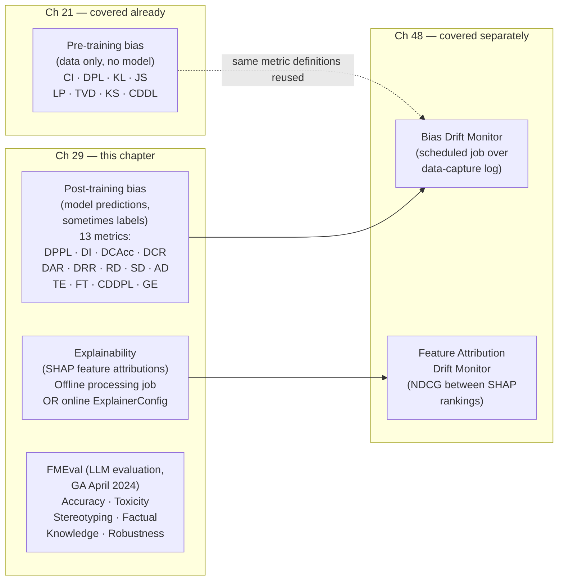
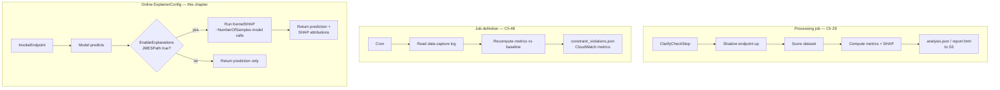
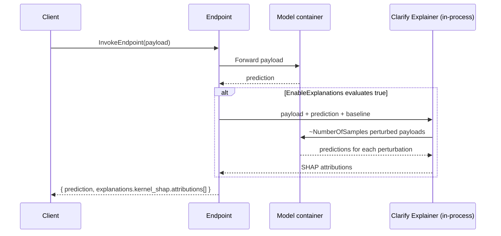
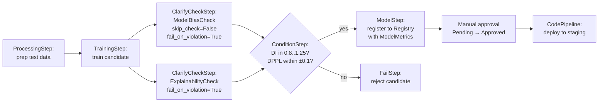

# Chapter 29 — SageMaker Clarify: Interpretability and Bias for Trained Models

> **Goal of this chapter:** make you fluent in the *post-training* half of SageMaker Clarify — the bias metrics that need a trained model (not just data), the SHAP-based interpretability path (offline batch and online inline), the new (April 2024) Foundation Model evaluation framework, and the governance plumbing that connects all three into Model Cards, Model Registry, and SageMaker Pipelines. By the end of this chapter you should be able to look at a fairness scenario on the exam (or in a design review at a regulated bank) and immediately know: which Clarify metric to compute, whether you need ground-truth labels for it, what its no-bias value is, which execution shell (processing job, job definition, or online ExplainerConfig) to wrap it in, and how to wire the result into the artifact your model-risk officer reads. Where [Chapter 21](../part_d_data_prep_features/21_bias_integrity.md) covered Clarify's *pre-training* side — bias metrics computed on the dataset before any model exists — this chapter is the bridge to [Chapter 48](../part_h_monitoring_governance/48_bias_drift_monitor.md): post-training bias + explainability is what you compute *once* at registration time, and the Bias Drift Monitor reuses the same metric definitions on a cron in production.

---

## 29.1 Where this chapter sits

Clarify is a single AWS brand name covering three quite different capabilities. The exam expects you to know which capability is which, and never to confuse them in a scenario question. The mental model:



Three things to internalize before reading another line:

1. **Post-training metrics need the model's predictions.** Some of them *also* need ground-truth labels (DCAcc, DCR, DAR, DRR, RD, SD, AD, TE, GE). The four that need predictions only — DPPL, DI, FT, CDDPL — are the ones that survive on the production inference log where ground truth has not yet arrived. That distinction (label-required vs label-free) is the single most-tested axis in this chapter; we'll come back to it in §29.3 and again in the exam-pitfalls list.
2. **"Clarify" is the same engine running in three execution shells.** Processing job (offline batch, one-shot), Model Monitor job definition (scheduled cron), and Endpoint ExplainerConfig (real-time inline). Same SHAP implementation, same bias-metric definitions, different trigger surface and latency profile. The exam tests *which shell* satisfies a given constraint at least as often as it tests the metrics themselves.
3. **FMEval is a different beast.** Don't confuse it with the bias/SHAP path. It is a 2024 addition under the Clarify brand for evaluating *foundation models* (LLMs), with completely different metrics — toxicity, factual knowledge, stereotyping, semantic robustness — and completely different inputs (prompts and generations, not feature vectors). When the question stem says "facet" or "DPPL" or "SHAP," it is the classical path. When it says "LLM," "Bedrock," "JumpStart," "TriviaQA," or "toxicity score," it is FMEval.

This chapter walks all three, in that order, and then closes with the governance plumbing (Model Cards, `ClarifyCheckStep`, the four `(skip_check, register_new_baseline)` combinations that auditors will quiz you on).

---

## 29.2 The three Clarify execution modes

You will be asked, repeatedly, to pick which Clarify execution shell satisfies a constraint. Memorize this table cold:

| Aspect | Processing job (offline batch) | Job definition (scheduled cron) | Online ExplainerConfig (real-time inline) |
|---|---|---|---|
| **API entry point** | `SageMakerClarifyProcessor.run_post_training_bias()` / `run_explainability()` | `CreateModelBiasJobDefinition` / `CreateModelExplainabilityJobDefinition` | `CreateEndpointConfig` → `ExplainerConfig.ClarifyExplainerConfig` |
| **Trigger** | Manual or Pipeline step | Cron schedule against Model Monitor data-capture logs | Every `InvokeEndpoint` call (optionally gated by a JMESPath expression) |
| **Input** | S3 dataset + model (creates a *shadow endpoint* on the fly, or uses pre-computed predictions) | S3 path to data-capture log + baseline constraints | Single request payload + a `ShapBaseline` |
| **Latency overhead** | None — happens out of band | None on the inference path | **Significant**: ≈ `NumberOfSamples + 1` extra model invocations *per request* |
| **Output** | `analysis.json` + `report.html` + `report.pdf` + `report.ipynb` + per-record SHAP CSVs | `constraint_violations.json` + CloudWatch metrics | Per-request SHAP values inline in the inference response |
| **Use case** | Pre-deployment audit, Model Card population, training-time SHAP baseline | Production drift detection (covered in Ch 48) | Adverse-action reason codes, regulated lending, real-time "why this?" UI |
| **Cost shape** | One bill per run | Cron × duration | Per-inference, multiplicative on every call |



The pattern that gets tested most often: a candidate model is about to be registered in the Model Registry, the team wants a one-shot bias + explainability report attached to the Model Card, and the question asks which Clarify mode to use. **That is a Processing job**, specifically wrapped in a `ClarifyCheckStep` (§29.10), not Online ExplainerConfig. The reverse pattern: a regulated bank must give the customer a SHAP-based reason code for *every* denial decision under FCRA — that *is* Online ExplainerConfig, because the explanation must be returned in-band with the prediction. A third pattern: production endpoint is up, traffic is captured, you want to alarm if DPPL drifts past 0.15 — that's a Job Definition (Ch 48), not Online ExplainerConfig.

> ⚠️ **Exam alert.** *Clarify Online Explainability is configured on the **EndpointConfig**, not on the endpoint itself.* You cannot toggle explanations on a running endpoint with a flag. You create a new `EndpointConfig` with `ExplainerConfig.ClarifyExplainerConfig`, then call `UpdateEndpoint` to roll the new config in. Questions that offer "toggle a flag on the live endpoint" as an option are testing this exact misunderstanding.

---

## 29.3 The thirteen post-training bias metrics

AWS lists thirteen post-training metrics in the Clarify documentation (older summaries say "eleven" because CDDPL and GE were added after the original Clarify paper). The exam tests the first nine plus FT (counterfactual fliptest) most often; CDDPL and GE are the long tail. Treat the first ten as memorize-the-formula material and the last three as recognize-the-trigger-word material.

Notation, identical to Ch 21 so you don't have to re-learn it:

- **Facet** = the sensitive attribute (e.g., `gender`, `race`, `age_band`).
- **Facet a** = "advantaged" / favored group (majority demographic, reference group).
- **Facet d** = "disadvantaged" / disfavored group.
- `y` = observed (ground-truth) label, `y'` = predicted label.
- Positive outcome = 1 (loan approved, candidate hired). Negative outcome = 0.
- Confusion-matrix shorthand per facet: `TP`, `FP`, `FN`, `TN`.
- `n_a(1)` = count of *observed* positives in facet a; `n'_a(1)` = count of *predicted* positives in facet a; same for `d`.
- `q_a = n_a(1) / n_a` is the *observed* positive proportion. `q'_a = n'_a(1) / n_a` is the *predicted* positive proportion.

The 2×2 confusion matrices for facets `a` and `d` are the source of truth for every metric below. If you can write these two matrices, you can compute every post-training bias metric Clarify offers.

### 29.3.1 DPPL — Difference in Positive Proportions in Predicted Labels

The post-training analog of pre-training **DPL** (Ch 21).

```
DPPL = q'_a − q'_d
     = (n'_a(1) / n_a) − (n'_d(1) / n_d)
```

- **What it measures**: the gap between the *fraction predicted positive* across facets. Same shape as DPL, but computed on `y'` instead of `y`.
- **Range**: `[-1, +1]` for binary/multicategory labels; `(-∞, +∞)` for continuous targets.
- **No-bias value**: `0` (equal positive prediction rates across facets).
- **Needs labels?** **No.** Predictions alone suffice. This makes DPPL one of the few post-training metrics usable on unlabeled production data — and is why **DPPL is the workhorse metric of the Bias Drift Monitor** (Ch 48): the cron job can recompute it on yesterday's inference log without waiting for ground-truth backfill.
- **Exam tell**: question describes "imbalance in *predicted* positive outcomes" with no mention of ground truth → DPPL. If it mentions *observed* positive outcomes only → DPL (pre-training, Ch 21). The "P" in DPPL is silent for many candidates and trips them up; remember it stands for "Predicted."

### 29.3.2 DI — Disparate Impact

The legally codified one. DI maps directly to the **"four-fifths rule"** from US employment law (the EEOC's *Uniform Guidelines on Employee Selection Procedures*, 1978) and is referenced in the ECOA fair-lending framework, the ADEA, and — as we'll see in §29.11 — NYC Local Law 144.

```
DI = q'_d / q'_a
   = (n'_d(1) / n_d) / (n'_a(1) / n_a)
```

- **What it measures**: ratio (not difference) of positive prediction rates across facets. Reads as: "how much smaller is the disadvantaged group's selection rate than the advantaged group's?"
- **Range**: `[0, ∞)`.
- **No-bias value**: `1.0` (predictions distributed in the same proportion across facets).
- **Legal threshold**: `0.8` to `1.25`. The four-fifths rule says the disadvantaged group's selection rate must be ≥ 80% of the advantaged group's. Many real-world Clarify configurations alarm on `DI < 0.8` **or** `DI > 1.25` (symmetric, because a "reverse" disparity can be litigated too).
- **Needs labels?** **No.** Predictions only.
- **Exam tell**: any question with "**four-fifths rule**", "**0.8 threshold**", "**80% rule**", or "**regulated lending fairness check**" → Disparate Impact.

> ⚠️ **Exam alert.** *DI is a ratio with no-bias value 1.0, not 0.* A question that offers "no bias when DI = 0" is wrong on its face — DI = 0 means the disadvantaged group received *zero* positive outcomes, the worst possible bias. The four-fifths rule says the **lower bound** for the impact ratio is 0.8 (an 80% gap is the line); the symmetric **upper bound** is 1.25 (= 1/0.8). Memorize both.

### 29.3.3 DCAcc — Difference in Conditional Acceptance

This metric exists to catch *miscalibration*: are observed positives matching predicted positives at the same rate across facets?

```
DCAcc = c_a − c_d
where  c_i = (observed positives in facet i) / (predicted positives in facet i)
           = n_i(1) / n'_i(1)
```

Read it as: **"For every loan I predict accepted in facet a, how many were truly qualified? Does that ratio match facet d?"** If the model over-predicts acceptances for one facet (lots of predicted positives, few observed ones), `c` for that facet drops below 1, and DCAcc surfaces the gap.

- **Range**: `(-∞, +∞)`.
- **No-bias value**: `0` (the model "over-/under-accepts" each facet at the same rate vs ground truth).
- **Needs labels?** **Yes** (the numerator is observed positives, requires `y`).
- **Exam tell**: "Are loans accepted **more or less frequently than predicted**, conditional on facet?" → DCAcc. The word "**conditional**" in the prompt is the discriminator versus DAR (precision, §29.3.5), which is also about acceptances but is a different ratio.

### 29.3.4 DCR — Difference in Conditional Rejection

The negative-outcome mirror of DCAcc, with identical shape:

```
DCR = r_a − r_d
where  r_i = n_i(0) / n'_i(0)
```

Read it as: "For every loan I predict denied in facet a, how many were truly unqualified?"

- **Range**: `(-∞, +∞)`.
- **No-bias value**: `0`.
- **Needs labels?** **Yes.**
- **Exam tell**: "Are loans **rejected more or less than predicted**" + "conditional on facet" → DCR.

### 29.3.5 DAR — Difference in Acceptance Rates (precision difference)

Don't confuse with DCAcc. DAR is **precision-difference across facets**.

```
DAR = (TP_a / (TP_a + FP_a)) − (TP_d / (TP_d + FP_d))
    = precision_a − precision_d
```

- **What it measures**: when the model predicts "accept", how often is that prediction correct, per facet?
- **Range**: `[-1, +1]`.
- **No-bias value**: `0`.
- **Needs labels?** **Yes** (TP/FP require ground truth).
- **Exam tell**: "Does the model have **equal precision** when predicting acceptances across facets?" → DAR.

### 29.3.6 DRR — Difference in Rejection Rates

The negative-class twin of DAR — precision difference for negative predictions:

```
DRR = (TN_a / (TN_a + FN_a)) − (TN_d / (TN_d + FN_d))
```

- **Range**: `[-1, +1]`.
- **No-bias value**: `0`.
- **Needs labels?** **Yes.**
- **Exam tell**: "**Equal precision for rejections**" or "**negative predictive value**" parity → DRR.

### 29.3.7 RD — Recall Difference

```
RD = (TP_a / (TP_a + FN_a)) − (TP_d / (TP_d + FN_d))
   = recall_a − recall_d
```

- **What it measures**: of all *true* positives in each facet, what fraction does the model catch?
- **Range**: `[-1, +1]`.
- **No-bias value**: `0`.
- **Needs labels?** **Yes.**
- **Equivalent academic name**: **Equal Opportunity** violation. `RD = 0` ⇒ equal opportunity (Hardt, Price, Srebro 2016).
- **Exam tell**: "higher **recall** for one age group than another" → RD. Also: "**equal opportunity** fairness criterion" → RD.

### 29.3.8 SD — Specificity Difference

```
SD = (TN_a / (TN_a + FP_a)) − (TN_d / (TN_d + FP_d))
   = specificity_a − specificity_d
```

- The "negative-class twin" of RD.
- **Range**: `[-1, +1]`.
- **No-bias value**: `0`.
- **Needs labels?** **Yes.**
- **Combined**: `RD = 0 AND SD = 0` ⇒ **Equalized Odds**, the strongest of the common parity criteria. Equalized odds is rarely satisfiable in practice; the exam may ask which two Clarify metrics together imply it.
- **Exam tell**: question explicitly says "specificity" or "true negative rate per facet" → SD.

### 29.3.9 AD — Accuracy Difference

```
AD = accuracy_a − accuracy_d
   = ((TP_a + TN_a) / n_a) − ((TP_d + TN_d) / n_d)
```

- **What it measures**: overall classification accuracy gap across facets.
- **Range**: `[-1, +1]`.
- **No-bias value**: `0`.
- **Needs labels?** **Yes.**
- **Caveat**: `AD = 0` can hide compensating errors — high precision and low recall on one facet vs the opposite on another can average to "equal accuracy." Always cross-check AD with RD, SD, and DAR before claiming fairness.
- **Exam tell**: "Does the model predict **labels as accurately** across demographic groups?" → AD.

### 29.3.10 TE — Treatment Equality

The unusual one — it measures *which kind of error* the model makes per facet.

```
TE = (FN_a / FP_a) − (FN_d / FP_d)
```

- **What it measures**: ratio of false negatives to false positives per facet. Tests whether the model "fails differently" across groups.
- **Range**: `(-∞, +∞)`. Undefined when `FP_i = 0`.
- **No-bias value**: `0`.
- **Needs labels?** **Yes.**
- **Exam tell**: "**ratio of false positives to false negatives** the same across groups?" → TE. The phrase "**treatment equality**" itself appears in some questions.
- **Practical note**: useful when the *cost* of FP and FN are very different (medical screening — missing a true positive is much worse than a false alarm), and you want to make sure no demographic bears a disproportionate share of one type of error.

### 29.3.11 FT — Counterfactual Fliptest

The only metric in the post-training family that asks a **counterfactual** question, not a marginal one. This is the metric that controls for "but the two groups are genuinely different on other features."

Algorithm:

1. For each member of facet `d`, find the *k* nearest neighbors in facet `a` using a feature distance metric (excluding the facet itself).
2. Apply the model to both the original `d` member and each of its `a` neighbors.
3. Count flips: how often does the prediction differ?

```
FT = (F+ − F−) / n_d
where:
  F+ = number of d-members whose a-neighbors get a more favorable prediction
  F− = number of d-members whose a-neighbors get a less favorable prediction
```

- **Range**: `[-1, +1]`.
- **No-bias value**: `0`.
- **Needs labels?** **No** (operates on predictions vs predictions of matched pairs).
- **Strength**: it is the only Clarify metric that approximates the counterfactual "what if this person had been in the other facet?" — if two near-twins on every other dimension get different decisions because of the protected attribute alone, FT will catch it. The other metrics can be confounded by genuine population-level feature differences.
- **Cost**: nearest-neighbor search at scale is expensive; Clarify uses an approximate-NN backend.
- **Exam tell**: "**counterfactual**", "**similar members**", "**matched on all features**", "what if the applicant had been a different race?" → FT.

### 29.3.12 CDDPL — Conditional Demographic Disparity in Predicted Labels

Post-training analog of CDDL (Ch 21). Computes DPL not just globally but **stratified by a subgroup variable**, then reports both the global value and the worst-subgroup value. Catches **Simpson's-paradox-style hiding**: the model looks fair overall, but in every subgroup it is unfair (or vice versa).

The canonical example: a healthcare triage model whose overall DI is 0.95 (fine), but when you stratify by department — emergency, oncology, cardiology — DI drops to 0.6 in three of five. The aggregate has masked the per-department bias because the facet distributions across departments differ.

- **Range**: `[-1, +1]`.
- **No-bias value**: `0`.
- **Needs labels?** **No** (uses predicted labels).
- **Exam tell**: "**subgroups**", "**Simpson's paradox**", or "**conditional on department / region / age band**" → CDDPL (or its pre-training cousin CDDL).

### 29.3.13 GE — Generalized Entropy

An information-theoretic measure of inequality in "benefits" (the per-sample favorable-outcome score) — borrowed from economics, specifically the Theil index family.

- **Range**: `[0, 0.5]` for binary/multicategory labels.
- **No-bias value**: `0` (all individuals receive equal benefit).
- **Needs labels?** **Yes.**
- **Exam tell**: rarely tested. If you see "**Theil index**" or "**inequality of benefits**" → GE.

### 29.3.14 The cheat-sheet table

| Metric | Range | No-bias | Labels? | One-liner exam trigger |
|---|---|---|---|---|
| **DPPL** | `[-1, +1]` | `0` | **No** | "Imbalance in *predicted* positive outcomes" |
| **DI** | `[0, ∞)` | **`1.0`** | **No** | "Four-fifths rule" / "0.8 threshold" / "80% rule" |
| **DCAcc** | `(-∞, +∞)` | `0` | Yes | "Accepted more/less than predicted" (the word "conditional") |
| **DCR** | `(-∞, +∞)` | `0` | Yes | "Rejected more/less than predicted" |
| **DAR** | `[-1, +1]` | `0` | Yes | "Equal **precision** for acceptances" |
| **DRR** | `[-1, +1]` | `0` | Yes | "Equal **precision** for rejections" / NPV parity |
| **RD** | `[-1, +1]` | `0` | Yes | "Equal **recall**" / "Equal Opportunity" |
| **SD** | `[-1, +1]` | `0` | Yes | "Equal **specificity**" / TNR parity |
| **AD** | `[-1, +1]` | `0` | Yes | "Equal **accuracy**" |
| **TE** | `(-∞, +∞)` | `0` | Yes | "Ratio of FP to FN equal" / "treatment equality" |
| **FT** | `[-1, +1]` | `0` | **No** | "**Counterfactual**" / matched neighbors / "what if" |
| **CDDPL** | `[-1, +1]` | `0` | **No** | "Stratified by subgroup" / Simpson's paradox |
| **GE** | `[0, 0.5]` | `0` | Yes | "Theil index" / inequality of benefits |

> ⚠️ **Exam alert.** *The four label-free metrics are exactly the four that the Bias Drift Monitor can run on the data-capture log without waiting for ground-truth backfill: **DPPL, DI, FT, CDDPL**.* Every other post-training metric requires the label. A common exam scenario: "the production endpoint captures inputs and predictions but ground truth arrives 30 days late — which fairness metrics can you alarm on in real time?" The answer is exactly these four. **Mnemonic: "Predicted-only is DDFC"** — DPPL, DI, FT, CDDPL.

---

## 29.4 SHAP explainability — Kernel SHAP under the hood

Clarify's explainability path is **always SHAP**, specifically **Kernel SHAP** as the model-agnostic default. The exam will sometimes use the words "model-agnostic" or "perturbation-based" — both point to Kernel SHAP. If you see "tree-specific" or "exact for tree ensembles," that's TreeSHAP, which Clarify does *not* expose (Autopilot uses TreeSHAP internally on its tree candidates, but the Clarify processing job and the online ExplainerConfig path are always Kernel SHAP).

### 29.4.1 Why Kernel SHAP

SHAP (SHapley Additive exPlanations) assigns each feature `i` an attribution `φ_i` such that:

```
prediction(x) = E[prediction(baseline)] + Σ_i φ_i
```

The model's prediction for sample `x` decomposes into (a) the expected prediction over a "baseline" distribution, plus (b) per-feature contributions that sum to the gap. The Shapley values from cooperative game theory are the *unique* attribution that satisfies four axioms — efficiency, symmetry, dummy, additivity (Lundberg & Lee, NeurIPS 2017).

**Kernel SHAP** approximates Shapley values for *any* black-box model by perturbing the input: it hides features by replacing them with values drawn from the baseline dataset, observes how the prediction changes, and solves a weighted linear regression over the resulting samples. Cost is `O(NumberOfSamples × inference_latency)` per record being explained, which is why online SHAP is expensive (more on this in §29.5).

There are faster, model-specific variants — TreeSHAP for XGBoost / LightGBM / CatBoost (exact, ~50× faster), DeepSHAP for neural nets (approximated via DeepLIFT) — but **the Clarify processing-job and ExplainerConfig path is always Kernel SHAP**, because it is model-agnostic and therefore works whether you brought XGBoost, a PyTorch transformer, or a SageMaker built-in algorithm.

### 29.4.2 The baseline — the most-tested SHAP concept

The baseline (also called the background dataset) represents the **"average input"** against which contributions are computed. SHAP attributions are always **relative to this baseline**; change the baseline, and the attributions change. This is the conceptual hook the exam reaches for most often when it asks about SHAP.

Three ways to specify the baseline:

| Method | API field | When to use |
|---|---|---|
| **Inline rows** | `ShapBaseline` (list of feature vectors) | Small (≤ 100 rows), known good "neutral" examples checked into source control |
| **S3 URI** | `ShapBaselineUri` | Larger baselines, version-controlled separately in S3 |
| **Auto-generated (heuristic)** | omit both | Clarify uses median (numerical) / mode (categorical) — **often misleading**, do not rely on for production |

The shape of the baseline matters. If your baseline is "all-zeros" but your live data is centered around the population mean, every SHAP value gets pulled toward "everything contributes a lot" — the attributions become uninterpretable. If your baseline is a single all-median row, you've forced a point-mass background that biases attributions toward the median deviation rather than the population deviation. The right baseline for most production use cases is a **representative random sample of training data**, 50–200 rows, stratified by the protected attribute so neither facet dominates.

> ⚠️ **Exam alert.** *The auto-generated median/mode baseline is the most common SHAP misconfiguration pitfall.* If you omit `ShapBaseline` and `ShapBaselineUri`, Clarify will not error — it will silently synthesize a single-row baseline of column medians and modes, and the resulting attributions will look plausible but be misleading. The exam tests this with a question of the form "SHAP attributions are unreliable / unstable / different on every run — what's the fix?" Answer: pass an explicit baseline of representative training samples. The auto-generated path is the trap option.

### 29.4.3 Global vs local explanations

Clarify emits both:

- **Local SHAP**: per-row attributions. Returned in `analysis.json` under `explanations`, and inline in the `InvokeEndpoint` response when online ExplainerConfig is enabled. Used for "why did *this specific prediction* fire?" — adverse-action codes, customer-facing reason strings, single-case audit trails.
- **Global SHAP**: `mean(|SHAP|)` aggregated across the dataset → a global feature-importance ranking. This is what Clarify's `report.html` plots as the SHAP summary bar chart, and what Autopilot displays as "feature importance" on its model leaderboard. Used for "what features matter overall?" — model debugging, regulator presentations, drift-monitor baselines.

The Feature Attribution Drift Monitor (Ch 48) uses **the global ranking** as its baseline and computes NDCG between baseline and live rankings to alarm on rank churn.

### 29.4.4 Beyond tabular — text, vision, multi-modal

Since 2023, Clarify SHAP supports more than tabular data: **text/NLP** with tokens grouped by configurable `granularity` (`token`, `sentence`, `paragraph`); **vision** with integrated-gradients-style image-segment attributions (image segmented into superpixels, attributions overlaid per segment in `report.html`); and **multi-modal** combinations of the above. Old answers that say "Clarify is tabular only" are wrong on the current MLA-C01 exam — for a transformer NLP classifier, the answer is *yes, you can*, with `granularity` set appropriately.

---

## 29.5 Online (inline) explainability — endpoint configuration

This is the runtime side of SHAP — explanations returned alongside predictions, in-band with `InvokeEndpoint`. It is the answer to "the regulator needs a SHAP-based reason for every decision, in the same response as the decision itself" and the wrong answer to almost everything else.

### 29.5.1 The API shape

`CreateEndpointConfig` is extended with a top-level `ExplainerConfig` parameter; inside it, `ClarifyExplainerConfig`:

```python
sagemaker_client.create_endpoint_config(
    EndpointConfigName='loan-model-with-explanations',
    ExplainerConfig={
        'ClarifyExplainerConfig': {
            'EnableExplanations': "`prediction_score` < 0.85",   # JMESPath gate
            'InferenceConfig': {
                'FeatureHeaders': ['age', 'income', 'tenure', 'credit_score', ...],
                'LabelHeaders': ['denied', 'approved'],
                'ContentType': 'text/csv',
            },
            'ShapConfig': {
                'ShapBaselineConfig': {
                    'ShapBaselineUri': 's3://my-bucket/clarify/baseline.csv',
                    'MimeType': 'text/csv',
                },
                'NumberOfSamples': 100,
                'UseLogit': False,
                'Seed': 42,
            },
        },
    },
    ProductionVariants=[{
        'VariantName': 'AllTraffic',
        'ModelName': 'loan-model-v17',
        'InitialInstanceCount': 2,
        'InstanceType': 'ml.m5.xlarge',
    }],
)
```

Key fields, each with an exam tell:

- **`EnableExplanations`** — a JMESPath-style expression evaluated per request that decides whether SHAP runs *for this request*. A common pattern: only explain low-confidence predictions (`prediction_score < 0.85`), skip the expensive computation for the 90% of high-confidence cases where the decision is obvious. The gate is evaluated against the model's prediction object, so the expression can reference any field the container returns. Set to `` `true` `` (literal JMESPath true) to explain every request; omit the field and Clarify still explains everything by default.
- **`ShapBaselineConfig`** — **mandatory**. Either `ShapBaseline` (inline list, ≤ 100 rows) or `ShapBaselineUri` (S3, larger). No SHAP without a baseline; the API will reject the config if both are missing in the online path (unlike the offline processor, which silently uses auto-generated median/mode).
- **`NumberOfSamples`** — controls Kernel SHAP perturbations. Default 100. Linear cost in inference latency.
- **`UseLogit`** — if `True`, explain the logit (pre-sigmoid) score, useful when the post-sigmoid probability is saturated near 0 or 1 (where SHAP attributions on the probability scale all compress toward zero).
- **`Seed`** — reproducibility. Critical for regulated industries where the same input must produce the same attribution on every audit replay.

### 29.5.2 The invocation flow



The Clarify explainer runs *in-process* on the endpoint instance, alongside the model container. It is not a separate service hop. The latency cost comes from the `NumberOfSamples` extra forward passes through the model, not from network calls.

Response shape with explanations enabled, for a CSV-input model:

```json
{
  "predictions": [{"score": 0.42, "label": "denied"}],
  "explanations": {
    "kernel_shap": [[
      {"feature_name": "credit_score", "attribution": -0.31},
      {"feature_name": "income",       "attribution": -0.18},
      {"feature_name": "tenure",       "attribution": +0.07},
      {"feature_name": "age",          "attribution": -0.04},
      ...
    ]]
  }
}
```

The outer list of `kernel_shap` is one entry per record in the batch (online endpoints accept micro-batches); the inner list is one entry per feature.

### 29.5.3 Latency budget — when online is overkill

Every request now runs the model **approximately `NumberOfSamples + 1` times** (one real, plus `N` perturbed). With `NumberOfSamples=100` and a 5 ms base model, that's roughly 505 ms per request — a 100× regression. Even `NumberOfSamples=25` adds a 25× tax. For ad ranking with a 50 ms SLO, online SHAP is infeasible; for underwriting with a human reviewer, 500 ms is fine.

Mitigations, in order of operational ease: **`EnableExplanations` gating** (only explain the ~10% of requests that need it — predictions near the decision boundary, or only adverse decisions; the highest-leverage single knob); **smaller `NumberOfSamples`** (25 may be acceptable for low-dimensional models — precision degrades but rankings often hold); **async endpoints** for batch decisioning; **bigger instances** (production teams routinely move from `ml.c5.xlarge` to `ml.m5.4xlarge` so perturbation passes run in parallel); **pre-sized S3 baseline** so Clarify doesn't re-sample on every call.

> ⚠️ **Exam alert.** *Online ExplainerConfig adds `NumberOfSamples + 1` model invocations per request.* If the question gives you a base model latency, asks about a strict SLO, and the math doesn't fit, the right answer is **not** online explainability — it is offline batch SHAP on the data-capture log, or async endpoints, or a smaller `NumberOfSamples` plus `EnableExplanations` gating. The exam loves to test this: "5 ms model, 200 ms SLO, need SHAP on every request" — answer: cannot do online, use offline batch.

### 29.5.4 The when-to-use-online matrix

| Scenario | Use online? | Why |
|---|---|---|
| Regulated lending, adverse-action code per decision, latency budget > 500 ms | **Yes** | FCRA needs the explanation in the same response |
| Real-time fraud blocking, sub-50 ms SLA | **No** | Latency tax breaks the SLO; explain offline for review queue |
| Customer-facing recommendation "why this?" with 2 s patience | **Yes** | Per-decision stakes + tolerable latency |
| Internal dashboard refreshed nightly | **No** | Processing job over yesterday's predictions is cheaper |
| Need SHAP only when model is uncertain | **Yes**, with `EnableExplanations` gating | Skip the 90% of high-confidence cases |
| Need SHAP on 100% of requests, < 100 ms model, < 200 ms SLA | **No** | Even with `NumberOfSamples=10`, latency budget blows |
| Healthcare clinical decision support, physician must accept/override | **Yes** | Per-decision human-affecting, must document reason |
| Ad ranking at 80k QPS | **No** | No per-decision explanation duty; batch-sample for monitoring |
| Insurance dynamic pricing under CO SB 21-169 / NY DFS CL 7 of 2024 | **Yes** | State DOIs require per-policyholder explanation of AI-driven rate |

---

## 29.6 The Python API — DataConfig, BiasConfig, ModelConfig, SHAPConfig

For processing-job-mode Clarify, the SageMaker Python SDK exposes a `SageMakerClarifyProcessor` wrapping four config objects. Memorize the shape — exam questions sometimes hand you a code snippet with one config object missing or misconfigured.

```python
from sagemaker import clarify

clarify_processor = clarify.SageMakerClarifyProcessor(
    role=role,
    instance_count=1,
    instance_type='ml.m5.xlarge',
    sagemaker_session=session,
)

# 1. DataConfig — where the data lives and what each column is
data_config = clarify.DataConfig(
    s3_data_input_path='s3://bucket/loan_test.csv',
    s3_output_path='s3://bucket/clarify-output/',
    label='approved',                  # ground-truth label column
    headers=['age', 'income', 'gender', 'credit_score', 'approved'],
    dataset_type='text/csv',
)

# 2. BiasConfig — which facet, which value is "favored"
bias_config = clarify.BiasConfig(
    label_values_or_threshold=[1],     # positive outcome = "approved == 1"
    facet_name='gender',
    facet_values_or_threshold=[0],     # facet d = "gender == 0" (e.g., female)
    group_name='age_band',             # optional, enables CDDL/CDDPL stratification
)

# 3. ModelConfig — only needed for post-training bias / SHAP (creates a shadow endpoint)
model_config = clarify.ModelConfig(
    model_name='loan-model-v17',
    instance_type='ml.m5.xlarge',
    instance_count=1,
    accept_type='text/csv',
)

# 4. ModelPredictedLabelConfig — how to extract the prediction from the model output
predictions_config = clarify.ModelPredictedLabelConfig(
    probability_threshold=0.5,         # convert prob → 0/1 label at 0.5 cutoff
)

# --- Run pre-training bias only (no model needed) ---
clarify_processor.run_pre_training_bias(
    data_config=data_config,
    data_bias_config=bias_config,
)

# --- Run post-training bias (needs ModelConfig → spins up shadow endpoint) ---
clarify_processor.run_post_training_bias(
    data_config=data_config,
    data_bias_config=bias_config,
    model_config=model_config,
    model_predicted_label_config=predictions_config,
)

# --- Run SHAP explainability ---
shap_config = clarify.SHAPConfig(
    baseline='s3://bucket/baseline.csv',     # mandatory in practice
    num_samples=100,
    agg_method='mean_abs',                   # for global importance
    use_logit=False,
    save_local_shap_values=True,             # also write per-row SHAP CSV
)
clarify_processor.run_explainability(
    data_config=data_config,
    model_config=model_config,
    explainability_config=shap_config,
)
```

Three things the exam tests on this API:

1. **`ModelConfig` is only required for post-training analysis.** Pre-training bias jobs (`run_pre_training_bias`) don't need a model — they read the CSV directly and compute metrics on the observed labels. If a question shows a `run_pre_training_bias` call with a `model_config=` argument, that argument is ignored (the API tolerates it but doesn't use it). Conversely, a `run_post_training_bias` call without `model_config` will fail — there is no model to score the data with.
2. **Clarify creates a shadow endpoint** (called the "model container") for post-training jobs. It then tears it down on completion. You pay for the duration. For very large datasets, this can be slow and expensive — the optimization is to **pre-compute predictions** on your own infrastructure and pass them as a column in the input CSV, then point `ModelPredictedLabelConfig.label` at that column. Clarify skips the shadow endpoint entirely.
3. **The SHAP baseline is a required argument to `SHAPConfig` in practice.** The API permits omitting it, in which case Clarify falls back to auto-generated median/mode, but per §29.4.2 this is a documented pitfall. Always pass an explicit `baseline=` either as a list of inline rows or an S3 URI.

---

## 29.7 Output artifacts

A Processing-job-mode run produces five artifacts in the `s3_output_path`:

| File | Format | Contents |
|---|---|---|
| `analysis.json` | JSON | All bias metrics keyed by facet + metric name, all SHAP values per record, summary statistics |
| `report.html` | HTML | Human-readable report with DPPL/DI bar charts, SHAP summary plots, SHAP force plots for sample rows |
| `report.pdf` | PDF | Same as HTML, rendered for sharing with stakeholders / regulators |
| `report.ipynb` | Notebook | Reproducible notebook that regenerates the report from `analysis.json` — useful for "I want to tweak the plot" |
| `explanations_shap/` | Directory | Per-record SHAP values in CSV or Parquet, useful for downstream debugging or for Feature Attribution Drift Monitor baselining |

`analysis.json` is the only artifact that downstream pipelines should read programmatically — it has a stable schema. `report.html` and `report.pdf` are for humans.

For **online** ExplainerConfig, the SHAP values come back inline in the `InvokeEndpoint` response (no S3 artifact).

For **Model Monitor job definitions** (Ch 48), the output is `constraint_violations.json` plus CloudWatch metrics under `aws/sagemaker/Endpoints/bias-drift-metrics` or `feature-attribution-drift-metrics`.

---

## 29.8 Clarify + Model Cards integration

Model Cards ([Ch 51](../part_h_monitoring_governance/51_model_cards.md)) are the governance artifact attached to a registered model; their **Considerations** section is where AWS expects fairness and explainability evidence to land. Clarify auto-populates this when you wire it up at registration time.

When you register a model with a `model_metrics` argument pointing at a Clarify processing job's `analysis.json`, the Model Card auto-populates: **Ethical considerations** (top-3 bias metrics with values + thresholds), **Risks and limitations** (any flagged facets), **Evaluation results** (global SHAP feature importance), plus per-metric drill-down with the HTML report attached as evidence. The wiring is one Python object:

```python
from sagemaker.model_metrics import ModelMetrics, MetricsSource

model_metrics = ModelMetrics(
    bias=MetricsSource(
        s3_uri=bias_job.outputs['analysis_result'].destination,
        content_type='application/json',
    ),
    explainability=MetricsSource(
        s3_uri=shap_job.outputs['analysis_result'].destination,
        content_type='application/json',
    ),
)

model_package = model.register(
    model_package_group_name='loan-models',
    model_metrics=model_metrics,
    approval_status='PendingManualApproval',
    ...
)
```

The Model Card then references `model_package_arn` and pulls in the metrics on render. **This is the "audit-ready ML governance" story AWS sells** — Clarify reports + Model Cards + Model Registry, all linked, all auto-populated, all queryable from a single console view. If the exam asks "how do you make Clarify's bias report appear in the model card," the answer is `ModelMetrics(bias=..., explainability=...)` passed to `model.register()`.

---

## 29.9 FMEval — Foundation Model Evaluation (April 2024 GA)

Launched at re:Invent 2023, generally available **April 25, 2024**. A separate Clarify capability for **evaluating LLMs** — distinct from the SHAP / bias path. The MLA-C01 exam now includes FMEval under Task 4.1, and it is treated as a first-class topic.

### 29.9.1 The two product surfaces

- **SageMaker Studio UI** — "Model Evaluation" in the navigation pane. Pick a JumpStart-hosted LLM (or your own SageMaker endpoint, or a Bedrock model), pick task type, pick built-in datasets, pick dimensions, hit run. Get a managed report.
- **Open-source `fmeval` library** — `pip install fmeval`. Apache 2.0. Same evaluation algorithms underneath. Lets you evaluate **any** LLM the library can call — Bedrock models, OpenAI via API, Anthropic via API, locally hosted — not just SageMaker-hosted ones. This is the surface that fits cleanly into a SageMaker Pipelines `@step` decorator or into a CI/CD pre-promotion gate.

### 29.9.2 The four task types

FMEval operates on **prompts and generations**, not feature vectors. Four task types are pre-supported, each with its own bundled datasets and applicable metrics:

| Task | Built-in datasets | Applicable metrics |
|---|---|---|
| **Open-ended generation** | TREX, BOLD, WikiText, **CrowS-Pairs**, **RealToxicityPrompts** | Factual knowledge, Semantic robustness, Prompt stereotyping, Toxicity |
| **Text summarization** | Government Report, Gigaword | ROUGE-N, METEOR, BERTScore, Toxicity, Semantic robustness |
| **Question answering** | **BoolQ**, NaturalQuestions, TriviaQA | Exact match, Quasi-exact match, F1 over words, Toxicity, Semantic robustness |
| **Text classification** | Women's E-Commerce Clothing Reviews | Classification accuracy, Precision, Recall, Balanced classification accuracy |

> ⚠️ **Exam alert.** *Memorize the built-in dataset names and which task they map to.* The exam tests this directly: "to evaluate factual knowledge of a foundation model, which built-in dataset should you use?" — answer: TREX (or TriviaQA for the QA task, or NaturalQuestions). "To evaluate stereotyping?" — CrowS-Pairs. "To evaluate toxicity adversarially?" — RealToxicityPrompts (specifically the "challenging" subset). "Question answering accuracy on yes/no questions?" — BoolQ. The dataset-to-dimension mapping is one of the few FMEval facts the exam tests verbatim.

### 29.9.3 The five evaluation dimensions, in plain English

1. **Factual knowledge**: does the model know stuff? Uses TREX (Wikipedia-derived triplets) or TriviaQA as the reference. Reports closed-domain QA accuracy.
2. **Semantic robustness**: does the answer change when you typo the prompt, swap case, or add whitespace? Smaller delta = more robust. Reports the distance between original and perturbed outputs.
3. **Prompt stereotyping**: does the model assign higher probability to stereotypical completions vs anti-stereotypical ones? CrowS-Pairs is the reference; nine bias categories (race, gender, sexual orientation, religion, age, nationality, disability, physical appearance, socioeconomic status).
4. **Toxicity**: classifier-based — Detoxify (Jigsaw-trained, 7 sub-scores) or TOXIGEN (subtle/implicit toxicity, single binary). Reports the rate of generations whose toxicity score crosses a threshold.
5. **Accuracy** (summarization/QA): exact-match, F1, ROUGE-N, METEOR, BERTScore — task-dependent.

### 29.9.4 Automatic vs human evaluation modes

| Mode | What it is | When to use |
|---|---|---|
| **Automatic** | Built-in algorithms over built-in or BYO datasets | Pre-deployment go/no-go, model selection across Bedrock + JumpStart + SageMaker FMs, regression-test fine-tuning runs |
| **Human** | Model outputs → SageMaker Ground Truth workteam; collect ratings | Subjective dimensions (fluency, coherence, helpfulness); head-to-head comparison |

Five human-evaluation rating mechanisms: **Likert comparison** (5-point, two-model head-to-head), **Choice buttons** (binary, two-model), **Ordinal rank** (rank-order *n* models), **Thumbs up/down** (per-model individual), **Likert individual** (5-point per-model).

### 29.9.5 FMEval vs Bedrock Model Evaluation

Both products do automatic LLM evaluation; the practical split is about *where the model lives* and *who runs the workflow*.

| Dimension | SageMaker Clarify FMEval | Bedrock Model Evaluation |
|---|---|---|
| Model source | Any: JumpStart, custom SM endpoint, Bedrock, third-party API, local | Bedrock-hosted only (FMs + custom-imported) |
| Trigger surface | Studio UI, SageMaker SDK, raw `fmeval` library | Bedrock console + API |
| Pipeline integration | First-class: `@step`-wrapped `fmeval` jobs | Less mature; typically Step Functions glue |
| Customizability | High — write a `ModelRunner`, control prompt templates, add custom metrics | Lower — pick from a fixed menu |
| Human evaluation | Via Ground Truth | Native Bedrock human-eval workflow |
| Best fit | Data-science teams owning the eval loop end-to-end, multi-model comparison | Bedrock-centric application teams who want a managed report without code |

The dominant pattern at organizations with mature MLOps is *both*: Bedrock Model Evaluation for the application team's "should I switch from Claude 3.5 to Claude 4.5" managed report, and Clarify FMEval driving the fine-tuning pipeline gate that decides whether a freshly DPO'd Llama-3 model gets promoted to staging.

### 29.9.6 What FMEval is **not**

Not a bias-metric replacement for the classical DPPL/DI suite (FMEval is LLM-specific; for tabular models it is the wrong tool). Not a real-time guardrail (that is Bedrock Guardrails, [Ch 30](30_bedrock_evals_guardrails.md)) — FMEval is **batch evaluation against a reference dataset**, not an inline filter. Not a continuous monitor — invoked manually, on a schedule, or as a pipeline step. **Exam tell**: "LLM" / "foundation model" / "toxicity" / "factual knowledge" / "Bedrock or JumpStart model comparison" → FMEval; "facet" / "SHAP" / "DPPL" / "Disparate Impact" → classical Clarify.

---

## 29.10 `ClarifyCheckStep` — gating SageMaker Pipelines

The pipeline-native way to gate model registration on a bias or explainability check. This is the primitive that converts "we run a bias report" into "our pipeline blocks deploys when DI < 0.8" — the difference between a real fairness control and what the CFA Institute calls "explainability theater" (§29.12).

### 29.10.1 The shape of the step

```python
from sagemaker.workflow.clarify_check_step import (
    ClarifyCheckStep, ModelBiasCheckConfig, ModelExplainabilityCheckConfig
)
from sagemaker.workflow.check_job_config import CheckJobConfig

check_job_config = CheckJobConfig(
    role=role,
    instance_count=1,
    instance_type='ml.m5.xlarge',
)

bias_check_config = ModelBiasCheckConfig(
    data_config=data_config,
    data_bias_config=bias_config,
    model_config=model_config,
    model_predicted_label_config=predictions_config,
)

bias_check_step = ClarifyCheckStep(
    name='ModelBiasCheck',
    clarify_check_config=bias_check_config,
    check_job_config=check_job_config,
    skip_check=False,                                    # gate enabled
    register_new_baseline=False,                         # compare against existing baseline
    supplied_baseline_constraints='s3://bucket/baseline_constraints.json',
    model_package_group_name='loan-models',
    fail_on_violation=True,                              # the gating primitive
)
```

### 29.10.2 The four `(skip_check, register_new_baseline)` combinations

This is the part of `ClarifyCheckStep` that auditors quiz you on. The two flags compose into four use cases, all of which AWS documents in the [pipelines-quality-clarify-baseline-lifecycle](https://docs.aws.amazon.com/sagemaker/latest/dg/pipelines-quality-clarify-baseline-lifecycle.html) page.

| `skip_check` | `register_new_baseline` | Use case |
|:-:|:-:|---|
| `False` | `False` | **Routine retrain, carry-over baseline.** Most common case. Compute the freshly-trained model's metrics, compare against the previously approved model's baseline, fail if violated. Keep the old baseline as the next comparison point. |
| `False` | `True` | **Routine retrain, refresh baseline.** Compute metrics, check against old baseline, *and* if the check passes, register the new metrics as the next baseline. Use sparingly — turning this on every run defeats drift detection by letting the baseline silently track upward. |
| `True` | `False` | **Post-violation retrain, skip the check.** You retrained *because* the monitor flagged drift; this pipeline run shouldn't fail on the same drift you're fixing. Skip the comparison but don't disturb the baseline. |
| `True` | `True` | **Post-violation retrain, refresh baseline.** You retrained because of drift, accept the new model as the new normal, and want the baseline updated so future runs compare against this new "after fix" state. |

- **`fail_on_violation`** (default `True`) is the actual gating primitive. When the calculated bias or explainability metrics violate the registered baseline constraints, the pipeline step fails — which blocks any downstream `ModelStep` from registering or deploying. Set to `False` only for "log only" mode in early pipeline development.
- **`skip_check`** controls whether the *drift comparison* runs at all. Different from `fail_on_violation`: `skip_check=True` does no comparison; `fail_on_violation=False` does the comparison but doesn't fail.
- **`register_new_baseline`** writes the freshly calculated baseline as the `DriftCheckBaselines` of the new model package version.
- **`supplied_baseline_constraints`** is an explicit S3 URI to compare against — overrides the model-registry baseline if both are present.

### 29.10.3 The constraints file

The baseline-constraints file is JSON; for model bias the structure is roughly:

```json
{
  "version": "1.0",
  "post_training_bias_metrics": {
    "label": "approved",
    "facets": [{
      "name_or_index": "race",
      "metrics": [
        {"name": "DI",    "threshold": 0.8},
        {"name": "DPPL",  "threshold": 0.1},
        {"name": "CDDPL", "threshold": 0.1}
      ]
    }]
  }
}
```

A violation is emitted when `DI < 0.8` (the lower bound on the impact ratio) or when DPPL / CDDPL exceed their thresholds. The `ClarifyCheckStep` reads this, compares against the freshly computed metrics from the post-training Clarify processing job, and fails the pipeline if any threshold is violated and `fail_on_violation=True`.

### 29.10.4 The canonical gated pipeline



The `ClarifyCheckStep` returns properties — `BaselineUsedForDriftCheckConstraints`, `CalculatedBaselineConstraints` — that the downstream `ConditionStep` can branch on. The combination of "Clarify check fails the step" + "ConditionStep verifies thresholds" + "ModelStep blocked unless both pass" is the production-grade pattern for fairness gating, and the pattern the exam expects you to draw from memory.

> ⚠️ **Exam alert.** *`skip_check=True` is "log only" mode; it does not gate the pipeline.* If a question describes "we want to monitor bias but not block the pipeline yet," `skip_check=True` is the answer. If it describes "we want to block deploys when DI < 0.8," `skip_check=False` plus `fail_on_violation=True` plus `supplied_baseline_constraints` is the answer. These two parameters do different things and questions exploit that confusion.

---

## 29.11 Real adoption — what regulated industries actually do

The fairness metrics in §29.3 get used because specific US laws compel them. The exam doesn't directly test the law, but it does test scenario questions framed around the legal hook, and a senior MLE is expected to know why fairness reports exist before being asked to ship one.

### 29.11.1 Financial services — ECOA, FCRA, and adverse-action notices

The **Equal Credit Opportunity Act (ECOA, Regulation B)** and the **Fair Credit Reporting Act (FCRA)** jointly require that any creditor taking adverse action tell the applicant the **principal reasons** for the decision and the **key factors** in any credit score used. The CFPB's 2023 "Innovation Spotlight" memo on adverse-action notices for AI/ML reiterated that the duty to disclose "is not loosened" simply because the model is complex.

This drives Clarify adoption in US lenders along three lines: **pre-training bias** (Ch 21 metrics) to *defend the training set*; **post-training bias** (this chapter, headline metric DI with the 0.8 / 1.25 four-fifths threshold) to *defend the model*; and **per-decision SHAP attributions** (online ExplainerConfig) to *populate the adverse-action letter*. The mapping from top-N SHAP features to the FCRA "key factors" list is non-trivial — SHAP gives a magnitude per *raw input*, the regulator wants a *reason in plain English about a credit-bureau attribute* — and is where most of the engineering work hides. AWS's published reference solution is the [awslabs/sagemaker-explaining-credit-decisions](https://github.com/awslabs/sagemaker-explaining-credit-decisions) sample.

### 29.11.2 Healthcare — ACA Section 1557 is the right frame, not HIPAA

A common confusion: HIPAA does *not* directly regulate model fairness — it governs **PHI handling**. The relevant federal hook is **Section 1557 of the Affordable Care Act**, whose 2024 final rule explicitly extended the non-discrimination obligation to **"patient-care decision support tools"** — including AI/ML — used by HHS-funded providers. Covered entities must "make reasonable efforts to identify and mitigate" discrimination from these tools.

Practical Clarify use in HHS-covered providers: pre-training CI / DPL / KL across (race, sex, age band, payer type, ZIP-derived SES proxy) — *insurance type as a near-perfect proxy for race* is the most common finding. Post-training DI and DPPL at the operating threshold; healthcare is where you most often hear "we passed four-fifths overall but failed within the diabetic subpopulation" (i.e., the conditional bias that CDDPL surfaces). SHAP is rarely surfaced to the patient (no FCRA-equivalent right-to-explanation) but used internally by clinical-informatics committees to argue the model uses clinically defensible signals rather than ZIP-derived income proxies.

### 29.11.3 Hiring — NYC Local Law 144

**NYC Local Law 144** (effective enforcement 5 July 2023) is the first US law to name a quantitative fairness test by formula. It requires an **independent bias audit** within the prior 12 months for any Automated Employment Decision Tool (AEDT) used to screen NYC-resident candidates. The audit must compute:

- **Selection rate** per facet, and
- **Impact ratio** (the four-fifths-rule formulation, which is exactly DI),

across the EEO-1 race/ethnicity × sex grid. Results must be posted publicly on the employer's careers page. The auditor cannot be the employer or the vendor; penalties run $500 first violation, $1,500 per subsequent or per day of continued non-compliance.

What Clarify gets you:

- Selection rate per facet (computable from `DPPL` and group counts).
- Impact ratio (`DI` metric — Clarify's "Disparate Impact" is identical to the LL144 "impact ratio" definition).
- Stratification by intersectional groups (race × sex) if you encode the facet correctly.

What Clarify does *not* get you:

- The **independence** requirement — Clarify is your tool; the auditor's signature must come from someone with no material relationship to you. Vendors who treat the Clarify dry-run as "the audit" lose in enforcement actions.
- The **demographic data** — most employers do not collect race/sex on applications; you need self-reported voluntary disclosure or a Bayesian Improved Surname Geocoding (BISG)–style imputation layer.
- The **public posting** — Clarify produces JSON; the law expects a human-readable summary on the careers page.

The pattern that works: **internal Clarify dry-run** monthly → **`ClarifyCheckStep`-gated retraining** that blocks DI < 0.8 from entering staging → **annual independent audit** by a third-party firm (Conductor AI, Babl AI, Warden AI, BLDS LLC are the names recurring in 2025-26 audit summaries) using the vendor's *exported scoring data*, often computed with the auditor's own tooling rather than Clarify, to preserve actual independence.

---

## 29.12 Clarify vs the open-source XAI stack

Five tools a 2026 MLE is realistically choosing between:

| Tool | Bias metrics | SHAP | LIME | Counterfactuals | Hosted infra | License |
|---|---|---|---|---|---|---|
| **SageMaker Clarify** | 21 metrics, pre + post training, drift monitor | Distributed Kernel SHAP | No | No | Yes — managed processing job + online endpoint | AWS service |
| **`shap` library** (Lundberg) | None (compute manually) | TreeSHAP, KernelSHAP, DeepSHAP, LinearSHAP, PartitionSHAP | No | No | DIY | MIT |
| **LIME** (Ribeiro) | None | No | Yes — local linear surrogates | No | DIY | BSD |
| **InterpretML** (Microsoft) | Some via dashboard | Yes (wraps `shap`) | Yes | Some (DiCE integration) | DIY | MIT |
| **Fairlearn / AIF360** | Many fairness metrics + mitigation algorithms (reweighting, reductions, post-processing) | No (use with `shap` separately) | No | No | DIY | MIT / Apache 2.0 |

The decision frame:

- **AWS-native, want bias + SHAP in one managed report surfaced in SageMaker Studio with no infra work** → Clarify. This is the certification-exam answer and ~80% of the production answer in AWS shops.
- **Need exact SHAP for tree models in seconds (millions of rows), or PartitionSHAP for transformers, or richer plotting** → drop to the `shap` library on your own compute. TreeSHAP is exact and ~50× faster than KernelSHAP for tree ensembles; Clarify does not expose it (Clarify chose Kernel SHAP for model-agnosticism, which costs you speed for boosted trees).
- **Want bias *mitigation*, not just *measurement*** → Fairlearn (`Reductions` with `ExponentiatedGradient` for ERM under a demographic-parity constraint; `ThresholdOptimizer` for post-hoc per-group threshold tuning) or AIF360 (broader algorithm zoo). **Clarify reports; Fairlearn re-trains.**
- **Want unified "Responsible AI" UI for bias + explanations + counterfactuals in a notebook** → InterpretML / Responsible AI Dashboard (Microsoft). Outside AWS, this is the prevailing alternative.

The honest framing for design reviews: Clarify SHAP **is** the `shap` library under the hood — specifically Kernel SHAP. You are not paying for a different algorithm. You are paying for: distributed execution, an opinionated processing-job container, the bias-metrics layer wrapped around it, integration into SageMaker Pipelines via `ClarifyCheckStep`, the online-explainer endpoint configuration, and the SageMaker Model Monitor bias-drift integration. If none of those matter, run `shap` and Fairlearn yourself for a fraction of the operational cost.

---

## 29.13 The "explainability theater" antipattern

The cleanest published critique of how organizations actually use SHAP / Clarify is the **CFA Institute's 2025 *Explainable AI in Finance* report**, which calls out a recurring pattern they label **"compliance theater"**: institutions that "satisfy explainability requirements without providing insight" — generating SHAP reports, filing them, never connecting them to model go/no-go decisions, never tracking the top-N reasons over time, never giving a human a defensible answer when the regulator asks "what did this model use to deny this applicant?"

### 29.13.1 The five symptoms

A reviewer (internal model-risk officer, external auditor, an MRM peer) should be trained to spot these:

1. **Reports exist but nobody can name the top-3 features for last quarter's approvals.** Clarify dumps JSON; if no dashboard consumes it, it is ceremony.
2. **Disparate Impact appears in the model card but the threshold that would block deployment is unwritten.** If "we measure DI" doesn't pair with "deploy is blocked when DI < 0.8," you do not have a control.
3. **SHAP attributions for adverse-action letters are generated post-hoc from a *different* model than the production scorer** (a "shadow explainer" model trained separately). Regulators reject this — the explanation must come from the same model that made the decision.
4. **The bias report is computed on training data, never on production inference data.** Real-world facet distributions drift; the report becomes a historical artifact unconnected to current behavior.
5. **No counterfactual layer.** SHAP says "your credit score weighed -0.31." The applicant wants to know "what would I need to change?" — a counterfactual question SHAP cannot answer. Teams that ship SHAP without counterfactuals are setting up regulators for the obvious next question.

### 29.13.2 SHAP's underlying fragilities

Three well-documented limitations anyone using Clarify SHAP in a regulated setting should be able to recite:

1. **Adversarial brittleness** (Slack et al., NeurIPS 2020, *Fooling LIME and SHAP*) — an attacker can train a model that uses race in production but detects the synthetic out-of-distribution samples that Kernel SHAP generates and switches to a fair-looking surrogate during explanation queries. Clarify SHAP is not robust to this; the defense is to draw baselines from real data rather than uniform noise.
2. **Instability under perturbation** — Kernel SHAP uses random sampling of coalitions, so two runs on the same row produce different attributions; variance is meaningful at low `num_samples` (*Shaping Up SHAP*, arXiv 2312.12115). Setting `Seed` improves repeatability but does not eliminate the underlying variance.
3. **Encoding sensitivity** — histogram binning, target encoding, one-hot collapse can change which feature "owns" the attribution even though the model's behavior is identical. The CFA Institute 2025 report specifically warns about this for finance applications.

The rule that comes out of these: **Clarify SHAP is a hypothesis generator, not a forensic instrument.** Document this. Put it in your Model Card. The auditors who matter already know it.

### 29.13.3 How to argue against the antipattern inside your org

The framings that work in MRM committees:

- "We can either ship Clarify reports that nobody reads, or we can wire a `ClarifyCheckStep` that blocks promotion when DI < 0.8 and tie SHAP factors into the adverse-action letter template. The first is a liability; only the second is a control."
- "An auditor will ask: what happens if Clarify reports a violation? If the answer is 'we log it,' that is not a control."
- "SHAP without action is just storytelling." (CFA Institute report framing, paraphrased.)

---

## 29.14 Pitfalls, traps, and exam tells

A consolidated checklist of the failure modes the MLA-C01 exploits in scenario questions:

1. **Pre-training vs post-training is the first dichotomy.** If the question says "the team has not yet trained a model" → pre-training (Ch 21). If it says "after training" or "in production" → post-training (this chapter).
2. **DPL ≠ DPPL.** DPL uses observed labels (`y`), DPPL uses predicted labels (`y'`). The "P" in DPPL stands for "Predicted." Same range `[-1, +1]` and same no-bias value `0`.
3. **DI is a ratio, not a difference.** No-bias value is `1.0`, not `0`. The four-fifths rule sets the lower bound at `0.8` and the symmetric upper bound at `1.25`.
4. **DCAcc vs DAR confusion.** DCAcc is `observed / predicted` (calibration of predictions, the word "conditional"). DAR is `TP / (TP + FP)` (precision). Easy to confuse; the word "conditional" in the question is the discriminator.
5. **Recall difference = equal opportunity** in the academic literature. Specificity difference + recall difference together = equalized odds. Don't be surprised when the exam uses the academic name without explanation.
6. **Counterfactual Fliptest is the only nearest-neighbor metric.** Every other post-training metric is a summary statistic. "Counterfactual" or "matched neighbors" in the prompt → FT.
7. **SHAP requires a baseline.** The auto-generated median/mode baseline is the documented pitfall — explanations look plausible but are misleading. Always pass an explicit baseline of 50–200 representative rows.
8. **Online explainability adds `NumberOfSamples + 1` model calls per request.** For latency-sensitive endpoints, use `EnableExplanations` gating or move to offline batch. If the math doesn't fit the SLO, online is the wrong answer.
9. **FMEval is for LLMs, not tabular models.** Don't confuse "FMEval factual knowledge" with "Clarify accuracy difference (AD)." When the prompt mentions Bedrock / JumpStart / TriviaQA / toxicity → FMEval; when it mentions facet / SHAP / DPPL → classical Clarify.
10. **`ClarifyCheckStep` with `skip_check=True`** is "log only" — useful in early-dev pipelines but **does not** gate the pipeline. The exam tests this distinction directly.
11. **Clarify Online Explainability is configured on `EndpointConfig`, not on the endpoint.** Switching means creating a new EndpointConfig and updating the endpoint — there is no in-place flag.
12. **Bias Drift Monitor (Ch 48) reuses these same metric definitions.** The Bias Drift Monitor is just "Clarify post-training bias on a cron schedule against the data-capture log." Don't treat them as different metric families.
13. **Multi-modal Clarify exists since 2023.** Old answers saying "tabular only" are wrong on the current exam — Clarify supports text, vision, and multi-modal SHAP.
14. **Autopilot's feature importance is Clarify SHAP under the hood.** If a question says "Autopilot showed feature X as most important," and asks how that was computed, the answer is "Kernel SHAP via Clarify."
15. **The four label-free metrics are DPPL, DI, FT, CDDPL.** Memorize this list — it is the only set of fairness metrics you can monitor in real-time on production traffic before ground truth arrives. Everything else (DCAcc, DCR, DAR, DRR, RD, SD, AD, TE, GE) needs the label.
16. **`ModelConfig` is only needed for post-training bias / SHAP**, not for pre-training bias. Missing or extra `ModelConfig` in a code snippet is a frequent exam trap.

---

## 29.15 Quick-reference scenarios

```
Q: "Candidate model, no production traffic yet, want one-shot bias report"
A: SageMakerClarifyProcessor.run_post_training_bias() — Processing job

Q: "Want SHAP for every customer denial, returned with the decision"
A: EndpointConfig.ExplainerConfig.ClarifyExplainerConfig — online

Q: "Evaluate Llama-3 vs Claude on a QA benchmark"
A: FMEval (automatic, BoolQ / TriviaQA / NaturalQuestions)

Q: "Fluency / coherence ratings on summarization from two models"
A: FMEval (human, Likert comparative)

Q: "Pipeline must refuse to register a biased model"
A: ClarifyCheckStep with skip_check=False, fail_on_violation=True, plus ConditionStep

Q: "Model Card Considerations populated automatically"
A: Pass ClarifyProcessor outputs as ModelMetrics on model.register()

Q: "Alarm if production fairness / SHAP rankings drift"
A: CreateModelBiasJobDefinition / CreateModelExplainabilityJobDefinition (Ch 48)

Q: "Endpoint must explain every prediction, model is 5 ms, SLA is 100 ms"
A: Don't use online ExplainerConfig — use offline batch on data-capture log

Q: "Which metric maps to the four-fifths rule?"
A: Disparate Impact (DI), thresholds 0.8 and 1.25, no-bias value 1.0

Q: "Which fairness metric needs no labels, works on production data?"
A: One of DPPL, DI, FT, CDDPL

Q: "Built-in datasets — factual knowledge / stereotyping / adversarial toxicity?"
A: TREX (or TriviaQA) / CrowS-Pairs / RealToxicityPrompts (challenging subset)
```

---

## 29.16 Self-test — five exam-style questions

1. A bank's production loan-approval endpoint captures input features and predicted scores via Model Monitor data capture. Ground-truth repayment labels arrive 90 days later. The compliance team wants a daily fairness alarm. Which Clarify post-training bias metrics can the daily job actually compute against the data-capture log?

2. The team running an ad-ranking model (3 ms inference latency, 100 ms p99 SLO, 80k QPS) is asked by product to add SHAP explanations to every prediction so the UI can show "why this ad?" Walk through the latency math; what do you recommend, and what is the minimum knob you would change first if leadership insists?

3. A model in the registry has `model_metrics` populated with the output of two Clarify processing jobs (bias + explainability). The data scientist asks why the Model Card's "Considerations" section is auto-populated with DPPL and feature-importance values. Explain the wiring and which Python object connects the two.

4. Walk through all four `(skip_check, register_new_baseline)` combinations of `ClarifyCheckStep`. For each, give the production scenario that matches it.

5. NYC Local Law 144 requires an independent bias audit of any AEDT used to screen NYC-resident candidates, computing selection rate and impact ratio across EEO-1 race × sex groupings. Your hiring-tech vendor uses Clarify for an internal monthly dry-run. Name three things Local Law 144 requires that Clarify by itself cannot give you, and what fills each gap.

*(Answers in §29.18 — try them first.)*

---

## 29.17 Exercises

1. **Two-facet bias report.** Use `SageMakerClarifyProcessor.run_post_training_bias()` against a UCI Adult-Census-Income XGBoost model with two facets (sex, race). Configure `BiasConfig` to compute all 13 post-training metrics. Compare DPPL across the two facets and explain which is closer to the four-fifths-rule violation, citing the actual numbers.

2. **The auto-baseline pitfall.** Run `run_explainability` twice on the same dataset against the same model — once with an explicit baseline of 100 representative rows from S3, once with no baseline specified (let Clarify auto-generate). Diff the top-5 features in `report.html` between the two runs. Document the discrepancy and pick which one you would defend to a regulator.

3. **Online explainability latency budget.** Stand up a SageMaker endpoint with `ClarifyExplainerConfig` against the same model. Measure p50 and p99 latency for three configurations: (a) `NumberOfSamples=100`, no `EnableExplanations` gate, (b) `NumberOfSamples=25`, no gate, (c) `NumberOfSamples=100` with `EnableExplanations="prediction_score < 0.85"`. Tabulate the latency cost per request and the fraction of requests actually explained in each configuration.

4. **`ClarifyCheckStep` gating.** Build a SageMaker Pipelines DAG with a `TrainingStep` → `ClarifyCheckStep` (bias) → `ConditionStep` (DI in [0.8, 1.25]) → `ModelStep` (register) | `FailStep`. Force a failure by setting `supplied_baseline_constraints` to require DI ≥ 0.95 (impossible for your model). Verify the pipeline fails and the FailStep fires. Then relax to `DI ≥ 0.8` and verify it succeeds.

5. **Model Card auto-population.** Wire the output of Exercises 1 and 2 into `ModelMetrics(bias=..., explainability=...)` and pass it to `model.register()`. Open the model card in Studio and screenshot the "Considerations" section. Verify DPPL and the SHAP feature importance ranking both appear.

6. **FMEval automatic run.** Use the `fmeval` library to evaluate a JumpStart-hosted Llama-3-8B-Instruct model on the BoolQ dataset (QA task) and the CrowS-Pairs dataset (stereotyping). Report exact-match accuracy and the per-category stereotyping scores. Compare against the same metrics for a Bedrock-hosted Claude model called through the `BedrockModelRunner`.

7. **Counterfactual fliptest sanity check.** Configure a `BiasConfig` with `facet_name='race'` and run only the FT metric. Manually verify a small subset: pick 10 disadvantaged-facet rows, find their 3-NN matches in the advantaged facet (use `sklearn.neighbors`), score both with the model, and count flips. Confirm Clarify's FT value matches your hand computation within tolerance.

---

## 29.18 Self-test answers

1. **DPPL, DI, FT, and CDDPL** — the four label-free post-training metrics. All others (DCAcc, DCR, DAR, DRR, RD, SD, AD, TE, GE) need ground-truth labels and therefore cannot be computed on a fresh data-capture log where labels are 90 days behind. The Bias Drift Monitor (Ch 48) is built around exactly this constraint, with DPPL as the workhorse metric.

2. **The math:** with `NumberOfSamples=100`, base latency becomes ≈ `(100+1) × 3 ms = 303 ms`, which blows the 100 ms SLO by 3×. Even `NumberOfSamples=10` gives `(10+1) × 3 ms = 33 ms` headroom but compromises SHAP precision. **Recommendation: do not use online ExplainerConfig.** Use offline batch SHAP on a sampled fraction of the data-capture log, run nightly. If leadership insists on per-request explanations, the minimum first knob is `EnableExplanations` gating — explain only the (presumably small) fraction of edge-case predictions where the score is near a threshold — combined with the smallest viable `NumberOfSamples`.

3. **The wiring:** `model.register(..., model_metrics=ModelMetrics(bias=MetricsSource(s3_uri=..., content_type='application/json'), explainability=MetricsSource(...)))` connects the two Clarify processing-job outputs to the model package. The Model Card service reads these `MetricsSource` references when rendering the card, pulls top-3 bias metrics into "Considerations", pulls global SHAP importance into "Evaluation results", and attaches the HTML report as evidence. The `ModelMetrics` class is the single hook.

4. **The four combinations:**
   - `(False, False)`: routine retrain, carry over the previous baseline, fail the pipeline if drift exceeds threshold. Most common case.
   - `(False, True)`: routine retrain, refresh the baseline if check passes. Use sparingly — defeats drift detection if always on.
   - `(True, False)`: post-violation retrain, skip the check (you're fixing the drift), don't disturb the baseline.
   - `(True, True)`: post-violation retrain, accept the new state as the new normal, refresh the baseline.

5. **Three Clarify gaps under Local Law 144:**
   - **Independence** — the audit signature must come from an entity with no material relationship to the employer or the vendor. Clarify is your tool; you cannot self-audit. Fill the gap with a third-party audit firm (Conductor AI, Babl AI, Warden AI, BLDS LLC) that uses its own tooling on your exported scoring data.
   - **Demographic data** — most employers don't collect race/sex on applications. Clarify cannot impute. Fill the gap with self-reported voluntary disclosure or a Bayesian Improved Surname Geocoding (BISG)–style imputation layer (and disclose the imputation uncertainty).
   - **Public posting** — the law requires a human-readable summary on the careers page. Clarify produces JSON. Fill the gap with a published summary template the legal team has reviewed, generated from `analysis.json` and refreshed each audit cycle.

---

## 29.19 Cross-links

- **Back to [Ch 21 — Bias detection and data integrity](../part_d_data_prep_features/21_bias_integrity.md)** for the *pre-training* half of Clarify — the eight metrics (CI, DPL, KL, JS, LP, TVD, KS, CDDL) computed on the dataset before any model exists.
- **Forward to [Ch 30 — Bedrock evaluations and guardrails](30_bedrock_evals_guardrails.md)** for the LLM-specific runtime filter layer that complements FMEval's batch evaluation.
- **Forward to [Ch 48 — Bias drift monitor and feature attribution drift](../part_h_monitoring_governance/48_bias_drift_monitor.md)** — same metric definitions on a cron schedule against the data-capture log; this is what closes the loop from training-time gating to runtime monitoring.
- **Forward to [Ch 51 — Model cards and model registry governance](../part_h_monitoring_governance/51_model_cards.md)** — where `ModelMetrics(bias=..., explainability=...)` lands and gets surfaced to risk officers.
- **Forward to [Ch 56 — Compliance, audit, and regulated-industry patterns](../part_i_security_iam_networking/56_compliance.md)** for FCRA / ECOA / ACA 1557 / Local Law 144 in full operational detail, including the BISG demographic-imputation pipeline.

---

## 29.20 References

**AWS docs** — Post-training bias metrics ([overview](https://docs.aws.amazon.com/sagemaker/latest/dg/clarify-measure-post-training-bias.html), [DI](https://docs.aws.amazon.com/sagemaker/latest/dg/clarify-post-training-bias-metric-di.html), [DCAcc](https://docs.aws.amazon.com/sagemaker/latest/dg/clarify-post-training-bias-metric-dcacc.html), [FT](https://docs.aws.amazon.com/sagemaker/latest/dg/clarify-post-training-bias-metric-ft.html)); Online explainability ([config](https://docs.aws.amazon.com/sagemaker/latest/dg/clarify-online-explainability-create-endpoint.html), [overview](https://docs.aws.amazon.com/sagemaker/latest/dg/clarify-online-explainability.html)); FMEval ([what is](https://docs.aws.amazon.com/sagemaker/latest/dg/clarify-foundation-model-evaluate-whatis.html), [dimensions](https://docs.aws.amazon.com/sagemaker/latest/dg/clarify-foundation-model-evaluate-overview.html), [GA announcement Apr 2024](https://aws.amazon.com/about-aws/whats-new/2024/04/amazon-sagemaker-clarify-foundation-model-evaluations/)); Pipelines integration ([ClarifyCheckStep](https://docs.aws.amazon.com/sagemaker/latest/dg/build-and-manage-steps.html), [baseline lifecycle](https://docs.aws.amazon.com/sagemaker/latest/dg/pipelines-quality-clarify-baseline-lifecycle.html), [bias drift](https://docs.aws.amazon.com/sagemaker/latest/dg/clarify-model-monitor-bias-drift.html)); [Python SDK clarify module](https://sagemaker.readthedocs.io/en/stable/api/training/processing.html#sagemaker.clarify.SageMakerClarifyProcessor); [ML Best Practices — Bias and Explainability whitepaper](https://docs.aws.amazon.com/whitepapers/latest/ml-best-practices-public-sector-organizations/bias-and-explainability.html); [Fairness Measures for ML in Finance whitepaper](https://pages.awscloud.com/rs/112-TZM-766/images/Fairness.Measures.for.Machine.Learning.in.Finance.pdf); [awslabs/sagemaker-explaining-credit-decisions reference solution](https://github.com/awslabs/sagemaker-explaining-credit-decisions); [Operationalize LLM Eval blog](https://aws.amazon.com/blogs/machine-learning/operationalize-llm-evaluation-at-scale-using-amazon-sagemaker-clarify-and-mlops-services/).

**Academic / research** — [Hardt et al. (2021) — Amazon SageMaker Clarify (KDD)](https://assets.amazon.science/45/76/30bab4f14ccab96cfe8067ed2b4a/amazon-sagemaker-clarify-machine-learning-bias-detection-and-explainability-in-the-cloud.pdf); [Lundberg & Lee (2017) — original SHAP paper](https://arxiv.org/abs/1705.07874); [Slack et al. (NeurIPS 2020) — Fooling LIME and SHAP](https://www.researchgate.net/publication/339105130_Fooling_LIME_and_SHAP_Adversarial_Attacks_on_Post_hoc_Explanation_Methods); [Shaping Up SHAP (arXiv:2312.12115)](https://arxiv.org/abs/2312.12115); [CFA Institute (2025) — Explainable AI in Finance](https://rpc.cfainstitute.org/research/reports/2025/explainable-ai-in-finance); [Yelne et al. (arXiv:2501.10371) — Automating bias detection for NYC LL 144](https://arxiv.org/pdf/2501.10371).

**Regulatory** — [CFPB Innovation Spotlight — Adverse-action notices for AI/ML](https://www.consumerfinance.gov/about-us/blog/innovation-spotlight-providing-adverse-action-notices-when-using-ai-ml-models/); [Warden AI — NYC Local Law 144 Compliance Guide](https://www.warden-ai.com/resources/hr-tech-compliance-nyc-local-law-144); [DLA Piper (Jan 2026) — Critical audit of NYC AI hiring law](https://www.dlapiper.com/en-us/insights/publications/2026/01/critical-audit-of-nyc-ai-hiring-law-signals-increased-risk-for-employers).
