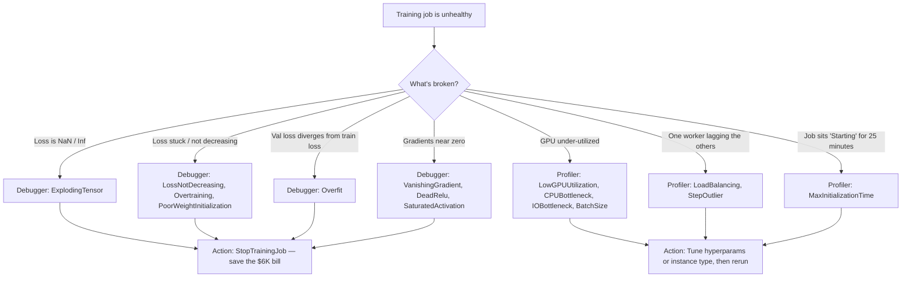
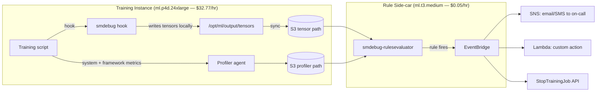
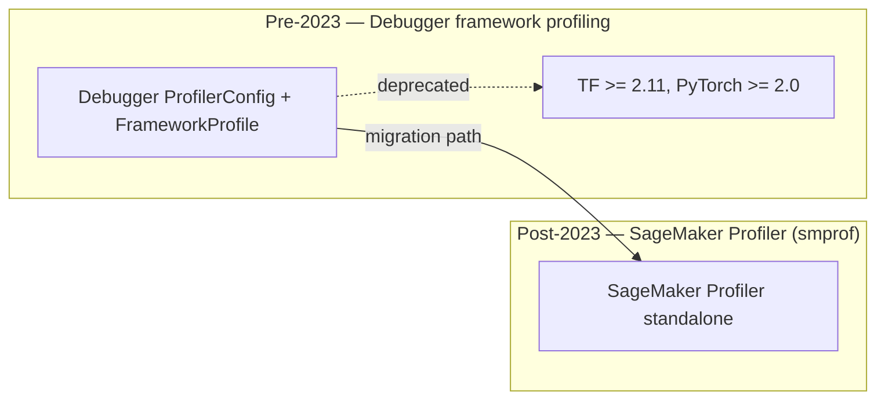

# Chapter 30 — SageMaker Debugger & Profiler: Convergence Diagnostics

> **Goal of this chapter:** to make you fluent in the two SageMaker subsystems that look *inside* a training job while it runs — **Debugger** (tensor capture + rule-based detection of bad convergence) and **Profiler** (system + framework metrics for hardware-utilization bottlenecks). By the end of the chapter you should be able to look at any unhealthy training scenario — loss at NaN, gradients vanishing, GPU pinned at 12%, one worker lagging the others — and pick the correct rule, the correct `save_interval`, and the correct action to fail-fast rather than burn a 24-hour GPU bill on a doomed job. The exam will ask you about hooks, rules, actions, the built-in catalog, and the deprecation boundary between the two products; production will ask you whether you should have ever turned this on in the first place. We cover both.
>
> **Primary internal sources:** `notes/01_sagemaker_core.md` §10, `notes/ch30_docs.md`, `notes/ch30_practice.md`.
> **Exam tasks targeted:** **Task 2.3** ("Analyze training results — train/val curves, convergence, overfit detection"), **Task 3.2** ("Provision and maintain compute — recognize CPU/GPU/IO bottlenecks"). Adjacent to Task 4.1 (Model Monitor) but distinct from it; Ch 48 covers that.

---

## 30.0 The setup: a training job that fails silently at 3 AM

It is 8:00 AM on a Tuesday and you are looking at a Slack DM from your manager. The 24-hour distributed PyTorch training job that was supposed to finish overnight on four `ml.p4d.24xlarge` instances — the one whose output the product team is presenting to the executive team in four hours — has ended with a model checkpoint that, on a smoke test, predicts the majority class for every input. The CloudWatch logs show training loss began at 2.31, descended cleanly to 0.43 by step 4,500, then *quietly went to NaN at step 4,547*. The job continued running for another 19 hours, dutifully writing checkpoints whose weights were almost entirely `nan`. The bill for those 19 hours is **$4,990**.

This story is the canonical motivation for SageMaker Debugger. CloudWatch shows that the job ran; it does not show that the job was *learning anything useful*. The training-job stdout shows the loss line, but only if your script prints it, and only if you read the logs in real time, which nobody does at 3 AM. The final model artifact in S3 looks structurally normal — a `model.tar.gz` of the expected size — and you do not discover that the weights are broken until you load them and run inference. Everything between "job started" and "job ended in 19 hours of NaN" is invisible to the rest of the SageMaker stack.

Debugger and Profiler are the *only* SageMaker tools that close this visibility gap. Debugger captures **tensors** — weights, gradients, activations, losses, optimizer state — at user-configured intervals and runs **rules** against them in a side-car container. Profiler captures **system metrics** (CPU, GPU, memory, network, I/O) and **framework metrics** (per-op time, kernel time, data-loader time) and runs a different set of rules against those. Either one of them, attached to the doomed job above with a single Python configuration object, would have caught the NaN within ~50 steps and **stopped the training job automatically** — saving $4,980 of the $4,990 bill, the four hours of executive embarrassment, and the day-and-a-half restart cycle.

This is what the chapter is about. Two SageMaker products that share a name, share a side-car architecture, and answer two very different questions:

1. **Debugger answers: "Is my math broken?"** Convergence rules. Tensor-level. Typical action: *stop the job*.
2. **Profiler answers: "Is my hardware happy?"** Resource rules. System-level. Typical action: *tune the config and rerun*.

Exam questions love to conflate the two. The trick to telling them apart is: if the symptom is about *numbers inside the model* (gradients, weights, loss values, activation distributions), it is a Debugger question. If the symptom is about *hardware utilization* (GPU at 12%, one worker lagging, I/O wait, container slow to start), it is a Profiler question.



Memorize the split. Most of the rest of the chapter is just filling in the boxes.

---

## 30.1 SageMaker Debugger — what it actually is

**Definition.** SageMaker Debugger is a managed, real-time training-job inspection tool that does four things, in order:

1. **Hooks** into your training script via the `sagemaker-debugger` Python SDK. Auto-hook support exists for PyTorch (≥1.6) and TensorFlow (≥2.3.1); XGBoost requires an explicit `smdebug.xgboost.Hook` passed via `xgb.train(callbacks=[hook])`.
2. **Captures tensors** — weights, gradients, biases, activations, loss values, optimizer state — at a user-defined frequency (`save_interval`, measured in steps).
3. **Writes** the captured tensors to an S3 path (the training job's default S3 output, or an override).
4. **Runs rules** (built-in or custom) against those tensors in a **separate side-car processing container** (`smdebug-rulesevaluator`) that SageMaker launches alongside your training job. When a rule's status flips to `True`, it can **trigger actions** — email/SMS via SNS, stop the training job, or fire a Lambda via EventBridge.

The architecture detail that the exam loves: the rule evaluator runs in its own small CPU container, typically `ml.t3.medium`, *not* on your GPU instance. The rules themselves are free; you pay only for the side-car instance (≈ $0.05/hr). This is why Debugger is so close to free insurance for production training, and why teams that turn it off "to save money" are usually saving pennies and losing dollars.



### 30.1.1 Supported frameworks

The framework matrix matters because it determines which rules are available on which workloads — and the exam will exploit the gaps.

| Framework | Auto-hook | Manual hook | Notes |
|---|---|---|---|
| **PyTorch** ≥ 1.6 | Yes | Yes | Most-supported framework. |
| **TensorFlow 2.x** ≥ 2.3.1 | Yes | Yes | TF 1.x auto-hook deprecated. |
| **MXNet** | Yes (legacy) | Yes | MXNet itself is end-of-life. Not exam-relevant. |
| **XGBoost** | No | Required | `smdebug.xgboost.Hook`, passed via `xgb.train(callbacks=[hook])`. |
| **JAX / HF Accelerate / SMDDP / SMP / DeepSpeed ZeRO-3** | No | Limited | Custom collectives bypass the hook. See §30.10. |

If the scenario in the question is *XGBoost*, the rule cannot be a gradient-based DL rule (no `VanishingGradient`, no `DeadRelu`, no `SaturatedActivation`). If the scenario is *PyTorch 2.x distributed with FSDP*, certain rules give incomplete coverage because the sharded optimizer state is not gathered by the hook. We come back to these gaps in §30.10.

---

## 30.2 `DebuggerHookConfig` — what to capture, how often, and where

`DebuggerHookConfig` is the single object that tells SageMaker *what* tensors to save, *how often*, and *where to put them*. You pass it to the `Estimator` constructor (or to the low-level `CreateTrainingJob` API in the `DebugHookConfig` field). Three knobs are doing all of the work: **collection**, **interval**, and **output path**.

```python
from sagemaker.debugger import DebuggerHookConfig, CollectionConfig

hook_config = DebuggerHookConfig(
    s3_output_path="s3://my-bucket/debugger-tensors/",     # where tensors land
    container_local_output_path="/opt/ml/output/tensors",  # in-container staging
    hook_parameters={"save_interval": "100"},              # global default
    collection_configs=[
        CollectionConfig(name="gradients",
                         parameters={"save_interval": "50"}),    # override per collection
        CollectionConfig(name="weights",
                         parameters={"save_interval": "500"}),
        CollectionConfig(name="losses",
                         parameters={"save_interval": "10"}),
        CollectionConfig(name="custom_attention_collection",
                         parameters={"include_regex": ".*attention.*output",
                                     "save_interval": "100"}),
    ],
)
```

### 30.2.1 The three layers of "what gets saved"

1. **Built-in collections.** SageMaker pre-defines a set of named tensor groups: `weights`, `biases`, `gradients`, `losses`, `optimizer_variables`, `metrics`, `inputs`, `outputs`, `relu_input`, `relu_output`. Pick by `name=`.
2. **Custom collections.** Define `include_regex` to match tensor names from your model graph. Example: `".*attention.*"` to grab all attention activations in a Transformer; `".*layer_norm.*"` for LayerNorm outputs.
3. **Save interval.** Set per-collection in *steps*, not seconds. Inherits from `hook_parameters` if not overridden.

### 30.2.2 The `save_interval` cost tradeoff

| `save_interval` | Effect | When to use |
|---|---|---|
| `1` | Save every step | Tiny models, hunting an intermittent NaN |
| `10`–`100` | Common default | General debugging, mid-size models |
| `500`–`5,000` | Sparse | Production training, large models |
| `0` | Disable | Profiler-only run |

S3 storage cost scales roughly linearly with `1/save_interval`. The math at scale is brutal: a 7B-parameter model has ~7 billion weights and ~7 billion gradient values. At fp32 (4 bytes each), one full snapshot is **~56 GB**. Saving every 500 steps of a 100,000-step pre-train = 200 snapshots = **~11 TB per training run** for the weights+gradients collection alone. At $0.023/GB-month for S3 Standard, that is **$260/month per run** sitting in your bucket until someone explicitly deletes it. A 70B-parameter model at `save_interval=1` for a 10,000-step job can write *petabytes* and rival the GPU bill itself.

> ⚠️ **Exam alert — the `save_interval` S3 cost trap.** If a question mentions "tensor save costs are exploding" or "Debugger S3 bucket is at 11 TB," the answer is to (a) raise `save_interval`, (b) use **reductions** (mean/std/min/max instead of full tensors via the `reduce_config` API), (c) set an S3 lifecycle rule to Glacier/delete, or (d) disable Debugger output entirely by passing `s3_output_path=None`. Do *not* try to solve this by switching instance types — the cost is in S3, not compute.

### 30.2.3 Where tensors land in S3

The on-disk layout matters because the smdebug analysis client reads from it, and because the directory structure is one of the most-asked diagnostic questions when something is missing.

```
s3://my-bucket/debugger-tensors/<training-job-name>/
  debug-output/
    events/
      000000000000/
        worker_0/
          000000000000.tfevents          # tensor data, smdebug format
      000000000050/
        worker_0/
          000000000050.tfevents
    collections/
      000000000000/
        worker_0_collections.json        # collection metadata
    index/
      000000000000/
        worker_0_000000000000.json       # tensor name -> byte offset
```

Each worker (in distributed training) writes its own subdirectory (`worker_0`, `worker_1`, ...). The `smdebug.trials.create_trial(s3_path)` client reads from this layout when you load a `Trial` object for offline forensics (see §30.13).

---

## 30.3 Built-in Debugger rules — the convergence catalog

This is the meat of Task 2.3. The exam will give you a symptom and ask you to name the rule. Memorize what each rule **detects** and **which framework supports it**. All rules are constructed via the `Rule.sagemaker(rule_configs.<name>())` factory. You can attach **up to 20 built-in rules per training job**.

### 30.3.1 "The math is broken" — DL-only rules

These rules look at tensors that only exist in deep-learning workloads (gradients, activations, optimizer state). They do **not** apply to XGBoost.

**`VanishingGradient`** — Fires when the mean of absolute gradient values drops below `threshold` (default `1e-7`). Classic in deep RNNs/LSTMs without residual connections, in transformer fine-tunes with misconfigured warmup, or anywhere upper layers have stopped learning while the loss plateaus. *Fix hint:* switch to ReLU/GELU, add residual connections, batch norm, better initializer, or lower the learning rate.

**`ExplodingTensor`** — Fires when any tensor contains `NaN` or `Inf` (set `only_nan=True` to restrict to NaN). Caused by too-high learning rate, bad weight init, FP16 numerical overflow, divide-by-zero in custom layers, or `log(0)` in the loss. **This is the canonical rule to pair with `StopTraining()`** — once you have a single NaN, the model is unrecoverable, every subsequent step is wasted GPU spend. Particularly common in the first few steps after enabling AMP on bfloat16/fp16 mixed-precision training.

**`PoorWeightInitialization`** — Fires when activation-input variance is imbalanced across layers and the gradient distribution is tight and loss is not decreasing in the first N steps. Defaults: `threshold=10.0` (variance ratio), `distribution_range=0.001`, `patience=5`, `steps=10` (only checks the first 10 steps). Fires when someone has overridden the framework's sensible default init.

**`SaturatedActivation`** — Fires when sigmoid or tanh activations are stuck near their extremes (tanh outside `(-9.4999, 9.4999)`, sigmoid outside `(-23, 16.99999)`) — beyond these, gradients are `< 1e-7`. Fix: switch sigmoid/tanh to ReLU/GELU/Swish, reduce LR, add normalization.

**`DeadRelu`** — Fires when the percentage of ReLU neurons with activation activity below `threshold_inactivity` (default 1%) exceeds `threshold_layer` (default 50%) of the layer. A dead ReLU outputs zero forever — gradient through it is zero, no recovery. Caused by high LR or bad init knocking pre-activations deep negative. Fix: lower LR, switch to leaky ReLU / ELU / GELU, reinitialize.

**`WeightUpdateRatio`** — Fires when `|weight_update| / |weight|` is outside `[small_threshold=1e-8, large_threshold=10.0]`. Karpathy's heuristic: healthy training has this ratio around `1e-3`. Outside that range means the optimizer is either changing weights too aggressively or doing nothing.

### 30.3.2 "The math is broken" — DL **and** XGBoost rules

These rules look at outputs and losses, which exist for both worlds.

**`AllZero`** — Fires when ≥ `threshold` % (default 100%) of values in a captured tensor are zero. Catches buggy masks, broken dataloaders, dead layers.

**`LossNotDecreasing`** — Fires when loss does not decrease by `min_difference` % over `num_steps` steps. The XGBoost cousin of `Overfit`; watches the loss tensor directly. **This is the standard XGBoost convergence rule** — if the exam asks about XGBoost training that is stuck, the answer is almost always `LossNotDecreasing` (or `Overfit`).

### 30.3.3 "Training dynamics are off"

**`Overfit`** — Fires when validation loss starts to *increase* while training loss continues to decrease — the classic overfitting fork. **Broadest framework coverage of any convergence rule** (TF, PyTorch, MXNet, XGBoost). Fix: regularization, more data, early stopping, smaller model. Pair this with `StopTraining()` and you have free early stopping you did not have to instrument in your training script.

**`Overtraining`** — Fires when validation loss has *stopped* improving but training loss continues to decrease — diminishing returns; the model has converged and is wasting compute. Trigger early stopping.

**`StalledTrainingRule`** — Fires when no new tensor has been written for N seconds (training is hung). The single most-common rule used with `StopTrainingJob`: kill jobs where the trainer crashed but the SageMaker job is still billing. On a multi-node FM run, the cost of a stalled `p4d.24xlarge` cluster is $30-40/hr *per instance*; a `StalledTrainingRule` that fires 30 minutes after a stall saves you the entire human-notification gap, which on a weekend can be 12+ hours.

### 30.3.4 XGBoost-specific rules

**`ClassImbalance`** — Detects heavily-skewed class distribution in the `labels` tensor. XGBoost-only.

**`Confusion`** — Detects off-diagonal mass in the confusion matrix exceeding a threshold. Late-stage rule. XGBoost-only.

**`CreateXgboostReport`** — A *meta-rule* that runs an XGBoost training job and produces a comprehensive HTML training report: loss curves, feature importance, hyperparameter table, predictions analysis. The recommended pattern for any XGBoost training job is to attach exactly one `CreateXgboostReport` rule.

### 30.3.5 Rule-availability matrix (memorize this)

| Rule | TF / PyTorch | XGBoost |
|---|---|---|
| `VanishingGradient` | yes | **no** |
| `ExplodingTensor` | yes | **no** |
| `PoorWeightInitialization` | yes | **no** |
| `SaturatedActivation` | yes | **no** |
| `DeadRelu` | yes | **no** |
| `WeightUpdateRatio` | yes | **no** |
| `AllZero` | yes | **yes** |
| `LossNotDecreasing` | yes | **yes** |
| `Overfit` | yes | **yes** |
| `Overtraining` | yes | **yes** |
| `StalledTrainingRule` | yes | **yes** |
| `Confusion` | no | **yes** |
| `ClassImbalance` | no | **yes** |
| `CreateXgboostReport` | no | **yes** |

**Exam trap:** if the scenario says "XGBoost training job" and the answer choice is `VanishingGradient`, `DeadRelu`, `SaturatedActivation`, `WeightUpdateRatio`, `ExplodingTensor`, or `PoorWeightInitialization`, that answer is wrong **by construction** — those rules do not apply.

---

## 30.4 Custom rules — when built-ins are not enough

You subclass `smdebug.rules.Rule` and implement `invoke_at_step(step)`. Inside, you use `self.base_trial` to load tensors at the current step and run any logic you want.

```python
# my_custom_rule.py
from smdebug.rules.rule import Rule

class MyAttentionEntropyRule(Rule):
    def __init__(self, base_trial, threshold=0.5):
        super().__init__(base_trial)
        self.threshold = float(threshold)

    def invoke_at_step(self, step):
        import numpy as np
        from scipy.stats import entropy
        for tname in self.base_trial.tensor_names(regex=".*attention.*"):
            t = self.base_trial.tensor(tname).value(step_num=step)
            ent = entropy(t.reshape(-1, t.shape[-1]).T).mean()
            if ent < self.threshold:
                self.logger.info(f"Low attention entropy at step {step}: {ent}")
                return True
        return False
```

Register it via the custom-rule path:

```python
from sagemaker.debugger import Rule, CollectionConfig

custom_rule = Rule.custom(
    name="MyAttentionEntropyRule",
    image_uri="<account>.dkr.ecr.<region>.amazonaws.com/smdebug-rules-evaluator:latest",
    instance_type="ml.t3.medium",
    volume_size_in_gb=10,
    source="my_custom_rule.py",
    rule_to_invoke="MyAttentionEntropyRule",
    rule_parameters={"threshold": "0.5"},
    collections_to_save=[CollectionConfig(name="custom_attention_collection")],
)
```

The `image_uri` points to a SageMaker-provided base image that has `smdebug` pre-installed; you do not need to build your own container unless you have exotic dependencies. Custom rules count against the 20-rule-per-job limit just like built-ins.

---

## 30.5 The `StopTrainingJob` action — fail-fast economics

The single most exam-relevant feature of Debugger is its ability to **stop a doomed training job automatically**. This is what saves you money. The wiring is mechanical:

```python
from sagemaker.debugger import Rule, rule_configs
from sagemaker.debugger.rule_configs import StopTraining

rules = [
    Rule.sagemaker(
        base_config=rule_configs.exploding_tensor(),
        actions=[StopTraining()],
    ),
    Rule.sagemaker(
        base_config=rule_configs.vanishing_gradient(),
        actions=[StopTraining()],
    ),
    Rule.sagemaker(
        base_config=rule_configs.stalled_training_rule(),
        rule_parameters={"threshold": "1800"},   # 30 minutes
        actions=[StopTraining()],
    ),
]
```

### 30.5.1 The built-in action catalog

Importable from `sagemaker.debugger.rule_configs`:

- **`StopTraining()`** — stops the training job via `StopTrainingJob`.
- **`Email(email_address=...)`** — sends an SNS email.
- **`SMS(phone_number=...)`** — sends an SMS via SNS (E.164 format; US numbers only by default).
- **`ActionList(...)`** — wrap multiple actions on the same rule.

Custom actions go through EventBridge: when the rule status flips to `Error` (rule fired), it raises a `SageMaker Training Job State Change` event with `RuleEvaluationStatuses[].RuleEvaluationStatus = Error`. An EventBridge rule routes that to a Lambda which can do anything — Slack notification, PagerDuty ticket, automatic re-launch with a lower LR, etc.

### 30.5.2 The cost math the exam loves

A 24-hour distributed training job on 8× `ml.p4d.24xlarge` ≈ $32.77/hr/instance × 8 × 24 ≈ **$6,300**. If a `StopTraining()` action kills it 30 minutes in because `ExplodingTensor` fires, you have saved **$6,170**. The side-car rule instance for those 30 minutes is less than **$0.02**. The math is comically lopsided in favor of always-on Debugger for production training: the maximum loss from leaving Debugger off is "you burn an entire doomed training job"; the maximum cost from leaving it on is "you pay $1/day for the side-car CPU instance."

> ⚠️ **Exam alert — `StopTrainingJob` fail-fast savings.** If a question describes a long-running training job whose loss diverges, the most cost-effective answer is **`ExplodingTensor` rule with `StopTraining()` action**. Not "monitor the loss in CloudWatch and stop the job manually." Not "shorten the job duration." The whole point of Debugger is that the side-car evaluator does the stop programmatically, in seconds, *before the human notification path fires*.

### 30.5.3 Where the fail-fast action bites

Two gotchas that show up in production but rarely on the exam:

1. **IAM.** `StopTraining` calls `StopTrainingJob` from the side-car container. The training job's execution role needs `sagemaker:StopTrainingJob`. If you bring a custom role and miss this permission, the rule fires, EventBridge fires, the API call returns AccessDenied, and the job *keeps running*. Subtle bug; the rule status looks healthy in the console.
2. **Rule container health.** The action depends on the rule container running. If the rule container OOMs (which can happen with very high tensor save frequencies), the action never fires and the training job runs to completion. Pair `StopTraining` actions with a CloudWatch alarm on the rule container's own `SagemakerDebuggerRule_*` metrics — your safety net needs a safety net.

The exam also loves the **20-rule limit**: maximum 20 built-in Debugger rules per training job, and a separate maximum of 20 profiler rules per training job. If you "need" more, combine logic into a custom rule.

---

## 30.6 SageMaker Profiler — system + framework metrics

**Definition.** A separate observability subsystem that captures system-level and framework-level performance metrics. Originally launched as a Debugger feature in 2020, **split out and re-launched as a standalone "SageMaker Profiler" in late 2023** (GA December 2023; the underlying Python module was renamed from `smppy` to `smprof` in the process).

| Layer | Metrics |
|---|---|
| **System** | CPU utilization (per core), GPU utilization, GPU memory, RAM, network bandwidth (RX/TX), EFA bandwidth (distributed training), disk I/O wait, NVLink throughput |
| **Framework** | Per-operator wall time (e.g., `aten::matmul` took 42 ms), CUDA kernel time, data-loader time (`DataLoader.__next__` blocking time), forward / backward / optimizer phase boundaries, step durations |

The simplest path is to attach `ProfilerConfig` to your `Estimator`:

```python
from sagemaker.debugger import ProfilerConfig, FrameworkProfile

profiler_config = ProfilerConfig(
    system_monitor_interval_millis=500,            # sample every half second
    framework_profile_params=FrameworkProfile(
        local_path="/opt/ml/output/profiler",
        start_step=5,
        num_steps=10,                              # framework profiling is heavy; profile a window
    ),
)

estimator = PyTorch(
    entry_point="train.py",
    role=role,
    instance_type="ml.p4d.24xlarge",
    instance_count=2,
    framework_version="2.1",
    py_version="py310",
    profiler_config=profiler_config,
    rules=profiler_rules,
)
```

`system_monitor_interval_millis` defaults to 500 ms; you can go down to 100 ms for short jobs or up to 5,000 ms for long jobs. The framework profiler is heavier (per-op tracing has high overhead), so it only profiles the configured `num_steps` window.

### 30.6.1 The deprecation boundary — Debugger framework profiling vs SageMaker Profiler

Here is the most important historical fact for the exam.



Per the official deprecation notice: *"In favor of Amazon SageMaker Profiler, SageMaker AI Debugger deprecates the framework profiling feature starting from TensorFlow 2.11 and PyTorch 2.0."* For older framework versions, the Debugger-style `ProfilerConfig` still works. For new code on modern frameworks, use SageMaker Profiler.

> ⚠️ **Exam alert — Debugger vs Profiler profiling, post-2.0.** If a scenario says "I am training PyTorch 2.x (or TensorFlow ≥ 2.11) and want per-operator framework profiling," the answer is **SageMaker Profiler (`smprof`)**, *not* the legacy `ProfilerConfig`-based Debugger framework profiling. System monitoring inside Debugger still works on modern frameworks — only the *framework* profiling is deprecated. If you upgrade frameworks and leave the old Debugger framework-profiling config in place, it silently stops producing useful data.

### 30.6.2 Built-in profiler rules — the catalog

All constructed via `ProfilerRule.sagemaker(rule_configs.<Name>())`. Up to 20 per job. Free.

**`ProfilerReport`** *(the omnibus)* — Invokes all the other built-in profiler rules and produces a comprehensive HTML report (`profiler-report.html` + JSON files in the job's S3 output path). **The recommended default: add `ProfilerReport()` to every training job; everything else is opt-in tuning.** You can adjust child thresholds inline:

```python
rules = [
    ProfilerRule.sagemaker(
        rule_configs.ProfilerReport(
            CPUBottleneck_cpu_threshold=90,
            IOBottleneck_threshold=90,
        )
    )
]
```

**`BatchSize`** — Average CPU, GPU, and GPU-memory utilization all low → batch size is too small. Defaults: `cpu_threshold_p95=70`, `gpu_threshold_p95=70`, `gpu_memory_threshold_p95=70` (95th percentile), `patience=100` (skip first 100 datapoints for warmup). *Fix:* increase batch size or move to a smaller instance.

**`CPUBottleneck`** — GPU underutilized **while** CPU pegged. Bottleneck time proportion exceeds `threshold` (default 50%). Defaults: `cpu_threshold=90`, `gpu_threshold=10`. *Fix:* increase data-loader workers (`DataLoader(num_workers=N)` in PyTorch), preprocess offline, or move to a CPU-richer instance (`ml.p3.16xlarge` → `ml.p3dn.24xlarge`; or use a heterogeneous cluster — §30.8.2).

**`GPUMemoryIncrease`** — GPU memory usage climbing by ≥ `increase` % over time. Default `increase=10`. *Fix:* check for accidentally accumulated tensors in lists (classic PyTorch bug: appending un-`.detach()`ed tensors); check for growing batch sizes.

**`IOBottleneck`** — GPU underutilized **while** I/O wait time is high. Default `io_threshold=50` (% I/O wait), `gpu_threshold=70`. *Fix:* FSx for Lustre or Fast File Mode instead of S3 File Mode; sharded TFRecord/WebDataset; `tf.data.Dataset.prefetch(AUTOTUNE)` or `DataLoader(prefetch_factor=4)`.

**`LoadBalancing`** — Workload imbalance across GPUs/workers in distributed training. Default `threshold=0.5`. *Fix:* shard data uniformly across ranks, `DistributedSampler(drop_last=True)`, check for uneven model partitioning if using model parallelism.

**`LowGPUUtilization`** — Per-GPU per-worker: 95th percentile of GPU utilization below `threshold_p95` (default 70%), **or** 95th p above threshold but 5th p below `threshold_p5` (default 10%) — fluctuating. The fluctuation branch is the interesting one — a GPU pinned at 90% for a few seconds then dropping to 5% while waiting for the data loader is *more* of a problem than one flat at 40%, because the fix is usually obvious (data pipeline).

**`MaxInitializationTime`** — First training step does not appear within `threshold` minutes (default 20). *Fix:* container image too large (slow `docker pull` from ECR — use smaller image or container caching), expensive `__init__()` in your code, S3 cold cache for File Mode.

**`OverallSystemUsage`** — No threshold; pure aggregation. Percentiles of CPU/GPU/memory per node. Always returns `False` (informational).

**`OverallFrameworkMetrics`** — No threshold; summarizes time on forward/backward/data loading. Informational.

**`StepOutlier`** — Any step's duration more than `stddev` (default 5) sigmas from the mean. `n_outliers=10` (ignore first 10 outliers — warmup, validation steps, checkpoints). *Fix:* heavy checkpoint? Validation interleaved without separate timing? Slow shard?

### 30.6.3 Quick profiler-rule decision table

| Symptom | Rule that catches it |
|---|---|
| GPU at 12%, CPU at 95% | **`CPUBottleneck`** |
| GPU at 12%, CPU at 30%, I/O wait 60% | **`IOBottleneck`** |
| GPU at 12%, CPU/GPU/mem all under 70% | **`BatchSize`** (under-using the box) |
| GPU at 95% for 7 workers but 30% for 1 worker | **`LoadBalancing`** |
| Step 1000 takes 30 s, step 1001 takes 2 s | **`StepOutlier`** |
| GPU memory starts at 12 GB, grows to 38 GB by step 5000 | **`GPUMemoryIncrease`** |
| Job sits "Starting" for 25 minutes | **`MaxInitializationTime`** |
| GPU oscillates 95% → 10% → 95% | **`LowGPUUtilization`** (fluctuation branch) |

---

## 30.7 Profiler reports — HTML in S3 + Studio UI

When `ProfilerReport` runs, the side-car writes outputs to:

```
s3://<output_bucket>/<job-name>/rule-output/ProfilerReport/profiler-output/
  profiler-report.html
  profiler-report.ipynb
  profiler-reports/
    BatchSize.json
    CPUBottleneck.json
    GPUMemoryIncrease.json
    IOBottleneck.json
    LoadBalancing.json
    LowGPUUtilization.json
    OverallSystemUsage.json
    StepOutlier.json
    ...
```

The HTML report is a static artifact. To view it in a browser, either pre-sign the S3 URL or download it locally. In **SageMaker Studio**, the Training Jobs view automatically:

- Shows a **Profile** tab with live time-series of CPU/GPU/memory/I/O.
- Renders the **Debug Insights** panel with rule findings (which rules fired, at which step, severity).
- Links to the `profiler-report.html` artifact for download.

**Exam answer pattern:** "Where do I find the profiling report?" → **S3**, with optional Studio rendering as the convenience surface. Not CloudWatch. Not the training-job stdout.

### 30.7.1 The Studio Classic Insights kernel cost gotcha

The Debugger Insights dashboard in Studio Classic runs on a billable `ml.m5.4xlarge` kernel (~$0.92/hr). Each Insights tab consumes one kernel session. AWS's own docs warn: *"When you are done using the SageMaker Debugger Insights dashboard, you must shut down the `ml.m5.4xlarge` instance to avoid accruing charges."* Multiply $0.92/hr × 20 analysts × forgotten weekends and Insights becomes the most expensive *observability* tool in your stack. The serious fix is an auto-shutdown Lambda on idle timeout.

---

## 30.8 Real adoption — what production teams actually do

There is a gap between the exam's view of Debugger/Profiler and what mature ML platforms actually run. Both are worth knowing — exam to pass the exam, reality to pass the job interview.

### 30.8.1 The three rules that pay for themselves

Across the ~24 built-in rules, three earn their keep almost universally in production:

1. **`VanishingGradient`** — for deep architectures (RNN/LSTM, transformer fine-tunes with bad warmup).
2. **`Overfit`** — broadest framework coverage (TF, PyTorch, MXNet, XGBoost); pair with `StopTraining()` for free early stopping.
3. **`LowGPUUtilization`** — the Profiler-side rule that catches the canonical "we ordered a `p4d.24xlarge` and the data loader maxed at 50%" story.

Honorable mentions: `ExplodingTensor` (mixed-precision NaN), `LossNotDecreasing` (XGBoost), `CPUBottleneck` (data pipeline starvation), `BatchSize` (under-sized batches), `StalledTrainingRule` (silent trainer crashes).

Rules to be *skeptical* of in production: `SaturatedActivation`, `DeadRelu`, `PoorWeightInitialization` are academically interesting but rarely actionable — by the time these fire, you have usually already noticed via the loss curve. `AllZero` and `SimilarAcrossRuns` are debugging tools, not production-monitoring rules.

### 30.8.2 The canonical Profiler cost-savings story

The cleanest published numbers come from the AWS Profiler bottleneck blog post: an example workload moved from **3× `p3.8xlarge` to 2× `p3.2xlarge`** after Profiler identified the batch size was undersized. Cost dropped from **$6.16 to $1.07 per training job — 83% savings** — with training time effectively unchanged (503 vs 502 seconds). This is the canonical "Profiler-driven instance right-sizing" data point.

The longer story is KT's vision-transformer training: 2× A100 80GB → 32× A100 40GB (4× `ml.p4d.24xlarge`), 960 hours → 24 hours, **29× speedup**. The fixes Profiler enabled: data-loader rework (CPU pinning eliminated), ZeroRedundancyOptimizer (sharded optimizer state), bfloat16 AMP, batch size 1024 → 1152. The two findings — "some CPUs at 100%" and "GPU utilization not consistently high" — are exactly what `CPUBottleneck` and `LowGPUUtilization` flag automatically.

The **advanced fix** when Profiler tells you that you are CPU-bound on a `p4d.24xlarge`: instead of "bigger CPU box," use a **SageMaker heterogeneous cluster** — a separate CPU-only instance group dedicated to data preprocessing, feeding the GPU group over the SageMaker training network. The exam tests that this is the answer when "CPU preprocessing is bottlenecking GPU utilization."

### 30.8.3 The FM-training reality

At foundation-model scale, teams have largely moved past Debugger. SageMaker HyperPod ships a one-click observability EKS add-on: Amazon Managed Prometheus + Amazon Managed Grafana + NVIDIA DCGM exporter. DCGM gives per-SM utilization, ECC error counts, throttle reasons, NVLink bandwidth — the things you actually need on a 1024-node cluster. Convergence diagnostics happen in the trainer (Megatron-LM, NeMo, FSDP wrappers all have their own NaN detection and gradient-norm logging).

The exam pre-dates this shift. Expect questions where the right answer is "use Debugger" or "use SageMaker Profiler." In an interview the more sophisticated answer is "Debugger for the rule-based alerting layer, SageMaker Profiler for one-off compute investigations, Prometheus + Grafana via HyperPod for steady-state cluster observability, TensorBoard for the loss curves the team actually reads."

---

## 30.9 Debugger vs TensorBoard — when each, and how they coexist

The two categories overlap and the exam will test the seam.

| Tool | What it is for | Where it lives |
|---|---|---|
| **Debugger** (`smdebug` hooks) | Capture tensors, run convergence rules, fire actions | Training-job side. S3 artifacts. Console + Studio Insights UI. |
| **Debugger → TensorBoard format** | Visualize captured tensors as scalars/histograms | TensorBoard reads from S3. Auto-emission supported. |
| **TensorBoard on SageMaker** | Hosted TensorBoard pointed at S3 | Studio application. |
| **PyTorch Profiler / TF Profiler** (framework-native) | Detailed GPU kernel-level timing | Framework SDKs. Outputs to TensorBoard. |
| **SageMaker Profiler** (`smprof`) | SageMaker-native GPU/CPU profiling with a custom UI | Replaces Debugger framework profiling for PyTorch ≥ 2.0 and TF ≥ 2.11. |

The integration pattern most production teams settle on:

1. **TensorBoard on SageMaker** for what ML engineers want to see during research: loss curves, weight histograms, gradient distributions, embedding projections. TensorBoard is the lingua franca; everyone reads it.
2. **Debugger built-in rules** for the *alerting* path: `Overfit`, `LowGPUUtilization`, `StalledTrainingRule` with `StopTrainingJob`. Rules do not need a UI; they need to fire EventBridge.
3. **SageMaker Profiler** for the targeted compute-perf investigation, one-off per new architecture.

---

## 30.10 Distributed training — known limitations

Debugger's hook architecture assumes a single training process per worker. Modern distributed training breaks several assumptions.

- **SMDDP (SageMaker distributed data parallel).** Hook captures local tensors per rank; reduce operations happen outside the hook. Gradient values you see are *post-reduce on the local rank*. Usually fine for divergence detection.
- **SMP (SageMaker model parallel, now deprecated → use FSDP / DeepSpeed instead).** Model partitions across devices break the clean "tensor name → tensor data" mapping. Some rules give incomplete coverage.
- **Hugging Face Accelerate / DeepSpeed ZeRO-3 / PyTorch FSDP.** Sharded optimizer state is not captured cleanly. You can capture `losses` and per-rank gradients, but full weight tensors require a gather operation that Debugger does not perform.
- **Recommendation for distributed jobs:** rely on `ExplodingTensor`, `VanishingGradient`, `LossNotDecreasing` (which work on losses and per-rank gradients), plus **Profiler's** `LoadBalancing` and `LowGPUUtilization`. Skip rules that need full weight reconstruction.

Forward link: Chapter 32 (distributed training) covers SMDDP / SMP / FSDP / DeepSpeed in full, including how to instrument them for debugging.

---

## 30.11 When to enable Debugger and Profiler

| Scenario | Debugger? | Profiler? | Recommended rules |
|---|---|---|---|
| **Production training (any cost > $10)** | Yes | Yes | `ExplodingTensor + StopTraining`, `VanishingGradient`, `LossNotDecreasing`, `StalledTrainingRule + StopTraining`, `ProfilerReport` |
| **First-pass experimentation** | Yes (light) | No | `ExplodingTensor + StopTraining` only |
| **Distributed training (multi-node)** | Limited (see §30.10) | **Critical** | `ProfilerReport`, especially `LoadBalancing`, `IOBottleneck`, `LowGPUUtilization` |
| **HPO / AMT job** | Yes per trial | Yes per trial | Each trial inherits the rules |
| **XGBoost** | Yes | Yes | `CreateXgboostReport` is the headliner; `Overfit`, `LossNotDecreasing` |
| **LLM fine-tune** | Yes (esp. NaN for FP16) | Yes (data-loader bottleneck common) | `ExplodingTensor + StopTraining`, `IOBottleneck`, `LowGPUUtilization` |
| **Tiny test job (< 5 min)** | Skip | Skip | Overhead > value |

**Rule of thumb:** *Always-on Debugger + Profiler for production training is free insurance. The only reason not to is sub-5-minute test runs.* The cost is the side-car CPU instance ($1/day) and the S3 storage you choose to incur via `save_interval`.

---

## 30.12 Cost — a clean accounting

| Component | Cost |
|---|---|
| Debugger built-in rules | **Free** (you pay only for the side-car CPU instance — `ml.t3.medium` ≈ $0.05/hr) |
| Custom Debugger rules | **Free** (same — side-car instance you specify) |
| Profiler built-in rules | **Free** |
| Tensor storage | S3 standard storage cost — this is where the bill can spike (§30.2.2) |
| Profiler metrics storage | S3 standard storage cost (small — KB to MB per job) |
| Debugger framework profiling | Deprecated for modern frameworks — migrate to SageMaker Profiler |
| Studio Classic Insights kernel | `ml.m5.4xlarge` ≈ $0.92/hr — auto-shutdown or pay |

**The pricing question patterns the exam uses:**
- "Are the rules themselves billed?" → **No.**
- "Is the side-car instance billed?" → **Yes** (a few cents per hour).
- "Is tensor storage billed?" → **Yes** (standard S3 rates).
- "Is the Insights dashboard billed?" → **Yes** (Studio kernel time).

---

## 30.13 The forensics workflow when training silently fails

Most of Debugger's value is realized in the *post-mortem*. Training jobs that complete with high loss, or NaN at step 50,000, or accuracy that drops to chance — these are the cases where you need the saved tensors.

```python
from smdebug.trials import create_trial

trial = create_trial(f"s3://{bucket}/{job_name}/debugger")
trial.tensor_names()                      # what got saved
trial.steps()                             # at which steps
loss = trial.tensor("CrossEntropyLoss")
loss.values()                             # numpy array of saved values
```

The procedure:

1. **Identify the failure step** from SageMaker Metrics or TensorBoard.
2. **Open the smdebug `Trial`** object pointing at the S3 prefix.
3. **Diff the tensor distributions** at the failure step against an earlier healthy step. Mean/std/fraction-of-NaN usually tell the story immediately.
4. **Check the rule outputs.** If `ExplodingTensor` or `VanishingGradient` fired at step N before the loss crashed at step N+500, you have a smoking gun.

This works only if you saved enough tensors at low-enough intervals to *have data* at the failure step. The right default for most teams: save loss/metric scalars at every step or every few steps, save weight/gradient *reductions* (mean/std/min/max via the `reduce_config` API) at moderate intervals (every 500-1,000 steps).

---

## 30.14 Putting it all together — the "good defaults" config

```python
from sagemaker.pytorch import PyTorch
from sagemaker.debugger import (
    DebuggerHookConfig, CollectionConfig,
    ProfilerConfig, FrameworkProfile,
    Rule, ProfilerRule, rule_configs,
)
from sagemaker.debugger.rule_configs import StopTraining

# 1. Capture losses every few steps; gradients/weights sparsely.
hook_config = DebuggerHookConfig(
    s3_output_path=f"s3://{bucket}/debugger/",
    hook_parameters={"save_interval": "500"},
    collection_configs=[
        CollectionConfig(name="losses",    parameters={"save_interval": "10"}),
        CollectionConfig(name="gradients", parameters={"save_interval": "500"}),
        CollectionConfig(name="weights",   parameters={"save_interval": "5000"}),
    ],
)

# 2. Convergence rules — auto-stop on the fatal ones.
debugger_rules = [
    Rule.sagemaker(rule_configs.exploding_tensor(),       actions=[StopTraining()]),
    Rule.sagemaker(rule_configs.stalled_training_rule(),
                   rule_parameters={"threshold": "1800"},  actions=[StopTraining()]),
    Rule.sagemaker(rule_configs.vanishing_gradient()),
    Rule.sagemaker(rule_configs.loss_not_decreasing()),
    Rule.sagemaker(rule_configs.overfit(),                 actions=[StopTraining()]),
    Rule.sagemaker(rule_configs.overtraining()),
]

# 3. Profiler — omnibus report.
profiler_config = ProfilerConfig(
    system_monitor_interval_millis=500,
    framework_profile_params=FrameworkProfile(start_step=5, num_steps=10),
)
profiler_rules = [ProfilerRule.sagemaker(rule_configs.ProfilerReport())]

estimator = PyTorch(
    entry_point="train.py",
    role=role,
    instance_type="ml.p4d.24xlarge",
    instance_count=4,
    framework_version="2.1",
    py_version="py310",
    debugger_hook_config=hook_config,
    rules=debugger_rules + profiler_rules,
    profiler_config=profiler_config,
)

estimator.fit({"train": train_s3, "validation": val_s3})
```

This config gives you:

- **Convergence safety net** — auto-stop on NaN, auto-stop on stall, auto-stop on overfit.
- **Visibility** into vanishing gradients, loss plateaus, dead ReLUs.
- **Full profiler HTML report** at job end.
- All for the price of one `ml.t3.medium` side-car for the rule duration.

---

## 30.15 What Debugger does **not** do — bounding the scope

Common exam confusions worth pre-empting:

- Debugger does **not** capture model artifacts or checkpoints — that is the training job's `model.tar.gz` output.
- Debugger does **not** monitor *deployed* models — that is **Model Monitor** (Chapter 48; different service, different data plane).
- Debugger does **not** do explainability — that is **SageMaker Clarify**.
- Debugger does **not** track experiments or hyperparameters — that is **MLflow on SageMaker** or **SageMaker Experiments**.

The neatest one-sentence boundary: Debugger watches the training job *while it runs*; Model Monitor watches the deployed endpoint *after* training is over.

---

## 30.16 Exercises

1. **The 19-hour NaN.** You are handed the post-mortem from §30.0: a 24-hour PyTorch job on 4× `ml.p4d.24xlarge` that went to NaN at step 4,547 and ran for 19 more hours producing useless `nan` weights. Write the exact `Rule.sagemaker(...)` configuration that would have caught and stopped this in future runs. Compute the dollar amount saved.

2. **XGBoost rule selection.** You are running an XGBoost training job and want to detect (a) overfitting, (b) gradient vanishing, (c) the loss plateau. For each, name the correct Debugger rule, or explain why no rule applies. Defend your XGBoost-vs-DL classification.

3. **The `save_interval` budget.** A team is training a 7B-parameter LLM for 100,000 steps and wants Debugger tensor capture. They propose: `weights` every 100 steps, `gradients` every 100 steps, `losses` every step. Compute the expected S3 storage (in TB) for one full training run at fp32. Propose three changes that bring storage under 100 GB while still preserving useful forensic data.

4. **Pick the rule.** For each symptom, name the single best built-in rule:
   - GPU at 12%, CPU at 95% on `ml.p4d.24xlarge`.
   - GPU at 12%, CPU at 30%, I/O wait at 60%.
   - Training job has been in "Starting" state for 25 minutes.
   - Validation loss has been flat for 3,000 steps while training loss continues to drop.
   - 7 of 8 ranks at 95% GPU utilization, 1 at 30%.
   - Loss is `NaN` at step 47.

5. **Custom rule.** Write a custom `smdebug.rules.Rule` subclass that fires when the *cosine similarity* between consecutive weight snapshots of the first transformer block drops below 0.95. Provide the full `invoke_at_step()` implementation and the `Rule.custom(...)` registration. Why might this rule be more useful than `WeightUpdateRatio` for a transformer fine-tune?

6. **Debugger vs Model Monitor.** A junior engineer asks why you cannot "just use Debugger to monitor the production endpoint." Write a four-sentence answer that explains the architectural boundary, the data-plane difference, and the cost implication.

7. **The deprecation question.** Your team is upgrading from PyTorch 1.13 to PyTorch 2.1. Your current training job has both `DebuggerHookConfig` (convergence rules) and `ProfilerConfig(framework_profile_params=FrameworkProfile(...))` (framework profiling). Which of the two configs needs to be migrated, and to what? Cite the deprecation rule. Will the framework profiling silently break, or will the SDK error out?

---

## 30.17 Cross-links

- **Back to [Chapter 22 — Training jobs](22_studio_lifecycle.md)** for the SageMaker training-job lifecycle that Debugger and Profiler attach to.
- **Back to [Chapter 24 — Script mode](24_script_mode.md)** for the `Estimator` configuration surface and how `debugger_hook_config` / `profiler_config` / `rules` parameters compose with the framework estimators.
- **Forward to Chapter 32 — Distributed training** for the SMDDP / SMP / FSDP / DeepSpeed details that explain the limitations in §30.10.
- **Forward to Chapter 48 — Model Monitor** for the *production-endpoint* observability story that is often confused with Debugger but is a different service with a different data plane.

---

## 30.18 Sources

- AWS — [Use Amazon SageMaker Debugger to Debug and Improve Model Performance](https://docs.aws.amazon.com/sagemaker/latest/dg/train-debugger.html)
- AWS — [List of Debugger Built-in Rules](https://docs.aws.amazon.com/sagemaker/latest/dg/debugger-built-in-rules.html)
- AWS — [List of Debugger Built-in Profiler Rules](https://docs.aws.amazon.com/sagemaker/latest/dg/debugger-built-in-profiler-rules.html)
- AWS — [Best Practices for Amazon SageMaker Debugger](https://docs.aws.amazon.com/sagemaker/latest/dg/debugger-best-practices.html)
- AWS — [Release notes for debugging capabilities of Amazon SageMaker AI](https://docs.aws.amazon.com/sagemaker/latest/dg/debugger-release-notes.html)
- AWS — [Debugger Custom Rules](https://docs.aws.amazon.com/sagemaker/latest/dg/debugger-custom-rules.html)
- AWS — [Debugger Built-in Actions](https://docs.aws.amazon.com/sagemaker/latest/dg/debugger-built-in-actions.html)
- AWS — [Configure Debugger using SageMaker API](https://docs.aws.amazon.com/sagemaker/latest/dg/debugger-createtrainingjob-api.html)
- AWS — [Save Tensors Using SageMaker Debugger](https://docs.aws.amazon.com/sagemaker/latest/dg/debugger-save-tensors.html)
- AWS — [SageMaker Profiler (standalone)](https://docs.aws.amazon.com/sagemaker/latest/dg/train-profiler.html)
- AWS — [Explore the profile output data visualized in the SageMaker Profiler UI](https://docs.aws.amazon.com/sagemaker/latest/dg/profiler-explore-viz.html)
- AWS — [Open the Amazon SageMaker Debugger Insights dashboard](https://docs.aws.amazon.com/sagemaker/latest/dg/debugger-on-studio-insights.html)
- AWS — [StopTrainingJob API reference](https://docs.aws.amazon.com/sagemaker/latest/APIReference/API_StopTrainingJob.html)
- AWS — [Detect Stalled Training and Invoke Actions Using SageMaker Debugger Rule (sample)](https://sagemaker-examples.readthedocs.io/en/latest/sagemaker-debugger/tensorflow_action_on_rule/detect_stalled_training_job_and_actions.html)
- Amazon Science — [The science behind SageMaker's cost-saving Debugger](https://www.amazon.science/blog/the-science-behind-sagemakers-cost-saving-debugger)
- AWS ML Blog — [Identify bottlenecks, improve resource utilization, and reduce ML training costs with the deep profiling feature in Amazon SageMaker Debugger](https://aws.amazon.com/blogs/machine-learning/identify-bottlenecks-improve-resource-utilization-and-reduce-ml-training-costs-with-the-new-profiling-feature-in-amazon-sagemaker-debugger/)
- AWS ML Blog — [KT's journey to reduce training time for a vision transformers model using Amazon SageMaker](https://aws.amazon.com/blogs/machine-learning/kts-journey-to-reduce-training-time-for-a-vision-transformers-model-using-amazon-sagemaker/)
- AWS ML Blog — [Improve price performance of your model training using Amazon SageMaker heterogeneous clusters](https://aws.amazon.com/blogs/machine-learning/improve-price-performance-of-your-model-training-using-amazon-sagemaker-heterogeneous-clusters/)
- AWS ML Blog — [Accelerate foundation model development with one-click observability in Amazon SageMaker HyperPod](https://aws.amazon.com/blogs/machine-learning/accelerate-foundation-model-development-with-one-click-observability-in-amazon-sagemaker-hyperpod/)
- AWS Docs — [TensorBoard in Amazon SageMaker AI](https://docs.aws.amazon.com/sagemaker/latest/dg/tensorboard-on-sagemaker.html)
- GitHub — [awslabs/sagemaker-debugger](https://github.com/awslabs/sagemaker-debugger), [analysis API docs](https://github.com/awslabs/sagemaker-debugger/blob/master/docs/analysis.md)
- Internal — `notes/01_sagemaker_core.md` §10, `notes/ch30_docs.md`, `notes/ch30_practice.md`
