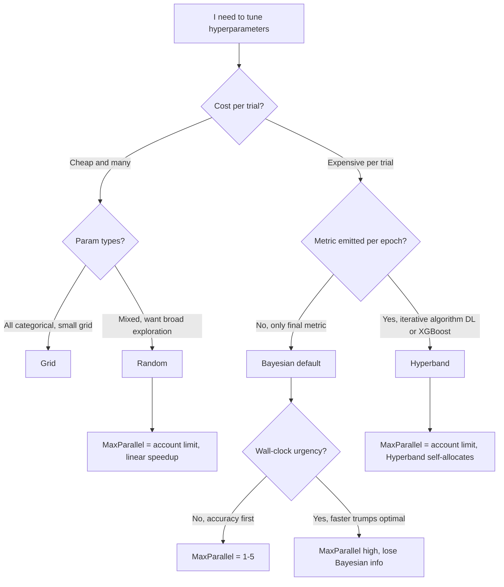
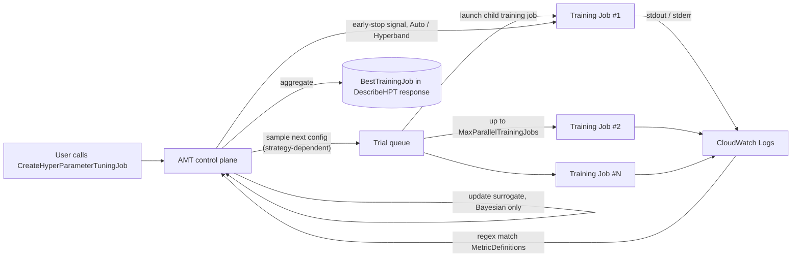
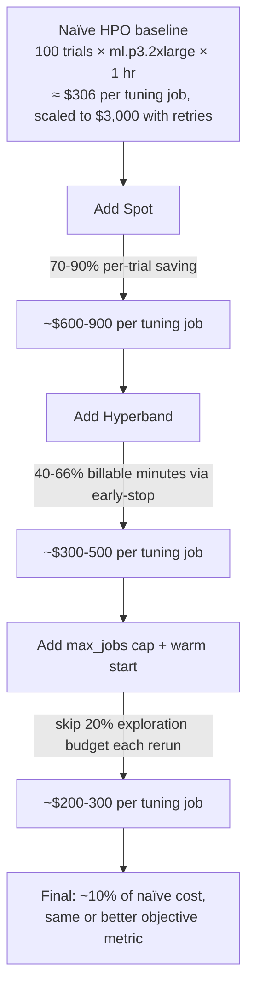

# Chapter 31 — SageMaker Automatic Model Tuning (AMT)

> **Goal of this chapter:** to make you fluent in **SageMaker Automatic Model Tuning (AMT)** — the managed hyperparameter-optimization service that sits underneath roughly every "we tuned this model on SageMaker" sentence in AWS reference architectures. By the end of the chapter you should be able to read a tuning scenario — *"expensive XGBoost on tabular," "300-epoch ResNet across 8 GPUs," "I want to extend the search I ran last quarter without throwing away the prior trials"* — and pick the right **strategy** (Bayesian, Random, Grid, or Hyperband), the right **parallelism** (`MaxParallelTrainingJobs` versus `MaxNumberOfTrainingJobs`), the right **warm-start mode** (`IDENTICAL_DATA_AND_ALGORITHM` versus `TRANSFER_LEARNING`), the right **early-stopping setting**, and the right **`ScalingType`** for every continuous range — and justify each choice in two sentences. Every later chapter in Part F (distributed training, Spot, HyperPod) and Part G (Pipelines and `TuningStep`) leans on the mental model assembled here. Chapter 23 (built-in algorithms) and Chapter 24 (script mode) supply the *training-job substrate* that every AMT child trial runs on; this chapter is what wraps a thousand of those substrate calls into a single optimization loop.

---

## 31.1 Why this chapter exists — the part of training that is embarrassingly expensive

Hyperparameter optimization (HPO) is the part of model training that is *embarrassingly* expensive, in a way that surprises every engineer the first time they price it out. Every "trial" in an HPO sweep is a **full training run**, end to end: spin up an instance, pull a container, mount the data, run the algorithm to convergence, save the artifact, tear down the instance. A serious deep-learning trial can cost \$50 to \$5,000. A naïve grid search across five hyperparameters with five candidate values each is `5⁵ = 3,125` trials. At even \$10 per trial that is \$31,250 per tuning job, and most teams run multiple tuning jobs per model per quarter. HPO is the line item that turns a project from "we have a model" to "we have a model and an AWS bill that the finance team wants a meeting about."

Three structural facts make HPO especially painful and especially worth automating: the optimal hyperparameters are workload-specific (you cannot copy them between models the way you copy code); the objective metric is the only signal (HPO is a black-box optimization, and the wrong strategy spends the budget on noise); and most trials are losers (the bottom 50% contribute nothing — the real problem is killing them early before you pay for them).

SageMaker **Automatic Model Tuning** (AMT) exists so you don't have to (a) write the optimization loop, (b) run a Slurm or Ray cluster to schedule trials, (c) decide *which* trial to launch next, or (d) stop bad trials before they burn your budget. AMT is to HPO what `CreateTrainingJob` is to a single training run: a managed orchestration layer that turns "I want the best hyperparameters" into a single API call — `CreateHyperParameterTuningJob` — plus a budget cap (`MaxNumberOfTrainingJobs`, `MaxParallelTrainingJobs`) and a search-space specification (`ParameterRanges`).

The deeper reason AMT exists, the one that determines its *shape* on the exam, is that **Bayesian optimization beats grid search** by a margin so large that running grid search is malpractice in any non-trivial search space. Bayesian methods learn from the trials they have already run; grid search treats each trial as independent and walks the Cartesian product blindly. Random search beats grid search too, for a more subtle reason (Bergstra and Bengio, 2012): grid search wastes evaluations on hyperparameters that do not matter, because every grid value of `momentum` gets tested at every grid value of `learning_rate`, even when `learning_rate` matters ten times more. AMT **runs Bayesian for you by default**. That single sentence is, more than anything else, what justifies the service.

The exam-relevant framing for the rest of the chapter is the strategy decision tree:



Two rules of thumb worth committing to memory before we open any APIs:

1. **Bayesian is sequential intelligence; Random and Hyperband are parallel brawn.** If you have a tight wall-clock budget and lots of capacity, lean Random or Hyperband. If you have a tight *trial* budget and want the absolute best configuration, lean Bayesian with low parallelism. The Bayesian-versus-everything-else split is the single most common shape of an AMT exam question.
2. **Iterative algorithm that emits a metric per epoch → Hyperband.** Anything that publishes "val accuracy after epoch 1, 2, 3 …" is a candidate for multi-fidelity early stopping. Anything that emits only a final metric (a one-shot KNN, an SVM single fit, a classical clustering pass) cannot use Hyperband at all.

---

## 31.2 What AMT actually is

**Definition.** AMT is a SageMaker-managed control plane that accepts a *training-job template* (everything `CreateTrainingJob` takes) plus a *tunable hyperparameter range spec*, launches *child training jobs* with sampled hyperparameter values per the chosen **strategy** (Bayesian, Random, Grid, Hyperband), parses an **objective metric** from each child's CloudWatch Logs via a user-supplied regex, optionally **early-stops** underperformers, optionally **warm-starts** from up to five previous tuning jobs, optionally runs each child as a **Managed Spot** job, and tracks the running best training job in `DescribeHyperParameterTuningJob`.

**Architecture (mental model).** The AMT control plane is the only part you do not see. Each child is a regular SageMaker **training job** — same logs, same metrics, same `model.tar.gz` output. AMT does not run a separate ML model in your account; the surrogate model that drives Bayesian's picks lives entirely in the AMT service.



### 31.2.1 The minimal API call

The high-level Python SDK abstraction is `HyperparameterTuner`. The minimal viable tuning job looks like this:

```python
from sagemaker.tuner import (
    HyperparameterTuner,
    ContinuousParameter,
    IntegerParameter,
    CategoricalParameter,
)

tuner = HyperparameterTuner(
    estimator=xgb_estimator,                       # any SageMaker Estimator
    objective_metric_name="validation:auc",        # must match a MetricDefinition Name
    objective_type="Maximize",                     # or "Minimize"
    hyperparameter_ranges={
        "eta":         ContinuousParameter(0.01, 0.3, scaling_type="Logarithmic"),
        "max_depth":   IntegerParameter(3, 12),
        "num_round":   IntegerParameter(100, 1000),
        "subsample":   ContinuousParameter(0.5, 1.0),
        "tree_method": CategoricalParameter(["hist", "approx"]),
    },
    metric_definitions=[
        {"Name": "validation:auc",
         "Regex": "validation-auc:([0-9\\.]+)"},
    ],
    strategy="Bayesian",                           # or "Random", "Grid", "Hyperband"
    max_jobs=50,
    max_parallel_jobs=3,
    early_stopping_type="Auto",                    # valid for non-Hyperband strategies
)

tuner.fit({"train": s3_train, "validation": s3_val})
```

That is the entire HPO loop. AMT will run up to 50 child training jobs, three at a time, and surface the best one through `tuner.best_training_job()`. The under-the-hood `CreateHyperParameterTuningJob` API takes the same fields nested into `HyperParameterTuningJobConfig` and `TrainingJobDefinition`. The Boto3 surface area is larger and uglier than the Python SDK; for most exam-relevant questions, reasoning at the Python SDK level is sufficient.

---

## 31.3 The four strategies

The four-strategy menu is the single most exam-relevant concept in AMT. Every "which strategy?" question collapses to a 2×2 table:

|                                   | Cheap trial                       | Expensive trial                   |
|-----------------------------------|-----------------------------------|-----------------------------------|
| **Categorical-only, small grid**  | **Grid**                          | Grid (still — it is finite)       |
| **Mixed / continuous / large**    | **Random** (parallelize wide)     | **Bayesian** *or* **Hyperband**   |

The expensive-plus-iterative deep-learning case prefers **Hyperband** because it spends most of its budget on *finishing* good trials and *killing* bad ones before they finish — it amortizes cost across rungs of a successive-halving bracket. The expensive-plus-final-metric-only case prefers **Bayesian** because the GP surrogate squeezes the most value out of each completed trial.

### 31.3.1 Bayesian optimization (the default)

**How it works.** AMT treats HPO as a regression problem in which the features are hyperparameter values and the target is the objective metric. After each completed trial, AMT fits a **Gaussian-process surrogate** over the observed `(hyperparams → metric)` pairs, then picks the next trial by maximizing an **acquisition function** (Expected Improvement is the default in most implementations) — a function that balances:

- **Exploit:** points close to the best-observed hyperparams (likely incremental improvements).
- **Explore:** points in regions of the search space where the surrogate is uncertain (potentially better, but unknown).

AWS phrases it as: *"Hyperparameter tuning makes guesses about which hyperparameter combinations are likely to get the best results. It then runs training jobs to test these values. After testing a set of hyperparameter values, hyperparameter tuning uses regression to choose the next set of hyperparameter values to test."*

**Key property — sequential learning.** Every completed trial improves the surrogate, which improves the next pick. This is why **high parallelism hurts Bayesian convergence:** if ten trials launch simultaneously, the surrogate is the *same* for all ten picks. You get less information per launch than if you had launched them one at a time. The pure-Bayesian sweet spot is `MaxParallelTrainingJobs = 1`. Real production usually compromises at three to five.

**When to pick Bayesian:**

- Expensive trials (≥ 30 minutes each) where you want every launch to count.
- Smooth-ish metric surfaces (small change in hyperparam → small change in metric).
- Mixed continuous + integer + low-cardinality categorical hyperparameter spaces — Bayesian handles all three.
- Default choice when you don't have a strong reason to pick something else.

**When *not* to pick Bayesian:**

- Mostly-categorical search space — Bayesian's GP does not natively handle high-cardinality categoricals well; Random or Grid is usually better.
- Massive parallel capacity with cheap trials — Random will get more total samples per wall-clock minute.
- Deep-learning workloads with epoch-level metrics — Hyperband typically wins.

**Convergence caveat from the docs.** *"Because the algorithm itself is stochastic, the hyperparameter tuning model may fail to converge on the best answer. This can occur even if the best possible combination of values is within the ranges that you choose."* Do not bet a production model on a single tuning run — re-run with a different `RandomSeed` or use warm start.

**Empirical Bayesian-versus-Random number worth knowing.** From AWS's "advanced techniques for HPO" blog (50 trials each, identical search space): Random's best F1 was **0.919**; Bayesian's best F1 was **0.967**. Bayesian wins because "it considers the history of previous selections and chooses values likely to yield the best results" — but Bayesian was run with `max_parallel_jobs=2`, while Random could have used `max_parallel_jobs=50`. The lesson: Bayesian buys you a better metric per *trial*, at the cost of a worse metric per *wall-clock minute*.

### 31.3.2 Random search

**How it works.** AMT picks each hyperparameter combination uniformly at random from the configured ranges (with the configured `ScalingType` — logarithmic ranges sample log-uniformly). **No memory of past trials.** Every pick is independent.

**Key property — embarrassingly parallel.** Because trial *n+1* does not depend on trial *n*'s result, you can set `MaxParallelTrainingJobs` to your account limit (100 concurrent training jobs per region per account by default, raisable) and get linear speedup. There is no convergence cost to parallelism.

**When to pick Random:**

- Quick baselines or first-pass exploration (you do not yet know which hyperparameters matter or what reasonable ranges look like).
- High-dimensional search spaces (10+ hyperparameters) where Bayesian's GP struggles.
- Massive parallel capacity ("I have 50 instances available — run them all simultaneously").
- Categorical-heavy spaces that are not a pure finite grid.

**Subtle benefit.** Bergstra and Bengio (2012) showed that Random often beats Grid for the same trial budget, because Grid wastes evaluations on unimportant hyperparameters (every grid value of `momentum` is tested at every grid value of `lr`, even though `lr` matters far more). Random spreads the budget across the *important* dimensions automatically.

**When *not* to pick Random:**

- You have a small budget (< 20 trials) — Bayesian uses each trial smarter.
- You are tuning an iterative deep-learning job with per-epoch metrics — Hyperband is strictly more efficient.

### 31.3.3 Grid search

**How it works.** Exhaustive search across the Cartesian product of **categorical** values. From the AWS docs verbatim: *"Only categorical parameters are supported when using the grid search strategy. You do not need to specify the `MaxNumberOfTrainingJobs`. The number of training jobs created by the tuning job is automatically calculated to be the total number of distinct categorical combinations possible."*

**Hard restrictions worth memorizing:**

- **Categorical parameters only.** You cannot grid-search a continuous range. If you try, the API rejects the request.
- `MaxNumberOfTrainingJobs` is auto-computed (Cartesian product of categorical-set sizes). If you supply a value, it must equal the product or the API errors.
- The Cartesian product cap is **500** total combinations per tuning job — beyond that you must split into multiple tuning jobs or switch strategies.

**When to pick Grid:**

- Small finite hyperparameter set (e.g., 3 optimizers × 4 batch sizes × 2 schedulers = 24 trials).
- Regulatory or reproducibility scenarios where you must show "we tried every combination we said we would try" — a real concern in SR 11-7 model-risk shops.
- Sanity-check runs ("does my training job even succeed across all six batch sizes?").

**When *not* to pick Grid:**

- Anything with continuous hyperparameters.
- Search spaces larger than 500 combinations.
- Cost-sensitive workloads — Grid does not learn or prune, so it is the most expensive way to discover the same best configuration that Bayesian would find in a fraction of the trials.

### 31.3.4 Hyperband — the multi-fidelity strategy (GA October 2022)

**Hyperband** was a major AMT release. It became generally available in SageMaker AMT in **October 2022**, and AWS has since positioned it as the *recommended default for large iterative training jobs* — per the docs: *"For large jobs, using the Hyperband tuning strategy can reduce computation time."* In the case studies AWS published with the launch, Hyperband produced wall-clock speedups of **4.5× to 5× over Random and Bayesian** at the same target metric.

**How it works.** Hyperband is a **multi-fidelity / successive-halving** strategy. The intuition:

1. Run **many** trials with a **tiny** budget each (e.g., three epochs).
2. Kill the bottom half (or two-thirds) based on the intermediate metric value.
3. Double the resource budget on the survivors. Repeat.
4. The last surviving trial or trials get the full budget.

You spend most of your compute on *promising* configurations and almost nothing on the duds. AWS describes Hyperband as: *"a multi-fidelity based tuning strategy that dynamically reallocates resources. Hyperband uses both intermediate and final results of training jobs to re-allocate epochs to well-utilized hyperparameter configurations and automatically stops those that underperform."* Internally, Hyperband uses **ASHA (Asynchronous Successive Halving Algorithm)** to schedule the brackets across parallel workers.

**Hard requirements:**

- The training job **must emit the objective metric at multiple resource levels** — after every epoch, not just at the end. If your script logs only at the end, Hyperband has no signal to halve on, and it degenerates to no better than Random.
- The "resource" axis in AMT is **epochs**. You configure it via `HyperbandStrategyConfig.MinResource` (the smallest budget per trial — for example, three epochs) and `HyperbandStrategyConfig.MaxResource` (the largest budget — for example, 100 epochs). `MaxResource` cannot exceed the number of epochs your script actually runs.
- **`TrainingJobEarlyStoppingType` must be `OFF`.** Hyperband has its own internal early-stopping mechanism that conflicts with the external Auto mechanism. The AWS docs are emphatic: *"The parameter `TrainingJobEarlyStoppingType` in the `HyperParameterTuningJobConfig` API must be set to `OFF` when using the Hyperband internal early stopping feature."*

⚠️ **Exam alert.** Combining `early_stopping_type="Auto"` with `strategy="Hyperband"` is a configuration error and a classic exam trap. The right answer is always **Hyperband with `TrainingJobEarlyStoppingType=OFF`**. If you see an answer choice that has both turned on, eliminate it.

**When to pick Hyperband:**

- Deep learning (image classification, NLP fine-tuning, recommendation models) with epoch-level metrics.
- XGBoost with `num_round` checkpoints and a per-round eval metric.
- Anything where partial training is informative about final performance — the "learning curve" assumption holds: bad after three epochs ≈ bad after 100 epochs.
- High parallelism budgets — Hyperband is designed for them.

**When *not* to pick Hyperband:**

- Algorithms that emit only a single final metric (KNN fit, single SVM solve, one-shot factorization).
- Tasks where early-epoch performance does not predict final performance (e.g., training with a long warmup, where the model is essentially random for the first *N* epochs).
- Tiny budgets (< 20 trials) — Hyperband's bracket structure needs breathing room to amortize.

**Concrete config:**

```python
tuner = HyperparameterTuner(
    estimator=resnet_estimator,
    objective_metric_name="val:top1",
    objective_type="Maximize",
    strategy="Hyperband",
    hyperparameter_ranges={
        "learning_rate": ContinuousParameter(1e-5, 1e-1, scaling_type="Logarithmic"),
        "weight_decay":  ContinuousParameter(1e-6, 1e-2, scaling_type="Logarithmic"),
        "batch_size":    CategoricalParameter([32, 64, 128, 256]),
    },
    metric_definitions=[
        {"Name": "val:top1", "Regex": "val_top1: ([0-9\\.]+)"},
    ],
    max_jobs=100,
    max_parallel_jobs=10,
    early_stopping_type="Off",                     # MUST be Off for Hyperband
    strategy_config={                              # Boto3-level: HyperbandStrategyConfig
        "Hyperband": {"MinResource": 3, "MaxResource": 100},
    },
)
```

### 31.3.5 Strategy comparison cheat-sheet

| Strategy   | Param-type support                  | Uses past trials? | Parallelism cost                           | Best for                                              | Avoid if                                    |
|------------|-------------------------------------|-------------------|--------------------------------------------|-------------------------------------------------------|---------------------------------------------|
| Bayesian   | Continuous, Integer, Categorical    | Yes               | High parallelism *degrades* convergence    | Expensive trials, smooth surface, default pick        | Pure categorical or massive parallel budget |
| Random     | Continuous, Integer, Categorical    | No                | Linear speedup with parallelism            | Baselines, high-dim spaces, parallel capacity         | Tiny budget, expensive trials               |
| Grid       | **Categorical only**                | No (exhaustive)   | Linear speedup                             | Small finite categorical sets, audits/reproducibility | Continuous params, > 500 combinations       |
| Hyperband  | Continuous, Integer, Categorical    | Intermediate only | Designed for high parallelism              | DL with per-epoch metric, XGBoost rounds              | Final-metric-only algorithms                |

---

## 31.4 Tuning-job structure — what a `HyperParameterTuningJobConfig` actually contains

A SageMaker tuning job is the composition of two top-level things: the **tuning-job config** (the *how* — strategy, ranges, budgets, early stopping) and the **training-job definition** (the *what* — algorithm, instance type, channels, image, metrics, IAM role). The Python SDK hides this split behind `HyperparameterTuner(estimator=…)`; the Boto3 layer makes it explicit.

### 31.4.1 The five required fields

| Field                           | Boto3 path                                                                       | What it does                                                                                  |
|---------------------------------|----------------------------------------------------------------------------------|-----------------------------------------------------------------------------------------------|
| `Strategy`                      | `HyperParameterTuningJobConfig.Strategy`                                         | `"Bayesian"`, `"Random"`, `"Grid"`, or `"Hyperband"`                                          |
| `HyperParameterTuningJobObjective` | `HyperParameterTuningJobConfig.HyperParameterTuningJobObjective`              | `{"Type": "Maximize" \| "Minimize", "MetricName": "<must match a MetricDefinition.Name>"}`    |
| `ResourceLimits`                | `HyperParameterTuningJobConfig.ResourceLimits`                                   | `{"MaxNumberOfTrainingJobs": N, "MaxParallelTrainingJobs": K}`                                |
| `ParameterRanges`               | `HyperParameterTuningJobConfig.ParameterRanges`                                  | Three lists: `ContinuousParameterRanges`, `IntegerParameterRanges`, `CategoricalParameterRanges` |
| `TrainingJobEarlyStoppingType`  | `HyperParameterTuningJobConfig.TrainingJobEarlyStoppingType`                     | `"OFF"` (default) or `"AUTO"`. Must be `"OFF"` for Hyperband.                                 |

The Python SDK names — `objective_metric_name`, `objective_type`, `hyperparameter_ranges`, `max_jobs`, `max_parallel_jobs`, `early_stopping_type` — map one-to-one onto these.

### 31.4.2 The three parameter-range types

| Type                     | Python SDK                                                       | Boto3 field                  | Required fields                       | Optional        |
|--------------------------|------------------------------------------------------------------|------------------------------|---------------------------------------|-----------------|
| Continuous (float)       | `ContinuousParameter(min, max, scaling_type=)`                   | `ContinuousParameterRanges`  | `Name`, `MinValue`, `MaxValue`        | `ScalingType`   |
| Integer                  | `IntegerParameter(min, max, scaling_type=)`                      | `IntegerParameterRanges`     | `Name`, `MinValue`, `MaxValue`        | `ScalingType`   |
| Categorical (string set) | `CategoricalParameter(list_of_strings)`                          | `CategoricalParameterRanges` | `Name`, `Values` (list)               | —               |

Total tunable hyperparameters per job: **30** (soft limit; counts tunable + static together).

### 31.4.3 Static versus tunable hyperparameters

Hyperparameters you do not want to search over (e.g., `objective="binary:logistic"` for XGBoost) should be passed as **static** values on the estimator — `hyperparameters={…}` on the `Estimator` constructor or `StaticHyperParameters` in the Boto3 `TrainingJobDefinition`. Do not encode them as one-value `CategoricalParameter` entries; doing so wastes one of your 30 hyperparameter slots and adds a useless line to the `DescribeHyperParameterTuningJob` output.

### 31.4.4 `MetricDefinitions` — the regex contract between AMT and your training script

AMT learns from one number per trial: the **objective metric value**. How AMT *gets* that number is via a **regex match against the training job's CloudWatch Logs**.

You supply `MetricDefinitions = [{"Name": <metric_name>, "Regex": <pattern>}]` in the training-job definition. For each log line, SageMaker runs every `Regex` against it; when a regex matches, the first capture group is parsed as a float and recorded as the metric value at that timestamp. AMT reads the metric history and (a) picks the latest value as the "final" metric for trial ranking, (b) feeds intermediate values to Hyperband or to Auto early stopping.

**Gotchas with high exam value:**

- **`objective_metric_name` must exactly equal one of the `MetricDefinitions[].Name` values.** A typo turns the metric invisible and the trial is reported as "failed to extract objective metric."
- The **capture group** in the regex must be the numeric value — `validation-auc: ([0-9\\.]+)`. A regex that matches without capturing causes the metric to be ignored.
- Your script must **actually print** something that matches the regex to stdout or stderr. If you use a Python logger that suppresses INFO by default, the regex never fires.
- Built-in algorithms (XGBoost, Linear Learner, BlazingText, etc.) ship with a known set of metric names — see each algorithm's doc page. For built-ins you can pass the metric name and the regex is implicit.
- Multiple metrics per training job are allowed. Only one is the *objective*; the rest are recorded for diagnostics in `tuner.analytics().dataframe()`.
- For Hyperband or Auto early stopping to work, **the metric must be emitted per epoch (or per resource increment)**, not only at the end.
- Hard cap: **20 metric definitions per training job**.

**Example:**

```python
metric_definitions = [
    {"Name": "train:loss",     "Regex": "Train Loss: ([0-9\\.]+)"},
    {"Name": "validation:auc", "Regex": "Validation AUC: ([0-9\\.]+)"},
    {"Name": "validation:acc", "Regex": "Validation Acc: ([0-9\\.]+)"},
]
# objective_metric_name="validation:auc" — AMT optimizes AUC, but
# train:loss and validation:acc still appear in the trial report.
```

---

## 31.5 The parallelism math — `MaxNumberOfTrainingJobs` × `MaxParallelTrainingJobs`

The two numbers that define your budget.

| Field                          | Boto3                          | What it means                                                                                          |
|--------------------------------|--------------------------------|--------------------------------------------------------------------------------------------------------|
| Total trial budget             | `MaxNumberOfTrainingJobs`      | Hard cap on *total* child training jobs across the whole tuning run. Default cap per job: **750**.    |
| Concurrent trial cap           | `MaxParallelTrainingJobs`      | How many child jobs run simultaneously. Bounded by your account's training-job concurrency limit (default 100). |

### 31.5.1 Cost of parallelism per strategy

| Strategy   | Best `MaxParallel`                                   | Why                                                                                 |
|------------|------------------------------------------------------|-------------------------------------------------------------------------------------|
| Bayesian   | **1 (best metric), 5 (decent balance), never max**   | Surrogate updates only after a trial finishes. High parallelism → stale picks.      |
| Random     | **Max your account allows**                          | Trials are independent; linear speedup. Limited only by training-job concurrency.   |
| Grid       | **Max your account allows**                          | Same — exhaustive plan known up front, no learning needed.                          |
| Hyperband  | **High; let Hyperband self-schedule per bracket**    | Hyperband expects to run many trials in parallel; its bracket structure assumes it. |

### 31.5.2 Account quotas to remember

- **100 concurrent training jobs** per region per account (default; raisable via support ticket).
- **500 hyperparameter tuning jobs** per region per account (lifetime; older completed ones may need cleanup before you can create new ones).
- **750 child training jobs per tuning job** (Bayesian, Random, Hyperband). Grid is capped by the categorical Cartesian product, max **500**.
- **30 hyperparameters per tuning job** (tunable + static).
- **20 metric definitions per training job**.

### 31.5.3 Worked example — Bayesian wall-clock versus accuracy tradeoff

Suppose each trial takes one hour and you have a budget of `MaxNumberOfTrainingJobs = 60`.

| `MaxParallel` | Wall clock | Bayesian quality                                                |
|---------------|------------|-----------------------------------------------------------------|
| 1             | 60 hours   | Best — surrogate updates after every single trial               |
| 5             | 12 hours   | Slight degradation — 5 trials launch on the same surrogate snapshot |
| 10            | 6 hours    | Noticeable degradation — 10 stale picks per snapshot             |
| 60            | 1 hour     | Effectively random search — no learning happens                  |

The exam-friendly mental model: **as `MaxParallel` approaches `MaxNumberOfTrainingJobs`, Bayesian degenerates into Random.** A common quoted version: *"If `max_jobs = max_parallel_jobs`, then Bayesian search turns to Random."*

⚠️ **Exam alert.** A canonical question is "team set `max_jobs=50, max_parallel_jobs=50` with strategy Bayesian and is unhappy with the objective metric." The fix is not to switch strategies; it is to **reduce `max_parallel_jobs`** so the GP surrogate has time to learn between trials. Three to five is the production sweet spot.

---

## 31.6 Warm start — building on past tuning jobs

Warm start lets a new tuning job *learn from* up to five previous tuning jobs. AWS positions it for four use cases: (a) extending an exhausted search; (b) re-tuning after new data arrives; (c) changing the range spec while keeping the prior knowledge; (d) resuming a tuning job that was stopped early. In production it is the backbone of the *weekly retraining* pattern, where each week's tuning job warm-starts from the previous week's and inherits its trial history.

### 31.6.1 The two modes

| Mode                            | What can change vs. parent jobs                                                                                  | Mental model                                                                       |
|---------------------------------|-------------------------------------------------------------------------------------------------------------------|------------------------------------------------------------------------------------|
| `IDENTICAL_DATA_AND_ALGORITHM`  | Hyperparameter ranges, total job count, tunable↔static (within limits). **Not** the data, **not** the algorithm container (unless changes are non-substantive — logging/format only). | "Continue the same search from where I left off."                                  |
| `TRANSFER_LEARNING`             | Everything above **plus** input data and the algorithm container version (substantive changes allowed).            | "I have a related but different problem; seed the new search with what we learned." |

### 31.6.2 What warm start actually does under the hood

AMT loads the historical `(hyperparams → metric)` tuples from the parent jobs and uses them as the initial training set for the Bayesian surrogate. The new tuning job then proceeds as normal, but its first few picks are *informed* instead of cold-started. **Warm start primarily saves the early "exploration" budget** — you skip the first 10–20 random-ish trials and start refining immediately. Only Bayesian and Random strategies support warm start.

### 31.6.3 `IDENTICAL_DATA_AND_ALGORITHM` — the `OverallBestTrainingJob` bonus

Per the docs verbatim: *"When you run an warm start tuning job of type `IDENTICAL_DATA_AND_ALGORITHM`, there is an additional field in the response to `DescribeHyperParameterTuningJob` named `OverallBestTrainingJob`. The value of this field is the `TrainingJobSummary` for the training job with the best objective metric value of all training jobs launched by this tuning job and all parent jobs specified for the warm start tuning job."*

That is a *unified leaderboard* across all parents plus the new job — extremely useful when you are iterating over multiple tuning rounds. Your model registry can simply always point to `OverallBestTrainingJob`, and it will track the best across the entire warm-start chain.

### 31.6.4 The six restrictions you must memorize

1. **Max 5 parent jobs.** All parents must be in a terminal state (`Completed`, `Stopped`, `Failed`) before the warm-start job starts.
2. **Same objective metric** across all parents and the new job. You cannot mix "minimize loss" parents with a "maximize AUC" child.
3. **Same total count of hyperparameters** (static + tunable). You can flip a hyperparameter from tunable to static or vice versa, but the *count* must be invariant. The doc: *"the total number of static plus tunable hyperparameters must remain the same as it is in all parent jobs."*
4. **Same type per hyperparameter.** A hyperparameter that was `Integer` in the parent cannot become `Continuous` in the child.
5. **Limit of 10 "changes."** The number of tunable↔static flips plus the number of static value changes is capped at 10.
6. **Not recursive.** If `Job3` warm-starts from `Job2`, and `Job2` warm-started from `Job1`, then `Job1`'s data does *not* propagate to `Job3` automatically — you must explicitly list `Job1` as a parent of `Job3`.

Two additional facts that round out the picture:

- **Parent training jobs count against the new tuning job's hard training-job cap.** If parents collectively launched 400 jobs, the new job can launch only 100 more before hitting the 500-job ceiling for `IDENTICAL_DATA_AND_ALGORITHM` warm-start jobs. This is a frequent source of "why won't my warm-start job launch more trials?" tickets.
- **Warm-start tuning jobs take longer to start** — the historical trial data has to be loaded before AMT can pick the first new configuration.
- Tuning jobs **created before October 1, 2018** cannot be used as parents (historical curio, but the docs note it).

⚠️ **Exam alert.** The 500-job ceiling that *includes* parent jobs is a favorite trap. If you see a scenario "we have two 250-trial parent tuning jobs and want to warm-start a new 100-trial child," the right answer is that the child will fail because 250 + 250 + 100 = 600 > 500. The fix is either fewer child trials or fewer parents.

### 31.6.5 Concrete warm-start example

```python
from sagemaker.tuner import WarmStartConfig, WarmStartTypes, HyperparameterTuner

warm_start_config = WarmStartConfig(
    warm_start_type=WarmStartTypes.IDENTICAL_DATA_AND_ALGORITHM,
    parents={"xgb-tune-q1-2025", "xgb-tune-q2-2025"},
)

tuner = HyperparameterTuner(
    estimator=xgb_estimator,
    objective_metric_name="validation:auc",
    objective_type="Maximize",
    hyperparameter_ranges=hyperparameter_ranges,
    max_jobs=50,
    max_parallel_jobs=3,
    warm_start_config=warm_start_config,
)
tuner.fit({"train": s3_train, "validation": s3_val})
```

After the run, `DescribeHyperParameterTuningJob` will surface `OverallBestTrainingJob` covering both parents plus the child trials.

---

## 31.7 Auto early stopping — `TrainingJobEarlyStoppingType=AUTO`

A second cost lever independent of the strategy choice. AMT can *kill underperforming trials early* — saving compute that would otherwise be wasted on a configuration the algorithm has already decided is bad.

### 31.7.1 The setting

`HyperParameterTuningJobConfig.TrainingJobEarlyStoppingType ∈ {"OFF", "AUTO"}`. Default: `"OFF"`. Python SDK: `early_stopping_type="Auto"`.

### 31.7.2 The Auto algorithm (running median of running averages)

When you set `AUTO`, for each running training job, AMT does the following **after each epoch**:

1. Reads the current value of the objective metric for the running job.
2. Computes the **running average** of the objective metric across all *previously completed* training jobs *up to the same epoch*.
3. Computes the **median** of all those running averages.
4. If the current job's value is worse than that median (higher when minimizing, lower when maximizing), AMT **stops the current training job**.

In short: "if you are below the median of completed jobs at the same epoch, you die." This is a less aggressive cousin of Hyperband — no bracket structure, no successive halving, just per-epoch median comparison.

### 31.7.3 Which strategies it applies to

`AUTO` early stopping works for **Bayesian, Random, and Grid**. It is **incompatible with Hyperband** — Hyperband has its own (more aggressive, more principled) multi-fidelity early stopping. The AWS docs are explicit: *"The parameter `TrainingJobEarlyStoppingType` in the `HyperParameterTuningJobConfig` API must be set to `OFF` when using the Hyperband internal early stopping feature."*

### 31.7.4 Which algorithms support Auto early stopping

The algorithm must **emit the objective metric per epoch**. AWS-documented built-in algorithms that support it:

- LightGBM
- CatBoost
- AutoGluon-Tabular
- TabTransformer
- Linear Learner (only with `objective_loss`)
- XGBoost
- Image Classification (MXNet)
- Object Detection (MXNet)
- Sequence-to-Sequence
- IP Insights

For **custom (script-mode) algorithms**, you must explicitly write per-epoch metric emission:

- **TensorFlow:** `tf.keras.callbacks.ProgbarLogger`.
- **MXNet:** `mxnet.callback.LogValidationMetricsCallback`.
- **Chainer:** extend `chainer.training.extensions.Evaluator`.
- **PyTorch / Spark:** no high-level helper — manually compute the metric in your training loop and `print()` it (in a format your regex catches) after each epoch.

### 31.7.5 When to enable it

- Default-on for any non-Hyperband expensive tuning job — it costs nothing to enable and routinely saves 20–50% of compute.
- Off if your metric is genuinely noisy or oscillatory per epoch (you will kill good jobs by mistake).
- Off if your algorithm emits only a final metric (then it cannot trigger anyway, but the docs prefer you set it `OFF` explicitly).
- Always Off when using Hyperband.

---

## 31.8 `ScalingType` — the silent budget killer

For continuous and integer parameters, `ScalingType` controls *how AMT samples* across the range. Four options:

| ScalingType            | Sampling distribution                          | Use for                                                                                |
|------------------------|------------------------------------------------|----------------------------------------------------------------------------------------|
| `Linear` (default)     | Uniform over `[Min, Max]`                       | Bounded params with no scale issue (e.g., `subsample ∈ [0.5, 1.0]`)                    |
| `Logarithmic`          | Uniform over `[log(Min), log(Max)]`             | Params spanning orders of magnitude — **learning rate, regularization, weight decay** |
| `ReverseLogarithmic`   | Uniform over `[log(1 - Max), log(1 - Min)]`     | Params close to 1.0 where the *distance from 1* matters (e.g., `momentum ∈ [0.9, 0.999]`) |
| `Auto`                 | AMT picks based on the range span               | When in doubt — but `Auto` may pick wrong; explicit is safer                            |

**Worked example.** Suppose `learning_rate ∈ [1e-5, 1e-1]`. That is a 10,000× span.

- **Linear sampling** puts 99% of samples in `[0.001, 0.1]` because that range is 99% of `[1e-5, 1e-1]` on a linear axis. You will almost never sample below `1e-3`. If the optimal LR is `3e-5`, you will never find it.
- **Logarithmic sampling** puts equal mass in each decade — `[1e-5, 1e-4]`, `[1e-4, 1e-3]`, … , `[1e-2, 1e-1]`. Now `3e-5` is reachable.

⚠️ **Exam alert.** `ScalingType=Logarithmic` is the right answer for **learning rate, L1/L2 regularization, weight decay, and dropout** (when the range spans decades). Forgetting this is one of the most common AMT mistakes and a high-frequency exam trap. The wrong answer pattern looks like *"team set `learning_rate ∈ [1e-5, 1e-1]` with default scaling and the tuner keeps picking values in the 0.01–0.1 range"* — the fix is `scaling_type="Logarithmic"`.

### 31.8.1 Range-design best practices

1. **Start narrow, widen if needed.** Bayesian and Hyperband converge faster on small ranges. Do not put `learning_rate ∈ [1e-10, 1.0]` "just in case" — you will waste 90% of your budget exploring impossible regions.
2. **Use prior knowledge.** If the algorithm's docs say "typical learning rate 1e-3 to 1e-1," start there. Widen only if Bayesian repeatedly picks values at the boundary.
3. **Avoid useless categoricals.** A categorical with one value adds nothing; AMT still counts it against your 30-param limit.
4. **Keep the continuous+integer count low.** Each extra continuous parameter exponentially blows up the search volume. Five to eight hyperparameters is usually the sweet spot.
5. **Static hyperparameters go in `static_hyperparameters`** (Python SDK) or just leave them out of `ParameterRanges`. Setting `optimizer="adam"` as a one-value `CategoricalParameter` wastes a slot.

---

## 31.9 Managed Spot Training inside AMT (the headline cost lever)

Every child training job launched by an AMT tuning job is, fundamentally, a `CreateTrainingJob` call. That means it accepts `UseManagedSpotTraining=True` — and Spot routinely cuts the per-trial cost by **70–90%**. The full mechanics of managed Spot training are in [Chapter 33 (Spot training)](./33_managed_spot_training.md); the AMT-specific notes are:

### 31.9.1 How to enable

Set on the *estimator* (which AMT propagates to all child jobs):

```python
estimator = XGBoost(
    ...
    use_spot_instances=True,
    max_wait=7200,         # max wall-clock incl. waiting for spot capacity (seconds)
    max_run=3600,          # max training time (seconds)
    checkpoint_s3_uri="s3://my-bucket/ckpts/",   # required for resumption
)
tuner = HyperparameterTuner(estimator=estimator, ...)
tuner.fit(...)
```

### 31.9.2 Caveats specific to Spot + AMT

- **Each child can be interrupted and retried.** Make sure your training script can resume from a checkpoint. SageMaker handles the requeue automatically if `max_wait > max_run`.
- **Warm-pool reuse** (since 2022, AMT uses warm pools by default for sequential strategies) is still respected with Spot — instances stay warm for the next child if available, reducing per-trial startup overhead.
- **`max_wait` should exceed `max_run`** by at least 30% to absorb retry latency.
- Hyperband + Spot is fine and very economical, but think about whether early-stopped trials still need a valid checkpoint (they probably do not — Hyperband kills them by design).
- **Spot does not compose with all instance types** — `ml.p4d.24xlarge` Spot capacity is often unavailable in some regions. Fall back to On-Demand for scarce GPU types.

---

## 31.10 Multi-algorithm HPO — the "AutoML lite" trick

Since 2022, AMT supports tuning *multiple algorithms* in a single tuning job. You pass `TrainingJobDefinitions` (plural) instead of `TrainingJobDefinition` (singular):

```python
tuning_job_config = {
    "Strategy": "Bayesian",
    "HyperParameterTuningJobObjective": {"Type": "Maximize", "MetricName": "validation:auc"},
    "ResourceLimits": {"MaxNumberOfTrainingJobs": 100, "MaxParallelTrainingJobs": 5},
    "TrainingJobEarlyStoppingType": "Auto",
}

training_job_definitions = [
    {  # XGBoost candidate
        "DefinitionName": "xgb-candidate",
        "AlgorithmSpecification": {"TrainingImage": xgb_image, "TrainingInputMode": "File"},
        "HyperParameterRanges": xgb_ranges,
        "StaticHyperParameters": {"objective": "binary:logistic"},
        # …
    },
    {  # LightGBM candidate
        "DefinitionName": "lgbm-candidate",
        "AlgorithmSpecification": {"TrainingImage": lgbm_image, "TrainingInputMode": "File"},
        "HyperParameterRanges": lgbm_ranges,
        # …
    },
]

smclient.create_hyper_parameter_tuning_job(
    HyperParameterTuningJobName="multi-algo-tune",
    HyperParameterTuningJobConfig=tuning_job_config,
    TrainingJobDefinitions=training_job_definitions,
)
```

AMT explores hyperparameters across *both* candidate algorithms and reports the overall best. Use this as a lighter-weight alternative to Autopilot when you have two to four candidate algorithms you want to bake off without spinning up a full AutoML job.

---

## 31.11 The cost-stack pattern — `$3,000 → $300`

The reason AMT shows up so frequently in production AWS architectures is that four orthogonal cost levers stack multiplicatively. The canonical pattern, drawn from AWS's published case studies, is:



The stack in words:

1. **Spot training:** 70–90% off per trial. Composes with every strategy.
2. **Hyperband:** kills underperforming trials early; AWS's distributed XGBoost case study showed 66% fewer billable minutes at the same metric.
3. **`max_jobs` cap with chained warm-start chunks:** instead of one 500-trial monster, run ten chained 50-trial jobs. An outage at trial 480 in a single big job costs you the whole job; with chained chunks, you bank progress every 50 trials.
4. **Warm start chained across reruns:** the second tuning job in a chain skips the cold-start exploration phase, typically saving 20% of the trial budget.

The end-state is a **10× cost reduction** at the same or better objective metric. A back-of-envelope: a 100-trial Hyperband tuning job on `ml.g5.xlarge`:

- On-Demand baseline: `100 trials × 0.5 hr avg (Hyperband culls early) × $1.006/hr ≈ $50`
- Spot (typical 70% discount): `~$15`
- Spot + Auto early stopping on a Bayesian run instead: `100 × 0.4 hr × $0.30 ≈ $12`

The exam-relevant version: when a question asks "the team's tuning bill is too high," the correct answer almost always involves at least two of (Spot, Hyperband, Auto early stopping, warm start, lower `max_jobs`). The wrong answers tend to suggest "switch to a cheaper instance family" — possible, but usually not the dominant lever.

---

## 31.12 AMT across the SageMaker training landscape — built-in, script mode, JumpStart

AMT works with all three flavors of SageMaker training. Where they differ is in *how much you have to specify* about metrics and ranges.

| Training type | AMT support | Notes |
|---|---|---|
| **Built-in algorithms** ([Chapter 23](../part_e_model_development/23_builtin_algorithms.md)) | Full | Known hyperparameter ranges per algorithm; metric names ship out of the box; minimal regex configuration needed |
| **Script mode** ([Chapter 24](../part_e_model_development/24_script_mode.md)) | Full | You define `MetricDefinitions` regexes; you choose ranges; per-epoch printing is your responsibility |
| **Bring-Your-Own-Container (BYOC)** ([Chapter 25](../part_e_model_development/25_byoc.md)) | Full | Same as script mode — your container just needs to read hyperparams from `/opt/ml/input/config/hyperparameters.json` and emit metrics to stdout |
| **JumpStart fine-tuning** ([Chapter 26](../part_e_model_development/26_jumpstart.md)) | Partial — model-dependent | Many JumpStart fine-tunable models (LLM fine-tunes especially) expose tunable hyperparams; wrap the `JumpStartEstimator` in a `HyperparameterTuner` |
| **Autopilot** ([Chapter 27](../part_e_model_development/27_autopilot.md)) | N/A | Autopilot does its own HPO internally; you do not wrap it in AMT |

For JumpStart specifically:

```python
from sagemaker.jumpstart.estimator import JumpStartEstimator
from sagemaker.tuner import HyperparameterTuner, ContinuousParameter, IntegerParameter

jp = JumpStartEstimator(model_id="meta-textgeneration-llama-3-8b", ...)
tuner = HyperparameterTuner(
    estimator=jp,
    objective_metric_name="eval:loss",
    objective_type="Minimize",
    hyperparameter_ranges={
        "learning_rate": ContinuousParameter(1e-6, 1e-3, scaling_type="Logarithmic"),
        "lora_alpha":    IntegerParameter(8, 64),
    },
    metric_definitions=[{"Name": "eval:loss", "Regex": "eval_loss: ([0-9\\.]+)"}],
    max_jobs=20,
    max_parallel_jobs=2,
)
tuner.fit({"training": s3_train})
```

---

## 31.13 AMT versus Optuna versus Ray Tune versus W&B Sweeps — the decision

By 2026, the HPO landscape has settled into three camps. Teams pick based on **stack gravity**, not algorithm quality (the algorithms are essentially commoditized at this point):

| Camp | Tool | Who uses it | Why |
|---|---|---|---|
| **AWS-native** | **SageMaker AMT** | Regulated industries (banks, insurers, healthcare); SageMaker Pipelines shops; XGBoost/tabular on managed algorithms | Zero ops, IAM-scoped, audit trail in CloudTrail, billable directly to a cost center, no cluster to manage |
| **Single-node OSS** | Optuna | Researchers, small teams, anyone whose training fits on one node; teams already logging to MLflow | Lightweight `pip install`, TPE sampler is state-of-the-art, framework-agnostic, free; Databricks officially recommends Optuna |
| **Distributed OSS** | Ray Tune | Teams already on Ray for distributed training; orgs running RLlib; Population-Based Training (PBT) use cases | Built-in distributed scheduling, ASHA + PBT + BOHB schedulers, integrates Optuna as a sampler |

**When production teams reach for AMT specifically:**

1. **You already pay AWS bills.** Compute is on SageMaker; data is in S3; IAM controls who runs what. AMT is just another `boto3` call.
2. **You are in a regulated environment.** Bank, insurer, and health-tech teams need every training job to land in CloudTrail with a model artifact in S3 versioned alongside the data hash. AMT + SageMaker Model Registry gives you that out of the box.
3. **You want zero ops on the HPO control plane.** Optuna's storage backend (PostgreSQL) and Ray Tune's head node are real things you must operate. AMT has neither.
4. **Your training is "moderately expensive" per trial.** AMT shines for 10-minute to 4-hour training jobs. Below 10 minutes, AMT's per-job provisioning overhead (~1–2 minutes per training job) dominates. Above 4 hours, each trial costs so much that you want a human in the loop.
5. **You use SageMaker Pipelines.** `TuningStep` is a first-class citizen since 2021. Optuna inside a pipeline requires a custom `ProcessingStep` wrapper.

**When teams skip AMT:**

- They need **PBT** (Population-Based Training). AMT does not support it. Use Ray Tune.
- They need **TPE** (Tree-structured Parzen Estimator) specifically. AMT's Bayesian is a Gaussian Process, not TPE. Use Optuna.
- They have a research team running thousands of small experiments on shared GPUs. AMT charges per training job; an in-house Ray cluster amortizes better.
- They are multi-cloud.

**Exam framing:** if the scenario is "AWS-native regulated shop using SageMaker Pipelines," the right answer is AMT. If the scenario specifies multi-cloud, TPE, or PBT, the right answer is one of the OSS tools. Most MLA-C01 scenarios are the former.

---

## 31.14 AMT for LLM fine-tuning — narrow fit, narrow sweeps

By 2026, AMT is *not* the default HPO tool for LLM fine-tuning, for four reasons that are worth understanding cold:

1. **Per-trial cost dwarfs HPO efficiency gains.** Even a 5× Hyperband speedup on a $400-per-trial job still costs \$80. Most teams instead pick "known good" hyperparams from papers (LoRA `r=16`, `alpha=32`, `lr=2e-4`) and run **one** training job.
2. **LoRA/QLoRA mostly fix the hyperparameter sensitivity.** Modern PEFT methods are robust to learning rate and batch size in ways that full fine-tuning is not. Less to tune means less to gain.
3. **Eval is the hard part, not training.** For LLMs, defining the objective metric is harder than searching the hyperparameter space. AMT requires a scalar metric; LLM quality is multi-dimensional (faithfulness, helpfulness, harmlessness).
4. **Inference-time tuning is more impactful.** Prompt engineering, temperature, top-p, and few-shot example selection affect output quality more than learning rate at fine-tune time, and cost effectively zero to iterate.

**When AMT *does* make sense for LLMs:**

- **Small models** (< 1B params) where each trial costs less than \$2 and 50 trials is affordable.
- **Production fine-tunes on a fixed dataset** retrained weekly — warm start across weeks amortizes cost.
- **PEFT hyperparameter search on LoRA rank, alpha, dropout, target modules** — small search space (5–15 hyperparams), each trial is cheap because only adapter weights train.
- **Multi-task adapters** where you tune the task-mixing weights — narrow search space, big quality wins.

A reasonable LLM-era AMT pattern:

```python
# LoRA-only fine-tune of Llama 3 8B, narrow search
tuner = HyperparameterTuner(
    estimator=hf_estimator,
    objective_metric_name="eval_loss",
    objective_type="Minimize",
    hyperparameter_ranges={
        "lora_r":         CategoricalParameter([8, 16, 32]),
        "lora_alpha":     CategoricalParameter([16, 32, 64]),
        "learning_rate":  ContinuousParameter(1e-5, 5e-4, scaling_type="Logarithmic"),
        "lora_dropout":   ContinuousParameter(0.0, 0.2),
    },
    strategy="Bayesian",       # NOT Hyperband — LoRA doesn't emit per-epoch metrics for ASHA
    max_jobs=12,               # small budget — each trial is ~$20
    max_parallel_jobs=3,
    early_stopping_type="Auto",
)
```

Total cost ceiling: `12 × $25 = $300`. Tractable. 50 trials would be \$1,250, usually not worth it for adapter tuning where the differences are small.

---

## 31.15 `TuningStep` inside SageMaker Pipelines — the production wiring

The canonical production wiring for AMT is inside a SageMaker Pipeline. `TuningStep` is a first-class pipeline step, and the canonical pattern every MLA-C01 candidate must recognize is:

```
ProcessingStep (preprocess)
    → TuningStep (AMT)
        → ProcessingStep (evaluate best model)
            → ConditionStep (if metric > threshold)
                → ModelStep (RegisterModel into Model Registry)
```

Full coverage of `TuningStep` lives in [Chapter 43 (SageMaker Pipelines)](../part_g_deployment_orchestration/43_pipelines.md); the AMT-specific notes are:

```python
from sagemaker.workflow.steps import TuningStep

tuning_step = TuningStep(
    name="HPOTune",
    tuner=tuner,                     # HyperparameterTuner instance
    inputs={...},
    cache_config=CacheConfig(enable_caching=True, expire_after="P30D"),
)

# Pass best model artifact into the next step:
best_model_s3 = tuning_step.get_top_model_s3_uri(
    top_k=0,                                          # 0 = best, 1 = 2nd-best, etc.
    s3_bucket=default_bucket,
    prefix="hpo-output",
)
```

You can register the **top-N models** from a single `TuningStep` (e.g., for canary or A/B test):

```python
for k in range(3):  # top-3 models
    model = Model(image_uri=image, model_data=tuning_step.get_top_model_s3_uri(top_k=k, ...))
    register_step = ModelStep(
        name=f"Register_v{k}",
        step_args=model.register(
            model_package_group_name="my-pkg-group",   # SAME group → versions; DIFFERENT groups → separate models
            approval_status="PendingManualApproval",
        ),
    )
```

> "If you register multiple models from the TuningStep, they will be registered as versions within the same model package group unless unique model package groups are specified for each ModelStep." — AWS docs

Warm start inside a pipeline is straightforward: the `HyperparameterTuner` passed into `TuningStep` accepts the same `warm_start_config=WarmStartConfig(...)` argument. The previous tuning job name can be passed as a pipeline parameter (read from Parameter Store, or set when the pipeline is triggered by EventBridge).

---

## 31.16 Production case study — distributed XGBoost, AUC 0.63 → 0.78

AWS published a case study in its "distributed convergence with Hyperband" blog that is worth knowing as a concrete pattern. The setup:

- **Problem:** binary classification on the well-known *direct marketing* tabular dataset.
- **Algorithm:** distributed XGBoost across 3 instances with AllReduce.
- **Tuning:** AMT with **Hyperband**, `max_parallel_jobs=4`, `max_jobs=30`.

The results:

- **Baseline (untuned) validation AUC: 0.63 → tuned validation AUC: 0.78** — a 15-point lift, the difference between an unusable model and a production-grade one.
- **Billable training minutes: 90 → 30** — a 66% cost reduction, attributable entirely to Hyperband's early-stop of underperforming trials.
- **Wall clock: 24 min → 12 min** — a 50% speedup.

The takeaway for the exam: when a question shows a Hyperband + distributed-training case, the expected outcomes are *simultaneously* a metric lift (from broader hyperparameter exploration), a cost reduction (from early-stop), and a wall-clock reduction (from parallelism). All three move in the same direction. Answer choices that suggest a trade-off ("Hyperband improves cost but hurts wall clock") are wrong.

The same blog also published comparative numbers for Hyperband versus Bayesian versus Random on smaller benchmarks:

- **Binary classification (target 96% accuracy):** Hyperband 357s, Bayesian 560s (~57% slower), Random 614s (~72% slower).
- **ResNet-20 on CIFAR-10 (target 0.87 val accuracy):** Hyperband < 2,000s, Bayesian ~9,000s (~4.5× slower), Random ~10,000s (~5× slower).

These are the canonical "Hyperband is 4.5×–5× faster" numbers AWS quotes in marketing. Internalize the magnitude, not the exact seconds.

---

## 31.17 End-to-end production recipe

Putting every lever in this chapter together for an XGBoost classification problem on tabular data:

```python
import sagemaker
from sagemaker.xgboost.estimator import XGBoost
from sagemaker.tuner import (
    HyperparameterTuner, ContinuousParameter, IntegerParameter, CategoricalParameter,
    WarmStartConfig, WarmStartTypes,
)

role = sagemaker.get_execution_role()

# 1. Estimator with Spot + checkpointing
estimator = XGBoost(
    entry_point="train.py",
    framework_version="1.7-1",
    role=role,
    instance_type="ml.m5.2xlarge",
    instance_count=1,
    use_spot_instances=True,
    max_wait=7200,
    max_run=3600,
    checkpoint_s3_uri="s3://my-bucket/checkpoints/",
    hyperparameters={"objective": "binary:logistic", "eval_metric": "auc"},
    output_path="s3://my-bucket/xgb-out/",
)

# 2. Ranges — note Logarithmic on eta (learning-rate-class hyperparameter)
ranges = {
    "eta":              ContinuousParameter(0.01, 0.3, scaling_type="Logarithmic"),
    "max_depth":        IntegerParameter(3, 12),
    "min_child_weight": ContinuousParameter(1, 10),
    "subsample":        ContinuousParameter(0.5, 1.0),
    "colsample_bytree": ContinuousParameter(0.5, 1.0),
    "num_round":        IntegerParameter(50, 500),
    "tree_method":      CategoricalParameter(["hist", "approx"]),
}

# 3. Warm start from previous quarter's tuning job
warm = WarmStartConfig(
    warm_start_type=WarmStartTypes.IDENTICAL_DATA_AND_ALGORITHM,
    parents={"xgb-tune-q1-2025"},
)

# 4. Tuner — Bayesian with conservative parallelism + Auto early stopping
tuner = HyperparameterTuner(
    estimator=estimator,
    objective_metric_name="validation:auc",
    objective_type="Maximize",
    hyperparameter_ranges=ranges,
    metric_definitions=[
        {"Name": "validation:auc", "Regex": "validation-auc:([0-9\\.]+)"},
        {"Name": "train:auc",      "Regex": "train-auc:([0-9\\.]+)"},
    ],
    strategy="Bayesian",
    max_jobs=80,
    max_parallel_jobs=4,
    early_stopping_type="Auto",
    warm_start_config=warm,
    base_tuning_job_name="xgb-tune-q2-2025",
)

# 5. Fire
tuner.fit({"train": "s3://my-bucket/train/", "validation": "s3://my-bucket/val/"})

# 6. Inspect best
best = tuner.best_training_job()
print(f"Best trial: {best}")
print(
    tuner.analytics()
         .dataframe()
         .sort_values("FinalObjectiveValue", ascending=False)
         .head(10)
)
```

What this stack buys you:

- **Bayesian exploration** with 4-way parallelism (decent wall clock, minimal convergence loss).
- **Spot pricing** (~70% discount) on every child trial.
- **Auto early stopping** for additional savings (Bayesian-compatible).
- **`ScalingType=Logarithmic`** on `eta` — the right scale for the learning-rate-class hyperparameter.
- **Warm-started from the previous quarter's tuning job** — first picks are informed, not cold.
- **Unified leaderboard via `OverallBestTrainingJob`** (because `IDENTICAL_DATA_AND_ALGORITHM`).
- All for roughly 10–20% of the cost of the same search done naïvely.

---

## 31.18 Recap — what an exam question expects you to know cold

1. **Four strategies and their fit:** Bayesian (default, sequential, expensive trials), Random (parallel, baselines), Grid (categorical-only, finite), Hyperband (DL with per-epoch metrics, GA October 2022, 4.5–5× wall-clock speedup).
2. **Bayesian + high parallelism degrades convergence.** Push `MaxParallel` down (1–5) if you care about the best metric; high if you care about wall clock.
3. **Hyperband requires `TrainingJobEarlyStoppingType=OFF`.** Trap question: combining `AUTO` with Hyperband is invalid.
4. **Grid is categorical-only.** Cannot grid-search a continuous range. `MaxNumberOfTrainingJobs` auto-computed; max 500 Cartesian combinations.
5. **`ScalingType=Logarithmic`** for learning rate, regularization, weight decay — anything spanning orders of magnitude.
6. **Warm start:** max 5 parents, same objective metric, same hyperparameter count (static + tunable), same per-hyperparameter type, ≤ 10 changes, not recursive, parents count toward the 500-job ceiling.
7. **`IDENTICAL_DATA_AND_ALGORITHM` gives you `OverallBestTrainingJob`** in `DescribeHyperParameterTuningJob` — a unified leaderboard across parents + child.
8. **Auto early stopping algorithm:** per-epoch comparison to the *median of running averages of previous jobs at the same epoch*; underperformers killed. Bayesian / Random / Grid only.
9. **Spot composes with AMT** — `UseManagedSpotTraining=True` on the estimator propagates to every child trial. 70–90% cost savings.
10. **Quotas:** 750 child training jobs per tuning job (Grid: 500); 100 concurrent jobs default; 500 tuning jobs per region per account; 30 hyperparameters; 20 metric definitions.
11. **`MetricDefinitions` regex** with one capture group; `objective_metric_name` must exactly match a `MetricDefinition.Name`; metric must be emitted to stdout/stderr.
12. **Multi-algorithm tuning** via `TrainingJobDefinitions` (plural) — useful as "AutoML lite" without going full Autopilot.
13. **AMT works with built-ins, script mode, BYOC, and JumpStart fine-tuning.** It does *not* wrap Autopilot.
14. **Warm pools are on by default** for sequential strategies (Bayesian) — speeds up consecutive trials by reusing already-provisioned instances.
15. **AMT vs OSS:** AMT for AWS-native regulated shops on Pipelines; Optuna for single-node + TPE; Ray Tune for distributed + PBT.

---

## 31.19 Exercises

1. **Strategy selection.** A team is tuning a ResNet-50 fine-tune that runs for 60 epochs on `ml.g5.12xlarge`. Their training script prints `val_top1: <num>` after every epoch. Budget: 80 trials, 10 parallel. Pick the strategy and justify in two sentences. What value must `TrainingJobEarlyStoppingType` take?
2. **Range scaling.** Given `weight_decay ∈ [1e-6, 1e-2]`, `dropout ∈ [0.1, 0.5]`, and `momentum ∈ [0.9, 0.999]`, pick the right `ScalingType` for each and explain why.
3. **Parallelism math.** A Bayesian tuning job with `max_jobs=60, max_parallel_jobs=60` returns disappointing metrics. The team blames the algorithm. Diagnose the actual problem and propose the fix.
4. **Warm-start budget.** You have three completed parent tuning jobs that launched 200, 180, and 130 child training jobs respectively. You want to warm-start a fourth tuning job with `IDENTICAL_DATA_AND_ALGORITHM`, `max_jobs=100`. Does it launch? If not, what is your minimum fix?
5. **Cost stack.** You inherit a tuning workflow that runs a Bayesian sweep of 100 trials on `ml.p3.2xlarge`, on-demand, no early stopping, no warm start, no Spot. Each tuning job costs ~\$3,000 and runs weekly. Propose a four-lever cost-stack rewrite and estimate the new per-job cost.
6. **Regex contract.** A team's tuning job completes 50 trials but `tuner.analytics()` reports "FinalObjectiveValue" as NaN for every trial. What are the three most likely root causes, in order of likelihood?
7. **AMT vs OSS.** Your team is migrating from a Databricks-on-AWS setup (MLflow + Optuna) to a SageMaker-native architecture for a regulated insurance model. The lead data scientist wants to keep Optuna because they prefer TPE. Make the two-sentence case for switching to AMT for *this specific environment*, and the two-sentence case for staying with Optuna.

---

## 31.20 Cross-references

- **Forward:**
  - [Chapter 32 (Distributed training)](./32_distributed_training.md) — how to scale a single child training job across multiple instances; AMT composes with all distributed-training topologies.
  - [Chapter 33 (Managed Spot training)](./33_managed_spot_training.md) — full mechanics of the Spot cost lever referenced in §31.9 and the cost stack.
  - [Chapter 43 (SageMaker Pipelines)](../part_g_deployment_orchestration/43_pipelines.md) — `TuningStep` and the canonical pipeline wiring.
- **Backward:**
  - [Chapter 23 (Built-in algorithms)](../part_e_model_development/23_builtin_algorithms.md) — the algorithms AMT most commonly tunes and their built-in metric names.
  - [Chapter 24 (Script mode)](../part_e_model_development/24_script_mode.md) — the substrate every script-mode AMT child runs on; per-epoch metric emission for Auto early stopping is implemented here.
  - [Chapter 30 (Debugger / Profiler)](../part_e_model_development/30_debugger_profiler.md) — orthogonal to AMT but shares the training-job substrate; you can run Debugger inside an AMT child trial.
- **Official AWS docs (worth bookmarking):**
  - [Automatic Model Tuning overview](https://docs.aws.amazon.com/sagemaker/latest/dg/automatic-model-tuning.html)
  - [Tuning strategies — Bayesian / Random / Grid / Hyperband](https://docs.aws.amazon.com/sagemaker/latest/dg/automatic-model-tuning-how-it-works.html)
  - [Warm start tuning jobs](https://docs.aws.amazon.com/sagemaker/latest/dg/automatic-model-tuning-warm-start.html)
  - [Early stopping](https://docs.aws.amazon.com/sagemaker/latest/dg/automatic-model-tuning-early-stopping.html)
  - [Resource limits](https://docs.aws.amazon.com/sagemaker/latest/dg/automatic-model-tuning-limits.html)
  - [Define hyperparameter ranges](https://docs.aws.amazon.com/sagemaker/latest/dg/automatic-model-tuning-define-ranges.html)
  - [`HyperParameterTuningJobConfig` API](https://docs.aws.amazon.com/sagemaker/latest/APIReference/API_HyperParameterTuningJobConfig.html)
  - [`HyperbandStrategyConfig` API](https://docs.aws.amazon.com/sagemaker/latest/APIReference/API_HyperbandStrategyConfig.html)
  - [SageMaker Python SDK — `HyperparameterTuner`](https://sagemaker.readthedocs.io/en/stable/tuner.html)
