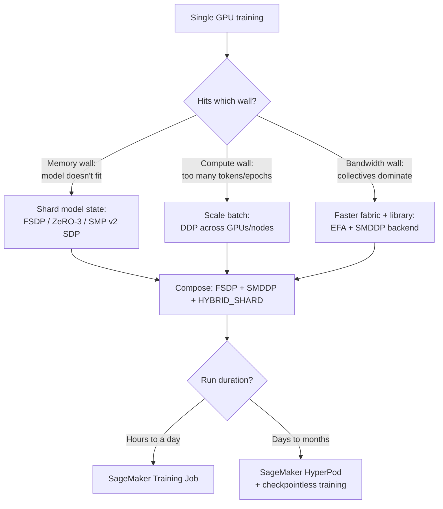
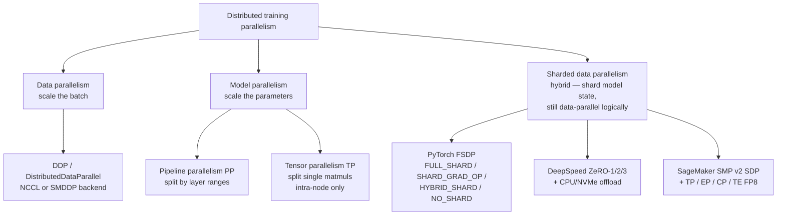
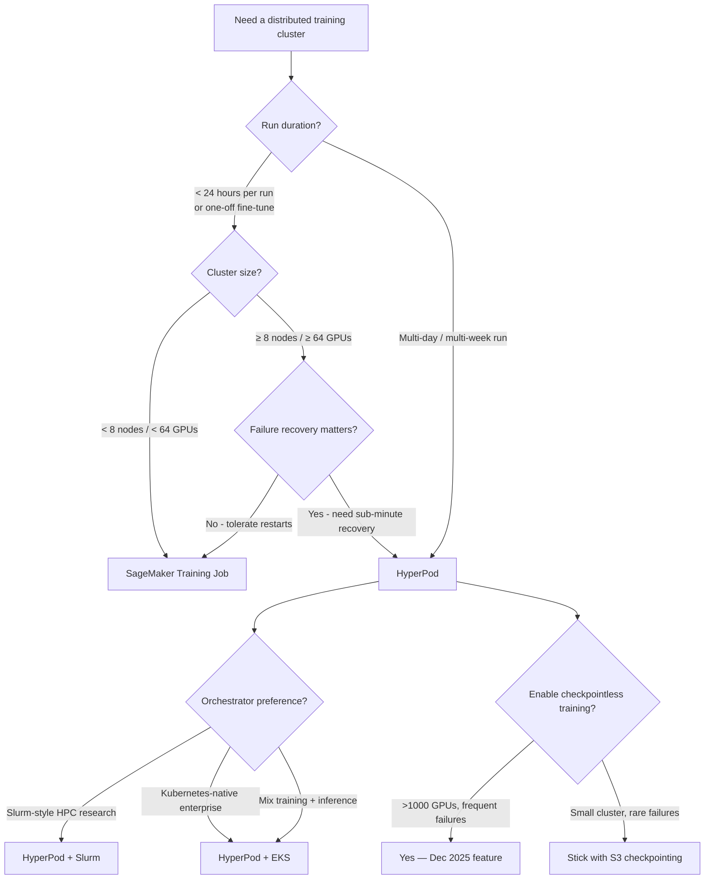

# Chapter 32 — Distributed Training: Data Parallel, Model Parallel, SMDDP, FSDP

> **Goal of this chapter:** to give you a working architect's grasp of *every* distributed-training option AWS exposes — the two ancient ones (DDP, model parallel), the modern default (PyTorch FSDP), the AWS-specific accelerator (SMDDP), the AWS-specific framework (SMP v2), the foundation-model substrate (HyperPod), and the legacy box you should not check (Training Compiler). By the end of the chapter you should be able to look at any scenario — *"13B Llama fine-tune on 4 × p4d," "70B pretrain for 30 days on 256 P5s," "tensor parallelism across an NVL72 UltraServer," "AllReduce dominates on a single p4d.24xlarge"* — and pick the right combination of parallelism strategy + communication backend + cluster substrate, with a defensible reason for every choice. The exam will quietly assume you know these compose; production will punish you if you don't.
>
> **Primary internal sources:** `notes/01_sagemaker_core.md` §4 (Distributed training), `notes/ch32_docs.md`, `notes/ch32_practice.md`.
> **Exam tasks targeted:** **Task 2.2** ("Methods to reduce model training time — early stopping, *distributed training*"), with cross-cuts into **Task 2.1** (choose a training approach) and **Task 3.2** (provision and maintain compute, recognize cluster-level bottlenecks). The phrasing on exam day will look like *"a team is training a 13B parameter Llama variant that no longer fits on a single H100 across 8 × p5.48xlarge — which AWS-native combination is best?"* The correct answer is essentially always *"FSDP / SMP v2 sharded data parallel + SMDDP backend on EFA-equipped instances"* — and almost never *"buy a bigger instance."*

---

## 32.0 The setup: three walls and a 13B model

It is 9 AM on a Monday and a research team forwards you a notebook. They have a 13-billion-parameter Llama variant they want to fine-tune on 50M instruction examples. They have AWS quota for four `ml.p4d.24xlarge` instances — 32 × A100 40GB GPUs in total, an aggregate of 1,280 GB of HBM. Their first attempt put the model on a single GPU with `model.cuda()` and it OOMed on the first forward pass. Their second attempt wrapped the model in `DistributedDataParallel` across 32 ranks; it OOMed again, *on every rank*. The team's third attempt added gradient accumulation and dropped the batch size to 1; it still OOMs. They open a ticket asking you whether they should request a quota increase to `p5.48xlarge` (80 GB H100s).

The right answer is no — they should change their *parallelism strategy*, not their hardware. The cluster already has 32× the memory their model needs. The problem is that DDP replicates the model state on every rank: each of the 32 A100s tries to hold the *full* 208 GB of model state (params + grads + Adam moments at fp32 = 16 bytes/param × 13B) in 40 GB of HBM. The fix is not more HBM; the fix is to **shard** the model state across the 32 ranks so each rank holds 1/32 of it (~6.5 GB) and AllGathers the slices it needs, layer by layer, at forward and backward time. That fix is called **FSDP**, and the entire rest of this chapter exists to teach you when to reach for it and what else composes around it.

Every modern foundation-model training run hits exactly three walls:

1. **The memory wall.** The model state — parameters + gradients + optimizer moments — does not fit in one GPU's HBM. For Adam in fp32, the per-parameter footprint is *16 bytes* (4 B params + 4 B gradients + 8 B optimizer moments). A 13B model therefore needs ~208 GB of GPU memory just for state, plus activations and KV caches — well past a single H100's 80 GB, and absolutely past an A100's 40 or 80 GB.
2. **The compute wall.** Even when the model fits, a single GPU may need months to converge over the training tokens. Data parallelism shrinks wall-clock by feeding more tokens per second across more GPUs.
3. **The bandwidth wall.** Once you cross node boundaries, the inter-node fabric (EFA, InfiniBand, NVLink-Switch) and the collective implementation (NCCL, SMDDP) decide whether you keep scaling linearly or plateau. A 100B-parameter pretrain on 256 GPUs without EFA is *not* a 100B pretrain on 256 GPUs — it is a 100B pretrain on the *slowest link in your network*.

Distributed training is the toolkit of *parallelism strategies* (which slice of the workload goes where) and *communication libraries* (how slices talk to each other) that pushes each wall back. Every option you pick — DDP vs FSDP, NCCL vs SMDDP, training-job vs HyperPod, p4d vs p5 — is a trade between those three walls. The chapter is organized around that trinity.



> **Mental model.** *Data parallel* scales the **batch** (more tokens/sec, same model). *Model parallel* (pipeline + tensor) scales the **parameters** (bigger model fits, same throughput). *Sharded data parallel* (FSDP / ZeRO-3 / SMP v2 SDP) is a hybrid — logically data parallel (every rank sees a different batch slice) but the model state is sharded across ranks, so each rank carries only `1/N` of the weights at rest. That hybrid is what took over the industry in 2022 and is the **default starting point in 2026** for any model that doesn't fit comfortably on one device.

---

## 32.1 The parallelism taxonomy

Every distributed-training technique you will see on the exam fits into one of four boxes. Memorize the box.



### 32.1.1 Data parallelism (DP / DDP)

Each GPU holds a **full copy** of the model. The mini-batch is split across replicas; each replica computes its local gradients on its slice of the batch; gradients are summed across all replicas via **AllReduce** so every replica ends with identical updated weights. Repeat for the next batch.

```
            Mini-batch of 1024
                   │
        ┌──────────┼──────────┐
        ▼          ▼          ▼
     GPU 0      GPU 1      GPU 2     ... GPU N-1
   [Model A]  [Model A]  [Model A]    [Model A]      ← identical replicas
   forward    forward    forward       forward
   backward   backward   backward      backward
        │          │          │
        └────── AllReduce(gradients) ─────┘
                   │
            updated weights (identical on all ranks)
```

**Properties.**
- **Linear speedup** *if and only if* AllReduce is faster than per-rank compute. On a well-connected single node (NVLink/NVSwitch), DDP scales near-linearly up to 8 GPUs. Across nodes, you depend on the inter-node fabric and the collective implementation — EFA + SMDDP scales much further than 10 GbE + TCP NCCL.
- **Replicated state** — every rank pays the full memory cost. Does not let you train *bigger* models, only train *the same model faster*. This is the trap the team in §32.0 fell into.
- **Easy to reason about** — the default for any model that fits in one GPU with headroom for activations and the optimizer.

**In PyTorch.** `torch.nn.parallel.DistributedDataParallel` (DDP). Backend = `nccl` (NVIDIA GPUs) or `smddp` (on SageMaker P4d/P5/Trn1).

### 32.1.2 Model parallelism — pipeline (PP) + tensor (TP)

When the model itself does not fit in one GPU, you split the *model* across devices. There are two orthogonal axes.

- **Pipeline parallelism (PP).** Slice the model **by layers**. GPU 0 holds layers 1–8, GPU 1 holds 9–16, etc. A micro-batch flows through the pipeline; while GPU 1 processes micro-batch *k*, GPU 0 has already started micro-batch *k+1*. The classic 1F1B (one forward, one backward) or interleaved schedules keep the pipeline full. Trade: **pipeline bubbles** at the start and end of each global batch — GPUs idle while the pipeline fills and drains. The more micro-batches, the smaller the bubble fraction.
- **Tensor parallelism (TP).** Slice the model **by matmul**. A 4096×4096 attention or FFN matrix is split column-wise (or row-wise) across, e.g., 8 GPUs; each rank holds 4096×512 of the weight. After the local matmul, the partial results are combined with **AllReduce** or **AllGather**. Trade: high **intra-step** communication — TP collectives fire on *every* matmul on *every* layer, which means TP is only viable across a **single node** with NVLink/NVSwitch (~600–900 GB/s), or across NVL72 nodes that share an NVLink-Switch domain.

```
Pipeline parallelism (4 GPUs, 4 stages):
  GPU0 ─→ GPU1 ─→ GPU2 ─→ GPU3
  L1-L8   L9-L16  L17-L24 L25-L32
  ▲                            │
  └──────── backward ──────────┘

Tensor parallelism (4 GPUs share one matmul):
       Wq is split column-wise across 4 GPUs
       GPU0: cols 0..1023
       GPU1: cols 1024..2047
       ...
  All ranks see the same input X; each computes a slice of XWq;
  results are AllGathered to form the full output.
```

**Hybrid 3D parallelism is the norm at foundation-model scale.** A modern Llama 3 70B+ pretrain typically combines:

- **TP** *inside a node* (8 GPUs sharing NVLink), so the chatty per-step AllReduces never touch the inter-node fabric.
- **PP** *across small groups of nodes* (e.g. 8 pipeline stages × 1 node each).
- **DP** (or sharded DP) *across pipeline groups* to scale the global batch.

This **3D grid (TP × PP × DP)** is what NVIDIA Megatron-LM, DeepSpeed, and SMP v2 all expose, and it is how you train a 405B model on a few thousand H100s without the AllReduce bandwidth becoming a wall.

### 32.1.3 Sharded data parallelism — FSDP, ZeRO, SMP v2 SDP

The 2022 hybrid that took over: logically data parallel — every rank still sees a different slice of the batch and AllReduces gradients — but at rest, the **model state is sharded** across ranks, so each rank only holds `1/N` of parameters + gradients + optimizer state.

```
DDP (replicated):                  FSDP / ZeRO-3 (sharded):
  Rank 0:  [P | G | O]              Rank 0:  [P0 | G0 | O0]
  Rank 1:  [P | G | O]              Rank 1:  [P1 | G1 | O1]
  Rank 2:  [P | G | O]              Rank 2:  [P2 | G2 | O2]
  Rank 3:  [P | G | O]              Rank 3:  [P3 | G3 | O3]
  Total memory: 4·(P+G+O)          Total memory: (P+G+O), evenly split
```

At forward time, ranks **AllGather** the shards they need for the current layer, run the matmul on the temporarily reconstituted full weight, then **discard** the gathered weights (freeing memory). Same on backward. The result: up to ~4× memory savings vs DDP with full sharding, at the cost of two extra collectives per layer. The collectives are bandwidth-bound; on EFA + SMDDP, the overhead is well under 20% on typical 7B–70B configurations.

#### The ZeRO ↔ FSDP mapping you must memorize

DeepSpeed's three sharding tiers are called **ZeRO-1 / ZeRO-2 / ZeRO-3**. PyTorch FSDP exposes the same tiers under different names. The mapping shows up on the exam *constantly*:

| DeepSpeed name | What it shards          | FSDP `ShardingStrategy` equivalent | Memory savings vs DDP | Comm overhead |
| -------------- | ----------------------- | ---------------------------------- | --------------------- | ------------- |
| **ZeRO-1**     | Optimizer state only    | (no direct equivalent — closest is custom)¹ | ~4× for Adam          | Same as DDP   |
| **ZeRO-2**     | + Gradients             | **`SHARD_GRAD_OP`**                | ~8×                   | Same as DDP   |
| **ZeRO-3**     | + Parameters            | **`FULL_SHARD`**                   | ~12×                  | +AllGather per layer (forward & backward) |
| —              | Nothing (replicate all) | **`NO_SHARD`**                     | 0× (= DDP)            | Same as DDP   |
| —              | FULL_SHARD inside node + replicate across nodes | **`HYBRID_SHARD`** | ~12× intra-node, then DP across | Same as ZeRO-3 intra-node + DDP AllReduce inter-node |

¹ Pure ZeRO-1 (shard *only* optimizer state) doesn't have a one-line FSDP equivalent — FSDP starts at gradients with `SHARD_GRAD_OP`. If a question specifically asks "shard only optimizer state" and offers ZeRO-1 as an option, take ZeRO-1.

The four facts to commit to memory:

1. **FSDP `FULL_SHARD` ≡ DeepSpeed ZeRO-3.** Shards params, gradients, optimizer state. Maximum memory savings, two extra collectives per layer.
2. **FSDP `SHARD_GRAD_OP` ≡ DeepSpeed ZeRO-2.** Shards gradients + optimizer state; params still replicated. Pick this when params fit in HBM but the optimizer state doesn't.
3. **FSDP `NO_SHARD` ≡ DDP.** Sanity-check mode. If a question describes "FSDP with NO_SHARD," it is *literally just DDP* — no memory savings, no extra collectives. *Exam alert below.*
4. **FSDP `HYBRID_SHARD`** is FULL_SHARD *inside* a node-group + replicate *across* node-groups. The right default for multi-node SageMaker clusters where intra-node bandwidth (NVLink ~600 GB/s on A100, ~900 GB/s on H100) is ~10× faster than inter-node (EFA ~400 Gbps on p4d, ~3200 Gbps on p5).

> ⚠️ **Exam alert — `NO_SHARD` is a trap.** If you see "FSDP with `NO_SHARD`" offered as the answer to a memory-pressure question, it is *wrong by construction*. `NO_SHARD` is identical to DDP — full replication, no sharding, zero memory savings. The valid sharded options are `SHARD_GRAD_OP`, `FULL_SHARD`, and `HYBRID_SHARD`. AWS likes to put `NO_SHARD` in the distractor list because the name *sounds* like it might mean "auto."

---

## 32.2 PyTorch FSDP — the 2025-2026 default deep dive

> *Source: PyTorch FSDP docs; Rajbhandari et al. 2020 (ZeRO paper); SageMaker SMP v2 announcement (Dec 2023); HuggingFace Accelerate FSDP vs DeepSpeed concept guide.*

PyTorch Fully Sharded Data Parallel has, as of 2025-2026, *effectively become the default sharded-data-parallel strategy* for any organization training 7B–70B models on AWS. The dominance is pragmatic, not theoretical:

- **Native PyTorch integration** — no extra package, no HuggingFace plugin glue, composes cleanly with `torch.compile`, `torch.amp` mixed precision, activation checkpointing, and the HuggingFace `Trainer`.
- **Simpler mental model** than DeepSpeed's stage 1/2/3 + offload combinatorics — FSDP exposes four sharding strategies and that's it.
- **PyTorch 2.x mixed-precision stack** integrates with FSDP's sharding logic directly, reducing the redundant FP32 upcasts that historically hurt DeepSpeed ZeRO-3 throughput.
- **Long-term support commitment** — the PyTorch team has publicly committed to FSDP being the production sharded-DP path, with experimental FSDP2 (per-parameter sharding) maturing on top of the same API.

The MLA-C01 will increasingly assume FSDP is the default sharded-DP answer for PyTorch teams unless the question explicitly steers you elsewhere (e.g., "they need CPU offload of optimizer state").

### 32.2.1 What FSDP actually shards

For every "FSDP unit" (typically a Transformer block — `LlamaDecoderLayer`, `BertLayer`, etc.), FSDP shards three things:

1. **Parameters** — flattened, then evenly split across ranks. Each rank stores `params_in_unit / world_size` bytes at rest.
2. **Gradients** — sharded the same way as parameters.
3. **Optimizer state** — sharded the same way as parameters. For Adam, this is *two* moments per parameter — the largest single category of memory.

The unit is "unsharded" (via **AllGather**) right before its forward pass, runs to completion, and is re-sharded (free the gathered tensors) immediately afterwards. Backward does the same — re-AllGather for the backward matmuls, then re-shard. Gradients are **ReduceScattered** (sum + shard in one op) rather than separately AllReduced + sharded.

The communication pattern compared to DDP:

| Step                | DDP                    | FSDP (FULL_SHARD)                              |
| ------------------- | ---------------------- | ---------------------------------------------- |
| Forward (per layer) | None                   | AllGather (gather full params from shards)     |
| Backward (per layer)| None                   | AllGather (params again) + ReduceScatter (grads) |
| End of step         | AllReduce (gradients)  | (None — gradients already ReduceScattered)     |
| Total collectives   | 1 per step (gradients) | 2 AllGather + 1 ReduceScatter per FSDP unit per step |

That is materially more collective traffic — which is exactly why **SMDDP's AllGather optimization (added in 2023) matters so much for FSDP**: it's the single most-called collective in the modern training stack.

### 32.2.2 Sharding strategies — `ShardingStrategy` enum

| Strategy           | Behavior                                                              | Use case                                                                                  |
| ------------------ | --------------------------------------------------------------------- | ----------------------------------------------------------------------------------------- |
| **`FULL_SHARD`**   | Shard P + G + O across all ranks (ZeRO-3 equivalent)                  | Default when model is large vs cluster; maximum memory savings                            |
| **`SHARD_GRAD_OP`**| Shard G + O only; replicate P (ZeRO-2)                                | Model parameters fit in HBM, but optimizer state doesn't                                  |
| **`NO_SHARD`**     | DDP behavior — full replication                                       | Sanity check; very small models; debugging FSDP wiring without the sharding semantics     |
| **`HYBRID_SHARD`** | FULL_SHARD inside a node-group + replicate across groups              | Multi-node clusters with fast intra-node (NVLink) and slower inter-node (EFA) — the most common pick for SageMaker P5 clusters |
| **`_HYBRID_SHARD_ZERO2`** | `SHARD_GRAD_OP` inside a node-group + replicate across | Same idea as HYBRID_SHARD but starting from ZeRO-2 instead of ZeRO-3                      |

`HYBRID_SHARD` is the *right default* on AWS multi-node P4d/P5 clusters because the inter-node EFA bandwidth, while excellent for AllReduce of full-cluster gradients, is still ~10× slower than NVLink for the chatty per-layer AllGather pattern that ZeRO-3 demands. By sharding inside the node (8 ranks, NVLink) and replicating across nodes (DP-style AllReduce over EFA), you get most of the memory savings (8× on an 8-GPU node) and skip the cross-rack AllGather cost.

### 32.2.3 Wrapping policy — what counts as an "FSDP unit"

FSDP requires you to choose **what to treat as a single sharding unit**. The common pattern is `transformer_auto_wrap_policy` with the model's transformer block class:

```python
from torch.distributed.fsdp.wrap import transformer_auto_wrap_policy
from transformers.models.llama.modeling_llama import LlamaDecoderLayer

auto_wrap_policy = functools.partial(
    transformer_auto_wrap_policy,
    transformer_layer_cls={LlamaDecoderLayer},
)

model = FSDP(model, auto_wrap_policy=auto_wrap_policy, ...)
```

**Why this matters.** Wrap too coarsely (e.g., the entire model as a single unit) → AllGather has to materialize the *whole* model at once, which defeats sharding. Wrap too finely (every linear layer) → AllGather overhead per unit dominates compute. The transformer-block granularity is the empirical sweet spot, and HuggingFace's `Trainer` uses it by default.

### 32.2.4 Mixed precision — the `MixedPrecision` policy

FSDP has a first-class `MixedPrecision` config. You choose dtype independently for *parameters*, *reduce* (gradient reduction), and *buffer*. Typical H100 setup:

```python
from torch.distributed.fsdp import MixedPrecision

mp_policy = MixedPrecision(
    param_dtype=torch.bfloat16,    # forward/backward compute in bf16
    reduce_dtype=torch.float32,    # gradient reduce in fp32 for numerical stability
    buffer_dtype=torch.bfloat16,
)

model = FSDP(model, mixed_precision=mp_policy, ...)
```

The split — bf16 compute, fp32 reduce — is the production-grade default. Pure bf16 reduce sometimes causes loss spikes on long pretraining runs (rare overflow when summing many shard gradients); fp32 reduce costs slightly more bandwidth but is stable. fp16 reduce is generally avoided on modern hardware — bf16 has the same dynamic range as fp32 and removes the need for loss scaling.

### 32.2.5 CPU offload + activation checkpointing

When the cluster's *total* HBM is exhausted even with full sharding, FSDP offers two escape hatches:

- **CPU offload.** `cpu_offload=CPUOffload(offload_params=True)` — move the sharded weights to host DRAM between use; trades PCIe bandwidth for HBM. Lets you train models that exceed the cluster's total HBM (at significant throughput cost).
- **Activation checkpointing.** Pair with `torch.utils.checkpoint.checkpoint_sequential` or FSDP's `apply_activation_checkpointing` helper to recompute activations on the backward pass instead of storing them. Free in memory, costs ~30% more compute.

FSDP's CPU offload is **all-or-nothing** — either all params offload or none. This is the one place where **DeepSpeed ZeRO-3 + CPU offload is still strictly better than FSDP**: DeepSpeed lets you offload *optimizer state* to CPU while keeping *params* on GPU, which is the sweet spot when your optimizer is the bottleneck (Adam at fp32 is 8 bytes/param of state — often more than the params themselves at bf16).

### 32.2.6 When to pick FSDP over DDP

| Symptom                                                    | Move to FSDP if…                                                                                  |
| ---------------------------------------------------------- | ------------------------------------------------------------------------------------------------- |
| OOM at batch size 1                                        | Definitely — DDP is not even an option                                                            |
| OOM only at large batches                                  | Try gradient accumulation first; FSDP if you need a bigger *effective* batch                      |
| Model params fit but optimizer state OOMs                  | `SHARD_GRAD_OP` is enough; no need for `FULL_SHARD`                                               |
| Training across 32+ GPUs and AllReduce is the bottleneck   | `HYBRID_SHARD` + sharded optimizer often wins on AWS over plain DDP                               |
| Single GPU, model fits, want fastest single-node training  | Stay on DDP (or actually no parallelism at all — single GPU); FSDP overhead isn't worth it        |

---

## 32.3 SMDDP — SageMaker Distributed Data Parallel library

> *Source: AWS docs — "Distributed training in Amazon SageMaker AI," "SMDDP intro," "Use the SMDDP library in your PyTorch training script."*

### 32.3.1 What SMDDP is — and what it isn't

SMDDP is AWS's own **collective communication library**, a drop-in alternative to **NCCL**, optimized for AWS network infrastructure (EFA + SRD) and SageMaker ML instance topology. It is **not a training framework**. It does not replace your training loop, your model, or your optimizer. It replaces the *collective backend* that `torch.distributed` uses to move bytes between ranks.

Mental model: NCCL is to NVIDIA what SMDDP is to AWS. NVIDIA-tuned ring/tree algorithms vs AWS-tuned mesh-over-EFA algorithms. Same API surface; pick whichever moves your bytes faster on your hardware.

### 32.3.2 What SMDDP accelerates — and what it doesn't

Exactly two collectives:

- **AllReduce** — the gradient-sync operation used by DDP and the final-gradient step in FSDP/ZeRO. This was the original SMDDP target in 2020.
- **AllGather** — added in 2023 specifically to support PyTorch FSDP and DeepSpeed ZeRO-3, which AllGather sharded parameters per layer.

That's it. SMDDP does **not** speed up tensor-parallel collectives (those are intra-node, handled by NVLink + NCCL anyway), it does **not** speed up data loading, and it does **not** speed up compute kernels.

### 32.3.3 The numbers AWS publishes

The headline performance claims, worth knowing for both production and exam-trap defense:

- **~90% bandwidth utilization** for SMDDP vs **~80% for NCCL** in equivalent EFA configurations.
- Uses **<9 GPU streaming multiprocessors (SMs)** for collectives vs NCCL's up to 24 SMs — frees ~15 SMs back to compute kernels per GPU. On an H100 with 132 SMs, that's >10% of compute capacity reclaimed for math.
- Reaches peak performance at **smaller buffer sizes** than NCCL — material win for the smaller AllGather buffers common in DeepSpeed and per-FSDP-unit AllGathers.
- Uses **CPU** for AllReduce orchestration rather than GPU — allows better overlap of backward-pass compute with gradient communication.
- Inter-node uses **mesh topology** over EFA (single-hop) instead of NCCL's multi-hop ring/tree — avoids accumulated per-hop latency on AWS placement-group topologies.

### 32.3.4 Where SMDDP works — instances and frameworks

**Instances.** Only multi-node, EFA-equipped ML instances:

- `ml.p3dn.24xlarge` (V100 + 100 Gbps EFA — legacy)
- `ml.p4d.24xlarge`, `ml.p4de.24xlarge` (A100 + 400 Gbps EFA)
- `ml.p5.48xlarge`, `ml.p5e.48xlarge`, `ml.p5en.48xlarge` (H100/H200 + 3200 Gbps EFA)
- `ml.trn1.32xlarge`, `ml.trn2.48xlarge` (Trainium + EFA — SMDDP is the *only* option here, since there is no NCCL on Trainium)

**SMDDP AllGather requires P4d-class hardware or newer** (P4de/P5/P5e/P5en). Don't try it on G5 or pre-P4d instances.

**Frameworks.** PyTorch and anything built on PyTorch — HuggingFace Transformers, DeepSpeed, PyTorch FSDP, PyTorch Lightning. The original TensorFlow flavor has been **deprecated**.

> ⚠️ **Exam alert — SMDDP single-node gives no benefit.** If a question says *"Distributed training is slow on a single `ml.p4d.24xlarge`. Should we enable SMDDP?"* — the answer is **no**. SMDDP optimizes *inter-node* collectives over EFA. A single node has no inter-node fabric to optimize; the eight GPUs already talk over NVLink, which NCCL drives perfectly well. The fix on single-node is intra-node (mixed precision, bigger micro-batch, profiler-driven kernel optimization), not SMDDP. This is one of AWS's favorite distractors.

### 32.3.5 The deprecated direct API → backend-swap migration

The original SMDDP API (`smdistributed.dataparallel.torch.distributed as dist`) is **deprecated since v1.4.0**. The current path is to register `smddp` as a `torch.distributed` backend and then use vanilla PyTorch:

```python
# OLD (deprecated since SMDDP v1.4.0)
import smdistributed.dataparallel.torch.distributed as dist
dist.init_process_group()

# NEW (current — registers the 'smddp' backend, then uses vanilla torch.distributed)
import smdistributed.dataparallel.torch.torch_smddp   # side-effect: registers 'smddp'
import torch.distributed as dist
dist.init_process_group(backend="smddp")

# Then use vanilla torch.nn.parallel.DistributedDataParallel
#   OR FSDPStrategy(process_group_backend='smddp', accelerator='gpu') for Lightning
#   OR FSDP(model, ...) directly — it inherits the process group's backend
```

**Why this design is good.** Your training script is now ~99% vanilla PyTorch. Swapping `backend='smddp'` for `backend='nccl'` (or vice versa) is a *one-line change*. You can develop on a non-AWS box with NCCL, then flip the backend in SageMaker. This is the portability story the exam will reward you for picking.

### 32.3.6 Enabling SMDDP via the SageMaker Python SDK

Two surfaces — script (above) plus estimator. The estimator surface flips the same switch:

```python
from sagemaker.pytorch import PyTorch
estimator = PyTorch(
    entry_point="train.py",
    role=role,
    instance_count=4,
    instance_type="ml.p4d.24xlarge",
    framework_version="2.2",
    py_version="py310",
    distribution={
        "smdistributed": {"dataparallel": {"enabled": True}},
    },
)
```

For FSDP or DeepSpeed users, you typically use the more general `torch_distributed` switch and call `init_process_group(backend="smddp")` from inside your script — same effect, more flexibility:

```python
distribution={"torch_distributed": {"enabled": True}}
```

The two distribution flavors are covered in detail in §32.7 below.

### 32.3.7 Known limitations

- **No subprocess groups.** `torch.distributed.new_group()` is not supported under SMDDP. If your stack creates pipeline-parallel or tensor-parallel sub-groups via `new_group()`, you cannot use SMDDP as the sole backend. (SMP v2 handles this by composing SMDDP for DP/SDP collectives and NCCL for TP collectives — see §32.4.)
- **Cannot mix backends in the same process.** One process = one backend.
- **Instance support is restricted** to the EFA-equipped P-family and Trn-family above. SMDDP on G5 or pre-P4d hardware is not supported.

---

## 32.4 SMP v2 — SageMaker Model Parallel library, the AWS framework

> *Source: AWS docs — "SageMaker model parallelism library v2" (Dec 2023); "Model parallelism concepts"; "Tensor parallelism."*

### 32.4.1 What SMP v2 changed from SMP v1

The 2023 rewrite is the version you should know:

- **SMP v1** (deprecated) used proprietary AST rewriting to partition a TF/MXNet/PyTorch model into pipeline stages. Hard to debug, version-locked, opaque to users. Abandoned.
- **SMP v2** is **PyTorch-only** and wraps a **FSDP-ready** model with `torch.sagemaker.transform(model)`. It composes *with* open-source PyTorch FSDP rather than replacing it, and adds tensor parallelism, expert parallelism, and context parallelism as orthogonal, composable knobs.

The single biggest mental shift: **SMP v2 = FSDP + extras**, not "an alternative to FSDP." The user-visible setup collapses to:

```python
import torch.sagemaker as tsm
tsm.init()                                         # initialize SMP v2
model = build_llama_model()                        # your normal PyTorch model

model = tsm.transform(                             # SMP v2 wrap — adds TP/EP/CP
    model,
    config={"tensor_parallel_degree": 8,
            "expert_parallel_degree": 1},
)
model = FSDP(                                      # vanilla PyTorch FSDP
    model,
    sharding_strategy=ShardingStrategy.HYBRID_SHARD,
    mixed_precision=mp_policy,
    ...,
)
```

Behind `tsm.init()`, SMP v2:

- Hooks **SMDDP** in as the collective backend for the DP/SDP plane.
- Integrates **NVIDIA Transformer Engine (TE)** to enable tensor parallelism *within* the FSDP-wrapped model — historically these two were mutually exclusive in vanilla PyTorch.
- Adds **checkpoint conversion helpers** (HuggingFace ↔ SMP sharded checkpoints) so you can resume from a public HF checkpoint and ship to HF format.
- Adds AWS-tuned **mixed-precision recipes** and activation-checkpointing policies.

AWS publicly claims **up to 20% faster training** vs vanilla FSDP on equivalent hardware.

### 32.4.2 Supported parallelism strategies (SMP v2)

| Strategy | What it does | Typical use |
| -------- | ------------ | ----------- |
| **Sharded Data Parallelism (SDP)** | FSDP-based; shards model state across GPUs | Default for 7B–70B models |
| **Tensor Parallelism (TP)**  | Splits heavy matmuls (attention, FFN) column/row-wise across GPUs in a node | 70B+ models; requires intra-node NVLink |
| **Expert Parallelism (EP)**  | Splits Mixture-of-Experts (MoE) layers across GPUs | MoE models (Mixtral 8×7B, GShard) |
| **Context Parallelism (CP)** | Splits very long sequences (>32K tokens) across devices on the sequence axis | Long-context fine-tuning (100K+ token windows) |
| **Activation checkpointing + offload** | Built-in policies on top of the above | Always useful for big models; SMP applies sensible defaults |

The four parallelism axes (DP/SDP × TP × PP × EP × CP) compose. A typical 405B-parameter MoE training run combines TP=8 (intra-node), EP=8 (across nodes), SDP=N (the remaining axis), with activation checkpointing layered on top.

### 32.4.3 Transformer Engine + FP8

SMP v2 integrates **NVIDIA Transformer Engine**. On H100/H200, this unlocks **FP8 training** with automatic loss scaling — roughly **2× throughput** vs bf16 for attention/FFN matmuls. TE is opaque to you — SMP v2 wraps your linear and attention layers and dynamically selects FP8 vs bf16 per matmul based on numerical stability. The FP8 GEMM kernels live in TE's Hopper-tuned implementation; you don't write them.

FP8 is *not* a free win — it's only available on H100/H200 (Hopper and newer), it doesn't apply to all kernels, and it requires careful tuning of `amax` history windows. But for the production-scale pretrains where SMP v2 is most valuable, the ~2× speedup on the matmul-heavy path is material.

### 32.4.4 Decision matrix — DDP vs FSDP vs SMP v2 vs DeepSpeed

The single matrix you'll lean on for the exam:

| Model size                                                       | Recommended setup                                                                         |
| ---------------------------------------------------------------- | ----------------------------------------------------------------------------------------- |
| Fits in one GPU (≤7B params on H100 with optimizer)              | **DDP** via SMDDP backend, single replica per GPU                                         |
| 7B–70B on a single node (8 GPUs)                                 | **FSDP** (open-source) + SMDDP backend                                                    |
| 7B–70B across multiple nodes                                     | **FSDP `HYBRID_SHARD`** + SMDDP backend; or SMP v2 SDP if you also need TP or FP8         |
| 70B+ requiring tensor parallelism (single layer doesn't fit)     | **SMP v2** with SDP + TP                                                                  |
| Trillion-param MoE (Mixtral-style, GShard)                       | **SMP v2** with SDP + TP + EP                                                             |
| Long-context fine-tune (>32K tokens, activation OOM)             | **SMP v2** with SDP + Context Parallelism + activation checkpointing                      |
| Need to offload optimizer state to CPU while keeping params on GPU | **DeepSpeed ZeRO-3 + offload** (FSDP is all-or-nothing on offload)                       |

### 32.4.5 When DeepSpeed ZeRO still wins (the one place SMP v2 + FSDP both lose)

- **Granular offload.** You want to offload *optimizer states to CPU* but keep *params on GPU*. FSDP can't split these; DeepSpeed can.
- **You're already on the DeepSpeed optimizer ecosystem** — 1-bit Adam, ZeRO-Infinity NVMe offload — and don't want to re-validate convergence on a switch.
- **Very small clusters (1-2 nodes) doing fine-tuning**, where DeepSpeed's older auto-tuning of micro-batch and gradient-accumulation is still slightly nicer out-of-the-box.

> **Exam framing:** if a PyTorch 2.x team is training a 13B-70B model and asks for the *minimal-friction* sharded data-parallel approach, the answer is **FSDP**. If the question emphasizes *offloading optimizer states to host memory because GPU memory is the bottleneck*, that's still **DeepSpeed ZeRO-3 + CPU offload** territory. If the question adds *tensor parallelism* or *FP8* on top of sharding, it's **SMP v2**.

### 32.4.6 SMP v2 estimator setup

```python
estimator = PyTorch(
    entry_point="train.py",
    role=role,
    instance_count=8,
    instance_type="ml.p5.48xlarge",
    framework_version="2.2",
    distribution={
        "torch_distributed": {"enabled": True},
        "smdistributed": {"modelparallel": {
            "enabled": True,
            "parameters": {
                "tensor_parallel_degree": 8,
                "expert_parallel_degree": 1,
                "sharded_data_parallel_degree": 8,
                "fp8": True,
            },
        }},
    },
)
```

---

## 32.5 Training Compiler — deprecated, but still appears in old exam material

> *Source: AWS — "Amazon SageMaker Training Compiler Release Notes" (deprecation announcement, Aug 2024); ezyang's blog "State of torch.compile for training" (Aug 2025).*

**Status (2026): deprecated.** AWS announced in August 2024 that there would be no new releases or versions of SageMaker Training Compiler. The existing DLC images still work but receive no patches, no new framework versions, and no security updates per the DLC Framework Support Policy. Existing pinned DLCs (PyTorch 1.13 / TF 2.11 era) are still pullable.

### 32.5.1 What it was

An **XLA-based ahead-of-time graph compiler** for training jobs. Enabled via `compiler_config=TrainingCompilerConfig()` on the HuggingFace estimator. Compiled transformer training graphs for ~10–50% speedup on GPU instances *without* requiring you to change your training script. The pitch was: *"add one flag, get a free 30%."*

### 32.5.2 Why it died

- **`torch.compile()` in PyTorch 2.0+ covered ~90% of the same use cases natively**, with broader operator coverage, with no SageMaker-specific DLC, with no estimator-flag plumbing, and with active upstream development.
- **XLA for PyTorch matured separately** as `PyTorch/XLA`, which is the right path on TPUs and on Trainium.
- The Training Compiler required a **custom DLC image + bespoke estimator flags**; `torch.compile` is a one-line wrap of any model with no infrastructure changes.

### 32.5.3 Migration path

| If your old code looks like…                                                       | Replace with…                                                          |
| ---------------------------------------------------------------------------------- | ---------------------------------------------------------------------- |
| `HuggingFace(..., compiler_config=TrainingCompilerConfig())`                       | Drop the flag. Inside the script: `model = torch.compile(model)`        |
| `TensorFlow(..., compiler_config=TrainingCompilerConfig())`                        | Migrate to PyTorch + `torch.compile`, or to TF's native `tf.function`   |
| Training on Trainium with Training Compiler                                        | Use the **Neuron SDK's compiler** (XLA-based, separate code path — `neuronx-cc`) |
| Inference-time XLA compilation                                                     | Use `torch.compile` or `PyTorch/XLA` directly                          |

```python
# OLD: Training Compiler
huggingface_estimator = HuggingFace(
    ...,
    compiler_config=TrainingCompilerConfig(),
)

# NEW: native torch.compile inside the training script
model = torch.compile(model, mode="default")
# Modes: "default" | "reduce-overhead" | "max-autotune"
```

> ⚠️ **Exam alert — Training Compiler is deprecated; migrate to `torch.compile`.** If a question is dated 2023 or earlier and asks *"how do you speed up HuggingFace training on SageMaker without changing your script?"*, Training Compiler is the legacy-correct answer. If the framing is current (PyTorch 2.x, 2024+), the correct answer is **`torch.compile()` for GPU** or **Neuron SDK for Trainium**. AWS still leaves Training Compiler in some distractor lists — read the question carefully for vintage cues (PyTorch 1.x = old, 2.x = current).

---

## 32.6 SageMaker HyperPod — persistent resilient clusters

> *Source: AWS docs — "Amazon SageMaker HyperPod overview"; HyperPod release notes 2024–2025; customer case studies (Anthropic, Thomson Reuters, Perplexity, Bayer, Hippocratic, Salesforce); AWS blog "Checkpointless training on Amazon SageMaker HyperPod" (Dec 2025).*

### 32.6.1 The shift from ephemeral to persistent

Standard SageMaker **training jobs** are *ephemeral*: `CreateTrainingJob` provisions a cluster, pulls the DLC, runs the job, tears the cluster down. Fine for hours-to-days runs. For foundation-model training (weeks-to-months, hundreds-to-thousands of GPUs), the ephemeral model breaks down hard:

- A single hardware failure **restarts the entire job** from the last checkpoint.
- **Per-job provisioning + DLC pull costs minutes** you can't recover at the start of every run.
- You need **persistent shared scratch** (e.g., for activations, datasets, intermediate states) and a familiar HPC scheduler that researchers already know.
- You need **SSH access** to debug stuck workers, profile NCCL, and hand-tune EFA parameters — capabilities Training Jobs deliberately hide.

**HyperPod** is the *persistent* answer: long-lived clusters of GPU or Trainium instances with built-in resiliency and your choice of orchestrator. It is **not a training framework** — it's the *cluster manager*. You still run FSDP, DeepSpeed, NeMo, or SMP v2 *inside* HyperPod. The selling point is **uptime and goodput, not throughput per GPU**.

### 32.6.2 Orchestrator options — Slurm vs EKS

HyperPod offers two control planes for the same underlying resilient cluster:

| Mode      | Control plane                          | UX                                                      | Best when                                                                                       |
| --------- | -------------------------------------- | ------------------------------------------------------- | ----------------------------------------------------------------------------------------------- |
| **Slurm** | HyperPod head + login + worker nodes   | `srun`, `sbatch`, lifecycle scripts; classic HPC stack  | Research teams; tight integration with existing Slurm scripts; researchers prefer the ergonomics |
| **EKS**   | Amazon EKS cluster (1:1 with HyperPod) | Kubernetes pods, Kubeflow PyTorch Operator, Kueue, IRSA | Teams already on EKS; need GitOps; want to mix training + inference workloads on one cluster     |

Both modes share the **resiliency layer** (auto health checks, auto node replacement, auto-resume), the **observability stack** (Container Insights + Managed Grafana), and the **checkpointless training** integration (§32.6.4).

> ⚠️ **Exam alert — Slurm vs EKS choice.** *"Research team wants `srun` and `sbatch` on AWS"* → **HyperPod with Slurm**. *"Enterprise platform team wants Kubernetes-native scheduling, IRSA, and gang scheduling via Kueue"* → **HyperPod with EKS**. *"Team wants to share GPUs between training and online inference on the same cluster"* → **HyperPod with EKS** (EKS makes the training/inference colocation natural). The exam likes to test that you know both orchestrators exist and that the choice is *team preference + ecosystem*, not capability.

### 32.6.3 Resiliency — the headline feature (pre-checkpointless)

HyperPod monitors instances with periodic NCCL/EFA tests and GPU ECC/Xid checks. When a node fails:

1. The node is **cordoned** and replaced from a warm reserve (or fresh provisioning).
2. The job runner **pauses** the affected job.
3. Once the replacement is healthy, the job is **auto-resumed** from the latest checkpoint on a shared filesystem (FSx for Lustre is the canonical choice) or S3.

Auto-resume requires your code to checkpoint to a shared store. On EKS, the Kubeflow PyTorch training operator wraps the resume logic. On Slurm, the job script integrates via HyperPod's auto-resume hooks.

### 32.6.4 Checkpointless training (Dec 2025) — the most important recent feature

This is the most operationally significant HyperPod feature to land in 2025 and the one most likely to show up on the exam from now on.

**How it works.** Instead of restoring failed processes from an S3 checkpoint, a recovering process **pulls state directly from a healthy peer over EFA**. The cluster as a whole keeps making forward progress; only the failed rank pauses to be reseeded from a neighbor. No full-cluster restart, no S3 round-trip, no waiting for the slowest-loading checkpoint shard.

**The published numbers** (AWS blog, Dec 2025):

| Cluster size                 | Before (S3 checkpoint restore) | After (peer-to-peer)         | Reduction |
| ---------------------------- | ------------------------------ | ----------------------------- | --------- |
| 16 GPUs (fine-tuning)        | 5 min 10 s                     | 50 s                          | ~84%      |
| 256 GPUs (Llama-3 70B)       | 4 min 52 s                     | 47 s                          | ~84%      |
| **2,304 GPUs**               | **15–30 min**                  | **<2 min (often <90 s)**      | **80–93%** |

- **>95% training goodput** — *goodput* = fraction of wall-clock time spent on real forward/backward progress — even on clusters with thousands of accelerators.
- **$4,693 cost per failure** on a 256-P5 cluster from compute-time loss alone. If you average one daily failure over a 30-day run, that's roughly **$141,000/month** in burned compute the checkpointless path avoids.

**Framework support tiers.**

- **Tier 4 (best):** NeMo + HyperPod recipes for Llama and GPT — out-of-the-box with minimal config.
- **Tier 3:** PyTorch / PyTorch Lightning native — works with config.
- **Lower tiers:** Bespoke training loops can integrate via the SDK but require more wiring.

**When traditional S3 checkpoints still matter.**

- **Catastrophic cluster-wide failure** (entire AZ blip, scheduler crash) — no peers to recover from; you still need the S3 checkpoint.
- **Cross-region migration** — peer state is in-cluster only.
- **Model release artifacts** — you obviously still save a checkpoint when you ship.

The pattern: checkpoint *less frequently* (every few hours instead of every 15 minutes), and rely on peer-recovery for the in-cluster hardware failures that dominate at scale.

### 32.6.5 Other 2024–2025 HyperPod feature additions

- **Task governance** — admins set per-team quotas; the scheduler bin-packs jobs across the cluster.
- **HyperPod recipes** — pre-tuned training scripts for Llama 3.1 405B, Mistral, Falcon, Stable Diffusion XL with optimal SMP/SMDDP configs and FSDP wrapping policies.
- **UltraServer support (NVL72)** — a single UltraServer is **18 instances × 4 GPUs = 72 NVIDIA Blackwell GPUs** unified by NVLink-Switch. Lets a single TP/PP group span 72 GPUs at NVLink bandwidth — eliminates inter-node EFA hops for trillion-parameter tensor-parallel groups. HyperPod auto-packs whole jobs onto one UltraServer when possible.
- **Topology-aware scheduling** — places communicating ranks on physically close instances (same rack, same EFA fabric, same placement group).
- **Observability** — Container Insights + Amazon Managed Grafana dashboards out of the box.
- **HyperPod Inference (2024)** — serve models on the same cluster, sharing GPUs between training and online inference.
- **HyperPod Training Operator (2025)** — Kubernetes operator that restarts only the *training process* on a bad node rather than the entire job — recovery in seconds instead of minutes.
- **`BatchRebootClusterNodes` / `BatchReplaceClusterNodes` APIs (Nov 2025)** — programmatic node operations, works for both Slurm and EKS orchestration.
- **Health Monitoring Agent for Slurm (Sept 2025)** — same node-health telemetry that EKS clusters get.

### 32.6.6 Customer evidence — who's on HyperPod and why

These are the publicly disclosed adopters as of 2025-2026. The exam doesn't test customer names, but the *patterns* (cluster size + duration + headline metric) tell you exactly when HyperPod is the right answer.

| Customer            | Use case                                                  | Headline metric                                                                                       |
| ------------------- | --------------------------------------------------------- | ----------------------------------------------------------------------------------------------------- |
| **Anthropic**       | Claude training on Trainium2 (Project Rainier)            | ~500K Trainium2 chips active; scaling to >1M by end of 2025; 5× prior Claude compute                  |
| **Thomson Reuters Labs** | 70B parameter LLM on legal corpus                    | **36-day training run on 16 P4d (128 A100); zero hardware failures; 400B tokens; 20 training jobs over 5 months** |
| **Perplexity**      | Foundation model training                                 | ~40% reduction in training time vs prior setup; early beta tester since Aug 2023                      |
| **Luma AI**         | Frontier visual / video generation models                 | Trains on "1000× more data than the largest LLMs"                                                     |
| **Salesforce**      | Multiple internal foundation models                       | DevOps overhead "eliminated"; uses checkpointless + elastic training for goodput                      |
| **Hippocratic AI**  | Healthcare-safety LLM                                     | **4× faster model training on P5** via HyperPod                                                       |
| **Bayer**           | Biomedical imaging foundation models for drug discovery   | "Trained and utilized new foundation models in just a few short months"; benefits from <2-min checkpointless recovery |
| **BMW, Hugging Face, Stability AI** | Various                                  | Listed publicly as users                                                                              |

**Project Rainier — the scale anchor.** You don't need to memorize Rainier numbers, but they're the mental model for "how big does this get":

- ~500,000 Trainium2 chips active across Project Rainier (primarily Indiana data center).
- **70% increase** in AWS's total AI compute infrastructure vs prior generation.
- **5× the compute** Anthropic used to train earlier Claude models.
- AWS expects Anthropic to scale to **>1 million Trainium2 chips by end of 2025**, mixing training and inference.
- Trainium2 was co-designed with Anthropic; **Trainium3** is already in the pipeline.
- AWS claims **30–40% better price-performance** vs equivalent GPU EC2 instances for Trainium2.

### 32.6.7 Training jobs vs HyperPod — the choice rule

The decision tree, condensed:



**The rule of thumb:** if the team is training a **>10B model for >1 week on >8 nodes**, HyperPod pays for itself in recovered goodput. Below that, plain Training Jobs are still the right answer.

> ⚠️ **Exam alert — HyperPod vs Training Jobs choice rule.** "Customer is fine-tuning a 7B Llama for 6 hours on 4 × p4d." → **Training job**, not HyperPod. HyperPod's value (persistence + resiliency) only pays off when the job is long enough that node failures are statistically likely. "Customer is pretraining a 70B model for 36 days on 128 GPUs." → **HyperPod**, ideally with checkpointless training. "Customer runs dozens of short fine-tunes per day with different hyperparameters." → **Training Jobs** (each fine-tune is ephemeral). "Customer wants Slurm `sbatch` UX for their research team." → **HyperPod Slurm**. The discriminator is duration + failure-cost, not cluster size alone.

---

## 32.7 Multi-instance Estimator configuration — the `distribution` parameter

The `distribution=` parameter on SageMaker framework estimators is the switchboard. It tells the launcher which distributed-training scaffolding to bring up around your `entry_point` script.

### 32.7.1 SMDDP (PyTorch / HuggingFace DDP) — the high-level switch

```python
distribution = {"smdistributed": {"dataparallel": {"enabled": True}}}
```

This is the "I want SMDDP-accelerated DDP, please figure out the rest" mode. The launcher sets the right environment variables (`MASTER_ADDR`, `RANK`, `LOCAL_RANK`, etc.), bootstraps `torchrun`, and registers SMDDP. Inside your script you write vanilla PyTorch DDP — no special imports beyond the SMDDP backend registration if you want it.

### 32.7.2 `torch.distributed` (open-source DDP / FSDP, choose NCCL or SMDDP)

```python
distribution = {"torch_distributed": {"enabled": True}}
# In your script:
import smdistributed.dataparallel.torch.torch_smddp   # if you want SMDDP
dist.init_process_group(backend="smddp")              # or backend="nccl"
```

This is the more flexible mode — recommended for any FSDP/DeepSpeed setup. The launcher brings up `torchrun` with the right cluster topology, and you control the backend choice from inside your script. This is what you'll use ~80% of the time in 2026.

### 32.7.3 MPI (Horovod or legacy distributed runs)

```python
distribution = {
    "mpi": {
        "enabled": True,
        "processes_per_host": 8,
        "custom_mpi_options": "-x NCCL_DEBUG=INFO",
    }
}
```

Used for **Horovod**-based training (less common in 2026) and any custom MPI-based distributed code. Largely legacy unless you have specific MPI dependencies.

### 32.7.4 SMP v2 (combined model + data parallel)

```python
distribution = {
    "torch_distributed": {"enabled": True},
    "smdistributed": {"modelparallel": {
        "enabled": True,
        "parameters": {
            "tensor_parallel_degree": 8,
            "sharded_data_parallel_degree": 16,
            "expert_parallel_degree": 1,
            "fp8": True,
        },
    }},
}
```

This composes — `torch_distributed` brings up the DDP/FSDP plane, and `modelparallel` layers SMP v2's TP/SDP/EP/CP on top.

### 32.7.5 Instance topology — what the container sees

When the training container boots, it has a file at `/opt/ml/input/config/resourceconfig.json` that contains the **rendezvous metadata**:

```json
{
  "current_host": "algo-1",
  "hosts": ["algo-1", "algo-2", "algo-3", "algo-4"],
  "network_interface_name": "eth0",
  "current_group_name": "homogeneousCluster"
}
```

This is what `torch.distributed.init_process_group()` and `torchrun` use to discover peers. The framework launchers parse it automatically — you don't normally wire it by hand — but if you write your own bootstrap (BYOC), you need to plumb it.

---

## 32.8 DeepSpeed integration on SageMaker

DeepSpeed isn't AWS-native, but it's first-class on SageMaker via the **HuggingFace DLC**:

- **ZeRO-1 / ZeRO-2 / ZeRO-3** — equivalent to FSDP's `NO_SHARD` (sort of) / `SHARD_GRAD_OP` / `FULL_SHARD` sharding tiers, configured via a JSON file.
- **ZeRO-Infinity** — adds **CPU + NVMe offload** for parameters and optimizer state. Useful when total HBM is exhausted even with full sharding. This is the one big feature FSDP doesn't have.
- **3D parallelism (TP × PP × DP)** via DeepSpeed's own scheduler.
- **1-bit Adam, 1-bit LAMB** — communication-compressed optimizers, useful on bandwidth-constrained clusters.

On SageMaker, you pair DeepSpeed with **SMDDP** (set `backend="smddp"` in the DeepSpeed config or in `init_process_group`) to accelerate the AllGather/AllReduce path. The HuggingFace `Trainer` API has built-in DeepSpeed support — typical SageMaker estimator setup:

```python
hf_estimator = HuggingFace(
    entry_point="train.py",
    role=role,
    instance_type="ml.p4d.24xlarge",
    instance_count=4,
    transformers_version="4.36",
    pytorch_version="2.1",
    distribution={"torch_distributed": {"enabled": True}},
    hyperparameters={"deepspeed": "ds_config_zero3.json"},
)
```

And `ds_config_zero3.json`:

```json
{
  "fp16": {"enabled": false},
  "bf16": {"enabled": true},
  "zero_optimization": {
    "stage": 3,
    "offload_optimizer": {"device": "cpu", "pin_memory": true},
    "offload_param":     {"device": "cpu", "pin_memory": true},
    "overlap_comm": true,
    "contiguous_gradients": true
  },
  "gradient_accumulation_steps": 4,
  "train_batch_size": 256
}
```

> **Exam framing.** "Customer wants ZeRO-3 on PyTorch on SageMaker." The answers — in priority order — are: (1) **FSDP `FULL_SHARD`** (native PyTorch, default in 2026); (2) **DeepSpeed ZeRO-3** (via HuggingFace DLC, when you need CPU/NVMe offload); (3) **SMP v2 SDP** (AWS-native, when you also want TP/EP/FP8).

---

## 32.9 Communication libraries and the AWS fabric

### 32.9.1 NCCL — NVIDIA Collective Communications Library

The default backend for `torch.distributed` on NVIDIA GPUs. Topology-aware inside a node (auto-detects and uses NVLink/NVSwitch); across nodes, falls back to the available transport (TCP, RDMA, EFA via libfabric plugin). On AWS multi-node clusters, NCCL **does** work over EFA — but the ring/tree algorithms it picks are tuned for InfiniBand-style topologies, not AWS's placement-group + SRD reality. That's the gap SMDDP fills.

### 32.9.2 SMDDP — AWS-tuned drop-in replacement

Covered in detail in §32.3. Same API surface as NCCL (you change a backend string), but aware of EFA + SRD + EC2 placement groups. **Only AllReduce and AllGather are replaced** — other collectives still go through NCCL/Gloo as needed.

### 32.9.3 EFA — Elastic Fabric Adapter

The physical NIC that makes multi-node GPU training viable on AWS. Three properties to know:

- **OS-bypass.** Bypasses the kernel TCP stack via `libfabric`. The collective runs in user space.
- **SRD (Scalable Reliable Datagram).** AWS's custom transport that reorders packets, recovers from drops, and avoids the per-flow TCP/IP cliff that kills bulk-synchronous workloads.
- **Cluster placement group required.** EFA needs the instances launched in a placement group so the traffic stays within one EC2 partition (low, predictable latency).

> ⚠️ **Exam alert — EFA is required for distributed across nodes.** Any multi-node GPU training scenario that doesn't include EFA-equipped instances (P3dn/P4d/P4de/P5/P5e/P5en/Trn1/Trn2) is broken by construction. If the question says "16 × g5.48xlarge" and asks why AllReduce is slow, the answer is **g5 has no EFA — move to p4d/p5**. If the question says "single node" anything, EFA isn't applicable (intra-node uses NVLink). EFA is the multi-node enabler, not a per-rack accelerator.

### 32.9.4 Network bandwidth table — pick the right instance family

The bandwidth differences between families are not subtle — they swing 30× between g5 (no EFA) and p5 (3200 Gbps EFA). For multi-node training, the family choice often matters more than the GPU choice.

| Instance         | GPU              | HBM/GPU     | Intra-node          | Inter-node EFA  | Sweet spot                                                |
| ---------------- | ---------------- | ----------- | ------------------- | --------------- | --------------------------------------------------------- |
| `g5.48xlarge`    | 8 × A10G         | 24 GB       | PCIe 4              | **None** (only 100 Gbps ENA) | Single-node DDP, small models, dev/test                 |
| `p3dn.24xlarge`  | 8 × V100         | 32 GB       | NVLink 2            | 100 Gbps EFA    | Legacy multi-node                                         |
| `p4d.24xlarge`   | 8 × A100         | 40 GB       | NVLink 3 (600 GB/s) | 400 Gbps EFA    | 7B–70B FSDP fine-tuning                                   |
| `p4de.24xlarge`  | 8 × A100         | 80 GB       | NVLink 3            | 400 Gbps EFA    | 7B–70B FSDP, more headroom for batch/activations          |
| `p5.48xlarge`    | 8 × H100         | 80 GB       | NVLink 4 (900 GB/s) | **3200 Gbps EFA** | 70B+ FSDP/SMP v2 + FP8                                  |
| `p5e.48xlarge`   | 8 × H200         | 141 GB      | NVLink 4            | 3200 Gbps EFA   | 70B fits more comfortably single-node                     |
| `p5en.48xlarge`  | 8 × H200         | 141 GB      | NVLink 4            | 3200 Gbps EFA, EFA v2 | Latest H200 + EFA refresh                            |
| `trn1.32xlarge`  | 16 × Trainium    | 32 GB/chip  | NeuronLink          | 800 Gbps EFA    | Cost-optimized FM training                                |
| `trn2.48xlarge`  | 16 × Trainium2   | 96 GB/chip  | NeuronLink-v2       | High EFA        | Trillion-param via UltraServer                            |

The headline jump: **p4d → p5 is an 8× EFA bandwidth increase** (400 → 3200 Gbps), which is what made 100B+ models economically feasible to pretrain on AWS.

> **Exam framing — the g5 trap.** "Customer trains a 30B Llama on 16 × g5.48xlarge and sees AllReduce dominate." → The instance choice is the bug. g5 has no EFA; inter-node traffic crawls. Move to p4d/p5 with EFA, or use a single g5 with smaller models. No amount of SMDDP, FSDP, or `HYBRID_SHARD` will fix this; the physical fabric is missing.

---

## 32.10 Intra- vs inter-node hierarchy — the mental model that fixes everything

Almost every distributed-training performance question reduces to one question: *where in the communication hierarchy is the bottleneck?* Memorize this picture.

```
Within a single GPU node (intra-node):
  GPU <-> GPU via NVLink/NVSwitch     ~600-900 GB/s aggregate
  GPU <-> CPU via PCIe                ~64 GB/s per GPU (PCIe Gen5)

Between GPU nodes (inter-node):
  Node <-> Node via EFA              ~3,200 Gbps per node aggregate (p5.48xlarge)
                                     ~400 Gbps per network card, 8 cards
  Node <-> Node via TCP (fallback)    ~25-100 Gbps, ~30x worse than EFA
```

**Implications you must internalize.**

- **TP (tensor parallelism) is intra-node.** Tensor parallelism shards a single layer across GPUs, which means *every* forward and backward matmul needs NVLink-class bandwidth. **Never span TP across nodes** if you can avoid it. Standard practice: TP size = 8 (one node), DP/FSDP across nodes. The exception is UltraServer (NVL72), which extends the NVLink domain across 72 GPUs and lets TP span what *looks like* multiple nodes.
- **DP/FSDP is inter-node tolerant.** DP communicates once per step (AllReduce of gradients); FSDP communicates per layer (AllGather) but the bandwidth-per-collective is moderate. EFA at 3200 Gbps handles both fine. This is why HYBRID_SHARD works — FULL_SHARD intra-node (fast), DP inter-node (also fast, just lower-frequency).
- **PP (pipeline parallelism) is sensitive to bubble overhead.** Pipeline collectives are small (just activations between adjacent stages) but you need lots of micro-batches to keep the pipeline full. Works fine across nodes once you have enough micro-batches per global step.
- **The 3D stack** (TP intra-node × PP across small node groups × DP/FSDP across the rest) is how 100B+ models are trained at production scale.

> **Exam framing — the "scaled from 8 to 16 GPUs" cliff.** *"Why does my training slow down dramatically when I scale from 8 GPUs (1 node) to 16 GPUs (2 nodes)?"* → You crossed the intra-node/inter-node bandwidth cliff. Three suspects, in order: (1) your **TP is now spanning nodes** (it shouldn't — keep TP ≤ GPUs-per-node); (2) you're **not using EFA** (wrong instance family, or EFA driver didn't initialize); (3) your **FSDP shard size needs tuning** (per-unit AllGather buffer too small for EFA to saturate). The systematic diagnostic is §32.11.

---

## 32.11 Multi-node debugging — EFA, NCCL, and the stuck-worker pattern

Network is almost always the bottleneck on multi-node training, and almost always invisible until you turn on logging. The diagnostic ladder, in order:

### 32.11.1 EFA + NCCL verification ladder

1. **Verify EFA is actually being used.** Set `NCCL_DEBUG=INFO` and grep the logs for `Selected Provider is EFA`. If you see `sockets` instead, the EFA driver/SDK didn't initialize and you're on TCP — instant 10×+ throughput cliff. Common cause: missing `aws-ofi-nccl` plugin or the `LD_LIBRARY_PATH` not pointing at it.

2. **Pick subsystems for noise control.** `NCCL_DEBUG_SUBSYS=NET,COLL,GRAPH` — NET for the EFA/IB plugin diagnostics, COLL for which collective the rank was attempting when it hung, GRAPH for ring/tree construction.

3. **Time out hangs visibly.** Default `NCCL_TIMEOUT` is too short for slow EFA links during ring construction on very large clusters. Bump to `NCCL_TIMEOUT=1800` (30 min) for thousand-GPU jobs so a slow startup doesn't get killed before you see the diagnostic.

4. **For socket fallback paths** (rare in HyperPod, common in self-managed): `NCCL_SOCKET_NTHREADS=8`, `NCCL_NSOCKS_PERTHREAD=8`, `NCCL_SOCKET_IFNAME=ens5` (or whatever your VPC's primary interface is).

5. **Algorithm forcing for diagnosis.** If a ring is the only failing config, force `NCCL_ALGO=Tree` and rerun — if it now works, you have a cross-rack slow link or a ring-topology asymmetry. Ring is bandwidth-optimal but extremely sensitive to the slowest link in the chain.

6. **Always** `ulimit -l unlimited` for locked memory (EFA registers buffer memory; default limits will starve it). HyperPod's lifecycle scripts handle this; self-managed clusters need to set it explicitly.

### 32.11.2 The "1 worker stuck" pattern

The single most common multi-node training failure mode: **100% GPU utilization on N-1 ranks, one rank pinned but not progressing, no error message, job eventually hits the wall-clock timeout**. The diagnostic recipe:

1. **Confirm with `nvidia-smi` on the stuck rank.** GPU activity present but no memory delta over time → the rank is spinning in a collective wait, not crashed.
2. **Enable `NCCL_DEBUG=INFO` with `NCCL_DEBUG_SUBSYS=COLL`.** Each rank logs which collective it last entered. Look for the rank that is *behind* the others on iteration count — that rank's host has a different `step` value (data loader stall, JSONL parser blocked, shard-loading from a slow S3 prefix, broken `IterableDataset`, etc.).
3. **If all ranks are at the same `step`:** likely an EFA congestion or asymmetric link. Force `NCCL_ALGO=Tree` to confirm.
4. **If forcing Tree fixes it:** file a HyperPod node-health alarm, or schedule a node replacement via `BatchReplaceClusterNodes`.

> **Why this matters for the exam.** Stuck-worker scenarios show up in the *troubleshooting* question type. The expected diagnostic is *"enable `NCCL_DEBUG=INFO`, look at COLL subsystem, suspect data-loader skew or network asymmetry"* — **not** *"increase the timeout and hope."* The latter is always wrong; it just delays the inevitable.

---

## 32.12 Worked example — fine-tune a 13B Llama on SageMaker

### 32.12.1 The scenario

Fine-tune Llama-2-13B with LoRA adapters on 50M instruction examples. AWS quota: **4 × p4d.24xlarge** (32 × A100 40GB total). 

### 32.12.2 The memory math (Adam, fp32 state)

- Model state per parameter (Adam, fp32 params + fp32 grads + fp32 first moment + fp32 second moment): **16 bytes**.
- 13B params × 16 bytes = **208 GB** of GPU memory for state alone — well above a single 40 GB A100.
- Total cluster HBM: 32 × 40 = **1280 GB**.
- Per-rank state with FSDP `FULL_SHARD` (sharded across all 32 ranks): 208 / 32 ≈ **6.5 GB**. Comfortable; leaves ~33 GB per GPU for activations + KV cache + batch + LoRA-specific tensors.
- Per-rank state with `HYBRID_SHARD` (sharded across 8 GPUs per node, replicated across 4 nodes): 208 / 8 ≈ **26 GB** — still fits in 40 GB, with less inter-node AllGather traffic.

### 32.12.3 The strategy choices, with reasons

- ✅ **FSDP `HYBRID_SHARD`** — full shard inside each 8-GPU node, replicate across the 4 nodes. The intra-node NVLink handles the chatty AllGather; inter-node EFA only carries the gradient AllReduce per step. Faster than `FULL_SHARD` across all 32 ranks because it avoids cross-node AllGather on every layer.
- ✅ **SMDDP backend** — multi-node + EFA → SMDDP beats NCCL on AllGather by ~10 percentage points of bandwidth utilization.
- ✅ **bf16 mixed precision** — A100 has hardware bf16 support; loss-scaling-free; fp32 reduce for stability.
- ✅ **Activation checkpointing at the transformer-block boundary** — frees memory for a bigger micro-batch.
- ❌ **Tensor parallelism** — overkill at 13B with HYBRID_SHARD. Would add intra-node collective traffic without solving a memory problem you already solved.
- ❌ **HyperPod** — 50M LoRA examples is hours, not weeks → use a standard training job. HyperPod is for the *pretrain*, not this fine-tune.
- ❌ **CPU offload** — not needed; per-rank state fits in HBM with headroom.

### 32.12.4 The estimator skeleton

```python
from sagemaker.pytorch import PyTorch

estimator = PyTorch(
    entry_point="train_fsdp.py",
    role=role,
    instance_type="ml.p4d.24xlarge",
    instance_count=4,
    framework_version="2.2",
    py_version="py310",
    distribution={"torch_distributed": {"enabled": True}},
    hyperparameters={
        "sharding_strategy": "HYBRID_SHARD",
        "backend": "smddp",
        "mixed_precision": "bf16",
        "activation_checkpointing": True,
        "lora_r": 16,
        "lora_alpha": 32,
    },
    checkpoint_s3_uri="s3://my-bucket/llama-13b-lora/ckpts/",
    use_spot_instances=False,        # multi-node spot rarely worth the interruption risk on a fine-tune
    keep_alive_period_in_seconds=1800,  # warm pool for the next experiment in the sweep
    max_run=24 * 60 * 60,
)
```

Inside `train_fsdp.py`:

```python
import smdistributed.dataparallel.torch.torch_smddp   # registers smddp backend
import torch.distributed as dist
from torch.distributed.fsdp import FullyShardedDataParallel as FSDP, MixedPrecision, ShardingStrategy
from torch.distributed.fsdp.wrap import transformer_auto_wrap_policy
from transformers.models.llama.modeling_llama import LlamaDecoderLayer
import functools, torch

dist.init_process_group(backend="smddp")

mp = MixedPrecision(param_dtype=torch.bfloat16,
                    reduce_dtype=torch.float32,
                    buffer_dtype=torch.bfloat16)

wrap_policy = functools.partial(transformer_auto_wrap_policy,
                                transformer_layer_cls={LlamaDecoderLayer})

model = build_llama_with_lora()                   # your model setup
model = FSDP(model,
             sharding_strategy=ShardingStrategy.HYBRID_SHARD,
             mixed_precision=mp,
             auto_wrap_policy=wrap_policy,
             device_id=torch.cuda.current_device())
# … rest of training loop …
```

---

## 32.13 Cost model — what does a 70B training run actually cost?

Take Meta's published Llama 3 70B as the reference, and translate to AWS pricing (illustrative, not exam-cited).

- **~6.4 million H100 GPU-hours** for the full pretrain on ~15T tokens.
- AWS `p5.48xlarge` has 8 H100s. On-demand list ~$98/hr per node (~$12.25/hr per GPU pre-June-2025 cut; post-cut closer to ~$6.88/hr/GPU after the AWS ~44% P5 reduction).
- **6.4M GPU-hours × $6.88/hr ≈ $44M** at post-cut on-demand pricing.
- **Spot saves 50–70% for P5;** 3-year Reserved Instance saves up to 62%. Realistic enterprise blended rate ≈ 50% of list → **~$22M**.
- This is *raw compute only* — doesn't include S3 storage of training data and checkpoints, EFA traffic, data ingestion pipelines, evaluation runs, restarts, or the cost of the team that runs it.

### The hidden cost: restart penalty (and why checkpointless matters)

On a 256-P5 cluster (~2,000 H100s), each failure costs **~$4,693** in burned compute (AWS's published checkpointless math). If you average one daily failure over a 30-day run, that's ~**$141K/month** — about 1% of cluster cost lost to recoveries on the *old* checkpoint-restore path. Checkpointless training reduces that to <0.2%.

### HyperPod vs Training Jobs cost model

| Dimension                   | SageMaker Training Jobs                                 | SageMaker HyperPod                                              |
| --------------------------- | ------------------------------------------------------- | --------------------------------------------------------------- |
| Cluster lifetime            | Per-job, ephemeral                                      | Persistent (you bring it up, leave it up)                       |
| Provisioning latency        | Minutes per job (container pull, EFS mount, etc.)       | Zero per job (cluster already warm)                             |
| Node failure handling       | Job fails; you re-run from your checkpoint              | Auto node replacement + auto-resume; checkpointless for compatible stacks |
| SSH / direct node access    | No                                                      | Yes                                                             |
| Cost model                  | Pay per job-duration                                    | Pay per cluster-hour (whether using or not, unless Spot capacity blocks) |
| Best for                    | Single-shot training, fine-tuning, HPO sweeps, anything short | Long-running pretraining, research iteration, multi-day jobs |
| Scheduler                   | SageMaker internal                                      | Slurm or EKS-native (gang scheduling, Kueue, etc.)              |
| Typical breakeven           | <8 nodes, <24h jobs → Training Jobs                     | >8 nodes, >24h jobs, frequent reruns → HyperPod                 |

---

## 32.14 The complete decision tree — picking a distributed training setup

```
Does the model fit in one GPU? ─── Yes ──→ Need to scale throughput?
        │                                       │
        No                                      ├─ No  → Single GPU, no parallelism
        ▼                                       └─ Yes → DDP (NCCL single-node, SMDDP multi-node EFA)
Does model state fit when sharded across the cluster?
        │
        ├─ Yes → FSDP (FULL_SHARD or HYBRID_SHARD)
        │           │
        │           Are you multi-node on EFA? → backend="smddp"
        │           Need TP/EP/CP on top?       → SMP v2 (wraps FSDP, adds TP/EP/CP/FP8)
        │           Single-node, model fits?    → FULL_SHARD (lower overhead)
        │           Multi-node, model fits?     → HYBRID_SHARD (skips cross-node AllGather)
        │
        └─ No  → Need cross-GPU TP, or CPU/NVMe offload
                    ├─ TP across NVLink         → SMP v2 SDP + TP
                    ├─ CPU/NVMe offload         → DeepSpeed ZeRO-Infinity
                    └─ Multi-week run, 1000+ GPU → HyperPod + SMP v2 + UltraServer + checkpointless
```

---

## 32.15 Cheat sheet — exam triggers

| Phrase in the question                                                | Right answer                                                                                  |
| --------------------------------------------------------------------- | --------------------------------------------------------------------------------------------- |
| "Multi-node GPU training is slow on AllReduce"                        | **SMDDP backend** on EFA-equipped instances                                                   |
| "Model is too big to fit on a single GPU"                             | **FSDP `FULL_SHARD`**, or SMP v2 SDP, or DeepSpeed ZeRO-3                                     |
| "70B+ model with tensor parallelism"                                  | **SMP v2** with SDP + TP                                                                      |
| "Long-running foundation-model training, weeks"                       | **SageMaker HyperPod**                                                                        |
| "Hardware failures interrupt our 30-day training"                     | **HyperPod auto-resume**, plus **checkpointless training** for sub-2-min recovery             |
| "Want a Slurm cluster on AWS"                                         | **HyperPod with Slurm** orchestrator                                                          |
| "Want Kubernetes-native training cluster"                             | **HyperPod with EKS** orchestrator                                                            |
| "Trillion-parameter model, need NVLink across nodes"                  | **HyperPod + UltraServer (NVL72)**                                                            |
| "Speed up HuggingFace training without script changes" (pre-2024)     | **SageMaker Training Compiler** (legacy)                                                      |
| "Speed up PyTorch 2.x training" (modern framing)                      | **`torch.compile()`** and/or **Transformer Engine FP8**                                       |
| "Use ZeRO-3 on PyTorch"                                               | **FSDP `FULL_SHARD`** (native) or **DeepSpeed ZeRO-3** (HF DLC)                               |
| "Single ml.p4d.24xlarge multi-GPU is slow"                            | Mixed precision + bigger batch — **NOT SMDDP** (single-node)                                  |
| "MoE model (Mixtral, GShard)"                                         | **SMP v2 with Expert Parallelism (EP)**                                                       |
| "Sequence length > 32K, OOM on activations"                           | **SMP v2 Context Parallelism (CP)** + activation checkpointing                                |
| "Need to offload optimizer state to CPU but keep params on GPU"       | **DeepSpeed ZeRO-3 + CPU offload** (FSDP can't split these)                                   |
| "Move PyTorch DDP script to 4-node P4d, want easiest AllReduce speedup" | Add `import smdistributed.dataparallel.torch.torch_smddp`, set `init_process_group(backend='smddp')` |
| "FSDP `NO_SHARD` is the answer"                                       | **No** — that's identical to DDP, no sharding, no memory benefit                              |
| "Spot interruptions on multi-node training"                           | Avoid; if forced, combine with frequent checkpointing + HyperPod auto-resume                  |
| "Customer trains on 16 × g5.48xlarge and AllReduce is slow"           | Move to **p4d/p5** — g5 has no EFA                                                            |
| "One worker stuck at 100% GPU but no progress"                        | `NCCL_DEBUG=INFO`, `SUBSYS=COLL`, look for the data-loader-stalled rank                       |

---

## 32.16 Common MLA-C01 traps and clarifications

- **"SageMaker Training Compiler"** is no longer the right answer in 2025-2026. If you see it offered, `torch.compile` (or Neuron compiler for Trainium) is the modern equivalent.
- **SMDDP vs SMP vs FSDP:** **SMDDP** is *collective ops* (replaces NCCL). **SMP** is a *training framework* (wraps FSDP + adds TP/EP/CP). **FSDP** is the *parallelism strategy*. They compose — you can run FSDP via SMP with SMDDP as the backend, all three layered.
- **HyperPod doesn't replace your training framework** — it replaces the *cluster manager*. You still run FSDP/DeepSpeed/SMP inside HyperPod.
- **EFA is bandwidth, not magic** — if you don't `ulimit -l unlimited` and don't see `Selected Provider is EFA` in `NCCL_DEBUG=INFO` logs, you're on TCP and your effective bandwidth is ~30× worse than the spec.
- **Tensor parallelism size should equal the number of GPUs per node** (typically 8) — never span TP across nodes if avoidable. NVLink intra-node is the assumption baked into TP performance. UltraServer NVL72 is the only exception that extends the NVLink domain.
- **DeepSpeed ZeRO-3 ≈ FSDP `FULL_SHARD`** in terms of what's sharded (params, grads, optimizer states) — they differ on offload flexibility and ecosystem, not on the core sharding math.
- **Checkpointless training does not eliminate checkpoints** — it eliminates *most* checkpoint-based recoveries. You still save periodic S3 checkpoints for catastrophic failures and for the final model artifact.
- **`NO_SHARD` is a trap.** It's literally DDP under a confusing name. The valid sharded options are `SHARD_GRAD_OP`, `FULL_SHARD`, `HYBRID_SHARD`.

---

## 32.17 Exercises

### Exercise 32.1 — The 13B fine-tune on 4 × p4d
A team wants to fine-tune Llama-2-13B with LoRA on 4 × p4d.24xlarge. They've configured DDP and OOM on every rank at batch size 1. List the *minimum* set of changes to make it run, with reasoning for each.

### Exercise 32.2 — Stuck worker on 64-rank job
You're running a 64-rank DDP job on 8 × p5.48xlarge. After 12 hours, one rank is pinned at 100% GPU utilization but iteration count is frozen. Walk through the diagnostic ladder; list the three most likely root causes in order.

### Exercise 32.3 — `NO_SHARD` distractor
A coworker proposes "let's enable FSDP with `NO_SHARD` to fix our OOM problem on a 30B model fine-tune." Explain in one paragraph why this is *literally a no-op*, and what they should pick instead.

### Exercise 32.4 — Training Job vs HyperPod boundary
For each scenario, pick Training Job or HyperPod and defend the choice:
(a) Daily HPO sweep, each trial 4 hours, 8 trials per night on 1 × p4d each.
(b) Pretraining a 405B MoE model for 90 days on 256 × p5.48xlarge.
(c) Fine-tuning a 70B Llama for 48 hours on 32 × p4d, one-off.
(d) Research team that wants `sbatch` and shared scratch, 12 GPUs, doing a 10-day RLHF run.

### Exercise 32.5 — SMDDP applicability
For each scenario, decide whether SMDDP would help and explain why or why not:
(a) Single `ml.p4d.24xlarge` with 8-GPU DDP, AllReduce dominates.
(b) 4 × `ml.p4d.24xlarge` FSDP `FULL_SHARD`, AllGather visible in the profiler.
(c) 8 × `ml.g5.48xlarge` DDP, multi-node, AllReduce slow.
(d) 4 × `ml.trn1.32xlarge` Neuron training.
(e) Single GPU on `ml.g5.xlarge` with no distributed setup at all.

### Exercise 32.6 — ZeRO-to-FSDP translation
Translate each DeepSpeed config snippet to the equivalent FSDP `ShardingStrategy`:
(a) `{"stage": 1}` — shard optimizer state only.
(b) `{"stage": 2}` — shard gradients + optimizer state.
(c) `{"stage": 3}` — shard params + gradients + optimizer state.
(d) `{"stage": 3, "offload_optimizer": {"device": "cpu"}, "offload_param": {"device": "cpu"}}`.
Note where FSDP cannot exactly match the DeepSpeed semantics, and what you'd do instead.

### Exercise 32.7 — The 70B cost-vs-time tradeoff
You have a 70B pretrain that needs to run on AWS. Budget: $20M of compute. Options:
- (a) 64 × p5.48xlarge for 90 days on Training Jobs with frequent S3 checkpoints.
- (b) 64 × p5.48xlarge for 90 days on HyperPod with checkpointless training.
- (c) 128 × p5.48xlarge for 45 days on HyperPod with checkpointless training.
Estimate the goodput delta and the recovered-cost delta for each. Which would you pick and why?

---

## 32.18 Sources

1. **AWS — Distributed training in Amazon SageMaker AI.** https://docs.aws.amazon.com/sagemaker/latest/dg/distributed-training.html — core concepts (global batch, mini-batch, micro-batch, data vs model parallel definitions).
2. **AWS — Run distributed training with the SMDDP library.** https://docs.aws.amazon.com/sagemaker/latest/dg/data-parallel.html — AllReduce/AllGather optimization, EFA-instance scope, framework support.
3. **AWS — Introduction to the SageMaker AI distributed data parallelism library.** https://docs.aws.amazon.com/sagemaker/latest/dg/data-parallel-intro.html — SMDDP rationale and architecture.
4. **AWS — Use the SMDDP library in your PyTorch training script.** https://docs.aws.amazon.com/sagemaker/latest/dg/data-parallel-modify-sdp-pt.html — the `backend='smddp'` migration path.
5. **AWS — SageMaker AI distributed data parallelism library FAQ.** https://docs.aws.amazon.com/sagemaker/latest/dg/data-parallel-faq.html — instance restrictions, limitations.
6. **AWS — Enable faster training with Amazon SageMaker data parallel library.** https://aws.amazon.com/blogs/machine-learning/enable-faster-training-with-amazon-sagemaker-data-parallel-library/ — published bandwidth numbers (~90% vs ~80%).
7. **AWS — SageMaker model parallelism library v2.** https://docs.aws.amazon.com/sagemaker/latest/dg/model-parallel-v2.html — SMP v2 strategies (SDP, TP, EP, CP), FSDP integration, Transformer Engine.
8. **AWS — Model parallelism concepts (SMP v2).** https://docs.aws.amazon.com/sagemaker/latest/dg/model-parallel-intro-v2.html — conceptual overview.
9. **AWS — Tensor parallelism (SMP v2).** https://docs.aws.amazon.com/sagemaker/latest/dg/model-parallel-core-features-v2-tensor-parallelism.html — TP details.
10. **AWS — Amazon SageMaker model parallel library now accelerates PyTorch FSDP workloads by up to 20%.** https://aws.amazon.com/blogs/machine-learning/amazon-sagemaker-model-parallel-library-now-accelerates-pytorch-fsdp-workloads-by-up-to-20/ — the 20% headline claim.
11. **AWS — Amazon SageMaker HyperPod overview.** https://docs.aws.amazon.com/sagemaker/latest/dg/sagemaker-hyperpod.html — orchestrator options, resiliency model, UltraServer/NVL72.
12. **AWS — Checkpointless training on Amazon SageMaker HyperPod.** https://aws.amazon.com/blogs/machine-learning/checkpointless-training-on-amazon-sagemaker-hyperpod-production-scale-training-with-faster-fault-recovery/ — published recovery-time numbers.
13. **AWS — Amazon SageMaker HyperPod now supports checkpointless training.** https://aws.amazon.com/about-aws/whats-new/2025/12/amazon-sagemaker-hyperpod-checkpointless-training/ — Dec 2025 launch.
14. **AWS — Introducing Amazon EKS support in Amazon SageMaker HyperPod.** https://aws.amazon.com/blogs/machine-learning/introducing-amazon-eks-support-in-amazon-sagemaker-hyperpod/ — Aug 2024 EKS GA.
15. **AWS — Accelerate large-scale AI training with Amazon SageMaker HyperPod training operator.** https://aws.amazon.com/blogs/machine-learning/accelerate-large-scale-ai-training-with-amazon-sagemaker-hyperpod-training-operator/ — 2025 operator details.
16. **AWS — SageMaker HyperPod programmatic node reboot and replacement.** https://aws.amazon.com/about-aws/whats-new/2025/11/amazon-sagemaker-hyperpod-programmatic-node-reboot-replacement/ — `BatchRebootClusterNodes` API.
17. **AWS — Scaling Thomson Reuters' language model research with Amazon SageMaker HyperPod.** https://aws.amazon.com/blogs/machine-learning/scaling-thomson-reuters-language-model-research-with-amazon-sagemaker-hyperpod/ — 70B legal LLM case study.
18. **AWS — Perplexity Accelerates Foundation Model Training by 40% with Amazon SageMaker HyperPod.** https://aws.amazon.com/solutions/case-studies/perplexity-case-study/ — 40% speedup case study.
19. **AWS — Amazon SageMaker HyperPod customers.** https://aws.amazon.com/sagemaker/ai/hyperpod/customers/ — public customer roster.
20. **AWS — Amazon SageMaker Training Compiler Release Notes.** https://docs.aws.amazon.com/sagemaker/latest/dg/training-compiler-release-notes.html — deprecation announcement (Aug 2024).
21. **PyTorch — FullyShardedDataParallel.** https://docs.pytorch.org/docs/stable/fsdp.html — sharding strategies, mixed precision, CPU offload, wrapping policies.
22. **PyTorch blog — Introducing PyTorch Fully Sharded Data Parallel (FSDP) API.** https://pytorch.org/blog/introducing-pytorch-fully-sharded-data-parallel-api/ — original FSDP launch.
23. **Rajbhandari et al. (2020), "ZeRO: Memory Optimizations Toward Training Trillion Parameter Models."** — original ZeRO-1/2/3 paper.
24. **HuggingFace Accelerate — FSDP vs DeepSpeed concept guide.** https://huggingface.co/docs/accelerate/en/concept_guides/fsdp_and_deepspeed — the canonical explanation of when each wins.
25. **VRLA Tech — DeepSpeed vs PyTorch FSDP: Which Distributed Training Framework in 2026?** https://vrlatech.com/deepspeed-vs-pytorch-fsdp-which-distributed-training-framework-in-2026/ — current industry guidance.
26. **AWS — Using EFA on the DLAMI.** https://docs.aws.amazon.com/dlami/latest/devguide/tutorial-efa-using.html — EFA setup, plugin paths, `ulimit -l` notes.
27. **NVIDIA — NCCL Troubleshooting.** https://docs.nvidia.com/deeplearning/nccl/user-guide/docs/troubleshooting.html — official NCCL debug guide.
28. **DataCenterDynamics — AWS activates Project Rainier cluster of nearly 500,000 Trainium2 chips.** https://www.datacenterdynamics.com/en/news/aws-activates-project-rainier-cluster-of-nearly-500000-trainium2-chips/ — Rainier scale numbers.
29. **About Amazon — AWS activates Project Rainier: One of the world's largest AI clusters.** https://www.aboutamazon.com/news/aws/aws-project-rainier-ai-trainium-chips-compute-cluster — Anthropic + Trainium2 partnership detail.
30. **ezyang's blog — State of torch.compile for training (August 2025).** https://blog.ezyang.com/2025/08/state-of-torch-compile-august-2025/ — the modern Training-Compiler replacement story.
31. **Phase 1 internal notes — `notes/01_sagemaker_core.md` §4 (Distributed training).** Source of the synthesized exam gotchas and the original decision matrix.

---

## 32.19 Cross-references

- **Back-references:**
  - **Chapter 9** (compute primitives) — instance-family details for p3dn / p4d / p4de / p5 / p5e / p5en / trn1 / trn2, plus EFA + placement-group basics.
  - **Chapter 24** (script mode) — the underlying `distribution=` parameter and the `/opt/ml/input/config/resourceconfig.json` rendezvous contract that every distributed-training scaffold rides on.
- **Forward references:**
  - **Chapter 33** (Spot integration for training) — when to combine multi-node distributed training with managed Spot capacity, the checkpoint cadence the combination requires, and why multi-node Spot is usually a bad idea outside HyperPod.
  - **Chapter 34** (cost optimization for training) — the deeper version of the $22M / $44M Llama-3-70B cost model, including spot-vs-on-demand math, P5 ↔ Trn2 break-even analysis, and the recovered-goodput dollar value of checkpointless training at scale.

> **Self-test (transcript with the next chapter).**
> 1. A 70B model is being fine-tuned on 8 × p5.48xlarge. AllGather collectives dominate the timeline. What's the lowest-risk change?
> 2. Your team picks `ml.g5.48xlarge × 4` for a 30B FSDP fine-tune. Throughput is 5× worse than predicted. What's the bug?
> 3. SMP v2 vs FSDP — when does picking SMP v2 over open-source FSDP actually buy you something?
> 4. Why can't SMDDP help on a single `ml.p4d.24xlarge`?
> 5. You need NVL72 for a 1.4T MoE model. Which AWS construct lets you book it, and which two SMP v2 strategies do you combine?
