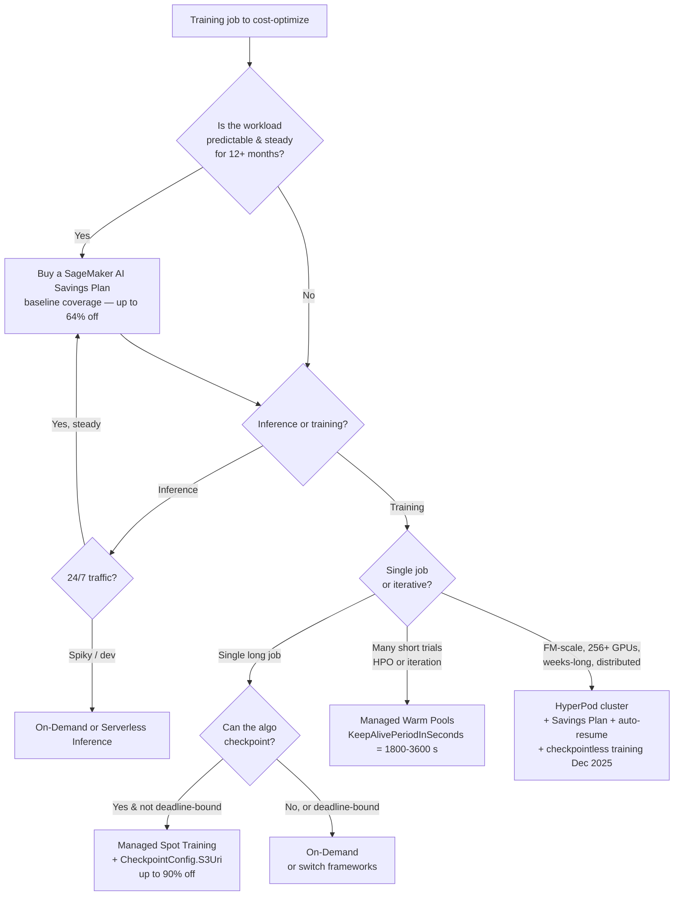
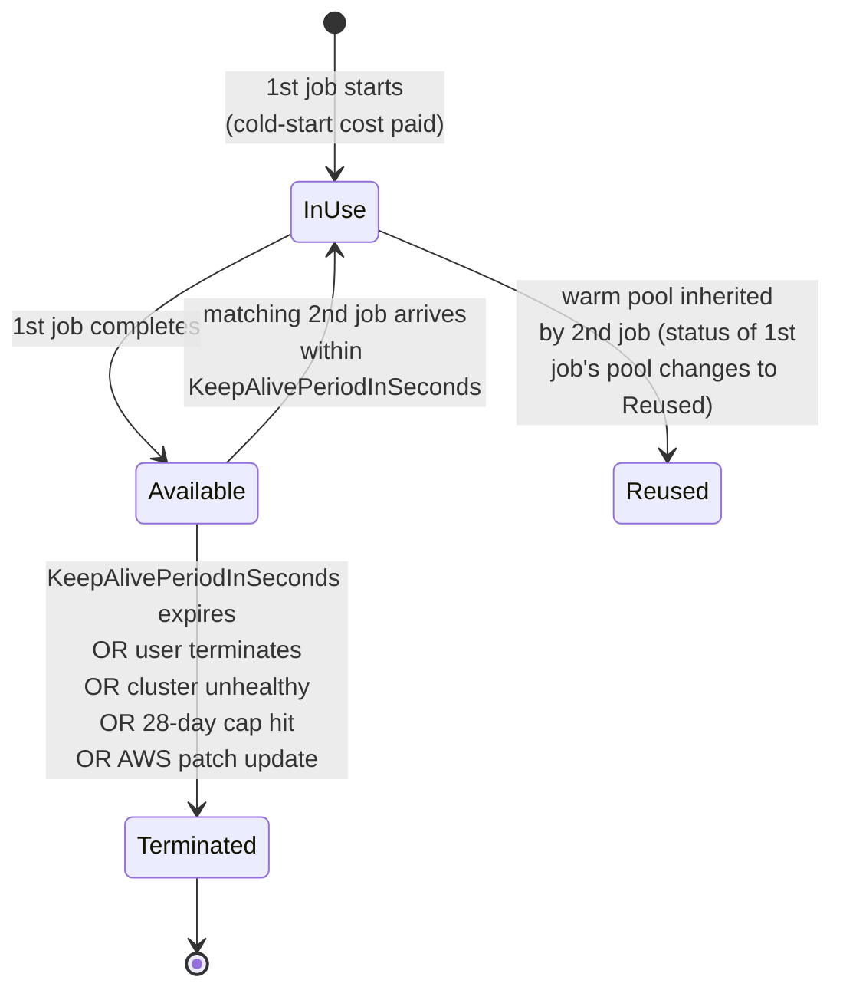

# Chapter 33 — Spot Training, Managed Warm Pools, Checkpointing

> **Goal of this chapter:** to make you fluent in the three SageMaker training-cost levers that don't change your model code — **(a) Managed Spot Training** (run on reclaimable EC2 capacity for up to ~90 % off), **(b) Managed Warm Pools** (keep a cluster hot between jobs to kill the 5–10 minute cold-start), and **(c) Checkpointing** (the discipline that makes Spot survivable and lets HyperPod / re-tries pick up where they left off). By the end of the chapter you should be able to look at a training scenario — *"this XGBoost job takes 14 hours and gets re-run nightly"* or *"I'm doing iterative experimentation on a 7B-parameter fine-tune and waiting 8 minutes per launch"* — and (1) decide between On-Demand / Spot / Warm-Pool / HyperPod / Savings Plans, (2) compute the savings from `BillableTimeInSeconds / TrainingTimeInSeconds`, (3) set `CheckpointConfig` and `MaxWaitTimeInSeconds` correctly, and (4) recognize the half-dozen exam traps (mutually-exclusive Spot+WarmPool, the 3600-second `KeepAlivePeriodInSeconds` per-job cap, the 28-day chain cap, the 1-hour `MaxWaitTime` cap for non-checkpointing built-ins, the absence of "Reserved Instances for SageMaker"). The exam will ask you about API names and caps; production will ask you something quieter — *why did we just lose 12 hours of training to one Spot interrupt?* — and that question always traces back to the same answer.
>
> **Primary internal sources:** `notes/01_sagemaker_core.md` §4.6–§4.8, `notes/ch33_docs.md`, `notes/ch33_practice.md`.
> **Exam tasks targeted:** **Task 2.2** ("perform hyperparameter tuning" — warm pools as the iterative-speed lever for HPO); **Task 3.2** ("Provision and maintain compute resources" — Spot/warm-pool/HyperPod lifecycle decisions); **Task 4.2** ("Optimizing infrastructure costs by selecting purchasing options — Spot Instances, On-Demand Instances, Reserved Instances, SageMaker AI Savings Plans"). Forward to [Ch 34 (training cost-modelling)](34_training_cost.md) and [Ch 57 (cost optimization patterns)](../part_j_ai_services_genai/57_cost_optimization.md); back to [Ch 22 (Studio + training-job lifecycle)](../part_e_model_development/22_studio_lifecycle.md) and [Ch 32 (distributed training)](32_distributed_training.md).

---

## 33.0 The setup: $4,693 every time a P5 instance flakes out

It is the third Wednesday of the quarter and you are looking at a Slack channel called `#ml-cost-burn`. The platform team has plotted the previous month's `BillableTimeInSeconds` against `TrainingTimeInSeconds` across every SageMaker training job in the account. Two clusters of jobs stand out. The first is a cohort of nightly XGBoost retrains that ran for ~6 hours each, **were billed for ~6 hours each**, and produced a savings ratio of 0.0 %. The second is a cohort of foundation-model pre-training runs on `ml.p5.48xlarge` (256-node) clusters that ran for ~22 days each, **were billed for ~22 days each plus ~46 hours of re-do compute from 14 separate node failures**, at a per-failure cost of [**$4,693**](https://aws.amazon.com/blogs/machine-learning/checkpointless-training-on-amazon-sagemaker-hyperpod-production-scale-training-with-faster-fault-recovery/) in re-done work — about $65K of pure waste in the quarter.

Both cohorts are leaving 70 %+ of the available savings on the table. Neither team is incompetent; both are missing the same load-bearing primitive. The nightly XGBoost jobs are running On-Demand because the team has heard that *Spot is risky*. The foundation-model team has Spot turned off because their cluster is too big to interrupt, but they are checkpointing every 60 minutes when they should be checkpointing every 10 — and every node failure costs them an hour of re-do work that a 10-minute checkpoint cadence would have bounded at 10 minutes.

This chapter is about flipping both of those decisions to the right setting. Three knobs do the work:

| Lever                       | What it cuts                                                                                              | What it costs you                                              | Hard cap                                                              |
| --------------------------- | --------------------------------------------------------------------------------------------------------- | -------------------------------------------------------------- | --------------------------------------------------------------------- |
| **Managed Spot Training**   | Per-second instance price — up to 90 % off                                                                | Wall-clock becomes a random variable; you must checkpoint      | ~90 % savings ceiling                                                 |
| **Managed Warm Pools**      | Cold-start latency (5–10 min provision + ECR pull + EBS mount)                                            | You pay for kept-warm idle EC2 at On-Demand rate               | `KeepAlivePeriodInSeconds ≤ 3600 s` per job; 28-day chained lifetime |
| **Checkpointing**           | Re-do cost when something dies (Spot reclaim, HyperPod node repair, NCCL/EFA fault)                       | Engineering effort + small S3 storage                          | None — pure win whenever you need it                                  |

And one critical exam-trap relationship that the next 700 lines will hammer:

> **Spot and Warm Pools are mutually exclusive.** You cannot set `EnableManagedSpotTraining=True` *and* `ResourceConfig.KeepAlivePeriodInSeconds > 0` on the same training job. The exam tests this directly, in approximately every practice form. Memorize it now.



Section 33.1 covers Spot. Section 33.2 covers Warm Pools. Section 33.3 covers Checkpointing — the discipline both Spot and HyperPod sit on top of. Section 33.4 wires it all into the broader purchasing-option landscape (Savings Plans, On-Demand Capacity Reservations, the conspicuous absence of "Reserved Instances for SageMaker"). Section 33.5 covers HyperPod's December-2025 *checkpointless training* primitive. Section 33.6 is a production-grade code example. Section 33.7 is exercises.

---

## 33.1 Managed Spot Training

### 33.1.1 What it actually is

**Definition (AWS verbatim).** *"Amazon SageMaker AI makes it easy to train machine learning models using managed Amazon EC2 Spot instances. Managed spot training can optimize the cost of training models up to 90 % over on-demand instances. SageMaker AI manages the Spot interruptions on your behalf."* (Source: AWS docs, [Managed Spot Training in Amazon SageMaker AI](https://docs.aws.amazon.com/sagemaker/latest/dg/model-managed-spot-training.html).)

Read that carefully — SageMaker is *not* exposing raw EC2 Spot to your code. It runs your training container on Spot capacity *and* handles reclaim events behind the API:

1. Spot capacity disappears (EC2 fires a 2-minute interrupt notice to the SageMaker control plane).
2. SageMaker sends `SIGTERM` to your training process and pauses the job. The instance is reclaimed.
3. SageMaker enters a **wait** state and tries to re-acquire matching Spot capacity. The clock spent in this wait counts against `MaxWaitTimeInSeconds`.
4. When capacity reappears (or `MaxWaitTimeInSeconds` expires), SageMaker re-launches the container, **pulls your latest checkpoint from `CheckpointConfig.S3Uri` into `/opt/ml/checkpoints/` before your entrypoint runs**, and re-invokes the entry point. Your script is expected to detect the checkpoint files on disk and resume from them.
5. If `MaxWaitTimeInSeconds` is exhausted before completion, the job fails.

If your code does **not** checkpoint, every interrupt restarts training from scratch — and you have effectively bought volatility for no benefit. This is the single most-told horror story in ML-platform Slack channels: *"We ran an overnight job on Spot, hit one interruption near the end, no checkpoint, lost the entire run."*

### 33.1.2 The API surface

The contract is three parameters on `CreateTrainingJob` plus a `CheckpointConfig` block:

| Parameter                                            | Type   | Purpose                                                                                  | Constraint                                                                             |
| ---------------------------------------------------- | ------ | ---------------------------------------------------------------------------------------- | -------------------------------------------------------------------------------------- |
| `EnableManagedSpotTraining`                          | bool   | Opt in. Defaults to `False`.                                                             | —                                                                                      |
| `StoppingCondition.MaxRuntimeInSeconds`              | int    | Max **billable** runtime — what your code actually spends doing compute.                 | Must be ≤ the region's max (28 days for most regions).                                 |
| `StoppingCondition.MaxWaitTimeInSeconds`             | int    | Max **wall-clock** time including Spot waits and re-acquisitions.                        | **Must be ≥ `MaxRuntimeInSeconds`.**                                                  |
| `CheckpointConfig.S3Uri`                             | string | S3 prefix that is two-way synced against the local checkpoint directory.                 | Required (effectively) for any non-trivial Spot job.                                   |
| `CheckpointConfig.LocalPath`                         | string | Override the default checkpoint directory.                                               | Optional; default is `/opt/ml/checkpoints/`. Rarely changed.                           |

The savings calculation, straight from AWS:

> *"You can calculate the savings from using managed spot training using the formula `(1 − (BillableTimeInSeconds / TrainingTimeInSeconds)) × 100`. For example, if BillableTimeInSeconds is 100 and TrainingTimeInSeconds is 500, this means that your training job ran for 500 seconds, but you were billed for only 100 seconds. Your savings is (1 − (100 / 500)) × 100 = 80 %."*

Both metrics are emitted to CloudWatch and visible in the `DescribeTrainingJob` response. **Know this formula cold for the exam** — it is the single most-tested numeric fact in the chapter's scope. The two failure modes the formula exposes:

- `BillableTimeInSeconds == TrainingTimeInSeconds` → 0 % savings — you forgot the boolean.
- `TrainingTimeInSeconds` much larger than `MaxRuntimeInSeconds` → most of the wall-clock was spent waiting for Spot capacity, not running. Your wait-to-run ratio is too low; raise `MaxWaitTimeInSeconds` (or accept that capacity for this instance type is thin).

### 33.1.3 The Python SDK example

```python
from sagemaker.pytorch import PyTorch
import sagemaker

estimator = PyTorch(
    entry_point="train.py",
    source_dir="src/",
    role=sagemaker.get_execution_role(),
    framework_version="2.1",
    py_version="py310",
    instance_type="ml.g5.2xlarge",
    instance_count=1,

    # ---- Managed Spot ----
    use_spot_instances=True,         # → EnableManagedSpotTraining=True
    max_run=24 * 3600,               # → MaxRuntimeInSeconds (24h actual training)
    max_wait=48 * 3600,              # → MaxWaitTimeInSeconds (48h wall-clock envelope)

    # ---- Checkpointing (required for Spot of any meaningful length) ----
    checkpoint_s3_uri="s3://my-bucket/checkpoints/run-001/",
    checkpoint_local_path="/opt/ml/checkpoints/",   # default; shown for clarity

    hyperparameters={"epochs": 50, "batch-size": 256},
)
estimator.fit({"train": "s3://my-bucket/data/train/"})
```

SDK → API name map (memorize these — the exam tests both vocabularies):

- `use_spot_instances` → `EnableManagedSpotTraining`
- `max_run` → `StoppingCondition.MaxRuntimeInSeconds`
- `max_wait` → `StoppingCondition.MaxWaitTimeInSeconds`
- `checkpoint_s3_uri` → `CheckpointConfig.S3Uri`
- `checkpoint_local_path` → `CheckpointConfig.LocalPath`

### 33.1.4 The `MaxWaitTimeInSeconds` invariant — memorize all three sub-rules

This is the rule the exam tests in three different disguises:

1. **`MaxWaitTimeInSeconds` must be ≥ `MaxRuntimeInSeconds`.** Wait time is the *outer envelope* (compute + Spot queue waits); runtime is the *inner* compute budget. If you set wait < runtime, the API rejects the job at submission. The AWS-recommended ratio is `max_wait = 2 × max_run` for normal jobs and looser (3–4×) for scarce instance types like `p5.48xlarge`.
2. **For built-in algorithms and Marketplace algorithms that do not checkpoint**, `MaxWaitTimeInSeconds` is capped at **3600 seconds (60 minutes)**. From the docs verbatim: *"SageMaker AI built-in algorithms and marketplace algorithms that do not checkpoint are currently limited to a `MaxWaitTimeInSeconds` of 3600 seconds (60 minutes)."* The logic: without checkpointing, every interrupt restarts the job, and a long Spot wait on a job that restarts from zero is pure waste.
3. **The wait time includes time spent re-acquiring capacity after an interrupt**, not just initial queue time. A job that gets interrupted three times accrues all three re-acquisition waits against the same `MaxWaitTimeInSeconds` budget. Set the envelope generously.

> ⚠️ **Exam alert — the `MaxWaitTime > MaxRuntime` invariant.** This relationship has three names in the wild — *"max-wait ≥ max-run"*, *"the wait envelope is the outer bound"*, *"the wait window includes Spot reacquisition"*. Whichever phrasing the exam uses, the underlying fact is the same: `MaxWaitTimeInSeconds ≥ MaxRuntimeInSeconds`, with `MaxWaitTimeInSeconds` capped at 3600 s for non-checkpointing built-ins / Marketplace algorithms. Get this one wrong and you fail any Spot question on the form.

### 33.1.5 What "supported" actually means by framework

From the AWS docs, the algorithms and frameworks that ship checkpointing **without script changes**:

| Layer                       | Auto-checkpointing supported                                                                                            |
| --------------------------- | ----------------------------------------------------------------------------------------------------------------------- |
| Deep Learning Containers    | TensorFlow, PyTorch, MXNet, HuggingFace (HF requires you to pass the checkpoint output path as a hyperparameter)         |
| Built-in algorithms         | Image Classification, Object Detection, Semantic Segmentation, XGBoost ≥ 0.90-1                                          |
| BYO container               | You wire it yourself — save to `/opt/ml/checkpoints/` and detect-and-load from `/opt/ml/checkpoints/` at the start of `main()` |

A pre-built algorithm that does **not** support checkpointing in a managed-Spot job triggers the 1-hour `MaxWaitTime` cap mentioned above.

For XGBoost in framework (script) mode, you must bring your own checkpoint logic via `xgb.callback.TrainingCheckPoint`. Only XGBoost in **built-in algorithm mode** ships auto-checkpointing.

### 33.1.6 The Cinnamon AI 70 % case — one boolean and an S3 sync

The headline savings number is real. Cinnamon AI, a Tokyo-based NLP startup building the Flax Scanner document-reader product, [reported a 70 % reduction in EC2 training costs](https://aws.amazon.com/blogs/machine-learning/cinnamon-ai-saves-70-on-ml-model-training-costs-with-amazon-sagemaker-managed-spot-training/) after enabling Managed Spot Training, and a 40 % increase in the number of daily training jobs they could run on the same budget. The second number is the more interesting one — Spot doesn't just save money on the work you were already doing; it changes the calculus on which experiments are worth running.

The Cinnamon timeline tells the story:

| Phase           | Configuration                                              | Cost baseline |
| --------------- | ---------------------------------------------------------- | ------------- |
| June 2019       | On-prem + multi-cloud, self-managed GPUs                   | 100 %         |
| October 2019    | Migrated to SageMaker, On-Demand instances                 | ~80 % (−20 %) |
| November 2019   | Enabled Managed Spot Training                              | ~30 % (−70 %) |

Two-thirds of the savings came from flipping a single boolean (`use_spot_instances=True`). The model mix was unremarkable — TensorFlow, PyTorch, Keras, P2 and P3 GPU instances, datasets from 100 MB to 40 GB. The *checkpoint discipline* was the unlock. From the AWS writeup: *"Amazon SageMaker automatically copied checkpoint data to S3, enabling interrupted training jobs to resume from the last saved state rather than restarting completely."*

That sentence is the whole game. Without checkpointing, a Spot interruption is a full restart — and on a 12-hour training job, the *expected* restart cost approaches the on-demand price as interruption rates climb. With checkpointing every 10–15 minutes, the worst-case lost work is bounded and the expected savings track the steady-state Spot discount.

### 33.1.7 Compatibility constraints — the exam gotchas

These are bullet-point exam material. Memorize:

1. **Mutually exclusive with Managed Warm Pools.** From the Warm Pools doc verbatim: *"SageMaker AI managed warm pools cannot be used with spot instances."*
2. **Not supported on heterogeneous clusters** (mixed CPU/GPU instance groups in a single training job).
3. **Compatible with Automatic Model Tuning (AMT / HPO).** Set `use_spot_instances=True` on the child training-job definition inside `CreateHyperParameterTuningJob`. Every child trial becomes a Spot job. See §33.4.6.
4. **Compatible with distributed training** — but checkpoint coordination becomes your problem (see §33.3.4). Each rank typically writes to a rank-specific subprefix to avoid race conditions.
5. **Compatible with SageMaker Debugger and Profiler**, with the caveat that the rule side-car keeps running while the training instance is being re-acquired — you continue to pay for the side-car during waits (≈ $0.05/hr on `ml.t3.medium`, negligible but real).
6. **Compatible with VPC mode / network isolation / KMS encryption** — Spot doesn't change networking or security posture.
7. **Not for inference.** Spot is training-only. Real-time inference endpoints cannot run on Spot, ever. The inference equivalents for cost optimization are auto-scaling + Savings Plans + (for batch-style traffic) Serverless or Async Inference. *"Use Spot for a real-time endpoint"* is a perennial trap answer; reject it on sight.

### 33.1.8 When Spot is the wrong answer

- Real-time / deadline-bound training (interactive demo prep, "must finish by 5 PM").
- Jobs whose checkpoint write cost is comparable to a re-run (a 5-minute job with multi-GB checkpoints — the S3 write overhead dwarfs the savings).
- HyperPod jobs — HyperPod uses *persistent* clusters; its resilience model handles node failure differently (job auto-resume against the same cluster), so you don't layer managed-Spot on top.
- Scarce-capacity instance types in busy regions. `p4de.24xlarge` and `p5.48xlarge` Spot capacity is famously thin in many regions; a Spot job may sit in wait indefinitely. Default to On-Demand or a Reserved-capacity ODCR for these (§33.4.3).

### 33.1.9 The Spot interrupt protocol — what happens in those 2 minutes

For Managed Spot Training, SageMaker handles the interruption protocol automatically:

1. EC2 catches the 2-minute interrupt warning.
2. SageMaker sends `SIGTERM` to the training process inside the container.
3. SageMaker waits for the process to flush — limited window, finish your in-flight checkpoint *fast*.
4. The container is torn down and the Spot instance is reclaimed.
5. SageMaker requests new Spot capacity (within the remaining `MaxWaitTimeInSeconds` budget).
6. The container is restarted on the new instance; SageMaker pulls the last checkpoint from S3 into `/opt/ml/checkpoints/` before your entry point runs.

Your job is to do exactly one thing well: **write checkpoints frequently enough that the 2-minute window doesn't matter much.** A SIGTERM handler that triggers an emergency checkpoint write is optional polish — it can bring the worst case from "checkpoint interval" to "max(time-since-last-checkpoint, emergency-write-time)" — but is no substitute for a reasonable steady-state cadence. Pattern:

```python
import signal, sys

def graceful_shutdown(signum, frame):
    print(f"Got signal {signum}; writing emergency checkpoint")
    atomic_save(state, "/opt/ml/checkpoints/emergency.pt")
    sys.exit(0)

signal.signal(signal.SIGTERM, graceful_shutdown)
```

Spot interrupts in 2025/2026 are almost always **capacity-based** (AWS needs the capacity back for an On-Demand or Reserved customer), not price-based — AWS moved to predictable Spot pricing in 2017 and price-based interrupts have become rare. Practical interruption rates from the [Spot Instance Advisor](https://aws.amazon.com/ec2/spot/instance-advisor/):

- CPU instances (c5, m5, r5) in major US regions: usually < 5 % (rated *very low*).
- Older GPU instances (p2, p3.2xlarge): 5–10 % (rated *low*), highly region-dependent.
- Modern GPU instances (p4d, p4de, p5): often 15–20 %+ in popular regions — on-demand pressure is intense.
- G-series inference instances (g5): 5–10 % outside peak hours.

For a 24-hour single-node job on `p5.48xlarge` in a busy region, plan for 3–6 interrupts. For a 7-day distributed job, the math gets uncomfortable — which is exactly why HyperPod auto-resume and checkpointless training exist for that workload class (§33.5).

---

## 33.2 Managed Warm Pools

### 33.2.1 What it actually is

**Definition (AWS verbatim).** *"SageMaker AI managed warm pools let you retain and reuse provisioned infrastructure after the completion of a training job to reduce latency for repetitive workloads, such as iterative experimentation or running many jobs consecutively. Subsequent training jobs that match specified parameters run on the retained warm pool infrastructure, which speeds up start times by reducing the time spent provisioning resources."* (Source: AWS docs, [SageMaker AI Managed Warm Pools](https://docs.aws.amazon.com/sagemaker/latest/dg/train-warm-pools.html).)

The cold-start a warm pool eliminates is roughly **5–10 minutes per job** in typical workloads. The [AWS warm-pools best-practices blog](https://aws.amazon.com/blogs/machine-learning/best-practices-for-amazon-sagemaker-training-managed-warm-pools/) reports the P90 startup latency drops from 136–176 seconds (cold) to under 20 seconds (warm) — roughly an **8× improvement**.

| Phase                                                | Cold-start cost | Warm-pool cost            |
| ---------------------------------------------------- | --------------- | ------------------------- |
| Instance provisioning (EC2 ASG launch)               | 60–180 s        | 0                         |
| EBS attach + format                                  | 20–60 s         | 0                         |
| Container pull from ECR (DLC images can be multi-GB) | 60–300 s        | 0 (already on local disk) |
| Container start + entrypoint init                    | 20–60 s         | 5–20 s (no re-pull)       |
| **Total**                                            | **~2.5–10 min** | **~5–20 s**               |

For a single 12-hour job, this is rounding error. For a 50-trial HPO run launching 10-minute trials, this is the difference between a 4-hour and a 12-hour tuning session.

### 33.2.2 The warm-pool lifecycle — a finite-state machine you should know



Statuses surfaced in `DescribeTrainingJob → WarmPoolStatus`:

- `InUse` — actively running a training job.
- `Available` — job done, pool kept warm, waiting for next match.
- `Reused` — pool migrated to a subsequent matching job.
- `Terminated` — pool gone; further jobs cold-start.

### 33.2.3 The matching criteria — this is what the exam tests

For job *N+1* to "inherit" the warm pool from job *N*, **all** of these must be identical:

- `RoleArn`
- `ResourceConfig`:
  - `InstanceCount`
  - `InstanceType`
  - `VolumeKmsKeyId`
  - `VolumeSizeInGB`
- `VpcConfig`:
  - `SecurityGroupIds`
  - `Subnets`
- `EnableInterContainerTrafficEncryption`
- `EnableNetworkIsolation`
- `SessionChainingConfig.EnableSessionTagChaining` (when used; session keys must match too)

What is **not** required to match — i.e., you can vary between jobs and still inherit the pool:

- Training image / container (you can swap images between jobs — the pool is just EC2 + EBS).
- Hyperparameters.
- Input data channels.
- Output paths.
- Algorithm specification.

This makes warm pools especially useful for (a) **iterative experimentation on the same script** with different hyperparameters and (b) **HPO**, where every trial uses the same image and resource config but different hyperparameters.

### 33.2.4 The duration caps — memorize both

Two caps, two scopes:

1. **Per-job cap: `KeepAlivePeriodInSeconds ≤ 3600 s (60 min).`** This is the max idle time *after* one job finishes before the pool spins down on its own.
2. **End-to-end cap: 28 days.** Even with continuous job-to-job chaining, a single warm-pool cluster terminates after 28 days for patching.

If you don't set `KeepAlivePeriodInSeconds` at all, the pool spins down immediately after the job completes — i.e., no warm pool.

### 33.2.5 The persistent cache directory — underused but exam-relevant

SageMaker mounts a special directory inside the warm pool that survives across reuses:

- **Path:** `/opt/ml/sagemaker/warmpoolcache`
- **Environment variable:** `SAGEMAKER_MANAGED_WARMPOOL_CACHE_DIRECTORY`
- **Use cases (from AWS docs):**
  - pip / conda dependency cache — set `PIP_CACHE_DIR=/opt/ml/sagemaker/warmpoolcache/pip` to skip re-downloading wheels on every job.
  - Checkpoint cache — faster than an S3 round-trip when you know the next job is going to inherit.
  - Any intermediate data you want to re-use across jobs.
- **Lifetime:** tied to the warm pool — deleted when the pool terminates.

```python
from sagemaker.tensorflow import TensorFlow

estimator = TensorFlow(
    entry_point="train.py",
    framework_version="2.12",
    py_version="py310",
    instance_type="ml.g4dn.xlarge",
    instance_count=1,
    volume_size=250,

    # ---- Warm Pool ----
    keep_alive_period_in_seconds=1800,   # keep warm 30 min after job

    environment={
        # Persistent pip cache survives across jobs in this warm pool
        "PIP_CACHE_DIR": "/opt/ml/sagemaker/warmpoolcache/pip",
    },
)
```

### 33.2.6 The billing model — what you're actually paying for

> *"SageMaker AI managed warm pools are a billable resource."*

You pay for the instance hours the pool is kept warm at the **same per-second On-Demand rate** as the underlying instance type. There is no Spot discount for warm pools (they are mutually exclusive with Spot — see §33.2.7). If you set `keep_alive_period_in_seconds=3600` (1 hour) on `ml.p3.2xlarge` (~$3.83/hr) and no follow-up job arrives, you have paid ~$3.83 for an idle hour — about $3.83 down the drain.

**Break-even rule of thumb:** the warm pool pays for itself when

```
cold_start_seconds × subsequent_job_count  ≥  KeepAlivePeriodInSeconds
```

For typical 5-minute cold starts and a 30-minute keep-alive, you break even at **≥ 6 jobs** in the keep-alive window. The mature pattern from the AWS warm-pools best-practices doc:

> *"Use warm pools when you are interactively experimenting and tuning your script over a series of short jobs, doing custom hyperparameter optimization, or running a batch process that runs a large number (hundreds or thousands) of consecutive jobs on the same kind of instances on a daily or weekly cadence."*

And the corresponding *don't*:

> *"Avoid warm pools when it's unlikely that someone will reuse the warm pool before it expires."*

Reasonable defaults: **15–30 minutes** for HPO and interactive work, **60 minutes** (the cap) for batch pipelines with a known cadence, **off** for everything else.

### 33.2.7 Compatibility constraints — the exam gotchas

From the AWS Considerations section:

1. **Cannot be used with heterogeneous cluster training.**
2. **Cannot be used with Spot instances.**
3. **`KeepAlivePeriodInSeconds ≤ 3600 s (60 min)`** per job.
4. **Max 28 days** of chained reuse, even with matching jobs at every step.

Plus one not-in-the-doc-but-true: warm pools are **opt-in via quota request** in some accounts/regions. The AWS docs include a "Request a warm pool quota increase" sub-page; treat the feature as enabled-by-default on modern accounts but be aware quota limits exist.

> ⚠️ **Exam alert — Spot and Warm Pools are mutually exclusive.** `EnableManagedSpotTraining=True` *and* `ResourceConfig.KeepAlivePeriodInSeconds > 0` on the same training job is a `ValidationException`. The intuition: a warm pool requires SageMaker to hold a specific instance for you, which contradicts the Spot model where the instance can be reclaimed at any moment. The exam loves to bait you with an answer like *"use managed warm pools with Spot for maximum savings"* — reject it on sight.

### 33.2.8 AMT (HPO) integration — automatic warm pools since 2022

Since 2022, **Automatic Model Tuning automatically uses warm pools** when configured. For sequential strategies (Bayesian), this is a big win — each subsequent trial inherits the warm pool from the previous one, avoiding cold-start on every step. For parallel strategies (Random, Hyperband), the benefit is per-pool not per-trial.

You typically don't need to set `KeepAlivePeriodInSeconds` explicitly on AMT — the tuning job sets it on your behalf. The mature HPO pattern (covered in [Ch 32](32_distributed_training.md) and Ch 34) combines:

- **Warm pools** for short trials (< 5 min each, where cold-start dominates).
- **Spot** for long trials (> 30 min each, where the discount dwarfs cold-start).
- **On-Demand or warm pool** for the *final* full-length training run with the winning hyperparameters, where you want predictable wall-clock and no interrupts.

### 33.2.9 The decision rule — warm pool vs Spot in one sentence

Internalize this as a one-liner:

> **Use warm pools for trials shorter than ~5 minutes (an 8× P90 startup speedup matters); use Spot for trials longer than ~30 minutes (the 70–90 % discount dominates). Between 5 and 30 minutes, model the math job-by-job.**

The 5-minute threshold comes from the 2.5–10-minute cold-start range — if your trial is shorter than the cold-start, the cold-start dominates and warm pool is the right answer. The 30-minute threshold comes from the asymptotic dominance of the Spot discount once the per-trial work is large enough that occasional interrupts amortize.

---

## 33.3 Checkpointing — the load-bearing primitive

### 33.3.1 What it actually is

**Definition (AWS verbatim).** *"Use checkpoints in Amazon SageMaker AI to save the state of machine learning (ML) models during training. Checkpoints are snapshots of the model and can be configured by the callback functions of ML frameworks. You can use the saved checkpoints to restart a training job from the last saved checkpoint."* (Source: AWS docs, [Checkpoints in Amazon SageMaker AI](https://docs.aws.amazon.com/sagemaker/latest/dg/model-checkpoints.html).)

The mechanism, end-to-end:

1. You set `CheckpointConfig.S3Uri` and (optionally) `CheckpointConfig.LocalPath` (default `/opt/ml/checkpoints/`) when creating the training job.
2. At job start, SageMaker copies any existing files from the S3 prefix into the local path **before** your entry point runs. This is what makes resume-from-checkpoint possible.
3. While the job runs, SageMaker's checkpoint sidecar **continuously syncs** new files written to the local path into the S3 prefix.
4. If a checkpoint is **deleted** locally, it is also deleted in S3 (the sync is two-way mirror, not append-only).
5. On retry (Spot resume, HyperPod auto-resume, or manual re-run with the same `CheckpointConfig.S3Uri`), the cycle repeats from step 2.

A subtle point: **checkpoints added to S3 *after* the job starts are NOT copied into the training container.** Sync is one-way (container → S3) once the job is running. You cannot "inject" a checkpoint mid-job.

### 33.3.2 The "no checkpoint → 12 hours lost" failure mode

The math is straightforward. For a 12-hour training job that hits a single Spot interrupt near the end:

| Checkpoint interval | Worst-case lost work                                  | Wall-clock recovery |
| ------------------- | ----------------------------------------------------- | ------------------- |
| None                | 12 hours                                              | 12 hours            |
| Every 60 minutes    | 60 min + restart overhead (~5 min)                    | ~65 min             |
| Every 15 minutes    | 15 min + restart overhead                             | ~20 min             |
| Every 5 minutes     | 5 min + restart overhead **but** write overhead high  | varies              |

The trade-off is the cost of *writing* the checkpoint vs the expected cost of *losing* work. For a 70B-parameter foundation model, a checkpoint is roughly 500 GB (fp16) and writing it to S3 over the network is non-trivial — minutes, not seconds. For a 100M-parameter fine-tune, the checkpoint is small enough to write every step if you want. Most production teams converge on:

- **Every 10–20 minutes** for mid-sized models.
- **Every 30 minutes** for FM-scale runs.
- Reduce frequency if checkpoint write time exceeds 5 % of training time.

A common ops KPI: **worst-case interrupt loss ≤ 30 minutes**. Pick a checkpoint cadence that satisfies it.

### 33.3.3 Atomic checkpointing — the part nobody writes about until it bites them

The subtler failure mode is a checkpoint that *was* written, but written **non-atomically** — the file was being flushed when the interrupt hit, and now you have a half-written `model.pt` on disk and S3 that is structurally invalid. PyTorch's `torch.save()` is *not* atomic by default; if the process is killed mid-write, you get a truncated pickle file that throws on load. The [PyTorch Lightning team fixed this in mid-2024](https://github.com/Lightning-AI/pytorch-lightning/pull/20011) — the canonical atomic-save pattern looks like:

```python
import os, torch, tempfile

def atomic_save(state, final_path):
    dir_ = os.path.dirname(final_path)
    fd, tmp = tempfile.mkstemp(dir=dir_, prefix=".ckpt-", suffix=".tmp")
    os.close(fd)
    try:
        torch.save(state, tmp)
        os.replace(tmp, final_path)  # POSIX: atomic on same filesystem
    except Exception:
        if os.path.exists(tmp):
            os.remove(tmp)
        raise
```

The key primitive is `os.replace()`, which is atomic on POSIX filesystems (and on Windows since Python 3.3). Write to `.tmp`, fsync, rename. If the process dies between the write and the rename, the rename never happens and the final file is untouched — a previous valid checkpoint survives.

For SageMaker Managed Spot specifically, the `/opt/ml/checkpoints/ → S3` sync is one-way and continuous — files that appear in the local directory are uploaded to S3 in the background. If you write a checkpoint non-atomically, the S3 sync can pick up the partially-written file and upload *that*. Always write to a staging path first and rename into the watched directory once the write is complete:

```python
ckpt_dir = "/opt/ml/checkpoints"
staging = os.path.join(ckpt_dir, ".staging")
os.makedirs(staging, exist_ok=True)

# Inside the training loop, every N steps:
state = {
    "model": model.state_dict(),
    "optimizer": optimizer.state_dict(),     # Adam moments, etc.
    "scheduler": scheduler.state_dict(),     # LR schedule progress
    "scaler": scaler.state_dict() if scaler else None,  # AMP grad scaler
    "step": step,
    "epoch": epoch,
    "rng_state": torch.get_rng_state(),
    "cuda_rng_state": torch.cuda.get_rng_state_all(),
}
tmp   = os.path.join(staging,  f"ckpt-{step}.pt")
final = os.path.join(ckpt_dir, f"ckpt-{step}.pt")
torch.save(state, tmp)
os.replace(tmp, final)

# Keep only the last 3 checkpoints to bound S3 cost
import glob
for old in sorted(glob.glob(f"{ckpt_dir}/ckpt-*.pt"))[:-3]:
    os.remove(old)   # SageMaker sidecar will mirror the deletion to S3
```

Three best-practice patterns embedded above — memorize all three:

1. **Atomic write** via `os.replace()` from a staged `.tmp` file. Prevents partial-write checkpoints when the SIGTERM fires *during* `torch.save()`.
2. **Save full state, not just weights.** Optimizer state (Adam first/second moments), scheduler state, AMP `GradScaler` state, RNG state for both CPU and CUDA — without these, resume-from-checkpoint is a *near-restart*, not a true resume. The training loss will spike for several steps as the optimizer re-learns its moments — a common production *silent failure* where the job "recovers" but takes longer to converge than it should.
3. **Bound the checkpoint count.** S3 storage is not free, and on a 12-hour run writing every 10 minutes you will accumulate 72 checkpoints. Keep the last 3 (or last 1 + a `best.pt` selected on val metric) and delete the rest. The SageMaker sidecar mirrors the deletion to S3.

> ⚠️ **Exam alert — atomic checkpointing is required for safe Spot resume.** The exam will not test `os.replace()` directly, but it tests the principle in two phrasings: *"a Spot training job resumed from a corrupted checkpoint and failed — what should the team have done?"* (atomic-write the checkpoints) and *"a resumed job's loss curve has a discontinuity — what's the most likely cause?"* (the checkpoint saved `model.state_dict()` only; resume lost the optimizer momentum). If you see either phrasing, the answer is the atomic-write + full-state pattern above.

A fourth practice worth calling out: **test the restore path before you need it.** A common production failure: the code path that loads the checkpoint has a subtle bug (wrong device map, missing buffer registration, dtype mismatch) that is never exercised because no one has ever actually restarted from a checkpoint. Make a CI test that trains for 3 steps, kills the process, restarts from the checkpoint, and verifies the loss curve continues smoothly.

### 33.3.4 Distributed training and checkpoint coordination

From the AWS Considerations:

> *"To avoid overwrites in distributed training with multiple instances, you must manually configure the checkpoint file names and paths in your training script. The high-level SageMaker AI checkpoint configuration specifies a single Amazon S3 location without additional suffixes or prefixes to tag checkpoints from multiple instances."*

Translation: SageMaker syncs `/opt/ml/checkpoints/` to a single S3 prefix per training job. If you have 8 nodes and each one writes `epoch-5.pt`, they overwrite each other.

Two patterns to fix it (also covered in [Ch 32](32_distributed_training.md)):

1. **Rank-0-only writes.** In data-parallel training, only rank 0 has the canonical model copy. Have rank 0 write `epoch-5.pt`; other ranks skip the save. (This is what SageMaker Model Parallel does internally.)
2. **Rank-suffixed paths.** In model-parallel / FSDP-sharded training, each rank holds a *shard* of the model. Each writes to a rank-specific filename: `epoch-5.rank-{rank}.pt`. Resume code reassembles the shards.

For PyTorch FSDP with full state dict on rank 0, pattern 1 is enough; for FSDP with sharded state dict, pattern 2 is required.

### 33.3.5 S3 Express One Zone for checkpoints

A 2024-era feature worth knowing: `CheckpointConfig.S3Uri` can point at an **S3 directory bucket** (S3 Express One Zone) instead of a general-purpose bucket. This gives you much lower latency for large checkpoint writes — useful for foundation-model training where a single checkpoint can be tens-to-hundreds of GB.

**Catch (verbatim from docs):** *"S3 directory buckets that are integrated with SageMaker AI can only be encrypted with server-side encryption with Amazon S3 managed keys (SSE-S3). Server-side encryption with AWS KMS keys (SSE-KMS) is not currently supported."*

If your compliance regime requires KMS-managed encryption on checkpoints (most regulated-finance and healthtech shops do), you cannot use S3 Express One Zone — fall back to a general-purpose bucket with SSE-KMS.

### 33.3.6 Why HyperPod needs checkpointing too

HyperPod's **job auto-resume** watches for node failures (NCCL/EFA failures, ECC memory errors), automatically replaces the failed node, and restarts the job. For auto-resume to do anything useful, the job must resume from a checkpoint — otherwise auto-resume just re-runs from scratch. The same `CheckpointConfig.S3Uri` mechanism applies (HyperPod runs SageMaker training under the hood for the resilience layer). The HyperPod story is what Section 33.5 picks up.

---

## 33.4 The wider purchasing-options landscape (Task 4.2)

The exam guide phrases Task 4.2 as *"Optimizing infrastructure costs by selecting purchasing options (e.g., Spot Instances, On-Demand Instances, Reserved Instances, SageMaker AI Savings Plans)."* You need to **cross-compare** all four — and one of those four is a trick because it doesn't exist for SageMaker.

### 33.4.1 The full comparison table

| Option                          | Best for                                                          | Discount vs On-Demand | Commitment                       | Caveats                                                                                                       |
| ------------------------------- | ----------------------------------------------------------------- | --------------------- | -------------------------------- | ------------------------------------------------------------------------------------------------------------- |
| **On-Demand**                   | Unpredictable workloads, short jobs, dev/test                     | 0 % (baseline)        | None                             | Default; safe but expensive                                                                                   |
| **Managed Spot**                | Long, checkpointable, delay-tolerant training                     | Up to ~90 %           | None per-job; you bear risk      | Requires checkpointing; capacity not guaranteed; training-only                                                |
| **SageMaker AI Savings Plans**  | Predictable steady-state SageMaker compute                        | Up to **64 %**        | 1 or 3 years                     | Commitment is in `$/hr` of compute spend; covers Studio, Training, Real-Time Inference, Batch Transform       |
| **EC2 Reserved Instances**      | Self-hosted EC2 — **not SageMaker-managed**                       | Up to ~72 %           | 1 or 3 years                     | **Do not apply to SageMaker-managed instances**. If you self-host on EKS/EC2, RIs apply; for SageMaker, use SP |
| **On-Demand Capacity Reservations (ODCRs)** | Guaranteed capacity in a specific AZ for scarce instance types | 0 % (no discount)     | None                             | Provides *capacity certainty*, not a discount. Can be paired with SP to layer the discount on top.            |
| **Managed Warm Pools**          | Iterative experimentation / HPO / many short jobs                 | 0 % per-second        | None                             | Pay full price for kept-warm idle time; mutually exclusive with Spot                                          |
| **HyperPod (persistent cluster)** | Foundation-model training, multi-week distributed jobs            | Same per-instance rates; resilience layer is free | Cluster persists until you delete | Auto-resume requires checkpointing; combine with SP for committed-use discount                                |

### 33.4.2 SageMaker AI Savings Plans — what they actually cover

From [the AWS pricing page](https://aws.amazon.com/savingsplans/ml-pricing/):

- **Commitment:** a fixed `$/hour` for **1 year** or **3 years**, with No Upfront, Partial Upfront, or All Upfront payment options.
- **Discount:** up to **64 %** off On-Demand.
- **Coverage:** Studio Notebook, On-Demand Notebook, Processing, Data Wrangler, Training, Real-Time Inference, Batch Transform — essentially everything SageMaker that bills hourly.
- **Flexibility:** usage can shift across instance types, families, and regions while still consuming the commitment (unlike a hard EC2 Reserved Instance).
- **Overage:** usage beyond the commitment is billed at On-Demand rates.

The mental model: you are prepaying for `$X/hr` of "SageMaker time" in exchange for a discount. If you actually use that amount (or more), you save 30–64 % on the covered portion. If you under-use, you are paying for capacity you didn't consume.

The workload patterns where Savings Plans win:

1. **24/7 real-time inference endpoints.** An `ml.g5.xlarge` endpoint serving production traffic for a year is the textbook SP case — predictable, sustained, no Spot tolerance.
2. **Daily/weekly batch transform pipelines with a known cadence.** You will run 2 hours of `ml.m5.4xlarge` every night for the year; commit and save.
3. **Always-on Studio domains for a data-science team.** 50 data scientists on `ml.t3.medium` notebooks during business hours adds up.
4. **Steady SageMaker Processing usage** for feature-engineering pipelines.

The patterns where SP is wrong:

1. **Training workloads with high month-to-month variance.** If you train a lot one month, nothing the next, an SP commitment is wasted in the off months.
2. **Workloads that can use Spot.** A 70 % Spot discount beats a 64 % SP discount — and you can use both on different workloads (see §33.4.4).
3. **Workloads you are not sure will exist in 12 months.** A team about to migrate to Bedrock, or a model that might be deprecated, should not be on a 3-year commit.

### 33.4.3 No "Reserved Instances for SageMaker" — only ODCRs for capacity guarantees

This deserves its own callout because exam writers love it:

> **There is no Reserved Instance offering for SageMaker.** The only commitment-based discount product for SageMaker is the Savings Plan.

What there *is*:

- **EC2 Reserved Instances:** do not apply to SageMaker. SageMaker runs on EC2 under the hood but bills you for a different SKU. RIs are a discount mechanism on EC2 itself.
- **SageMaker Savings Plans:** the commitment-based *discount* product, covered in §33.4.2.
- **On-Demand Capacity Reservations (ODCRs):** these *do* apply to SageMaker for specific scenarios — you reserve capacity in a specific AZ for a specific instance type to *guarantee availability*, and you can pair an ODCR with a Savings Plan to layer the SP discount onto the reserved capacity. ODCRs do not themselves provide a discount; they provide *capacity certainty*. The canonical use case: a regulated-finance shop that needs `ml.p5.48xlarge` capacity available in `us-east-1a` for a planned multi-day training run, and is unwilling to risk the Spot capacity-not-available outcome.

> ⚠️ **Exam alert — no RIs for SageMaker, only Savings Plans.** When an exam scenario says *"the team wants to commit to a 3-year discount on their SageMaker training spend"*, the answer is **SageMaker AI Savings Plans**, not Reserved Instances. The bait answer is always *"buy EC2 Reserved Instances to discount your SageMaker workload"* — wrong, because RIs don't apply to SageMaker-managed instances. The other bait is *"buy a SageMaker Reserved Instance"* — wrong, no such product exists.

### 33.4.4 Combining Savings Plans and Spot — the mature pattern

The mature production pattern: **Savings Plans for the always-on floor, Spot for the burstable ceiling.**

- Your always-on `ml.g5.xlarge` inference endpoint, your daily batch-transform pipeline, your Studio domain — all covered by a Savings Plan. These are predictable, steady, and cannot use Spot anyway (inference is training-only? — *Spot is* training-only, inference is not eligible).
- Your overnight training sweeps, HPO runs, and nightly retrains — all use Managed Spot. These are training-only, delay-tolerant, and checkpointable.

These use **entirely separate pricing mechanisms** — Spot discounts apply to the raw training cost; SP discounts apply to the On-Demand rate after the Spot decision. They don't conflict and they don't stack: Spot training already has its own discount; SP does not further discount Spot. But they cover different workloads, so you can have both products active in the same account without conflict.

### 33.4.5 The selection decision rule, distilled

Five rules, in order of importance:

1. **For SageMaker-managed compute, prefer SageMaker AI Savings Plans over EC2 Reserved Instances.** Savings Plans cover SageMaker-managed training, processing, inference (real-time and batch transform), and Studio notebooks. EC2 RIs do not apply to instances launched by the SageMaker service.
2. **Warm Pools and Spot are mutually exclusive.** Stated several times in this chapter because it shows up on approximately every exam form.
3. **Spot is "delay-tolerant only."** If the question has a deadline or SLA constraint, Spot is wrong even if it is cheapest.
4. **Spot is training-only.** Real-time inference endpoints cannot run on Spot.
5. **ODCRs are for capacity certainty, not discount.** Pair with SP to add the discount.

### 33.4.6 Spot for HPO — the multiplier effect

The single best fit for Managed Spot Training is **hyperparameter tuning jobs**. The reasons compound:

1. **Each trial is independent.** An interrupt to trial 47 does not affect trials 1–46 or 48–200.
2. **SageMaker AMT natively supports Spot.** Set `use_spot_instances=True` on the estimator passed to the `HyperparameterTuner`; every child training job runs on Spot.
3. **Multiple trials run in parallel.** Set `max_parallel_jobs=10`, get 10 simultaneous Spot bids — the savings stack.
4. **Early stopping kills bad trials before interrupts have a chance to bite.** Bayesian or Hyperband will kill 60–80 % of your trials early anyway; an interrupt on a trial you were about to stop costs you nothing.
5. **Cumulative savings dwarf any single-job overhead.** A 200-trial HPO run on Spot at 70 % savings vs On-Demand is hundreds-to-thousands of dollars per sweep depending on the model.

Mature pattern (covered in Ch 32 and Ch 34):

- **Hyperband or Bayesian + early stopping + Spot** for the broad HPO sweep.
- **On-Demand or warm pool** for the final, full-length training run with the winning config — where you want predictable wall-clock, no interrupts.

Watch out for one HPO + Spot edge case: if `MaxWaitTimeInSeconds` is set tight and Spot capacity dries up partway through your tuning job, some trials fail with capacity errors rather than running, and SageMaker counts those against `MaxNumberOfTrainingJobs` even though they didn't actually produce a useful evaluation. Set `MaxWaitTimeInSeconds` generously (3–4× `MaxRuntimeInSeconds`) for HPO jobs.

---

## 33.5 HyperPod's checkpointless training — the December-2025 shift

This is the most important shift in SageMaker training since Spot, and it landed at re:Invent in [December 2025](https://aws.amazon.com/blogs/aws/introducing-checkpointless-and-elastic-training-on-amazon-sagemaker-hyperpod/). The problem it solves: at foundation-model scale, traditional checkpointing breaks down.

### 33.5.1 The motivating $4,693 number

From the [AWS blog](https://aws.amazon.com/blogs/machine-learning/checkpointless-training-on-amazon-sagemaker-hyperpod-production-scale-training-with-faster-fault-recovery/):

> *A pre-training workload on a HyperPod cluster with 256 P5 instances, checkpointing every 20 minutes, faces two challenges when disrupted: 10 minutes of lost work plus 10 minutes for recovery. With `ml.p5.48xlarge` instances costing $55 per hour, each disruption costs **$4,693** in compute time. For a month-long training, daily disruptions would accumulate to **$141,000 in extra costs and delay completion by 10 hours**.*

That is a real number for a single mid-sized FM run. For Anthropic, OpenAI, or Amazon themselves training a frontier model on thousands of GPUs over months, the disruption cost scales linearly and becomes a major P&L line.

### 33.5.2 How checkpointless training works — peer-to-peer state replication

Traditional checkpointing writes model state to durable storage (S3, FSx). Recovery reads it back. The latency is dominated by storage I/O, and at 500 GB checkpoints, that is minutes per recovery.

Checkpointless training replaces storage with *peers*. Each GPU in the cluster maintains a redundant copy of its model state on a peer GPU, transferred over the EFA fabric. When a node fails, the recovering process pulls state from a healthy peer in seconds instead of from S3 in minutes. The five architectural pieces from the AWS blog:

1. **Rootless NCCL initialization** — eliminates the centralized TCP bottleneck (seconds vs tens of minutes).
2. **Memory-mapped data loading** — preserves cached data across process restarts.
3. **In-process recovery** — isolates failures to individual processes; healthy processes continue training without restarting.
4. **Peer-to-peer state replication** — state transfers over EFA in seconds vs storage I/O in minutes.
5. **HyperPod training operator** — orchestrates recovery with intelligent escalation (process → peer → node).

The recovery-time results AWS published:

| Cluster size              | Traditional recovery | Checkpointless recovery | Speedup |
| ------------------------- | -------------------- | ----------------------- | ------- |
| 16 GPUs (fine-tune)       | 5 min 10 sec         | 50 sec                  | ~6×     |
| 256 GPUs (Llama-3 70B)    | 4 min 52 sec         | 47 sec                  | ~6×     |
| **2,304 GPUs (H100)**     | **15–30 min**        | **< 2 min**             | **7–15×** |

The 2-minute number on the 2,304-GPU H100 cluster is the most-cited figure from the announcement — it is what enables **over 95 % goodput** (productive training time as a fraction of wall-clock) on clusters that historically struggled to hit 80 %. Across the spectrum, AWS quotes an **80–93 % recovery-time reduction** vs traditional checkpointing.

### 33.5.3 Elastic training — the companion feature

Launched alongside checkpointless training, **elastic training** lets a training job automatically expand to use available accelerators and contract when capacity is needed elsewhere — *without restarting*. The system monitors cluster state via pod lifecycle events, node availability, and scheduler signals, scaling by adding/removing data-parallel replicas rather than terminating jobs. This is the part that changes capacity planning. Historically, you sized a cluster, started a job, and the cluster size was fixed for the run. Elastic training lets the cluster size float — useful for tenants sharing a HyperPod across teams, or for ramping up gradually as more capacity becomes available.

### 33.5.4 What the exam expects of you on checkpointless training

The MLA-C01 exam blueprint predates December 2025, so you probably will not see *"checkpointless training"* by name as an exam term yet. But you will see HyperPod listed as the right answer for *"long-running, distributed, fault-tolerant FM training"* — and you should be able to articulate *why*. The 80–93 % recovery speedup, > 95 % goodput at 2304 GPUs, and the $4,693/failure cost-avoidance number are the talking points for the next interview loop. For the exam, the answer pattern is: *FM-scale, weeks-long, distributed, hardware-fault-tolerant → HyperPod with auto-resume (and increasingly checkpointless training)*.

---

## 33.6 Putting it together — a production-grade Spot + checkpointing pattern

A realistic, exam-quality "best-practice" job spec for a long-running custom PyTorch fine-tune on 4 × `ml.g5.12xlarge` with Spot + atomic-checkpoint:

```python
from sagemaker.pytorch import PyTorch
import sagemaker

session = sagemaker.Session()
role    = sagemaker.get_execution_role()

estimator = PyTorch(
    entry_point="train.py",
    source_dir="src/",
    role=role,
    framework_version="2.1",
    py_version="py310",

    instance_type="ml.g5.12xlarge",
    instance_count=4,
    distribution={"torch_distributed": {"enabled": True}},

    # ---- Cost lever: Managed Spot ----
    use_spot_instances=True,
    max_run=36 * 3600,           # 36h actual training budget
    max_wait=72 * 3600,          # 72h wall-clock envelope (2x — accommodates Spot waits)

    # ---- Resilience: Checkpointing ----
    checkpoint_s3_uri=f"s3://{session.default_bucket()}/checkpoints/llm-finetune-v3/",
    checkpoint_local_path="/opt/ml/checkpoints/",

    # ---- Reproducibility ----
    hyperparameters={
        "epochs": 8,
        "batch-size": 32,
        "lr": 5e-5,
        "checkpoint-every-steps": 500,
        "checkpoint-retention": 3,
    },

    # ---- Observability ----
    enable_sagemaker_metrics=True,
    metric_definitions=[
        {"Name": "train:loss", "Regex": "train_loss=([0-9.]+)"},
        {"Name": "val:loss",   "Regex": "val_loss=([0-9.]+)"},
    ],
)

estimator.fit({
    "train": "s3://bucket/train/",
    "val":   "s3://bucket/val/",
})
```

The corresponding `train.py` must:

1. Look for existing checkpoints in `/opt/ml/checkpoints/` at start and resume if any are found (this is what makes Spot resume work).
2. Save full state (model + optimizer + scheduler + scaler + RNG) every `checkpoint-every-steps`.
3. Use atomic writes (`.staging/.tmp → os.replace()`) — never write the canonical file directly.
4. In distributed mode, only rank 0 writes the canonical checkpoint (or each rank writes a rank-suffixed shard for FSDP-sharded state).
5. Retain only the most recent `checkpoint-retention` checkpoints; delete older ones locally — the SageMaker sync mirrors the deletion to S3.
6. Install a `SIGTERM` handler that triggers an emergency checkpoint write before exiting.

This pattern combines: Managed Spot (~70 % cost cut on GPU spend), Checkpointing (resume safely after interrupts), and atomic-write best practice (no corrupt checkpoints to resume from). Drop it in for any long custom-PyTorch training run; it is the canonical "did this right" answer.

The savings you should see at job completion: `(1 − BillableTimeInSeconds / TrainingTimeInSeconds) × 100`, surfaced in `DescribeTrainingJob` output. Chart this in your platform cost dashboards as the actual Spot savings rate per job — it is the only number that tells you the lever is on and working.

---

## 33.7 Exercises

Work each of these end-to-end before moving on to [Ch 34 (training-cost modelling)](34_training_cost.md). Solutions are not provided here — write them out, then check against the docs and the §33.1–§33.5 explanations.

1. **The $50K-quarter audit.** You inherit an account where the last quarter's `BillableTimeInSeconds / TrainingTimeInSeconds` ratio across all training jobs is 1.0 (i.e., 0 % savings). Walk through the diagnostic checklist you would run, in order. What three settings would you check first, and what is the order of operations to turn things on safely?

2. **The MaxWaitTime puzzle.** A nightly XGBoost retrain on a built-in algorithm runs for 4 hours on On-Demand. The team enables Spot and sets `max_run=4*3600`, `max_wait=4*3600`. The API rejects the job. What error are they seeing, why, and what is the smallest correct fix? *Hint: there are two distinct constraints in play.*

3. **The HPO trial-length crossover.** Your team is running an HPO sweep of 200 trials. Trials currently take 12 minutes each (median). You are deciding between (a) warm pools with `KeepAlivePeriodInSeconds=1800` and (b) Spot with `max_wait=2*max_run`. Calculate the break-even trial length at which Spot starts to dominate (assume a 6-minute cold-start, 20 % Spot interruption rate, 70 % Spot discount). What if trials are 4 minutes? 45 minutes?

4. **The checkpoint cadence trade-off.** Your 24-hour custom-PyTorch training run on `ml.g5.12xlarge` (4 nodes) writes a 12 GB checkpoint that takes 90 seconds to flush to S3. The expected Spot interruption rate over 24 hours is 15 %. Compute the optimal checkpoint cadence (interval that minimizes total expected wall-clock = training time + lost-work expectation + checkpoint-write overhead). Show your work. *Hint: the answer is not "every 5 minutes."*

5. **The warm-pool inheritance trap.** Job A finishes with `KeepAlivePeriodInSeconds=1800`. Five minutes later you submit Job B with: same `RoleArn`, same `InstanceCount` (2), same `InstanceType` (`ml.g5.xlarge`), same `VolumeSizeInGB` (200), same `SecurityGroupIds` and `Subnets`, same `EnableInterContainerTrafficEncryption=True`, same `EnableNetworkIsolation=False` — but a different `VolumeKmsKeyId`. Does Job B inherit the warm pool? Why or why not? What `DescribeTrainingJob.WarmPoolStatus` field tells you?

6. **The mutually-exclusive trap.** A teammate proposes the following config for a 200-trial HPO sweep of 8-minute trials, claiming it stacks the cost savings of Spot with the latency savings of warm pools:
   ```python
   tuner = HyperparameterTuner(
       estimator=PyTorch(..., use_spot_instances=True,
                          keep_alive_period_in_seconds=1800,
                          max_wait=3600, max_run=600),
       ...
   )
   ```
   What happens when you submit this? Quote the underlying API constraint and the doc sentence that disqualifies the config. What is the right answer for this workload?

7. **The reserved-instance bait.** A finance team has $200K of unused EC2 Reserved Instance commitment expiring in 6 months on `m5.xlarge` instances. They want to use it to discount their SageMaker training jobs that run on `ml.m5.xlarge`. Will the RI discount apply to the SageMaker workload? If not, what *would* let them get a similar discount on the SageMaker spend? (Bonus: what cheap test could the team run in 15 minutes to confirm the billing behavior before committing?)

---

## 33.8 Chapter summary

The four facts to commit to memory before the exam:

1. **Spot savings formula:** `(1 − BillableTimeInSeconds / TrainingTimeInSeconds) × 100`. Both metrics live in `DescribeTrainingJob`. Up to ~90 % savings ceiling.
2. **`MaxWaitTimeInSeconds ≥ MaxRuntimeInSeconds`** always; capped at 3600 s for non-checkpointing built-ins. `CheckpointConfig.S3Uri` is effectively required for any non-trivial Spot job; default local path is `/opt/ml/checkpoints/`.
3. **Warm Pools and Spot are mutually exclusive.** `KeepAlivePeriodInSeconds ≤ 3600 s` per job; 28-day chain cap; persistent cache at `/opt/ml/sagemaker/warmpoolcache`; warm pools are billed at full On-Demand rate while warm.
4. **No Reserved Instances for SageMaker — only Savings Plans** (up to 64 %, 1 or 3 year, covers Studio, Training, Real-Time Inference, Batch Transform). ODCRs provide *capacity certainty*, not discount; can pair with SP. SP for the always-on floor; Spot for the burstable training ceiling.

Plus the decision rule:

> **Warm pool for trials shorter than ~5 min (8× P90 startup speedup matters); Spot for trials longer than ~30 min (the 70–90 % discount dominates); HyperPod with checkpointless training for FM-scale weeks-long distributed runs ($4,693/failure avoidance, > 95 % goodput at 2304 GPUs).**

And the load-bearing primitive: **atomic checkpointing** with full state (`model + optimizer + scheduler + scaler + RNG`) via `os.replace()` from a staged `.tmp` file. Without it, every other lever in this chapter is theoretical. With it, your nightly XGBoost retrain costs 30 % of what it did last month and your foundation-model run survives node failures in seconds instead of hours.

Next up: [Ch 34 — Training cost modelling](34_training_cost.md) puts numbers on the trade-offs in this chapter; [Ch 57 — Cost optimization patterns](../part_j_ai_services_genai/57_cost_optimization.md) generalizes them across the whole SageMaker surface.

---

## 33.9 References

Primary AWS docs (all fetched for this chapter):

- [Managed Spot Training in Amazon SageMaker AI](https://docs.aws.amazon.com/sagemaker/latest/dg/model-managed-spot-training.html) — `EnableManagedSpotTraining`, `MaxWaitTimeInSeconds`, the savings formula, supported algorithms.
- [SageMaker AI Managed Warm Pools](https://docs.aws.amazon.com/sagemaker/latest/dg/train-warm-pools.html) — `KeepAlivePeriodInSeconds`, matching criteria, persistent cache, lifecycle states.
- [Checkpoints in Amazon SageMaker AI](https://docs.aws.amazon.com/sagemaker/latest/dg/model-checkpoints.html) — `CheckpointConfig.S3Uri / LocalPath`, supported frameworks, distributed-training caveats, S3 Express One Zone.
- [Machine Learning Savings Plans (AWS pricing)](https://aws.amazon.com/savingsplans/ml-pricing/) — coverage, commitment terms, up-to-64 % discount.
- [Cinnamon AI saves 70 % on ML training costs with Managed Spot Training](https://aws.amazon.com/blogs/machine-learning/cinnamon-ai-saves-70-on-ml-model-training-costs-with-amazon-sagemaker-managed-spot-training/) — the 70 % case study.
- [Best practices for SageMaker Training Managed Warm Pools](https://aws.amazon.com/blogs/machine-learning/best-practices-for-amazon-sagemaker-training-managed-warm-pools/) — the 8× P90 startup-speedup figure and the when-to-use guidance.
- [Checkpointless training on Amazon SageMaker HyperPod](https://aws.amazon.com/blogs/machine-learning/checkpointless-training-on-amazon-sagemaker-hyperpod-production-scale-training-with-faster-fault-recovery/) — the $4,693/failure number, 80–93 % recovery reduction, 2-min/2304-GPU benchmark.
- [Introducing checkpointless and elastic training on SageMaker HyperPod](https://aws.amazon.com/blogs/aws/introducing-checkpointless-and-elastic-training-on-amazon-sagemaker-hyperpod/) — the December-2025 announcement.
- [Spot Instance interruptions (EC2 Docs)](https://docs.aws.amazon.com/AWSEC2/latest/UserGuide/spot-interruptions.html) — capacity vs price-based interrupts.
- [Automatic model tuning with SageMaker AI](https://docs.aws.amazon.com/sagemaker/latest/dg/automatic-model-tuning.html) — Spot and warm-pool integration with AMT.
- [Add atomic save to checkpoint routine (PyTorch Lightning PR #20011)](https://github.com/Lightning-AI/pytorch-lightning/pull/20011) — the canonical atomic-write fix that production teams converge on.

Adjacent chapters in this textbook:

- [Ch 22 — Studio + training-job lifecycle](../part_e_model_development/22_studio_lifecycle.md) — the underlying training-job API surface this chapter builds on.
- [Ch 32 — Distributed training](32_distributed_training.md) — the FSDP / rank-coordination context for the §33.3.4 distributed-checkpoint patterns.
- [Ch 34 — Training cost modelling](34_training_cost.md) — puts numbers on the trade-offs in this chapter.
- [Ch 57 — Cost optimization across SageMaker](../part_j_ai_services_genai/57_cost_optimization.md) — generalizes the §33.4 purchasing-options decision rule to the whole platform.

API reference cross-links:

- `CreateTrainingJob` request — `EnableManagedSpotTraining`, `StoppingCondition.{MaxRuntimeInSeconds, MaxWaitTimeInSeconds}`, `ResourceConfig.KeepAlivePeriodInSeconds`, `CheckpointConfig.{S3Uri, LocalPath}`.
- `DescribeTrainingJob` response — `BillableTimeInSeconds`, `TrainingTimeInSeconds`, `WarmPoolStatus.{Status, ResourceRetainedBillableTimeInSeconds, ReusedByJob}`.

Exam-guide alignment:

- **Task 2.2** — perform hyperparameter tuning (warm pools as the iterative-speed lever).
- **Task 3.2** — provision and maintain compute resources (Spot / warm-pool / HyperPod lifecycle).
- **Task 4.2** — optimizing infrastructure costs by selecting purchasing options (Spot / On-Demand / Reserved / Savings Plans — the cross-comparison in §33.4).
