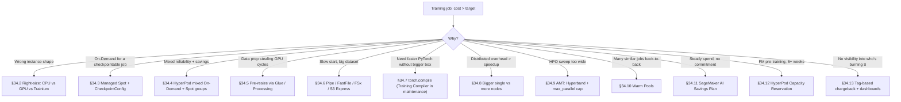
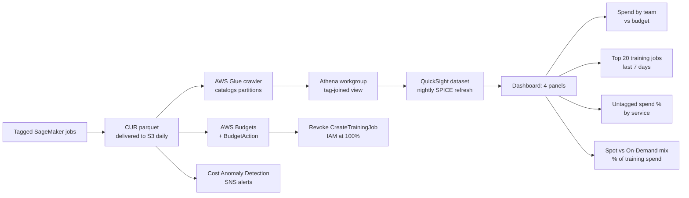

# Chapter 34 — Training-Cost Optimization Patterns

> **Goal of this chapter.** To make you fluent in the *training-side* cost surface of SageMaker — fluent enough that a stem like *"nightly retraining of a 7-B model on 1 TB of S3 data, finish before 6 a.m., halve last month's bill"* produces a confident answer in under thirty seconds. This is the **synthesis** chapter for Part F: it pulls together right-sizing (Ch 29), distributed training (Ch 32), Spot + checkpointing (Ch 33), Automatic Model Tuning (Ch 31), input modes (Ch 14), Warm Pools, Savings Plans, HyperPod reservations, and tag-based attribution into a single mental model. By the end you should be able to walk into the **Task 4.2** ("Optimizing costs and setting cost quotas by using appropriate cost management tools") block of MLA-C01 and treat every cost stem as a composition exercise instead of a vocabulary quiz.
>
> **Where this chapter sits.** Cost optimization lives in **Domain 4 — ML Solutions Lifecycle** (~24% of the exam). Task 4.2 is the headline; Task 3.2 (provision and maintain compute, recognize over-provisioning) and Task 2.2 (training-job orchestration that touches Spot, distributed, Warm Pools) trail in. The training-side surface in this chapter is the deliberate counterpart of the *inference-side* cost chapter forward in Part H — **Ch 57 (cost optimization for inference)** — and feeds **Ch 58 (cost observability)**, which builds the FinOps dashboards on top of the attribution patterns we lay down here. Back-references: **Ch 31** for AMT mechanics, **Ch 32** for distributed-training topologies, **Ch 33** for the deep dive on Spot and checkpointing.
>
> **What this chapter is *not*.** It is not the deployment-side cost chapter. The famous "$5 endpoint" trap — a forgotten real-time endpoint that quietly bills 24×7 at idle — belongs to inference, not training. Training jobs are inherently transient: they terminate when the script returns. The training-side traps are different (forgotten Warm Pools, runaway `MaxRuntimeInSeconds`, oversized EBS volumes, idle HyperPod clusters) and we'll catalogue them in §15.

---

## 34.1 The training-cost equation, in one line

Every "lowest-cost training" stem reduces to the same equation. Memorise it; the rest of this chapter is a guided tour of each term.

```
Job_cost = Σ_i (instance_type_rate_i × instance_count_i × billable_hours_i)
         + EBS / NVMe storage charges (GB-hours)
         + Data-transfer charges (cross-region or cross-AZ S3 / FSx I/O)
         + Warm-pool keep-alive charges (if KeepAlivePeriodInSeconds > 0)
         + Side-car charges (Debugger rule evaluator, Profiler, MLflow tracking server)
```

Three of those four primary levers are tunable per-job (type, count, hours). The fourth (rate) is tunable only via **purchase model** — On-Demand vs Managed Spot vs Savings Plan vs HyperPod Capacity Reservation. The exam loves to test compositions across these four levers in a single stem — and almost every "wrong" distractor is a correct answer for a *different* composition.



| Lever | Knob | Typical max saving | Section |
|---|---|---|---|
| Instance type | family + size + accelerator | 30–80% (p4d → g5 when it fits) | §34.2 |
| Instance count | distributed vs single-node | 10–60% when comms overhead dominates | §34.8 |
| Billable hours | Managed Spot Training | **up to 90%** | §34.3 |
| Billable hours | Warm Pool (skip cold start) | 1–10 min per consecutive job × per-instance rate | §34.10 |
| Billable hours | Pre-resize + Pipe/FastFile | 5–30% from lower I/O wait | §§34.5–6 |
| Billable hours | AMT Hyperband + parallel cap | 30–70% on HPO sweeps | §34.9 |
| Rate | SageMaker AI Savings Plan | **up to 64%** | §34.11 |
| Rate | HyperPod Capacity Reservation | 30–60% on 1y / 3y commits | §34.12 |
| Storage | Right-size `VolumeSizeInGB` | small per-job, large per-account | §34.15 |

Two operational rules of thumb survive every cost question:

1. **Three of four primary cost levers are job-local; the fourth is a purchase decision.** Don't conflate them. "Switch to Savings Plan" is not a substitute for "switch to FastFile mode."
2. **The cheapest training run is the one you don't run.** Local mode for the first 5–10 iterations, FastFile preview reads on the first 100 records, and the fail-fast Debugger rules from Ch 30 prevent expensive bad jobs before they start.

---

## 34.2 Right-sizing training instances

### 34.2.1 CPU vs GPU vs Trainium vs Inferentia — *for training*

The instance-family choice is the largest single cost lever, and it's the one most teams get wrong. The mental model:

| Family | Backing silicon | Best training workload | Watch-out |
|---|---|---|---|
| `ml.m5 / ml.m6i / ml.c5 / ml.c6i` | Intel general / compute | Classical ML (XGBoost, sklearn, LightGBM, Linear Learner, RCF), small NNs | No GPU — anything CNN/transformer is 5–50× slower than `g5`. |
| `ml.r5 / ml.r6i` | Intel memory-optimized | Wide-table classical models, in-memory feature stores during training | Rarely the cheapest training answer. |
| `ml.g4dn / ml.g5 / ml.g6` | NVIDIA T4 / A10G / L4 | Small-to-mid deep-learning training (vision, BERT-base, 7-B LoRA fine-tune) | **Default GPU training answer when the stem says "fine-tune."** |
| `ml.p3 / ml.p4d / ml.p5 / ml.p5e / ml.p5en` | NVIDIA V100 / A100 / H100 / H200 | Large-model pre-training, multi-node distributed of 13-B+ models | Expensive; only correct when the stem demands A100/H100 throughput, NVLink, or 80–141 GB HBM per GPU. |
| `ml.trn1 / ml.trn1n / ml.trn2` | AWS Trainium / Trainium2 | Large-model training (LLMs, ViT) at lower $/FLOP than p4d/p5 | Requires Neuron SDK; the stem usually says "lowest cost training of an LLM on SageMaker" or "Trainium." |
| `ml.inf1 / ml.inf2` | AWS Inferentia / Inferentia2 | **Not for training — inference only** | Trap answer: if a stem asks "cheapest training of an LLM" and `inf2` is offered, it's wrong. Use `trn1/trn2` for training, `inf2` for inference. |

The five one-liner decision rules to walk into the exam with:

- *"Cheapest training of a tabular XGBoost model on 100 GB."* → `ml.m5.4xlarge` or `ml.c5.9xlarge`. Built-in XGBoost uses CPU well; GPUs are wasted spend here.
- *"Fine-tune a Hugging Face BERT-base on 50 GB of text."* → `ml.g5.2xlarge`. A single A10G is sufficient; A100 is overkill.
- *"Pre-train a 13-B parameter model from scratch."* → distributed `ml.p4d.24xlarge` or `ml.trn1.32xlarge`. Trainium wins on $/token when the toolchain supports Neuron.
- *"Cheapest training of an LLM on SageMaker, willing to use AWS silicon."* → `ml.trn1/trn2`.
- *"Halve training time, willing to pay more."* → step up generation (p3 → p4d → p5) or add nodes — but check §34.8 first because the right answer is sometimes "one bigger instance."

### 34.2.2 When smaller is actually better

A common stem trap: "training takes 3 hours on `ml.p3.16xlarge`, optimize cost." The naive answer is "scale to `ml.p4d.24xlarge`." But if GPU utilization on the p3 was already 38% (look for Profiler hints in the stem), the model fits on a *smaller* instance and you're paying for cores you aren't using. The correct optimization order:

1. **Profile first.** SageMaker Profiler (Ch 30) tells you GPU utilization, CPU vs IO vs framework bottleneck.
2. **If GPU < 50%,** the bottleneck is data loading or pre-processing — fix that (§§34.5–6) *before* paying for more GPU.
3. **If GPU > 80% and the model fits in memory,** scale up (bigger instance) or scale out (more instances) — but compare §34.8.
4. **If memory is tight and GPU is high,** that's where p5/p5e/trn1 with bigger HBM win.

The exam often pairs the "smaller is better" answer with a Profiler hint in the stem. When the hint is there, the right answer is "right-size down" — not "buy more silicon."

### 34.2.3 The g4dn / g5 / p4d decision the right-sizing flow surfaces

AWS's own Part 4 training-cost blog flags two instance families as best-buy for general-purpose training:

- **`ml.g4dn`** (NVIDIA T4): lowest cost per memory; best for inference or memory-bound training.
- **`ml.g5`** (NVIDIA A10G): lowest cost per fp32 CUDA FLOP; the default for fine-tuning workloads up to ~13 B parameters.

The right-sizing flow at scale (covered in §34.13) almost always surfaces a recommendation like "you're running a 7-B LoRA fine-tune on `p4d.24xlarge` because someone copied a notebook. The same job runs in 1.4× the wall-clock on `g5.48xlarge` at one-third the cost." That single recommendation is where most of the cost savings in a mature ML org live — not in the Spot-vs-On-Demand axis, not in the Savings-Plan axis, but in *the team picked the wrong instance type three months ago and never re-evaluated.*

---

## 34.3 Spot + checkpointing (pointer to Ch 33)

This section is a **recap and exam-card** of Managed Spot Training — Ch 33 is the full treatment. The headline:

> From the AWS docs: *"Amazon SageMaker AI makes it easy to train machine learning models using managed Amazon EC2 Spot instances. Managed spot training can optimize the cost of training models up to 90% over on-demand instances. SageMaker AI manages the Spot interruptions on your behalf."*

You set three knobs on `CreateTrainingJob`:

| Knob | Meaning | Required? |
|---|---|---|
| `EnableManagedSpotTraining = True` | Switch the job onto Spot capacity. | Yes |
| `StoppingCondition.MaxRuntimeInSeconds` | Hard cap on total job runtime (training only). | Yes |
| `StoppingCondition.MaxWaitTimeInSeconds` | Total wait + run; must be ≥ `MaxRuntimeInSeconds`. | Yes (Spot-specific) |
| `CheckpointConfig.S3Uri` | Where SageMaker copies checkpoints; restored on resume. | Strongly recommended |
| `CheckpointConfig.LocalPath` | Local path your script writes to (defaults to `/opt/ml/checkpoints`). | Optional |

The savings formula AWS publishes: `(1 - (BillableTimeInSeconds / TrainingTimeInSeconds)) * 100`. The marketing "90%" is the top end.

The **60-minute trap** for non-checkpointed jobs: *"SageMaker AI built-in algorithms and marketplace algorithms that do not checkpoint are currently limited to a `MaxWaitTimeInSeconds` of 3600 seconds (60 minutes)."* For any job > 60 minutes, checkpointing is mandatory.

Where Spot fits in the catalogue:

| Job type | Managed Spot supported? |
|---|---|
| Training jobs (`CreateTrainingJob`) | Yes |
| Automatic Model Tuning (`HyperparameterTuningJob`) | Yes — each trial can run on Spot |
| Processing jobs (`CreateProcessingJob`) | **No** — use On-Demand or Glue/EMR Spot |
| Endpoints (real-time / async / serverless) | **No** — never put production inference on Spot |
| HyperPod clusters | Different model — see §34.4 and §34.12 |

Spot is the *wrong* answer when:

- The job has a hard SLA (must finish by 6 a.m. for a downstream pipeline).
- The job is shorter than ~10 minutes (Spot startup overhead eats the discount).
- The algorithm has no checkpoint hook and runs > 60 minutes (hard limit).
- The workload uses a heterogeneous cluster (not supported with Spot).
- The workload depends on Warm Pools (explicitly incompatible — §34.10).

Cross-link: **Ch 33** for the full checkpoint-frequency tuning, the `boto3` request payload, and the resume-from-S3 mechanics.

---

## 34.4 Mixing Spot + On-Demand — the HyperPod resilience pattern

`CreateTrainingJob` is **all-or-nothing per job**: either the job runs entirely on Spot, or it runs entirely on On-Demand. There is no native "primary On-Demand + secondary Spot" mode on a single training job. But you can compose the pattern at the **HyperPod** or **EKS** layer for long-running clusters that host many training jobs.

- **HyperPod with mixed instance groups** (2025-era): create one instance group on On-Demand for head/controller nodes and a second instance group on Spot (or capacity blocks) for worker scale-out. HyperPod auto-resume restarts failed nodes; combined with frequent checkpointing this gives you DGL-style resilience without the all-or-nothing Spot fragility.
- **SageMaker on EKS with Karpenter**: Karpenter is configured to prefer Spot for the worker pods and fall back to On-Demand when Spot is reclaimed. This is the K8s-shop equivalent and is what mature platform teams reach for when they want fine-grained mix policies.

For the exam, the answer is one of:

- *"Lowest cost for a single one-shot training job"* → **Managed Spot Training + checkpointing.**
- *"Long-running cluster, mix On-Demand head + Spot workers, resilient to interruption"* → **HyperPod with mixed instance groups.**
- *"Kubernetes shop, want Spot/On-Demand mix on training pods"* → **SageMaker on EKS + Karpenter.**

---

## 34.5 Pre-resize datasets — don't make the training instance do data engineering

### 34.5.1 The anti-pattern

A team writes training code that reads raw 4K JPEGs from S3, resizes them to 224 × 224 inside PyTorch's `DataLoader`, then feeds the model. On `ml.g5.2xlarge` (~$1.21/hr), the GPU sits at 18% utilization waiting for CPU resize ops. They are **paying GPU rates for CPU work** — and they will keep paying every time a downstream training job runs.

### 34.5.2 The fix — move data-prep out of the training job

Push deterministic preprocessing out of training into a **SageMaker Processing job** (or AWS Glue, or EMR), run it once on cheap CPU instances, write the 224 × 224 result back to S3, and train against the pre-resized dataset.

| Step | Where it should run | Why |
|---|---|---|
| Raw collection (S3 ingest) | S3, no compute | — |
| Format conversion (JPEG → TFRecord / parquet / RecordIO) | **Processing job on `ml.m5/c5`** or Glue | One-time CPU cost; subsequent training jobs read pre-formatted data fast. |
| Resize, normalize, deterministic transforms | **Processing job** | Pay CPU once instead of GPU N times. |
| Stochastic augmentation (random crops, color jitter) | Training script | Has to be random per epoch — can't be pre-baked. |
| Feature engineering on tabular data | **Glue ETL or Processing job** | Don't pay GPU rates for SQL-shaped ops. |

### 34.5.3 The economics

For a 100-hour fine-tuning campaign across ten jobs on `ml.g5.2xlarge`, a single 2-hour pre-resize Processing job on `ml.c5.2xlarge` will:

- Cost ~$0.85 (one-time).
- Save $30–60 per training job by raising GPU utilization from 25% → 70%.
- Return its investment **100×** in the first month.

The exam pattern: *"Training jobs spend most of their time waiting on data preprocessing. What's the lowest-cost way to speed them up?"* → **SageMaker Processing job for pre-processing**, not "buy a bigger GPU instance."

---

## 34.6 Input modes — File vs Pipe vs FastFile vs FSx vs S3 Express

SageMaker supports three storage backends (S3, EFS, FSx for Lustre) and four input modes for S3. The choice changes both **start-up cost** (how long the job waits before training begins) and **steady-state throughput**.

| Mode | How data reaches the container | Start-up cost | Where it wins |
|---|---|---|---|
| **File mode** (default) | SageMaker downloads the *full* dataset to the container's local disk before training starts. | Slow: proportional to total dataset size. | Small / medium datasets that fit on disk and are read many epochs. |
| **Pipe mode** | Streamed from S3 via a named pipe (FIFO) into the training process; no on-disk copy. | Fast: training reads while data flows in. | Large datasets, sequential reads, supported algorithms (built-in algos, TF with `PipeModeDataset`). **Largely superseded by FastFile for new workloads.** |
| **FastFile mode** | POSIX-mounted view of S3; objects download **lazily on first read**. | Fast: only listing happens at job start. | Large datasets where you don't read every file every epoch, or you want File-mode simplicity without the wait. **Default new-workload choice on the exam.** |
| **Augmented manifest** | JSONL manifest enumerates objects + per-object metadata (labels). Layered on File or Pipe (not FastFile). | Same as underlying mode. | Labels are interleaved with object paths (computer vision, Ground Truth output). |

Plus the two file-system alternatives:

- **Amazon FSx for Lustre** — POSIX file system mounted into the training container. Hundreds of GB/s, millions of IOPS. Best for *repeated* training on a fixed dataset (the FSx cache amortizes across many jobs). Lives in a single AZ — pick the AZ where you train.
- **Amazon EFS** — POSIX, multi-AZ. Convenient when the data already lives in EFS (shared notebooks). Generally slower than FSx for Lustre for training.

### 34.6.1 Cost-relevant nuances from the docs

- **File mode requires enough disk to fit the entire dataset.** Training on 2 TB but the instance only has 500 GB local NVMe? You must either bump `VolumeSizeInGB` (and pay EBS) or switch to Pipe / FastFile.
- **FastFile + CloudTrail trap.** From the docs: *"Using Fast File mode might lead to increased CloudTrail costs due to additional logging of: Amazon S3 data events (if enabled in CloudTrail). AWS KMS decryption events when accessing Amazon S3 objects encrypted with AWS KMS keys."* The exam doesn't test this directly, but a careful FinOps stem could.
- **Pipe mode shrinks EBS need.** Per docs: *"When you stream the data directly, you can reduce the size of the Amazon EBS volumes used by the training instance. Pipe mode needs only enough disk space to store the final model artifacts."* So Pipe = lower `VolumeSizeInGB` = small but real savings.
- **S3 Express One Zone** is supported for File, FastFile, and Pipe modes. Single-AZ, single-digit-ms latency, higher per-GB cost but very fast — the right answer when training I/O is on a hot path and the dataset fits in one AZ.

### 34.6.2 Exam picks at a glance

| Stem | Pick |
|---|---|
| "Training startup takes 40 min because of a 2 TB S3 dataset" | **FastFile mode** (or Pipe if the algorithm requires it) |
| "Built-in algorithm, RecordIO-protobuf format, sequential reads" | **Pipe mode** (well-supported) |
| "Small CSV dataset, ~5 GB, custom PyTorch script" | **File mode** (keep it simple) |
| "Same 500 GB dataset trained every night, single AZ OK" | **FSx for Lustre**, cached from S3 |
| "Dataset shared across notebooks and training, modest scale" | **EFS** |
| "Latency-sensitive iterative training, 1 TB hot dataset, willing to pay" | **S3 Express One Zone** in the same AZ |

---

## 34.7 SageMaker Training Compiler — status and replacement

> ⚠️ **Exam alert — Training Compiler is in maintenance.** AWS has announced: *"there will be no new releases or versions of SageMaker Training Compiler. You can continue to utilize SageMaker Training Compiler through the existing AWS Deep Learning Containers (DLCs) for SageMaker Training. It is important to note that while the existing DLCs remain accessible, they will no longer receive patches or updates from AWS."* If a 2025-era stem mentions Training Compiler explicitly, recognise the name and pick it — older question pools still test it. If the stem is generic ("speed up DL training"), prefer **`torch.compile()`**, **Neuron SDK** for Trainium targets, or right-sizing + a better data pipeline (§§34.2, 34.5–6). Do not propose Training Compiler as a forward-looking architectural choice.

### What it did

Training Compiler used XLA-style graph and dataflow optimization to shrink the model memory footprint, raise the max batch size that fit on a GPU, and reduce training time on supported deep-learning models. It was "free" — no additional charge — and the win was a smaller `BillableTimeInSeconds`. Supported PyTorch and Hugging Face primarily.

### What replaces it (the forward-looking answer)

- **PyTorch 2.x native compile** (`torch.compile()`) — open-source, supported in modern DLCs, gives most of the same throughput wins without the SageMaker-specific path. **This is the answer when a 2026-era exam stem says "speed up PyTorch training without changing instance type."**
- **JAX + XLA** for teams that have moved to JAX.
- **Neuron SDK** for Trainium-targeted compilation.

---

## 34.8 Distributed vs bigger-single — the network-overhead inversion

### 34.8.1 The intuition

For sufficiently small models, **a single bigger instance beats N smaller instances** because:

- All-reduce / all-gather across N nodes pays inter-instance network latency on every gradient step.
- Single-instance multi-GPU comms use NVLink / NVSwitch (intra-instance) — orders of magnitude faster than EFA across nodes.
- Cluster launch overhead (provisioning N instances, network setup, NCCL init) is per-job — amortised worse on short runs.

### 34.8.2 The break-even rule of thumb

For a model that fits on a single instance's GPUs:

- **1 × `ml.p5.48xlarge`** (8 × H100, 640 GB HBM, intra-node NVLink) often beats **4 × `ml.p4d.24xlarge`** (32 × A100 total, 4× the network hops) on jobs under ~12 hours, **when the model fits in the p5's 640 GB**.
- Above ~12 hours, or when the model needs > 640 GB aggregate HBM, distributed wins because total throughput dominates.

For a model that does *not* fit on a single instance (large LLM pre-training), distributed is mandatory — pick your sharding strategy (FSDP, ZeRO-3, tensor parallel) per Ch 32.

### 34.8.3 The hidden cross-AZ data-transfer bill

When you scale from 1 → 16 nodes, three things happen — and one of them surprises every team the first time:

1. Compute cost goes up 16×. Expected.
2. Wall-clock time drops ~14× (never 16× because of communication overhead). Expected.
3. **A new line item appears: cross-AZ data transfer between training instances.** Surprise.

SageMaker distributed training uses NCCL on top of its Distributed Data Parallel / Sharded Data Parallel libraries. Every gradient sync is a network operation. If your 16 nodes land in three different AZs, every sync crosses an AZ boundary, and cross-AZ traffic is billed at ~$0.01/GB each direction (~$0.02/GB round trip). A 70-B model at fp16 has ~140 GB of gradients per sync. A typical fine-tune does 100,000 sync operations — 14 PB of cross-AZ traffic, ~$280,000 in transfer charges on top of compute.

SageMaker now co-locates training instances within a single AZ by default, which kills most of this, but it can still bite when:

- You explicitly enable VPC mode and your VPC spans AZs.
- You're using a custom HyperPod cluster with node groups across AZs.
- You're streaming data from S3 in a *different region* than your training cluster (cross-region transfer is worse than cross-AZ).

### 34.8.4 EFA and placement groups — what actually helps

- **Elastic Fabric Adapter (EFA)** is the high-throughput, low-latency network adapter for distributed training. Supported on `ml.p3dn.24xlarge`, `ml.p4d.24xlarge`, `ml.p5.48xlarge`, `ml.p6e-gb200.36xlarge`, and `ml.c5n.18xlarge`. **EFA has no additional cost** on SageMaker — it's bundled on the supported instance types. If your job is supposed to use EFA and isn't (container or framework misconfigured), you're paying for the capability and not using it.
- **Placement groups.** SageMaker's managed training API doesn't expose direct placement-group configuration — it manages placement implicitly. For HyperPod clusters you *can* and *should* enable cluster placement groups via the cluster definition.

### 34.8.5 Exam pattern

- *"Training takes 8 hours on 4 × p4d. Reduce cost without losing speed."* → check if the model fits on 1 × p5; if yes, **bigger single** is cheaper and faster.
- *"Training takes 48 hours on 1 × p5, model fits."* → **distributed** is now worth the network overhead.
- *"Model is too big for a single instance."* → distributed only. Pick Trainium if the toolchain supports it for the $/FLOP win.

---

## 34.9 AMT cost discipline — Hyperband, max_parallel, warm starts

### 34.9.1 The cost surface of HPO

Automatic Model Tuning launches `MaxNumberOfTrainingJobs` trials, each with different hyperparameters, using a search strategy. **AMT cost is `max_jobs × per-trial cost`, full stop.** A 200-trial Bayesian run on `g5.12xlarge` at ~$5/hour × 4 hours per trial is **$4,000 for a single tuning job.** Many teams discover this the day a junior engineer copies a notebook that used `max_jobs=200` "because the paper said 200," and the per-trial cost is 100× higher than the paper's baseline.

> ⚠️ **Exam alert — the AMT fan-out.** `MaxNumberOfParallelTrainingJobs` trades wall-clock time for peak burn rate; it does **not** reduce total cost. Three trials of 1 hour cost the same as one trial of 3 hours. Higher parallelism trips per-second AWS rate limits and per-account vCPU quotas. Big-co default: `max_parallel_jobs = 5` for fine-tunes, `max_parallel_jobs = 10` for tabular. If you see a stem with "1000 trials at `MaxNumberOfParallelTrainingJobs = 50` on `ml.p4d.24xlarge`" — that's the budget-detonator distractor.

### 34.9.2 The four search strategies, ranked by cost-efficiency

| Strategy | How it works | Cost-efficiency | When to pick |
|---|---|---|---|
| **Random** | Sample uniformly | Lowest information per dollar | Baseline only, or non-monotonic surfaces. |
| **Grid** | Exhaustive | Worst — explodes with dimensions | Almost never on the exam. |
| **Bayesian** | Surrogate model picks next trial | Good — converges in 30–80 trials | Slow, expensive trials; low parallelism. |
| **Hyperband** | Multi-fidelity: kill underperforming trials early | **Best for deep learning** — 3–10× savings vs Bayesian on long jobs | Long trials, you can rank early, parallelism budget. |

### 34.9.3 The cost knobs

- **`MaxNumberOfTrainingJobs`** — hard cap on total trials. **Set this.** Otherwise an exam stem reads "1000-trial sweep on `ml.p4d.24xlarge`" and the answer is "you exceeded the monthly budget."
- **`MaxNumberOfParallelTrainingJobs`** — parallelism cap. Lower keeps Bayesian surrogate quality high; higher is fine when Hyperband is doing the early-stopping work.
- **Hyperband `MinResource` / `MaxResource` / `EarlyStoppingType`** — the kill switch. Trials that look bad after N epochs are stopped.
- **`EarlyStoppingType='Auto'`** — *separate* from Hyperband; works with any strategy. AWS describes it as "stops training jobs launched by the hyperparameter tuning job when they are unlikely to perform better than previously completed training jobs." On a 50-trial Bayesian run, expect 30–40% of trials to be early-stopped — a free 30–40% off.
- **Warm-start** — `WarmStartConfig` lets a new tuning job seed from previous jobs' best points. Avoids re-discovering the same neighbourhood.
- **AMT tuning-level `MaxRuntimeInSeconds`** — newer addition; caps the *whole* tuning job, not just per-trial. Use as a wallet: set it to `(budget_dollars / per_hour_cost) * 3600` and the job cannot exceed the wallet regardless of how many trials it wanted.

### 34.9.4 Stack with Managed Spot

AMT trials can run on Managed Spot. Combine **Hyperband + Managed Spot + warm starts** and the cost reduction on a large HPO campaign can be 80–95% versus naive Bayesian on On-Demand. The catch: each trial needs to checkpoint and resume cleanly. Pre-built containers (XGBoost, the DLCs) handle this; custom containers may not.

### 34.9.5 Exam patterns

- *"Cheapest HPO for a deep-learning model with 1000-trial budget."* → **Hyperband + Managed Spot** + sensible `max_parallel_jobs`.
- *"Re-tune a model that was tuned 6 months ago, similar search space."* → **Warm-start AMT job**.
- *"HPO on a classical XGBoost model, fast trials."* → **Bayesian** is fine; parallelism up to ~5 is OK.

---

## 34.10 Warm Pools — amortize the startup tax

### 34.10.1 What it is

From the AWS docs: *"SageMaker AI managed warm pools let you retain and reuse provisioned infrastructure after the completion of a training job to reduce latency for repetitive workloads, such as iterative experimentation or running many jobs consecutively."*

You set `ResourceConfig.KeepAlivePeriodInSeconds > 0` on a training job. After the job completes, SageMaker keeps the cluster alive for that many seconds; any **matching** subsequent training job (same role, same instance config, same VPC config) skips provisioning and reuses the pool.

### 34.10.2 Numbers to memorise

| Value | Number |
|---|---|
| Max `KeepAlivePeriodInSeconds` per job | **3600 s (60 min)** |
| Max total warm-pool lifespan across consecutive jobs | **28 days** |
| Persistent cache mount path | `/opt/ml/sagemaker/warmpoolcache` |
| Persistent cache env var | `SAGEMAKER_MANAGED_WARMPOOL_CACHE_DIRECTORY` |
| Spot + Warm Pool | **Not supported** (mutually exclusive) |
| Heterogeneous cluster + Warm Pool | **Not supported** |

### 34.10.3 Matching rules (job N+1 reuses pool only if all match)

- `RoleArn`
- `ResourceConfig`: `InstanceCount`, `InstanceType`, `VolumeKmsKeyId`, `VolumeSizeInGB`
- `VpcConfig`: `SecurityGroupIds`, `Subnets`
- `EnableInterContainerTrafficEncryption`
- `EnableNetworkIsolation`
- Session-tag chaining if used

Change any of those between jobs and the warm pool terminates.

### 34.10.4 The persistent cache trick

The `/opt/ml/sagemaker/warmpoolcache` directory survives across jobs in the pool's lifetime. Useful for:

- **pip / conda dependencies** — point `PIP_CACHE_DIR` at a subdir of the warm-pool cache and subsequent jobs reuse the wheel cache.
- **Checkpoints** for incremental training across jobs (job N+1 picks up where N left off).
- **HPO trial state** when running many AMT trials with the same image but different hyperparameters.

### 34.10.5 Billing — read carefully

Warm pools are **billable the entire `KeepAlivePeriodInSeconds`.** If you set 60 minutes and never submit a follow-up job, you pay 60 minutes of instance-hours for nothing.

**Trap:** the right pattern is "set `KeepAlivePeriodInSeconds = 600` (10 min) when you know an HPO sweep will submit the next trial in <10 min." Don't blindly set the 3600s maximum — you might pay an hour of idle p4d.

### 34.10.6 Exam patterns

- *"HPO sweep, 50 trials, each 15 min on the same instance config."* → **Warm Pool with `KeepAlivePeriodInSeconds = 1200`** so consecutive trials reuse the pool.
- *"Single-shot training job, no follow-up."* → **No Warm Pool** (you'd pay for idle time you don't use).
- *"Combine Spot + Warm Pool for max savings."* → **Wrong** — explicitly unsupported per AWS docs.
- *"Training job uses heterogeneous cluster."* → **No Warm Pool.**

---

## 34.11 SageMaker AI Savings Plans vs Compute Savings Plans

### 34.11.1 The three Savings Plan variants

| Plan | Scope | Max discount | Flexibility |
|---|---|---|---|
| **Compute Savings Plan** | EC2 (all families/regions), Lambda, Fargate | up to **66%** | High — switch family/region/OS |
| **EC2 Instance Savings Plan** | EC2 in one family + region | up to **72%** | Low — locked |
| **SageMaker AI Savings Plan** | **SageMaker only** — Studio, Training, Processing, real-time / async / batch inference, notebook instances | up to **64%** | Across SageMaker families, regions, components |

> ⚠️ **Exam alert — the 64% cap and the SageMaker-only scope.** The single most-tested cost fact on MLA-C01 is *"Compute Savings Plans do NOT cover SageMaker."* You can have $5M/year of Compute SP commitment and your SageMaker bill is still 100% On-Demand. The *only* discount on SageMaker compute comes from a **SageMaker AI Savings Plan**. The 64% headline is the 3-year all-upfront ceiling — real-world commitments rarely exceed 30–40% effective discount because teams sit at conservative 80% baseline coverage to avoid over-commitment. Memorise both halves: **scope = SageMaker only; ceiling = 64% at 3-year all-upfront**.

### 34.11.2 The 64% matrix

| Term | Payment | Typical max discount |
|---|---|---|
| 1-year | No upfront | ~20–25% |
| 1-year | Partial upfront | ~25–30% |
| 1-year | All upfront | ~30–35% |
| 3-year | No upfront | ~45–50% |
| 3-year | Partial upfront | ~55–60% |
| 3-year | All upfront | **up to 64%** |

Very few teams commit to 3-year all-upfront on SageMaker. Why:

1. **The instance mix shifts fast.** A 3-year commit sized for `p4d.24xlarge` looks dumb 18 months later when `p5.48xlarge` is SOTA. (Savings Plans are dollar-based, not instance-based, so it's less painful than legacy Reserved Instances — but the per-job *baseline* cost shifts too, which over-commits a p4d-era plan in a p5-era world.)
2. **Studio + Inference + Training fluctuate independently.** Most teams sit at 30–40% of theoretical maximum savings because they conservatively commit to a baseline they're confident they'll consume.
3. **A Savings Plan does not reserve capacity.** If `p4d.24xlarge` is sold out in your region, your Savings Plan doesn't get you a node. This is the #1 reason large FM-training shops eventually move from Savings Plans to HyperPod reservations.

> ⚠️ **Exam alert — no Reserved Instances for SageMaker.** SageMaker does *not* offer Reserved Instances. The only commitment-discount mechanism is the **SageMaker AI Savings Plan**. The capacity-reservation analog for HyperPod-class clusters is the **Capacity Reservation** / **flexible training plan** (§34.12), not an RI. If a stem offers "Reserved Instance for SageMaker training" as a distractor, it is wrong — that product does not exist.

### 34.11.3 Which to pick for training

- **Steady, predictable training spend** (nightly retraining, daily HPO, MLOps platform-as-a-service for many teams) → **SageMaker AI Savings Plan**, 1y or 3y.
- **Mixed compute spend** (training, Lambda for feature ingest, Fargate for orchestration) → **Compute Savings Plan** to cover everything *except* SageMaker, then a separate SageMaker SP on top.
- **Spiky / experimental training only** → **No Savings Plan** — On-Demand or Spot wins.

### 34.11.4 The stacking rule

**SageMaker Savings Plans do not stack with Managed Spot Training.** If a training job runs on Spot, you get the Spot discount on `BillableTimeInSeconds` and the SageMaker SP doesn't apply additionally. The right composition:

- **SageMaker SP for the steady-state base load** (production retraining, critical-path tuning).
- **Managed Spot for the experimental / sweep / one-off load.**
- Together, you cover the entire SageMaker bill with the right discount mechanism per workload.

### 34.11.5 The buying recipe

1. Run On-Demand for the first 60 days to establish baseline.
2. Open Cost Explorer → Savings Plans → Recommendations.
3. Filter by SageMaker AI Savings Plan; pick term and payment option AWS recommends.
4. Buy commitment for ~80% of baseline (leaves headroom for variability).
5. Top up the remaining 20% with On-Demand or Spot.

---

## 34.12 HyperPod Capacity Reservations and the UltraServer matrix

### 34.12.1 The HyperPod context

SageMaker HyperPod is the managed-cluster offering for **persistent multi-week pre-training** of large models. The cluster lives for the duration of the campaign (not per-job), supports auto-resume on node failure, and integrates with EKS or Slurm.

### 34.12.2 What a HyperPod training plan / Capacity Reservation actually is

A HyperPod training plan is a **capacity reservation** with a guaranteed start date and duration: *"I want 64 `p5.48xlarge` instances from July 1 through July 28."* AWS confirms (or doesn't — capacity is finite). Once confirmed, the nodes are yours for the window. Pricing is negotiated through your account manager; it is **not** posted in the public price list for the new instance types.

The combinatorics that make this useful:

- Reservation guarantees same-AZ placement.
- Reservation guarantees co-location in a cluster placement group (when requested).
- Reservation is what makes **UltraServer** configurations available at all — a P6e-GB200 UltraServer is 18 instances × 4 Blackwell GPUs = 72 GPUs on a single NVLink domain. You do not get that from on-demand booking.

### 34.12.3 The 1-year vs 3-year reservation matrix

| Scenario | Reservation length | Reasoning |
|---|---|---|
| One FM, training runs concentrated in a 2-month window | Single training plan, no annual commit | Pay for what you need; release after. |
| 2–4 FM runs/year, ~6 months total cluster utilization | **1-year reservation** | Avoid re-negotiating capacity per run; ~30–40% discount vs on-demand-when-available. |
| Continuous FM R&D — always something training | **3-year, partial-upfront** | ~55–60% discount; matches the typical hardware depreciation cycle. |
| FM API provider, 100% utilization, multi-year roadmap | **3-year all-upfront, multiple staggered plans** | Maximum discount; staggered renewals so you aren't exposed to one 3-year price re-set. |

The thing the exam will not ask but production will: **the conversation is with your account manager, not the console.** UltraServer reservations are out-of-band, ink-on-paper. The console will let you submit a request; the actual capacity allocation is human-negotiated.

### 34.12.4 Non-compute costs that surprise FM teams

The HyperPod pricing page is explicit: HyperPod pricing covers the cluster compute. It does **not** cover:

- **Amazon EKS control plane** (HyperPod runs on EKS) — ~$73/month per cluster, trivial.
- **FSx for Lustre** for the high-throughput training-data layer — $0.145/GB-month SSD, $0.043/GB-month HDD. A 100 TB FSx cluster is **$14,500/month**.
- **S3 storage for checkpoints** — a 70-B checkpoint at fp16 is ~140 GB; check-pointing every 1,000 steps and keeping the last 50 = 7 TB per run, ~$160/month in S3 Standard. Ten concurrent runs = $1,600/month.
- **S3 GET requests** from training nodes pulling data — millions of GETs per epoch across hundreds of nodes can be **$500–$2,000/month**.
- **CloudWatch Logs** — fine-grained DCGM/NCCL logs across hundreds of nodes can hit hundreds of GB/day. Easy to burn **$5,000/month on logs alone** if retention isn't aggressive.

**The FM-team rule:** when you sign a HyperPod reservation, add **15–25%** to the budget for the adjacent services that surround it.

### 34.12.5 Cost mental model — which purchase model wins which workload

| Workload | Best purchase model |
|---|---|
| 1-week one-shot training | On-Demand or Managed Spot |
| Monthly retraining of a 30-B model on a fixed cluster | **SageMaker AI Savings Plan** (1y) |
| Foundation-model pre-training, 6+ months, dedicated cluster | **HyperPod + Capacity Reservation** (1y or 3y) |
| Hyperparameter sweeps, throwaway compute | **Managed Spot** |

---

## 34.13 Cost attribution at scale — tags, chargeback, enforcement

### 34.13.1 Two-layer attribution model

You need both layers to attribute spend cleanly:

| Layer | Tool | What it tells you |
|---|---|---|
| **Resource layer** | CloudWatch (per training job) | `CPUUtilization`, `GPUUtilization`, `MemoryUtilization`, `DiskUtilization` — *was this job efficient?* |
| **Bill layer** | Cost Explorer + tags + CUR + Athena | `Project`, `Owner`, `Environment`, `MLPhase` — *who spent what?* |

### 34.13.2 The tagging contract — what every SageMaker job must carry

**Tags do not enforce themselves.** AWS will happily let you create a `ml.p4d.24xlarge` training job with zero tags. The bill will show up in the SageMaker line item with no team attribution. Six months in, with $4M of untagged ML spend, you cannot do chargeback because you cannot tell which team spent it. The cure is an enforced contract.

The five-tag minimum that mature platforms converge on:

| Tag | Example | Why |
|---|---|---|
| `cost-center` | `ml-personalization` | Maps to the GL code finance uses for chargeback. |
| `team` | `recsys-platform` | Faster filter than `cost-center`; teams change orgs faster than GL codes do. |
| `environment` | `prod` / `staging` / `dev` | So a noisy dev account doesn't get charged to prod budget. |
| `project` (or `model-name`) | `llama3-8b-loyalty-classifier` | Per-model rollup; answers "what does it cost to maintain model X?" |
| `experiment-id` | `exp-2026-05-26-001` | Per-experiment cost; ties back to MLflow / SageMaker Experiments. |

Optional additions some platforms enforce: `owner` (email), `auto-stop` (timestamp), `pii-class` for governance. Five is the minimum; eight is the practical maximum before engineers start writing `cost-center=todo` to make the linter shut up.

### 34.13.3 SageMaker resource tagging — which tags propagate

| SageMaker resource | Tag it? | Why |
|---|---|---|
| `TrainingJob` | **Yes** | Tags propagate to the EC2 instances under the job — visible per-tag in Cost Explorer. |
| `HyperParameterTuningJob` | **Yes** | Propagates to all child trials. |
| `ProcessingJob` | **Yes** | Same. |
| `NotebookInstance` | **Yes** | Notebooks are the #1 source of forgotten compute. Add an `AutoStop` tag if you have a Lambda janitor. |
| `Pipeline` / `PipelineExecution` | **Yes** | Lets you attribute Pipelines orchestration cost. |
| `EndpointConfig` | Tag here only if you're not tagging the `Endpoint`. | EndpointConfig tags do **not** propagate to underlying EC2 — tag the `Endpoint` itself. |

### 34.13.4 Enforcement — IAM, SCPs, StackSets

The IAM policy pattern that catches missing tags at create-time:

```json
{
  "Effect": "Deny",
  "Action": [
    "sagemaker:CreateTrainingJob",
    "sagemaker:CreateTransformJob",
    "sagemaker:CreateProcessingJob",
    "sagemaker:CreateHyperParameterTuningJob"
  ],
  "Resource": "*",
  "Condition": {
    "Null": {
      "aws:RequestTag/cost-center": "true"
    }
  }
}
```

That denies any of these create-* calls if the `cost-center` tag is missing from the request. Repeat for each required tag. **Layer this as an SCP at the AWS Organizations level** so individual accounts cannot remove it.

**CloudFormation StackSets for org-wide enforcement** are the deploy pattern. The StackSet ships an SCP plus a Lambda + EventBridge rule into every account. The Lambda watches for `CreateTrainingJob` API calls (CloudTrail → EventBridge) and re-tags or stops any job that snuck through with missing tags. Belt and suspenders — the SCP catches 99%, the Lambda catches the 1% that snuck through during a brief SCP propagation window.

### 34.13.5 The 24-hour cost-allocation-activation gotcha

After you apply tags, they do **not** appear in Cost Explorer or CUR until you **activate them as cost allocation tags** in the Billing console. This is a manual step. It takes **up to 24 hours** for tags to appear and an additional 24–48 hours before they backfill into Cost Explorer. Every quarter, a team forgets this, applies tags, opens Cost Explorer, sees nothing, and assumes the tagging is broken. It isn't — they didn't activate the tag.

**Exam framing:** *"Why don't tags appear in Cost Explorer after a team applies them?"* The answer is *almost always* "they weren't activated as cost allocation tags in the Billing console."

### 34.13.6 CUR queries that earn their keep

Once CUR is delivering parquet to S3 with Athena enabled, three queries unlock most chargeback workflows:

```sql
-- Q1: monthly spend by team
SELECT resource_tags_user_team AS team,
       SUM(line_item_unblended_cost) AS cost
FROM cur_database.cur_table
WHERE line_item_product_code = 'AmazonSageMaker'
  AND year = '2026' AND month = '5'
GROUP BY resource_tags_user_team
ORDER BY cost DESC;

-- Q2: untagged SageMaker spend (the chargeback escape hatch)
SELECT line_item_resource_id, SUM(line_item_unblended_cost) AS cost
FROM cur_database.cur_table
WHERE line_item_product_code = 'AmazonSageMaker'
  AND resource_tags_user_team IS NULL
  AND year = '2026' AND month = '5'
GROUP BY line_item_resource_id
ORDER BY cost DESC
LIMIT 50;

-- Q3: top 20 most expensive training jobs in the last 7 days
SELECT line_item_resource_id,
       resource_tags_user_team,
       resource_tags_user_experiment_id,
       SUM(line_item_unblended_cost) AS cost
FROM cur_database.cur_table
WHERE line_item_product_code = 'AmazonSageMaker'
  AND line_item_usage_type LIKE '%Training%'
  AND line_item_usage_start_date >= current_date - interval '7' day
GROUP BY 1,2,3
ORDER BY cost DESC
LIMIT 20;
```

Q2 is the one that finds the money. The day you run Q2 and discover 18% of SageMaker spend is untagged is the day the IAM enforcement policy ships.

---

## 34.14 Cost dashboards — the FinOps stack for ML

The cost-visibility stack that scales across an ML org has three layers, each answering a different question.

| Layer | Tool | Question it answers | Refresh cadence |
|---|---|---|---|
| **L1: Detailed line items** | CUR (in S3) + Athena | "What did training job `j-abc123` cost? What did Team X spend last month broken down by tag?" | Up to 24h lag |
| **L2: Trend & forecast** | AWS Cost Explorer | "Are we trending over budget this month? What's the forecast?" | Daily |
| **L3: Real-time operational** | CloudWatch Metrics + Billing alarms | "Did spend spike in the last hour?" | 5-min lag (billing metrics) |

The visualization layer on top — for execs, finance, and the ML platform team — is almost always **QuickSight**, fed by Athena queries against CUR. The pipeline:



### 34.14.1 The four panels every ML cost dashboard needs

1. **Spend by team** (this month vs last month vs budget). The leadership scorecard.
2. **Top 20 training jobs by cost (last 7 days)**, with team + model + experiment tags. The "what blew up?" panel.
3. **Untagged spend percentage by service.** The chargeback hygiene panel. If this is > 5%, your IAM enforcement is leaky.
4. **Spot vs On-Demand mix (% of training spend on Spot).** The "are we leaving the easy 70% on the table?" panel.

The fifth optional panel mature teams add: **Savings Plan utilization & coverage.** Utilization > 95% (you're using the commitment you bought); coverage > 70% (most eligible spend is under a plan). Less than that and you're either over-committed (low utilization) or under-committed (low coverage).

### 34.14.2 Cost Anomaly Detection — free, ML-driven, always-on

**AWS Cost Anomaly Detection** is a free, ML-driven monitor that fires SNS alerts when daily spend deviates from learned seasonality. Scope it to the SageMaker service or to a `Project=xxx` tag. This catches the "intern ran 100 p4d trials at 2 a.m." class of incident before the monthly bill arrives. There is no excuse not to enable it.

### 34.14.3 CloudWatch billing alarms as the safety net

Cost Explorer and QuickSight are *analysis* tools, not *alarming* tools. The alarm layer:

- **AWS Budgets** with thresholds at 50%, 80%, 100%, 120% of monthly budget, with a `BudgetAction` at 100% to revoke `CreateTrainingJob` IAM permissions.
- **CloudWatch billing alarms** on the `EstimatedCharges` metric in `us-east-1` (billing metrics are only published there). One alarm per service per account.
- **EventBridge rule on `CreateTrainingJob`** from CloudTrail that pages on jobs estimated to cost > $10,000 (e.g., `ml.p4d.24xlarge` or larger with `MaxRuntimeInSeconds > 24 hours`).

The third one is the most operationally valuable. Most disasters are *not* "we slowly trended over budget"; they are "someone kicked off a 70-B fine-tune at midnight and nobody knew until Monday." **Page on creation, not on bill.**

---

## 34.15 The training-side trap list

The "$5 endpoint" trap (a forgotten real-time endpoint billing 24×7 at idle) is **inference-side** — it does not apply to training. Training jobs are transient and terminate when the script returns. But the training-side has its own trap list:

1. **Forgotten Warm Pool with `KeepAlivePeriodInSeconds = 3600`** and no follow-up job. You pay an hour of `ml.p4d.24xlarge` for nothing.
2. **Runaway training without `MaxRuntimeInSeconds`.** A code bug puts the script in an infinite loop; AWS bills until you notice. The classic "we left it running over Memorial Day" disaster — a job that was supposed to take 8 hours actually took 96 hours because of a CUDA OOM at step 12,000 that put the trainer in a `torch.distributed` deadlock with the host process still alive. Team on PTO, $47,000 bill. **The single best defense is `MaxRuntimeInSeconds` on every job.**
3. **Oversized `VolumeSizeInGB`.** Provision 1 TB EBS when 100 GB would do; pay the difference for every job.
4. **Idle SageMaker Notebook instance.** `ml.p3.2xlarge` notebook left running over a long weekend: 96 h × $3.83/h ≈ $367. Tag with `AutoStop=true` and run a Lambda janitor against the `TimeSinceLastActive` metric. SageMaker Studio idle-shutdown has a minimum `IdleTimeoutInMinutes` of 60; for shorter intervals wire up a Lifecycle Configuration script with an `IDLE_TIME_IN_SECONDS` parameter.
5. **Idle HyperPod cluster between training runs.** HyperPod doesn't auto-terminate — you pay for the reserved nodes whether you're using them.
6. **Spot job without checkpointing > 60 minutes.** Job interrupts, can't resume, restarts from scratch → you pay the full 60-minute Spot bill for zero progress.
7. **Stacking failure — buying a Savings Plan then putting all training on Spot.** The SP commitment is wasted because Spot doesn't consume SP coverage. Match purchase model to workload type.
8. **EndpointConfig tag confusion bleeding into training.** EndpointConfig tags don't propagate; analogously some SageMaker child resources don't inherit parent tags. Always tag the *outer* resource (TrainingJob, Endpoint, Pipeline) and verify in Cost Explorer.
9. **FastFile + CloudTrail data events.** If S3 data-event logging is enabled on your training bucket, FastFile's lazy reads explode the CloudTrail bill.
10. **HPO without `MaxNumberOfTrainingJobs` cap.** Sweep runs forever; bill scales with parallelism × trial duration.
11. **Cross-region S3 reads.** Dataset in `us-east-1`, training in `us-west-2` — $0.02/GB transfer charge on every read. Co-locate.
12. **Training Compiler citation in 2026-era stems.** Recognise the name but prefer `torch.compile` / Neuron / right-sizing for forward-looking optimization.

### 34.15.1 The auto-stop defenses, in order of how much they actually save

1. **`MaxRuntimeInSeconds` on every training job.** One-line parameter on the `Estimator`. Default it in your platform code. A frontier FM run might need `MaxRuntimeInSeconds=604800` (one week); a fine-tune that "should take 6 hours" gets `MaxRuntimeInSeconds=43200` (12 hours, 2× headroom). The exam asks about this; production demands it.
2. **`StallTrainingJob` Debugger rule + `StopTrainingJob` action.** Fires when no new tensors have been emitted for a configurable window. Kills the job. The CUDA-OOM-deadlock scenario is its use case (covered in Ch 30).
3. **Per-team AWS Budgets with `BudgetAction` to revoke IAM permissions.** At 90% of monthly per-team budget, the team gets paged; new training jobs cannot be created. Currently-running jobs are *not* killed (deliberate — you don't want to crash a 70-B fine-tune at minute 95%), but no new ones start. The only defense that scales to "200 ML engineers across 14 teams."
4. **CloudWatch composite alarm on `TimeSinceLastActive` for notebooks + Studio**, with a Lambda action that calls `Stop*`.
5. **Weekly long-running-job report.** Athena query against CUR, emailed Monday: any training job > 24 hours, sorted by cost, with team tag. Behaviour-shaping, not enforcement.

The order matters. Most teams reach for #5 first because it feels safest. It is also the least effective: by the time you're reading a Monday-morning email, you've already spent the money.

---

## 34.16 Estimating training cost *before* you run

### 34.16.1 The simple model

```
Estimated_cost = TrainingTime (hours) × Instance_hour_rate × Instance_count
```

For a 10-hour training on `ml.p4d.24xlarge` (~$32/hr On-Demand, ~$10/hr Spot at 70% discount), single node:

- **On-Demand:** 10 × 32 × 1 = **$320**
- **Managed Spot:** 10 × ~10 × 1 ≈ **$100**

For a 4-node `ml.p4d.24xlarge` distributed run at 8 hours:

- **On-Demand:** 8 × 32 × 4 = **$1,024**
- **Managed Spot:** 8 × ~10 × 4 ≈ **$320**

### 34.16.2 What the simple model misses

| Hidden cost | Typical magnitude | How to size |
|---|---|---|
| EBS volume for `VolumeSizeInGB` | $0.10/GB-month → ~$0.01/GB per 10-hour job | Right-size, or use Pipe/FastFile to shrink. |
| S3 GET requests during File-mode download | Negligible per request, large on millions of small files | Consolidate small files into TFRecord/RecordIO. |
| Cross-region transfer | $0.02/GB | Keep dataset and compute in the same region. |
| CloudWatch logs | Free at low volume, grows with verbose logging | Set retention; don't log every batch. |
| Debugger / Profiler side-car | Small `ml.t3.medium` while the job runs | Disable for production runs; enable for diagnosis. |
| Warm pool keep-alive | Full instance rate × `KeepAlivePeriodInSeconds` | Don't over-set this. |

### 34.16.3 Two pre-flight rituals before any long run

1. **Local-mode rehearsal.** Run the same script on `local_gpu` or `local` for 1–2 epochs. Catches missing imports, bad data paths, broken hooks before you spend a dollar.
2. **Short cloud rehearsal.** Submit the job with `MaxRuntimeInSeconds = 600` (10 min) on the smallest instance that can hold the model. Read the CloudWatch logs and Profiler view. If GPU util < 50% or you see CPU bottlenecks, fix *before* the real run.

The exam doesn't directly test "did you rehearse" but the FinOps stems implicitly favour "trial / fail-fast / Profiler" patterns over "right-size in one shot."

---

## 34.17 Five worked cost examples

### Example 1 — XGBoost nightly tabular retraining

> *A fraud team runs an XGBoost retraining job nightly on `ml.m5.4xlarge`. The training takes 45 minutes on ~80 GB of pre-processed parquet in S3. The bill last month was ~$30. They want to know whether any optimization is worth the engineering cost.*

**Picks:**

- The unit economics are already excellent. `ml.m5.4xlarge` is ~$0.92/hr × 0.75 h × 30 nights = ~$21. The rest is EBS + logs.
- **Managed Spot Training** would cut to ~$6/month — engineering effort is a few-line change in the platform wrapper. Worth doing.
- **No Savings Plan needed at this volume.** SP wins only when the steady-state baseline is several thousand dollars per month.
- **Tag the job** with `cost-center`, `team`, `project=fraud-xgb`, `environment=prod` so the line item is identifiable in Cost Explorer.
- **Wrong answers** the exam may offer: "switch to `ml.p4d.24xlarge` to speed it up" (XGBoost is CPU-bound, GPU is wasted); "buy a 3-year SageMaker SP" (over-commitment for $30/month).

### Example 2 — 7-B LoRA fine-tune in CI

> *A team runs five LoRA experiments per merged PR, on a repo with twenty PRs per week, on `ml.g5.12xlarge` (~$5/hour) at 6 hours per experiment. The monthly bill is ~$30,000 — and nobody noticed until finance asked.*

**Picks:**

- This is the **fine-tune-in-CI surprise**. Individual jobs feel "fine," collective spend is invisible until somebody reads the bill.
- **Cap experiments per PR** at the platform level (require a `cost_approved_by` parameter for > 2 experiments).
- **Managed Spot Training** on every CI experiment with S3 checkpointing — drops `BillableTimeInSeconds` ~70%, bringing the bill to ~$9,000.
- **Right-size check.** Is `g5.12xlarge` actually needed for a 7-B LoRA? Often `g5.2xlarge` or `g5.4xlarge` will fit; profile to confirm.
- **Tag every CI job** with `experiment-id` and `team` so the QuickSight "top 20 by cost" panel shows the offending PR within hours, not weeks.
- **AWS Budgets per team** with `BudgetAction` at 100% to revoke `CreateTrainingJob` IAM — turns the next $30k month into a forced conversation at $X budget instead of a CFO Slack message.

### Example 3 — 200-trial Bayesian HPO that "ran the paper's settings"

> *A research team runs a 200-trial Bayesian HPO sweep on `ml.g5.2xlarge` for a custom PyTorch model. Each trial takes 25 minutes. Sweep currently runs sequentially on On-Demand. Spend: ~$200 per sweep × 4 sweeps per week = $3,200/month.*

**Picks:**

- Switch search strategy to **Hyperband** with `EarlyStoppingType=Auto` — typical 3–5× compute reduction by killing bad trials early.
- Enable **Managed Spot** on the tuning job.
- Set `KeepAlivePeriodInSeconds = 600` (Warm Pool) so the next trial skips the ~3-min cold start — **wait**: Warm Pool + Spot is unsupported. Pick *one*. Quantify: 200 × (3-min saved × $1.21/hr) ≈ $12 saved with Warm Pool; 200 × 25-min × $1.21/hr × 0.7 ≈ $70 saved with Spot. **Spot wins on this magnitude — drop Warm Pool, take Spot.**
- Cap `MaxNumberOfTrainingJobs = 200`; `MaxNumberOfParallelTrainingJobs = 5` for Bayesian surrogate quality (can crank to 10–20 with Hyperband).
- Use AMT-level `MaxRuntimeInSeconds` as a wallet — set it to `(budget / per_hour_cost) * 3600` and the sweep cannot exceed budget regardless of trial behaviour.

### Example 4 — 2 TB dataset with 40-minute File-mode startup

> *Training jobs spend 40 minutes downloading a 2 TB dataset from S3 in File mode. Actual training only takes 90 minutes. The team is annoyed.*

**Picks:**

- Switch to **FastFile mode** — startup drops from 40 min to seconds; total job goes from 130 min to ~90–110 min depending on whether the training script reads files sequentially.
- If training reads the same files every epoch and the dataset is hot, also consider **FSx for Lustre** cached from S3 — repeated reads hit the FSx cache at hundreds of GB/s.
- Verify Profiler reports balanced I/O after the switch; if FastFile's lazy reads turn into a per-batch bottleneck, fall back to **Pipe mode** (if the algorithm supports it).
- **Pre-resize check.** If the 2 TB is raw images and training resizes on the fly, a one-time Processing job to pre-resize will save more than any input-mode change. Don't skip §34.5 because §34.6 is easier.

### Example 5 — 30-B foundation model pre-train over 6 weeks

> *A team is pre-training a 30-B parameter foundation model for 6 weeks on a 64-GPU cluster. Budget is approved. What is the right purchase model and orchestration?*

**Picks:**

- **HyperPod with Capacity Reservation** (1y or 3y commit) for the cluster. Guarantees capacity for the full 6-week run plus reservations for downstream fine-tuning campaigns.
- **Trainium2 (`ml.trn2`)** if the toolchain supports Neuron — typically lowest $/FLOP for large-model pre-training.
- **Checkpointing** to S3 every N steps so node-level failures don't lose work (HyperPod auto-resume + checkpoints).
- **Budget adjacent services at +15–25%** of compute — FSx for Lustre at ~$14,500/month for 100 TB, S3 checkpoint storage, CloudWatch logs.
- Tag with `Project=foundation-model-v1`, `Environment=research`, `CostCenter=ml-platform`.
- **Not** Managed Spot Training — a production-critical 6-week run cannot absorb interruptions, and HyperPod doesn't run on Spot.

---

## 34.18 The exam-card — cost-question shapes on MLA-C01

The MLA-C01 cost questions cluster into four shapes. Recognise them and your answer-time per question drops to under thirty seconds.

**Shape 1 — "Which instance type minimizes cost while meeting throughput?"**
The answer is almost always the smaller `g4dn` or `g5`, not the bigger `p3` or `p4d`. The trap option is the biggest GPU.

**Shape 2 — "How do you reduce training cost by up to 90%?"**
The answer is `EnableManagedSpotTraining=True` with checkpointing and `MaxWaitTimeInSeconds`. The trap option is "use a Reserved Instance" (which doesn't exist for SageMaker).

**Shape 3 — "Compute Savings Plans, SageMaker Savings Plans, EC2 Reserved Instances — which applies to a SageMaker training job?"**
Only **SageMaker Savings Plans**. The trap option is Compute Savings Plans.

**Shape 4 — "Why aren't team tags appearing in Cost Explorer after the team applied them?"**
Tags must be **activated as cost allocation tags** in the Billing console, then wait 24 hours. The trap option is "tags don't work with SageMaker."

For each shape, there is exactly one "obviously correct" answer if you know the lever and one or two plausible distractors. The cost questions are some of the easier questions on the exam *if* you've internalised which lever applies to which scope.

---

## 34.19 The end-to-end cheat sheet

| You read in the stem | Likely lever / answer |
|---|---|
| "Save up to 90% on a training job" | Managed Spot Training + checkpointing |
| "Save up to 64% on steady SageMaker training spend" | SageMaker AI Savings Plan (1y or 3y) |
| "Save up to 66% across mixed EC2/Lambda/Fargate" | Compute Savings Plan |
| "Training startup latency is the bottleneck on iterative HPO" | Warm Pools (`KeepAlivePeriodInSeconds`) |
| "GPU at 25% utilization, training is data-bound" | Pre-resize via Processing job + FastFile/Pipe mode |
| "2 TB dataset, 40-min startup with File mode" | FastFile mode (or Pipe for built-in algos) |
| "Same dataset trained on every night" | FSx for Lustre cached from S3 |
| "Distributed training, 4 nodes, lots of all-reduce overhead" | Try 1 × bigger instance with intra-node NVLink (p5) |
| "HPO sweep of 1000 trials, deep-learning model" | Hyperband + Managed Spot + cap `MaxNumberOfTrainingJobs` |
| "Re-tune model that was tuned 6 months ago" | Warm-start AMT |
| "Speed up PyTorch training without changing instance" | `torch.compile()` (Training Compiler in maintenance) |
| "Lowest-cost training of LLM on AWS silicon" | `ml.trn1` / `ml.trn2` (Trainium) |
| "Reserve capacity for 6-week foundation-model pre-training" | HyperPod + Capacity Reservation |
| "Bursty experimental training, no commitment" | On-Demand or Managed Spot |
| "Cost attribution per project/owner/env" | Tag every TrainingJob with `Project`, `Owner`, `Environment`, activate in Billing |
| "Detect surprise spend spikes" | Cost Anomaly Detection monitor on SageMaker service + tag |
| "Cap job runtime so a bad script can't burn $$$" | `MaxRuntimeInSeconds` on every job |
| "Warm Pool plus Spot for max savings" | **Trap — not supported.** Pick one. |
| "Stack SageMaker SP with Managed Spot" | **Trap — they don't stack.** SP for steady, Spot for experimental. |
| "Reserved Instance for SageMaker training" | **Trap — does not exist.** Use SageMaker SP or HyperPod Capacity Reservation. |

---

## 34.20 Exercises

Work these by hand before peeking at the cheat-sheet (§34.19) or the trap list (§34.15). They're calibrated to MLA-C01 difficulty — Question 1 is the warm-up; Question 7 forces you to compose four levers.

**Exercise 1.** A team runs a 3-hour `ml.p4d.24xlarge` On-Demand fine-tune nightly. Cost ~$96/night. What two changes cut the bill by half or more without changing model quality? Which two purchase models *do not stack*?

**Exercise 2.** Your HPO sweep on `ml.g5.2xlarge` runs 200 trials sequentially using Bayesian search; each trial takes 25 minutes. Bill is $200/sweep. List four changes (search strategy, parallelism, purchase model, completion criterion) that together can reduce cost by 80%+. Which one of those four is *incompatible* with which other?

**Exercise 3.** A team's File-mode training job spends 40 minutes downloading 2 TB before training starts. The training itself only takes 90 minutes. What input mode do you pick, and what additional cost (CloudTrail) might it trigger?

**Exercise 4.** Your compliance team needs per-project monthly chargeback for all SageMaker spend. Walk through the five-step setup: (1) which tags, (2) how to enforce them at job-creation time, (3) which Billing-console step to remember, (4) which Athena query proves it works, (5) what alarm catches the gaps.

**Exercise 5.** A frontier-FM lab wants to pre-train a 30-B model on a 64-`p5.48xlarge` cluster for 6 weeks. Pick the purchase model. List five non-compute services whose bills will appear alongside HyperPod and roughly how much each adds.

**Exercise 6.** Explain in two sentences why `MaxNumberOfParallelTrainingJobs` in AMT trades time for predictability but *not* for cost. What is the per-account quota that high parallelism trips, and what's the platform-default cap big-co teams set?

**Exercise 7.** Compose a four-lever answer for: *"A team runs nightly LoRA fine-tunes on `ml.p4d.24xlarge` for a 7-B model, 3 hours per job, $96/night, ~$3,000/month. They want to cut spend below $500/month without sacrificing nightly cadence."* Pick the right instance family, purchase model, input mode, and one platform-level guardrail. Identify the wrong answer that the exam might offer alongside your right answer.

---

## 34.21 One-page revision sheet

**Training cost equation:** `instance_rate × instance_count × billable_hours + storage + transfer + warm-pool keep-alive`.

**Spot:** `EnableManagedSpotTraining=True` + `CheckpointConfig` + `MaxWaitTimeInSeconds ≥ MaxRuntimeInSeconds`. Up to **90%** off. **60-min cap** for non-checkpointed. **Doesn't stack** with SageMaker SP. **Not compatible** with Warm Pool or heterogeneous cluster.

**Warm Pool:** `KeepAlivePeriodInSeconds ≤ 3600`. Max **28 days** consecutive. Matches on `RoleArn`, `ResourceConfig`, `VpcConfig`. Persistent cache at `/opt/ml/sagemaker/warmpoolcache`. **Billable** the entire keep-alive window.

**Input modes:** File (default, full download), **FastFile** (modern default for large S3), Pipe (legacy streaming, built-in algos), Augmented Manifest (with labels). FSx for Lustre for hot repeat-read datasets. S3 Express One Zone for latency-sensitive.

**AMT cost discipline:** **Hyperband** + Managed Spot + `MaxNumberOfTrainingJobs` cap + warm-start. Bayesian for slow trials with low parallelism. `EarlyStoppingType='Auto'` is free 30–40% savings.

**Training Compiler:** No new releases. Use `torch.compile()` or Neuron going forward.

**Distributed vs bigger:** Single `ml.p5.48xlarge` often beats 4 × `ml.p4d.24xlarge` when the model fits in one node's HBM. Distributed wins when the model exceeds single-node memory. Watch cross-AZ data-transfer charges.

**Right silicon:** `ml.trn1/trn2` for LLM training on AWS silicon. `ml.inf2` for inference only. `ml.g5/g6` for mid-size DL training. `ml.m5/c5` for classical ML.

**Savings Plans:** SageMaker SP (up to **64%**, SageMaker-only) for steady. Compute SP (up to **66%**) for mixed compute, **does not cover SageMaker**. EC2 Instance SP (up to **72%**) for locked-family workloads. **No RIs for SageMaker.**

**HyperPod reservations:** 1y or 3y Capacity Reservations for FM pre-training. Negotiated through account manager. Budget +15–25% for FSx/S3/CloudWatch adjacents.

**Tags:** `cost-center`, `team`, `environment`, `project`, `experiment-id`. Activate in Billing → Cost allocation tags (24h lag). Enforce via SCP + StackSets. EndpointConfig tags don't propagate — tag the Endpoint.

**Dashboards:** CUR + Athena → QuickSight. Four panels: spend by team, top 20 jobs, untagged %, Spot/On-Demand mix. Cost Anomaly Detection always-on (free). Page on `CreateTrainingJob`, not on bill.

**Pre-flight:** Local mode → short cloud rehearsal → full run. Profile first, then right-size. `MaxRuntimeInSeconds` on every job.

**The "$5 endpoint" trap is inference-side, not training.** Training-side equivalents: forgotten Warm Pool, runaway script, oversized EBS, idle Notebook, idle HyperPod.

---

## 34.22 Where this chapter sits in the curriculum

Cost optimization (Task 4.2) sits in **Domain 4 — ML Solutions Lifecycle** (~24% of MLA-C01). It is the natural pair to **Ch 31** (Automatic Model Tuning — where HPO discipline becomes a cost lever) and **Ch 32** (distributed training — where topology choice becomes a cost lever). The immediate predecessor, **Ch 33**, gave you the deep dive on Spot + checkpointing; this chapter composes that lever with the other six.

Forward references:

- **Ch 57 — Cost optimization for inference.** The *deployment-side* counterpart: real-time vs serverless vs async vs batch cost economics, the $5 endpoint trap, MME/MCE consolidation, autoscaling to zero, and Inferentia for inference. Keep the training-side surface (this chapter) and the inference-side surface (Ch 57) mentally separate — they share patterns (tagging, Savings Plans, Anomaly Detection) but the actionable knobs differ.
- **Ch 58 — Cost observability.** The FinOps stack from §34.14 generalised: CUR → Athena → QuickSight, AWS Budgets with `BudgetAction`, Cost Anomaly Detection, the "page on `CreateTrainingJob`" EventBridge pattern, Compute Optimizer for the non-SageMaker portion of your spend.

The Domain 4 questions on the exam tend to chain "which monitor?" with "which cost lever?" — keep the deployment-side and training-side cost surfaces mentally separate. The hardest exam stems will mix one cost lever from each. When that happens, decompose: identify the training-side lever (this chapter) first, then identify the inference-side lever (Ch 57) separately, then check whether the purchase-model choice (SageMaker SP) covers both.

---

## Sources cited

1. AWS docs — **Managed Spot Training in Amazon SageMaker AI**. `https://docs.aws.amazon.com/sagemaker/latest/dg/model-managed-spot-training.html` — savings formula, `MaxWaitTimeInSeconds` semantics, 60-min limit for non-checkpointed, supported job types.
2. AWS docs — **SageMaker AI Managed Warm Pools**. `https://docs.aws.amazon.com/sagemaker/latest/dg/train-warm-pools.html` — `KeepAlivePeriodInSeconds`, 3600s max, 28-day max reuse, matching criteria, persistent cache path, Spot/heterogeneous incompatibility, billing semantics.
3. AWS docs — **Setting up training jobs to access datasets**. `https://docs.aws.amazon.com/sagemaker/latest/dg/model-access-training-data.html` — File / FastFile / Pipe modes, S3 Express One Zone, FSx for Lustre, EFS, FastFile CloudTrail trap.
4. AWS docs — **Amazon SageMaker Training Compiler**. `https://docs.aws.amazon.com/sagemaker/latest/dg/training-compiler.html` — "no new releases or versions" maintenance announcement.
5. AWS docs — **Automatic Model Tuning with SageMaker AI**. `https://docs.aws.amazon.com/sagemaker/latest/dg/automatic-model-tuning.html` — Bayesian, Hyperband, early stopping, parallelism semantics.
6. AWS docs — **Reserve training plans for your training jobs or HyperPod clusters**. `https://docs.aws.amazon.com/sagemaker/latest/dg/reserve-capacity-with-training-plans.html` — Capacity Reservation mechanics.
7. AWS Savings Plans — **FAQ** and **Machine Learning Savings Plans**. `https://aws.amazon.com/savingsplans/faqs/` ; `https://aws.amazon.com/savingsplans/ml-pricing/` — 64% ceiling, SageMaker-only scope, payment-term matrix.
8. AWS docs — **Distributed training in Amazon SageMaker AI**. `https://docs.aws.amazon.com/sagemaker/latest/dg/distributed-training.html` — same-AZ placement, EFA, heterogeneous clusters.
9. AWS docs — **Run Training with EFA in SageMaker AI**. `https://docs.aws.amazon.com/sagemaker/latest/dg/your-algorithms-training-efa.html` — supported instance types, no incremental cost.
10. AWS blog — **Set up enterprise-level cost allocation for ML environments and workloads using resource tagging in Amazon SageMaker**. — five-tag contract, IAM enforcement policy, 24-hour activation lag.
11. AWS blog — **Analyze Amazon SageMaker spend and determine cost optimization opportunities — Part 4: Training jobs**. — g4dn / g5 / p4d right-sizing flow, CUR queries.
12. AWS blog — **Train and deploy AI models at trillion-parameter scale with Amazon SageMaker HyperPod support for P6e-GB200 UltraServers**. — UltraServer NVLink-domain reservations.
13. AWS blog — **Visualize Amazon QuickSight costs using AWS CUR and cost allocation tags**. — Glue crawler → Athena → QuickSight FinOps pipeline.
14. AWS ML Lens — **MLCOST-09: Select optimal computing instance size**. `https://docs.aws.amazon.com/wellarchitected/latest/machine-learning-lens/mlcost-09.html` — right-sizing via CloudWatch metrics for SageMaker.
15. Internal — `notes/02_deployment.md` §§14–17 (deployment-side cost patterns; complement to this chapter, deep-dived in Ch 57).
16. Internal — `notes/04_monitoring_governance.md` §§16–17 (Cost Explorer, Budgets, Trusted Advisor, Savings Plans cross-comparison, Managed Spot Training summary, cost-optimization checklist).
