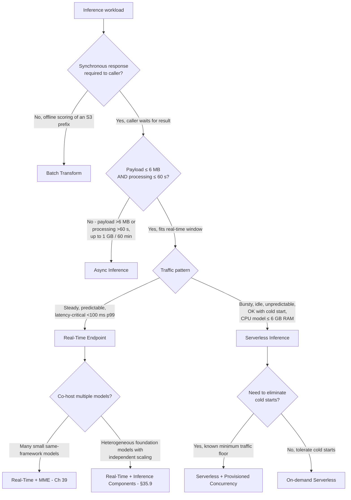
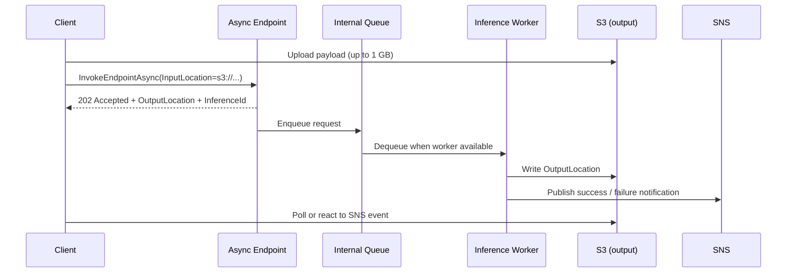

# Chapter 35 — The Four SageMaker Endpoint Types: Real-Time, Serverless, Async, Batch

> **Goal of this chapter:** to make you fluent in the four canonical SageMaker AI inference shapes — **Real-Time, Serverless, Asynchronous, Batch Transform** — to the point that, given any exam stem that mixes (latency SLO, payload size, traffic shape, cost tolerance), you can pick the right shape in under twenty seconds and justify it in one sentence. By the end of the chapter you should be able to: (a) recite the four hard-limit tables cold (payload, timeout, cold start, scale-to-zero, GPU support); (b) walk the decision tree that converges on the right answer; (c) recognize the 2024-era extensions (Inference Components, Shadow Variants, Production Variants) and where they bolt on; (d) match the auto-scaling metric to the endpoint type without confusing `SageMakerVariantInvocationsPerInstance` (real-time), `OverheadLatency` (serverless cold-start gauge), `ApproximateBacklogSizePerInstance` (async), and `InvocationsPerCopy` (inference components); (e) defuse the "$5 endpoint trap" before it lights up your bill. This is the highest-yield chapter in the Domain 3 deployment block. If you only learn one chapter in the Deployment and Orchestration domain, learn this one.

---

## 35.1 Why this chapter is worth twice as many pages as it looks

If the exam guide had to write a single sentence about Task 3.1 — *"Model and endpoint requirements for deployment endpoints"* — it would be: **pick the right endpoint shape**. AWS shipped four genuinely different inference shapes because real workloads have four different cost / latency / payload profiles, and the exam tests **shape selection** more frequently than any other deployment topic. The wrong-answer distractors on these questions are almost always *the right answer for a different shape* — pick "serverless" when the stem describes a 500 MB payload and you lose the question to "async", which is the correct shape for >6 MB payloads. Pick "real-time" when the stem mentions "scale-to-zero" and you lose the question to "serverless" or "async", whichever fits the payload. The whole architecture of this chapter is to give you elimination criteria sharp enough that you can knock two of the four shapes out within the first five seconds of reading the stem.

Two rules of thumb survive every endpoint-shape question on this exam, and they are also the two rules of thumb that survive every shape-selection meeting you will ever attend at an AWS-native shop:

1. **The four shapes are not interchangeable.** Each has at least one hard limit that immediately eliminates it from certain scenarios. Memorize the elimination criteria — the comparison table in §35.4 and the decision tree in §35.5 — and most questions answer themselves.
2. **"Always-on" vs "scale-to-zero" is the single biggest cost lever in inference.** A real-time endpoint at idle still bills the instance-hour 24×7. Serverless and async natively scale to zero. Batch transform doesn't have an endpoint to scale at all — it's a transient job. This single dimension differentiates roughly 40% of exam stems and roughly 88% of the real-world bill at most AWS-native ML shops (CloudWise's published audit showed real-time inference was 88% of one team's SageMaker spend; training was 6%).

The "wrong endpoint type" trap is real, and it costs you the exam in exactly the same way it costs your company the bill: you reach for the shape you already know (real-time), you don't think about the elimination criteria, and you ship — or answer — the wrong thing. The fix on the exam is to drill the comparison table cold. The fix in production is to do a payload-size projection and a traffic-shape projection *before* writing the CloudFormation. The same discipline applies in both places: **describe the workload first, then pick the shape.**

> ⚠️ **Exam alert — the four payload ceilings.** If you remember nothing else from §35.4, remember these four numbers: real-time **6 MB**, serverless **6 MB** (older docs say 4 MB; exam-safe is 6), async **1 GB**, batch transform mini-batch **100 MB** (with `MaxConcurrentTransforms × MaxPayloadInMB ≤ 100 MB`). The single most common exam trap is a stem that hands you a 200 MB payload and offers "serverless" as a distractor. The right answer is always async or batch.



The decision tree above is the highest-yield artifact in this chapter. The two forking questions — **synchronous?** and **payload-or-duration over the real-time limit?** — eliminate two of the four shapes immediately. After that, the choice between real-time and serverless is purely a traffic-shape question (steady vs bursty) cross-cut by the GPU-or-not question (serverless is CPU-only).

Sections 35.2 through 35.5 unpack each shape in turn and culminate in the four-way comparison table you must memorize cold. §35.6 covers the cross-cutting features that bolt onto real-time only — production variants, shadow variants, the auto-scaling metric matrix. §35.7 unpacks the "$5 endpoint trap" — the canonical bill-shock pattern — and how each shape addresses it. §35.8 walks five exam-pattern stems end to end. §35.9 closes with exercises and a forward map to Chapters 36–40.

---

## 35.2 Real-time endpoints — the default mental model

### 35.2.1 What it is

A real-time endpoint is a **persistent, always-on HTTPS service** backed by one or more EC2 instances that SageMaker provisions, patches, and monitors on your behalf. The authoring loop is the one you learned in Chapter 22 for training, mirrored on the serving side: you author a `Model` (container image in ECR + model artifacts in S3), reference it inside an `EndpointConfig` that lists one or more `ProductionVariants`, and call `CreateEndpoint` to materialise the running service. SageMaker stands up a managed load balancer in front of the instances; your container exposes `GET /ping` (health check) and `POST /invocations` (inference) on port 8080; clients call `InvokeEndpoint` against the SageMaker runtime API and get a synchronous response.

This is the **default shape** when an exam question says "deploy a model" with no further qualifiers. Every other SageMaker primitive (shadow tests, A/B testing, production variants, deployment guardrails canary/linear, target-tracking auto-scaling, multi-model endpoints, multi-container endpoints, inference pipelines, inference components) is layered on top of real-time as the substrate. If a stem mentions any of these features, it is implicitly a real-time stem.

### 35.2.2 Hard limits to memorize

| Limit | Value | Why the exam cares |
|---|---|---|
| Max request payload | **6 MB** | If a stem mentions 50 MB images, 200 MB PDFs, or multi-GB video, the answer is **async**, not real-time. |
| Max invocation timeout | **60 seconds** (8 min for streaming responses) | If inference takes minutes (large-context LLMs, video analysis, ensemble scoring), pick **async** or **batch**. |
| Minimum instances | **1** with target tracking (cannot truly scale to 0 without Inference Components or step scaling) | Real-time bills the instance-hour at idle. To truly hit zero you must switch to **serverless**, **async**, or **Inference Components** + scale-down-to-zero. |
| Cold start | **None under steady traffic** | Instances stay warm; only re-deploy events (UpdateEndpoint, scale-out) re-warm. |
| Endpoint update model | Blue/green by default | CreateEndpoint and UpdateEndpoint provision new fleet before terminating old; deployment guardrails (Ch 40) layer canary/linear on top. |
| Multi-AZ | ≥2 subnets in different AZs (when VpcConfig is set) | Required for HA even on a single-instance endpoint. |

> **Trivia warning.** A small body of older AWS docs cites 25 MB as the payload ceiling for certain endpoint paths (newer container images, streaming responses). The **safe, exam-aligned number is 6 MB**. If a stem pits 5 MB against 50 MB, the 50 MB option needs async — don't get clever with the 25 MB folklore. The exam writers are conservative on this number.

### 35.2.3 Cost model — real-time

You pay for **instance-hours** as long as the endpoint exists, plus the EBS volume attached to each instance, plus data-transfer out. Cost continues whether you send zero requests or a million. Two consequences flow from this:

1. **Right-sizing matters.** Use SageMaker Inference Recommender (covered in Chapter 36) to pick the cheapest instance that hits your latency SLO. The cheapest CPU instance that can host a Python web server with a model loaded is roughly `ml.m5.xlarge` at ~$168/month. The cheapest GPU instance that can host most transformer inference is `ml.g4dn.xlarge` at ~$537/month. A two-instance `ml.p3.2xlarge` HA pair runs **$5,585/month idle** — a number the cost-optimization questions love.
2. **Idle real-time endpoints are the #1 SageMaker bill-shock cause** — colloquially the "$5 endpoint trap" (there is no $5 endpoint; see §35.7). If your workload is bursty, serverless or async will be cheaper by one to three orders of magnitude.

### 35.2.4 Latency profile — real-time

- **p50 single-digit-ms to low-hundreds-ms** for classical ML (XGBoost, sklearn, LightGBM) on CPU instances (`c5`/`c6i`/`m5`).
- **p50 50–500 ms** for transformer inference on `g5`/`g6`/`p4d` (sequence-length-dependent).
- **No cold start** under steady traffic — instances are always warm and the model is preloaded into memory.
- **Baseline ~20–80 ms latency overhead** versus raw EC2 because of the SageMaker runtime/proxy layer (the managed load balancer + the `/invocations` HTTP hop). For sub-10ms SLOs this overhead matters; for >50ms SLOs it's noise.

### 35.2.5 When real-time is the right answer (exam patterns)

- "Consistent sub-100 ms p99 for 24×7 user-facing traffic at 200 RPS." → real-time, target-tracking auto-scaling on `SageMakerVariantInvocationsPerInstance`, multi-AZ.
- "Production chat assistant, low latency, predictable load." → real-time + GPU (`g5`, `g6`, or `inf2`).
- "Need shadow testing of a new model variant against production traffic." → real-time (only shape that supports `ShadowProductionVariants`).
- "A/B test two model variants by traffic weight." → real-time with two `ProductionVariants`.
- "Host multiple foundation models with independent scaling on shared GPUs." → real-time + Inference Components (§35.9).

When real-time is **not** the right answer:

- Idle most of the day, traffic in short bursts → **serverless**.
- Payload >6 MB or inference >60 s → **async**.
- One-shot offline scoring of an S3 prefix → **batch**.
- Need to truly hit zero cost during idle hours with a single classic model → **serverless** (CPU) or **async** (GPU/large payload).

---

## 35.3 Serverless inference — scale-to-zero for sporadic traffic

### 35.3.1 What it is

Serverless inference **removes the always-on instance**. You define a **memory size** (one of six fixed tiers from 1024 to 6144 MB) and a **max concurrency** (1–200), and SageMaker provisions compute on demand per request. When traffic stops, the endpoint scales to **zero** and you pay nothing. When the next request arrives, SageMaker spins up a worker — this is the **cold start**.

Underneath, serverless integrates with AWS Lambda's compute fabric to provide high availability, built-in fault tolerance, and automatic scaling — but you never see the Lambda; it's an implementation detail. From your perspective it looks like a regular SageMaker endpoint: same `InvokeEndpoint` API, same `/invocations` contract on the container.

### 35.3.2 Hard limits to memorize

| Limit | Value |
|---|---|
| Memory size tiers (only these six) | **1024, 2048, 3072, 4096, 5120, 6144 MB** |
| Min memory | 1024 MB (1 GB) |
| Max memory | 6144 MB (6 GB) |
| Ephemeral disk per worker | **5 GB** (fixed regardless of memory tier) |
| Max container image size | **10 GB** |
| Max concurrency **per single endpoint** | **200** |
| Max serverless endpoints **per region** | **50** |
| Total concurrency shared per region (us-east-1, us-east-2, us-west-2, ap-southeast-1, ap-southeast-2, ap-northeast-1, eu-central-1, eu-west-1) | **1000** |
| Total concurrency shared per region (other regions) | **500** |
| Max payload | **6 MB** (newer docs; older Caylent/community guides say 4 MB) |
| Max invocation timeout | **60 s** (same as real-time) |
| GPU support | **No — CPU only** |
| Cold start | **Yes** — seconds for small models, can exceed 1 minute for large containers; ~6 s typical for a HuggingFace model from S3 |
| Cold-start CloudWatch metric | **`OverheadLatency`** (use to monitor cold-start magnitude separate from `ModelLatency`) |

> ⚠️ **Exam alert — serverless has no GPU, period.** This is the single most common serverless-related trap. If a stem mentions transformer / vision / LLM inference, or *any* GPU requirement, and "serverless" is offered as an answer, eliminate it immediately. Serverless inference runs on managed CPU only. The 6 GB max memory tier also rules out most LLMs above ~3B parameters in fp16. Pattern-match "GPU" or "LLM" or ">6 GB model" → not serverless.

### 35.3.3 Provisioned Concurrency — eliminating cold starts

If cold starts are unacceptable but you still want serverless economics, allocate **Provisioned Concurrency**: SageMaker keeps that many workers pre-warmed. Provisioned Concurrency must be **≤ max concurrency**. You pay:

- The provisioned capacity at all times (cheaper per-hour than real-time but not free).
- Per-invocation pricing (memory × duration) on top, when actual traffic exceeds the provisioned floor.

| Mode | Pay for idle? | Cold starts? | Best for |
|---|---|---|---|
| On-demand serverless | **No** | **Yes** (~6 s typical first-hit) | Intermittent, dev/test, low-traffic internal tools |
| Provisioned Concurrency | **Yes** (the floor) | **No** up to the floor (~200 ms cold-start on PC vs ~6 s without) | Bursty workloads with a known minimum, scheduled spikes (tax software in filing season is the canonical example) |

Provisioned Concurrency for serverless **supports Application Auto Scaling**, so you can scale the provisioned-concurrency floor on a target metric or schedule. (It does **not** currently work via CloudFormation — only API/CLI/SDK.) The AWS docs' integer-knob rule is simple: *"Set provisioned concurrency to the integer representing how many cold starts you would like to avoid."* A PC value of 5 means 5 warm workers ready instantly; the 6th concurrent request hits a cold start.

### 35.3.4 Feature exclusions — what serverless cannot do

This list is heavily tested. Serverless inference **does not support**:

- **GPUs** — CPU only.
- **AWS Marketplace model packages.**
- **Private Docker registries.**
- **Multi-Model Endpoints (MME).**
- **Multi-Container Endpoints (MCE) / inference pipelines.**
- **`VpcConfig`** (no VPC attachment).
- **Network isolation.**
- **Data Capture** (no Model Monitor baseline capture).
- **Multiple production variants** (no A/B testing on a serverless endpoint).
- **Model Monitor.**
- **Inference Components.**
- **Shadow variants.**

If a stem mentions any of these requirements with "serverless" in the answers, eliminate serverless. Conversely, "no VpcConfig allowed" + "no Model Monitor needed" + "intermittent traffic" + "CPU-only small model" is a near-certain serverless answer.

> **Direction lock.** You **can** convert a serverless endpoint to real-time; you **cannot** convert a real-time endpoint to serverless. Trying returns `ValidationError`. Plan the choice at design time.

### 35.3.5 Cost model — serverless

Per-invocation pricing based on **memory × duration** (the Lambda-style billing model) plus a small per-request fee. There is **no instance-hour charge** in on-demand mode. Provisioned Concurrency adds an idle-capacity charge. A worked example from the cost research dossier:

> A serverless endpoint with 3 GB memory serving 100k requests/month at 200 ms each costs roughly **$0.10/month**. The smallest sensible CPU real-time endpoint (`ml.m5.xlarge`) is **$168/month**. That is three orders of magnitude cheaper for the same workload — *if* the workload fits the serverless constraints.

### 35.3.6 Latency profile — serverless

- **Warm path:** comparable to real-time on equivalent CPU memory, often 50–300 ms.
- **Cold path:** seconds (small models, ~1–3 s) to >1 minute (multi-GB containers).
- **Cold-start mitigations:** smaller container image, smaller model artifact, Provisioned Concurrency, pre-loading the model into memory at container start, single-worker container (the docs recommend **one worker, one copy of the model** for serverless containers — unlike real-time where you may want multiple workers per instance).

### 35.3.7 When serverless is the right answer (exam patterns)

- "Spiky / unpredictable traffic, OK with occasional second-scale latency." → **serverless**.
- "Demo or staging endpoint that gets hit a few times a day." → **serverless**.
- "Cost-sensitive deployment of a small CPU model with <2 M requests/month." → **serverless**.
- "**Scale to zero**" + payload ≤6 MB + processing ≤60 s + CPU-only model. → **serverless** (the single biggest tell).
- "Internal form-validator / fraud-flagger / search-reranker." → **serverless** if CPU-only.

When serverless is **not** the answer:

- **GPU required** → real-time `g5`/`g6`/`inf2`.
- **Model needs >6 GB memory** → exceeds max tier; use real-time.
- **Payload >6 MB or inference >60 s** → use **async**.
- **Latency SLO requires <50 ms p99 with zero cold-start risk** → real-time.
- **Need Model Monitor / Data Capture** → real-time.
- **Need VpcConfig for private resource access** → real-time.
- **Bursting past 200 concurrent invocations** → real-time with auto-scaling.

---

## 35.4 Asynchronous inference — large payloads, long jobs, queue-based

### 35.4.1 What it is

Asynchronous inference accepts an **S3 URI as input** (instead of an inline payload), queues the request internally, runs inference on managed instances, and writes the result to S3. It can optionally publish a success or failure SNS notification. It is the bridge between real-time and batch: **event-driven, on-demand, large payload, long-running, near-real-time latency**. The canonical adoption arc is a team that started on real-time, blew through the 60-second timeout or the 6 MB payload limit, and migrated.



### 35.4.2 Hard limits to memorize

| Limit | Value |
|---|---|
| Max payload | **1 GB** |
| Max inference time | **1 hour (60 minutes)** per request |
| Queue retention | Up to **6 hours** |
| Scale-to-zero | **Yes** — natively supported via `MinCapacity=0` |
| Cold start | Yes, when scaling from zero (instance provisioning + model download time) |
| GPU support | **Yes** (same instance families as real-time: `g`/`p`/`inf`/`trn`) |
| Auto-scaling metric of choice | **`ApproximateBacklogSizePerInstance`** (canonical) |
| HTTP response | **202 Accepted** + `OutputLocation` + `InferenceId` immediately |

> ⚠️ **Exam alert — async caps at 60 minutes and 1 GB.** If a stem hands you a workload that runs longer than 60 minutes per request (deep video segmentation on a 4-hour film, multi-day genomic alignment), async is wrong — go batch transform. If a stem hands you a payload larger than 1 GB (a 5 GB radiology DICOM volume), async is wrong — split the payload or go batch transform. The numbers to lock in: **1 GB / 60 min / 6 MB / 60 s**. Top-to-bottom: async max payload, async max processing, real-time/serverless max payload, real-time/serverless max processing.

### 35.4.3 Auto-scaling to zero — the async killer feature

Async was the **first** SageMaker endpoint type to support `MinCapacity=0` on the auto-scaling target — years before real-time got scale-to-zero (and even then, real-time scale-to-zero requires Inference Components, see §35.9). The canonical scaling metric is **`ApproximateBacklogSizePerInstance`** — directly measuring queue depth, which is what you actually care about, instead of invocation rate. A typical config:

- `MinCapacity = 0`, `MaxCapacity = 5`.
- `MaxConcurrentInvocationsPerInstance = 2` (so the queue actually fills up and triggers scale-out instead of one slow request hogging an instance).
- Target `ApproximateBacklogSizePerInstance = 5`.
- AWS's published example: a burst of 1,000 incoming requests scaled an example endpoint from 0 → 5 instances and back to 0 within the burst window. **Zero idle cost** between bursts.

This is the cleanest "pay for what you process" shape SageMaker offers for **GPU** workloads (serverless can't do GPUs). For a radiology AI shop, a video-pipeline team, or a document-OCR product, this is the default endpoint shape.

> ⚠️ **Exam alert — "scale to zero" + large payload = async, not serverless.** The trap the exam loves: a stem says "scale to zero" and "200 MB payload" and offers serverless as an option. Serverless can't take payloads >6 MB. The right answer is **async**. The trigger word is the payload (or the duration), not the scale-to-zero phrase by itself. Always parse payload + duration before letting "scale to zero" pull you toward serverless.

### 35.4.4 Cost model — async

You pay for instance-hours **only when instances are running**. Scale-to-zero plus queue retention means you pay nothing during idle periods. The SNS messages and S3 storage of inputs/outputs are negligible at typical scales (counted in cents per million). Compared to a 24×7 real-time endpoint at $168–$5,585/month, an async endpoint that runs 4 hours a day at the same instance type costs ~17% as much for the same daily throughput.

### 35.4.5 Notification mechanics — SNS integration

Async endpoints can publish two distinct SNS topics in the `AsyncInferenceConfig`:

- **`SuccessTopic`** — SNS message when inference completes successfully. Includes `OutputLocation` (the S3 URI of the result).
- **`ErrorTopic`** — SNS message when inference fails. Includes the failure reason.

The two topics are **separate on purpose** so consumers can subscribe to one without the other (e.g., the downstream pipeline subscribes to `SuccessTopic`, the on-call alerting system subscribes to `ErrorTopic`).

A common production pattern: **SNS → SQS → Lambda → downstream pipeline**. This makes async a natural fit for event-driven inference architectures: Lambda triggers async invocation on S3 upload, SNS fans out completion to a downstream system (a feature store write, a notification to the user, a downstream model). Async is the "background job" of SageMaker inference and integrates exactly like one.

### 35.4.6 When async is the right answer (exam patterns)

- "Inference on multi-page PDFs / videos / large radiology images (>6 MB)." → **async**.
- "Inference takes 5 minutes per request." → **async** (or batch if offline).
- "Bursty workload, may sit idle for hours, then thousands of requests in 10 minutes." → **async**.
- "Need an event-driven notification when inference completes." → **async + SNS**.
- "**Scale to zero** with large payloads or long processing." → **async**.
- "Mask R-CNN on 4K video / echocardiogram anomaly scan / long-document summarization." → **async**.
- "API Gateway hit its 29-second timeout calling our model." → **async** (breaks the sync chain).

When async is **not** the answer:

- Sync UX required (user waits for response, no callback) → real-time or serverless.
- Inference completes in <60 s and payload <6 MB → real-time or serverless.
- One-shot scoring of an S3 prefix offline → **batch transform** (cheaper, no endpoint).
- Very high QPS with small payloads (S3 round-trip dominates) → real-time.

---

## 35.5 Batch Transform — transient inference jobs, no endpoint

### 35.5.1 What it is

Batch Transform is a **transient inference job, not an endpoint**. You hand SageMaker a Model + input S3 prefix (or manifest) + instance type + instance count; it starts a cluster, streams records through the container's `/invocations`, writes outputs to S3, and **terminates**. No HTTP endpoint, no persistent cost, no scaling policy, no warm pool. The job's lifecycle is the same as a training job (Chapter 22), just running the inference container instead of the training container.

This is the cheapest shape for **offline bulk scoring** because you pay only for the wall-clock duration of the job. A nightly scoring job on `ml.m5.xlarge` for 2 hours costs $0.46. The same workload on a 24/7 real-time endpoint = $168/month = $5.60/day = **12× more expensive** with worse fan-out and no idle scaling.

### 35.5.2 Hard limits and parameters

The exam routinely tests four parameters:

| Parameter | What it does |
|---|---|
| `SplitType` | How to split each input file: `None` (whole file), `Line` (newline-delimited records), `RecordIO`, `TFRecord`. |
| `BatchStrategy` | `SingleRecord` (one record per invocation) or `MultiRecord` (pack multiple records up to `MaxPayloadInMB`). |
| `MaxPayloadInMB` | Cap on the per-request payload sent to the container. |
| `MaxConcurrentTransforms` | Concurrent requests sent to **each** instance — effectively the inference parallelism per worker. |

The constraint that frequently appears in stems: **`MaxConcurrentTransforms × MaxPayloadInMB ≤ 100 MB`**. If a question gives you `MaxPayloadInMB = 50` and asks the max `MaxConcurrentTransforms`, the answer is **2**.

### 35.5.3 Input partitioning and parallelism

- **S3 prefix mode (default):** point at an S3 prefix; SageMaker enumerates the objects and assigns them to instances.
- **Manifest mode:** pass an S3 manifest file listing the exact objects to process — useful for sparse datasets and replaying failed records (the canonical pattern when reprocessing yesterday's failed batch).
- **Multi-instance (`InstanceCount > 1`):** batch transform partitions S3 objects by key and assigns each instance a **disjoint subset** (per-object affinity — one instance fully owns each object). For maximum throughput:
  - Increase `InstanceCount` for embarrassingly parallel files (many small objects).
  - Increase `MaxConcurrentTransforms` for per-instance parallelism (fewer, larger objects).

### 35.5.4 Cost model — batch

**Instance-hours for the duration of the job only.** No idle cost. Almost always **cheaper than running a real-time endpoint** if the workload is offline and tolerant of latency measured in minutes-to-hours.

The pitfall is **picking too small an instance and watching the job balloon to 10 hours** — at which point a larger instance for 1 hour would have been cheaper. Always run a smaller pilot batch (~1% of the data) to estimate instance-hour scaling before the production job.

### 35.5.5 When batch is the right answer (exam patterns)

- "Score **50 million records every night** and dump to S3." → **batch**.
- "Generate embeddings for the **entire product catalog**." → **batch**.
- "I don't need a synchronous response — outputs land in S3 for a downstream job." → **batch**.
- "Cheapest option to score a large dataset **once**." → **batch** (vs spinning up a real-time endpoint just to call it from a loop).
- "Backfill predictions for the historical data warehouse." → **batch**.

When batch is **not** the answer:

- Real-time UX (chat, web app, fraud check) → real-time or serverless.
- Per-request SLA → endpoint of some shape.
- Continuously arriving events with low-latency needs → real-time + auto-scaling (or async if payloads are large).
- Feature engineering dominates runtime → **Step Functions + EMR/Glue** is usually a better fit; Batch Transform has no native join/lookup, so if your job is "join two tables then score" you're better off in EMR with a Batch Transform step at the end.

---

## 35.6 The four-shape comparison table — memorize cold

This is the single most exam-critical table in the deployment domain. Cover the right-hand columns, read the stem, recite the row. This table is the reason this chapter exists.

| Dimension | Real-Time | Serverless | Async | Batch Transform |
|---|---|---|---|---|
| **Persistent endpoint?** | Yes | Yes (logical; scales to 0) | Yes | **No** — transient job |
| **Sync vs async API** | Sync | Sync | Async (queue + SNS) | Async (job) |
| **Max payload** | **6 MB** | **6 MB** | **1 GB** | Per-record, capped by `MaxPayloadInMB`; `MaxConcurrentTransforms × MaxPayloadInMB ≤ 100 MB` |
| **Max processing time** | **60 s** (8 min stream) | **60 s** | **60 min (1 hour)** | No per-record cap; job duration bounded by SageMaker job limit |
| **Cold start?** | **No** (always warm) | **Yes** (~6 s on-demand; ~200 ms with Provisioned Concurrency) | Yes on scale-from-zero | N/A (job startup ~minutes) |
| **Scale-to-zero?** | **No** with target tracking; YES with Inference Components (re:Invent 2024) or step-scaling tricks | **Yes** native | **Yes** native | N/A (no endpoint) |
| **GPU support?** | **Yes** (g/p/inf/trn) | **No** — CPU only | **Yes** | **Yes** |
| **Memory ceiling** | Instance-dependent (up to 100s of GB) | **6 GB max** (1024/2048/3072/4096/5120/6144 MB tiers) | Instance-dependent | Instance-dependent |
| **Max concurrency** | Instance × workers × instance count | **200 / endpoint**; **500 or 1000 / region** | Queue-bounded; `InstanceCount × MaxConcurrentInvocationsPerInstance` | `InstanceCount × MaxConcurrentTransforms` |
| **Pricing model** | Instance-hour (24×7) | Per-invocation memory × duration + per-request fee | Instance-hour **only when running** | Instance-hour **only during job** |
| **Idle cost** | **Full instance-hour rate, 24×7** | **$0** (on-demand) | **$0** if `MinCapacity=0` | **$0** (no endpoint) |
| **Multi-Model (MME) support** | **Yes** (Ch 39) | **No** | Yes (limited) | N/A |
| **Multi-Container (MCE) / inference pipelines** | **Yes** | **No** | Yes (limited) | N/A |
| **Production variants (A/B)** | **Yes** (Ch 36) | **No** | Yes | N/A |
| **Shadow variants** | **Yes** (Ch 36) | No | No | N/A |
| **Inference Components** | **Yes** (real-time only) | No | No | N/A |
| **`VpcConfig`** | **Yes** | **No** | **Yes** | **Yes** |
| **Network isolation** | **Yes** | **No** | **Yes** | **Yes** |
| **Data Capture / Model Monitor** | **Yes** | **No** | **Yes** | N/A |
| **SNS notifications** | No (sync response) | No (sync response) | **Yes** (success/error topics) | N/A (job completion via CloudWatch Events / EventBridge) |
| **Canonical auto-scaling metric** | `SageMakerVariantInvocationsPerInstance` (or `InvocationsPerCopy` with Inference Components) | Provisioned Concurrency utilization target | **`ApproximateBacklogSizePerInstance`** | N/A (set `InstanceCount` at job start) |
| **Trigger phrases in exam stem** | "sub-second", "production chat", "consistent low latency", "24×7", "200 RPS" | "scale to zero", "intermittent", "small CPU model", "spiky", "internal demo", "<2M req/month" | "1 GB payload", ">60 s inference", "SNS notify", "large document", "video", "DICOM" | "score nightly", "S3 to S3", "offline", "50 M records", "embeddings for the entire catalog" |

The four trigger-phrase rows at the bottom are the highest-yield rows on the exam. If a stem reads like one of those phrases, the corresponding column is almost certainly the right answer.

---

## 35.7 The "$5 endpoint trap" — and how each shape addresses it

The single biggest SageMaker cost mistake — and the one the cost-optimization questions (Task 4.2) love to test — is **leaving a real-time endpoint running with no traffic**. There is no $5 SageMaker real-time endpoint; the term "$5 endpoint trap" is a misnomer for the bill that snuck up on you because someone said "it's just a small endpoint." A forgotten `ml.m5.xlarge` endpoint costs ~$168/month per instance for zero traffic. A two-instance `ml.p3.2xlarge` HA pair costs **$5,585/month idle**. Multiply by half a dozen forgotten dev endpoints and you have the prototypical bill-shock story.

The CloudWise audit number worth committing to memory: **88% of one team's SageMaker spend was real-time inference endpoints; training was 6%.** This is the inversion of what most engineers assume (they expect training to dominate). The "$5 endpoint trap" is the structural reason.

**The cost-per-1K-invocations rule of thumb** (also worth committing to memory):

| $ per 1K invocations | Verdict |
|---|---|
| < $1.00 | Well-utilized |
| $1 – $5 | Over-provisioned; rightsize or autoscale lower |
| $5 – $20 | Severely inefficient; move to serverless |
| > $20 | Effectively idle; delete or convert to serverless / async |

How each shape addresses idle cost:

| Shape | Idle behavior | Cost at zero traffic |
|---|---|---|
| **Real-time (classic)** | Stays at minimum capacity (≥1 instance) | **Full instance-hour rate, 24×7** |
| **Real-time + Inference Components** | Each component can scale to 0 copies; instances drop too | **$0** when all components at 0 copies |
| **Serverless** | Scales to zero automatically | **$0** |
| **Async** | Scales to zero with `MinCapacity=0` + target tracking on backlog | **$0** during idle periods |
| **Batch** | No endpoint exists; job terminates after completion | **$0** between jobs |

Operational guardrails for real-time (the patterns teams actually use to retrofit auto-shutdown):

- **Tag every endpoint** with `Owner`, `Project`, `AutoStop`, `Environment` (forward to Chapter 34 §13 on cost-allocation tagging).
- **Cost Anomaly Detection** monitor scoped to SageMaker service.
- **CloudWatch alarm** on `Invocations = 0` for >24 hours → SNS to owner → manual or Lambda-driven `DeleteEndpoint`.
- **Lifecycle Lambda** scheduled to delete dev/test endpoints nightly (EventBridge cron at 7 pm; recreate at 7 am from the same EndpointConfig). Saves ~60% of weekly hours for endpoints only used during business hours.
- **Multi-Model Endpoints (MME)** to pack 50 low-traffic models on a single instance — up to 80% savings vs 50 separate endpoints (covered in Chapter 39).
- **Switch the workload to serverless or async** if the traffic pattern allows it. This is almost always the right answer for non-GPU, non-VpcConfig workloads with intermittent traffic.

> ⚠️ **Exam alert — never scale real-time on CPU.** The single most common production scaling mistake — and the most common Task 3.2 distractor — is using `CPUUtilization` as the auto-scaling target metric for a real-time endpoint. CPU utilization is **not monotonic in load** for ML inference: GPU-bound models can run at 100% GPU and 20% CPU, or 10% GPU and 90% CPU depending on what's running on the host. AWS's own re:Post knowledge article calls this out explicitly: *"A policy that scales based on the CPU utilization metric might not scale down when traffic decreases."* The right metric is **`SageMakerVariantInvocationsPerInstance`** (the predefined target-tracking metric). For high-resolution (10-second granularity) scaling, use `SageMakerVariantConcurrentRequestsPerModelHighResolution`, which scales out roughly 6× faster.

---

## 35.8 Production variants, shadow variants, and the auto-scaling metric matrix

This section previews the cross-cutting features that bolt onto **real-time endpoints only**. Chapter 36 covers production and shadow variants in depth; this section gives you the exam-level mental model and the trigger phrases.

### 35.8.1 Production variants — A/B testing on real-time endpoints

A **`ProductionVariant`** is a `(model, instance_type, instance_count, weight)` tuple inside an EndpointConfig. A real-time endpoint can host **multiple production variants** and split traffic between them by weight:

```python
endpoint_config = sagemaker.create_endpoint_config(
    EndpointConfigName="chat-config",
    ProductionVariants=[
        {"VariantName": "blue",  "ModelName": "model-v1",
         "InitialInstanceCount": 2, "InstanceType": "ml.g5.xlarge",
         "InitialVariantWeight": 0.9},
        {"VariantName": "green", "ModelName": "model-v2",
         "InitialInstanceCount": 1, "InstanceType": "ml.g5.xlarge",
         "InitialVariantWeight": 0.1},
    ],
)
```

Key behaviors to memorize:

- Traffic is split by **weight** (not by request count) — the SageMaker router probabilistically routes each invocation.
- Clients can **bypass the weighted router** by passing `TargetVariant` on each `InvokeEndpoint` call → deterministic per-request routing (useful for offline evaluation runs that need to hit only the candidate).
- You can change `DesiredWeightsAndCapacities` on the fly via `UpdateEndpointWeightsAndCapacities` — no full redeploy needed for traffic shifts.
- **Not supported on serverless endpoints** — serverless allows only one variant.

Exam tells:

- "Send 10% of users to v2, 90% to v1" → two production variants with weights 0.1 and 0.9.
- "Deterministically route specific requests to v2 for offline scoring" → `TargetVariant` header.
- "Gradually shift traffic over hours with rollback on alarm" → **deployment guardrails (canary / linear / all-at-once)** — preview only; full coverage in Chapter 40.

### 35.8.2 Shadow variants — risk-free production testing

A **`ShadowProductionVariant`** is *not* the same as a production variant. It receives a configurable **percentage of replicated production traffic**, runs inference, but **does not return a response to the caller**. Use it to validate a candidate model/container/instance combo in production conditions without any user-visible risk. Full coverage in Chapter 36; what you need to memorize now:

- **Max 1 shadow variant per endpoint.**
- An endpoint with a shadow variant can have **at most 1 production variant** (you can't combine A/B + shadow on the same endpoint).
- Traffic sampling percentage is **configurable while the test runs** (start at 10%, ramp to 50%).
- After review you either **promote** (shadow becomes new production) or **discard**.
- Shadow vs A/B: shadow is **risk-free comparison** (no user impact); A/B / canary is **gradual cutover** (some users *do* see the new variant).
- Real-time endpoints only — **not** supported on serverless / async / batch.

Exam tell: "Test a new model with **real production traffic** but with **no user impact**." → **shadow variant**, not A/B with production variants.

### 35.8.3 Auto-scaling per endpoint shape — the metric matrix

Each endpoint shape uses a different canonical auto-scaling metric. Memorize this matrix:

| Endpoint shape | Canonical metric | Why |
|---|---|---|
| **Real-time** (single model per endpoint) | **`SageMakerVariantInvocationsPerInstance`** | Default target-tracking metric. Recommended for MME as well. |
| **Real-time with Inference Components** | **`SageMakerInferenceComponentInvocationsPerCopy`** (or `...ConcurrentRequestsPerCopyHighResolution`) | Each component scales independently based on its own invocation rate per copy. |
| **Serverless** (Provisioned Concurrency) | Provisioned Concurrency utilization target | Application Auto Scaling on the provisioned-concurrency floor. |
| **Async** | **`ApproximateBacklogSizePerInstance`** | The canonical scale-from-zero metric. Set `MinCapacity=0` for full zero-scale. |
| **Batch transform** | N/A | No auto-scaling — `InstanceCount` fixed at job start. |

> ⚠️ **Exam alert — `InvocationsPerInstance` is the right metric only when "Inference Component" is *not* in the stem.** If the stem mentions Inference Components, the answer is `InvocationsPerCopy`. If the stem mentions async, the answer is `ApproximateBacklogSizePerInstance`. If the stem mentions serverless, the answer is "set Provisioned Concurrency" — auto-scaling on raw invocations is not the right knob there. Match the metric to the shape.

### 35.8.4 The three scaling-policy shapes (real-time and async)

| Policy | What it does | When the exam picks it |
|---|---|---|
| **Target tracking** | You give a metric + target value; auto-scaling adjusts capacity to hold the metric near target. | Default. Async scale-to-zero. MME `InvocationsPerInstance`. |
| **Step scaling** | You give CloudWatch alarms + per-alarm scaling adjustments. **Required to scale classic real-time from zero** (target tracking can't truly hit 0). | Real-time stem says "scale 0→N when invocations spike." |
| **Scheduled scaling** | Cron-like; adjust min/max capacity at known times. | "Scale up to 10 every Monday 9 am." Pre-warm before a known traffic spike (market open, marketing campaign send). |

You can **combine scheduled + target tracking** (scheduled changes the bounds; target tracking does fine-grained scaling within them). Full coverage in Chapter 40 (deployment guardrails and auto-scaling).

Cool-down recommendations from production runbooks (asymmetric is the canonical pattern):

- **`ScaleInCooldown = 600` s (10 minutes)** — long enough to absorb burst valleys without thrash.
- **`ScaleOutCooldown = 60–300` s (1–5 minutes)** — short enough to respond to ramp-ups quickly.

---

## 35.9 Inference Components (2023+) — packing foundation models on one endpoint

### 35.9.1 What it is

**Inference Components (ICs)** were announced at re:Invent 2023 to address a specific pain: foundation models are huge, expensive to host, and have unpredictable per-model traffic — so you want to **co-locate multiple LLMs on one large GPU instance** but **scale them independently**. Before ICs, SageMaker hosted one model per endpoint instance (or, for MME, many lightweight models swapped in/out of memory — but with no per-model scaling and a cold-swap on cache miss). The fundamental constraint was: one model "owns" one piece of hardware. That forced an unhappy choice for LLM teams — either over-provision a P4d/P5 for every model (most GPUs idle), or pack onto MME (no per-model scaling).

Inference Components decoupled the **model** from the **endpoint infrastructure**. With ICs, an endpoint hosts an **instance pool** and many **model components**; each component declares an amount of GPU memory + accelerator slots, and SageMaker packs them onto the instances bin-pack-style. Per-component auto-scaling is independent. As of re:Invent 2024, each component can scale to **zero copies**, and the underlying instance drops too once all components are at zero — making this the **only real-time path to true scale-to-zero**.

Each Inference Component declares:

- A reference to a `Model` (container + artifacts).
- Granular **compute requirements per copy**: number of CPU cores, host memory (MB), and number of accelerators (GPU / Inferentia / Trainium devices).
- Scaling parameters: `MinCopies`, `MaxCopies`, target metric.

SageMaker handles:

- Packing component copies onto the underlying instances.
- Adding/removing instances as the total demand for all components changes.
- Per-component scaling independently of the rest.
- **Least-outstanding-requests (LOR) routing** for better latency under variable response lengths (a frequent issue with LLM streaming output).

### 35.9.2 The Salesforce 8× cost story

Salesforce's CodeGen platform (Inline, BlockGen, FlowGPT) provided AWS's flagship IC case study. The numbers Salesforce and AWS published:

- **Model sizes:** 15–30 GB range across the LLM ensemble.
- **Hardware:** AWS P4d (8× A100) instances, migrating to P5en (H200).
- **Single-model endpoint pain:** 20–30 GB models with low traffic still required a full P4d (8× A100) — most GPUs idle most of the time.
- **After IC:** multiple models packed onto one P4d, **up to 8× reduction in inference cost**, and **up to 80% reduction vs single-model endpoints** in the AWS launch blog's broader benchmark.
- **Per-model scaling:** each component scaled independently based on its own traffic, not the noisiest neighbor's.

The architectural insight worth memorizing: **IC turns "one endpoint = one model" into "one endpoint = a fleet that hosts a portfolio of models with declared resource needs."** It is what makes SageMaker viable for LLM-serving shops that would otherwise have to roll their own Triton / vLLM stack on raw EC2.

### 35.9.3 Inference Components vs MME vs MCE — they are not the same thing

| Aspect | MME (Multi-Model Endpoint) | MCE (Multi-Container Endpoint, Direct) | Inference Components |
|---|---|---|---|
| What's multi-instance? | Many **model artifacts**, one container | Up to 15 **containers**, one model each | Many **models**, each as a component, on one endpoint |
| Same framework? | **Yes** (one container) | **No** (containers can differ) | **No** (each component has its own container) |
| Independent scaling per model? | No (whole endpoint scales) | No (whole endpoint scales) | **Yes — per component** |
| Resource allocation per model? | Shared cache pool | Shared instance | **Explicit** (CPU/RAM/accelerator per copy) |
| Scale to zero per model? | No | No | **Yes** (component `MinCopies=0`; re:Invent 2024) |
| Typical use case | Hundreds of small per-tenant XGBoost models | A handful of heterogeneous co-hosted models | Multiple foundation models / LLMs sharing GPU capacity |
| Routing | `TargetModel` HTTP header | `TargetContainerHostname` HTTP header | `InferenceComponentName` HTTP header |
| Endpoint shapes | Real-time + Async | Real-time + Async | **Real-time only** |
| Graviton support | **No** | Yes | Yes (depending on container) |

Full coverage of MME and MCE in Chapter 39; this section only marks the boundaries.

### 35.9.4 Scaling metric

The canonical auto-scaling metric for an Inference Component is **`SageMakerInferenceComponentInvocationsPerCopy`** — invocations per running copy of that component. You set a target value per component; SageMaker adds/removes **copies** within the endpoint and adds/removes **instances** of the underlying fleet as the total resource demand of all components changes.

> ⚠️ **Exam alert — scale-to-zero on classic real-time is a trap.** Classic real-time target-tracking auto-scaling **cannot truly scale to zero**. The minimum capacity is 1. If a stem asks "how do I scale a real-time endpoint to zero?" the right answer is one of: (a) switch to **Inference Components** with `MinCopies=0` (re:Invent 2024 feature), (b) switch to **serverless** if the workload fits, (c) switch to **async** if the payload/duration fits. The wrong answers will offer step-scaling tricks or `MinCapacity=0` on classic real-time — neither is the canonical answer the exam wants.

### 35.9.5 When Inference Components are the right answer

- "Host a 7B Llama and a 13B Mistral on the same GPU instances with per-model scaling." → **Inference Components**.
- "Multiple LLMs with very different RPS profiles; want them to share fleet capacity but scale independently." → **Inference Components**.
- "Reduce cost by ~50% of running each foundation model on its own endpoint." → **Inference Components**.
- "Salesforce-style ~8× cost reduction co-hosting multiple LLMs." → **Inference Components**.
- "Need true scale-to-zero on a GPU-backed real-time endpoint." → **Inference Components** (re:Invent 2024 scale-to-zero).

When **not** to use ICs:

- One model, steady traffic → plain real-time endpoint.
- Many tiny same-framework models (per-tenant XGBoost) → **MME**.
- A handful of unrelated containers, no need for independent scaling → **MCE direct**.
- Models that need wildly different instance types — IC requires one instance family per endpoint.
- Latency-critical workloads where packing-induced contention is unacceptable.

---

## 35.10 Five worked exam-pattern stems

These are the patterns the exam tests. Walk each one cold; the goal is not to memorize the answers but to internalize the elimination-criteria flow.

### Stem 1 — Sub-50 ms fraud detection

> *Fraud-detection service for a payment gateway, must respond in <50 ms p99 at 1500 RPS, 24×7. Model is a 500 MB XGBoost on tabular features, fits on CPU.*

**Walk:**

1. **Synchronous response required** → not batch.
2. Payload <1 KB (tabular row), processing <50 ms → fits the real-time / serverless window.
3. **Sustained 1500 RPS, 24×7** → steady, not bursty → real-time wins over serverless (serverless cold-start risk + 200 concurrency cap per endpoint would be exceeded at 1500 RPS).
4. CPU model → `ml.c6i.2xlarge` family.
5. Auto-scaling: target-tracking on `SageMakerVariantInvocationsPerInstance`, **not CPU**.

**Answer: Real-time endpoint, `ml.c6i.2xlarge`, target-tracking auto-scaling on `SageMakerVariantInvocationsPerInstance`.**

### Stem 2 — Internal HR demo, hit twice a day

> *Internal HR demo of a resume-classifier. Hit a few times per day during interview season; sometimes idle for a week. Resume payload <100 KB, CPU-only model fits in 4 GB.*

**Walk:**

1. Synchronous response (HR clicks a button, waits).
2. Resume payload <100 KB, processing <2 s → fits real-time / serverless window.
3. Spiky/intermittent, sometimes idle for a week → **scale-to-zero is the cost driver**. Real-time at $168/month for two requests/week is a textbook "$5 endpoint trap."
4. CPU model, <6 GB RAM → fits serverless memory tiers.
5. Latency: cold start of ~3–6 s on first hit per day is fine for an internal demo.

**Answer: Serverless inference, 4096 MB memory, max concurrency 5, no Provisioned Concurrency.**

### Stem 3 — Radiology CT segmentation, 250 MB DICOM

> *Radiology assistant that takes DICOM volumes (~250 MB each) and runs a CT segmentation model. Processing takes 4–8 minutes per volume. Hospitals submit a few hundred per hour during the day, almost none overnight.*

**Walk:**

1. Synchronous? The clinician will wait minutes — not a chat-latency UX. Could be real-time or async on the sync axis.
2. **Payload 250 MB > 6 MB** → eliminates real-time and serverless.
3. **Processing 4–8 min > 60 s** → eliminates real-time and serverless.
4. Day-active, night-idle → wants **scale-to-zero**.
5. Need success/error notification to the radiology workflow → SNS.

**Answer: Asynchronous inference with `MinCapacity=0`, target-tracking on `ApproximateBacklogSizePerInstance`, SNS success/error topics, GPU instance family (`g5`/`p4d`).**

### Stem 4 — Nightly batch scoring of 80M records

> *Nightly batch: score 80 million customer records for next-day-churn probability. Output lands in S3 for the BI team. No latency requirement.*

**Walk:**

1. **No synchronous response** → batch is the first candidate.
2. S3 in, S3 out, offline → batch fits perfectly.
3. 80 M records → `BatchStrategy=MultiRecord`, `SplitType=Line`, multiple instances.
4. No endpoint = no idle cost. Cheapest option.

**Answer: Batch Transform on `ml.c5.4xlarge × 20`, `BatchStrategy=MultiRecord`, `SplitType=Line`, `MaxConcurrentTransforms × MaxPayloadInMB ≤ 100 MB`.**

### Stem 5 — Two foundation models on one GPU endpoint

> *Customer wants to host both Llama-3-8B and Mistral-7B on the same GPU endpoint and scale them independently as traffic varies between the two. Goal: reduce inference cost relative to two separate endpoints.*

**Walk:**

1. Two distinct foundation models, same GPU family → not a single-model real-time endpoint.
2. Need **independent scaling per model** → not MME (shared cache, whole-endpoint scaling) and not MCE-direct (whole-instance shared, no per-model scale).
3. **GPU required** → not serverless.
4. Need scale-per-component, declared accelerator allocation per copy → **Inference Components** is the purpose-built feature. Salesforce-style ~8× cost reduction is the canonical citation.

**Answer: Real-time endpoint with two Inference Components (one per model), each with its own scaling policy on `SageMakerInferenceComponentInvocationsPerCopy`, `MinCopies=0` if scale-to-zero per model is required.**

---

## 35.11 Common traps the exam exploits

Before the exercises, a consolidated trap list. Every one of these is real, every one is on a question the exam has shipped or a near variant:

1. **"Scale to zero" + 800 MB payload = async**, NOT serverless. Serverless can't take >6 MB payloads.
2. **"Scale to zero" on classic real-time** → not possible with target tracking. The canonical answer is "switch to Inference Components" (re:Invent 2024), or "switch to serverless / async."
3. **Serverless does NOT support GPUs.** If the stem mentions transformer / vision / LLM inference on GPU and "serverless" is offered, eliminate it.
4. **Serverless does NOT support** Multi-Model Endpoints, VpcConfig, Model Monitor, Data Capture, multiple production variants, shadow variants, or Inference Components. Any of those in the requirements + serverless in the answers = wrong.
5. **Real-time payload limit is 6 MB.** Older docs say 25 MB for some paths; exam-safe answer is 6 MB.
6. **Async payload limit is 1 GB, processing limit is 60 minutes.** Memorize both numbers.
7. **Serverless memory tiers are exactly six: 1024, 2048, 3072, 4096, 5120, 6144 MB.** No 8 GB tier exists.
8. **Batch transform has no endpoint.** If the stem mentions "endpoint URL" or "InvokeEndpoint", batch is wrong.
9. **`SageMakerVariantInvocationsPerInstance` is for real-time / MME.** `ApproximateBacklogSizePerInstance` is for **async**. `InvocationsPerCopy` is for **Inference Components**. Match the metric to the shape.
10. **Inference Components are real-time only**, not serverless/async/batch.
11. **Shadow variants** are real-time only and limited to 1 shadow + 1 production variant per endpoint.
12. **Serverless cannot be converted to/from real-time bidirectionally** — serverless→real-time works, real-time→serverless does not (`ValidationError`).
13. **`MaxConcurrentTransforms × MaxPayloadInMB ≤ 100 MB`** is the batch transform constraint.
14. **Serverless per-region concurrency is 1000 (large regions) or 500 (smaller regions)**, not 200. 200 is the per-endpoint cap.
15. **MME is NOT supported on Graviton** instances (`m6g`/`c7g`); use Intel/AMD instances for MME workloads.
16. **Async cold start exists** (when scaling from zero). It's not "instant" just because traffic is queued — the first request after a scale-down pays the scale-up latency before processing starts.
17. **Never scale real-time on `CPUUtilization`.** Use `SageMakerVariantInvocationsPerInstance` (or its `HighResolution` cousin for sub-minute reactions).
18. **Deployment guardrails (canary, linear, rolling, all-at-once)** are real-time-only, require **≥3 instances per variant** for blue/green, and rely on **CloudWatch alarms** to gate each traffic-shift step. Full coverage in Chapter 40.
19. **Blue/green doubles capacity bill during the shift.** Rolling does not, but rolling has no clean rollback. The pragmatic policy: blue/green canary for <10-instance endpoints, rolling for larger fleets with a strong artifact registry.

---

## 35.11.1 The auto-scaling pitfalls that bite everyone (and the exam)

Auto-scaling is treated as a separate Chapter 40 topic, but three pitfalls show up in the endpoint-shape question pool too. They are worth surfacing here because each one is a wrong-answer distractor on Task 3.2 stems that also test endpoint-shape choice.

**Pitfall 1 — scaling on CPU utilization.** The single most common production scaling mistake, surfaced repeatedly above. CPU utilization is not monotonic in load for ML inference: a GPU-bound model can run at 100% GPU and 20% CPU, or 10% GPU and 90% CPU depending on what's running on the host. The right metric for real-time is **`SageMakerVariantInvocationsPerInstance`** (the predefined target-tracking metric). The recommended target-value formula from AWS docs:

```
SageMakerVariantInvocationsPerInstance_TARGET = MAX_RPS × SAFETY_FACTOR × 60
```

where `MAX_RPS` is the per-instance RPS that maintains your latency SLA (determined by load testing) and `SAFETY_FACTOR ≈ 0.5–0.7` to leave headroom. Multiply by 60 because the metric is per-minute, not per-second. For high-resolution (10-second granularity) scaling, switch to `SageMakerVariantConcurrentRequestsPerModelHighResolution` — it scales out roughly 6× faster than the standard metric.

**Pitfall 2 — too-aggressive scale-in causing thrash.** The default `ScaleInCooldown` is short enough that bursty workloads can cause instances to come up, take traffic for two minutes, get scaled in, then immediately be needed again — and each spin-up incurs the model-loading cold-start penalty. The asymmetric cool-down pattern from production runbooks (also AWS's own published examples):

- `ScaleInCooldown = 600` s (10 minutes) — long enough to absorb burst valleys.
- `ScaleOutCooldown = 60–300` s (1–5 minutes) — short enough to respond to ramp-ups without thrash.

**Pitfall 3 — forgetting that scale-out has its own cold start.** When scale-out triggers, SageMaker provisions a new instance, pulls the container image, downloads the model artifact from S3, and warms the inference server. For a 30 GB LLM artifact, this can take **2–5 minutes** before the new instance serves traffic. During that window, the *existing* instances must absorb the burst — meaning your target metric must already include headroom for "burst arrived but the new instance isn't ready yet." The practical implications:

- **Target metric should be 60–70% of per-instance capacity, not 90%+.**
- **Pre-warm before known events.** Schedule a scale-out via Application Auto Scaling scheduled actions 10 minutes before a known traffic spike (market open, marketing campaign send, the 8am Monday wave).
- **Use Inference Recommender** to find the right instance size before fiddling with scaling — the wrong-size instance can never be fixed by auto-scaling tuning. Full coverage in Chapter 36.

---

## 35.11.2 Deployment guardrails — the Chapter 40 preview

You will not be tested on guardrails in this chapter (Chapter 40 owns them in depth), but you will see them surface as distractors in endpoint-shape questions, so the mental model is worth establishing now.

SageMaker's **deployment guardrails** (launched late 2021) provide four traffic-shifting strategies for endpoint updates:

| Mode | How it shifts | When teams pick |
|---|---|---|
| **All-at-once (default)** | 100% blue → 100% green | Dev / staging only; never production. |
| **Canary** | Small slice → bake → flip the rest | Default for production; cheapest in extra capacity. |
| **Linear** | n equal steps (e.g., 33% / 33% / 33%) | Large fleets where each step matters. |
| **Rolling** | Replace instances in batches in place | When you can't afford 2× capacity briefly. |

The shared safety contract: **CloudWatch alarms gate every step**. If any alarm trips during the baking period, SageMaker auto-rolls-back 100% of traffic to blue. The published example alarms are *5xx error rate ≥ 1% over 1 minute* and *model latency ≥ 10ms over 1 minute*. The configuration knobs to know:

- `WaitIntervalInSeconds` — bake time between traffic shifts. Default 300 s (5 minutes) for canary, 180 s (3 minutes) for linear.
- `TerminationWaitInSeconds` — buffer before deleting the blue fleet. Default 120 s.
- `MaximumExecutionTimeoutInSeconds` — hard timeout on the whole shift. Default 1800 s (30 minutes); max 14400 s (4 hours).
- **Minimum instance count: 3** — blue/green guardrails require at least 3 instances per variant to maintain availability during the shift.

Two real-world rollback stories worth internalizing (they show up as the "what kind of alarm" distractor in exam questions):

- **The tokenizer-mismatch deploy.** Team shipped a model that used a new tokenizer but forgot to bump the container image. p99 latency jumped from 80 ms to 2 s because the model was loading the wrong tokenizer on every request. The CloudWatch latency alarm tripped at the canary stage; rollback in 3 minutes. Lesson: a latency alarm catches what a 5xx alarm does not — wrong-but-syntactically-valid behavior.
- **The "we changed feature order" deploy.** A feature pipeline reordered two columns in the input tensor; the model started producing garbage predictions silently (no exception, just wrong outputs). A **business-metric alarm** (conversion rate dropped) caught it during the linear bake — a reminder that latency + 5xx alarms alone are not enough; you need at least one prediction-quality alarm. Lesson: **at least one of your alarms must be a business-metric or model-quality alarm**, not just an infra alarm.

The blue/green-vs-rolling cost trade-off worth remembering: **blue/green doubles your capacity bill during the shift**. For a 10-instance P4d fleet, that's $700+/hour of incremental cost during the (potentially hours-long) rollout. Rolling replaces in place — same instance count throughout, but no clean rollback (you redeploy the previous artifact). The pragmatic production policy:

- **Blue/green canary** for endpoints with <10 instances.
- **Rolling** for endpoints with >10 instances *and* a strong artifact registry (so the rollback path is "redeploy the previous tag").
- **All-at-once never makes it past peer review for production.**

Chapter 40 gives this full treatment, including the CloudFormation snippets and the alarm-design patterns.

---

## 35.12 Cross-chapter dependencies

This chapter establishes the **four shapes**. The rest of Part G layers patterns and guardrails on top:

- **Chapter 36 — Real-time endpoints, deep dive.** Production variants, shadow variants, Inference Recommender, sticky sessions, container contract (`/ping`, `/invocations`).
- **Chapter 37 — Serverless inference, deep dive.** Memory-tier sizing, Provisioned Concurrency math, cold-start mitigations, the tax-software canonical pattern.
- **Chapter 38 — Async + batch, deep dive.** Async queue mechanics, SNS-SQS-Lambda fan-out, batch `SplitType` × `BatchStrategy` matrix, manifest-mode replay.
- **Chapter 39 — MME, MCE, inference pipelines.** Per-tenant model packing, multi-container routing, pipeline-of-models for preprocessing-inference-postprocessing.
- **Chapter 40 — Deployment guardrails + auto-scaling.** Canary / linear / rolling / all-at-once, CloudWatch-alarm-gated rollback, scheduled + target-tracking combinations, scale-from-zero step scaling.

Back-references this chapter relies on:

- **Chapter 9 — AWS compute primitives.** EC2 instance families, GPU vs CPU economics, Graviton support — the substrate the four endpoint shapes are built on.
- **Chapter 22 — Training jobs and the `/opt/ml/` contract.** The same container contract applies on the serving side; real-time endpoints expose `/ping` and `/invocations` on port 8080, just as training containers expose `/opt/ml/input` and `/opt/ml/output`.
- **Chapter 33 — Spot training, warm pools, checkpointing.** The training-side cost lever. This chapter is the inference-side cost surface.
- **Chapter 34 — Training cost optimization** (tagging, Cost Anomaly Detection, lifecycle Lambdas). The same operational guardrails apply to endpoints — arguably more so, since endpoints bill 24×7 by default.

Forward to Domain 4:

- **Chapter 47 — Model Monitor.** Data Capture sampling at 5–20%, baseline drift detection — supported on real-time and async, **not** serverless / batch.
- **Chapter 50 — Cost optimization for inference.** Generalizes the "$5 endpoint trap" mitigations across the four shapes, plus Cost Allocation Tags and Cost Anomaly Detection scoped to SageMaker.

---

## 35.13 Conceptual lineage

Endpoint type selection (Task 3.1) sits in **Domain 3 — Deployment and Orchestration** (~22% of MLA-C01). The exam pairs it with cost (Task 4.2) and scaling (Task 3.2). The pattern:

> *"You're given a workload description. Pick the endpoint shape. Pick the auto-scaling metric. Pick the cost guardrail. Justify in two sentences."*

The questions almost never ask "what is a serverless endpoint?" in isolation. They ask "given these four characteristics, which shape fits and which scaling metric do you use?" That's why the comparison table (§35.6) and the metric matrix (§35.8.3) are the highest-yield artifacts in this chapter — they let you answer compound questions in one pass.

The four-shape model is also conceptually identical to the broader AWS compute spectrum — if you have built systems on EC2/Lambda/SQS/EMR, you have already seen this lattice:

- **EC2 (always on)** ≈ real-time endpoint.
- **Lambda (on-demand, scales to zero)** ≈ serverless inference.
- **SQS + EC2 worker (queue + processor)** ≈ async inference.
- **EMR / Glue batch job** ≈ batch transform.

If you internalize this analogy, the exam stem's *traffic shape* description maps directly to the right shape, just like in the rest of the AWS portfolio. The MLE who can name the four shapes can also name the four general AWS compute shapes — they are not coincidentally aligned.

---

## 35.14 One-page revision sheet

**Four shapes:** Real-Time / Serverless / Async / Batch Transform. Pick by **(sync?, payload, processing time, traffic pattern, GPU need, scale-to-zero need)**.

**Real-time:** always-on; **6 MB payload**, **60 s timeout**; no cold start; **no scale-to-zero with classic target tracking** (Inference Components is the path to zero); GPU OK; pricing = instance-hour 24×7. Supports MME, MCE, pipelines, Inference Components, shadow variants, production variants (A/B), Model Monitor, VpcConfig.

**Serverless:** scale-to-zero; **6 MB payload**, **60 s timeout**; **CPU only**; memory tiers **1024/2048/3072/4096/5120/6144 MB**; **5 GB ephemeral disk**; max concurrency **200/endpoint**; **1000/region (large) or 500/region (smaller)**; max **50 endpoints/region**; **10 GB container image max**; cold start = `OverheadLatency` metric; Provisioned Concurrency eliminates cold starts. **No** GPU, no MME/MCE, no VpcConfig, no Model Monitor, no multi-variant.

**Async:** queue-based; **1 GB payload**, **60 min processing**; **scale-to-zero supported** (`MinCapacity=0`); GPU OK; S3 in / S3 out + optional SNS success/error topics; scaling metric **`ApproximateBacklogSizePerInstance`**; queue retention up to 6 hours.

**Batch Transform:** **no endpoint** — transient job; S3 prefix or manifest in, S3 out; key params `SplitType`, `BatchStrategy`, `MaxPayloadInMB`, `MaxConcurrentTransforms`; constraint **`MaxConcurrentTransforms × MaxPayloadInMB ≤ 100 MB`**; pricing = job duration only.

**Auto-scaling metrics:**

- Real-time / MME → **`SageMakerVariantInvocationsPerInstance`**
- Real-time + Inference Components → **`SageMakerInferenceComponentInvocationsPerCopy`**
- Async → **`ApproximateBacklogSizePerInstance`** (set `MinCapacity=0` for zero-scale)
- Serverless → Provisioned Concurrency target-tracking
- Batch → N/A

**Scaling policies:** target tracking (default), step scaling (required to scale classic real-time from 0), scheduled (cron).

**Production Variants:** A/B testing on real-time; weights or `TargetVariant` header. Not supported on serverless.

**Shadow Variants:** risk-free production validation; 1 shadow + 1 production max; real-time only.

**Inference Components:** multiple foundation models per endpoint with per-component scale; real-time only; metric `InvocationsPerCopy`; ~50% cost saving (AWS launch blog) or up to 8× (Salesforce CodeGen) vs separate endpoints; only real-time path to scale-to-zero on GPU.

**The "$5 endpoint trap":** idle real-time endpoint = full instance-hour 24×7 (~$168/month `ml.m5.xlarge`, ~$5,585/month `ml.p3.2xlarge × 2` HA). Tag, alarm on `Invocations = 0` for >24 h, Cost Anomaly Detection, or switch to serverless/async if traffic pattern allows.

**Cost-per-1K-invocations thresholds:** <$1 well-utilized, $1–$5 over-provisioned, $5–$20 move-to-serverless, >$20 effectively idle (delete).

**Conversion rule:** serverless→real-time YES, real-time→serverless NO (`ValidationError`).

**Decision tree (memorize):** sync? → batch out. payload >6 MB or processing >60 s? → async. steady? → real-time. spiky CPU? → serverless. multiple foundation models on shared GPU? → real-time + Inference Components.

---

## 35.15 Exercises

These exercises follow the format established in earlier chapters: each prompt is a workload description; your job is to pick the shape and the scaling metric, and justify in one sentence. Solutions are in the chapter appendix (or pair with a study partner and grade each other).

**Exercise 35.1.** A B2B SaaS product offers an OCR API to its customers. Documents are PDFs ranging from 1 page (~200 KB) to 100 pages (~30 MB). p99 SLA is 30 seconds. Traffic is bursty during business hours, near-zero overnight. Pick the endpoint shape and the auto-scaling metric.

**Exercise 35.2.** A customer support chatbot uses a 7B-parameter LLM hosted on a single `ml.g5.12xlarge`. The product hits 50 RPS during US business hours and ~1 RPS overnight. The company wants to reduce idle GPU cost without degrading the daytime latency SLO. What is the cleanest architecture change? (Hint: the answer is not "switch to serverless.")

**Exercise 35.3.** A retail company wants to score its entire 200-million-row customer table every Sunday night for next-week purchase propensity. The output feeds the BI dashboard on Monday morning. Pick the shape and justify the instance choice (CPU or GPU, and roughly the size).

**Exercise 35.4.** An internal HR tool runs a 300 MB CPU-only embedding model on 15-KB job descriptions. It's used by recruiters, ~50 invocations per day during interview season and zero on weekends and holidays. Pick the shape and explain the cold-start trade-off.

**Exercise 35.5.** A medical-imaging startup runs CT-volume segmentation on 500 MB DICOM volumes, with per-volume inference taking 8 minutes on `ml.g5.2xlarge`. Hospitals submit ~200 volumes/hour during the day and almost none overnight. The clinical workflow needs an event-driven notification when each segmentation completes. Pick the shape, the scaling metric, and the integration pattern.

**Exercise 35.6.** A platform team wants to co-host four open-weight LLMs (a 7B Llama variant, a 13B Mistral variant, a 4B coding model, a 8B math model) on shared GPU capacity, with independent scaling per model. The product team wants to reduce cost by at least 50% vs four separate `ml.p4d.24xlarge` endpoints. Pick the architecture and name the scaling metric per component.

**Exercise 35.7.** Your platform engineer noticed a `ml.m5.xlarge` endpoint that has logged zero `Invocations` for the last 21 days but is still running. The team that owned it left the company. Propose a three-step operational guardrail that would have caught this before it cost the company $168 × (21/30) ≈ $118 of wasted spend, and outline the SageMaker-side migration path if the workload is rediscovered and needed back.

---

## 35.16 What you should be able to do now

Before moving to Chapter 36 (real-time endpoints deep dive), you should be able to answer all of these out loud, from memory, in less than two minutes total:

1. Name the four endpoint shapes and the canonical use case for each.
2. Recite the four payload caps: real-time, serverless, async, batch.
3. Recite the three processing-time caps: real-time (60 s), serverless (60 s), async (60 min).
4. Name the canonical auto-scaling metric for each of: real-time classic, real-time + IC, async, serverless.
5. Explain why "scale-to-zero" + ">6 MB payload" can never be serverless.
6. Explain the difference between a production variant and a shadow variant, and how many of each are allowed on a single endpoint.
7. Recite the cost-per-1K-invocations thresholds (<$1, $1–$5, $5–$20, >$20).
8. Name the constraint `MaxConcurrentTransforms × MaxPayloadInMB ≤ 100 MB` and what it means.
9. Explain the Salesforce CodeGen 8× cost story and what feature enabled it.
10. Explain why scaling real-time on `CPUUtilization` is a wrong-but-tempting answer.

If you can do all ten, the four-shape selection questions on the exam are a free pass. If you cannot, drill the comparison table in §35.6 and the metric matrix in §35.8.3 until you can. This is the highest-yield chapter in Domain 3 — earn the easy points.

---

> **Forward map.** Chapter 36 doubles back to **real-time** and unpacks the substrate every other shape is layered on: production variants in detail, shadow variants and the promotion workflow, the `/ping` and `/invocations` container contract, SageMaker Inference Recommender, sticky sessions for stateful inference. Chapter 37 unpacks **serverless** end to end (memory tier sizing, Provisioned Concurrency math, the tax-software canonical pattern). Chapter 38 unpacks **async + batch** in their full mechanics (queue + SNS for async; `SplitType` × `BatchStrategy` for batch). Chapter 39 covers the **packing patterns** — MME, MCE, inference pipelines. Chapter 40 closes Part G with **deployment guardrails and auto-scaling** — canary, linear, rolling, all-at-once; CloudWatch-alarm-gated rollback; scheduled + target-tracking combinations.
