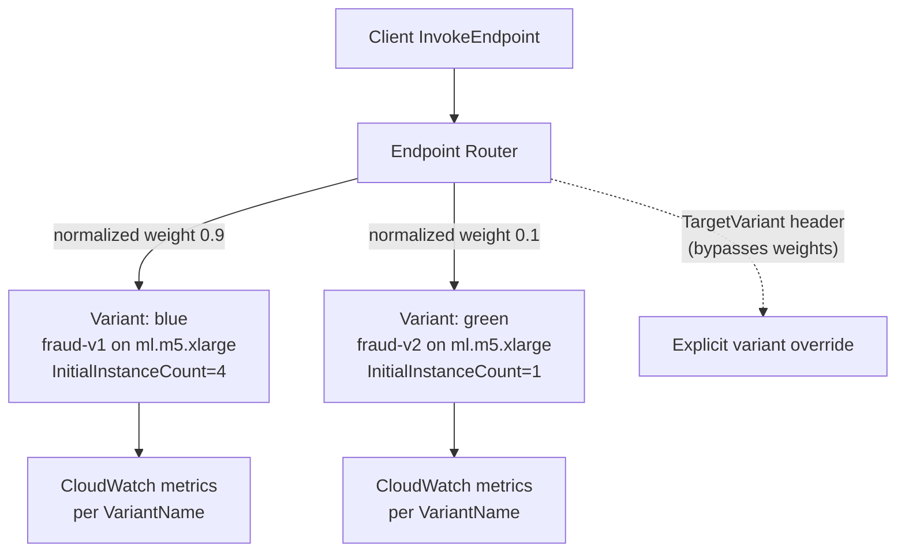
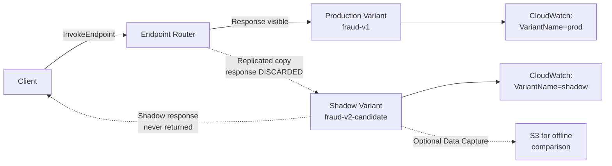
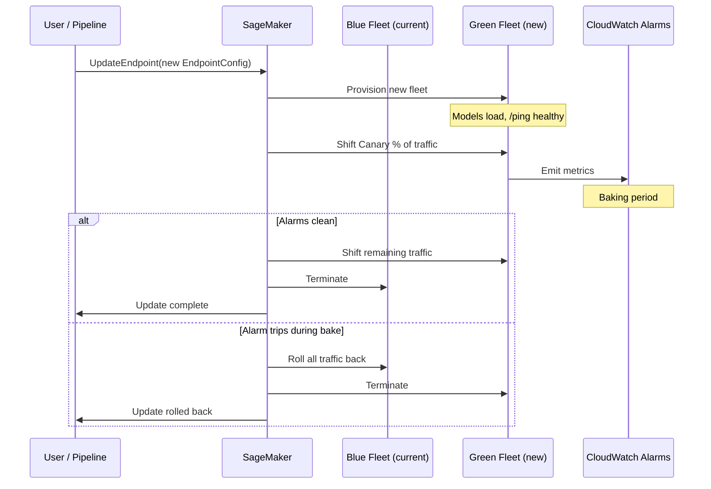

# Chapter 36 — Real-time Endpoints: Production Variants, A/B, Shadow Tests

> **Goal of this chapter:** to make you fluent in the *default* deployment shape of SageMaker — the always-on, sub-second-latency, HTTPS-fronted real-time endpoint — at the level of detail the MLA-C01 exam actually probes and at the level of detail production teams actually need. By the end of the chapter you should be able to (1) draw the `Model → EndpointConfig → Endpoint` triangle from memory, (2) explain how weighted traffic routing through `ProductionVariants` powers A/B testing and canary rollouts, (3) distinguish shadow variants (no client response) from production variants (client-visible response) crisply enough that no exam question can fool you, (4) describe how Inference Components (re:Invent 2023, GA 2024) changed per-model scaling for foundation-model workloads, (5) pick the right endpoint-update strategy — all-at-once, canary, linear, or rolling — for a given risk profile, and (6) name the four CloudWatch metrics that govern whether your auto-scaling and your auto-rollback actually work. Chapter 35 told you that the real-time endpoint is one of four serving shapes. This chapter goes one level deeper inside the real-time shape, where roughly a third of Domain 3 lives.

> **Cross-references.** Forward to Chapter 39 (multi-model endpoints, multi-container endpoints, inference pipelines — the "pack many models on one endpoint" patterns), Chapter 40 (auto-scaling policies in depth), Chapter 52 (the statistical methodology of A/B testing). Back to Chapter 35 (when to pick real-time vs serverless vs async vs batch).

---

## 36.1 Why the real-time endpoint is the default

When a stem on the MLA-C01 says nothing more than "deploy a model," the assumed shape is a real-time endpoint. Every other SageMaker deployment primitive — shadow tests, A/B testing, blue/green deployments, auto-scaling, Model Monitor, deployment guardrails — implicitly assumes you already have a real-time endpoint to attach it to. Three properties make it the default:

1. **Synchronous request-response.** A client `POST`s a payload to `/endpoints/<name>/invocations`, the model runs, the response comes back over the same HTTP connection, typically in tens to low-hundreds of milliseconds. There is no queue, no S3 hop, no asynchronous polling. The interaction shape is identical to any other REST API your application already calls.
2. **Always-on capacity.** Instances are provisioned the moment you create the endpoint and stay warm for as long as it exists. There is no cold start under steady traffic, which is the only way to reliably hit a sub-100ms p99 SLO. The cost of this is that you pay the instance-hour bill whether the endpoint is serving 1,000 RPS or 1 RPS.
3. **Real client-facing behaviour.** Every other deployment shape is either offline (batch), event-driven (async), or has cold-start risk (serverless). Real-time is the only shape that can sit behind a user-facing product feature — search ranking, fraud scoring, chat, recommendation — without architectural compromise.

The exam tests this through scenarios. *"A user-facing chat product needs to score ranking signals at p99 < 80 ms with steady 500 RPS traffic."* The lock-in answer is a real-time endpoint, sized with Inference Recommender, behind a target-tracking auto-scaling policy on `InvocationsPerInstance`. Everything else this chapter discusses — variants, shadow tests, rolling updates — exists in service of *operating* that endpoint safely once it's live.

A subtler point worth pinning before we get into the API surface: the real-time endpoint is the only deployment shape where deployment-time changes are *risky*. A batch transform is a one-shot job; if it fails, you re-run it. An async endpoint absorbs failures into its queue. A serverless endpoint scales to zero so a bad config affects only the next cold start. A real-time endpoint, by contrast, is mid-flight while you change it, and every mistake during an update affects live user traffic. The half-dozen mechanisms this chapter covers — production variants, shadow variants, traffic-shifting modes, auto-rollback alarms, rolling updates — are all there to manage that one risk: *how do I change a thing that cannot stop?*

---

## 36.2 The three-object model: Model → EndpointConfig → Endpoint

Before any traffic-shifting cleverness, anchor the data model. SageMaker's real-time hosting is governed by three objects, and every exam question about endpoint operations leans on knowing which one you mutate to achieve a given outcome.

| Object | What it is | What you can change |
|---|---|---|
| **Model** | An ECR container image URI + S3 model-artifacts URI + execution role + optional `VpcConfig` + optional `EnableNetworkIsolation`. Created by `CreateModel`. | Immutable. To "change the model" you create a new `Model` object and a new `EndpointConfig` that references it. |
| **EndpointConfig** | The blueprint: a list of one or more `ProductionVariants`, optional `ShadowProductionVariants`, optional `DataCaptureConfig`, optional `AsyncInferenceConfig`, optional `KmsKeyId`. Created by `CreateEndpointConfig`. | Immutable. To change variants, weights, or instance types you create a new config and call `UpdateEndpoint`. |
| **Endpoint** | The running HTTPS service. Created by `CreateEndpoint(EndpointConfigName=...)`. Has an `EndpointArn`, status, current config, and emits CloudWatch metrics. | Mutable via `UpdateEndpoint` (which swaps to a new config); deletable via `DeleteEndpoint`. |

The blueprint-vs-runtime distinction is the API-level fact the exam tests most consistently. A question like *"You want to add a 10% canary variant to an existing endpoint; what is the correct sequence?"* always has the same answer:

1. `CreateModel` for the new candidate (if not already created).
2. `CreateEndpointConfig` listing both variants with the new traffic weights (e.g., 0.9 / 0.1).
3. `UpdateEndpoint(EndpointName=..., EndpointConfigName=<new>)`.

There is no `AddVariant` API. The atomic unit of mutation is "swap the EndpointConfig the Endpoint points at."

The minimal `CreateEndpointConfig` call looks like this:

```python
sagemaker.create_endpoint_config(
    EndpointConfigName="prod-config-v3",
    ProductionVariants=[
        {
            "VariantName": "blue",
            "ModelName": "fraud-detector-v2",
            "InitialInstanceCount": 2,
            "InstanceType": "ml.m5.xlarge",
            "InitialVariantWeight": 1.0,
        },
    ],
    DataCaptureConfig={
        "EnableCapture": True,
        "InitialSamplingPercentage": 100,
        "DestinationS3Uri": "s3://my-bucket/datacapture/",
        "CaptureOptions": [{"CaptureMode": "Input"}, {"CaptureMode": "Output"}],
    },
    KmsKeyId="arn:aws:kms:us-east-1:111122223333:key/abcd-...",
)
```

Two of the seven fields above are the ones the exam will probe in plain-English form:

- **`InitialInstanceCount`** — instances **per variant** at endpoint create time. Auto-scaling can then change it. There is no "endpoint-level count" — count is variant-scoped.
- **`InitialVariantWeight`** — the **relative** weight of this variant when SageMaker routes traffic. Weights do not need to sum to 1.0; SageMaker normalises them (so 9 and 1 means 90%/10%). The default if omitted is 1.0.

The design pattern — immutable blueprint, mutable pointer — is the same pattern you see in CloudFormation stacks, Kubernetes Deployments, and EC2 Auto-Scaling Groups. Every endpoint mutation is auditable (CloudTrail records every `UpdateEndpoint` call along with the new `EndpointConfigName`), rollback is one API call (`UpdateEndpoint` back to the previous config — assuming you have not deleted it), and deployment guardrails are simply a server-side orchestrator that calls `UpdateEndpoint` in stages while watching alarms.

---

## 36.3 Production variants — the A/B and canary primitive

### 36.3.1 What a production variant is

From the AWS documentation on *Testing models with production variants*: production variants let you "test the performance of multiple models, model versions, or model configurations within the same endpoint by routing requests according to a variant weight that you specify". Each variant is an independent fleet of instances behind the same endpoint URL.

This is the primitive that powers A/B testing, canary rollouts, and any time you want two versions of a model to coexist on the same endpoint with traffic routed between them.

### 36.3.2 The full `ProductionVariant` field set

| Field | Required | Typical values | Notes |
|---|---|---|---|
| `VariantName` | Yes | `"blue"`, `"green"`, `"v1"`, `"v2"` | Must be unique within the EndpointConfig. Used as the CloudWatch dimension and in the `TargetVariant` header. |
| `ModelName` | Yes | A previously-created `Model` name | The model and its container. |
| `InitialInstanceCount` | Yes | 1, 2, … | Minimum effective floor; auto-scaling will respect its own min/max afterwards. |
| `InstanceType` | Yes | `ml.m5.xlarge`, `ml.g5.2xlarge`, … | Per-variant — you can A/B test instance types as well as models. |
| `InitialVariantWeight` | No (default 1.0) | 0.0 to any positive number | Relative; SageMaker normalises. Setting to 0 means "exists but receives no weighted traffic" — useful when you only want `TargetVariant` invocations. |
| `VolumeSizeInGB` | No | Defaults usually fine | Tune when your container loads large artifacts at startup. |
| `ContainerStartupHealthCheckTimeoutInSeconds` | No | 60–600 typical | Tune when your container has a long model-load step (e.g., large LLM weights). |
| `ServerlessConfig` | No | Memory + max concurrency | Switches the variant to serverless inference. |
| `ManagedInstanceScaling` | No | `MinInstanceCount`, `MaxInstanceCount` | Built-in min/max within the variant for newer endpoint types. |
| `RoutingConfig` | No | `RoutingStrategy=LEAST_OUTSTANDING_REQUESTS \| RANDOM` | Default was random; **LEAST_OUTSTANDING_REQUESTS** (LOR) is the recommended strategy for tail-latency-sensitive workloads and is the default for inference-component endpoints. Gives ~20% lower p99 latency on real traffic. |

### 36.3.3 How weighted routing actually works

When `InvokeEndpoint` arrives without a `TargetVariant` header, the endpoint router uses each variant's normalised weight to pick the fleet:

```
P(route to variant_i) = weight_i / Σ_j weight_j
```

Inside a variant, instances are picked by the `RoutingConfig` strategy (random or LOR). The routing is **stateless** — there is no sticky-session routing across requests. If you need to force the same client to the same variant for a session (e.g., to keep a user's history coherent during an experiment), you do client-side variant pinning: have the client send a fixed `TargetVariant` header for the duration of the session.



### 36.3.4 `TargetVariant` — the explicit override

The `InvokeEndpoint` API accepts a `TargetVariant` header. When present, the router bypasses weights entirely and dispatches to that exact variant. The uses are:

- **Offline evaluation.** Replay historical traffic against the `green` variant only, without disturbing live `blue` weighting.
- **Sticky sessions.** Pin a specific client (an internal QA tenant, a compliance test customer, the developer's own session) to a specific variant for the duration of the experiment.
- **Smoke tests after `UpdateEndpoint`.** Call each variant explicitly via `TargetVariant` and assert health before relying on weighted traffic.
- **Compliance-segmented testing.** A regulator's specific corporate customer must continue to receive the validated v1 model while everyone else receives v2 during migration.

Exam tell: *"How do you force a request to a specific variant for testing without changing weights?"* → **`TargetVariant` header on `InvokeEndpoint`.**

### 36.3.5 The canonical A/B ramp pattern

The textbook canary ramp on production variants takes you from 100/0 to 0/100 in five-or-so stages:

| Stage | Weight blue (v1) | Weight green (v2) | Purpose |
|---|---|---|---|
| 0 | 100 | 0 | Baseline. |
| 1 | 99 | 1 | Smoke — 1% of users see v2; observe `ModelLatency`, error rates, business KPIs. |
| 2 | 90 | 10 | Canary — enough volume for statistical signal; alarm on regressions. |
| 3 | 50 | 50 | Even split — proper A/B for business-metric comparison; needs enough traffic for statistical significance. |
| 4 | 10 | 90 | Reverse canary — confidence has shifted; final regression check. |
| 5 | 0 | 100 | Cutover — v2 owns all traffic. Old variant removed in the next EndpointConfig revision. |

Two important practical points hide in this table.

**First, each stage is a new `EndpointConfig` + `UpdateEndpoint`.** You are not turning a knob; you are rolling a blueprint. There is one exception: the legacy `UpdateEndpointWeightsAndCapacities` API mutates weights in place without reprovisioning the fleet. It is fast (seconds, no new instances), it is exactly what you want for an automated ramp loop, and the [AWS samples MLOps A/B testing pipeline](https://github.com/aws-samples/amazon-sagemaker-ab-testing-pipeline) uses it for exactly this reason. `UpdateEndpoint`, by contrast, triggers blue/green provisioning and takes minutes. Distinguish them: `UpdateEndpoint` for model swaps, `UpdateEndpointWeightsAndCapacities` for weight ramps within an existing variant set.

**Second, statistical significance at the 50/50 stage is not free.** For a conversion-style metric with a 0.5% baseline rate, detecting a 10% relative lift (so 0.5% → 0.55%) at α=0.05 with 80% power needs roughly 30,000–40,000 observations per arm. For noisier metrics (revenue, click-through), multiply by 3–5×. The exam will not ask you to compute the formula, but it does ask for the *order* of the ramp and for the existence of a measured comparison. We cover the methodology in detail in Chapter 52.

### 36.3.6 When NOT to use production variants

Production variants split *user-visible* traffic. If the new model has any chance of degrading user experience, customer satisfaction, or downstream business metrics, you do **shadow first** (Section 36.4) and *then* canary with production variants. Production variants are the right primitive only after you have already validated offline and in shadow, and are ready to expose users to v2.

A second case where production variants are wrong: when "the two models" are actually unrelated and addressable independently. That is a Multi-Container Endpoint (Chapter 39), not a multi-variant endpoint.

### 36.3.7 Exam patterns — production variants

- *"Route 10% of users to v2 with their responses visible."* → Two production variants, weights 0.9 / 0.1 (or a deployment-guardrails canary).
- *"Force a request to a specific variant for reproducible testing."* → `TargetVariant` header on `InvokeEndpoint`.
- *"Run an A/B test for statistical comparison."* → Two production variants at 0.5 / 0.5 with monitoring on business KPIs plus `ModelLatency` and error metrics.
- *"What's the routing default inside a variant?"* → `RANDOM`; switch to **`LEAST_OUTSTANDING_REQUESTS`** for tail-latency-sensitive workloads.
- *"Ramp from 1% to 100% automatically over hours; cheap per step."* → `UpdateEndpointWeightsAndCapacities` in a loop driven by CloudWatch + Lambda + EventBridge.

---

## 36.4 Shadow variants — risk-free comparison

### 36.4.1 The verbatim definition

From the AWS *Shadow tests* documentation: *"With Amazon SageMaker AI you can evaluate any changes to your model serving infrastructure by comparing its performance against the currently deployed infrastructure. Select a production variant you want to test against, and SageMaker AI automatically deploys the new variant in shadow mode and routes a copy of the inference requests to it in real time within the same endpoint. Only the responses of the production variant are returned to the calling application. You can choose to discard or log the responses of the shadow variant for offline comparison."*

That single paragraph is the whole exam definition. The four operational facts behind it are what you need to internalise.

### 36.4.2 What a shadow variant is, operationally

A shadow variant is a second variant inside the same `EndpointConfig`, configured under the `ShadowProductionVariants` block (separate from the regular `ProductionVariants` list). When a request arrives:

1. The endpoint router sends the request to the production variant **and** replicates a sampled copy to the shadow variant.
2. The production variant's response is returned to the caller.
3. The shadow variant's response is **discarded** — or logged to S3 via Data Capture if you have enabled it on the shadow variant for offline comparison.
4. Both variants emit CloudWatch metrics independently, so you can compare `ModelLatency`, `Invocations`, `Invocation5XXErrors`, and so on, side-by-side.

You can also drive shadow tests through the SageMaker AI console's "Shadow tests" workflow (which wraps the `CreateInferenceExperiment` API), which packages this as a guided experience with a fixed start/stop window, a live dashboard, and a "promote or discard" decision at the end.



### 36.4.3 The hard limits (the exam questions)

| Constraint | Value | Why the exam cares |
|---|---|---|
| Max shadow variants per endpoint | **1** | If a question offers "two shadow variants for parallel testing", it's wrong. |
| Max production variants when a shadow variant is present | **1** | Shadow mode is mutually exclusive with multi-variant A/B. You can have shadow ↔ prod, not shadow ↔ {prod-a, prod-b}. |
| Sampling % | Configurable (1–100%) | Shadow only a portion when compute is expensive. |
| Outcome | **Promote** (shadow becomes the production variant) **or discard** | Promotion is a normal `UpdateEndpoint` to a new config that swaps roles. |
| Endpoint feature compatibility | **Incompatible with**: Serverless inference, Asynchronous inference, Marketplace containers, Multi-container endpoints, Multi-model endpoints, Inf1 instances | Memorise this list — the exam tests it directly. |

> ⚠️ **Exam alert — Shadow ≠ A/B.** A shadow variant **does not return its response to the client**. Its purpose is to validate latency, throughput, error behaviour, and (when Data Capture is on) output distribution — not to measure business KPIs like conversion or click-through. If the question says "compare the two models on real user behaviour" or "measure which one drives more revenue," the answer is production variants (A/B), not shadow. If the question says "test the new container with real traffic without any chance of affecting users," the answer is shadow. The single discriminator is *user-visible response*.

### 36.4.4 Shadow vs production-variant A/B — the contrast table

| Aspect | Shadow variant | Production variant (A/B / canary) |
|---|---|---|
| User-visible response from new model | **No** | Yes |
| Tests latency / errors / infra behaviour | Yes | Yes |
| Tests business metrics (conversion, revenue, CTR) | **No** (responses discarded) | Yes |
| Risk of degrading UX during test | **Zero** | Non-zero (whatever fraction of traffic is on v2) |
| Max instances of "new" model | 1 | Up to 10 production variants per endpoint |
| Compatible with MME/MCE/serverless/async | **No** | Yes (for MME/MCE) |
| Use when | Pre-launch comparison; container patches; instance-type changes; vulnerability patches | Post-launch ramp; need user-visible KPIs; deployment cutover |

Mental model: **shadow tests the plumbing, A/B tests the impact.** If the question is "would the new container break under real load?" → shadow. If the question is "does v2 actually convert better?" → A/B with production variants and a long enough test window for significance. Mature teams almost always sequence them: shadow first to catch failure modes, then A/B for behavioural comparison.

### 36.4.5 What you can shadow-test (per AWS docs)

- A new **model** (different weights, different architecture).
- A new **container** (patched serving runtime, new framework version, security fix).
- A new **instance type** (`ml.m5.xlarge` → `ml.c6i.xlarge` cost optimization; `ml.g4dn` → `ml.g5` GPU upgrade).
- A new **endpoint configuration** parameter (`ContainerStartupHealthCheckTimeoutInSeconds`, `VolumeSizeInGB`).

### 36.4.6 The cost reality of shadow tests

This is the part most candidates miss. Shadow variants are priced identically to production variants — you pay the full ML-instance hourly rate for the shadow fleet for the full duration of the test. A 7-day shadow test on a matched 4× `ml.g5.4xlarge` fleet costs roughly $1,090 in instance-hours. For a frontier-class deployment on `ml.p5.48xlarge` (8× H100, ~$98/hr/instance), a week-long shadow test on a matched 8-instance fleet runs to roughly $132,000. The decision is rarely "should we shadow-test at all" — it is "for how long, with what sampling rate, and against which subset of candidate changes." Treat shadow as a budgeted activity, not a free safety net.

### 36.4.7 Exam patterns — shadow

- *"Validate a new container patch with real traffic before promoting."* → Shadow variant (not canary).
- *"Compare a new instance type without affecting users."* → Shadow variant, sampled at 100% if traffic is light, for a few hours; compare `ModelLatency` and `OverheadLatency` in CloudWatch.
- *"Gather A/B business metrics across two model versions."* → Production variants, not shadow (shadow discards responses; no business outcome can be observed).
- *"Test a new model on an async endpoint without user impact."* → Trick — shadow does not support async; use a client-side dual-write or a parallel async endpoint.

---

## 36.5 Inference Components (2024) — per-model scaling on shared instances

### 36.5.1 What changed and why

Before Inference Components (ICs), packing multiple models onto a shared endpoint meant Multi-Model Endpoints (MMEs) — one container, many model artifacts loaded on demand from S3, shared instance pool. MME's limitation is that scaling is endpoint-wide, not per-model. If model A gets 1,000 RPS and model B gets 10 RPS, MME scales the whole instance fleet up because the *average* per-instance load matters; you cannot scale individual models. For long-tail catalogues of small models that's fine. For foundation models — where each model is large, traffic is heterogeneous, and idle GPU memory is real money — it is wasteful.

Inference Components, announced at re:Invent 2023 and reaching general availability in 2024, fix exactly that. Each model becomes a first-class object with its own copy count, its own scaling policy, its own resource reservation, and its own lifecycle. SageMaker bin-packs these components across the underlying instance fleet. Per the AWS announcement, the typical cost reduction is "an average of 50 percent" for foundation-model workloads with heterogeneous traffic.

### 36.5.2 The Salesforce case study — the 8× figure

The headline case study is Salesforce's CodeGen ensemble (Inline, BlockGen, FlowGuru variants for Apex code generation, powering ApexGuru). Per the joint Salesforce/AWS engineering write-up: model sizes ranged from 7 GB to 30 GB; before ICs, each model ran on its own Single Model Endpoint on `ml.p4d.24xlarge` (8× A100 GPUs, $32.77/hr on-demand); a 15 GB model uses at most one of those 8 GPUs, leaving 7 idle. After consolidation onto shared IC endpoints on the same hardware, with each IC pinned to N GPU copies and SageMaker bin-packing across the instance, idle GPUs filled with smaller models or additional hot-model copies. Result: **up to an 8× reduction** in deployment and infrastructure cost. The 8× is the worst-case-before vs best-case-after; typical realised savings sit in the 3–5× range, which on a mid-six-figures-per-month inference budget is still substantial.

### 36.5.3 The new object: `InferenceComponent`

Created via `CreateInferenceComponent`:

```python
sagemaker.create_inference_component(
    InferenceComponentName="llama-7b-chat",
    EndpointName="shared-llm-endpoint",
    VariantName="AllTraffic",
    Specification={
        "ModelName": "llama-7b-chat-model",
        "ComputeResourceRequirements": {
            "NumberOfAcceleratorDevicesRequired": 1,
            "MinMemoryRequiredInMb": 16000,
            "NumberOfCpuCoresRequired": 4,
            "MaxMemoryRequiredInMb": 24000,
        },
        "StartupParameters": {
            "ModelDataDownloadTimeoutInSeconds": 600,
            "ContainerStartupHealthCheckTimeoutInSeconds": 600,
        },
    },
    RuntimeConfig={
        "CopyCount": 2,  # number of model copies you want running
    },
)
```

The endpoint itself is created with no `ModelName` on the variant — the variant declares it is an inference-component-backed variant by leaving the model slot empty, and subsequent `CreateInferenceComponent` calls populate the actual models.

### 36.5.4 Routing to inference components

Clients invoke with the `InferenceComponentName` header on `InvokeEndpoint`. SageMaker uses the `LEAST_OUTSTANDING_REQUESTS` routing strategy to pick which of the `CopyCount` copies (across all variant instances) gets the request. Per the AWS announcement, LOR delivers approximately 20% lower latency on average compared to random routing.

### 36.5.5 Per-component auto-scaling — `InvocationsPerCopy`

Each inference component has its own scaling policy. The canonical metric is **`InvocationsPerCopy`** — number of invocations per running copy of that specific component. Target-tracking scales the component's `CopyCount` independently of every other component on the same endpoint. The instance fleet underneath is managed by SageMaker — when the sum of component requirements exceeds what current instances can serve, SageMaker adds an instance; when component demand drops, it can pack copies onto fewer instances and shrink the fleet.

This is the single biggest mental shift versus MME: **you scale models, SageMaker scales instances.**

### 36.5.6 Scale-to-zero for inference components (November 2024)

A November 2024 launch lets an inference component scale to **0 copies** when it sees no traffic for the configured idle window. The endpoint itself stays up; the IC's models are unloaded. New requests trigger a cold load — AWS quotes around 15 minutes to first response for a Llama 3 8B without optimisations, dropping substantially with container caching and optimised model loading. This is the right pattern for "internal model used by one team for batch-style queries during business hours." Foreshadowed in Chapter 40 (auto-scaling), the scale-to-zero feature does not eliminate cold-start risk but does eliminate idle cost.

### 36.5.7 Inference components vs MME — the comparison table

| Aspect | Inference Components (2024) | Multi-Model Endpoint (MME) |
|---|---|---|
| Scaling unit | Per-component (`CopyCount`, scales on `InvocationsPerCopy`) | Per-endpoint (`InstanceCount`, scales on `InvocationsPerInstance`) |
| Model lifecycle | Independent `CreateInferenceComponent` / `UpdateInferenceComponent` / `DeleteInferenceComponent` | All models share the endpoint; managed via S3 prefix |
| Routing header | `InferenceComponentName` | `TargetModel` |
| Routing strategy | `LEAST_OUTSTANDING_REQUESTS` (default) | Cache-warmth-aware on `TargetModel` |
| Resource reservation | Explicit per component (CPU cores, memory, accelerators) | Implicit (shared) |
| Cold start on first hit | Loading the component (warm copies handle steady traffic) | Loading the model `.tar.gz` from S3 |
| Designed for | Foundation models, heterogeneous traffic, dozens of large models | Hundreds-to-thousands of small similar models |
| Cost win | ~50% on FM workloads with uneven demand | Big on many small models with low individual QPS |
| GPU / Graviton support | GPU first-class (FM use case); Graviton support evolving | MME does **not** support Graviton |
| Rolling update support | Yes — Rolling Updates for Inference Components (2024) | No (only blue/green) |
| Scale-to-zero | Yes (per IC, 2024) | No |

### 36.5.8 Exam patterns — inference components

- *"Deploy 4 different LLMs on a shared GPU endpoint with independent scaling per model."* → Inference components, one per LLM, each with its own `CopyCount` and scaling policy on `InvocationsPerCopy`.
- *"Reduce FM deployment cost by ~50% without rewriting clients."* → Inference components (matches the AWS launch narrative).
- *"Update one model on a multi-model endpoint without affecting the others."* → Rolling Updates for Inference Components.
- *"Recommended scaling metric for inference components."* → `InvocationsPerCopy` (not `InvocationsPerInstance`).

The MME/MCE/inference-pipeline cluster of patterns is covered in depth in Chapter 39; here we just note that ICs are the modern answer for the "few large models on shared GPUs" case, and MMEs remain right for the "thousands of small models" case.

---

## 36.6 Endpoint update strategies — blue/green and rolling

Every `UpdateEndpoint` is a blue/green operation under the hood. SageMaker provisions a **green fleet** with the new config, shifts traffic per your traffic-shifting policy, observes alarms during the **baking period**, and then terminates the **blue fleet**. The exam tests four shifting modes plus the 2024 rolling-update path for inference components.



### 36.6.1 All-at-once traffic shifting

Per the AWS deployment-guardrails docs: *"Shifts all of the traffic to the new fleet in a single step. Pros: minimizes overall update duration. Cons: regressive updates affect 100% of the traffic. Use this option to minimize update time and cost."*

- **Pros:** fastest cutover; you are billed for both fleets only briefly.
- **Cons:** highest blast radius if the new fleet is bad.
- **Use when:** dev/test, non-critical workloads, fast cutover desired, trust in pre-prod validation is high.

### 36.6.2 Canary traffic shifting

Per the AWS docs: *"Traffic shifts in two steps. The first (canary) step shifts a small portion of the traffic followed by the second step, which shifts the remainder of the traffic."*

A small slice (you pick: typical 10–25%) moves first; a baking period observes CloudWatch alarms. If clean, the remaining traffic moves all at once. If any alarm trips during the canary baking period, **auto-rollback** to blue. Best for production with a defined canary tolerance and tight alarms.

### 36.6.3 Linear traffic shifting

Per the AWS docs: *"A fixed portion of the traffic shifts in a pre-specified number of equally spaced steps. Minimizes the risk of regressive updates by shifting traffic over several steps. The update duration and cost are proportional to the number of steps."*

For example, 10% every 3 minutes over 10 steps. Each step has its own baking period with alarm monitoring. Use when the workload is critical, observability is strong, and you can afford the longer dual-fleet runtime.

### 36.6.4 Rolling Updates for Inference Components (2024)

Different beast entirely. Instead of provisioning a green fleet, SageMaker updates **component copies incrementally within the existing instance fleet**:

- You specify a `MaximumBatchSize` (how many copies to update at once) and a `RollbackMaximumBatchSize`.
- SageMaker rolls each batch through update + health check before proceeding.
- On health-check failure, **only the affected component** rolls back; the endpoint as a whole keeps serving.
- **Cheaper** than blue/green (no doubled fleet during the bake).
- **Faster** than blue/green (no green-fleet provisioning lag).
- **Available only for inference-component endpoints.**

> ⚠️ **Exam alert — Rolling updates are IC-only.** "Rolling Updates for Inference Components" is the only deployment-shifting mode that does not double the fleet during the bake, and it is only available on endpoints backed by Inference Components. If a stem says "rolling update on a standard production-variant endpoint," that construct does not exist — the correct answer is one of canary, linear, or all-at-once. Conversely, if the stem says "update one of many models without provisioning a green fleet," the lock-in answer is Rolling Updates for Inference Components.

### 36.6.5 Auto-rollback on CloudWatch alarms

For all three traffic-shifting modes (all-at-once, canary, linear), you supply a list of CloudWatch alarm ARNs in the update request. If any of them trip during a baking period, SageMaker rolls back automatically. The alarm set used by mature teams looks like this:

| Alarm | Threshold (typical) | Why |
|---|---|---|
| `Invocation5XXErrors` per variant | > 1% over 5 min, 2 datapoints | Catches infra/container crashes. Critical. |
| `Invocation4XXErrors` per variant | > 5% over 5 min, 2 datapoints | Catches input-validation regressions (new model rejecting valid payloads). |
| `ModelLatency` p99 per variant | > 1.5× baseline | Catches subtle perf regressions before they cascade. |
| **App-level error rate** (custom metric from your app) | > 1.1× baseline | The only alarm that catches *semantic* regressions — model returning wrong-but-200 answers. The other four are infra metrics. |
| `OverheadLatency` per variant | > 2× baseline | Catches AWS-side or scale-out regressions. |

> ⚠️ **Exam alert — Auto-rollback requires CloudWatch alarms.** Auto-rollback triggers from CloudWatch alarms *tripped during a baking period* — not from raw metric values, not from log-line patterns, not from manual intervention. The alarm must be in `OK` state when the deployment starts (a pre-existing `ALARM` state will refuse the deployment with a generic error). And the alarm must be referenced by ARN in the `AutoRollbackConfiguration.Alarms` array on `UpdateEndpoint`. If a stem says "the new model started returning bad responses and SageMaker did not roll back automatically," check whether the question gives you an *alarm* configured for that condition, or whether it only gives you a *metric*. The metric alone is insufficient.

### 36.6.6 The billing detail the exam tests

From the AWS docs: *"For blue/green deployments that involve multiple stage traffic shifting or baking periods, you are billed for both the fleets for the duration of the update, irrespective of the traffic to the fleet. This is in contrast to blue/green deployments with all at once traffic shifting and no baking periods, where you are only billed for one fleet during the course of the update."*

Translation: **canary and linear cost more during the rollout than all-at-once**, because both blue and green are running for the entire bake. The trade-off is risk versus cost; the exam expects you to know the trade exists.

### 36.6.7 Comparison table

| Mode | Steps | Bake | Doubled fleet during update | Risk | Best for |
|---|---|---|---|---|---|
| All-at-once | 1 | Optional | Brief | High | Dev/test, fast cutover |
| Canary | 2 | Yes (after step 1) | Yes (full duration) | Medium | Production with canary tolerance |
| Linear | N (≥2) | Yes (after each step) | Yes (full duration) | Low | Critical production, generous bake budget |
| Rolling Updates for ICs | Component-by-component | Per batch | **No** | Low | Inference-component endpoints; per-model updates |

### 36.6.8 Exam patterns — rollout strategy

- *"Minimise blast radius of a bad model update."* → Linear with tight CloudWatch alarms and a generous bake.
- *"Fastest possible cutover, low-stakes update."* → All-at-once.
- *"Test new model with 10% of users; auto-rollback if errors spike."* → Canary + alarms.
- *"Update one of many inference components without provisioning a green fleet."* → Rolling Updates for Inference Components.
- *"Test without exposing the new model's responses to any user."* → Shadow variant (this is **not** a deployment-guardrails mode — it is a separate primitive).

---

## 36.7 The `InvokeEndpoint` API surface and per-request routing headers

### 36.7.1 The runtime call

The HTTP call is `POST` to `/endpoints/<endpoint-name>/invocations` on `runtime.sagemaker.<region>.amazonaws.com`, with `application/json` (or whatever your container's `Content-Type` is). The Python SDK wraps it as `boto3.client('sagemaker-runtime').invoke_endpoint(...)`.

### 36.7.2 The routing headers — the exam-relevant table

| Header / parameter | When used | What it does |
|---|---|---|
| `EndpointName` | Always | Picks the endpoint. |
| `ContentType` | Always | MIME type of the body. |
| `Accept` | Optional | Desired response MIME. |
| `Body` | Always | The payload (≤ 6 MB for real-time). |
| **`TargetVariant`** | A/B testing | Force routing to a specific production variant by `VariantName`. |
| **`TargetContainerHostname`** | Multi-container endpoint (direct mode) | Pick a specific container by hostname. |
| **`TargetModel`** | Multi-model endpoint | Pick which `.tar.gz` model artifact to load/use (relative S3 key). |
| **`InferenceComponentName`** | Inference-component endpoints | Route to a specific inference component. |
| `CustomAttributes` | Optional | Free-form string passed through to the container (e.g., feature flags). |
| `InferenceId` | Optional | For end-to-end traceability across logs and Data Capture. |
| `EnableExplanations` | Optional | When using SageMaker Clarify online explainability. |

The exam loves to mix and match these. *"Which header would you use to pick a specific model in an MME?"* → `TargetModel`. *"Which header forces a specific variant?"* → `TargetVariant`. Do not confuse them — they live at *different layers* of the routing stack: variant → container → model **or** inference component.

A streaming variant exists: `InvokeEndpointWithResponseStream` (2023) returns partial tokens as they are generated, for generative-AI use cases where the container supports response streaming. Worth knowing exists; the exam mentions it lightly under the generative-AI questions.

---

## 36.8 Endpoint metrics — the canon

Real-time endpoints emit a fixed set of CloudWatch metrics under namespace **`AWS/SageMaker`**, dimensioned by `EndpointName` and `VariantName` (and for inference components, by `InferenceComponentName` as well).

| Metric | Unit | What it means | Exam relevance |
|---|---|---|---|
| **`Invocations`** | Count | Total successful invocations | Traffic baseline; alarm baseline. |
| **`InvocationsPerInstance`** | Count | Invocations divided by current instance count | Recommended target-tracking metric (variants, MME). |
| **`InvocationsPerCopy`** | Count | Invocations per inference-component copy | Recommended scaling metric for ICs. |
| **`ModelLatency`** | Microseconds | Time spent inside the container (model + serialization) | Model-side latency. Tune the model / container to move this. |
| **`OverheadLatency`** | Microseconds | Time spent outside the container (SageMaker runtime/proxy) | Infra-side latency. Largely fixed; scale-out / instance choice influence it. |
| **`Invocation4XXErrors`** | Count | 4xx responses | Bad client behaviour: malformed payload, oversized request. |
| **`Invocation5XXErrors`** | Count | 5xx responses | Server failures: model crash, OOM, timeout. Canonical auto-rollback alarm. |
| **`InvocationModelErrors`** | Count | Container-emitted model errors | Distinguishes model logic errors from infra errors. |
| **`CPUUtilization`** | Percent | Per-instance CPU | Scaling, right-sizing. |
| **`MemoryUtilization`** | Percent | Per-instance RAM | Watch for OOM on big-model endpoints. |
| **`DiskUtilization`** | Percent | Per-instance EBS | Often the surprise alarm on long-running endpoints. |
| **`GPUUtilization`** | Percent | Per-instance GPU | GPU endpoints only; useful for GPU scaling. |
| **`GPUMemoryUtilization`** | Percent | Per-instance GPU memory | Useful for large-model endpoints. |

### 36.8.1 The latency decomposition rule

End-to-end client-observed latency =

```
OverheadLatency + ModelLatency + network RTT from client to AWS region
```

Exam pattern: *"`ModelLatency` is fine but end-to-end latency spikes."* → Look at `OverheadLatency` (often during scale-out events: cold instances, queueing) or at the client-side network. The exam wants you to know the two metrics are independent and that `ModelLatency` does not include SageMaker infrastructure time.

### 36.8.2 The auto-scaling metric choice — and the trap

The reflex answer to "what metric should I auto-scale on" is `ModelLatency`. It is almost always wrong. Latency-based scaling is **reactive** — by the time latency has degraded enough to trip a scaling threshold, you have already missed SLO for a window, and the scale-out itself takes another 2–15 minutes to deliver new capacity (longer for large models on GPU). Invocations-based scaling is **load-based** — it scales when load increases, before latency degrades, with the threshold set to the load level at which latency *would* start degrading.

> ⚠️ **Exam alert — `InvocationsPerInstance`, not `CPUUtilization`, not `ModelLatency`.** The AWS-recommended auto-scaling target metric for real-time endpoints (and for MMEs) is **`SageMakerVariantInvocationsPerInstance`**. For Inference Components it is **`InvocationsPerCopy`**. `CPUUtilization` and `GPUUtilization` are *lagging* indicators — by the time CPU is pegged you are already throttling requests. `ModelLatency` is a *symptom* metric — useful as a paging alarm, not as a scaling target. If a question gives you all four options for an auto-scaling metric, the right answer is whichever of `InvocationsPerInstance` (variants/MME) or `InvocationsPerCopy` (ICs) matches the endpoint type.

The formula from the AWS load-testing best-practices blog:

```
target_invocations_per_instance = MAX_RPS_PER_INSTANCE × SAFETY_FACTOR × 60
```

`MAX_RPS_PER_INSTANCE` comes from load testing — the per-instance RPS at which p99 latency starts to climb. `SAFETY_FACTOR` starts at 0.5 (target = half of measured max), tightens to 0.7–0.8 once you trust your load-test numbers. `× 60` converts per-second to per-minute (the metric is per minute).

Example: if a model handles 4 RPS per instance at acceptable latency, target = 4 × 0.5 × 60 = **120 invocations per minute per instance**. Set `TargetValue=120` with `SageMakerVariantInvocationsPerInstance` and SageMaker scales before per-instance load exceeds 120.

### 36.8.3 Cool-down dynamics

- **Scale-out cooldown** short (e.g., 60s): react quickly to load.
- **Scale-in cooldown** long (e.g., 300–600s): prevent thrashing.

The exam tests the *concept* of cooldown (preventing flap) more than specific numbers. Chapter 40 walks through the full auto-scaling playbook including step scaling (the only way to scale a real-time variant from zero), scheduled scaling for known daily peaks, and the IC-specific dynamics.

---

## 36.9 TLS, VPC, and IAM for real-time endpoints

### 36.9.1 TLS — automatic, server-managed

Real-time endpoints terminate TLS automatically at `runtime.sagemaker.<region>.amazonaws.com`. The certificate is AWS-managed (via ACM internally) — you do not see or manage it. You **cannot** install a custom certificate on a SageMaker-managed endpoint. If you need a custom DNS name with your own cert (e.g., `api.mycompany.com`), front the endpoint with API Gateway or an Application Load Balancer that holds the cert and reverse-proxies to SageMaker.

`InvokeEndpoint` from a client always goes over TLS 1.2+; this is non-negotiable.

### 36.9.2 Private invocation via VPC Interface Endpoint

For callers in a private VPC who must not traverse the internet to call SageMaker runtime, create an **Interface VPC Endpoint** for `com.amazonaws.<region>.sagemaker.runtime`. The runtime DNS resolves to private IPs in your VPC, and `InvokeEndpoint` flows entirely over the AWS backbone. Pair this with `EnableNetworkIsolation=true` on the Model for end-to-end isolated invocation — the container can be reached only via SageMaker runtime, and the container itself cannot call out.

### 36.9.3 `VpcConfig` on the Model

When the *container* needs to reach private resources (RDS, ElastiCache, internal feature stores, on-prem via Direct Connect), set `VpcConfig` on the Model with at least 2 subnets in different AZs and a security group. SageMaker creates ENIs in your VPC and attaches them to inference containers.

### 36.9.4 `EnableNetworkIsolation`

A boolean on the Model. When `true`:

- Container has **no outbound network access**, including to AWS services (S3, KMS, ECR, IAM).
- **No AWS credentials are propagated** into the container.
- Model artifacts must already be on the container's filesystem (downloaded by SageMaker before container starts).

Combine with `VpcConfig` for maximum isolation: ingress only via SageMaker runtime, egress blocked entirely. This is the canonical configuration for PHI/PII workloads or for third-party Marketplace containers that must not exfiltrate data.

### 36.9.5 KMS encryption at rest

`KmsKeyId` on `CreateEndpointConfig` encrypts the EBS volumes attached to instances. Model artifacts in S3 are encrypted per your bucket policy / SSE settings. Captured data from `DataCaptureConfig` is encrypted per the destination S3 bucket's encryption configuration.

### 36.9.6 IAM surface

- **Execution role on the Model** — used by the container to pull model artifacts from S3, write logs to CloudWatch, pull the container image from ECR. Strip down to least-privilege.
- **Caller role calling `InvokeEndpoint`** — needs `sagemaker:InvokeEndpoint` on the endpoint ARN.
- **Creator role on the Endpoint** — needs `sagemaker:CreateEndpoint`, `sagemaker:UpdateEndpoint`, and `iam:PassRole` for the execution role.

### 36.9.7 Exam patterns — TLS / VPC / IAM

- *"How do I serve a SageMaker endpoint at `api.mycompany.com` with my own cert?"* → Front with API Gateway or ALB; SageMaker itself does not accept custom certs.
- *"Caller in a private VPC must reach the endpoint without internet."* → Interface VPC endpoint for `sagemaker.runtime`.
- *"Block the third-party container from any outbound calls."* → `EnableNetworkIsolation=true`.
- *"Container must reach RDS in a private subnet."* → `VpcConfig` with subnets + SG; isolation off.

---

## 36.10 Production stories — how mature teams operate variants and shadows

A handful of patterns recur across the published case studies of A/B testing and endpoint operations at scale. Three are worth internalising because the exam frames scenario questions around them.

### 36.10.1 The auto-ramp pattern — Lambda + CloudWatch + EventBridge

The canonical "automated A/B ramp" pattern, described in the AWS samples MLOps A/B testing pipeline and used by mid-to-large AWS-native shops, looks like this:

1. Endpoint deployed with two variants, weights `99` and `1` (so 1% canary).
2. Every endpoint invocation writes `(variant_id, latency, status_code)` to a Kinesis Firehose stream.
3. Firehose lands events to S3 every 60 seconds.
4. An S3 trigger fires a Lambda that aggregates the batch into DynamoDB (running counts of success/error/latency-p99 per variant) and emits custom CloudWatch metrics: `CandidateErrorRate`, `BaselineErrorRate`, `CandidateLatencyP99`.
5. A scheduled Lambda (EventBridge cron, every 15 minutes) reads the rolling 1-hour metric window. If `CandidateErrorRate` is within 1.1× of `BaselineErrorRate` AND `CandidateLatencyP99` is within 1.2× of baseline AND a minimum sample size is met, it calls `UpdateEndpointWeightsAndCapacities` to step the ramp: 1% → 5% → 15% → 50% → 100% over roughly 8 hours. If any guardrail fails, it rolls back to 0% candidate.
6. A CloudWatch composite alarm on "candidate error rate > 2× baseline for 3 consecutive 5-min periods" pages on-call and triggers an immediate flip to 100/0.

The Lambda code is about 80 lines. What separates teams that do this well from teams that don't is the **minimum sample size check** in step 5 — without it, the ramp logic will happily promote a model at 3 a.m. on Sunday when traffic is 50 req/min and the candidate has seen only 12 inferences total.

### 36.10.2 Netflix and Pinterest — the OEC and the kill-switch

At Netflix's scale, A/B testing of ranking models is continuous, not episodic. The two operational practices most worth importing:

- **OEC (Overall Evaluation Criterion).** Netflix uses *viewing hours*, not click-through, as its OEC. Click-through alone is a vanity metric — clicks that don't lead to watching are noise. The choice of OEC dominates everything else; a model that wins on CTR can lose on watch-time and vice versa. The lesson for the MLE: when you're wiring CloudWatch alarms for an A/B ramp, the *business* alarm matters more than the *infra* alarm, and the business alarm needs the right denominator.
- **Guardrail metrics with kill-switches.** Both Netflix and Pinterest run with kill-switches on guardrail metrics (latency, error rate, downstream system load). An A/B can be winning on the OEC and still get killed because p99 latency degraded enough to affect adjacent products. The MLE implements this as a CloudWatch composite alarm that triggers `UpdateEndpointWeightsAndCapacities` back to baseline, independent of the ramp's OEC logic.

### 36.10.3 Salesforce — the inference-components story

The IC adoption story at Salesforce (Section 36.5.2) is the canonical "shared GPU endpoint" case study. Three operational details worth knowing:

- **Bin-packing is opaque but predictable.** SageMaker decides which copies live on which instances; you do not. What you control is the resource declaration on each IC (`NumberOfAcceleratorDevicesRequired`, `MinMemoryRequiredInMb`). Get these right and bin-packing follows.
- **Heterogeneous traffic is the win.** ICs pay off when one model gets 10× the traffic of another. If traffic is uniform across all models, you do not need per-model copy counts — MME or a plain single-model endpoint may be cheaper.
- **Rolling updates are the operational unlock.** Pre-rolling-updates, updating an IC meant a blue/green: provision a *full duplicate fleet*, swap, tear down. For a 16-instance P5 fleet at roughly $98/hr/instance, the duplicate fleet costs about $1,568/hr during the swap. Rolling updates batch the change, use 2–3 extra instances total, and the per-update cost drops by an order of magnitude.

### 36.10.4 The failure stories — what actually goes wrong

A few recurring shapes synthesised across published post-mortems and AWS support threads:

1. **The "alarm in alarm state at deployment time" trap.** If the CloudWatch alarm you are using for auto-rollback is already in `ALARM` state when you start the deployment, SageMaker treats it as tripped and refuses to deploy. Always pre-flight-check your alarms before kicking a deployment.
2. **The "baking period too short" trap.** Default baking period in many tutorials is 5 minutes. For a B2B model that gets 50 req/min, 5 minutes is 250 inferences total — not enough to trip a 1% error-rate alarm even if the model is broken. Bake for at least one full traffic cycle, which for most B2B is 30–60 minutes minimum.
3. **The "model so big the canary instance OOMs" disaster.** Canary mode spins up a canary fleet sized to handle 10% of traffic. If the new model needs more memory than the old model and you didn't upsize the instance type, the canary instance OOMs at the first batch of real requests. CloudWatch alarm fires on 5XX. Auto-rollback kicks in — but only after enough 5XXs to cross the threshold, meaning some customers got 500s. Lesson: validate memory headroom in a shadow test *before* the canary deployment.
4. **The "ModelLatency fine, customers complaining" disaster.** New model deployed, infra alarms clean, app team starts getting CX complaints because the model is returning the *wrong* category for 30% of requests. ModelLatency is fine. Error rate is fine. The model is just *wrong*. Without an app-level CloudWatch metric tied to the rollback config, the canary completes and 100% of traffic hits the broken model. The app-level metric is the one teams forget.

---

## 36.11 Worked examples — pattern recognition at exam pace

### Example 1 — A/B with statistical significance

> *Your team wants to compare a new fraud-detection model (v2) against v1 in production. Daily traffic is 1 M predictions; baseline fraud rate is 0.5%. You want to detect a 10% relative lift in fraud-catch rate. Design the experiment.*

**Pick:** Two production variants, 50/50 split (`InitialVariantWeight: 1.0 / 1.0`). Enable Data Capture on both. Compute the catch-rate per variant from labelled outcomes downstream. With baseline 0.5%, detecting a 10% relative lift to 0.55% at 80% power and α=0.05 needs ~3–4 M events per arm — that's a few days of traffic. Use a canary ramp first (1% → 10% → 50%) if v2 is untested. Wire auto-rollback alarms on `Invocation5XXErrors` and `ModelLatency` p99 during the ramp.

### Example 2 — Shadow test for a container patch

> *A security audit requires patching the serving container's Java runtime. The model itself does not change. You want zero user-visible risk.*

**Pick:** Build the patched container image, register a new `Model` referencing it (same model artifacts), add it as a shadow variant on a new `EndpointConfig` with 100% sampling, `UpdateEndpoint`. Run for 24 hours. Compare `ModelLatency`, `OverheadLatency`, `Invocation5XXErrors` between variants in CloudWatch. If clean, promote the shadow to production (new EndpointConfig that swaps roles + `UpdateEndpoint`); otherwise discard.

### Example 3 — Inference components for FM hosting

> *Your team hosts four different LLMs (a 7B, a 13B, a 70B-quantized, and an embedding model) for an internal chat product. Traffic is wildly heterogeneous — the embedding model gets 10× the QPS of any chat model. Minimise cost.*

**Pick:** Inference components, one per model, on a shared GPU endpoint. Each component declares its accelerator/memory needs and a `CopyCount`. Apply per-component auto-scaling on `InvocationsPerCopy` with separate targets. The embedding model scales out independently of the 70B without paying for idle 70B capacity. Use Rolling Updates for Inference Components to update any individual model in place.

### Example 4 — Minimise blast radius for a credit-scoring model

> *You are rolling out a new credit-scoring model. The regulator demands evidence of controlled rollout. You have CloudWatch alarms on `ModelLatency` p99 and `Invocation5XXErrors`. Cost of a doubled fleet for an hour is acceptable.*

**Pick:** Linear traffic shifting (e.g., 10% every 6 minutes over 10 steps) with the two alarms wired in for auto-rollback. Captures regressions in the first 10% before more users are exposed. Each step has its own baking period; if any alarm trips, full automatic rollback to blue.

### Example 5 — Diagnose a latency spike during update

> *During a blue/green update, you observe `OverheadLatency` p99 doubled while `ModelLatency` p99 stayed flat. Root cause?*

**Pick:** The green fleet is still scaling out — incoming traffic is being queued and routed across a fleet that has not fully warmed up. `ModelLatency` is per-request-once-it-runs and looks fine; `OverheadLatency` includes queueing and infra. Mitigation: increase `InitialInstanceCount` on the green variant, switch to canary/linear so traffic ramp is gradual relative to fleet warm-up, or tune `ContainerStartupHealthCheckTimeoutInSeconds` if `/ping` is slow to come up.

### Example 6 — Test on async endpoint without user impact

> *You want to test a candidate model on an async endpoint without affecting any callers.*

**Pick:** Trick — shadow variants are **not supported on async endpoints**. The legitimate paths are (a) client-side dual-write to two async endpoints and compare results offline, or (b) test on a parallel real-time endpoint with a shadow variant, accepting that the latency profile will differ.

---

## 36.12 Cheat sheet — the 30-second answer keys

| Phrase in stem | Lock-in answer |
|---|---|
| "Test new model with real traffic, no user impact" | **Shadow variant** (1 shadow + 1 prod variant max) |
| "Route 10% of users to v2" | Production variant weights 0.9 / 0.1 (or canary guardrail) |
| "Force a specific variant for testing" | `TargetVariant` header on `InvokeEndpoint` |
| "Multiple LLMs, independent scaling per model" | Inference components + `InvocationsPerCopy` |
| "Reduce FM deployment cost ~50% (or up to 8×)" | Inference components (Salesforce case study) |
| "Update one model without rebuilding the endpoint" | Rolling Updates for Inference Components |
| "Hundreds-thousands of small per-tenant models" | Multi-Model Endpoint (Ch 39), scale on `InvocationsPerInstance` |
| "Co-host TF + PyTorch on same endpoint, addressable separately" | Multi-Container Endpoint direct mode (Ch 39) |
| "Same preprocessor at training and serving" | Inference Pipeline / serial MCE (Ch 39) |
| "Minimise blast radius of bad model rollout" | Linear traffic shifting with CloudWatch alarms |
| "Fastest, cheapest cutover (low stakes)" | All-at-once |
| "Canary 10% + auto-rollback on 5xx spike" | Canary traffic shifting + `Invocation5XXErrors` alarm |
| "Recommended scaling metric for MME" | `InvocationsPerInstance` |
| "Recommended scaling metric for inference components" | `InvocationsPerCopy` |
| "Scale real-time variant from 0" | Step scaling (target tracking cannot scale from 0) |
| "End-to-end latency spikes but ModelLatency is fine" | `OverheadLatency` — scale-out / cold instances / queueing |
| "Routing strategy that minimises tail latency" | `LEAST_OUTSTANDING_REQUESTS` |
| "Private VPC caller without internet to InvokeEndpoint" | Interface VPC endpoint for `sagemaker.runtime` |
| "Block container outbound (including AWS APIs)" | `EnableNetworkIsolation=true` |
| "Custom DNS / cert in front of endpoint" | API Gateway or ALB; SageMaker itself does not accept custom certs |
| "Update endpoint without paying for doubled fleet during bake" | Rolling Updates for Inference Components (IC endpoints only) |

---

## 36.13 Trap list — what the exam exploits

1. **Endpoint mutation isn't in-place.** Every "change" is `CreateEndpointConfig` + `UpdateEndpoint` (or `UpdateEndpointWeightsAndCapacities` for weights/capacity only). There is no `AddVariant` API.
2. **Shadow ≠ canary.** Shadow discards responses (no user impact, no business metrics). Canary exposes a slice of users (some user impact, has business metrics).
3. **At most 1 shadow variant + at most 1 production variant** when shadow mode is active.
4. **Shadow is incompatible** with Serverless, Async, MCE, MME, Marketplace containers, Inf1 instances. Memorise.
5. **`TargetVariant` vs `TargetContainerHostname` vs `TargetModel` vs `InferenceComponentName`** — different layers, all four are valid headers, each maps to a specific endpoint type.
6. **`InvocationsPerInstance`** is the MME / generic recommended metric. **`InvocationsPerCopy`** is the inference-component recommended metric. Don't swap.
7. **MME does not support Graviton.** Trap answer in cost-optimization stems (covered in Chapter 39).
8. **Inference Pipelines can include at most one MME container.** Don't chain two.
9. **`ModelLatency` vs `OverheadLatency`** — model-side vs infra-side. End-to-end = both plus network.
10. **All-at-once is the cheapest rollout** because you are not running doubled fleets during a bake. Canary and linear cost more.
11. **Auto-rollback** triggers from CloudWatch *alarms* tripped during a *baking period* — not from raw metric values.
12. **Real-time variants cannot scale to zero with target tracking.** Need step scaling. (Async and serverless can scale to zero natively; ICs gained per-component scale-to-zero in 2024.)
13. **`EnableNetworkIsolation=true` blocks AWS APIs from inside the container** — not just the internet. No S3, no KMS, no IAM credentials.
14. **`InitialVariantWeight` defaults to 1.0** and is *relative*, not absolute. Two variants both at 1.0 → 50/50.
15. **`RoutingConfig.RoutingStrategy=LEAST_OUTSTANDING_REQUESTS`** is the recommended choice for tail-latency-sensitive workloads; it is the default for inference-component endpoints.
16. **Custom TLS certs** are not configurable on the SageMaker endpoint itself; front with API Gateway / ALB if needed.
17. **Rolling Updates for Inference Components** is the only rollout mode that does not double-bill the fleet during the bake, and it is only available on IC endpoints.
18. **`UpdateEndpoint` to roll back** is one API call pointing back at the previous EndpointConfig — assuming you did not delete it. Treat old configs as rollback assets.
19. **`UpdateEndpoint` ≠ `UpdateEndpointWeightsAndCapacities`.** First swaps the config (slow, new instances). Second mutates weights in place (fast, no new instances).
20. **Auto-rollback alarms must be `OK`** at deployment start — a pre-existing `ALARM` state refuses the deployment.

---

## 36.14 Exercises

1. **Triangle from memory.** Without looking at the chapter, draw the `Model → EndpointConfig → Endpoint` triangle. Annotate each object with what is mutable, what is immutable, and which API mutates it. Then sketch the routing flow for an `InvokeEndpoint` call with no special headers, calling out where the weighted decision happens and where the shadow replication (if any) branches off.

2. **A/B ramp design.** You manage a recommendation model on a SageMaker real-time endpoint receiving ~200 RPS during business hours. A new candidate model has passed offline eval and a 48-hour shadow test cleanly. Design a five-stage automated ramp from 1% → 100% over 8 hours using `UpdateEndpointWeightsAndCapacities`. Specify (a) the CloudWatch alarms that gate each step, (b) the minimum sample-size check, (c) the kill-switch composite alarm, and (d) which metric drives the auto-scaling target.

3. **Shadow vs A/B discrimination drill.** For each of the following, decide shadow or A/B (or both, sequenced):
   (i) Upgrading the serving container from TorchServe to TGI on the same model weights.
   (ii) Comparing a retrained model with the same architecture against the current production model on click-through.
   (iii) Switching the GPU instance from `ml.g4dn.2xlarge` to `ml.g5.2xlarge` to cut latency.
   (iv) Rolling out an entirely new architecture (XGBoost → DNN) for fraud scoring at a regulated bank.
   (v) Patching a CVE in the container's base image with no model changes.

4. **Inference Components case design.** You inherit four LLMs hosted on four separate Single Model Endpoints, each on `ml.p4d.24xlarge`. Three of the LLMs see < 5 RPS at peak; one (an embedding model) sees 50 RPS. Estimate the cost win from migrating to an Inference Components endpoint, and sketch the `CreateInferenceComponent` spec for each model, including `ComputeResourceRequirements` and an `InvocationsPerCopy` target. Specify which IC would benefit most from scale-to-zero.

5. **Rolling update vs canary.** Your team operates a 16-instance `ml.p5.48xlarge` IC endpoint serving 6 inference components. You need to update one IC (the 70B chat model) to a new weights file. Compare (a) doing a blue/green canary deployment of the whole endpoint vs (b) using Rolling Updates for Inference Components. Estimate the dollar cost of each path during the rollout, and justify which one the regulator-style reviewer would prefer.

6. **The auto-rollback wiring.** Write the `AutoRollbackConfiguration` block (in JSON) for a canary deployment that should auto-rollback on any of: (a) 5XX error rate > 1% sustained 5 min, (b) `ModelLatency` p99 > 250 ms sustained 5 min, (c) a custom app-level metric `app_semantic_error_rate` > 1.1× baseline. Then explain in two sentences why a stem that says "the model returned wrong answers but the auto-rollback did not fire" should make you look at the third alarm rather than the first two.

7. **The latency post-mortem.** A new model was deployed via canary at 10% traffic. Within 8 minutes, end-to-end p99 client-observed latency rose from 90 ms to 280 ms. CloudWatch showed `ModelLatency` p99 stable at ~70 ms, but `OverheadLatency` p99 rose from 15 ms to 200 ms. The canary completed without auto-rollback. (i) Diagnose the root cause. (ii) Propose three remediations. (iii) Explain why the canary's auto-rollback did not fire — and what alarm you would have added to catch this.

---

## 36.15 Final mental rehearsal (one minute)

Before you walk into the exam, run this in your head:

1. The **three-object model**: `Model → EndpointConfig → Endpoint`. Mutation = swap config.
2. **Production variants** = weighted A/B (user-visible). **`TargetVariant`** = force a variant.
3. **Shadow variants** = no user-visible response; ≤ 1 shadow + ≤ 1 prod variant; incompatible with serverless/async/MME/MCE/marketplace/Inf1.
4. **Inference components** (2024) = per-model scaling on `InvocationsPerCopy`, `InferenceComponentName` header, Rolling Updates for per-component upgrades, scale-to-zero per IC.
5. **Routing layers** (top to bottom): variant → container (MCE) → model (MME) **or** inference component.
6. **Blue/green modes**: all-at-once / canary / linear. Rolling Updates for ICs is its own thing.
7. **Auto-rollback** = CloudWatch *alarms* during the *baking period*. Alarms must start `OK`. App-level semantic alarm is the one teams forget.
8. **Metric pairs**: `ModelLatency` (container) vs `OverheadLatency` (infra); `Invocation4XX` vs `Invocation5XX`; `InvocationsPerInstance` (MME / variants) vs `InvocationsPerCopy` (IC).
9. **TLS** is automatic; custom certs go in front via API Gateway/ALB.
10. **VPC + isolation**: `VpcConfig` for private resource access, `EnableNetworkIsolation` for outbound-block.

If you can recite those ten facts cold, every real-time-endpoint exam question reduces to a one-step API choice.

---

## Sources (verified 2026)

- [Testing models with production variants — Amazon SageMaker AI](https://docs.aws.amazon.com/sagemaker/latest/dg/model-ab-testing.html)
- [Testing models with shadow variants — Amazon SageMaker AI](https://docs.aws.amazon.com/sagemaker/latest/dg/model-shadow-deployment.html)
- [Shadow tests — Amazon SageMaker AI Developer Guide](https://docs.aws.amazon.com/sagemaker/latest/dg/shadow-tests.html)
- [Blue/Green Deployments — Amazon SageMaker AI](https://docs.aws.amazon.com/sagemaker/latest/dg/deployment-guardrails-blue-green.html)
- [Blue/Green Update with All At Once Traffic Shifting](https://docs.aws.amazon.com/sagemaker/latest/dg/deployment-guardrails-blue-green-all-at-once.html)
- [Blue/Green Update with Canary Traffic Shifting](https://docs.aws.amazon.com/sagemaker/latest/dg/deployment-guardrails-blue-green-canary.html)
- [Blue/Green Update with Linear Traffic Shifting](https://docs.aws.amazon.com/sagemaker/latest/dg/deployment-guardrails-blue-green-linear.html)
- [Amazon SageMaker adds new inference capabilities — AWS Blog (re:Invent 2023)](https://aws.amazon.com/blogs/aws/amazon-sagemaker-adds-new-inference-capabilities-to-help-reduce-foundation-model-deployment-costs-and-latency/)
- [Optimizing Salesforce's model endpoints with Amazon SageMaker AI inference components — AWS Blog](https://aws.amazon.com/blogs/machine-learning/optimizing-salesforces-model-endpoints-with-amazon-sagemaker-ai-inference-components/)
- [How AWS SageMaker Inference Components Save AI Inference Costs by Up to 8X — Salesforce Engineering](https://engineering.salesforce.com/how-aws-sagemaker-inference-components-save-ai-inference-costs-by-up-to-8x/)
- [CreateEndpointConfig — Amazon SageMaker API Reference](https://docs.aws.amazon.com/sagemaker/latest/APIReference/API_CreateEndpointConfig.html)
- [CreateEndpoint — Amazon SageMaker API Reference](https://docs.aws.amazon.com/sagemaker/latest/APIReference/API_CreateEndpoint.html)
- [UpdateEndpoint — Amazon SageMaker API Reference](https://docs.aws.amazon.com/sagemaker/latest/APIReference/API_UpdateEndpoint.html)
- [UpdateEndpointWeightsAndCapacities — Amazon SageMaker API Reference](https://docs.aws.amazon.com/sagemaker/latest/APIReference/API_UpdateEndpointWeightsAndCapacities.html)
- [CreateInferenceComponent — Amazon SageMaker API Reference](https://docs.aws.amazon.com/sagemaker/latest/APIReference/API_CreateInferenceComponent.html)
- [CreateInferenceExperiment — Amazon SageMaker API Reference](https://docs.aws.amazon.com/sagemaker/latest/APIReference/API_CreateInferenceExperiment.html)
- [InvokeEndpoint — Amazon SageMaker Runtime API Reference](https://docs.aws.amazon.com/sagemaker/latest/APIReference/API_runtime_InvokeEndpoint.html)
- [InvokeEndpointWithResponseStream — Amazon SageMaker Runtime API Reference](https://docs.aws.amazon.com/sagemaker/latest/APIReference/API_runtime_InvokeEndpointWithResponseStream.html)
- [Automatic scaling of Amazon SageMaker AI models](https://docs.aws.amazon.com/sagemaker/latest/dg/endpoint-auto-scaling.html)
- [Auto scaling policy overview — Amazon SageMaker AI](https://docs.aws.amazon.com/sagemaker/latest/dg/endpoint-auto-scaling-policy.html)
- [Best practices for load testing Amazon SageMaker real-time inference — AWS Blog](https://aws.amazon.com/blogs/machine-learning/best-practices-for-load-testing-amazon-sagemaker-real-time-inference-endpoints/)
- [Monitor Amazon SageMaker with Amazon CloudWatch (endpoint metrics)](https://docs.aws.amazon.com/sagemaker/latest/dg/monitoring-cloudwatch.html)
- [Capture data from an endpoint — Amazon SageMaker AI](https://docs.aws.amazon.com/sagemaker/latest/dg/model-monitor-data-capture.html)
- [Give SageMaker AI Hosted Endpoints Access to Resources in Your Amazon VPC](https://docs.aws.amazon.com/sagemaker/latest/dg/host-vpc.html)
- [Scale-down to zero for SageMaker inference — AWS What's New (Nov 2024)](https://aws.amazon.com/about-aws/whats-new/2024/11/amazon-sagemaker-scale-down-zero-ai-inference-save-costs/)
- [Rolling update for IC endpoints — AWS What's New (March 2025)](https://aws.amazon.com/about-aws/whats-new/2025/03/amazon-sagemaker-inference-rolling-update-component-endpoints/)
- [Dynamic A/B testing for ML models with SageMaker MLOps projects — AWS Blog](https://aws.amazon.com/blogs/machine-learning/dynamic-a-b-testing-for-machine-learning-models-with-amazon-sagemaker-mlops-projects/)
- [SageMaker A/B testing pipeline — AWS Samples GitHub](https://github.com/aws-samples/amazon-sagemaker-ab-testing-pipeline)
