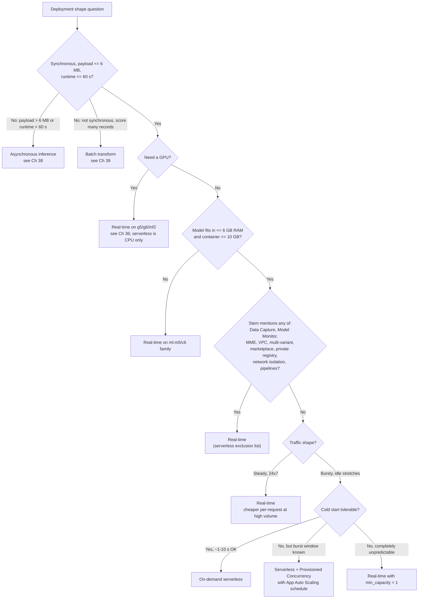
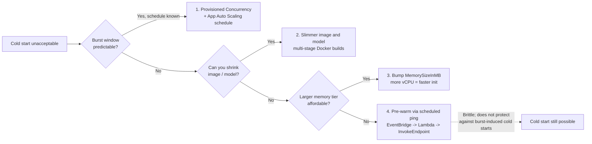
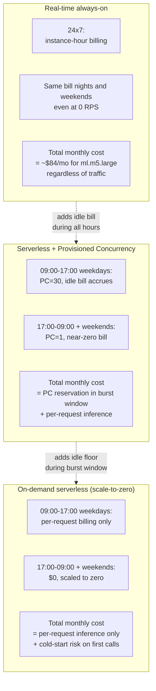

# Chapter 37 — Serverless Inference & Provisioned Concurrency

> **Goal of this chapter.** Of the four SageMaker inference shapes you met in Chapter 35 — real-time, serverless, asynchronous, batch — *serverless* is the one candidates most often misplace. They over-pick it whenever a stem says "scale to zero," and they under-pick it whenever a stem mentions "cold start." Both directions cost points. By the end of this chapter you should be able to read a one-paragraph workload description and, in under thirty seconds, decide whether **SageMaker Serverless Inference** is the right shape; write a valid `ServerlessConfig` block (memory tier, max concurrency, optional provisioned concurrency) from memory; explain — to a sceptical PM — what a cold start is, how long it actually lasts, and the four ways to make it disappear; recognise every feature in the verbatim exclusion list that disqualifies serverless on sight; and do the per-month pricing math that decides between on-demand serverless, serverless with Provisioned Concurrency, and a 24×7 real-time instance. This is the chapter that lets you stop being scared of cold starts and start treating them as an engineering knob.

---

## 37.1 When scale-to-zero beats always-on

Imagine the internal "deal-desk" tool at a regional commercial bank. A relationship manager opens it perhaps a dozen times an hour during business hours, never overnight, never on weekends, and the tool calls a small XGBoost model to score the risk of a proposed credit line. The model is 80 MB. Each inference takes about 90 ms. The bank's SRE team has standing instructions to keep cloud costs honest, and the head of risk doesn't care whether the *first* click of the morning takes a beat longer than the rest — she does care that the system is reliable, encrypted, and audit-traceable.

What is the right shape for this endpoint?

A traditional real-time endpoint — say, one `ml.m5.large` instance with auto-scaling configured to scale down to `min_capacity = 1` — costs roughly $84 per month and serves the model in 90 ms cold or warm. It is *fine*. It is also burning twenty-three idle hours a day, every day, for a tool that fires perhaps two hundred inferences in a workday. The instance-hour is the wrong billing unit for this workload.

Serverless inference is the right shape because it inverts the billing unit. You no longer pay for "an instance, all the time." You pay per request — `memory × duration × $/GB-second` plus a small per-invocation fee — and during the long quiet stretches (overnight, weekends, lunchtime) you pay literally nothing. The endpoint *scales to zero* in the strict sense: zero containers running, zero billing accruing. When the first relationship manager logs in at 9 a.m. and clicks "score this deal," SageMaker provisions a fresh worker, pulls your container from ECR, loads the model from S3, and serves the request — and yes, that first request takes a few seconds longer than the rest. The head of risk doesn't mind. The CFO is happy. The shape fits the workload.

Now flip the scenario. The same bank's *consumer-credit* fraud-scoring endpoint, sitting behind the card-authorization path, runs at a sustained 4,000 requests per second, twenty-four hours a day, on a p99 latency SLO of 80 ms. There is no quiet stretch. There is no scale-to-zero opportunity. Every second of every day, the endpoint is doing work. For *this* workload, instance-hour billing is the right billing unit — auto-scaling real-time on `ml.c6i.xlarge` instances will be cheaper than per-request serverless math, and the absence of cold starts means you don't have to babysit Provisioned Concurrency at all. Serverless is the wrong shape here even though it would *technically* work.

The rule, distilled to one line: **scale-to-zero beats always-on whenever the idle time exceeds the working time** — when the endpoint spends more of its life waiting than working. This chapter is about (a) recognising that condition in an exam stem, (b) sizing the configuration correctly when you've recognised it, and (c) refusing to pick serverless when one of the buried disqualifiers (GPU, payload, runtime, MME, VPC, Data Capture, Model Monitor, multi-variant, marketplace model, private registry, network isolation, inference pipeline) shows up in a subordinate clause.



Memorise the spine of this tree. Three disqualifiers at the top (synchronous? payload? runtime?), one feature-exclusion gate in the middle, two forks at the bottom (GPU? cold-start-tolerant?). If you can walk those nodes in order, every serverless stem becomes a thirty-second answer.

---

## 37.2 What serverless inference actually is

### 37.2.1 The verbatim definition

AWS describes the product in two sentences that contain every constraint in this chapter, and they're worth reading twice:

> "Amazon SageMaker Serverless Inference is a purpose-built inference option that enables you to deploy and scale ML models without configuring or managing any of the underlying infrastructure. On-demand Serverless Inference is ideal for workloads which have idle periods between traffic spurts and can tolerate cold starts. Serverless endpoints automatically launch compute resources and scale them in and out depending on traffic, eliminating the need to choose instance types or manage scaling policies." — AWS docs, *Deploy models with Amazon SageMaker Serverless Inference*.

> "Serverless Inference integrates with AWS Lambda to offer you high availability, built-in fault tolerance and automatic scaling. With a pay-per-use model, Serverless Inference is a cost-effective option if you have an infrequent or unpredictable traffic pattern. During times when there are no requests, Serverless Inference scales your endpoint down to 0, helping you to minimize your costs."

Two things from those quotes are the rest of the chapter in compressed form:

1. **It is Lambda-backed under the hood.** That single architectural fact explains every constraint downstream — the discrete memory tiers (those are Lambda tiers), the 6 GB memory ceiling, the absence of GPU (Lambda doesn't have GPU), the cold-start behaviour (Lambda has cold starts), the lack of `InstanceType` (you don't pick instances on Lambda either), the per-request billing model. If you know how Lambda behaves, you already half-know how SageMaker Serverless Inference behaves.
2. **Scale-to-zero is the headline feature.** It is also the feature that distinguishes serverless from every other inference shape except batch and async. Real-time endpoints with target-tracking auto-scaling cannot drop below `min_capacity = 1` — there is always at least one instance burning instance-hours. Serverless drops to *literal zero* during idle: zero workers, zero billing.

### 37.2.2 Timeline (so you don't quote outdated quotas)

| Year | Milestone |
|---|---|
| Dec 2021 | Serverless Inference GA at re:Invent. Initial limits: 1024–6144 MB memory tiers, `MaxConcurrency` ≤ 50 per endpoint, 50 endpoints/region, **200 total concurrency per region**. |
| 2022 | GA improvements: per-endpoint `MaxConcurrency` raised to **200**; total per-region concurrency raised to **500** (most regions) / **1000** (large regions). |
| May 2023 | **Provisioned Concurrency** for Serverless Inference GA. Lets you keep N workers warm to skip the cold start for the first N concurrent requests. Application Auto Scaling support on the `ProvisionedConcurrency` value. |
| Dec 2025 | **SageMaker AI Serverless Customization** launched (Dec 3, 2025). This is a *training/fine-tuning* path, not a new inference endpoint type — see §37.8 for the disambiguation against Bedrock RFT. |

If you see "200 total concurrency per region" in any older study material — including the older `02_deployment.md` notes elsewhere in this repo, which were ingested before the 2022 quota lift — it is **out of date**. The current public numbers are 500 (smaller regions) and 1000 (us-east-1, us-east-2, us-west-2, ap-southeast-1, ap-southeast-2, ap-northeast-1, eu-central-1, eu-west-1). The exam is unlikely to test the exact regional split, but it has been known to include "200/region" as a distractor for the cap.

### 37.2.3 The configuration surface

You configure a serverless endpoint with a single object — `ServerlessConfig` — inside a `ProductionVariant`. There is no `InstanceType`, no `InitialInstanceCount`, no `InitialVariantWeight` (multi-variant is unsupported), no auto-scaling policy attached at the variant level (on-demand auto-scaling is built in and not user-tunable; only `ProvisionedConcurrency` is a user-facing knob).

```python
import boto3

client = boto3.client("sagemaker")

response = client.create_endpoint_config(
    EndpointConfigName="my-serverless-config",
    ProductionVariants=[
        {
            "ModelName": "my-model",
            "VariantName": "AllTraffic",
            "ServerlessConfig": {
                "MemorySizeInMB": 2048,         # 1024 | 2048 | 3072 | 4096 | 5120 | 6144
                "MaxConcurrency": 20,           # 1..200
                "ProvisionedConcurrency": 10,   # optional, 1 <= PC <= MaxConcurrency
            },
        }
    ],
)
```

Three knobs. That is the entire surface area of serverless inference. Memorise the allowed values for each — the exam writes stems specifically to bait an out-of-range distractor:

| Field | Allowed values | Default | Exam trap |
|---|---|---|---|
| `MemorySizeInMB` | `1024`, `2048`, `3072`, `4096`, `5120`, `6144` | required | Not free-form — must be **one of the six tiers**. A stem that hands you "4500 MB" is wrong by construction. |
| `MaxConcurrency` | integer in `[1, 200]` | required | Per-endpoint, not per-region. Cannot be 0. |
| `ProvisionedConcurrency` | integer in `[1, MaxConcurrency]` | unset (= on-demand only) | If set, must be **≤ `MaxConcurrency`**. Setting `ProvisionedConcurrency = MaxConcurrency` is equivalent to "no cold start, ever, up to my cap." |

> AWS docs, verbatim: *"you can choose any of the following values for your memory size: 1024 MB, 2048 MB, 3072 MB, 4096 MB, 5120 MB, or 6144 MB. … The maximum number of concurrent invocations you can set for a serverless endpoint is 200, and the minimum value you can choose is 1. … The `ProvisionedConcurrency` number for a serverless endpoint must be lower than or equal to the `MaxConcurrency` number."* ([Create an endpoint configuration](https://docs.aws.amazon.com/sagemaker/latest/dg/serverless-endpoints-create-config.html))

### 37.2.4 What `MemorySizeInMB` actually picks

A common misconception is that memory size is "just RAM." It is not. From the docs:

> "Serverless Inference auto-assigns compute resources proportional to the memory you select. If you choose a larger memory size, your container has access to more vCPUs."

The memory-to-vCPU mapping is fixed by tier and inherited from Lambda's well-documented model — at Lambda's 1,769 MB tier you get exactly one full vCPU, and CPU scales linearly above that. The exam does not publish a vCPU-per-tier table, but the operational rule that *does* matter is:

> **Bigger memory tier → more vCPU → faster cold start *and* faster warm inference.**

The cost per millisecond also scales with memory, so a 6,144 MB endpoint costs roughly 6× per millisecond what a 1,024 MB endpoint does at the same duration. The non-obvious cost optimisation is that if doubling the memory tier more than halves the request duration (which happens often for CPU-bound inference, because the extra vCPU eats into Python imports and NumPy/sklearn inner loops) then **the higher memory tier is actually cheaper per request**. AWS publishes a Serverless Inference Benchmarking Toolkit precisely to find that sweet spot empirically.

A worked illustrative table (numbers are representative, not normative — benchmark for real numbers in your region):

| Memory | Duration (ms) | GB-seconds per request | Relative cost per request |
|---|---|---|---|
| 1024 MB | 100 | 0.100 | 1.00× |
| 2048 MB | 55  | 0.110 | 1.10× |
| 3072 MB | 40  | 0.120 | 1.20× |
| 4096 MB | 30  | 0.120 | 1.20× |
| 6144 MB | 22  | 0.132 | 1.32× |

Here 1024 MB is cheapest and slowest. For a different workload (heavier CPU, more inner-loop parallelism) the cheapest tier could shift to 4 GB. **Benchmark; do not guess.**

### 37.2.5 Disk and image limits

> "Regardless of the memory size you choose, your serverless endpoint has 5 GB of ephemeral disk storage available. … The maximum size of the container image you can use is 10 GB."

So the practical envelope of what fits on serverless is:

- **Container image ≤ 10 GB.**
- **In-memory model ≤ ~6 GB** (the largest memory tier, minus runtime overhead).
- **Ephemeral disk during inference ≤ 5 GB** (your container, model artifacts pulled at startup, scratch).

A modern LLM does not fit. Llama-7B in FP16 needs roughly 14 GB; Llama-13B around 26 GB. Serverless inference is therefore for classical ML (XGBoost, sklearn, LightGBM), small-to-medium transformers (DistilBERT, MiniLM, sentence-transformers), aggressively quantised models that fit under 6 GB, and embedding models. Large foundation models go on real-time GPU instances or on Bedrock — never on SageMaker Serverless Inference.

---

## 37.3 Pricing model — how the meter ticks

### 37.3.1 On-demand serverless

There are two charges, computed per request:

1. **Compute charge** = `request_duration_seconds × memory_in_GB × $/GB-second`. The per-GB-second rate is published on the SageMaker pricing page and varies by region.
2. **Per-request fee** = a small flat amount per invocation.

When there is no traffic, both charges are zero. **Idle = $0.** Serverless inference is one of only two SageMaker inference shapes with that property (async is the other). Real-time endpoints, by contrast, bill instance-hours continuously regardless of traffic.

AWS also publishes a free tier: **150,000 seconds/month** of on-demand inference duration, free. For very small workloads (think < 40,000 requests/month at a 1-second runtime), the compute portion of the bill is literally $0.

### 37.3.2 Provisioned Concurrency: hybrid pricing

> "For Serverless Inference with Provisioned Concurrency, you pay for the compute capacity used to process inference requests, billed by the millisecond, and the amount of data processed. You also pay for Provisioned Concurrency usage, based on the memory configured, duration provisioned, and the amount of concurrency enabled." — AWS docs.

Three line items when PC is on:

1. **Per-request compute for warm-PC requests.** Discounted per-second rate (you've pre-paid the worker's warmth).
2. **Per-request compute for overflow** — requests that exceed `ProvisionedConcurrency` and burst onto on-demand workers, priced at the on-demand rate.
3. **Idle-floor reservation** — billed continuously by `memory_GB × ProvisionedConcurrency × duration_provisioned × $/GB-second-reserved`. This bill accrues at 3 a.m. when nobody is invoking.

The idle floor is non-trivial — for a single 2 GB PC worker active eight hours a day, five days a week, you're looking at roughly **$1.44/week** in reservation alone, before any inference. If you would otherwise size `ProvisionedConcurrency = MaxConcurrency` with no overflow, you are paying the always-warm bill *plus* serverless's feature exclusions — and you've re-invented a real-time endpoint, badly. Real-time is the right answer in that regime.

> ⚠️ **Exam alert — PC bills idle capacity.** A common trap: "the team enables Provisioned Concurrency to eliminate cold starts but is shocked by the bill the following month." The bill is not a bug. PC reserves capacity continuously and is billed continuously — even at 0 RPS. The mitigation is **Application Auto Scaling on a schedule**, so the PC floor drops to a low value (or 1) during quiet hours and ramps up before the burst window. PC without scheduled autoscaling on a bursty workload is the worst of both worlds.

### 37.3.3 The cost decision rule

| Stem signal | Cost-correct shape |
|---|---|
| "Scales to zero overnight," "infrequent traffic," "few requests per day" | **On-demand serverless** |
| "Spiky but predictable burst window, sub-second latency during burst" | **Serverless + Provisioned Concurrency** with App Auto Scaling on the burst schedule |
| "Steady, 24×7, sub-100 ms p99" | **Real-time** (cost is dominated by instance-hour anyway; serverless overhead is wasted) |
| "Tens of millions of requests per month, sustained" | **Real-time** (per-request math loses) |

---

## 37.4 Cold starts — the central problem

### 37.4.1 What a cold start actually is

When traffic stops, SageMaker tears down the worker. When a request arrives and no warm worker exists, SageMaker must:

1. Provision a fresh Lambda-class execution environment (~hundreds of ms).
2. Pull the container image from ECR into the environment.
3. Start the container; load the model artifacts from S3 into the model server's memory; run the container's `/ping` and any init handlers.
4. Then — finally — accept and process the request.

The cumulative wall-clock of steps 1 through 3 is the **cold start**. Per the docs:

> "Since serverless endpoints provision compute resources on demand, your endpoint may experience cold starts. A cold start can also occur if your concurrent requests exceed the current concurrent request usage. The cold start time depends on your model size, how long it takes to download your model, and the start-up time of your container."

Note the second sentence — cold starts happen not only when a fully idle endpoint receives its first request, but also when **a sudden burst exceeds currently warm capacity**. Each new concurrent worker that spins up incurs its own cold start. A "warm" endpoint can serve a cold response to your second simultaneous request if the warm pool happens to be exactly one worker deep.

### 37.4.2 Typical magnitudes

Operationally, cold starts span a wide range, dominated by container size and model size:

| Container | Model artifact | Typical cold start |
|---|---|---|
| 200 MB slim Python + sklearn | 5 MB pickle | **1–2 s** |
| 1–2 GB PyTorch DLC | 100–500 MB model | **3–6 s** |
| 5–8 GB framework DLC with extras | 1–3 GB model | **8–20 s** |
| 10 GB image (the ceiling) | 4–5 GB model | **20–60+ s** |

AWS's own benchmark, published in the Provisioned Concurrency launch blog, reports roughly **6 seconds** of cold start for a representative HuggingFace endpoint on on-demand, and about **200 ms** with PC active. Treat those as anchor numbers when reasoning about the exam.

Above ~30 seconds of cold start you're also fighting the 60-second request timeout — cold start + actual inference must fit inside 60 seconds, or the request fails. For a 10 GB image hosting a 5 GB model, serverless is effectively impossible.

### 37.4.3 The `OverheadLatency` CloudWatch signal

The single most-tested CloudWatch metric for serverless inference is `OverheadLatency`. Memorise the name.

> "To monitor how long your cold start time is, you can use the Amazon CloudWatch metric `OverheadLatency` to monitor your serverless endpoint. This metric tracks the time it takes to launch new compute resources for your endpoint."

The metric set has a deliberate division of labour:

- `ModelLatency` measures time *inside* the `/invocations` call — what your model code actually took.
- `OverheadLatency` measures the SageMaker-plumbing portion — cold start, queueing, request handoff. On a warm worker it is near-zero. On a cold start it carries the full cold-start cost.

The exam loves a stem of the shape "the user complains about high tail latency only on the first request of the morning." The metric to investigate is `OverheadLatency` (not `ModelLatency`, which would point at the model code itself), and the corrective action is to enable Provisioned Concurrency.

### 37.4.4 The four cold-start mitigations



Ranked roughly by exam frequency and engineering impact:

1. **Provisioned Concurrency.** The textbook fix. Keeps N workers warm; the first N concurrent requests skip the cold start entirely. Application Auto Scaling varies N on a schedule or against a target metric so you pay the idle charge only during the burst window.
2. **Shrink the container and the model.** Multi-stage Docker builds (see §37.7), drop unused frameworks (don't ship the PyTorch DLC if you're running XGBoost), strip CUDA layers (serverless is CPU-only — CUDA is dead weight), compress model artifacts, base on the smallest viable image. A 200 MB container with a 50 MB model can cold-start in under 2 s.
3. **Bump the memory tier.** Counter-intuitive but real: a 6,144 MB endpoint cold-starts measurably faster than a 1,024 MB endpoint, because more vCPU goes to Python imports and model deserialization (both of which are CPU-bound). A workload at 8 s cold start on 1 GB can land at 3–4 s on 4 GB.
4. **Pre-warm via scheduled pings.** EventBridge → Lambda → `InvokeEndpoint` every 5–10 minutes. **Brittle**: it keeps one worker warm but does not protect against burst-induced cold starts on the 2nd, 3rd, … Nth concurrent worker. Each ping incurs a per-request fee and a minimum-billing duration. Usually the *wrong* exam answer when PC is in the choice list — but if the stem explicitly forbids Provisioned Concurrency, this is the fallback.

---

## 37.5 Provisioned Concurrency — deep dive

### 37.5.1 What PC actually buys you

From the docs:

> "Provisioned Concurrency allows you to deploy models on serverless endpoints with predictable performance, and high scalability by keeping your endpoints warm. SageMaker AI ensures that for the number of Provisioned Concurrency that you allocate, the compute resources are initialized and ready to respond within milliseconds."

The contract: **N workers are guaranteed warm at all times.** Requests up to concurrency N skip the cold start entirely (typical responses in the ~200 ms range, dominated by your model code, not by start-up). Requests at concurrency > N spill over onto on-demand serverless and may cold-start.

Exam-critical: Provisioned Concurrency does **not** raise your `MaxConcurrency`. It is a floor, not a ceiling. The ceiling is still `MaxConcurrency`. The relationship is always `1 ≤ ProvisionedConcurrency ≤ MaxConcurrency`. A stem that hands you `MaxConcurrency = 50, ProvisionedConcurrency = 80` is invalid by construction; endpoint-config creation fails with a `ValidationException`.

### 37.5.2 Setting and updating it

At endpoint-config creation:

```python
"ServerlessConfig": {
    "MemorySizeInMB": 4096,
    "MaxConcurrency": 50,
    "ProvisionedConcurrency": 10,   # 10 always-warm workers
}
```

Dynamically: SageMaker endpoint configs are immutable, so you create a *new* endpoint config (`create_endpoint_config`) with a different `ProvisionedConcurrency` value, then call `update_endpoint(EndpointName=..., EndpointConfigName=newConfig)`. The endpoint hot-swaps to the new config. This dynamic-update path is also what Application Auto Scaling uses under the hood.

### 37.5.3 Application Auto Scaling on Provisioned Concurrency

You do not have to hand-pick a static `ProvisionedConcurrency` value. You register the serverless endpoint as a scalable target with Application Auto Scaling and let the scaler drive PC up and down. Two policy shapes:

- **Target-tracking policy.** Pick a metric — typically `SageMakerVariantConcurrentRequestsPerCopy`, the number of concurrent requests divided by the number of warm copies — and a target (e.g., 70 %). When real concurrency exceeds the target, PC scales up; when it drops, PC scales down. Forward-link: Chapter 40 covers the broader auto-scaling story for SageMaker, including how target-tracking applies to real-time `DesiredInstanceCount` vs. serverless `DesiredProvisionedConcurrency`.
- **Scheduled policy.** "8:55 a.m. weekdays, set `ProvisionedConcurrency = 30`. 5 p.m. weekdays, scale back to 1." Ideal for office-hours apps where the burst window is known. Lets you pay PC reservation only during the active band.

```python
import boto3
aas = boto3.client("application-autoscaling")

resource_id = "endpoint/my-serverless-endpoint/variant/AllTraffic"

aas.register_scalable_target(
    ServiceNamespace="sagemaker",
    ResourceId=resource_id,
    ScalableDimension="sagemaker:variant:DesiredProvisionedConcurrency",
    MinCapacity=1,
    MaxCapacity=20,
)

aas.put_scaling_policy(
    PolicyName="pc-target-tracking",
    ServiceNamespace="sagemaker",
    ResourceId=resource_id,
    ScalableDimension="sagemaker:variant:DesiredProvisionedConcurrency",
    PolicyType="TargetTrackingScaling",
    TargetTrackingScalingPolicyConfiguration={
        "TargetValue": 0.7,
        "PredefinedMetricSpecification": {
            "PredefinedMetricType": "SageMakerVariantConcurrentRequestsPerCopy",
        },
    },
)
```

Two API quirks the exam baits on:

- The `ScalableDimension` is literally `sagemaker:variant:DesiredProvisionedConcurrency`. A common distractor is `sagemaker:variant:DesiredInstanceCount` (that's the real-time one) or `sagemaker:variant:DesiredCapacity` (doesn't exist).
- **CloudFormation cannot manage the auto-scaling layer.** From AWS docs: *"Application Auto Scaling for Serverless Inference with Provisioned Concurrency is currently not supported on AWS CloudFormation."* The static `ProvisionedConcurrency` value is supported in CFN; the dynamic scaler on top of it is not. If a stem says "we manage everything in CloudFormation," the scaler must be wired out-of-band (Terraform, AWS CLI, console, or a CDK custom resource).

### 37.5.4 The "should I just use real-time?" question

If you find yourself sizing `ProvisionedConcurrency = MaxConcurrency = 200` with no autoscaling and 24×7 traffic, **you have re-invented a real-time endpoint, badly.** You are paying the always-warm idle charge for 200 workers, and you've inherited every serverless feature exclusion: no GPU option, no Multi-Model Endpoint, no VPC, no Data Capture, no Model Monitor, no multi-variant. Real-time is the right shape in this regime.

The decision pivot: **does the burst window leave significant idle time?** If yes → serverless + PC with auto-scaling. If no → real-time.



The mental picture: real-time is a flat horizontal cost line. On-demand serverless is a spiky cost line that touches zero during idle. PC sits between them — flat during the burst window, near-zero outside it. As burst-window coverage rises toward 100 %, PC's cost curve converges on real-time's; the further below 100 % it sits, the more PC saves over real-time.

---

## 37.6 The verbatim exclusion list

This is the single highest-density paragraph in the serverless docs and the source of half the trick questions on the MLA-C01:

> "Some of the features currently available for SageMaker AI Real-time Inference are not supported for Serverless Inference, including GPUs, AWS marketplace model packages, private Docker registries, Multi-Model Endpoints, VPC configuration, network isolation, data capture, multiple production variants, Model Monitor, and inference pipelines."

Translated into an exam-ready "serverless cannot…" checklist:

- ❌ **GPU.** No `g5`, `g6`, `inf2`, `trn1`. CPU only.
- ❌ **AWS Marketplace model packages.**
- ❌ **Private Docker registries.** Must be in ECR.
- ❌ **Multi-Model Endpoints (MME).** One model per endpoint.
- ❌ **VPC configuration.** No `VpcConfig`; endpoint always lives in the SageMaker-managed network.
- ❌ **Network isolation.** Cannot run with `EnableNetworkIsolation`.
- ❌ **Data Capture.** Cannot record inputs/outputs to S3 for offline analysis.
- ❌ **Multiple production variants.** No A/B, no shadow variant, no canary on a single serverless endpoint.
- ❌ **Model Monitor.** Transitively excluded — Model Monitor requires Data Capture, which is unavailable.
- ❌ **Inference pipelines.** Cannot host a chain of containers as a pipeline.

If any of those features is named in the stem and the workload otherwise looks like serverless territory, that feature is the disqualifier and the answer is **real-time**, not serverless. The exam loves to bury a disqualifier in a subordinate clause: *"…the team also needs Model Monitor for input-drift detection…"*. Read every clause before committing.

> ⚠️ **Exam alert — "no GPU" disqualifies on sight.** Any workload that mentions YOLOv8, Stable Diffusion, a large transformer, or "the team wants to use an ml.g5.xlarge" is *not* a serverless workload, full stop. Serverless inference is CPU-only. The right answers for GPU workloads are real-time on `g5`/`g6`/`inf2`, or — if cost-sensitive and tolerant of queue UX — async inference on the same instance family. Bedrock provides serverless GPU-backed inference for foundation models, but that's a different product from SageMaker Serverless Inference.

### 37.6.1 One additional constraint not in that paragraph

There is a separate sentence in the docs that is just as exam-critical:

> "You cannot convert your instance-based, real-time endpoint to a serverless endpoint. If you try to update your real-time endpoint to serverless, you receive a `ValidationError` message. You can convert a serverless endpoint to real-time, but once you make the update, you cannot roll it back to serverless."

So conversion is **one-way**:

- **serverless → real-time** is allowed (via `UpdateEndpoint` to a new endpoint config). One-way; you cannot go back without creating a fresh endpoint.
- **real-time → serverless** is **not allowed**. You receive a `ValidationError`. The only way to "convert" is to create a brand new serverless endpoint and cut over at the SDK / DNS / API-Gateway layer.

> ⚠️ **Exam alert — the "convert real-time to serverless" trap.** Stems sometimes say "the team wants to lower the cost of their existing `ml.m5.large` real-time endpoint by converting it to serverless." That conversion is not possible in place. The correct answer is **create a new serverless endpoint and route traffic to it**, not "update the existing endpoint to use `ServerlessConfig`." A distractor that says "call `UpdateEndpoint` with a serverless config" is wrong by construction.

### 37.6.2 The payload and runtime ceilings

Two more numbers complete the disqualifier list and overlap with real-time:

- **Maximum payload: 6 MB** (same as real-time `InvokeEndpoint`). For larger inputs — large images, audio, video, document scans — the correct shape is **async inference**, which Chapter 38 covers in detail. Async allows payloads up to 1 GB.
- **Maximum inference duration: 60 s** (same as real-time). The request fails with a timeout if your container exceeds it. Long-running inference (large generative tasks, batch-style aggregations) again belongs on async.

> ⚠️ **Exam alert — the 6 MB payload trap.** "Document classification on PDF uploads" or "frame-level inference on uploaded video clips" sounds like an obvious serverless workload (bursty, idle stretches, CPU-fine) — but the payload often exceeds 6 MB. The correct answer is **async inference (Ch 38)**, not serverless. The stem may even bait you with "the team wants to scale to zero" to make you reach for serverless, then quietly mention that "the input PDFs average 30 MB." Read the payload size before committing.

---

## 37.7 Container size and cold start — the engineering lever

Cold-start time decomposes roughly as:

```
T_cold  ≈  T_image_pull  +  T_container_init  +  T_model_download  +  T_warmup
```

- **Image pull** scales nearly linearly with image size and ECR throughput. Cutting image size from 8 GB to 2 GB typically shaves 2–4 seconds off the cold start.
- **Container init** is your entrypoint plus framework imports (PyTorch alone takes ~1–2 s to import on a cold interpreter).
- **Model download** is `model.tar.gz` size divided by S3 throughput; zero if the model is baked into the image.
- **Warmup** is the first inference, which is often slower than subsequent ones (JIT compilation, lazy-loaded layers, cuDNN-equivalents on CPU paths).

The 10 GB image cap exists specifically to bound worst-case cold start. AWS's troubleshooting docs literally show endpoints failing to create at 12.7 GB images. Even within the cap, smaller is better. The pattern that ships smallest images for SageMaker is a **multi-stage Docker build**:

```dockerfile
# --- Stage 1: builder ---
FROM python:3.11 AS builder
WORKDIR /build

RUN python -m venv /opt/venv
ENV PATH="/opt/venv/bin:$PATH"

COPY requirements.txt .
RUN pip install --no-cache-dir -r requirements.txt
# Optionally compile to ONNX / TorchScript here so runtime doesn't need the
# training framework.

# --- Stage 2: runtime ---
FROM python:3.11-slim AS runtime
WORKDIR /opt/program

# Copy ONLY the venv, not build tools, not pip cache, not apt cache.
COPY --from=builder /opt/venv /opt/venv
ENV PATH="/opt/venv/bin:$PATH"

COPY serve.py .
COPY model_artifacts/ ./model_artifacts/

ENV SAGEMAKER_PROGRAM=serve.py
EXPOSE 8080
ENTRYPOINT ["python", "serve.py"]
```

What this pattern wins you:

- No `gcc`, no `build-essential`, no pip cache, no apt cache in the runtime layer.
- `python:3.11-slim` is ~120 MB vs `python:3.11` at ~1 GB.
- Typical 50–70 % size reductions on real ML images (Wasil Zafar's containers series cites a 98.6 % reduction on a Go HTTP server; ML images rarely hit that ratio because the wheels are heavy, but the trend holds).

ML-specific shrinks worth a sentence each:

- **Strip CUDA from CPU-only serverless.** `torch` from the default index is ~2.5 GB and includes CUDA libraries. `torch+cpu` from the PyTorch CPU index is ~200 MB. Serverless has no GPU; CUDA is pure dead weight on disk.
- **`pip install --no-deps` + manual deps** to avoid pulling pandas in just because some library lists it.
- **Drop tests and examples** from installed packages: `find /opt/venv -type d -name tests -exec rm -rf {} +`.
- **Convert to ONNX or TorchScript** at build time so the runtime image can drop the training framework entirely.

### 37.7.1 Model in S3 vs model baked into image

| Pattern | Cold start | Image size | Ops |
|---|---|---|---|
| `model.tar.gz` in S3 (default) | Slower (S3 fetch at startup) | Smaller image | Easy to update model without rebuilding image |
| Model baked into image | Faster (no S3 fetch) | Larger image (counts toward 10 GB cap) | Image rebuild on every model version |

The community split: production teams with **frequent retrains** prefer S3 (the operational story for model updates is much cleaner); teams with **static or rarely-updated models** bake the model into the image for the cold-start win.

---

## 37.8 Adoption stories — when serverless wins in production

The exam tends to ask whether serverless is the *right* shape. The harder question — the one you'll get in an interview or a design review — is how teams have actually deployed it. Two stories worth knowing:

### 37.8.1 AppsFlyer PredictSK

AppsFlyer's PredictSK service is the textbook serverless ML success story. The service processes hundreds of GB of user-event data daily, sustains tens of thousands of events per second, and bursts to hundreds of thousands. Predictions return in 10–30 ms per inference end-to-end. The case study is public on AWS's solutions site.

Why serverless worked here:

- The model is small enough to fit comfortably under the 6 GB memory ceiling.
- Traffic is bursty by app/region but the aggregate is well above zero, so cold-start risk is confined to specific shards.
- Per-prediction value is low, so per-millisecond billing crushes the cost of an `m5` fleet running at 30 % utilisation 24×7.

### 37.8.2 Salesforce Agentforce — hybrid serverless + dedicated

A 2025 production deployment study from Salesforce describes how they run compound AI for Agentforce and ApexGuru. The architecture is intentionally mixed-mode:

| Component | Endpoint type | Why |
|---|---|---|
| Dialogue LLM | Dedicated real-time | High steady QPS, strict latency SLA |
| Embedding model | Serverless | High volume, fast cold start (small model) |
| SQL executor | Serverless, **no** PC | Sparse, conditional invocation |
| Spill-over capacity | Serverless | Overflow when dedicated saturates |

Reported outcomes:

- **>50 % reduction in p95 latency** versus the prior static deployment.
- **30–40 % cost savings** versus over-provisioned dedicated fleets.
- A further **15–20 % cost savings** from the mixed-mode strategy versus going purely serverless or purely dedicated.

The killer pattern: dynamic routing sends requests to dedicated instances first; when concurrency limits are exceeded, requests spill seamlessly to the serverless backends. Combined with scheduled warm-ups (a weekday-morning PC ramp for Agentforce), they eliminated user-visible cold starts for predictable workloads while keeping costs honest during off hours.

### 37.8.3 The Dec 2025 SageMaker AI Serverless Customization launch (vs. Bedrock RFT)

Two adjacent announcements in late 2025 get conflated. Be precise.

**Bedrock Reinforcement Fine-Tuning (RFT).** Announced at re:Invent 2025. Lets you fine-tune via RFT against a reward function (AI-based, rule-based, or template), with the platform handling the whole RL loop end-to-end. Initial model support: Amazon Nova 2 Lite, more coming. RFT is a *Bedrock* feature; the resulting custom model is hosted in Bedrock and served via Bedrock's serverless inference.

**SageMaker AI Serverless Customization.** Launched **December 3, 2025**, initially in us-east-1, us-west-2, ap-northeast-1, eu-west-1. Key points:

- It's a managed, **serverless training/fine-tuning** path inside SageMaker AI. You point at a base model, hand over a dataset, pick a technique (including reinforcement learning), and SageMaker handles the compute.
- Models supported at launch: Amazon Nova, DeepSeek, GPT-OSS, Llama, Qwen.
- Pricing is **per token processed during training and inference**, not instance-hour. Historically a Bedrock-style billing model, now appearing in SageMaker.
- After training, the resulting custom model can be deployed to either Bedrock (fully serverless inference) or a SageMaker inference endpoint.

The disambiguation that matters for *this* chapter: **the Dec 2025 launch is not a new serverless inference endpoint type.** SageMaker Serverless Inference — the 6 GB / 10 GB / `ServerlessConfig` endpoint you've been reading about for thirty pages — is unchanged. What's new is a token-billed fine-tuning path that lands you in either Bedrock or SageMaker for serving. Exam disambiguation:

- "Fine-tune Llama with serverless" → **SageMaker AI Serverless Customization** (Dec 2025).
- "Fine-tune Nova with a reward function" → **Bedrock RFT** (re:Invent 2025).
- "Deploy an XGBoost model behind an HTTPS endpoint with scale-to-zero" → **SageMaker Serverless Inference** (the subject of this chapter).

---

## 37.9 The canonical pricing math

The right way to defend a configuration choice — in a design review or in an exam — is with arithmetic. Here is the head-to-head you should be able to do in your sleep.

**Workload.** 10,000 requests per day. 1 second of compute per request. 4 GB memory tier. Negligible payload data. Region: us-east-1, reference pricing (rates may shift — treat as illustrative).

**Option A — On-demand serverless, no PC.**

- 4 GB on-demand rate ≈ **$0.000080/sec**.
- Monthly compute: `10,000 × 30 × 1 = 300,000 sec/month`.
- Free tier: 150,000 sec/month on-demand. Billable: 150,000 sec.
- Cost: `150,000 × $0.000080 = $12/month`.

**Option A total ≈ $12/month.** You accept the cold-start risk on the first request after each quiet period.

**Option B — Serverless + PC, 1 worker, business hours.**

- 4 GB PC reservation ≈ `$0.000020/sec` per concurrent worker.
- PC active 12 h/day × ~21.7 business days/month ≈ 260 h/month.
- Reservation: `260 × 3600 × $0.000020 = $18.72/month`.
- Inference cost during PC window is negligible compared to the reservation.

**Option B total ≈ $19/month.** No cold starts during business hours, occasional cold start outside.

**Option C — Real-time on `ml.m5.large`, 24×7.**

- `ml.m5.large` ≈ `$0.115/hour` in us-east-1.
- 730 hours/month: `730 × $0.115 = $83.95/month`.

**Option C total ≈ $84/month.** Zero cold starts. Full feature set (Data Capture, MME-capable family, VPC, multi-variant, Model Monitor).

**Side by side:**

| Option | Monthly cost | Cold start | Notes |
|---|---|---|---|
| A: Serverless on-demand | **≈ $12** | Up to ~6 s on first call after idle | Cheapest; cold-start risk on UX-sensitive paths |
| B: Serverless + PC business hours | **≈ $19** | ~200 ms in PC window, ~6 s outside | Best for office-hours apps |
| C: `ml.m5.large` real-time 24×7 | **≈ $84** | None | Best for steady traffic and feature breadth |

For this workload, **serverless is roughly 7× cheaper than real-time**, and PC adds about $7/month to buy cold-start elimination during business hours. The numbers swing dramatically the other way at higher sustained load: the crossover point at 4 GB is roughly 190,000 seconds of work/month — about 6 sustained RPS for a 100 ms model. Above that, real-time + auto-scaling typically wins.

The free-tier reminder: at 150,000 sec/month on-demand, an endpoint that sees fewer than ~40,000 requests/month at 1-second runtime has a **compute bill of literally $0**.

---

## 37.10 End-to-end example — deploy, invoke, add PC

A complete, runnable example using the SageMaker Python SDK + boto3, ready to adapt. The goal is to show every API surface in one place.

```python
import boto3
import sagemaker
from sagemaker.serverless import ServerlessInferenceConfig
from sagemaker.sklearn.model import SKLearnModel

session = sagemaker.Session()
role = sagemaker.get_execution_role()

# 1. Define the model (artifact in S3 + framework container).
model = SKLearnModel(
    model_data="s3://my-bucket/path/model.tar.gz",
    role=role,
    entry_point="inference.py",
    framework_version="1.2-1",
)

# 2. Define the serverless config — note: no instance_type argument.
serverless_config = ServerlessInferenceConfig(
    memory_size_in_mb=2048,
    max_concurrency=20,
    provisioned_concurrency=None,   # on-demand to start
)

# 3. Deploy.
predictor = model.deploy(
    serverless_inference_config=serverless_config,
    endpoint_name="my-serverless-endpoint",
)

# 4. Invoke.
result = predictor.predict({"features": [1.2, 3.4, 5.6]})

# 5. Later — add Provisioned Concurrency by creating a NEW endpoint config
#    and calling UpdateEndpoint. Endpoint configs are immutable; you can't
#    edit the existing one in place.
sm = boto3.client("sagemaker")
sm.create_endpoint_config(
    EndpointConfigName="my-serverless-config-with-pc",
    ProductionVariants=[{
        "ModelName": predictor.model_name,
        "VariantName": "AllTraffic",
        "ServerlessConfig": {
            "MemorySizeInMB": 2048,
            "MaxConcurrency": 20,
            "ProvisionedConcurrency": 5,
        },
    }],
)
sm.update_endpoint(
    EndpointName="my-serverless-endpoint",
    EndpointConfigName="my-serverless-config-with-pc",
)
```

Three things to internalise from this example because they recur in exam stems:

1. **Step 3** has no `instance_type`. That's the visible signature of a serverless deployment.
2. **Step 5** uses `create_endpoint_config` + `update_endpoint`, not an in-place edit. SageMaker endpoint configs are immutable; the endpoint hot-swaps to the new config.
3. Adding the Application Auto Scaling target (shown in §37.5.3) is a *separate* step — it does not happen automatically when you set `ProvisionedConcurrency`. The static value is what you set in the config; the dynamic scaler is what App Auto Scaling drives.

---

## 37.11 The decision matrix — when serverless wins and when it loses

This table is duplicated from Chapter 35 because the exam-pattern phrasing is what matters. If you can recite this from memory, deployment-shape questions become 30-second wins.

| Stem signal | Likely answer |
|---|---|
| "Bursty, OK with 1–2 s tail, scale to zero overnight, small CPU model" | **On-demand serverless** |
| "Bursty *but* sub-100 ms p99 required during a known burst window" | **Serverless + PC + scheduled Application Auto Scaling** |
| "Steady 24×7, sub-100 ms p99 always" | **Real-time** |
| "GPU inference (CV, transformer, LLM)" | **Real-time** on `g5`/`g6`/`inf2` — *never* serverless |
| "Payload > 6 MB" or "inference > 60 s" | **Async (Ch 38)**, not serverless |
| "Model > 6 GB in memory" | **Real-time** (memory ceiling) |
| "Need MME to host hundreds of models" | **Real-time MME** |
| "Need Data Capture or Model Monitor" | **Real-time** (excluded on serverless) |
| "Need VPC isolation / private subnets" | **Real-time** (no `VpcConfig` on serverless) |
| "Score 50M records once into S3" | **Batch transform (Ch 39)** |
| "Multi-variant A/B test on the same endpoint" | **Real-time** (multi-variant excluded on serverless) |
| "Need to convert real-time endpoint to serverless to cut cost" | **Create a new serverless endpoint and cut over** — in-place conversion is not supported |

The exam will sometimes hand you a stem that *looks* like serverless and has one disqualifier buried in a subordinate clause ("…and we need to capture every request for compliance audits…"). Always read for disqualifiers before committing.

---

## 37.12 Common misconceptions — kill list

1. **"Serverless can scale to ∞ requests/sec."** False. Capped at `MaxConcurrency` per endpoint (≤ 200) and 500/1000 per region. Hit either ceiling → requests throttled with HTTP 429.
2. **"Provisioned Concurrency removes all cold starts."** False — it removes cold starts for the first *N* concurrent requests. Burst above N still cold-starts.
3. **"I can put a 7B-parameter LLM on serverless if I quantize it."** False unless quantised to fit in 6 GB *and* runnable at usable speed on CPU. Both conditions are hard. Use real-time `inf2`/`g5` for LLMs, or Bedrock.
4. **"I can use serverless inside my VPC."** False. No `VpcConfig` support.
5. **"Serverless supports MME."** False. One model per endpoint.
6. **"Serverless cost is always cheaper than real-time."** False above ~10M requests/month or at sustained 24×7 load.
7. **"Provisioned Concurrency is just a smaller real-time endpoint."** Half-true. It's billed differently (per GB-second of provisioned, not per instance-hour), and it inherits *every* serverless feature exclusion. Use it for bursty-but-predictable. For steady, use real-time.
8. **"Auto-scaling means I configure target tracking on serverless directly."** Half-true. On-demand serverless auto-scales internally — you don't touch it. Application Auto Scaling on serverless only adjusts `ProvisionedConcurrency`, never on-demand capacity.
9. **"I can convert my real-time endpoint to serverless."** False — `ValidationError`. Other direction works, one-way.
10. **"`MaxConcurrency` is the number of warm workers."** False. `MaxConcurrency` is the per-endpoint cap on simultaneous in-flight requests. The number of warm workers is `ProvisionedConcurrency` if set; otherwise it scales between 0 and `MaxConcurrency` on demand.

---

## 37.13 Cheat sheet — one screen

```
┌─────────────────────────────────────────────────────────────────────┐
│ SAGEMAKER SERVERLESS INFERENCE — ONE-PAGE RECALL                    │
├─────────────────────────────────────────────────────────────────────┤
│ ServerlessConfig fields:                                            │
│   MemorySizeInMB         in {1024, 2048, 3072, 4096, 5120, 6144}    │
│   MaxConcurrency         in [1, 200]                                │
│   ProvisionedConcurrency in [1, MaxConcurrency]   (optional)        │
├─────────────────────────────────────────────────────────────────────┤
│ Hard limits:                                                        │
│   Payload                   6 MB    (same as real-time)             │
│   Inference timeout         60 s    (same as real-time)             │
│   Memory                    1-6 GB                                  │
│   Ephemeral disk            5 GB    (fixed regardless of memory)    │
│   Container image           10 GB                                   │
│   Endpoints per region      50                                      │
│   Total concurrency/region  500 or 1000 (region dependent)          │
│   GPU                       NONE -- CPU only                        │
├─────────────────────────────────────────────────────────────────────┤
│ Not supported (the verbatim exclusion list):                        │
│   GPU, marketplace model packages, private Docker registry,         │
│   MME, VPC, network isolation, Data Capture, multiple production    │
│   variants, Model Monitor, inference pipelines.                     │
├─────────────────────────────────────────────────────────────────────┤
│ Cost:                                                               │
│   On-demand:  per-request fee + memory * duration. Idle = $0.       │
│   Provisioned: idle floor for N warm workers + per-request inside.  │
│   Free tier:  150,000 sec/month on-demand.                          │
├─────────────────────────────────────────────────────────────────────┤
│ Cold start:                                                         │
│   Monitor with CloudWatch metric: OverheadLatency                   │
│   Typical on-demand: ~6 s end-to-end.                               │
│   Typical with PC:   ~200 ms end-to-end.                            │
│   Mitigate (best to worst): PC, smaller container/model, larger     │
│     memory tier, scheduled pre-warm pings.                          │
├─────────────────────────────────────────────────────────────────────┤
│ Auto-scaling:                                                       │
│   On-demand workers: automatic, not user-configurable.              │
│   PC: Application Auto Scaling on                                   │
│     ScalableDimension = sagemaker:variant:DesiredProvisionedConcurrency
│     Target metric    = SageMakerVariantConcurrentRequestsPerCopy    │
│   CloudFormation: static PC supported; auto-scaling on PC NOT.      │
├─────────────────────────────────────────────────────────────────────┤
│ Conversion rules:                                                   │
│   real-time -> serverless:  NOT ALLOWED (ValidationError)           │
│   serverless -> real-time:  ALLOWED, ONE-WAY                        │
└─────────────────────────────────────────────────────────────────────┘
```

---

## 37.14 Exercises

Try these without scrolling back. The first five are exam-style; the last two are design-review style.

1. A teammate submits a `ServerlessConfig` with `MemorySizeInMB = 4500`. Will SageMaker accept this configuration? Why or why not? Write the closest valid configuration that preserves the apparent intent.
2. Your serverless endpoint shows `OverheadLatency` of ~5,700 ms on the first request of the morning and ~10 ms on every subsequent request. `ModelLatency` is stable at ~80 ms. The product team needs sub-second p99 every morning. Pick a fix and justify the cost.
3. A workload needs scale-to-zero overnight, sub-second p99 during a known weekday-morning burst (9–11 a.m.), and uses a 200 MB CPU model. Pick a deployment shape and write the configuration (memory tier, `MaxConcurrency`, `ProvisionedConcurrency`, auto-scaling strategy).
4. Same as the previous question, but the model is 12 GB after quantisation. Now what shape do you pick, and why?
5. Same as question 3, but the compliance team requires Model Monitor for input-drift detection. Now what?
6. You set `MaxConcurrency = 50` and `ProvisionedConcurrency = 80` in your endpoint config. What happens at `create_endpoint_config` time? What's the smallest config change that makes it valid while keeping `ProvisionedConcurrency = 80`?
7. A SaaS company hosts 800 tenant-specific XGBoost models, each ~80 MB, with bursty per-tenant traffic and idle overnight. Pick the lowest-cost shape and justify why serverless is *not* the answer despite the bursty traffic.

---

## 37.15 Cross-links and what comes next

- **Back to Ch 35** — *The four SageMaker endpoint types*. The shape-selection framework that puts serverless in context against real-time, async, and batch. If §37.11's decision matrix feels dense, that's the chapter where the four-shape comparison is built up from scratch.
- **Back to Ch 36** — *Real-time endpoints in depth*. The cost/feature counterpart that serverless is most often compared against. Real-time is also the destination when any of the serverless feature-exclusions disqualifies the workload.
- **Forward to Ch 38** — *Asynchronous inference*. The "scale-to-zero, big payload, long runtime" sibling. If serverless is disqualified by the 6 MB payload or 60 s runtime ceiling but you still want scale-to-zero, async is the answer.
- **Forward to Ch 40** — *Auto-scaling SageMaker endpoints*. Goes deeper into Application Auto Scaling, including target-tracking and scheduled policies on real-time `DesiredInstanceCount` and serverless `DesiredProvisionedConcurrency`. Read it after Ch 37 for the auto-scaling story end-to-end.

---

## 37.16 References

- AWS docs — [Deploy models with Amazon SageMaker Serverless Inference](https://docs.aws.amazon.com/sagemaker/latest/dg/serverless-endpoints.html) — top-level guide; verbatim feature-exclusion list and all hard limits.
- AWS docs — [Create an endpoint configuration (Serverless)](https://docs.aws.amazon.com/sagemaker/latest/dg/serverless-endpoints-create-config.html) — `ServerlessConfig` parameter values, boto3 example, console steps.
- AWS docs — [Automatically scale Provisioned Concurrency for a serverless endpoint](https://docs.aws.amazon.com/sagemaker/latest/dg/serverless-endpoints-autoscale.html) — App Auto Scaling integration and CloudFormation limitation.
- AWS ML Blog — [Announcing Provisioned Concurrency for Amazon SageMaker Serverless Inference](https://aws.amazon.com/blogs/machine-learning/announcing-provisioned-concurrency-for-amazon-sagemaker-serverless-inference/) — May 2023 launch with the ~6 s vs ~200 ms cold-start benchmark.
- AWS ML Blog — [Introducing the Amazon SageMaker Serverless Inference Benchmarking Toolkit](https://aws.amazon.com/blogs/machine-learning/introducing-the-amazon-sagemaker-serverless-inference-benchmarking-toolkit/) — empirical memory-tier sweep.
- AWS pricing — [Amazon SageMaker AI pricing](https://aws.amazon.com/sagemaker/ai/pricing/) — per-GB-second rates by region.
- AWS Blog (Dec 2025) — [New serverless customization in Amazon SageMaker AI accelerates model fine-tuning](https://aws.amazon.com/blogs/aws/new-serverless-customization-in-amazon-sagemaker-ai-accelerates-model-fine-tuning/) — the Dec 3, 2025 launch.
- AWS Case Study — [AppsFlyer / Amazon SageMaker](https://aws.amazon.com/solutions/case-studies/appsflyer-sagemaker/) — high-volume PredictSK adoption story.
- Salesforce / arXiv 2025 — [Scalable Inference Architectures for Compound AI Systems: A Production Deployment Study](https://arxiv.org/) — Agentforce + ApexGuru mixed-mode architecture.
- Internal — [`research_inputs/14_aws_ml_engineer_associate/notes/ch37_docs.md`](../../../research_inputs/14_aws_ml_engineer_associate/notes/ch37_docs.md) — research agent A dossier (docs angle).
- Internal — [`research_inputs/14_aws_ml_engineer_associate/notes/ch37_practice.md`](../../../research_inputs/14_aws_ml_engineer_associate/notes/ch37_practice.md) — research agent B dossier (practice angle).
