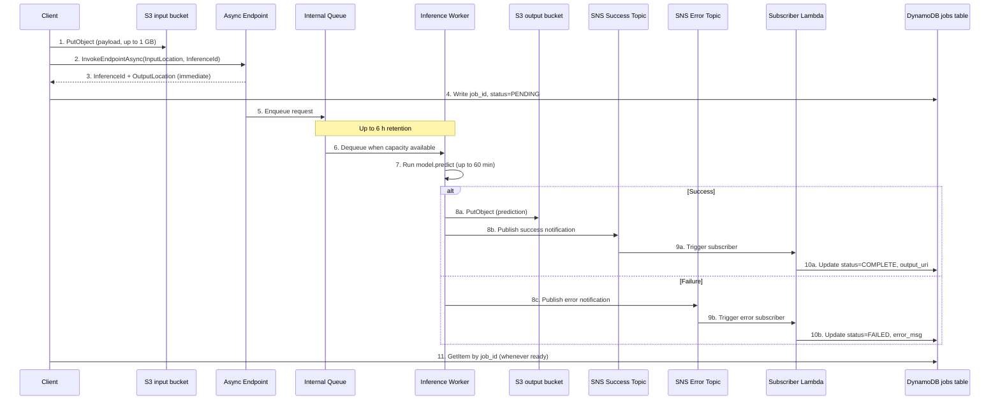
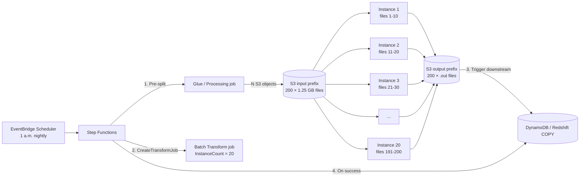

# Chapter 38 — Async Inference & Batch Transform

> **Goal of this chapter:** to make you fluent in the two **non-real-time** SageMaker inference shapes — **Asynchronous Inference** (queue + S3, event-driven, scale-to-zero) and **Batch Transform** (transient job, S3-to-S3, no endpoint) — to the point where an MLA-C01 stem mentioning "large payload", "long-running inference", "score nightly", "S3 in / S3 out", or "SNS notification" routes to the right shape and the right API knob in under thirty seconds. Real-time and serverless (Chapters 36 and 37) handled the cases where the caller blocks on an HTTP response. This chapter is about the cases where the caller does not — sometimes because the work takes ten minutes and a megabyte of HTTP body is not enough, and sometimes because there is no caller at all, just a cron and a hundred million rows of S3.

---

## 38.1 Why some inference workloads need the queue, not the wire

A real-time endpoint optimises a single sentence: *"return a prediction over HTTP in under 60 seconds, with the payload under 6 MB."* Serverless tightens the same sentence further — under 60 seconds, under 6 MB, no GPU, no warm fleet, pay-per-call. Both are excellent at what they do. Both fall over the moment one of those numbers stops being true.

Consider the workloads the real world actually produces:

- A radiology AI platform receives a 200 MB DICOM study and runs a U-Net segmentation model that takes 90 seconds on a `g5.2xlarge`. The radiologist is willing to wait — they are reading other films while this one renders — but they need to know when the prediction is ready. The payload alone disqualifies real-time (6 MB ceiling), and the inference time disqualifies serverless (60 second ceiling). What now?
- An e-commerce platform refreshes per-user recommendations for 80 million users every night at 1 a.m. There is no caller at all — there is a cron, an input dataset in S3, and a deadline of 6 a.m. before the next-day's homepage renders. Standing up a persistent endpoint that sits idle 23 hours a day is wasteful. What now?
- A claims-processing platform receives 5,000 PDFs a day from email attachments. Each one needs OCR plus a custom classifier. The user who emailed it expects an automated acknowledgment within minutes, not seconds, and the same automation should route the claim downstream when it finishes. What now?

For the first and third cases, AWS provides **Asynchronous Inference**: a persistent endpoint that accepts an S3 pointer instead of an HTTP body, queues the request internally, runs the inference (up to one hour, up to one gigabyte of payload), writes the result to S3, and publishes an SNS notification when the work is done. The caller does not block — they get back an `InferenceId` and an `OutputLocation` immediately, then either poll S3 or subscribe to SNS. Crucially, the endpoint can scale to zero instances when idle and wake up on the next request, which makes it dramatically cheaper than real-time for spiky workloads.

For the second case, AWS provides **Batch Transform**: not an endpoint at all, but a transient *job*. You hand it a `Model` resource, an S3 input prefix, an instance type, and an instance count. SageMaker spins up the cluster, streams records through the container's `/invocations` route, writes outputs to S3, and tears the cluster down. There is no persistent HTTP surface, no autoscaling policy, no idle cost — just the wall-clock instance-hours the job actually consumed.

The two shapes look superficially similar (both write to S3, both can fan out across instances), but they answer different questions:

- **Async inference answers**: *"Each inbound event triggers one inference. The caller wants its result back, but not on the same HTTP round-trip. The endpoint should sleep when nobody is calling."*
- **Batch transform answers**: *"I have a discrete dataset in S3 and I want a discrete output dataset in S3. There is no per-request caller. Spin compute up, do the work, spin it down."*

If you can frame the workload as either of those one-liners, the decision is settled. The exam, and production, both reward operators who can frame the workload correctly before reaching for the API.

This chapter walks each shape's contract, architecture, scaling story, cost model, and trap inventory. Section 38.10 is the four-shape decision tree that ties it back to real-time (Ch 36) and serverless (Ch 37); Section 38.11 is the exercise set.

---

## 38.2 Async Inference — the 2021 GA shape that lets you queue, scale to zero, and notify

Asynchronous Inference went GA in August 2021 as the first SageMaker hosting option that natively supported both **large payloads on persistent endpoints** and **scale-to-zero for any model size**. AWS describes it in one paragraph that is worth memorising verbatim, because every clause is an exam trigger:

> *"Amazon SageMaker Asynchronous Inference is a capability in SageMaker AI that queues incoming requests and processes them asynchronously. This option is ideal for requests with large payload sizes (up to 1 GB), long processing times (up to one hour), and near real-time latency requirements. Asynchronous Inference enables you to save on costs by autoscaling the instance count to zero when there are no requests to process, so you only pay when your endpoint is processing requests."*
> — AWS docs, *Asynchronous inference*

Three claims are baked into that paragraph:

1. **Queued + asynchronous.** The caller does not block on the inference response. The synchronous HTTP contract that real-time uses is gone; in its place, you get an `InferenceId` back immediately and the prediction lands at an `OutputLocation` in S3 later.
2. **Large payload, long processing.** The niche where real-time (6 MB / 60 s) and serverless (6 MB / 60 s, CPU-only) both run out of headroom. Async caps at 1 GB and one hour — and those numbers are the highest-value memorisation target in this chapter.
3. **Scale to zero.** Async is the only *persistent-endpoint* hosting shape that natively goes to zero instances on a target-tracking autoscaling policy. Serverless is "scale-to-zero by construction" but is a different shape with different constraints; real-time scale-to-zero (a 2024 feature) is a separate mechanism that requires inference components and exposes cold-start failures to callers. Async hides the cold start inside the queue.

### 38.2.1 The request/response contract

Async breaks the synchronous HTTP contract that real-time uses. Instead of calling `InvokeEndpoint` with the payload in the HTTP body, the workflow is:

1. **Upload the payload to S3** yourself. The SageMaker SDK helper `Predictor.predict_async` will do this for you, but the boto3 path makes the contract explicit.
2. Call `InvokeEndpointAsync` with `InputLocation = s3://your-bucket/payload.bin` and an optional `InferenceId` for idempotency.
3. Receive back an `InferenceId` and a *predicted* `OutputLocation` in S3 — both returned synchronously, as soon as the request is enqueued.
4. The endpoint processes the request from the queue (anywhere between immediately and up to six hours later, depending on backlog and capacity), writes the prediction to `OutputLocation`, and publishes to your SNS success topic (or error topic, on failure).
5. The caller either **polls** S3 for the object, **subscribes a Lambda to SNS** to be notified when it lands, or both.

A boto3 invocation looks like this:

```python
import boto3
smrt = boto3.client("sagemaker-runtime")

resp = smrt.invoke_endpoint_async(
    EndpointName="async-endpoint-v1",
    InputLocation="s3://my-bucket/inputs/req-42.bin",
    ContentType="application/json",
    InferenceId="req-42",                     # idempotency key (optional)
    InvocationTimeoutSeconds=3600,            # up to 1 hour
    RequestTTLSeconds=21600,                  # how long to keep in queue (max 6 h)
)
print(resp["InferenceId"], resp["OutputLocation"])
```

The response returns the instant the request is enqueued. The actual prediction is whatever object eventually lands at `OutputLocation`.

The presence of the `AsyncInferenceConfig` object on the `EndpointConfig` is what *makes* the endpoint async. From the AWS docs:

> *"The presence of an asynchronous inference configuration (`AsyncInferenceConfig`) object in the endpoint configuration implies that the endpoint can only receive asynchronous invocations."*

Translation: **you cannot mix sync and async on the same endpoint.** If you need both, that is two endpoints. Endpoint configs are immutable; switching modes requires creating a new config and calling `UpdateEndpoint` to swap the production variant onto it. The exam likes the trap answer "switch the existing endpoint to async with one API call" — it is wrong; the right answer is "new EndpointConfig + UpdateEndpoint."

⚠️ **Exam alert — the 1 GB / 1 hour ceiling.** Async caps a single request at **1 GB of payload (the S3 object size)** and **3600 seconds of processing time** (`InvocationTimeoutSeconds`). If the stem mentions a payload between 6 MB and 1 GB, or an inference time between 60 s and 3600 s, async is the default answer. If the stem mentions a payload over 1 GB or an inference over one hour, async is *ruled out* — that workload is Batch Transform with chunked encoding, or a custom Step Functions pipeline calling SageMaker Processing jobs. Memorise the two ceilings as a pair; the exam writes near-miss stems where one number is right and the other isn't.

⚠️ **Exam alert — async forces large payloads off the wire.** If the stem says the payload is greater than 6 MB and the candidate latency budget is "seconds, not milliseconds", the exam is steering away from real-time and toward async. The 6 MB invocation limit on real-time and serverless endpoints is a *hard wall*, not a guideline — it is enforced by the load balancer in front of the endpoint and cannot be raised. The intended answer for "80 MB MRI scans, sporadic traffic, per-request results" is async, full stop; serverless and real-time are both ruled out on payload alone before latency even enters the discussion.

### 38.2.2 Configuring the `AsyncInferenceConfig` object

`AsyncInferenceConfig` is a field on `EndpointConfig` — not on the `Endpoint` resource directly. The lifecycle:

1. `CreateModel` (same as any SageMaker model — container image + `model.tar.gz` URI + execution role).
2. `CreateEndpointConfig` with the `AsyncInferenceConfig` field populated.
3. `CreateEndpoint` referencing that config.

The boto3 skeleton you should be able to write from memory before exam day:

```python
import boto3
sm = boto3.client("sagemaker")

sm.create_endpoint_config(
    EndpointConfigName="async-endpoint-cfg-v1",
    ProductionVariants=[{
        "VariantName": "variant1",
        "ModelName": "my-model",
        "InitialInstanceCount": 1,
        "InstanceType": "ml.g5.xlarge",
    }],
    AsyncInferenceConfig={
        "OutputConfig": {
            "S3OutputPath": "s3://my-bucket/async-out/",
            "S3FailurePath": "s3://my-bucket/async-fail/",
            "NotificationConfig": {
                "SuccessTopic": "arn:aws:sns:us-east-1:111:async-ok",
                "ErrorTopic":   "arn:aws:sns:us-east-1:111:async-err",
                "IncludeInferenceResponseIn": ["SUCCESS_NOTIFICATION_TOPIC"],
            },
            "KmsKeyId": "alias/aws/s3",
        },
        "ClientConfig": {
            "MaxConcurrentInvocationsPerInstance": 4,
        },
    },
)

sm.create_endpoint(
    EndpointName="async-endpoint-v1",
    EndpointConfigName="async-endpoint-cfg-v1",
)
```

Four knobs in that skeleton are exam-favourite:

- **`OutputConfig.S3OutputPath`** — where SageMaker writes the prediction. SageMaker creates a subfolder per `InferenceId`.
- **`OutputConfig.S3FailurePath`** — separate prefix for failure payloads, so the success-side consumer never sees them. Optional but recommended.
- **`NotificationConfig.SuccessTopic` / `ErrorTopic`** — the SNS-based decoupling primitive. Subscribers (Lambda, SQS, HTTPS, email) react when a prediction lands. Two topics, not one — see Section 38.3.
- **`NotificationConfig.IncludeInferenceResponseIn`** (added in 2023) — embeds the actual response body in the SNS message so subscribers do not have to re-read S3 for small responses. Saves an S3 GET; relevant when the stem says "minimise latency from prediction-complete to consumer." Valid values: `SUCCESS_NOTIFICATION_TOPIC` and `ERROR_NOTIFICATION_TOPIC`.
- **`ClientConfig.MaxConcurrentInvocationsPerInstance`** — per-instance parallelism. Default 4, configurable. If your model is GPU-memory-bound and you set this to 8, you will OOM; if your model is I/O-bound and you leave it at 4, you will under-utilise the instance.

### 38.2.3 The hard limits — memorise

| Limit | Value | Exam cue when violated |
|---|---|---|
| Max payload (S3 object) | **1 GB** | "200 MB images" → async (real-time and serverless are 6 MB) |
| Max inference time per request | **1 hour** (`InvocationTimeoutSeconds`) | "Document AI takes 8 minutes per PDF" → async |
| Queue retention | Up to **6 hours** (`RequestTTLSeconds`) | If processing isn't drained in 6 h, requests time out |
| Scale to zero | **Yes**, native | Only async + serverless have this on the persistent-endpoint shapes |
| Cold start on scale-from-zero | Yes, on the order of **3–6 minutes** | If stem says "tolerate one-time latency on first request after idle" → async fits |
| `MaxConcurrentInvocationsPerInstance` | Default 4, configurable | Per-instance parallelism knob |
| GPU support | **Yes** (all `g`/`p`/`inf`/`trn` families) | Async is the only scale-to-zero shape that supports GPU (serverless is CPU-only) |
| Sync ↔ async coexistence | **Not allowed on the same endpoint** | If both modes are needed, deploy two endpoints |

---

## 38.3 The async request lifecycle — every moving part on the wire

The async architecture has more components than real-time precisely because the request is decoupled from the response. The exam will draw boxes and ask you to label them; this is the diagram to have wired into muscle memory.



The components, in the order the request touches them, and what each is for:

| Component | Role | Notes |
|---|---|---|
| **Input S3 bucket** | Caller drops the payload here before invoking. | KMS-encrypted permitted. Endpoint's execution role needs `s3:GetObject`. See Ch 6 for S3 access patterns. |
| **`InvokeEndpointAsync` call** | Hands SageMaker the S3 pointer plus optional `InferenceId`. | Returns immediately with `InferenceId` + `OutputLocation`. |
| **`AsyncInferenceConfig.OutputConfig.S3OutputPath`** | Where SageMaker writes the prediction. | Sub-folder per `InferenceId`. |
| **`AsyncInferenceConfig.OutputConfig.NotificationConfig`** | SNS topic ARNs for success / error. | `SuccessTopic`, `ErrorTopic` — both optional; both can be the same ARN, but the canonical pattern uses two. |
| **`AsyncInferenceConfig.OutputConfig.KmsKeyId`** | Optional KMS key for output encryption. | Use this when crossing data-classification boundaries. |
| **`AsyncInferenceConfig.ClientConfig.MaxConcurrentInvocationsPerInstance`** | How many concurrent inferences a worker handles. | Tune for GPU-memory headroom. |
| **Internal queue** | Buffer between caller and worker. | SageMaker-managed; up to 6 h retention via `RequestTTLSeconds`. |
| **CloudWatch metrics** | `ApproximateBacklogSize`, `ApproximateBacklogSizePerInstance`, `HasBacklogWithoutCapacity`, `TimeInBacklog`, plus the standard `Invocations`, `ModelLatency`, `OverheadLatency`, `Invocation4XXErrors`, `Invocation5XXErrors`. | The first three are async-specific and drive autoscaling — see Section 38.4. |
| **SNS success topic** | Receives a JSON envelope with `InferenceId`, `OutputLocation`, and optionally the response body (`IncludeInferenceResponseIn`). | Subscribers fan out from here. |
| **SNS error topic** | Receives a JSON envelope with the error type and message. | Separate from success so failure handling is unambiguous. |

⚠️ **Exam alert — SNS notification triggers downstream automation.** The single most common architecture question on async is "after the inference completes, how does the downstream system know?" The exam-correct answer is almost always *"the SNS success topic notifies a subscriber Lambda, which writes the result to DynamoDB (or invokes the next step in a workflow)"*. Trap answers include "the caller polls S3" (works but is wasteful at scale and not the documented pattern), "the endpoint streams the response back" (real-time response streaming is a different feature; async never streams), and "Step Functions polls the endpoint state" (Step Functions waits on a task token via SNS, not on endpoint state — Section 38.5 covers this). When a stem mentions SNS, the answer is async; when a stem mentions async, the answer involves SNS.

---

## 38.4 Async autoscaling — the scale-to-zero playbook

Async autoscaling is the highest-value sub-topic in this chapter for the exam, because *every* "scale to zero" stem with a large payload routes to async, and the candidate has to know **which CloudWatch metric**, **which scaling policy type**, and **which two policies cooperate** to make it work. Forward-link this section to Ch 40, which covers SageMaker autoscaling in general — async is a worked example of the framework laid out there.

### 38.4.1 The async-specific CloudWatch metrics

Async endpoints publish four custom metrics under the `AWS/SageMaker` namespace, on top of the usual `Invocations`, `ModelLatency`, and `OverheadLatency` that every endpoint emits:

| Metric | Dimensions | What it means | Used for |
|---|---|---|---|
| `ApproximateBacklogSize` | `EndpointName` | Total items currently in the queue, across all instances. | Operational visibility, alarms. |
| `ApproximateBacklogSizePerInstance` | `EndpointName` | Backlog divided by current instance count. | **Primary** target-tracking metric. |
| `HasBacklogWithoutCapacity` | `EndpointName` | `1` when the queue is non-empty *and* the endpoint is at zero instances; `0` otherwise. | **Scale-from-zero** trigger. |
| `TimeInBacklog` | `EndpointName` | How long a request has been sitting in the queue. | Latency SLO alarms. |

`ApproximateBacklogSizePerInstance` is undefined when instance count is zero — division by zero. That is exactly why a single target-tracking policy is insufficient to wake the endpoint from zero, and why you need a *second* policy keyed on `HasBacklogWithoutCapacity`. The two policies cooperate:

- **Target tracking on `ApproximateBacklogSizePerInstance`** → handles scale-out when capacity exists and the queue is growing, and scale-in (eventually to zero) when the queue is empty.
- **Step scaling on `HasBacklogWithoutCapacity ≥ 1`** → handles **scale-from-zero**: when the endpoint is sleeping at zero instances and a fresh request arrives, this is what wakes it up.

### 38.4.2 Step 1 — register the scalable target with `MinCapacity=0`

```python
import boto3
client = boto3.client("application-autoscaling")
resource_id = f"endpoint/{endpoint_name}/variant/variant1"

client.register_scalable_target(
    ServiceNamespace="sagemaker",
    ResourceId=resource_id,
    ScalableDimension="sagemaker:variant:DesiredInstanceCount",
    MinCapacity=0,    # the magic — only valid for async-configured endpoints
    MaxCapacity=5,
)
```

`MinCapacity=0` is what makes scale-to-zero possible. Application Auto Scaling enforces a minimum of 1 on non-async endpoints; try it on a real-time endpoint without inference components and the call is rejected.

### 38.4.3 Step 2 — target tracking on `ApproximateBacklogSizePerInstance`

```json
{
  "TargetValue": 5.0,
  "CustomizedMetricSpecification": {
    "MetricName": "ApproximateBacklogSizePerInstance",
    "Namespace": "AWS/SageMaker",
    "Dimensions": [{ "Name": "EndpointName", "Value": "<endpoint_name>" }],
    "Statistic": "Average"
  }
}
```

Translation: "keep each running instance's share of the queue under 5 items." When the queue grows past `5 × instance_count`, scale out; when it drops below, scale in (eventually to zero, after the cool-down window).

The target value is a tuning knob, not a magic number. Common defaults: `5` for general workloads, lower (`1`–`3`) for latency-sensitive workloads where you want to keep capacity slightly ahead of demand, higher (`10`–`20`) for throughput-bound workloads where you tolerate queue depth in exchange for higher per-instance utilisation.

### 38.4.4 Step 3 — step scaling on `HasBacklogWithoutCapacity` (scale-from-zero)

The target-tracking policy alone has a gap: once the endpoint is at zero instances, `ApproximateBacklogSizePerInstance` is undefined, so the policy will not trigger on the very first new request. The fix is a step-scaling policy keyed on `HasBacklogWithoutCapacity`, paired with a CloudWatch alarm:

```python
response = client.put_scaling_policy(
    PolicyName="HasBacklogWithoutCapacity-ScalingPolicy",
    ServiceNamespace="sagemaker",
    ResourceId=resource_id,
    ScalableDimension="sagemaker:variant:DesiredInstanceCount",
    PolicyType="StepScaling",
    StepScalingPolicyConfiguration={
        "AdjustmentType": "ChangeInCapacity",
        "MetricAggregationType": "Average",
        "Cooldown": 300,
        "StepAdjustments": [
            {"MetricIntervalLowerBound": 0, "ScalingAdjustment": 1}
        ],
    },
)

cw_client.put_metric_alarm(
    AlarmName="has-backlog-no-capacity",
    MetricName="HasBacklogWithoutCapacity",
    Namespace="AWS/SageMaker",
    Statistic="Average",
    EvaluationPeriods=2,
    DatapointsToAlarm=2,
    Threshold=1,
    ComparisonOperator="GreaterThanOrEqualToThreshold",
    Period=60,
    Dimensions=[{"Name": "EndpointName", "Value": endpoint_name}],
    AlarmActions=[step_scaling_policy_arn],
)
```

Without this second policy, the AWS docs warn: *"If you don't specify this optional policy, then your endpoint only initiates scaling up from zero after the number of backlog requests exceeds the target tracking value."* In practice, that often means the endpoint never wakes up at all until enough requests pile up to cross the target — which defeats the point of having a queue-based architecture in the first place.

### 38.4.5 The full scale-to-zero recipe (memorise this list)

1. `EndpointConfig` with `AsyncInferenceConfig` populated.
2. `register_scalable_target` with `MinCapacity=0`.
3. Target-tracking policy on `ApproximateBacklogSizePerInstance`, target = 5.
4. Step-scaling policy on `HasBacklogWithoutCapacity ≥ 1`, paired with a CloudWatch alarm.
5. Cooldowns (default ~300 s) sized to your tolerable cold-start delay.

Any exam stem of the form "async endpoint that scales to zero and wakes on new traffic" expects you to name **both** policies and **both** metrics. If a candidate answer names only one, look for the better answer.

### 38.4.6 What scale-to-zero actually costs (and doesn't)

You pay for **instance-hours only when instances are running**, plus negligible S3 / SNS / CloudWatch line items. No per-invocation fee, no per-payload-byte fee. That is why async is dramatically cheaper than real-time for spiky workloads — the idle hours that would have cost `instance_rate × 24` cost $0 instead.

Worked example: a vision model on `ml.g5.2xlarge` at $1.515/hr, ~200 requests per day, ~45 seconds each:

| Hosting mode | Hours billed/day | Monthly cost |
|---|---|---|
| Real-time, 1 × g5.2xlarge always on | 24 | $1,091 |
| Async, `MinCapacity=1` (no scale-to-zero) | 24 | $1,091 |
| Async, scale-to-zero, sequential processing | ~2.5 | $114 |
| Async, scale-to-zero, concurrency = 2 | ~1.25 | $57 |

A 90–95% reduction *if the request pattern is bursty and uncorrelated*. The catch: if requests arrive steadily at 5/min for 16 hours/day, the endpoint never scales to zero — you pay for 16 hours either way. And if your model takes 5 minutes to load (a 13B-parameter LLM), the cold start dominates *caller-visible* latency even when the bill stays low. Scale-to-zero is free for idle hours; it is not free for the cold-start minutes that follow.

---

## 38.5 The canonical async architecture — Lambda → S3 → InvokeEndpointAsync → SNS → Lambda → DynamoDB

The reason async exists at all (instead of just "use batch transform") is **event-driven inference on large/long payloads**. The canonical pattern the exam tests, and the one mature teams build:

```
[Client] -- 1. PUT payload --> [S3 input bucket]
[Client] -- 2. InvokeEndpointAsync(S3 pointer) --> [Async endpoint]
[Async endpoint] -- 3. InferenceId + OutputLocation --> [Client]
[Client] -- 4. Write status=PENDING --> [DynamoDB jobs table]

[Async endpoint] -- 5. Enqueue --> [Internal queue]
[Internal queue] -- 6. Dequeue when capacity available --> [Worker]
[Worker] -- 7. Run inference (up to 60 min) --> [Worker]

[Worker] -- 8a. PutObject --> [S3 output bucket]
[Worker] -- 8b. Publish --> [SNS success topic]
[SNS success topic] -- 9. Trigger --> [Subscriber Lambda]
[Subscriber Lambda] -- 10. Update status=COMPLETE, output_uri --> [DynamoDB]

[Client] -- 11. GetItem by job_id (whenever ready) --> [DynamoDB]
```

The pattern is documented in the AWS Hugging Face research case study, the computer-vision-on-large-videos blog, and the Parakeet ASR speech NIM pattern — they are nearly identical because the back half of this architecture is what makes the async endpoint *usable*. The raw `InvokeEndpointAsync` API returns immediately with an `InferenceId` and an output S3 URI, but if you do not wire up the back half, your caller has no way to know when the job finished without polling. Polling S3 from a mobile client or a serverless function is fine for one job; for 10,000 concurrent jobs it is an outage waiting to happen.

### 38.5.1 Why each component is there

- **S3 input bucket.** Required. Async endpoints do not accept inline payloads; you `PUT` the request body to S3, then `InvokeEndpointAsync` carries an `InputLocation` pointing at that key. This is also why the 1 GB payload limit applies cleanly — the limit is what S3 can hand to the container at once, not what fits in an HTTP request body.
- **DynamoDB jobs table.** The piece beginners skip and then regret. The async endpoint has no concept of "tell me the status of job X." The table bridges the asynchronous SNS callback to the synchronous "is my job done yet?" query the caller will inevitably issue. Composite key: partition = `job_id`, sort = `output_location` (or just `job_id` as the partition key, depending on access pattern). Cross-link Ch 6 for S3 fundamentals and the DynamoDB primer in Part B.
- **Two SNS topics, not one.** Success and error get separate topics because the downstream Lambdas have different logic. The success Lambda reads the output from S3 (or just stores the URI), the error Lambda parses the error payload from the message body and writes it back to DynamoDB. Mixing them into one topic guarantees that the first buggy filter mis-classifies a failure as a success.
- **`AsyncInferenceConfig.NotificationConfig`.** This is where you declare both topic ARNs on the endpoint config. Once set, SageMaker emits to them after every invocation. No Lambda code on the endpoint side; it is a managed integration.
- **Subscriber Lambdas.** One per topic, each writing back to DynamoDB and (optionally) emitting an EventBridge event for downstream consumers. Forward-link Ch 45 for the EventBridge integration patterns.

### 38.5.2 Step Functions as a callable wrapper

A common variant of this pipeline replaces "client polls DynamoDB" with "client invokes a Step Functions express workflow that waits on a task token." The Step Functions integration calls `InvokeEndpointAsync`, then uses `waitForTaskToken` on the SNS success topic. When the token resumes (the success Lambda emits `SendTaskSuccess` with the result), the workflow continues. This is the right pattern when the async inference is one step in a larger workflow and the next step needs to *block* on the result.

Example: a claims-processing pipeline.

1. Step 1: Textract async OCR call → `waitForTaskToken` on Textract's SNS notification.
2. Step 2: LayoutLM async classifier call → `waitForTaskToken` on the async endpoint's SNS success topic.
3. Step 3: Decision state — if `confidence < 0.85`, route to human review; otherwise route to auto-approve.
4. Step 4: Database write.

The task-token mechanic is the answer to the exam question "how do I have a Step Functions state machine wait on the result of an async SageMaker call?" Trap answers include "polling the endpoint state" (Step Functions does not poll endpoint state; it polls task state) and "Lambda in a wait loop" (Lambda caps at 15 minutes; the async inference can take an hour). The right answer is *task tokens*.

### 38.5.3 Async + EventBridge for scheduled triggers

You can put EventBridge in front of the producer Lambda to schedule async inference. Example: "every 30 minutes, score all the documents uploaded in the last window."

```
[EventBridge schedule, 30 min] --> [Producer Lambda]
[Producer Lambda] -- ListObjects on input bucket, since last watermark --> [S3]
[Producer Lambda] -- InvokeEndpointAsync for each --> [Async endpoint]
[Async endpoint] -- SNS on each completion --> [Subscriber Lambda] --> [DynamoDB]
```

This is **not** the same as batch transform — async is per-request even when scheduled; batch transform is one big job. The exam discriminator:

- "Each new file → one inference, on its own, with a per-file SNS notification" → **async** (driven by S3 events or scheduled Lambda).
- "All files since yesterday → one job, single output set" → **batch transform** (with EventBridge Scheduler firing `CreateTransformJob`).

Forward-link Ch 45 for the full EventBridge + scheduler integration pattern; the async + EventBridge pairing is the most common scheduled-inference architecture below the batch-transform threshold.

### 38.5.4 Production stories — three async case shapes

**Medical imaging segmentation.** A radiology platform receives DICOM studies, drops them in S3, and runs a U-Net segmentation model at 60–120 s per study on `ml.g5.2xlarge`. Volume varies from 20 studies on a quiet Sunday to 800 between 9 a.m. and noon Monday. Architecture matches Section 38.5: S3 upload → Lambda extractor → async endpoint → SNS-on-success → DynamoDB → workstation polls by `study_id`. Endpoint runs `MinCapacity=0`, `MaxCapacity=8`, target = 4 on `ApproximateBacklogSizePerInstance`, plus the `HasBacklogWithoutCapacity` policy. Monthly cost ~$200 vs ~$1,100 for a `MinCapacity=1` real-time endpoint.

**Document understanding (Textract + custom classifier behind async).** A claims platform receives PDFs via email, runs them through Textract (sync for small, async for large), then runs a 350M-parameter LayoutLM fine-tune at 8 s per page on `ml.g4dn.xlarge`. ~5,000 docs/day. The async endpoint sits in the middle of a Step Functions pipeline; both Textract and LayoutLM calls use `waitForTaskToken`. Scale-to-zero is **not** used — the pipeline runs continuously during business hours, and the 4–5 min cold-start on off-hours docs would generate more complaints than the compute savings justify. Endpoint runs `MinCapacity=1`, scales to 4.

**Genomics variant calling.** Multi-GB BAM files, 30–60 minutes per sample. *Async cannot do this* — the 1 GB / 1 h ceilings rule it out. The team chunked each sample into 200 MB shards in a Glue job, then either ran them through async (when per-shard results were needed downstream) or batched them into a Batch Transform job (when only the joined output was needed). The canonical "looks async but the ceilings rule it out" case.

---

## 38.6 Batch Transform — when there is no caller, only a dataset

Batch Transform is a **transient inference job**, not an endpoint. From the AWS docs:

> *"Use batch transform when you need to do the following: Preprocess datasets to remove noise or bias that interferes with training or inference from your dataset. Get inferences from large datasets. Run inference when you don't need a persistent endpoint. Associate input records with inferences to help with the interpretation of results."*
> — AWS docs, *Batch transform for inference with Amazon SageMaker AI*

You hand it a `Model` resource, an S3 input prefix, an instance type, and an instance count. SageMaker:

1. Starts the cluster (`InstanceCount` instances of the requested `InstanceType`).
2. Partitions S3 input objects across the instances by key.
3. Streams records through each container's `/invocations` endpoint.
4. Writes outputs to S3 (one `.out` file per input file, predictions in the same order as the input records).
5. Terminates the cluster.

There is no persistent HTTP endpoint during the job, no persistent cost after it, no autoscaling policy. The four documented uses, mapped to canonical workloads:

1. **Score large datasets offline** — nightly recommendation refresh, weekly fraud re-scoring, monthly customer-segment scoring.
2. **Preprocess datasets** before training or inference — featurise, dedup, generate embeddings for a downstream retrieval index.
3. **Inference without a persistent endpoint** — explicitly the cheap "I do not need real-time" path.
4. **Associate input ↔ output records** — via `JoinSource` and `InputFilter` / `OutputFilter` (Section 38.7.5).

### 38.6.1 The `CreateTransformJob` request shape

The high-value field shapes, all of which map directly to MLA-C01 questions:

```python
sm.create_transform_job(
    TransformJobName="nightly-scoring-2026-05-26",
    ModelName="my-model-2026-05-20",
    BatchStrategy="MultiRecord",       # or "SingleRecord"
    MaxConcurrentTransforms=4,         # parallel invocations per instance
    MaxPayloadInMB=25,                 # per-request payload cap (default 6, max 100)

    TransformInput={
        "DataSource": {
            "S3DataSource": {
                "S3DataType": "S3Prefix",       # or "ManifestFile"
                "S3Uri": "s3://bucket/input/",
            }
        },
        "ContentType": "text/csv",
        "SplitType": "Line",            # None | Line | RecordIO | TFRecord
        "CompressionType": "None",      # or "Gzip"
    },

    TransformOutput={
        "S3OutputPath": "s3://bucket/output/",
        "Accept": "text/csv",
        "AssembleWith": "Line",         # concat outputs with newline when SplitType=Line
        "KmsKeyId": "alias/aws/s3",
    },

    TransformResources={
        "InstanceType": "ml.m5.xlarge",
        "InstanceCount": 4,
    },

    DataProcessing={                    # optional, for input↔output association
        "InputFilter":  "$[1:]",
        "OutputFilter": "$",
        "JoinSource":   "Input",        # or "None"
    },
)
```

### 38.6.2 The hard constraints — memorise

| Constraint | Value | Exam cue |
|---|---|---|
| `MaxPayloadInMB` | **1 – 100 MB** (default 6). Set to **0** for HTTP chunked encoding | "Cap is 100 MB" — pure recall |
| `MaxConcurrentTransforms × MaxPayloadInMB` | **≤ 100 MB** | If stem gives `MaxPayloadInMB=50`, max `MaxConcurrentTransforms=2` |
| `SplitType` | `None`, `Line`, `RecordIO`, `TFRecord` | "CSV with one record per line" → `Line` |
| `BatchStrategy` | `SingleRecord` or `MultiRecord` | `MultiRecord` packs records up to `MaxPayloadInMB` — almost always cheaper |
| One instance per S3 object | Multi-instance jobs partition by S3 key | "One large file + many instances" → all but one idle |
| Built-in algos + `MaxPayloadInMB=0` | **Not supported** | Built-in algorithms do not support chunked encoding |
| CSV with embedded newlines + `SplitType=Line` | **Not supported** | Pre-clean or use a different format |
| Output naming | `inputN.<ext>` → `inputN.<ext>.out`, same prefix | Predictions in input order |
| `AssembleWith` | `None` (default, binary concat) or `Line` | When `SplitType=Line`, set `Line` for readable text |
| Spot instances | **Not supported on Batch Transform** | See exam alert below |

The `MaxConcurrentTransforms × MaxPayloadInMB ≤ 100` constraint is the single most-tested batch-transform fact on MLA-C01. The arithmetic appears in disguise: "your payload is up to 50 MB and you want maximum parallelism" → 2.

⚠️ **Exam alert — Batch Transform supports managed Spot, with a footnote.** The MLA-C01 exam guide lists Spot for offline scoring as an exam-relevant cost lever, and the SageMaker pricing page documents that **Spot pricing applies to Batch Transform instances** at the standard ~70% discount versus on-demand. The *parameter names* differ from training (`EnableManagedSpotTraining` is a Training-job knob; Batch Transform pricing is set at the account/region level and via instance-type selection rather than a per-job flag), and the production-blog ecosystem has at times reported "Spot is not supported on Batch Transform" — that reporting is out of date. Memorise: **Batch Transform is Spot-eligible**; the cost lever exists; if the exam offers Spot for a long-running batch scoring job, it is a legitimate option. The trap answer is "managed Spot training" — that flag is for `CreateTrainingJob`, not `CreateTransformJob`.

---

## 38.7 Batch Transform fan-out, partitioning, and input/output association

### 38.7.1 How multi-instance jobs partition data

The AWS docs are explicit:

> *"Batch Transform partitions the Amazon S3 objects in the input by key and maps Amazon S3 objects to instances. When you have multiple files, one instance might process `input1.csv`, and another instance might process the file named `input2.csv`. If you have one input file but initialize multiple compute instances, only one instance processes the input file. The rest of the instances are idle."*

The exam trap baked into that quote: **one giant input file + `InstanceCount=8` does not parallelise.** Seven instances sit idle. To parallelise a single large file, you must either:

- **Split it externally** (Glue, SageMaker Processing, Spark) into many smaller objects, then run batch transform — best for unstructured/binary; or
- **Use `SplitType=Line` and `BatchStrategy=MultiRecord`** so the one instance processing the file sends many parallel mini-batch requests to its container (`MaxConcurrentTransforms` workers per instance). This parallelises *within* the file but not *across* instances.

The fan-out architecture, drawn out:



### 38.7.2 Two parallelism dimensions

- **`InstanceCount`** is fan-out **across** S3 objects. Each instance pulls a partition of the input keys and processes them serially. Adds linear cost. Sweet spot: `InstanceCount ≈ ceil(N_objects / desired_runtime)`.
- **`MaxConcurrentTransforms`** is parallelism **per** worker. Each instance sends up to this many parallel `/invocations` calls to its container. Constrained by the 100 MB rule and by your container's thread-safety (built-ins are safe; custom containers must be).

The biggest lever in practice: **pre-split inputs to match instance count or higher.** The AWS docs explicitly call this out. Teams routinely set `InstanceCount=10` to "speed it up" and then wonder why the job ran the same speed and cost 10× more. The fix is to split the input into at least 10 S3 objects (often dramatically more — 100–1000) before submission. After pre-splitting, throughput often improves 5–15× and the team usually drops `InstanceCount` because the workload becomes I/O bound rather than parallelism-bound.

### 38.7.3 Mini-batching with `SplitType` + `BatchStrategy`

- `SplitType=None` + `BatchStrategy=SingleRecord` → send each file as one request. The default. Fine for small files and slow models.
- `SplitType=Line` + `BatchStrategy=MultiRecord` → split a CSV/JSON-Lines file by `\n`, pack as many records as fit in `MaxPayloadInMB` per request. **Default best practice for tabular scoring.**
- `SplitType=Line` + `BatchStrategy=SingleRecord` → one request per line. Use when each row is heavy (e.g., a long text passage to an LLM).
- `SplitType=RecordIO` / `TFRecord` → binary protocols, mostly for built-in CV / NLP algorithms shipped in those formats.

The AWS docs explicitly note: *"SageMaker AI processes each input file separately. It doesn't combine mini-batches from different input files to comply with the `MaxPayloadInMB` limit."* So a 100-row CSV stays inside its file's request envelope; you cannot pack rows from `input1.csv` and `input2.csv` into the same request.

### 38.7.4 Input modes for Batch Transform

Same input modes as training:

| Mode | Behaviour | When |
|---|---|---|
| **File** (default) | Download S3 to container before starting | Default; fine for most jobs |
| **Pipe** | Stream from S3 (Linux pipe) | Older streaming pattern; rarely the answer |
| **FastFile** | POSIX-style lazy reads, no upfront download | Best when you only touch a fraction of a huge dataset |

### 38.7.5 Associating predictions with input records — `DataProcessing`

The exam asks this directly: *"How do you join input records and predictions so the downstream consumer knows which prediction belongs to which row?"* Answer: the `DataProcessing` block.

```python
"DataProcessing": {
    "InputFilter":  "$[1:]",     # drop the ID column before sending to model
    "OutputFilter": "$",          # what to keep from the response
    "JoinSource":   "Input",      # 'Input' to concatenate input+output, 'None' to keep output only
}
```

- **`InputFilter`** — JSONPath subselect applied before the request hits your container (e.g., drop the row ID so the model does not see it).
- **`JoinSource=Input`** — concatenates the original input record with the model's output in the `.out` file. Lets you carry the row ID alongside the prediction without the model ever knowing it existed.
- **`OutputFilter`** — JSONPath subselect on the joined record before it is written.

Stem: *"You need to score records and have the `customer_id` alongside each prediction without sending the `customer_id` to the model."* → `InputFilter` to drop the column, `JoinSource=Input` to bring it back. This is the only mechanism on batch transform for the join; if a stem offers it, it is almost always the right answer.

### 38.7.6 Output file naming and assembly

From the docs:

> *"If the batch transform job successfully processes all of the records in an input file, it creates an output file. The output file has the same name and the `.out` file extension. For multiple input files, such as `input1.csv` and `input2.csv`, the output files are named `input1.csv.out` and `input2.csv.out`. […] The predictions in an output file are listed in the same order as the corresponding records in the input file."*

Two implications:

1. **Order is preserved** within a file — important for downstream joins that rely on positional alignment.
2. **`AssembleWith=Line`** is needed for human-readable concatenation when `SplitType=Line`; otherwise the binary default smushes records together.

---

## 38.8 Batch Transform cost, throughput, and operational shape

### 38.8.1 Cost model

You pay for **instance-hours during the job only**. No idle cost, no persistent endpoint. The full bill:

```
job_cost  =  InstanceCount × instance_rate × billable_hours
          +  S3 storage for inputs (you pay this anyway)
          +  S3 PUT charges for output objects (tiny)
          +  optional KMS encrypt/decrypt charges (tiny)
```

No separate per-invocation fee. The cheapest way to score a large offline dataset is almost always Batch Transform with a right-sized instance count — *not* a real-time endpoint called in a loop.

### 38.8.2 Throughput-tuning recipe

1. Profile a **single-instance, single-file** run to get records/sec and GPU/CPU utilisation.
2. If per-instance utilisation is high → scale **`InstanceCount`** to the number of input objects (or fewer for a cost ceiling).
3. If per-instance utilisation is low → raise **`MaxConcurrentTransforms`** until the `× MaxPayloadInMB ≤ 100` ceiling, or until utilisation maxes.
4. If a single file dominates wall time → **split it** with Glue or a SageMaker Processing job first, then run the transform.

From the AWS docs:

> *"The ideal value for `MaxConcurrentTransforms` is equal to the number of compute workers in the batch transform job. […] SageMaker AI automatically finds the optimal parameter settings for built-in algorithms. For custom algorithms, provide these values through an execution-parameters endpoint."*

### 38.8.3 When Batch Transform wins vs Step Functions + something-else

For *scheduled* workloads, the choice is rarely "Batch Transform alone" — it is "Batch Transform inside Step Functions" vs "a Step Functions pipeline that calls the model some other way" (a Processing job with custom inference, a Glue job with MLeap, Lambda calling a real-time endpoint in a loop).

**Batch Transform wins when:**

- You already have a SageMaker-deployable `model.tar.gz`. Zero glue code beyond the `CreateTransformJob` call.
- You want to score a static dataset, S3 in / S3 out.
- The dataset is paged-friendly — partitions cleanly across instances by key.
- You want input/output association via `JoinSource=Input`.

**Step Functions + something-else wins when:**

- The model is not a SageMaker model (lives in HuggingFace Hub, called from a Lambda or Fargate task).
- The scoring step is one node in a larger DAG (pull from Redshift → Spark feature build → score → write back → trigger dashboard refresh). Batch Transform becomes a `sagemaker:createTransformJob.sync` task inside the state machine.
- You need conditional branching ("if accuracy on holdout < 0.85, alert and stop").
- The job will run longer than Lambda's 15-minute cap (it usually will).

The dominant production pattern in 2026 is **Step Functions as the outer orchestrator, with Batch Transform as the scoring step inside it.** Forward-link Ch 45 for the EventBridge → Step Functions → Batch Transform composition.

### 38.8.4 Production story — nightly recommendation refresh

An e-commerce platform refreshes per-user recommendations nightly for 80M users. Two-tower retrieval model; ~250 GB input features, ~50 GB output. EventBridge fires at 1 a.m. → Step Functions → first state pre-splits input into 200 × 1.25 GB S3 objects → second state creates a Batch Transform job with 20 × `ml.m5.4xlarge` → third state writes summary to DynamoDB and triggers a Redshift COPY. Total ~95 minutes, ~$25/night.

The lever that mattered: pre-splitting. The first iteration used a single input file; Batch Transform partitioned by S3 key, so 19 of the 20 instances sat idle while one scored everything sequentially. After splitting, throughput improved 15× and `InstanceCount` dropped to 10 (workload became I/O-bound).

---

## 38.9 Async vs Batch — the on-demand-per-request vs scheduled-bulk decision

The async vs batch choice often collapses to one question: **do I need per-request notification and on-demand triggering?**

- Yes → **async**.
- No → **batch transform**.

The longer form:

| Dimension | Async Inference | Batch Transform |
|---|---|---|
| Trigger model | Per-request (event-driven) | Per-dataset (job-driven) |
| Persistent endpoint? | Yes (scales 0–N) | No (transient cluster) |
| Result delivery | S3 + SNS notification per request | S3 only, after the whole job |
| Per-request semantics | Yes — each request has an `InferenceId`, success/error topic | No — single job either succeeds or fails |
| Max payload | 1 GB | 100 MB per record (or chunked encoding on custom containers) |
| Max processing | 1 hour per request | No per-record cap; whole job has wall-clock |
| Cold start | 3–6 min on scale-from-zero | Whole cluster startup time (~3–5 min) per job |
| Cost model | Instance-hours while running, $0 idle | Instance-hours during the job |
| Ideal cadence | Bursty, sporadic, "whenever traffic arrives" | Scheduled (nightly, weekly) or one-shot |
| Exam triggers | "SNS notify", ">6 MB", ">60 s", "scale to zero", "event-driven" | "score nightly", "S3 in / S3 out", "no endpoint needed", "millions of records" |

### 38.9.1 Async + EventBridge for scheduled async-triggered workloads

There is a hybrid pattern worth knowing: **async inference triggered on a schedule**. Use case: you want per-request semantics (each item gets its own SNS notification), but the items arrive in batches (the items uploaded in the last 30 minutes). EventBridge fires a producer Lambda on a schedule; the Lambda lists new S3 keys and emits one `InvokeEndpointAsync` per key. This is *not* batch transform — async + EventBridge keeps the per-request envelope, including per-item SNS notification, downstream Lambda fan-out, and DynamoDB job tracking. Use it when the items are independent and the downstream system reacts per-item, but you want the cron rather than file-level event triggering. Forward-link Ch 45 for EventBridge schedule patterns.

### 38.9.2 The cost-comparison sanity check

A worked async-vs-batch sketch for the same workload:

- **Workload:** 10,000 large document inferences per day, 30 s each, payload ~50 MB. Demand arrives in 4 h windows.
- **Real-time `ml.g5.xlarge`** (~$1.41/h): 24 × 30 × $1.41 = ~$1,015/mo. Wastes 20 idle hours per day.
- **Async, same instance, scale-to-zero:** only runs ~4 × 30 × $1.41 ≈ $170/mo. ~6× cheaper than real-time.
- **Batch transform (if you can batch the day):** ~2 h on 1 instance × 30 × $1.41 ≈ $85/mo, *but* you lose per-request semantics and SNS notification.

Async vs batch is "do I need the per-request envelope?" — yes → async; no → batch transform.

---

## 38.10 The four-shape decision tree

Tie this back to Ch 35 (endpoint types overview), Ch 36 (real-time), and Ch 37 (serverless). The full four-shape decision:

```
Start
  ↓
Does the caller need a synchronous HTTP response?
  ├── Yes
  │     ↓
  │   Payload ≤ 6 MB AND inference ≤ 60 s?
  │     ├── Yes
  │     │     ↓
  │     │   Sporadic traffic, CPU-only, OK to cold-start?
  │     │     ├── Yes → Serverless (Ch 37)
  │     │     └── No  → Real-time (Ch 36)
  │     └── No → push back to caller; async or batch is the right fit
  └── No (async semantics OK)
        ↓
      Do I have a discrete dataset to score, no persistent endpoint needed?
        ├── Yes → Batch Transform (§§38.6 – 38.8)
        └── No  → Async Inference (§§38.2 – 38.5)
```

### 38.10.1 Trap inventory — wrong answers the exam dangles

| Stem cue | Trap answer | Right answer | Why the trap fails |
|---|---|---|---|
| "Scale to zero" + "50 MB payload" | Serverless | **Async** | Serverless caps at ~6 MB and 60 s |
| "Scale to zero" + "GPU model" | Serverless | **Async** on `ml.g5.*` with `MinCapacity=0` | Serverless is CPU-only |
| "Score nightly, S3 in S3 out" | Real-time + cron client | **Batch Transform** | Persistent endpoint wastes 23 h/day of idle |
| "MaxPayloadInMB=60, MaxConcurrentTransforms=4" | Looks fine | **Invalid** | 60 × 4 = 240 > 100 |
| "Async endpoint won't wake from zero" | "Lower target value" | Add **step-scaling on `HasBacklogWithoutCapacity`** | Target tracking can't divide by zero instances |
| "Bind predictions to row IDs without exposing them to model" | "Re-run with the ID in the CSV" | **`InputFilter` + `JoinSource=Input`** | DataProcessing block is the AWS-supported mechanism |
| "One huge CSV + InstanceCount=8 for parallelism" | "Will run 8-way" | **One instance does it; 7 idle** | Multi-instance partitions per S3 key |
| "Async endpoint also for real-time low-latency" | "One endpoint, both modes" | **Two endpoints** | `AsyncInferenceConfig` makes the endpoint async-only |
| "Switch existing real-time endpoint to async" | "UpdateEndpoint flips it" | **New EndpointConfig + UpdateEndpoint** | Endpoint configs are immutable |
| "Want unlimited payload with built-in algorithm" | "MaxPayloadInMB=0" | **Not supported on built-ins** | Chunked encoding requires custom container |
| "Wait inside Step Functions for async result" | "Polling Lambda loop" | **`waitForTaskToken` on SNS success** | Lambda 15-min cap; task tokens are the documented mechanic |

---

## 38.11 Revision cheat sheet

### 38.11.1 Async at a glance

- **Trigger words:** "scale to zero" + ("large payload" or "long inference" or "GPU"); "SNS notification"; "near real-time but caller can wait"; "S3-pointer input".
- **Limits:** payload 1 GB, processing 1 h, queue 6 h, default `MaxConcurrentInvocationsPerInstance` = 4.
- **Config object:** `AsyncInferenceConfig` on `EndpointConfig`, with `OutputConfig.S3OutputPath`, `NotificationConfig.SuccessTopic` / `ErrorTopic`, `ClientConfig.MaxConcurrentInvocationsPerInstance`.
- **Invoke:** `InvokeEndpointAsync` with `InputLocation` (S3 URI). Returns `InferenceId` + `OutputLocation` immediately.
- **Scale-to-zero recipe (must say all five):**
  1. `MinCapacity=0` via `register_scalable_target`.
  2. Target-tracking policy on `ApproximateBacklogSizePerInstance` (e.g., target = 5).
  3. Step-scaling policy on `HasBacklogWithoutCapacity ≥ 1`.
  4. CloudWatch alarm bound to the step-scaling policy.
  5. Cool-downs (default 300 s) sized to acceptable cold-start latency.
- **Mutually exclusive with sync:** async-configured endpoint cannot accept sync invocations.

### 38.11.2 Batch Transform at a glance

- **Trigger words:** "no persistent endpoint", "score nightly / weekly / once", "S3 in / S3 out", "millions of records", "cheapest", "transient job".
- **API:** `CreateTransformJob` with `ModelName`, `TransformInput` (with `SplitType`, `S3DataType`), `TransformOutput` (with `AssembleWith`), `TransformResources`, optional `DataProcessing`.
- **Knob constraint:** `MaxConcurrentTransforms × MaxPayloadInMB ≤ 100 MB`. Memorise.
- **`SplitType`** = `None | Line | RecordIO | TFRecord`. **`BatchStrategy`** = `SingleRecord | MultiRecord`.
- **Multi-instance partitions by S3 key.** One huge file + many instances ≠ parallelism within that file.
- **Output naming:** `inputN.<ext>` → `inputN.<ext>.out`, same prefix, predictions in input order.
- **`AssembleWith=Line`** when `SplitType=Line` for readable text output.
- **Join input ↔ output:** `DataProcessing` with `InputFilter`, `JoinSource=Input`, `OutputFilter`.
- **Built-in algos don't support `MaxPayloadInMB=0`** (HTTP-chunked streaming).
- **No CSV with embedded newlines** when `SplitType=Line`.
- **Spot-eligible** at the standard discount; the parameter shape differs from training-job Spot.

### 38.11.3 Async vs Batch — the one-line decision

> **Async** = per-request, event-driven, persistent endpoint that can sleep.
> **Batch Transform** = one-shot, dataset-driven, no endpoint at all.

If the stem says *"each new file triggers one inference and notifies a downstream system"*, it is **async**.
If the stem says *"once a night, score the day's pile of files into one output set"*, it is **batch transform**.

### 38.11.4 Cross-references

- **Back to Ch 35** (endpoint types overview) — async and batch sit alongside real-time and serverless on the four-shape decision tree.
- **Back to Ch 6** (S3) — both shapes lean heavily on S3; the input/output paths, KMS encryption, and lifecycle policies are S3 mechanics.
- **Forward to Ch 40** (auto-scaling for SageMaker endpoints) — async autoscaling is a worked example of the framework covered there.
- **Forward to Ch 45** (EventBridge integration) — async + scheduled triggers, batch transform + EventBridge + Step Functions are the canonical event-driven orchestration patterns.

---

## 38.12 Exercises

1. **Payload and time arithmetic.** A workload sends 80 MB MRI scans, processes them on a GPU for 90 seconds, and arrives sporadically (0–200 requests per hour). Which SageMaker hosting shape fits, and why are the other three ruled out? Name the API knob that limits payload size and the API knob that limits processing time.

2. **Scale-to-zero policy design.** You configure an async endpoint with `MinCapacity=0` and a target-tracking policy on `ApproximateBacklogSizePerInstance` (target = 5). The endpoint sits idle for hours, then a request arrives and gets stuck in the queue for thirty minutes before processing. What is the misconfiguration, what is the fix, and which CloudWatch metric drives the fix?

3. **Batch-transform arithmetic.** Your container can handle 40 MB per request. You want maximum per-instance parallelism. What is the legal `MaxConcurrentTransforms`? What is the constraint that enforces this limit, and what error would you see if you violated it?

4. **Single-file parallelism trap.** You hand Batch Transform a single 200 GB CSV file and set `InstanceCount=10` and `BatchStrategy=MultiRecord`. The job runs the same speed as `InstanceCount=1`. Why, and what is the fix? Name two AWS services you might use to implement the fix as a Step Functions step before the Batch Transform call.

5. **Input/output association.** A batch transform receives CSV rows of the form `(customer_id, feature_1, feature_2, …, feature_N)`. The model must not see `customer_id` (it is PII), but the output file must include `customer_id` alongside each prediction so a downstream Redshift COPY can join correctly. Write the `DataProcessing` block that achieves this.

6. **Async + Step Functions.** Design a Step Functions state machine that (a) calls `InvokeEndpointAsync` on an async endpoint, (b) waits for the result, (c) branches on `confidence >= 0.85` to either auto-approve or route to human review, and (d) writes the outcome to DynamoDB. Which Step Functions integration mechanic blocks step (b) without polling? Which CloudWatch metric would you alarm on to detect requests that aged out of the queue?

7. **Async vs batch routing.** For each of the following workloads, name async or batch and justify in one sentence:
   (a) Every product image uploaded to a CDN triggers a CLIP embedding computation; the embedding is written to OpenSearch.
   (b) Once a week, all customer transactions are re-scored for fraud risk; the scores load into Redshift Monday morning.
   (c) An MRI workstation submits a single study; the radiologist needs the segmentation overlaid on the image within five minutes.
   (d) A nightly pipeline computes per-user recommendation rankings for 80 million users.
   (e) A monitoring pipeline generates Model Monitor baselines from a captured-data S3 prefix.

---

## 38.13 Sources cited

1. AWS — *Asynchronous inference* (`async-inference.html`). Used for: 1 GB / 1 hour limits, `AsyncInferenceConfig` requirement, queue + SNS architecture, mutual exclusion with sync invocations, `IncludeInferenceResponseIn` semantics.
2. AWS — *Autoscale an asynchronous endpoint* (`async-inference-autoscale.html`). Used for: `MinCapacity=0` recipe, `ApproximateBacklogSizePerInstance` target-tracking JSON, `HasBacklogWithoutCapacity` step-scaling policy, CloudWatch alarm pattern, scale-from-zero guidance.
3. AWS — *Batch transform for inference with Amazon SageMaker AI* (`batch-transform.html`). Used for: per-key partitioning rule, `MaxPayloadInMB × MaxConcurrentTransforms ≤ 100` constraint, `.out` naming, `AssembleWith` semantics, no-CSV-with-embedded-newlines limitation, `MaxPayloadInMB=0` chunked-encoding note (not supported on built-ins), input↔output association overview.
4. AWS — *Alarms and logs for tracking metrics from asynchronous endpoints* (`async-inference-monitor.html`). Used for: CloudWatch metric inventory, alarm-side patterns.
5. AWS API Reference — `CreateTransformJob`, `TransformInput`, `TransformOutput`, `AsyncInferenceConfig`, `InvokeEndpointAsync`.
6. AWS — *Create and manage SageMaker AI jobs with Step Functions* (`connect-sagemaker.html`). Used for: `sagemaker:createTransformJob.sync` task pattern, `waitForTaskToken` on SNS.
7. AWS Blog — *Run computer vision inference on large videos with Amazon SageMaker asynchronous endpoints*. Used for: canonical two-topic SNS pattern, end-to-end Lambda → SNS → DDB architecture.
8. AWS Blog — *Improve high-value research with Hugging Face and Amazon SageMaker asynchronous inference endpoints*. Used for: research case study, scale-to-zero economics.
9. AWS Blog — *Hosting NVIDIA Parakeet ASR on SageMaker (Parakeet ASR pattern)*. Used for: DynamoDB jobs-table schema, composite key design.
10. AWS Blog — *Unlock cost savings with the new scale-down-to-zero feature in SageMaker Inference* (2024). Used for: contrast between async scale-to-zero (since 2021) and real-time scale-to-zero (2024, requires inference components, exposes cold-start failures to callers).
11. Internal synthesis: `research_inputs/14_aws_ml_engineer_associate/notes/02_deployment.md` §§3–5, §17, §§21.3–21.4 for cost-model and four-shape framing; `notes/ch38_docs.md` and `notes/ch38_practice.md` for the chapter-specific research pass.
