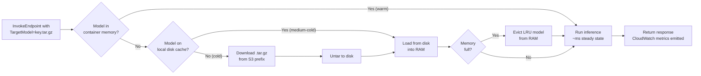
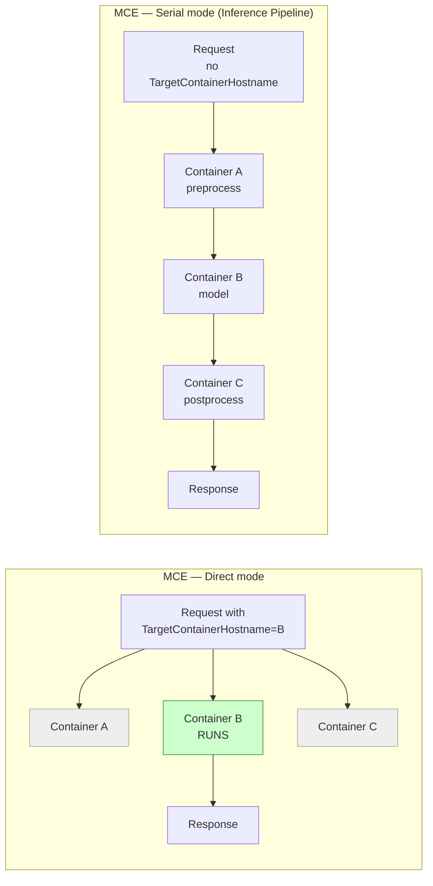
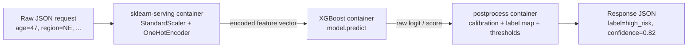

# Chapter 39 — Multi-Model Endpoints (MME) & Multi-Container Endpoints (MCE)

> **Goal of this chapter:** to give you a working, exam-ready, and production-honest mental model of the three SageMaker hosting patterns that pack *more than one thing* into a single endpoint — **Multi-Model Endpoints (MME)**, **Multi-Container Endpoints (MCE)** in **Direct** mode, and **MCE in Serial** mode (i.e., **Inference Pipelines**) — plus the late-2023 successor pattern, **Inference Components**, that has begun to displace MME in some workloads but emphatically not all. By the end of the chapter you should be able to read an MLA-C01 stem that mentions "thousands of tenant models", "preprocessing identical to training", "two frameworks behind one URL", or "per-model autoscaling" and route it to the right pattern, the right `CreateModel` shape, and the right invocation API in under thirty seconds. Real-time endpoints (Chapter 36), serverless (Chapter 37), and async/batch (Chapter 38) gave you the four *inference shapes*. This chapter is about the orthogonal question: given that you have picked the real-time shape, **how do you pack multiple models onto one endpoint without paying for one endpoint per model?**

---

## 39.1 Why this chapter exists: the cost-collapse pattern

A vanilla SageMaker real-time endpoint hosts **one model, in one container, on one fleet of instances**. That is exactly what you want for one or two production models — the entire industry has built lovely fishbone diagrams around the one-endpoint-one-model topology and most enterprise ML systems are deployed that way. The pattern breaks the moment the *count of models* leaves the single digits.

Three workload shapes break it, in three different ways:

- **The tenant fan-out workload.** A SaaS product trains a per-tenant model — one per customer, one per region, one per store, one per SKU. Five thousand tenants means five thousand `.tar.gz` artifacts and five thousand things that need to be invoked by tenant id. A naïve "one endpoint per model" architecture forces five thousand minimum-instance bills, which is absurd at any plausible scale — even at the smallest `ml.t2.medium`, five thousand always-on endpoints adds roughly USD 175,000 a month of *floor* cost before you serve a single prediction. Zendesk hit this wall first and famously cut 90% of their hosting bill by collapsing thousands of per-tenant TensorFlow classifiers behind a single MME (§39.11).
- **The pipeline-composition workload.** Inference in production is rarely one function call. The shape is *almost always* preprocess → model → postprocess: tokenise the raw text, run the transformer, calibrate the probabilities. Crushing all three steps into one container is brittle (different teams, different release cadences, different languages) and reintroduces training/serving skew because the preprocessing code is hand-written in a different place from the training pipeline. Inference Pipelines (a.k.a. Serial MCE) solve this by running 2–15 containers chained on one endpoint, each owning one stage, and they cost only the underlying instance fleet.
- **The co-tenancy of unrelated models workload.** Two small models from two teams each consume 5% of one instance. By default that is two endpoints — two minimum-instance bills, two CloudWatch dashboards, two on-call rotations, two IAM policies. MCE in Direct mode lets you put both containers on one endpoint and pick which one to invoke per request via `TargetContainerHostname`.

The structural reason all three of these patterns matter is the same: **SageMaker bills for the instance fleet behind an endpoint, not for the number of models on it.** Whether you serve one model or three thousand, the instance-hour meter ticks at the same rate. The patterns in this chapter are different ways of exploiting that pricing model — different ways of *amortising one fleet of instances across many logical "things"* so that you don't have to pay one fleet's worth of floor cost per logical thing.

The shape of this cost collapse is what AWS calls the **multi-tenant economics of inference**, and the MLA-C01 leans on it heavily: any stem that pairs the words *cost-effective* with *many models, same framework* is pointing at MME; any stem that pairs *one HTTP call* with *preprocessing chain* is pointing at Inference Pipelines; any stem that pairs *different frameworks* with *one endpoint* is pointing at MCE Direct.

Section 39.2 walks the MME concept and lifecycle in detail. Sections 39.3–39.6 cover the configuration knobs, caching behaviour, CloudWatch decomposition, and autoscaling target. Sections 39.7–39.9 do the same for MCE Direct, Inference Pipelines, and the underused but real combination move of running an inference pipeline behind an MME. Section 39.10 introduces the 2023-launched **Inference Components** pattern and gives you a defensible answer for when MME is still the right call. Sections 39.11–39.12 walk the canonical adoption stories (Zendesk, Stable Diffusion-on-G4dn, Salesforce 8×) that the exam phrases dozens of different ways. Section 39.13 is the four-way decision matrix. Section 39.14 is the twenty-item trap inventory. Section 39.15 is the exercise set.

---

## 39.2 Multi-Model Endpoints — the model

### 39.2.1 The one-sentence mental model

> **One container image. One fleet of instances. N model artifacts sitting in an S3 prefix. Each artifact is downloaded into instance memory on first invocation, cached locally, and evicted LRU when memory fills up. The caller picks which model to invoke by passing the `TargetModel` header on each request.**

That is the entire MME thesis. A multi-model-server container — built either from a stock SageMaker DLC (XGBoost, sklearn, TensorFlow Serving, TorchServe) or from a Triton image (GPU MME) — sits on the endpoint instances. The container speaks a `/load`, `/unload`, `/invoke` protocol against a *model store*, which is a configured S3 prefix. The first time a request arrives bearing `TargetModel=tenant_42.tar.gz`, the container downloads `s3://your-bucket/mme/tenant_42.tar.gz`, untars it, loads the model into RAM via the framework's normal load path, and runs inference. The second request bearing the same `TargetModel` finds the model already in memory and runs inference at warm-cache latency. When memory fills up, the least-recently-used model is evicted to make room.

There are no per-tenant endpoint deployments, no `UpdateEndpoint` calls when a new tenant onboards, no IAM role per tenant — the MME pattern collapses what would be N hosting deployments into one. AWS's blog headline for the launch said it without ornament: *"Save on inference costs by using Amazon SageMaker multi-model endpoints."*

### 39.2.2 The lifecycle of a model on an MME

The official "How multi-model endpoints work" page in the SageMaker Developer Guide enumerates six states. They are worth memorising in order — the exam tests them by asking what happens on the second invocation of a model that was loaded last hour, then the tenth invocation of a model whose memory was evicted but whose disk copy remains, then the first invocation of a brand-new artifact.



The six observable states are:

1. **Warm** — the model is currently loaded in container memory. Invocation runs at steady-state latency, which is whatever your model + framework cost (a 10 MB sklearn model is microseconds, a 200 MB transformer is tens of milliseconds, a multi-GB Stable Diffusion model is seconds). `ModelCacheHit = 1`.
2. **Medium-cold** — the model is not in memory, but its `.tar.gz` has already been pulled from S3 and untarred onto the local EBS disk. Invocation pays a framework-load cost (TensorFlow graph load, PyTorch state-dict deserialisation) but no S3 download. `ModelCacheHit = 0`; `ModelLoadingTime > 0`; `ModelDownloadingTime = 0`.
3. **Cold** — the model is neither in memory nor on disk. Invocation pays the full cost: S3 download, untar, framework load, *then* inference. `ModelDownloadingTime` dominates. The first request to this `TargetModel` since endpoint launch (or since disk eviction) takes this path.
4. **Memory pressure** — when a load would push container memory past its working-set ceiling, SageMaker chooses the least-recently-used model and unloads it from RAM. The artifact stays on disk. `ModelUnloadingTime` is recorded for the evicted model.
5. **Disk pressure** — when the local volume fills up, SageMaker deletes unused artifacts from disk to make room. Any subsequent invocation of those models pays a full S3 download (the cold path) again.
6. **Add / remove a model** — uploading a `.tar.gz` to the configured S3 prefix makes the new model invokable on the *next* `InvokeEndpoint` call bearing that `TargetModel`. **No `UpdateEndpoint` is required.** Deleting the S3 object means the next cold-cache invocation will fail; loaded copies continue to serve until evicted.

That last point is the single most operationally important fact about MME: **onboarding a new model is uploading an S3 object.** No deployment, no version bump, no canary. This is the killer feature for SaaS, and it is the bullet that gets phrased a dozen different ways on the exam. If a stem says "we need to add a new per-tenant model with the least operational overhead", the answer is "upload to the S3 prefix" — full stop, not "call `UpdateEndpoint`", not "deploy a new variant".

### 39.2.3 Cold-start anatomy

The MME cold start is the first-invocation latency penalty paid by a model that isn't currently in memory. It decomposes, biggest contributor first:

1. **S3 download** — network-bound, scales with artifact size and the instance's S3 throughput cap. A 10 MB sklearn model downloads in well under a second; a 4 GB Stable Diffusion model can take 5–15 seconds on a g5.2xlarge.
2. **Untar / decompression** — CPU-bound and small for any artifact under a few hundred MB, but proportional to artifact size.
3. **Framework load** — the cost of `pickle.load`, `joblib.load`, `tf.saved_model.load`, `torch.load`, or whatever the container's `model_fn` calls. Trivial for XGBoost (milliseconds), seconds for medium TensorFlow graphs, *minutes* for LLMs (which is why MME is not the right pattern for LLMs).
4. **JIT warm-up** — the first inference pays extra cost for graph-tracing / autograd warm-up / kernel compilation. Usually small compared to the other three but non-zero.

CloudWatch surfaces this decomposition through three companion metrics (§39.5), which lets you actually *see* which of the four contributors is dominating in production rather than guessing. The exam-relevant point is conceptual: **cold start is real, observable, and *bigger* than the steady-state inference cost** for any model heavier than a handful of MB. Designing around it means either (a) keeping the working set in memory by right-sizing the instance and the fleet, (b) pre-warming hot models via synthetic invocations, or (c) tier-splitting latency-sensitive tenants onto dedicated endpoints — all three of which are covered in §39.6 and §39.12.

> ⚠️ **Exam alert.** A stem that mentions "first-invocation latency" or "occasional slow responses on rarely-used tenant models" is almost always asking whether you know that MME has a cold-start path and how to mitigate it. The wrong answers will offer "increase the request timeout" or "switch to a larger instance type"; the right answers offer "pre-warm via scheduled synthetic invocations" or "monitor `ModelCacheHit` and right-size the fleet so working set fits in RAM".

### 39.2.4 When MME is the right answer

MME is the right answer when the stem describes **many similar models with skewed traffic**. The five-checkbox profile:

- **Many** models — dozens at the low end, thousands at the high end. Order-of-magnitude matters. If you have three models, you do not need MME; if you have three thousand, you almost certainly do.
- **Same** framework across all models — all XGBoost, all sklearn, all TensorFlow, all PyTorch. MME has one container image; you cannot mix frameworks. (That is what MCE Direct is for.)
- **Similar** size and latency profile — so the working set fits predictably in one instance's RAM, and so one model doesn't monopolise the GPU.
- **Long-tail traffic** with Pareto skew — a handful of models dominate invocations, the rest are rare. This is *good* for MME because the LRU cache naturally keeps the hot models warm and pages out the cold ones.
- **Tolerant of cold-start latency on the tail** — the long-tail models will pay cold-start when invoked. If your SLA forbids that on the tail, MME is the wrong pattern; use either dedicated endpoints for those tenants or Inference Components.

The four canonical fit scenarios are: **per-tenant SaaS personalisation** (one model per customer), **per-region forecasting** (one demand model per metro), **per-product recommenders** (one model per SKU), and **per-experiment variants** (A/B/C/.../Z variants of the same base recipe).

### 39.2.5 When MME is the wrong answer

The mirror image. If any of these is true, MME is not the pattern:

- **Different frameworks.** TensorFlow + PyTorch + XGBoost behind one endpoint → use MCE Direct (different container per framework). MME requires one container.
- **Strict p99 SLA on every model.** The long tail pays cold start. Either pre-warm aggressively, or use Inference Components which pre-load all components at deploy time.
- **Very large models (LLMs, multi-GB).** S3 download dominates; you can't keep many of them warm in RAM anyway. Use Inference Components or dedicated endpoints.
- **Per-model scaling needed.** MME scales the whole fleet on `InvocationsPerInstance`; you cannot say "give model X four extra replicas and model Y zero". That is exactly what Inference Components were built for.
- **Per-model versioning beyond `.tar.gz` keys.** MME has no native concept of variants per model.

> ⚠️ **Exam alert.** *"MME is not LLM hosting."* A stem that mentions hosting many large language models behind one endpoint, or per-LLM autoscaling, is pointing at **Inference Components**, not MME. The same is true for any stem mentioning "scale to zero with multiple models" — IC supports this; MME does not.

---

## 39.3 MME configuration: the exact CreateModel knobs

The single most important configuration parameter — the one that flips a regular SageMaker model into an MME-capable one — is the `Mode` field of the `PrimaryContainer`:

```python
import boto3
sm = boto3.client("sagemaker")

sm.create_model(
    ModelName="tenant-xgb-mme",
    ExecutionRoleArn="arn:aws:iam::111122223333:role/SageMakerRole",
    PrimaryContainer={
        "Image": "<account>.dkr.ecr.us-east-1.amazonaws.com/multi-model-xgb:latest",
        "Mode": "MultiModel",                              # ← THE switch
        "ModelDataUrl": "s3://my-bucket/mme-models/",      # ← S3 *prefix*, not a file
        "Environment": {
            "SAGEMAKER_PROGRAM": "inference.py"
        }
    }
)
```

Three subtleties on those parameters that the exam tests directly:

- **`Mode`** defaults to `SingleModel`. The two legal values are `SingleModel` and `MultiModel`. MCE (covered in §39.7) uses neither — it uses a `Containers` array instead of a `PrimaryContainer`.
- **`ModelDataUrl`** for `Mode: MultiModel` is an **S3 prefix**, and it must end with `/`. Every `.tar.gz` object under that prefix is treated as a candidate model. (For `Mode: SingleModel` the same field is a single `.tar.gz` object key — same field name, very different semantics. Easy to get wrong.)
- **`Environment`** still works for anything you would normally configure for a SageMaker container (`SAGEMAKER_PROGRAM` for the entry script, framework-specific knobs, etc.). The multi-model server machinery layers on top of the standard inference container contract — it does not replace it.

Once the model exists, the rest of the deployment is identical to a single-model real-time endpoint: build an `EndpointConfig` pointing at this model with one or more `ProductionVariants`, then `CreateEndpoint`. Auto-scaling, blue/green updates, VPC config, KMS encryption — all of the Chapter 36 mechanics apply unchanged.

### 39.3.1 Invocation: the `TargetModel` parameter

The caller picks which model to invoke by passing `TargetModel`:

```python
runtime = boto3.client("sagemaker-runtime")
runtime.invoke_endpoint(
    EndpointName="tenant-mme-endpoint",
    ContentType="text/csv",
    TargetModel="tenant_42.tar.gz",            # ← relative to the S3 prefix
    Body=b"3.5,1.4,0.2,0.1"
)
```

`TargetModel` is the **S3 key suffix of the artifact, relative to the configured prefix**. It is a string, not an ARN. The artifact at that key must be a valid SageMaker model archive (`.tar.gz` containing whatever your container's `model_fn` expects to load).

The SDK helper for `Predictor.predict` accepts a `target_model` keyword that translates to the same header. Internally the header on the wire is `X-Amzn-SageMaker-Target-Model`, which is what a BYOC container would read directly.

### 39.3.2 IAM scoping by `TargetModel`

The official MME security docs give an explicit IAM example for scoping which `TargetModel` values a caller may use, via the `sagemaker:TargetModel` condition key:

```json
{
  "Version": "2012-10-17",
  "Statement": [{
    "Action": ["sagemaker:InvokeEndpoint"],
    "Effect": "Allow",
    "Resource": "arn:aws:sagemaker:us-east-1:111122223333:endpoint/tenant-mme-endpoint",
    "Condition": {
      "StringLike": {
        "sagemaker:TargetModel": ["tenant_42*", "common/*"]
      }
    }
  }]
}
```

This is the core mechanism that makes MME safe for multi-tenant SaaS. A per-tenant IAM principal — the role assumed by tenant 42's API key, say — can only invoke their own `TargetModel` prefix; the IAM policy denies anything else. The exam will test this with stems describing "ensure tenant A cannot invoke tenant B's model on the shared endpoint"; the right answer involves the `sagemaker:TargetModel` condition key, not "create a separate endpoint per tenant".

---

## 39.4 MME constraints: framework, instance, and accelerator

The "Supported algorithms, frameworks, and instances for multi-model endpoints" docs page enumerates what is and isn't supported. Three buckets matter on the exam.

### 39.4.1 Built-in algorithms with native MME support

Not every built-in algorithm is MME-capable. The four that are: **XGBoost, K-Nearest Neighbors, Linear Learner, Random Cut Forest** — the four most common "classical" built-ins. Image and sequence algorithms generally aren't.

### 39.4.2 Framework containers with stock MME support

On CPU: **SKLearn, XGBoost, TensorFlow Serving, PyTorch (TorchServe)**. All ship the multi-model-server (`awslabs/multi-model-server`, Java MMS) machinery out of the box; you just set `Mode: MultiModel` and the container handles dynamic load/unload.

For bring-your-own-container (BYOC) on CPU, add the SageMaker Inference Toolkit (Python) which bootstraps MMS with the SageMaker contract. Your `/invocations` handler must respect the `X-Amzn-SageMaker-Target-Model` header and load the corresponding artifact on demand.

### 39.4.3 CPU instance families for MME

The workhorses are the `m5`, `c5`, `c6i`, `r5` families. The `r5` family is especially useful when working-set memory dominates (which it usually does for MME — hundreds of small models eat RAM, not CPU).

> ⚠️ **Exam alert.** **AWS Graviton is NOT supported for MME.** `m6g`, `c6g`, `c7g` cannot host an MME, even though they happily host single-model and MCE endpoints. This is a confirmed re:Post answer and a *frequent* exam trap. A stem that asks for "the cheapest CPU MME" wants `c6i` or `m5` — never Graviton. The same stem without "MME" would correctly point at Graviton; the MME word is the differentiator.

### 39.4.4 GPU MME — Triton and TorchServe only

MME added GPU support around late 2022 / early 2023, after the original CPU-only launch. The official supported GPU backends:

- **NVIDIA Triton Inference Server** — the AWS-blessed primary path. Triton was designed from the ground up to multiplex models on a GPU; SageMaker MME layers the dynamic-load contract on top.
- **TorchServe** for PyTorch — joint AWS + PyTorch foundation support; per-model `model-config.yaml` controls workers, batch size, batch delay, response timeout.
- **TensorFlow Serving** for specific framework versions on GPU.

Supported GPU instance families for MME include `g4dn`, `g5`, `g6`, `p2`, `p3`. AWS positions `g5` as the sweet spot for cost-per-model on most GPU MME workloads.

> ⚠️ **Exam alert.** **GPU MME requires Triton or TorchServe.** The MMS-based BYOC contract that works on CPU does *not* work on GPU; if you want a custom GPU MME container, Triton is the only fully supported route. A stem that asks "we need MME on GPU with a custom inference handler" should route to Triton with an ensemble or a Python backend, *not* to MMS/BYOC.

### 39.4.5 The single-multi-model-container-per-pipeline rule

The AWS docs include one cross-feature line worth memorising verbatim: *"You can use multi-model endpoints with serial inference pipelines (but only one multi-model enabled container can be included in an inference pipeline)."*

So the legal composite shapes are:

- preprocess → **MME** → postprocess  ✅
- **MME** → postprocess  ✅
- **MME** → **MME**  ❌ (illegal — only one MM container per pipeline)
- preprocess → **MME** → **MME** → postprocess  ❌

This is a frequent exam trap. Stems describing "two stages of multi-model selection" are testing whether you remember this one-MM-per-pipeline rule.

---

## 39.5 MME caching, CloudWatch metrics, and `ModelCacheSetting`

### 39.5.1 The `CacheConfig` / `ModelCacheSetting` knob

The "Set SageMaker AI multi-model endpoint model caching behavior" docs page (added 2023) lets you tune caching behaviour at the endpoint level. The headline knob is `ModelCacheSetting`, with two values:

- **`Enabled`** (default) — the usual behaviour. Models loaded into memory stay in memory until LRU-evicted or until the container scales away.
- **`Disabled`** — caching is turned off. Every invocation reloads the model from disk (and from S3 if the disk copy is gone). This is the right setting for **one-shot workloads**: each model is invoked once or very rarely, and the caching machinery is pure overhead. AWS explicitly recommends this for the one-shot profile in the docs.

For most production workloads, you leave caching enabled and tune the *instance size* to make the working set fit. Disabling cache is a niche choice — but it's a real one the exam can phrase as "every model is invoked exactly once per day for a daily refresh job; minimise overhead".

### 39.5.2 CloudWatch metrics specific to MME

Beyond the standard `Invocations` / `ModelLatency` / `OverheadLatency` / `Invocation4XXErrors` set that every endpoint emits, MME emits **six metrics that decompose the cold-start path**, namespaced under `AWS/SageMaker` and reported **per instance**:

| Metric                  | What it measures                                                              |
|-------------------------|-------------------------------------------------------------------------------|
| `ModelLoadingWaitTime`  | Time a request spent queued because the model wasn't loaded yet.              |
| `ModelDownloadingTime`  | Time spent downloading the artifact from S3 to local disk.                    |
| `ModelLoadingTime`      | Time spent loading the model from disk into container memory.                 |
| `ModelUnloadingTime`    | Time spent evicting another model to make room.                               |
| `ModelCacheHit`         | 1 if the model was already loaded (warm), 0 otherwise (cold).                 |
| `LoadedModelCount`      | Current count of models loaded in memory on each instance.                    |

The single most important of these — the one health metric to watch — is **`ModelCacheHit`**. Average it over a five-minute window and you have your **cache hit rate**: the fraction of invocations that found their model already in memory. A healthy MME runs at cache-hit-rate above 0.95; anything below means the working set isn't fitting in RAM and you should either right-size the instance (move to `r5.4xlarge` or larger) or split off the latency-sensitive tier (§39.6.3).

The decomposition lets you debug cold-start incidents precisely. If `ModelDownloadingTime` is the dominant contributor, S3 throughput is your bottleneck (consider `c5d` instances with NVMe local cache). If `ModelLoadingTime` dominates, the framework load is expensive (TensorFlow graph compile, PyTorch deserialisation). If `ModelLoadingWaitTime` is high but the others are low, requests are queueing behind a model load that's already in progress — usually a sign of a thundering-herd cold start on a popular new model.

### 39.5.3 Autoscaling MME

MME autoscaling has one important peculiarity: **you scale the endpoint (instance count), not per model.** The recommended target-tracking metric for MME is `InvocationsPerInstance` (or its newer twin `SageMakerVariantInvocationsPerInstance`). This is documented in the *Set Auto Scaling Policies for Multi-Model Endpoint Deployments* page.

```python
import boto3
asg = boto3.client("application-autoscaling")

asg.put_scaling_policy(
    PolicyName="mme-target-tracking",
    ServiceNamespace="sagemaker",
    ResourceId="endpoint/tenant-mme-endpoint/variant/AllTraffic",
    ScalableDimension="sagemaker:variant:DesiredInstanceCount",
    PolicyType="TargetTrackingScaling",
    TargetTrackingScalingPolicyConfiguration={
        "TargetValue": 1000.0,
        "PredefinedMetricSpecification": {
            "PredefinedMetricType": "SageMakerVariantInvocationsPerInstance"
        },
        "ScaleInCooldown": 600,
        "ScaleOutCooldown": 60
    }
)
```

> ⚠️ **Exam alert.** **`InvocationsPerInstance` is the right autoscaling target for MME, not `CPUUtilization`.** Cold loads themselves spike CPU during the framework-load step, which would cause an autoscaling policy keyed on CPU to flap — scale out because cold loads spiked CPU, then scale in once they finish, then scale out again on the next cold load. The exam phrases this trap as "an MME endpoint's auto-scaling is causing instance counts to oscillate during normal traffic" — the answer is "switch from CPUUtilization-based to InvocationsPerInstance target tracking".

Per-model scaling is not possible on MME by design. If you genuinely need it — if tenant A's traffic profile needs four replicas of tenant A's model while tenant B sits idle — you migrate to **Inference Components** (§39.10). MME's "scale the whole fleet" model is part of why it's so much cheaper than IC at the small-and-many end of the spectrum.

---

## 39.6 Cold-start mitigation in production

Cold start is the operational reality MME teams spend the most time tuning. The mitigation toolkit, in rough order of how often I've seen each one actually used:

### 39.6.1 Right-size the instance for working-set RAM

The cheapest, most-honest fix. If your working set is 50 models × 200 MB each = 10 GB, you need an instance with at least 12–16 GB of headroom-inclusive RAM dedicated to model memory. An `r5.4xlarge` (128 GB) lets the LRU cache hold the entire working set comfortably, which drives `ModelCacheHit` to >0.99. The marginal cost of moving from `m5.4xlarge` to `r5.4xlarge` is small compared to the latency win.

Zendesk hit this wall at >500 TensorFlow models on a single instance — beyond that threshold, TF graph-loading overhead and CPU contention degraded latency so badly they migrated to a larger fleet of smaller instances rather than packing one large instance tighter. The "500 TF models per instance" threshold is a real Zendesk-published number and the kind of detail that production teams genuinely remember; the exam doesn't test the exact number but does test the principle (right-size for working set, don't over-pack any single instance).

### 39.6.2 Scheduled pre-warm via synthetic invocations

The pattern is straightforward: an EventBridge cron triggers a Lambda every 5–10 minutes; the Lambda iterates over the top-N most-important `TargetModel`s and sends a dummy `InvokeEndpoint` request to each. The dummy invocations keep the hot models resident in memory and force a periodic re-warm if they were evicted.

This is the canonical mitigation for **tiered SLAs**: paid-tier tenants are in the pre-warm list (they will never see a cold start); free-tier tenants are not (they pay cold start on first invocation after a quiet period). It costs you exactly the dummy-inference cost of those Lambda-triggered invocations, which for 50 small models invoked every 5 minutes is single-digit dollars per month.

### 39.6.3 Tier-split the workload across endpoints

If you have a hot core of 10–50 tenants that absolutely cannot tolerate cold starts and a long tail of 10,000 tenants that can, the right pattern is two endpoints: a **single-model or IC endpoint** per latency-critical tenant (one model, always warm, predictable p99), and a **shared MME** for everyone else. This is more operationally complex than one MME for everyone, but it's the only architecture that delivers a hard p99 SLA on the hot tier and MME economics on the tail.

### 39.6.4 Disable model caching for one-shot workloads

When each model is invoked once and only once — a daily batch refresh where every tenant gets exactly one inference per day, say — caching is overhead, not optimisation. Setting `ModelCacheSetting: Disabled` skips the cache-and-evict cycle. The trade-off is throughput vs. memory: you give up cache hit rate (which is meaningless if you never re-hit a model anyway) in exchange for predictable behaviour with no eviction churn.

### 39.6.5 Pre-warm after scale-out

When auto-scaling adds a new instance to the fleet, that instance starts with an *empty* model cache. The first N invocations against it pay full cold-start, even for models that were warm on the other instances. The pattern is to subscribe a Lambda to the SageMaker scale-out event and synthetically invoke the top-N most-important models against the new instance before allowing it into normal rotation — or, more practically, to maintain a higher minimum instance count so scale-out is rare in steady state.

---

## 39.7 Multi-Container Endpoints — the model

### 39.7.1 The one-sentence mental model

> **Up to 15 containers running side-by-side on the same fleet of instances, either invoked individually (Direct mode, caller picks per request) or chained as a pipeline (Serial mode, every container runs in order).**

Where MME shares one container image across many model artifacts, MCE shares one fleet of instances across many different containers. The containers can be entirely different frameworks — TensorFlow, PyTorch, XGBoost, your custom C++ — co-located on the same hardware.

The configuration shape is fundamentally different from MME: instead of a `PrimaryContainer` with `Mode: MultiModel`, you pass a `Containers` array (1–15 elements) and an `InferenceExecutionConfig` whose `Mode` chooses between Direct and Serial behaviour.

### 39.7.2 The two modes

MCE has exactly two `InferenceExecutionConfig.Mode` values:

| Mode      | Behaviour                                                                                            |
|-----------|------------------------------------------------------------------------------------------------------|
| `Direct`  | Caller picks one container per request via `TargetContainerHostname`. Other containers don't run.    |
| `Serial`  | Every request flows **through every container in order** — this is the inference pipeline pattern.   |



In Direct mode, the caller specifies which container to invoke per request; the other containers exist on the same instance but stay idle for that request. In Serial mode, no `TargetContainerHostname` is passed — every request walks the chain in array order: container 0's response becomes container 1's input, and so on.

### 39.7.3 CreateModel for MCE — exact shape

```python
sm.create_model(
    ModelName="mce-direct",
    ExecutionRoleArn=role,
    Containers=[
        {
            "ContainerHostname": "tf-image-classifier",
            "Image": "<acct>.dkr.ecr.us-east-1.amazonaws.com/tf-serving:latest",
            "ModelDataUrl": "s3://bucket/tf-model.tar.gz"
        },
        {
            "ContainerHostname": "pt-text-classifier",
            "Image": "<acct>.dkr.ecr.us-east-1.amazonaws.com/torchserve:latest",
            "ModelDataUrl": "s3://bucket/pt-model.tar.gz"
        },
        {
            "ContainerHostname": "xgb-tabular",
            "Image": "<acct>.dkr.ecr.us-east-1.amazonaws.com/xgb:latest",
            "ModelDataUrl": "s3://bucket/xgb-model.tar.gz"
        }
    ],
    InferenceExecutionConfig={"Mode": "Direct"}     # or "Serial"
)
```

Three subtleties on this shape:

- **`ContainerHostname`** is the identifier the caller uses in `TargetContainerHostname` (Direct mode). It must be unique within the model.
- In **Serial** mode, the **order of the `Containers` array is the execution order**. Index 0 runs first; its response is the input to index 1; and so on.
- The **hardware** (instance type) is set at the `EndpointConfig` level, not on the model. All containers share that hardware — RAM, CPU, GPU. If one container is heavy, it can starve the others (no GPU pinning, no per-container resource limits in MCE).

### 39.7.4 Invoking MCE Direct

```python
runtime.invoke_endpoint(
    EndpointName="mce-endpoint",
    ContentType="application/json",
    TargetContainerHostname="pt-text-classifier",     # ← which container to run
    Body=json.dumps({"text": "hello world"})
)
```

The on-the-wire header is `X-Amzn-SageMaker-Target-Container-Hostname`. If `TargetContainerHostname` is omitted on a Direct-mode endpoint, the invocation fails — the router has no default container.

### 39.7.5 Invoking MCE Serial (Inference Pipeline)

```python
runtime.invoke_endpoint(
    EndpointName="inference-pipeline-endpoint",
    ContentType="text/csv",
    Body=b"some,raw,input"
    # NO TargetContainerHostname — every request walks the chain
)
```

Passing `TargetContainerHostname` on a Serial-mode endpoint is an error: there is no choice to make, every container always runs. The first container receives `Body`; its response is the request body for the second container; and so on. From the caller's point of view it's one HTTP call in and one response out — the inter-container plumbing is SageMaker's problem.

### 39.7.6 IAM scoping by `TargetContainerHostname`

The MCE security docs ship the same condition-key pattern as MME, but for container selection:

```json
{
  "Version": "2012-10-17",
  "Statement": [{
    "Action": ["sagemaker:InvokeEndpoint"],
    "Effect": "Allow",
    "Resource": "arn:aws:sagemaker:us-east-1:111122223333:endpoint/mce-endpoint",
    "Condition": {
      "StringEquals": {
        "sagemaker:TargetContainerHostname": ["pt-text-classifier"]
      }
    }
  }]
}
```

This is how you'd allow team A to invoke only their containers on a shared MCE Direct endpoint.

### 39.7.7 CloudWatch metrics for MCE

For **Direct** mode, SageMaker emits **per-container** versions of the standard metrics (one set per `ContainerHostname`):

- `Invocations` per container
- `ModelLatency` per container
- `OverheadLatency` per container
- `Invocation4XXErrors` / `Invocation5XXErrors` per container

For **Serial** mode, only the **endpoint-level** aggregate is emitted by default — per-container metrics require enabling container-level logging.

### 39.7.8 Limits and gotchas

- **Maximum 15 containers** per MCE (Direct or Serial). Minimum is 2 (otherwise just use a single-model endpoint).
- All containers share **one fleet of instances** — they are co-located. CPU/GPU/RAM is shared. No resource pinning.
- A pipeline can include **at most one multi-model-enabled container** (§39.4.5).
- **MCE Direct supports autoscaling** as a whole — but not per-container.
- **Updating MCE is endpoint-update.** The container list is immutable on a given Model — to change it you build a new Model and call `UpdateEndpoint`.

---

## 39.8 Inference Pipelines: training-serving parity in one HTTP call

### 39.8.1 The killer use case

The single highest-value reason inference pipelines exist is **training-serving parity for preprocessing**. The data transformation that ran during training — the scikit-learn `Pipeline` of `StandardScaler + OneHotEncoder + KBinsDiscretizer`, the Spark ML `PipelineModel` of stage after stage — is packaged as a container and chained in front of the model container at serving time. **The same transformation code** runs in both phases, eliminating the silent skew that plagues hand-written serving preprocessors.

This is one of the most under-rated pieces of value SageMaker ships. In every team I've worked with that has shipped a tabular ML model without inference pipelines, there has been at least one production incident traceable to "the training preprocessor and the serving preprocessor drifted apart" — somebody changed `dropna(how='any')` in one place and not the other, or the categorical encoder learned a new value during retraining and the serving JSON-decoder didn't agree. The inference pipeline pattern is structurally immune to this class of bug: there is no second copy of the preprocessor.



Two canonical wrapping containers ship pre-built and exist *purely* to bridge the training-serving gap:

- **`sagemaker-sparkml-serving`** — runs a Spark ML `PipelineModel` at serving time. The training artifact is exported via MLeap to a serving-time bundle. The training Spark job and the serving container run the same transformation graph.
- **`sagemaker-scikit-learn`** — runs a scikit-learn `Pipeline` at serving time. You ship the `.pkl` from training and the container deserialises and applies it.

AWS's blog "Ensure consistency in data processing code between training and inference" is the canonical reference and the document the exam is paraphrasing whenever it mentions "consistency between training and serving feature transformations".

### 39.8.2 Latency and cost model

- **Latency** = `sum(latency per container) + (N − 1) × inter-container overhead`. Inter-container hops are localhost HTTP, not network, so the overhead is small — typically single-digit milliseconds per hop — but it's not zero. A 4-container pipeline pays roughly 3 hops × ~5 ms = 15 ms over the sum of inference times.
- **Cost** = **only the instance fleet**. AWS docs state explicitly: *"There are no additional costs for using this feature. You pay only for the instances running on an endpoint."* Three containers on one instance = the price of one instance. This is the structural reason inference pipelines are so much cheaper than chaining three separate endpoints.

### 39.8.3 Inference Pipelines for Batch Transform

A pipeline `Model` can be used as the model of a **Batch Transform** job. The same chain runs over the input files, in batch, with no endpoint involved. This is how you reuse a real-time preprocessing chain for offline backfills without rebuilding it. It's also a tested gotcha — **Serial pipelines work in Batch Transform; Direct mode does not** (Direct is real-time only because the per-request `TargetContainerHostname` doesn't have a meaningful analogue in batch).

### 39.8.4 Pipeline logs and per-container observability

Each container in a Serial pipeline writes its own CloudWatch Logs stream, named by `ContainerHostname`. The endpoint emits the usual `Invocations` / `ModelLatency` at the pipeline level. Per-container *metrics* require enabling container-level logging; per-container *logs* come for free.

### 39.8.5 Pipeline immutability and deployment

A pipeline `Model` is immutable — the array of containers is set at `CreateModel` time. To change the chain (replace a stage, add a stage, reorder stages), you build a new `Model`, a new `EndpointConfig`, and call `UpdateEndpoint`. The blue/green semantics from Chapter 36 apply unchanged: the entire pipeline is the unit of deployment, which makes pipelines safe to canary or shadow as a whole.

---

## 39.9 The combination move: Inference Pipelines inside MME

A documented but underused pattern: you can host an **inference pipeline behind an MME**, subject to the §39.4.5 rule that only one of the pipeline's containers can be multi-model-enabled. The shape is:

```
                    ┌──────────────────────────────────────────────┐
                    │       MME endpoint (single URL)              │
                    │                                              │
TargetModel=        │  preprocess  →  MM-XGBoost  →  postprocess   │
 tenant_42.tar.gz   │  (one image)    (one image,     (one image)  │
                    │                  many tenants)               │
                    └──────────────────────────────────────────────┘
```

The use case is per-tenant pipelines on a shared endpoint: the preprocessing and postprocessing containers are tenant-agnostic and run for every tenant, while the middle MM-enabled container loads the per-tenant model based on `TargetModel`. AWS's blog "Using Amazon SageMaker inference pipelines with multi-model endpoints" documents this composition; in practice it's mostly used by SaaS teams that have already adopted MME and want to add training-serving-parity preprocessing without giving up the multi-tenant economics.

---

## 39.10 MME vs Inference Components — what the 2023–2024 launches changed

In late 2023, SageMaker launched **Inference Components (IC)** as a new hosting pattern that decouples *the model artifact* from *the instance fleet*. You define an `InferenceComponent` resource with a model, a container, a CPU/memory/accelerator allocation, and a copy count, and attach one or more components to an endpoint. The endpoint can host many ICs from many frameworks. Per-component autoscaling, per-component copy count, per-component resource limits — all first-class. At re:Invent 2024 AWS added **scale-to-zero for IC endpoints**: idle for ~15 minutes, the endpoint drops to zero instances; the next invoke pays a cold start.

This sounds like an MME-killer at first glance. It is not. The comparison:

| Property                              | MME                                              | Inference Components (IC)                       |
|---------------------------------------|--------------------------------------------------|-------------------------------------------------|
| Containers per endpoint               | 1                                                | Multiple — each component has its own container |
| Models per component                  | Many in one container, lazy-loaded               | 1 per component                                 |
| Per-model scaling policy              | **No** — endpoint-level only                     | **Yes** — each component scales independently   |
| Per-model copy count                  | Implicit, LRU-managed                            | Explicit (`ComputeResourceRequirements`, `CopyCount`) |
| Mixing frameworks on one endpoint     | No                                               | Yes                                             |
| Cold start                            | On first invoke (lazy-load)                      | Pre-loaded at deploy time (no first-invoke cold start) |
| Scale-to-zero                         | No                                               | **Yes** (re:Invent 2024)                        |
| Best for                              | Many small homogeneous models                    | Many heterogeneous models needing independent SLAs |
| Add a model live                      | Upload to S3 prefix                              | `CreateInferenceComponent` API call             |

### 39.10.1 When MME still wins

Despite the IC hype, MME remains the right choice in several patterns that the exam tests:

- **Truly thousands of homogeneous small models** with skewed traffic. MME packs more models per dollar at this scale than IC, because IC reserves explicit capacity per component while MME lets LRU optimise sharing.
- **Cost-floor sensitivity matters more than per-model autoscaling**. MME's "one fleet, all models" floor is structurally cheaper at the long-tail edges.
- **Ephemeral access patterns** — tail models that get invoked rarely and don't need a reserved copy on disk. MME's S3-prefix-is-the-registry model means tail tenants pay zero floor cost.
- **Same-framework workloads** where the one-container constraint isn't a real limitation.

### 39.10.2 When IC is the right answer

- **Per-model autoscaling** — tenant A's traffic spike must scale tenant A's component without scaling tenant B's.
- **Mixing frameworks behind one endpoint** without paying the MCE Direct "all containers always provisioned" cost.
- **Large LLMs (5–30 GB)** where the lazy-load cold start would be intolerable.
- **Scale-to-zero on a persistent endpoint** that hosts heterogeneous components.

The Salesforce Einstein AI Platform team's "8× cost savings" story (§39.12.3) is the canonical IC adoption story — they migrated from single-model endpoints (SME), not MME. The exam asks about each migration with stems that emphasise different keywords: per-model scaling and heterogeneous models point at IC; thousands of similar tenant models point at MME.

> ⚠️ **Exam alert.** **MME is not deprecated.** A stem implying "we should always use Inference Components instead of MME" is testing whether you know the distinction. MME is the right answer when the stem describes many similar models with skewed traffic and same-framework workloads; IC is the right answer when the stem demands per-model controls, framework heterogeneity, or scale-to-zero.

---

## 39.11 Zendesk — the canonical 90%-cost-savings MME story

Zendesk's *Suggested Macros* feature, released October 2021, recommends predefined response macros to support agents based on inbound ticket content. The business reality forced a per-tenant model design:

- Each Zendesk customer has its own ticket vocabulary, intent taxonomy, and product domain. A model trained on Customer A's tickets generalises poorly to Customer B.
- They train **one TensorFlow NLP classifier per customer**, sized 10–50 MB.
- They hold "thousands" of these in production across multiple AWS Regions.

A naïve "one endpoint per tenant" architecture would have meant thousands of `ml.c5.xlarge`-class endpoints, most of them idle. Instead, they consolidated onto MME:

| Metric                                                | Value                                    |
|-------------------------------------------------------|------------------------------------------|
| Cost vs. per-tenant dedicated endpoints               | **~90% cheaper**                         |
| Steady-state latency (model already in memory)        | **~100 ms**                              |
| Traffic floor                                         | 2 RPS minimum per endpoint               |
| Traffic peak                                          | Hundreds of RPS per endpoint             |
| Daily inference volume                                | "Millions of predictions"                |
| Models per region                                     | "Thousands"                              |
| Performance degradation threshold                     | **>500 TF models on a single instance**  |

Their model store layout is the canonical MME pattern: a flat S3 prefix containing one `model.tar.gz` per tenant, named by tenant id. Onboarding a new customer is uploading an S3 object — no endpoint update, no deployment.

The war-story detail buried in their AWS blog write-up: when they pushed past **500 TensorFlow models on a single instance**, latency tail blew up. Too much TF graph-loading overhead competing for CPU. They responded by *sharding across more, smaller instances* rather than packing one large instance to the gills — the right answer when the bottleneck is per-instance framework contention, not aggregate RAM. The 500-models-per-instance threshold is specific to their TF workload; the principle (right-size per-instance density to your framework's overhead profile) is general.

The Zendesk story is the exam's canonical MME stem. Any question that mentions "multi-tenant SaaS", "per-customer NLP model", "thousands of small models, same framework", or "millions of predictions per day at low latency" is rephrasing Zendesk.

---

## 39.12 GPU MME — Stable Diffusion at 75% savings and Triton ensembles

CPU MME is the well-trodden path. The interesting 2023–2024 story is **MME on GPU**, which AWS launched specifically because deep-learning customers wanted MME economics for vision and NLP DL models that don't fit on CPU.

### 39.12.1 The Stable Diffusion 75%-savings number

The PyTorch + AWS joint blog post "Accelerate AI models on GPU using SageMaker MMEs with TorchServe" headlines the most dramatic GPU-MME number in public:

| Setup                                                       | Monthly cost     |
|-------------------------------------------------------------|------------------|
| 100 Stable Diffusion endpoints @ `ml.g5.2xlarge` × $1.52/h × 730 h | **$218,880**     |
| 25 MMEs @ `ml.g5.2xlarge` packing 4 SD models per endpoint       | **$54,720**      |
| **Net savings**                                             | **75% cheaper**  |

The model sizes that make this fit on a 24 GiB `g5.2xlarge` GPU:

| Model                          | Size       |
|--------------------------------|------------|
| Segment Anything (SAM)         | 3,362 MiB  |
| Stable Diffusion Inpaint       | 3,910 MiB  |
| LaMa                           | 852 MiB    |
| **Total**                      | ~8.1 GiB   |

With three models loaded simultaneously on a single G5 GPU, you have substantial headroom on a 24 GiB card — and the LRU cache handles the fourth, fifth, sixth model rotating in as traffic demands.

### 39.12.2 The Triton ensemble pattern on G4dn

AWS's blog "Deploy thousands of model ensembles with Amazon SageMaker multi-model endpoints on GPU" uses a different anchor example: a single `ml.g4dn.4xlarge` endpoint hosting two Triton **ensemble** pipelines. An ensemble in Triton is a DAG of models defined inside the Triton model repository — preprocess → model → postprocess, but all of it inside one Triton-managed package. SageMaker MME treats each ensemble as one "model" for LRU purposes; Triton handles the intra-ensemble plumbing.

The blog reports "over $13,000/year saved" vs. running two separate G4 endpoints — roughly 50% cost reduction for that two-ensemble case. This is the smaller cousin of the Stable Diffusion number; both show the same shape (pack multiple GPU-resident models onto one endpoint, pay for one fleet, get N models' worth of inference).

The Triton ensemble pattern is particularly useful for vision pipelines: image preprocessing kernels, the backbone model, and a postprocessing classifier all run inside Triton with native GPU sharing.

### 39.12.3 The catch on GPU MME

- **BYOC on GPU is restricted.** The MMS-based "build your own multi-model container" path is CPU-only. If you want a custom GPU MME container, **Triton is the supported path**. TorchServe is the second supported one. Anything else is roll-your-own and not eligible for AWS support.
- **Loading large models from S3 is the long pole.** A multi-GB Stable Diffusion model loading lazily on first invoke can take 5–15 seconds even with high-bandwidth S3 reads. Mitigation is pre-warm via synthetic invocations (§39.6.2) or accepting a longer first-invoke tail for the cold-tier traffic.

---

## 39.13 Decision matrix — MME vs MCE Direct vs Inference Pipeline vs IC

The four-way matrix the exam keeps testing:

| Question                                                          | MME       | MCE Direct       | Inference Pipeline (Serial MCE) | Inference Components (IC)        |
|-------------------------------------------------------------------|-----------|------------------|---------------------------------|----------------------------------|
| Containers per endpoint                                           | 1         | 2–15             | 2–15                            | 1 per component, many components |
| Models per container                                              | Many      | 1                | 1                               | 1                                |
| Caller picks model/container per request?                         | Yes (`TargetModel`) | Yes (`TargetContainerHostname`) | No — full chain runs | Yes (component name) |
| Frameworks must match across models?                              | Yes       | No               | No                              | No                               |
| Sweet-spot use case                                               | Many similar models | Co-host unrelated models | Pre/post-process around a model | Heterogeneous models, per-model SLAs |
| Cold start on first invocation of an unseen model?                | Yes (lazy load) | No (all loaded at endpoint create) | No (loaded at create)       | No (pre-loaded at deploy)        |
| Per-model autoscaling?                                            | No        | No (per-endpoint) | No (per-endpoint)              | **Yes**                          |
| Scale-to-zero?                                                    | No        | No               | No                              | **Yes** (re:Invent 2024)         |
| Add a model without redeploying?                                  | **Yes** (S3 upload) | No (CreateModel + UpdateEndpoint) | No  | Yes (`CreateInferenceComponent`) |
| Graviton instance support?                                        | **No**    | Yes              | Yes (per container)             | Yes                              |
| GPU support?                                                      | Yes (Triton / TFS / TorchServe) | Yes | Yes                | Yes                              |
| Use inside Batch Transform?                                       | Limited   | No (Direct is real-time only) | **Yes**          | No                               |

### 39.13.1 Exam-stem decoder

Mapping common phrases back to the right pattern:

- *"Five thousand customers, one XGBoost model each, same training recipe."* → **MME** on `ml.m5` or `ml.r5` (not Graviton).
- *"Need pre-processing identical to training, then the model, then post-processing, served as one HTTP call."* → **Inference Pipeline** (Serial MCE), 3 containers.
- *"TF image model and PyTorch text model used by different teams, single shared endpoint to save cost."* → **MCE Direct**, 2 containers.
- *"100,000 personalised models, ml.g5 GPU, share GPU across models."* → **MME on GPU with Triton**.
- *"Per-model autoscaling, each model has its own QPS pattern."* → **Inference Components**.
- *"Reduce hosting cost for a fleet of LLMs ranging 5–30 GB each with bursty traffic."* → **Inference Components** (with scale-to-zero if applicable).
- *"Add a new tenant model with the least operational overhead."* → **MME** (upload to S3).
- *"Same preprocessing code at training and serving time, no skew."* → **Inference Pipeline**.

---

## 39.14 The twenty-item trap inventory

The patterns the MLA-C01 will phrase as plausible-but-wrong choices. Read these once a week before the exam.

1. **Graviton + MME.** `m6g`, `c6g`, `c7g` are *not* supported for MME. Correct cheap-CPU MME answer is `c6i` / `m5` / `c5`.
2. **`UpdateEndpoint` to add an MME model.** Not required — upload to S3.
3. **Two multi-model containers in one pipeline.** At most one MM-enabled container per pipeline.
4. **MCE Direct without `TargetContainerHostname`.** Error — no default container.
5. **MCE Serial with `TargetContainerHostname`.** Ignored / error — every container always runs.
6. **MME for LLMs.** Cold-start dominates; use IC or dedicated endpoints. MME is for small-to-medium models.
7. **MME autoscaling on `CPUUtilization`.** Cold loads spike CPU and cause flap. Use `InvocationsPerInstance` target tracking.
8. **MME with mixed frameworks.** Illegal — one container image, one framework.
9. **MCE metrics granularity.** Direct = per-container; Serial = endpoint-level only (unless container-level logging enabled).
10. **MME on GPU with MMS/BYOC.** Not supported. Triton or TorchServe only.
11. **MCE Direct in Batch Transform.** Doesn't make sense — Direct is real-time. Serial works in Batch.
12. **More than 15 containers in one MCE.** Hard cap. Need more? Split across endpoints or use IC.
13. **`ModelDataUrl` as a single object key for MME.** Wrong — it must be an S3 *prefix* ending with `/` for `Mode: MultiModel`.
14. **Forgetting that LRU evicts loaded models.** A "recently used" model can still be evicted if hotter models arrive.
15. **EBS volume eviction is separate from memory eviction.** When disk fills, ALL unused models get deleted; next invoke re-downloads from S3 (long cold start).
16. **No per-model CloudWatch metrics on MME.** Endpoint-level only. Per-model observability requires application-side instrumentation.
17. **MME is not the same as IC.** Even though both "host many models on one endpoint", MME = one container, IC = many components.
18. **MME doesn't scale to zero.** IC does (since re:Invent 2024). Don't conflate.
19. **Serverless endpoints don't support MME or MCE.** Both are real-time-only features.
20. **Inference pipeline cost.** No extra charge beyond the instance fleet — answers that mention "per-container licensing" or "extra fees" are wrong.

---

## 39.15 Exercises

The exercises are deliberately stem-shaped to match the exam.

**Exercise 39.1 — The SaaS forecaster.** A retail-tech SaaS hosts a per-store demand forecasting model for 2,000 stores. Each model is a 15 MB XGBoost regressor trained on that store's history. Traffic is heavily skewed — the top 100 stores generate 80% of inference calls. Latency target is p95 < 200 ms for the hot stores; the long tail can tolerate occasional 500 ms cold-start hits. Cost is the dominant concern. Sketch the deployment: choose the pattern, the instance family, the autoscaling target metric, the cold-start mitigation for the hot 100, and the IAM mechanism for per-tenant authorisation.

**Exercise 39.2 — The Graviton trap.** A junior MLE proposes hosting an MME on `ml.c7g.4xlarge` to get the cheapest CPU price. Explain in one paragraph why this won't work and what the right CPU choice is.

**Exercise 39.3 — The cold-start incident.** Your MME's `ModelCacheHit` metric has been averaging 0.78 for the last 48 hours, up from a baseline of 0.97. The `LoadedModelCount` per instance has dropped from ~120 to ~40. `ModelDownloadingTime` is now contributing materially to p99. What changed and what do you do? Identify at least three plausible root causes and the diagnostic step for each.

**Exercise 39.4 — The framework-mix question.** A team needs to host a TensorFlow image classifier and a PyTorch text classifier behind one URL for an A/B test. They want one endpoint, not two, to save the instance-hour floor. They want to be able to route traffic between the two models based on request payload. Which pattern do you choose, what does the `CreateModel` look like, and how does the caller pick which container to invoke?

**Exercise 39.5 — The training-serving skew bug.** A tabular fraud model was trained with a `Pipeline([StandardScaler, OneHotEncoder, XGBClassifier])` in scikit-learn. The team deployed it to a real-time endpoint by serialising just the `XGBClassifier` and writing a hand-rolled JSON-to-features preprocessor in the inference container. Production AUC is 8 points lower than offline. Why, and what is the AWS-recommended pattern to fix this structurally?

**Exercise 39.6 — MME vs IC decision.** Your company has 50 LLMs ranging from 7B to 70B parameters, served on `ml.g5.48xlarge` and `ml.p4d.24xlarge`. Traffic across LLMs is wildly different — some get 100 RPS, others get 1 RPS. The business wants per-LLM autoscaling and scale-to-zero on the idle ones. Which pattern, and why specifically *not* MME?

**Exercise 39.7 — The GPU MME architecture.** Design the deployment for 25 fine-tuned Stable Diffusion variants. Specify the instance family, the container, the cache strategy, and the autoscaling target. Estimate steady-state cost vs. one endpoint per variant.

---

## 39.16 Pricing summary

There is no extra SKU for any of the three patterns in this chapter. You pay for **the instance fleet behind the endpoint, by the second, while the endpoint is `InService`**. What changes between patterns is the *number of endpoints you have to run*:

- 5,000 models on 5,000 endpoints = pay for 5,000 instance fleets (minimum one instance each) → ~5,000× the floor cost.
- 5,000 models on one MME = pay for one instance fleet (e.g., 2 × `ml.m5.4xlarge`).
- 3 unrelated models on 3 endpoints vs. 1 MCE Direct on 1 endpoint = ~3× floor savings.
- An inference pipeline costs exactly one instance fleet regardless of how many containers in the chain (up to 15). All containers share RAM/CPU/GPU on the same instance.

This pricing model is *the* structural reason MME, MCE, and Inference Pipelines exist — and it's why the exam phrases "cost-effective" as a primary objective when it wants one of those answers.

---

## 39.17 What's next

Chapter 40 dives into **autoscaling and deployment guardrails** — the policies you wrap around every endpoint (single-model or MME or MCE), including target tracking, step scaling, scheduled scaling, deployment safety guardrails (blue/green, canary, linear, rolling), and the alarms that catch a bad model before traffic notices. Much of that chapter is implicitly about MME (because `InvocationsPerInstance` and `ModelCacheHit`-driven scaling are MME-specific concerns).

Chapter 47 covers **Infrastructure as Code for endpoint deployments** — how the same MME / MCE / pipeline configurations get expressed in CloudFormation, CDK, and Terraform, and why pinned IaC matters for the audit trail.

Cross-back: Chapter 35 introduced the four inference shapes and walked the high-level endpoint type comparison. Chapter 36 dove into real-time endpoints with production variants for A/B testing (the variant pattern is distinct from MCE Direct — variants weight-shift across copies of the *same* model; MCE Direct picks among *different* containers). Chapter 38 covered async and batch. Together with this chapter, you now have the full SageMaker hosting topology in working memory.

---

## 39.18 Quick reference card

| Q                                                          | A                                              |
|------------------------------------------------------------|------------------------------------------------|
| MME `Mode` flag / `ModelDataUrl`                           | `Mode: MultiModel`, S3 prefix ending `/`       |
| Pick model on invoke                                       | `TargetModel="key.tar.gz"`                     |
| MCE Direct / Serial mode                                   | `InferenceExecutionConfig.Mode`                |
| Pick container on invoke (Direct)                          | `TargetContainerHostname="name"`               |
| Max containers per MCE / min for pipeline                  | 15 / 2                                         |
| Multi-MM containers allowed per pipeline                   | 1                                              |
| MME on Graviton / GPU                                      | No / Yes via Triton, TFS, TorchServe           |
| Recommended MME scale metric / health metric               | `InvocationsPerInstance` / `ModelCacheHit`     |
| Add new model to MME                                       | Upload `.tar.gz` to S3 prefix (no UpdateEndpoint) |
| Per-model scaling                                          | Not on MME — use Inference Components          |
| Pipeline cost overhead                                     | None — pay only for instances                  |
| IAM keys                                                   | `sagemaker:TargetModel`, `sagemaker:TargetContainerHostname` |
| Zendesk cost saving                                        | ~90% vs per-tenant endpoints                   |
| Stable Diffusion MME cost saving                           | ~75% ($218k → $54k/mo)                         |
| Zendesk per-instance TF model density wall                 | ~500                                           |
| Disable disk cache for one-shot workloads                  | `ModelCacheSetting: Disabled`                  |

*End of Chapter 39 — Multi-Model Endpoints (MME) & Multi-Container Endpoints (MCE).*
