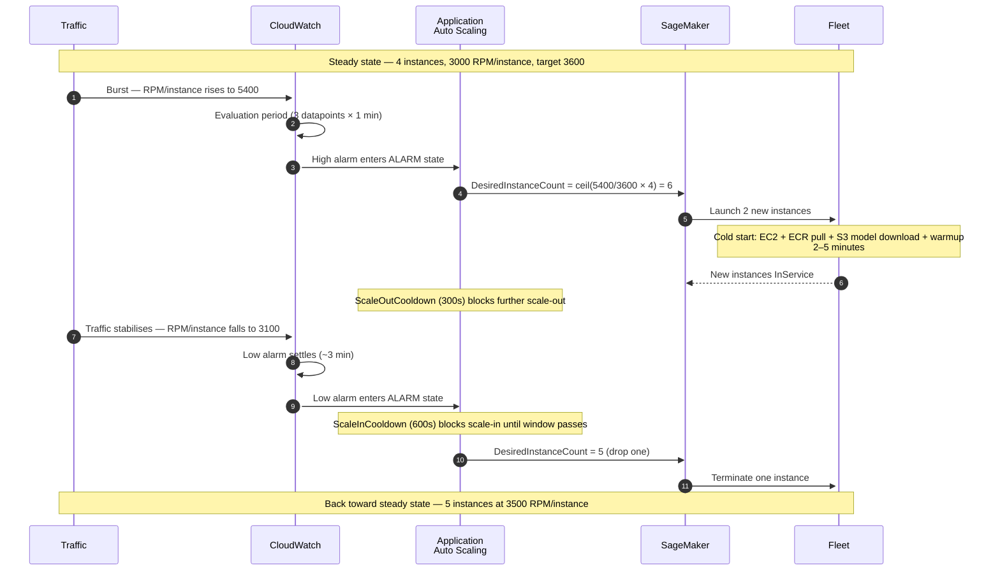
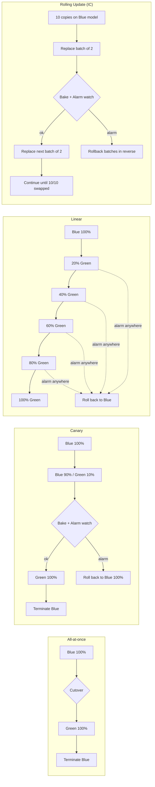
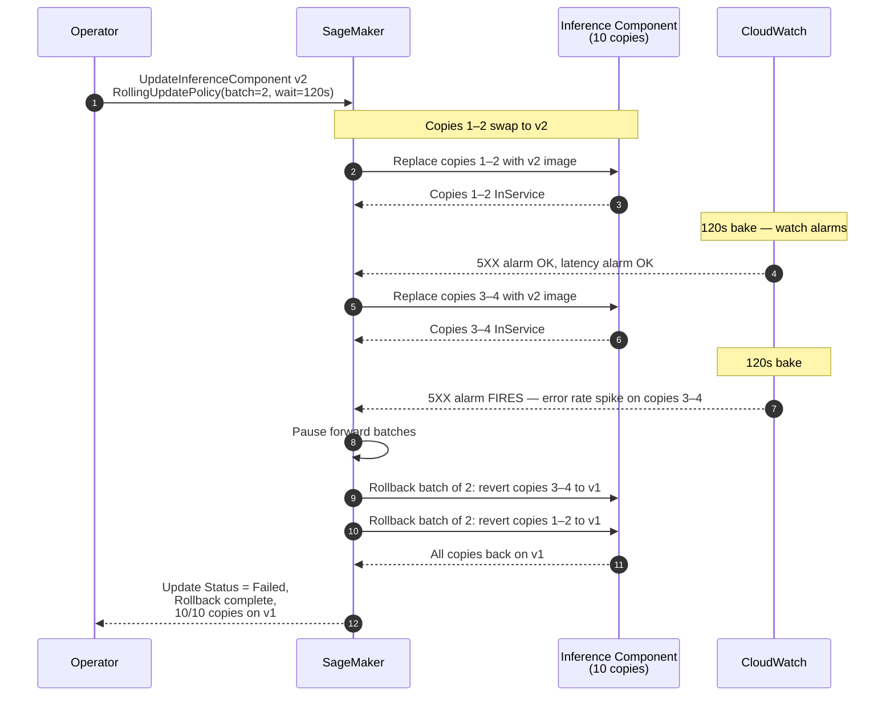

# Chapter 40 — Endpoint Auto-Scaling, Deployment Strategies, and Rollback

> **Goal of this chapter:** to make you fluent in the two operational halves of running a SageMaker real-time endpoint in production — *how many instances are running right now* (auto-scaling) and *how do I change the model on those instances without taking the business down* (deployment strategies and rollback). By the end you should be able to look at an MLA-C01 stem that mentions "spiky traffic", "scale to zero", "canary", "rolling update", "auto-rollback", or "blue/green" and route it to the right knob — `SageMakerVariantInvocationsPerInstance` versus CPU, target tracking versus step scaling, `BlueGreenUpdatePolicy` versus `RollingUpdatePolicy`, `AutoRollbackConfiguration` versus Model Monitor — in under thirty seconds. Chapters 35 through 38 taught you which *shape* of inference to pick (real-time, serverless, async, batch). This chapter teaches you what to do *after* you've picked it: keep the shape alive under varying load, and change the model inside it without a 2 a.m. customer-visible incident.

---

## 40.1 The two questions production life keeps asking

A SageMaker real-time endpoint, stripped of marketing, is a fleet of EC2 instances hidden behind a managed load balancer. From the moment the endpoint goes live two operational questions dominate the next eighteen months of its existence:

1. **How many instances should be running *right now*?**
   That is the *auto-scaling* problem. Traffic is rarely constant — diurnal curves, weekly cycles, viral spikes, on-call retry storms. The cost of getting the answer wrong runs in two directions and both are expensive. Provision too many instances and you burn money on idle GPUs; provision too few and you eat 5XX errors, breached SLAs, and an emergency incident review with the business.
2. **How do I change the model running on those instances *safely*?**
   That is the *deployment* problem. Pushing a regression to 100% of production traffic at 2 a.m. on a Friday is the single most expensive mistake a model-serving team can make. The model that looked perfect in offline eval may have a tokenizer bug that breaks 0.4% of requests with non-ASCII payloads, or a quantization regression that drops accuracy by 4% without changing latency, or a library upgrade that silently changes the meaning of a config flag. The job of the deployment layer is to *catch* those before they spread.

SageMaker solves the two problems with two **decoupled** services. This is the most important framing in the chapter, because the exam consistently tests them as separate concepts:

| Concern | Service | API surface |
|---|---|---|
| Scale the fleet up and down | **Application Auto Scaling** — a generic AWS service that scales many resource types, not a SageMaker-specific service | `application-autoscaling` CLI / boto3 namespace |
| Update the model on a fleet | **SageMaker Deployment Guardrails** | `UpdateEndpoint` with `DeploymentConfig` |

You configure them independently. They interact in one place — during a blue/green deployment, the freshly-provisioned *green* fleet is itself a scalable target and inherits the same scaling policy as the variant — but the rest of the time they live in different worlds. Learn them as two separate boxes that touch only during a deploy.

The chapter is structured to follow that split. Sections 40.2 through 40.9 cover auto-scaling end to end: the registration model, the four policy types, the canonical metric, the cooldown asymmetry rule, the cold-start trap, the 2024 inference-component layer, and the async backlog metric. Sections 40.10 through 40.14 cover deployment: the five strategies (all-at-once, blue/green, canary, linear, rolling), the `DeploymentConfig` JSON, the auto-rollback mechanism and what it cannot catch, and the production stories that make each strategy real. Section 40.15 collects exam tells; 40.16 is the exercise set.

A note on what is *not* in this chapter. Serverless endpoint scaling (Chapter 37) is handled by SageMaker itself with no `register-scalable-target` step at all — you set `MaxConcurrency` on the endpoint config and the service does the rest. If a question describes "intermittent traffic, acceptable cold starts, no infra management" the answer is *serverless, no auto-scaling configuration*; do not bring `InvocationsPerInstance` into that conversation. Likewise Multi-Model Endpoints have their own loading and eviction semantics (Chapter 39) and most of the deployment-guardrails surface area does not apply to them. The scope of this chapter is real-time endpoints with production variants and inference components, plus async endpoints for the backlog-metric pattern.

One more framing worth installing before the mechanics. The two systems in this chapter — auto-scaling and deployment guardrails — are both *reactive*. They watch metrics and they react. Neither one can fix a problem that does not show up as a metric. A model with a tokenizer bug that returns *plausible-looking but wrong* outputs at normal latency is invisible to both systems. The defences against that class of problem live in offline evaluation (covered in Chapter 14 and the Model Dev part) and in continuous production monitoring (Chapter 48 and beyond). Knowing the limits of what reactive scaling and deployment can do is as important as knowing what they can — because the exam, and your future incidents, will both punish you for over-trusting them.

---

## 40.2 Application Auto Scaling for SageMaker — the registration model

Application Auto Scaling is one of those AWS services that almost nobody talks about by its real name. It is the generic scaling engine that powers automatic capacity changes for ECS services, DynamoDB tables, Aurora read replicas, Spot Fleets, Comprehend endpoints, Lambda provisioned concurrency, and — for our purposes — **SageMaker endpoint variants** and **inference components**. The registration model is identical across all of those: tell the service what to scale, attach a policy that says when, optionally attach a schedule.

For SageMaker the three-step recipe looks like this:

1. **Register a scalable target** — tell Application Auto Scaling which resource it is allowed to scale, and the min/max bounds it must respect.
2. **Attach a scaling policy** — tell it *how* to decide when to scale (target tracking, step, scheduled).
3. **(Optional) attach scheduled actions** — tell it *when* to scale on the clock, irrespective of metrics.

The registration call:

```bash
aws application-autoscaling register-scalable-target \
  --service-namespace sagemaker \
  --resource-id endpoint/my-endpoint/variant/AllTraffic \
  --scalable-dimension sagemaker:variant:DesiredInstanceCount \
  --min-capacity 2 \
  --max-capacity 8
```

Memorise the **three magic strings** — they appear in exam questions verbatim and a typo is wrong by construction:

- `ServiceNamespace = sagemaker`
- `ResourceId = endpoint/<endpoint-name>/variant/<variant-name>`
- `ScalableDimension = sagemaker:variant:DesiredInstanceCount`

The unit being scaled is **instances per variant**. Read that twice. If an endpoint hosts two production variants — say an A/B test with `variant-A` and `variant-B` — each variant is its own scalable target. They can have independent policies, independent min/max, and they will scale **independently**. This is a subtle but heavily-tested point. If the exam stem describes a single endpoint with two variants and asks you to scale one of them more aggressively than the other, the answer is two separate `register-scalable-target` calls, not one with some shared knob.

Min and max capacity are *hard* fences. Application Auto Scaling will never go outside them no matter what the policy says. That sentence sounds obvious until you read §40.10 below on the "no `MaxCapacity` set" anti-pattern that has cost real teams thousands of dollars in an afternoon. Set `MinCapacity ≥ 2` for any latency-sensitive endpoint that needs HA across availability zones, and set `MaxCapacity` based on a load test, not on intuition. Application Auto Scaling will happily fill any fence you build.

The only legitimate reason to set `MinCapacity = 0` on a real-time endpoint is when you have explicitly opted into the 2024 scale-to-zero feature, which requires inference components plus a step-scaling policy on the `HasBacklogWithoutCapacity` alarm. Without that machinery, `MinCapacity = 0` will scale you to zero overnight and the next morning's first request will time out during the multi-minute model load. We will come back to this trap in §40.9.

---

## 40.3 The four scaling-policy types

Application Auto Scaling supports four kinds of scaling policy. SageMaker first-classes three of them and treats the fourth as a distractor. Production teams almost always *layer* them rather than picking one — a target-tracking policy as the steady-state baseline, scheduled actions to pre-warm before known peaks, and sometimes a step-scaling policy on top to react to surprise bursts.

### 40.3.1 Target tracking — the recommended default

You pick a metric, you pick a target value, and Application Auto Scaling does the math for you. It adds or removes instances to keep the actual metric near the target value. Behind the scenes the service provisions two CloudWatch alarms (a high alarm and a low alarm) and manages them as a system — you never see, edit, or delete those alarms directly, even though they show up in your CloudWatch console.

The canonical SageMaker target-tracking policy JSON:

```json
{
  "TargetValue": 3600.0,
  "PredefinedMetricSpecification": {
    "PredefinedMetricType": "SageMakerVariantInvocationsPerInstance"
  },
  "ScaleOutCooldown": 300,
  "ScaleInCooldown": 600
}
```

Applied with:

```bash
aws application-autoscaling put-scaling-policy \
  --policy-name invocations-target-tracking \
  --service-namespace sagemaker \
  --resource-id endpoint/my-endpoint/variant/AllTraffic \
  --scalable-dimension sagemaker:variant:DesiredInstanceCount \
  --policy-type TargetTrackingScaling \
  --target-tracking-scaling-policy-configuration file://config.json
```

This is the default exam answer whenever the stem says "scale a real-time endpoint" without further qualification. The target value comes from the load-test formula in §40.4 below.

### 40.3.2 Step scaling — for custom alarm logic, and the only way back from zero

You define your own CloudWatch alarm thresholds and you tell Application Auto Scaling *exactly* how many instances to add (or remove) when each threshold is breached. More work to tune; far more flexibility. Step scaling is what you reach for when:

- You want to add three or four instances at once on a hard burst, rather than letting target tracking add them one at a time.
- You need the *only* policy that can take a SageMaker endpoint from **zero** instances back to one or more. Target tracking can drive an endpoint down to zero on scale-in but cannot wake it back up; the alarms it manages internally do not fire when there are no instances emitting metrics.

That second point is the sharpest exam fact about step scaling. Any stem that combines "scale to zero" with "must recover automatically when the next request arrives" implies a step-scaling policy on a *queue-depth* or *backlog* alarm — never target tracking alone.

### 40.3.3 Scheduled scaling — for known calendars

If your traffic is dictated by business hours, weekly batches, or end-of-month cycles, schedule capacity changes directly:

```bash
aws application-autoscaling put-scheduled-action \
  --service-namespace sagemaker \
  --schedule "cron(0 8 ? * MON-FRI *)" \
  --scheduled-action-name weekday-morning-warmup \
  --resource-id endpoint/my-endpoint/variant/AllTraffic \
  --scalable-dimension sagemaker:variant:DesiredInstanceCount \
  --scalable-target-action MinCapacity=4,MaxCapacity=12
```

Use scheduled actions **in combination with** target tracking, not as a replacement for it. The production pattern is: bump `MinCapacity` at 7:55 a.m. so the fleet is already warm when users arrive at 8:00, then let target tracking handle the bursts inside the day. A retail-search team running a Black Friday weekend with us did exactly this — `MinCapacity = 12` baked in for 72 hours, ratcheted down on Tuesday morning, target tracking layered on top for the spikes. No cold starts visible to customers.

### 40.3.4 Predictive scaling — distract me not

Application Auto Scaling supports a true *predictive* scaling policy that learns from historical traffic patterns and pre-warms capacity. The service does. But **SageMaker endpoint variants are not on the list of first-class predictive-scaling resource types** today. If the exam mentions "predictive scaling for SageMaker endpoints" treat it as a distractor; the right answer for a known calendar is **scheduled scaling**, and the right answer for a learned daily curve is to *combine* scheduled actions (broad strokes) with target tracking (fine-grained reaction).

A pragmatic note: there is nothing stopping you from running a Lambda on EventBridge that calls `PutScheduledAction` based on your own forecast of next-day traffic. Several large e-commerce teams do exactly that. That is "homegrown predictive scaling" and it is fine in production; it just is not what the AWS-native `PredictiveScalingPolicyConfiguration` parameter means, and the exam will not accept that conflation.

⚠️ **Exam alert.** When you see "predictive scaling" alongside "SageMaker endpoint" the trap is to pick the predictive policy type. The correct answer is **scheduled scaling**. Predictive scaling as a policy type is for EC2 Auto Scaling Groups, not SageMaker variants.

---

## 40.4 The metric that matters — `SageMakerVariantInvocationsPerInstance`

This is one of the most-tested ideas in the entire MLA-C01. The official AWS recommendation is to scale on `SageMakerVariantInvocationsPerInstance`, **not** on CPU or GPU utilization, and not on memory. Three reasons, ranked by weight:

1. **Direct proportionality to load.** Invocations-per-instance maps one-to-one to the work the endpoint is doing. CPU utilization is a *consequence* of that work, mediated by model size, batch size, framework choice, hardware accelerators, and what else happens to be running on the box. A model that saturates a GPU at 30% CPU will never trip a CPU-based policy. A model with a Python preprocessor that pegs the CPU before the GPU is even warm will trip the policy on the wrong signal.
2. **Latency hiding.** Modern inference workloads — especially LLMs and embedding models — spend most of their wall-clock time waiting on the accelerator while the CPU sits near idle. CPU utilization is structurally blind to them.
3. **SageMaker emits it natively.** `InvocationsPerInstance` is pre-aggregated per variant by SageMaker and exposed as a *predefined* metric type to Application Auto Scaling. You do not have to build a `CustomizedMetricSpecification`, you cannot mistype the dimensions, and the units line up automatically with the cooldowns.

In an MLA-C01 question, **any answer that scales SageMaker on CPU utilization is almost always wrong**. The right answer is `SageMakerVariantInvocationsPerInstance`. For LLM and streaming-token workloads, there is one upgrade: the newer **high-resolution** variants:

- `SageMakerVariantConcurrentRequestsPerModelHighResolution`
- `SageMakerInferenceComponentConcurrentRequestsPerCopyHighResolution`

Both emit every ten seconds (versus once per minute for the standard metric), which makes them scale out far faster on bursty LLM traffic where a one-minute lag is a customer-visible outage.

⚠️ **Exam alert.** When the question says "scale a SageMaker real-time endpoint" the default metric is **`SageMakerVariantInvocationsPerInstance`**, not `CPUUtilization`, not `GPUUtilization`, not `MemoryUtilization`. The exam writers love planting those three CPU/GPU/Memory options as plausible distractors because they are the right answer for EC2 Auto Scaling Groups. They are the wrong answer for SageMaker.

### 40.4.1 The canonical formula

Once you have decided to scale on `InvocationsPerInstance`, you need a *number* — the `TargetValue` to feed the policy. AWS's load-testing guide spells out the formula verbatim:

```
TargetValue = MAX_RPS × SAFETY_FACTOR × 60
```

Three quantities, each with a specific meaning:

- **`MAX_RPS`** is the maximum requests-per-second a *single* instance of your chosen type can handle while still meeting your latency SLO. You measure it by load-testing the endpoint with one instance, sweeping concurrency upward, and noting the RPS just before either (a) `ModelLatency` p99 climbs above your SLO or (b) the success rate drops below 99.9%. Whichever comes first.
- **`SAFETY_FACTOR`** is the headroom multiplier. AWS recommends starting at **0.5** — meaning each instance is targeted at half its measured saturation point — and adjusting from there based on workload character. Latency-sensitive workloads (chat, search, ad-tech) go 0.4–0.5 for more headroom; throughput-tolerant batch-ish workloads go 0.7–0.8 to save cost; bursty unpredictable workloads go 0.3–0.4 because the 2–5 minute scale-out cold start eats into your headroom budget anyway.
- **`60`** converts from RPS to invocations-per-*minute* because the predefined CloudWatch metric is reported per minute. This factor of 60 is forgettable and will silently produce a target value 60× too low if you skip it.

Worked example. A fraud-detection endpoint on `ml.c5.xlarge`:
- Load test saturates at 120 RPS/instance; p99 latency is 80 ms at half-saturation.
- Latency SLO is p99 < 100 ms → choose `SAFETY_FACTOR = 0.5`.
- `TargetValue = 120 × 0.5 × 60 = 3,600` invocations/min/instance.

When per-instance RPM exceeds ~3,600, Application Auto Scaling adds instances. The internal math it uses is:

```
DesiredCapacity = ceil( (CurrentMetric / TargetValue) × CurrentCapacity )
```

So if you currently run 4 instances at 4,500 RPM/instance against a 3,600 target, the next desired capacity is `ceil(4500/3600 × 4) = ceil(5.0) = 5` instances. The math is deterministic, and you can sanity-check it by hand any time the policy seems to be doing something surprising.

### 40.4.2 Custom metrics — when to leave the predefined path

Two custom metrics are worth knowing by name, because production teams reach for them and the exam quietly tests them:

- **`ExplanationsPerInstance`** (namespace `AWS/SageMaker`). When SageMaker Clarify online explainability is enabled on the endpoint, each *explanation* is far more expensive than a *prediction* — sometimes 10×. Layer a target-tracking policy on `ExplanationsPerInstance` alongside the `InvocationsPerInstance` policy so the fleet scales on the heavier workload too.
- **`ApproximateBacklogSizePerInstance`** (namespace `AWS/SageMaker`). The async-endpoint queue-depth metric. See §40.8 below.

When neither predefined nor custom-SageMaker metrics fit — a single-tenant CPU-bound classical-ML container with no accelerator is the only legitimate case I can think of — you can fall back to `CustomizedMetricSpecification` on `CPUUtilization`. Even then, `InvocationsPerInstance` is usually still the better answer. Default to it.

---

## 40.5 Cooldowns and the asymmetry rule

A scaling policy that adds an instance and removes it 30 seconds later is *flapping*. Flapping is bad for two compounding reasons. First, it never stabilises the load — the fleet oscillates forever and the metric never settles near the target. Second, every scale-out event drags a fresh container through the cold-start sequence (2–5 minutes for a non-trivial model, longer for LLMs) and every scale-in event throws away that work. Production teams measure flapping in dollars: AWS bills new instances at per-second granularity but you still pay for the minimum, and a fleet that adds and removes the same instance every 90 seconds can cost 2× the stable equivalent.

You prevent flap with two cooldowns:

- **`ScaleOutCooldown`** — minimum seconds between successive scale-out actions. Counts from the *start* of the most recent scale-out, not its completion.
- **`ScaleInCooldown`** — minimum seconds between successive scale-in actions.

The **asymmetry rule** is the most-tested operational fact in the chapter and you should memorise the slogan: **scale out fast, scale in slow.** In practice the canonical defaults are:

- `ScaleOutCooldown = 300` seconds (5 minutes)
- `ScaleInCooldown = 600` seconds (10 minutes)

Aggressive low-latency endpoints push `ScaleOutCooldown` down to 10–60 seconds; conservative scale-in stays at 300–900 seconds.

Why asymmetric?

| Direction | Cost of being wrong | Therefore |
|---|---|---|
| Scale-out too slow | Latency breach, 5XX storm, dropped requests, customer SLA hit | Be eager (short cooldown) |
| Scale-in too fast | You paid for an extra five minutes of one instance, then have to cold-start it back in five more | Be patient (long cooldown) |

The arithmetic is one-sided. A burst that you fail to absorb costs you incidents. A dip that you scale into prematurely costs you the next cold start, which you were going to pay for anyway, *plus* the customer impact of that cold start being on the critical path. So you bias the system to keep one extra instance longer than strictly necessary. It is a deliberate tax on cost in exchange for tail-latency safety.

A frequent exam distractor reverses the asymmetry — long `ScaleOutCooldown`, short `ScaleInCooldown`. **Always wrong.** Out fast, in slow.

⚠️ **Exam alert.** Cooldown direction is asymmetric and the direction is fixed: `ScaleInCooldown > ScaleOutCooldown`. If a multiple-choice answer flips this it is wrong. The typical exam values are 300 out / 600 in.

### 40.5.1 A flapping war story

A team I worked with set both cooldowns at 60 seconds on a small endpoint with 1–4 instances. Traffic was bimodal — bursts every 90 seconds from a polling client. Result: every two-to-three minutes the endpoint added an instance, then dropped one, then added another. CloudWatch billing showed 2× the instance-hours of a stable configuration, because newly-launched instances were billed at the full per-second minimum but only ran for 60–90 seconds. The fix was a one-line config change: `ScaleInCooldown = 900`, `ScaleOutCooldown = 60`. Cost dropped 45% the same afternoon and customer-visible latency did not move.

The underlying lesson generalises. Whenever two operational levers fight each other — a scale-in policy fighting an arrival pattern that recurs every few minutes, or two scaling policies fighting each other because they target related metrics with different views of saturation — Application Auto Scaling's tiebreak rule is to **pick the policy that provisions the largest capacity for both scale-out and scale-in**. That sounds safe but it's not free; it means capacity will sometimes ratchet up faster than you expected (good for SLAs, bad for cost) and sometimes refuse to scale in (good for tail latency, bad for the FinOps team). When you layer policies, expect them to interact, and run a load test that exercises the interaction explicitly before you trust the layered config in production.

### 40.5.2 Cooldown is not the only flap defence

A second knob lives on the CloudWatch alarm itself: `EvaluationPeriods` and `DatapointsToAlarm`. For target-tracking the service uses a 3-of-3-minutes evaluation by default — meaning the alarm needs three consecutive minutes of breach before it trips. Even with a 10-second cooldown that minimum-three-minute settling time is still in force. Teams sometimes shorten the cooldown when what they really want is fewer evaluation datapoints. Confusing the two leads to scale-out lag that no cooldown change can fix.

---

## 40.6 The 2–5 minute cold-start trap

The brutal arithmetic of SageMaker scale-out is worth committing to memory, because it sets the ceiling on how fast auto-scaling can actually help you:

| Phase | Typical duration |
|---|---|
| CloudWatch alarm latency (evaluation periods) | 1–3 min |
| Auto Scaling decision + control-plane API call | ~10–30 s |
| EC2 instance launch | ~30–60 s |
| Container image pull from ECR | 30 s – 2 min |
| Model artifact download from S3 | 30 s – 5+ min (size-dependent) |
| Container `ping` health check passes | until model load completes |
| Endpoint reflects the new instance as `InService` | **2–10 minutes total** |

For a 30 GB LLM container, end-to-end is more like **8–12 minutes**. By the time scale-out lands, your traffic burst is half over and your tail latency is already a customer-visible incident. There is no auto-scaling policy that fixes this physics. The only defences are pre-positioning capacity *before* you need it, and degrading gracefully when you cannot.

The mitigations production teams actually deploy, in order of how often we see them:

**(a) Provisioned headroom.** Set `MinCapacity` high enough that p99 traffic is served before scale-out even fires. You pay for it 24/7 in exchange for tail-latency safety. The formula is `MinCapacity = ceil(p99_RPM / TargetValue)` rather than `ceil(average_RPM / TargetValue)`. This is the "buy your way out of cold starts" approach and it is the dominant pattern for latency-sensitive workloads.

**(b) Scheduled scaling for known events.** A retail-search team scheduled `MinCapacity = 12` for Black Friday weekend and ratcheted back over the next 72 hours. They scaled *proactively*, not reactively. This works whenever your traffic has predictable diurnal or weekly structure.

**(c) Inference-component scale-to-zero with a step-scaling policy.** The 2024 feature lets you scale to zero copies of a component on a shared fleet, then wake them on a `HasBacklogWithoutCapacity` alarm. Warm-instance copy starts run in ~30–60 seconds; brand-new instance + copy combinations are still 2–5 minutes. We cover this in §40.7.

**(d) Larger instance, fewer copies.** Counter-intuitively, choosing a beefier instance type at a lower instance count reduces *scale-event frequency* — fewer scale events means fewer cold starts. The trade-off is less granular cost control and a larger blast radius per scaled-in instance.

**(e) Predictive pre-warming via your own Lambda + scheduled actions.** Mentioned in §40.3.4. Build your own forecast, write `PutScheduledAction` calls, get pre-warming without the AWS-native predictive scaling policy that SageMaker doesn't support.

The hardest lesson is the one nobody wants to internalise: *if your traffic spike rises faster than your cold-start time, scale-out cannot save you.* It is structurally too slow. The only defences are pre-positioning and queueing — and that is exactly what async endpoints exploit in §40.8.

---

## 40.7 Inference Components — per-component auto-scaling (2024)

The 2024 **Inference Components** model on SageMaker endpoints lets you pack multiple models onto a shared fleet, each with its own copy count. Scaling now happens at **two** levels, and the exam tests the distinction explicitly.

| Level | What scales | Policy metric |
|---|---|---|
| Endpoint instance count | The shared underlying fleet | Target tracking on overall utilization, or held fixed by `MinCapacity = MaxCapacity` |
| Per-component copy count | Individual model copies inside the fleet | Target tracking on `SageMakerInferenceComponentConcurrentRequestsPerCopyHighResolution` or `SageMakerInferenceComponentInvocationsPerCopy` |

The scalable dimension for a component is `sagemaker:inference-component:DesiredCopyCount`. The resource ID is the inference component ARN, not the endpoint ARN.

This is the pattern to reach for when an exam stem says: "We host ten models on one endpoint; one of them is bursty, the others are flat; the bursty one keeps starving the others." The right answer is **per-component scaling**, not endpoint-level scaling. The bursty component gets more copies without disturbing the others, and the shared fleet stays at a stable instance count.

⚠️ **Exam alert.** The scalable dimension `sagemaker:inference-component:DesiredCopyCount` is **IC-only**. Variants use `sagemaker:variant:DesiredInstanceCount`. If a stem mentions inference components and an answer uses the variant dimension (or vice versa), it is wrong. The two dimensions are not interchangeable.

### 40.7.1 Wake from zero with step scaling

The IC feature is also the modern home of *true* scale-to-zero on a real-time endpoint. The pattern is a two-policy stack:

| Policy | Type | Trigger | Job |
|---|---|---|---|
| Wake-from-zero | Step scaling | `HasBacklogWithoutCapacity` alarm in `ALARM` state | Add the first copy when queue depth > 0 and capacity = 0 |
| Steady-state | Target tracking | `ConcurrentRequestsPerCopyHighResolution` | Hold concurrency at the target value once warm |

The step policy provisions the first copy. Once that copy is up and metrics resume emitting, target tracking takes over and runs the rest of the day. You can drive the component back to zero by setting `MinCapacity = 0` on the registered scalable target and letting the scale-in policy do its work during quiet periods.

---

## 40.8 Async endpoints — backlog-based auto-scaling

Async inference (Chapter 38) is the historical home of the "scale to zero and back" pattern because its queue is the missing piece. Real-time endpoints have to spin up *before* they can serve, which is why the cold-start trap of §40.6 is so painful. Async endpoints queue the request in SQS; the queued request waits while the fleet boots; from the caller's perspective the latency is "a little longer than usual" rather than "a 5XX during cold start."

The canonical async scaling policy uses the custom metric **`ApproximateBacklogSizePerInstance`** (namespace `AWS/SageMaker`, dimension `EndpointName`). Target-tracking on this metric keeps queue depth bounded per instance.

```json
{
  "TargetValue": 5.0,
  "CustomizedMetricSpecification": {
    "MetricName": "ApproximateBacklogSizePerInstance",
    "Namespace": "AWS/SageMaker",
    "Dimensions": [
      { "Name": "EndpointName", "Value": "my-async-endpoint" }
    ],
    "Statistic": "Average"
  },
  "ScaleOutCooldown": 60,
  "ScaleInCooldown": 600
}
```

To wake the endpoint from zero, pair the target-tracking policy with a *step-scaling* policy on the `HasBacklogWithoutCapacity` alarm — the same alarm name as the IC pattern in §40.7.1. The alarm fires when there are queued requests and no instances; the step policy adds an instance; after warm-up the target-tracking policy takes over.

Two-policy pattern in summary:

| Policy | Type | Trigger | Job |
|---|---|---|---|
| Wake-from-zero | Step scaling | `HasBacklogWithoutCapacity` alarm | Add the first instance when queue depth > 0 |
| Steady-state | Target tracking | `ApproximateBacklogSizePerInstance` | Keep queue depth bounded per instance |

The headline difference from real-time scaling is that the metric is a *leading indicator*, not a lagging one. The queue depth tells you traffic is arriving before the customer experiences any latency at all. Real-time `InvocationsPerInstance` only rises when traffic is already on the box, by which point the latency clock is already running.

---

## 40.9 The auto-scaling lifecycle in one diagram

Pulling the threads of §40.5 and §40.6 together, here is the lifecycle of a single scale-out / scale-in cycle, with the cooldown windows drawn in:



Read this carefully: the *combined* delay between traffic rising and the fleet absorbing it is the CloudWatch evaluation window (1–3 min) plus the cold-start window (2–5 min), so 3–8 minutes is realistic from spike to full capacity. The `ScaleOutCooldown` only blocks *additional* scale-outs after the first one, not the first one itself. The `ScaleInCooldown` is what keeps you from oscillating back the moment the burst eases.

---

## 40.10 The anti-pattern that has bankrupted afternoons — no `MaxCapacity`

A cautionary tale that AWS re:Post sees roughly twice a month: a team deploys an XGBoost endpoint behind a public API with a target-tracking policy on `InvocationsPerInstance` and **no `MaxCapacity` set**, or `MaxCapacity = 1000` "just to be safe". A misconfigured upstream service enters a retry storm and hammers the endpoint at 100× normal RPS. Auto-scaling does exactly what it was told to: it adds instances. By the time the on-call engineer is paged on the *billing* alarm (which fires hours later), the endpoint has scaled to ~80 instances of `ml.c5.4xlarge` and run them for four hours. Bill: ~$2,500 for one bad afternoon. The fix has nothing to do with the model and everything to do with the upstream retry config — but the scaling policy *amplified* the blast radius from "API errors" to "API errors plus a bill that has to be explained to finance."

The defences, in priority order:

1. **Always set `MaxCapacity`.** At most 3–5× steady-state p95. This is the cost ceiling and it is non-negotiable for production endpoints.
2. **CloudWatch billing alarm at 1.5× expected daily endpoint spend.** Catches the long-tail incidents that take hours to compound.
3. **Application Auto Scaling deregistration runbook.** On-call needs a single command they can run to *freeze* instance count during an incident — typically `register-scalable-target ... --suspended-state ...` with all three dynamic flags set.
4. **Token-bucket rate limit upstream of the endpoint.** At API Gateway, ALB, or service mesh. Prevent the retry storm from reaching SageMaker at all.
5. **Per-account service quota** on instance count for the relevant SageMaker instance family. A hard ceiling AWS enforces even if your policy says otherwise.

A short collection of related anti-patterns worth filing away as "wrong answer" patterns for the exam:

- **Symmetric cooldowns** (scale-in cooldown = scale-out cooldown). Flapping by construction.
- **No `MinCapacity` for HA.** A single-AZ failure takes the endpoint down.
- **Scale-to-zero without warm-start mitigation.** First request after idle eats the full cold-start latency.
- **Target tracking on a metric that doesn't reflect saturation** (e.g. disk IO when your model is CPU-bound).
- **One alarm aggregating across the full endpoint during a deployment.** The 5% canary's 5XX storm gets averaged into the 95% blue traffic's healthy responses and rollback never fires. The fix is to scope the alarm with the `VariantName` dimension, or to use a `Sum` statistic instead of an averaged percentage — the impact-weighted view will trip on absolute error counts even when the rate is invisible at the aggregate.
- **Alarm `TreatMissingData` set to `breaching` on a low-traffic endpoint.** A 1-minute period with zero requests will fire the alarm and trigger an erroneous rollback. The right setting for nearly all SageMaker deployment alarms is `notBreaching`.

Now switch tracks. The fleet exists, capacity is right, and you want to swap the model on it. Welcome to deployment guardrails.

---

## 40.11 The five deployment strategies

SageMaker has had blue/green built into `UpdateEndpoint` for years, but the 2024 redesign elevated it into a full **deployment guardrails** framework with three traffic-shifting modes plus a separate rolling-update mode for inference components. The five strategies, ranked by safety:

| Strategy | What happens | Cost during deploy | Safety | When to pick |
|---|---|---|---|---|
| **All-at-once** | 100% cutover to green in one step, then bake | 2× fleet briefly | Lowest | Non-critical / dev / config-only changes |
| **Blue/Green (all-at-once)** | Same as above but with `BlueGreenUpdatePolicy` + alarms | 2× fleet briefly | Low–Medium | Trusted change with system-metric alarms |
| **Canary** | Small slice (e.g. 10%) to green, bake, then 100% | 2× fleet for full duration | Medium | Critical with known canary tolerance |
| **Linear** | N equal steps (e.g. 10% every 3 min), bake at each | 2× fleet for full duration | Highest of blue/green family | Critical with strong observability + business-metric alarms |
| **Rolling Updates for Inference Components (Nov 2024)** | Incremental copy swap on the *same* fleet, batch by batch | Marginal (~1.05–1.2×) | High | LLMs and other expensive GPU workloads where doubling capacity costs thousands per deploy |

A blunt safety summary: **all-at-once is the legacy default and offers no rollback**; the three blue/green variants (`ALL_AT_ONCE`, `CANARY`, `LINEAR`) all support auto-rollback; rolling updates also support auto-rollback but exist only for inference components and only since November 2024.

The distinction between "all-at-once" the legacy pattern and "all-at-once" the blue/green traffic-routing type is worth pulling out, because the exam exploits the overlap. Legacy `UpdateEndpoint` *without* a `DeploymentConfig` performs an all-at-once cutover with no second fleet, no baking period, and no rollback hooks; it is what most pre-2020 tutorials demonstrated. `UpdateEndpoint` *with* `DeploymentConfig.BlueGreenUpdatePolicy.TrafficRoutingConfiguration.Type = "ALL_AT_ONCE"` is the modern equivalent — it still cuts traffic over in one step, but it provisions a fresh green fleet, bakes for `WaitIntervalInSeconds`, watches your alarms, and rolls back to blue on any alarm trip. The mechanism is the same as canary or linear; the only difference is the step size is 100%. If the stem mentions "all-at-once deployment with rollback safety", the right answer is the blue/green type with alarms, not legacy `UpdateEndpoint`.

⚠️ **Exam alert.** Blue/green deployments **double your capacity** for the duration of the deploy. For a fleet of ten `ml.p4d.24xlarge` instances (~$33/hr each), that is an extra ~$330/hr for the bake window. If the stem says "GPU LLM" or "minimise cost of deployment", the answer is **Rolling Updates for Inference Components**, not blue/green. If the stem says "no inference components", you cannot use rolling updates.

The deployment guardrails framework applies to **real-time** and **async** endpoints only. Serverless endpoints have their own update semantics (effectively all-at-once with no traffic shifting), and a handful of features — multi-model endpoints chief among them — sit on the *exclusions* list and cannot use guardrails at all. When in doubt, check the SageMaker Exclusions documentation page.

### 40.11.1 The `DeploymentConfig` JSON — blue/green

You pass `DeploymentConfig` to `UpdateEndpoint`. The blue/green shape:

```json
{
  "BlueGreenUpdatePolicy": {
    "TrafficRoutingConfiguration": {
      "Type": "CANARY",
      "WaitIntervalInSeconds": 600,
      "CanarySize": {
        "Type": "CAPACITY_PERCENT",
        "Value": 10
      }
    },
    "TerminationWaitInSeconds": 300,
    "MaximumExecutionTimeoutInSeconds": 14400
  },
  "AutoRollbackConfiguration": {
    "Alarms": [
      { "AlarmName": "endpoint-5xx-spike" },
      { "AlarmName": "endpoint-model-latency-high" },
      { "AlarmName": "downstream-ctr-regression" }
    ]
  }
}
```

The fields you should know by name:

- **`TrafficRoutingConfiguration.Type`** — `ALL_AT_ONCE`, `CANARY`, or `LINEAR`.
- **`WaitIntervalInSeconds`** — the baking period at each step. Between canary and full cutover for `CANARY`; between successive linear steps for `LINEAR`.
- **`CanarySize`** / **`LinearStepSize`** — step size in `CAPACITY_PERCENT` or `INSTANCE_COUNT`.
- **`TerminationWaitInSeconds`** — how long the blue fleet hangs around after green takes 100%, so you can manually roll back outside the automatic window. Set this to at least 120 seconds in production; a value of 0 means the blue fleet is terminated immediately and in-flight requests on it are killed.
- **`MaximumExecutionTimeoutInSeconds`** — the deployment fails if it does not finish by this deadline. Cap at four hours for most workloads.
- **`AutoRollbackConfiguration.Alarms`** — the list of CloudWatch alarm names that will trigger automatic rollback if they enter `ALARM` state at any point during the deployment.

### 40.11.2 The `DeploymentConfig` JSON — rolling update for ICs

For endpoints that host inference components, the alternative shape is `RollingUpdatePolicy`:

```json
{
  "RollingUpdatePolicy": {
    "MaximumBatchSize": {
      "Type": "CAPACITY_PERCENT",
      "Value": 20
    },
    "RollbackMaximumBatchSize": {
      "Type": "CAPACITY_PERCENT",
      "Value": 20
    },
    "WaitIntervalInSeconds": 600,
    "MaximumExecutionTimeoutInSeconds": 14400
  },
  "AutoRollbackConfiguration": {
    "Alarms": [
      { "AlarmName": "endpoint-5xx-spike" }
    ]
  }
}
```

Rolling updates replace one batch of capacity at a time *on the same instances*. Your current fleet capacity is temporarily reduced during the swap rather than temporarily doubled. The additional-instance formula for a single rolling batch is:

```
extra_instances = ROUNDUP((batch_size × GPUs_per_copy) / GPUs_per_instance)
```

For one copy of an 8B model on `ml.p4d.24xlarge` (8 GPUs/instance, 1 GPU/copy): `ceil(1 × 1 / 8) = 1` extra instance for the deploy. Compare to blue/green for the same workload (10 copies / 2 copies per instance): **5** extra instances. The Salesforce engineering team reported **up to 8× reduction in deployment and infrastructure cost** after migrating their CodeGen and XGen LLMs to inference components with rolling updates — and that number is the headline AWS quotes when explaining why the feature exists.

⚠️ **Exam alert.** `RollingUpdatePolicy` is **only available for Inference Components**, not for production variants. If the stem describes a classic variant endpoint and an answer offers `RollingUpdatePolicy`, the answer is wrong. The variant path is `BlueGreenUpdatePolicy`.

---

## 40.12 Deployment strategy comparison



The picture to commit: **all-at-once is one step, canary is two steps, linear is N steps, rolling-IC is N steps but on the same fleet.** Cost during deploy is 2× for the first three, marginal for rolling. Safety scales with the number of bake-and-watch checkpoints.

### 40.12.1 The decision matrix

| Scenario | Pick |
|---|---|
| Container-level change you trust (library patch, config flag) | All-at-once with system-metric alarms |
| New model artifact, high traffic real-time variant | Canary 5–10%, 5 min bake |
| Sensitive A/B comparison (ranking, recsys) | Linear with a business-metric alarm |
| GPU LLM where doubling capacity costs thousands per deploy | Rolling Update for Inference Components |
| First-time deployment of a new model architecture | Shadow (Ch 41) → canary → linear |
| Compliance / regulated (finance, healthcare) | Linear with manual approval gates in the pipeline |

A note on **canary vs shadow**. Canary sends real users to the green model — a fraction of them see green responses. Shadow sends *duplicated* traffic to the green model and the responses are compared offline; no user ever sees a green response. "Test a new model with no user impact" routes to shadow; "test with 10% of real users" routes to canary. The exam likes this distinction.

A second deployment-strategy nuance worth knowing: **canary is appropriate when you can detect a regression in a small fraction of traffic; linear is appropriate when you need statistical power**. A 5% canary is too small to detect a 2% CTR drop with significance, because the noise in 5% of a typical ranking endpoint's traffic is larger than the signal you are testing for. Linear at 10%–20%–40%–60%–80%–100% with three-minute bakes gives the business-metric alarms time to *accumulate datapoints* before each successive shift. The exam will sometimes test this by describing a recommendation or ad-pacing model with a subtle metric and asking which strategy to pick; the answer is linear, not canary, even though canary is "safer" in the abstract. Sample size matters as much as exposure.

---

## 40.13 Auto-rollback — what trips it, and what does not

Auto-rollback is the safety net under the deployment guardrails system. The mechanism is straightforward: you list CloudWatch alarm names in `AutoRollbackConfiguration.Alarms`. During the deployment — including every baking period — SageMaker continuously evaluates those alarms. If **any** of them enters `ALARM` state, SageMaker:

1. Stops the in-progress traffic shift immediately.
2. Rolls all traffic back to the blue fleet (or to the previous copy version, for rolling updates).
3. Terminates the green fleet, subject to `TerminationWaitInSeconds`.
4. Marks the endpoint update as `Failed` and records the triggering alarm name in the deployment status.

The canonical system-level alarms to wire up, in order of frequency:

- **`Invocation5XXErrors`** — server-side errors. The most common trigger; any non-trivial regression in the green model usually shows up here first.
- **`Invocation4XXErrors`** — client-side errors. Useful when a new model changes its input contract (e.g. a schema break).
- **`ModelLatency` p99** — latency from the model container, in microseconds. Catches slow regressions that don't outright fail.
- **`OverheadLatency`** — SageMaker overhead time outside the container. Worth alarming on if your model is fast and SageMaker routing dominates.

The system-level baseline is necessary but not sufficient. Production teams layer on **business-metric** alarms — a CloudWatch metric emitted by a downstream service (CTR, conversion, agreement-with-old-model rate) and an alarm on its regression. This is the alarm tier that catches the slow regressions §40.13.1 below describes.

### 40.13.1 Production stories — what the alarm catches

**The library-drift 5XX storm.** A team upgraded their HuggingFace container from `transformers==4.30` to `4.40`. Unit tests passed. Shadow tests passed (same predictions for the same inputs that they happened to test). What broke was a tokenizer change for a specific Unicode normalization mode used by 0.4% of users. On real production traffic, 5XX rate jumped from 0.02% to 1.1% in 90 seconds. The canary was sized at 5% capacity with a CloudWatch alarm on `Invocation5XXErrors > 10` over two consecutive minutes. Auto-rollback fired in 4 minutes. The 95% of traffic that never saw green saw nothing at all; the 5% canary cohort saw degraded service for under 5 minutes. That is exactly what canary plus auto-rollback is supposed to do.

**The silent ranking regression caught by business metric.** A re-ranker model retrained with a new loss function passed offline eval (NDCG up 1.2%). Deployed via linear at 10%-step / 3-min bake. Within the second step the downstream click-through rate dropped 8%. Because the team had wired a CloudWatch alarm on the CTR custom metric into `AutoRollbackConfiguration`, **auto-rollback fired on a business metric, not a system metric.** The system metrics looked perfect — 200 OK, normal latency, no schema errors. This is the most underappreciated guardrail pattern in the SageMaker deployment system, and it is the only system-resident defence against silent regressions during a deploy.

**The Salesforce IC rolling 8× cost reduction.** Salesforce hosts CodeGen, XGen, and related LLMs (sizes 4 GB through 30 GB) on SageMaker. After migrating to inference components with rolling updates, deployment and infrastructure cost dropped up to 8×. Each model gets its own scaling policy and its own deploy cadence (decoupled — a deploy of CodeGen does not disturb XGen). Batches of one copy with a 120-second bake replace each component without doubling the fleet. The AWS engineering blog quote: "Rolling updates enable Salesforce to update their models batch by batch, rather than using the traditional blue/green deployment method, providing greater flexibility and control over model updates while using minimal extra instances, rather than requiring doubled instances as in the past."

### 40.13.2 What auto-rollback *cannot* catch — the silent-quality gap

This is the examiners' favourite trap, and it is also the most important production reality in the chapter. Auto-rollback is bounded by what your CloudWatch alarms can see. Three categories of failure escape it:

1. **Silent quality regression.** The new model is 10% less accurate but returns 200 OK with normal latency. No system-metric alarm trips. No business-metric alarm trips unless you have explicitly wired one. The deploy completes, the blue fleet is terminated, and the regression sits in production until someone notices the downstream KPI degrade — which can be days or weeks. The defence is **Model Monitor** (Chapter 48) plus a CloudWatch alarm on its violation count, fed into `AutoRollbackConfiguration`. We will come back to this in detail in the Model Monitor chapter; for now know that auto-rollback alone is not a quality guarantee.

2. **Issues that appear after `TerminationWaitInSeconds` expires.** Once the blue fleet is gone, auto-rollback is no longer available. You can no longer "go back" — only "go forward" to a new model version. Set `TerminationWaitInSeconds` long enough to outlast your slowest alarm settling time. A few hundred seconds is a reasonable default for critical workloads; some teams set it to one hour.

3. **Features that exclude deployment guardrails entirely.** Multi-model endpoints, marketplace models, and a handful of other features sit on the SageMaker exclusions list. For those, the deploy pattern is two endpoints with weighted DNS or two production variants with `InitialVariantWeight`, not `DeploymentConfig`.

The honest take on the silent-quality gap is that it is a *handoff* problem. Deployment guardrails (this chapter) catch the regressions that show up as alarms during the deploy window. Model Monitor (Chapter 48) catches the regressions that only show up after the deploy completes, sometimes hours or days later, by monitoring data and prediction distributions against a baseline and emitting violation counts as CloudWatch metrics. The two systems are designed to compose: Model Monitor's CloudWatch alarms can be referenced in `AutoRollbackConfiguration` so that *if* a baseline violation crosses the threshold during the deploy window, auto-rollback fires. But anything that crosses *after* the deploy window must be handled by a separate Model Monitor alert flow, not by deployment guardrails.

A best-practice alarm shape worth keeping at hand:

```json
{
  "AlarmName": "endpoint-5xx-rate-high",
  "MetricName": "Invocation5XXErrors",
  "Namespace": "AWS/SageMaker",
  "Statistic": "Sum",
  "Period": 60,
  "EvaluationPeriods": 2,
  "DatapointsToAlarm": 2,
  "Threshold": 5,
  "ComparisonOperator": "GreaterThanThreshold",
  "TreatMissingData": "notBreaching",
  "Dimensions": [
    { "Name": "EndpointName", "Value": "my-endpoint" },
    { "Name": "VariantName", "Value": "AllTraffic" }
  ]
}
```

Three things to notice. First, the alarm is dimensioned by both `EndpointName` *and* `VariantName` — without the variant dimension the alarm aggregates across blue and green during a deployment and the canary's errors disappear into the average. Second, the statistic is `Sum`, not `Average` — absolute error counts are impact-weighted, percentages are rate-weighted, and a 5% canary needs the impact-weighted view to be visible. Third, `TreatMissingData: notBreaching` prevents the alarm from firing during low-traffic minutes when no requests arrive at all; without it, a quiet 60-second window during deployment would trigger a spurious rollback.

⚠️ **Exam alert.** Auto-rollback cannot detect silent quality regressions on its own — it only reacts to CloudWatch alarms you have explicitly wired in. If the stem says "model accuracy degraded after deploy but no errors were thrown" the answer involves **Model Monitor** (Ch 48), not just `AutoRollbackConfiguration`.

---

## 40.14 Rolling update + rollback — the lifecycle diagram

The mechanics of a rolling IC update with auto-rollback are worth one more diagram, because it is the strategy you should reach for first on GPU LLM workloads:



Read this carefully: the rollback runs in reverse, batch by batch, using `RollbackMaximumBatchSize` (which can be different from `MaximumBatchSize`). The total time to *unwind* is bounded but not free — if you set `RollbackMaximumBatchSize` very small, your rollback is slower than your forward deploy. That is a deliberate trade: smaller rollback batches are safer but longer. Most teams set rollback batch equal to forward batch.

A final operational detail: during a deployment, Application Auto Scaling actions on the variant or component being updated are typically **paused** by SageMaker, so that step/canary/linear/rolling math is not fighting the scaling math. After the deployment completes (or rolls back), scaling resumes automatically. Operationally, it is also common to explicitly *suspend* scaling activities before a deployment as belt-and-suspenders, using `register-scalable-target ... --suspended-state '{"DynamicScalingInSuspended":true,"DynamicScalingOutSuspended":true,"ScheduledScalingSuspended":true}'`, then resume after the deployment is verified. Belt-and-suspenders is good engineering and the exam will not penalise you for it, but it is not strictly required.

---

## 40.15 Exam tells

Cluster these in your head; they are the most-tested wrong-answer patterns and the most-tested right-answer patterns:

1. **Scaling on CPU/GPU/Memory instead of `InvocationsPerInstance`** — almost always wrong. Right answer: `SageMakerVariantInvocationsPerInstance`, or the high-resolution concurrent-requests metrics for LLMs.
2. **Reversed cooldowns** (long `ScaleOutCooldown`, short `ScaleInCooldown`) — always wrong. Out fast, in slow.
3. **`MinCapacity = 0` on a real-time endpoint without step scaling** — scales to zero with no way back. Pair with step scaling on `HasBacklogWithoutCapacity` for true scale-to-zero.
4. **No alarms on a deployment** — `UpdateEndpoint` with no `AutoRollbackConfiguration` is the legacy default and has no automatic safety net. Exam rewards adding alarms.
5. **Using deployment guardrails on excluded features** (MME, marketplace) — wrong by construction. Right pattern for those is two endpoints with weighted DNS or two variants with `InitialVariantWeight`.
6. **Confusing canary and shadow** — canary = real users see green responses; shadow = no users see green, traffic is duplicated. "Test with no user impact" → shadow. "Test with 10% of real users" → canary.
7. **Predictive scaling for SageMaker** — not first-class for variants. Right answer for known calendars is scheduled scaling.
8. **Per-instance vs per-component scaling on inference components** — bursty model on a shared endpoint → per-component scaling on `ConcurrentRequestsPerCopyHighResolution`, not endpoint-level scaling.
9. **Silent quality regression not caught by auto-rollback** — needs Model Monitor (Ch 48) plus a CloudWatch alarm on violation count, fed into `AutoRollbackConfiguration` if you want quality protection during the deploy window.
10. **`TerminationWaitInSeconds = 0`** — kills in-flight requests on blue immediately and removes the manual-rollback safety net. A few hundred seconds is the production default.
11. **`RollingUpdatePolicy` on a classic variant endpoint** — wrong; rolling updates are IC-only. The variant path is `BlueGreenUpdatePolicy`.
12. **Bake interval shorter than alarm settling time** — the alarm hasn't had a chance to fire before the next traffic shift. Bake interval must be ≥ `EvaluationPeriods × Period`.

---

## 40.16 The strings you must know cold

| Concept | Exact string |
|---|---|
| Auto Scaling service namespace | `sagemaker` |
| Auto Scaling resource ID (variant) | `endpoint/<endpoint-name>/variant/<variant-name>` |
| Auto Scaling resource ID (IC) | inference component ARN |
| Scalable dimension (variant) | `sagemaker:variant:DesiredInstanceCount` |
| Scalable dimension (inference component) | `sagemaker:inference-component:DesiredCopyCount` |
| Default scaling metric | `SageMakerVariantInvocationsPerInstance` |
| High-res concurrent-requests metric (variant) | `SageMakerVariantConcurrentRequestsPerModelHighResolution` |
| High-res concurrent-requests metric (IC) | `SageMakerInferenceComponentConcurrentRequestsPerCopyHighResolution` |
| Async queue-depth metric | `ApproximateBacklogSizePerInstance` |
| Async wake-from-zero alarm | `HasBacklogWithoutCapacity` |
| Online explainability metric | `ExplanationsPerInstance` |
| Deployment config field — blue/green | `DeploymentConfig.BlueGreenUpdatePolicy` |
| Deployment config field — rolling (IC only) | `DeploymentConfig.RollingUpdatePolicy` |
| Rollback config field | `DeploymentConfig.AutoRollbackConfiguration.Alarms` |
| Traffic routing types | `ALL_AT_ONCE`, `CANARY`, `LINEAR` |
| Canary/linear step size types | `CAPACITY_PERCENT`, `INSTANCE_COUNT` |
| Standard rollback metrics | `Invocation4XXErrors`, `Invocation5XXErrors`, `ModelLatency`, `OverheadLatency` |
| Target-value formula | `MAX_RPS × SAFETY_FACTOR × 60` |
| Safety factor (recommended start) | `0.5` |

---

## 40.17 Exercises

1. **The target-value calculation.** You load-tested a `ml.g5.2xlarge` endpoint serving a sentence-embedding model. Saturation is 240 RPS/instance, p99 latency at half-saturation is 45 ms, your SLO is p99 < 80 ms. Compute the target value for `SageMakerVariantInvocationsPerInstance` at `SAFETY_FACTOR = 0.5`. What changes if you tighten the SLO to p99 < 60 ms?

2. **Cooldown direction.** A teammate proposes `ScaleOutCooldown = 600`, `ScaleInCooldown = 60` because "we want to be sure the spike is real before adding capacity, and we want to save money fast when it ends." Explain in two sentences why this is the wrong direction, and what cost they will actually pay.

3. **The scale-to-zero design.** You are asked to scale a real-time endpoint to zero overnight and have it wake automatically on the first morning request. Sketch the two-policy stack (which metric, which policy type, which alarm) and explain why target tracking alone cannot satisfy this requirement.

4. **Pick the deployment strategy.** Match each scenario to one of {all-at-once, canary, linear, rolling-IC}: (a) container library patch with high test confidence; (b) GPU LLM update where doubling capacity costs $400/hr; (c) ranking model retrained on a new loss function; (d) bug-fix update to a fraud-detection model where 1% misclassification costs $5K/min.

5. **The silent regression handoff.** Your team's last canary deploy passed every CloudWatch alarm — no 5XXs, no latency regression. Three days later, business reports a 6% CTR drop on the surface served by the model. Why didn't auto-rollback catch this, and which AWS service (covered in a later chapter) is designed to close the gap?

6. **Read this `DeploymentConfig`.** Given the JSON below, walk through what happens during the deployment minute by minute. Identify the bake duration, the rollback trigger, the blue-fleet retention, and the maximum total deploy time:

```json
{
  "BlueGreenUpdatePolicy": {
    "TrafficRoutingConfiguration": {
      "Type": "LINEAR",
      "WaitIntervalInSeconds": 180,
      "LinearStepSize": { "Type": "CAPACITY_PERCENT", "Value": 20 }
    },
    "TerminationWaitInSeconds": 600,
    "MaximumExecutionTimeoutInSeconds": 3600
  },
  "AutoRollbackConfiguration": {
    "Alarms": [
      { "AlarmName": "endpoint-5xx-rate-high" },
      { "AlarmName": "downstream-ctr-regression" }
    ]
  }
}
```

7. **The wrong dimension.** A stem describes an inference-component endpoint and offers an answer that registers a scalable target with `ScalableDimension = sagemaker:variant:DesiredInstanceCount`. Why is this wrong, and what is the correct dimension for an IC?

---

## 40.18 Cross-links and what comes next

This chapter sits in the middle of the deployment cluster. Back-links to read alongside:

- **Chapter 35** introduced the endpoint-type matrix and the rough decision tree for real-time vs serverless vs async vs batch.
- **Chapter 36** covered real-time endpoints in depth — production variants, `InitialVariantWeight`, the `/invocations` route. Everything in this chapter about auto-scaling and blue/green presupposes that material.
- **Chapter 37** covered serverless inference. Recall the serverless contract: scaling is automatic, controlled by `MaxConcurrency`, with no Application Auto Scaling registration. If a stem describes serverless and an answer involves `register-scalable-target`, the answer is wrong.
- **Chapter 38** covered async and batch. The backlog-metric pattern in §40.8 of this chapter is the auto-scaling story for async; batch transform has no auto-scaling story at all because each job's instance count is set at submit time.

Forward-links to chapters that close gaps this one leaves open:

- **Chapter 41 — Inference Recommender** is the AWS-native answer to "where do my `MAX_RPS` and instance-type choices come from in the first place?". The load test in §40.4 is exactly the kind of work Inference Recommender automates. Use Inference Recommender to find the right starting point, then the formulas in this chapter to tune around it.
- **Chapter 47 — Infrastructure-as-Code for SageMaker** is where the `DeploymentConfig` JSON in §40.11 lives in real life — in CloudFormation or CDK, not in ad-hoc CLI calls. Treat this chapter's JSON as the data model; treat IaC as the delivery mechanism.
- **Chapter 48 — Model Monitor** is the explicit handoff partner for the silent-quality-regression gap in §40.13.2. Auto-rollback during a deploy window catches what your alarms see. Model Monitor catches what your alarms don't — input drift, prediction drift, feature attribution drift, ground-truth-label-based quality regression — and emits CloudWatch metrics that can either page you directly or, when timed with a deploy, feed back into `AutoRollbackConfiguration`.

The big-picture takeaway: **traffic shape + deploy safety = production credibility.** A team that gets auto-scaling and deployment guardrails right has earned the trust of the business; one that gets either wrong will spend the next year explaining incidents to executives. The exam knows this is the production-readiness milestone of the MLE role, and it tests this material accordingly. The next chapter (Inference Recommender) gives you the sizing inputs; the two after that wire it all into CI/CD; the monitoring chapters (48 and beyond) catch what this chapter cannot. Keep going.
