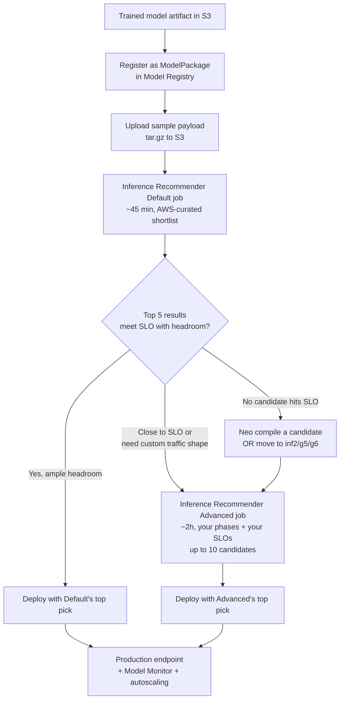
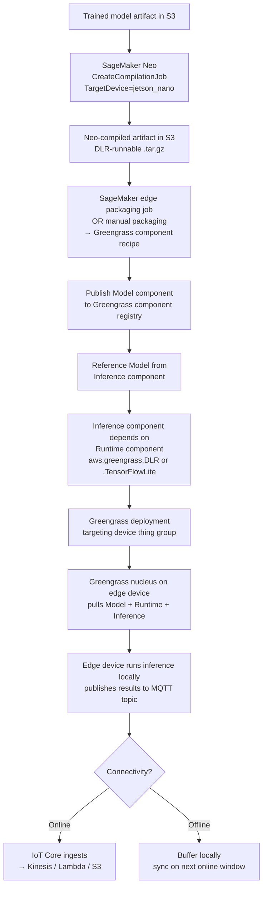

# Chapter 41 — SageMaker Inference Recommender, Neo, and the Edge

> **Goal of this chapter:** to teach you the three AWS tools that fix the three most common — and most expensive — inference mistakes: picking the wrong instance, deploying the raw training artifact, and ignoring the edge. By the end of the chapter you should be able to (a) decide between an Inference Recommender Default job and an Advanced job from a single sentence in a stem, (b) explain what SageMaker Neo actually compiles and what it doesn't, (c) draw the Neo → IoT Greengrass v2 edge deployment path from memory, (d) know when Triton wins over the default SageMaker containers, and (e) recognize the four highest-frequency exam traps in this area (Compute Optimizer ≠ SageMaker; Edge Manager deprecated; Triton ≠ LLM serving in 2025–26; Neo is per-target, not portable). Right-sizing is where roughly **50% of inference savings come from** — before any quantization, any compilation, any architectural change. This chapter is the one where that 50% lives.

Cross-links: this chapter assumes you have read **[Chapter 9 — Compute & accelerators](../part_b_foundations/09_compute_accelerators.md)** on Inferentia/Trainium, **[Chapter 35 — Real-time endpoints](35_real_time_endpoints.md)** on endpoint sizing, and **[Chapter 40 — Endpoint autoscaling](40_endpoint_autoscaling.md)** on scaling policies. It forward-links to **[Chapter 42 — Inference outside SageMaker](42_inference_outside_sagemaker.md)** (Lambda, ECS, EKS, Fargate paths) and **[Chapter 51 — Model Registry](../part_h_mlops_cicd/51_model_registry.md)** (the registered ModelPackage that Inference Recommender requires as input).

---

## 41.1 Why right-sizing is where the money lives

Take a real number to anchor the discussion. Salesforce Einstein, on their AWS re:Invent 2023 talk, reported cutting SageMaker inference cost **8×** by replacing per-model endpoints with Inference Components (multi-model packing onto one endpoint). That is not a quantization win, not a compilation win, and not a hardware win. It is a *sizing* win — they had been running each model on its own instance, the GPUs were 5–10% utilized on average, and packing them changed nothing about the model itself.

Pattern recognition: every senior MLE has lived this story in some form.

1. Team trains a model. Default to "this is a deep net, give it a GPU." Ship `ml.g4dn.xlarge`. Done.
2. Six months later, somebody runs `nvidia-smi` on the host and observes the GPU sits at 4–8% utilization most of the day. The model is so small that batch size 1 doesn't saturate the card.
3. The fix is one of four moves: (a) shrink to a smaller GPU; (b) move to CPU and compile with Neo; (c) move to Inferentia (`ml.inf1` or `ml.inf2`); (d) pack multiple models onto the same GPU via MME or Inference Components.

AWS's published "Inference cost optimization best practices" guide cites enterprise customers achieving **40–60% SageMaker inference cost reduction through proper instance selection alone**, before any compilation or quantization. The 8× Einstein number sits at the upper end of that distribution because they combined sizing with packing. The *typical* number, the one you should expect on a first sizing pass, is somewhere in the 30–70% range — and it is almost free, because Inference Recommender only charges you for the few test instance-hours.

That is the chapter's load-bearing claim: **before you compile, before you quantize, and certainly before you swap to a fancier instance family, run Inference Recommender.** Every other lever multiplies the savings you've already locked in by sizing.

The mental discipline this requires is unusual for an engineer trained on traditional backend systems. In a traditional backend stack, you size by load tests against a single representative endpoint, you watch CPU utilization on the host, and you scale horizontally when CPU passes 70%. None of those instincts transfer cleanly to ML inference. The CPU on a GPU host is irrelevant. The single representative endpoint hides the fact that you have eight different instance families that might run the same model. The 70% scale threshold ignores the cost of *underutilization* below that threshold — which is where most ML endpoints live, because batch-size-1 inference on a fast GPU finishes faster than the request rate. The MLE has to deliberately replace those instincts with the Inference Recommender workflow: pick a curated candidate set, run a real benchmark, sort by cost-per-inference subject to SLO constraints, and accept the answer even when it contradicts the "GPU is for deep nets" reflex.

---

## 41.2 SageMaker Inference Recommender — the mental model

### 41.2.1 What it actually is

Inference Recommender is a **managed load-testing service**. You hand it a registered ModelPackage and a sample payload tarball in S3; it spins up real SageMaker endpoints on a curated list of instance types, replays traffic against them, and emits a ranked table:

```
instance_type      ModelLatency   MaxInvocations   CostPerHour   CostPerInference
ml.c5.xlarge       45 ms          320 RPS          $0.20         $0.0000017
ml.c5.2xlarge      22 ms          610 RPS          $0.40         $0.0000018
ml.g4dn.xlarge     12 ms          1200 RPS         $0.74         $0.0000017
ml.inf2.xlarge      9 ms          1850 RPS         $0.76         $0.0000011
...
```

You pick the row that satisfies your business constraint — usually "cheapest config whose latency ≤ SLO and throughput ≥ peak RPS." That is the whole product in two sentences.

Billing footnote that catches teams off guard the first time: **"Inference Recommender only charges you for the instances used while your jobs are executing."** There is no baseline fee. The Default job is essentially free experimentation — you pay for ~45 minutes of test-instance hours and get a ranked Pareto frontier in return.

### 41.2.2 Default job vs Advanced job — the distinction the exam loves

This single table is the most testable thing in the chapter. Memorize it.

| Aspect | Default job | Advanced job |
|---|---|---|
| API value | `JobType=Default` (or unspecified) | `JobType=Advanced` |
| Who picks candidates | AWS picks a curated shortlist | You supply up to 10 candidate configs |
| Traffic pattern | Synthetic ramp from AWS | You define phases (warmup → sustained → peak) |
| SLO thresholds | None — runs to completion | You set `ModelLatencyThresholds` and `MaxInvocations` |
| Duration | ~45 minutes | ~2 hours |
| Configs tested | 5–10 from curated list | Up to 10 you choose |
| Best for | "Give me a reasonable starting point." | "Validate against a real production SLO under realistic load." |
| Required inputs | Registered ModelPackage + sample payload | All of the above PLUS phases + thresholds + candidate list |

**Exam tells:**

- Stem says "production SLO of p99 < X ms" or "must sustain Y RPS" → **Advanced**.
- Stem says "ramp from 1 user to 200 users over 30 minutes" or "traffic pattern matching production" → **Advanced**.
- Stem says "starting recommendation," "first pass," "haven't picked an instance yet" → **Default**.
- Stem says "the team needs a quick benchmark across instance families" → **Default**.

The pragmatic real-world flow most senior MLEs run is **Default first → Advanced on the top 2–3 winners**. The Default job filters the candidate pool from "every SageMaker instance family" down to "two or three plausible winners," and the Advanced job validates those winners under your real traffic shape. The exam will sometimes give you a stem that maps cleanly to one or the other; sometimes it will give you a stem that maps to *both run in sequence*. Read carefully.

### 41.2.3 Inputs — what you must have ready

From the official prerequisites page:

1. **A registered ModelPackage in the SageMaker Model Registry** (preferred), or a bare `Model` resource for the Default workflow. The ModelPackage version ARN is what the Advanced API requires.
2. **A sample payload archive** (`.tar.gz`) uploaded to S3, containing files representative of production traffic — typically one real JSON / image / text payload per file. The Recommender's load generator replays these against the test endpoints.
3. **A container image** SageMaker can run — a framework container, JumpStart container, Neo container, or your BYOC image.
4. **Domain and ML framework metadata** on the ModelPackage. Recommender uses these to pick the curated candidate set when you haven't supplied one.
5. An **IAM role** with `sagemaker:CreateEndpoint`, `sagemaker:CreateEndpointConfig`, ECR read on the image, S3 read on the payload archive, plus the standard SageMaker inference permissions.

If any of those five items is missing, the API call fails before any benchmarking starts. The Default job is more forgiving on metadata; the Advanced job is not.

**This is also why this chapter forward-links to Chapter 51 (Model Registry).** You cannot run an Advanced Inference Recommender job without a versioned ModelPackage. If your team isn't already using the Model Registry, that's a prerequisite you need to address first.

### 41.2.4 An Advanced job request — what the JSON looks like

```json
{
  "JobName": "fraud-v3-load-test",
  "JobType": "Advanced",
  "RoleArn": "arn:aws:iam::123:role/SageMakerInferenceRecommenderRole",
  "InputConfig": {
    "ModelPackageVersionArn": "arn:aws:sagemaker:us-east-1:123:model-package/fraud/3",
    "JobDurationInSeconds": 7200,
    "TrafficPattern": {
      "TrafficType": "PHASES",
      "Phases": [
        { "InitialNumberOfUsers": 1,   "SpawnRate": 1,  "DurationInSeconds": 300 },
        { "InitialNumberOfUsers": 50,  "SpawnRate": 10, "DurationInSeconds": 600 },
        { "InitialNumberOfUsers": 200, "SpawnRate": 20, "DurationInSeconds": 900 }
      ]
    },
    "ResourceLimit": { "MaxNumberOfTests": 10, "MaxParallelOfTests": 2 },
    "EndpointConfigurations": [
      { "InstanceType": "ml.c5.xlarge"   },
      { "InstanceType": "ml.c5.2xlarge"  },
      { "InstanceType": "ml.m5.xlarge"   },
      { "InstanceType": "ml.g4dn.xlarge" },
      { "InstanceType": "ml.inf2.xlarge" }
    ]
  },
  "StoppingConditions": {
    "MaxInvocations": 1000,
    "ModelLatencyThresholds": [
      { "Percentile": "P95", "ValueInMilliseconds": 200 }
    ]
  }
}
```

Five things to notice:

- **`TrafficPattern.Phases`** — ramp-up, sustained, peak. This mirrors how Locust and k6 model load. The exam will sometimes ask which parameter controls the shape of the load curve; it's `Phases`.
- **`StoppingConditions.ModelLatencyThresholds`** — the test stops early on a config that breaches the threshold. Saves money on candidates that clearly can't meet SLO.
- **`EndpointConfigurations[].InstanceType`** — your candidate list (up to 10). You pick these.
- **`ResourceLimit.MaxParallelOfTests`** — controls cost vs wall-clock. Parallel tests cost more per hour but finish faster; serial tests cost less and finish slower.
- **`ModelPackageVersionArn`** — proof you must register in the Model Registry first for the Advanced workflow.

### 41.2.5 Outputs — the `InferenceRecommendation` row

Each row in the response contains:

| Field | What it means | Why you care |
|---|---|---|
| `EndpointConfiguration.InstanceType` | The instance type tested | Your candidate answer. |
| `EndpointConfiguration.InitialInstanceCount` | How many instances to start with | Recommender computes this from observed throughput. |
| `Metrics.ModelLatency` | Average inference latency in ms (p50 — for tail percentiles inspect CloudWatch) | Compare to SLO. |
| `Metrics.MaxInvocations` | Sustained max RPS at saturation | Compare to peak traffic. |
| `Metrics.CostPerHour` | Hourly cost of the configuration | Cost optimization basis. |
| `Metrics.CostPerInference` | $ per call at recommended load | The KPI you actually optimize. |
| `Metrics.MemoryUtilization` | Peak memory % observed | Spot oversized instances. |
| `Metrics.CpuUtilization` | Peak CPU % observed | Spot under-utilized GPUs / over-utilized CPUs. |

The recommended sort: **minimize `CostPerInference` subject to `ModelLatency ≤ SLO` and `MaxInvocations ≥ peak_RPS`.** This is the literal objective function — write it on a sticky note.

### 41.2.6 The end-to-end Inference Recommender workflow



The forward link to autoscaling (Chapter 40) matters here: Inference Recommender's `MaxInvocations` per instance becomes the basis for the `SageMakerVariantInvocationsPerInstance` target you configure in your autoscaling policy. The two services compose cleanly.

### 41.2.7 ⚠️ Exam alert: Compute Optimizer does NOT cover SageMaker

This is one of the most frequently tested traps in the entire deployment domain.

**AWS Compute Optimizer** is the cross-service right-sizing recommender. It supports:

- **EC2 instances** (single and Auto Scaling Groups)
- **EBS volumes**
- **Lambda functions** (memory size)
- **ECS services on Fargate** (task-level CPU/memory)
- **RDS DB instances**
- **Aurora**
- **NAT Gateway**

It does **NOT** support:

- **SageMaker endpoints** (real-time, async, serverless, batch, or multi-model)
- **SageMaker training jobs**
- **SageMaker notebook instances**

This boundary is explicit in the Compute Optimizer FAQ. Compute Optimizer is fundamentally a **CloudWatch-metrics-driven** recommender — it looks at CPU / memory / disk utilization over a 14-day window. SageMaker endpoints don't surface the same metric shape (CPU utilization on a GPU-backed inference instance is not the metric that tells you "a different instance would be cheaper"), so the service simply doesn't cover them.

**Inference Recommender** is the SageMaker-specific tool that replaces Compute Optimizer for endpoint sizing. It is *active* benchmarking — it actually runs your model on candidate instances — rather than *passive* metric inspection. Memorize the exam pattern:

| Question fragment | Right answer |
|---|---|
| "right-size my EC2 fleet" | Compute Optimizer |
| "right-size my Lambda memory" | Compute Optimizer |
| "right-size my Fargate task" | Compute Optimizer |
| "right-size my SageMaker inference endpoint" | **Inference Recommender** |
| "right-size my SageMaker training job" | SageMaker Training Profiler / Debugger (not Compute Optimizer) |

The trap on the exam is that Compute Optimizer is the "obvious" cross-service answer — a candidate who hasn't internalized the boundary will pick it. Don't.

### 41.2.8 Inference Recommender vs alternatives

| Approach | When to use | Pros | Cons |
|---|---|---|---|
| **Inference Recommender Default** | "Need a starting instance, today." | Free-ish, ~45 min, no setup beyond ModelPackage + payload | Synthetic traffic, can miss SLO nuance |
| **Inference Recommender Advanced** | "Need to validate p99 + throughput SLOs before launch." | Real load, real SLOs, real money saved | Few hours, costs the test-instance hours |
| **Manual benchmarking** (Locust, k6, custom JMeter) | You need a tail behavior the Recommender doesn't capture, or you're benchmarking a non-SageMaker endpoint alongside | Maximum flexibility; tools your team likely already runs | All wiring is your problem; no built-in cost-per-inference math |
| **JumpStart bundled configs** | You're deploying a JumpStart foundation model with AWS-validated defaults | Zero work; tuned by AWS | Generic; not tuned to *your* payload mix |
| **LLM-specific tools** (`genai-perf`, vLLM benchmark) | LLM serving with tokens/sec, TTFT, KV-cache pressure | Understands LLM-specific metrics | Doesn't produce CostPerInference numbers |

A subtlety worth knowing for real production work: Inference Recommender's traffic generator is built around stateless request/response benchmarking. **For LLMs specifically, it's a poor fit** — LLM serving is dominated by KV-cache pressure, concurrent decoding slots, and prefix-cache hits. The exam might still test "use Inference Recommender for an LLM" as a positive answer because the AWS-shaped answer is Recommender; in production, you'd reach for `genai-perf` or vLLM's `benchmark_serving.py` instead.

### 41.2.9 The SDK shortcut: `Model.right_size(...)`

The Python SDK exposes a high-level wrapper that builds the JSON above for you. You'll see this pattern in AWS sample notebooks and you should recognize its shape on the exam:

```python
from sagemaker.inference_recommender.inference_recommender_mixin import (
    Phase, ModelLatencyThreshold
)

predictor = model.right_size(
    sample_payload_url="s3://my-bucket/payload.tar.gz",
    supported_content_types=["application/json"],
    supported_instance_types=[
        "ml.c5.xlarge", "ml.c5.2xlarge", "ml.m5.xlarge",
        "ml.g4dn.xlarge", "ml.inf2.xlarge",
    ],
    framework="XGBOOST",
    job_duration_in_seconds=7200,
    phases=[
        Phase(duration_in_seconds=300,  initial_number_of_users=1,   spawn_rate=1),
        Phase(duration_in_seconds=600,  initial_number_of_users=50,  spawn_rate=10),
        Phase(duration_in_seconds=900,  initial_number_of_users=200, spawn_rate=20),
    ],
    model_latency_thresholds=[
        ModelLatencyThreshold(percentile="P95", value_in_milliseconds=200),
    ],
    job_type="Advanced",
)
```

The four canonical knobs — `phases`, `model_latency_thresholds`, `supported_instance_types`, and `job_type` — map one-to-one onto the raw API fields. The exam won't ask you to write this verbatim, but it might give you a code block and ask which knob controls the SLO threshold (`model_latency_thresholds`) or the traffic shape (`phases`).

---

## 41.3 SageMaker Neo — the model compiler

### 41.3.1 What Neo actually does

Neo is a **model compiler plus runtime**. It takes a trained model in one of the supported frameworks and produces an optimized binary for a specific *target* — either a SageMaker cloud instance type or an edge device. Under the hood it uses **Apache TVM** to generate an intermediate representation, then performs:

- Operator fusion, constant folding, layout transformation, dead code elimination.
- Hardware-specific code generation: NEON SIMD on ARM, AVX2/AVX512 on Intel, CUDA kernels on Nvidia, Neuron op kernels on Inferentia.
- Optional precision conversion: FP32 → FP16 (mixed precision) or FP32 → INT8 (full integer arithmetic, with calibration).

The headline claim from the developer guide:

> "Neo automatically optimizes Gluon, Keras, MXNet, PyTorch, TensorFlow, TensorFlow-Lite, and ONNX models for inference on Android, Linux, and Windows machines based on processors from Ambarella, ARM, Intel, Nvidia, NXP, Qualcomm, Texas Instruments, and Xilinx."

That sentence is worth dwelling on because every framework name and every chip vendor name is fair exam material.

### 41.3.2 Supported input frameworks

| Framework | Notes |
|---|---|
| **PyTorch** | Most common today. Submit a traced or scripted `model.pt`. |
| **TensorFlow / Keras** | SavedModel format or HDF5. |
| **TensorFlow Lite** | Pre-quantized models pass through with target-specific kernel selection. |
| **ONNX** | Universal exchange — converts from anywhere (Hugging Face, scikit-learn via `skl2onnx`, etc.). |
| **MXNet / Gluon** | Legacy, still supported. |
| **XGBoost** | Yes — classical ML compiles too; useful on small CPU edges. |

### 41.3.3 Supported target classes

| Target class | Examples | Accelerator / ISA |
|---|---|---|
| Cloud SageMaker CPU | `ml_c4`, `ml_c5`, `ml_m4`, `ml_m5` | Intel AVX2/AVX-512 |
| Cloud SageMaker GPU | `ml_p2`, `ml_p3`, `ml_g4dn` | Nvidia CUDA / cuDNN |
| Cloud Inferentia | `ml_inf1` | AWS Neuron |
| Edge — ARM Cortex-A | Raspberry Pi 3/4, BeagleBone | NEON SIMD |
| Edge — Nvidia Jetson | Nano, TX2, Xavier, Orin | CUDA + cuDNN |
| Edge — Intel x86 boards | NUC class | AVX2 |
| Edge — Ambarella | CV22, CV25 | CVflow ISP (vision pipeline) |
| Edge — Qualcomm | Snapdragon SoCs | Hexagon DSP |
| Edge — TI / NXP / Xilinx | Automotive, industrial | Vendor-specific |

The exam's three highest-yield names from this list:

- **Jetson** — Nvidia edge GPU. Any "factory floor," "robotics," or "drone" stem leans Jetson.
- **Raspberry Pi** — ARM Cortex-A. Any "cheap, fleet of small devices" stem leans `rasp3b`/`rasp4`.
- **Inferentia (`ml_inf1`)** — Neo's *cloud* target. If a question says "compile for cheapest cloud inference of a transformer," Neo + `ml_inf1` is on the table. For newer genAI workloads, `ml.inf2` typically uses the AWS Neuron compiler directly rather than going through Neo, but the boundary moves with each Neuron release.

### 41.3.4 The Neo + Inferentia win — actual benchmark numbers

This is the most-cited Neo result on AWS, from the "Choose the best AI accelerator and model compilation for computer vision inference with Amazon SageMaker" blog. ResNet-50 image classification, single-model endpoint, identical model artifact:

| Setup | Throughput (inf/sec) | p50 latency | Cost / 1M inferences |
|---|---|---|---|
| `c5.xlarge` CPU, compiled | ~13 | ~77 ms | $4.95 |
| `g4dn.xlarge` GPU, compiled | 160 | ~9.8 ms | $1.62 |
| `inf1.xlarge` (Neo + Inferentia) | 304.3 | 4.9 ms | $0.30 |

Two facts to extract:

- **Neo compilation on the same GPU box** roughly halves cost per inference (1.9× throughput, 50% latency reduction). This is the easy win: no instance change, just compile.
- **Neo + Inferentia together** is a **~5.4× price-performance improvement** over the compiled GPU baseline, and a ~16× improvement over the CPU baseline.

For LLM workloads the story scales:

- **Llama 70B on `inf2.48xlarge`** runs roughly **60% cheaper** than the equivalent `p4d.24xlarge` — third-party analyses peg the monthly cost at ~$9,348 vs ~$23,595.
- **Llama 7B on `inf2.xlarge`** runs roughly **24% cheaper** than `g5.xlarge` (~$547/mo vs ~$724/mo). The savings shrink at the small-model end because GPU instances are already cheap there.

For new LLM work on Inferentia2 / Trainium2, the typical path is the **Neuron SDK directly** rather than going through Neo — Anthropic, as the headline example, is running Claude on over **one million Trainium2 chips** as of late 2025, with Project Rainier (~500,000 chips) live in Indiana since October 2025. Neo's sweet spot for cloud is non-LLM CV and tabular models on Inferentia 1; the Neuron compiler picks up at Inferentia 2 / Trainium 2.

### 41.3.5 Quantization in Neo — the one knob that matters

`OutputConfig.CompilerOptions` accepts `"dtype": "int8"` or `"float16"`. The trade-offs:

| Precision | Model size | Latency | Throughput | Accuracy loss | When |
|---|---|---|---|---|---|
| FP32 | 1.0× | 1.0× | 1.0× | Zero | Default, safest |
| FP16 | 0.5× | 0.6–0.8× | 1.3–1.7× | Tiny (~0.1–0.3% F1 typical) | GPU targets, transformers |
| INT8 | 0.25× | 0.4–0.6× | 2–4× | 0.5–2% typical, can be more | Edge devices, CV models |

INT8 quantization usually requires a **calibration dataset** — a few hundred representative inputs Neo uses to compute per-tensor activation scaling factors. Skipping calibration, or calibrating on an unrepresentative sample, is the #1 reason production teams see 5–10% accuracy regressions they weren't expecting. The fix is calibrating on traffic that matches the production distribution.

For better accuracy at INT8, teams sometimes use **quantization-aware training (QAT)** in the original framework first, then compile with Neo. QAT is a training-time technique and out of scope for the MLA-C01 — recognize the term, don't expect to design a QAT schedule on the exam.

A quick note on the broader 2025–26 quantization landscape:

- **INT8** (W8A8) is the production default for non-LLM and many LLM cases. 1–3% accuracy drop, 4× memory reduction vs FP32, 2–4× throughput improvement on hardware with INT8 tensor cores.
- **INT4** (AWQ, GPTQ) is selective — used heavily for self-hosted open-weight LLMs to fit larger models on smaller GPUs. Noticeably worse on math, code, and reasoning tasks; the 2025 consensus is "avoid INT4 for reasoning-heavy workloads."
- **FP8** is the new arrival on Hopper/Blackwell GPUs (H100/H200/B100/B200, AWS P5/P5e). Near-INT8 throughput with near-FP16 accuracy. For new LLM deployments on H100+, FP8 is becoming the default.

Most of this lives in the LMI container ecosystem rather than Neo itself; Neo covers the INT8 case for non-LLM models cleanly.

### 41.3.6 ⚠️ Exam alert: Neo requires source compilation per target — it is NOT portable

A subtle but high-frequency trap: Neo produces a target-specific binary. A model compiled for `ml_c5` will **not** run on `ml_g4dn`, will not run on `jetson_nano`, will not run on `rasp3b`. The artifact is locked to the target's ISA, accelerator, and dtype combination.

If you need the same model on multiple targets (e.g., cloud `ml.inf2` for high-traffic users and a Jetson Orin for edge), you run **two separate `CreateCompilationJob` calls** from the same source artifact. The Inferentia compilation produces a Neuron binary; the Jetson compilation produces a DLR-runnable binary. They share the source artifact but not the compiled output.

This matters on the exam in two ways:

1. A distractor will sometimes say "compile once with Neo and deploy to both cloud and edge" — wrong; you compile per target.
2. A correct answer will sometimes say "two Neo compilations from the same source" — that is the right architecture for hybrid cloud-plus-edge deployments of one model.

### 41.3.7 When Neo is the right answer

- **YES** — you have a specific cloud instance type and want more throughput-for-the-money without changing the model.
- **YES** — you need to deploy to an edge device. Neo is effectively mandatory because the DLR runtime that ships in the Greengrass component expects Neo-compiled artifacts.
- **NO** — you're hosting a frontier foundation model (70B+ LLM). Neo doesn't optimize gigantic transformers as well as TensorRT-LLM or direct Neuron compilation. Use **Triton + TensorRT-LLM** or **`ml.inf2` with the Neuron compiler** directly, both wrapped in the **LMI container**.
- **NO** — your model is so small that compilation overhead exceeds the win (sub-100 KB scikit-learn classifiers — just ship them inside a Lambda).

### 41.3.8 The compilation friction nobody mentions in marketing

There is a real ops cost to making Neo (or any compiler-based optimization) part of your deployment workflow, and the exam will occasionally test it indirectly. Three frictions in particular:

- **Compilation time.** For LLMs and large CV models, a single `CreateCompilationJob` takes **10–45 minutes**. This is wall-clock you don't get back. Teams typically cache compiled artifacts in S3 and treat compilation as a CI step, not something they run on every deploy.
- **Recompile on graph change.** Any change to the model graph — new model version, different fixed batch shape, different sequence length, different input dtype — invalidates the compiled artifact. You must recompile. This is why teams that use Neo at scale wire compilation into their Model Registry promotion pipeline: when a new ModelPackage version lands, a CI job compiles it for each supported target and stores the binaries.
- **Day-1 lag on new architectures.** The Neo compiler (and the Neuron compiler) trails CUDA on day-1 support for cutting-edge model architectures. If your team is using a brand-new model that appeared on Hugging Face last week, the chances are higher that vanilla PyTorch on `g5` will work day-1 than that Neo will compile it cleanly. Check the Neuron SDK release notes.

For the exam, these frictions show up in stems like "a team wants to deploy a new LLM architecture and asks whether Inferentia is supported on day one" — the safe answer is usually "check the Neuron SDK release notes; default to a GPU instance if not yet supported."

---

## 41.4 Edge ML with IoT Greengrass v2

### 41.4.1 The role split

AWS draws a clean line between three services, and the exam tests the line:

- **SageMaker Neo** is the **model compiler**. It produces the artifact.
- **AWS IoT Greengrass v2** is the **deployment vehicle and runtime** on edge devices. It pulls components from the cloud, manages their lifecycle, and provides device-to-cloud messaging.
- **SageMaker Edge Manager** was the *legacy* device-fleet management service with drift detection and OTA model updates. **As of 2024, Edge Manager is deprecated.** AWS recommends Greengrass v2 directly for new deployments. Recognize the name; do not architect new systems around it.

### 41.4.2 ⚠️ Exam alert: Edge Manager is deprecated — use Greengrass v2

This is the single highest-frequency trap in the edge ML area on the 2026 exam pool.

- A stem that says **"modern recommended path for deploying ML to edge"** and offers Edge Manager as an option — that's a distractor. The answer is **Neo + IoT Greengrass v2**.
- A stem that says **"deploy a fleet of cameras with intermittent connectivity"** — Neo + Greengrass v2.
- A stem that says **"track edge inference metrics across a fleet"** with Edge Manager as an option — distractor. Use Greengrass v2 telemetry components publishing to **CloudWatch** and/or **IoT SiteWise**.

Neo itself is *not* deprecated. The compiler still exists and is still the recommended way to optimize models for edge SoCs. Only the device-fleet manager (Edge Manager) is in the deprecated bucket.

### 41.4.3 The Greengrass v2 ML component model

A Greengrass deployment is a set of **components**. AWS publishes three categories for ML:

> "AWS provides the following categories of machine learning components:
> - **Model component** — Contains machine learning models as Greengrass artifacts.
> - **Runtime component** — Contains the script that installs the machine learning framework and its dependencies on the Greengrass core device.
> - **Inference component** — Contains the inference code and includes component dependencies to install the machine learning framework and download pre-trained machine learning models."

So a full edge deployment is normally three components stacked on the device:



### 41.4.4 AWS-published ML components (current, 2025–2026)

| Component | Purpose | Framework |
|---|---|---|
| `aws.greengrass.DLR` | Runtime — installs DLR (Deep Learning Runtime) | DLR |
| `aws.greengrass.DLRImageClassification` | Inference — sample image classification | DLR |
| `aws.greengrass.DLRImageClassificationModelStore` | Model — ResNet-50 sample | DLR |
| `aws.greengrass.DLRObjectDetection` | Inference — sample object detection (YOLOv3) | DLR |
| `aws.greengrass.DLRObjectDetectionModelStore` | Model — YOLOv3 sample | DLR |
| `aws.greengrass.TensorFlowLite` | Runtime — installs TFLite | TFLite |
| `aws.greengrass.TensorFlowLiteImageClassification` | Inference — sample image classification | TFLite |
| `aws.greengrass.TensorFlowLiteImageClassificationModelStore` | Model — MobileNet v1 sample | TFLite |
| `aws.greengrass.TensorFlowLiteObjectDetection` | Inference — sample object detection (SSD MobileNet) | TFLite |
| `aws.greengrass.TensorFlowLiteObjectDetectionModelStore` | Model — SSD MobileNet sample | TFLite |
| `aws.greengrass.SageMakerEdgeManager` | (Legacy) installs Edge Manager agent | EM agent |

For a **custom model**, the pattern is:

1. Train in SageMaker → S3.
2. **Neo compile** with the exact target string (`jetson_xavier`, `rasp3b`, `imx8mplus`, etc.).
3. Neo emits a `.tar.gz` containing the compiled model plus the DLR runtime metadata.
4. **SageMaker edge packaging job** (or manual packaging) wraps the artifact into a Greengrass component recipe.
5. Publish your **model component** to the Greengrass component registry.
6. Reference it from your **inference component** (which depends on the DLR or TFLite runtime component).
7. Create a **deployment** targeting your device group via Greengrass deployments or IoT Jobs.

### 41.4.5 Offline inference and connectivity loss

Greengrass core devices run inference **locally** on the compiled artifact. They do not require connectivity to the cloud during inference. They publish results to MQTT topics that, when connectivity is restored, sync to AWS IoT Core (and downstream to Kinesis, Lambda, S3). Model updates are also lazy: the device pulls a new model component version on its next online window.

This is the exam-correct architecture for any stem with the words "intermittently connected," "factory floor with flaky WiFi," "offshore platform," "remote inspection drones," or "mining operations underground."

### 41.4.6 Cost and latency picture for edge

| Path | Latency per inference | $ / 1M inferences | Connectivity required |
|---|---|---|---|
| Camera → cloud endpoint | 30–200 ms RTT + 10–50 ms compute | High (instance hours + egress) | Yes, continuous |
| Camera → Greengrass + Neo on Jetson | 5–50 ms compute only | One-time HW + electricity | No, periodic sync OK |

Hybrid edge+cloud agentic AI workloads have shown **up to 75% energy savings and >80% cost reduction** versus pure-cloud architectures in 2025 industry analyses — assuming you already have the edge hardware. CapEx-from-scratch can take 12–36 months to pay back.

### 41.4.7 When edge is the right answer

Be honest about this. Roughly 85–90% of production ML inference still runs in the cloud, and the cert reflects that. Edge is the right answer when one of these is true:

1. **Sub-100 ms latency** that can't tolerate a network round-trip (autonomous vehicles, robotics, industrial machine control, AR/VR).
2. **Unreliable or absent connectivity** (offshore platforms, mines, agriculture, ships, remote drones).
3. **Privacy / data residency** that makes cloud transmission illegal or uncomfortable (some healthcare, some defense, some EU residency cases — though confidential computing in cloud is eroding this).
4. **Per-inference cost economics** where volume is so high that even cheap cloud inference exceeds the amortized cost of edge hardware (high-volume smart cameras, billions of inferences/day).

The exam frames edge wins around **privacy**, **latency**, and **connectivity**, in that order. If the stem mentions any of those three words in a serious way, edge is likely the answer.

### 41.4.8 The hybrid edge+cloud pattern

The dominant pattern for serious edge deployments in 2025–26 is **hybrid**, not pure edge:

- A small / quantized model runs on-device and handles **>90% of requests** locally.
- A larger cloud-hosted model is called for the long-tail "I don't know" cases — typically when the on-device model's confidence falls below a threshold.
- This pattern shows up across LLMs (small on-device model with Claude / GPT cloud fallback), vision (on-device detector with cloud verifier), and speech.

The hybrid pattern preserves edge wins on latency, privacy, and offline operation for the common case, while preserving cloud wins on flexibility and rare-case accuracy. It also smooths the CapEx-vs-OpEx curve: you don't have to ship the most powerful possible model to every device, because the cloud catches the hard cases. The MLA-C01 doesn't test this pattern by name, but a stem that says "low confidence routing to a more capable model" is a hybrid pattern, and the answer typically involves an edge component publishing to MQTT and a cloud Lambda invoking a cloud endpoint on the slow path.

---

## 41.5 Triton Inference Server on SageMaker (BYOC)

### 41.5.1 Why Triton

The built-in SageMaker framework containers (PyTorch, TF, MXNet, HuggingFace, DJL, Sklearn) cover the 80% case. For the remaining 20%, AWS offers an **NVIDIA Triton Inference Server** container that you bring as your serving runtime. Triton excels when you need any of:

- **Multi-framework on one endpoint** — PyTorch + TensorRT + ONNX + Python BLS (Business Logic Scripting), in one process.
- **Dynamic batching** — Triton buffers concurrent small requests and runs them as one batch on the GPU. Latency rises slightly; throughput multiplies.
- **Concurrent model execution** — multiple model instances share one GPU. Triton schedules them. Critical when you have small models that don't individually fill the GPU.
- **Model ensembles** — chain `preproc → model_a → model_b → postproc` as a single endpoint with no extra network hops.
- **Decoupled mode + streaming** — server-sent events for token streaming.
- **Native TensorRT integration** — best-in-class FP16/INT8 throughput on Nvidia GPUs for *non-LLM* workloads.

### 41.5.2 Dynamic batching — the single highest-impact knob

A typical `config.pbtxt`:

```
max_batch_size: 32
dynamic_batching {
  preferred_batch_size: [ 8, 16, 32 ]
  max_queue_delay_microseconds: 5000
}
```

What happens: Triton holds incoming requests for up to 5 ms (or until a preferred batch fills); then runs one GPU forward pass for the batch. Mean latency goes from "compute-only" to "compute + queue delay," but throughput rises roughly proportionally to batch size on GPU-bound models.

Enabling dynamic batching alone has been documented as **~70% throughput increase** with GPU utilization jumping from ~18% to >60% on previously under-batched workloads. Combining it with TensorRT compilation through Triton has shown **~50% latency reduction** vs an uncompiled PyTorch baseline on the same hardware.

**Exam tell:** "How do I increase GPU throughput without buying more instances?" Textbook answer: **dynamic batching** (and concurrent model execution). Both are Triton features and are listed by AWS as Triton-on-SageMaker benefits.

**Counter-tell:** "p99 must stay under 10 ms." Dynamic batching with a 5 ms queue delay can break that SLO. Triton helps throughput but may *hurt* tight tail latency.

### 41.5.3 When Triton vs default containers vs LMI

| Situation | Best container |
|---|---|
| Single PyTorch model, no funky preproc | Default SageMaker PyTorch container |
| Small ensemble (preproc Python + model + postproc) | **Triton** ensemble OR SageMaker Inference Pipeline |
| Many small models share one GPU | **Triton** + Inference Components, OR MME |
| Mix of TF + PyTorch + ONNX on one endpoint | **Triton** (BYOC) |
| Need dynamic batching | **Triton** (built-in) |
| Need concurrent model execution on GPU | **Triton** (built-in) |
| **LLM with strict token-streaming SLO** | **LMI container (vLLM-based)** — NOT Triton |
| **Llama / Mistral / Falcon serving** | **LMI container** — NOT Triton |

### 41.5.4 ⚠️ Exam alert: Triton is NOT the LLM-serving answer in 2025–26

This is a major change from older AWS guidance. The previous (2022–2023) story was "Triton with TensorRT-LLM is the way to serve LLMs on SageMaker." That story has shifted.

In 2025–26, the LLM serving stack on SageMaker is:

- **LMI (Large Model Inference) container** — built on **vLLM** with continuous batching, paged-attention KV-cache management, and FP8/INT4 quantization support out of the box. This is the AWS-recommended container for LLMs on SageMaker.
- **DJL-Serving** — the predecessor / sibling stack. Still supported, still works for LLMs, but the field has converged on vLLM-style continuous batching.
- **Triton + TensorRT-LLM** — still possible and still excellent on raw throughput, but it requires more configuration and lacks vLLM's continuous batching by default. Not the default answer for LLMs anymore.

The exam shortcut:

| Stem fragment | Right answer |
|---|---|
| "multi-framework on one endpoint" | Triton |
| "dynamic batching" | Triton |
| "concurrent model execution" | Triton |
| "ensemble of preprocess + model + postprocess" | Triton ensemble (or SageMaker Inference Pipeline) |
| **"Llama 70B serving with token streaming"** | **LMI container** |
| **"Mistral / Falcon / open-weight LLM"** | **LMI container** |
| **"continuous batching for LLM"** | **LMI container** |

If you see "Triton" listed as an option in an LLM-serving question in the 2026 question pool, treat it as a distractor unless the stem explicitly says "TensorRT-LLM" and there's no LMI option.

### 41.5.5 Triton on SageMaker — three deployment patterns

When Triton *is* the right answer (non-LLM, multi-framework, ensemble, dynamic batching), AWS supports three deployment shapes on SageMaker. The exam may name any of these:

1. **Single Triton MME** — Multi-Model Endpoint backed by the Triton container. Hundreds of small models, one instance, cache-warmed on demand. Triton's model repository abstraction lines up cleanly with MME's S3-prefix model loading.
2. **Single Triton endpoint, multi-model in one process** — distinct from MME; you put N models in the Triton model repository at deploy time. Useful for small ensembles that ship together.
3. **Triton + Inference Components** — the modern way for sharing one GPU across multiple co-located models without giving each its own endpoint. Inference Components are a 2023+ SageMaker primitive that lets you pack models onto an endpoint with per-model scaling. This is what Salesforce Einstein used for their 8× cost reduction story.

A small but important deployment fact: **Triton is BYOC**. It is not a click-to-deploy SageMaker built-in. You reference the AWS-published Triton container image (one ECR URI per region, published in the SageMaker deep-learning containers list) in your `CreateModel` call. Recognize that "use Triton" in a stem implies BYOC mechanics — you control the container, AWS provides the image.

---

## 41.6 The decision tree — when to use what

```
You have a trained model. You want to serve it. Which tool?

  Is this an LLM (>7B params, token streaming, continuous batching)?
    YES → LMI container on inf2 / g5 / p5 (vLLM-based)
          (Not Triton, not Neo for LLMs specifically.)
    NO  → continue

  Are you deploying to an edge device (Jetson, Pi, Ambarella, Qualcomm, etc.)?
    YES → Neo compile per target → IoT Greengrass v2 ML components
          (Not Edge Manager — deprecated.)
    NO  → continue (cloud deployment)

  Do you need any of: multi-framework, dynamic batching,
                     concurrent model execution, ensembles?
    YES → Triton (BYOC) on SageMaker endpoint
    NO  → continue (single-framework, single-model)

  Have you run Inference Recommender yet?
    NO  → Inference Recommender Default first (~45 min)
    YES → continue

  Do the Default results meet SLO with headroom?
    YES → Deploy with Default's top pick
    NO  → Inference Recommender Advanced with custom phases + SLOs

  Want a near-free throughput boost on the same instance?
    YES → Neo compile for the chosen cloud target (ml_c5, ml_g4dn, ml_inf1)
          before deployment
    NO  → Deploy vanilla framework container
```

The order of operations matters. **Right-size first, compile second, quantize third, change instance family fourth.** Every step makes the next one easier.

### 41.6.1 A concrete two-week deployment workflow

To anchor the decision tree in something you can take to a sprint planning meeting, here is the workflow a senior MLE actually runs when deploying a new SageMaker model:

- **Day 1 — register and prepare.** Take the trained artifact from the data scientist. Register it in the Model Registry as a versioned ModelPackage. Build a sample payload archive (`.tar.gz`) with 100–500 representative inputs from production traffic.
- **Day 2 — Default Inference Recommender job.** Kick off a Default job. While it runs (~45 min), spec out the SLOs you'll need for the Advanced job: peak RPS, p95 latency budget, peak concurrency.
- **Day 3 — review Default results, pick top 2–3 candidates.** Sort by `CostPerInference` subject to `ModelLatency ≤ SLO`. The top three rows become your Advanced job candidates.
- **Day 4 — Neo compile the top candidates.** For each of your 2–3 candidate instance types, run `CreateCompilationJob`. This is your free ~1.5–2× throughput win.
- **Day 5–6 — Advanced Inference Recommender job.** Submit the Advanced job with your real `TrafficPattern.Phases` and `ModelLatencyThresholds`. Let it run (~2 h). Review.
- **Day 7 — pick winner, configure autoscaling.** Take the top row of the Advanced results. The `MaxInvocations` value becomes your `SageMakerVariantInvocationsPerInstance` target in the autoscaling policy from Chapter 40.
- **Day 8 — deploy to staging.** Stand up the endpoint with the chosen instance type, the Neo-compiled artifact, and the autoscaling policy.
- **Day 9 — shadow / canary in production.** Either shadow traffic against the new endpoint at 10% sample, or canary the new endpoint at 5% weight, with the old endpoint at 95%. Watch CloudWatch and Model Monitor.
- **Day 10 — full rollout.** Shift 100% to the new endpoint. Keep the old endpoint warm for 48 h as a rollback target.
- **Quarterly cadence.** Re-run Inference Recommender against the current model version and current Tier-0 instance types. AWS introduces new instance families (`inf2.48xlarge`, `g6`, etc.) every quarter; old sizing decisions age out within 6–12 months.

---

## 41.7 Common gotchas the exam loves

1. **Compute Optimizer does NOT cover SageMaker.** Use Inference Recommender for endpoints; Training Profiler for training jobs.
2. **Neo is NOT edge-only.** Neo compiles for cloud instance types too (`ml_c5`, `ml_g4dn`, `ml_inf1`). A distractor will say "use Neo for edge, another method for cloud" — wrong; Neo does both.
3. **Edge Manager is deprecated.** Modern path is Neo + IoT Greengrass v2.
4. **Triton is not the LLM-serving answer in 2025–26.** LMI container is.
5. **Inference Recommender requires a payload.** "Just run it on the model alone" is wrong. You need a `.tar.gz` of representative payloads in S3.
6. **Default ≠ free of all setup.** Default still needs container + model + payload + role; "Default" refers to the *traffic plan*, not zero-input.
7. **Dynamic batching adds latency.** It improves *throughput* by trading *latency*. If a stem demands sub-10 ms p99, dynamic batching with a 5 ms queue delay may already break SLO.
8. **INT8 quantization needs calibration data** for post-training quantization to keep accuracy. "Compile to INT8 with no other inputs" can degrade accuracy sharply.
9. **Neo's `TargetDevice` and `TargetPlatform` are different fields.** `TargetDevice` for known devices (`jetson_nano`, `rasp3b`, `ml_c5`); `TargetPlatform` for custom (OS + arch + accelerator triple).
10. **Inference Recommender does not test custom traffic patterns under Default.** If your real load shape matters, use Advanced.
11. **Inferentia requires compilation.** "Just point a PyTorch model at an `inf2` instance" doesn't work — you must compile with Neo or the Neuron SDK first.
12. **Neo binaries are not portable across targets.** Compile per target; same source, different output per device.
13. **Inference Recommender's Default job uses a curated candidate list.** You don't get to pick the instance types — AWS does. If you need a specific candidate set, use Advanced.
14. **`TargetDevice` vs `TargetPlatform` in Neo.** `TargetDevice` for known SoCs and SageMaker instance types (`jetson_nano`, `ml_c5`); `TargetPlatform` for arbitrary OS+Arch+Accelerator triples (e.g., custom Linux ARM with no accelerator).
15. **JumpStart bundled configs can override Inference Recommender.** If the model is a JumpStart-curated foundation model with AWS-validated default instance + concurrency settings, the AWS-shaped answer is "use the JumpStart bundled config," not "run a load test."

---

## 41.8 Decision tables — quick reference

### 41.8.1 "Which AWS service?" by problem statement

| Stem fragment | Right answer |
|---|---|
| "find cheapest instance that meets SLO" | Inference Recommender (Advanced) |
| "pick a starting instance, low effort" | Inference Recommender (Default) |
| "right-size SageMaker endpoint" | Inference Recommender (not Compute Optimizer) |
| "right-size EC2 / Lambda / Fargate" | Compute Optimizer |
| "compile model for Raspberry Pi / Jetson / Ambarella" | SageMaker Neo |
| "compile for Inferentia 1 from a TF model" | SageMaker Neo (`TargetDevice=ml_inf1`) or Neuron compiler |
| "compile for Inferentia 2 / Trainium 2 LLM" | Neuron compiler directly (LMI container) |
| "deploy to a fleet of edge devices, offline-capable" | Neo + IoT Greengrass v2 |
| "track edge inference telemetry across a fleet" | Greengrass v2 telemetry component + CloudWatch (not Edge Manager) |
| "factory floor, sub-50 ms, intermittent connectivity" | Neo + IoT Greengrass v2 |
| "multi-framework on one endpoint" | Triton (BYOC) |
| "dynamic batching to raise GPU throughput" | Triton (BYOC) |
| "concurrent model execution on shared GPU" | Triton + Inference Components |
| "ensemble of preprocess + model + postprocess" | Triton ensemble or SageMaker Inference Pipeline |
| "quantize from FP32 to INT8" | Neo (or framework-native QAT) |
| "deploy LLM with token streaming" | **LMI container** on `inf2` / `g5` / `p5` |
| "Llama / Mistral / Falcon serving with continuous batching" | LMI container |

### 41.8.2 Default vs Advanced — the side-by-side

| Question | Default | Advanced |
|---|---|---|
| Do you choose instance candidates? | No (curated) | Yes (up to 10) |
| Do you define traffic phases? | No | Yes |
| Do you set latency / throughput thresholds? | No | Yes |
| Typical duration? | ~45 min | ~2 h |
| Billing model? | Test-instance hours only | Test-instance hours only |
| Early-stop on threshold breach? | No (curated time cap) | Yes (when thresholds break) |
| Required input | ModelPackage + payload | ModelPackage + payload + phases + thresholds + candidates |

### 41.8.3 Cloud vs Edge target — exam-ready picks

| Stem | Pick |
|---|---|
| Cheapest cloud GPU inference for transformer at scale (non-LLM) | `ml.inf2` (Neuron) or Neo + `ml_g5` |
| Cheapest cloud LLM serving | LMI container on `inf2` / `g5` / `p5` |
| Cheapest CPU cloud inference, classical ML | Graviton (`ml_m6g` / `ml_c7g`) or Neo + `ml_c5` |
| Deploy to industrial cameras, offline | Neo + Greengrass v2 (Jetson or Ambarella) |
| Deploy to Raspberry Pi fleet | Neo + Greengrass v2 (`rasp3b` / `rasp4`) |
| Need same model on cloud + edge | Two Neo compilations from one source artifact |

---

## 41.9 Self-check exercises

Work through these out loud, in writing, or on a whiteboard. Don't skip them — every one of them maps to a question shape on the exam.

1. A team has an underutilized `ml.g5.2xlarge` SageMaker endpoint (GPU at 6% average utilization). The model is a fraud-detection MLP. Recommend a right-sizing path and explain why Compute Optimizer is not the right tool.

2. The product team needs to deploy a recommendation model with the following constraint: "p95 latency ≤ 80 ms while sustaining 1,500 RPS at peak." Default or Advanced Inference Recommender job? Sketch the `TrafficPattern.Phases` you'd configure.

3. A computer-vision team wants to deploy YOLO-style defect detection to a fleet of 800 cameras on a factory floor with intermittent WiFi. The latency budget is sub-50 ms per inference. Draw the full deployment path from trained PyTorch model to running inference on a Jetson Orin camera. Name every AWS service in the path and identify which two services are *not* in the path despite being plausible distractors (one is deprecated, one is for cloud only).

4. A ranking team serves four models on one endpoint: an XGBoost candidate generator, a TensorFlow scorer, a PyTorch re-ranker, and a Python post-processor. They want all four to run server-side without network hops between them. Which container? Which configuration feature handles the chaining?

5. Your team has an `ml.inf1.xlarge` endpoint serving ResNet-50. A new product launch will quadruple traffic. Walk through the order of optimization moves you'd try, starting from "don't change anything" and ending with "buy more instances." Identify the cheapest non-zero move.

6. You are designing the deployment of a Llama 3 70B chat endpoint with token streaming. A colleague suggests Triton + TensorRT-LLM. Why is the better 2025–26 answer the LMI container, and what changed?

7. A stem tells you: "the team compiled the model with Neo for `jetson_xavier` and now wants to deploy the same compiled artifact to a Raspberry Pi 4 to save time." What's wrong with this plan, and what's the correct fix?

---

## 41.10 What you should have internalized by the end of this chapter

- The 50% rule: right-sizing alone, before any compilation or quantization, typically captures 30–70% of inference cost savings. Inference Recommender is how you find that 50%.
- The Default-vs-Advanced distinction: Default is for "first pass, give me a starting instance"; Advanced is for "validate against a real SLO under realistic traffic."
- The Compute Optimizer boundary: **Compute Optimizer does NOT cover SageMaker.** Inference Recommender does.
- The Neo basics: framework-agnostic compiler (PyTorch / TF / ONNX / XGBoost / TFLite / MXNet / Keras) targeting both cloud (`ml_c5`, `ml_g4dn`, `ml_inf1`) and edge SoCs (Jetson, Pi/ARM, Intel, Ambarella, Qualcomm, Xilinx, NXP, TI). Per-target binaries — not portable.
- The Neo + Inferentia win: ~5.4× price-performance over compiled GPU baseline on ResNet-50; ~60% cheaper than `p4d` for Llama 70B on `inf2.48xlarge`.
- The edge deployment path: Neo → SageMaker edge packaging job → Greengrass v2 model + runtime + inference components → deployment to a thing group.
- The Edge Manager deprecation: replaced by Greengrass v2 ML components for new deployments.
- The Triton wins: multi-framework, dynamic batching, concurrent model execution, ensembles.
- The Triton ≠ LLM in 2025–26: LMI container (vLLM-based) is the modern LLM serving answer on SageMaker.
- The quantization defaults: INT8 (1–3% accuracy drop, 4× memory, 2–4× throughput) is the production default for non-LLM. AWQ INT4 selectively for memory-bound LLMs. FP8 on H100/H200.

If any of those bullets feels uncertain, re-read the corresponding section before moving to Chapter 42.

---

*End of Chapter 41.*
