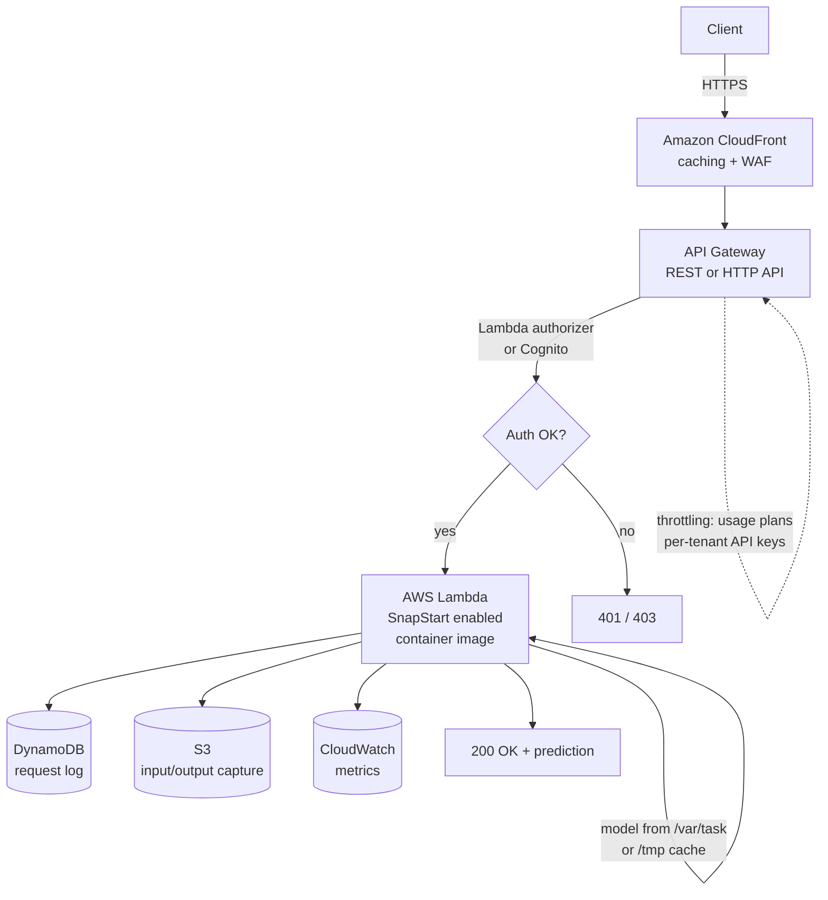
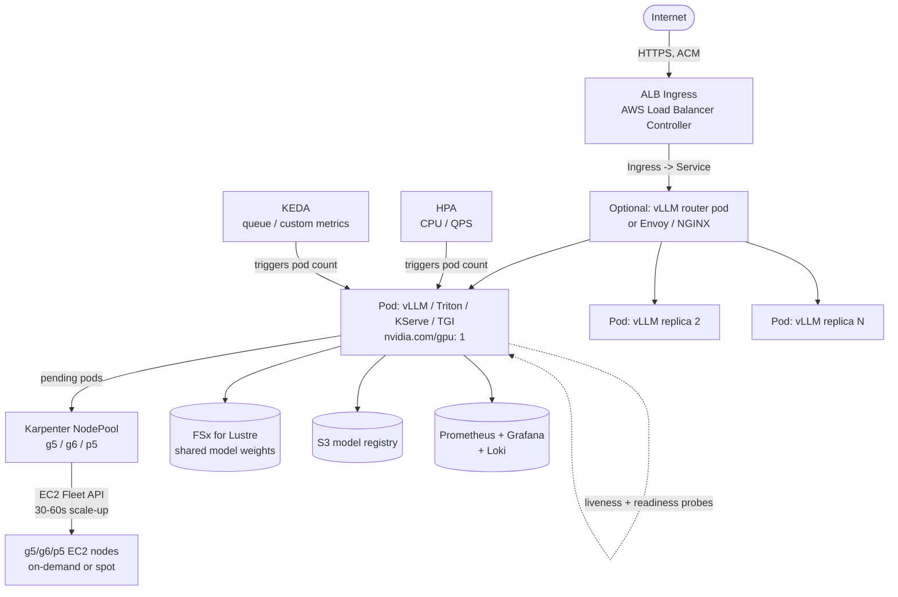
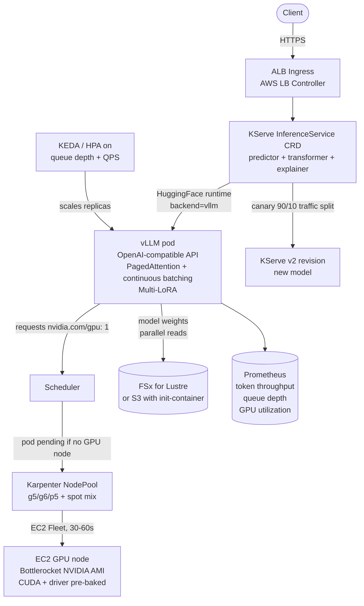
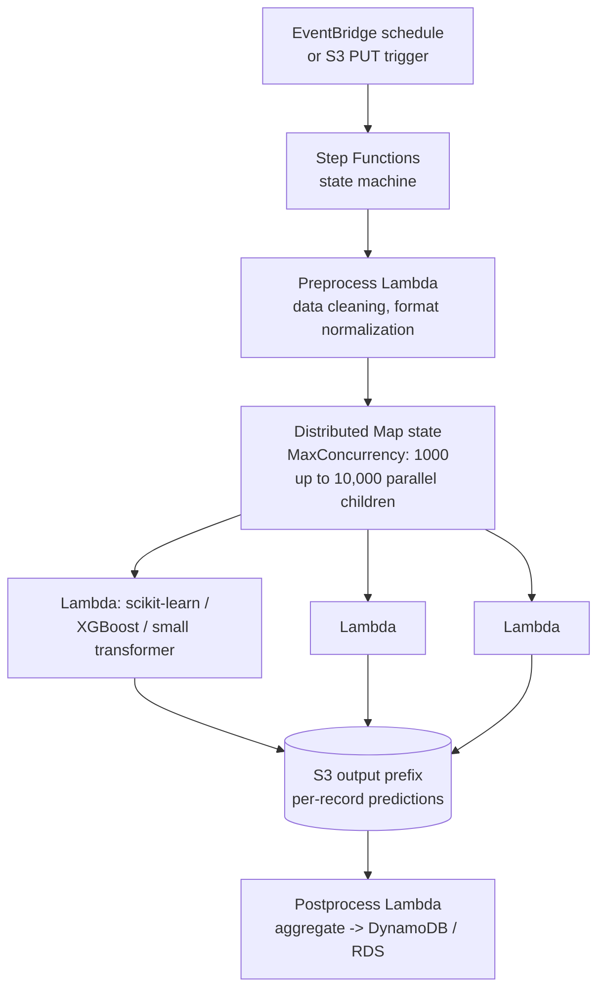

# Chapter 42 — Inference Outside SageMaker: Lambda, ECS, EKS, and Kubernetes

> **Goal of this chapter:** to give you a rigorous, opinionated map of the non-SageMaker inference surfaces on AWS — Lambda, ECS, EKS — and the Kubernetes-native serving ecosystem that has grown up around EKS in the 2024–2026 window. By the end of the chapter you should be able to explain, to a skeptical staff engineer at a mid-size shop, when leaving the SageMaker happy path is the right call and when it is engineering theatre; to recognize the exam triggers that point to Lambda, ECS, EKS, or one of the three SageMaker/Kubernetes integration paths; to recite the hard limits that turn Lambda into the wrong answer (no GPU, 10 GB image, 15-minute cap); and to articulate the breakeven economics — somewhere in the $30K–$50K/month inference-spend band — that flip the right answer from "SageMaker endpoint" to "EKS with KServe + vLLM." Part G of this book has, until now, treated SageMaker Hosting as the universe of inference; this chapter is the chapter where the universe expands.

Cross-links: this chapter sits inside the deployment cluster — back to **[Chapter 9 — Compute, GPUs, and AWS Silicon](../part_b_foundations/09_compute.md)** for the instance-family grounding that decides GPU vs CPU, back to **[Chapter 25 — Bring-Your-Own-Container](../part_e_sagemaker_core/25_byoc.md)** for the container contract that also applies to ECS and EKS pods, back to **[Chapter 35 — Endpoint Comparison](35_endpoint_comparison.md)** for the SageMaker-side endpoint matrix this chapter complements, forward to **[Chapter 47 — IaC for ML (CloudFormation, CDK, Terraform, SageMaker Operators)](../part_h_cicd_iac/47_iac_for_ml.md)** for the GitOps / kubectl story the ACK operator enables, and forward to **[Chapter 60 — Bedrock as Managed Alternative](../part_k_genai/60_bedrock.md)** for the "skip self-hosting LLMs entirely" path.

---

## 42.1 The honest case for leaving SageMaker

The MLA-C01 exam's default bias is that the easiest managed option wins. Most of the time that's SageMaker — endpoint, async endpoint, serverless inference, or batch transform — and most of the time the correct exam answer is one of those four. This chapter exists because the rest of the time matters too. Real engineering teams move inference workloads off SageMaker for six structural reasons, and the exam will name one of those reasons explicitly in any question that has a non-SageMaker correct answer.

**Reason one — cost at extreme steady-state scale.** SageMaker instance pricing carries roughly a 20–40% markup over the equivalent raw EC2 hourly rate. An `ml.g5.2xlarge` on SageMaker runs about $1.52/hr; the same `g5.2xlarge` on EC2 runs about $1.21/hr. Across a fleet of dozens of GPUs running 24×7, that markup is the difference between a healthy P&L line and a quarterly variance the CFO asks about. Add to that the fact that SageMaker real-time endpoints do not support Spot Instances (as of May 2026), while EKS-managed inference does, and the gap widens further — Spot pricing is typically 60–90% off on-demand. This is why teams burn down their AWS bill by validating traffic shape on SageMaker, then migrating steady-state production to ECS or EKS on EC2 once the workload's behaviour is understood.

**Reason two — custom routing logic that SageMaker Hosting does not expose.** SageMaker gives you production variants, shadow variants, multi-model endpoints, and inference components. It does not give you sticky sessions where one user is pinned to one model replica that holds their KV cache, nor token-budget-aware routing where a request is steered to a model based on remaining context quota, nor header-based A/B beyond the simple weighted variant model, nor custom mTLS / JWT-claim-driven auth. Teams that need any of those put an Application Load Balancer or API Gateway in front of an EKS/ECS deployment with their own router (Envoy, NGINX, or a vLLM router pod), because the open-source ecosystem ships that flexibility natively.

**Reason three — multi-cloud portability.** If a customer must run on AWS today and on Azure or on-prem tomorrow, SageMaker endpoints do not move. A `kubectl apply -f inferenceservice.yaml` against AKS, on-prem Kubernetes, or GovCloud EKS is the same `kubectl apply -f` against AWS EKS. The CRDs are identical. For regulated industries that occasionally negotiate data-residency clauses ("your inference must run inside our datacenter for these accounts"), KServe-on-Kubernetes is the only architecture that survives the negotiation.

**Reason four — very small models with very sporadic traffic.** A 30 MB scikit-learn classifier called five thousand times a day cannot economically justify a 24×7 SageMaker instance. SageMaker Serverless Inference exists for exactly this shape, and is often the right answer; but Lambda is often *cheaper* still at the very low end, and it gives you the entire Lambda ecosystem (Step Functions, EventBridge, S3 triggers) for free. The exam will distinguish these two by the words it uses — "scale-to-zero, managed ML inference" usually points to SM Serverless; "process new files as they land in S3" points to Lambda.

**Reason five — specialized serving frameworks that are not first-class on SageMaker.** vLLM, TGI (text-generation-inference), Triton with custom backends, and Ray Serve all run on SageMaker via Bring-Your-Own-Container (Chapter 25), but they get first-class ecosystem tooling — Helm charts, operators, autoscalers — on Kubernetes. The vLLM production stack assumes Kubernetes; running it on SageMaker means you give up most of that ecosystem for the convenience of managed instance lifecycle.

**Reason six — existing Kubernetes operational model.** If a customer already runs everything on EKS with Karpenter, Argo CD, Prometheus, and a GitOps deployment pipeline, adding SageMaker is adding a second control plane. EKS-native serving fits their existing playbook. This is the structural reality at Capital One's IFX team and at the long tail of post-Series-B genAI startups: they did not move to Kubernetes because they wanted to; they moved to Kubernetes for other workloads first and then added ML inference into the cluster they already had.

It is worth pausing on the *order* in which these six reasons typically manifest at a real organization, because the order predicts the migration story rather than the architecture story. Teams almost never wake up one morning and decide "we will run all inference on EKS." What happens instead is closer to: a team ships their first model on a SageMaker real-time endpoint because that is the fastest path to production; their workload grows and the bill grows with it; somebody runs the cost-comparison spreadsheet and notices the 20–40% instance markup; a parallel team that handles streaming or batch is already on EKS, so the platform expertise is already in-house; one workload moves to EKS as a pilot; the pilot works; the migration grows to cover the steady-state production fleet, while bursty or new workloads stay on SageMaker because the convenience still wins for them. Six months later the architecture is *hybrid* — SageMaker for the things SageMaker is good at, EKS for the things EKS is good at — and the discussion at the next quarter's architecture review is not "should we go all-in on either" but "which workloads should sit on which platform." That is the realistic end state, and it is the state most of this chapter's content is calibrated for.

> **Exam framing.** Non-SageMaker answers are correct only when the question explicitly mentions one of the drivers above (custom routing, Kubernetes shop, multi-cloud, true zero idle, GPU on sporadic traffic, etc.). If the question gives you a generic ML inference scenario with no such signal, default to SageMaker.

---

## 42.2 AWS Lambda for ML inference

Lambda is the smallest, simplest serving option AWS offers. It is also the strictest. Knowing what Lambda *cannot* do is more important on the exam than knowing what it can.

### 42.2.1 The hard limits, memorized

The first time a Lambda question shows up on the exam, you should be able to recite this table without thinking. Most Lambda exam traps are limit traps.

| Limit | Value | Implication for ML |
| --- | --- | --- |
| Max execution duration | **15 minutes (900s) per invocation** | No long-running inference; no batch jobs that need more than 15 min. |
| Max memory | **10,240 MB (10 GB)** | Upper bound on model + tokenizer + runtime footprint. |
| Max ephemeral `/tmp` | **10,240 MB (10 GB)**, default 512 MB | Where you cache model artifacts pulled from S3 at cold start. |
| Max container image | **10 GB uncompressed** | Includes layers, OS base, runtime, and the model if you bake it in. |
| Max zip deployment | 250 MB unzipped (50 MB zipped) | Why anything beyond tiny models uses container images. |
| vCPU | Up to ~6 vCPU at 10 GB memory; scales linearly with memory | No direct knob; you tune CPU by tuning memory. |
| GPU | **None.** | The single biggest exam trap. GPU answer → Lambda is wrong. |
| Concurrency (per account/region) | 1,000 default (raisable) | Caps the parallel invocations you can serve. |
| Payload size | 6 MB sync, 256 KB async, 20 MB via response streaming | Big images/PDFs use S3 pre-signed URLs, not direct payloads. |

> ⚠️ **Exam alert — Lambda 10 GB image limit + no GPU.** Two of the five most common Lambda-related traps on the MLA-C01 sit here. First: the 10 GB *uncompressed* container image limit includes all layers, the AWS Linux base image, the Python runtime, your dependencies, and the model if you bake it in. A vanilla PyTorch 2.x CPU base image is already about 3 GB; add `transformers`, tokenizers, and a 4 GB quantized model and you are at ~8 GB before your application code. Second: Lambda has *no GPU*, period — as of May 2026 there has been no announcement that this will change. If a question describes a workload with any of "LLM generation," "diffusion image generation," "real-time computer vision at p99 < 50 ms," or "GPU-accelerated transformer inference," Lambda is the wrong answer regardless of how attractive the per-invocation pricing looks.

A second look at the limits is worth your time because the exam tests not just the *value* of each limit but the *interaction* between them. The 15-minute execution duration and the 10 GB memory ceiling together imply that Lambda is not a place to do *both* a long inference and a large model — you can have one or the other but not both at high values. The 6 MB synchronous payload limit and the 256 KB async payload limit interact with model design choices: if your model takes a 50 MB image as input, you cannot send that image directly through API Gateway to a synchronous Lambda; you must put it on S3, pass a pre-signed URL or S3 key in the request, and have Lambda fetch from S3. The 10 GB image limit and the 10 GB `/tmp` limit interact in the other direction: if your model is 8 GB and your dependencies are 4 GB, you cannot fit both in the image, but you *can* fit dependencies in the image and the model in `/tmp` with room to spare. These interaction patterns are exactly the kind of trade-off the exam tests with scenario questions.

### 42.2.2 Lambda container images — the practical packaging

For any ML model beyond a small classical-ML pickle, you ship a **container image**, not a zip. The Lambda container-image story has a few exam-relevant constraints worth pinning.

- Image must implement the Lambda Runtime API via a **runtime interface client (RIC)**. AWS publishes RICs for Python, Node, Java, .NET, Go, Ruby, and Rust.
- Image must be Linux-only, single architecture (x86_64 *or* arm64, not multi-arch). You cannot push a multi-arch manifest and have Lambda pick.
- Image must live in **Amazon ECR** in the same region as the function. Lambda cannot pull from Docker Hub, GCR, or any other registry — only ECR.
- Cross-account ECR is allowed if both sides grant `ecr:BatchGetImage` and `ecr:GetDownloadUrlForLayer`.
- AWS-provided base images for Python 3.12+, Node 20+, Java 21+, and .NET 8+ are built on Amazon Linux 2023 minimal — smaller footprint, newer `glibc`.
- `/tmp` is the only writable directory at runtime. Everything else is read-only.

The typical ML container layout — `public.ecr.aws/lambda/python:3.12` as base, your handler under `/var/task`, optional Lambda layers under `/opt`, and `/tmp` reserved for model artifacts pulled from S3 at cold start — supports a robust **cold-start mitigation pattern** for models in the 2–10 GB range:

1. Bake small models (<2 GB) directly into the image under `/var/task`. They live in the container's read-only filesystem and load from local disk at every cold start.
2. For models in the 2–10 GB range, store the artifact in S3, download to `/tmp` at cold start, and *cache it in a module-level variable* across warm invocations.
3. Put the load logic in module-scope `init` code, not inside the handler — Lambda runs `init` once per container, so the model is in memory by the time the first invocation arrives. Doing the load inside the handler turns every invocation into a cold start.

### 42.2.3 SnapStart for Python and .NET — the November 2024 game-changer

Lambda **SnapStart** was originally a Java-only feature (re:Invent 2022). At re:Invent 2024 AWS launched SnapStart for **Python 3.12+** and **.NET 8**, and that is what flipped Lambda from "fine for warm invocations" to "fine for unpredictable traffic" for real ML workloads.

The mechanics: SnapStart runs your function's `init` phase once at version-publish time, takes a Firecracker microVM snapshot of post-init memory and disk, persists it in encrypted tiered storage, and on invocation resumes from the snapshot instead of running `init` again. For ML inference where `init` is dominated by loading a model into memory and importing heavy libraries (PyTorch, transformers, pandas/numpy), the time saved is substantial.

Documented numbers from the AWS Compute blog and ElasticScale's writeup:

- Java application: **16.5 s cold → 1.6 s with SnapStart** (~10× reduction).
- Python ML init (pandas + numpy + scikit-learn + a small model): **~16 s → ~1.4 s.**
- SnapStart adds 40–50% per-invoke overhead at very low traffic (the snapshot restore work) but drops to under 10% as usage scales because the warm pool amortizes the cost.

The caveat that the exam likes to test: SnapStart snapshots execution state at publish time, so any state that depends on time, randomness, per-instance secrets, or live network connections must be re-initialized in a `beforeCheckpoint` / `afterRestore` hook. The most common ML-specific gotcha is anything that opens a persistent gRPC connection at init (vector-DB clients, distributed-coordinator clients) — those need to be closed before the snapshot and reopened after restore. Plain "load model from S3, hold in module variable" code is safe.

SnapStart pricing has its own structure that the exam may probe: you pay for snapshot cache storage (a per-GB-month fee on the snapshot size, which for a typical ML init can be a few hundred MB to a few GB) and a per-restore charge each time a snapshot is restored to start a new execution environment. Standard request and duration billing still applies on top. For low-volume ML where cold starts otherwise dominate user experience, the trade is virtually always worth it; for very high-volume ML where most invocations land on already-warm environments, the snapshot-storage and per-restore costs can add up enough that provisioned concurrency becomes the better choice. The decision rule is roughly: SnapStart for unpredictable / spiky traffic where cold starts happen unpredictably; provisioned concurrency for predictable daytime traffic where you can reliably forecast peak concurrency.

> ⚠️ **Exam alert — SnapStart is Python/.NET *only* after November 2024.** This is the single most-dated piece of Lambda knowledge on the MLA-C01. Pre-2024 study materials describe SnapStart as Java-only and will steer you wrong on every Python-Lambda-cold-start question. The current state, as of May 2026: SnapStart supports **Java, Python 3.12+, and .NET 8** — and only those. If you see a question that pairs SnapStart with Ruby, Go, or Node, the answer is "not supported." If you see a question that asks about reducing cold-start latency for a Python ML Lambda, SnapStart is the modern, correct answer.

### 42.2.4 Provisioned concurrency

Provisioned concurrency pre-warms a fixed number of execution environments and keeps them warm. You pay for the warm pool 24×7 (at a lower per-GB-second rate than on-demand duration, but not zero), and in exchange you eliminate cold start entirely for those N concurrent executions.

Provisioned concurrency plays nicely with **Application Auto Scaling** — you can target a CloudWatch metric like `ProvisionedConcurrencyUtilization > 0.7` to scale the warm pool up during business hours and back down overnight. For ML, the canonical use case is "predictable daytime peak, want zero idle overnight": provision 20 concurrents at 8am, scale to zero at 10pm, accept cold starts on the rare midnight invocation.

SnapStart and provisioned concurrency are complements, not substitutes. SnapStart attacks the *duration* of a cold start when it happens; provisioned concurrency attacks the *frequency*. A well-tuned ML Lambda often uses both — SnapStart for unexpected invocations outside the provisioned-concurrency window, provisioned concurrency for the predictable daytime peak.

### 42.2.5 Lambda pricing — the per-request × duration × memory formula

Lambda's pricing model is `cost = (requests × $0.20/1M) + (GB-seconds × $0.0000166667/GB-s)`. Walking the math for a representative ML workload:

- 1 GB memory × 200 ms × 1,000,000 requests = 200,000 GB-seconds = **$3.33**.
- Request cost: 1M × $0.0000002 = **$0.20**.
- **Total: ~$3.53/month** for 1M invocations at 200 ms each on 1 GB memory.

The same workload on a `ml.t3.medium` SageMaker real-time endpoint running 24×7 is roughly **$36/month** — an order of magnitude more. Crossover where SageMaker wins on cost typically sits around **5–10M requests/month**, depending on payload size and inference duration. Above ~50 sustained QPS the Lambda math starts losing to a reserved SageMaker endpoint or a small EKS deployment.

A second pricing nuance worth knowing: **memory size is your only CPU-tuning knob**. Lambda scales vCPU linearly with memory — a 1.8 GB function gets approximately 1 vCPU, a 10 GB function gets approximately 6 vCPUs. For ML workloads dominated by NumPy / scikit-learn / ONNX Runtime computation, raising memory often *reduces* total cost even though the GB-second price goes up, because the per-invocation duration drops faster than the memory rate rises. The recommended discipline is to use the AWS-provided **Lambda Power Tuning** state machine to sweep memory configurations and find the cost-optimal point empirically; for typical scikit-learn scoring functions the sweet spot is usually somewhere in the 1.5–3 GB range, not the 512 MB default and not the 10 GB max.

### 42.2.5b The "10 GB image" packaging strategies in practice

The 10 GB image limit is generous but creates a layered packaging problem for ML images. A vanilla PyTorch 2.x CPU base image is roughly 3 GB; add `transformers` (~500 MB), tokenizers, sentencepiece, and a 4 GB quantized model and you are at ~8 GB before your own application code. Two patterns dominate at production teams shipping Lambda ML:

- **Slim base + S3 model download.** Keep the image to 2–4 GB by using a minimal Python base (`public.ecr.aws/lambda/python`), install only the runtime libraries needed at request time, then download model weights from S3 at cold start into `/tmp`. SnapStart bakes the post-download state into the snapshot, so the S3 download effectively happens once per published version rather than per cold start.
- **Full image + lazy load.** Accept the 10 GB image budget, bake the model into the image directly under `/var/task`, and use Linux `memfd` (memory-file-descriptor) techniques to stream weights from the in-image read-only filesystem into RAM without paging through `/tmp`. The AWS Compute blog demonstrates this pattern for llama.cpp, and it is the right answer when the model is large enough that S3-download time would dominate cold start even with SnapStart.

The decision between the two often comes down to whether your model is stable (full image is fine; you redeploy when the model changes) or rapidly iterating (slim base + S3 lets you swap the model artifact without rebuilding the image).

### 42.2.6 When Lambda wins — the clean exam triggers

Lambda is the correct answer when **all** of these conditions hold:

- Inference duration under 15 minutes (in practice under 5–10 s to keep p99 acceptable for a public API).
- CPU-only model (no GPU requirement of any kind).
- Sporadic or spiky traffic where the team values true zero idle cost.
- Model footprint under 10 GB (fits in the container image or in `/tmp`).
- Latency tolerance allows occasional cold starts (or you mitigate with SnapStart / provisioned concurrency).

The exam-ready phrasings worth pattern-matching:

- *"distilled BERT, 100K requests/month, no GPU, zero idle cost"* → **Lambda**.
- *"scikit-learn random forest scoring API"* → **Lambda** (or SageMaker Serverless).
- *"30-second inference at the 99th percentile"* → **not Lambda** — latency too high for cold starts to be a non-issue; usually points to SageMaker Serverless or a real-time endpoint.
- *"500 ms LLM token generation"* → **not Lambda** (GPU needed).
- *"new files land in S3, score each one and write the prediction back"* → **Lambda** (S3 event trigger).
- *"process 10 million records overnight, each record needs the same scikit-learn model"* → **Step Functions Distributed Map + Lambda** (see §42.7).

### 42.2.7 API Gateway in front of Lambda — the canonical pattern

For *any* of the inference compute options below (Lambda, ECS, EKS, even SageMaker endpoints), the preferred public-internet exposure pattern is **API Gateway** — REST API or HTTP API — for HTTPS termination via ACM certificates, throttling (per-API-key rate limits, critical for protecting expensive GPU pods from runaway clients), API keys and usage plans for monetization or quota enforcement, authentication via Cognito user pools / IAM SigV4 / Lambda authorizers, WAF integration for OWASP-style protections, request/response caching (REST API only) for deterministic inference, and direct service integrations.

The reference architecture for API Gateway + Lambda for ML inference looks like:



Throttling tiers in production typically look like: an *account-level* throttle that protects all APIs from a single noisy tenant (default 10,000 req/s burst, 5,000 req/s steady); *stage/method* throttles that give inference endpoints stricter limits than read-only metadata endpoints; *per-API-key usage plans* for tenant-tiered rate limits (Standard 10 req/s, Pro 100 req/s, Enterprise 1000 req/s); and *WAF rate-based rules* for IP-level anonymous abuse protection.

For regional resilience, the production pattern is Route 53 latency-based routing pointing at regional API Gateway endpoints in each region, with Lambda + model artifact replicated per region (S3 Cross-Region Replication for the artifact) and DynamoDB Global Tables for shared state. This is the same playbook AWS demonstrates for Bedrock multi-region failover in its 2024–2026 reference architectures.

Authentication patterns worth memorizing for the exam: **API key + usage plan** is the simplest pattern and is fine for partner integrations; **Cognito user pools** handle end-user-facing APIs with sign-up/sign-in flows; **Lambda authorizer** is the right answer for custom token formats (legacy JWT, internal SSO) and is also where per-tenant rate-limit logic lives if usage plans are not granular enough; **AWS_IAM** authorization is the right answer for service-to-service calls inside the same AWS account because it ties cleanly into IAM Role-based access without managing separate API keys.

One latency caveat worth noting: for LLM streaming workloads (Server-Sent Events), prefer ALB over API Gateway. API Gateway REST API does not support long-lived streaming responses well; HTTP API + Lambda response streaming is supported as of 2024 but with its own limits.

---

## 42.3 Amazon ECS for ML inference

ECS is AWS's container orchestrator that pre-dates Kubernetes adoption at AWS. For ML inference it is the simplest container-based answer when the team is AWS-native and does not want a Kubernetes control plane, when they need long-running stateful serving (no 15-minute Lambda cap), or when GPU support is required (Lambda has none).

### 42.3.1 Launch types — Fargate vs EC2

| Aspect | Fargate | EC2 launch type |
| --- | --- | --- |
| Server management | None (serverless) | You manage the EC2 capacity provider |
| GPU support | **No GPU on Fargate** (as of May 2026) | Yes — `p2/p3/p4/p5/g4/g5/g6` instance families |
| Granularity | Per-task vCPU/RAM | Per-instance, multiple tasks bin-packed |
| Cost model | Per-task vCPU-second + GB-second | Per-instance-hour |
| Best for | CPU-only inference, irregular shape | GPU inference, steady fleet, cost optimization |

The implication is sharp: any exam question that says "ECS + GPU inference" implies **EC2 launch type**, not Fargate. Fargate has *never* supported GPU and there is no announcement that it will. This is the second-most-common ECS trap on the exam.

### 42.3.2 ECS task definition and the ALB + auto-scaling pattern

A minimal ECS task definition for an inference service pulls an image from ECR, declares `cpu` and `memory` reservations, opens a port, and points logs at CloudWatch. The shape is unsurprising to anyone who has read an ECS task definition before. The interesting parts for ML are the surrounding orchestration: the **Application Load Balancer → Target Group → ECS Service** pattern, with the ALB doing HTTPS termination via ACM certificates, path-based routing (`/v1/predict` to model A, `/v2/predict` to model B — basic A/B without SageMaker Hosting variants), health checks against the model's `/health` endpoint, and WAF integration for abuse protection.

Application Auto Scaling supports three policies for ECS — **target tracking** (most common; keep CPU utilization or `ALBRequestCountPerTarget` at a target value), **step scaling** (fire alarms, scale by N at each step), and **scheduled scaling** ("scale to 20 at 8am Monday–Friday, scale to 2 at 6pm"). For ML inference the right default is target tracking on request rate, because CPU-based scaling can lag behind real load when models saturate GPU but not CPU.

A subtle ECS-specific consideration worth flagging: the **EC2 launch type with capacity providers** lets you blend on-demand and spot capacity across the same ECS service, with ECS handling task placement and rebalancing as spot capacity comes and goes. This is the ECS equivalent of Karpenter's spot+on-demand mix on EKS, and it is the right answer when an exam question describes "want cheaper GPU inference, willing to accept occasional task interruption, AWS-native containers, no Kubernetes." Spot pricing on `g5` and `g6` families typically runs 60–80% off on-demand at the time of writing, and ECS's spot-rebalance signal lets your service drain gracefully when capacity is reclaimed.

### 42.3.3 ECS exam triggers

- *"AWS-only, container-based serving, no Kubernetes expertise on team"* → **ECS**.
- *"GPU inference, container, cheapest steady-state, no Kubernetes"* → **ECS on EC2** launch type.
- *"CPU inference, want serverless containers, don't need 15-min+ tasks"* → **Fargate** (or Lambda if traffic is sporadic).
- *"Need ALB path-based routing across multiple model versions"* → **ECS + ALB**.

ECS is the right answer surprisingly often on the exam because it is the *only* AWS-native container orchestrator that is both (a) managed enough that a non-Kubernetes shop can run it and (b) flexible enough to host GPUs. SageMaker is more managed but more constrained; EKS is more flexible but assumes Kubernetes operational maturity.

---

## 42.4 Amazon EKS for ML inference

EKS is managed Kubernetes, and for ML serving it unlocks the open-source serving ecosystem (KServe, vLLM, Triton, Ray Serve) plus first-class GPU primitives (NVIDIA device plugin, Multi-Instance GPU, GPU sharing via time-slicing). The 2024–2026 EKS inference stack is the single most-discussed non-SageMaker architecture in the industry.

The case for EKS over ECS for ML inference rests on three pillars that ECS does not have a clean answer for. First, **first-class GPU primitives** — the NVIDIA device plugin, Multi-Instance GPU (MIG) partitioning on A100/H100, GPU time-slicing for multi-tenant workloads, and the broader CNCF ecosystem around GPU sharing all live on Kubernetes. ECS treats GPU as an opaque resource type; Kubernetes treats it as a first-class scheduler concern. Second, **the open-source serving ecosystem** — KServe, vLLM, Triton, Ray Serve, TGI, and the dozen other serving frameworks all ship Kubernetes-native install paths (Helm charts, operators, CRDs) and treat ECS as a second-class deployment target. Third, **the open-source autoscaling ecosystem** — KEDA for queue-based autoscaling, HPA for CPU/QPS, Karpenter for node provisioning, and Knative for scale-to-zero are all Kubernetes-native and do not have direct ECS equivalents. If you need any one of these three, EKS is the right answer; if you do not need any of them, ECS is simpler and cheaper.

### 42.4.1 The EKS inference reference architecture



The stack is opinionated but not religious — every component has alternatives — and most production deployments at AWS-native EKS shops mix and match. The key invariant is that **GPU node lifecycle is driven by pending pods**, not by a fixed pre-provisioned node group, which is what makes "scale-to-zero on GPU" economically viable.

The single most important property of this architecture for the exam is that **GPU node lifecycle is workload-driven, not pre-declared.** With a SageMaker real-time endpoint you set `InitialInstanceCount` and `MaxInstanceCount` and the endpoint manages the rest; with EKS + Karpenter you declare *constraints* (acceptable instance families, sizes, capacity types) and Karpenter resolves them against pending pods on the fly. The control loop is: a pod becomes pending because no node has the GPU it needs; Karpenter reads the constraint set; Karpenter calls EC2 Fleet API and gets a node back in 30–60 seconds; the node joins the cluster; the pod schedules; the inference workload starts serving. When traffic stops, the reverse happens — pods scale to zero (via KServe-Knative or KEDA), nodes go empty, Karpenter consolidates and terminates them. The result is a serving fleet that you do not size; it sizes itself based on what is actually running.

### 42.4.2 KServe (formerly KFServing)

**KServe** is the canonical Kubernetes-native model-serving stack. It is what the MLA-C01 exam refers to when it mentions "open-source Kubernetes-native model serving." Historically Kubeflow had its own serving component called KFServing; in 2021 KFServing was donated to the LF AI & Data Foundation and renamed KServe, becoming independent of Kubeflow. The exam may use either name — treat them as synonyms; KServe is current.

The KServe model centers on four CRDs and one declarative shape:

- The **`InferenceService` CRD** — one YAML defines `predictor` (the model server), optional `transformer` (pre/post processing), and optional `explainer` (Alibi or SHAP for explanations).
- **Serverless mode** (Knative-backed) — true scale-to-zero with concurrent-request-based autoscaling (KPA). Cold start in 5–30 s depending on model size.
- **Raw deployment mode** — plain Kubernetes Deployment + HPA, no Knative dependency. Lower complexity for teams that don't want Knative.
- **Multi-model serving** — pack many small models into one pod (via the ModelMesh controller). The Kubernetes-native answer to SageMaker MME.
- **Built-in canary / traffic splitting** — percentage-weighted traffic across two `InferenceService` revisions, declared in YAML.

A minimal KServe InferenceService for a scikit-learn model declares only the model URI, the predictor framework, replica counts, and resource limits — perhaps fifteen lines of YAML. The same shape works for a Llama-3-8B vLLM deployment with two extra lines: change the predictor block from `sklearn` to `huggingface` with `backend: vllm`, and request `nvidia.com/gpu: 1` in the resources block. The CRD does the rest. KServe exposes a uniform v2 inference protocol (predictably named endpoints, JSON or gRPC) regardless of whether the underlying framework is scikit-learn, XGBoost, PyTorch, ONNX, Triton, or vLLM — one CRD shape, many backends. That uniformity is the operational appeal, and it is the reason regulated-enterprise teams (Capital One, large banks) standardize on KServe even when they could run the underlying frameworks directly.

### 42.4.3 vLLM — the dominant LLM serving engine of 2024–2026

[vLLM](https://github.com/vllm-project/vllm) has become *the* default open-source LLM serving runtime in the 2024–2026 window. The reasons are mechanical, not religious.

**PagedAttention** virtualizes the KV cache like operating-system page tables, dramatically improving GPU memory utilization. Translation to throughput: **2–4× higher throughput** versus naive HuggingFace `transformers` serving on the same hardware, with roughly **~50% lower latency** for typical chat workloads at production batch sizes. **Continuous batching** dynamically batches incoming requests at the token level rather than waiting for whole-request batches to assemble. The **OpenAI-compatible API** is a drop-in for client code that already speaks the OpenAI format — LangChain, LlamaIndex, and CrewAI work unchanged.

The feature that has, more than any other, made vLLM the right answer for SaaS that fine-tunes per-customer is **multi-LoRA serving** (the S-LoRA pattern). One base model lives on the GPU; many fine-tuned LoRA adapters are loaded on demand. When you have 100 tenants each with their own 80 MB LoRA adapter on top of an 8B base model, naive serving means 100 GPU pods. S-LoRA / Punica / vLLM multi-LoRA techniques let you serve all 100 LoRAs from one or a few base-model pods by swapping LoRA weights into GPU compute on demand. The result is roughly 10× density improvement, dramatically lower per-tenant cost, and a pattern that has no SageMaker-managed equivalent as of May 2026.

vLLM also ships speculative decoding, prefix caching, and quantization (AWQ, GPTQ, FP8) as first-class features. AWS shipped first-class vLLM support in 2024–2025: **AWS Deep Learning Containers for vLLM 0.9+** are official, free, NVIDIA-tuned images for vLLM on EC2/EKS/ECS; the **Amazon EKS quickstart for vLLM** is an opinionated reference architecture; and the **vLLM production-stack** community project ships explicit AWS EKS and GCP GKE deployment paths with Terraform modules.

The numbers behind "PagedAttention dominates" are worth pinning because they show up in production design conversations constantly. In a typical chat workload at production batch sizes (e.g., 32 concurrent requests per replica on a single A10G), naive HuggingFace `transformers` generation hits 20–40% GPU memory utilization because each request reserves the maximum possible KV cache regardless of how much it actually uses; PagedAttention hits 80–95% utilization because the KV cache is allocated in pages on demand. That utilization gap converts directly to throughput: 2–4× more tokens per second on the same hardware, ~50% lower median latency per request, and 3–4× more concurrent requests before the GPU starts queuing. For a SaaS that pays per GPU-hour, this is the difference between needing 100 GPUs and needing 30. Continuous batching is a separate optimization layered on top: rather than batching whole requests, vLLM batches at the token level — a new request can join a running batch on the next token boundary rather than waiting for the previous batch to finish. The combination is what makes vLLM the throughput leader.

Why teams pick vLLM over SageMaker LMI even though LMI is excellent and ships first-class on SageMaker:

- vLLM's **OpenAI-compatible API** lets client code stay portable across self-hosted and managed endpoints.
- vLLM ships **weekly**; LMI release cadence is gated on AWS DLC releases.
- Speculative decoding, prefix caching, and structured output land in vLLM first.
- **Multi-LoRA** serving is materially more mature in vLLM than in LMI.

Anthropic and OpenAI do not run primary inference on AWS for their flagship public APIs — Anthropic uses AWS as one of several clouds via Bedrock, OpenAI is primarily Azure — so they are not the vLLM-on-EKS case studies people sometimes claim they are. The actual production users are Series-B genAI startups (Perplexity-adjacent shops, the "vertical AI agent" cohort) and large regulated enterprises (Capital One, Cigna/Optum, large banks) running fine-tuned open base models (Llama, Mistral, Qwen, DeepSeek) for internal agent assistants, document QA, and summarization workloads.

A practical operational note about vLLM-on-EKS that the exam will not ask but that you will encounter in any real deployment: **model weight staging time is the dominant cold-start cost on GPU**. A 70B-parameter model at FP16 is 140 GB on disk; pulling that from S3 to a fresh GPU node over a typical EKS networking setup can take 5–15 minutes per node. The mitigations are: pre-warm a Karpenter NodePool with a baseline of one or two nodes that always stay up (eliminating the cold-start case for the first few replicas); use FSx for Lustre as a shared model cache so subsequent nodes pull at multi-GB/s instead of S3's per-connection bandwidth; use Bottlerocket NVIDIA AMIs with the model pre-baked or pre-pulled via a DaemonSet; or accept the cold start and ensure traffic-routing logic gracefully directs new requests to warm replicas while a cold node is loading. The exam may signal this with phrases like "cold-start time for a 70B model on EKS is unacceptable" — the expected answer is FSx for Lustre or pre-warmed baseline capacity, not "switch to SageMaker."

### 42.4.4 NVIDIA Triton Inference Server on EKS

Triton is the multi-framework serving server — TensorRT, PyTorch, ONNX, TensorFlow, Python custom backends, and vLLM (as a backend) under one roof. It runs identically on SageMaker (as an "inference container") and on EKS (as a pod). The decision criteria are about operational fit, not about Triton itself.

Choose Triton on SageMaker when you want single-tenant managed endpoints with autoscaling, IAM auth, built-in CloudWatch and DataCapture, and you do not want to operate Kubernetes; when you are already deep in the SageMaker ecosystem (Pipelines, Model Registry, Model Monitor); or when the model graph is moderate.

Choose Triton on EKS when you need complex ensembles (a CV pipeline: detect → crop → classify → OCR) where Triton's `ensemble_scheduling` lets you compose multiple model steps with shared GPU memory; when you need dynamic batching across tenants in multi-tenant SaaS; when you want on-prem + cloud parity for data-residency reasons; or when you need to mix Triton with other serving stacks (vLLM for LLMs, Triton for CV) in the same cluster. Reported savings versus Triton-on-SageMaker at scale typically run 30–40% (Caylent, TrueFoundry, Sider AI writeups), driven entirely by the node-packing and Spot-pricing flexibility EKS allows — not by anything Triton itself does differently.

Triton's `model_repository` is a directory layout that defines models and configurations declaratively, which makes it cleanly mountable from S3 via an init container or sidecar. The same `model_repository` layout works identically on SageMaker and on EKS, which is what makes Triton genuinely portable between the two platforms — a useful property if you want to keep your migration path open without rewriting model-loading code.

### 42.4.5 Karpenter for GPU node auto-provisioning

Cluster Autoscaler is the older Kubernetes node autoscaler. **Karpenter** is AWS's modern replacement, now CNCF-graduated and built into **EKS Auto Mode** as of 2024. For ML workloads Cluster Autoscaler is being phased out in most reference architectures.

What Karpenter does that the exam cares about:

- **Bin-packing across all pending pods.** Karpenter looks at the full pending-pod set and picks the cheapest combination of instance types (across families, sizes, AZs, spot/on-demand) that satisfies them. Cluster Autoscaler operates per node group; Karpenter operates per workload.
- **Faster scale-up.** Karpenter launches nodes directly via EC2 Fleet, not via Auto Scaling Groups. Typical scale-up is 30–60 s versus 90–120 s with Cluster Autoscaler.
- **Workload-driven, not group-pre-declared.** You don't predefine node groups; you declare a `NodePool` with constraints ("must be GPU, must be in private subnets") and Karpenter picks instances on demand.
- **Spot interruption handling.** Karpenter receives spot interruption notices and gracefully drains.

For ML, Karpenter is the standard way to get GPU nodes (`g5`, `g6`, `p5`) to scale to zero when no LLM traffic exists and snap into existence in under 90 seconds when traffic arrives. Combined with KServe serverless mode or a vLLM auto-scaling deployment, you get near-Lambda economics on GPU — minus Lambda's "no GPU" restriction. That last property is the strategic case for Karpenter in ML: it is the only tool in the AWS ecosystem (managed or self-managed) that gives you *both* GPU support *and* genuine scale-to-zero on the underlying compute. SageMaker Serverless Inference is scale-to-zero but CPU-only; SageMaker real-time endpoints support GPU but have a minimum instance count of one; Lambda is scale-to-zero but no GPU. Only the EKS + Karpenter + KServe-serverless stack delivers both at once.

A representative Karpenter NodePool for inference declares a list of acceptable instance families (`g5`, `g6`), acceptable sizes (`xlarge` through `8xlarge`), acceptable capacity types (on-demand and spot), and a consolidation policy. The five most common Karpenter mistakes for ML workloads, per Sedai's 2024 writeup, are worth pinning:

1. **`WhenEmptyOrUnderutilized` consolidation on long-running inference.** Karpenter will terminate a GPU node it thinks is underutilized even if that node is mid-inference on a 30-second request. The fix is `consolidationPolicy: WhenEmpty` with `consolidateAfter: 1h` for inference workloads.
2. **Single instance type in NodePool.** If `g5.xlarge` is unavailable in your AZ, you get stuck. List 3–5 instance types.
3. **No node TTL.** GPU drivers and CUDA versions drift; set `expireAfter: 30d`.
4. **No image pre-pull.** Cold-starting a 10 GB ML image on a fresh node wastes 2–5 minutes of GPU time. Use Bottlerocket NVIDIA AMIs with pre-baked CUDA, or pre-pull via a DaemonSet.
5. **No GPU time-slicing for dev/test.** Many inference and dev workloads need under 50% of an A10G's VRAM. Time-slicing or NVIDIA MIG (on A100/H100) lets you pack 4–7 workloads on one GPU.

Karpenter has effectively replaced Cluster Autoscaler in the AWS-recommended reference architectures, and as of 2024 it is built into **EKS Auto Mode** so that you do not even have to install it explicitly. EKS Auto Mode is worth knowing as a name: it bundles Karpenter, the AWS Load Balancer Controller, the EBS CSI driver, and a few other operational primitives into a managed package that AWS keeps up to date for you. The trade-off is that EKS Auto Mode is more opinionated than self-managing these components, and a few advanced use cases (custom Karpenter NodeClass configurations, unusual AMI choices) may still want the self-managed path. For the exam, "EKS Auto Mode" is the right answer when the question signals "managed Kubernetes with built-in Karpenter and no Helm-chart maintenance."

### 42.4.6 The full EKS inference stack — KServe + Karpenter + vLLM

The composite picture, expressed as a Mermaid diagram for memorization:



The stack composes cleanly because each layer has a single responsibility: KServe defines *what* model is deployed and *how* traffic is split; vLLM (or Triton or TGI) executes the inference; Karpenter provisions the underlying compute; FSx (or S3 with an init-container) stages the model weights; KEDA or HPA decides when to add replicas. The exam will rarely ask you to wire this stack from scratch, but it will ask you to identify which component owns which responsibility.

A practical note on the model-weight staging layer that is easy to miss. The two common patterns — **FSx for Lustre** versus **S3 with an init-container** — solve the same problem (get model weights onto the GPU node before the pod accepts traffic) but trade off differently. FSx for Lustre gives you parallel reads at very high aggregate bandwidth (hundreds of GB/s for the largest filesystems), persistent caching across pod restarts, and shared access from many pods to the same dataset — which makes it the right answer when you have a 100 GB+ Llama-3-70B checkpoint that twenty replicas all need to load. S3 with an init-container is simpler operationally (no FSx filesystem to manage, no FSx bill on top of the EC2 bill), pulls model weights from your normal Model Registry / S3 location, and is the right answer for smaller models (under ~10 GB) where the one-time download per pod is a few seconds of cold-start cost rather than a few minutes. The exam framing distinguishes these by scale: a 70B-parameter model serving twenty pods → FSx; a 7B fine-tune serving two pods → S3 init-container.

---

## 42.5 SageMaker meets Kubernetes — three integration paths

When a team wants both Kubernetes operational maturity *and* SageMaker's managed compute features (Pipelines, Clarify, Model Monitor, JumpStart), AWS offers three integration paths. Knowing which is which is fair game on the exam, and the framing has changed substantially in 2024–2026.

The three paths are easy to confuse because all three involve "running SageMaker things from Kubernetes." The cleanest way to keep them separate in your head: **path one (ACK)** lets `kubectl` create SageMaker resources directly; **path two (Kubeflow Pipelines components)** lets a pipeline DAG step launch SageMaker jobs; **path three (HyperPod Inference Operator)** is the special case where the EKS cluster *is* the SageMaker-managed cluster and inference runs *on the EKS nodes themselves* with SageMaker-managed lifecycle. Path one and two are the "K8s control plane, SageMaker data plane" pattern. Path three is the "SageMaker control plane, EKS data plane" inversion that HyperPod enables.

### 42.5.1 SageMaker Operators for Kubernetes (ACK-based, current generation)

AWS maintains **AWS Controllers for Kubernetes (ACK)** — a project that publishes Kubernetes operators for AWS services, with controllers generated from the AWS API surface so coverage stays uniform across services. The **SageMaker controller under ACK** is the current generation of "SageMaker Operators for Kubernetes."

What it enables: you define SageMaker resources (`TrainingJob`, `HyperParameterTuningJob`, `Model`, `EndpointConfig`, `Endpoint`, `ProcessingJob`, `BatchTransformJob`) as Kubernetes CRDs in YAML, then `kubectl apply -f training-job.yaml` provisions a SageMaker training job. All SageMaker side-effects (S3 outputs, CloudWatch logs, model artifacts in the Registry) happen as normal; the EKS cluster never runs the actual training containers — the training runs on SageMaker-managed infrastructure.

The original SageMaker operator (announced 2019) used a custom controller not built on ACK. It bundled `Model`, `EndpointConfig`, and `Endpoint` into a single `HostingDeployment` CRD and had narrower API coverage than the AWS service it shadowed. **It is now deprecated.** The ACK-based controller separates each CRD, mirrors the SageMaker API 1:1 as it evolves, and is maintained by the shared ACK community plus the SageMaker service team. The migration was not optional — the original is end-of-life.

| Aspect | Original (deprecated) | ACK service controller (current) |
| --- | --- | --- |
| Architecture | Custom, SageMaker-specific | Generic ACK framework, generated from AWS API |
| CRDs | One `HostingDeployment` bundling Model + EndpointConfig + Endpoint | Separate CRDs: `Model`, `EndpointConfig`, `Endpoint`, `TrainingJob`, `ProcessingJob`, etc. |
| Maintenance | Solo SageMaker team | Shared ACK community + AWS service team |
| API coverage | Subset | Mirrors AWS SageMaker API 1:1 |
| Migration | n/a | **Required** — original is EOL |

The pattern this enables is "**K8s as the control plane, SageMaker as the data plane**." GitOps shops (Argo CD, Flux) want one declarative source of truth — their endpoints defined in Git, applied via Kubernetes, but actually running on SageMaker's managed infrastructure. ACK gives them that without forcing a full EKS-hosted inference deployment. Typical adopters include heavy GitOps shops (Goldman Sachs, JPMorgan, Capital One in some product areas) and hybrid MLOps stacks where training is on EKS but inference is on SageMaker for the SLA.

> ⚠️ **Exam alert — the SageMaker Operator for Kubernetes is now ACK-based.** The original operator is deprecated; the current answer on the MLA-C01 is always "the ACK-based SageMaker controller." If a question says "team is a Kubernetes shop, wants to manage SageMaker resources with kubectl," the correct answer is the **AWS Controllers for Kubernetes (ACK) SageMaker service controller**, not the legacy operator. Older study materials that describe a single `HostingDeployment` CRD are referring to the deprecated tool — do not pick that answer.

### 42.5.2 SageMaker AI Components for Kubeflow Pipelines (also ACK-based at v2)

Different artifact, same underlying ACK at version 2. Per the SageMaker AI Developer Guide:

- v1.x: components backed by **Boto3** (older, deprecated path).
- v2.0.0-alpha2+: components backed by the **SageMaker ACK Operator**. AWS recommends v2 for all new work.

Components cover the full lifecycle — Ground Truth (labeling jobs from Kubeflow Pipelines), Processing (SageMaker Processing jobs as pipeline steps), Training and Hyperparameter Optimization, Hosting Deploy (real-time endpoints), Batch Transform, and Model Monitor (drift/quality monitors). The integration model is straightforward: **Kubeflow Pipelines provides the DAG and UI; each step fires a SageMaker job that runs on SageMaker-managed infrastructure.** The EKS cluster's role is the control plane and the pipeline UI host, not the compute.

The IAM layering the docs are explicit about (memorize the three roles, because exam questions on cross-account or pipeline-permission scenarios pivot on which role is missing what):

1. **Gateway/admin IAM role** — for the operator/user who installs Kubeflow Pipelines. Needs CloudWatchLogsFullAccess, CloudFormationFullAccess, IAMFullAccess, S3FullAccess, EC2FullAccess, AmazonEKSAdminPolicy.
2. **Kubernetes pod IAM role** — assumed by KFP pipeline pods (or by the ACK controller pod) to *create* SageMaker jobs. Needs AmazonSageMakerFullAccess.
3. **SageMaker execution role** — assumed by the SageMaker jobs themselves to access S3 and ECR. Needs AmazonSageMakerFullAccess + AmazonS3FullAccess.

Cross-account ECR for SageMaker training images works the same way it does for Lambda — both sides must allow `BatchGetImage` and `GetDownloadUrlForLayer`.

The mental model that makes this integration easier to reason about is that **Kubeflow Pipelines is providing two layers** — a DAG orchestrator (Argo Workflows under the hood) and a UI for browsing pipeline runs — and the SageMaker components plug each step of the DAG into a SageMaker job rather than running the step locally on EKS. The EKS cluster therefore needs only enough capacity to run the Kubeflow Pipelines control plane (the API server, the workflow controller, the UI pod, the metadata DB) and the lightweight pipeline-step pods that *launch* the SageMaker jobs; it does not need the GPU capacity that the actual training jobs will consume. That makes this pattern cost-efficient even on a small EKS cluster, because the heavy compute is billed against SageMaker, not against EKS-managed EC2.

### 42.5.3 SageMaker HyperPod Inference Operator (April 2026)

**SageMaker HyperPod** launched in 2023 for distributed training on managed but customer-visible clusters (a SageMaker-managed Slurm or EKS flavour). At re:Invent 2024 AWS extended HyperPod with the **HyperPod Inference Operator**, an EKS operator that lets teams who train on HyperPod-on-EKS also serve inference workloads on the same cluster. In **April 2026** AWS released the operator as a **managed EKS add-on** (`amazon-sagemaker-hyperpod-inference`), installable via `aws eks create-addon` or Terraform.

Why it exists: customers training large foundation models on HyperPod (distributed across hundreds of GPUs) wanted to serve on those same clusters without standing up a separate Hosting fleet — avoiding double billing for idle GPU capacity between training cycles.

What it gives you that plain SageMaker endpoints do not:

- **Direct EKS control.** Pods, services, ingress — full Kubernetes semantics. `kubectl` works.
- **Managed tiered KV cache.** AWS-managed KV-cache offload to local NVMe + EBS + S3, claiming **up to 40% latency reduction for long-context workloads** (100k+ token contexts).
- **Intelligent routing.** Prefix-aware, KV-aware, and round-robin routing strategies — requests sharing a prompt prefix route to the same replica to reuse cache.
- **JumpStartModel CRD.** Deploy a JumpStart model with five lines of YAML.
- **Multi-instance fallback.** If the preferred instance type is unavailable, schedule on a fallback (prefer P5, fall back to P4d).

The exam framing is straightforward: "team trains on HyperPod and wants Kubernetes-native inference on the same cluster" → **HyperPod Inference Operator**. The April 2026 managed-add-on release is the version the cert tests against; older study material may describe an earlier self-managed Helm install path.

The tiered KV cache deserves a moment of attention because it is the most architecturally novel piece of the operator. Long-context LLM inference (100k+ token contexts for legal-document QA, codebase summarization, multi-document retrieval) hits a wall on standard serving stacks because the KV cache for a 100k-token context against a 70B model can easily exceed a single GPU's VRAM, even with PagedAttention. The HyperPod Inference Operator addresses this by transparently offloading KV-cache pages across a three-tier hierarchy: hot pages stay on GPU VRAM, warm pages move to host RAM and local NVMe SSD, and cold pages spill to attached EBS volumes or even back to S3 for very long-running sessions. The cache is also *shared across replicas* via the operator's intelligent routing — when a new request arrives with a prompt prefix that another replica has recently processed, the request routes to that replica to reuse the cached KV pages rather than recomputing them. AWS's published numbers claim up to 40% latency reduction on workloads where prompt prefixes are commonly shared (the canonical case being a long system prompt followed by short user turns, which is most of agentic AI). This is genuinely AWS-differentiated; no other managed inference service offers a comparable tiered KV cache as of May 2026, and it is the strongest technical argument for choosing the HyperPod operator over a self-managed vLLM-on-EKS deployment for long-context workloads.

> ⚠️ **Exam alert — HyperPod Inference Operator went GA as a managed EKS add-on in April 2026.** The deployment path on current exam material is `aws eks create-addon --addon-name amazon-sagemaker-hyperpod-inference`, not a manual Helm install. The operator provides a managed tiered KV cache claiming up to 40% latency reduction on long-context workloads, prefix-aware intelligent routing, and a `JumpStartModel` CRD for five-line deployments of JumpStart models. Any question that pairs "HyperPod" with "EKS inference" and "tiered KV cache" maps to this operator.

| Driver | SageMaker endpoint | EKS + HyperPod Inference Operator |
| --- | --- | --- |
| K8s-native ops, kubectl, GitOps | No | **Yes** |
| Managed AWS-grade SLA | Yes | Yes (HyperPod is managed) |
| Long-context LLM inference (>32k tokens) | OK | **Better** (tiered KV cache) |
| Frontier-scale (70B+ models, multi-node) | Awkward | **Native** (HyperPod cluster) |
| Multi-tenant model serving | MME | KServe / HF runtime via operator |
| 7B–13B fine-tune endpoint | **Easier** | Overkill |
| Hybrid with custom side-cars (Istio, OPA) | No | **Yes** |

---

## 42.6 Hybrid pattern — train on SageMaker, serve on EKS

A common architecture when teams want SageMaker's training-pipeline strengths but EKS-native serving: SageMaker handles the training job, Experiments tracking, and Model Registry; EKS handles the inference deployment with vLLM, KServe, or Triton. The handoff is a model artifact in S3 plus a Model Registry approval event.

```mermaid
flowchart LR
    DATA[(S3<br/>training data)] --> SMP[SageMaker Pipeline<br/>Processing -> Training -> Eval]
    SMP --> SMT[SageMaker Training Job<br/>w/ Experiments tracking]
    SMT --> ART[(S3 model artifact<br/>versioned)]
    ART --> REG[SageMaker Model Registry<br/>PendingManualApproval]
    REG -->|human approval| APP[Status: Approved]
    APP --> EB[EventBridge rule<br/>on registry state change]
    EB --> ARGO[Argo CD / Flux<br/>or custom controller]
    ARGO -->|kubectl apply| KS[KServe InferenceService<br/>rolling update or A/B]
    KS --> VL[vLLM / Triton pod on EKS<br/>Karpenter-managed GPUs]
    VL --> CLIENT([Production traffic])
    VL -.->|sidecar exports| CAP[(S3 DataCapture-style<br/>captured records)]
    CAP --> MM[SageMaker Model Monitor<br/>drift / quality jobs]
    MM -->|alarm fires| EB2[EventBridge -> SNS / Slack]
```



The pattern lets each platform play to its strength. SageMaker's pipeline experience (Studio UI, lineage, Clarify bias reports, Model Cards) is genuinely better than the Kubernetes-native equivalents. EKS's serving flexibility (multi-LoRA, custom routing, Karpenter-driven GPU economics) is genuinely better than SageMaker Hosting's. The handoff via the Model Registry approval event gives the model-risk team a clear human-in-the-loop gate that maps cleanly onto SR 11-7 or FDA SaMD requirements.

A subtler design choice in the hybrid pattern is **where Model Monitor runs**. The diagram above shows a sidecar in the EKS pod that captures inference inputs and outputs in DataCapture-style records and writes them to S3, where Model Monitor's drift/quality jobs run on the SageMaker side as scheduled processing jobs. This works, and it preserves the SageMaker-side observability stack (Clarify, Model Cards, Model Monitor) even though the inference itself has moved to EKS. The alternative is to run Prometheus + Grafana + a custom drift-detection job entirely inside the EKS cluster, which gives you a single observability plane but forces you to rebuild the model-risk-management artifacts (drift reports, bias reports, model cards) yourself. Regulated-finance teams typically pick the hybrid observability path because the auditor wants to see the same artifact format they have seen for every other model — and that format is Model Monitor's, not Prometheus's.

The **HyperPod Inference Operator** is the AWS-blessed evolution of this pattern when training also happens on EKS (via HyperPod) — same cluster, same operator, no S3 handoff in the middle. For teams already on SageMaker for training, the hybrid pattern above is the right migration story.

---

## 42.7 Lambda for offline scoring via Step Functions

A pattern worth pinning because the exam tests the "batch of one" framing in a non-obvious way: when you need to score millions of records, each with a small model and a sub-second inference, you do not need a SageMaker Batch Transform job — you need **Step Functions Distributed Map** fanning out to Lambda.



Distributed Map can launch up to 10,000 parallel child workflow executions — effectively the same parallelism as a SageMaker Batch Transform but with finer-grained billing, easier integration with event-driven architectures, and per-record retry/DLQ handling. The pattern beats SageMaker Batch Transform when records are small and inference is fast (<1 s/record), when you already use Step Functions for the surrounding ETL, when you want per-record error handling, or when the input is event-driven rather than scheduled.

SageMaker Batch Transform still wins when you need GPU inference (Lambda has none), when models are >3 GB unquantized and need >10 GB RAM, when you want to score a large batch per inference call (one 1 GB CSV at a time), or when you want minimal orchestration code. For foundation-model batch jobs ("summarize 10 million documents overnight"), **Bedrock batch inference** is 50% cheaper than on-demand Bedrock and is the right answer on the exam — Step Functions Distributed Map fans out to Bedrock rather than Lambda, but the orchestration shape is identical.

The reason this pattern is worth a dedicated section even though it is conceptually simple is that the exam tests the *triage* — given a batch scoring problem, which of Lambda, Batch Transform, Bedrock batch, or a SageMaker async endpoint is the right choice? The decision boils down to three properties of the workload: **(a)** does each record need GPU? (yes → Batch Transform or Bedrock batch; no → Lambda is in play); **(b)** is the model a foundation model? (yes → Bedrock batch; no → custom model, Lambda or Batch Transform); **(c)** how does the workload trigger? (event-driven → Step Functions + Lambda is best because it integrates with EventBridge / S3 triggers natively; scheduled and batch-oriented → Batch Transform's one-API-call simplicity wins). Hold those three properties in your head and the choice falls out mechanically.

---

## 42.8 Capital One IFX — the Kubernetes-native ML enterprise case study

Capital One's **Intelligent Foundations and Experiences (IFX)** team is the most-cited public example of "Kubernetes-native ML at a regulated enterprise" in the 2024–2026 window. The signals worth knowing:

- The 2024 Capital One job posting **"Lead Machine Learning Engineer (MLOps, KServe + building Kubernetes Clusters, PyTorch, TensorFlow on AWS)"** explicitly calls out KServe and self-managed Kubernetes clusters on AWS as core responsibilities. The role exists.
- Capital One's Kubernetes Case Study (kubernetes.io) documents a journey that started around 2016–2017 with Docker, moved to Kubernetes, and now runs **dozens of services, scores of pods, millions of transactions per day with roughly 7 dedicated platform engineers**. Deployments grew approximately **100× over the documented period**. Cluster rehydration from base AMIs dropped from a full day to about 2 hours.
- ML/AI workloads named in the case study include **fraud detection, credit decisioning/approvals, and anomaly detection** on Apache Flink streaming plus batch jobs. By 2024 the IFX team layered **KServe** on top of this Kubernetes estate for model serving.

Capital One's stated reasons for staying on Kubernetes rather than moving inference to SageMaker:

1. **Unified ecosystem.** Streaming (Flink), batch, and inference all share one orchestrator. Adding SageMaker would create a "snowflake" alongside the existing K8s estate.
2. **Cost.** They quote roughly **3–4× higher AWS costs** if they ran the same workloads on a mix of managed services without Kubernetes bin-packing.
3. **Operational maturity.** Around 7 platform engineers maintain the whole thing — cluster rehydration time went from a day to 2 hours over the migration.
4. **Regulatory control.** Federal and financial regulators want auditability of the runtime; an opinionated managed service is harder to audit than an open Kubernetes cluster they fully own.

The IFX case is worth dwelling on because it is the clearest counterexample to the "default to SageMaker" exam bias. On the cert you should still default to SageMaker; in the real regulated-finance MLE role you are training for, the right answer is often the opposite of the cert's preferred answer, and the IFX team is one of the public artifacts you can point to in an interview to defend that opposite answer.

The number worth pinning is **seven engineers running the platform**. That is *not* seven engineers per model, or seven engineers per business line — it is seven engineers running the *entire* Kubernetes platform that hosts fraud, credit, anomaly detection, and the supporting Flink streaming infrastructure for the bank. Per the case study, that team grew the deployment cadence by approximately 100× over the documented period, which means the per-deployment burden dropped by something like two orders of magnitude as the platform matured. The deeper lesson: a Kubernetes-native ML platform has high *fixed* operational cost (the platform team) and very low *marginal* cost per workload (the next deployment is a YAML PR). SageMaker has the inverse profile — near-zero fixed cost (the team consumes a managed service) and high marginal cost (each instance carries the 20–40% markup forever). Which profile fits depends on how many workloads you expect to run and how fast you expect to add new ones, which is itself a strategy question rather than a tooling question.

---

## 42.9 EKS-vs-SageMaker breakeven economics

Every ML engineering manager gets asked this at quarter-end: *should we be on SageMaker or on EKS?* The honest answer has two parts.

### 42.9.1 The rough heuristic

- **Below ~$30K/month in inference spend** → **SageMaker convenience wins.** You will spend more on platform engineering than you save on instances.
- **$30K–$50K/month** → **grey zone.** Depends on whether you already have a Kubernetes platform team.
- **Above ~$50K/month** → **EKS economics dominate.** Documented savings: **30–40% (LeBonCoin), 40–60% (TrueFoundry / Sedai aggregate writeups).**

### 42.9.2 Why the line is where it is

EKS savings come from four mechanisms:

1. **Raw instance markup.** SageMaker instances are priced roughly 20–40% above equivalent EC2. This is the per-instance-hour SageMaker tax.
2. **Spot Instance availability.** SageMaker does not allow Spot for real-time inference endpoints as of May 2026; EKS does. Spot is typically 60–90% cheaper than on-demand.
3. **Bin-packing.** Kubernetes pods can share a node. SageMaker endpoints are single-tenant. For low-QPS endpoints, EKS achieves 70–90% utilization versus SageMaker's typical 20–30%.
4. **Scale-to-zero on GPU.** KServe + Knative + Karpenter does true scale-to-zero on GPU. SageMaker Serverless Inference exists but with different cold-start dynamics and no GPU support.

The savings have a fixed cost: you need roughly **3–7 Kubernetes platform engineers** (the Capital One number) to run EKS + KServe properly in production at regulated-enterprise quality. The burden cost is roughly $1.5–2M/yr — *that* is the breakeven floor below which the math doesn't work even if the per-instance savings are real.

### 42.9.3 The AWS counter-narrative

AWS publishes a TCO whitepaper claiming SageMaker is **54% cheaper than self-managed EC2 + EKS over 3 years**. This is largely true *below* the breakeven point, where the personnel cost of Kubernetes dwarfs the infrastructure savings. Above the breakeven point the math inverts. Both narratives are honest — they apply to different scales. The exam will generally side with the AWS managed answer unless the question explicitly puts you above the breakeven line ("$60K/month inference spend, internal Kubernetes platform team already in place, want to cut costs by 40%").

### 42.9.4 Hidden costs the comparison routinely misses

- **Data-plane egress.** Cross-AZ traffic between Kubernetes pods adds up. Use topology-aware routing.
- **GPU underutilization.** A `g5.xlarge` at 5% GPU utilization costs the same as one at 95%. Bin-packing only works if you have multiple tenants.
- **Observability.** Prometheus + Grafana + Loki is "free" but the storage and operational cost is not.
- **Compliance overhead.** SOC2 / PCI / HIPAA audits of a custom Kubernetes cluster cost more in audit hours than auditing a managed SageMaker endpoint.
- **Karpenter mistakes that quietly burn money.** A misconfigured consolidation policy that terminates GPU nodes mid-inference, a NodePool with too few instance-type options that gets stuck in a single AZ, or a missing GPU time-slicing config that wastes 80% of an A10G's VRAM on a single small model — each of these is the kind of bug that adds 20–40% to the EKS bill until somebody notices.
- **Model artifact storage.** A team running 50 versions of a 30 GB foundation model in S3 for rollback purposes is paying ~$30/month per version in storage alone; with versions stacking up across teams the storage bill can quietly exceed a small instance.
- **Idle non-prod EKS clusters.** A dev or staging EKS cluster running 24×7 with one g5.xlarge sitting empty costs more per month than the SageMaker endpoint it is supposedly replacing. Use Karpenter consolidation in non-prod too.

---

## 42.9b Three migration anti-patterns and what to do instead

Beyond the breakeven heuristic, there are three structural mistakes teams make when migrating off SageMaker that are worth flagging:

**Anti-pattern one — migrate everything at once.** A team running 40 SageMaker endpoints decides to migrate to EKS, spawns a six-month project, and ends up six months later with 40 endpoints partially migrated, two sets of monitoring tooling, and a model-risk team that can no longer audit half the production fleet. The right pattern is incremental — pick the single largest, most stable workload, migrate it, prove the operational tooling, and then migrate the next workload. The 30–40% cost savings cited in §42.9.2 are usually achieved over 12–18 months of incremental migration, not in a single project.

**Anti-pattern two — rebuild the SageMaker happy path on Kubernetes from scratch.** A team migrates to EKS, then spends a year reinventing SageMaker Pipelines (with Argo Workflows), Model Registry (with a custom DynamoDB table), Clarify (with a manual bias-report process), and Model Monitor (with Prometheus + custom alerting). Halfway through they realize they have rebuilt SageMaker badly. The right pattern is to keep using the parts of SageMaker that still serve you (Pipelines for orchestration, Model Registry for versioning, Clarify for bias, Model Monitor for drift) via the ACK SageMaker controller, and move only *inference* to EKS. That is the hybrid pattern from §42.6.

**Anti-pattern three — chase the latest serving framework.** A team picks vLLM at v0.4, migrates production, then six months later picks TGI because TGI ships a feature vLLM doesn't yet, then six months after that picks SGLang because SGLang has better speculative decoding. Each migration costs months of engineering time and introduces production risk. The right pattern is to pick one framework (vLLM is the safe default for LLMs as of May 2026), build the operational tooling around it, and only migrate when there is a material business reason — not a "feature parity" reason.

## 42.10 The cost-comparison matrix

The single most useful table to keep in front of you when sizing a new ML workload:

| Workload shape | Lambda | ECS Fargate | ECS on EC2 / EKS | SageMaker Real-Time | SageMaker Serverless |
| --- | --- | --- | --- | --- | --- |
| Tiny model, 100K req/mo, sporadic | **Best** ($1–$5/mo) | $20–$40 | $30–$80 | $30–$50 | $1–$10 |
| Steady 24×7, 5M req/mo, CPU | $80–$200 | $60–$120 | **$40–$90** | $40–$80 | $80–$200 |
| Steady 24×7, GPU required | **N/A (no GPU)** | N/A (Fargate no GPU) | **$700–$1500 (g5.2xlarge)** | $900–$1700 | N/A (no GPU) |
| Burst LLM, 50K req/day | **N/A (no GPU)** | N/A | $400–$900 + Karpenter | $1000–$2000 | N/A |
| Multi-model, 100s of models, sporadic | $5–$50 | $200+ | $300+ | **MME / IC: $100–$300** | $30–$80 |

Per-invocation pricing reality, for memorization:

- **Lambda:** $0.20/M requests + GB-second duration. Ultra-low overhead per call.
- **Fargate:** ~$0.04/vCPU-hr + ~$0.004/GB-hr. No per-request fee.
- **EC2 (under ECS/EKS):** instance-hour. No per-request. **EKS adds $0.10/hr per cluster (~$72/month)** of unavoidable control-plane overhead — a fixed cost that often tips small-workload decisions toward ECS.
- **SageMaker real-time:** instance-hour with ~20–40% markup over raw EC2.
- **SageMaker Serverless:** per-request + GB-second, similar to Lambda but with cold-start behaviour tuned for model loading.

Crossover rules of thumb worth pinning: under 1M requests/month, Lambda or SageMaker Serverless almost always wins. From 1–10M requests/month, SageMaker Serverless or ECS Fargate is usually best. Above 10M requests/month at steady-state, ECS or EKS on EC2 with reserved or spot pricing is cheapest. Any GPU requirement excludes Lambda and Fargate.

---

## 42.11 The decision tree — single-page reference

```
Question mentions ML inference outside SageMaker?
│
├── "Tiny CPU model, sporadic, true zero idle" → Lambda
│       ├── Big model (2–10 GB)?  Lambda container image + /tmp cache
│       └── Cold start matters?    SnapStart (Python 3.12+/.NET 8/Java) or Provisioned Concurrency
│
├── "AWS-native, container, no Kubernetes expertise" → ECS
│       ├── GPU?                   ECS on EC2 launch type
│       └── Serverless CPU?        Fargate (or Lambda if traffic is sporadic)
│
├── "Kubernetes shop / multi-cloud / vLLM / KServe" → EKS
│       ├── Open-source model serving?              KServe
│       ├── Self-host LLM, OpenAI-compatible API?    vLLM + Karpenter on g5/g6/p5
│       ├── Multi-framework / NVIDIA stack?          Triton
│       └── GPU node autoscaling?                    Karpenter
│
├── "Kubernetes shop, still wants SageMaker managed compute" →
│       SageMaker Operators for Kubernetes (ACK-based)
│       └── Pipelines too?  SageMaker AI Components for Kubeflow Pipelines (v2 = ACK)
│
├── "Train on HyperPod, serve on same EKS cluster, long-context LLM" →
│       SageMaker HyperPod Inference Operator (April 2026 EKS managed add-on)
│
├── "Score millions of records, small CPU model, event-driven" →
│       Step Functions Distributed Map + Lambda
│
└── "Public HTTPS endpoint, auth, throttling, WAF" →
        API Gateway in front of whichever compute above
```

---

## 42.11b Reading the question stem — pattern-matching the right answer

For most exam questions on this material, the right answer falls out from one or two phrases in the stem. Train yourself to spot them:

- **"Sporadic," "intermittent," "spiky," "few requests per day"** → Lambda or SageMaker Serverless Inference. The two are distinguished by whether the question mentions "ML-managed cold start" (SM Serverless) or "event-driven processing" (Lambda).
- **"GPU"** → never Lambda, never Fargate. Either ECS on EC2, EKS, SageMaker GPU endpoint, or HyperPod.
- **"Kubernetes shop," "GitOps," "Argo CD," "kubectl"** → ACK SageMaker controller for the "still want SageMaker" version, or EKS-native serving for the "fully self-managed" version.
- **"Multi-LoRA," "many fine-tunes per tenant," "SaaS that fine-tunes per customer"** → vLLM on EKS. There is no SageMaker-managed equivalent.
- **"OpenAI-compatible API," "drop-in for LangChain," "self-host LLM"** → vLLM. AWS DLC for vLLM if AWS-blessed deployment is implied.
- **"Long-context LLM," "100k+ tokens," "tiered KV cache," "prefix-aware routing"** → HyperPod Inference Operator on EKS.
- **"Score millions of records overnight, event-driven, small model"** → Step Functions Distributed Map + Lambda.
- **"Score millions of records on a schedule, large model, GPU"** → SageMaker Batch Transform.
- **"Summarize 10 million documents with a foundation model overnight"** → Bedrock batch inference + Step Functions.
- **"ALB path-based routing across model versions"** → ECS (or EKS) with ALB.
- **"Multi-cloud," "data residency," "on-prem parity"** → EKS with KServe.

When two of these triggers fire in the same question, the more specific one wins. "Sporadic GPU LLM" is a contradiction the exam will not write; "sporadic LLM" without GPU implied points to Bedrock; "GPU LLM at scale" points to EKS or SageMaker; "Kubernetes shop wanting to keep SageMaker managed compute" points to ACK regardless of any other signal.

## 42.12 Common exam traps

1. **Lambda + GPU.** There is no such thing. If the question says GPU, Lambda is wrong.
2. **Fargate + GPU.** Also doesn't exist as of May 2026. GPU on ECS means EC2 launch type.
3. **KServe ≠ Kubeflow Pipelines.** KServe is serving; Kubeflow Pipelines is DAG orchestration. They are orthogonal.
4. **ECR mandatory for Lambda container images.** You cannot point Lambda at Docker Hub or a private GCR registry. Must be ECR, same region.
5. **EKS cluster control-plane cost.** EKS charges $0.10/hr per cluster (~$72/month) regardless of whether you have one pod or ten thousand. ECS has no such fee. For small workloads this often tips the answer toward ECS.
6. **"15-minute Lambda" trap.** Cold-start model loading that takes 14 minutes is still under the limit — but eats into every per-invocation timeout if not done lazily. Always cache in module scope, not in the handler.
7. **SnapStart caveats.** Snapshots are taken at publish time, so live network sockets and per-instance randomness need re-init hooks. SnapStart helps only if model loading happens in `init`, not on every invocation.
8. **Cross-account ECR for Lambda.** Both sides must grant ECR permissions. Same-account needs only one (identity-based OR resource-based).
9. **"SageMaker Operator for Kubernetes" — pick the ACK answer.** The original operator is deprecated; only the ACK-based controller is current.
10. **HyperPod Inference Operator is an EKS add-on.** April 2026 GA; install via `aws eks create-addon`, not Helm.
11. **vLLM is not a Lambda solution.** Even with the 10 GB image and 10 GB memory limits, Lambda has no GPU, and vLLM is fundamentally a GPU serving engine. Any question that pairs "vLLM" with "Lambda" has at least one wrong word.
12. **Step Functions Distributed Map's 10,000-child limit applies per execution.** If a question describes scoring 50M records in a single Distributed Map state with no batching, you may need to chunk the input to keep each execution within the limit, or use multiple state-machine executions.
13. **EKS Auto Mode is not a separate service.** It is a managed bundle of Karpenter + AWS Load Balancer Controller + EBS CSI driver inside an EKS cluster. Questions that frame "EKS Auto Mode" as a Lambda or ECS alternative are misframed.
14. **Triton on EKS vs Triton on SageMaker is the same Triton.** The decision is about *where* you operate it (Kubernetes vs SageMaker) and *what surrounds it* (open-source ecosystem vs managed endpoint), not about Triton's serving capabilities. Distractors that imply Triton itself is materially different on the two platforms are wrong.
15. **Lambda + ALB is unusual but possible.** Lambda can be the target of an ALB directly (without API Gateway in between) — useful for ECS/EKS coexistence patterns. Questions that imply this is impossible are testing an outdated mental model.
16. **The original "SageMaker Operators for Kubernetes" CRD is end-of-life.** Any answer that uses the deprecated tool is wrong on current exam material. Use the ACK-based SageMaker controller for all current scenarios.
17. **SageMaker Serverless Inference and Lambda are not interchangeable.** SageMaker Serverless is ML-aware (model loading, cold-start tuned for inference); Lambda is general-purpose compute that you happen to run ML on. The exam distinguishes them by signal words: "managed ML inference, scale to zero" → SM Serverless; "event-driven, S3 trigger, general compute" → Lambda.

---

## 42.12b Anti-patterns worth recognizing

A complement to the trap list above: things that are technically possible but operationally regrettable. Recognizing these in a question stem is sometimes how you eliminate distractor answers.

- **Running EKS for a single model that gets 50 requests per day.** The $72/month EKS control-plane fee alone is more than a SageMaker Serverless Inference deployment for the same workload, and you have not yet paid for any compute. EKS makes sense at scale, not at vanity scale.
- **Running Lambda for sustained 100 QPS at 5 seconds of inference per call.** That is 500 concurrent invocations, each consuming 5 seconds of duration × whatever memory size. The bill will exceed an equivalent SageMaker real-time endpoint by 5–10× because Lambda is priced for sporadic invocations, not sustained throughput.
- **Putting a GPU model behind ECS Fargate and "scaling up the task size."** Fargate has no GPU. Task sizes scale CPU and memory; you cannot scale to GPU. This is the trap a Fargate question will set when it lists "scale to a larger task with GPU support" as a distractor.
- **Using the deprecated SageMaker Operator for Kubernetes.** Any answer that mentions the legacy `HostingDeployment` CRD is dated and wrong on current exam material. The current answer is the ACK-based controller with separate `Model`, `EndpointConfig`, `Endpoint` CRDs.
- **Routing LLM streaming traffic through API Gateway REST API.** Server-Sent Events streaming does not work well through API Gateway REST API; the right pattern is ALB → ECS/EKS, or HTTP API + Lambda response streaming for short generations.
- **Running KServe with Knative for scale-to-zero on a sub-second-latency real-time API.** Knative cold start is 5–30 seconds; if your SLO is sub-second, scale-to-zero will violate it on the first request after idle. Use KServe raw deployment mode with a minimum of one replica instead.

## 42.12c Quick-reference glossary

Worth pinning before the exam. Each of these is a specific term that has a single right answer on the cert; confusing them is the most common way to lose points on this material.

- **KServe** — the open-source Kubernetes-native model-serving framework, formerly KFServing. Owns the `InferenceService` CRD. Backend-agnostic.
- **Kubeflow Pipelines** — the open-source Kubernetes-native pipeline orchestration framework. Argo Workflows under the hood. Orthogonal to KServe.
- **SageMaker AI Components for Kubeflow Pipelines** — AWS-provided KFP components that launch SageMaker jobs from KFP DAG steps. v2 is ACK-based.
- **ACK (AWS Controllers for Kubernetes)** — the umbrella project that publishes Kubernetes operators for AWS services. The SageMaker controller under ACK is the current SageMaker Operator for Kubernetes.
- **vLLM** — the open-source LLM serving engine featuring PagedAttention and continuous batching. The default LLM serving runtime as of 2024–2026.
- **Triton Inference Server** — NVIDIA's multi-framework serving server. Runs identically on SageMaker and EKS. Strong on ensembles.
- **Karpenter** — the modern Kubernetes node autoscaler from AWS. Replaces Cluster Autoscaler for most workloads. Built into EKS Auto Mode.
- **HyperPod Inference Operator** — the April 2026 EKS managed add-on that lets SageMaker HyperPod EKS clusters host inference workloads with managed tiered KV cache and intelligent routing.
- **Knative** — the open-source serverless framework on Kubernetes. KServe's serverless mode uses Knative under the hood for scale-to-zero.
- **EKS Auto Mode** — the 2024 managed-bundle option for EKS that ships Karpenter, the AWS Load Balancer Controller, and other operational components pre-installed.

## 42.13 Exercises

1. **Lambda envelope check.** A team wants to serve a 4 GB quantized Llama-3-8B model on Lambda, expecting bursts of 50 concurrent users at 2-second p99 generation time. List the three Lambda hard limits that disqualify this workload. Suggest two AWS-native alternatives (one managed, one self-managed) that *do* fit the requirements.

2. **SnapStart applicability.** You are tasked with reducing cold-start latency for a Python 3.12 Lambda that imports `pandas`, `numpy`, and a 300 MB scikit-learn classifier from S3 into `/tmp` at init. Walk through the four steps SnapStart takes during snapshot creation, identify the one part of the init code that needs a `beforeCheckpoint` hook (assume the function opens a Redis connection for prediction logging), and estimate the expected cold-start improvement.

3. **ECS launch-type selection.** Given (a) a real-time fraud-scoring API that needs GPU inference at 100 QPS, (b) a CPU-only embedding service called sporadically at 5 QPS, and (c) a long-running document classifier that processes 30-minute batches — pick the right ECS launch type for each and justify in one sentence.

4. **EKS inference stack identification.** A team's architecture diagram shows: ALB → KServe `InferenceService` → vLLM pod with the `huggingface` runtime → `nvidia.com/gpu: 1` resource request → Karpenter NodePool with `g5.xlarge` to `g5.4xlarge` and `consolidationPolicy: WhenEmpty`. Identify (a) which component is responsible for scale-to-zero, (b) which component is responsible for adding a GPU node from cold, (c) which component is responsible for traffic splitting between two model revisions, and (d) which component provides the OpenAI-compatible API surface.

5. **SageMaker meets Kubernetes — which path?** For each scenario pick the right integration: (a) a GitOps shop wants to manage SageMaker training jobs and endpoints with `kubectl apply` and Argo CD; (b) a team running Kubeflow Pipelines wants their training step to launch a SageMaker training job rather than running on the EKS cluster; (c) a team training a 405B-parameter model on HyperPod-on-EKS wants to serve the same model on the same cluster with tiered KV cache for 100K-token contexts.

6. **Breakeven math.** A team currently spends $25K/month on SageMaker real-time GPU inference, has a 4-person platform team that already runs EKS for other workloads, and is forecasting growth to $80K/month over the next 18 months. Walk through whether to migrate to EKS now, in six months, or never — naming the four cost-saving mechanisms EKS would unlock and the one hidden cost most likely to surprise them.

7. **Step Functions + Lambda for batch scoring.** A team needs to score 10 million records per night through a 100 MB scikit-learn model, with 50 ms inference per record and event-driven triggering when the upstream Glue ETL completes. Design the orchestration: name the state-machine components, identify the max-concurrency setting you would use, and explain in one sentence why this beats SageMaker Batch Transform here. Then identify the one variant of this workload that would flip the answer back to Batch Transform.

8. **Bonus — Capital One IFX framing.** Read the Capital One IFX summary in §42.8. A peer at your bank says "we should move all our SageMaker workloads to EKS because Capital One did it and saved 3–4×." Write a one-paragraph response that (a) names the precondition Capital One had that your bank may not, (b) names the cost-of-migration components the 3–4× figure does not include, and (c) names the workload shape where the recommendation still makes sense regardless.

---

## 42.13b Real-world mappings — what the cert glosses over

The cert tests an idealized AWS-managed happy path; real production at mature AWS-native shops mixes SageMaker with Kubernetes, Ray, and Bedrock in ways the cert does not ask about. A few mappings worth knowing for the interview, even if they will not appear on the exam:

- **Capital One's published anomaly-detection deployment** runs on Lambda layers with a microservices decomposition rather than a SageMaker real-time endpoint. The reason is regulatory: Lambda's per-invocation IAM and per-function logging surface gives the model-risk team a clearer per-decision audit trail than a SageMaker endpoint's request log.
- **Capital One's IFX team** uses KServe on Kubernetes for serving rather than SageMaker endpoints, for the bin-packing and unified-ecosystem reasons discussed in §42.8.
- **Netflix's ML platform** runs on a custom orchestrator called Maestro, not SageMaker Pipelines, because Netflix's scale and customization needs exceeded what SageMaker Pipelines offers when the platform was built.
- **Pinterest** migrated training infrastructure to Ray on Kubernetes rather than SageMaker, for the open-source-ecosystem and multi-tenancy reasons that drive the EKS case in general.
- **DoorDash's serving** runs on a custom Kotlin microservice (Sibyl, being replaced by Argil on Ray), with SageMaker used only for A/B test evaluation.

What this means for you, sitting the cert: the right answer on a multiple-choice question is almost always the best AWS-managed answer, not the best architectural answer. If the exam shows you four options and one of them is "deploy on EKS with KServe" and another is "deploy to a SageMaker real-time endpoint with autoscaling," the latter is almost always the intended answer, even though the former is what a mature AWS-native MLE actually does in production at the kind of organization the cert is credentialing for. Hold both maps in your head and do not confuse one for the other.

## 42.14 What to take from this chapter

Three things are worth carrying forward.

**First**, non-SageMaker inference is not exotic — it is the dominant pattern at most mature AWS-native ML organizations once they cross the $30–50K/month inference-spend threshold. The exam tests an idealized managed happy path; the production reality at Capital One, large banks, and the post-Series-B genAI cohort is richer, and the difference between the two is something you should be able to articulate cleanly in an interview.

**Second**, the three compute options each have a clean exam trigger: **Lambda for sporadic CPU inference under 15 minutes with sub-10 GB models**, **ECS for AWS-native container serving without Kubernetes (with the EC2 launch type when GPU is needed)**, and **EKS for everything Kubernetes-native, including the vLLM / KServe / Triton ecosystem and the Karpenter-driven GPU economics**. The three SageMaker/Kubernetes integration paths likewise have clean triggers: **ACK SageMaker controller for "K8s control plane, SageMaker data plane,"** **SageMaker AI Components for Kubeflow Pipelines v2 for pipeline-orchestrated SageMaker jobs**, and **HyperPod Inference Operator for "train and serve on the same EKS cluster with tiered KV cache."**

**Third**, the 2024–2026 release cycle materially changed several of the right answers on this material. **SnapStart for Python (Nov 2024)** is now the modern cold-start mitigation. **The SageMaker Operator for Kubernetes is now ACK-based**; the original is deprecated. **The HyperPod Inference Operator went GA as an EKS managed add-on in April 2026**. **vLLM has displaced naive HuggingFace generation as the default LLM serving runtime**, with first-class AWS DLC support. Pre-2024 study material will steer you wrong on all four; the chapter you just read is calibrated to current state.

The next chapter steps from "what compute hosts the model" to "what orchestrates the pipeline that produced it" — Chapter 43 begins the orchestration cluster with SageMaker Pipelines, Step Functions, and Managed Workflows for Apache Airflow (MWAA), which is where the training pipelines whose artifacts you just served from Lambda, ECS, or EKS actually come from. Then **Chapter 47** picks the IaC thread back up and shows how the ACK SageMaker controller from this chapter fits into a full CloudFormation / CDK / Terraform deployment story. And **Chapter 60** examines the alternative path entirely — Bedrock as a managed foundation-model API that skips the "self-host LLM on EKS" question altogether for teams whose latency and cost budgets allow it.

For most MLA-C01 exam questions on this material, the right answer is *still* a SageMaker option — that is the cert's bias and it reflects the AWS-managed happy path the cert is credentialing. But for the subset of questions that signal one of the six departure drivers from §42.1, you now have the map: Lambda for sporadic CPU, ECS for AWS-native containers, EKS for the open-source serving ecosystem, ACK for K8s-managed-SageMaker, HyperPod Inference Operator for train-and-serve on the same cluster, Step Functions Distributed Map for batch-of-many-small-inferences. Pin the table in §42.10, the decision tree in §42.11, and the four Exam Alert callouts, and you will recognize the question shape before you finish reading the stem.

The career framing matters here too. The MLA-C01 cert credentials you as someone who can ship and operate ML on the AWS managed path — that is its purpose and that is what employers look for when they filter résumés. But the Senior MLE / Staff MLE roles you are actually targeting at Capital One, JPMC, Optum, and the rest of the regulated-finance cohort spend a meaningful fraction of their time on exactly the off-the-happy-path architectures this chapter has covered. Holding both pictures in your head — the cert's managed-AWS map and the production-reality hybrid map — is what makes the credential a stepping stone to the role rather than the end state. When the interview turns from "do you know SageMaker?" to "tell me about a time you migrated a workload off SageMaker because the economics didn't make sense," you want to be able to answer with the Capital One IFX story, the $30K–$50K/month breakeven heuristic, and the vLLM-on-EKS pattern fresh in your mind. This chapter is the half of that conversation that the cert itself does not directly examine.

---
