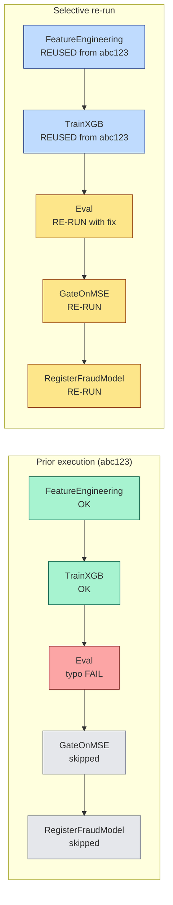
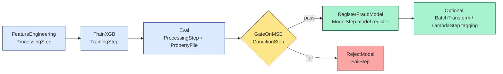
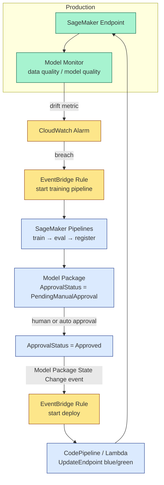

# Chapter 43 — SageMaker Pipelines: Step Types, Parameters, Conditions

> **Goal of this chapter:** to make you fluent in the single most-tested topic on Domain 3 of the MLA-C01 — SageMaker Pipelines — so that whenever the exam shows you a paragraph about "train → evaluate → conditionally register," your eyes find the correct answer before your conscious brain has finished reading. Roughly one in five Domain 3 questions on this exam reduces to either *"which step type wraps this API?"* or *"Pipelines vs Step Functions vs MWAA — which fits this scenario?"* This chapter is the long-form reference for both. By the end you will be able to (a) recite the fifteen step types and which SageMaker API each wraps, (b) write the canonical four-step `process → train → evaluate → conditional-register` pipeline from memory, (c) explain why `PipelineSession` exists and what breaks without it, and (d) decide — without hand-waving — when Pipelines is the right orchestrator and when you should reach for Step Functions instead.

---

## 43.1 The DAG that survives the on-call rotation

It is 2 a.m. on a Sunday, and the fraud team's retraining pipeline has failed. The pager has reached you. You log into the SageMaker Studio console, click into the failed execution, and see the familiar shape: a green `FeatureEngineering` node, a green `TrainXGB` node, a red `Eval` node with the cursor of a SageMaker Processing job log waiting for your gaze, a yellow `GateOnMSE` waiting in `Suspended`, and a still-pending `RegisterFraudModel` and `RejectModel` further down. The model didn't make it to production because, by design, it shouldn't have — yesterday's data shipped with a duplicated batch of edge transactions, training amplified the duplicates into a biased decision boundary, evaluation caught the resulting MSE breach, and the `ConditionStep` correctly routed to the `FailStep`. The pipeline did its job. You re-run only the failed downstream steps from a fixed input dataset, file a Jira ticket against the upstream feed, and go back to bed.

The five paragraphs you just read describe the *only* orchestrator on AWS that you can configure to behave this way without writing your own retry loop, your own metric extractor, your own audit log, or your own approval workflow. SageMaker Pipelines is **the AWS-native ML orchestrator** — it is the one that wires you into the Model Registry, Lineage Tracking, Studio's DAG view, and EventBridge events *for free*, and it is the one the exam considers the "default" answer when the workflow is mostly SageMaker-shaped. It is also the one with the smallest blast radius when it fails, because every step is a SageMaker job (Processing, Training, Transform), every job emits to CloudWatch Logs under the standard `/aws/sagemaker/...` path, and every job's lineage is queryable after the fact.

This chapter is structured as a long walk through the pieces of that DAG. We begin with the `Pipeline` object itself and how the DAG is built (§43.2). We then walk all fifteen step types in turn (§43.3), with one-line purpose statements and pointers to when you would actually use each. Sections §43.4 through §43.10 cover the *plumbing* — parameters vs execution variables, property files and `JsonGet`, caching, selective execution, parallelism, retries, and triggers. Sections §43.11 through §43.13 turn outward — the canonical end-to-end example, the Rapid7 case study, the Pipelines + Model Registry + EventBridge CT/CD loop, and how to decide between Pipelines and Step Functions when the question gets ambiguous. We close with fifteen exam traps (§43.14) and a set of exercises that mirror the kinds of scenarios the real test will throw at you (§43.15).

If you skim only one section before the exam, make it §43.3 (the step taxonomy) followed by §43.14 (the traps). Everything else is the reasoning that lets those two sections stick.

---

## 43.2 Pipeline structure: the DAG model

### 43.2.1 The `Pipeline` object

A SageMaker Pipeline is, at its core, a **JSON document** describing a directed acyclic graph of steps. You author the document in Python using the SageMaker Python SDK, the SDK compiles your Python to JSON at `pipeline.upsert()` time, and the JSON is what SageMaker actually stores and executes. The Python is convenient sugar; the JSON is the truth.

The top-level object is the `Pipeline`:

```python
from sagemaker.workflow.pipeline import Pipeline
from sagemaker.workflow.pipeline_context import PipelineSession

pipeline = Pipeline(
    name="fraud-training-pipeline",          # 1-256 chars, unique per account+region
    parameters=[p_input_data, p_threshold],  # runtime-overridable inputs (§43.4)
    steps=[step_process, step_train,
           step_eval, step_cond],            # the top-level step list
    sagemaker_session=PipelineSession(),     # MUST be PipelineSession, not Session (§43.3.0)
)

pipeline.upsert(role_arn=role)               # create or update the JSON definition
execution = pipeline.start(parameters={"InputData": "s3://..."})  # kick off a run
```

The key fields are:

- **`name`** — globally unique within the AWS account + region. Becomes part of the pipeline ARN: `arn:aws:sagemaker:<region>:<acct>:pipeline/<name>`.
- **`parameters`** — a list of `Parameter*` objects (string/integer/float/boolean). These are the user-overridable knobs. They are documented in §43.4.
- **`steps`** — the *top-level* steps. The DAG is **inferred** from the data dependencies between them (next subsection). Child steps inside a `ConditionStep`'s `if_steps` / `else_steps` are *not* repeated in this list.
- **`sagemaker_session`** — a `PipelineSession`, not a regular `Session`. This is the single most-missed setup detail and is its own subsection below.

### 43.2.2 Pipeline definition JSON

When you call `pipeline.definition()` or `pipeline.upsert()`, the SDK serializes your Python to a JSON document. The shape:

```json
{
  "Version": "2020-12-01",
  "Metadata": {},
  "Parameters": [
    {"Name": "InputData",    "Type": "String", "DefaultValue": "s3://bucket/raw/"},
    {"Name": "MSEThreshold", "Type": "Float",  "DefaultValue": 6.0}
  ],
  "PipelineExperimentConfig": {
    "ExperimentName": "fraud-experiment",
    "TrialName": {"Get": "Execution.PipelineExecutionId"}
  },
  "Steps": [
    {"Name": "FeatureEngineering", "Type": "Processing", "Arguments": {...}},
    {"Name": "TrainModel",         "Type": "Training",   "Arguments": {...}},
    {"Name": "Eval",               "Type": "Processing", "Arguments": {...}, "PropertyFiles": [...]},
    {"Name": "GateOnMSE",          "Type": "Condition",  "Arguments": {...}}
  ]
}
```

Two numbers about this JSON document worth memorizing: **the definition is capped at 1 MB** (a typical 20-step pipeline lands at 100–300 KB, so most teams never hit this), and **definitions are versioned** — every `pipeline.upsert()` creates a new version with a monotonic ID you can roll back to.

### 43.2.3 How the DAG is built — data vs custom dependencies

SageMaker discovers the edges of your DAG in one of two ways.

**Data dependency (the preferred way).** When step B references step A's *properties*, the SDK records the reference as a placeholder in the JSON and adds an A→B edge to the graph. Example:

```python
train_input = TrainingInput(
    s3_data=step_process.properties.ProcessingOutputConfig
              .Outputs["train"].S3Output.S3Uri
)
```

That `step_process.properties.…` expression isn't a real string at build time — it serializes as `{"Get": "Steps.FeatureEngineering.ProcessingOutputConfig.Outputs[train].S3Output.S3Uri"}` in the JSON, and at runtime SageMaker resolves it by reading the `DescribeProcessingJob` response of the upstream step. This is the "natural" way to express dependencies and the one you should use whenever step B genuinely consumes step A's output.

**Custom dependency (`add_depends_on` or `depends_on=`).** When step B does *not* consume step A's outputs but you still want B to wait for A, you declare the dependency explicitly:

```python
training_step.add_depends_on([processing_step_2])
# or via constructor:
training_step = TrainingStep(..., depends_on=[processing_step_1, processing_step_2])
```

A typical use is wiring a "smoke test" or "metadata tagging" step that doesn't consume training's output but still must wait for training to finish. SageMaker validates the resulting graph at `pipeline.upsert()` time; **cycles raise a validation exception** before the JSON is stored.

### 43.2.4 PipelineSession vs Session — the trap

A regular `sagemaker.Session` executes API calls **immediately**. So if you write `estimator.fit({"train": ...})` with a default `Session()`, SageMaker actually starts a training job the moment you call `fit`. This is correct for ad-hoc notebooks and wrong for pipeline definitions — you wanted `fit()` to return *step arguments* that the `TrainingStep` would later use, not to run a job at definition time.

`PipelineSession` solves this by **deferring execution**. Every "would normally start a job" call (`processor.run`, `estimator.fit`, `tuner.fit`, `transformer.transform`, `model.create`, `model.register`) returns a dictionary of step args instead of starting work:

```python
from sagemaker.workflow.pipeline_context import PipelineSession

pipeline_session = PipelineSession()

xgb = XGBoost(..., sagemaker_session=pipeline_session)
step_args = xgb.fit({...})                       # returns a dict, doesn't run a job
step_train = TrainingStep(name="Train", step_args=step_args)
```

Without `PipelineSession`, the `fit(...)` call starts a real training job at definition time *and* the `TrainingStep` still tries to start one at execution time — you pay for two jobs, the pipeline definition references a job that already finished, and your reproducibility story collapses.

> ⚠️ **Exam alert.** If a question shows code that constructs an `Estimator` or `Processor` with the default `sagemaker_session=Session()` (or no session at all) and then uses it inside a `TrainingStep` or `ProcessingStep`, the code is wrong. The fix is `sagemaker_session=PipelineSession()`. Whenever the question's stem says "the pipeline ran twice — once at definition, once at execution," your eyes should snap to the session type in the snippet.

A third option, **`LocalPipelineSession`**, runs the whole pipeline locally inside Docker containers on your dev machine — no AWS resources spun up. Most step types support local mode; the exceptions are `TuningStep`, `AutoMLStep`, `NotebookJobStep`, the EMR steps, and `ClarifyCheckStep` with model-bias configs. Use `LocalPipelineSession` for "did I break the definition?" sanity checks before you `upsert` to the real service.

---

## 43.3 The complete step taxonomy

This is the section to memorize cold. Every step type maps to one or more SageMaker APIs; knowing which step wraps which API answers a surprising number of exam questions. The table below is the one to internalize:

| # | Step type      | SDK class             | Wraps API                                                                |
|---|----------------|-----------------------|---------------------------------------------------------------------------|
| 1 | Processing     | `ProcessingStep`      | `CreateProcessingJob`                                                     |
| 2 | Training       | `TrainingStep`        | `CreateTrainingJob`                                                       |
| 3 | Tuning         | `TuningStep`          | `CreateHyperParameterTuningJob`                                           |
| 4 | AutoML         | `AutoMLStep`          | `CreateAutoMLJobV2` (Ensembling mode only)                                |
| 5 | Model          | `ModelStep` (modern)  | `CreateModel` and/or `CreateModelPackage`                                 |
| 6 | Transform      | `TransformStep`       | `CreateTransformJob`                                                      |
| 7 | Condition      | `ConditionStep`       | Logical branch (no API)                                                   |
| 8 | Callback       | `CallbackStep`        | SQS + token (`SendPipelineExecutionStepSuccess` / `…StepFailure`)         |
| 9 | Lambda         | `LambdaStep`          | `Lambda.Invoke` (sync)                                                    |
| 10 | Clarify check  | `ClarifyCheckStep`    | Clarify Processing + drift compare                                        |
| 11 | Quality check  | `QualityCheckStep`    | Processing + drift compare                                                |
| 12 | EMR            | `EMRStep`             | `AddJobFlowSteps` on existing EMR cluster                                 |
| 13 | EMR Serverless | `EMRStep`/`EMRServerlessStep` | `StartJobRun` on EMR Serverless application                       |
| 14 | Notebook job   | `NotebookJobStep`     | `CreateTrainingJob` with notebook-job image                               |
| 15 | Fail           | `FailStep`            | Logical terminal (no API)                                                 |

Plus two **modern authoring styles** that emit one of the above rather than being their own step class:

- The **`@step` decorator** (Nov 2023) — lifts a Python function into a step that runs as a Training job.
- The **Execute Code step** (Studio Pipeline Designer, GA 2024) — the drag-and-drop equivalent of `@step`.

The remainder of this section walks each step type with the one-line purpose, a representative SDK snippet, and the situations in which you would actually pick it.

### 43.3.1 ProcessingStep — `CreateProcessingJob`

**Purpose:** run any containerized code that isn't strictly "train a model." Feature engineering, validation, model evaluation, custom drift checks, batch ETL — anywhere you'd reach for a SageMaker Processing job, `ProcessingStep` is the wrapper.

The same `ProcessingStep` JSON is emitted regardless of which processor class you use; the processor classes just preconfigure the container image:

| Processor                | Container          | Typical use                                                                |
|--------------------------|--------------------|----------------------------------------------------------------------------|
| `SKLearnProcessor`       | scikit-learn DLC   | Generic Python ETL, simple model evaluation                                |
| `PySparkProcessor`       | PySpark DLC        | Big-data feature engineering                                               |
| `SparkJarProcessor`      | Spark + JVM DLC    | JVM Spark jobs                                                             |
| `ScriptProcessor`        | BYO image          | Run a `.py` / `.sh` inside any container                                   |
| `Processor`              | BYO image          | Run the container's entrypoint as-is                                       |
| `FrameworkProcessor`     | PyTorch/TF/HF DLC  | Run heavy preprocessing in the *same* framework as training                |

Each Processing job has typed inputs and outputs that map S3 prefixes to in-container paths:

```python
sklearn_proc = SKLearnProcessor(
    framework_version="1.2-1", role=role,
    instance_type="ml.m5.xlarge", instance_count=1,
    sagemaker_session=PipelineSession(),
)

step_args = sklearn_proc.run(
    code="preprocess.py",
    inputs=[ProcessingInput(source=p_input_data, destination="/opt/ml/processing/input")],
    outputs=[
        ProcessingOutput(output_name="train",       source="/opt/ml/processing/train"),
        ProcessingOutput(output_name="test",        source="/opt/ml/processing/test"),
        ProcessingOutput(output_name="evaluation",  source="/opt/ml/processing/evaluation"),
    ],
    arguments=["--train-test-split-ratio", "0.2"],
)

step_process = ProcessingStep(
    name="FeatureEngineering",
    step_args=step_args,
    cache_config=CacheConfig(enable_caching=True, expire_after="P30D"),
)
```

Downstream steps reach into `step_process.properties` to consume outputs:

```python
step_process.properties.ProcessingOutputConfig.Outputs["train"].S3Output.S3Uri
step_process.properties.ProcessingJobName
step_process.properties.ProcessingJobStatus
```

### 43.3.2 TrainingStep — `CreateTrainingJob`

**Purpose:** train a model. Driven by a SageMaker `Estimator` — built-in (`XGBoost`, `LinearLearner`, `DeepAR`, …), framework (`PyTorch`, `TensorFlow`, `SKLearn`, `HuggingFace`), the generic `Estimator` for BYO, or `JumpStartEstimator` for a JumpStart-derived recipe.

```python
xgb = XGBoost(
    entry_point="train.py", framework_version="1.7-1", role=role,
    instance_type="ml.m5.4xlarge", instance_count=1,
    use_spot_instances=True, max_wait=7200, max_run=3600,
    hyperparameters={"objective": "binary:logistic", "eta": 0.1, "max_depth": 6},
    sagemaker_session=PipelineSession(),
)

step_train = TrainingStep(
    name="TrainXGB",
    step_args=xgb.fit({
        "train":      TrainingInput(s3_data=step_process.properties.ProcessingOutputConfig.Outputs["train"].S3Output.S3Uri),
        "validation": TrainingInput(s3_data=step_process.properties.ProcessingOutputConfig.Outputs["test"].S3Output.S3Uri),
    }),
    cache_config=CacheConfig(enable_caching=True, expire_after="P7D"),
)
```

Useful properties:

- `step_train.properties.ModelArtifacts.S3ModelArtifacts` — S3 URI of `model.tar.gz`.
- `step_train.properties.TrainingJobName`, `TrainingJobStatus`.
- `step_train.properties.FinalMetricDataList[0].Value` — last logged value of the named metric (e.g., `validation:auc`).

**Spot training** is fully supported. When the exam pairs cost optimization with a `TrainingStep`, the answer is almost always `use_spot_instances=True` with `max_wait`.

### 43.3.3 TuningStep — `CreateHyperParameterTuningJob`

**Purpose:** run SageMaker Automatic Model Tuning (AMT) — Bayesian / Random / Grid / Hyperband — as one node of the pipeline. The step is a single node from the DAG's perspective; underneath, the tuning job spawns up to `max_jobs` trial training jobs.

```python
tuner = HyperparameterTuner(
    estimator=xgb,
    objective_metric_name="validation:auc", objective_type="Maximize",
    hyperparameter_ranges={
        "eta":       ContinuousParameter(0.01, 0.3),
        "max_depth": IntegerParameter(3, 10),
    },
    max_jobs=20, max_parallel_jobs=4, strategy="Bayesian",
)

step_tune = TuningStep(name="TuneXGB", step_args=tuner.fit({"train": ..., "validation": ...}))
best_uri  = step_tune.get_top_model_s3_uri(top_k=0, s3_bucket="my-models")
```

`max_parallel_jobs` is the tuning-job-internal concurrency knob; it is *not* the same as `ParallelismConfiguration`, which caps concurrent *pipeline steps* and has no effect on the tuning job's internal trial parallelism.

### 43.3.4 AutoMLStep — `CreateAutoMLJobV2`

**Purpose:** run SageMaker Autopilot inside a pipeline. Autopilot has two training modes — `ENSEMBLING` (H2O-based stack of GBMs, linear models, neural nets) and `HYPERPARAMETER_TUNING` (the older Bayesian path). **Only `ENSEMBLING` is allowed inside a pipeline.** This is a top-three exam trap.

```python
from sagemaker.automl.automlv2 import AutoMLV2, AutoMLDataChannel, AutoMLTabularConfig
from sagemaker.workflow.automl_step import AutoMLStep

automl = AutoMLV2(
    problem_config=AutoMLTabularConfig(
        target_attribute_name="fraud", mode="ENSEMBLING", max_candidates=50,
    ),
    role=role, sagemaker_session=PipelineSession(),
)
step_args = automl.fit(inputs=[AutoMLDataChannel(s3_data=p_input_data, channel_type="training")])
step_automl = AutoMLStep(name="AutopilotEnsemble", step_args=step_args)

best_model = step_automl.get_best_auto_ml_model(role=role)
```

The canonical pattern is `AutoMLStep → ConditionStep (gate on metric) → ModelStep (register the winner)`.

> ⚠️ **Exam alert.** When you see "use Autopilot inside a SageMaker Pipeline" in a question, the answer assumes Ensembling mode. If a wrong distractor sets `mode="HYPERPARAMETER_TUNING"` inside an `AutoMLStep`, that's the bait — pipelines don't support HPO-mode Autopilot. (Outside of a pipeline, HPO mode is allowed.)

### 43.3.5 ModelStep — the modern replacement for `CreateModelStep` + `RegisterModel`

`ModelStep` was introduced in SageMaker Python SDK **v2.90.0 (mid-2022)** and consolidates two previously-separate legacy steps:

- The legacy `CreateModelStep` wrapped `CreateModel` and produced a deployable `Model` resource.
- The legacy `RegisterModel` wrapped `CreateModelPackage` and registered a versioned package in the Model Registry.

`ModelStep` does **both** based on the method you call on the `Model`:

```python
from sagemaker.model import Model
from sagemaker.workflow.model_step import ModelStep

model = Model(
    image_uri=xgb.training_image_uri(),
    model_data=step_train.properties.ModelArtifacts.S3ModelArtifacts,
    role=role, sagemaker_session=PipelineSession(),
)

# Pattern A — produce a deployable Model resource:
step_create = ModelStep(name="CreateFraudModel",
                       step_args=model.create(instance_type="ml.m5.xlarge"))

# Pattern B — register a versioned ModelPackage in the Registry:
step_register = ModelStep(
    name="RegisterFraudModel",
    step_args=model.register(
        content_types=["application/json"], response_types=["application/json"],
        inference_instances=["ml.t2.medium", "ml.m5.xlarge"],
        transform_instances=["ml.m5.xlarge"],
        model_package_group_name="fraud-detector",
        approval_status="PendingManualApproval",  # or "Approved" to auto-deploy
        model_metrics=model_metrics, drift_check_baselines=baselines,
    ),
)
```

> ⚠️ **Exam alert.** When a question shows both `RegisterModel(...)` and `ModelStep(step_args=model.register(...))` as answer choices, prefer `ModelStep`. The legacy classes still appear in older docs and Skill Builder labs, but the modern answer since SDK 2.90 is `ModelStep`. The same rule holds for `CreateModelStep` vs `ModelStep(step_args=model.create(...))`.

A subtlety: a single `ModelStep` may compile to *several* underlying steps (typically `Repack` + `Create` + `Register`). In Studio's DAG view you'll see these as sub-steps under the parent `ModelStep` name. The pipeline JSON shows them as separate nodes; the SDK abstracts that away.

When `model.register(...)` runs, SageMaker emits an **EventBridge event** of type `SageMaker Model Package State Change` whenever the package's approval status transitions. This is how downstream deploy pipelines fire — see §43.13.

### 43.3.6 TransformStep — `CreateTransformJob`

**Purpose:** run SageMaker Batch Transform (offline inference). Used to score a holdout set after training, or to generate large batch predictions in a production schedule.

```python
transformer = Transformer(
    model_name=step_create.properties.ModelName,
    instance_count=1, instance_type="ml.m5.xlarge",
    output_path="s3://bucket/predictions/",
    sagemaker_session=PipelineSession(),
)

step_transform = TransformStep(
    name="BatchScore",
    step_args=transformer.transform(data=p_input_data, content_type="text/csv", split_type="Line"),
)
```

### 43.3.7 ConditionStep — branching (no loops, only branches)

The DAG's `if/else`. SageMaker Pipelines has **no loops** — any "while" behaviour you need has to be expressed via repeated `pipeline.start()` calls or via Selective Execution (§43.7). The condition itself is built from one or more comparison primitives:

| Class                            | Test                                    |
|----------------------------------|-----------------------------------------|
| `ConditionEquals`                | `left == right`                         |
| `ConditionGreaterThan`           | `left > right`                          |
| `ConditionGreaterThanOrEqualTo`  | `left >= right`                         |
| `ConditionLessThan`              | `left < right`                          |
| `ConditionLessThanOrEqualTo`     | `left <= right`                         |
| `ConditionIn`                    | `left in [v1, v2, …]`                   |
| `ConditionNot`                   | inverse of a contained condition        |
| `ConditionOr`                    | logical OR of contained conditions      |

The `left` argument can be a `Parameter*`, a `JsonGet` from a property file (§43.6), a step property (e.g., `step_train.properties.FinalMetricDataList[0].Value`), an `ExecutionVariable`, or a constant. The `right` argument is whatever it's being compared against.

```python
mse_ok = ConditionLessThanOrEqualTo(
    left=JsonGet(step_name=step_eval.name, property_file=eval_report,
                 json_path="regression_metrics.mse.value"),
    right=p_threshold,
)
auc_ok = ConditionGreaterThanOrEqualTo(
    left=JsonGet(step_name=step_eval.name, property_file=eval_report,
                 json_path="binary_classification_metrics.auc.value"),
    right=0.85,
)

step_cond = ConditionStep(
    name="GateOnQuality",
    conditions=[mse_ok, auc_ok],          # AND across the list
    if_steps=[step_register, step_transform],
    else_steps=[step_fail],
)
```

Three restrictions live in your bones for the exam:

1. **A `ConditionStep` cannot contain another `ConditionStep`.** You can't nest the if/else. AND / OR within a single condition is expressed with the operator classes above (passing a list to `conditions=[...]` is implicit AND; `ConditionOr(...)` is explicit OR).
2. **The same step cannot appear in both `if_steps` and `else_steps`.** If you need "logically the same" work in both branches, duplicate the step with a different `name`.
3. **The branches are sub-graphs.** Each of `if_steps` and `else_steps` is a list of nodes with their own data dependencies; the whole sub-graph runs (or doesn't) atomically.

> ⚠️ **Exam alert.** A multi-paragraph question that describes "if accuracy ≥ X, gate on bias too; else fail" is *not* asking you to nest `ConditionStep`s — it's asking you to put a second `ConditionStep` inside the `if_steps` of the first, which is illegal. The correct answer collapses the two checks into a single `ConditionStep` with both metrics in the `conditions=[]` list, or splits the gate across two sequential `ConditionStep`s where the first's pass branch points at a `ConditionStep` *that lives at the top level of the pipeline*. There is no legal way to write `ConditionStep` inside `ConditionStep`'s branches.

### 43.3.8 CallbackStep — async escape hatch

When SageMaker doesn't natively integrate with the system you need, `CallbackStep` lets you **pause the pipeline indefinitely** while an external system does work, and resume on a token.

```python
from sagemaker.workflow.callback_step import CallbackStep, CallbackOutput, CallbackOutputTypeEnum

step_callback = CallbackStep(
    name="ExternalGate",
    sqs_queue_url="https://sqs.us-east-1.amazonaws.com/111122223333/MyQueue",
    inputs={"prefix": "s3://bucket/data/",
            "exec_id": ExecutionVariables.PIPELINE_EXECUTION_ID},
    outputs=[
        CallbackOutput(output_name="result_uri", output_type=CallbackOutputTypeEnum.String),
        CallbackOutput(output_name="row_count",  output_type=CallbackOutputTypeEnum.Integer),
    ],
)
```

The flow: SageMaker drops a message on your SQS queue with a token, the step transitions to `Executing` and waits, your external worker reads the message and does the work, then the worker calls `SendPipelineExecutionStepSuccess(CallbackToken=..., OutputParameters=[...])` (or `…Failure(..., FailureReason=...)`). SageMaker resumes the DAG.

Use cases:

- Wait for human approval in a homegrown ticketing system.
- Trigger a Glue Crawler / third-party DQ tool and wait for completion.
- Run a job on Argo / Kubeflow / Jenkins on-prem.
- Run an EMR job with a Spark config that `EMRStep` can't express.

By default the step has no timeout (it waits forever). Set one via `step_timeout` per step, or `default_step_timeout` at the pipeline level.

### 43.3.9 LambdaStep — sync, short-lived helper

Synchronously invoke a Lambda function. Use for cheap operations that fit in Lambda's budget.

```python
from sagemaker.workflow.lambda_step import LambdaStep, LambdaOutput, LambdaOutputTypeEnum
from sagemaker.lambda_helper import Lambda

func = Lambda(function_arn="arn:aws:lambda:us-east-1:111122223333:function:tag-model")

step_lambda = LambdaStep(
    name="TagModel", lambda_func=func,
    inputs={"model_arn": step_register.properties.ModelPackageArn},
    outputs=[LambdaOutput(output_name="tag_id", output_type=LambdaOutputTypeEnum.String)],
)
```

Constraints:

- **15-minute hard timeout** (Lambda's own limit).
- Output must be JSON-serializable, ≤6 MB (Lambda payload limit).
- Synchronous — the pipeline blocks on the Lambda's return.

`LambdaStep` vs `CallbackStep` in one table:

| Dimension      | LambdaStep                              | CallbackStep                                       |
|----------------|------------------------------------------|----------------------------------------------------|
| Trigger model  | Synchronous `Invoke`                     | Async SQS + token                                  |
| Max duration   | 15 min                                   | Unbounded                                          |
| Cost           | Lambda exec + GB-s                       | SQS + your worker                                  |
| Use for        | Quick tagging, validation, notifications | Long external jobs, human gates, on-prem hops      |

### 43.3.10 ClarifyCheckStep — bias / explainability gating

Run a SageMaker Clarify processing job and compare results to a baseline. Used to enforce fairness or explainability SLAs before promoting a model.

```python
step_clarify = ClarifyCheckStep(
    name="CheckDataBias",
    clarify_check_config=DataBiasCheckConfig(
        data_config=DataConfig(
            s3_data_input_path=step_process.properties.ProcessingOutputConfig.Outputs["train"].S3Output.S3Uri,
            s3_output_path="s3://bucket/clarify/data-bias/",
            label="fraud", dataset_type="text/csv",
        ),
        data_bias_config=BiasConfig(
            label_values_or_threshold=[1],
            facet_name="gender", facet_values_or_threshold=[0],
            group_name="age_group",
        ),
    ),
    check_job_config=CheckJobConfig(role=role, instance_count=1, instance_type="ml.m5.xlarge"),
    skip_check=False, register_new_baseline=False,
    model_package_group_name="fraud-detector",
)
```

Three config classes correspond to the three Clarify modes: `DataBiasCheckConfig` (pre-training dataset bias), `ModelBiasCheckConfig` (post-training model bias), and `ModelExplainabilityCheckConfig` (SHAP feature-attribution drift). Two boolean knobs:

- `skip_check` — if `True`, run the check but **don't fail** the pipeline. Useful for first runs where you're logging baselines.
- `register_new_baseline` — if `True`, write the computed metrics back to the registry as the new baseline. Use when intentional drift is approved.

### 43.3.11 QualityCheckStep — data quality / model quality gating

Same shape as `ClarifyCheckStep` but for non-bias metrics:

- `DataQualityCheckConfig` — statistical drift on features (mean, std, count, missing, distribution distance).
- `ModelQualityCheckConfig` — accuracy / F1 / AUC drift between baseline and current scores.

Together with `ClarifyCheckStep`, these are SageMaker's **in-pipeline guardrails** — the same kinds of checks Model Monitor does in production, applied during retraining before promotion.

### 43.3.12 EMRStep — submit step to an existing EMR cluster

Submits a step (`AddJobFlowSteps`) to a **long-running** EMR cluster you've already provisioned.

```python
step_emr = EMRStep(
    name="SparkFeatures", cluster_id="j-1ABC2DEF3GH4I",
    display_name="Spark Feature Engineering",
    step_config=EMRStepConfig(
        jar="command-runner.jar",
        args=["spark-submit", "--deploy-mode", "cluster",
              "s3://bucket/code/features.py", "--input", p_input_data],
    ),
)
```

**When to use:** the org already runs a 24/7 EMR cluster (often shared with BI) and you want to leverage it rather than spin up your own.

### 43.3.13 EMRServerlessStep — EMR Serverless application (2023)

The newer cousin: submits a job run to an **EMR Serverless application** — no cluster to keep alive, pay only for the job's duration.

```python
step_emr_sl = EMRStep(
    name="SparkFeaturesServerless", cluster_id=None,
    execution_role_arn="arn:aws:iam::...:role/EMRServerlessExecutionRole",
    emr_serverless_job_run_config={
        "ApplicationId": "00abcdef1234567890",
        "Name": "feature-engineering",
        "JobDriver": {"SparkSubmit": {
            "EntryPoint": "s3://bucket/code/features.py",
            "EntryPointArguments": ["--input", "s3://bucket/raw/"],
            "SparkSubmitParameters": "--conf spark.executor.cores=4",
        }},
    },
)
```

Exam framing: "Spark inside our pipeline but we don't want to manage cluster lifecycle" → EMR Serverless. "We have an existing prod cluster shared with the BI team" → `EMRStep` with `cluster_id`.

### 43.3.14 NotebookJobStep — run a notebook as a step (2024)

Lifts a Jupyter notebook into a pipeline step. Under the hood it's a Training job running on a notebook-job container that executes the notebook with Papermill-style parameter injection.

```python
step_notebook = NotebookJobStep(
    name="AdhocAnalysis", notebook_job_name="weekly-analysis",
    input_notebook="s3://bucket/notebooks/analysis.ipynb",
    image_uri="public.ecr.aws/sagemaker/notebook-jobs:latest",
    kernel_name="python3",
    parameters={"date": ExecutionVariables.START_DATETIME, "input_uri": p_input_data},
    instance_type="ml.m5.xlarge", role=role,
    s3_root_uri="s3://bucket/notebook-output/",
)
```

**Use case:** your data scientists keep ad-hoc EDA / reporting in `.ipynb` files and don't want to refactor into `.py` scripts. `NotebookJobStep` is the bridge.

### 43.3.15 FailStep — explicit termination

Marks the pipeline execution as `Failed` with a custom error message. Almost always the `else_steps` of a quality gate:

```python
step_fail = FailStep(
    name="FailGate",
    error_message="Validation MSE exceeded 6.0 threshold; model rejected.",
)
```

Without a `FailStep`, an empty `else_steps=[]` branch would silently succeed — the pipeline would end green even though the gate "failed." `FailStep` makes rejection explicit and observable in the execution history. Auditors care.

### 43.3.16 The `@step` decorator (Nov 2023) — lift-and-shift Python

`@step` converts a Python function into a pipeline step with no explicit step class. Under the hood the function runs as a SageMaker Training job (pickled state + a SageMaker container).

```python
from sagemaker.workflow.function_step import step

@step(instance_type="ml.m5.xlarge", role=role,
      dependencies="requirements.txt",
      pre_execution_commands=["pip install scikit-learn==1.2.2"])
def preprocess(s3_in: str) -> str:
    import pandas as pd
    df = pd.read_csv(s3_in).dropna()
    out = "s3://bucket/clean/data.csv"
    df.to_csv(out, index=False)
    return out

@step(instance_type="ml.m5.large")
def evaluate(model_uri: str, test_uri: str) -> float:
    # … compute MSE …
    return mse

clean_uri = preprocess("s3://bucket/raw/data.csv")
mse_value = evaluate("s3://bucket/models/model.tar.gz", clean_uri)

pipeline = Pipeline(name="@step-pipe", steps=[mse_value])
# SageMaker walks the call graph and builds the DAG.
```

Dependency detection works by inspecting the *call graph*: when you pass the return value of one `@step` function as an argument to another, the SDK records a data-dependency edge. The DAG is built from this graph at `pipeline.upsert()` time. You never see the JSON yourself.

**Limitations:**

- No support for non-Python state (Spark sessions, JVM objects).
- Pickled closures cannot capture unpicklable objects (file handles, threading locks).
- The function runs as a Training job — for native Processing-job semantics (multi-instance distributed processing), use `ProcessingStep`.
- Step types `@step` can't emit (Tuning, Transform, Condition, Lambda, Callback, EMR, Clarify, Quality) still require their class-based forms.

When to use `@step` vs class-based steps:

| Use class-based steps when                                       | Use `@step` when                                                  |
|------------------------------------------------------------------|-------------------------------------------------------------------|
| You need explicit control over the API (image_uri, channels)     | You're prototyping with mostly Python and simple inputs/outputs   |
| You need step types `@step` can't emit                           | You want minimal boilerplate                                      |
| You're using Studio's drag-and-drop Pipeline Designer            | You're writing pipelines in plain Python files in Git             |
| You need to share step definitions across pipelines              | One-shot pipelines tied to a single project                       |

### 43.3.17 Execute Code step (Studio Pipeline Designer, 2024 GA)

The Studio Pipeline Designer (drag-and-drop UI, GA in 2024) exposes an **"Execute code"** step that takes a Python file, notebook, or folder, uploads it to S3, and runs it as a Training job. It's the visual-editor counterpart of `@step`. Use the designer when your team has non-coders authoring pipelines or you want a visual artifact in a code review. Use raw SDK when you want PRs and Git history on the pipeline definition.

---

## 43.4 Pipeline Parameters

Pipeline Parameters are the **user-overridable inputs** to a pipeline. They are declared at definition time with a default value, and overridden at `pipeline.start(parameters={...})` time.

### 43.4.1 The four types

```python
from sagemaker.workflow.parameters import (
    ParameterString, ParameterInteger, ParameterFloat, ParameterBoolean
)

p_input_data   = ParameterString(name="InputData",      default_value="s3://bucket/raw/")
p_instance_cnt = ParameterInteger(name="InstanceCount", default_value=1)
p_threshold    = ParameterFloat(name="MSEThreshold",    default_value=6.0)
p_register     = ParameterBoolean(name="RegisterModel", default_value=True)
```

All four accept `default_value=None`, in which case the parameter is required at start time. Type is enforced — passing `"foo"` for a `ParameterInteger` raises a validation error at `pipeline.start()`. `ParameterBoolean` was added in SDK v2.94 (2022); older docs may not show it.

Every parameter referenced in step definitions **must** appear in the `parameters=` list of the `Pipeline` object. SageMaker validates this at `upsert` time and rejects pipelines with undeclared references.

### 43.4.2 Overriding at execution time

```python
execution = pipeline.start(
    parameters={
        "InputData":     "s3://bucket/raw-2026-05-27/",
        "InstanceCount": 2,
        "MSEThreshold":  5.5,
        "RegisterModel": False,
    },
    execution_display_name="manual-rerun-may27",
    execution_description="Reduced threshold for tighter gating",
)
```

Any parameter not in the dict uses its default. The override is per-execution; the pipeline's stored defaults are untouched.

### 43.4.3 Where parameters can be used

Parameters can appear anywhere a string / number / bool is expected in a step argument:

```python
ProcessingInput(source=p_input_data, destination="/opt/ml/processing/input")     # Processing input source
xgb = XGBoost(instance_count=p_instance_cnt, ...)                                # Estimator instance count
ConditionLessThanOrEqualTo(left=JsonGet(...), right=p_threshold)                 # Condition right-hand side
output_path = Join(on="/", values=["s3://bucket/runs", p_input_data, "out"])     # String concat via Join
```

What you **cannot** parameterize:

- Parameters cannot be used as *keys* (only as values).
- Parameters cannot replace structural elements (you can't make the step *type* itself a parameter).
- Parameter values are resolved at execution start; you can't change them mid-execution.
- Some nested step fields don't accept `PipelineVariable` (image URIs in certain places, certain network configs). The SDK flags this at definition build time with a serialization error.

### 43.4.4 The dev/staging/prod parameterization pattern

Production-grade pipelines almost always parameterize:

- `ProcessingInstanceType`, `TrainingInstanceType` — cheaper instances in dev.
- `InputDataUri`, `ModelOutputUri` — swap S3 buckets per environment.
- `ModelApprovalStatus` — `"Approved"` in dev (auto-promote), `"PendingManualApproval"` in staging/prod (manual gate).
- `Environment` — `"dev" | "staging" | "prod"` as a `ParameterString`.
- `ModelPackageGroupName` — typically `f"{project}-{env}"`.
- `AccuracyThreshold` — tightened in higher environments.

The CI workflow (CircleCI, GitHub Actions, Jenkins, GitLab) checks out one pipeline definition, then runs three jobs:

```
build-and-run-pipeline-dev    (parameters: env=dev,    instance=ml.m5.xlarge,    threshold=0.70)
build-and-run-pipeline-stage  (parameters: env=stage,  instance=ml.m5.4xlarge,   threshold=0.85)
build-and-run-pipeline-prod   (parameters: env=prod,   instance=ml.m5.12xlarge,  threshold=0.90)
```

Same JSON definition, three sets of parameters, three accounts. The pipeline definition is environment-agnostic; everything env-specific is a parameter.

---

## 43.5 ExecutionVariables — runtime-bound, SageMaker-provided

ExecutionVariables are **values SageMaker fills in at execution time**. You use them like parameters but you can't set them — SageMaker owns the values.

```python
from sagemaker.workflow.execution_variables import ExecutionVariables

ExecutionVariables.PIPELINE_EXECUTION_ID      # e.g. "abc-123-def-456"
ExecutionVariables.PIPELINE_EXECUTION_ARN     # full ARN
ExecutionVariables.PIPELINE_NAME              # e.g. "fraud-training-pipeline"
ExecutionVariables.PIPELINE_ARN               # ARN of the pipeline definition
ExecutionVariables.START_DATETIME             # ISO-8601 execution start time
ExecutionVariables.CURRENT_DATETIME           # ISO-8601 at variable resolution
ExecutionVariables.PIPELINE_VERSION_ARN       # specific definition version
ExecutionVariables.PIPELINE_VERSION_ID        # version number (1, 2, …)
ExecutionVariables.TRAINING_JOB_NAME          # inside a TrainingStep
ExecutionVariables.PROCESSING_JOB_NAME        # inside a ProcessingStep
```

**Canonical use: unique S3 paths per execution.**

```python
unique_out = Join(on="/", values=[
    "s3://bucket/runs", ExecutionVariables.PIPELINE_EXECUTION_ID, "processed",
])
ProcessingOutput(output_name="train", source="/opt/ml/processing/train", destination=unique_out)
```

Without this, two simultaneous runs of the same pipeline would write to the same prefix and trample each other.

The Parameter vs ExecutionVariable distinction is a common multiple-choice trap:

| Question                                       | Answer            |
|------------------------------------------------|-------------------|
| "Reasonably overridable per run"               | Parameter         |
| "Always the runtime identifier of the execution"| ExecutionVariable |
| "User-controlled"                              | Parameter         |
| "SageMaker-controlled"                         | ExecutionVariable |
| "Pass `$StartTime` or `$PipelineExecutionId` into a notebook step" | ExecutionVariable |

---

## 43.6 PropertyFile + JsonGet — passing values between steps

You can't `return foo` out of one pipeline step into another like a normal function. Two patterns connect them.

### 43.6.1 Step properties (for API-defined outputs)

Each step exposes a `.properties` attribute matching the underlying `Describe…Job` API response. The SDK records placeholder references; SageMaker resolves them at runtime.

```python
step_train.properties.ModelArtifacts.S3ModelArtifacts
step_process.properties.ProcessingOutputConfig.Outputs["train"].S3Output.S3Uri
step_tune.properties.BestTrainingJob.TrainingJobName
```

### 43.6.2 PropertyFile + JsonGet (for arbitrary JSON outputs you write)

When your step writes a JSON file (e.g., an evaluation report), declare it as a `PropertyFile` and read it with `JsonGet`.

```python
from sagemaker.workflow.properties import PropertyFile
from sagemaker.workflow.functions import JsonGet

# 1. Tell the Processing step where the JSON lives:
eval_report = PropertyFile(
    name="EvalReport",
    output_name="evaluation",   # must match a ProcessingOutput output_name
    path="evaluation.json",     # relative to that output's source dir
)

step_eval = ProcessingStep(name="Eval", property_files=[eval_report], step_args=...)

# 2. Inside evaluate.py, write:
#    /opt/ml/processing/evaluation/evaluation.json
#    {"regression_metrics": {"mse": {"value": 4.2, "std": 0.3}}}

# 3. Read it via JsonGet:
mse_value = JsonGet(step_name=step_eval.name, property_file=eval_report,
                   json_path="regression_metrics.mse.value")

# 4. Use in a condition or anywhere else a value is expected:
mse_ok = ConditionLessThanOrEqualTo(left=mse_value, right=p_threshold)
```

JsonGet limits to memorize:

- **Maximum property file size: 5 MB.**
- `json_path` is dotted notation (not JSONPath `$.foo.bar`).
- Both the `PropertyFile` and the `JsonGet` reference the same `step_name` + `property_file`.

---

## 43.7 Step caching — the cost-saver

Every step can opt into caching. A cache **hit** reuses the previous execution's output without re-running the step.

```python
from sagemaker.workflow.steps import CacheConfig

cache = CacheConfig(enable_caching=True, expire_after="P30D")   # ISO-8601

step_process = ProcessingStep(name="Prep",   cache_config=cache, step_args=...)
step_train   = TrainingStep(name="Train",    cache_config=cache, step_args=...)
```

**`expire_after` is ISO-8601 duration:**

| Spec    | Meaning   |
|---------|-----------|
| `PT12H` | 12 hours  |
| `P1D`   | 1 day     |
| `P7D`   | 7 days    |
| `P30D`  | 30 days   |
| `PT30M` | 30 minutes |

`P30D` is the most common value you'll see in real codebases — long enough to cover a sprint of iteration but short enough to invalidate stale baselines.

A cache hit requires identical step arguments: same image URI, same input S3 URIs (and same object ETags), same instance type and count, same hyperparameters and environment variables, same entry-point code (SHA-equivalent). Change anything — even adding whitespace to your training script that ends up hashing differently — and the cache misses.

**Cost impact:** during the iteration phase of a project (5–20 runs/day), caching cuts ProcessingStep + TrainingStep costs by 60–80%. It is the single most valuable cost knob for ML dev.

**Caching scope:** per-account, per-region — *not* per-pipeline. If two pipelines have an identical step (same args), they share the cache.

---

## 43.8 SelectiveExecution — re-run a subset

Selective Execution (GA June 2023) lets you point at a **prior pipeline execution ARN** and pick a subset of steps to re-run. The unselected steps don't run — SageMaker reads their outputs from the source execution and feeds them to the selected ones.

```python
from sagemaker.workflow.selective_execution_config import SelectiveExecutionConfig

cfg = SelectiveExecutionConfig(
    source_pipeline_execution_arn="arn:aws:sagemaker:us-east-1:111122223333:pipeline-execution/abc123",
    selected_steps=["TrainModel", "EvaluateModel", "GateOnMSE", "RegisterModel"],
)
pipeline.start(selective_execution_config=cfg)
```



**Use cases:**

- "Processing succeeded but training failed because of a typo. Fix and re-run training onward."
- "We changed the evaluation logic but the trained model is fine. Re-run eval + condition + register."
- "Tune the accuracy threshold from 0.85 to 0.82 without retraining."

**Constraints:**

- `selected_steps` must form a downstream-closed set: if you include step B, you must include all steps that depend on B.
- You can't select a step whose input came from a step that didn't complete successfully in the source execution.

**Caching vs SelectiveExecution — which wins?** Caching is *implicit*, signature-based. SelectiveExecution is *explicit*, execution-pointer-based. SelectiveExecution still works when caching is disabled, because you explicitly point at a prior execution. For "I changed something but want to skip prep," SelectiveExecution is more deterministic. For "I'm iterating on the script and re-running the whole thing," caching is cheaper to express.

---

## 43.9 ParallelismConfiguration

By default, steps with no data dependency run **concurrently** — if your DAG has three sibling Processing steps, all three start at once. `ParallelismConfiguration` caps that concurrency at the pipeline level:

```python
from sagemaker.workflow.parallelism_config import ParallelismConfiguration

pipeline.create(role_arn=role,
                parallelism_config=ParallelismConfiguration(max_parallel_execution_steps=5))

# Override at start time (start-time value wins):
pipeline.start(parallelism_config=ParallelismConfiguration(max_parallel_execution_steps=2))
```

Reasons to cap:

- Stay under account-level service quotas (training instance counts, processing TPS).
- Avoid hammering downstream services (a warming endpoint, a Postgres DB).
- Smooth cost — 10 concurrent `ml.p4d.24xlarge` jobs is a $100/hr cost spike.

`ParallelismConfiguration` caps concurrent *pipeline steps* — it has **no effect** on the internal trial parallelism inside a `TuningStep`, which is controlled by `max_parallel_jobs` on the `HyperparameterTuner`.

---

## 43.10 Retry policies

Each step can declare automatic retries on transient errors:

```python
from sagemaker.workflow.retry import (
    StepRetryPolicy, StepExceptionTypeEnum,
    SageMakerJobStepRetryPolicy, SageMakerJobExceptionTypeEnum,
)

step_train = TrainingStep(
    name="Train", step_args=...,
    retry_policies=[
        StepRetryPolicy(                              # step orchestration errors
            exception_types=[StepExceptionTypeEnum.SERVICE_FAULT,
                             StepExceptionTypeEnum.THROTTLING],
            backoff_rate=2.0, interval_seconds=30, max_attempts=3, expire_after_mins=60,
        ),
        SageMakerJobStepRetryPolicy(                  # job-internal errors
            exception_types=[SageMakerJobExceptionTypeEnum.INTERNAL_ERROR,
                             SageMakerJobExceptionTypeEnum.CAPACITY_ERROR],
            backoff_rate=2.0, interval_seconds=60, max_attempts=5, expire_after_mins=180,
        ),
    ],
)
```

- `StepExceptionTypeEnum.SERVICE_FAULT` / `THROTTLING` — SageMaker's orchestration layer hit an internal error or rate limit.
- `SageMakerJobExceptionTypeEnum.INTERNAL_ERROR` / `CAPACITY_ERROR` — the underlying Training / Processing / Transform job failed for an internal reason (capacity is the most common — instance type unavailable in the AZ).

Retry math: `interval_seconds * backoff_rate^attempt`, capped by `expire_after_mins`. With `interval=30, backoff=2.0` you get 30s, 60s, 120s, 240s.

---

## 43.11 Pipeline triggers — how an execution starts

A pipeline can be started by:

1. **Manual SDK / CLI / console** — `pipeline.start(parameters={...})`.
2. **EventBridge rule** matching a SageMaker event:
   - `aws.sagemaker` + `SageMaker Model Package State Change` (Registry approval transitions).
   - `aws.sagemaker` + `Model Monitor Endpoint Drift Detected`.
3. **EventBridge Scheduler** on a cron/rate expression. Native target `arn:aws:sagemaker:…:pipeline/…` with `SageMakerPipelineParameters` for overrides.
4. **S3 EventBridge "Object Created"** events — a new data drop kicks off retraining.
5. **MWAA Airflow** via `SageMakerStartPipelineOperator`.
6. **Step Functions** task state with `arn:aws:states:::sagemaker:startPipelineExecution.sync`.
7. **CodePipeline** via the SageMaker action (V2) or Lambda + `StartPipelineExecution`.

For scheduled retraining, **EventBridge Scheduler** is the canonical 2026 pattern — it supports timezones, flexible windows, retries, and dead-letter queues that the older scheduled-rule mechanism doesn't. Cross-link forward to Chapter 45 for the full EventBridge-trigger story.

---

## 43.12 Lineage tracking — automatic

Run a pipeline and SageMaker auto-creates lineage entities:

- **Artifact** for each input dataset, output dataset, and trained model.
- **Trial component** for each pipeline step.
- **Trial** for the whole execution (linked to the SageMaker Experiment — see Chapter 28).
- **Action** for the execution event.
- **Context** for the pipeline definition.

You can query the lineage graph via `sagemaker.lineage.query.LineageQuery` or `aws sagemaker query-lineage` to answer questions like "which datasets contributed to this deployed model?" or "what is the full provenance chain from the raw transaction feed to the version currently serving prod?"

> ⚠️ **Exam alert.** If a question asks "how do we get end-to-end lineage from raw data to deployed model with no custom code?", the answer is **SageMaker Pipelines (lineage is auto-enabled)**. Step Functions and MWAA require manual lineage instrumentation — and that's a distractor the exam likes to use.

---

## 43.13 The canonical pipeline + the Rapid7 case study

### 43.13.1 The canonical DAG

The most common SageMaker Pipeline shape in AWS samples, customer blogs, and reference architectures is the four-step gate-and-register:



Internalize this DAG. The exam keeps testing it from different angles — sometimes asking what step type to use, sometimes asking how to gate, sometimes asking which step replaces the legacy `RegisterModel`, sometimes asking what the `else_steps` should contain.

### 43.13.2 The canonical Python — end to end

```python
from sagemaker.workflow.pipeline import Pipeline
from sagemaker.workflow.pipeline_context import PipelineSession
from sagemaker.workflow.parameters import ParameterString, ParameterFloat, ParameterBoolean
from sagemaker.workflow.execution_variables import ExecutionVariables
from sagemaker.workflow.steps import ProcessingStep, TrainingStep, CacheConfig
from sagemaker.workflow.model_step import ModelStep
from sagemaker.workflow.condition_step import ConditionStep
from sagemaker.workflow.conditions import ConditionLessThanOrEqualTo
from sagemaker.workflow.functions import JsonGet, Join
from sagemaker.workflow.properties import PropertyFile
from sagemaker.workflow.fail_step import FailStep
from sagemaker.workflow.retry import StepRetryPolicy, StepExceptionTypeEnum

ps = PipelineSession()

# --- Parameters ---
p_input_data = ParameterString(name="InputData",     default_value="s3://bucket/raw/")
p_threshold  = ParameterFloat(name="MSEThreshold",   default_value=6.0)
p_register   = ParameterBoolean(name="RegisterModel", default_value=True)

# --- Step 1: Preprocessing ---
sklearn_proc = SKLearnProcessor(
    framework_version="1.2-1", role=role,
    instance_type="ml.m5.xlarge", instance_count=1, sagemaker_session=ps,
)
prep_out = Join(on="/", values=["s3://bucket/runs",
                                ExecutionVariables.PIPELINE_EXECUTION_ID, "prep"])
step_process = ProcessingStep(
    name="FeatureEngineering",
    step_args=sklearn_proc.run(
        code="preprocess.py",
        inputs=[ProcessingInput(source=p_input_data, destination="/opt/ml/processing/input")],
        outputs=[
            ProcessingOutput(output_name="train", source="/opt/ml/processing/train",
                             destination=Join(on="/", values=[prep_out, "train"])),
            ProcessingOutput(output_name="test",  source="/opt/ml/processing/test",
                             destination=Join(on="/", values=[prep_out, "test"])),
        ],
    ),
    cache_config=CacheConfig(enable_caching=True, expire_after="P30D"),
)

# --- Step 2: Training ---
xgb = XGBoost(
    entry_point="train.py", framework_version="1.7-1", role=role,
    instance_type="ml.m5.4xlarge", instance_count=1,
    use_spot_instances=True, max_wait=7200, max_run=3600,
    hyperparameters={"objective": "binary:logistic", "eta": 0.1, "max_depth": 6},
    sagemaker_session=ps,
)
step_train = TrainingStep(
    name="TrainXGB",
    step_args=xgb.fit({
        "train":      TrainingInput(s3_data=step_process.properties.ProcessingOutputConfig.Outputs["train"].S3Output.S3Uri),
        "validation": TrainingInput(s3_data=step_process.properties.ProcessingOutputConfig.Outputs["test"].S3Output.S3Uri),
    }),
    cache_config=CacheConfig(enable_caching=True, expire_after="P7D"),
    retry_policies=[StepRetryPolicy(
        exception_types=[StepExceptionTypeEnum.SERVICE_FAULT, StepExceptionTypeEnum.THROTTLING],
        max_attempts=3, backoff_rate=2.0, interval_seconds=30,
    )],
)

# --- Step 3: Evaluation ---
eval_report = PropertyFile(name="EvalReport", output_name="evaluation", path="evaluation.json")
step_eval = ProcessingStep(
    name="Eval",
    step_args=sklearn_proc.run(
        code="evaluate.py",
        inputs=[
            ProcessingInput(source=step_train.properties.ModelArtifacts.S3ModelArtifacts,
                            destination="/opt/ml/processing/model"),
            ProcessingInput(source=step_process.properties.ProcessingOutputConfig.Outputs["test"].S3Output.S3Uri,
                            destination="/opt/ml/processing/test"),
        ],
        outputs=[ProcessingOutput(output_name="evaluation",
                                  source="/opt/ml/processing/evaluation")],
    ),
    property_files=[eval_report],
)

# --- Step 4: ModelStep (register if approved) ---
model = Model(
    image_uri=xgb.training_image_uri(),
    model_data=step_train.properties.ModelArtifacts.S3ModelArtifacts,
    role=role, sagemaker_session=ps,
)
step_register = ModelStep(
    name="RegisterFraudModel",
    step_args=model.register(
        content_types=["text/csv"], response_types=["text/csv"],
        inference_instances=["ml.t2.medium", "ml.m5.xlarge"],
        transform_instances=["ml.m5.xlarge"],
        model_package_group_name="fraud-detector",
        approval_status="PendingManualApproval",
    ),
)

# --- Step 5: FailStep ---
step_fail = FailStep(
    name="RejectModel",
    error_message=Join(on=" ", values=["MSE",
        JsonGet(step_name=step_eval.name, property_file=eval_report,
                json_path="regression_metrics.mse.value"),
        "exceeds threshold", p_threshold]),
)

# --- Step 6: ConditionStep ---
mse_ok = ConditionLessThanOrEqualTo(
    left=JsonGet(step_name=step_eval.name, property_file=eval_report,
                 json_path="regression_metrics.mse.value"),
    right=p_threshold,
)
step_cond = ConditionStep(
    name="GateOnMSE",
    conditions=[mse_ok],
    if_steps=[step_register],
    else_steps=[step_fail],
)

# --- Pipeline assembly ---
pipeline = Pipeline(
    name="fraud-training-pipeline",
    parameters=[p_input_data, p_threshold, p_register],
    steps=[step_process, step_train, step_eval, step_cond],
    sagemaker_session=ps,
)
pipeline.upsert(role_arn=role)
exec_ = pipeline.start(parameters={"InputData": "s3://bucket/raw-2026-05-27/"})
```

If you can write this from scratch in an interview-whiteboard setting, you can pass any Pipelines question on the exam. Practise it.

### 43.13.3 Rapid7 — a Pole A case study

Rapid7 (the security software vendor behind InsightVM) automates vulnerability-risk-score ML using SageMaker Pipelines as the only orchestrator. The pipeline runs the full preprocess → train → evaluate → conditional register cycle. Model Registry approval gates production deployment. The story published on the AWS ML blog calls out three reasons the team chose Pipelines over rolling their own:

1. **Lineage out of the box.** Every retraining run records inputs, outputs, code, and image. Internal audit can trace any production decision back to the dataset version that produced it without anyone writing custom code.
2. **Model Registry + EventBridge integration.** When a new model package is approved, the deploy pipeline fires automatically — no glue Lambda, no polling.
3. **Studio DAG visualization.** Non-engineers (product managers, risk reviewers) can open Studio, see the DAG, click a node, and read the job logs. No bespoke dashboard required.

This is the "Pole A" pattern — SageMaker-native shops where Pipelines is the default, Model Registry is the source of truth for "what got approved," and the whole CT/CD loop is built on EventBridge events between SageMaker, CodePipeline, and CloudWatch alarms.

### 43.13.4 The Pipelines + Model Registry + EventBridge CT/CD loop



The two EventBridge events you must memorize for the exam:

1. **`SageMaker Model Package State Change`** — fires on approval-status transitions (Pending → Approved / Rejected). This is the **CD trigger** — Approved kicks off deployment, Rejected can kick off rollback.
2. **`SageMaker Pipeline Execution Status Change`** — fires on execution state (Executing → Succeeded / Failed / Stopped). Useful for alerting and metric dashboards.

---

## 43.14 Pipelines vs Step Functions — the decision

| Dimension                | SageMaker Pipelines                                          | AWS Step Functions                              |
|--------------------------|---------------------------------------------------------------|-------------------------------------------------|
| Primary audience         | ML engineer / data scientist                                  | General-purpose orchestration                   |
| Native ML integrations   | Built-in (Process, Train, Tune, Transform, Clarify, Quality, Register) | Optimized SageMaker integrations, but generic   |
| Model Registry tie-in    | First-class (`ModelStep`)                                     | Via SDK calls; wire it yourself                  |
| Lineage / Experiments    | Automatic                                                     | Manual                                          |
| Cross-service workflows  | Limited (LambdaStep, CallbackStep)                            | Excellent (200+ AWS integrations)               |
| Dynamic / Map-style fanout | Limited                                                    | Native (Map, Distributed Map)                   |
| Conditional logic        | `ConditionStep` + property files                              | Choice state on arbitrary JSON                  |
| Pricing model            | **$0 orchestration cost** (pay only step infra)               | **Per state transition** (~$25/M Standard)      |
| Schedule                 | EventBridge integration                                       | EventBridge integration                          |

The decision rule:

- **Default to SageMaker Pipelines** when the workflow is **mostly SageMaker training/processing/registration** and you want lineage + Studio DAG + Model Registry "for free."
- **Reach for Step Functions** when (a) the workflow has many non-SageMaker tasks (Glue, EMR, Lambda business logic, Athena, Redshift, HTTP), (b) you need dynamic per-item fanout (Map state), or (c) upstream/downstream systems already speak Step Functions.
- **Hybrid is legit.** Step Functions outer (orchestration, eventing) → Pipelines inner (the actual model build / eval / register). The AWS "Build a CI/CD pipeline for deploying custom ML models" reference architecture walks this exact shape.

For the MLA-C01, **if a question describes train + eval + conditional register + deploy, the answer is SageMaker Pipelines**, unless the question specifically calls out heavy non-SageMaker work or per-item fanout — then it's Step Functions. The next chapter (Ch 44) is a deeper comparison across all four orchestrators (Pipelines, Step Functions, MWAA, EventBridge Pipes).

---

## 43.15 Limits to memorize

| Limit                                                | Default value           |
|------------------------------------------------------|-------------------------|
| Max steps per pipeline                               | **100 (soft)**          |
| Max pipeline definition size                         | **1 MB**                |
| Max concurrent pipeline executions per account       | **200 (soft)**          |
| Max property file size for JsonGet                   | **5 MB**                |
| LambdaStep timeout                                   | 15 min (Lambda's limit) |
| LambdaStep payload size                              | 6 MB (Lambda's limit)   |
| CallbackStep timeout                                 | unbounded (configurable)|
| Pipeline name length                                 | 1–256 chars             |
| Default `max_parallel_execution_steps`               | 50                      |
| Training job `StoppingCondition.MaxRuntimeInSeconds` cap | 2,419,200 (≈ 28 days) |

The first three are the ones you should be able to recite under exam pressure: **100 steps, 1 MB definition, 200 concurrent executions, 5 MB property file**.

---

## 43.16 Fifteen common exam traps

1. **PipelineSession vs Session.** Default `Session()` inside a pipeline definition starts jobs at definition time. Fix: `PipelineSession()`.
2. **Parameter vs ExecutionVariable.** "ID of the current execution" → ExecutionVariable. "Configurable per-run input" → Parameter.
3. **`CreateModelStep` is legacy.** Modern answer is `ModelStep(step_args=model.create(...))`.
4. **`RegisterModel` is legacy.** Modern answer is `ModelStep(step_args=model.register(...))`.
5. **`AutoMLStep` only supports `ENSEMBLING`.** HPO mode inside a pipeline is not allowed.
6. **`ConditionStep` cannot nest.** No `ConditionStep` inside another's branches.
7. **Same step in both branches** of a `ConditionStep` is illegal — duplicate with a different name.
8. **There are no loops in Pipelines.** Selective Execution + repeated `pipeline.start()` are the closest things.
9. **`LambdaStep` ≤ 15 min.** For longer external work, use `CallbackStep`.
10. **Cache hit requires exact arg match.** A script edit (even whitespace) that changes the hash breaks the cache.
11. **`expire_after` is ISO-8601** (`P30D`, not `30d`).
12. **`ParallelismConfiguration` caps concurrent steps**, not concurrent trials inside a `TuningStep` — that's `max_parallel_jobs` on the Tuner.
13. **`EMRStep` needs an existing cluster.** For cluster-less Spark, use the EMR-Serverless variant.
14. **`FailStep` vs empty `else_steps=[]`.** Empty `else_steps=[]` means the pipeline succeeds even if the condition is False. Use `FailStep` to make rejection explicit.
15. **SageMaker Projects is not the runtime.** Projects is scaffolding that *creates* a Pipeline (plus a CodePipeline, plus a Registry group). Don't confuse "Projects" with "Pipelines."

---

## 43.17 Exercises

Each exercise is the kind of multi-paragraph scenario the MLA-C01 throws at you. The answers are below; resist scrolling.

**Exercise 43.1 — The doubled training job.** A junior on your team writes a pipeline that builds an `XGBoost` estimator with no explicit `sagemaker_session=`, then uses it inside a `TrainingStep`. They notice that every `pipeline.upsert()` triggers a real training job *in addition to* the one that runs when they call `pipeline.start()`. What is the fix, and which exact line changes?

**Exercise 43.2 — The Autopilot pipeline.** A teammate wants to run Autopilot inside a pipeline and reads in old documentation that they should use `mode="HYPERPARAMETER_TUNING"` for better results. They wire up an `AutoMLStep` with that mode and the pipeline fails at `upsert`. What's the right mode for pipeline use, and what's the canonical follow-on pattern after `AutoMLStep`?

**Exercise 43.3 — The unique S3 path.** Two simultaneous executions of the same pipeline are overwriting each other's preprocessing outputs in S3. What two-line change separates them, and what is the specific SDK object you use?

**Exercise 43.4 — The conditional re-run.** Yesterday's pipeline execution succeeded through training but failed at the evaluation step because of a typo in `evaluate.py`. The fix is a one-character change in the script. You want to re-run only evaluation, condition, and register — not preprocessing or training. Which mechanism is more appropriate, caching or Selective Execution, and why?

**Exercise 43.5 — The MWAA shop.** Your org runs MWAA for everything (Glue, EMR, Redshift, third-party APIs). Leadership asks whether to migrate to SageMaker Pipelines. Under what two conditions would you say yes, and under what two conditions would you say "wrap a small Pipelines sub-graph from MWAA instead"?

**Exercise 43.6 — Gate, then bias-check.** You need a pipeline that (a) checks MSE ≤ threshold, then (b) only if MSE passes, checks that demographic parity difference ≤ 0.1, then (c) only if both pass, registers the model. How do you express this *without* nesting `ConditionStep`s?

**Exercise 43.7 — The cost-iteration cycle.** Your team runs the pipeline 15–20 times a day during the iteration phase. The Processing step takes 40 minutes, training takes 20 minutes, and evaluation takes 5 minutes. You change only `evaluate.py` between most runs. Which knob saves the most cost, and what is the exact `CacheConfig` you would set?

---

### Answers

**43.1.** The estimator must use `sagemaker_session=PipelineSession()`. Without it, the SageMaker SDK's default `Session()` makes `xgb.fit(...)` execute immediately at definition time, then `TrainingStep` runs another job at execution time. Change exactly one line — pass `sagemaker_session=PipelineSession()` to the `XGBoost(...)` constructor (and share that session with the `Pipeline`).

**43.2.** `mode="ENSEMBLING"` — pipelines only support Autopilot in Ensembling mode. The canonical follow-on is `AutoMLStep → ConditionStep (gate on metric) → ModelStep (model.register)`. You retrieve the winning candidate via `step_automl.get_best_auto_ml_model(role=role)` and register it.

**43.3.** Use `ExecutionVariables.PIPELINE_EXECUTION_ID` joined into the S3 destination via `sagemaker.workflow.functions.Join`. Two lines: build a unique prefix `prep_out = Join(on="/", values=["s3://bucket/runs", ExecutionVariables.PIPELINE_EXECUTION_ID, "prep"])`, then set each `ProcessingOutput`'s `destination=` to a path under that prefix.

**43.4.** Selective Execution. Caching is signature-based — it only saves you if every input hash is unchanged, which is true of training (no upstream change) but Selective Execution is more *deterministic*: you explicitly list the steps to re-run and SageMaker reuses outputs from the pointed-at execution. The choice is `SelectiveExecutionConfig(source_pipeline_execution_arn=..., selected_steps=["Eval", "GateOnMSE", "Register"])`.

**43.5.** Migrate to Pipelines when (1) the SageMaker portion of the workflow has become the bulk of the DAG, and (2) you're paying enough Airflow operational tax (MWAA per-environment hourly cost, DAG runtime errors) that the migration cost is net positive. Keep MWAA outer + Pipelines inner when (1) Glue / Redshift / third-party calls dominate the DAG, or (2) the political cost of operating two orchestrators is high — let MWAA call a smaller Pipelines sub-graph just for the SageMaker portion.

**43.6.** Use *two sequential* `ConditionStep`s at the top level, not nested. The first checks MSE; its `if_steps` contains the *second* `ConditionStep` (which is legal because the second `ConditionStep` is a *peer* step listed in the first's `if_steps`, not nested inside another condition's branches in the JSON schema sense). The second checks bias; its `if_steps` contains the `ModelStep(register)`. Each `ConditionStep`'s `else_steps` is a `FailStep` with a descriptive message. (Note: in practice many engineers prefer to collapse both checks into a single `ConditionStep` with `conditions=[mse_ok, bias_ok]` for AND semantics — also legal and cleaner.)

**43.7.** Step caching. Set `CacheConfig(enable_caching=True, expire_after="P30D")` on the Processing and Training steps. Since `evaluate.py` is the only changing file, Processing and Training both cache-hit on every iteration — saving 60 of the 65 minutes per run. Over 15 runs/day that's 15 hours/day of compute eliminated.

---

## 43.18 What to remember

- Pipelines is the **AWS-native ML orchestrator** — Model Registry, Lineage, Studio DAG, and EventBridge events come for free.
- The DAG is **inferred from data dependencies** between step `.properties` references. Cycles raise at `upsert`.
- The fifteen step types map to specific SageMaker APIs; **`ModelStep` replaces the legacy `CreateModelStep` + `RegisterModel`**.
- **`PipelineSession`** is mandatory — without it, `fit`/`run`/`transform`/`register` calls execute at definition time.
- **`AutoMLStep` is `ENSEMBLING`-only**; HPO mode inside a pipeline is illegal.
- **`ConditionStep` cannot nest**, cannot have the same step in both branches, and supports AND via list / OR via `ConditionOr`.
- **PropertyFile + JsonGet** (≤5 MB) is the way to pass arbitrary JSON metric values between steps.
- **Step caching** (ISO-8601 `expire_after`) is the cost-killer in dev; **Selective Execution** is the explicit re-run primitive in prod.
- **ParallelismConfiguration** caps concurrent *steps*, not concurrent *trials* inside a `TuningStep`.
- The canonical CT/CD loop is **Model Monitor → CloudWatch → EventBridge → Pipelines → Model Registry → EventBridge → CodePipeline**. Memorize the two events: `SageMaker Model Package State Change` and `SageMaker Pipeline Execution Status Change`.
- Limits to recite: **100 steps, 1 MB definition, 200 concurrent executions, 5 MB property file**.
- **Pipelines vs Step Functions**: Pipelines is default for SageMaker-shaped workflows ($0 orchestration); Step Functions for many non-SageMaker tasks, dynamic Map fanout, or hybrid outer-orchestration.

Forward links: **Chapter 44** does the orchestrator comparison across Pipelines, Step Functions, MWAA, and EventBridge Pipes in depth. **Chapter 45** is the EventBridge-trigger story — how Model Monitor / Model Registry / S3 events fire pipelines. **Chapter 47** is the IaC layer (CDK / Terraform / CloudFormation) for pipelines, including the `aws-cdk-lib/aws-sagemaker` patterns and how SageMaker Projects scaffolds the whole thing for you. Back-links: **Chapter 22** is the training-job foundation that `TrainingStep` wraps; **Chapter 27** is Autopilot, which `AutoMLStep` calls; **Chapter 28** is SageMaker Experiments, which Pipelines auto-populates via lineage.

---

*End of Chapter 43.*
