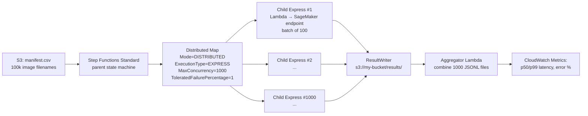
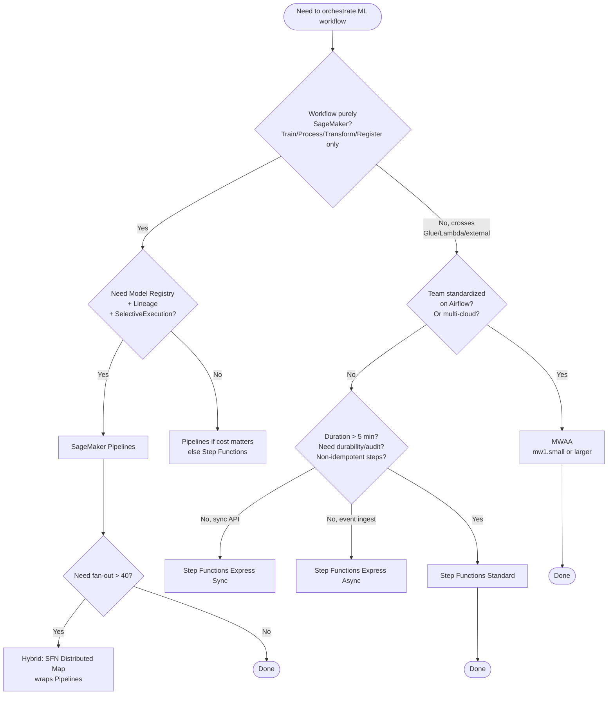
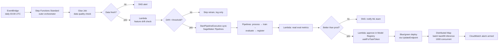

# Chapter 44 — Step Functions vs SageMaker Pipelines vs MWAA

> **Goal of this chapter:** to give you a defensible mental model — and a reflex-level decision matrix — for the three managed orchestrators AWS sells you, so that when a scenario question on the MLA-C01 says "the team needs to run a daily DAG that joins Glue ETL, a SageMaker training job, and a Slack approval gate," you instantly know whether the right answer is **SageMaker Pipelines**, **Step Functions Standard**, **MWAA**, or some hybrid of the three. By the end of the chapter you should be able to answer four questions in your sleep. *Which workflow type of Step Functions can host a Distributed Map? Which SageMaker API does **not** support `.sync`? Why does an MWAA `mw1.small` running zero DAGs still cost $350 a month? When is the right answer "all three at once"?* These are not rhetorical — they are the exact shape of the exam questions Task 3.3 (Implement workflow automation for ML) loves to ask, and they are also the questions your senior architect at Capital One or JPMC will ask you across the table when you propose an MLOps platform.

---

## 44.1 The orchestrator question, and why AWS sells you three answers to it

There is exactly one orchestration question every production ML team has to answer, and AWS has shipped three different products to answer it: *how do you get from "the data arrived in S3" to "a vetted model is serving traffic" without a human being in the loop, while leaving an audit trail, surviving partial failures, and not setting fire to your AWS bill?* That sentence is the entire job description of an ML orchestrator. SageMaker Pipelines, AWS Step Functions, and Amazon MWAA (Managed Workflows for Apache Airflow) are three different bets on what the right shape of the answer is, and the MLA-C01 exam expects you to pick the right one based on the workload's shape, not on personal preference.

The vendor pitch on the AWS landing pages reduces to a one-liner per product. *SageMaker Pipelines is the ML-native option*: a DAG service built into SageMaker, authored in the SageMaker Python SDK, wired for free into the Model Registry, Lineage Tracking, and Experiments. *Step Functions is the general-purpose serverless workflow engine*: a state machine engine that integrates natively with 220+ AWS services, written in JSON (Amazon States Language), priced per state transition, runs anywhere from milliseconds to a year. *Amazon MWAA is hosted Apache Airflow 2.x/3.x*: a managed Fargate-backed environment where you upload Python DAG files to S3 and AWS runs the scheduler, webserver, workers, triggerer, and Aurora PostgreSQL metadata database for you.

Those one-liners are correct as far as they go, but they collapse under the weight of how real teams organize work. Step Functions can absolutely orchestrate ML — every Capital One Step Functions case study is exactly that. MWAA can absolutely run an ML-only DAG — every AWS Big Data Blog post starting "Orchestrate XGBoost…" is that. SageMaker Pipelines can absolutely include non-SageMaker steps — that is exactly what the `LambdaStep` is for. The question is not "which one can do this," it is "which one is the right tool given the team shape, the cost ceiling, the integration surface, and the audit requirements." The rest of this chapter is the deep dive needed to answer that question correctly under exam time pressure, and to defend the answer in an architecture review.

A note on framing before we descend into the mechanics. The previous chapter (Chapter 43) walked you through SageMaker Pipelines as a deep dive — what every step type does, how the DAG is compiled, how SelectiveExecution works, where the Model Registry plugs in. This chapter is the *comparison* chapter, not a re-tutorial of Pipelines. The next chapter (Chapter 45) covers **EventBridge** — the trigger graph that fires whichever orchestrator you pick. The chapter after that (Chapter 46) covers **CodePipeline** as the CI/CD orchestrator that promotes infrastructure (the orchestrator definitions themselves) from dev to prod. The four chapters compose: Pipelines/SFN/MWAA *executes* the ML workflow, EventBridge *triggers* it, CodePipeline *deploys the definitions of it*. You need all four mental models to pass Task 3.3, and you will need all four working in production to ship a real MLOps platform.

One more framing point. The three orchestrators reflect three different *team shapes*, not just three technical surfaces. **Pattern A** is "the ML team owns the pipeline" — a small-to-mid ML org (3–15 data scientists) where the same humans write training code, evaluation code, and deployment glue. The pipeline definition lives next to the model code in one Python repo (`Pipeline(...).upsert()` in the same notebook that trains the model); SageMaker Pipelines is the natural default because lineage, model registry, and pipeline executions are first-class. **Pattern B** is "the platform team owns the orchestrator" — a mid-to-large data org (50+ pipelines, multiple business domains) where a central platform team curates the orchestrator and ML is one of many workload types. DAGs-as-Python lets the platform team enforce shared libraries, custom operators, and org-wide conventions (tagging, SLA monitoring, on-call routing); MWAA wins because it's familiar to the data-engineering side of the house, which is usually 5–10× bigger than the ML side. **Pattern C** is "serverless and cheap" — cost-sensitive teams running lightweight ML (batch inference, periodic retraining without a huge model zoo, event-driven pipelines). Step Functions wins because there is no always-on environment cost, native Lambda/Glue/SageMaker/EventBridge integration without a worker pool, Distributed Map for massive fan-out for free, and cost predictability — the bill is literally per state transition. When the exam frames a scenario around "the team," it is usually hinting at which of these three patterns to recognize.

---

## 44.2 AWS Step Functions: the workflow types and what they mean

### 44.2.1 Standard vs Express — the immutable choice

When you create a Step Functions state machine you pick **Standard** or **Express**, and the choice **cannot be changed afterwards**. This is the single most exam-relevant fact about Step Functions, because the wrong choice silently corrupts ML workflows. You cannot edit it later — you have to create a new state machine, change every consumer's ARN, and migrate the executions. The blast radius of getting this wrong on day one is high enough that the exam loves to test it.

The table below is the comparison you should be able to draw from memory:

| Property                | Standard                                  | Express (Async)              | Express (Sync)              |
| ----------------------- | --------------------------------------------- | ---------------------------- | --------------------------- |
| **Max duration**        | 1 year                                        | 5 minutes                    | 5 minutes                   |
| **Execution semantics** | Exactly-once                                  | At-least-once                | At-most-once                |
| **State persistence**   | Internally persisted between transitions      | In-memory only               | In-memory only              |
| **Execution history**   | 90 days via API + Console                     | Not stored; CloudWatch Logs only | Not stored; CloudWatch Logs only |
| **Idempotency**         | Auto: same-name execution is rejected         | Not managed                  | Not managed                 |
| **Pricing**             | Per state transition ($0.025 / 1k)            | Per execution + GB-sec       | Per execution + GB-sec      |
| **Service patterns**    | Request/Response, `.sync`, `.waitForTaskToken` | Request/Response only       | Request/Response only       |
| **Distributed Map**     | Supported                                     | **Not supported**            | **Not supported**           |
| **Activities**          | Supported                                     | Not supported                | Not supported               |
| **Best for**            | Long-running, durable, auditable workflows; ML | High-volume event processing | Sync microservice APIs      |

For ML — which runs training jobs lasting minutes to hours, can never be silently re-run because every retry costs real GPU-hours, and is recorded for audit — the correct choice is **always Standard**. Express is for IoT pipelines, log enrichment, ad-tech bidding, and customer-facing sync APIs behind API Gateway. Anyone who picks Express for ML training has either misread the cost model or never read the docs on what "at-least-once" means.

The three execution semantics deserve a separate paragraph because the words are slippery. **Standard's "exactly-once"** means: every state in your DAG runs exactly the number of times your ASL says it should. If you have a `Retry` block with `MaxAttempts: 3`, the state might run up to 4 times (1 + 3 retries) on failure, but Step Functions itself never silently re-runs a state behind your back. This matters because SageMaker training jobs cost real money, EMR clusters cost real money, and Stripe payment captures cost reputations. **Express Async's "at-least-once"** means: in rare failure modes (the Step Functions service worker crashes mid-execution), a state may be re-run. This is fine for "write to DynamoDB with PUT" because PUT is idempotent — the same key being written twice yields the same row. It is **not fine** for "start a SageMaker training job," because you would now be running two training jobs and paying for both. **Express Sync's "at-most-once"** means: on failure, the execution returns an error to the caller, who decides whether to retry. From Step Functions' side, the execution will not transparently restart. That is the right semantic behind an API Gateway endpoint where the client owns retry policy.

> **Exam shortcut.** "Non-idempotent action (training, payment, EMR provisioning)" → **Standard**. "Idempotent action (PUT, set, increment-with-id)" → **Express OK**. "Customer-facing API behind API Gateway" → **Express Sync**.

> ⚠️ **Exam alert — Distributed Map is Standard-only.** Express workflows **cannot** host a Distributed Map state. If a scenario question says "process 10,000 S3 objects in parallel" and offers Express as an option, that option is wrong. Distributed Map is the single most common Step Functions feature on the MLA-C01, and it lives exclusively in the Standard tier. We will dig into why in §44.2.4.

### 44.2.2 Amazon States Language (ASL) — the state types

ASL is JSON. A state machine is a top-level object with a `StartAt` pointer and a `States` map whose keys are state names. There are **eight** state types, and you should be able to recognize each one on sight:

| State type | Purpose                                                                                  |
| ---------- | ---------------------------------------------------------------------------------------- |
| `Task`     | Calls a service (Lambda, SageMaker, DynamoDB, etc.) or runs an Activity. The workhorse — 80% of states. |
| `Choice`   | Branches on input data — the `if/elif/else` of ASL.                                       |
| `Parallel` | Runs N **fixed** branches concurrently; each branch is its own sub-state-machine. Number known at design time. |
| `Map`      | Inline iteration over an array — runs the same sub-machine for each element. Concurrency capped at **40** by default. |
| `Map` (Distributed) | Iteration over arrays or S3 objects with concurrency up to **10,000**. **Standard-only.** |
| `Pass`     | No-op; forwards input to output, optionally with `Parameters`. Used for shaping JSON.    |
| `Wait`     | Sleeps for N seconds or until a timestamp.                                               |
| `Succeed`  | Terminal state; ends execution successfully.                                             |
| `Fail`     | Terminal state; ends execution with an `Error` and `Cause` payload.                      |

A minimal training ASL — the kind of thing the exam will show you in a fragment and ask you to fix:

```json
{
  "Comment": "Train a model and register it to the Model Registry",
  "StartAt": "Train",
  "States": {
    "Train": {
      "Type": "Task",
      "Resource": "arn:aws:states:::sagemaker:createTrainingJob.sync",
      "Parameters": {
        "TrainingJobName.$": "$$.Execution.Name",
        "AlgorithmSpecification": {
          "TrainingImage": "...",
          "TrainingInputMode": "File"
        },
        "ResourceConfig": {
          "InstanceCount": 1,
          "InstanceType": "ml.m5.xlarge",
          "VolumeSizeInGB": 30
        },
        "StoppingCondition": { "MaxRuntimeInSeconds": 3600 },
        "InputDataConfig": [
          { "ChannelName": "train",
            "DataSource": { "S3DataSource": { "S3DataType": "S3Prefix",
                                              "S3Uri": "s3://my-bucket/data/" } } }
        ],
        "OutputDataConfig": { "S3OutputPath": "s3://my-bucket/model/" },
        "RoleArn": "arn:aws:iam::123456789012:role/SageMakerExecutionRole"
      },
      "Retry": [
        { "ErrorEquals": ["SageMaker.ResourceLimitExceeded"],
          "IntervalSeconds": 60, "MaxAttempts": 10, "BackoffRate": 1.5,
          "JitterStrategy": "FULL" }
      ],
      "Catch": [
        { "ErrorEquals": ["States.ALL"], "Next": "NotifyFailure" }
      ],
      "Next": "RegisterModel"
    },
    "RegisterModel": {
      "Type": "Task",
      "Resource": "arn:aws:states:::sagemaker:createModel",
      "Parameters": {
        "ModelName.$": "$.TrainingJobName",
        "PrimaryContainer": {
          "Image": "...",
          "ModelDataUrl.$": "$.ModelArtifacts.S3ModelArtifacts"
        },
        "ExecutionRoleArn": "arn:aws:iam::123456789012:role/SageMakerExecutionRole"
      },
      "End": true
    },
    "NotifyFailure": {
      "Type": "Task",
      "Resource": "arn:aws:states:::sns:publish",
      "Parameters": {
        "TopicArn": "arn:aws:sns:us-east-1:123456789012:ml-alerts",
        "Message.$": "$.Cause"
      },
      "End": true
    }
  }
}
```

Three details are doing all the work in that snippet. **First**, the `.sync` suffix on `createTrainingJob` — this is the integration pattern that makes Step Functions block until the training job reaches a terminal state. Without `.sync` (we'll get to the alternatives in §44.2.5), Step Functions would fire-and-forget the API call and immediately proceed to `RegisterModel` with an empty `ModelArtifacts` — corruption that is silent and easy to miss in code review. **Second**, the `Retry` block discriminates by error class. `SageMaker.ResourceLimitExceeded` means "we ran out of `ml.m5.xlarge` quota right now" — you back off and retry up to 10 times with 1.5× exponential backoff and full jitter. You do **not** retry on `SageMaker.AlgorithmError` (your training code has a bug; no number of retries fixes it). **Third**, the `Catch` redirects any unhandled error to `NotifyFailure` — a production workflow always has a catch, because the alternative is a silent execution-history entry that nobody notices until the model stops updating.

### 44.2.3 The three integration patterns

Step Functions can call AWS services in three fundamentally different ways. Knowing which one applies when is the single most testable Step Functions concept on the MLA-C01.

**Request/Response (default).** Fire-and-forget. Step Functions issues the API call (e.g., `sagemaker:CreateTrainingJob`) and immediately moves to the next state with whatever the API returned synchronously. For SageMaker training, that response is *only* the `TrainingJobArn` and the initial status `InProgress` — nothing else. Used when you just need to kick off a job and don't care about its outcome inside this workflow. ARN form: `arn:aws:states:::sagemaker:createTrainingJob` (no suffix).

**Run a Job (`.sync`).** Step Functions calls the service, then polls the service via an internally-generated EventBridge rule until the underlying job reaches a terminal state (`Completed`, `Failed`, `Stopped`), then returns the job's *full* final output. The state's wall-clock duration is the job's duration. This is **the** pattern for SageMaker integrations — training is the long-pole of the workflow and you want the state to represent its complete lifecycle. ARN form: `arn:aws:states:::sagemaker:createTrainingJob.sync`. Under the hood, `.sync` creates an EventBridge rule named something like `StepFunctionsGetEventsForSageMakerTrainingJobsRule` plus issues `Describe*` polls — the IAM policy Step Functions generates for you includes `events:PutTargets`, `events:PutRule`, `events:DescribeRule`.

**Wait for Callback (`.waitForTaskToken`).** Step Functions invokes the downstream service with a special `$$.Task.Token` parameter that contains a one-time token, then **suspends the state** until some out-of-band caller invokes `SendTaskSuccess(token, output)` or `SendTaskFailure(token, error)`. Used for human-in-the-loop approvals (Lambda emits SNS → human reads email → clicks a button in a portal → API Gateway → Lambda → `SendTaskSuccess`), or long-running external systems (call a third-party API that returns later via webhook). ARN form example: `arn:aws:states:::lambda:invoke.waitForTaskToken`.

Important constraint: **SageMaker integrations only support Request/Response and `.sync`** — not `.waitForTaskToken`. If you want a human-approval gate after a SageMaker training job, you don't do `.waitForTaskToken` on the training call itself; you do a follow-up Lambda state that uses `.waitForTaskToken`, or you let the Model Registry's `PendingManualApproval` state handle it. The exam loves to bait this distinction.

> ⚠️ **Exam alert — Express cannot use `.sync`.** Express workflows are limited to **Request/Response** integrations only. If you put a SageMaker training job into an Express workflow with the `.sync` suffix, deployment will reject the state machine. The combination of "5-minute max duration" and "in-memory state" makes long-poll integrations physically impossible. This is the second-most-common Step Functions trap on the exam: the question gives you an Express workflow with a `.sync` ARN and asks why it fails.

### 44.2.4 Distributed Map — the fan-out unlock for ML inference

Inline `Map` runs up to **40 concurrent iterations** in-process — the iterations execute inside the same state-machine execution and share its 256 KB input-output limit. Beyond 40, you must use **Distributed Map**, which fans out to **child executions** with a ceiling of **10,000 concurrent executions** per Map state and supports input data up to **256 GB** sourced from S3.

The canonical ML pattern is batch inference at scale:

1. Drop 100,000 image filenames into a CSV in S3 (or use a manifest, JSON array, or S3 inventory).
2. A Distributed Map state reads from S3, batches the items (e.g., 100 items per batch), and launches one child execution per batch.
3. Each child execution invokes a Lambda — or another state machine — that calls a SageMaker endpoint for the batch.
4. The Map state aggregates all child results to a `ResultWriter` in S3, optionally tolerating a configurable failure percentage.

```json
{
  "BatchInference": {
    "Type": "Map",
    "ItemReader": {
      "Resource": "arn:aws:states:::s3:getObject",
      "ReaderConfig": { "InputType": "CSV", "CSVHeaderLocation": "FIRST_ROW" },
      "Parameters": { "Bucket": "my-bucket", "Key": "images.csv" }
    },
    "ItemBatcher": { "MaxItemsPerBatch": 100 },
    "MaxConcurrency": 1000,
    "ToleratedFailurePercentage": 1,
    "ItemProcessor": {
      "ProcessorConfig": { "Mode": "DISTRIBUTED", "ExecutionType": "EXPRESS" },
      "StartAt": "InvokeBatch",
      "States": {
        "InvokeBatch": {
          "Type": "Task",
          "Resource": "arn:aws:states:::lambda:invoke",
          "Parameters": { "FunctionName": "batch-inferencer", "Payload.$": "$" },
          "End": true
        }
      }
    },
    "ResultWriter": {
      "Resource": "arn:aws:states:::s3:putObject",
      "Parameters": { "Bucket": "my-bucket", "Prefix": "results/" }
    }
  }
}
```

The four fields that matter:

- `ProcessorConfig.Mode = DISTRIBUTED` — this is what unlocks the 10k concurrency ceiling. Without it, you are using inline Map (40 ceiling).
- `ExecutionType = EXPRESS` — each child execution is itself an Express workflow (cheaper, faster, no per-transition cost). For idempotent inference, this is correct; the parent Standard workflow gives you durability while the children are cheap. For non-idempotent child work, switch to `STANDARD`.
- `ToleratedFailurePercentage: 1` — fail the whole Map only if more than 1% of items fail. Critical for inference at scale where you accept some loss (a corrupt JPEG that crashes the model should not fail the whole batch).
- `MaxConcurrency: 1000` — you usually want this lower than the 10k ceiling to protect downstream SageMaker endpoint capacity from a thundering herd.

#### The Capital One check-clearing case study

Capital One's most-cited Step Functions production story is its check-clearing application, which serves 100M+ customers and processes thousands of checks daily. The original architecture used inline Map (40 concurrent iterations) to orchestrate Lambdas that scored and classified each check; analysts received a queue of flagged checks for manual review. After a 10-week POC, they migrated inline Map to Distributed Map. No major architecture change, no downtime. The result: roughly **25× concurrency increase**, **75–80% reduction in processing time** for launching and closing the workflows, faster analyst queues, and the elimination of throttling exceptions through Distributed Map's built-in retry/backoff. This is the gold-standard "Why Distributed Map exists" story and AWS now references it in every Distributed Map talk. The MLA-C01 version of the question is: *"You need to process 10,000 ML inference jobs in parallel — which Step Functions feature?"* → **Distributed Map**.



Practical gotchas teams hit:

- **Child execution overhead** — each child workflow has a ~100ms minimum cost. Don't use Distributed Map for sub-second tasks; batch them inside each child instead.
- **Output payload size** — Distributed Map writes all child results back to a single ResultWriter S3 path; for 10K children with 100 KB outputs each, that's 1 GB of JSON. Plan for an S3-based aggregation step (often a Glue or Athena query, not a single Lambda).
- **IAM is the most common failure mode** — child executions run under the **state machine's** role, not their own. First-time users hit `AccessDenied` storms because they granted permission to "the Map state's IAM" without realizing it doesn't exist as a distinct principal.
- **Concurrency cap is per-account-per-region** — if you launch 10K children in one Map state *and* have other Step Functions executions running, you can hit the default 1,000 standard-workflow concurrent execution limit. The escape: use Express child execution mode (different limit) or request a quota increase.

The five canonical ML production patterns teams build with Distributed Map: (1) **bulk inference** — input is an S3 manifest of N files; each child execution invokes a SageMaker endpoint or runs a Lambda with a packaged model; output is N JSON results consolidated in S3. (2) **Bedrock batch inference fan-out** — a JSONL of prompts split across children, each calls Bedrock, results merged. (3) **Per-tenant ML retraining** — for a multi-tenant SaaS, fan out one training-and-eval child per customer. (4) **Backfill** — re-score 18 months of historical events after a model bump; each child is a date partition. (5) **Document AI pipelines** — child execution = one document → Textract → Comprehend → Bedrock summarization → store result. The shape is always the same: a manifest in S3, a child execution per batch, a single ResultWriter aggregating outputs back into S3.

### 44.2.5 Optimized SageMaker integrations — the exact `.sync` matrix

The Step Functions Developer Guide enumerates the SageMaker APIs that have "optimized" integration. The exam will test which of these support `.sync` and which do not:

| API                            | `.sync` supported? |
| ------------------------------ | ------------------ |
| `CreateTrainingJob`            | **Yes**            |
| `CreateHyperParameterTuningJob` | **Yes**           |
| `CreateLabelingJob`            | **Yes**            |
| `CreateProcessingJob`          | **Yes**            |
| `CreateTransformJob`           | **Yes**            |
| `CreateEndpoint`               | **No** (Request/Response only) |
| `CreateEndpointConfig`         | **No** (Request/Response only) |
| `CreateModel`                  | **No** (Request/Response only) |
| `UpdateEndpoint`               | **No** (Request/Response only) |

> ⚠️ **Exam alert — `CreateEndpoint` does not support `.sync`.** Endpoint deployment is asynchronous in SageMaker; the endpoint goes through `Creating → InService` over a wall-clock interval of 5–15 minutes, but there is no EventBridge "endpoint creation completed" event that Step Functions can hook into the way it does for training jobs. If you want the workflow to wait for the endpoint to become `InService`, you write a follow-up `Task` state that calls a Lambda that polls `DescribeEndpoint` in a loop, **or** you use `.waitForTaskToken` with an EventBridge rule that fires on the `SageMaker Endpoint State Change` event and a Lambda that consumes the rule and calls `SendTaskSuccess`. This is one of the most common surprise questions on the exam, and the gotcha is doubly fun because `.sync` *does* work on training, transform, processing, tuning, and labeling — so candidates intuitively assume it works on endpoint creation too. It doesn't.

A second footnote worth memorizing: **`CreateTransformJob` requires you to attach an IAM policy manually**. Step Functions auto-generates an IAM policy for `CreateTrainingJob.sync` (including the `events:Put*` actions), but it does *not* auto-generate one for `CreateTransformJob`. You must attach an inline policy with `sagemaker:CreateTransformJob`, `sagemaker:DescribeTransformJob`, `sagemaker:StopTransformJob`, plus the EventBridge actions. This is a frequent question stem on the exam.

A note on the legacy authoring story you may see referenced. **Workflow Studio** is the drag-and-drop visual editor in the Step Functions console — it generates ASL JSON and is useful for prototyping, but production workflows should live in Git as ASL or be authored in CDK or SAM. The **Step Functions Data Science SDK** is a Python library that lets you author state machines via `steps.TrainingStep`, `steps.ModelStep`, etc. — still works, no longer recommended. The modern path is to write ASL directly, use the CDK construct `aws_stepfunctions_tasks.SageMakerCreateTrainingJob`, or use the Workflow Studio export. The exam may reference the Data Science SDK but won't make it the only "correct" answer.

### 44.2.6 Error handling — Retry and Catch in production

`Retry` and `Catch` are per-state, ordered lists evaluated in sequence. A realistic block:

```json
"Retry": [
  { "ErrorEquals": ["SageMaker.ResourceLimitExceeded"],
    "IntervalSeconds": 60, "MaxAttempts": 10, "BackoffRate": 1.5,
    "MaxDelaySeconds": 3600, "JitterStrategy": "FULL" },
  { "ErrorEquals": ["States.Timeout"],
    "IntervalSeconds": 5, "MaxAttempts": 3, "BackoffRate": 2.0 },
  { "ErrorEquals": ["States.ALL"],
    "IntervalSeconds": 1, "MaxAttempts": 2 }
],
"Catch": [
  { "ErrorEquals": ["States.ALL"], "Next": "HandleFailure",
    "ResultPath": "$.errorInfo" }
]
```

Built-in error codes you should recognize on sight:

- `States.ALL` — catch-all wildcard.
- `States.Timeout` — task exceeded `TimeoutSeconds` or `HeartbeatSeconds`.
- `States.TaskFailed` — generic task failure.
- `States.Permissions` — IAM denied the action.
- `States.DataLimitExceeded` — input/output exceeded 256 KB (a common surprise — see §44.7).
- `States.ResultPathMatchFailure` — `ResultPath` JSONPath selector did not match.
- `States.ParameterPathFailure` — `Parameters` selector did not match.
- `States.NoChoiceMatched` — Choice state had no matching branch and no `Default`.
- `States.ExceedToleratedFailureThreshold` — Distributed Map exceeded `ToleratedFailurePercentage`.
- `States.HeartbeatTimeout` — Activity worker missed heartbeat.

`BackoffRate` is multiplicative; `JitterStrategy: FULL` adds random jitter to each retry interval (essential to avoid thundering-herd retries against SageMaker quotas when a region-wide capacity event happens). `MaxDelaySeconds` caps the interval at a sane ceiling.

---

## 44.3 Amazon MWAA — Managed Workflows for Apache Airflow

### 44.3.1 Architecture and environment classes

AWS runs the entire Airflow stack on Fargate behind the scenes: a **webserver** for the Airflow UI, a **scheduler** that examines DAGs and creates `task_instance` rows, **workers** that execute task instances (auto-scaling between min/max worker counts you configure), an AWS-managed **Aurora PostgreSQL** metadata DB holding DAG runs and XComs, and a **triggerer** (Airflow 2.2+) that runs deferrable operators co-located with the scheduler on the same Fargate task. DAGs and plugins arrive via S3: `s3://<bucket>/dags/` for Python DAG files (MWAA syncs every few minutes), `s3://<bucket>/requirements.txt` for pip-installed providers, and `s3://<bucket>/plugins.zip` for Airflow plugins.

The environment-class table is required-memorization for the exam:

| Class         | DAG capacity | Default concurrent tasks | Worker vCPU/RAM | Scheduler vCPU/RAM | DB vCPU/RAM | Auto-scaling |
| ------------- | ------------ | ------------------------ | --------------- | ------------------ | ----------- | ------------ |
| `mw1.micro`   | 25           | 3                        | 1 / 3 GB        | 1 / 3 GB           | 2 / 4 GB    | **No**       |
| `mw1.small`   | 50           | 5                        | 1 / 2 GB        | 1 / 2 GB           | 2 / 4 GB    | Yes          |
| `mw1.medium`  | 250          | 10                       | 2 / 4 GB        | 2 / 4 GB           | 2 / 8 GB    | Yes          |
| `mw1.large`   | 1000         | 20                       | 4 / 8 GB        | 4 / 8 GB           | 2 / 8 GB    | Yes          |
| `mw1.xlarge`  | 2000         | 40                       | 8 / 24 GB       | 8 / 24 GB          | 4 / 32 GB   | Yes          |
| `mw1.2xlarge` | 4000         | 80                       | 16 / 48 GB      | 16 / 48 GB         | 8 / 64 GB   | Yes          |

Note the `mw1.micro` exception: **no auto-scaling, single scheduler pinned to 1 worker**. Everyone else can run 2–5 schedulers (default 2). More schedulers means more triggerers, which means more concurrent deferred tasks. A scenario question with "burst to 100 concurrent tasks" rules out `mw1.micro` because the worker count is fixed and the concurrent-task default is 3.

You can tune `celery.worker_autoscale` per environment if you need more tasks per worker than the default. The high-volume tuning playbook in the MWAA docs sets `worker_autoscale=20,5` on `mw1.large` to push tasks-per-worker up to 20 (from the default of 5).

### 44.3.2 Apache Airflow versions in 2026 — the 3.x line

MWAA picked up Apache Airflow **3.0** in **October 2025** and Apache Airflow **3.2** in **April 2026**. The 3.x line is the headline change since the 2.x baseline of `2.4.3`, and several of its features matter for ML/data teams:

- **DAG versioning is native.** Every DAG modification is auto-serialized; the UI shows v1, v2, v3 history per DAG. Before 3.0 you had to layer this yourself with Git SHA tags. ML teams care because reproducing a 6-month-old training run now means "select v7 in the UI" rather than "find the right commit hash."

- **Asset Watchers and event-driven scheduling.** Airflow 2.4 introduced data-aware scheduling (datasets); Airflow 3.0 promotes that to **Assets** with **AssetWatchers** that listen on *external* event sources. MWAA's 3.0 release ships with an **SQS AssetWatcher** so a pipeline that used to use an `S3KeySensor` polling every 60 seconds can now react event-driven to an EventBridge → SQS chain. This collapses the historical gap between Airflow's polling model and Step Functions' native event-driven shape.

- **Asset partitioning (Airflow 3.2).** Triggers downstream DAGs on a *partition* of an asset (e.g., one date partition of an S3 path) rather than the whole asset. ML feature pipelines that produce daily partitions now naturally trigger only the date-specific consumer DAGs.

- **Task Execution Interface (Task API).** Tasks can run as standalone Python scripts via a new API server, not always inside the Airflow worker. Two practical wins: local testing with `airflow tasks test` semantics against a real metadata DB, and long-running tasks living outside the worker pool, easing worker-memory pressure. Note: the full Edge Executor (complete remote task isolation) is not yet supported on MWAA.

- **Complete React/FastAPI UI rewrite.** Replaces the legacy Flask AppBuilder. Grid view, log viewer, and dark mode are the cited improvements.

- **Python 3.12.** Up from 3.11. PEP 709 (inlined comprehensions) and faster startup cut DAG-parse times measurably on large repos.

- **Least-privilege DB access.** In 3.0, tasks no longer directly connect to the metadata DB by default — they go through the API server. Big deal for finance/healthcare teams that had to special-case Airflow in their threat models.

Migration notes: custom operators that subclass deprecated 2.x base classes need rewrites, `SubDagOperator` is gone (use `TaskGroup`), DAG serialization is now mandatory, and many community providers had to bump versions for 3.x compatibility — verify your `requirements.txt` against the 3.x provider matrix before upgrading prod. MWAA supports in-place upgrades from 2.x to 2.x, but **upgrading from 2.x to 3.x is a new environment plus DAG migration** because of these breaking changes.

### 44.3.3 SageMaker operators — `apache-airflow-providers-amazon`

The Amazon provider package ships first-class SageMaker operators. The exam-relevant set:

| Operator                                       | What it does                              |
| ---------------------------------------------- | ----------------------------------------- |
| `SageMakerTrainingOperator`                    | Submits a training job; can defer.        |
| `SageMakerTuningOperator`                      | Hyperparameter tuning job.                |
| `SageMakerProcessingOperator`                  | Processing job.                           |
| `SageMakerTransformOperator`                   | Batch transform.                          |
| `SageMakerModelOperator`                       | Creates a SageMaker model resource.       |
| `SageMakerEndpointConfigOperator`              | Endpoint config.                          |
| `SageMakerEndpointOperator`                    | Create / update endpoint.                 |
| `SageMakerStartPipelineExecutionOperator`      | Kicks off a SageMaker Pipeline.           |
| `SageMakerStopPipelineExecutionOperator`       | Cancels a Pipeline execution.             |

Example DAG snippet:

```python
from airflow import DAG
from airflow.providers.amazon.aws.operators.sagemaker import SageMakerTrainingOperator
from datetime import datetime

with DAG("nightly-train", start_date=datetime(2026, 1, 1), schedule="@daily") as dag:
    train = SageMakerTrainingOperator(
        task_id="train",
        config={
            "TrainingJobName": "airflow-{{ ds_nodash }}",
            "AlgorithmSpecification": {"TrainingImage": "...", "TrainingInputMode": "File"},
            "RoleArn": "arn:aws:iam::123456789012:role/AirflowSageMakerRole",
            "ResourceConfig": {"InstanceCount": 1, "InstanceType": "ml.m5.xlarge",
                                "VolumeSizeInGB": 30},
            "InputDataConfig": [...],
            "OutputDataConfig": {"S3OutputPath": "s3://my-bucket/models/"},
            "StoppingCondition": {"MaxRuntimeInSeconds": 3600},
        },
        wait_for_completion=True,   # blocks the task; alternative: deferrable=True
        check_interval=30,
    )
```

`wait_for_completion=True` is the Airflow equivalent of Step Functions `.sync` — but with a cost gotcha. Airflow holds a worker slot during the entire wait, so a 4-hour training job means 4 hours of a worker being "busy" doing nothing. Setting `deferrable=True` releases the worker slot and lets the triggerer poll instead — equivalent to `.sync` but resource-cheaper. Production MWAA DAGs that include SageMaker training should always be `deferrable=True`.

### 44.3.4 When MWAA is the right answer (and when it is not)

**Right answer:**

- The team already runs Airflow on-prem or on another cloud and wants continuity for hundreds of DAGs.
- The workflow crosses multiple clouds (Airflow has providers for GCP, Azure, Snowflake, Databricks, Salesforce, dbt — 1,000+ operators across the ecosystem).
- The data team prefers Python DAGs over JSON/ASL or SageMaker Python SDK.
- Vendor lock-in is a stated concern (Airflow code runs on Astronomer, Cloud Composer, on-prem Helm chart).
- The workflow includes non-AWS systems (Snowflake → SageMaker → Tableau → Slack).
- A central platform team curates the orchestrator and ML is one of many workload types (the "Pattern B" of §44.1: 50+ pipelines, multiple business domains).

**Wrong answer:**

- The team has no Airflow experience and starts from scratch — the operational surface (worker autoscale tuning, DAG sync delays, requirements conflicts) is real and the migration regret is common.
- The workflow is short, simple, ML-only — SageMaker Pipelines is one Python file vs MWAA's environment + DAG + requirements + plugins + S3 bucket + VPC.
- You need exactly-once semantics for non-idempotent steps — Airflow's task retry model is eventually-consistent and can re-run.
- You want the cheapest option (MWAA bills per hour of environment uptime even when no DAGs run; see §44.6).

---

## 44.4 SageMaker Pipelines — the ML-native option (recap)

Chapter 43 covered Pipelines in depth. This chapter only revisits the comparative axes that matter for the orchestrator decision.

### 44.4.1 What you get for free

Pipelines is the only one of the three that gives you, with zero extra wiring:

- **Model Registry integration.** `ModelStep` registers the trained model with a version, an approval status (`PendingManualApproval`, `Approved`, `Rejected`), and metadata. No separate registry to provision.
- **Lineage Tracking.** Every artifact and step is recorded in the SageMaker Lineage graph (queryable via `LineageQueryDirectionEnum`).
- **Experiments integration.** Every pipeline run becomes a Trial; metrics flow into Experiment runs automatically without you writing `mlflow.log_metric`.
- **Studio visual viewer.** DAGs are drawn in Studio with run history, selective re-execution, and parameter inspection — the data scientist never has to learn the Airflow UI or read ASL JSON.
- **SelectiveExecution.** Re-run only the steps that failed (or only the steps downstream of a parameter change). No equivalent in Step Functions or Airflow.
- **Step caching.** Cached on hash of inputs; a 4-hour `ml.g5.12xlarge` training step that would have re-run because of a downstream code change costs $0 if the cache key matches.
- **No orchestration cost.** You pay only for underlying SageMaker resources (Training instance hours, Processing instance hours). The DAG engine itself is free.

Step types in one table for orientation:

| Step               | What it runs                                                |
| ------------------ | ----------------------------------------------------------- |
| `ProcessingStep`   | SageMaker Processing job (sklearn, Spark, custom container).|
| `TrainingStep`     | Training job.                                               |
| `TuningStep`       | Hyperparameter tuning.                                      |
| `TransformStep`    | Batch transform.                                            |
| `ModelStep`        | Create model + register to Model Registry.                  |
| `ConditionStep`    | Branching (`if/else`).                                      |
| `FailStep`         | Terminate pipeline with error.                              |
| `LambdaStep`       | Invoke a Lambda — the escape hatch to anything non-SageMaker.|
| `CallbackStep`     | `.waitForTaskToken` equivalent — pause for an external system to resume via SQS. |
| `EMRStep`          | Run an EMR step on an existing cluster.                     |
| `QualityCheckStep` | Built-in data/model quality check.                          |
| `ClarifyCheckStep` | Built-in bias/explainability check with promotion gate.     |
| `AutoMLStep`       | Run SageMaker AutoML inside the pipeline.                   |
| `NotebookJobStep`  | Run a Studio notebook headlessly.                           |

### 44.4.2 When Pipelines is the right answer (and when it is not)

**Right answer:** the workflow is purely SageMaker (preprocess → train → eval → register → deploy), you want Model Registry / Lineage / Experiments wiring for free, the team uses the SageMaker Python SDK already, you want zero orchestration cost, you need SelectiveExecution to re-run only the failed step.

**Wrong answer:** the workflow crosses non-SageMaker services (Glue ETL, Redshift query, third-party API) — you would need a `LambdaStep` for each, defeating the point. You need fan-out at >40 concurrency (Pipelines has no Distributed Map equivalent). You need a human approval gate that doesn't fit the Model Registry `PendingManualApproval` model. The team's standard is Airflow or Step Functions and switching costs are high.

---

## 44.5 The decision matrix — picking between them

### 44.5.1 The one-table version

| Scenario                                                       | Pick this           | Why                                              |
| -------------------------------------------------------------- | ------------------- | ------------------------------------------------ |
| ML-only DAG, all SageMaker steps                               | SageMaker Pipelines | Free orchestration, Model Registry + Lineage     |
| Glue ETL + SageMaker training + Lambda notify                  | Step Functions      | Cross-service integrations                       |
| Process 10k S3 objects in parallel                             | Step Functions      | Distributed Map (10k concurrency, Standard only) |
| Human approval before promoting model                          | Either              | Pipelines' Model Registry `PendingManualApproval` OR Step Functions `.waitForTaskToken` |
| Re-run only the failed step                                    | SageMaker Pipelines | SelectiveExecution                               |
| Team uses Airflow on-prem already                              | MWAA                | Continuity, existing DAGs port                   |
| Multi-cloud DAG (AWS + Snowflake + Databricks)                 | MWAA                | Airflow has providers for all                    |
| Customer-facing sync API needing workflow                      | Step Functions Express Sync | <5 min, at-most-once                     |
| IoT event processing at 10k events/sec                         | Step Functions Express Async | At-least-once, idempotent target        |
| Long-running (>1 day) durable workflow with audit              | Step Functions Standard | 1-year duration, 90-day history              |
| Bias/drift checks gated before deployment                      | SageMaker Pipelines | `ClarifyCheckStep`, `QualityCheckStep`           |
| Python DAGs with custom Python logic between steps             | MWAA                | DAGs are pure Python                             |
| ML pipeline run nightly from EventBridge                       | Pipelines (cheaper) | Free orchestration                               |
| Re-train if drift detected by Model Monitor                    | Either              | Pipelines + EventBridge OR Step Functions       |

### 44.5.2 The three-way decision flowchart



### 44.5.3 The hybrid pattern — they compose

The three orchestrators are **not mutually exclusive**. The most common production shape at scale in 2026 is **Step Functions wrapping SageMaker Pipelines**, sometimes with a Distributed Map sibling for fan-out.



The split of responsibility maps cleanly to team structure:

- **Step Functions (platform-owned):** scheduling, data freshness, drift checks, approvals, deployment orchestration, blue/green, rollback, alerting, audit trail, fan-out via Distributed Map.
- **SageMaker Pipelines (ML-team-owned):** processing → training → evaluation → model-registry registration, with caching, lineage, and step parameter tuning all native.

Both are version-controlled, both run independently in dev, and they meet at a single API call. The ARN for invoking Pipelines from Step Functions is `arn:aws:states:::aws-sdk:sagemaker:startPipelineExecution.sync` (the AWS SDK integration, not the optimized SageMaker integration — Pipelines is not in the optimized list).

A second hybrid worth knowing: **MWAA wrapping Pipelines**, via `SageMakerStartPipelineExecutionOperator`. Same shape with Airflow as the outer ring instead of Step Functions, common in teams that already have an Airflow platform and want to keep the ML inner loop in SageMaker.

A third (rarer) hybrid: **Pipelines invoking Step Functions** via a `LambdaStep`. If the inner ML DAG owned by the data-science team needs to call out mid-pipeline (trigger a Glue crawler, call a third-party labeling API, hit Snowflake), the `LambdaStep` invokes a Lambda that calls `stepfunctions.start_execution` and optionally polls. This is rarer because most teams put the cross-service hops in the outer Step Functions, but it is legitimate when the ML team owns the outer Pipelines and the platform team owns small cross-service inner sub-flows.

A fourth pattern worth flagging because the exam dances near it: **cross-account hybrid**. A real org with `data-platform-acct` and `ml-prod-acct` puts the Step Functions state machine in `ml-prod-acct`, shares the Pipelines definition cross-account via AWS RAM from `data-platform-acct`, and the Step Functions execution role assumes a cross-account IAM role to call `StartPipelineExecution`. Pipelines lineage stays in the owner account; Step Functions execution history stays in the runner account; both reconcile via S3 manifests and EventBridge cross-account events. The annoying real-world complaint: cross-account SageMaker Pipelines aren't visible in Studio UI of the consuming account — you can call them via API but you cannot *see* them in Studio. Teams build small Streamlit / internal-portal frontends to compensate.

---

## 44.6 Cost comparison — the load-bearing axis

### 44.6.1 The three pricing models

**SageMaker Pipelines: free.** You pay only for underlying SageMaker resources (Processing, Training, Transform, Endpoint instance hours). A Pipelines run with zero compute (e.g., all conditions skip the heavy steps) costs $0 for orchestration.

**Step Functions Standard: ~$0.025 per 1,000 state transitions.** A 30-state pipeline run 100 times per day: 30 × 100 × 30 = 90,000 transitions/month → 90 × $0.025 = **~$2.25/month**. Negligible for ML cadence.

**Step Functions Express: per-execution + GB-second + duration.** Roughly $1.00 per 1 million requests + ~$0.00001667 per GB-second. A million 100ms 64MB executions ≈ $1.10. Cheaper than Standard at very high volume but never the right choice for ML training orchestration.

**MWAA: per-hour environment uptime + per-hour worker uptime + per-GB-month metadata storage.** As of 2026 (us-east-1):

| Class         | Env $/hr | Add'l worker $/hr | Add'l scheduler $/hr | Approx monthly env (24/7) |
| ------------- | -------- | ----------------- | -------------------- | ------------------------- |
| `mw1.micro`   | ~$0.21   | n/a (no scaling)  | n/a                  | ~$153                     |
| `mw1.small`   | ~$0.49   | ~$0.055           | ~$0.055              | **~$350**                 |
| `mw1.medium`  | ~$0.96   | ~$0.088           | ~$0.088              | **~$700**                 |
| `mw1.large`   | ~$1.92   | ~$0.176           | ~$0.176              | ~$1,400                   |
| `mw1.xlarge`  | ~$2.31   | ~$0.351           | ~$0.351              | ~$1,685                   |
| `mw1.2xlarge` | ~$4.62   | ~$0.703           | ~$0.703              | ~$3,375                   |

### 44.6.2 The cost decision

For an ML team running daily training:

- **SageMaker Pipelines** = **$0** orchestration cost.
- **Step Functions Standard** = **~$2/month** orchestration cost.
- **MWAA `mw1.small`** = **~$350/month** minimum, regardless of whether any DAG runs.

The cost difference becomes the deciding factor at small organizational scale. MWAA only pays off when (a) the team runs many DAGs (5+) so the per-hour cost amortizes, (b) the team values Airflow's portability and ecosystem more than $350/month, or (c) the workflows are multi-system and the AWS-native alternatives can't express them cleanly.

> ⚠️ **Exam alert — MWAA charges 24/7 hourly, even when idle.** A scenario question with "minimize cost for a once-per-week DAG" rules out MWAA in favor of Pipelines or Step Functions. The MWAA environment runs Fargate continuously; there is no scale-to-zero. The bill arrives whether you run zero DAGs or one thousand. This is the most consequential cost gotcha on the entire MLA-C01 — get it wrong on the exam and you get it wrong in production too.

There is also a subtle cost line teams forget in Step Functions: **CloudWatch Logs from Express workflows**. Standard workflows emit execution events to the Step Functions execution history (free for retention up to 90 days). Express workflows do *not* keep an execution history — the only way to see what happened is CloudWatch Logs, which is priced per GB ingested. For high-volume Express workflows (millions/day), CloudWatch Logs can dwarf the Step Functions execution cost itself. The standard mitigation in production is to set logging level to `ERROR` only and disable `IncludeExecutionData`, which cuts ingest by 90% at the cost of being unable to forensically reconstruct an individual failed execution from the logs alone. A second line: **Step Functions `.sync` polling** uses an internal EventBridge rule and a SageMaker `Describe*` call every few seconds, which is free for you but counts against your EventBridge rule quota (300/account by default — usually fine, occasionally a surprise in a high-multi-tenant account).

### 44.6.3 The Siqi Li migration story — $500/month MWAA killed

A widely-cited writeup by Siqi Li ([Medium — Enhanced cost-efficiency in MLOps with Step Functions over MWAA](https://medium.com/@SiqiLi/how-i-enhanced-cost-efficiency-in-mlops-with-aws-step-functions-over-airflow-66661307a308)) tracks a 4-person data-science team that killed a $500/month MWAA environment by porting their batch-inference DAGs to Step Functions. They consolidated two repos (project code + a separate Airflow DAG repo) into a single CDK stack, and paid pennies per execution after the migration. Honest trade-offs: Step Functions wasn't well suited to "intricate, multi-step pipelines with numerous dependencies," and they had to build their own Lambda-based alerting because Step Functions has no DAG-level dashboard. But for batch inference with 5 daily DAGs, the migration was an obvious win.

### 44.6.4 Hidden costs and the cost-optimization patterns teams adopt

The MWAA cost line is rarely just the environment hours. The hidden layers nobody budgets for:

- **NAT Gateway** — MWAA environments live in private subnets. A NAT GW for outbound calls is ~$32/mo + data transfer. Multi-AZ NAT for HA doubles that. AWS re:Post threads routinely flag NAT GW as a bigger surprise than the environment in dev.
- **CloudWatch Logs** — DAG task logs default to CloudWatch with no retention cap. A single noisy DAG can drive $50–200/month in log ingestion + storage. Teams set 7-day retention on dev logs and 90-day on prod logs as a baseline.
- **VPC endpoints** — to avoid NAT, teams add interface endpoints for S3, Secrets Manager, KMS. Each is ~$7/mo per AZ per endpoint. Five endpoints × 3 AZs = ~$105/mo.
- **Metadata database storage** — small but real, especially on `mw1.large+`.
- **MWAA cold starts** — environments can take 20–40 minutes to start. Production runs 24/7; dev/test environments cycled on/off save money but cost startup time.
- **DAG sync delay** — DAG files take 1–5 minutes to sync from S3 to workers. Hot-fixing a DAG in production has a built-in delay.

Cost-optimization patterns teams adopt: (1) **Reserved Instances** on the prod environment — ~50% savings on 1-year commit when it really does run 24/7. (2) **Pause/Resume on dev/staging** via the MWAA stop-environment API — a dev `mw1.medium` paused for 16h × 7 days/week drops $700 → ~$230. (3) **Right-size workers** — start at `mw1.small` with 1 worker; scale to `medium` only after you hit scheduler latency. (4) **Move ad-hoc batch fan-out off MWAA** — when a DAG triggers a Glue job that fans out 1,000 parallel sub-tasks, do the fan-out *inside* a Step Functions Distributed Map called from the DAG, not as 1,000 Airflow tasks. Saves both MWAA worker time and scheduler load. (5) **Consolidate environments** — one shared MWAA environment with namespaced DAGs and DAG-level RBAC is much cheaper than one environment per team.

Two breakpoints recur in real teams: **sub-$200/month workload** — at that scale MWAA's $350 floor doesn't make sense, so pure Step Functions wins. **Massive scale (~$5K+/month)** — at that point teams seriously evaluate self-managed Airflow on EKS or Astronomer where the per-DAG cost can be lower.

---

## 44.7 Vendor-neutral alternatives — when teams pick Prefect, Dagster, or Argo

The MLA-C01 exam asks only about the three managed AWS services, but you should know the alternatives exist because the "Pattern B" platform team will absolutely raise them in a design review. The 2025–2026 comparison shakes out as:

**Prefect.** Greenfield team, Python-first culture, wants pure-Python flows without DAG-as-Python boilerplate. Heavy use of dynamic mapping at runtime (Prefect's `.map()` is more ergonomic than Airflow's dynamic task mapping). Multi-cloud from day one — Prefect Cloud is cloud-agnostic. Pricing entry ~$500/mo for Growth tier (similar floor to MWAA `mw1.medium`).

**Dagster.** Data-asset-centric mental model — you declare what assets exist, not what DAGs run. dbt is core to the stack — Dagster's dbt integration is best-in-class. Need first-class data-lineage and observability across many heterogeneous systems. Pricing entry ~$400/mo standard tier on Dagster Cloud.

**Argo Workflows.** Kubernetes-native shop where everything is already on EKS/GKE/AKS. Want Kubernetes-job-per-step semantics (no Airflow worker pool sitting idle). Heavy CI/CD-style or batch-bioinformatics-style fan-out across pod-per-task. Often paired with KubeFlow Pipelines for ML.

**Astronomer's Astro.** The third option that comes up in every MWAA migration conversation. Their differentiation: faster Airflow-version upgrades (days, not months), local development parity (`astro dev start`), cross-cloud deployments. The trade is a separate vendor relationship and networking story.

Teams **stay on Airflow** (managed or self) when they have existing investment in 100+ DAGs, when the operators-and-providers ecosystem matters, when a strict separation between DAG authors and platform engineers is required, or when DAG-as-Python is preferred over Dagster's declarative asset model.

The mid-market trade-off summary: at 100–300 pipelines, platform cost differences land at ~$500–2K/mo for any of the three. The much bigger cost is engineering time — operating Airflow is ~1–2 days/month of platform engineering; Prefect/Dagster Cloud are closer to ~0.5–1 day/month. For a $150K-FTE platform engineer, that 1 day/month difference is ~$15K/year, which dwarfs the platform pricing line.

For the MLA-C01 exam none of these third-party tools appear, but knowing they exist lets you answer the implicit "why would I ever *not* pick MWAA on AWS?" question that the exam dances around in its case-study questions.

---

## 44.8 The ten exam gotchas — internalize before exam day

These are the questions that catch even well-prepared candidates:

1. **Distributed Map is Standard-only.** A scenario with "process 10,000 S3 objects in parallel" plus an Express answer is wrong. Express does not host Distributed Map.

2. **Express workflows do not support `.sync` or `.waitForTaskToken`.** A training job orchestrated in Express will be Request/Response only — fire-and-forget. The training job runs, but Step Functions returns immediately with only the `TrainingJobArn`. Almost always wrong for ML.

3. **`CreateEndpoint` does not have `.sync`.** Endpoint deployment is async in SageMaker; there is no terminal-state event. Use a polling Lambda or `.waitForTaskToken` + EventBridge rule.

4. **`CreateTransformJob` requires a manual IAM policy.** Step Functions does not auto-generate one for transform; you must attach `sagemaker:CreateTransformJob`, `sagemaker:DescribeTransformJob`, `sagemaker:StopTransformJob`, plus the `events:Put*` actions for `.sync`.

5. **MWAA `mw1.micro` does not auto-scale and has 1 scheduler / 1 worker.** A scenario with "burst to 100 concurrent tasks" rules out `mw1.micro`.

6. **MWAA charges per hour even when idle.** A scenario with "minimize cost for a once-per-week DAG" rules out MWAA in favor of Pipelines or Step Functions.

7. **SageMaker Pipelines has no Distributed Map.** Fan-out >40 needs to move out to Step Functions, or be expressed as a `LambdaStep` that invokes a child Step Functions state machine.

8. **Pipelines steps run on SageMaker compute by default.** You can use the `@step` decorator for Python functions, but they still spin up Training/Processing instances under the hood. There is no "tiny" execution environment inside Pipelines — every step is at least one container on a SageMaker instance.

9. **Airflow's `wait_for_completion=True` is not the same as Step Functions `.sync` for cost.** Airflow holds a worker slot during the wait; Step Functions `.sync` does not. Always set `deferrable=True` on long-running SageMaker operators in MWAA.

10. **Step Functions has a 256 KB state input/output limit.** Pass references (S3 URIs), not raw payloads. The same rule applies to Pipelines parameters (1 MB max for `PipelineParameter`). The error you get is `States.DataLimitExceeded` — recognize it on the exam.

---

## 44.9 Three reference architectures to internalize

### 44.9.1 Pure SageMaker Pipelines (the simplest)

Use when: ML-only, single AWS account, no external systems.

```
EventBridge (cron: nightly)
└── SageMaker Pipelines Execution
    ├── ProcessingStep (feature engineering)
    ├── TrainingStep (XGBoost)
    ├── ConditionStep (model_auc > 0.85?)
    │   ├── True  → ModelStep (register, PendingManualApproval)
    │   └── False → FailStep
```

Cost: $0 orchestration; only SageMaker compute. Monitoring via CloudWatch Events on pipeline state changes. Approve via Model Registry UI.

### 44.9.2 Step Functions wrapping a Pipeline (the production hybrid)

Use when: the ML core is SageMaker but the workflow needs ETL, validation, and post-training side effects.

```
EventBridge (cron: nightly)
└── Step Functions Standard state machine
    ├── Glue Job (s3 → cleaned parquet)
    ├── Lambda (schema validation; returns SUCCESS/FAIL)
    ├── Choice (proceed if validation passed)
    ├── SageMaker Pipelines (the ML core, via startPipelineExecution.sync)
    ├── Choice (model passed quality gates)
    ├── Lambda (post results to Slack via .waitForTaskToken for human approve)
    ├── SageMaker UpdateEndpoint (canary deploy)
    └── SNS (notify success)
```

Cost: ~$2/month for Step Functions transitions + SageMaker compute.

### 44.9.3 MWAA orchestrating multi-cloud (the Airflow-shop pattern)

Use when: existing Airflow team, multi-system workflow.

```
Airflow DAG (MWAA mw1.small, deferrable=True everywhere)
├── SnowflakeOperator (extract features from warehouse)
├── S3FileTransformOperator (data quality checks)
├── SageMakerStartPipelineExecutionOperator (train + register)
├── DatabricksRunNowOperator (downstream analytics)
└── SlackAPIPostOperator (notify team)
```

Cost: ~$350/month minimum MWAA + SageMaker compute + Snowflake + Databricks.

---

## 44.10 Exercises

Work through these before moving to Chapter 45. The answers should come from this chapter alone — if they don't, re-read the relevant section.

**Exercise 44.1 — The non-idempotent action.** A team is debating Express vs Standard for a workflow whose only state is `SageMaker:CreateTrainingJob`. Their argument for Express is "the workflow only takes 3 minutes, so why pay the per-transition Standard cost?" Explain in one paragraph why this reasoning is wrong, and name the specific failure mode that would manifest in production.

**Exercise 44.2 — The cross-service DAG.** You have a workflow that runs a Glue ETL job, then a SageMaker training job, then publishes results to SNS, and then triggers a Lambda that posts a Slack message. The Glue job and training job are long-running (~30 minutes each). The team is choosing between SageMaker Pipelines and Step Functions Standard. State which one you would pick and give three concrete reasons rooted in the integration surface.

**Exercise 44.3 — The fan-out.** You need to score 100,000 PDF documents through a SageMaker endpoint with no more than 1% of failures allowed to abort the batch. Sketch the Step Functions Distributed Map configuration as JSON — `MaxConcurrency`, `ToleratedFailurePercentage`, `ItemBatcher`, `ProcessorConfig.Mode`, `ExecutionType`. Justify each numeric choice.

**Exercise 44.4 — The cost question.** A 4-person ML team currently runs MWAA `mw1.small` 24/7 for five daily DAGs that each take 20 minutes to complete. They want to cut costs. Walk through three options: (a) MWAA pause/resume + Reserved Instance, (b) full migration to Step Functions + Pipelines, (c) staying on MWAA but moving fan-out to Distributed Map. For each, estimate the monthly savings and name one trade-off the team accepts.

**Exercise 44.5 — The endpoint-creation trap.** Your colleague's Step Functions state machine has the following state: `"DeployEndpoint": { "Type": "Task", "Resource": "arn:aws:states:::sagemaker:createEndpoint.sync", ... }`. The state machine fails deployment with an InvalidDefinition error. Explain why, and give two correct ways to implement "wait for endpoint to become InService" in a Step Functions workflow.

**Exercise 44.6 — The hybrid composition.** Draw the integration ARN that Step Functions uses to invoke a SageMaker Pipeline synchronously, and explain why this ARN form is different from `arn:aws:states:::sagemaker:createTrainingJob.sync`. What does that tell you about which SageMaker APIs are "optimized" integrations and which are not?

**Exercise 44.7 — The Capital One concurrency math.** Capital One's check-clearing system went from inline Map (40 concurrent) to Distributed Map and saw ~25× concurrency. If the original inline-Map throughput was 40 checks/sec at p50 latency 1 sec, what is the Distributed Map throughput at the same per-child latency? What is the bottleneck that prevents it from being the full 10,000-concurrent ceiling? (Hint: think about the downstream SageMaker endpoint's `InitialInstanceCount` × per-instance qps, and the per-account Step Functions concurrent-execution limit.)

---

## 44.11 Cross-references

- **Back to Chapter 43 — SageMaker Pipelines deep dive.** This chapter referenced step types, SelectiveExecution, the Model Registry handshake, and `LambdaStep` / `CallbackStep` as the escape hatches. Re-read §43.4 and §43.6 if the hybrid pattern of §44.5.3 feels under-specified.
- **Forward to Chapter 45 — EventBridge as the trigger graph.** Every orchestrator in this chapter (Pipelines, Step Functions, MWAA) is *triggered* by something upstream. Chapter 45 covers the EventBridge rule patterns: S3 PUT triggers, scheduled rules, Model Monitor drift events firing a retrain workflow, and cross-account event delivery.
- **Forward to Chapter 46 — CodePipeline orchestrates CI/CD.** This chapter is about runtime orchestration of ML workflows. Chapter 46 is about the orchestrator that promotes the *definitions* of these workflows (the ASL JSON, the Pipelines Python, the DAG file) from dev to staging to prod. They are different orchestration layers; do not confuse them.

---

## 44.12 The "AWS-native ML team" recommendation distilled

If you are sitting at the architect table at an AWS-native shop in 2026 and you have to recommend one default for new ML pipelines, here is the recommendation that survives an honest design review:

1. **If the team is < 20 ML engineers and you are AWS-native:** SageMaker Pipelines for the training/eval/registry inner loop. Step Functions Standard for the *outer* loop that schedules and gates Pipelines runs, validates data, handles cross-service hops, and orchestrates deployment.
2. **If the team is a data-platform team running ML as one of many domains:** MWAA on Airflow 3.x, with DAGs that call SageMaker training jobs via `SageMakerTrainingOperator(deferrable=True)` and Step Functions for ML-specific subflows that need Distributed Map or `.waitForTaskToken`.
3. **If the team is small, cost-sensitive, and the workload is batch inference or simple retraining:** Pure Step Functions + Lambda + SageMaker training jobs. Distributed Map for any fan-out. Skip MWAA entirely.
4. **If multi-cloud is a hard requirement:** Astronomer-managed Airflow or Prefect/Dagster Cloud. MWAA locks you into AWS, but if you are already locked in, MWAA + SageMaker is the simpler integration than running self-managed Airflow on EKS.

The biggest source of regret in production retros (across the Reddit/Medium/blog corpus): teams that picked MWAA because "everybody uses Airflow" and then ran a $700/mo `mw1.medium` environment for a single ML team with 5 DAGs that ran twice a week. That money would have funded Step Functions + a hosted experimentation tool with budget to spare. The corresponding regret in the other direction: teams that committed to SageMaker Pipelines for everything and then had to bolt a Step Functions ring around it the moment the workflow needed to touch Glue or a third-party SaaS — which would have been simpler if Step Functions had been the outer ring from day one. The lesson both regrets teach is the same: pick based on the *integration surface and team shape*, not on what is on the AWS Console homepage.

---

> **One-sentence chapter summary.** SageMaker Pipelines is the ML-native, free, lineage-wired orchestrator for purely-SageMaker DAGs; Step Functions (Standard) is the general-purpose serverless choice when the workflow crosses services or needs fan-out via Distributed Map; MWAA is hosted Airflow for teams with existing DAG investments or multi-cloud reach, at the cost of a $350-and-up monthly floor — and the production-realistic answer at scale is usually a **hybrid** where Step Functions wraps Pipelines (or MWAA wraps Pipelines) and Distributed Map handles fan-out.
