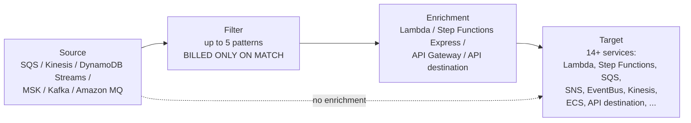
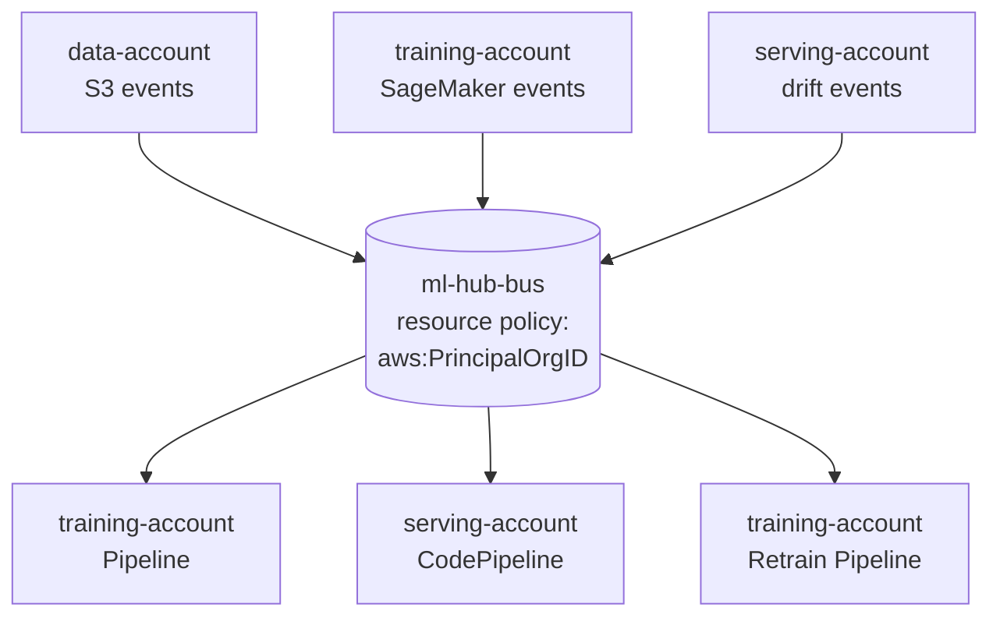
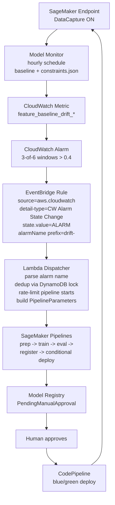

# Chapter 45 — EventBridge: schedule, rules, Pipes, Scheduler

> **Goal of this chapter:** ML systems on AWS are not woken up by polling loops or by humans pressing buttons — they are woken up by *events*. A new training file lands in S3; a CloudWatch alarm trips because Model Monitor detected drift; the Model Registry status flips from `PendingManualApproval` to `Approved`; the clock strikes 02:00 in New York. Each of these is an event, and Amazon EventBridge is the AWS-native router that turns events into actions. By the end of this chapter you should be able to (a) tell Rules, Scheduler, and Pipes apart on first sight; (b) write an event pattern that filters a SageMaker model-package event by approval status; (c) wire the canonical drift→retrain loop end to end with the right service at every hop; (d) defend a multi-account central-bus design in front of a security architect; and (e) recognize the ten exam-trap shapes EventBridge questions take on the MLA-C01. This chapter sits in Part H (Monitoring + Governance), but it is structurally a *plumbing* chapter — most of what you build in Parts G (Deployment) and I (Monitoring/Governance) is wired through EventBridge.

---

## 45.1 Why ML systems wake up

Open any mature MLOps architecture diagram and trace the arrows. The compute boxes are familiar — SageMaker Pipelines, Step Functions, Lambda, Glue, CodePipeline. The interesting part is the *arrows between them*. Those arrows are not function calls. They are not polling loops. They are not cron jobs running on an EC2 box that someone forgot to terminate. In a well-designed AWS-native ML platform, they are EventBridge.

This is a different way of thinking about systems than the synchronous request/response model most engineers learn first. A synchronous system has one component call another and wait for a result. An event-driven system has one component announce that *something happened*, and zero-to-many other components react to the announcement. The producer does not know who the consumers are; the consumers do not know who the producer is; the router (EventBridge) sits in the middle and matches events to subscribers based on declarative rules.

This loose coupling is exactly what an ML platform needs. Consider the alternatives. If the training pipeline had to call the deployment pipeline directly, the training team would need to know which deployment pipeline to call, what its IAM role is, and what its API contract looks like. Add a second deployment target (say, a Databricks job for downstream scoring) and the training team has to ship new code. Worse, if a third team wants to listen for "a model was trained" — say, a governance dashboard, or a Slack notifier — every one of them has to be wired into the training pipeline's code. This does not scale.

EventBridge inverts the relationship. The training pipeline announces `SageMaker Model Package State Change` to the event bus. The deployment pipeline, the governance dashboard, and the Slack notifier each subscribe to that event independently. None of them know about each other. None of the training team's code changes when a new subscriber appears. This is the architectural payoff.

The MLA-C01 exam tests this directly. You will see scenarios that read like:

- "A new training dataset lands in `s3://ml-training-data/fraud/` — trigger retraining without polling."
- "Model Monitor detects drift on the fraud-detector endpoint — start a retraining pipeline."
- "When the Model Registry status flips to `Approved` for the fraud model, start the deploy pipeline."
- "Run a nightly batch retraining job at 02:00 New York time, accounting for daylight saving."
- "Stream high-value transactions from Kinesis to a fraud-scoring Lambda with customer-context enrichment, filtering out transactions under $1,000."

Every one of those is an EventBridge problem. Choosing the *right* EventBridge mechanism (Rules, Scheduler, or Pipes) is the whole point of the question, and the cert tests this distinction more reliably than almost any other Part H topic.

⚠️ **Exam alert.** When you see "trigger X when Y happens" on the MLA-C01, your default move is EventBridge. The exceptions (Lambda event-source mappings for SQS/Kinesis, Step Functions for multi-step orchestration) are narrow and the question will usually telegraph them. If the answer choices include "Lambda polling" or "scheduled CloudWatch Events rule," those are almost always distractors — EventBridge is the modern, AWS-recommended answer.

---

## 45.2 The three things sold under one brand

EventBridge as it exists in May 2026 is three architecturally distinct sub-services sharing a brand and a console. Treating them as a single thing is the most common conceptual error on the exam and the one that costs the most points, because three different question patterns key off the distinction.

| Mechanism | Model | Primary use | Distinguishing trait |
|---|---|---|---|
| **Event buses + Rules** | Many-to-many routing | Reactive integration: AWS service events, custom application events | Up to 5 targets per rule; content-based filtering on event JSON |
| **EventBridge Scheduler** | Time-based dispatch | Cron, rate, and one-time `at()` schedules | 270+ AWS service targets; flexible windows; per-schedule retries/DLQ; timezone-aware |
| **EventBridge Pipes** | Point-to-point with optional middle stages | Stream/queue → target with filter + enrich | One source, one target; replaces hand-rolled Lambda plumbing |

The clean mental model:

```
Event buses + Rules → "broadcast and subscribe"
Scheduler           → "trigger at this time"
Pipes               → "ETL-lite for events"
```

These were once one service. The architectural split happened deliberately:

- **Pipes** launched at re:Invent 2022 (GA December 2022) to compete with the genre of three-line Lambda functions that just shovel events between two AWS services.
- **Scheduler** launched in **November 2022** as a separate dedicated scheduling service. The Rules service was never engineered for millions of one-time future-dated schedules and was bumping against quotas at large platforms.

You don't need to memorize the launch dates. You do need to know which one solves which problem. The decision tree in §45.13 collapses the choice to three questions.

---

## 45.3 Event buses — default, custom, and partner

### 45.3.1 The three bus types

Every event flows through an *event bus*. Three bus types exist:

| Bus type | Who writes to it | Use case |
|---|---|---|
| **Default bus** | AWS services (automatically) | Reacting to AWS service state changes (SageMaker, S3, CloudWatch alarms, IAM, EC2, etc.) |
| **Custom bus** | Your applications via `PutEvents` | Your own domain events (`OrderPlaced`, `ModelTrainingStarted`) |
| **Partner event bus** | SaaS partners via Partner Event Source | Datadog, MongoDB Atlas, Auth0, PagerDuty, Stripe, Zendesk, and ~30 others |

Each AWS account has **exactly one default bus per region**. Custom buses are additive (soft quota: 100 per region). Partner buses are created automatically when you accept an integration from the AWS Partner Network catalog.

### 45.3.2 Why ML platforms create custom buses

Three concrete reasons mature MLOps teams create a dedicated bus (`ml-platform-bus`) rather than firing everything through the default bus:

1. **Isolation.** Your retraining pipeline should not fire because somebody's CloudWatch alarm flapped on an unrelated workload. A dedicated bus shrinks the blast radius of a misconfigured rule.
2. **IAM scoping.** Rules and `PutEvents` permissions can be granted at bus level. A producer team writes events without being able to read or modify routing.
3. **Replay scoping.** Archives are bound to a single bus. Archiving everything on the default bus is expensive and noisy; archiving just the ml-platform-bus gives you a clean replay history for ML events only.

### 45.3.3 `PutEvents` mechanics

Custom events arrive via `PutEvents`:

```python
import boto3, json
client = boto3.client("events")
client.put_events(Entries=[{
    "Source": "com.acme.mlops",
    "DetailType": "ModelTrainingCompleted",
    "Detail": json.dumps({
        "modelPackageGroup": "fraud-detector",
        "trainingJob": "fraud-2026-05-26",
        "metric": {"auc": 0.913}
    }),
    "EventBusName": "ml-platform-bus",
    "Resources": ["arn:aws:sagemaker:us-east-1:111122223333:training-job/fraud-2026-05-26"]
}])
```

The contract:

- Batches up to **10 entries per call**, **1 MB per request** post-January 2026 (was 256 KB before — see §45.5).
- Returns per-entry success/failure; inspect `FailedEntryCount` and resubmit failures.
- The `Source` namespace is conventionally reverse-DNS for your apps (`com.acme.mlops`); AWS services use `aws.<service>`.

---

## 45.4 Event anatomy — the envelope

Every event flowing through EventBridge — whether emitted by SageMaker, S3, CloudWatch, or your own code — shares an outer envelope. Knowing the envelope fields is required for writing rules.

```json
{
  "version": "0",
  "id": "1f3e7a2d-8c3a-4c3f-9b2e-...",
  "detail-type": "SageMaker Model Package State Change",
  "source": "aws.sagemaker",
  "account": "111122223333",
  "time": "2026-05-26T14:32:11Z",
  "region": "us-east-1",
  "resources": [
    "arn:aws:sagemaker:us-east-1:111122223333:model-package/fraud-detector/3"
  ],
  "detail": {
    "ModelPackageGroupName": "fraud-detector",
    "ModelPackageVersion": 3,
    "ModelApprovalStatus": "Approved",
    "ModelPackageStatus": "Completed"
  }
}
```

| Field | Meaning |
|---|---|
| `source` | The producer namespace. AWS services use `aws.<service>`; your apps use reverse-DNS like `com.acme.mlops`. |
| `detail-type` | A free-form classifier of the event type within the source. |
| `detail` | The arbitrary JSON payload — this is what you usually pattern-match against. |
| `resources` | ARNs the event is about. Informational; rarely useful for pattern matching. |
| `time`, `id` | Set by EventBridge. Reserved — you cannot filter on these in patterns. |

There are no HTTP-style headers. Everything is in the JSON body. There is no FIFO ordering guarantee across the bus. There is no delivery deadline beyond 24 hours of retries on the default routing path.

---

## 45.5 The January 2026 1 MB payload bump

On **January 29, 2026** AWS bumped the EventBridge maximum event size from **256 KB to 1 MB** for both `PutEvents` and `PutPartnerEvents`. This is a quiet but architecturally important change for ML.

**What changed:**

- New max event size: **1 MB** (was 256 KB) for `PutEvents`, `PutPartnerEvents`, SQS `SendMessage`, and Lambda `Invoke`/event-source-mapping batches — these all moved in lockstep.
- **Automatic.** No SDK upgrade, no opt-in, no API version bump.
- Available in all EventBridge regions **except** Taipei, Malaysia, Thailand, Mexico, and New Zealand (these come later).
- **Billing is still metered per 64 KB chunk.** A 1 MB event costs **16x** what a 64 KB event costs in EventBridge custom-event pricing. The limit went up; the unit price did not.

**Why ML cares.** Before the bump, the workaround for large payloads was the **claim-check pattern** — write the real payload to S3, put a pointer in the event, and the consumer re-reads from S3. Common ML cases that needed this:

- **SHAP attribution dumps** per inference (~50–500 KB) — too big at 256 KB, fit comfortably at 1 MB.
- **Model evaluation reports** — confusion matrices, calibration curves serialized to JSON — comfortably under 1 MB.
- **Drift events with full distribution snapshots** rather than a scalar metric.
- **GenAI prompt/response logging** — LLM apps with structured-output JSON regularly exceeded 256 KB; 1 MB now covers most production cases.

The practical recommendation: drift/retraining trigger events are fine to inline up to 1 MB now (low-volume, high-value events justify the 16x). High-volume inference telemetry should keep using S3 claim-check (the per-64KB billing punishes you at scale).

⚠️ **Exam alert.** If a 2026-dated question asks "can the SHAP explanation be sent inline in the event payload?" the answer is **yes, up to 1 MB**. Older study material says 256 KB; that's stale post-January 2026.

---

## 45.6 Rules — event-pattern matching

A rule has three parts: an event pattern, a target list (up to 5), and an optional input transformer per target. EventBridge runs the pattern against every event arriving on the bus; matches are routed to the target list.

### 45.6.1 Pattern syntax

Patterns are JSON whose structure mirrors the event being matched. A field appears in the pattern only if you want to filter on it. Each value is a **list of matchers** (logical OR within the list).

Match every approved SageMaker model package for the fraud-detector group:

```json
{
  "source": ["aws.sagemaker"],
  "detail-type": ["SageMaker Model Package State Change"],
  "detail": {
    "ModelApprovalStatus": ["Approved"],
    "ModelPackageGroupName": ["fraud-detector"]
  }
}
```

### 45.6.2 Content-based filtering operators

A pattern is not just literal values. EventBridge supports rich content filters that the exam tests heavily.

| Operator | Syntax | Use |
|---|---|---|
| Exact match | `"field": ["value"]` | Literal equality |
| Prefix | `[{"prefix": "fraud-"}]` | String starts with |
| Suffix | `[{"suffix": ".csv"}]` | String ends with (2022) |
| Anything-but | `[{"anything-but": ["test", "dev"]}]` | Negation |
| Numeric | `[{"numeric": [">", 1000, "<=", 50000]}]` | Range comparisons |
| Exists | `[{"exists": true}]` / `false` | Field presence/absence |
| Equals-ignore-case | `[{"equals-ignore-case": "approved"}]` | Case-insensitive equality |
| IP-address | `[{"cidr": "10.0.0.0/8"}]` | CIDR match |
| `$or` | `{"$or": [pattern1, pattern2]}` | Top-level OR across whole sub-patterns |
| Wildcard `*` | `[{"wildcard": "fraud-*-2026"}]` | Glob pattern (2023) |

A combined example — match S3 object-created events for training-data CSVs in a specific prefix, only when the file is non-trivial:

```json
{
  "source": ["aws.s3"],
  "detail-type": ["Object Created"],
  "detail": {
    "bucket": { "name": ["ml-training-data"] },
    "object": {
      "key": [{ "prefix": "datasets/fraud/" }, { "suffix": ".csv" }],
      "size": [{ "numeric": [">", 1024] }]
    }
  }
}
```

### 45.6.3 Input transformer

After a rule matches, you can rewrite the event payload before it reaches the target. This is critical when the target's API contract does not match the raw event shape.

```yaml
InputPathsMap:
  modelArn: "$.detail.ModelPackageArn"
  status:   "$.detail.ModelApprovalStatus"
InputTemplate: |
  {
    "model_arn": "<modelArn>",
    "action": "deploy",
    "approval": "<status>"
  }
```

Common ML uses:

- Strip large `detail` fields so the target receives only what it needs.
- Reshape an `aws.s3` event into a SageMaker Pipeline `Parameters` map.
- Inject constants the target expects (`"action": "deploy"`).

### 45.6.4 Schedule rules vs Scheduler (legacy callout)

Rules also support `ScheduleExpression` (cron/rate) — these are the **legacy** schedule rules that EventBridge Scheduler largely supersedes. AWS still supports schedule rules, but recommends Scheduler for all new time-based work. Schedule rules are **UTC-only** and capped at **2 retries** — both significant compared to Scheduler's timezone support and 185-attempt retry policy. See §45.7.

---

## 45.7 EventBridge Scheduler — the 2022+ dedicated scheduling service

### 45.7.1 Why Scheduler exists as a separate service

Schedule rules predate Scheduler by years, but they live on the event bus and inherit its constraints. AWS launched **EventBridge Scheduler in November 2022** as a separate, dedicated control plane optimized for:

- **Massive scale** — up to **1 million schedules per account per region** (soft quota), vs. the practical thousands the Rules service handles.
- **One-time, future-dated schedules** — for example, "run a re-evaluation on this endpoint at 2026-06-15T03:00Z." The `at()` expression has no equivalent in Rules.
- **Timezones** — Rules are UTC-only; Scheduler supports 60+ IANA-named time zones, with full DST handling.
- **Per-schedule customization** — each schedule has its own retry policy, DLQ, IAM role, and flexible window.
- **Universal target API** — Scheduler can invoke **270+ AWS services and 6,000+ API operations** by name, well beyond the rule target list.

### 45.7.2 Schedule expressions

| Expression | Form | Example |
|---|---|---|
| `rate` | `rate(N unit)` | `rate(15 minutes)` |
| `cron` | `cron(min hour day month dow year)` | `cron(0 2 ? * MON-FRI *)` (02:00 weekdays) |
| `at` | `at(YYYY-MM-DDThh:mm:ss)` | `at(2026-06-15T03:00:00)` |

`at()` is **only available in Scheduler** — schedule rules cannot do one-time invocations.

### 45.7.3 Schedule groups and per-schedule attributes

Schedule **groups** are organizational containers (think first-class tags). Every schedule lives in a group; the `default` group exists automatically. Groups are used for IAM scoping, bulk operations (disable/delete all schedules in a group), and tagging/cost allocation.

Per-schedule attributes you should know:

- **State**: `ENABLED` or `DISABLED`.
- **Action after completion** (for `at()` and bounded schedules): `NONE` or `DELETE` (auto-cleanup).
- **Flexible time window**: `OFF` (precise) or `FLEXIBLE` with `MaximumWindowInMinutes` 1–1440 — randomizes invocation across the window to disperse load.
- **Retry policy**: `MaximumEventAgeInSeconds` (60–86,400) and `MaximumRetryAttempts` (0–185).
- **DLQ**: SQS queue ARN for terminally-failed deliveries.

### 45.7.4 Throughput

Scheduler is engineered for "effectively unlimited" scale for typical ML workloads:

- Up to **1 million invocations per second per region** (account-level throttle, soft).
- Hundreds of millions of schedules per account possible.

The "14M events/sec" figure in some marketing refers to **aggregated event-bus throughput**, not Scheduler. You will not be asked to memorize the exact number on the exam.

### 45.7.5 Templated vs universal targets

**Templated targets** (the simple form) — pre-built integrations for the five most common targets, with first-class console support:

- Lambda function
- SQS queue
- SNS topic
- EventBridge event bus
- Step Functions state machine

**Universal target parameter (UTP)** — addresses any AWS API by name. This is how you invoke `sagemaker:StartPipelineExecution`, `glue:StartJobRun`, `batch:SubmitJob`, etc., without needing a Lambda glue function.

A canonical ML schedule — nightly retraining at 02:00 New York time with a 15-minute jitter window:

```yaml
ScheduleExpression: "cron(0 2 * * ? *)"
ScheduleExpressionTimezone: "America/New_York"
FlexibleTimeWindow:
  Mode: FLEXIBLE
  MaximumWindowInMinutes: 15
Target:
  Arn: arn:aws:scheduler:::aws-sdk:sagemaker:startPipelineExecution
  RoleArn: arn:aws:iam::111122223333:role/SchedulerInvokesPipeline
  Input: |
    {
      "PipelineName": "nightly-retrain",
      "PipelineParameters": [
        {"Name": "InputDataPrefix", "Value": "s3://bucket/data/<aws.scheduler.scheduled-time>/"}
      ]
    }
RetryPolicy:
  MaximumEventAgeInSeconds: 3600
  MaximumRetryAttempts: 3
DeadLetterConfig:
  Arn: arn:aws:sqs:us-east-1:111122223333:sched-dlq
```

`<aws.scheduler.scheduled-time>` is one of several **context attribute placeholders** Scheduler exposes, letting you parameterize pipeline inputs by the scheduled time.

⚠️ **Exam alert — Scheduler timezone vs Rules UTC-only.** A frequent exam scenario: "you need to run a SageMaker pipeline every Monday at 02:00 New York time, and it must honor daylight saving." Schedule rules are **UTC-only** and do not handle DST. The correct answer is **EventBridge Scheduler** with `ScheduleExpressionTimezone: "America/New_York"`. This trap kills candidates who memorize "EventBridge does cron" without distinguishing Rules from Scheduler.

### 45.7.6 When to pick Scheduler over a Rule

| Need | Pick |
|---|---|
| Time-based recurring invocation | **Scheduler** |
| One-time future invocation | **Scheduler** (Rules cannot do `at()`) |
| Non-UTC timezone, DST awareness | **Scheduler** |
| Spread load over a window | **Scheduler** (FlexibleTimeWindow) |
| Target an API not in the rule target list | **Scheduler** (UTP) |
| React to an event (S3 upload, model approval, drift alarm) | **Rule** |

---

## 45.8 EventBridge Pipes — source → filter → enrich → target

### 45.8.1 The pipe model

A pipe is a **one-source-to-one-target** integration with two optional middle stages:



This replaces an entire genre of "Lambda glue" code: read from queue, lookup something in DynamoDB, write to another service. Pipes give you that whole pipeline as **configuration**.

### 45.8.2 Sources — stream and queue only

Pipes accept **streaming and queue-based sources only**. This is the key difference from event buses (which accept push events via `PutEvents`).

| Source | Notes |
|---|---|
| **Amazon SQS** (Standard and FIFO) | Most common; consume queue messages |
| **Amazon Kinesis Data Streams** | Per-shard parallelism, ordering within shard |
| **Amazon DynamoDB Streams** | React to table item changes |
| **Amazon MSK** (Managed Streaming for Kafka) | Topic-based |
| **Self-managed Apache Kafka** | Bootstrap-server-based |
| **Amazon MQ** (ActiveMQ and RabbitMQ) | Broker-based |

### 45.8.3 Filtering — billed-on-match-only

Same content-filter syntax as Rules (§45.6.2). Up to 5 filter criteria per pipe. **You are only billed for events that pass the filter.** This is the most under-appreciated cost lever in EventBridge.

Worked example. A retail platform's DynamoDB Stream emits 10 million events per day. 85% are TTL removals (`eventName=REMOVE`) that the downstream consumer does not care about. Filtering them out at the Pipe means:

- ~85% drop in target invocations (Lambda, in this case).
- Roughly **$34/month savings** on Lambda invocation cost alone (before compute) at this volume — a number the docs cite as the canonical Pipes savings story.
- Zero application code to read, filter, and discard.

⚠️ **Exam alert — Pipes filtering reduces invocation cost.** The exam-relevant heuristic: if a question describes "filtering a high-volume Kinesis or DynamoDB stream to a target that should only see a small percentage of events," Pipes-with-filter is the answer. Lambda event-source mapping with a Lambda-level filter is a distractor that costs more.

### 45.8.4 Enrichment — the optional middle stage

The enrichment stage calls one of:

- **Lambda function** — most flexible; up to 6 MB sync payload.
- **Step Functions Express workflow** — synchronous; useful for orchestration-style enrichment.
- **API Gateway (REST or HTTP API)** — call your own service.
- **EventBridge API destination** — call an external HTTPS endpoint with managed auth.

The enrichment stage returns an updated payload (or array of payloads if batched) that becomes the target's input.

### 45.8.5 Targets

Pipes can target **any EventBridge target type** (Lambda, Step Functions, SQS, SNS, Kinesis, ECS task, EventBus, API destinations, etc.) — significantly broader than the source list.

### 45.8.6 Worked example — streaming inference for fraud

Incoming transactions land in Kinesis. Only transactions over $1,000 get scored. Each is enriched with the customer profile from a Lambda lookup. The result is sent to a scoring Lambda that calls a SageMaker endpoint and writes predictions to DynamoDB.

```yaml
Source: arn:aws:kinesis:us-east-1:111122223333:stream/transactions
SourceParameters:
  KinesisStreamParameters:
    StartingPosition: LATEST
    BatchSize: 25
    MaximumBatchingWindowInSeconds: 1
FilterCriteria:
  Filters:
    - Pattern: '{"data":{"amount":[{"numeric":[">",1000]}]}}'
Enrichment: arn:aws:lambda:us-east-1:111122223333:function:customer-lookup
Target: arn:aws:lambda:us-east-1:111122223333:function:score-transaction
TargetParameters:
  InputTemplate: |
    {
      "txn_id": <$.data.id>,
      "amount": <$.data.amount>,
      "customer": <$.enrichment.customer_profile>
    }
```

Three things to notice. First, the filter happens before Lambda is invoked, so you do not pay Lambda for the 99% of transactions under $1,000. Second, the enrichment Lambda is called only on filtered matches (also a cost win). Third, the target Lambda receives a clean, reshaped payload thanks to the input template — no JSON-digging in the target code.

### 45.8.7 Pipes caveats the docs underplay

- **No managed re-drive for failed events.** You must wire your own DLQ drain.
- **DynamoDB Streams expire after 24 hours.** If your Pipe target is down longer than that, events are gone. Compare to Kinesis (default 24h, configurable up to 365 days) or SQS (4–14 day retention).
- **Batch retry retriggers the entire batch.** Idempotent targets are not optional — they are required.
- **Pipes has its own concurrency throttling** independent of the source's shard/queue limits. Surprised many early adopters.

### 45.8.8 When NOT to use Pipes

If your "glue" does any of:

- Calls 2+ external APIs (use Step Functions instead).
- Has any business logic beyond a single JSONPath filter and a single enrichment call (use Lambda + EventBridge).
- Needs to fan out to >1 target type (use EventBridge bus with rules — Pipes is point-to-point by design).

The exam-relevant heuristic: **Pipes = one source, one target, optional filter, optional single enrichment.** Anything more, drop back to Lambda or Step Functions.

---

## 45.9 Schema Registry and code-gen

The **Schema Registry** is a free-tier EventBridge feature that:

- **Discovers schemas automatically** by sniffing events on a bus you opt in (`StartDiscoverer`).
- **Stores schemas** in OpenAPI 3 / JSONSchema Draft 4 format under named **registries**:
  - `aws.events` (built-in, AWS service events).
  - `discovered-schemas` (auto-discovered from sniffing).
  - Custom registries for your own schemas.
- **Generates code bindings** in **Java, Python, TypeScript, Golang**. The generated classes are POJOs/dataclasses you can use in producers and consumers for strongly-typed event handling.

Why ML teams care: producers (a training pipeline emitting `ModelTrainedEvent`) and consumers (a downstream deployment Lambda in a different repo) can share a contract without hand-coded data classes. A Lambda team can `pip install` a generated package and get type-safe access to `event.detail.ModelApprovalStatus`. Schema versioning is automatic; consumers can pin to a version and break loudly when producers ship a breaking change.

Production posture, per industry practice:

- Enable Discovery in dev/staging (free for the first 5M events/month).
- Run discovery for a week before going live to capture the full range of event shapes.
- Wire code-binding generation into CI/CD — common pattern is a nightly action that pulls the latest schema versions and regenerates the typed client library.

The exam tests **awareness** of Schema Registry. Deep schema-engineering trivia is not tested — knowing it exists, knowing it auto-discovers, and knowing it can generate code bindings is enough.

---

## 45.10 Archive and replay

### 45.10.1 Archive

An **archive** is an opt-in retention of events flowing through a bus, optionally filtered by an event pattern:

- Retention: 1 day to indefinite.
- Encryption at rest (AWS-managed KMS by default; customer KMS available).
- Cost: per-GB stored per month.
- Scope: one archive is bound to one bus.

### 45.10.2 Replay

A **replay** plays archived events back through the source bus over a chosen time window:

- Configure start and end time of the archived events to replay.
- Configure which **rules** the replayed events trigger (optional filter).
- Replayed events are tagged so consumers can distinguish replays from live traffic.

### 45.10.3 ML uses

- **Backfill a new consumer.** A newly added drift-alerter Lambda needs the past month of events to bootstrap its state.
- **Recover from a downstream outage.** Step Functions hit a transient error for four hours; replay the missed events.
- **Debug a production incident.** Replay a specific time window in a non-prod account to reproduce the failure.

---

## 45.11 Cross-account routing — the central-bus pattern

The canonical enterprise pattern: a **central event bus** in a hub account, with spoke accounts (data, training, serving, monitoring) sending and receiving events.



### 45.11.1 Mechanism

- The hub bus has a **resource-based policy** allowing `PutEvents` from named spoke accounts — typically scoped with `aws:PrincipalOrgID` so any account in the Organization can put events to it without per-account principals.
- A spoke account creates a **rule** that targets the hub bus's ARN.
- The hub bus has **rules that re-route** to other spoke buses or in-region targets.

### 45.11.2 The one-hop rule

⚠️ **Exam alert — cross-account is one hop.** Local → Central → Local works. Local → Central → Local → Local does *not*. There is no transitive routing across multiple central buses. Same rule applies cross-region (one cross-region hop per event flow). This is a common exam trap: the question shows a four-hop diagram and asks why the event doesn't arrive.

### 45.11.3 Who pays

The **sender pays** for custom events; the receiver does not get billed for the inbound put. Important when a shared platform team is sending to many spoke accounts — the platform account absorbs the cost.

### 45.11.4 Cross-account targets (2024 simplification)

AWS announced **native cross-account targets** for event buses in 2024 — previously you needed a same-account rule with a remote bus as target; now you can declare cross-account targets natively. The receiving bus's resource policy is the only auth surface; no extra IAM role on the sender. Most teams have not migrated old configurations, but new platforms use this from day one.

---

## 45.12 API destinations — Slack, PagerDuty, Databricks, ServiceNow

An **API destination** is a managed integration to an arbitrary HTTPS endpoint, with two halves:

- **Connection** — authentication config (Basic, API-Key, OAuth). EventBridge handles OAuth token refresh transparently.
- **API destination** — the HTTPS URL + HTTP method + invocation rate limit.

### 45.12.1 What API destinations buy you

Instead of writing a Lambda whose only job is to POST a webhook, declare the API destination once and use it as a rule target. EventBridge handles:

- **Auth** — including OAuth refresh.
- **Retries** — exponential backoff up to 24 hours.
- **Rate limiting** — declared `invocation-rate-limit-per-second` so a retraining storm does not DDOS your PagerDuty service.
- **DLQ** — failed deliveries to SQS for human inspection.
- **Input transformer** — reshape into the destination's expected payload, no Lambda required.

### 45.12.2 ML platform alerting cases

- **Drift alarm → Slack channel.** Model name, severity, and a link to the SageMaker Studio Model Monitor report. Input transformer builds the Slack Block Kit JSON inline.
- **Training job failure → PagerDuty incident.** Rule on `aws.sagemaker / SageMaker Training Job State Change` filtered to `detail.TrainingJobStatus=Failed`. PagerDuty Events API v2 accepts the payload directly; severity from the training job tag.
- **Model approval → Databricks job.** Triggers a downstream scoring workflow in Databricks via its Jobs REST API.
- **Model approval → ServiceNow change ticket.** Eliminates the manual ticket-creation step.

### 45.12.3 Caveat — observability

API destinations have less visibility than Lambda. No log group for the HTTP call; you see retries and failures in CloudWatch metrics (`InvocationsFailedToBeSentToDlq`) but not the full response body. Teams keep a Lambda fallback for the highest-stakes alert paths (PagerDuty critical) and use API destinations for everything else (Slack, Datadog event annotations).

---

## 45.13 The `aws.sagemaker` event catalog

The default bus receives a rich event catalog from SageMaker. The MLA-C01 expects fluency with the event types most relevant to MLOps. Eight you should know cold:

| `detail-type` | Fires when | Key `detail.*` fields |
|---|---|---|
| `SageMaker Training Job State Change` | Training job transitions | `TrainingJobStatus`, `FailureReason`, `ModelArtifacts.S3ModelArtifacts` |
| `SageMaker Processing Job State Change` | Processing job transitions | `ProcessingJobStatus` |
| `SageMaker Transform Job State Change` | Batch transform | `TransformJobStatus`, `ModelName` |
| `SageMaker HyperParameter Tuning Job State Change` | HPO transitions | `HyperParameterTuningJobStatus` |
| `SageMaker Model Package State Change` | Model Registry actions | `ModelPackageStatus`, `ModelApprovalStatus`, `ModelPackageGroupName`, `ModelPackageVersion` |
| `SageMaker Pipeline Execution Status Change` | Pipeline transitions | `pipelineExecutionStatus`, `pipelineExecutionArn` |
| `SageMaker Pipeline Step Status Change` | Step transitions | `currentStepStatus`, `stepName` |
| `SageMaker Endpoint Deployment State Change` | Endpoint create/update/delete | `EndpointStatus`, `EndpointName` |

Plus several others — Feature Group lifecycle, Inference Recommender status, Model Card publish, Model Monitor schedule transitions. Two patterns power most exam scenarios:

**Approval-triggered deploy:**

```json
{
  "source": ["aws.sagemaker"],
  "detail-type": ["SageMaker Model Package State Change"],
  "detail": {
    "ModelApprovalStatus": ["Approved"],
    "ModelPackageGroupName": ["fraud-detector"]
  }
}
```

**Pipeline-failure alert:**

```json
{
  "source": ["aws.sagemaker"],
  "detail-type": ["SageMaker Pipeline Execution Status Change"],
  "detail": {
    "pipelineExecutionStatus": ["Failed"]
  }
}
```

These two patterns alone power most exam scenarios on automated MLOps.

---

## 45.14 The canonical drift → retrain loop

This is the reference architecture every MLOps team builds eventually, and the exam tests it in some form on roughly half the Part H orchestration questions. Memorize the flow.



Two things to internalize:

1. **EventBridge does not call SageMaker Pipelines directly in the drift-triggered path.** It calls Lambda, because the alarm event does not carry the pipeline name or parameters; the Lambda is where you map "which model drifted" → "which pipeline + which parameters." You **can** target a Pipeline directly from EventBridge (it has been a first-class target since 2021), and many teams do that for the **scheduled** retrain path — but the **drift-triggered** path almost always goes via Lambda.
2. **The alarm name is the routing key.** Teams use a naming convention like `drift-<model_pkg_group>-<feature>` so a single EventBridge rule with a `prefix("drift-")` pattern catches every drift alarm in the account. Lambda parses the suffix to decide which pipeline to start. This avoids one EventBridge rule per model — which becomes a quota problem fast (300 rules per bus default).

**Production gotchas** that the exam may surface:

- Hourly Model Monitor + 1-hour alarm evaluation = ~2-hour detection latency. Real-time fraud/recsys models bypass Model Monitor and emit their own drift metric (PSI, KL divergence) from a streaming consumer; the EventBridge plumbing downstream is identical.
- Without tuned `datapoints_to_alarm` and `evaluation_periods`, a single bad hour retrains the model. Community consensus: **3 of 6** (drift must be high for 3 of the last 6 windows) before alarming.
- Retrain storms: if 200 endpoints share a baseline and the baseline goes stale, every alarm fires. Lambda must rate-limit pipeline starts (account default is 4 concurrent training jobs of a given instance type).

Cross-link: see Ch 48 (Model Monitor → drift alarm) for the drift-detection side of this loop, and Ch 46 (CodePipeline EventBridge triggers) for the deploy-side wiring.

---

## 45.15 Seven ML trigger patterns to know cold

### 45.15.1 New training data → retrain

```
S3 (Object Created on s3://ml-data/fraud/)
  → Rule (source=aws.s3, detail-type=Object Created, prefix=fraud/)
  → Target: SageMaker Pipeline (StartPipelineExecution with prefix as parameter)
```

⚠️ **Exam alert — S3-to-EventBridge is a per-bucket toggle.** S3 buckets do *not* publish to EventBridge by default. You must enable **Amazon EventBridge** notifications in the bucket's Properties → Event notifications section. The classic exam stem: "you wired the rule but it doesn't fire — why?" Answer: the bucket's EventBridge toggle is off.

### 45.15.2 Drift detected → retrain

(The canonical pattern from §45.14.)

### 45.15.3 Scheduled weekly retraining

```
EventBridge Scheduler (cron(0 3 ? * SUN *), timezone=America/New_York)
  → Target: arn:aws:scheduler:::aws-sdk:sagemaker:startPipelineExecution
  → PipelineParameters injects last-week's data prefix via <aws.scheduler.scheduled-time>
```

### 45.15.4 Model approval → deploy

```
Manual approval in Model Registry
  → aws.sagemaker Model Package State Change (Approved)
  → Rule → CodePipeline (StartPipelineExecution with ModelPackageArn as pipeline variable)
  → CodePipeline deploys via CodeDeploy blue/green
```

### 45.15.5 Streaming inference with enrichment (Pipes)

```
Kinesis Data Stream (transactions)
  → EventBridge Pipe (filter: amount > 1000)
  → Lambda enrichment (customer-lookup from DynamoDB)
  → Lambda target (SageMaker endpoint invocation)
  → DynamoDB (write predictions)
```

### 45.15.6 Cross-platform — trigger Databricks on model approval

```
SageMaker Model Package State Change (Approved)
  → Rule → API destination (Databricks Jobs REST API)
  → Databricks job runs the post-processing/scoring workflow
```

### 45.15.7 Pipeline failure → SNS alert + ticket

```
Pipeline Execution Status Change (Failed)
  → Rule with two targets:
       1. SNS topic (email to ml-ops@)
       2. API destination (Jira create-issue endpoint)
```

These seven cover ~90% of Part H trigger-pattern scenarios on the exam.

---

## 45.16 Decision tree — Rules vs Scheduler vs Pipes

When you see an EventBridge question, walk this tree:

```
Q1: Is the trigger TIME-BASED (cron, rate, at)?
    YES → EventBridge Scheduler  ✓
    NO  → continue

Q2: Is the source a STREAM or QUEUE
     (SQS, Kinesis, DynamoDB Streams, MSK, Kafka, MQ)?
    YES → continue to Q3
    NO  → EventBridge RULE on a bus  ✓

Q3: Is there ONE target and do you need filter+enrich plumbing?
    YES → EventBridge PIPES  ✓
    NO  → Lambda event-source mapping (or many-to-many → bus)
```

The single most common exam confusion is **Pipes vs Lambda event-source mapping for SQS/Kinesis**. The differentiator:

- **Lambda event-source mapping** is appropriate when the only thing you do is call one Lambda. No enrichment, no filtering beyond Lambda-level, no transformation, no target other than Lambda.
- **EventBridge Pipes** is appropriate when you want declarative filtering (billed on matches only), declarative enrichment (Lambda or API), and any target type.

---

## 45.17 Quotas, IAM, and pricing (May 2026)

### 45.17.1 Key quotas

| Resource | Default | Adjustable? |
|---|---|---|
| Event size (post-Jan-2026) | **1 MB** | No |
| `PutEvents` request size | 1 MB | No |
| `PutEvents` entries per request | 10 | No |
| Custom event buses per region | 100 | Yes |
| Rules per event bus | 300 | Yes |
| Targets per rule | 5 | No |
| Scheduler — schedules per account per region | 1,000,000 | Yes |
| Scheduler — invocation throttle | 1,000/sec | Yes |
| Pipes per region | 1,000 | Yes |
| Pipe filter criteria per pipe | 5 | Yes |
| Target retry attempts | 185 | No |
| Target retry max age | 24 hours | No |

### 45.17.2 IAM model

- **Producer side:** `events:PutEvents` (per bus resource). Each of Rules, Pipes, Scheduler has its own service principal, and the rule/pipe/schedule **assumes an IAM role** to invoke the target. The role's trust policy must permit the appropriate service.
- **Resource policies:** buses can have a resource-based policy to allow cross-account `PutEvents` (typically scoped with `aws:PrincipalOrgID`).
- **Tag-based access control:** supported across Rules, Schedules, and Pipes.

### 45.17.3 Pricing

- **Event buses:** **$1.00 per million custom events** (AWS service events on the default bus are free). Cross-account/cross-region events count as custom.
- **Schema discovery:** $0.10/million events ingested for discovery.
- **Archive:** per-GB-month stored.
- **Replay:** per-event replayed.
- **Scheduler:** **$1.00 per million invocations**. No per-schedule fee.
- **Pipes:** **$0.40 per million events processed** (matches that pass the filter), plus enrichment/target costs (Lambda billed separately).
- **API destinations:** bus event price applies; no extra per-invocation fee.

Pipes' filtering-as-billing-control is significant. A stream with 1 million events/day where only 1% match a filter costs ~$4/month, not ~$400 — because Pipes only bills for matched events.

---

## 45.18 Ten exam traps

### 1. S3-EventBridge is a per-bucket toggle

S3 does not publish to EventBridge by default. Bucket Properties → Event notifications → enable EventBridge.

### 2. Schedule rules are UTC-only; Scheduler supports timezones

For any non-UTC schedule or DST-aware schedule, the answer is **Scheduler** with `ScheduleExpressionTimezone`. Schedule rules cannot.

### 3. Cross-account routing is one hop only

Local → Central → Local works. Two hops do not. Same for cross-region.

### 4. Pipes only consume streams and queues

You cannot Pipe from a SageMaker state change directly — that is a push event on a bus, routed by a rule. Pipes sources: SQS, Kinesis, DynamoDB Streams, MSK, Kafka, Amazon MQ.

### 5. The January 2026 1 MB increase is real

In 2026-dated scenarios, events up to 1 MB inline (16x billed). Older study material says 256 KB.

### 6. Retries are per target; DLQs are per target

If a target's retries exhaust and no DLQ is configured on *that target*, the event drops silently. Always configure DLQs.

### 7. 5 targets per rule — fan out via SNS if you need more

Rule → SNS → many subscribers is the standard pattern for 6+ consumers. Cheaper and simpler than multiple rules.

### 8. Event-bus ordering is not guaranteed

If "training-completed → register-model → notify" depends on order, encode the dependency in Step Functions or a Pipeline. Do not rely on bus ordering.

### 9. DynamoDB Streams expire after 24 hours

If your Pipe's target is down longer than that, events are gone. Compare to Kinesis (configurable up to 365 days) or SQS (4–14 day retention).

### 10. Scheduler does not consume bus quotas

A common conceptual error: thinking Scheduler events flow through your default bus and count against bus quotas. They do not. Scheduler is a separate service with its own throttles and billing.

---

## 45.19 Cross-links

- **Forward:** Ch 46 (CodePipeline EventBridge triggers — the model-approval-to-deploy wiring); Ch 48 (Model Monitor → drift alarm — the upstream of the canonical loop).
- **Back:** Ch 12 (Kinesis — the streaming sources Pipes consumes); Ch 43 (SageMaker Pipelines as an EventBridge target).

---

## 45.20 Exercises

**Exercise 45.1 — Write the event pattern.** Write an EventBridge event pattern that matches: SageMaker model packages from the `fraud-detector` group whose `ModelApprovalStatus` flipped to `Approved` AND whose `ModelPackageVersion` is greater than 5. Verify your pattern syntax against §45.6.2.

**Exercise 45.2 — Pick the right mechanism.** For each scenario, name Rules, Scheduler, or Pipes:

(a) Run a SageMaker pipeline every Sunday at 03:00 Sydney time.
(b) Filter DynamoDB Stream events for `eventName=INSERT` only and write them to SQS.
(c) When the Model Registry approval status changes to `Approved`, trigger a CodePipeline.
(d) Fire a one-time future invocation of a Lambda at `2026-12-01T09:00:00`.
(e) When a CloudWatch Alarm goes into ALARM state, kick off a drift-handler Lambda.

**Exercise 45.3 — Cost math for filtering.** A Kinesis stream emits 10 million events/day. A Pipe filters out 95% of them. Compute the monthly Pipes processing cost at $0.40/M for matched events. Compare to the cost if filtering happened in a Lambda target that fired on every event (Lambda invocation cost: $0.20 per million requests). What does this tell you about Pipes' billing model?

**Exercise 45.4 — Draw the canonical loop.** Without looking back at §45.14, sketch the drift → retrain loop from `SageMaker Endpoint` to `CodePipeline deployment`, naming every component and the event type that flows between each pair. Then check against the diagram.

**Exercise 45.5 — Design a cross-account central bus.** Three accounts: `data-acct`, `training-acct`, `serving-acct`. A central `ml-platform-acct` owns the hub bus. Sketch the resource policy on the hub bus that allows all three to PutEvents using `aws:PrincipalOrgID`. Then sketch the rules in the hub bus that route training-job-failed events to a Slack API destination and model-approved events to the serving account's local CodePipeline.

**Exercise 45.6 — Diagnose the silent failure.** A team wired a rule: source `aws.s3`, detail-type `Object Created`, target = SageMaker Pipeline. They upload a file. Nothing happens. Walk through three plausible causes and the fix for each.

**Exercise 45.7 — Pipes vs Lambda ESM.** A team uses a Lambda event-source mapping on an SQS queue to route messages to two downstream services: an SNS topic (for alerting) and a DynamoDB table (for audit). They want to move to Pipes for cost reasons. Why is this a bad fit? What's the right architecture?

---

## 45.21 Recap — what to memorize

1. **Three mechanisms.** Rules for events, Scheduler for time, Pipes for stream-to-target plumbing with filter and enrich.
2. **`aws.sagemaker` event catalog** — eight detail-types that the exam tests cold (training/processing/transform/HPO/model-package/pipeline-execution/pipeline-step/endpoint-deployment state changes).
3. **The canonical drift loop.** Model Monitor → CloudWatch alarm → EventBridge rule → Lambda dispatcher → `StartPipelineExecution`. Lambda is in the middle because the alarm doesn't carry the pipeline name.
4. **Scheduler beats Rules** for any timezone, DST, one-time, or large-scale scheduling case.
5. **Pipes filtering is billed-on-match-only** — the biggest under-appreciated cost lever in EventBridge.
6. **Cross-account is one hop.** Resource policies on the hub bus with `aws:PrincipalOrgID`.
7. **S3-to-EventBridge is a per-bucket toggle.** Off by default.
8. **The January 2026 1 MB bump** — SHAP and eval reports now fit inline.
9. **API destinations** for Slack, PagerDuty, Databricks, ServiceNow — no Lambda glue needed.
10. **Pricing intuition** — $1/M custom bus events, $1/M Scheduler invocations, $0.40/M Pipes events.

If you can explain each of those to someone who has never used EventBridge, you have the exam's Part H EventBridge surface covered. The rest of Part H builds on this plumbing: Ch 46 wires CodePipeline to model-approval events, Ch 48 wires Model Monitor to drift alarms. Both speak EventBridge as their lingua franca.
