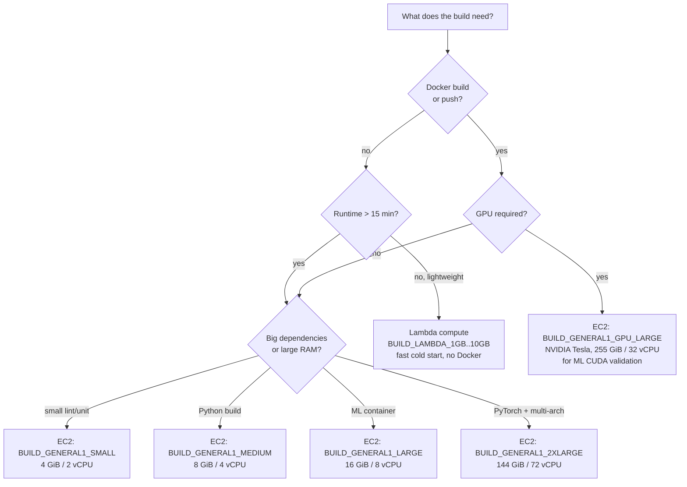
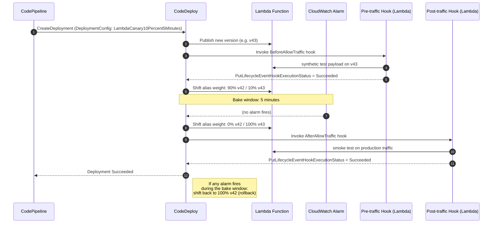

# Chapter 46 — CI/CD: CodePipeline + CodeBuild + CodeDeploy + CodeArtifact

> **Goal of this chapter:** to build the muscle memory of treating CI/CD for ML as **two pipelines, not one** — a model‑build pipeline that turns code and data into an Approved model package, and a model‑deploy pipeline that turns an Approved model package into a live endpoint with traffic guardrails — and to know exactly which AWS Code* service owns each stage of those two pipelines. By the end of the chapter you should be able to draw, on a whiteboard, the canonical reference architecture an AWS‑native bank uses to ship a fraud model from a `git push` to a 10% canary in production, name the CloudWatch alarms wired into the auto‑rollback, and answer — without hesitation — why CodeDeploy is *never* the service that updates a SageMaker endpoint, even though it shifts traffic for Lambda‑backed inference six different ways. Every later chapter in Part H — IaC with CloudFormation (Ch 47), the Model Registry as the contract between the two pipelines (Ch 51), and the audit story that ties it all together — assumes you can hold the four Code* services in your head as **CodePipeline = the spine, CodeBuild = the engine, CodeDeploy = the deployment surgeon (for Lambda/ECS/EC2 only), CodeArtifact = the supply chain**.

---

## 46.1 Why ML CI/CD is two pipelines, not one

If you have come to this chapter from a traditional software CI/CD background, the most important sentence in the entire chapter is this: **ML CI/CD is two pipelines, not one**. The single‑pipeline pattern — source → build → test → deploy — is the right pattern for a stateless web service whose only artifact is a Docker image. It is the wrong pattern for ML, and learning *why* it is wrong is the difference between a junior MLE who builds 90‑minute mega‑pipelines that break the moment training is non‑deterministic, and a senior MLE who builds two clean pipelines joined at the Model Registry and almost never has to touch the second one.

Three forces push the topology toward two pipelines:

1. **Cadence mismatch.** Training cadence is data‑driven — daily, weekly, or drift‑triggered. Deployment cadence is approval‑driven — whenever a human (or an automated quality gate) signs off on a candidate model. The two cadences have no reason to be the same, and forcing them into the same pipeline means either you redeploy every time you retrain (wasteful and risky) or you skip deployments to save churn (and accumulate undeployed model packages).
2. **Permission mismatch.** The model‑build pipeline needs broad SageMaker permissions, S3 read on training data, and ECR push for the training image. The model‑deploy pipeline needs CloudFormation, endpoint update, and cross‑account assume‑role into staging and prod accounts. Combining the two roles into one service role produces an over‑privileged IAM principal that every auditor will flag. Splitting them into two pipelines lets each pipeline carry a tight least‑privilege role.
3. **Rollback semantics.** When a deployment fails in production at 3 a.m., you want to roll back *to the last known‑good model package*, not *to the last successful training run*. The Model Registry holds the list of known‑good packages; the deploy pipeline picks one. If your pipeline conflates "retrain" with "redeploy," rollback means rerunning training — which is slow, expensive, and may not even produce the same artifact.

The boundary between the two pipelines is the **SageMaker Model Registry** (Ch 51). The build pipeline writes to it (a new `ModelPackage` with `ApprovalStatus = PendingManualApproval`). A human, or an automated gate, flips approval to `Approved`. An EventBridge rule on the approval state change starts the deploy pipeline, passing the `ModelPackageArn` as a V2 pipeline variable. The two pipelines never share an artifact bucket, never share an IAM role, and never share a deployment cadence. They share exactly one thing: the Registry entry, with its approval status, its training metrics, and its inference specification.

This chapter walks the four AWS Code* services in service of that two‑pipeline shape. CodePipeline owns the topology of both. CodeBuild executes the work inside each stage. CodeDeploy shifts traffic for the *Lambda* half of inference architectures (the SageMaker half uses native deployment guardrails — Ch 40). CodeArtifact pins the dependency versions so the model trained on Tuesday can be retrained byte‑identically on Friday.

---

## 46.2 AWS CodePipeline V2 — pipeline‑as‑code

### 46.2.1 What CodePipeline is, and what it isn't

CodePipeline is a **state machine for software delivery**. It is *not* a runner — that is CodeBuild's job. It is *not* a deployer — that is CodeDeploy's job, or CloudFormation's, or SageMaker's. CodePipeline owns three things, and only three:

1. **Topology** — which stage runs after which, in what mode (Superseded / Queued / Parallel), with which conditional rules.
2. **Triggers** — what event starts an execution (Git push with branch/path/tag filters, S3 upload, ECR push, EventBridge event, manual `StartPipelineExecution`).
3. **Transitions** — the promotion of artifacts between stages, with optional manual approval gates.

Every stage contains one or more **actions**. Each action is typed (Source, Build, Test, Deploy, Approval, Invoke) and runs on a provider — AWS‑native (CodeBuild, CodeDeploy, CloudFormation, ECS, Lambda, Step Functions, SageMaker, S3, ECR) or third‑party (Jenkins, TeamCity, custom). Within a stage, actions run in parallel by default; sequencing is controlled by the `runOrder` integer field — same `runOrder` means parallel, ascending means sequential.

### 46.2.2 V1 vs V2: the 2024 inflection point

In September 2023, AWS announced **CodePipeline V2**, and in 2024 V2 became the default for new pipelines authored in the console. The exam expects you to know the V1/V2 distinction cold because most modern MLOps patterns — Git trigger filters, pipeline variables, parallel execution — are V2‑only.

| Dimension | V1 | V2 |
|---|---|---|
| Pricing | $1.00 per active pipeline per month | $0.002 per action‑execution‑minute (free tier 100 action‑min/month) |
| Pipeline variables | None (only per‑action outputs) | Typed pipeline‑level variables, supplied at `StartPipelineExecution` |
| Trigger filters | None | Branch / file path / tag include‑exclude globs |
| Execution modes | SUPERSEDED only | SUPERSEDED, QUEUED, PARALLEL |
| Conditional stage execution | None | `BeforeEntry` / `OnSuccess` / `OnFailure` conditions |
| Stage rollback | Manual approval rollback only | One‑click rollback to last successful execution (API: `RollbackStage`) |
| Git tags as trigger | No | Yes |

The pricing inversion is worth dwelling on. V1 charges a flat monthly rate per pipeline; V2 charges per action‑minute of execution. A pipeline that runs ten times a day for 30 action‑minutes each costs roughly $18/month on V2 vs $1.00/month on V1. A pipeline that runs once a week for two action‑minutes costs ~$0.02/month on V2 vs $1.00/month on V1. **High‑frequency or long‑running pipelines pay more on V2; idle pipelines pay almost nothing.** This inversion is exam‑relevant because the cost‑optimization question can flip either way depending on cadence.

⚠️ **Exam alert: CodePipeline V2 per‑action‑minute billing.** V2 charges $0.002 per action‑execution‑minute, not a flat per‑pipeline fee. The free tier is 100 action‑minutes per month. If a scenario describes a pipeline that runs hundreds of times per day with long‑running build actions, V2's per‑minute cost can exceed V1's flat fee — pick V1 only if you also lose nothing by dropping V2 features. The default modern recommendation is V2.

### 46.2.3 Execution modes (V2 only)

Execution mode is set on the pipeline (not per‑execution). Switching modes is allowed but requires the pipeline to be idle.

- **SUPERSEDED** (default, legacy V1 behavior). A new execution kills any pending one. The latest commit always wins. Good for high‑velocity dev branches where you only care about the tip of `main`. Bad for audit trails because intermediate commits never deploy.
- **QUEUED**. New executions wait their turn; first‑in, first‑out, up to a configurable queue depth (default 50). Every commit eventually builds and deploys. Good for regulated environments where each commit must be traceable through deployment. Bad for throughput when builds are slow.
- **PARALLEL**. Executions are fully independent and run side by side. Good for PR‑per‑execution patterns where each PR validates against the full pipeline without blocking peers. Bad for deploy stages — you almost always want a single deploy at a time. Pipelines that use PARALLEL usually omit the deploy stage and stop at "test."

The MLOps mapping is:

- **Dev / model‑build pipeline** → SUPERSEDED. Data scientists push frequently; only the latest training code matters.
- **Prod / model‑deploy pipeline** → QUEUED. Every approved model must deploy through the pipeline in order; you can't skip versions and have the registry remain a faithful audit log.
- **PR validation pipeline** (separate from build/deploy) → PARALLEL. Each PR runs lint + unit + container build in isolation; PRs don't block each other.

### 46.2.4 Trigger filters (V2 only)

For Git sources via CodeStar Connections, V2 supports filters that prevent "every commit on every branch runs the full pipeline." This is a real cost problem at any scale — every `pip install` retrigger, every notebook commit, every typo fix in a `README.md` becomes a pipeline run otherwise.

```yaml
triggers:
  - providerType: GitHub
    gitConfiguration:
      sourceActionName: Source
      push:
        - branches:
            includes: ["main", "release/*"]
          filePaths:
            includes: ["src/**", "pipelines/**", "buildspec.yml"]
            excludes: ["**/*.md", "notebooks/**"]
        - tags:
            includes: ["v*.*.*"]
```

The supported filter dimensions are event type (`PUSH` or `PULL_REQUEST` with sub‑events `OPEN`/`UPDATED`/`CLOSED`), branches (include/exclude glob), file paths (include/exclude), and tags (include/exclude). On the exam, "trigger only when files under `pipelines/**` change" or "trigger only on tagged releases" is always V2.

### 46.2.5 Pipeline variables (V2 only)

V2 introduced **typed pipeline variables**: declared at the pipeline definition, supplied at `StartPipelineExecution` time, referenced in action configuration via `#{variables.MyVar}`. This is the mechanism that makes the deploy pipeline parameterizable on `ModelPackageArn` — without variables, you would need one deploy pipeline per model, which doesn't scale past two or three.

```yaml
variables:
  - name: ModelPackageArn
    description: ARN of the approved SageMaker model package to deploy
    defaultValue: ""
  - name: TargetAccount
    description: AWS account ID to deploy into (staging or prod)
    defaultValue: "111122223333"
```

Referenced in a CloudFormation deploy action:

```json
{
  "name": "DeployModelEndpoint",
  "actionTypeId": {"category": "Deploy", "owner": "AWS", "provider": "CloudFormation", "version": "1"},
  "configuration": {
    "ActionMode": "CREATE_UPDATE",
    "TemplatePath": "BuildOutput::endpoint.yaml",
    "ParameterOverrides": "{\"ModelPackageArn\":\"#{variables.ModelPackageArn}\"}"
  }
}
```

**Limitation:** Source actions cannot reference pipeline variables because they run first, before the variables are bound to action inputs. Build, Test, Deploy, Invoke, and Approval actions can all reference them.

### 46.2.6 Conditional stages and stage rollback

V2 added **conditional stage execution**: a stage can declare `BeforeEntry`, `OnSuccess`, or `OnFailure` rule expressions that decide whether to run, skip, or roll back. Common ML uses:

- `BeforeEntry` on the `DeployProd` stage that checks an external CloudWatch alarm: if the production endpoint is currently in `ALARM`, skip the deploy.
- `OnFailure` on the `SmokeTest` stage that triggers an automatic rollback of the previous `DeployStaging` stage.

The **stage rollback** API (`RollbackStage`) lets you roll a stage back to its last successful execution with one console click. The rollback only applies to the stage's deploy action, not to source or build artifacts — which means rollback to a previous model package is a single click *as long as the previous package is still in the Model Registry*.

### 46.2.7 Sources in 2026

CodePipeline sources in current AWS:

- **GitHub.com / GitHub Enterprise Cloud / GitHub Enterprise Server** — via CodeStar Connections.
- **GitLab.com / GitLab self‑managed** — via CodeStar Connections.
- **Bitbucket Cloud** — via CodeStar Connections.
- **AWS CodeCommit** — *closed to new customers as of July 25, 2024.* Existing repos continue to function; the exam still names it under Task 3.3 but the modern‑architecture answer is migrating to GitHub via CodeStar Connections.
- **S3** — a new object version triggers the pipeline.
- **ECR** — a new image tag triggers the pipeline. Useful when the image is the source of truth (rebuilt‑nightly base images).

⚠️ **Exam alert: CodeCommit closed to new customers (July 25, 2024).** AWS announced on July 25, 2024 that CodeCommit was closed to new customer onboarding (a partial reversal occurred in November 2025 but the strategic recommendation remains the same). The exam still names CodeCommit in the blueprint, but for **new** architectures the correct answer is **GitHub / GitLab / Bitbucket via CodeStar Connections**. If a scenario says "start a green‑field project with AWS‑native git," the modern answer is a CodeStar Connection to GitHub, not a new CodeCommit repo — distractors that propose creating a new CodeCommit repo are wrong by default for new accounts.

**CodeStar Connections — the federation layer.** A `Connection` resource holds the OAuth credentials AWS needs to talk to your Git host. You create the connection once per account/region/host, authorize the AWS GitHub App against your org, and reference the connection ARN in CodePipeline source actions. CodeStar Connections is the canonical 2026 way to wire AWS‑native services to non‑AWS Git — no SSH keys, no PATs in Secrets Manager, no IAM users for git access.

### 46.2.8 Manual approval gates and notifications

A `Manual` approval action pauses the pipeline and emits an SNS notification. Anyone with `codepipeline:PutApprovalResult` permission can approve or reject from the console — or, with the AWS Chatbot integration, with one click in Slack or Microsoft Teams.

The default approval timeout is **7 days**; if no one responds, the action rejects automatically. The canonical prod‑promotion pattern is two actions in one stage:

```
Stage: PromoteToProd
  Action 1: ManualApproval (runOrder 1) → SNS topic → AWS Chatbot → Slack
  Action 2: DeployProd      (runOrder 2) → CloudFormation (with cross-account role)
```

Pipeline state changes emit events to the **default EventBridge bus** on every transition (`STARTED`, `SUCCEEDED`, `FAILED`, `STOPPED`, `RESUMED`, `CANCELED`). The standard notification fanout is EventBridge rule → SNS topic → (email subscribers, Lambda formatter, AWS Chatbot for Slack/Teams). AWS Chatbot has a native CodePipeline integration that renders approve/reject buttons inline in chat, which eliminates console roundtrips for approvers.

### 46.2.9 Cross‑account deployments

The canonical multi‑account MLOps layout is one **CI/CD (tooling) account** that owns the pipelines, with one or more **workload accounts** (dev / staging / prod) that own the actual SageMaker endpoints. The CI/CD account's pipeline assumes a cross‑account role in the target account via the `RoleArn` field on the action configuration.

Three pieces of plumbing make this work:

1. **Target‑account trust.** A `CrossAccountDeployRole` in the target account whose trust policy permits the CI/CD account's CodePipeline service role to assume it.
2. **Artifact bucket KMS grant.** The KMS key that encrypts the CI/CD account's artifact bucket must grant `kms:Decrypt` to the target‑account role — *and* the target‑account role's IAM policy must also allow `kms:Decrypt` on the same key. This is the famous **double KMS grant** that every team forgets once.
3. **Optional StackSets.** For identical infrastructure to many accounts (twelve regional accounts, identical endpoint config) you wire `CloudFormationStackSet` actions. For per‑account differences (GPU in prod, CPU in staging), you stay with regular cross‑account CloudFormation actions and parameterize via pipeline variables.

The double KMS grant is the #1 cross‑account CodePipeline support ticket. If a deploy silently fails to decrypt the artifact zip, check the KMS key policy *and* the target role's IAM policy. Both are required.

---

## 46.3 AWS CodeBuild — managed build executor

### 46.3.1 What CodeBuild is

CodeBuild is **stateless, pay‑per‑minute build execution**. You point it at a source (or get the source pushed in from CodePipeline), specify a `buildspec.yml`, choose a compute type, and CodeBuild spins up a container, runs your buildspec, ships logs to CloudWatch, and packages artifacts to S3. It is not a CI/CD orchestrator (CodePipeline) and not a runner‑cluster manager (GitHub Actions runners, GitLab runners). It is purely the "I have a job, run it in a clean container" primitive — and because of that simplicity, it is also the backend many third‑party CI tools target when they need to run something inside AWS network boundaries.

### 46.3.2 `buildspec.yml` — anatomy

The official syntax (version 0.2):

```yaml
version: 0.2

run-as: someuser              # optional Linux user for all phases

env:
  shell: bash                 # bash | /bin/sh | powershell.exe | cmd.exe
  variables:
    PYTHON_VERSION: "3.11"
    BUILD_MODE: "release"
  parameter-store:            # values pulled from SSM Parameter Store at build time
    MY_TOKEN: /myapp/codebuild/token
  secrets-manager:            # values pulled from Secrets Manager at build time
    DB_PWD: "my/db/password:password"
  exported-variables:         # vars to expose to downstream CodePipeline actions
    - IMAGE_URI
    - MODEL_VERSION
  git-credential-helper: yes

phases:
  install:
    runtime-versions:
      python: 3.11
      docker: 24
    commands:
      - pip install --upgrade pip
      - pip install -r requirements.txt
    on-failure: ABORT         # ABORT | CONTINUE | RETRY | RETRY-{count} | RETRY-{regex}
    finally:
      - echo install phase complete

  pre_build:
    commands:
      - aws ecr get-login-password | docker login --username AWS --password-stdin $ECR_URI
      - aws codeartifact login --tool pip --domain mycompany --repository ml-deps

  build:
    commands:
      - pytest tests/ --junitxml=test-results/junit.xml
      - docker build -t $IMAGE_REPO_NAME:$IMAGE_TAG .

  post_build:
    commands:
      - docker push $ECR_URI/$IMAGE_REPO_NAME:$IMAGE_TAG
      - echo IMAGE_URI=$ECR_URI/$IMAGE_REPO_NAME:$IMAGE_TAG > image_uri.env

artifacts:
  files:
    - "image_uri.env"
    - "cfn/*.yaml"
  base-directory: build/
  name: ml-build-$(date +%Y-%m-%d-%H-%M)
  discard-paths: no

reports:
  pytest-reports:
    files:
      - "test-results/junit.xml"
    file-format: JUNITXML

cache:
  key: pip-$(codebuild-hash-files requirements.txt)
  fallback-keys:
    - pip-
  paths:
    - "/root/.cache/pip/**/*"
```

The **phase order** is fixed: `install` → `pre_build` → `build` → `post_build`. Failure in any phase aborts subsequent non‑finally commands by default. The `finally` block of a phase always runs — the standard cleanup pattern for logging out of registries, uploading partial test reports, or freeing GPU memory.

The **`on-failure`** field (an EC2‑compute‑only feature added in 2024) accepts `ABORT | CONTINUE | RETRY | RETRY-{count} | RETRY-{regex} | RETRY-{count}-{regex}`. This is powerful for transient‑error patterns: "retry up to three times if I see an ECR throttling error" becomes `on-failure: RETRY-3-"ECR throttling"`. It does **not** work on Lambda compute or on reserved capacity.

The **`exported-variables`** list exposes variables to downstream CodePipeline actions — useful for passing computed values (image URIs, version strings) between stages. Limitations: you can't export Parameter Store or Secrets Manager values, and nothing starting with `AWS_`.

### 46.3.3 Compute environments

CodeBuild offers two compute modes — EC2 and Lambda — with very different trade‑offs.



**EC2 compute (`computeType` family):** full Docker daemon, full Linux/Windows/macOS/ARM/GPU support, the longest feature history.

| Type | Memory | vCPUs | Disk | Notes |
|---|---|---|---|---|
| `BUILD_GENERAL1_SMALL` | 4 GiB | 2 | 64 GB | Default; usually too small for ML |
| `BUILD_GENERAL1_MEDIUM` | 8 GiB | 4 | 128 GB | Practical floor for Python ML builds |
| `BUILD_GENERAL1_LARGE` | 16 GiB | 8 | 128 GB | Standard for ML container builds |
| `BUILD_GENERAL1_XLARGE` | 72 GiB | 36 | 256 GB | x86 only |
| `BUILD_GENERAL1_2XLARGE` | 144 GiB | 72 | 824 GB SSD | x86 only; PyTorch + multi‑arch builds |
| `BUILD_GENERAL1_GPU_LARGE` | 255 GiB | 32 | 50 GB | **NVIDIA Tesla; for ML CUDA layer validation, ONNX export, GPU‑bound tests** |

ARM mirrors (`ARM_CONTAINER`, Graviton2/3) exist at SMALL through 2XLARGE sizes.

**Lambda compute:** Lambda‑backed builds spin up dramatically faster (no warm‑up) but are restricted — no Docker‑in‑Docker, no privileged mode, fixed shapes. Sizes: `BUILD_LAMBDA_1GB`, `2GB`, `4GB`, `8GB`, `10GB`, both x86 and ARM. Maximum runtime 15 minutes (Lambda's hard limit). Pricing is per‑second.

Pick Lambda compute for lint, unit tests, small package builds, anything frequent where startup latency dominates. Stay on EC2 compute for anything that needs Docker (image build, ECR push), any GPU work, anything over 15 minutes, anything with large dependencies that benefit from CodeBuild's pre‑pulled base images.

**Reserved capacity fleets** (a 2024 addition) give you an always‑warm pool of dedicated EC2 build hosts with zero startup latency and predictable cost. For ML this matters because reserved fleets support specialised compute including DL1 (Habana Gaudi), P5 (H100), and Trn1 (Trainium) — the same accelerator families used for SageMaker training. The pattern is to use reserved fleets to compile and validate models in CI on the same hardware that production training uses.

### 46.3.4 Docker‑in‑Docker and `privileged: true`

The single most common ML‑specific CodeBuild gotcha: building a Docker image inside CodeBuild requires `privilegedMode: true` on the project. Without it, Docker‑in‑Docker can't access `/var/run/docker.sock` and you get cryptic socket errors. With it, the build container runs in privileged mode — which is a security audit flag.

The standard mitigation is to pair `privilegedMode: true` with the tightest possible IAM policy on the build's service role: `ecr:GetAuthorizationToken`, `ecr:BatchGetImage`, `ecr:PutImage` on *only* the specific ECR repos the build is allowed to push to. Never use `ecr:*` on `*` with a privileged CodeBuild.

### 46.3.5 Batch builds

CodeBuild supports four batch patterns via a `batch:` block in `buildspec.yml`:

| Pattern | Shape | Use case |
|---|---|---|
| `build-list` | Parallel distinct tasks | Unit tests, integration tests, security scan in parallel |
| `build-matrix` | Cartesian product of env‑var combinations | Test on Python 3.9 / 3.10 / 3.11 × Ubuntu / AL2 |
| `build-graph` | DAG of tasks with dependencies | `lint` → parallel `unit`, `integration` → `package` |
| `build-fanout` | One task split into N parallel workers | Parallelize a long pytest suite via sharding |

```yaml
batch:
  fast-fail: true
  build-list:
    - identifier: unit_tests
      env:
        variables:
          SUITE: unit
    - identifier: integration_tests
      env:
        variables:
          SUITE: integration
      buildspec: buildspec-integration.yml
```

From CodePipeline's perspective a batch build is a single "Build" action — one action maps to one batch with N children. This is how you get fan‑out without authoring N CodePipeline actions.

### 46.3.6 Caching

Three cache modes, pick one per project:

| Mode | Storage | Persistence |
|---|---|---|
| `NO_CACHE` | None | — |
| `LOCAL` | Local Docker layer cache on the build host | Across consecutive builds on the same host (when warm) |
| `S3` | S3 bucket of your choice | Across all builds, all hosts |

`LOCAL` mode has sub‑modes: `LOCAL_DOCKER_LAYER_CACHE` (Docker layers), `LOCAL_SOURCE_CACHE` (Git history), `LOCAL_CUSTOM_CACHE` (paths defined in buildspec) — combinable.

`S3` mode requires `cache.paths` in buildspec and is keyed by `cache.key` with optional `fallback-keys` (prefix‑matched, up to 5).

The canonical ML pattern is to cache `/root/.cache/pip` with a key derived from the `requirements.txt` hash. First build downloads torch + transformers (~3 min). Subsequent builds with an unchanged `requirements.txt` rehydrate the cache in under 30 seconds.

```yaml
cache:
  key: pip-$(codebuild-hash-files requirements.txt)
  fallback-keys:
    - pip-
  paths:
    - "/root/.cache/pip/**/*"
    - ".venv/**/*"
```

### 46.3.7 Reports

CodeBuild ingests test reports in **JUnit XML, NUnit, NUnit3, TestNG, Cucumber JSON, and Visual Studio TRX**, and code coverage in **Clover, Cobertura, JaCoCo, and SimpleCov**. Reports are grouped into a report group per project per type, with pass/fail trending over time.

```yaml
reports:
  ml-test-results:
    files:
      - "test-results/*.xml"
    file-format: JUNITXML
  ml-coverage:
    files:
      - "coverage.xml"
    file-format: COBERTURAXML
```

The combination of `pytest --junitxml` + `coverage xml -o coverage.xml` + the two `reports` entries above is the standard ML CI test reporting setup. The CodeBuild console renders trends and per‑test history; downstream EventBridge rules can fire on report failures.

### 46.3.8 CodeBuild for SageMaker — the three canonical uses

1. **Build the training/inference container image.** Dockerfile → CodeBuild builds → push to ECR → SageMaker references the image via `image_uri`. This is the default pattern for BYO containers (custom PyTorch wheels, vendor SDKs, R / Julia / Spark). The build artifact propagates the resolved image URI to downstream stages as an `image_manifest.json` — never hardcode `:latest` because that makes rollback impossible.

2. **Render CloudFormation / CDK templates and invoke deployment.** CodeBuild generates the `endpoint.yaml` with the latest `ModelPackageArn` substituted from the pipeline variable, then drops it as an artifact for the next pipeline stage to deploy. This is how the deploy pipeline materializes a per‑environment template from a single source of truth.

3. **Run training as a CodeBuild job (anti‑pattern, but it exists).** Cheap GPU training under 15 minutes where you don't need SageMaker's lineage. Use `BUILD_GENERAL1_GPU_LARGE`. The exam may show this as a distractor — it is almost always the wrong answer (pick SageMaker Training instead), but you should recognize that it is technically possible.

---

## 46.4 AWS CodeDeploy — traffic shifting + rollback

### 46.4.1 What CodeDeploy is

CodeDeploy is the **traffic‑shifting brain** for three compute platforms, and three only:

| Platform | Deployment model |
|---|---|
| **EC2 / On‑prem** | In‑place (replace in batches) or blue/green (stand up new fleet, swap LB targets) |
| **Amazon ECS** | Blue/green only (two task sets behind an ALB; shift listener weight) |
| **AWS Lambda** | Alias‑based traffic shifting between two function versions |

It does **not** build artifacts (CodeBuild) and does **not** orchestrate stages (CodePipeline). It owns the *how* of "shift X% of traffic from version N to version N+1, watch metrics, roll back if alarms fire."

⚠️ **Exam alert: CodeDeploy is for Lambda / ECS / EC2 — NOT SageMaker endpoints.** SageMaker has its own deployment safety primitives: `UpdateEndpoint` accepts a `DeploymentConfig` with `BlueGreenUpdatePolicy`, `RollingUpdatePolicy`, and `AutoRollbackConfiguration` (see Ch 40). If a scenario says "deploy a new model to a SageMaker endpoint with 10% canary for 5 minutes," the correct answer is **SageMaker's native deployment guardrails**, not CodeDeploy. CodeDeploy enters the ML picture only when the inference path is Lambda‑backed (small ONNX model behind API Gateway, for instance) or when an API Gateway → Lambda hop sits in front of a SageMaker endpoint and you want to canary the Lambda version. The four Code* services are not symmetric — three of them apply to SageMaker workloads (Pipeline, Build, Artifact). One does not (Deploy).

### 46.4.2 Predefined deployment configurations — Lambda

Memorize this list. The exam loves "which configuration shifts 10% for 15 minutes then completes?" — answer: `LambdaCanary10Percent15Minutes`.

| Configuration | Behavior |
|---|---|
| `CodeDeployDefault.LambdaAllAtOnce` | 100% immediately |
| `CodeDeployDefault.LambdaCanary10Percent5Minutes` | 10% for 5 min, then 100% |
| `CodeDeployDefault.LambdaCanary10Percent10Minutes` | 10% for 10 min, then 100% |
| `CodeDeployDefault.LambdaCanary10Percent15Minutes` | 10% for 15 min, then 100% |
| `CodeDeployDefault.LambdaCanary10Percent30Minutes` | 10% for 30 min, then 100% |
| `CodeDeployDefault.LambdaLinear10PercentEvery1Minute` | 10% every minute (full shift in 10 min) |
| `CodeDeployDefault.LambdaLinear10PercentEvery2Minutes` | 10% every 2 min (full shift in 20 min) |
| `CodeDeployDefault.LambdaLinear10PercentEvery3Minutes` | 10% every 3 min (full shift in 30 min) |
| `CodeDeployDefault.LambdaLinear10PercentEvery10Minutes` | 10% every 10 min (full shift in 100 min) |

The pattern is: AllAtOnce + four canary intervals (5, 10, 15, 30 min) + four linear intervals (1, 2, 3, 10 min) = **nine predefined Lambda configurations**. You can also create custom configurations with arbitrary canary percentage / interval or linear step / interval.

### 46.4.3 Predefined deployment configurations — ECS

ECS has **fewer** predefined configurations than Lambda — five total — and the absent intervals (10‑min canary, 30‑min canary, 2‑min linear, 10‑min linear) are a common exam trap.

| Configuration | Behavior |
|---|---|
| `CodeDeployDefault.ECSAllAtOnce` | 100% immediately |
| `CodeDeployDefault.ECSCanary10Percent5Minutes` | 10% for 5 min, then 100% |
| `CodeDeployDefault.ECSCanary10Percent15Minutes` | 10% for 15 min, then 100% |
| `CodeDeployDefault.ECSLinear10PercentEvery1Minutes` | 10% every minute |
| `CodeDeployDefault.ECSLinear10PercentEvery3Minutes` | 10% every 3 min |

**NLB restriction.** ECS services behind a Network Load Balancer support **only `ECSAllAtOnce`**. NLB health checks are too slow for fractional traffic shifting. If a scenario mentions NLB + canary, it's a trick — the answer is either "use an ALB" or "use AllAtOnce."

### 46.4.4 Predefined deployment configurations — EC2 / on‑prem

| Configuration | Behavior |
|---|---|
| `CodeDeployDefault.AllAtOnce` | Deploy to as many instances as possible at once; success if ≥1 instance succeeds |
| `CodeDeployDefault.HalfAtATime` | Up to ½ at a time; success if ≥½ succeed |
| `CodeDeployDefault.OneAtATime` | One instance at a time; success only if **all** succeed |

Default is `OneAtATime`. EC2 / on‑prem also supports custom configurations with `MinimumHealthyHosts` expressed as `HOST_COUNT` or `FLEET_PERCENT`, and an optional zonal config (`MinimumHealthyHostsPerZone`).

### 46.4.5 Traffic shift sequence



### 46.4.6 Lifecycle hooks

CodeDeploy invokes Lambda functions (for Lambda/ECS deployments) or scripts on the instance (for EC2/on‑prem) at predefined points in the deployment lifecycle. The surface is small for Lambda and wide for EC2.

**Lambda deployments** — exactly two hooks:
- `BeforeAllowTraffic` — runs before any new traffic; integration tests on the new function version.
- `AfterAllowTraffic` — runs after traffic shift completes; smoke tests on production traffic.

**ECS deployments:** `BeforeInstall`, `AfterInstall`, `AfterAllowTestTraffic` (with a test listener), `BeforeAllowTraffic`, `AfterAllowTraffic`.

**EC2 / on‑prem:** the full lifecycle — `ApplicationStop`, `DownloadBundle` (managed), `BeforeInstall`, `Install` (managed), `AfterInstall`, `ApplicationStart`, `ValidateService`, plus the blue/green‑specific `BeforeBlockTraffic`, `AfterBlockTraffic`, `BeforeAllowTraffic`, `AfterAllowTraffic`.

Hook failure fails the deployment and triggers rollback.

The canonical ML use of `BeforeAllowTraffic` is a Lambda inference deployment: the new function version is deployed, the hook hits it with a synthetic test payload, asserts that the predicted class matches an expected value, and only then allows real traffic. If the assertion fails, the deployment aborts before any user is affected.

### 46.4.7 Alarm‑based automatic rollback

A deployment group can be associated with one or more CloudWatch alarms. If any alarm enters `ALARM` state during the deployment window, CodeDeploy automatically rolls back.

The `AutoRollbackConfiguration` events are:
- `DEPLOYMENT_FAILURE` — roll back if the deployment itself fails (default).
- `DEPLOYMENT_STOP_ON_ALARM` — roll back if any associated CloudWatch alarm fires.
- `DEPLOYMENT_STOP_ON_REQUEST` — roll back if a human invokes `StopDeployment`.

```json
"AutoRollbackConfiguration": {
  "Enabled": true,
  "Events": ["DEPLOYMENT_FAILURE", "DEPLOYMENT_STOP_ON_ALARM"]
},
"AlarmConfiguration": {
  "Enabled": true,
  "Alarms": [
    {"Name": "ml-inference-error-spike"},
    {"Name": "ml-inference-p99-latency"}
  ]
}
```

The canonical alarm set for a Lambda inference deployment is `Errors` > 5/min on the function alias, `Duration` p99 > 2 seconds, and a custom `BadPredictionRate` alarm published from a Lambda monitor. The alarms must exist *before* the deployment starts — CodeDeploy reads the alarm names from the deployment group config and watches their state. Teams forget this and wonder why a canary "succeeded" while error rates spiked.

### 46.4.8 Why CodeDeploy is not used for SageMaker endpoints

SageMaker `UpdateEndpoint` accepts a `DeploymentConfig` with three sub‑policies:

- **`BlueGreenUpdatePolicy`** — stand up a green fleet, shift via one of three traffic‑routing patterns:
  - `ALL_AT_ONCE` — full cutover after green fleet is ready.
  - `CANARY` — small canary percentage first (e.g., 10%) for a wait interval, then full.
  - `LINEAR` — multiple equal steps (e.g., 5 steps × 20%).
- **`RollingUpdatePolicy`** — replace blue instances in batches; no separate green fleet.
- **`AutoRollbackConfiguration`** — list of CloudWatch alarms; if any fires during the deployment window, SageMaker rolls back to the previous endpoint config.

This is a SageMaker service feature, not CodeDeploy. CodePipeline can orchestrate the update (via a CloudFormation action that updates the endpoint config), but the actual traffic shifting is executed by the SageMaker control plane, not CodeDeploy. See Ch 40 for the deep dive.

The only place CodeDeploy *might* enter a SageMaker architecture is when API Gateway → Lambda sits in front of the endpoint. In that flavor, the Lambda is the unit being canaried, and CodeDeploy uses one of the nine Lambda configurations to shift traffic between Lambda versions. The SageMaker endpoint itself is still updated via SageMaker's own deployment config.

---

## 46.5 AWS CodeArtifact — private package supply chain

### 46.5.1 What CodeArtifact is, and why it matters for ML

CodeArtifact is a **managed package repository service** — the AWS‑native equivalent of JFrog Artifactory or Sonatype Nexus. It hosts your private packages and proxies public registries.

The ML‑specific reasons it matters:

1. **Reproducibility.** A model in production must be traceable to the exact `numpy` version (and `torch`, `transformers`) it was trained with. CodeArtifact gives you immutable package versions regardless of what happens upstream — PyPI can yank a package; CodeArtifact caches it forever.
2. **Build speed.** Cached dependencies mean CodeBuild jobs don't re‑download `torch` (~2 GB) every run.
3. **Outage resilience.** If pypi.org is down, your builds still work.
4. **Supply chain security.** The security team can vet which packages are allowed via package origin controls (block packages with known CVEs, block name‑squatted packages).
5. **Private internal libraries.** Your `company-features` Python package needs a private home.

### 46.5.2 Supported package formats (2026)

- **npm** — Node.js
- **PyPI** — Python (pip, twine, poetry)
- **Maven** — Java (Maven, Gradle, sbt)
- **NuGet** — .NET
- **Ruby gems**
- **Cargo** — Rust
- **Swift**
- **Generic** — arbitrary files (any artifact type with a tar/zip/binary)

### 46.5.3 Domain → repository → package model

```
Domain (org-wide, KMS-encrypted)
└── Repository (multiple per domain)
    ├── Package (multiple per repository)
    │   └── Version (multiple per package)
    ├── External connection (one per repo, to a public registry)
    └── Upstream repositories (up to 10 per repo)
```

- **Domain** — top‑level container, encrypted with one KMS key, spans accounts via resource policies (one domain → many accounts in an organization). Centralized billing/metering. Assets are stored **once per domain** and deduplicated across repos — so two repos that both pull `boto3` don't double the storage cost.
- **Repository** — what your build tool actually points at. Multiple repositories per domain enables promotion chains (`dev` → `staging` → `prod`).
- **External connection** — a one‑way proxy to a public registry: `public:pypi`, `public:npmjs`, `public:maven-central`, `public:maven-googleandroid`, `public:maven-gradle-plugins`, `public:nuget-org`. Each repo can have **at most one** external connection.
- **Upstream repository** — chains another CodeArtifact repository for lookup. Up to **10 upstreams per repository**.

⚠️ **Exam alert: CodeArtifact upstream limit is 10.** Each repository can chain to at most ten upstream repositories, plus one external connection. If a scenario describes a deep promotion chain or a federation of repos, this limit caps how many levels you can wire together — beyond 10, you need to flatten the topology or split into multiple domains.

### 46.5.4 Lookup behavior

When your build tool requests a package version:

1. CodeArtifact searches the repository itself.
2. If miss, falls through to upstream repos in order.
3. If miss, falls through to the external connection. The fetched version is then cached in the upstream repos in the chain that have visibility.

Result: the public package becomes a managed artifact in CodeArtifact. Subsequent fetches don't hit pypi.org.

### 46.5.5 Authentication in CodeBuild

CodeArtifact uses **short‑lived auth tokens** with a maximum TTL of **12 hours**. You fetch a token via `aws codeartifact get-authorization-token` and supply it to pip/npm/Maven/etc. — but the simplest pattern is the `aws codeartifact login` helper, which writes the token into the relevant tool's config:

```yaml
phases:
  pre_build:
    commands:
      - aws codeartifact login --tool pip --domain mycompany \
            --domain-owner 111122223333 --repository ml-deps
      # The login command writes ~/.pip/pip.conf to point at CodeArtifact with the token
  install:
    commands:
      - pip install -r requirements.txt
```

For npm: `aws codeartifact login --tool npm --domain ... --repository ...`. For Maven: `aws codeartifact get-authorization-token` + write to `~/.m2/settings.xml`.

CodeBuild's service role needs:
- `codeartifact:GetAuthorizationToken`
- `codeartifact:GetRepositoryEndpoint`
- `codeartifact:ReadFromRepository`
- `sts:GetServiceBearerToken` (the underlying token‑issuing API — easy to forget)

### 46.5.6 Package origin controls

Added in 2023, this addresses **typosquatting** and **dependency confusion** attacks. Two per‑package switches:

- **`upstream: ALLOW | BLOCK`** — can this package fetch from upstream / external?
- **`publish: ALLOW | BLOCK`** — can this package be published into this repository?

For internal packages (e.g., `company-features`), set `upstream: BLOCK` so that an attacker who registers `company-features` on PyPI cannot shadow your internal one. This is the canonical typosquatting defense.

### 46.5.7 ML pattern: training‑image dependencies

The recommended pattern for ML training containers:

```dockerfile
FROM 763104351884.dkr.ecr.us-east-1.amazonaws.com/pytorch-training:2.3-gpu-py311
RUN aws codeartifact login --tool pip --domain mycompany --repository ml-deps
RUN pip install --no-deps -r requirements-lock.txt
COPY src/ /opt/ml/code/
```

Combined with `requirements-lock.txt` (generated by `pip-compile`), this produces byte‑identical training environments across runs — a property regulators love. The lock file pins every transitive dependency; CodeArtifact ensures every pinned version remains fetchable indefinitely.

For LoRA adapters specifically, the AWS‑canonical pattern is **not** CodeArtifact — adapters live in S3, with metadata in the SageMaker Model Registry. CodeArtifact is for *code* packages, not for multi‑gigabyte model weights. Some teams stretch this by packaging fine‑tuned weights as Python wheels and publishing to CodeArtifact, but wheels over 2 GB break pip resilience and force a non‑streaming download — most production shops abandon the pattern after the first 7B‑parameter model.

---

## 46.6 CodeCommit and the migration to GitHub via CodeStar Connections

### 46.6.1 The CodeCommit timeline

- **July 25, 2024** — AWS announced CodeCommit was **closed to new customers**. Existing customers retained access; no new feature work.
- **November 2025** — AWS reversed course, returning CodeCommit to general availability after "substantial customer feedback" from regulated industries and regions with no GitHub Enterprise presence.
- **2026** — CodeCommit is technically available but is **not strategic**. The default for new green‑field ML projects is GitHub / GitLab / Bitbucket via CodeStar Connections.

The MLA‑C01 exam still names CodeCommit in the blueprint under Task 3.3. Expect questions where:

- CodeCommit appears as the source action of an existing pipeline — still a valid answer.
- The *correct* answer is to **migrate from CodeCommit to GitHub via CodeStar Connections** — now a legitimate "modernize the architecture" answer.
- A distractor proposes "create a new CodeCommit repo" — wrong by default for new accounts.

### 46.6.2 CodeStar Connections — the federation layer

A `Connection` resource holds the OAuth credentials AWS needs to talk to a non‑AWS Git host. Lifecycle:

1. `CreateConnection` (state `PENDING`) — returns a connection ARN.
2. Click the AWS‑generated URL → authenticate with the Git host → install the AWS app to the org/repos you want.
3. Connection transitions to `AVAILABLE`.
4. Pipelines reference the connection ARN in their Source action.

A single connection can be shared across multiple pipelines in the same account/region. Supported providers in 2026: GitHub (Cloud + Enterprise Cloud + Enterprise Server), GitLab (Cloud + self‑managed), Bitbucket Cloud.

What you lose when leaving CodeCommit: tight IAM integration (`codecommit:GitPush` per branch), VPC endpoint traffic staying inside AWS, CloudTrail logging of every git operation. For regulated workloads these are real losses — which is exactly why AWS reversed the deprecation in late 2025. For everyone else, GitHub's ecosystem (Copilot, Actions, marketplace) wins the trade.

---

## 46.7 GitHub Actions OIDC to AWS — the passwordless deploy

### 46.7.1 Why everyone moved to OIDC in 2024–2025

The old pattern: store long‑lived AWS access keys in GitHub Secrets. Problems were endemic — keys leaked in logs across the industry weekly, rotation was manual, and auditing "who deployed what" required correlating GitHub Actions logs with CloudTrail with no shared identity.

The OIDC pattern eliminates all three problems:
- No keys to store or rotate.
- Each job exchanges a short‑lived JWT for ~1‑hour STS credentials.
- CloudTrail logs the IAM role ARN, the GitHub repo, the workflow file path, and (via `role-session-name`) the GitHub Actions run ID — a full audit trail.

### 46.7.2 The setup (one‑time per AWS account)

```bash
aws iam create-open-id-connect-provider \
  --url https://token.actions.githubusercontent.com \
  --client-id-list sts.amazonaws.com
```

The thumbprint is no longer required for GitHub since late 2023; AWS accepts the OIDC provider for GitHub without it.

### 46.7.3 The IAM role trust policy — get the `sub` claim right

```json
{
  "Version": "2012-10-17",
  "Statement": [{
    "Effect": "Allow",
    "Principal": {
      "Federated": "arn:aws:iam::123456789012:oidc-provider/token.actions.githubusercontent.com"
    },
    "Action": "sts:AssumeRoleWithWebIdentity",
    "Condition": {
      "StringEquals": {
        "token.actions.githubusercontent.com:aud": "sts.amazonaws.com"
      },
      "StringLike": {
        "token.actions.githubusercontent.com:sub": "repo:acme-org/ml-platform:ref:refs/heads/main"
      }
    }
  }]
}
```

⚠️ **Exam alert: lock the OIDC `sub` claim to a specific branch or environment.** Without the `StringLike` condition on `token.actions.githubusercontent.com:sub`, *any branch* of *any repo* in the org — including a malicious PR branch — can assume the role. The AWS Security blog flags this as the #1 OIDC misconfiguration. Always pin to `repo:org/repo:ref:refs/heads/main` or `repo:org/repo:environment:production` (which forces the workflow to declare `environment: production`, gated by GitHub environment protection rules). The exam will distinguish "correctly scoped OIDC" from "wildcard‑subbed OIDC" as a security question.

### 46.7.4 The workflow side

```yaml
permissions:
  id-token: write   # required to mint OIDC token
  contents: read

jobs:
  deploy:
    runs-on: ubuntu-latest
    environment: production
    steps:
      - uses: aws-actions/configure-aws-credentials@v4
        with:
          role-to-assume: arn:aws:iam::123456789012:role/GitHubActionsMLDeployRole
          aws-region: us-east-1
          role-session-name: gha-${{ github.run_id }}
      - run: aws sagemaker update-endpoint --endpoint-name prod-fraud-model ...
```

The `role-session-name` is gold for audit — every CloudTrail event ties back to a specific GitHub Actions run.

### 46.7.5 The hybrid pattern (GitHub Actions CI + CodePipeline CD)

The pattern winning at large MLOps shops in 2025–2026:

```
GitHub Actions (CI: lint, unit tests, build container, push to ECR)
   ↓ OIDC to AWS for ECR push and S3 artifact upload
   ↓ EventBridge ECR-push event triggers CodePipeline
CodePipeline (CD: SageMaker training, Model Registry, multi-account deploy)
```

This keeps developer‑facing tooling on GitHub (where the PRs and code reviews live) while leaving CD on CodePipeline (where IAM, CloudTrail, multi‑account isolation live). The AWS ML blog "Build an end‑to‑end MLOps pipeline using SageMaker Pipelines, GitHub, and GitHub Actions" documents this exact split.

---

## 46.8 The canonical two‑pipeline MLOps reference architecture

```mermaid
flowchart TB
    DEV["Data Scientist<br/>git push on main"]
    GH["GitHub repo (model-build)<br/>via CodeStar Connection"]

    subgraph BUILD["Model-build pipeline (CodePipeline V2, QUEUED)"]
        direction TB
        SRC1["Source<br/>(CodeStarSourceConnection)"]
        CB1["CodeBuild: unit + lint + security<br/>BUILD_GENERAL1_MEDIUM"]
        CB2["CodeBuild: build training image<br/>BUILD_GENERAL1_LARGE, privileged"]
        ECR["ECR push"]
        INVOKE["Lambda invoke:<br/>StartPipelineExecution on<br/>SageMaker Pipeline"]
        SMP["SageMaker Pipeline:<br/>Process → Train → Eval → Register<br/>(status: PendingManualApproval)"]
    end

    REG["SageMaker Model Registry<br/>ModelPackage (Pending)"]
    APPROVER["Approver<br/>(Slack via AWS Chatbot,<br/>or auto-gate on metrics)"]
    EB["EventBridge Rule:<br/>ModelPackage state = Approved"]

    subgraph DEPLOY["Model-deploy pipeline (CodePipeline V2, QUEUED)"]
        direction TB
        SRC2["Source<br/>(deploy repo + variable ModelPackageArn)"]
        CB3["CodeBuild: render CFN<br/>(substitute ModelPackageArn)"]
        STG["DeployStaging<br/>(CFN, cross-acct role, staging account)"]
        SMOKE["CodeBuild: smoke tests<br/>(hit staging endpoint)"]
        MAN["ManualApproval<br/>(Slack approve/reject)"]
        PROD["DeployProd<br/>(CFN, cross-acct role, prod account)<br/>SageMaker DeploymentConfig:<br/>BlueGreenUpdatePolicy CANARY 10% / 5 min<br/>+ AutoRollbackConfiguration"]
    end

    EP["SageMaker Endpoint (prod)<br/>+ Model Monitor + CloudWatch alarms"]
    DRIFT["EventBridge:<br/>drift alarm → retraining"]

    DEV --> GH
    GH --> SRC1
    SRC1 --> CB1
    CB1 --> CB2
    CB2 --> ECR
    ECR --> INVOKE
    INVOKE --> SMP
    SMP --> REG
    REG --> APPROVER
    APPROVER -- "ApprovalStatus = Approved" --> EB
    EB -- "StartPipelineExecution<br/>variable: ModelPackageArn" --> SRC2
    SRC2 --> CB3
    CB3 --> STG
    STG --> SMOKE
    SMOKE --> MAN
    MAN --> PROD
    PROD --> EP
    EP --> DRIFT
    DRIFT -. "trigger retraining" .-> SRC1
```



The Model Registry (Ch 51) is the *only* link between the two pipelines. The build pipeline writes; the deploy pipeline reads. The two pipelines have separate service roles, separate artifact buckets, separate trigger sources. The handoff is mediated by an EventBridge rule on the `SageMaker Model Package State Change` event, which fires `StartPipelineExecution` on the deploy pipeline with the approved `ModelPackageArn` as a V2 pipeline variable.

This shape is the AWS‑canonical reference (`aws-samples/mlops-e2e`, the SageMaker Projects MLOps template, the "100x‑models" CDK sample). It is also what every regulated AWS‑native bank actually runs in 2026.

---

## 46.9 Production failure modes

Three failure modes show up in production CI/CD for ML often enough that they have names:

1. **The double KMS grant.** A cross‑account deploy fails silently because the artifact bucket's KMS key is granted to the target‑account role in the *key policy* but not in the *target role's IAM policy*. Both grants are required. Symptom: `Access Denied` decrypting the artifact zip, on a deploy that "worked yesterday."
2. **The missing `privilegedMode: true`.** A CodeBuild project that builds a Docker image fails with `Cannot connect to the Docker daemon at unix:///var/run/docker.sock`. The fix is `privilegedMode: true` on the CodeBuild project. Pair it with a tight ECR IAM policy.
3. **Canary "succeeded" while errors spiked.** A CodeDeploy Lambda canary completed cleanly but production error rates went through the roof during the bake window. Root cause: the deployment group's `AlarmConfiguration` was empty (or pointed at alarms that hadn't existed at deploy time). The alarms must exist before the deployment starts; if they don't, CodeDeploy treats the window as quiet and promotes 100%.

Three more, each worth one paragraph:

4. **Notebook commits triggering training pipelines.** Without V2 trigger filters, every notebook commit on every branch triggers a $200/run training job. Fix: V2 trigger filter with `excludes: ["**/*.md", "notebooks/**"]`.
5. **`:latest` tag rollback impossibility.** A CodeBuild pushes images tagged `:latest` to ECR. Six months later you want to roll back to the previous image — but `:latest` is mutable and you can't tell which version it points to. Fix: always emit an `image_manifest.json` artifact with the resolved digest, and tag with `$CODEBUILD_RESOLVED_SOURCE_VERSION`.
6. **Pipeline variable not interpolating.** A CodeBuild action references `#{variables.ModelPackageArn}` but it expands to an empty string. Root cause: the Source action ran first, and Source actions cannot reference pipeline variables. The variable must be referenced from Build, Test, Deploy, Invoke, or Approval actions instead.

---

## 46.10 Notifications: SNS + AWS Chatbot for Slack

Every Code* service emits state‑change events to the default EventBridge bus. The standard fanout for an ML CI/CD setup is:

- EventBridge rule on `Source: aws.codepipeline`, `detail-type: CodePipeline Pipeline Execution State Change`, with `detail.state in ["SUCCEEDED", "FAILED", "STOPPED"]`.
- Target: an SNS topic.
- SNS topic subscribers: email (for SRE), Lambda (for richer formatting), and AWS Chatbot (for Slack/Teams).

AWS Chatbot is the managed Slack/Microsoft Teams integration. It subscribes to SNS topics and posts formatted notifications, including **inline Approve/Reject buttons for CodePipeline manual approval actions**. The Slack approver clicks "Approve" → Chatbot calls `PutApprovalResult` with the approver's IAM identity → the pipeline resumes. This eliminates console roundtrips and is the dominant pattern for prod promotion in 2026.

---

## 46.11 Exercises

1. **Two‑pipeline shape.** Sketch on paper the model‑build and model‑deploy pipelines for a fraud‑detection model that retrains weekly. For each pipeline, name the trigger, the execution mode (Superseded / Queued / Parallel), the source, the CodeBuild compute type, and the deploy target. Mark the handoff explicitly.

2. **V1 vs V2 cost crossover.** A pipeline runs 50 times per day, with each execution taking 30 action‑minutes. Compute the monthly cost on V1 ($1.00/month) and V2 ($0.002/action‑minute). At what daily execution count does V1 become cheaper than V2 for a pipeline that runs 30 action‑minutes per execution? Show the math.

3. **CodeDeploy configuration name lookup.** Without consulting notes, write down the CodeDeploy configuration name for: (a) Lambda, 10% for 5 minutes; (b) Lambda, 10% every 3 minutes; (c) ECS, 10% for 15 minutes; (d) EC2, one instance at a time; (e) ECS behind an NLB. Identify which of these is a trap.

4. **The CodeDeploy / SageMaker distinction.** A scenario says: "Deploy a new XGBoost model to a SageMaker real‑time endpoint with a 10% canary for 5 minutes, with auto‑rollback on a CloudWatch latency alarm." Pick the service that owns the traffic shift (CodeDeploy or SageMaker) and write the configuration block. Then rewrite the scenario with "Lambda‑backed inference function" in place of "SageMaker endpoint," and write the new configuration.

5. **OIDC sub‑claim audit.** You inherit a GitHub Actions OIDC trust policy with `"token.actions.githubusercontent.com:sub": "repo:acme-org/*"`. Explain in one paragraph why this is unsafe, what attack it enables, and what the correct `sub` claim should be for a workflow that deploys only from `main` of `acme-org/ml-platform`.

6. **CodeArtifact promotion chain.** Design a CodeArtifact topology for an organization with three environments (dev, staging, prod) that all need access to internal packages and a curated subset of public PyPI. How many repositories do you need? Where does the `public:pypi` external connection sit? How many upstreams does each repo declare? Are you near the 10‑upstream limit?

7. **Cross‑account KMS double grant.** Write the two grants (key policy + IAM role policy) required to let a cross‑account CodePipeline deploy decrypt artifacts encrypted with the CI/CD account's KMS key. Identify which one teams forget and what the failure mode looks like.

---

## 46.12 Where to go next

- **Ch 47 — Infrastructure as Code with CloudFormation and CodePipeline.** The deploy pipeline's actual deploy stage is a CloudFormation action; Ch 47 covers how to author the templates that the pipeline applies.
- **Ch 51 — SageMaker Model Registry.** The Registry is the join point between the two pipelines; Ch 51 covers the data model, approval workflows, and EventBridge integration.
- **Back to Ch 40 — SageMaker endpoint deployment guardrails.** Recall that SageMaker `DeploymentConfig` (not CodeDeploy) owns blue/green and canary for SageMaker endpoints.
- **Back to Ch 43 — SageMaker Pipelines.** The CodePipeline build stage triggers a SageMaker Pipeline via Lambda invoke; Ch 43 covers the Pipelines DSL and how it integrates with CodePipeline.
