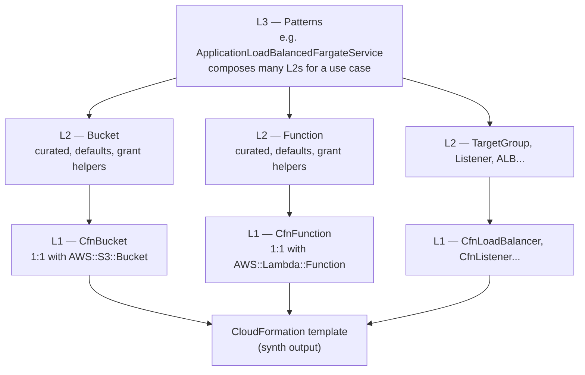
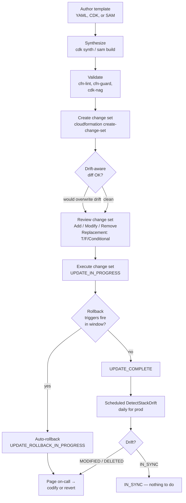
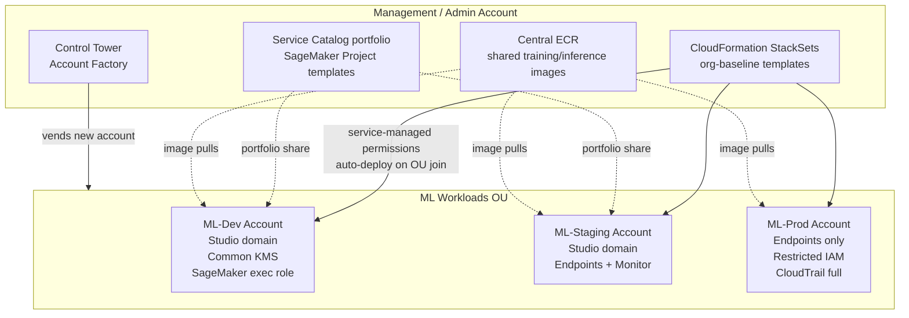

# Chapter 47 — Infrastructure as Code: CloudFormation, CDK, SageMaker Projects

> **Goal of this chapter:** to give you the working mental model an ML engineer needs to author, deploy, and operate the *infrastructure* around a model — not the model itself. By the end you should be able to read a CloudFormation template at a glance and know which sections will fail validation, recognize when a CDK app needs to be split into multiple stacks and why, explain what SageMaker Projects actually provisions under the hood, and recommend the right IaC tool for the right team without parroting marketing. Every later chapter in this part — Ch 48 on tagging and Cost Allocation, Ch 49 on the deployment guardrails that ride on top of these templates, Chapters 53–56 on the security primitives the templates encode — assumes you can author and operate the IaC underneath. This chapter is the load-bearing one for those.

---

## 47.1 IaC is what separates "we have a model" from "we have a production system"

A model artifact is the easy part. A 200 MB `model.tar.gz` sitting in S3, version-pinned to a commit, packaged with its preprocessing code — that is, on the spectrum of difficulty, the simplest deliverable in the entire MLE workflow. You can train it once on a laptop, upload it once, and walk away. The hard part is everything that goes around the artifact: the SageMaker execution role with permissions scoped to exactly one bucket prefix and one KMS key; the bucket itself with versioning enabled, SSL-only access enforced, server-side encryption pointing at the right CMK; the EndpointConfig that pins the production variant traffic split at 90/10 during canary; the CloudWatch alarm that fires when p99 model latency exceeds 500 ms; the EventBridge rule that picks up `Model Package state change → Approved` and kicks off the deploy pipeline; the VPC endpoints that keep all SageMaker traffic off the public internet; the KMS key policy that allows exactly two roles to decrypt and nobody else. None of that can live in a notebook cell, and none of it can live in a CLI script that one engineer remembers to run. It has to live in code — code that is versioned, reviewed, and replayable.

Three structural forces push every serious ML team to IaC:

1. **Disaster recovery.** "Production endpoint is gone, the region is on fire, recreate in `eu-west-2` by tomorrow morning." With clicked-together infrastructure, that is a multi-week project — somebody has to find the old IAM policies, remember which KMS key was used, reconstruct the EndpointConfig's variant settings from CloudTrail logs. With a CloudFormation stack or CDK app, the same recovery is a single command pointed at a new region. The infrastructure *is* the recovery plan.
2. **Audit and compliance.** SOC2, HIPAA, FedRAMP, model-risk-management for regulated finance — every one of these regimes requires that infrastructure changes be tied to a commit, a pull request, a reviewer, and a deployment record. The IaC repository *is* the audit trail. There is no second audit trail. When a regulator asks "who changed the KMS key policy on July 14 and why," the answer lives in `git blame`.
3. **Multi-environment parity.** Staging must look like prod. Dev must look like staging. The *only* way to guarantee that is a single template parameterized by environment, deployed by the same pipeline. Manually clicking three accounts to identical state produces three slightly different stacks within a week — somebody enables versioning in one bucket and forgets in another, somebody pins the endpoint instance type in dev and lets it auto-default in prod. The pain shows up at the worst possible moment: a model that worked in staging fails in production because of a setting nobody can explain.

For the MLA-C01 exam: whenever a question says *"how should the team automate provisioning across staging and production with minimal manual steps,"* the answer is always a flavor of IaC. The question is *which* flavor. The rest of this chapter teaches you the distinguishing characteristics so you can pick the right one cold.

> **Forward link.** Chapter 53 (least-privilege IAM) and Chapter 55 (KMS encryption) treat the *content* of what an ML stack should contain from a security standpoint. This chapter teaches you the *delivery vehicle* that lands that content in an account. Both halves matter — the right IAM policy committed via the wrong delivery mechanism will eventually drift into the wrong policy.

---

## 47.2 CloudFormation — the substrate

### 47.2.1 What it is

CloudFormation (CFN) is the original AWS IaC service, launched in 2011. You author a **template** in YAML (overwhelmingly preferred) or JSON; CFN creates a **stack** that owns those resources and manages their full lifecycle — create, update, delete, drift detection, rollback. Under every higher-level AWS IaC tool sits CloudFormation. CDK is "CFN with a programming language"; SAM is "CFN with a serverless transform"; Service Catalog is "templated, governed CFN"; SageMaker Projects, as we will see in §47.8, is a curated bundle of CFN templates with a Studio UI on top.

**Key first-principles fact, and the one the exam loves:** CDK and SAM do not deploy resources directly. They **synthesize** to a CloudFormation template, then call the CloudFormation API to create or update the stack. This means everything CFN can do — rollback, change sets, drift detection, stack policies, StackSets — is automatically available to CDK and SAM. It also means CFN's hard limits (template size, resource counts) apply to CDK and SAM. You cannot escape the 500-resource-per-stack ceiling by switching from raw YAML to TypeScript; the TypeScript synthesizes to YAML, and the YAML is what gets the limit applied.

### 47.2.2 Template structure — the nine sections

A CloudFormation template has nine top-level sections. Only `Resources` is required. The full list, in canonical order:

| Section                    | Purpose                                                                                     | Required? |
| -------------------------- | ------------------------------------------------------------------------------------------- | --------- |
| `AWSTemplateFormatVersion` | Version of the template language. Only `"2010-09-09"` is valid.                             | No        |
| `Description`              | Free-text describing the template.                                                          | No        |
| `Metadata`                 | Arbitrary structured data. Used by the console UI to group parameters.                      | No        |
| `Parameters`               | Inputs supplied at deploy time. Up to 200 per template.                                     | No        |
| `Rules`                    | Constraints on Parameter combinations (e.g., "prod must use KMS").                          | No        |
| `Mappings`                 | Static lookup tables. Read with `!FindInMap`. No functions allowed inside.                  | No        |
| `Conditions`               | Boolean expressions. Read with `!If`, attached via `Condition:` on resources.               | No        |
| `Transform`                | Macros applied at deploy time (SAM, Include, LanguageExtensions).                           | No        |
| `Resources`                | The actual AWS resources to create.                                                         | **Yes**   |
| `Outputs`                  | Values returned to the caller, optionally `Export`-ed for cross-stack imports.              | No        |

A skeleton ML stack to make this concrete:

```yaml
AWSTemplateFormatVersion: "2010-09-09"
Description: SageMaker endpoint stack for fraud-detection model

Metadata:
  AWS::CloudFormation::Interface:
    ParameterGroups:
      - Label: { default: "Model" }
        Parameters: [ModelPackageArn]

Parameters:
  ModelPackageArn:
    Type: String
    Description: ARN of the approved model package version
  Stage:
    Type: String
    AllowedValues: [dev, stg, prod]
    Default: dev
  InstanceType:
    Type: String
    Default: ml.m5.xlarge

Mappings:
  StageMap:
    dev:  { Count: 1, MinCapacity: 1, MaxCapacity: 2 }
    stg:  { Count: 2, MinCapacity: 2, MaxCapacity: 4 }
    prod: { Count: 4, MinCapacity: 4, MaxCapacity: 20 }

Conditions:
  IsProd: !Equals [!Ref Stage, prod]

Resources:
  ModelEndpointConfig:
    Type: AWS::SageMaker::EndpointConfig
    Properties:
      ProductionVariants:
        - ModelName: !Ref Model
          InitialInstanceCount: !FindInMap [StageMap, !Ref Stage, Count]
          InstanceType: !Ref InstanceType
          VariantName: AllTraffic

  ModelEndpoint:
    Type: AWS::SageMaker::Endpoint
    Properties:
      EndpointConfigName: !GetAtt ModelEndpointConfig.EndpointConfigName

Outputs:
  EndpointName:
    Value: !GetAtt ModelEndpoint.EndpointName
    Export:
      Name: !Sub "${AWS::StackName}-EndpointName"
```

### 47.2.3 Intrinsic functions — the language inside the language

CFN templates are nominally static YAML, but a handful of intrinsic functions inject runtime values. These are the ones you must read fluently:

| Function                      | What it does                                                                                          |
| ----------------------------- | ----------------------------------------------------------------------------------------------------- |
| `!Ref X`                      | The "main value" of resource X (for `AWS::S3::Bucket`, the bucket name; for a Parameter, its value).  |
| `!GetAtt X.Attr`              | A specific attribute of a resource (e.g., `!GetAtt MyBucket.Arn`).                                    |
| `!Sub "...${Var}..."`         | String interpolation. References Parameters, pseudo-parameters, and resource refs.                    |
| `!Join [delim, [parts]]`      | String concatenation. Less elegant than `!Sub`; still common in older templates.                      |
| `!FindInMap [Map, K1, K2]`    | Lookup in `Mappings`.                                                                                 |
| `!If [Cond, IfTrue, IfFalse]` | Conditional value, paired with `Conditions:`.                                                         |
| `!Equals / !And / !Or / !Not` | Boolean operators for `Conditions`.                                                                   |
| `!ImportValue X`              | Pulls a value exported by another stack.                                                              |
| `!Select / !Split`            | Array and string slicing.                                                                             |
| `!Base64`                     | Encodes the value (used for EC2 UserData).                                                            |
| `Fn::ForEach`                 | Loop over a list of values to generate multiple resources. Requires `AWS::LanguageExtensions`.        |

**Pseudo-parameters** are always available and never declared: `AWS::AccountId`, `AWS::Region`, `AWS::Partition`, `AWS::StackName`, `AWS::StackId`, `AWS::URLSuffix`, `AWS::NoValue`, `AWS::NotificationARNs`.

The pseudo-parameter the exam loves most is `AWS::NoValue` — assigning a property to `!Ref AWS::NoValue` is equivalent to omitting the property entirely. Used inside `!If` to conditionally include a property:

```yaml
KmsKeyId: !If [UseEncryption, !Ref MyKmsKey, !Ref AWS::NoValue]
```

This pattern shows up constantly in ML templates: conditional KMS encryption, conditional data capture, conditional shadow variants. Read it once, recognize it forever.

### 47.2.4 Resource-level attributes

Every resource gets a set of CFN-level attributes that aren't part of its service-specific properties. These sit alongside `Properties`:

| Attribute             | Purpose                                                                                                                                                |
| --------------------- | ------------------------------------------------------------------------------------------------------------------------------------------------------ |
| `DependsOn`           | Force ordering when CFN can't infer it from `!Ref` / `!GetAtt`.                                                                                        |
| `Condition`           | Only create this resource if the named condition is true.                                                                                              |
| `Metadata`            | Per-resource metadata. Used by helper scripts like `cfn-init`.                                                                                         |
| `CreationPolicy`      | Wait for an external signal from the resource (used with `cfn-signal` on EC2/ASG).                                                                     |
| `UpdatePolicy`        | Behavior during update — for ASGs, controls rolling updates.                                                                                           |
| `UpdateReplacePolicy` | What to do when a resource must be replaced: `Delete` (default), `Retain`, or `Snapshot` (for stateful resources like RDS, EBS, ElastiCache).          |
| `DeletionPolicy`      | What to do when the stack is deleted: `Delete` (default), `Retain`, or `Snapshot`. **Critical for production data.**                                   |

`DeletionPolicy: Retain` on an S3 bucket or KMS key is the canonical way to prevent stack-delete from blowing away production data. The bucket survives stack deletion; you become responsible for its lifecycle thereafter. For ML: model artifact buckets, feature stores, and KMS keys should *always* carry `Retain` in production stacks. The pain of a stack-delete that destroys a year of training data is not theoretical.

### 47.2.5 cfn-init, cfn-signal, and the helper-script family

For EC2-based stacks (less relevant for SageMaker, but still on the exam): **`cfn-init`** reads the `AWS::CloudFormation::Init` block from a resource's `Metadata` and applies it (install packages, write files, start services). **`cfn-signal`** reports back to CFN that an EC2 instance, ASG, or WaitCondition has finished bootstrapping — without it, the stack can mark a long-bootstrapping instance "complete" before it is actually ready. **`cfn-hup`** is a daemon that watches for metadata changes and re-runs `cfn-init`. For ML workloads, helpers come up only when you have BYO EC2 inference (rare on the exam — SageMaker handles bootstrapping). The exam scenario you might see: "EC2 inference servers behind an ALB, how do you signal ready?" → `cfn-signal` paired with a `CreationPolicy`.

---

## 47.3 The CFN features that show up on the exam

### 47.3.1 Change sets — preview before you commit

A **change set** is a dry-run preview of an update. You submit the new template plus parameters, CFN computes what would change, and returns:

- **Add** — new logical IDs.
- **Modify** — properties on existing resources will change. Each modification carries a `Replacement` flag: `True` (resource will be destroyed and recreated — downtime), `False` (in-place update), `Conditionally` (depends on other values).
- **Remove** — resources that will be deleted.

You then **execute** the change set (it becomes an `UPDATE_IN_PROGRESS`) or **delete** it (no-op).

The reason this is exam-critical: changing the `InstanceType` of a SageMaker endpoint variant *in some configurations* forces replacement, which briefly tears the endpoint down. Change sets surface that before you find out in production. The exam phrase is *"preview the impact of an update before applying it"* → **change set**, every time.

CLI workflow:

```text
aws cloudformation create-change-set \
  --stack-name fraud-endpoint \
  --change-set-name promote-v3 \
  --template-body file://endpoint.yaml \
  --parameters ParameterKey=ModelPackageArn,ParameterValue=arn:aws:sagemaker:...

aws cloudformation describe-change-set --stack-name fraud-endpoint --change-set-name promote-v3
aws cloudformation execute-change-set  --stack-name fraud-endpoint --change-set-name promote-v3
```

### 47.3.2 Drift detection — find what changed outside CFN

**Drift** is when an AWS resource's actual state diverges from its CFN template state. Causes are predictable: console click-ops, another tool (Terraform, manual SDK calls, automated remediation by AWS Config rules), or service-side automatic mutations.

The relevant APIs:

- `DetectStackDrift` — scans the whole stack asynchronously.
- `DetectStackResourceDrift` — scans a single resource.
- `DescribeStackDriftDetectionStatus` — poll for completion.
- `DescribeStackResourceDrifts` — get per-resource results.

Status values: `IN_SYNC`, `MODIFIED`, `DELETED`, `NOT_CHECKED`.

**What CFN actually compares** is the catch: only **explicitly set** properties in the template. If you didn't set `Versioning` on the bucket and someone enables it via the console, that is *not* drift — the template had no opinion. This trips up auditors and is a recurring exam gotcha — *"why didn't CFN report this change as drift?"* — because the property wasn't declared in the template.

Drift detection on nested stacks now recurses into the children (older behavior skipped them), but both versions can appear in exam scenarios depending on when the question was written.

**Remediation** is the part people forget: drift detection only *detects* — it does not fix. Three options:

1. **Re-apply the stack** (`UpdateStack` with the same template). This forces drifted resources back to template state. This is what bites you when an SRE has hot-fixed an EndpointConfig during an incident and the next pipeline deploy silently reverts the fix.
2. **Update the template** to match reality (codify the manual change).
3. **AWS Config remediation rules** — separate from CFN drift; can auto-revert on detection.

> ⚠️ **Exam alert — drift detection vs change sets.** These two get conflated. A **change set** is a dry-run preview of what *your next update* will do. **Drift detection** is a scan that compares the *current live state* to the *last deployed template*. Change sets answer "what am I about to do"; drift detection answers "what has somebody else already done outside of me." A scenario that says "SRE manually changed an EndpointConfig in the console" points to **drift detection**. A scenario that says "preview the next deploy before applying" points to a **change set**.

### 47.3.3 Drift-aware change sets — the 2025 fix

Pre-2025, `create-change-set` compared the new template against the *previously deployed* template — it did not look at live drift. The classic incident shape:

> On-call gets paged: SageMaker endpoint is throwing 5xx. Root cause: instance type was undersized for a traffic spike. SRE bumps the EndpointConfig's `InstanceType` from `ml.m5.large` to `ml.m5.2xlarge` via the console. Service restored at 02:14. Two weeks later, the next scheduled deploy syncs the EndpointConfig back to `ml.m5.large` (still in code as such) and the endpoint melts down at 09:00 Monday.

The change set "looked safe" — there was no diff against the previously-deployed template — but executing it silently overwrote the hot-fix. **Drift-aware change sets** fix this by doing a *three-way diff*: the new template, the last deployed template, and the live resource state. If your change would overwrite a drifted attribute, the change set flags it before execution. This is the single most important production-safety feature CFN has shipped in years for ML platforms, because endpoints are exactly the kind of resource that gets hot-fixed during incidents.

The discipline is therefore: enable drift-aware change sets, run scheduled drift detection on every production stack, and forbid console-write IAM in prod.

### 47.3.4 StackSets — one template, N accounts × M regions

StackSets are the multi-account, multi-region deployment primitive. The concept:

- An **administrator account** (or AWS Organizations management account) holds the StackSet.
- Each **stack instance** is a deployment of the StackSet's template into a (target account, region) tuple.
- One `UpdateStackSet` call propagates updates to all instances in a controlled rollout.

Two permission models:

1. **Self-managed permissions** — you manually create `AWSCloudFormationStackSetAdministrationRole` in the admin account and `AWSCloudFormationStackSetExecutionRole` in each target account. Both roles trust each other. Used for accounts outside an AWS Organization.
2. **Service-managed permissions** — uses AWS Organizations trusted access. AWS auto-creates the cross-account roles. **Required for automatic deployment to new accounts** when they join an OU.

Deployment options worth memorizing:

- `FailureToleranceCount` / `FailureTolerancePercentage` — how many failed instances to tolerate before halting rollout.
- `MaxConcurrentCount` / `MaxConcurrentPercentage` — parallelism cap.
- `RegionOrder` — strict ordering of regions.
- **Automatic deployment** (org-managed) — when a new account joins the target OU, the StackSet auto-deploys to it.

**Caveat from AWS docs that the exam tests:** service-managed StackSets do *not* support templates with macros, including transforms hosted by CloudFormation. So `Transform: AWS::Serverless-2016-10-31` is incompatible with service-managed StackSets — if you want to fan out a SAM-flavored template across an organization, you cannot use service-managed.

**The canonical ML use case** is a central platform team that owns a StackSet deploying, to every account in the organization: a SageMaker execution role with org-mandated trust policy, a KMS key with org-shared key admins, a CloudWatch log group with the retention policy compliance requires, and a "model-monitoring" Lambda subscriber. When a new account joins the "ml-workloads" OU, the StackSet auto-provisions all of it within minutes.

### 47.3.5 Cross-stack references — three ways

When stack A produces a resource (a VPC, a KMS key, a bucket) and stack B needs to reference it, you have three options:

| Option                                                   | Mechanism                                                                                                       | Best for                                                                                                                                                                                                |
| -------------------------------------------------------- | --------------------------------------------------------------------------------------------------------------- | ------------------------------------------------------------------------------------------------------------------------------------------------------------------------------------------------------- |
| **Exports + `Fn::ImportValue`** (cross-stack references) | Stack A's `Outputs` exports a value; stack B references it via `!ImportValue ExportName`.                       | Loose coupling between independent stacks; long-lived shared infrastructure. **The exported value cannot be changed or deleted while imports exist.**                                                   |
| **Nested stacks**                                        | A parent template contains `AWS::CloudFormation::Stack` resources pointing to child template URLs in S3.        | Tight coupling; reusable template modules used inside one larger system. The parent owns the entire tree.                                                                                               |
| **`AWS::SSM::Parameter` references**                     | Stack A writes a value to SSM Parameter Store; stack B reads it via `{{resolve:ssm:...}}` dynamic references.   | When you want indirection — change the SSM value, redeploy stack B without re-coupling templates. Soft coupling at the cost of less compile-time safety.                                                |

The trap the exam likes: **you cannot delete an exported output if another stack imports it.** This produces deployment-time errors that look mysterious. To break the chain: remove the import in stack B, deploy B, then remove the export in A. Or migrate to SSM parameter references which have no such hard dependency.

### 47.3.6 Custom resources — when CFN can't reach what you need

Some AWS services (or third-party SaaS) aren't natively modeled in CFN. **Custom resources** let you invoke a Lambda function as part of stack create/update/delete; the Lambda becomes responsible for provisioning the thing.

```yaml
Resources:
  PopulateFeatureStore:
    Type: Custom::SeedFeatureStore
    Properties:
      ServiceToken: !GetAtt SeedFunction.Arn
      FeatureGroupName: !Ref FeatureGroup
      SeedS3Uri: s3://bucket/seed.parquet
```

The Lambda receives a CFN event with `RequestType: Create | Update | Delete`, performs the work, and calls back to a pre-signed S3 URL provided by CFN to signal success or failure. **If your Lambda doesn't call back within one hour, the stack stalls.** This is the #1 cause of mysterious `UPDATE_IN_PROGRESS` states that last forever — the Lambda errored and exited without signaling.

Common ML use cases: seeding a Feature Group with initial historical data on create, registering a custom SageMaker image, subscribing to an SNS topic in a different account, or calling a third-party API (Datadog, PagerDuty, Splunk) to register the new endpoint for monitoring.

Modern alternatives: **CloudFormation modules** (reusable composite resources you publish to a registry) and **CloudFormation Hooks** (server-side validation that fires before Create/Update/Delete on specified resource types, with the ability to block the operation). Custom resources remain the right answer for "call an external SaaS" scenarios.

**Lesser-known limit that bites ML teams:** custom resource response payload is capped at **4,096 bytes**. A custom resource that tries to return "all SageMaker endpoints in this region" can silently truncate. Page the responses or write to S3 and return a URL.

### 47.3.7 Stack policies and rollback triggers

A **stack policy** is a JSON document attached to a stack that protects specific resources from update. Without an explicit override, `UpdateStack` cannot modify protected resources. Useful as a runtime safety belt over production endpoints:

```json
{
  "Statement": [
    {"Effect": "Allow", "Action": "Update:*", "Principal": "*", "Resource": "*"},
    {"Effect": "Deny",  "Action": "Update:Replace", "Principal": "*",
     "Resource": "LogicalResourceId/ProductionEndpoint"},
    {"Effect": "Deny",  "Action": "Update:Delete",  "Principal": "*",
     "Resource": "LogicalResourceId/ProductionEndpoint"}
  ]
}
```

Override on a per-update basis via `--stack-policy-during-update-body`.

**Rollback triggers** are CloudWatch alarms attached to a stack update — if any of them fire within the "monitoring period" after deployment, the stack auto-rolls back. This is the safety net for production ML deploys: deploy a new model variant, wait 10 minutes, and if `5xx-rate` or `model-latency-p99` alarms fire, CFN undoes the change automatically.

```yaml
RollbackConfiguration:
  MonitoringTimeInMinutes: 10
  RollbackTriggers:
    - Arn: !GetAtt LatencyAlarm.Arn
      Type: AWS::CloudWatch::Alarm
```

### 47.3.8 CloudFormation limits — what bites in production

The hard CFN limits every ML engineer should internalize:

| Quota                              | Limit         | When it bites                                                                                                              |
| ---------------------------------- | ------------- | -------------------------------------------------------------------------------------------------------------------------- |
| Resources per template             | **500**       | A SageMaker domain + 30 user profiles + Pipelines + Endpoints + IAM + KMS + monitoring schedules adds up shockingly fast.  |
| Template body (direct request)     | 51,200 bytes  | You will hit this if you inline-base64 a Lambda.                                                                           |
| Template body (S3 object)          | 1 MB          | CDK splits stacks above this automatically.                                                                                |
| Parameters per template            | 200           | Rarely hit — usually a smell of bad design.                                                                                |
| Outputs per template               | 200           | Rarely hit; same.                                                                                                          |
| Mappings per template              | 200           | Each region-mapping eats one.                                                                                              |
| Nested-stack operations per deploy | 2,500         | You can build a tree above 2,500 *total* resources, but you cannot create/update/delete more than 2,500 in one operation.  |
| Stacks per account per region      | 2,000 (soft)  | Will request a quota increase eventually.                                                                                  |
| Custom resource response payload   | 4,096 bytes   | Trips up custom resources that return whole datasets.                                                                      |
| Dynamic references per template    | 60            | SSM Parameter Store / Secrets Manager refs via `{{resolve:ssm:...}}`. A template that pulls 60+ config values must consolidate. |

> ⚠️ **Exam alert — the 500-resource limit triggers nested stacks.** This is the single most-tested limit. An ML platform that *logically* feels like "one stack with 1,200 resources" cannot be one physical CFN stack. The workaround is **nested stacks** (parent template + child templates in S3) or, in CDK, **splitting into multiple stacks within a single Stage** (CDK does this naturally; see §47.4.4). When a question says "the team's CFN deploy is failing with a `MaximumNumberOfResources` error," the right answer is to decompose into nested stacks or — if the team is already on CDK — to use Stages to group the stacks into one deployment unit.

### 47.3.9 CloudFormation Guard, Hooks, Modules, Registry

Mature ML platforms layer four policy-and-extensibility tools on top: **CloudFormation Guard** is a policy-as-code language ("all S3 buckets must have versioning enabled" as a CI-time rule); **CloudFormation Hooks** are server-side validations that fire before Create/Update/Delete on specified resource types and can block the operation (up to 100 hooks per resource); **CloudFormation Modules** are composite resources you publish to a registry (a `MyOrg::ML::EndpointWithMonitor::MODULE` bundling Model + EndpointConfig + Endpoint + Alarm + EventBridge rule); and the **CloudFormation Registry** is the third-party extensions catalog (Datadog, Snyk, Snowflake publish typed resources callable like native types).

---

## 47.4 AWS CDK — the substrate, with a language

### 47.4.1 What it is

The **AWS Cloud Development Kit** is an SDK that lets you author infrastructure in a real programming language — TypeScript, Python, Java, C#, Go — and then **synthesizes** a CloudFormation template and deploys it. CDK is not a different IaC engine. It is a *compiler* whose output is CloudFormation. Every deploy still hits the CFN API. Drift detection, change sets, rollback — all CFN features still apply, because the deployment artifact is a CFN template.

Why a programming language? Because static YAML has no loops, no functions, no package imports, no IDE refactoring, no unit tests, no type checking. CDK lets you write:

```typescript
for (const env of ['dev', 'stg', 'prod']) {
  new EndpointStack(app, `Endpoint-${env}`, { stage: env, ...envConfig[env] });
}
```

…and out come three independent CloudFormation stacks. The equivalent in raw CFN is three nearly-identical YAML files or one template with conditional shenanigans that is hard to read and harder to test. For Python-first ML teams, CDK in Python is the most natural pick — though TypeScript remains the canonical CDK language with the largest ecosystem and earliest feature availability.

### 47.4.2 Construct levels — L1, L2, L3

CDK organizes resources into **constructs**. The AWS Construct Library categorizes them into three abstraction levels:

| Level   | Also called          | Mapping                                       | Abstraction | Naming                   | Example                                                          |
| ------- | -------------------- | --------------------------------------------- | ----------- | ------------------------ | ---------------------------------------------------------------- |
| **L1**  | "CFN resources"      | 1:1 with a single CloudFormation resource     | None        | `Cfn` prefix             | `CfnBucket`, `CfnFunction`, `CfnEndpoint`, `CfnEndpointConfig`   |
| **L2**  | "curated" constructs | 1:1 with a CFN resource, plus a usable API    | Mid         | Plain resource name      | `Bucket`, `Function`, `Endpoint` (where L2 exists)               |
| **L3**  | "patterns"           | Multiple resources composed for a use case    | High        | Pattern descriptive name | `ApplicationLoadBalancedFargateService`                          |

**L1** is what you fall back to when no L2 exists, or when you need a property the L2 doesn't expose. Every CFN resource has an L1 because AWS auto-generates them from the CloudFormation resource spec; new L1s appear within a week of a new CFN resource shipping.

**L2** adds the things that justify using CDK at all: sensible defaults (a `Bucket` has encryption-by-default in CDK v2; you opt *out* if you want unencrypted); helper methods like `bucket.grantRead(role)` that generate the right IAM policy automatically (five lines of policy JSON collapse into one method call); strong typing via TypeScript or Python hints that catches malformed properties at compile time; and cross-resource wiring like `function.addEventSource(new SqsEventSource(queue))` that creates the trigger, IAM, and event source mapping in one call.

**L3** bundles multiple L2s for a complete use case. `aws-cdk-lib/aws-ecs-patterns` has `ApplicationLoadBalancedFargateService` that creates ALB + target groups + listeners + ECS service + task definition + security groups + IAM roles in one constructor. For ML, there is no equivalent first-party "endpoint + monitor + alarm" L3 yet — teams build their own internal L3s, which is one of the core platform-team deliverables for an ML platform group.

**Exam mnemonic:** **L1 = CFN raw; L2 = curated; L3 = pattern.** A common trap question claims "L3 constructs are 1:1 with a CFN resource" — that is false, L3 is a *pattern* of multiple resources.



### 47.4.3 SageMaker in CDK — the L1-heavy reality

This is a frequent source of confusion and a fair exam target. As of 2026:

- **`aws-cdk-lib/aws-sagemaker`** — the *stable* SageMaker module. Contains **L1 only**: `CfnModel`, `CfnEndpoint`, `CfnEndpointConfig`, `CfnPipeline`, `CfnFeatureGroup`, `CfnModelPackageGroup`, `CfnNotebookInstance`, `CfnMonitoringSchedule`, and so on.
- **`@aws-cdk/aws-sagemaker-alpha`** — contains **L2 (experimental)** for `Endpoint`, `EndpointConfig`, `Model`. Lower-friction API but explicit "experimental" status (breaking changes possible without semver-minor bumps).

For exam purposes: **SageMaker resources in CDK are predominantly L1**, because L2 support is incomplete. This means CDK code for SageMaker often looks closer to raw CFN than CDK code for, say, S3 or Lambda. Knowing that SageMaker L2 lives in the `alpha` package is fair game; deep alpha-module nuances are not.

### 47.4.4 The construct tree — App → Stack → Construct

Every CDK app is a tree:

```text
App
├── Stack (CloudFormation stack)
│   ├── Construct (group)
│   │   ├── L2 Bucket   (synthesizes to AWS::S3::Bucket)
│   │   └── L2 Function (synthesizes to AWS::Lambda::Function + Role)
│   └── L1 CfnEndpoint  (synthesizes to AWS::SageMaker::Endpoint)
└── Stack
    └── …
```

Each construct receives three arguments at instantiation: `scope` (its parent), `id` (unique within the parent's scope, becomes the CFN logical ID), and `props` (typed configuration).

The tree determines three load-bearing things:

- **CFN logical IDs.** CDK concatenates the path from Stack root to construct (with a hash suffix for stability), so the logical ID changes if you reparent the construct. That is why moving a construct between stacks usually causes resource recreation — the logical ID changes, CFN sees a "new" resource, the old one gets destroyed.
- **Cross-stack imports.** If construct B in Stack 2 references construct A in Stack 1, CDK auto-creates a `CfnOutput` in Stack 1 and a `Fn::ImportValue` in Stack 2 — you do not have to wire it yourself.
- **App-level synthesis.** `cdk synth` walks the tree and emits one CFN template per Stack into `cdk.out/`.

The crucial corollary for the 500-resource limit: **CDK Stages naturally split logical apps into multiple compliant physical stacks.** A `Stage` groups stacks for a single deployment target (account, region). CDK Pipelines deploy the Stage as one logical step, but each stack inside the Stage is a separate CFN stack with its own 500-resource budget. You get the limit per *physical* stack (not per logical app), parallel CFN deploys across the stacks (lower wall-clock time), and smaller blast radius on rollback.

### 47.4.5 The CDK CLI

Three commands you must know cold: **`cdk synth`** synthesizes all stacks to CloudFormation templates in `cdk.out/` (no AWS calls; pure local compilation); **`cdk diff`** synthesizes then compares against the deployed stack(s) and prints what would change (equivalent to a CFN change set but client-side); **`cdk deploy`** synthesizes, optionally creates a change set, and executes it (pass `--require-approval never` in CI/CD). Auxiliary: **`cdk bootstrap`** is required once per (account, region) — it creates the toolkit stack with the S3 asset bucket, ECR repo, and deploy/execution roles. Without bootstrap, `cdk deploy` fails with cryptic errors about missing roles. This is a frequent first-time-CDK problem and a fair exam target. **`cdk destroy`** deletes stacks; **`cdk import`** imports existing AWS resources into a CDK stack.

### 47.4.6 Aspects — cross-cutting policy enforcement

An **Aspect** is a visitor that walks the construct tree and modifies or validates every node — used for compliance enforcement ("every S3 bucket must have versioning enabled"), uniform tagging, and encryption defaults. The official `cdk-nag` library is the canonical Aspect: a pre-built visitor that checks every resource against AWS Solutions Library, HIPAA, NIST 800-53, and PCI-DSS rule packs and emits errors at synth time. In regulated ML platforms, cdk-nag is treated as table-stakes and added from day one.

---

## 47.5 CDK Pipelines — self-mutating CI/CD

`pipelines.CodePipeline` is a specialized L3 construct that wraps **AWS CodePipeline V2** to do CI/CD for CDK apps. The killer feature is **self-mutation**.

### 47.5.1 What self-mutation means, concretely

A CDK Pipeline includes a `SelfMutate` stage. On every run, the pipeline:

1. Pulls source.
2. Runs `cdk synth` to produce a new CloudFormation template for **the pipeline itself**.
3. Compares to the deployed pipeline; if different, **deploys the new pipeline first**, then re-invokes itself to run the application stages with the new pipeline definition.

The practical effect is that the pipeline can add, remove, or modify its own stages without manual `cdk deploy` from a developer laptop. You touch the pipeline code on day one. From then on, *all* changes — including adding a new region, a new test stage, a new approval gate — are merged into the trunk and the pipeline re-grows itself.

> ⚠️ **Exam alert — CDK Pipelines is self-mutating.** Phrases like "the pipeline updates itself when its own definition changes" or "no manual `cdk deploy` after the first bootstrap" point at CDK Pipelines, not raw CodePipeline. The whole reason this feature exists is to remove the chicken-and-egg of "who deploys the pipeline that deploys things."

### 47.5.2 A canonical example

```typescript
import * as pipelines from 'aws-cdk-lib/pipelines';

const pipeline = new pipelines.CodePipeline(this, 'MlPipeline', {
  synth: new pipelines.ShellStep('Synth', {
    input: pipelines.CodePipelineSource.gitHub('org/repo', 'main', {
      authentication: cdk.SecretValue.secretsManager('github-token'),
    }),
    commands: ['npm ci', 'npm run build', 'npx cdk synth'],
  }),
});

const staging = new MlAppStage(this, 'Staging', { env: STAGING_ENV });
const prod    = new MlAppStage(this, 'Prod',    { env: PROD_ENV });

pipeline.addStage(staging, {
  post: [new pipelines.ShellStep('SmokeTest', {
    commands: ['curl -fsS $ENDPOINT_URL/ping'],
    envFromCfnOutputs: { ENDPOINT_URL: staging.endpointUrlOutput },
  })],
});

pipeline.addStage(prod, {
  pre: [new pipelines.ManualApprovalStep('PromoteToProd')],
});
```

What this gives you:

- A CodePipeline named `MlPipeline` triggered by `main`-branch pushes on GitHub.
- A `Synth` action that runs `cdk synth` in CodeBuild.
- A self-mutating `UpdatePipeline` stage that re-applies the pipeline definition if it changed.
- A `Staging` stage that deploys to the staging account, then runs a smoke test.
- A `ManualApprovalStep` action that blocks until a human clicks approve.
- A `Prod` stage that deploys to production after approval.

For ML workflows this is the canonical pattern: every push to `main` → pipeline self-mutates → deploys updated model-deploy infrastructure to staging → smoke tests → human approval → deploys to prod. The pipeline definition lives next to the model code; no console click-ops anywhere.

### 47.5.3 The four production gotchas of self-mutation

War stories from teams running this in production:

1. **Synth must be deterministic.** If your synth emits a timestamp into a resource description, the pipeline detects a diff on every run and self-mutates forever — pure motion, no progress. Common offenders: build timestamps baked into Lambda asset hashes, dynamic CDK context values pulled from `Stack.of(this).account` for environments not declared in `cdk.json`.
2. **`git commit && git push` before `cdk deploy` the first time.** The pipeline starts running immediately on creation; if your local working copy is ahead of `origin/main`, the pipeline will pull `main` and deploy a *different* version than you just ran locally, and the two will fight.
3. **Pipeline stack lives in its own stack.** Mixing the pipeline definition with application stacks creates a self-mutation deadlock where the pipeline tries to update an application stack that depends on the pipeline that is mid-update.
4. **Ephemeral test stages need cleanup.** A `TestStage` that deploys the whole stack into a throwaway account, runs integration tests, then *destroys* it works — but without explicit destruction, you accumulate orphan stacks and rack up bill quickly, especially for SageMaker endpoints.

### 47.5.4 Stages = (stack collection, environment) tuple

A `Stage` is a deployment-scoped grouping of stacks that share an environment (account, region). You can have the same `Stage` class instantiated against multiple accounts:

```typescript
pipeline.addStage(new MlAppStage(this, 'StagingUSEast', { env: { account: 'aaa', region: 'us-east-1' } }));
pipeline.addStage(new MlAppStage(this, 'StagingEUWest', { env: { account: 'aaa', region: 'eu-west-2' } }));
pipeline.addStage(new MlAppStage(this, 'ProdUSEast',    { env: { account: 'bbb', region: 'us-east-1' } }));
```

This is how you do multi-region ML rollouts cleanly with CDK — and how Stages help you stay under the 500-resource limit by naturally distributing the app's resources across multiple physical stacks within a single deployment unit.

CDK Pipelines requires the **modern bootstrap** (formerly "new bootstrap"). The legacy bootstrap does not have the cross-account roles CDK Pipelines needs. Target accounts must be bootstrapped with `--trust <pipeline-account>` so the pipeline's deployer role can assume the cross-account deploy role.

> **Back link.** Chapter 46 covers CodePipeline as a general-purpose CI/CD service. CDK Pipelines is the L3 specialization of CodePipeline for CDK apps. Chapter 43 (SageMaker Pipelines) is a different beast — that is the ML *training-and-evaluation* pipeline, not the infrastructure deploy pipeline. The two compose: a CDK Pipeline deploys a SageMaker Pipeline; the SageMaker Pipeline trains the model; the trained model is registered and triggers a downstream CDK Pipeline stage that deploys the endpoint.

---

## 47.6 AWS SAM — the serverless macro

**AWS SAM (Serverless Application Model)** is a CloudFormation **transform** (macro) plus a CLI. The transform `AWS::Serverless-2016-10-31` lets you write shortened CFN syntax for serverless resources:

```yaml
Transform: AWS::Serverless-2016-10-31
Resources:
  InferenceFn:
    Type: AWS::Serverless::Function
    Properties:
      CodeUri: ./inference/
      Handler: app.handler
      Runtime: python3.11
      Architectures: [arm64]
      MemorySize: 1024
      Events:
        PredictApi:
          Type: HttpApi
          Properties:
            Path: /predict
            Method: post
```

At deploy time the SAM transform expands this into raw CFN (`AWS::Lambda::Function`, `AWS::IAM::Role`, `AWS::ApiGatewayV2::Api`, `AWS::ApiGatewayV2::Route`, `AWS::ApiGatewayV2::Integration`, …). A five-line resource block becomes a fifty-line one, all autogenerated.

**SAM is a *subset* of CFN:** anything you can do in SAM you can do in pure CFN. The reverse is not true. The SAM transform handles only `AWS::Serverless::*` types; everything else falls through to native CFN.

The SAM CLI layers on `sam build` (packages Lambda code with dependencies), `sam local invoke` / `sam local start-api` (local emulation of Lambda + API Gateway in Docker), `sam deploy --guided` (interactive deploy), and `sam sync` (fast deploy for iteration, bypasses change sets).

**When to use SAM vs CDK for ML serverless** is a routine architecture decision:

| Scenario                                                                                | Pick    |
| --------------------------------------------------------------------------------------- | ------- |
| Pure serverless (Lambda inference, API GW frontend), small project, low-tooling team    | **SAM** |
| Mixed serverless + non-serverless (SageMaker endpoints, EC2, etc.) in one stack         | **CDK** |
| Want a real programming language with loops and OOP                                     | **CDK** |
| Want a mature Python-native local Lambda emulator                                       | **SAM** (CDK has options but SAM Local is more mature) |

For MLA-C01: SAM appears as "the serverless-shorthand option." You probably will not be asked deep SAM internals, but you should recognize it as a valid CFN-based answer — and remember that it is *not* a separate IaC tool. It is a CFN transform plus CLI.

---

## 47.7 Terraform — the third-party comparator

**Terraform** (HashiCorp) is the dominant non-AWS IaC tool. It is provider-agnostic: AWS, GCP, Azure, Datadog, GitHub, Snowflake, Okta, Vault, and hundreds of others all have Terraform providers. The MLA-C01 exam guide explicitly lists Terraform under Task 3.3 alongside CloudFormation and CDK, so it is in scope as the comparator even though the exam will not ask you to write HCL.

### 47.7.1 Core differences vs CloudFormation

| Dimension               | CloudFormation                                          | Terraform                                                                                                              |
| ----------------------- | ------------------------------------------------------- | ---------------------------------------------------------------------------------------------------------------------- |
| **Vendor**              | AWS-managed service                                     | HashiCorp (open-source core); Terraform Cloud / Enterprise are commercial                                              |
| **Language**            | YAML / JSON template                                    | HCL (HashiCorp Configuration Language) or JSON                                                                         |
| **State**               | CloudFormation manages stack state for you              | **You** manage state in a `terraform.tfstate` file (typically S3 + DynamoDB locking)                                   |
| **Plan/Apply model**    | Change set → execute                                    | `terraform plan` → `terraform apply`                                                                                   |
| **Multi-cloud**         | AWS only (plus a few third-party via Registry)          | Hundreds of providers across clouds and SaaS                                                                           |
| **Drift detection**     | `DetectStackDrift` (native, async, AWS-side)            | `terraform plan` is implicitly drift detection (refresh state, diff against config)                                    |
| **Rollback on failure** | Automatic by default                                    | No automatic rollback — failed `apply` leaves the world half-changed; you handle remediation manually                  |
| **Modules**             | Nested stacks, modules, StackSets                       | `module` blocks (first-class language feature); large public Terraform Registry of community modules                   |
| **Parity to new AWS**   | Latest AWS features land in CFN first (usually)         | Provider lag: a new AWS feature may take days to weeks before the `terraform-provider-aws` releases support            |

### 47.7.2 The AWS-native CDK vs multi-cloud Terraform division

The 2025-2026 practitioner consensus, simplified:

- **CDK** is the AWS-native default for developer-led teams. Pick it when you are AWS-only for the foreseeable future, your engineers are in TypeScript or Python every day, you want unit-testable infrastructure, you need new AWS service support fast (L1 ships the day the service does), and you want CDK Pipelines self-mutation.
- **Terraform** is the multi-cloud and regulated-enterprise default. Pick it when you need multi-cloud or hybrid (AWS + Azure + GCP + Snowflake + Datadog + Okta), when your platform team already has a Terraform module library and an Atlantis / Spacelift / Terraform Cloud workflow, when you operate in a regulated environment with required third-party scanners (Checkov, tfsec, Snyk IaC), and when you need provider-managed external resources alongside AWS.

The hybrid pattern that big ML platforms actually run:

```text
+----------------------------------------------------+
|   Platform Team (central) — Terraform              |
|   • VPC, TGW, Direct Connect                       |
|   • IAM SSO permission sets                        |
|   • Org-wide SCPs                                  |
|   • Control Tower account vending                  |
|   • Centralised KMS, S3 logging                    |
+----------------------------------------------------+
                       │
                       ▼
+----------------------------------------------------+
|   ML Feature Teams — CDK (Python)                  |
|   • SageMaker domain, user profiles                |
|   • Pipelines, training jobs, endpoints            |
|   • Model Monitor schedules                        |
|   • Step Functions for orchestration               |
+----------------------------------------------------+
```

The platform team owns Terraform for the baseline that crosses cloud boundaries (or might one day); ML feature teams use CDK in their sandbox and workload accounts for the SageMaker-specific bits. AWS itself documents this in "Implement a secure MLOps platform based on Terraform and GitHub" and the "Governing the ML lifecycle at scale" series.

### 47.7.3 Where each one wins outright

**CFN/CDK wins** on tight AWS integration (drift detection, StackSets, Service Catalog, rollback triggers — all AWS-managed); on parity with new AWS features (CFN resources at GA; the Terraform provider usually lags); on Service Catalog and SageMaker Projects (both CFN-based — you cannot write a SageMaker Project template in Terraform); and on having no state file to lose (Terraform's state file *is* the source of truth, and losing or corrupting it is catastrophic). **Terraform wins** on multi-cloud and multi-SaaS (Cloudflare DNS, Okta apps, Auth0 tenants, Vault policies alongside AWS); on the module ecosystem (the public Terraform Registry has high-quality modules for almost everything); and on speed (Terraform applies are roughly 2-3× faster than CFN for the same resource set, because CFN goes through the change-set engine — a 200-resource ML stack often takes 15-25 minutes via CFN/CDK vs 5-8 minutes via Terraform).

### 47.7.4 Exam framing

The MLA-C01 will not ask you to write HCL. It will test the *decision*. A scenario phrased as "the team standardizes on Terraform across all cloud providers" points to Terraform. A scenario phrased as "multi-account ML platform with auto-deployment to new org accounts" points to **CloudFormation StackSets** (the Terraform equivalent exists in Terraform Cloud workspaces, but is not what AWS-native MLOps teams use). A scenario phrased as "AWS-only Python-first ML team wanting unit-testable infrastructure with built-in CI/CD self-mutation" points to **CDK with CDK Pipelines**.

---

## 47.8 SageMaker Projects — templates of templates

### 47.8.1 What it is

A **SageMaker Project** is a Studio-managed bundle of code repositories, CI/CD pipelines, IAM roles, and S3 buckets that implement an MLOps pattern. From the AWS doc *What is a SageMaker AI Project?*:

> "SageMaker Projects help organizations set up and standardize developer environments for data scientists and CI/CD systems for MLOps engineers… You can provision SageMaker Projects using custom templates that are stored in Amazon S3 buckets, or by using templates from the AWS Service Catalog or SageMaker AI."

A Project is **not a runtime** — it is **scaffolding**. Under the hood, every Project is either an **AWS Service Catalog product** (legacy / first-party templates) or, increasingly, a CloudFormation template stored in **S3** (the 2025 direction). Click "Create Project" in Studio and CFN deploys the chosen template into your account; that template provisions the repositories, pipelines, registries, buckets, and IAM roles the MLOps pattern needs.

### 47.8.2 What a typical project provisions

The canonical list from AWS docs:

- **One or more repositories** with sample code to build and deploy ML solutions.
- **A SageMaker AI pipeline** that defines steps for data prep, training, model evaluation, and model deployment.
- **A CodePipeline or Jenkins pipeline** that runs the SageMaker pipeline whenever a new code version is checked in.
- **A model group** (Model Package Group in the Registry) that holds approved versions; every approval can trigger an endpoint deployment.

Each Project is tagged with a unique project name and ID that propagate to all owned resources, so you can list every entity associated with a project: pipelines, model packages, endpoints, datasets, Service Catalog products, CodePipeline / Jenkins pipelines, repos.

### 47.8.3 Template families

| Template family                              | What it creates                                                                                                                                                                                                                                                |
| -------------------------------------------- | -------------------------------------------------------------------------------------------------------------------------------------------------------------------------------------------------------------------------------------------------------------- |
| **Model build, train, and deploy (3p Git)**  | A model-build repo with a SageMaker Pipeline seed + model-deploy repo with CFN templates and a `Source → Build → DeployStaging → ManualApproval → DeployProd` CodePipeline + Model Package Group + EventBridge rule on Model Package state change → Approved. |
| **Model build & train only**                 | Same as above minus the deploy half. Use when a separate team owns deployment.                                                                                                                                                                                 |
| **Model deploy only**                        | Just the deploy half. Use when another system (Step Functions, MWAA, manual) builds and registers the model.                                                                                                                                                   |
| **Build + train + deploy + Model Monitor**   | Flagship + a Model Monitor scaffold; auto-creates EventBridge rules to kick off baseline and drift monitoring after staging deployment.                                                                                                                        |
| **Image build + model build + deploy**       | Adds three optional sub-pipelines for processing, training, and inference image builds; pushes to ECR; registers as SageMaker Images that can in turn trigger model rebuilds.                                                                                  |
| **Jenkins-backed variant**                   | Same Git-based source, but Jenkins (not CodePipeline) orchestrates CI/CD. The Project provisions AWS-side pieces (Git, IAM, S3, EventBridge); you wire Jenkins to it via the Jenkins AWS plugin.                                                               |
| **Multi-account variants**                   | Staging and production are separate AWS accounts in the same Organization. The CFN stacks created by the deploy pipeline cross accounts via StackSet-style cross-account roles. The canonical enterprise production pattern.                                  |

### 47.8.4 The 2025 S3-based templates

A major shake-up: AWS now recommends **S3-based project templates** over the older Service-Catalog-product model.

Service-Catalog-based templates require:

- A Service Catalog **portfolio** to exist.
- A **product** to be registered.
- **Versioned product** updates pushed manually.
- **IAM principal sharing** to give Studio users access.
- A long-lived **launch-constraint role**.

S3-based templates require: **upload a zip to S3, point SageMaker at the prefix, done.** For a team that wants to standardize "the way we deploy" without running a Service Catalog administrative function, this is a huge unlock and is the direction most new SageMaker Projects deployments are heading per the AWS ML blog "Simplify ModelOps with Amazon SageMaker AI Projects using Amazon S3-based templates."

> ⚠️ **Exam alert — SageMaker Projects = CFN + CodePipeline + Pipelines.** When a question describes Projects, recognize the three components it always provisions: a **CloudFormation** template that lays down infrastructure, a **CodePipeline** (or Jenkins pipeline) that drives CI/CD on Git pushes, and a **SageMaker Pipeline** (sometimes more than one) that runs the actual ML steps. A common trap is conflating Projects with Pipelines — Pipelines are *standalone entities* per AWS docs ("You can create, update, and run pipelines directly within a notebook by using the SageMaker Python SDK without using a SageMaker AI project"). Projects are scaffolding *around* Pipelines.

### 47.8.5 The CodeCommit deprecation — September 9, 2024

> Per AWS docs (verbatim, the key fact for the exam): "Effective September 9, 2024, project templates that use the AWS CodeCommit repository are no longer supported. For new projects, select from the available project templates that use third-party Git repositories."

Translation: AWS CodeCommit-backed SageMaker Project templates have been retired. New Projects must use **GitHub**, **GitHub Enterprise**, **Bitbucket**, or **GitLab** via **AWS CodeStar Connections** (also called **AWS CodeConnections** — same service, renamed in 2024).

This is the most testable single fact about SageMaker Projects in 2025-2026. Any answer claiming "CodeCommit is the default for SageMaker Projects" is wrong post-September 2024. The broader context is that CodeCommit itself is in maintenance (no new features, no new customer onboarding since mid-2024); for exam purposes, treat **CodeStar Connections + GitHub** as the canonical Git host for new SageMaker Projects.

### 47.8.6 IAM roles created by SageMaker Projects

When you enable SageMaker Projects in a Studio domain, the following roles are created (or you must create them):

| Role                                                       | Used by                                                                       |
| ---------------------------------------------------------- | ----------------------------------------------------------------------------- |
| `AmazonSageMakerServiceCatalogProductsLaunchRole`          | Service Catalog uses this to launch the product (CFN stack) on user request.  |
| `AmazonSageMakerServiceCatalogProductsUseRole`             | The launched CFN stack uses this for resource creation.                       |
| `AmazonSageMakerServiceCatalogProductsCodeBuildRole`       | CodeBuild projects created by the Project template.                           |
| `AmazonSageMakerServiceCatalogProductsCodePipelineRole`    | CodePipeline created by the Project template.                                 |
| `AmazonSageMakerServiceCatalogProductsCloudformationRole`  | CFN deploy action role within the deploy pipeline.                            |
| `AmazonSageMakerServiceCatalogProductsEventsRole`          | EventBridge rules that trigger pipelines on Model Registry approval.          |
| `AmazonSageMakerServiceCatalogProductsLambdaRole`          | Lambda functions used by the deploy pipeline (test invokers, etc.).           |
| `AmazonSageMakerServiceCatalogProductsApiGatewayRole`      | Where the template provisions an API Gateway in front of the endpoint.       |

If any of these are missing, you get the classic error: *"CodePipeline is not authorized to perform AssumeRole on role arn:aws:iam::xxx:role/service-role/AmazonSageMakerServiceCatalogProductsCodePipelineRole"*. The fix is to toggle "Enable SageMaker projects" in the Studio Domain Settings, which creates the missing roles.

### 47.8.7 Backstage-fronted self-service — the emerging enterprise pattern

AWS Prescriptive Guidance published in 2025 an "Accelerate MLOps with Backstage and self-service Amazon SageMaker AI templates" pattern. The thrust: instead of forcing data scientists into the SageMaker Studio UI to launch a Project, publish the same templates as **Backstage software-catalog entries** so the developer-portal experience is unified with the rest of the company's services. This is becoming the "enterprise-grade" pattern at large orgs that already run Backstage for general developer self-service.

The pieces compose: Backstage shows the data scientist a "Create new ML model" template card; clicking it submits a PR that includes the SageMaker Project parameters; the PR's merge triggers a CDK Pipeline that provisions the Project (which itself provisions repos, CodePipeline, SageMaker Pipeline). The scientist never sees Service Catalog, never sees Studio's "Create Project" UI — they see the same Backstage portal they use for everything else.

### 47.8.8 The end-to-end flow for the flagship template

```text
Data scientist clicks "Create Project" (or submits Backstage form)
    │
    ▼
CFN (via Service Catalog or S3 template) provisions:
    • model-build repo (GitHub via CodeStar Connections)
    • model-deploy repo (GitHub)
    • model-build CodePipeline  (Source → CodeBuild "run SageMaker Pipeline")
    • model-deploy CodePipeline (Source → DeployStaging → ManualApproval → DeployProd)
    • Model Package Group "mygroup"
    • S3 bucket "sagemaker-project-<id>"
    • IAM roles (all 8 from §47.8.6)
    • EventBridge rule: Model Package state change → Approved → start model-deploy
    │
    ▼
Data scientist clones model-build repo, modifies pipeline.py
    │
    ▼
Push to main → CodePipeline → CodeBuild → start SageMaker Pipeline
    │
    ▼
SageMaker Pipeline: Processing → Training → Evaluation → ConditionStep → Register (PendingManualApproval)
    │
    ▼
ML lead reviews in Model Registry → clicks Approve
    │
    ▼
EventBridge fires Model Package state change with status=Approved
    │
    ▼
model-deploy CodePipeline starts → CFN ChangeSet deploys EndpointConfig+Endpoint to staging account
    │
    ▼
Smoke tests run → ManualApprovalStep → CFN ChangeSet deploys to prod account
```

Every box is provisioned by the SageMaker Project template. The data scientist only writes Python; the platform team only authors the template once. That separation of concerns is the entire point.

---

## 47.9 The common ML stack — a full CDK TypeScript example

To make the abstract concrete, here is the complete CDK definition of a production-grade SageMaker endpoint stack: KMS CMK + S3 bucket with bucket policy + IAM execution role + SageMaker Model + EndpointConfig + Endpoint + CloudWatch alarms + EventBridge retraining rule.

```typescript
import * as cdk from 'aws-cdk-lib';
import * as iam from 'aws-cdk-lib/aws-iam';
import * as kms from 'aws-cdk-lib/aws-kms';
import * as s3 from 'aws-cdk-lib/aws-s3';
import * as sagemaker from 'aws-cdk-lib/aws-sagemaker';
import * as cloudwatch from 'aws-cdk-lib/aws-cloudwatch';
import * as events from 'aws-cdk-lib/aws-events';
import * as targets from 'aws-cdk-lib/aws-events-targets';
import { Construct } from 'constructs';

interface FraudEndpointProps extends cdk.StackProps {
  modelPackageArn: string;
  stage: 'dev' | 'stg' | 'prod';
  alertTopicArn: string;
  retrainPipelineArn: string;
}

export class FraudEndpointStack extends cdk.Stack {
  constructor(scope: Construct, id: string, props: FraudEndpointProps) {
    super(scope, id, props);

    // ── KMS CMK ────────────────────────────────────────────────────────────
    const modelKey = new kms.Key(this, 'ModelKey', {
      enableKeyRotation: true,
      alias: `alias/fraud-${props.stage}-model-key`,
      removalPolicy: cdk.RemovalPolicy.RETAIN,    // never auto-destroy in prod
    });

    // ── S3 bucket + bucket policy ─────────────────────────────────────────
    const artifactsBucket = new s3.Bucket(this, 'ModelArtifacts', {
      encryption: s3.BucketEncryption.KMS,
      encryptionKey: modelKey,
      versioned: true,
      enforceSSL: true,                            // adds the Deny-no-TLS bucket policy
      blockPublicAccess: s3.BlockPublicAccess.BLOCK_ALL,
      removalPolicy: cdk.RemovalPolicy.RETAIN,
    });

    // ── IAM execution role for SageMaker ───────────────────────────────────
    const execRole = new iam.Role(this, 'SmExecRole', {
      assumedBy: new iam.ServicePrincipal('sagemaker.amazonaws.com'),
      description: 'Scoped role for fraud-detection endpoint',
    });
    artifactsBucket.grantReadWrite(execRole);
    modelKey.grantEncryptDecrypt(execRole);
    execRole.addManagedPolicy(
      iam.ManagedPolicy.fromAwsManagedPolicyName('CloudWatchLogsFullAccess'),
    );

    // ── SageMaker Model / EndpointConfig / Endpoint (L1 today) ────────────
    const model = new sagemaker.CfnModel(this, 'Model', {
      executionRoleArn: execRole.roleArn,
      primaryContainer: { modelPackageName: props.modelPackageArn },
    });

    const stageMap = {
      dev: { instanceCount: 1, instanceType: 'ml.m5.large'   },
      stg: { instanceCount: 2, instanceType: 'ml.m5.xlarge'  },
      prod:{ instanceCount: 4, instanceType: 'ml.m5.xlarge'  },
    }[props.stage];

    const endpointConfig = new sagemaker.CfnEndpointConfig(this, 'EpCfg', {
      kmsKeyId: modelKey.keyArn,
      productionVariants: [{
        modelName: model.attrModelName,
        initialInstanceCount: stageMap.instanceCount,
        instanceType: stageMap.instanceType,
        variantName: 'AllTraffic',
      }],
      dataCaptureConfig: {
        enableCapture: true,
        initialSamplingPercentage: 20,
        destinationS3Uri: `s3://${artifactsBucket.bucketName}/capture/`,
        kmsKeyId: modelKey.keyArn,
        captureOptions: [{ captureMode: 'Input' }, { captureMode: 'Output' }],
      },
    });

    const endpoint = new sagemaker.CfnEndpoint(this, 'Endpoint', {
      endpointName: `fraud-detector-${props.stage}`,
      endpointConfigName: endpointConfig.attrEndpointConfigName,
    });

    // ── CloudWatch alarms ──────────────────────────────────────────────────
    new cloudwatch.Alarm(this, 'Err5xx', {
      metric: new cloudwatch.Metric({
        namespace: 'AWS/SageMaker',
        metricName: 'Invocation5XXErrors',
        dimensionsMap: {
          EndpointName: endpoint.attrEndpointName,
          VariantName: 'AllTraffic',
        },
        statistic: 'Sum',
        period: cdk.Duration.minutes(1),
      }),
      threshold: 10,
      evaluationPeriods: 2,
      treatMissingData: cloudwatch.TreatMissingData.NOT_BREACHING,
      alarmDescription: '5xx error spike on fraud endpoint',
    });

    new cloudwatch.Alarm(this, 'LatencyP99', {
      metric: new cloudwatch.Metric({
        namespace: 'AWS/SageMaker',
        metricName: 'ModelLatency',
        dimensionsMap: { EndpointName: endpoint.attrEndpointName, VariantName: 'AllTraffic' },
        statistic: 'p99',
        period: cdk.Duration.minutes(1),
      }),
      threshold: 500,                              // ms
      evaluationPeriods: 5,
    });

    // ── EventBridge retraining rule ────────────────────────────────────────
    new events.Rule(this, 'RetrainSchedule', {
      schedule: events.Schedule.cron({
        minute: '0', hour: '2', weekDay: 'MON',
      }),
      targets: [new targets.SfnStateMachine(/* would point to a Step Function or Pipeline target */ {} as any)],
      description: 'Weekly Monday 02:00 retrain trigger',
    });
  }
}
```

Notice how much disappears compared with raw CFN. `artifactsBucket.grantReadWrite(execRole)` synthesizes a 30-line IAM policy. `modelKey.grantEncryptDecrypt(execRole)` synthesizes the KMS key policy statements and the role-side policy in one call. `enforceSSL: true` synthesizes the Deny-non-TLS bucket policy automatically. This is the practical case for choosing L2 wherever it exists — and accepting L1 for SageMaker because the L2 is still alpha.

### 47.9.1 The CDK construct libraries to know

**`aws-cdk-lib/aws-sagemaker`** is stable and L1-heavy — `CfnModel`, `CfnEndpointConfig`, `CfnEndpoint`, `CfnNotebookInstance`, `CfnMonitoringSchedule`, `CfnFeatureGroup`, `CfnPipeline`, `CfnModelPackageGroup`. **`@aws-cdk/aws-sagemaker-alpha`** is the alpha-track L2 for `Model`, `EndpointConfig`, and `Endpoint` with better defaults. **`generative-ai-cdk-constructs`** (awslabs, 2024+) is a growing collection of higher-level constructs: `SageMakerJumpStartDeployment`, `SageMakerHuggingFaceDeployment`, `SageMakerCustomDeployment`, plus Bedrock Knowledge Bases, Guardrails, and OpenSearch Serverless vector indexes.

> **Forward link.** This stack is the launching pad for Chapter 53's deep dive on the **least-privilege role** that `execRole` should actually carry in production, and for Chapter 55's deep dive on the **KMS CMK** choices around `modelKey` — single-region vs multi-region, customer-managed vs AWS-managed, key policy vs grants. The skeleton here is intentionally compact; those later chapters are where it gets hardened.

---

## 47.10 The CFN deployment lifecycle, end to end



The two feedback loops in this picture — drift-aware change sets on the way in, scheduled drift detection on the way out — are what make a CFN-based ML platform safe to operate in production. Skip either one and you accumulate silent state divergence.

---

## 47.11 Multi-account ML platform with StackSets — reference architecture

Enterprise ML platforms use AWS Organizations + Control Tower + StackSets to deploy uniform infrastructure across all ML workload accounts. The shape:



The admin account hosts a StackSet whose template contains the org-mandated baseline: SageMaker execution role with the right trust policy and boundary, the `AmazonSageMakerServiceCatalogProducts*` roles, shared KMS keys, VPC + private endpoints (`com.amazonaws.<region>.sagemaker.runtime`, `.api`, `.s3`, `.ecr`), a CloudWatch log group with mandated retention (e.g. seven years for regulated workloads), a CloudTrail trail filtered to SageMaker API calls, and a SecurityHub aggregator subscription.

When a new ML workload account is created (Control Tower's Account Factory vends it), it joins the `ml-workloads` OU. The StackSet auto-deploys the baseline within minutes. No platform-team manual work; the new account is uniformly compliant.

What StackSets do **not** do is orchestrate. They do not do conditional logic per target account (parameterize the template instead), they do not sequence deployments where account B depends on account A finishing first (use deployment groups with `RegionOrder` and waves), and they do not provide cross-account references (a stack in account B cannot `!ImportValue` from account A — use SSM Parameter Store cross-account share or AWS RAM). Those gaps are where **CDK Pipelines** with multi-account stages shine — the pipeline orchestrates the order; StackSets handle the fan-out.

---

## 47.12 Mnemonics

- **CFN sections in order:** "Metadata, Parameters, Mappings, Conditions, Transform, Resources, Outputs." Only `Resources` is required. (The acronym `MPMCTRO` is unmemorable; just remember `Resources` is the only required one.)
- **CDK levels:** **L1 = Cfn raw; L2 = curated; L3 = pattern.**
- **StackSets permission models:** **Self-managed for non-Org; Service-managed for AWS Organizations + auto-deploy to new accounts.**
- **Drift detection:** **only explicitly set properties**; detect doesn't fix.
- **Change sets:** **preview Add / Modify / Remove + Replacement: True/False/Conditionally** before executing.
- **DeletionPolicy options:** `Delete` (default), `Retain`, `Snapshot`. Use `Retain` for prod buckets and KMS keys.
- **SageMaker Projects Git:** **CodeStar Connections + GitHub** post-September 2024; **not CodeCommit**.
- **Drift-aware change sets:** three-way diff — **new template, last deployed template, live state**.
- **The 500-resource limit:** triggers nested stacks (raw CFN) or splitting into multiple stacks within a CDK Stage.
- **SageMaker Projects = CFN + CodePipeline + SageMaker Pipelines.** Three pieces, always.

---

## 47.13 Exam traps — the ten that come up

1. **"CodeCommit is the default Git for SageMaker Projects."** → False as of September 9, 2024. Use GitHub / Bitbucket / GitLab via CodeStar (CodeConnections).
2. **"CDK is a different IaC engine than CloudFormation."** → False. CDK *synthesizes to* CloudFormation; every deploy still uses CFN.
3. **"Drift detection auto-remediates."** → False. It only detects. You manually `UpdateStack` or codify the change. (AWS Config rules can do remediation, but those are a separate service.)
4. **"Drift detection checks every property of every resource."** → False. Only explicitly set properties. If your template did not declare `Versioning`, manual enabling of it is invisible to drift detection.
5. **"SAM is a separate IaC tool from CloudFormation."** → Mostly false. SAM is a CFN transform plus a CLI; the deploy target is CFN.
6. **"StackSets handle cross-account *references*."** → False. They do fan-out, not orchestration. Use SSM cross-account or AWS RAM for cross-account references.
7. **"You must use a SageMaker Project to run SageMaker Pipelines."** → False, explicit in AWS docs. Pipelines are standalone.
8. **"L3 constructs are 1:1 with a CFN resource."** → False. L1 and L2 are 1:1; L3 is a *pattern* of multiple resources.
9. **"`cdk bootstrap` is optional in production setups."** → False. Without it, asset publishing fails with cryptic role errors.
10. **"Service-managed StackSets support templates with macros."** → False. Service-managed StackSets do **not** support templates with macros, including `Transform: AWS::Serverless-2016-10-31`. If you need to fan out a SAM template, you must use self-managed.

---

## 47.14 Exercises

1. **Template-section recall.** Without looking, name the nine top-level sections of a CloudFormation template in canonical order, and identify which one is required. Then identify which two sections are *not* normally present in beginner templates but become important for ML platforms (hint: one is for static lookup tables, one is for boolean expressions).
2. **Change set vs drift detection.** Write a one-paragraph explanation, in your own words, of why a regular change set could have silently overwritten a hot-fixed `EndpointConfig` instance type before drift-aware change sets shipped in 2025. Then explain how drift-aware change sets prevent the same incident.
3. **Hit the 500-resource limit.** Sketch an ML platform that *would* exceed the 500-resource limit in a single stack: a SageMaker domain with 30 user profiles, 20 Pipelines (each with their own IAM role), 15 endpoints (each with EndpointConfig + Model + CloudWatch alarms + EventBridge rule + Model Monitor schedule). Estimate the resource count and propose a decomposition into nested stacks (raw CFN) or CDK Stages (CDK).
4. **L1 vs L2 vs L3.** For each of the following, identify whether the construct described is L1, L2, or L3: (a) `CfnEndpoint`; (b) `Bucket` with `enforceSSL: true`; (c) `ApplicationLoadBalancedFargateService`; (d) `SageMakerJumpStartDeployment` from `generative-ai-cdk-constructs`; (e) `aws-sagemaker-alpha`'s `Endpoint`.
5. **CDK Pipelines self-mutation walkthrough.** Trace what happens, step by step, when an engineer merges a PR that adds a new `pipeline.addStage(new MlAppStage(this, 'ProdEUWest', { env: ... }))` line to the pipeline definition. What does the pipeline do on its next run? Why does it not require a manual `cdk deploy` from the engineer's laptop?
6. **SageMaker Project as CFN + CodePipeline + Pipelines.** For the flagship "Model build, train, and deploy (3p Git)" template, list the resources the CFN template provisions, the role each plays, and explain why removing any one of CFN/CodePipeline/SageMaker Pipelines from the picture would break the end-to-end MLOps flow.
7. **Multi-account StackSets scenario.** A new ML workload account joins the `ml-workloads` OU under AWS Organizations + Control Tower. List, in order, what happens from "Account Factory completes vending" to "the data scientist can launch a SageMaker Project in the new account." Identify exactly which StackSet permission model (self-managed vs service-managed) makes the *automatic* deployment to the new account possible.

---

## 47.15 Where this fits in the bigger picture

You now have the delivery vehicle for every other piece of infrastructure in this book. Future chapters fill in the cargo. **Chapter 53 (Least-privilege IAM for ML)** expands the compact `SmExecRole` in §47.9 into its full production form — explicit `Resource` ARNs, permission boundaries, `aws:Source*` condition keys — with delivery still via CDK. **Chapter 55 (KMS for ML)** expands the single-region `modelKey` to multi-region CMKs, key policies vs grants, and the AWS-managed vs customer-managed decision, all delivered via the same CDK or CFN patterns. **Chapter 46 (CodePipeline)** drives the deploys you author here — CDK Pipelines is the L3 specialization; raw CodePipeline is the substrate. **Chapter 43 (SageMaker Pipelines)** is the ML pipeline that runs *inside* a stack deployed by CDK Pipelines — the two compose: CDK Pipeline deploys the SageMaker Pipeline; the SageMaker Pipeline trains the model; the trained model triggers a CDK Pipeline stage that deploys the endpoint.

The thread connecting all of these is the same: **the templates and constructs you write here are the only durable artifact your platform produces.** Models come and go, instance types churn, even endpoints get torn down and rebuilt — but the IaC repository is what survives a re-org, a regional failover, a regulator's audit, and the next ML engineer to inherit the platform. Treat it as the load-bearing asset it is.

---

*End of Chapter 47.* Next, **Chapter 48** turns to **resource tagging, AWS Budgets, and Cost Explorer** — the layer that lets the finance team answer "which model is costing us the most this month?" on top of the IaC scaffolding you have just built.
