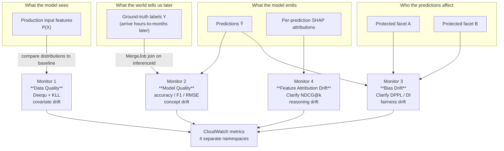
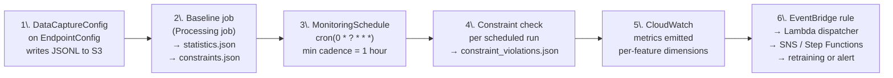
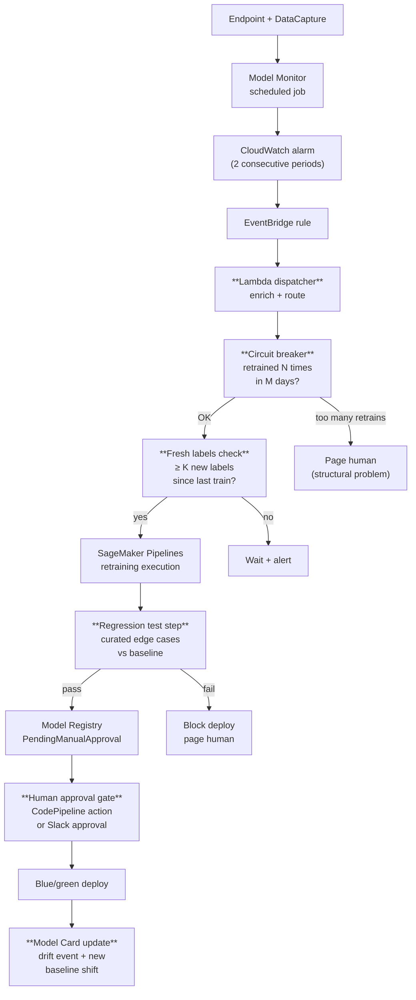

# Chapter 48 — SageMaker Model Monitor: The Four Monitor Types

> **Goal of this chapter:** to give you a working operator's model of SageMaker Model Monitor — what it is, what it isn't, the four monitor types it exposes, the shared six-step workflow that drives all of them, the JSON artifacts they emit, the CloudWatch namespaces they write to, and the canonical retraining loop that production teams build on top. By the end you should be able to read a Domain 4 scenario question, pick the right monitor (or the right *pair* of monitors), justify the cadence, set a defensible alarm threshold, and sketch the EventBridge → SageMaker Pipelines chain that turns the alarm into a retrain. This chapter is the operational backbone of Domain 4 (24% of the MLA-C01 exam) — every later chapter in Part I (drift theory, CloudWatch alarms, Model Cards) hangs off the scaffolding built here.

---

## 48.1 The silent-failure problem — why Model Monitor exists at all

There is a depressing observation about every production ML system, and it is the load-bearing argument for the existence of Model Monitor. A classical backend service fails in a *loud* way: a process crashes, a 500 floods the dashboard, p99 latency spikes, the on-call pager fires within minutes. A machine-learning service fails in a *quiet* way: the endpoint is still up, the HTTP 200s are still flowing, the p99 is still well inside SLO — and yet the predictions coming out the other side are slowly, systematically, getting worse. The model has not crashed; the world has crashed underneath the model, and nothing in your classical observability stack will tell you.

Cast your mind back to the auto-rollback machinery you wired into your deployment in Chapter 47. Blue/green, canary, shadow — all of them protect you against one specific class of failure: a *deployment* failure where the new model variant is immediately worse than the old one. The deploy hook fires, CloudWatch sees the regression, traffic shifts back to blue, on-call sleeps. That is the right tool for the deployment problem. But it cannot save you from the failure mode where **the model was perfectly correct at noon on Tuesday and gradually drifts into being wrong by Friday at three**. The blue/green machinery cannot detect this because by the time the drift has accumulated, the rollback target — the *previous* model variant — is just as drifted as the current one. Both versions were trained on a snapshot of the world that no longer matches the world.

This is the problem Model Monitor exists to solve. It is not a deployment tool. It is not a circuit breaker. It is a **continuous statistical comparison machine** that snapshots the distribution of inputs, predictions, fairness metrics, and feature attributions at training time, freezes that snapshot as a baseline, and re-computes the same statistics on a sliding window of live production data on a schedule — emitting violations to S3 and metrics to CloudWatch when the distance between the two exceeds a threshold. It is, structurally, the *only* AWS-managed component that can catch the most expensive class of ML failure: the one where the predictions silently rot.

Galileo and Articsledge cite, in vendor-funded surveys, that "91% of ML models suffer from model drift" and Gartner's repeated claim that "~85% of ML deployments fail after leaving the lab" — the often-quoted "73% of ML failures are drift" figure is a paraphrase of the same cluster of statistics. The exact number is not load-bearing; the defensible claim is that the **majority of production ML models experience measurable drift within their first year of deployment, and that the failures are silent — predictions continue to return, but their quality decays.** Lack of automated statistical drift testing means data drift and label-distribution shifts pass unnoticed until business KPIs collapse, by which time weeks of revenue impact are already baked in.

The MLA-C01 exam expects you to know this — Domain 4 Task 4.1 explicitly lists "monitoring data drift, model performance drift, bias drift, and feature attribution drift" as in-scope knowledge. Each of those four phrases maps one-to-one onto a SageMaker Model Monitor type. AWS designed the service so that each shift type from drift theory (covariate, concept, fairness, attribution) has a named, managed monitor — and Amazon expects you to know which monitor handles which shift, and to recognize the symptoms in a scenario question.

The anchoring scenario you will see in some form on the exam:

> *"A bank deployed a credit-default classifier 6 months ago. Operations report that average application income has trended upward by 40%, the model's predicted-default rate has dropped from 8% to 3%, but customer complaints about denied loans are now disproportionately from one demographic facet. Which TWO Model Monitor types should the team enable to diagnose the root cause?"*

The correct answer is **Data Quality** (covariate shift on `income`) and **Bias Drift** (fairness regression on the protected facet). Model Quality is not yet usable — labels arrive with a 90-day lag in credit. Feature Attribution Drift would catch the SHAP-rank shift but isn't the *primary* diagnostic here. You will see this pattern repeatedly: a paragraph of symptoms, a request to pick the *pair* of monitors. The four monitor types are the lexicon the exam expects you to deploy fluently.

---

## 48.2 The four monitor types — the mental model

There are exactly four Model Monitor types, no more, no fewer, and the MLA-C01 expects you to recite them in your sleep:

| # | Monitor type | Detects | Needs labels? | Engine | CloudWatch namespace |
|---|---|---|---|---|---|
| 1 | **Data Quality** | Covariate / feature drift, schema violations, type mismatches | No | Deequ (Apache Spark) + KLL sketches | `aws/sagemaker/Endpoints/data-metrics` |
| 2 | **Model Quality** | Concept drift; accuracy / RMSE / F1 degradation | **Yes** — via MergeJob | Custom evaluator container | `aws/sagemaker/Endpoints/model-metrics` |
| 3 | **Bias Drift** | Fairness degradation across protected facets | Some metrics need labels (DPPL, DI); some don't (DPL, CI) | SageMaker Clarify | `aws/sagemaker/Endpoints/bias-drift-metrics` |
| 4 | **Feature Attribution Drift** | SHAP feature-importance ranking changes | No | SageMaker Clarify (KernelSHAP) | `aws/sagemaker/Endpoints/feature-attribution-drift-metrics` |

Four rows. Four namespaces. One workflow. Every Domain 4 Model Monitor question reduces to "which row?" Memorize the table — the rest of this chapter is the explanation for why each row is what it is.



### 48.2.1 What "drift" means in each row

All four monitors share the same conceptual mechanic: **a baseline is computed once on training-time data; a scheduled job recomputes the same statistic on the production capture window; the two are compared and a violation is emitted if the delta exceeds a threshold.** What differs across rows is the *statistic*:

- **Data Quality** compares per-feature distributions of inputs (KLL-sketch CDFs).
- **Model Quality** compares performance metrics of predictions against labels (accuracy, AUC, F1, MSE, RMSE, MAE).
- **Bias Drift** compares fairness metrics (DPPL, DI, etc.) across a protected facet.
- **Feature Attribution Drift** compares SHAP attribution rankings via NDCG.

This unification is why the API surface is consistent across all four — same baseline-then-schedule pattern, same `constraints.json` + `statistics.json` artifacts, same CloudWatch emission, same EventBridge wiring. Learn the workflow once, apply it four times.

### 48.2.2 Which shift each monitor catches (the exam-favorite mapping)

| Shift type from drift theory | What changes | Need labels? | SageMaker monitor |
| --- | --- | --- | --- |
| **Covariate / data drift** | `P(X)` — input distribution | No | **Data Quality** |
| **Label shift / prior shift** | `P(Y)` — marginal target | Labels for ground-truth view | **Data Quality** (on prediction column) + **Model Quality** |
| **Concept drift** | `P(Y \| X)` — input-to-output mapping | **Yes** | **Model Quality** |
| **Bias drift** | Fairness metrics across facets | Some metrics yes (DPPL, DI), some no (DPL, CI) | **Clarify Bias Drift** |
| **Attribution drift** | SHAP feature-importance ranking | No | **Clarify Feature Attribution Drift** |

The full theoretical underpinning of *why* each shift type requires the technique it does — KLL sketches for covariate, MergeJob for concept, bootstrap CIs for bias, NDCG for attribution — is the subject of Chapter 49 (drift theory) and Chapter 50 (CloudWatch alarm wiring). This chapter is the operator's view; Chapter 49 is the statistician's view.

⚠️ **Exam alert.** *Model Quality is the only monitor that requires ground-truth label ingestion.* If a question says "labels arrive with a 90-day lag," "delayed labels," or "no labels available yet," Model Quality is **not** usable as the primary diagnostic — pick Data Quality, Bias Drift, or Feature Attribution Drift instead. This single sentence has rescued more candidates from wrong answers than any other rule in Part I.

---

## 48.3 The shared six-step workflow — once for all four monitors

Every Model Monitor type, regardless of which shift it detects, walks the same six-step lifecycle. Internalize this — when an exam question asks "what is the FIRST step?", "what artifact is produced by the baseline job?", or "where does the violation file land?", the answer is in one of these six steps.



### 48.3.1 Step 1 — Data Capture on the endpoint config

Without Data Capture, none of the four monitors can run on a real-time endpoint. (Batch transform monitoring uses captured batch inputs/outputs instead; Model Monitor added support in late 2022.) Data Capture is configured on the `EndpointConfig`, **not** on the endpoint itself — to change capture settings you must update the endpoint config and apply via `UpdateEndpoint`.

```python
data_capture_config = {
    "EnableCapture": True,
    "InitialSamplingPercentage": 20,                  # 0-100; SDK default 20
    "DestinationS3Uri": "s3://my-bucket/data-capture/fraud-endpoint/",
    "KmsKeyId": "arn:aws:kms:us-east-1:111:key/abc-...",   # optional CMK
    "CaptureOptions": [
        {"CaptureMode": "Input"},
        {"CaptureMode": "Output"}
    ],
    "CaptureContentTypeHeader": {
        "CsvContentTypes": ["text/csv"],
        "JsonContentTypes": ["application/json"]
    }
}
```

SageMaker writes captures as JSON Lines partitioned hour-by-hour:

```
s3://my-bucket/data-capture/fraud-endpoint/
  └── AllTraffic/                  (or per-variant subkey)
      └── 2026/05/27/14/           (yyyy/MM/dd/HH UTC)
          └── ab-cd-12-34.jsonl    (one file per container, several MB)
```

Operational guardrails the exam loves:

- **Sampling**: 100% capture on a 5k-TPS endpoint will saturate the instance's local disk before S3 sync drains it. AWS recommends keeping endpoint disk utilization **below 75%** — Data Capture *stops capturing* at high disk usage rather than dropping inferences. Start at 5-20% in production.
- **KMS**: if you encrypt the capture bucket with a customer-managed key, the SageMaker execution role needs `kms:Decrypt` and `kms:GenerateDataKey` on that key, and the bucket policy must allow `s3:PutObject` from the SageMaker service principal in the endpoint's region.
- **PHI/PII**: captured data is raw payload. Use a separate, tightly scoped bucket; consider Macie scanning if there's any chance of PII leaking through.
- **VPC**: if Studio or the endpoint runs in a custom VPC with no NAT, you must create S3 and CloudWatch gateway/interface endpoints — otherwise Model Monitor processing jobs cannot read captures.

Each capture record carries an `eventId` (UUID) and, if you pass it on `InvokeEndpoint`, an `inferenceId`. **This is the join key the Model Quality MergeJob uses to align captured predictions with ground-truth labels.** Always set `InferenceId` explicitly if you intend to monitor model quality — relying on the auto-generated `eventId` works but loses the ability to correlate to your upstream business system.

### 48.3.2 Step 2 — Baseline job

A one-shot SageMaker Processing job that consumes the training dataset (or labeled validation/holdout, in the case of Model Quality) and emits exactly two files into the configured output S3 URI:

- `statistics.json` — feature statistics computed from the baseline data.
- `constraints.json` — the rules the scheduled monitor will check against (thresholds).

You can let the SDK call `suggest_baseline()` for the inferred rules, or you can hand-author `constraints.json` from scratch — both are accepted. The baseline job runs *once* per model version; subsequent scheduled monitor runs only consume these two artifacts, they do not re-run baselines.

### 48.3.3 Step 3 — MonitoringSchedule

A recurring SageMaker Processing job triggered by a cron expression. **Minimum cadence is hourly** (`cron(0 * ? * * *)`). The schedule references the baseline artifacts (so the comparison target is fixed across all runs) and the data-capture S3 prefix (so the run knows what window to analyze).

```python
sagemaker_client.create_monitoring_schedule(
    MonitoringScheduleName="fraud-data-quality-hourly",
    MonitoringScheduleConfig=MonitoringScheduleConfig,
    Tags=[{"Key": "model_version", "Value": "v2.4.1"}],
)
```

The `MonitoringScheduleConfig` payload is the canonical exam-bait surface — Section 48.8 dissects it.

### 48.3.4 Step 4 — Constraint check

Each scheduled run produces:

- A new `statistics.json` for the captured window.
- A `constraint_violations.json` listing any rules from the baseline `constraints.json` that failed.
- Optionally a CloudWatch metric per feature / per fairness metric / per attribution.

These land in S3 under a date-partitioned prefix:

```
s3://my-bucket/monitoring-output/fraud/data-quality/
  └── fraud-data-quality-hourly/
      └── 2026/05/27/14-25-12-345/
          ├── statistics.json
          ├── constraint_violations.json
          └── exec-arn/<processing-job-arn>
```

### 48.3.5 Step 5 — CloudWatch metrics

When `EnableCloudWatchMetrics=True` (default) the same statistics are emitted to one of four CloudWatch namespaces, one namespace per monitor type. Section 48.9 spells out the namespace, the dimensions, and the canonical metric names.

### 48.3.6 Step 6 — EventBridge → Lambda → retraining

CloudWatch alarms fire when a metric crosses its threshold for the configured number of evaluation periods. The alarm state-change event lands on the EventBridge default bus; an EventBridge rule with a CloudWatch alarm event pattern targets a Lambda dispatcher; the Lambda enriches the event and routes to SNS (paging), Slack (notification), or a Step Functions / SageMaker Pipelines execution (automated retraining). Section 48.11 is the full reference architecture.

⚠️ **Exam alert.** *EventBridge does not invoke a SageMaker Pipeline directly with a CloudWatch-alarm payload — you need a Lambda dispatcher in the middle to extract the alarm context (which model, which feature, which monitor execution ARN) and pass it as parameters into the pipeline's `StartPipelineExecution` API call.* The naïve "EventBridge → Pipelines" answer is incomplete on the exam.

---

## 48.4 Monitor #1 — Data Quality

### 48.4.1 What it detects

Statistical drift in **input features** (covariate shift) and **schema integrity** (data-type mismatches, unexpected nulls, out-of-range values). It does **not** look at predictions or labels — it's a purely upstream-of-the-model check. It is the only monitor that does not need any post-model artifact (predictions, labels, attributions).

This is, in practice, the *first monitor every team turns on*, because it requires zero label ingestion, runs against the same training data you already have, and catches the largest class of silent failures — upstream data-pipeline corruption, vendor-feed schema changes, distribution drift caused by changes in the upstream business funnel.

### 48.4.2 The Deequ engine

AWS uses **Deequ** — an Amazon-open-sourced Spark library for unit-testing data — as the underlying analyzer. The prebuilt container `sagemaker-model-monitor-analyzer` packages Deequ + Spark + the SageMaker monitor scaffolding. You can override this with your own custom Processing container if you need bespoke checks.

The key data structure Deequ uses to keep the baseline compact is the **KLL sketch** — a streaming-quantile sketch that stores the empirical CDF of a continuous feature in a small, mergeable form. This is what allows scheduled jobs to compute L-infinity (Kolmogorov-Smirnov-style) distance against the baseline without re-reading the original training data. The KLL payload lives inside `statistics.json`.

### 48.4.3 `statistics.json` — the full schema

The baseline output for Data Quality:

```json
{
  "version": 0.0,
  "dataset": {
    "item_count": 100000
  },
  "features": [
    {
      "name": "applicant_income",
      "inferred_type": "Fractional",
      "numerical_statistics": {
        "common": { "num_present": 99987, "num_missing": 13 },
        "mean": 54812.4,
        "sum": 5481000000.0,
        "std_dev": 18230.1,
        "min": 12000.0,
        "max": 250000.0,
        "distribution": {
          "kll": {
            "buckets": [
              { "lower_bound": 12000, "upper_bound": 25000, "count": 4321 }
            ],
            "sketch": { "...KLL quantile sketch payload..." }
          }
        }
      }
    },
    {
      "name": "loan_purpose",
      "inferred_type": "String",
      "string_statistics": {
        "common": { "num_present": 100000, "num_missing": 0 },
        "distinct_count": 7,
        "distribution": {
          "categorical": {
            "buckets": [
              { "value": "auto", "count": 42000 },
              { "value": "home", "count": 35000 }
            ]
          }
        }
      }
    }
  ]
}
```

### 48.4.4 `constraints.json` — the rules that get enforced

```json
{
  "version": 0.0,
  "features": [
    {
      "name": "applicant_income",
      "inferred_type": "Fractional",
      "completeness": 1.0,
      "num_constraints": {
        "is_non_negative": true
      },
      "monitoring_config_overrides": {
        "evaluate_constraints": "Enabled",
        "distribution_constraints": {
          "perform_comparison": "Enabled",
          "comparison_method": "Robust",
          "comparison_threshold": 0.1
        }
      }
    }
  ],
  "monitoring_config": {
    "evaluate_constraints": "Enabled",
    "emit_metrics": "Enabled",
    "datatype_check_threshold": 1.0,
    "domain_content_threshold": 1.0,
    "distribution_constraints": {
      "perform_comparison": "Enabled",
      "comparison_threshold": 0.1
    }
  }
}
```

Per-feature constraints inferred from the baseline:

- `completeness` — fraction of non-null values expected.
- `inferred_type` — `Integral`, `Fractional`, `String`, or `Unknown`.
- `num_constraints.is_non_negative` for numerical features.
- `string_constraints` (allowed-values list) for categorical features.
- `distribution_constraints.comparison_threshold` — the distance threshold (default 0.1) that triggers a `data_drift` violation.

Global `monitoring_config`:

- `datatype_check_threshold` — fraction of rows that must match the inferred type (default 1.0 = strict).
- `domain_content_threshold` — fraction of categorical values that must be in the baseline domain (default 1.0).
- `distribution_constraints.comparison_method` — `Simple` or `Robust` (Robust uses trimmed statistics; less sensitive to outliers).

**You can hand-edit `constraints.json`** and re-upload to S3 to tune thresholds without re-running the baseline. This is how production teams loosen overly strict KS thresholds discovered in the first week of monitoring. The typical maturity progression: start with default constraints, suffer 2-4 weeks of alarm fatigue, tune until the alarm rate is below 1/week per model, then run quarterly red-team injections (multiply a feature by 1.5, inject 10% nulls) to verify the monitor still has teeth.

### 48.4.5 `constraint_violations.json` — what a violated run emits

```json
{
  "violations": [
    {
      "feature_name": "applicant_income",
      "constraint_check_type": "data_drift",
      "description": "L-infinity distance 0.18 exceeds threshold 0.1"
    },
    {
      "feature_name": "loan_purpose",
      "constraint_check_type": "domain_content",
      "description": "Value 'crypto' not in baseline domain"
    }
  ]
}
```

Treat this schema *defensively* in your Lambda dispatcher — AWS evolves the schema across SDK versions, and a hard-coded parser will silently break on a new field.

### 48.4.6 The SDK call (DefaultModelMonitor)

```python
from sagemaker.model_monitor import DefaultModelMonitor, CronExpressionGenerator
from sagemaker.model_monitor.dataset_format import DatasetFormat

dq_monitor = DefaultModelMonitor(
    role=role,
    instance_count=1,
    instance_type="ml.m5.xlarge",
    volume_size_in_gb=20,
    max_runtime_in_seconds=3600,
)

dq_monitor.suggest_baseline(
    baseline_dataset="s3://my-bucket/train/train.csv",
    dataset_format=DatasetFormat.csv(header=True),
    output_s3_uri="s3://my-bucket/baselines/fraud/data-quality/",
    wait=True,
)

dq_monitor.create_monitoring_schedule(
    monitor_schedule_name="fraud-data-quality-hourly",
    endpoint_input=endpoint_name,
    output_s3_uri="s3://my-bucket/monitoring-output/fraud/data-quality/",
    statistics=dq_monitor.baseline_statistics(),
    constraints=dq_monitor.suggested_constraints(),
    schedule_cron_expression=CronExpressionGenerator.hourly(),
    enable_cloudwatch_metrics=True,
)
```

### 48.4.7 CloudWatch metrics

Namespace: `aws/sagemaker/Endpoints/data-metrics`.

Per-feature dimensions: `Endpoint`, `MonitoringSchedule`, `Feature` (e.g., `applicant_income`).

Key metric names:

- `feature_baseline_drift_<feature>` — the computed L-infinity distance for the feature.
- `feature_non_null_<feature>` — fraction of non-null observations.
- `feature_completeness_<feature>` — completeness check result.
- Aggregate alarm metrics: `feature_baseline_drift` (across all features), `violation_count`.

**Production alarm threshold:** `feature_baseline_drift_<feature> > 0.1` for **2 consecutive 1-hour periods** triggers a Data Quality alarm. The two-period requirement is critical — single-period alarms produce alarm fatigue from random sampling noise.

⚠️ **Exam alert.** *Data Quality monitoring will not catch concept drift.* If a question says "the input distributions look unchanged but model accuracy has dropped," the answer is **Model Quality**, not Data Quality. Concept drift means `P(Y|X)` has changed while `P(X)` is stable — only a monitor with access to labels can detect it.

---

## 48.5 Monitor #2 — Model Quality

### 48.5.1 What it detects

Performance degradation of the **deployed model's predictions vs. ground-truth labels**. This is the **only** monitor that catches **concept drift** (changes in `P(Y|X)`) because it actually evaluates accuracy / RMSE / F1 — not just feature distributions. It is also the only monitor with a substantial operational prerequisite: a *label ingestion pipeline*.

### 48.5.2 The label-ingestion problem — the biggest production trap

Model Quality is fundamentally harder to operate than Data Quality because **labels arrive late, partial, and out-of-order**. Concrete examples:

- Fraud detection: a transaction is labeled fraud only after a customer disputes — median 14 days, tail to 90 days.
- Credit default: labels arrive 30-365 days after the decision.
- Recommender click-through: labels arrive seconds-to-hours later.
- Insurance claim approval: 1-14 days.
- Healthcare 30-day readmission: 30+ days, by definition.

You must build a separate ingestion pipeline that drops labels into a known S3 prefix with a record-ID join key. The official AWS guidance on the schema is brutally explicit:

```
s3://my-bucket/ground-truth/fraud/2026/05/27/14/
  └── labels-batch-001.jsonl
```

Each label record:

```json
{
  "groundTruthData": {
    "data": "1",
    "encoding": "CSV"
  },
  "eventMetadata": {
    "eventId": "abc-uuid-1234",
    "inferenceTime": "2026-05-27T14:23:45Z"
  },
  "eventVersion": "0"
}
```

The `eventId` (also called `inferenceId` in the captured payload) is the join key. **There is no fuzzy match.** If your model wasn't configured to emit a stable inference-id, you cannot ingest ground truth — you have to re-deploy first.

### 48.5.3 The MergeJob

When the scheduled monitor runs, it kicks off a **MergeJob** as the first stage. MergeJob:

1. Lists capture files under `s3://.../data-capture/.../yyyy/MM/dd/HH/` for the analysis window.
2. Lists label files under `s3://.../ground-truth/.../yyyy/MM/dd/HH/` for the same window.
3. Joins on `eventId` (or `inferenceId` when you pass `InferenceId` in `InvokeEndpoint`).
4. Emits a merged dataset (predictions ⨝ labels) to a temporary S3 prefix.

The downstream evaluator container then computes metrics on the merged dataset. Predictions without a matching label, and labels without a matching prediction, are dropped (logged in the job output).

**Common failure modes the exam tests:**

- `InferenceId` not passed on `InvokeEndpoint` → `eventId` is an auto-generated UUID that the upstream labeling system doesn't know → 0% join rate → "no merged data" error.
- Labels arrive in a different hour partition than the original capture (latency-driven). Fix: either back-fill labels into the original capture-hour prefix, or use a wider window via `start_offset` / `end_offset` on the schedule.
- IAM: the monitor execution role needs read on both prefixes and write on the merge output prefix.
- The **empty-intersection silent success**: hourly cadence with 30-day-lagged labels means the merge intersection is empty, the job *succeeds* with no metrics, alarms enter `INSUFFICIENT_DATA` state, and the team thinks "monitoring is on" when nothing is actually being monitored.

### 48.5.4 `start_offset` and `end_offset` — the latency-matched windows

When you create a Model Quality `MonitoringSchedule`, you supply ISO-8601 durations that tell the MergeJob how far back in time to look for matching labels.

| Business problem | Label latency | `start_offset` / `end_offset` |
|---|---|---|
| E-commerce purchase conversion | 1-24 hours | `-P1D` / `-PT0H` |
| Ad click attribution | minutes-hours | `-PT2H` / `-PT0H` |
| Loan 30-day delinquency | 30+ days | `-P31D` / `-P30D` |
| Insurance claim approval | 1-14 days | `-P14D` / `-PT0H` |
| 30-day readmission | 30+ days | `-P31D` / `-P30D` |
| Fraud chargeback dispute | 30-90 days | `-P91D` / `-P30D` |

The pattern that bites teams: configure `start_offset=-PT1H` because "hourly monitoring" sounds right, then run a Model Quality job that joins predictions-from-an-hour-ago with labels that don't exist for another month, and the job silently succeeds with an empty intersection.

### 48.5.5 The SDK call (ModelQualityMonitor)

```python
from sagemaker.model_monitor import ModelQualityMonitor, EndpointInput

mq_monitor = ModelQualityMonitor(
    role=role,
    instance_count=1,
    instance_type="ml.m5.xlarge",
)

mq_monitor.suggest_baseline(
    baseline_dataset="s3://my-bucket/validation/val-with-preds.csv",
    dataset_format=DatasetFormat.csv(header=True),
    output_s3_uri="s3://my-bucket/baselines/fraud/model-quality/",
    problem_type="BinaryClassification",
    inference_attribute="prediction",
    probability_attribute="probability",
    ground_truth_attribute="actual_label",
    probability_threshold_attribute=0.5,
)

mq_monitor.create_monitoring_schedule(
    monitor_schedule_name="fraud-model-quality-daily",
    endpoint_input=EndpointInput(
        endpoint_name=endpoint_name,
        destination="/opt/ml/processing/input/endpoint",
        inference_attribute="prediction",
        probability_attribute="probability",
    ),
    ground_truth_input="s3://my-bucket/ground-truth/fraud/",
    problem_type="BinaryClassification",
    output_s3_uri="s3://my-bucket/monitoring-output/fraud/model-quality/",
    statistics=mq_monitor.baseline_statistics(),
    constraints=mq_monitor.suggested_constraints(),
    schedule_cron_expression=CronExpressionGenerator.daily(),
    enable_cloudwatch_metrics=True,
)
```

### 48.5.6 Problem types and emitted metrics

| `ProblemType` | Metrics computed |
| --- | --- |
| `BinaryClassification` | `confusion_matrix`, `accuracy`, `precision`, `recall`, `f0_5`, `f1`, `f2`, `auc`, `true_positive_rate`, `true_negative_rate`, `false_positive_rate`, `false_negative_rate`, `recall_best_constant_classifier`, `precision_best_constant_classifier` |
| `MulticlassClassification` | Per-class versions of the above + `weighted_recall`, `weighted_precision`, `weighted_f1`, `weighted_f0_5`, `weighted_f2`, `accuracy_best_constant_classifier`, `weighted_recall_best_constant_classifier` |
| `Regression` | `mae`, `mse`, `rmse`, `r2` |

### 48.5.7 `constraints.json` for Model Quality

```json
{
  "version": 0.0,
  "binary_classification_constraints": {
    "recall":   { "threshold": 0.78, "comparison_operator": "LessThanThreshold" },
    "precision":{ "threshold": 0.82, "comparison_operator": "LessThanThreshold" },
    "f1":       { "threshold": 0.80, "comparison_operator": "LessThanThreshold" },
    "accuracy": { "threshold": 0.92, "comparison_operator": "LessThanThreshold" },
    "auc":      { "threshold": 0.91, "comparison_operator": "LessThanThreshold" }
  }
}
```

`comparison_operator` is the direction of the alarm — for accuracy / F1 / AUC you want `LessThanThreshold` (alarm when performance falls below baseline); for MAE / RMSE you want `GreaterThanThreshold`.

### 48.5.8 CloudWatch metrics and production thresholds

Namespace: `aws/sagemaker/Endpoints/model-metrics`.

Dimensions: `Endpoint`, `MonitoringSchedule`.

Metric names match the `ProblemType` outputs: `accuracy`, `precision`, `recall`, `f1`, `auc`, `mae`, `mse`, `rmse`, `r2`, `true_positive_rate`, etc.

**Production alarm thresholds:** `accuracy < 0.85` and `f1 < 0.70` for 2 consecutive daily periods are the most commonly published thresholds. For regression models, `rmse >= business_tolerance` for 2 consecutive periods. Single-period alarms are appropriate only for compliance metrics where a single breach is itself a finding.

### 48.5.9 Cadence trade-offs

| Label arrival latency | Recommended cadence |
| --- | --- |
| Seconds-to-minutes (ad clicks, recommender feedback) | Hourly |
| Hours-to-days (customer support outcomes) | Daily |
| Weeks (fraud disputes, return policies) | Weekly |
| Months (credit default, churn) | Monthly + roll-forward backfill |

Setting cadence shorter than label availability produces empty metric windows ("no merged data") — alarms enter `INSUFFICIENT_DATA` state, *masking* real drift.

---

## 48.6 Monitor #3 — Bias Drift (Clarify)

### 48.6.1 What it detects

Changes in **fairness metrics across a protected facet** (e.g., race, age, gender) over time. Built on the SageMaker Clarify analysis library — the same one used for pre-deployment bias reports (Chapter 21 covers Clarify pre-training; Chapter 29 covers Clarify post-training; this chapter extends both into the production-monitoring dimension).

Bias Drift is unlike the other three monitors in one fundamental way: **it is a compliance monitor, not an operational monitor.** Data Quality, Model Quality, and Feature Attribution Drift exist because the ML team wants the model to keep working. Bias Drift exists because a regulator requires evidence that the model is not producing disparate impact on protected classes *post-deployment*, not just at training time. Alerts route to **Model Risk / Compliance teams**, not to on-call ML engineers. Thresholds are set by **legal / regulatory standards**, not ML judgment. The audit trail is itself a regulatory artifact retained for years.

### 48.6.2 The two metric families

Clarify exposes **pre-training** and **post-training** bias metrics. The bias drift monitor can compute either or both.

**Pre-training bias metrics** (no labels needed — features + facet only):

| Metric | Acronym | Detects |
| --- | --- | --- |
| Class Imbalance | CI | Facet has very different sample size |
| Difference in Proportions of Labels | DPL | Different positive-class rate between facets |
| Kullback-Leibler Divergence | KL | Distributional divergence in label-given-facet |
| Jensen-Shannon Divergence | JS | Symmetric KL |
| Lp-norm | LP | Distance between facet conditional distributions |
| Total Variation Distance | TVD | Max difference between facet conditional distributions |
| Kolmogorov-Smirnov | KS | Max CDF gap between facet conditionals |
| Conditional Demographic Disparity in Labels | CDDL | Label disparity conditioned on a sub-population |

**Post-training bias metrics** (require *predictions* and sometimes labels):

| Metric | Acronym | Detects |
| --- | --- | --- |
| Difference in Positive Proportions in Predicted Labels | DPPL | Different model-positive rates across facets |
| Disparate Impact | DI | Ratio of positive-prediction rates (the 4/5ths rule) |
| Difference in Conditional Acceptance | DCA | Acceptance rate conditioned on true positive |
| Difference in Conditional Rejection | DCR | Rejection rate conditioned on true negative |
| Recall Difference | RD | Recall gap across facets |
| Accuracy Difference | AD | Accuracy gap |
| Treatment Equality | TE | False-positive vs false-negative rate ratio |
| Counterfactual Flipset | FT | How many predictions flip when only facet changes |

The exam favorites: **DPPL** and **DI** for in-production fairness drift.

### 48.6.3 The confidence-interval trick — how drift is actually detected

Clarify does **not** compare raw metric values directly. Instead it constructs a **Normal Bootstrap Confidence Interval** `C = (c_min, c_max)` around the current-window bias value and compares it to an *allowed range* `A = (a_min, a_max)` (e.g., DPPL allowed in `(-0.1, 0.1)`).

- If `C ∩ A ≠ ∅` (the confidence interval overlaps the allowed range): the metric is plausibly OK — no alert.
- If `C ∩ A = ∅` (disjoint): Clarify is confident the bias exceeds the allowed range → emit violation.

This is critical exam knowledge: the bootstrap CI prevents noisy alerts from small-sample windows. Don't be surprised when a question asks "why didn't the bias monitor alert despite a 30% measured DPPL increase in the latest hour?" — the answer is the CI overlap with the allowed range due to insufficient sample size.

### 48.6.4 Bias drift `constraints.json` excerpt

```json
{
  "version": 0.0,
  "post_training_bias": {
    "DPPL": { "threshold": 0.1 },
    "DI":   { "threshold": 1.25 }
  }
}
```

### 48.6.5 CloudWatch metrics and the EEOC 4/5ths rule

Namespace: `aws/sagemaker/Endpoints/bias-drift-metrics`.

Dimensions: `Endpoint`, `MonitoringSchedule`. Metrics named per `<metric>_<label>_<facet>` (e.g., `DPPL_default_gender_male`).

**Production alarm thresholds** for regulated decisioning:

- `|DPPL| > 0.10` for 1 daily period (a single breach is itself a finding).
- `DI ∉ [0.80, 1.25]` for 1 daily period.

⚠️ **Exam alert.** *The EEOC 4/5ths rule sets DI's acceptable band at `[0.80, 1.25]`.* This is the legal definition of disparate impact in US hiring (NYC Local Law 144 codifies it explicitly for automated hiring tools, with annual audit requirements). The 4/5ths rule comes from the Uniform Guidelines on Employee Selection Procedures (1978) — `0.80` is `4/5`, and `1.25` is `5/4`, its reciprocal. If a question asks "what DI band triggers a Bias Drift violation," the answer is `[0.80, 1.25]`.

### 48.6.6 The regulations driving adoption

| Regulation | Industry | What it requires |
|---|---|---|
| **Revised interagency model risk guidance** (FRB+FDIC+OCC, April 2026, replacing SR 11-7) | US banking | Risk-based, principles-driven framework — same expectation of ongoing monitoring as pre-rescission SR 11-7, with more discretion on cadence and threshold |
| **EU AI Act** (high-risk AI systems) | EU, any sector | Continuous post-market monitoring; human oversight; bias testing as part of conformity assessment |
| **NYC Local Law 144** | NYC employers using automated hiring tools | Annual bias audit; DI ∈ [0.80, 1.25] |
| **Colorado AI Act** (and similar US state laws, 2024-2026) | Multiple US states | Risk assessment + ongoing monitoring for high-risk AI |

The published cadence pattern for regulated industries: **daily Data Quality + Model Quality, weekly Bias Drift, monthly Feature Attribution Drift**, with all four feeding into the same model-risk audit dashboard. Bias Drift cadence is rarely hourly because the statistical power of fairness metrics requires enough samples per protected class to be meaningful.

---

## 48.7 Monitor #4 — Feature Attribution Drift (Clarify)

### 48.7.1 What it detects

Changes in **which features drive predictions** — measured via SHAP attributions. A model can pass Data Quality (inputs unchanged) and Model Quality (accuracy stable) yet have its *reasons* shift in ways that warn of incoming degradation. This is the sleeper monitor — lowest adoption of the four, highest signal-to-noise for specific failure modes.

### 48.7.2 Why it's a leading indicator

Attribution drift is widely considered a **leading indicator** of concept drift. The textbook scenario:

1. A churn model is trained on data where `tenure_months` is the top SHAP feature.
2. An upstream ETL change corrupts `tenure_months` (now mostly NaN, defaulted to 0).
3. The Data Quality monitor catches missing-value uptick but not the *semantic* impact.
4. The Model Quality monitor cannot fire — labels arrive 90 days later.
5. **Attribution drift fires within hours** — SHAP rankings show `monthly_charges` now ranked first, `tenure_months` collapsed to bottom of the ranking.
6. ML team investigates before customer churn predictions become unreliable.

The other monitors catch what the model receives (Data Quality), whether predictions are right (Model Quality), or who it favors (Bias Drift). Feature Attribution Drift is the only monitor that looks at *why* the model is making the predictions it makes. Failure modes it catches that the others miss:

- **Silent input-correlation shifts:** Features A and B were highly correlated at training time and the model leaned on A. In production the correlation breaks and the model starts leaning on B. Data Quality sees no issue (both features within baseline). Model Quality may see only a small accuracy drop. Attribution Drift sees a major NDCG drop because A and B swap ranks.
- **Adversarial / synthetic input streams:** A bot or fraudster crafts inputs that look statistically normal but exploit specific features. Data Quality sees normal inputs; Attribution Drift sees an unusual feature elevated in importance.
- **Upstream feature-engineering bugs:** A feature pipeline silently emits a constant. Data Quality may flag completeness but not the importance shift; Attribution Drift flags the near-zero SHAP value for what used to be a top-3 feature.

### 48.7.3 The NDCG@k formula

The monitor uses **NDCG (Normalized Discounted Cumulative Gain)** to compare two ranked lists of features by their mean |SHAP| attribution:

```
NDCG@k = DCG@k / IDCG@k

DCG@k  = Σ_{i=1..k} (rel_i / log2(i + 1))
IDCG@k = ideal DCG (baseline ordering by mean |SHAP|)
```

The baseline ranking is the "ideal" — features ordered by mean |SHAP| on the training data. The production ranking comes from KernelSHAP applied to a sample of captured inferences. Perfect agreement → NDCG = 1.0. Total reordering → NDCG approaches 0.

**Default alarm threshold:** NDCG below **0.90** triggers a `feature_attribution_drift` violation. AWS sets this as the default; most teams keep it unchanged.

### 48.7.4 Computational cost

KernelSHAP is expensive — each explanation requires `N_samples` extra model invocations against the baseline. The monitor mitigates this by:

- Sampling only a subset of captured inferences (configurable via `ShapConfig.NumberOfSamples`).
- Using a representative baseline (mean or median of training features) rather than the full training set.
- Running on `ml.m5.2xlarge` or larger if the model is GPU-bound.

This is also the primary reason adoption is low: SHAP is expensive, SHAP requires interpretability literacy on the on-call rotation, baselines are more involved than a CSV statistics scan, and an NDCG drop is harder to action than a feature-distribution drift. Mature teams enable it on **tier-1 models only** (top revenue impact, top compliance risk), with weekly cadence, and assign a *named* SHAP-drift on-call.

### 48.7.5 SDK call

```python
from sagemaker.model_monitor import ModelExplainabilityMonitor
from sagemaker.clarify import SHAPConfig, DataConfig, ModelConfig

shap_config = SHAPConfig(
    baseline=[mean_feature_values],
    num_samples=100,
    agg_method="mean_abs",
)

me_monitor = ModelExplainabilityMonitor(
    role=role, instance_count=1, instance_type="ml.m5.xlarge"
)

me_monitor.suggest_baseline(
    data_config=DataConfig(...),
    model_config=ModelConfig(model_name=model_name, ...),
    explainability_config=shap_config,
)

me_monitor.create_monitoring_schedule(
    endpoint_input=endpoint_name,
    output_s3_uri="s3://my-bucket/monitoring-output/fraud/attribution-drift/",
    constraints=me_monitor.suggested_constraints(),
    schedule_cron_expression=CronExpressionGenerator.daily(),
    enable_cloudwatch_metrics=True,
)
```

### 48.7.6 CloudWatch metrics

Namespace: `aws/sagemaker/Endpoints/feature-attribution-drift-metrics`.

Key metric: `feature_attribution_drift_ndcg` — alarm when `< 0.90`.

Per-feature attribution values also emitted: `feature_attribution_<feature>` (mean |SHAP| from the current window). Useful for diagnostic dashboards beyond the single NDCG number.

⚠️ **Exam alert.** *Feature Attribution Drift is a leading indicator of concept drift — it fires before Model Quality can.* If a scenario describes "we want to catch model degradation BEFORE accuracy drops" or "labels arrive too late to monitor accuracy directly," Feature Attribution Drift is the answer. Pair it with Data Quality for full coverage when labels are unavailable.

---

## 48.8 The `CreateMonitoringSchedule` API surface

All four monitors share the same `CreateMonitoringSchedule` API. The full payload (abbreviated):

```python
MonitoringScheduleConfig = {
    "ScheduleConfig": {
        "ScheduleExpression": "cron(0 * ? * * *)"   # hourly
    },
    "MonitoringJobDefinition": {
        "BaselineConfig": {
            "ConstraintsResource": {"S3Uri": "s3://.../constraints.json"},
            "StatisticsResource":  {"S3Uri": "s3://.../statistics.json"}
        },
        "MonitoringInputs": [{
            "EndpointInput": {
                "EndpointName": "fraud-endpoint",
                "LocalPath": "/opt/ml/processing/endpointdata",
                "S3InputMode": "File",
                "S3DataDistributionType": "FullyReplicated"
            }
        }],
        "MonitoringOutputConfig": {
            "MonitoringOutputs": [{
                "S3Output": {
                    "S3Uri": "s3://my-bucket/output/",
                    "LocalPath": "/opt/ml/processing/output",
                    "S3UploadMode": "Continuous"
                }
            }]
        },
        "MonitoringResources": {
            "ClusterConfig": {
                "InstanceCount": 1,
                "InstanceType": "ml.m5.xlarge",
                "VolumeSizeInGB": 20
            }
        },
        "MonitoringAppSpecification": {
            "ImageUri": "159807026194.dkr.ecr.us-east-1.amazonaws.com/sagemaker-model-monitor-analyzer"
        },
        "RoleArn": "arn:aws:iam::111:role/SageMakerMonitorRole",
        "StoppingCondition": {"MaxRuntimeInSeconds": 1800}
    },
    "MonitoringType": "DataQuality"   # or ModelQuality, ModelBias, ModelExplainability
}
```

### 48.8.1 Cron expression rules

6 fields: `cron(minute hour day-of-month month day-of-week year)`. Use `?` in either day-of-month or day-of-week to indicate "any" (the two are mutually exclusive in EventBridge cron). Minimum cadence is 1 hour — the API will accept finer expressions but the service de-duplicates within an hour. Common patterns: `cron(0 * ? * * *)` (hourly), `cron(0 4 * * ? *)` (daily 04:00 UTC), `cron(0 4 ? * MON-FRI *)` (weekdays 04:00 UTC).

### 48.8.2 The four `MonitoringType` enum values

| MonitoringType | Monitor class | Default container |
| --- | --- | --- |
| `DataQuality` | `DefaultModelMonitor` | `sagemaker-model-monitor-analyzer` (Deequ) |
| `ModelQuality` | `ModelQualityMonitor` | `sagemaker-model-monitor-analyzer` (with PreFlowConfig for MergeJob) |
| `ModelBias` | `ModelBiasMonitor` | SageMaker Clarify analyzer image |
| `ModelExplainability` | `ModelExplainabilityMonitor` | SageMaker Clarify analyzer image |

Note that Bias and Attribution Drift share the *same* underlying Clarify container — they differ only in the analysis config that selects bias metrics vs. SHAP attributions.

---

## 48.9 CloudWatch namespaces — the four-row cheat sheet

| Monitor | Namespace | Key metric to alarm on | Production threshold |
| --- | --- | --- | --- |
| Data Quality | `aws/sagemaker/Endpoints/data-metrics` | `feature_baseline_drift_<feature>` | `> 0.1` for 2 consecutive 1-hour periods |
| Model Quality | `aws/sagemaker/Endpoints/model-metrics` | `accuracy`, `f1`, `rmse` | `accuracy < 0.85` or `f1 < 0.70` for 2 consecutive periods |
| Bias Drift | `aws/sagemaker/Endpoints/bias-drift-metrics` | `DPPL_<label>_<facet>`, `DI_<label>_<facet>` | `|DPPL| > 0.10`; `DI ∉ [0.80, 1.25]` (single period for compliance) |
| Feature Attribution Drift | `aws/sagemaker/Endpoints/feature-attribution-drift-metrics` | `feature_attribution_drift_ndcg` | `< 0.90` for 2 consecutive periods |

Confusing `bias-drift-metrics` with `feature-attribution-drift-metrics` is the single most-common exam-distractor in the namespace family — both are Clarify-backed but emit to *different* namespaces and require *different* alarms.

---

## 48.10 `statistics.json` vs `constraints.json` vs `constraint_violations.json` — the file triplet

Every monitor type writes these files. Their roles:

| File | Baseline output meaning | Scheduled-run output meaning |
| --- | --- | --- |
| `statistics.json` | Reference distribution / metrics from training data | Computed statistics from the captured/labeled window |
| `constraints.json` | Inferred rules and thresholds the monitor will enforce | Not written by scheduled runs — baseline only |
| `constraint_violations.json` | Not written | Violations of the baseline `constraints.json` |

**Editing `constraints.json`** lets you hand-tune the baseline after suggesting it — loosen `comparison_threshold` from `0.1` to `0.2` for noisy features, set `evaluate_constraints: "Disabled"` for known-volatile columns (e.g., a `request_timestamp` epoch), or tighten `completeness` for stricter not-null rules. Re-upload to S3 and the next execution picks it up. No re-baselining required.

---

## 48.11 The canonical retraining loop — with production guardrails

The reference architecture AWS publishes is:

```
[Production traffic]
    ↓ inferences
[SageMaker endpoint + DataCaptureConfig]
    ↓ captured I/O to S3
[Model Monitor scheduled job (hourly or daily)]
    ↓ metrics
[CloudWatch metrics + alarm]
    ↓ alarm state → ALARM
[EventBridge rule (CloudWatch alarm event pattern)]
    ↓ targets
[SageMaker Pipelines retraining execution]
    ↓ approved model
[Model Registry + blue/green deploy]
```

This is the "happy path" — what AWS publishes in the docs and the ML blog. But production teams **never run it as-published**. The published loop has five gaps that mature teams plug:



The five guardrails:

1. **Human approval gate.** The retrained model registers as `PendingManualApproval`; a CodePipeline action (or Slack-bot custom action) requires an ML engineer to sign off before promotion. Never let an automated loop self-promote in regulated industries.
2. **Fresh-labels check.** Before retraining, the pipeline checks that newly-labeled data has actually arrived since the last training run. Otherwise you retrain on the same dataset and don't fix the drift — wasted compute, infinite loop. Mature teams gate retraining on "≥ K new labeled examples since last training run."
3. **Regression-test step.** The retrained model is evaluated on a held-out curated dataset (edge cases that should always be predicted correctly); the pipeline fails the retrain if regression-test performance drops below baseline. Catches the "retrained model is technically more accurate but breaks an edge case the business cares about" failure mode.
4. **Backoff / circuit breaker.** If retraining has fired more than N times in M days, the pipeline pages a human rather than retraining again, on the assumption that something is structurally wrong beyond drift.
5. **Model-card update step.** Captures the drift event, the retrained model's baseline shift, and the manual approval — feeds the SR-11-7-replacement audit trail. Chapter 51 covers Model Cards in depth.

The "fresh labels" trap is the single biggest published failure of the canonical loop: the loop fires on **data drift** (no labels needed) but the retraining step needs **fresh labels** to actually fix the model. Teams that don't gate on label availability retrain on stale labels, the new model isn't actually better, the drift persists, the loop fires again, repeat.

---

## 48.12 Cost — what running four monitors actually costs

### 48.12.1 The pricing model

SageMaker Model Monitor jobs are billed as **SageMaker Processing jobs**: per-second instance hours, 60-second minimum, of whatever instance the monitor runs on. AWS includes **30 free monitor-hours per month** when you use the built-in rules (no charge for the *first* 30 hours of compute across all your scheduled monitor jobs in a month). After the free tier, you pay the processing-job rate for the instance type.

### 48.12.2 The four-monitors-hourly worked example

For one endpoint with all four monitors enabled at hourly cadence on `ml.m5.xlarge`:

- 4 monitors × 24 runs/day × 30 days = 2,880 monitor executions/month.
- ~5 minutes per execution (the AWS canonical example) → 2,880 × 5 / 60 = **240 monitor-hours/month**.
- Free tier covers 30 hours → **210 billable hours**.
- `ml.m5.xlarge` ≈ $0.23/hour on-demand in `us-east-1`.
- 210 × $0.23 ≈ **$48/month per endpoint** for monitor compute alone.

That is modest in isolation. The cost scales with endpoint count:

- **20 endpoints**: ~$960/month, ~$11,500/year — still affordable.
- **200 endpoints** (multi-tenant ML platform): ~$9,600/month, **~$115,000/year** — now cadence optimization matters.

### 48.12.3 Cadence-by-model-type

| Model type | Typical cadence | Why |
|---|---|---|
| Real-time fraud / trading | **Hourly** (or sub-hourly via DIY) | Cost of missed drift exceeds compute by 100× |
| Recommendation / personalization | **Daily** | Catalog drift moves on daily cycles; hourly is noise |
| Underwriting / risk scoring | **Daily** | Application volume daily; labels are slow |
| Batch transform models | **Per-batch** | No continuous traffic to monitor |
| Low-traffic models (< 1000 inferences/day) | **Daily or weekly** | Hourly window lacks statistical power |

The single most common anti-pattern: configuring **hourly monitoring on a model that receives 50 inferences/hour**. The monitor window has insufficient statistical power, every run flags spurious drift, and the team disables the monitor entirely within a month.

---

## 48.13 The layered approach — Model Monitor is the floor, not the ceiling

Mature ML platforms do not run *only* SageMaker Model Monitor. They run Model Monitor as the **AWS-native floor** — the four canonical drift signals with zero-code baseline generation — and layer additional observability on top:

- **Evidently AI (OSS)** — chosen by teams that want richer HTML reports than Model Monitor's JSON constraint-violation output, and that already version their training pipelines in open-source tools. Integrates with MLflow.
- **WhyLabs / WhyLogs** — chosen by teams wanting unified observability across multiple model-hosting platforms (some on SageMaker, some on EKS, some external). WhyLogs profiles are smaller than full data captures and survive long-term retention.
- **Arize AI** — chosen by orgs running both predictive ML and GenAI in production; the tool most cited for LLM observability alongside classical ML.
- **Capital One's open-source Data Profiler** — Capital One built their own feature-drift monitoring around statistical-property tracking (mean, stddev, frequency, type detection). They publish it separately, which is a signal that in-product Model Monitor wasn't sufficient for their regulated-finance use cases circa 2022-2024.

The pattern across published case studies: **Model Monitor is the "first monitor you turn on" because it's zero-code-baseline-generation, and then teams layer DIY on top once they outgrow the JSON-and-CloudWatch surface area.** For the MLA-C01, Model Monitor's four types are the lexicon you must know. For your day job after passing, expect to operate it alongside one of the above.

---

## 48.14 Operational anti-patterns the exam likes to test

- **Setting `SamplingPercentage = 100` on a 10k-TPS endpoint** — fills S3 fast, balloons Processing-job cost. Production: 5-20%.
- **Running Model Quality without a ground-truth ingestion pipeline** — monitor errors with "no merged data." Build label ingest *before* scheduling Model Quality.
- **Choosing hourly cadence with 7-day-lagged labels** — alerts fire weeks late. Match cadence to label availability.
- **Using the same baseline forever** — refresh on every approved retrain; otherwise comparing against a stale distribution.
- **Forgetting to pass `InferenceId` to `InvokeEndpoint`** — Model Quality MergeJob can't join with upstream labels.
- **Treating `constraint_violations.json` as a stable schema** — AWS evolves the schema; parse it defensively in Lambda.
- **Confusing `bias-drift-metrics` and `feature-attribution-drift-metrics` namespaces** — both are Clarify-backed but emit to *different* namespaces.
- **Trusting attribution drift on a tiny endpoint sample** — KernelSHAP variance is high for small `num_samples`; bump to ≥200 in production.

---

## 48.15 Decision tree — which monitor for which scenario

```
Has the input distribution changed?  ──Yes──▶  Data Quality
                                     ──No──┐
Are labels available with low latency?       │
   ──Yes──▶ Has accuracy/RMSE dropped? ──Yes──▶ Model Quality
   ──No──┐
Is fairness drift a regulatory concern?  ──Yes──▶ Bias Drift
   ──No──┐
Are feature attributions a leading-indicator concern? ──Yes──▶ Attribution Drift
```

### 48.15.1 The "which two" exam pattern

- Scenario describes BOTH covariate shift AND fairness concern → **Data Quality + Bias Drift**.
- Scenario describes unchanged inputs AND collapsed accuracy → **Model Quality + Feature Attribution Drift** (Model Quality detects the collapse, Attribution explains *why* via rank shift).
- Inputs look fine but silent semantic corruption suspected, labels late → **Feature Attribution Drift alone** is the sentinel.

---

## 48.16 The four-monitor cheat sheet

| Question | Data Quality | Model Quality | Bias Drift | Attribution Drift |
|---|---|---|---|---|
| Needs labels? | No | **Yes** | Post-training: yes | No |
| Detects concept drift? | No | **Yes** | No | Indirectly |
| Backed by | Deequ | Custom evaluator | **Clarify** | **Clarify** |
| CloudWatch namespace | `data-metrics` | `model-metrics` | `bias-drift-metrics` | `feature-attribution-drift-metrics` |
| Alarm metric | `feature_baseline_drift_<f>` | `accuracy`, `f1`, `rmse` | `DPPL_<l>_<f>`, `DI_<l>_<f>` | `feature_attribution_drift_ndcg` |
| Threshold | `> 0.1` (2 periods) | `accuracy < 0.85`, `f1 < 0.70` | `|DPPL| > 0.10`, `DI ∉ [0.80, 1.25]` | `< 0.90` |
| Routing | ML on-call | ML on-call | **Model Risk / Compliance** | ML on-call (SHAP-fluent) |

---

## 48.17 Cross-links to the rest of Part I

- **Chapter 21 (Clarify pre-training bias):** the metric definitions (CI, DPL, KL, JS, KS, TVD, CDDL) that the Bias Drift monitor extends into production.
- **Chapter 29 (Clarify post-training bias and explainability):** the post-training metrics (DPPL, DI, DCA, DCR, RD, AD, TE, CDDPL, FT) and the SHAP attribution baseline this chapter monitors over time.
- **Chapter 49 (Drift theory):** the statistical underpinning — covariate shift vs. label shift vs. concept drift — and the tests (PSI, KS, KL, Wasserstein) that the monitors implement under the hood.
- **Chapter 50 (CloudWatch alarms and EventBridge wiring):** the deeper treatment of the metric → alarm → EventBridge → Lambda → Pipelines chain glanced at in §48.11.
- **Chapter 51 (Model Cards):** the audit-trail destination for drift events and approved retrains in regulated environments.

---

## 48.18 Exercises

1. **The four-monitor recall drill.** Without looking back, write out: (a) the four monitor type names, (b) their four CloudWatch namespaces, (c) which one requires labels, (d) which two are Clarify-backed, (e) the default NDCG alarm threshold for attribution drift, and (f) the EEOC 4/5ths DI band. If you miss any, re-read §48.2 and §48.16 before continuing.

2. **The scenario-to-monitor mapping.** For each of these scenarios, name the primary monitor and any required secondary monitor:
   - (a) A recommender model's CTR has fallen 12% over two weeks; clickstream labels arrive within minutes.
   - (b) A bank's lending model is reported by external auditors to have started approving loans for Facet A at 1.6× the rate of Facet B.
   - (c) A fraud model's customer-disputed labels arrive 30 days late; the team wants early warning of degradation.
   - (d) An ad-tech model's upstream vendor changed the schema of one column without notice.
   - (e) An e-commerce conversion model is showing stable feature distributions and stable accuracy, but customer-support tickets about "weird recommendations" are spiking.

3. **The cost-cadence trade-off.** A multi-tenant ML platform hosts 50 SageMaker endpoints. Half are real-time fraud (which the business says justify hourly Data Quality + daily Model Quality); the other half are batch recommenders (daily Data Quality only). Estimate the monthly Model Monitor processing-job cost on `ml.m5.xlarge` at $0.23/hour, assuming the AWS-canonical 5-minute average run time and the 30-monitor-hour free tier. Show your work.

4. **The MergeJob failure debug.** Your team's Model Quality monitor has been running for three weeks and the CloudWatch alarm has remained in `INSUFFICIENT_DATA`. List the top five things you would check, in order, to diagnose why no metrics are being emitted. (Hint: the most likely cause is in the `InvokeEndpoint` call, not in the monitor configuration.)

5. **The bias-drift threshold defense.** A compliance officer asks: "Why is our DI alarm threshold set to `(0.80, 1.25)` and not something tighter, like `(0.95, 1.05)`?" Write a two-paragraph defense citing the EEOC 4/5ths rule, the statistical-power constraints of facet-conditioned bias metrics, and the Normal Bootstrap Confidence Interval mechanic Clarify uses.

6. **The retraining-loop design review.** Your team has implemented the AWS-canonical Model Monitor → CloudWatch → EventBridge → SageMaker Pipelines loop and proposes deploying it to production. Identify the five guardrails missing from the as-published architecture (§48.11) and write one sentence per guardrail describing what failure mode it prevents.

---

## 48.19 What to remember

Four monitor types, four CloudWatch namespaces, one workflow. Model Quality is the only monitor requiring ground-truth labels — and therefore the only one that detects concept drift; Data Quality cannot. Bias Drift compares bootstrap CIs against allowed ranges (the EEOC 4/5ths rule sets DI's band at `[0.80, 1.25]`). Feature Attribution Drift fires before accuracy collapses — the leading-indicator monitor when labels are late. The canonical retraining loop needs five production guardrails absent from the AWS-published architecture: human approval, fresh-labels check, regression test, circuit breaker, model-card update. And Model Monitor is the floor, not the ceiling — production teams layer Evidently, WhyLabs, or Arize on top.

Chapter 49 gives you the statistical theory of drift — what PSI, KS, KL, and Wasserstein actually compute, and which test fits which data type. Chapter 50 then connects this scaffolding to the broader CloudWatch / EventBridge / Lambda stack that drives the end-to-end retraining loop.
