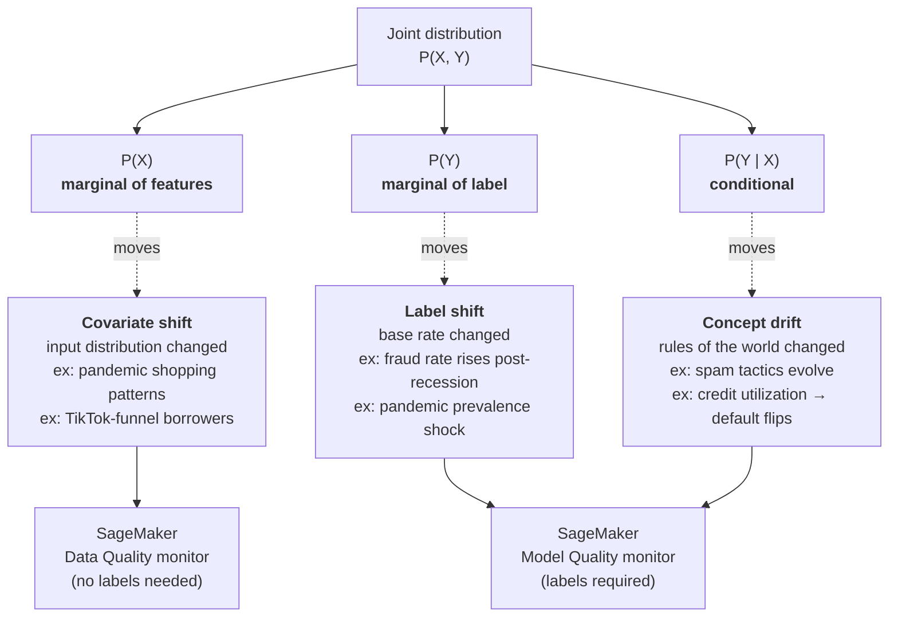
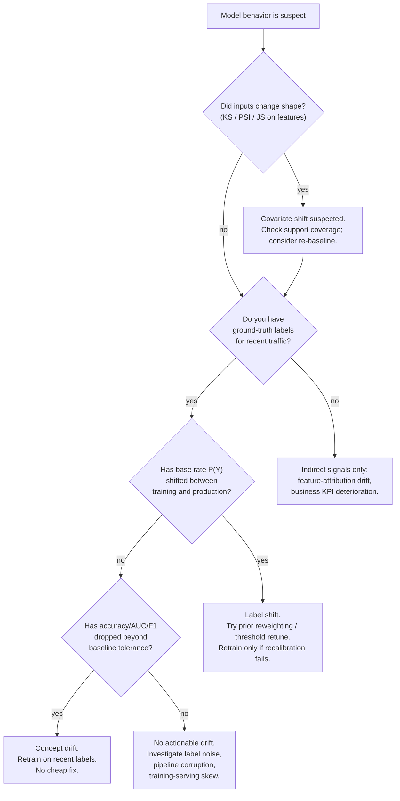
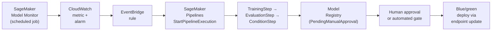

# Chapter 49 — Drift Fundamentals: Covariate, Label, Concept

> **Goal of this chapter:** to make you fluent in the *only* triage framework that matters when a deployed model misbehaves. By the end you should be able to name the drift type in under five seconds from a scenario description, write the right probability decomposition on a whiteboard, pick the matching SageMaker Model Monitor variant, quote the PSI traffic-light thresholds without looking them up, and explain why the cheapest fix for label shift is almost never retraining. Every later chapter in Part I — CloudWatch metric publishing (Ch 50), A/B for retrain validation (Ch 52), drift-triggered Pipelines (Ch 51) — depends on you internalizing the three letters in this chapter: `X`, `Y`, `Y|X`.

> **Exam mapping:** AWS MLA-C01 Task 4.1 — *Monitor model performance and data quality in production*. Domain 4 of the exam carries 24% weight; the drift-type-to-monitor mapping in this chapter is the single highest-yield piece of memory work in the entire domain.
>
> **Prerequisites:** Chapter 48 (Model Monitor — the four monitor types), Chapter 28 (MLflow + model versioning), Topic 9a Part H (evaluation chapters — bias-variance, calibration, validation).
>
> **Downstream:** Chapter 50 (CloudWatch metric publishing and statistical-test deep dive), Chapter 51 (retraining strategies and SageMaker Pipelines triggers), Chapter 52 (A/B testing for retrain validation), Chapter 53 (bias drift and feature-attribution drift via Clarify).

---

## 49.1 Why ML models age — the world moves, the model doesn't

A software engineer ships a payment-processing service and reasonably expects it to work the same way next year as it does today, provided no one touches the code. The bytecode is deterministic; the inputs are constrained by a schema; the outputs are derived by a fixed function. If the world's notion of "valid credit-card number" changes, the engineer is notified by Visa, edits the regex, and ships again. Nothing about the service decays on its own.

An ML engineer ships a fraud-detection model and reasonably expects it to *decay*. Nothing about the code changes. The IAM role is the same. The endpoint is the same. The container is the same. But the predictions that were 92% accurate on Monday are 85% accurate by Friday and 71% accurate by the end of the quarter — without a single line of code being touched. The reason is structural and has a name: **the world moved, and the model didn't**.

That single asymmetry — software stays still while the world walks away from it — is the entire rationale for production ML monitoring. It is why SageMaker Model Monitor exists. It is why MLflow tracks model versions. It is why every regulated-finance shop has a Model Risk Management group that re-validates models on a calendar. And it is why an MLE who can wire up Model Monitor perfectly but can't *name the drift type* from a scenario will still ship broken products — because picking the wrong monitor either (a) misses real degradation or (b) drowns the on-call in false alarms.

Every production ML interview question, every exam scenario, and every real on-call page eventually compresses to the same three-line triage:

```
A model that worked yesterday isn't working today.
  → What changed?
     1. The inputs?            → covariate shift   → P(X) moved
     2. The outputs?           → label shift       → P(Y) moved
     3. The input→output map?  → concept drift     → P(Y|X) moved
```

Those three letters — `X`, `Y`, `Y|X` — are the entire framework. Everything else in this chapter (KS tests, PSI bins, EventBridge wiring, champion/challenger) hangs off this skeleton. The chapter is intentionally heavy on first principles because the AWS exam asks scenario questions whose *right answer* presumes you can decompose the situation onto these three axes in the first place.

It is worth pausing on a meta-observation. The reason this chapter feels like statistics rather than AWS configuration is that AWS itself has no opinions about which drift type your model is suffering from — Model Monitor will compute the statistics, write JSON files to S3, and emit CloudWatch metrics, but it will *not* tell you "this is label shift, recalibrate the threshold." That diagnostic step is yours. The exam tests whether you can perform it. The rest of Part I tests whether you can wire up the AWS plumbing to support whatever decision you reach.

---

## 49.2 The probability decomposition that organizes everything

A supervised model approximates a conditional distribution `P(Y | X)` from samples drawn from the joint distribution `P(X, Y)`. By the chain rule of probability, the joint distribution factors in exactly two ways:

```
P(X, Y) = P(X) · P(Y | X)         (factor by features first)
        = P(Y) · P(X | Y)         (factor by label first)
```

When a deployed model degrades, **at least one** of those marginals or conditionals has shifted between training and production. The three canonical drift types are named after which factor moved.

| Drift type | What moved | Formal statement | Industry synonyms |
|---|---|---|---|
| **Covariate shift** | `P(X)` | `P_train(X) ≠ P_prod(X)`, but `P(Y\|X)` is stable | data drift, feature drift, input drift, population drift |
| **Label shift** | `P(Y)` | `P_train(Y) ≠ P_prod(Y)`, but `P(X\|Y)` is stable | prior shift, target drift, prior probability shift |
| **Concept drift** | `P(Y\|X)` | `P_train(Y\|X) ≠ P_prod(Y\|X)` | real drift, model drift, posterior shift |

A fourth term, **dataset shift**, is the umbrella for any change in `P(X, Y)`. Quiñonero-Candela et al.'s 2009 MIT Press book *Dataset Shift in Machine Learning* is the canonical reference where most of this taxonomy was formalized. AWS Model Monitor's documentation maps almost cleanly onto these three (Data Quality monitor → covariate; Model Quality monitor → label + concept jointly; Clarify → bias and attribution as second-order effects).



The memory anchor for the exam is "X — Y — Y given X." If X changed but the model's logic is still right → covariate. If Y changed but the X→Y mapping is still right → label. If the very logic of X→Y is wrong now → concept.

---

## 49.3 Covariate shift — `P(X)` changes

### 49.3.1 Formal definition

Covariate shift holds when:

```
P_train(X) ≠ P_prod(X)
P_train(Y | X) = P_prod(Y | X)        ← assumption that nothing else has moved
```

The input distribution has moved, but if you give the model an input from either distribution, the *correct* label is computed by the same rule.

### 49.3.2 Three examples worth memorizing

**Example A — Loan defaults, channel shift.** A consumer-lending model was trained on applicants from in-branch walk-ins (median income $55k, mostly homeowners). Marketing then opens a TikTok funnel and now 60% of applications come from renters under 25, median income $32k. The relationship "low FICO + high DTI → likely default" is unchanged. But the input distribution has slid hard. The model is being asked to score borrowers from a region of feature space it barely saw during training. Predictions for those new borrowers may be poor because the model is **extrapolating**, not because the world's rules changed.

**Example B — Pandemic shopping patterns.** A retail demand-forecasting model trained on 2017–2019 data sees its inputs invert overnight in March 2020. Online order volume triples, in-store volume falls 70%, basket composition shifts from impulse buys to staples and toilet paper, and the day-of-week effect (Saturday peak) flattens because every day is now a Saturday for delivery. Every feature — `weekly_avg_basket_size`, `weekend_indicator`, `category_mix_ratio` — has moved. The relationship between those features and demand may still hold, but the model has never seen this region of feature space.

**Example C — Sensor drift in IoT.** A temperature sensor's calibration drifts +1.5°C over six months. The model still maps "temperature → equipment failure" correctly, but the inputs are now systematically biased high. The model never gets a chance to be right because the X it's reading is no longer the X reality is producing.

### 49.3.3 What covariate shift means for the model

The model itself is not "wrong" — its conditional is still the right one. What's wrong is that the **support of training data** does not cover the **support of production data**. There are three failure modes:

1. **Extrapolation error.** Tree-based models predict the leaf value of the closest training region; neural nets project onto the manifold they learned. Both fail unpredictably in new regions.
2. **Calibration error.** Even if the rank-ordering is fine, predicted probabilities are now miscalibrated because they were learned against the *old* mix of inputs.
3. **Drift cascading into concept drift.** If covariate shift continues long enough, you'll often discover that `P(Y|X)` was never truly stable — it just looked stable inside the training support.

### 49.3.4 Why this is the easiest drift to detect

You don't need labels. You just need a baseline set of features (your training set or a sample of it) and a production sample. Compute distance between the two distributions — PSI, KS, Wasserstein, JS — and you're done. This is what **SageMaker Model Monitor's Data Quality monitor** does, automatically, using the Deequ Spark library to build a `statistics.json` baseline and a `constraints.json` rulebook.

> ⚠️ **Exam alert.** A question saying "detect changes in feature distributions *without ground-truth labels*" is **always** Data Quality monitor → covariate shift. If the answer choices include Model Quality, it is a distractor. The discriminator is the phrase "without labels" or "labels arrive 30 days late."

---

## 49.4 Label shift — `P(Y)` changes

### 49.4.1 Formal definition

Label shift (also called *prior probability shift*) holds when:

```
P_train(Y) ≠ P_prod(Y)
P_train(X | Y) = P_prod(X | Y)        ← class-conditional inputs unchanged
```

The base rate of the target has moved. Conditional on knowing the true class, the inputs look the same as before.

### 49.4.2 Three examples worth memorizing

**Example A — Fraud after a policy change.** Your card issuer raises the daily transaction limit from $5k to $50k. Suddenly fraud attempts double overnight (criminals chase the bigger limit). `P(Y=fraud)` jumped from 0.4% to 0.8%. The *features* of a fraudulent transaction — velocity, geo mismatch, merchant category — haven't changed at all. `P(X|Y=fraud)` is the same.

**Example B — Fraud rate rises post-recession.** A credit-card fraud model trained during the 2017–2019 stable economy is deployed through a post-recession period. Job losses, financial desperation, and a wave of synthetic-identity fraud push the base rate from 0.3% to 0.9% across the portfolio. Defrauders still look like defrauders (`P(X|Y=fraud)` is stable), but the *rate* has tripled. Models that score-calibrate against a 0.3% prior produce probabilities that are systematically too low, and fixed-threshold business rules ("alert if score > 0.7") begin missing two thirds of the cases they should catch.

**Example C — Spam filter post-campaign.** A botnet wave drives the inbox-wide spam rate from 20% to 60% for a week. `P(spam)` shifted; what spam *looks like* didn't.

### 49.4.3 What label shift means for the model

Most classifiers learn `P(Y|X)` either explicitly (logistic regression, neural nets with softmax) or implicitly (trees voting). Bayes' rule says:

```
P(Y | X) ∝ P(X | Y) · P(Y)
```

If only `P(Y)` moved, the **shape** of the posterior didn't change — only the **threshold** where you'd flip a positive vs. negative did. That makes label shift **the cheapest drift to fix**: you usually don't retrain. You **recalibrate the decision threshold**.

Formally, the post-shift posterior is:

```
P_prod(Y=1 | X)   P_train(Y=1 | X)     P_prod(Y=1) / P_train(Y=1)
─────────────── = ─────────────────── ·  ─────────────────────────────
P_prod(Y=0 | X)   P_train(Y=0 | X)     P_prod(Y=0) / P_train(Y=0)
```

The ratio `P_prod(Y) / P_train(Y)` is the **prior correction**. Multiply your scores by it (in odds space) and the classifier is recalibrated without retraining. This is sometimes called **prior reweighting** or the **Saerens correction** (Saerens, Latinne & Decaestecker, 2002).

### 49.4.4 Detecting label shift

You need **ground truth**. There is no way around it — `P(Y)` is the distribution of the true label. In SageMaker this means:

- Enable **Data Capture** on the endpoint (predictions stored in S3).
- Upload **Ground Truth labels** in the merge format (`recordIdentifier` + `labelAttributeName`) to an S3 prefix.
- A **Model Quality monitor** baseline runs a `MergeJob` that joins predictions to labels by `eventId`, then computes accuracy, precision, recall, F1, AUC for classification (or MSE/MAE/RMSE/R² for regression). The schedule re-runs the merge against captured inferences plus the latest labels.

The base-rate `P(Y=1)` falls out of that merge for free — you can monitor it as a custom CloudWatch metric or read it from the violations report.

> ⚠️ **Exam alert.** Model Quality monitor **requires ground truth**. If a question says "labels are unavailable" or "ground truth arrives months later," Model Quality cannot help you — and any answer choice that says "use Model Quality monitor" in that scenario is a distractor.

### 49.4.5 Why label shift is often mistaken for concept drift

When the base rate shifts, the model's **predicted** rate of positives lags behind reality. Accuracy drops. PR-AUC drops. From the operator's seat it *feels* like the model "forgot how to classify." Engineers reach for a retrain. But retraining without recalibrating the prior won't help unless the training set is rebalanced to the new base rate — and even then, the next month it will shift again. The correct fix is almost always:

1. Re-estimate `P_prod(Y)` from recent labels.
2. Apply the prior correction at scoring time (or, for downstream business logic, tune the score threshold).
3. Only if step 1 + 2 don't restore performance, suspect concept drift.

---

## 49.5 Concept drift — `P(Y | X)` changes

### 49.5.1 Formal definition

```
P_train(Y | X) ≠ P_prod(Y | X)
```

The world's underlying rule has changed. The same input now maps to a different label, or to the same label with a different probability.

### 49.5.2 Three examples worth memorizing

**Example A — Spam tactics evolve.** A 2015 spam classifier learned that words like "viagra," "lottery," and "wire transfer" plus shouty caps were high-spam signals. By 2026, spammers have moved to Unicode-homoglyph tricks, image-embedded text, and AI-generated "professional" prose. The same email body that meant spam in 2015 might be a legitimate marketing newsletter today, and vice versa. `P(spam | text)` has shifted *for the same text*. This is the canonical adversarial-concept-drift case.

**Example B — Consumer credit during a regime change.** Pre-2020, high credit-card utilization predicted default. During pandemic-era stimulus payments, high utilization was *temporarily* uncorrelated with default because consumers were getting cash injections that paid down balances. `P(default | utilization)` flipped sign for a while. After stimulus ended, it flipped back. This is **non-stationary** concept drift.

**Example C — Recommender taste drift.** A music recommender trained on 2020 listening habits assumes "users who liked X also like Y." Tastes evolve; what predicted Y from X in 2020 may predict Z by 2026. The features look identical (same songs, same skip rates), but the conditional has moved.

### 49.5.3 Variants of concept drift (CS literature)

| Variant | What it looks like | Detection difficulty |
|---|---|---|
| **Sudden / abrupt** | Step change at a known point (a policy goes live) | Easy if you know when — monitor accuracy across the boundary |
| **Gradual** | Old concept fades out, new fades in over weeks/months | Medium — sliding windows |
| **Incremental** | Continuous slow drift in `P(Y\|X)` | Hard — looks like noise until cumulative |
| **Recurring / cyclic** | Concept oscillates with seasonality (weekday vs. weekend, retail Q4) | Easy if you model the cycle; otherwise looks like spurious drift |

Gama et al.'s 2014 survey ("A Survey on Concept Drift Adaptation," *ACM Computing Surveys*) is the canonical taxonomy here.

### 49.5.4 Why concept drift is the hardest drift to detect

You can pass every covariate-shift test in the world and still have concept drift. The inputs look identical to training; only the *answers* have moved. The only way to know is to **check whether predictions match ground truth on recent data**. That requires:

1. **Labels**, which often arrive late, expensively, or never (some labels — "did this customer default in 24 months?" — take years).
2. **Enough volume** of labels per window to give your accuracy estimate non-trivial confidence intervals.
3. **A non-stale baseline** — comparing to a baseline accuracy that was itself measured years ago is meaningless.

In SageMaker, this is exactly the Model Quality monitor's job. It is the **only** Model Monitor variant that detects concept drift; Data Quality, Bias Drift, and Feature Attribution Drift all run on features or explanations and **can stay green while the model's accuracy collapses**.

> ⚠️ **Exam alert.** Data Quality monitor will **not** catch concept drift. Repeat that sentence out loud. The single most common exam trap in Domain 4 is a scenario where features look unchanged but accuracy has collapsed, and one of the answer choices is "enable Data Quality monitor." It is wrong. The right answer is Model Quality monitor (or, indirectly, Clarify feature-attribution drift as a leading indicator).

### 49.5.5 What concept drift means for the model

There is no cheap fix. Recalibration doesn't help — the conditional itself is wrong. You have three options:

1. **Retrain** on the most recent labeled data. Mandatory for any sustained concept drift.
2. **Online learning** — update model weights incrementally as labels arrive (River, Vowpal Wabbit, custom incremental learners). Rare in regulated industries; common in adtech.
3. **Switch concepts** — maintain N models, one per concept regime, route requests to the right one. Used in seasonality-heavy domains (retail, energy).

---

## 49.6 The drift decision tree



The clean way to remember the dependency: **covariate is necessary-not-sufficient; label is structural; concept is the killer.** Covariate drift alone may not require any action. Label shift requires recalibration but rarely a retrain. Concept drift always requires a retrain.

---

## 49.7 Detection techniques — formal definitions

Each technique below answers "how different are two distributions?" The differences come down to: what shape they assume, whether they are symmetric, what they output, and how the AWS exam expects you to think about them.

### 49.7.1 KL divergence (Kullback–Leibler)

**Formula** (discrete case):

```
D_KL(P || Q) = Σ_x  P(x) · log( P(x) / Q(x) )
```

For continuous distributions replace the sum with an integral. `P` is treated as the "true" distribution, `Q` as the approximation.

**Properties:**

- Non-negative; `D_KL = 0` iff `P = Q` almost everywhere.
- **Asymmetric:** `D_KL(P||Q) ≠ D_KL(Q||P)`. Picking which is the baseline matters.
- **Undefined** (infinite) if `Q(x) = 0` where `P(x) > 0` — a production bucket your baseline never saw will blow up KL.
- Units: nats (natural log) or bits (log base 2).

**Use it when** you have well-defined, dense distributions over the same support and you care about asymmetric importance (e.g., information loss from approximating `P` by `Q`). **Avoid it when** production may have categories or bins the baseline didn't — you'll get `inf`. Solutions: add a smoothing prior (Laplace / Jeffreys), or use JS instead.

### 49.7.2 Jensen–Shannon divergence (symmetric KL)

**Formula:**

```
M = ½ (P + Q)
JSD(P, Q) = ½ · D_KL(P || M) + ½ · D_KL(Q || M)
```

**Properties:**

- Symmetric: `JSD(P, Q) = JSD(Q, P)`.
- Bounded: `0 ≤ JSD ≤ log(2)` (in nats) or `[0, 1]` (in bits).
- `sqrt(JSD)` is a true metric (Jensen–Shannon distance — satisfies the triangle inequality).
- Defined even when supports differ (the mixture `M` covers both).

JS divergence is one of the distance metrics SageMaker Model Monitor's Data Quality monitor will compute for categorical-feature drift via the Deequ-based baseline pipeline.

### 49.7.3 Population Stability Index (PSI) — the credit-risk workhorse

The credit-risk industry's drift metric of choice since the 1990s. Originally formalized in the credit-scoring literature; popularized by Naeem Siddiqi's *Credit Risk Scorecards* and embedded in SAS Enterprise Miner, from which it diffused into bank model-risk-management practice.

**Formula** (binned distributions over `k` bins):

```
PSI = Σ_{i=1..k}  (p_i − q_i) · ln( p_i / q_i )
```

where `p_i` is the proportion of the baseline in bin `i` and `q_i` is the proportion of production in bin `i`.

**Why this exact form:** it is the **symmetric** form of KL — you can derive `PSI(P,Q) = D_KL(P||Q) + D_KL(Q||P)`. That is why credit-risk practitioners adopted it before "JS" was on their radar. The two are siblings.

#### Worked bin-by-bin example

Baseline distribution `P = [0.25, 0.25, 0.25, 0.25]`; production distribution `Q = [0.10, 0.20, 0.30, 0.40]`. Computing per-bin contributions:

```
bin 1: (0.25 − 0.10) · ln(0.25/0.10) = 0.15 · ln(2.500) = 0.15 · 0.916 = 0.1374
bin 2: (0.25 − 0.20) · ln(0.25/0.20) = 0.05 · ln(1.250) = 0.05 · 0.223 = 0.0112
bin 3: (0.25 − 0.30) · ln(0.25/0.30) = −0.05 · ln(0.833) = −0.05 · (−0.182) = 0.0091
bin 4: (0.25 − 0.40) · ln(0.25/0.40) = −0.15 · ln(0.625) = −0.15 · (−0.470) = 0.0705
─────────────────────────────────────────────────────────────────────────
PSI = 0.1374 + 0.0112 + 0.0091 + 0.0705 = 0.2282
```

A PSI of 0.23 sits in the **moderate** band — investigate, possibly recalibrate, but not yet at the conventional retrain threshold.

#### The traffic-light thresholds (memorize cold)

| PSI range | Interpretation | Typical action |
|---|---|---|
| `PSI < 0.10` | No meaningful shift | Continue monitoring |
| `0.10 ≤ PSI < 0.25` | Moderate / significant shift | Investigate; document; possibly recalibrate |
| `0.25 ≤ PSI < 0.50` | Major shift | Trigger formal model-review process |
| `PSI ≥ 0.50` | Severe shift (informal) | Pull the model or fast-track retrain |

These thresholds are conventional, not theoretical. Banks adopted them because they map cleanly onto Basel and IFRS 9 model-validation expectations, OCC SR 11-7 model-risk-management examination guidance treats PSI as a default monitoring metric, and ECB TRIM examiners are trained on the same ladder. **A senior MLE at a regulated-finance shop will be expected to quote 0.10 / 0.25 / 0.50 from memory** — and so will an MLA-C01 candidate.

> ⚠️ **Exam alert.** PSI thresholds are **0.10 / 0.25 / 0.50** — small / significant / major. If a scenario says "the bank's model risk team uses the industry-standard threshold to declare drift," the answer is 0.25. If a scenario describes a PSI value and asks for the corresponding action, lay the value against the ladder. The exam loves PSI because credit-risk and fraud-modeling shops dominate AWS-native ML, and AWS knows it.

**Binning matters.** Standard practice is 10 equally populated bins (deciles) of the baseline. For categorical features, use the categories themselves. Bins with zero baseline counts must be Laplace-smoothed or excluded; otherwise `ln(p_i/q_i)` is undefined.

**Sample-size caveat.** With n > 100k, a PSI of 0.10 may be statistically significant; with n < 1,000, even 0.25 may be sampling noise. Mature teams compute *bootstrapped confidence intervals* around the point estimate.

**CSI (Characteristic Stability Index).** Same formula, applied at the feature level rather than the score level. Used as a leading indicator of score-level PSI movement.

### 49.7.4 Wasserstein distance (Earth Mover's Distance)

**Intuition:** imagine each distribution as piles of dirt over the real line. The Wasserstein-1 distance is the **minimum amount of work** (mass × distance) needed to reshape one pile into the other.

**Formula** (1D case, the only one practically computed):

```
W_1(P, Q) = ∫ |F_P(x) − F_Q(x)| dx
```

where `F` is the CDF. Equivalent: integrate the absolute difference of CDFs.

**Properties:**

- True metric: symmetric, satisfies triangle inequality.
- **Sensitive to where mass is**, not just whether it's the same. If a feature shifts from "centered at 0" to "centered at 5," Wasserstein captures the 5-unit displacement; KL/JS only know the distributions look different.
- Robust to outliers in a way KS isn't, because it weights by mass moved.
- Cheap in 1D (just sort and integrate); expensive in higher dimensions.

**AWS connection:** Wasserstein is offered as an alternative drift distance in SageMaker Clarify bias-drift constraints. For Data Quality drift, the default is L-infinity simple distance (`linf_simple`) for numerical features and chi-squared for categoricals; you can override via `monitoring_config_overrides`.

### 49.7.5 Kolmogorov–Smirnov test

**Formula** (two-sample, one-dimensional):

```
D = sup_x | F_P(x) − F_Q(x) |
```

The maximum vertical gap between the two empirical CDFs.

**Properties:**

- **Non-parametric** — no assumption about distribution shape. Works for any continuous distribution.
- Returns both the statistic `D` and a **p-value** (under H0 = same distribution).
- Common decision rule: reject H0 (declare drift) at `p < 0.05`.
- **Limited to continuous features**; for categoricals use chi-squared.
- **Insensitive in the tails** — KS measures the worst-case gap, which usually occurs near the median; subtle tail differences may be missed. For tail-sensitive tests use Anderson–Darling.

> ⚠️ **Exam alert.** KS is the **non-parametric two-sample default for continuous features**. When the exam asks "which test should I use to detect distributional change in a numeric feature without assuming a parametric form," KS is the answer. Chi-squared is the analogous default for categorical features.

### 49.7.6 Chi-squared test (categorical)

For categorical features with `k` categories observed in baseline vs. production:

```
χ² = Σ_{i=1..k}  (O_i − E_i)² / E_i
```

where `O_i` is the observed production count in bin `i` and `E_i` is the expected count under the baseline proportion. Compare to χ² distribution with `k − 1` degrees of freedom.

**Use it when** categorical or count features, with each expected count ≥ 5 (the classical Cochran rule). Chi-squared is the default categorical drift test in SageMaker Model Monitor's Data Quality constraints, paired with `linf_simple` for numerical features.

### 49.7.7 Other tests worth knowing

| Test | One-line use |
|---|---|
| **Hellinger distance** | Bounded `[0, 1]`, symmetric, related to Bhattacharyya; preferred when bins are sparse |
| **Anderson–Darling** | KS-but-tail-sensitive; better for detecting outlier-driven drift |
| **Cramér–von Mises** | Integrates squared CDF difference (vs. KS's sup); more sensitive on average |
| **Maximum Mean Discrepancy (MMD)** | Kernel-based; works for multivariate or high-dim feature drift; expensive |
| **Energy distance** | Multivariate generalization of Wasserstein; statistical-test form is Székely's E-test |
| **Mann–Whitney U** | Rank-based; detects shifts in central tendency |

For the AWS exam you must recognize PSI, KS, chi-squared, KL, JS, and Wasserstein. Hellinger, Anderson–Darling, MMD, energy distance, and Cramér–von Mises rarely appear but the names should not surprise you in distractor lists.

---

## 49.8 Drift type → SageMaker Model Monitor mapping

This is the single most important table in Domain 4 of the exam.

| Drift to catch | Monitor type | What it actually computes | Needs labels? |
|---|---|---|---|
| Covariate shift | **Data Quality** | Deequ-based per-feature statistics; `linf_simple` (numerical) and `chisquare` (categorical) by default; configurable to KS/JS/Wasserstein | **No** |
| Label shift | **Model Quality** | Merges Ground Truth + predictions; reports class-balance metrics and accuracy | **Yes** |
| Concept drift | **Model Quality** | Same merge job; reports accuracy / precision / recall / F1 / AUC (classification); MSE / RMSE / MAE / R² (regression) | **Yes** |
| Bias drift (downstream of covariate in a protected facet) | **Clarify Bias Drift** | DPL, DI, DPPL, CDD across facets | Depends on metric |
| Attribution drift (early warning) | **Clarify Feature Attribution Drift** | NDCG of SHAP rankings, baseline vs. live | No (SHAP is feature-only) |

> ⚠️ **Exam memory anchor.**
> - **Data Quality = no labels = covariate.**
> - **Model Quality = needs labels = label + concept (combined).**
> - **Clarify = fairness (bias) + explanations (attribution).**

The defaults inside the `constraints.json` that Data Quality emits look like:

```json
{
  "monitoring_config": {
    "distribution_constraints": {
      "perform_comparison": true,
      "comparison_threshold": 0.1,
      "comparison_method": "linf_simple"
    },
    "categorical_constraints": {
      "comparison_method": "chisquare"
    }
  }
}
```

The two default `comparison_method` values — `linf_simple` for numerical and `chisquare` for categorical — are the AWS exam's expected vocabulary. You can override per-feature with `monitoring_config_overrides` to use KS, JS, or other metrics, but the defaults are the ones the exam tests.

---

## 49.9 Retraining strategies

Once drift is confirmed and recalibration is not enough, you retrain. There are four canonical strategies; the exam will ask which one fits which scenario.

### 49.9.1 Scheduled retraining (cron-style)

**Mechanism:** a recurring schedule (EventBridge cron, Airflow DAG, SageMaker Pipelines schedule) triggers a training job every `T` (weekly, monthly, quarterly).

**Pros:** predictable; finance and audit love predictable. Easy to govern (every retrain has the same review process). No dependency on monitoring infrastructure.

**Cons:** wastes compute when nothing has drifted. Misses fast drift between cycles. Risk of "stale-but-passing" model if the schedule is too coarse.

**When to use:** regulated industries with mandatory retraining cadences (credit, insurance), or domains with low real-drift risk.

### 49.9.2 Drift-triggered retraining (event-driven)

**Mechanism:** Model Monitor detects drift → CloudWatch alarm → EventBridge rule → SageMaker Pipelines `StartPipelineExecution` → retrain → register new ModelPackage → blue/green deploy. This is the architecture Chapter 51 walks through end to end.



**Pros:** retrains only when needed; cost-efficient. Fastest response to real drift. Aligns retraining with actual data movement.

**Cons:** sensitive to alarm tuning — too tight and you'll retrain on noise; too loose and you'll miss drift. Auditors dislike unpredictable retraining without explicit human approval gates. Requires the full monitoring + pipelines stack to be operational.

**When to use:** high-volume, less-regulated workloads where drift is real and quick response matters (fraud, adtech, dynamic pricing).

### 49.9.3 Performance-triggered retraining

**Mechanism:** Model Quality monitor alarm on accuracy/F1/AUC drop below a baseline-relative threshold (e.g., "F1 < baseline F1 − 5%") → same EventBridge → Pipelines wiring as above.

**Pros:** triggers on the metric that **actually** matters to the business. Skips false positives from harmless covariate drift.

**Cons:** requires labels in production. Labels often lag (days, weeks, months for some problem types). A gradual degradation may not hit the threshold until weeks of damage have accumulated.

**When to use:** workloads with fast-arriving ground truth and clear business KPIs (fraud, churn, click-through prediction).

### 49.9.4 Champion / challenger (A/B retraining)

**Mechanism:** continuously train a **challenger** model on the most recent labeled data. Compare it to the current **champion** in offline eval and (often) shadow or canary A/B in production. If the challenger beats the champion on the deciding metric for a sustained window, promote it.

The three deployment topologies you must know:

| Topology | Traffic split | When to use |
|---|---|---|
| **Shadow** | 100% to champion; challenger scored offline | Highest safety; no user impact; cannot measure causal lift on a business KPI |
| **A/B** | 50/50 (or N-way) split on real users | Need to measure online lift; OK to expose challenger predictions |
| **Canary** | 1–5% to challenger, ramp up if healthy | Default for SageMaker, Vertex, and most MLOps stacks |

Pinterest's published staged rollout pattern is the textbook regulated-finance default: offline replay → shadow (~3 days) → 1% canary → 5% → 25% → 50% → 100% over 7–14 days, with automatic rollback on any guardrail-metric regression. Netflix's "interleaving" pattern for recommenders is a variant that interleaves champion and challenger results inside a single user's home-row rather than splitting users — reducing variance vs. user-split A/B by ~100×.

**Pros:** decouples training cadence from drift detection — you always have a fresh challenger. Catches subtle drift the alarm-based approach misses. Promotion gate is data-driven, not threshold-engineered.

**Cons:** more expensive (you train continuously, even if you don't deploy). Requires shadow or canary infrastructure. Promotion logic itself can drift.

**When to use:** mature ML organizations with strong MLOps infrastructure and high stakes per decision (lending, ranking, fraud at scale). Chapter 52 walks through the A/B mechanics in depth.

### 49.9.5 Strategy selection matrix

| Scenario | Best strategy |
|---|---|
| Annual model-risk-management cycle, no drift detection wired up | Scheduled |
| Drift dashboards built, labels arrive in real time, can A/B test | Drift- or performance-triggered |
| Heavy compliance, every promotion needs an approval | Scheduled + champion/challenger with human gate |
| Labels arrive months late, drift suspected meanwhile | Scheduled + covariate-triggered (alarm on covariate as a leading indicator) |
| Adversarial domain (spam, fraud) | Champion/challenger with continuous shadow |

---

## 49.10 Covid-era war stories — when the world shifted underneath ML

Covid-19 produced the canonical industry-wide concept-drift event because it hit nearly every production model simultaneously and generated enough public post-mortems to quote numbers.

### 49.10.1 NYC motor-vehicle-collision forecasting (DeepAR)

phData's published case study on Covid and concept drift is one of the clearest public numbers available.

- **Model:** DeepAREstimator (LSTM-based) forecasting NYC motor-vehicle collisions.
- **Training data:** 1,214 days from 2017–2019.
- **Pre-pandemic RMSE:** 0.076.
- **Post-pandemic RMSE:** 0.303 — about **4× worse**.
- **Statistical confirmation:** Augmented Dickey-Fuller test on the post-March-2020 series returned p > 0.05; the series was no longer stationary.
- **Fix that actually worked:** first-order differencing brought RMSE back to 0.052 — *better than the original*, because differencing made the new regime stationary again.

The lesson is *not* "always difference your series." The lesson is that the model broke because `P(Y|X)` shifted (lockdowns changed the input-output map), and the team only knew because they were *running* a stationarity test in monitoring — not because a label-based metric like MAE alerted (labels arrived weeks late).

### 49.10.2 Airline pricing — 75% → 50% hit rate

Garg et al. (arXiv:2111.14938) report a pricing model whose hit rate fell from **75% in training to 50% in deployment** after March 2020. The feature that drifted hardest was advance-booking-window — customers stopped booking 21+ days out and started booking 0–3 days out, inverting the training distribution.

This is a pure covariate-shift story: `P(X)` flipped, `P(Y|X)` was arguably unchanged for booking-window-given-intent, but because the model had no support for the new region of feature space, the predictions were extrapolations.

### 49.10.3 Perioperative mortality (BMC Medical Informatics, 2023)

A multi-hospital perioperative-mortality model saw calibration deteriorate in spring 2020 because:

- The case mix shifted to emergencies (electives were postponed).
- The patient population was older and sicker on average.
- Staffing changed (redeployment).

This is **label drift plus covariate drift simultaneously**: `P(Y)` rose (sicker population → more mortality) and `P(X)` moved along the same axis (older, more comorbid). Predicted probabilities became systematically too low because the base rate was anchored in the pre-pandemic population.

### 49.10.4 Takeaways from the Covid era

Across these post-mortems, three patterns recur:

1. **Label-based metrics (accuracy, AUC) were always the last to detect drift** because ground truth lags 7–90 days. Teams that survived had input-side drift alarms (PSI, KS-statistic, embedding-distance) firing on days 1–3.
2. **The fix was rarely "retrain on more data."** When the drift was a regime change, retraining required either (a) waiting for enough new-regime data, (b) re-engineering features that were no longer informative, or (c) holding the model offline and falling back to a heuristic.
3. **Concept drift > covariate drift in business impact.** Models that died on `P(Y|X)` shifts could not be saved by reweighting; covariate-only shifts could often be patched with importance weighting or domain adaptation.

---

## 49.11 PSI in banking — the threshold that became a regulatory standard

PSI is the *de facto* drift metric in banking, not because it is statistically optimal, but because it is interpretable, auditable, and embedded in regulatory expectations.

A typical large US bank credit-card scorecard monitors PSI:

- **Daily** on input features (top 20 by importance).
- **Weekly** on the score distribution.
- **Monthly** on the score-by-segment breakdown (region, channel, product).

Threshold breaches trigger a documented "Model Performance Triage" memo that the Chief Risk Officer's organization reviews. A PSI > 0.25 sustained for two consecutive periods is almost always a redevelopment trigger.

Banks specifically prefer PSI over KS or chi-squared because:

1. **Basel / IFRS 9 alignment.** Probability-of-default models must monitor distributional shifts in PD, and PSI's bin-based structure maps naturally to risk grades.
2. **Score binning is native to credit.** Scorecards already produce binned outputs (FICO 300–850 chunked into deciles), so PSI is essentially free to compute.
3. **Auditability.** PSI returns one number per period — easy to put in a regulatory dashboard. KS is a statistic over a CDF and requires more explanation in a model-risk committee.
4. **Regulator familiarity.** OCC SR 11-7 (US) and ECB TRIM (EU) examiners are trained on PSI. Using a less standard metric invites questions.

The Risk.net paper makes the honest admission that the 0.10 / 0.25 thresholds "have no academic support" — they are heuristics popularized by SAS Enterprise Miner and embedded in regulatory expectation through diffusion. Mature teams compute bootstrapped confidence intervals around the PSI rather than relying on the point estimate alone.

---

## 49.12 NLP concept drift post-ChatGPT — the cleanest natural experiment

Late 2022 produced one of the cleanest natural experiments in concept drift the field has ever seen.

### 49.12.1 Query-distribution shift in user inputs

Search teams at retailers, support-ticket triage models at SaaS companies, and intent-classification models at customer-service centers all reported the same pattern starting in Q1 2023:

- **Mean query length doubled or tripled.** "headphones noise cancelling" became "I'm looking for over-ear headphones with active noise cancellation under $300 that work well on planes."
- **Polite phrasing surged.** "Please help me find…" and "Could you recommend…" became common because users had been trained by ChatGPT to phrase requests conversationally.
- **Multi-intent queries appeared.** Queries routinely bundled comparison + recommendation + explanation.
- **Unseen vocabulary spiked.** Domain terms ("transformer," "embedding," "vector") leaked into consumer queries.

For a BERT-based intent classifier trained pre-2022, this was textbook covariate drift: `P(X)` shifted dramatically while `P(Y|X)` was arguably stable.

### 49.12.2 GPT-4's own behavioral drift (Chen-Zaharia-Zou, 2023)

The Stanford/UC-Berkeley study ("How is ChatGPT's behavior changing over time?", arXiv:2307.09009) is now the canonical citation for *model-side* drift:

| Task | GPT-4 Mar 2023 | GPT-4 Jun 2023 |
|---|---|---|
| Prime / composite identification | 84% | 51% |
| Code-generation directly-executable | 52% | 10% |
| Sensitive-question refusal rate | 21% | 5% |
| Multi-step reasoning answer format | Verbose CoT | Terse |

This is concept drift *on the model side*: the same `X` (prompt) now produces a different `Y` (answer) because the underlying model was silently updated. If your application chained GPT-4 outputs into a downstream classifier or business rule, the classifier's accuracy collapsed without anyone touching the classifier.

### 49.12.3 The PubMed vocabulary spike

A 2024 medRxiv study analyzed PubMed abstracts and found word frequencies for "delve," "intricate," "showcase," "underscore," and "pivotal" spiked 2–10× starting mid-2023 — presumably because authors were using ChatGPT to polish drafts. Any biomedical text classifier that used n-gram features experienced silent covariate drift driven entirely by upstream LLM usage. The model didn't know a generative model existed. The corpus drifted because of one.

This is the structural reason GenAI-era NLP monitoring needs **embedding-distribution checks**, not just lexical statistics — the lexical signature of LLM-polished prose is detectable, but the semantic content is closer to the training distribution than the n-grams suggest.

---

## 49.13 The multiple-testing problem — when 50 features all "drift" at once

This is the most under-discussed practical issue in drift monitoring and the one MLA-C01 exam questions tend to bury in distractor structure.

### 49.13.1 Why it happens

Run a per-feature KS test at `α = 0.05` across 50 features. The expected number of false positives under the null is `50 × 0.05 = 2.5` features alarming every day even when nothing changed. With 500 features (common in gradient-boosted models), that is 25 false alarms per day.

The family-wise error rate is the probability that **at least one** false alarm fires:

```
FWER = 1 − (1 − α)^m = 1 − (1 − 0.05)^50 ≈ 0.923
```

A 92% chance of at least one false alarm per monitoring run — *with no real drift*.

### 49.13.2 The three mitigations the exam expects

**Bonferroni correction.** Adjust α to `α / m`. For 50 features at family-wise α = 0.05, each test runs at α = 0.001. Conservative — kills many real signals — but defensible to regulators and auditors. Used by traditional banking model-risk groups.

**Benjamini–Hochberg (FDR).** Controls the *expected proportion* of false discoveries among the rejected hypotheses. Much less conservative than Bonferroni:

1. Sort p-values ascending: `p_(1) ≤ p_(2) ≤ … ≤ p_(m)`.
2. Find the largest k such that `p_(k) ≤ (k/m) × q`, where q is the chosen FDR.
3. Reject hypotheses 1..k.

Used by tech-company ML platforms (Uber's Michelangelo, LinkedIn's drift stack, Pinterest's Pixie monitoring) precisely because it keeps statistical power up while bounding the expected fraction of false alarms.

**Multivariate drift detectors.** Replace `m` univariate tests with one multivariate test:

- **MMD (Maximum Mean Discrepancy)** on a kernel embedding of the feature vector.
- **Domain classifier** — train a binary classifier to distinguish reference vs. current windows; if it achieves AUC > 0.55 with statistical significance, there is drift somewhere. Used inside Evidently, NannyML, and SageMaker Clarify-Drift.
- **PCA-based drift** — project to top-k components, monitor the joint distribution there.

These collapse the multiple-testing problem into a single test at the cost of losing per-feature attribution. Production setups usually combine: multivariate detector for the *alarm*, per-feature analysis for the *diagnosis*.

### 49.13.3 The correlation-collapse trick

A practical pattern from Pinterest- and Uber-style platforms: after a drift alarm fires on N correlated features, cluster the alarming features by their pairwise correlation (hierarchical clustering on absolute Pearson r). Report the top cluster's *representative* feature as the root cause, not 17 separate alarms. This reduces alert fatigue 5–10× without losing the signal.

---

## 49.14 The seven anti-patterns that break drift programs

These are the production traps that bite real teams — and that the exam tests as plausible distractors.

**1. Too-small window → false alarms.** A 1-hour window on a 500-req/hour endpoint gives ~500 samples per check. With 50 features and KS at α = 0.05 you'll get false alarms most hours from pure sampling noise. Fix: enlarge the window until per-feature sample size supports the test (rule of thumb: ≥ 1,000 samples per window for KS to be stable at α = 0.001).

**2. The multiple-testing problem.** Already discussed in §49.13 — 50 features × α=0.05 → ~92% FWER. Fix: Bonferroni, Benjamini–Hochberg, or a "two-strikes" rule (require two consecutive windows of alarm before paging).

**3. Correlated features all firing at once.** `feature_A` and `feature_B` are 0.95 correlated; the upstream pipeline broke for both; both alarms fire. That is not two drifts — it is one root cause. Treating each alarm independently leads to wild-goose-chase post-mortems. Fix: cluster features by correlation upfront; page on clusters, not features.

**4. Seasonal patterns mistaken for drift.** Retail traffic on Black Friday looks like a giant covariate shift across dozens of features. If your baseline was computed in July and you alarm on Black Friday, every test will scream. That is seasonality, not drift. Fix: baseline against a **seasonally matched** window (year-ago same week), or decompose features into trend + seasonality + residual and monitor only the residual, or maintain multiple baselines (weekday/weekend, peak/off-peak) and switch automatically.

**5. Forgetting that ground truth is delayed.** A team builds a Model Quality schedule running every hour. Labels arrive 2 days late. The monitor finds no matches in the merge window and silently reports near-zero coverage. Accuracy looks perfect — because there is no data to score against. Fix: design the schedule with a **lag** equal to the label-arrival latency. Run the monitor 2 days behind real-time and surface a separate "label coverage" metric so you can alarm on monitor health distinct from model health.

**6. Re-baselining without redeploying.** A team sees drift, re-runs `suggest_baseline()` against the production-shifted data, alarms go quiet. They have silenced the symptom without fixing anything; the model is still serving stale predictions on shifted inputs. Fix: baselines are coupled to models. Re-baseline only when you retrain and redeploy the model.

**7. Double-thresholding on the raw statistic.** Engineers sometimes wire an alarm directly on `feature_baseline_drift_<feature> ≥ some hard number`, ignoring that the metric is already a comparison against a constraint. You end up double-thresholding and confusing yourself about which threshold actually fired. Fix: prefer the constraint-violation flag (`constraint_violations.json`) or the boolean CloudWatch metric for "violated yes/no." Alarm on that, not on the raw statistic.

---

## 49.15 GenAI drift — the new monitoring surface

Until 2023, drift monitoring meant tabular features and a classification model. GenAI broke the framing. There are at least four distinct drift surfaces in a GenAI app, and you need to recognize all four for the exam.

| Drift type | What changes | How to detect |
|---|---|---|
| **Prompt drift** | User inputs evolve (slang, topics, length) | Embedding-distribution monitoring, topic modeling, prompt-length histograms |
| **Model drift** | Provider silently updates the foundation model | Pinned-version regression tests, behavioral eval suites, parallel fallback model |
| **Eval-score drift** | LLM-as-judge scores drift even with the same prompts | Judge versioning, periodic human re-anchoring |
| **Context drift** | RAG sources change (docs added/edited/refreshed) | Source-document churn metrics; per-chunk freshness; embedding-staleness |

**Prompt drift in practice.** Three layers of detection:

1. **Cheap statistical layer.** Prompt-length distribution, vocabulary size, PII-detection rate, language distribution. Costs ~$0 per prompt.
2. **Semantic layer.** Embed every prompt with a small embedding model (e.g., `text-embedding-3-small`) and compute cosine distance to the training-set centroid (or to a rolling 7-day centroid). Alert on distribution shift in the distance histogram.
3. **Topic layer.** Weekly BERTopic or LDA over prompts to surface new topics; auto-name new clusters with an LLM and post to a review channel.

**Model drift defense.** Three patterns:

- **Pin model versions.** Never use `gpt-4` or `claude-3.5-sonnet` aliases in production; use the dated version (`gpt-4-1106-preview`, `claude-3-5-sonnet-20241022`).
- **Run a daily regression suite** — 50–200 fixed prompts with known-good reference answers; score with an LLM judge or programmatic checks. Alert on any metric that drops > 2σ from the trailing-7-day mean.
- **Maintain a parallel model.** Run Claude in shadow against GPT-4 (or vice versa). If the primary drifts, you have a same-day fallback.

**AWS prescriptive guidance** maps these onto: SageMaker Model Monitor for embedding-distribution checks (custom container that computes embedding metrics), Amazon Bedrock Model Evaluation for scheduled eval suites, and Step Functions for orchestrating the regression cadence.

---

## 49.16 The "we retrained and accuracy dropped" pattern

This is the counter-intuitive finding teams stumble onto in their first or second retraining cycle. It is real, it has at least four causes, and the exam tests recognition of it.

**Cause 1 — label noise in the new training data.** Production labels are usually implicit (clicks, purchases), delayed ground truth (loan default at 6 months), or operator-annotated (call-center coding, fraud-analyst confirmation). Each is noisy in different ways. When a model is retrained on noisier labels, even with more data, it can underperform the earlier model trained on a smaller-but-cleaner set. Documented accuracy drops of 5–15% just from introducing 10% label noise into training are common.

**Cause 2 — survivorship bias in the labeled set.** A churn model whose training set is "users who churned vs. users still active after 90 days" silently excludes users who left mid-window. After a few retraining cycles, the model becomes excellent at predicting churn *for users who stay long enough to be labeled* and terrible for the actual decision target.

**Cause 3 — training-serving skew amplified by a retrain.** A new feature (say, `last_login_timestamp`) is added to the feature store. Offline backtests look great. After deployment, accuracy drops because at inference time the feature is filled from a cache that may be hours stale, while in training it was joined point-in-time.

**Cause 4 — the fintech 18% precision drop.** A real fintech credit-scoring case study describes a model whose precision dropped 18% in six months purely from transaction-pattern drift, and whose first retraining attempt *made it worse* because the retraining window included the drift period without enough post-drift labels to anchor the new distribution. They eventually solved it by importance-weighting the post-drift samples 3× during training.

**Mitigations that work:**

1. Always evaluate the retrain on a **clean, frozen, historical holdout** before promoting. If new model < old model on the frozen holdout, do not promote.
2. Use **champion/challenger** on real traffic; never schedule-based auto-promotion.
3. Maintain a **label-quality monitor** — track inter-annotator agreement or click-through rate as a label-noise proxy.
4. **Importance-weight or downsample old-regime data** when the drift is a clear regime change.

---

## 49.17 Industry-to-AWS glossary

The literature is messy. The same phrase means different things to different communities. Here is the disambiguation that matches **how AWS uses these terms** and what the exam expects.

| Industry term | MLA-C01 / AWS equivalent |
|---|---|
| Data drift | SageMaker Model Monitor — Data Quality |
| Feature drift | Same as data drift / covariate shift; Data Quality |
| Model drift | Decay in performance (combined effect); typically Model Quality |
| Concept drift | SageMaker Model Monitor — Model Quality (requires labels) |
| Dataset shift | Umbrella term — no single AWS service maps directly |
| Prior shift / label shift | Model Quality — base-rate metrics |
| Posterior shift | Concept drift; Model Quality |
| PSI > 0.25 alarm | Data Quality drift job constraint violation |
| Champion/challenger | SageMaker production-variant traffic shifting |
| Shadow mode | SageMaker shadow-variant endpoint |
| Canary | SageMaker deployment guardrail blue/green |
| Bias drift | SageMaker Clarify — bias-drift monitor |
| Feature-attribution drift | SageMaker Clarify — feature-attribution drift |
| Prompt drift | Bedrock Model Evaluation + custom CloudWatch |
| Eval-score drift | Bedrock Model Evaluation + judge versioning |
| Drift fixture / game day | (no direct AWS service — pattern only) |

> **Exam translation:** if a question uses **"data drift"** the answer involves Data Quality monitor. If it uses **"concept drift"** the answer is Model Quality monitor. If it uses **"model drift"** without further qualification, treat it as concept drift unless feature distributions are also mentioned. If it uses **"bias drift"** or **"fairness drift"**, it's Clarify. If it uses **"attribution drift"** or **"SHAP ranking shift"**, it's Clarify feature-attribution.

---

## 49.18 Cross-links to the rest of the curriculum

- **Topic 9a Part H — evaluation chapters.** Bias-variance trade-off underpins why concept drift increases bias against the new world. Validation strategy at training time determines whether your baseline is representative.
- **Chapter 28 — MLflow tracks model versions.** Every retrained model lands a new version in the registry; lineage from drift event → training run → ModelPackage → deployed endpoint must be queryable.
- **Chapter 48 — Model Monitor (the four monitor types).** This chapter is the conceptual companion; Chapter 48 is the wiring. Cross-reference the Data Quality / Model Quality / Clarify Bias / Clarify Attribution split.
- **Chapter 50 — CloudWatch metric publishing.** Drift statistics become CloudWatch metrics; CloudWatch metrics become alarms; alarms become the trigger for retraining pipelines.
- **Chapter 51 — Retraining strategies in depth.** Scheduled vs. drift-triggered vs. performance-triggered vs. champion/challenger; the EventBridge → Pipelines wiring.
- **Chapter 52 — A/B testing for retrain validation.** Production-variant traffic shifting; statistical-significance gates for promotion.
- **Chapter 53 — Bias and attribution drift via Clarify.** Fairness regressions; SHAP-rank NDCG; early-warning indicators.

---

## 49.19 Exercises

**Exercise 49-1.** Your fraud model's accuracy has dropped from 92% to 85% over six weeks. The Data Quality monitor reports no violations on any feature. Name the drift type, identify the Model Monitor variant that catches it, and outline the fix.

**Exercise 49-2.** A loan-default model was trained when the base rate of defaults was 3%. After a macro shock, defaults run at 8%. The feature distributions look almost identical to training. Is this covariate, label, or concept drift? Compute the prior correction factor and describe the cheapest fix.

**Exercise 49-3.** Compute PSI for these two distributions over four bins. Baseline: `[0.20, 0.30, 0.30, 0.20]`. Production: `[0.05, 0.25, 0.35, 0.35]`. Apply the traffic-light ladder and state what action a credit-risk team would take.

**Exercise 49-4.** A team monitors 80 features with KS at α = 0.05 and reports "drift detected on 6 features today." Compute the family-wise false-alarm rate under the null hypothesis of no drift. Propose two corrections and state which one Pinterest-style ML platforms typically prefer and why.

**Exercise 49-5.** A team alarms on `feature_baseline_drift_age` whenever it exceeds 0.05. The schedule runs every 15 minutes. The endpoint serves 200 requests per hour. The on-call is paged constantly. Diagnose at least two root causes from the seven anti-patterns and propose fixes.

**Exercise 49-6.** A GenAI summarization application built on `gpt-4-1106-preview` was rolled out in November 2023. In July 2024 the provider deprecates that version and forces a migration to `gpt-4-0125-preview`. Describe the four drift surfaces this exposes, which AWS services help on each, and what regression tooling you'd put in place before the migration date.

**Exercise 49-7.** A perioperative-mortality model exhibits both rising base rate of mortality and a shift toward older, sicker patients. Decompose this onto the X / Y / Y|X axes. Name which Model Monitor variants you'd enable and explain why a fix that *only* recalibrates the threshold would be insufficient even though `P(Y)` has clearly shifted.

---

## 49.20 Answers (sketch)

**A49-1.** Concept drift — `P(Y|X)` has shifted (the fraud feature-to-label relationship has changed, likely because adversaries adapted) while `P(X)` is stable. Only **Model Quality monitor** catches concept drift; Data Quality monitors features which haven't moved. Fix: retrain on recent labeled data. Recalibration is insufficient because the conditional, not the prior, is wrong.

**A49-2.** Label shift. `P(Y)` jumped from 3% to 8% while `P(X|Y)` is stable. Prior correction factor: `P_prod(Y=1) / P_train(Y=1) = 8/3 ≈ 2.67`. Cheapest fix: multiply scores by 2.67 in odds space or retune the decision threshold downward. No retrain needed in principle.

**A49-3.** PSI worked out:

```
bin 1: (0.20 − 0.05) · ln(0.20/0.05) = 0.15 · ln(4.000) = 0.15 · 1.386 = 0.2079
bin 2: (0.30 − 0.25) · ln(0.30/0.25) = 0.05 · ln(1.200) = 0.05 · 0.182 = 0.0091
bin 3: (0.30 − 0.35) · ln(0.30/0.35) = −0.05 · ln(0.857) = −0.05 · (−0.154) = 0.0077
bin 4: (0.20 − 0.35) · ln(0.20/0.35) = −0.15 · ln(0.571) = −0.15 · (−0.560) = 0.0840
PSI ≈ 0.309
```

PSI ≈ 0.31 lands in the **major shift** band (0.25 ≤ PSI < 0.50). A credit-risk team would trigger a formal Model Performance Triage memo and initiate a redevelopment / retrain process.

**A49-4.** `FWER = 1 − (1 − 0.05)^80 ≈ 0.983` — about a 98% chance of at least one false alarm under the null. Corrections: (1) Bonferroni — tighten α to 0.05/80 = 0.000625; (2) Benjamini–Hochberg controlling FDR at q = 0.05 by rank-ordering p-values. Pinterest-style ML platforms typically prefer Benjamini–Hochberg because it preserves statistical power on the many real, small signals that Bonferroni would extinguish.

**A49-5.** At least three anti-patterns are firing: (a) too-small window (15 min × 200 req/hour = ~50 samples — statistically meaningless for KS); (b) too-tight threshold (0.05 is at the noise floor of small samples); and (c) double-thresholding on the raw statistic rather than the constraint-violation flag. Fix: enlarge window to daily, raise threshold to 0.10, require two consecutive window violations before paging, and alarm on the `constraint_violations.json`-derived boolean metric rather than the raw drift statistic.

**A49-6.** Four drift surfaces: (1) **model drift** — the underlying model changed; mitigate with daily regression suite via Bedrock Model Evaluation or custom Step Functions. (2) **Eval-score drift** — LLM-judge scores may shift; version the judge and re-anchor against human labels periodically. (3) **Prompt drift** — your downstream may need to re-tune prompts that worked on the old model; embedding-distribution monitoring via SageMaker Model Monitor custom container. (4) **Context drift** — RAG retrieval relevance may shift with the new model's embedding/attention behavior; monitor hit-rate@k. Pre-migration: build a 100–200-prompt regression suite, shadow the new model against the old for 7–14 days, compare distributions of outputs and judge scores, only cut over when both pass.

**A49-7.** Decomposition: `P(Y)` rose (mortality base rate is higher because the case mix is sicker) — that's label shift. `P(X)` shifted toward older / sicker / more emergent — that's covariate shift. And the case mix change may have shifted `P(Y|X)` too if redeployed staffing made care delivery less effective — possible concept drift. Enable **Data Quality** (catches the covariate shift in age, comorbidity, urgency features), **Model Quality** (catches the label-shift + concept-drift combination once labels arrive), and **Clarify Feature Attribution Drift** as a leading indicator. Recalibrating the threshold alone is insufficient because covariate shift moves the model into extrapolation territory — even after adjusting for `P(Y)`, predictions on the older / sicker subgroup are unreliable until retrained with adequate support in the new region of feature space.

---

## 49.21 Where the rest of Part I picks this up

This chapter has nailed the theory: three drift types, the probability decomposition that defines them, the detection techniques that catch them, the SageMaker Model Monitor variants that operationalize them on AWS, and the retraining strategies that respond when something has moved. Chapter 50 wires the drift statistics produced by Model Monitor into CloudWatch as alarms and dashboards. Chapter 51 builds the EventBridge → SageMaker Pipelines retraining loop end to end. Chapter 52 walks through A/B testing and production-variant traffic shifting to validate that the retrained challenger is actually better than the incumbent champion. Chapter 53 picks up the Clarify side of the story — bias drift across protected facets and feature-attribution drift via SHAP-rank NDCG.

The single sentence to carry forward from this chapter into the rest of Part I: **drift is why ML models age; X, Y, and Y|X are the only three places it can hide.**
