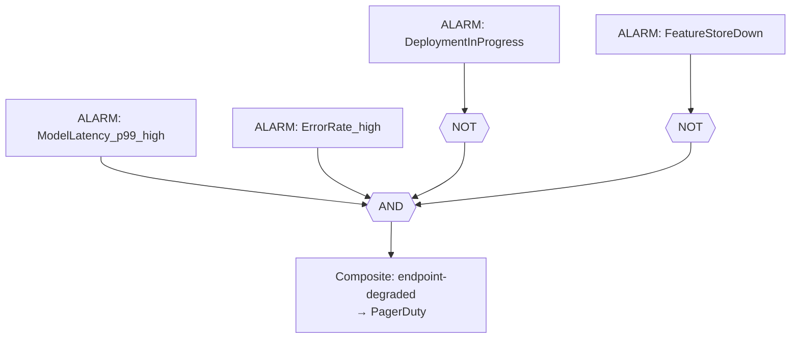
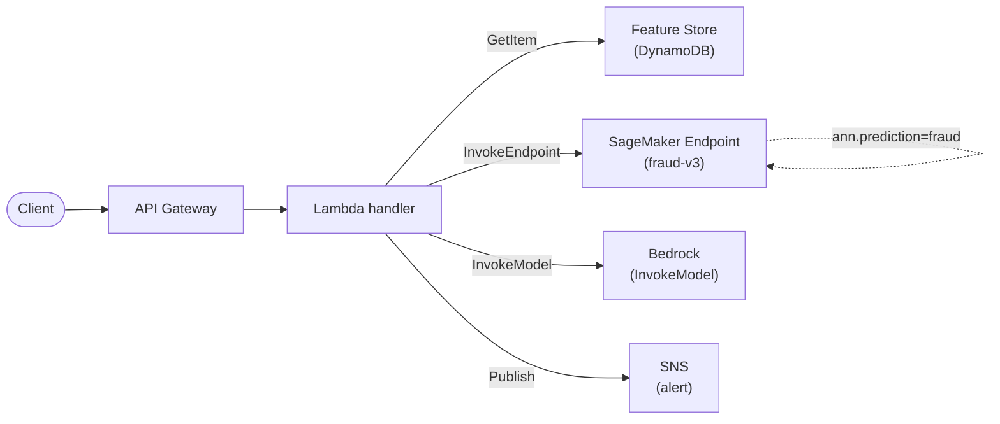
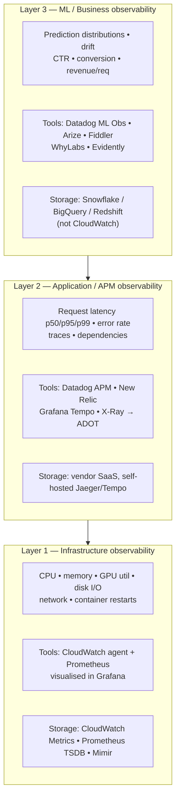

# Chapter 50 — CloudWatch, X-Ray, CloudTrail for ML Observability

> **Goal of this chapter:** to give you a working senior-MLE mental model of the AWS observability stack as it sits in 2026 — what each of CloudWatch, X-Ray, and CloudTrail is actually for, where they hand off to each other, which knobs cost real money, and which 2026 deprecation deadlines you must already be working around. By the end you should be able to walk into a production ML team, look at their observability wiring in thirty minutes, and tell them which of the five most-common outages they are still vulnerable to. Every later chapter in Part I — Model Cards capturing observability metadata in Ch 51, cost observability in Ch 58 — depends on you having this mental model installed and bolted down.

---

## 50.1 Opening: you cannot operate what you cannot observe

Here is the moment, repeated in every senior ML engineer's career, that converts observability from a checkbox into a discipline. It is 02:14 on a Sunday. The recommendation service that powers the home-page module for a retailer is, by every infrastructure metric, healthy. CPU utilization across the SageMaker endpoint fleet is parked at 38%. Memory is 61%. The CloudWatch alarms on `Invocation5XXErrors` are all in `OK`. There is no PagerDuty page. There is no Slack thread. There is, however, a worried product manager DMing the on-call rotation a screenshot of a Looker dashboard that shows click-through rate has collapsed from 4.2% to 1.1% — and has been collapsed for the last three hours. Revenue per session is down 62%. Nobody in the engineering organization knew until the product manager noticed. The model was returning a prediction within the latency SLO. The container was not OOM-killed. The endpoint was, in every infrastructure-shaped sense, *fine*. The model was also, in the business-outcome sense, *broken* — the upstream feature pipeline had silently swapped a column, the model was receiving garbage in the user-embedding field, and was confidently returning nonsense.

This is the canonical ML observability failure mode, and it appears, in lightly disguised form, in essentially every published post-mortem on production ML — Datadog's, Made With ML's, Durapid's. You cannot operate what you cannot observe. The infrastructure was observable; the model behavior was not; the business outcome was observable on a six-hour lag. The on-call woke up to find out from a non-engineer, in business hours, that something the engineering team owned had been broken since before dawn. That is the failure mode this chapter exists to prevent.

Two threads run through everything that follows. The first is **the three pillars of observability** — metrics, logs, traces — plus a fourth, **audit**, which is conceptually distinct but always discussed alongside on the MLA-C01 exam. Each pillar is owned in AWS by a named service, and which service answers a given question is one of the exam's favorite tests.

| Pillar | What it answers | AWS primary | AWS secondary |
| --- | --- | --- | --- |
| **Metrics** | "Is the system healthy *right now*?" — numeric time-series | **CloudWatch Metrics** | SageMaker built-ins, custom EMF |
| **Logs** | "What did this component say *while it failed*?" — text | **CloudWatch Logs** | S3 archive, OpenSearch |
| **Traces** | "Where did the time go in *this one* request?" — request graphs | **AWS X-Ray** (transitioning to ADOT) | Step Functions execution trace |
| **Audit** | "*Who* did *what*, *when*, on which resource?" | **AWS CloudTrail** | CloudTrail Lake / Security Lake |

The second thread is **the senior MLE's reflex move**: every infra-shaped alarm is paired with a customer-or-business-shaped alarm, and the team's pages are tuned so that the on-call sees the business symptom before the customer does. If you remember nothing else from this chapter, remember the dual-loop pattern: **a fast infra/proxy alarm in CloudWatch + a slow truth alarm in the warehouse**, joined by request ID, owned by named humans. Everything else in the chapter is mechanics.

---

## 50.2 CloudWatch Metrics — the data model

CloudWatch Metrics is a time-series database with five-level addressing, a small fixed set of aggregation functions, and a peculiar retention policy you must memorize because the exam will quiz you on it. Once you can recite the addressing scheme and the retention timeline cold, almost every CloudWatch metrics question on the exam reduces to "which dimension belongs in this namespace" — which is just memorization on top of the schema.

### 50.2.1 Five-level addressing

Every CloudWatch metric value is uniquely identified by five things:

1. **Namespace** — the bucket. `AWS/SageMaker`, `AWS/Lambda`, `AWS/Bedrock`, `/aws/sagemaker/Endpoints`, `LambdaInsights`, or any custom string of your choice (`MyApp/Inference`, `RecoModel/Reranker`). Reserved `AWS/*` and `/aws/*` namespaces belong to AWS services; you cannot publish into them.
2. **Metric name** — `Invocations`, `ModelLatency`, `GPUUtilization`, `PredictionConfidence`.
3. **Dimensions** — up to **30** per metric definition, of which up to **10** are filterable. Each unique dimension *combination* creates a distinct time series with its own cost. For SageMaker endpoint invocations the dimensions are `EndpointName`, `VariantName`, and (with `EnableEnhancedMetrics=True`) `InstanceId` and `ContainerId`.
4. **Statistic** — applied at *query time*, not at write time. The standard set is `Average`, `Sum`, `Min`, `Max`, `SampleCount`. Plus percentiles: `p1` through `p99.9`, with two-decimal precision (`p99.95` is legal).
5. **Period** — the aggregation bucket: 1 s, 5 s, 10 s, 30 s, 60 s, 5 min, 1 h. Anything finer than 60 s is "high resolution" and costs more (see §50.2.4).

### 50.2.2 Statistic gotchas the exam loves

The statistic-to-metric pairing trips people up because the unit type matters:

- `Average` of `Invocations` is **meaningless** because `Invocations` is a count, not a level. Use `Sum`.
- `Sum` of `ModelLatency` is **meaningless** because latency is a level, not a count. Use `Average` or a percentile.
- `p99` is the *real* SLA metric — 99% of requests complete faster than this. `Average` masks tail latency entirely. **Always alarm on `p95` or `p99`, not on `Average`.**
- `SampleCount` is the number of data points the statistic was computed over — useful for "did anything happen at all" alarms (`SampleCount = 0` for ten minutes = the endpoint is silent).
- For SageMaker `Invocations` the metric ships *one unit per request*, so `Sum` over a one-minute period gives you requests-per-minute directly.

The exam pattern: a question describes a SageMaker endpoint with sporadic 5-second p99 spikes, then shows four answer choices. The wrong answers alarm on `Average ModelLatency`; the right answer alarms on `p99 ModelLatency`. If you alarm on the average, you will not see the tail spike at all — the average over a minute of one slow request plus a hundred fast ones is still fast.

### 50.2.3 Retention timeline — memorize this

CloudWatch retains higher-resolution data for a shorter window and silently downsamples to coarser buckets as time passes:

| Resolution | Retention window |
| --- | --- |
| 1-second data | **3 hours** |
| 60-second (1-min) data | **15 days** |
| 5-minute data | **63 days** |
| 1-hour data | **15 months** (455 days) |

After these windows, the granular data is gone — there is no API that resurrects it. If your compliance regime needs metric-level history beyond fifteen months (financial-services model risk, healthcare model audit), you must export via `GetMetricData` to S3 or to a metric warehouse on a rolling schedule. Treat the retention curve as a *hard* property of the system and architect against it.

### 50.2.4 Publishing custom metrics — three modes

There are exactly three mechanisms for publishing your own metrics into CloudWatch, and the difference between them is the difference between a five-thousand-dollar monthly bill and a fifty-thousand-dollar monthly bill:

1. **`PutMetricData` API** — direct synchronous call. Each call is one API request even if it carries up to 1,000 metric values. Adds latency to your hot path. Throttled per region. Costs $0.01 per 1,000 requests plus $0.30 per custom metric per month for the first 10k metrics. Appropriate for low-frequency, long-running EC2 daemons emitting heartbeats; **not** appropriate for per-request inference metrics on a high-TPS endpoint.
2. **Embedded Metric Format (EMF)** — write a JSON log line that *declares* its own metrics; CloudWatch Logs extracts them automatically (see §50.5). Zero extra API calls. No throttling. The right answer for 9 out of 10 ML inference workloads.
3. **StatsD / collectd via the CloudWatch Agent** — for VM/container scrape-style metrics. The agent also speaks OpenTelemetry via ADOT.

If a question on the exam asks how to emit a custom metric from inside a Lambda inference handler, the answer is **EMF**. If it asks how to emit a single daily summary from a long-lived training daemon, **`PutMetricData`** is acceptable.

### 50.2.5 Metric math — derived metrics in dashboards and alarms

CloudWatch supports an expression layer that combines up to 10 underlying metrics into a derived metric you can chart or alarm on. This is the mechanism by which most real production alarms exist — you rarely alarm on `Invocation5XXErrors` in absolute terms; you alarm on `Invocation5XXErrors / Invocations` as an error *rate*. Common ML expressions:

| Need | Metric-math expression |
| --- | --- |
| 5XX error rate | `m1 / m2` where `m1 = Invocation5XXErrors (Sum)`, `m2 = Invocations (Sum)` |
| Total GPU utilization across instances | `SUM(METRICS("GPUUtilization"))` |
| Anomaly band on a derived metric | `ANOMALY_DETECTION_BAND(m1 / m2, 2)` — 2σ band on error rate |
| Capacity headroom | `100 - AVG(m1)` |
| Cost per invocation proxy | `(m_cost / m_invocations) * 1000` for $/1k requests |

Anomaly detection works on math expressions too — alarming on a derived metric's band is often more useful than on either raw metric alone, because the noise in the numerator and denominator partly cancels.

---

## 50.3 SageMaker-specific CloudWatch metrics — the exam meat

The MLA-C01 has a recurring question shape: "Given this symptom on a SageMaker endpoint, which metric do you alarm on?" The named metrics and their dimensions matter. You must learn the namespaces.

### 50.3.1 Endpoint invocation metrics — namespace `AWS/SageMaker`

These come from calls to the `InvokeEndpoint` runtime API. Unit is `Count` unless noted.

| Metric | Unit | Right statistic | What it means |
| --- | --- | --- | --- |
| `Invocations` | None | Sum | `InvokeEndpoint` requests received |
| `InvocationsPerInstance` | None | Sum | Per-box throughput — drives auto-scaling (Ch 40) |
| `Invocation4XXErrors` | None | Sum / Avg | Client errors — bad input shape, schema mismatch |
| `Invocation5XXErrors` | None | Sum / Avg | Server errors — model container crash, OOM, timeout |
| `InvocationModelErrors` | None | Sum / Avg | Superset incl. socket errors, malformed responses |
| `ModelLatency` | **Microseconds** | Avg / p50 / p95 / p99 | Time *inside the model container* |
| `OverheadLatency` | **Microseconds** | Avg / p99 | SageMaker overhead — auth, routing, transport |
| `ModelSetupTime` | Microseconds | Avg | Cold-start latency (serverless, multi-model) |
| `ConcurrentRequestsPerModel` | None | Max / Min | In-flight requests |
| `FirstChunkLatency` | Microseconds | Avg / p99 | TTFT for streaming LLM responses |
| `MidStreamErrors` | None | Sum / Avg | Errors after the first byte was sent (streaming) |

The latency-decomposition formula every exam candidate should know:

```
TotalClientLatency = NetworkLatency + OverheadLatency + ModelLatency
```

- `ModelLatency` is what *your code* controls (model size, batch size, instance type, kernel).
- `OverheadLatency` is what *AWS* controls; usually steady, anomalous when it spikes.
- `NetworkLatency` is unmeasured by CloudWatch — it is the residual you compute on the client.

### 50.3.2 Endpoint instance metrics — namespace `/aws/sagemaker/Endpoints`

These are emitted in percent. `CPUUtilization` is summed across cores (so a 16-vCPU box can hit 1600); `CPUUtilizationNormalized` is 0–100 regardless of core count. The same convention applies to `GPUUtilization` and `GPUMemoryUtilization`. **Always alarm on the `*Normalized` variant** if you want a threshold that ports across instance types — `GPUUtilization > 80` on a `ml.g5.12xlarge` (four GPUs) will under-fire because it scales to 400.

### 50.3.3 Job metrics

Training/processing/transform jobs emit the same five core resource metrics (CPU, memory, disk, GPU, GPU memory) under `/aws/sagemaker/TrainingJobs`, `/aws/sagemaker/ProcessingJobs`, `/aws/sagemaker/TransformJobs`. The dimension is `Host`, formatted `<job-name>/algo-<instance-number-in-cluster>`.

> ⚠️ **Exam alert.** **There is no `TrainingJobStatus` CloudWatch metric.** The same applies to `PipelineExecutionStatus`. SageMaker emits training-job state changes (`InProgress → Completed`, `Stopped`, `Failed`) via **EventBridge** as `SageMaker Training Job State Change` events, *not* as a CloudWatch numeric metric. If an exam answer offers "alarm on the `TrainingJobStatus` metric," it is wrong by construction. The right answer is an EventBridge rule on the state-change event with a target action (Step Function, Lambda, SNS). See Ch 45 for the EventBridge pattern.

### 50.3.4 Multi-model endpoint metrics

`ModelLoadingWaitTime`, `ModelDownloadingTime`, `ModelLoadingTime`, `ModelUnloadingTime`, `ModelCacheHit` (1 if already loaded, 0 if cold), `LoadedModelCount`. Exam pattern: an MME shows high p99 latency *only* on the first request to certain models — that is a cold-cache event. Fix: larger instance memory, or pin popular models.

### 50.3.5 Pipeline metrics

Namespace `AWS/Sagemaker/ModelBuildingPipeline`. Both execution-level (`ExecutionStarted`, `ExecutionSucceeded`, `ExecutionFailed`, `ExecutionDuration`) and step-level (`StepStarted`, `StepSucceeded`, `StepFailed`, `StepDuration`). Note that just like training jobs, **status itself is not a metric**; it lives in EventBridge state-change events.

### 50.3.6 Model Monitor metrics

Emitted by scheduled Processing jobs when `EnableCloudWatchMetrics=True`, under `aws/sagemaker/Endpoints/data-metrics` (and `model-metrics`, `bias-drift-metrics`, `feature-attribution-drift-metrics`). Data Quality emits `feature_baseline_drift_<feature>` and `feature_non_null_<feature>`; Model Quality emits `accuracy`, `precision`, `recall`, `f1`, `rmse`, `mae`, `auc`; Bias Drift emits `bias_<metric>_<facet>`; Feature Attribution Drift emits `feature_attribution_drift_ndcg`. These are how the drift → retrain loop (Ch 48) physically connects to alarms.

### 50.3.7 The senior reflex on metric selection

A pattern shows up often enough on the exam to deserve its own paragraph. The question describes a symptom; four answers each propose a different SageMaker metric. The wrong answers usually pair the right *unit* with the wrong *namespace*, or the right *namespace* with a metric that doesn't exist. The discipline: always anchor on three checks before picking — (1) which namespace owns the metric (`AWS/SageMaker` vs `/aws/sagemaker/Endpoints`); (2) which statistic is meaningful for that unit (Sum for counts, Avg/p99 for levels); (3) which dimensions you must filter on to disambiguate variants. If you can answer those three questions, the right metric falls out. If you cannot, you are guessing — go back and re-read §50.3.1 and §50.3.2.

---

## 50.4 CloudWatch Alarms — three flavors

Alarms convert a metric crossing a threshold into a state transition (`OK → ALARM → INSUFFICIENT_DATA`) and emit that transition to SNS, Auto Scaling, Systems Manager, EventBridge, or a Lambda. Three flavors exist, and senior MLEs reach for the second and third far more often than the first.

### 50.4.1 Static-threshold alarms

`metric COMPARISON_OP threshold` evaluated over `N` periods of `M` seconds, alarming if `K` of `N` periods cross the threshold. The "M of N" pattern (`3 of 5` is the canonical default) is what prevents a single 60-second blip from paging the on-call. Tuning: tighter `K/N` ratios catch outages faster but page more on noise; looser ratios are calmer but miss flash incidents.

```
metric:               Invocation5XXErrors / Invocations  (math expression)
threshold:            > 0.01      (1% error rate)
period:               60 seconds
evaluation periods:   5
datapoints to alarm:  3 of 5
```

### 50.4.2 Anomaly-detection alarms

CloudWatch trains a small unsupervised model per metric that learns hourly/daily/weekly seasonality and produces a *band* (default ±2σ-equivalent) around the expected value. The alarm fires when the metric exits the band. Requires roughly two weeks of history to converge; cost is **+$0.30 per metric per month** on top of the metric itself. Most useful for metrics with non-flat seasonality — `Invocations`, `ModelLatency`, `GPUUtilization` — where a static threshold over-fires nights and under-fires day-time peaks.

The senior reflex: anomaly detection as a *companion* to a static SLO alarm, not a replacement. If your contract says p99 < 200 ms, you still need a static alarm at 200 ms; the anomaly band cannot supersede a written SLA.

### 50.4.3 Composite alarms — the production answer

A Boolean expression over child alarms. Operators: `AND`, `OR`, `NOT`. Up to 100 child alarms per composite.

```
ALARM("LatencyHigh")
  AND ALARM("ErrorRateHigh")
  AND NOT ALARM("DeploymentInProgress")
```

The reason every mature platform team converges on composite alarms is noise reduction. A latency spike *alone* during a deploy is expected. A latency spike *plus* an error spike *outside the deploy window* is real. Composite alarms commonly cut paging volume by **5–10×** in production-ML teams. They cost $0.50 per composite alarm per month — five times a standard metric alarm but a rounding error against on-call burnout.

CloudWatch also supports an **`ActionsSuppressor`** on composite alarms, which is purpose-built for maintenance windows. Instead of baking `NOT ALARM("MaintenanceMode")` into every dependent alarm by hand, you point the composite's `ActionsSuppressor` at the maintenance alarm and the suppression cascade is handled centrally.



The composite above only pages when both latency and error rate are high, *and* there is no deploy in progress, *and* the feature store is up. A naive "page on each alarm" wiring would page five times for one upstream feature-store outage.

### 50.4.4 Production composite-alarm recipes

These four patterns appear in essentially every senior ML production stack:

| Composite alarm | Constituent CW alarms | What it means |
| --- | --- | --- |
| `endpoint-degraded` | `ModelLatency p99 high` AND `Invocation4XXErrors high` | Real customer pain |
| `endpoint-silent` | `Invocations == 0` for 5 min AND NOT `low-traffic-window` | Endpoint is dead during business hours |
| `drift-real` | `feature_baseline_drift > 0.3` AND NOT `upstream-pipeline-down` | Genuine drift, not garbage in |
| `cost-runaway` | `Invocations > 10× baseline` AND `BillingEstimatedCharges high` | DOS or runaway client |

---

## 50.5 CloudWatch Logs and Embedded Metric Format

### 50.5.1 Building blocks

- **Log group** — logical container, retention setting lives here. The default is **`Never expire`**, which is also the single biggest accidental cost driver in CloudWatch.
- **Log stream** — single source: one container, one Lambda execution environment, one EC2 instance.
- **Log event** — timestamp + UTF-8 message, up to **256 KB** per event.
- **Encryption** — AWS-managed key by default; customer-managed KMS key for regulated workloads (HIPAA, PCI, financial-services model risk).

Permitted retention values, in days: `1, 3, 5, 7, 14, 30, 60, 90, 120, 150, 180, 365, 400, 545, 731, 1827, 2192, 2557, 2922, 3288, 3653`. That is 1 day through 10 years — *and `Never`*. You cannot pick arbitrary values.

A tiered retention strategy for ML observability that has converged in practice:

- **Endpoint container logs** (high volume): 30 days hot in CloudWatch Logs; subscription filter to S3 for 1-year cold storage.
- **Pipeline / training-job logs** (low volume, useful for forensics): 90–365 days.
- **Audit-relevant logs** (`bedrock:InvokeModel`, anything PII-adjacent): 7 years per regulatory policy.

### 50.5.2 Subscription filters vs metric filters

Both attach to a log group; the difference is the sink:

- **Metric filter** = pattern → CloudWatch *metric* (count of matching events). Alarmable.
- **Subscription filter** = pattern → *stream* to Kinesis Data Streams, Data Firehose, Lambda, or OpenSearch.

Both can coexist on one log group. A common combination: a metric filter on `"OOMKilled"` (so you can alarm on it) plus a subscription filter on `"ERROR"` (so you can triage in OpenSearch).

**Live Tail** — CloudWatch's interactive `tail -f` over a log group. Real-time stream filterable by group and pattern at session start, sessions cap at 3 hours, billed per minute of streaming. The senior use case: deploy a canary variant, open a Live Tail filtered to its container, watch errors immediately without the 1-minute metric lag.

### 50.5.3 CloudWatch Logs Insights — the query layer

Purpose-built query language with six core commands: `fields`, `filter`, `stats`, `sort`, `limit`, `parse`. Plus `display`, `dedup`, `pattern`, `diff`. Cost is approximately **$0.005 per GB scanned**.

**Pattern 1 — Find OOM events in endpoint container logs**:

```
fields @timestamp, @logStream, @message
| filter @message like /OOMKilled|OutOfMemory|CUDA out of memory/
| sort @timestamp desc
| limit 50
```

**Pattern 2 — Aggregate latency by model**:

```
fields @timestamp, modelName, latency
| stats avg(latency) as avg_lat,
        pct(latency, 50) as p50,
        pct(latency, 95) as p95,
        pct(latency, 99) as p99,
        count(*) as n
   by bin(5m), modelName
```

**Pattern 3 — Find slow requests by parsing latency from a free-form log message**:

```
fields @timestamp, @message
| filter @message like /ModelLatency/
| parse @message "ModelLatency=*ms" as latency
| filter latency > 1000
| sort latency desc
| limit 100
```

**Field indexes (2024+)**: if you regularly filter Logs Insights queries on a specific JSON field (`modelName`, `tenantId`, `requestId`), declare it as an indexed field on the log group. Indexed-field queries skip non-matching events at scan time and cut cost dramatically. Use them for high-selectivity fields; do not bother indexing low-selectivity fields like `level`.

### 50.5.4 Embedded Metric Format — single-shot logs + metrics

EMF is the single biggest cost optimization for ML inference observability. One log write produces *both* a structured log event *and* one or more CloudWatch metrics. The JSON envelope:

```json
{
  "_aws": {
    "Timestamp": 1716800000000,
    "CloudWatchMetrics": [{
      "Namespace": "RecoModel/Inference",
      "Dimensions": [["ModelVersion", "Region"]],
      "Metrics": [
        {"Name": "InferenceLatencyMs", "Unit": "Milliseconds"},
        {"Name": "PredictionConfidence", "Unit": "None"}
      ]
    }]
  },
  "ModelVersion": "v23",
  "Region": "us-east-1",
  "RequestId": "abc-123",
  "CustomerId": "cust-9999",
  "InferenceLatencyMs": 47,
  "PredictionConfidence": 0.83
}
```

CloudWatch sees `_aws.CloudWatchMetrics` and emits `InferenceLatencyMs` and `PredictionConfidence` as custom metrics in the `RecoModel/Inference` namespace dimensioned by `ModelVersion × Region`. The high-cardinality fields (`RequestId`, `CustomerId`) stay in the log entry and are searchable in Logs Insights — they are *not* promoted to metric dimensions, so they do not bloat the per-metric cost.

Why EMF beats `PutMetricData` for ML inference:

1. **One API call** — the log write *is* the metric publish. Saves API cost on high-TPS endpoints.
2. **No throttling** — CloudWatch Logs `PutLogEvents` is far more generous than `PutMetricData`.
3. **Structured log free** — every metric emission is also a searchable per-request record.
4. **Cardinality control** — high-cardinality identifiers stay in the log, not the metric.
5. **No hot-path latency** — your handler does not block on the metric publish.

**Library support**: the official `aws-embedded-metrics` SDK exists for Python, Node.js, Java, and .NET. The `aws_lambda_powertools` library wraps EMF behind decorators and is now the default in most AWS-native shops:

```python
from aws_lambda_powertools import Metrics
from aws_lambda_powertools.metrics import MetricUnit

metrics = Metrics(namespace="RecoModel", service="reranker")

@metrics.log_metrics
def lambda_handler(event, context):
    t0 = time.perf_counter()
    result = model.predict(event["features"])
    metrics.add_metric(name="InferenceLatencyMs", unit=MetricUnit.Milliseconds,
                       value=(time.perf_counter() - t0) * 1000)
    metrics.add_metric(name="PredictionConfidence", unit=MetricUnit.NoUnit,
                       value=float(result.score))
    metrics.add_dimension(name="ModelVersion", value=os.environ["MODEL_VERSION"])
    return result
```

That gives you a per-request log line *and* per-version aggregated metrics with zero extra API calls, zero throttling risk, and zero metric drops on transient errors. **In Lambda/Fargate/EKS workloads, EMF is the only correct answer.**

---

## 50.6 Container Insights and Lambda Insights

### 50.6.1 Container Insights — ECS, EKS, Kubernetes

Auto-collects observability for containerized workloads: ECS (EC2 and Fargate), EKS (EC2 and Fargate), self-managed Kubernetes on EC2. Layers:

| Layer | Examples |
| --- | --- |
| Cluster | Node count, allocatable CPU/memory, pod count |
| Service / task definition | Running task count, desired count, deployment errors |
| Pod / container | CPU, memory, network rx/tx, file system, restart count |

Performance log events ship as EMF to `/aws/containerinsights/<cluster>/performance`. **Enhanced observability** (Nov 2024) adds Prometheus-style metrics: `kube_pod_*`, control-plane metrics (etcd, scheduler, apiserver), persistent-volume metrics.

ML use case: serving via EKS with custom inference containers (vLLM, TGI, Triton). Container Insights gives you GPU memory pressure, OOMKill counts, and eviction events without writing custom metrics. Pair with the NVIDIA DCGM exporter for fine-grained per-tensor GPU metrics if you need them.

### 50.6.2 Lambda Insights

Deployed as a Lambda layer; adds an extension that emits fine-grained process metrics — `cpu_total_time`, `memory_utilization`, `used_memory_max`, `init_duration` (cold-start metric), `tmp_used`, `tmp_max`. A curated dashboard auto-creates per function. The ML use case is Lambda functions that wrap small inference (Bedrock invocations, lightweight CPU models, feature lookups, post-processors). On Lambda, memory drives CPU and cost — so when Lambda Insights tells you a function is memory-bound, bumping memory often *reduces* total cost by cutting duration.

---

## 50.7 AWS X-Ray — distributed tracing

### 50.7.1 The concept model — segments and subsegments

| Concept | Definition |
| --- | --- |
| **Trace** | One request's journey through one or more services, identified by a **trace ID** |
| **Segment** | One service's slice of work in that trace — start/end, service name, annotations, metadata, subsegments |
| **Subsegment** | A finer slice inside a segment — typically a downstream call (HTTP, AWS SDK, SQL) or an instrumented code block |
| **Inferred segment** | A segment X-Ray constructs for a downstream service that does not natively emit X-Ray data (e.g., DynamoDB) |
| **Service graph** | Directed graph of services participating in traces, with edges labeled by p50/p95/p99 latency and error rate |
| **Trace map** | Same data, focused on a single trace path (one-request view) |

Segment-document size: up to **64 KB**. Trace data retention: **30 days**. Service-graph data retention: 30 days. Trace IDs are formatted `1-<8-hex-timestamp>-<24-hex-random>`, e.g., `1-5759e988-bd862e3fe1be46a994272793`.

### 50.7.2 Trace propagation — `X-Amzn-Trace-Id`

Propagation uses the HTTP header **`X-Amzn-Trace-Id`**:

```
X-Amzn-Trace-Id: Root=1-5759e988-bd862e3fe1be46a994272793;Parent=53995c3f42cd8ad8;Sampled=1
```

`Root` is the trace ID, `Parent` is the upstream segment ID, `Sampled` is the 0/1 sampling decision. The first X-Ray-integrated service the request hits adds the header; downstream services propagate it unmodified. For ML wiring, API Gateway → Lambda → SageMaker endpoint requires the Lambda function to forward the header to `InvokeEndpoint` *and* requires the model server itself to be instrumented to record subsegments.

### 50.7.3 Annotations vs metadata

| | Annotations | Metadata |
| --- | --- | --- |
| Type | Key-value, scalar | Key-value, any JSON value |
| Indexed (filter-searchable)? | Yes | No |
| Limit | 50 per trace | Effectively unbounded (within segment size) |
| Use case | `model_version`, `tenant_id`, `latency_bucket` | Full request body, prompt text, RAG documents, SHAP values |

The ML pattern: annotate every endpoint trace with `model_version`, `prediction_class`, and a low-cardinality `latency_bucket` (`"fast"`, `"slow"`, `"timeout"`); put the full payload, prompt, and explanation in metadata. Annotations let you query "show me all slow traces for `fraud-v3`" in the X-Ray console; metadata is there when you click into one trace.

### 50.7.4 Sampling rules

Default: **first request per second + 5% of additional requests**. Configurable per-rule with reservoir size, fixed rate, service name, HTTP method, URL path, and host filters. Rules are evaluated in priority order; first match wins.

ML sampling strategy by traffic class:

| Traffic | Sample rate | Why |
| --- | --- | --- |
| Steady-state production | 1–5% | Enough to see issues, not enough to blow up the bill |
| Canary / new variant | 100% | Catch every regression |
| Errors (4xx/5xx) | 100% | Always trace failures |
| Critical paths (payment, lending decision) | 100% | Audit-trail requirement |

### 50.7.5 X-Ray SDK status — use ADOT

> ⚠️ **Exam alert.** The legacy `aws-xray-sdk-*` packages (Python, Node, Java, .NET, Go, Ruby) **and the X-Ray daemon** entered maintenance mode on **2026-02-25** and reach **end of support on 2027-02-25**. New instrumentation work should use **AWS Distro for OpenTelemetry (ADOT)** — AWS's managed distribution of the OpenTelemetry Collector and language SDKs, with an X-Ray exporter so the X-Ray service map still works. Any exam answer that says "use the X-Ray SDK for a new project" is *outdated* by the 2026 exam refresh.

The migration architecture shift:

```
Old (deprecating):
  app → AWS X-Ray SDK → UDP → X-Ray daemon → X-Ray backend

New (current direction):
  app → OpenTelemetry SDK (with AWS extensions) → ADOT Collector
                                                       │
                                                       ├─→ X-Ray backend (still works)
                                                       ├─→ CloudWatch Application Signals
                                                       ├─→ Tempo / Jaeger (if self-hosted)
                                                       └─→ Datadog / Honeycomb / New Relic
```

The production wins from migrating:

1. **One agent for traces + metrics + logs** instead of X-Ray daemon + CloudWatch agent + Fluent Bit.
2. **Vendor portability** — same instrumentation, multiple exporters.
3. **CloudWatch Application Signals** — auto-derived SLOs (latency, error rate, availability) from spans, with built-in alarming. Only available on ADOT-emitted traces.
4. **Transaction Search** — span-level search across services for an incident.

The pragmatic migration order teams have converged on: (1) add ADOT alongside X-Ray; (2) confirm traces appear in X-Ray from the ADOT path; (3) migrate one non-critical service first; (4) turn on Application Signals; (5) migrate request-path services behind feature flags; (6) remove the X-Ray SDK and daemon once everything is on ADOT.

### 50.7.6 X-Ray with SageMaker

SageMaker real-time endpoints support **Active Tracing**: set `EndpointConfig.EnableActiveTracing=True`. SageMaker then propagates the `X-Amzn-Trace-Id` header into the container. If the model server inside the container is instrumented (X-Ray SDK or ADOT), it records its own subsegments; without container instrumentation you still get the SageMaker node in the trace map but no model-internal detail. SageMaker Pipelines integrate via Step Functions tracing — the pipeline execution shows as a trace with subsegments per step.

### 50.7.7 Reference X-Ray service map for ML inference



A filter expression like `annotation.prediction = "fraud" AND duration > 0.5` returns every fraud-classified request that took more than 500 ms — the kind of query that takes thirty seconds in X-Ray and would take hours in a logs-only stack.

### 50.7.8 ML-specific spans worth keeping when you migrate to ADOT

When you migrate from the X-Ray SDK to ADOT, do not lose these spans — they are the ones that earn their keep during real ML incidents:

- **Feature-store read latency** (`feature.store.read` span with `store_name` attribute).
- **Model inference span** (`model.predict`) with `model_id`, `model_version`, `batch_size` attributes.
- **Postprocessing / reranking** (`rerank` span) with `top_k` and `score_distribution`.
- **Vector DB call** (`vector.search` with `index_name`, `top_k`, `vector_dim`).
- **GenAI calls** — OpenTelemetry semantic conventions for GenAI are stabilizing (`gen_ai.*` namespace) and ADOT supports them. This is where you get the most leverage if you ship LLM apps: standard attributes for `gen_ai.system`, `gen_ai.request.model`, `gen_ai.usage.input_tokens`, `gen_ai.usage.output_tokens`.

---

## 50.8 AWS CloudTrail — the audit log

### 50.8.1 What CloudTrail is — and isn't

CloudTrail records **API calls** against AWS services in your account: who (IAM principal), what (`eventName`), when (`eventTime`), against which resource (`resources[]`), from where (`sourceIPAddress`). Delivery latency averages roughly five minutes; events also stream to CloudWatch Logs and EventBridge for near-real-time hooks.

CloudTrail is **not** a real-time alerting system in the page-the-on-call sense, **not** a metric system (it logs events, not numbers), and **not** sufficient for data-plane visibility by default — `s3:GetObject`, `lambda:Invoke`, `sagemaker:InvokeEndpoint`, and `bedrock:InvokeModel` are *off* unless you opt into data events.

### 50.8.2 Event types and pricing

| Event type | Captures | On by default? | Cost |
| --- | --- | --- | --- |
| **Management events** | Control-plane: `CreateEndpoint`, `DeleteModel`, `iam:PutPolicy`, `s3:CreateBucket` | Yes — first copy free (90-day Event history) | Free first copy |
| **Data events** | Data-plane: `s3:GetObject`, `lambda:Invoke`, `dynamodb:GetItem`, **`sagemaker:InvokeEndpoint`**, `bedrock:InvokeModel` | **No** — opt-in per trail | **~$0.10 per 100k events** |
| **Network activity events** | VPC endpoint API access (incl. AccessDenied) | No | Per-event |
| **Insights events** | Anomalous management-API call patterns (rate, error spikes) | No | $0.35 per 100k events analyzed |

> ⚠️ **Exam alert.** **`sagemaker:InvokeEndpoint` is a CloudTrail *data* event, not a management event, and is off by default.** If a regulatory question says "we need an audit trail of every inference call against the production endpoint for HIPAA / model-risk compliance," the answer is: explicitly enable SageMaker data events on the trail — and budget for the per-event cost (roughly $0.10 per 100,000 invocations on top of inference cost). The same applies to `bedrock:InvokeModel`.

### 50.8.3 Trails

A **trail** is a configuration that delivers events to **S3** (always) and optionally to **CloudWatch Logs** (so you can use metric filters and Logs Insights queries) and **EventBridge** (so you can react in near-real-time to specific API calls).

Trail scopes:

- **Single-Region trail** — one region's events.
- **Multi-Region trail** — all current and future regions in the account.
- **Organization trail** — multi-region, cross-account, owned by the management account or a delegated administrator; delivers to a centralized logging account's bucket.

Best-practice ML trail layout:

```
Account: org-logging
└── S3 bucket: org-cloudtrail-logs
        (locked, MFA-delete, KMS-encrypted, Object Lock)
    └── Receives:
        Organization trail (multi-region):
          - all management events
          - all S3 data events
          - all SageMaker data events
          - all Bedrock data events
          - Insights events on management API rates
```

### 50.8.4 CloudTrail Lake — and its 2026 closure

CloudTrail Lake is a managed SQL-queryable event store: events stored in Apache ORC (columnar) for fast scan, queries written in full **Trino SQL** with cross-store JOIN support. Retention up to roughly 10 years.

> ⚠️ **Exam alert.** **AWS CloudTrail Lake closes to new customers on 2026-05-31.** Existing customers can continue using it, but it has moved to "critical bug fix and security update only" mode. Any exam question dated after that cutoff that proposes "use CloudTrail Lake for a greenfield ML audit-log deployment" is wrong — the answer is one of the migration paths below.

The recommended migration paths in AWS's preference order:

1. **CloudWatch Logs + OpenSearch-powered analytics.** AWS shipped a path to import historical CloudTrail Lake event data stores into CloudWatch Logs; CloudWatch Logs now has native analytics powered by OpenSearch, pre-built connectors, and open Apache Iceberg APIs. Gotcha: data prior to 2023 will not be migrated.
2. **Amazon Security Lake.** Open Cybersecurity Schema Framework (OCSF) data lake, S3-backed, queryable from Athena or OpenSearch via the zero-ETL OpenSearch ↔ Security Lake integration. This is what most regulated finance/healthcare ML platforms are picking, because OCSF is vendor-neutral (Splunk, Wiz, and most SIEMs ingest it natively), one bucket holds CloudTrail + VPC Flow Logs + Route 53 + EKS audit + 3rd-party, and you can run Athena ad-hoc and OpenSearch real-time without re-ingesting.
3. **Athena over CloudTrail S3 logs.** The no-licence alternative — use AWS's CREATE TABLE template, then query `WHERE eventName='DeleteEndpoint'`. Works at whatever retention you keep on S3.
4. **Third-party SIEMs** (Splunk, Datadog Cloud SIEM, Sumo Logic). Ingest CloudTrail directly via Firehose.

Sample CloudTrail Lake / Athena query — "who created any SageMaker endpoint in the last 90 days":

```sql
SELECT eventTime,
       userIdentity.arn AS who,
       requestParameters.endpointName AS endpoint,
       sourceIPAddress
FROM <event_data_store_or_athena_table>
WHERE eventName = 'CreateEndpoint'
  AND eventSource = 'sagemaker.amazonaws.com'
  AND eventTime > timestamp '2026-02-26 00:00:00'
ORDER BY eventTime DESC;
```

### 50.8.5 Insights events

CloudTrail Insights uses an unsupervised ML model over the *rate* and *error rate* of management API calls. ML-specific hits include catching a misconfigured CI/CD pipeline pumping `InvokeEndpoint` calls (cost spike), a runaway `CreateTrainingJob` loop burning quota, or unusual `DeleteEndpoint` activity. Cheap insurance — enable it on the management trail.

### 50.8.6 The classic "who deleted my endpoint?" workflow

A pattern your on-call will run: Monday morning, an endpoint is gone, nobody on the team admits to deleting it. Three ways to answer, in order of cost and power:

1. **Console — CloudTrail Event history**: filter `Event name = DeleteEndpoint` over the time window. Free, 90-day window, single-account.
2. **CloudTrail Lake** (only if you signed up before 2026-05-31): SQL query against the event data store. Multi-account JOINs, up to ten-year retention.
3. **Athena over the trail's S3 bucket**: use AWS's `CREATE TABLE` template, then `SELECT * WHERE eventName='DeleteEndpoint'`. Works at whatever retention you keep on S3 and is the right answer for greenfield accounts post-2026-05-31.

---

## 50.9 The three-tier ML observability stack — and where CloudWatch fits

Every mature ML platform team eventually converges on a three-layer observability stack regardless of whether they started AWS-native:



CloudWatch dominates **Layer 1**, contributes to **Layer 2** through metrics + X-Ray/ADOT, and is rarely the primary store at **Layer 3**. The senior MLE's reflex is to choose CloudWatch where it wins (default AWS-service metrics, alarms wired to SNS → PagerDuty, EMF-emitted Lambda metrics, training-job logs) and to *not* fight it where it loses (long-window analytics beyond 15 months, high-cardinality custom metrics, multi-source dashboards with templating). The right answer is almost always **CloudWatch as the cheap firehose at the edge, shipped to a richer backend** — Grafana for dashboards, Datadog or New Relic for SLO + APM, ADOT for traces because the X-Ray SDKs are sunsetting.

---

## 50.10 Cost surprises — the bill that actually kills

This is where teams burn six figures before they notice.

### 50.10.1 The pricing table to memorize

| Item | Price (us-east-1, 2026) | Cost gotcha |
| --- | --- | --- |
| Custom metric (standard or high-res) | **$0.30/metric/month** (first 10k); tiered down to $0.02 above 1M | Per unique dimension *combination* — high cardinality kills you |
| `PutMetricData` API request | $0.01 per 1,000 requests | Each call is one request even with 20 metrics |
| CloudWatch Logs **ingestion** (standard) | **$0.50/GB** | Single biggest line item for most teams |
| CloudWatch Logs ingestion (Infrequent Access class) | $0.25/GB | No live tail, no metric filters, no subscription filters |
| CloudWatch Logs storage | $0.03/GB/month | Cheap, compounds on "never delete" |
| Logs Insights query scan | $0.005/GB scanned | Cheap unless you scan 90-day windows daily |
| Dashboard | $3/dashboard/month after 3 free | Trivial but adds up across teams |
| Standard metric alarm | $0.10/alarm/month | — |
| Composite alarm | $0.50/alarm/month | Five times a standard alarm — still worth it |
| Anomaly-detection alarm | $0.30/metric/month *on top of* the metric cost | Cost surprise most teams miss |
| CloudTrail data events | ~$0.10 per 100k events | `InvokeEndpoint` opt-in adds real cost on high-TPS endpoints |

### 50.10.2 The three traps

**The high-resolution metrics trap.** 1-second resolution costs the same per-metric per-month rate as 1-minute *but* the bill explodes because you make 60× the `PutMetricData` calls. Multiple published case studies report cutting metric-related charges by roughly **60×** by moving non-critical workloads from high-resolution to standard. Reserve high-resolution for latency-sensitive endpoints where sub-minute granularity actually informs scaling or SLA decisions; for a daily batch scoring job, 1-second metrics are setting money on fire.

**The custom-metric cardinality blast.** Emit `inference_latency` tagged with `model_id × model_version × customer_id × region` and at 200 customers × 5 versions × 4 regions you have 4,000 unique series **per metric name**. At $0.30 each you are at $1,200/month for one metric; 20 metrics gets you to $24k/month for *one* model. Mitigations: drop customer-level dimensions in metrics (keep them in logs/traces), emit via EMF (so high-cardinality identifiers stay in the log only), send high-cardinality data to Prometheus/Mimir or a vendor instead of CloudWatch Metrics.

**The CloudWatch Logs ingestion trap.** Multiple published post-mortems describe Lambda log groups alone costing $5k–$30k/month because someone enabled DEBUG logging in production and emitted full request/response JSON on every call. Mitigations: log-level env var read at cold start (`LOG_LEVEL=INFO`); sample successes (log 100% of errors, 1% of successes, hashed on request-ID for correlation); use the Infrequent Access log class for training-job logs you only read during post-mortems; set explicit retention on every log group (the default `Never expire` is the silent killer); consolidate log groups so Lambda's tiered pricing actually kicks in.

---

## 50.11 The "we monitored CPU instead of CTR" outage — and the dual-loop fix

### 50.11.1 The pattern

The single most-repeated post-mortem genre in published ML observability literature reads, in the original or in light variation:

> The infra dashboards were all green. CPU 40%, memory 60%, no 5xx, p99 latency normal. But our CTR dropped from 4.2% to 1.1% for three hours during prime time. We only found out when the product manager pinged us on Slack to ask "did something change?"

Variations appear in Datadog's *Managed ML best practices*, Made With ML's *Monitoring ML systems*, and Durapid's *MLOps model monitoring* write-ups. The shape of the failure is always the same: the infrastructure is fine because the model is doing what it was told; the metric you needed was in your data warehouse, not in CloudWatch; the alert was on a leading indicator, not the business outcome.

### 50.11.2 The three blind spots

1. **The infra is fine because the model is doing what it was told.** A degraded model that returns a prediction within latency budget triggers no infra metric.
2. **The metric you needed wasn't in CloudWatch — it was in your data warehouse.** CTR, conversion, revenue-per-impression are typically computed by an analytics pipeline hours later. By the time the batch job notices, the outage is over.
3. **The alert was on a leading indicator, not the business outcome.** "p99 latency normal" is true. "p99 latency normal AND prediction confidence collapsed" is the alarm you wanted.

### 50.11.3 The dual-loop fix

The fix every senior team eventually implements: **tier-1 alarms must be business-KPI-shaped, not infra-shaped.** A short transposition table that captures the move:

| Bad alarm (infra-shaped) | Good alarm (business-shaped) |
| --- | --- |
| `CPUUtilization > 80%` | `ConversionRate < 0.6 × 7-day-average` |
| `ModelLatency p99 > 200ms` | `EmptyRecommendationRate > 5%` |
| `Invocations dropping` | `RevenuePerSession deviating from anomaly band` |
| `MemoryUtilization > 90%` | `PredictionConfidenceMean < baseline − 2σ` |

Because real business metrics typically have higher latency than CloudWatch (computed by an analytics pipeline), the practical compromise is **dual-loop**:

- **Fast proxy alarm in CloudWatch**: `PredictionConfidenceMean`, `EmptyRecommendationRate`, `FallbackResponseRate` emitted from the inference path via EMF and alarmed in CloudWatch within 1–5 minutes.
- **Slow truth alarm in the warehouse**: CTR, revenue, conversion computed in Snowflake/Redshift hourly and alarmed via vendor (Datadog Metrics, Monte Carlo, Anomalo, Bigeye).

The fast loop pages within minutes on a proxy that *correlates* with the business outcome. The slow loop confirms the page was real or surfaces drift the proxy missed. The two loops are joined by `request_id` so an incident commander can pivot from "CTR is down" to "show me the 200 individual requests that returned empty recommendations during the affected window."

The dashboard convention that follows: every tier-1 ML health dashboard lists the **business proxies at the top, model metrics in the middle, infrastructure at the bottom**. The on-call is trained to read top-down, not bottom-up. Datadog's ML Observability product ships this layout by default; Grafana folks build it manually by row ordering.

---

## 50.12 Reference observability architecture

The end-to-end wiring for a production SageMaker ML system in 2026:

```
                           ┌──────────────────────────┐
   Client request          │     Application code     │
   ─────────────────────▶ │ (Lambda / ECS / EKS /     │
                           │  SageMaker container)    │
                           └────────┬─────────────────┘
                                    │
            ┌───────────────────────┼──────────────────────────┐
            │                       │                          │
            ▼                       ▼                          ▼
   ┌────────────────┐      ┌─────────────────┐       ┌──────────────────┐
   │ CloudWatch     │      │ CloudWatch Logs │       │ AWS X-Ray        │
   │ Metrics        │      │  (EMF + plain)  │       │  (via ADOT)      │
   │  (built-in +   │      │  → Logs Insights│       │  → Service map   │
   │   EMF custom)  │      │  → Subscription │       │  → Trace details │
   │  → Alarms      │      │    filters      │       │  → Filter exprs  │
   │  → Dashboards  │      │  → Metric filters│      │                  │
   └──────┬─────────┘      └────────┬────────┘       └─────────┬────────┘
          │                         │                          │
          │ (alarm state change)    │ (matching events)        │
          ▼                         ▼                          ▼
   ┌──────────────────────────────────────────────────────────────────┐
   │                    EventBridge default bus                       │
   └───────┬─────────────────────────┬────────────────────────┬───────┘
           │                         │                        │
           ▼                         ▼                        ▼
   ┌──────────────┐         ┌──────────────────┐     ┌────────────────┐
   │ SNS (page)   │         │ Lambda (action)  │     │ Step Functions │
   └──────────────┘         └──────────────────┘     │ (auto retrain) │
                                                     └────────────────┘

                           ┌──────────────────────────┐
                           │   AWS CloudTrail         │
                           │   - Mgmt events (free)   │
   Every API call ──────▶ │   - Data events (opt-in) │
                           │   - Insights events      │
                           │  → S3 + CWL + EventBridge│
                           │  → Athena / Security Lake│
                           └──────────────────────────┘
```

The senior-MLE checklist for any new production ML service in 2026:

1. Alarm on **customer-impact metrics**, not infra metrics. `Invocation5XXErrors / Invocations > 1%` for 3 of 5 periods. `ModelLatency p99 > SLA` for 3 of 5 periods.
2. Use **composite alarms** for production pages (error rate + latency + NOT deploy-window).
3. Use **EMF**, not `PutMetricData`, for per-request metrics from Lambda/Fargate/EKS.
4. Use **anomaly-detection alarms** for seasonal metrics (`Invocations`, `ModelLatency` under variable load).
5. Set **retention** on every log group — `Never expire` is the silent cost killer.
6. Declare **field indexes** on high-selectivity Logs Insights fields (`requestId`, `modelName`, `tenantId`).
7. Use **X-Ray Active Tracing** on every endpoint; sample 1–5% steady-state, 100% on canaries and errors.
8. Use **ADOT**, not the legacy X-Ray SDK, for new instrumentation.
9. Run a **multi-region organization CloudTrail** to a hardened logging-account S3 bucket; enable SageMaker + Bedrock data events on regulated workloads.
10. Enable **CloudTrail Insights** on management events for free anomaly detection over API rates.
11. Define **dashboards-as-code** (CloudFormation / CDK) so they version with the application.
12. Document **every alarm** with a plain-English meaning and a runbook link. The on-call should never need archaeology.

---

## 50.13 Eight questions a senior MLE asks on day one

If you are being hired into a senior MLE role in 2026 and someone hands you the observability stack, here are the questions whose answers should be reflexive:

1. **"Are we using EMF or `PutMetricData` for per-request metrics?"** If they say `PutMetricData` and they run on Lambda/Fargate, there is a latency-and-cost issue waiting to surface.
2. **"What's our X-Ray → ADOT migration plan?"** If the answer is "we haven't started," the clock has been ticking since 2026-02-25.
3. **"How are we exporting CloudTrail data after May 2026?"** Anyone still on Lake-only for new accounts has a compliance gap.
4. **"Show me one composite alarm that suppresses noise during deploys."** If there isn't one, alert fatigue is the biggest reliability problem and nobody knows yet.
5. **"What's our top-of-funnel ML health metric — not latency, the business one?"** If they can't name it, the team is one outage away from being the team in §50.11.
6. **"What does a high-resolution metric cost us per month and are any of them still on?"** This single question has saved multiple teams five-figure monthly bills.
7. **"Do we have a Model Monitor schedule wired through EventBridge to a retraining pipeline?"** If yes, real MLOps. If no, drift is being caught by humans, late.
8. **"Where do we send traces and where do we send logs? Same vendor? Joined by request-ID?"** If logs and traces aren't joined on `RequestId`/`TraceId`, every incident takes 3× as long.

---

## 50.14 Exercises

1. **Latency decomposition.** A SageMaker endpoint reports `ModelLatency p99 = 180 ms` and `OverheadLatency p99 = 25 ms`. The client measures total request latency at 950 ms p99. Where is the 745 ms going, what's the metric you need to gather, and which CloudWatch metric *cannot* answer this question for you?

2. **Wrong statistic.** A team is alarming on `Average(ModelLatency) > 200 ms` for a fraud-detection endpoint. They miss a real outage where 5% of requests take 2 seconds while the rest take 30 ms. (a) What did the average alarm see? (b) Write the corrected alarm specification.

3. **EMF vs `PutMetricData`.** Design the metric-emission strategy for a Lambda function that wraps a Bedrock `InvokeModel` call and needs to publish `TokensIn`, `TokensOut`, and `Cost` per request, with `ModelId` as a dimension. Show the EMF JSON envelope and explain why `PutMetricData` is the wrong choice here.

4. **Composite alarm design.** A SageMaker endpoint has three single-metric alarms: `latency-high`, `error-rate-high`, `low-traffic`. A weekly deploy fires `latency-high` and `error-rate-high` for 90 seconds during a blue/green cutover. Design a composite alarm that pages only on a real incident, never on the deploy.

5. **Find-the-deleter.** It is Monday morning. A SageMaker endpoint your team owns no longer exists. List, in order, the three CloudTrail mechanisms you would use to identify who deleted it — and what their respective limits are (time window, cost, query power).

6. **The 2026 question.** Your manager asks you to design a 5-year SQL-queryable audit store for a new SageMaker workload starting June 2026. Why is "CloudTrail Lake" the wrong answer, and what are the three legitimate alternatives in AWS's recommended order?

7. **`InvokeEndpoint` data event.** Compliance asks for a full audit trail of every `InvokeEndpoint` call against a regulated endpoint that handles 10 million invocations per day. (a) What configuration change do you make on the CloudTrail trail? (b) What's the approximate monthly cost of the data-event capture alone? (c) Where do you store the events for the required 7-year retention?

8. **Dual-loop alarm design.** Sketch the fast-loop CloudWatch alarm + slow-loop warehouse alarm for a recommendation endpoint where the business KPI is CTR (computed hourly in Snowflake) and the proxy is `EmptyRecommendationRate` (computed per request via EMF). Show how the two loops are joined for incident response.

---

## 50.15 Cross-references

- **Forward to Ch 51 (Model Cards).** Model Cards capture observability metadata — owned dashboards, alarm ARNs, runbook links — alongside fairness and intended-use metadata. The wiring is meaningless if the Model Card doesn't tell the on-call where it lives.
- **Forward to Ch 58 (cost observability).** This chapter covered the observability bill; Ch 58 covers Cost Explorer, AWS Budgets, and Cost Anomaly Detection wired into the same CloudWatch + EventBridge plane.
- **Back to Ch 40 (auto-scaling).** Auto-scaling targets the `InvocationsPerInstance` metric you learned here. The alarm-state-change → Auto Scaling action wire is the production load-handling path.
- **Back to Ch 45 (EventBridge).** Training-job and pipeline state-change events ride EventBridge, not CloudWatch metrics. This is the chapter that explained *why* — and Ch 45 explained the rule syntax and target wiring.
- **Back to Ch 48 (Model Monitor).** Model Monitor publishes drift metrics into CloudWatch (`feature_baseline_drift_*`, `accuracy`, `auc`); this chapter covered the alarm and EventBridge side that closes the drift → retrain loop.

The thread you should now feel running through Part I: **observability + audit + cost are one system, not three.** They share the metric/log/event substrate, they share the EventBridge bus, they share the dashboards-as-code workflow. The senior MLE designs all three at once; the junior MLE adds them after the first outage. Aim for the former.

---

## 50.16 Decision tree — which tool for which symptom

For a quick on-call lookup, this is the symptom-to-tool table that compresses the chapter:

| Symptom | First-look tool | Why |
| --- | --- | --- |
| Endpoint slow overall | CloudWatch `ModelLatency` p99 + `GPUUtilization` | Latency at a glance |
| Endpoint slow *for some users only* | X-Ray traces filtered by `annotation.tenant_id` | Per-request causality |
| Endpoint returns 5XX intermittently | CloudWatch Logs Insights `filter @message like /Traceback/` | Find the stacktrace |
| Endpoint OOMs and restarts | CloudWatch `MemoryUtilization` + Logs metric filter on `OOMKilled` | Resource view + reason |
| Model accuracy dropped silently | Model Monitor → CloudWatch metric `accuracy` | Concept drift |
| Predictions skew toward one class | Model Monitor — Data Quality on the prediction column | Label/prior shift |
| Throughput suddenly halved | CloudWatch `InvocationsPerInstance` + Auto Scaling metrics | Capacity event |
| Cost spike | CloudWatch `Invocations` Sum + Cost Explorer + CloudTrail Insights | Volume vs config change |
| Someone deleted a resource | CloudTrail Event history `DeleteEndpoint` | Identity + time |
| Compliance audit "show me last quarter's prod model approvals" | Athena over CloudTrail S3 logs (or Lake if pre-2026-05-31) | SQL over events |
| GPU memory pressure on a Triton container on EKS | Container Insights (enhanced observability) | Kubernetes-native view |
| Vendor-neutral instrumentation that still sends to X-Ray | ADOT (AWS Distro for OpenTelemetry) | The 2026 forward path |

If you can read down this table once and answer each row from memory, you have the chapter's working knowledge. Drill it until the answers come without hesitation — on the exam clock and on the 3 a.m. pager, both reward speed.

One last reflex worth installing before moving on. When a teammate asks "should we add a CloudWatch alarm for X?", the right counter-question is "what's the customer-facing symptom this alarm catches that nothing else does, and what's the runbook?" If either answer is "I'm not sure," the alarm doesn't earn its keep — it just adds noise. The discipline of every senior MLE observability stack is **fewer alarms, better alarms, with named owners and written runbooks**.

Aim for that and the rest of Part I will follow naturally.
