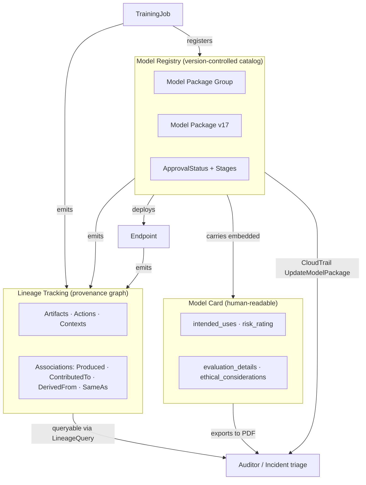
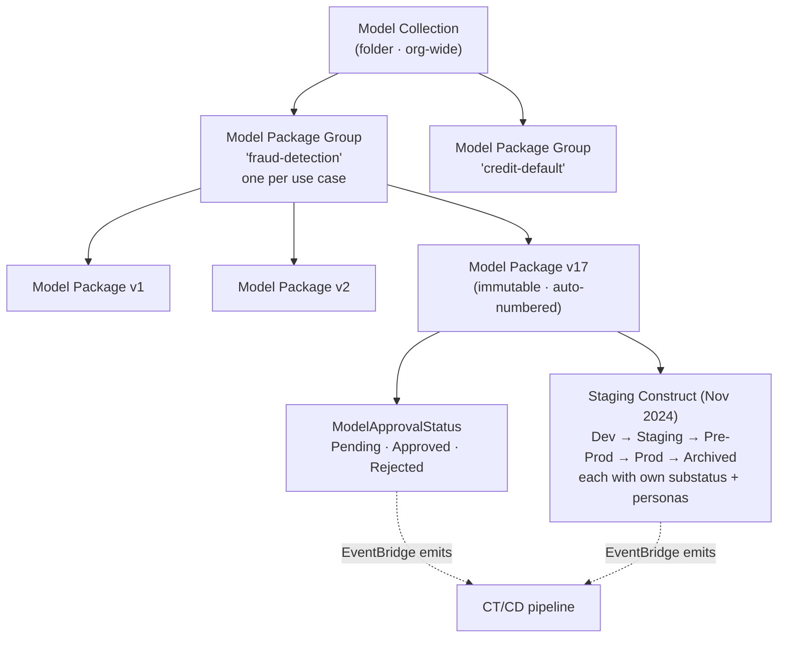
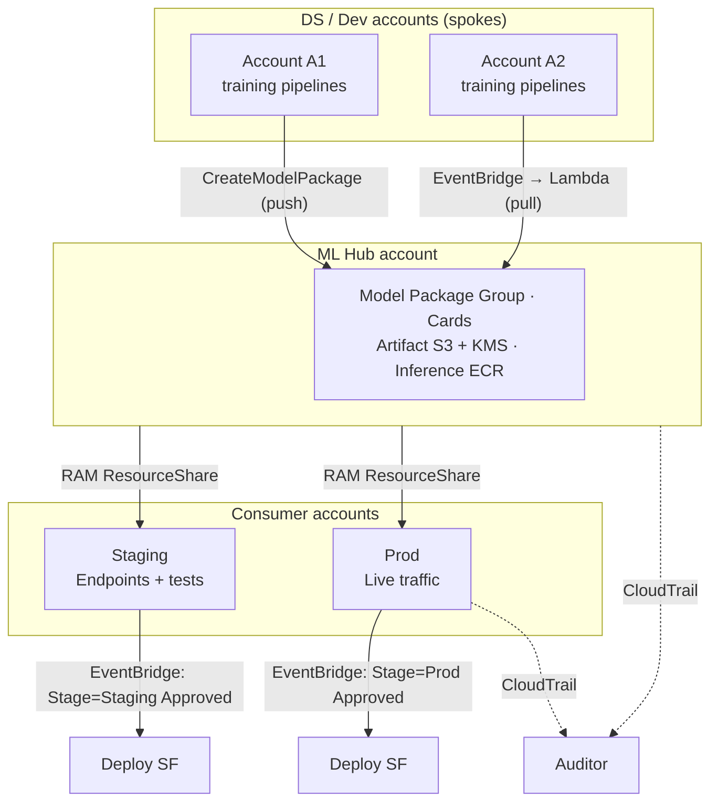

# Chapter 51 — SageMaker Model Registry, Model Cards, and Lineage

> **Goal of this chapter:** to make you fluent in the three SageMaker primitives that turn a `model.tar.gz` into a *regulated AI system* — the **Model Registry** (the version-controlled catalog), the **Model Card** (the human-readable dossier), and **Lineage Tracking** (the machine-readable provenance graph). By the end of this chapter you will be able to (a) recite the three-level hierarchy of `Model Package Group → Model Package → Model Version` from memory, (b) explain why the November 2024 *staging construct* is additive to the legacy `ModelApprovalStatus` rather than a replacement for it, (c) wire an EventBridge rule that fires CT/CD on every approval transition, (d) describe the hub-and-spoke RAM cross-account share pattern and the three things that go wrong with it, (e) auto-populate a Model Card from Clarify and Model Monitor outputs, (f) walk a five-step lineage traversal from a production endpoint back to the exact CSV that trained the binary running today, and (g) decide — without hand-waving — when a managed-MLflow workflow, the native Registry, or a DIY DynamoDB table is the right call.
>
> **Why this chapter matters operationally.** Governance is the seam between the data scientist who built the model and the SRE who has to wake up at 3 a.m. when the endpoint misbehaves. Without the Registry you ship `model.tar.gz` files over email. Without Model Cards your auditor takes six weeks to clear a release. Without Lineage you cannot tell which dataset trained the `v17` that just went rogue. The MLA-C01 expects fluency in **all three** primitives *and* in how they wire into EventBridge → CodePipeline / Step Functions for continuous deployment. The exam writers focus on what's new — and 2024 was a watershed year (staging construct in November, RAM cross-account sharing GA in June, Managed MLflow GA in June, unified Model Card ↔ Registry integration in March). Those four shipments are written into this chapter.

---

## 51.1 Governance is what separates a *model* from a *regulated AI system*

It is a Wednesday afternoon at the bank. An auditor from the model risk management office walks into the room with one question: *"On April 14 2026 at 09:47 UTC, your credit-decision model declined applicant `A-441829`. Show me, in five minutes, exactly which model version produced that decision, who approved that version for production, what dataset trained it, and what the model card said the intended use was."*

If your team has a managed Model Registry, a Model Card embedded in each model package, and Lineage Tracking auto-enabled, the answer is six API calls and a coffee. If you do not, the answer is a six-week forensic exercise across Slack messages, S3 paths, hand-written wiki pages, and CloudTrail logs that the cost-center manager will then have to defend to the regulator. *That gap* — between *"we have a model in production"* and *"we have a regulated AI system in production"* — is what this chapter is about. The model itself is a maybe-300-MB binary in S3. The system around it is twelve pieces of governance plumbing, three of them native SageMaker primitives, and all of them tested on the MLA-C01.

Three SageMaker primitives, three jobs:

- **Registry** answers *"which artifact is in production?"* — version control plus an approval state machine.
- **Model Card** answers *"is this model fit for purpose?"* — intended use, risk class, evaluation evidence.
- **Lineage** answers *"how did we get here?"* — the directed graph from dataset → training → package → endpoint.

Each is a first-class AWS resource with its own ARN, its own IAM verbs, its own CloudTrail trail, and its own EventBridge events. They compose into a single audit story: a regulator can pick any endpoint, pull its model package, read the card, and walk the lineage graph back to the exact CSV in S3 that trained the binary running today. The Registry is the *control point*; lineage is the *evidence*; the card is the *narrative*. You need all three for regulated production ML, and on the exam you will be asked which one answers which question.



The remainder of the chapter walks you through each primitive in turn (Registry §51.2–§51.7, Model Cards §51.8–§51.11, Lineage §51.12–§51.14), then synthesizes them into the canonical CT/CD pattern (§51.15), the "we approved a bad model" runbook (§51.16), the multi-account promotion pattern (§51.17), and the operational metrics teams instrument to measure governance maturity (§51.18). We close with the exam decision tree (§51.19) and seven exercises (§51.20). Cross-links: Chapter 21 introduced Clarify's bias and explainability metrics that feed Model Cards; Chapter 28 introduced Managed MLflow on SageMaker which we revisit here for its Registry sync; Chapter 43 walked through the `RegisterModel` step in SageMaker Pipelines; Chapter 48 walked Model Monitor and its drift reports; Chapter 56 will expand on regulatory frames (EU AI Act, NIST AI RMF, NYC LL 144); Chapter 64 will tie the audit-trail vocabulary into an exam strategy for Domain 4.

---

## 51.2 SageMaker Model Registry — the object model

The SageMaker Model Registry is a managed catalog of **Model Packages**. It exposes a strict three-level hierarchy, and the exam tests the hierarchy directly.



| Level | Resource | What it represents | ARN example |
| --- | --- | --- | --- |
| Top | **Model Package Group** | A use case (`fraud-detection`, `lifetime-value`) | `arn:aws:sagemaker:us-east-1:111:model-package-group/fraud-detection` |
| Middle | **Model Package (version)** | A specific artifact within the group; auto-numbered `v1`, `v2`, … | `arn:aws:sagemaker:us-east-1:111:model-package/fraud-detection/17` |
| Adjacent | **Model Collection** | A folder-like grouping of multiple groups for navigation | `arn:aws:sagemaker:us-east-1:111:model-package-collection/risk-models` |

### 51.2.1 Model Package Group — one per use case, forever

- Created once via `CreateModelPackageGroup`. Carries `ModelPackageGroupName`, `ModelPackageGroupDescription`, and `Tags`.
- Versioning happens *within* the group: when you register a new package against the group, you get version `N+1` automatically. You **cannot** specify the version number; SageMaker assigns it. This is intentional — it is the property that makes the Registry an immutable audit log rather than a mutable filename.
- Resource-based policy support — `PutModelPackageGroupPolicy` lets you grant another account permissions to `DescribeModelPackage` and `CreateModel` from packages in this group. This is the legacy cross-account sharing surface (§51.6.1).

### 51.2.2 Model Package — the immutable bundle

A **Model Package** is the immutable, versioned bundle of everything an endpoint needs to deploy a model. Its fields are worth reading once in full, because the exam will quote field names back at you:

- **`InferenceSpecification`** — required:
  - `Containers[].Image` — ECR image URI of the inference container.
  - `Containers[].ModelDataUrl` — S3 URI of `model.tar.gz` (or `ModelDataSource.S3DataSource` for the newer uncompressed-artifacts flow).
  - `Containers[].Environment` — env vars.
  - `SupportedContentTypes` (e.g., `application/json`, `text/csv`).
  - `SupportedResponseMIMETypes`.
  - `SupportedRealtimeInferenceInstanceTypes` — whitelist of `ml.m5.large`, `ml.g5.xlarge`, etc.
  - `SupportedTransformInstanceTypes` — for batch transform.
- **`ModelMetrics`** — optional but recommended:
  - `ModelQuality.Statistics`, `ModelQuality.Constraints` — S3 URIs to JSON evaluation reports from Clarify or Model Monitor.
  - `ModelDataQuality.Statistics`, `Constraints`.
  - `Bias.PreTrainingReport`, `PostTrainingReport`, `Report` — Clarify bias output (see Chapter 21).
  - `Explainability.Report` — Clarify SHAP report.
- **`ModelApprovalStatus`** — `PendingManualApproval` | `Approved` | `Rejected`. See §51.3.
- **`CustomerMetadataProperties`** — arbitrary `Map[String, String]` (limit 50 entries) for tagging metadata not natively modeled. Common keys: `git_sha`, `pipeline_execution_arn`, `feature_store_version`, `business_owner`, `training_dataset_version`.
- **`DriftCheckBaselines`** — baselines packaged with the model so a future endpoint can run Model Monitor against the *exact* training-time distribution.
- **`AdditionalInferenceSpecifications`** — multiple inference-container variants (CPU vs GPU) for the same model package.
- **`SourceAlgorithmSpecification`** / **`SourceUri`** — provenance pointer.
- **`ModelCard`** — embedded model card content (§51.10 — the unified governance flow).
- **`SecurityConfig.KmsKeyId`** — encrypts the model package definition.
- **`Domain`** / **`Task`** / **`SamplePayloadUrl`** — used by Inference Recommender (Chapter 41).

### 51.2.3 API surface — the verbs you need at the console

The verbs are `CreateModelPackageGroup` (create the bucket), `CreateModelPackage` (register a new auto-incremented version), `DescribeModelPackage` (read full record), `ListModelPackages` (page versions filtered by `ModelApprovalStatus`), `UpdateModelPackage` (change `ModelApprovalStatus`, `ApprovalDescription`, `CustomerMetadataProperties`, `AdditionalInferenceSpecifications` — the only mutable fields), `DeleteModelPackage` (rare — see §51.18), and `PutModelPackageGroupPolicy` / `GetModelPackageGroupPolicy` / `DeleteModelPackageGroupPolicy` for resource-based cross-account sharing.

### 51.2.4 The canonical SDK call — `RegisterModel` from a Pipeline

```python
import sagemaker
from sagemaker.workflow.step_collections import RegisterModel
from sagemaker.workflow.execution_variables import ExecutionVariables

register_step = RegisterModel(
    name="RegisterFraudModel",
    estimator=xgb_estimator,
    model_data=training_step.properties.ModelArtifacts.S3ModelArtifacts,
    content_types=["text/csv"],
    response_types=["application/json"],
    inference_instances=["ml.m5.large", "ml.m5.xlarge"],
    transform_instances=["ml.m5.large"],
    model_package_group_name="fraud-detection",
    approval_status="PendingManualApproval",
    model_metrics=model_metrics,                  # built from evaluation step
    drift_check_baselines=drift_check_baselines,  # from baseline-stats step
    customer_metadata_properties={
        "git_sha": "a1b2c3d",
        "pipeline_execution_id": ExecutionVariables.PIPELINE_EXECUTION_ID,
        "training_dataset_version": "2026-05-15",
    },
)
```

This is the most common path on the exam: `RegisterModel` is a built-in **SageMaker Pipelines step type** (see Chapter 43 §43.3.10), not a manual `boto3` call. The pipeline produces the model artifact, the evaluation step computes the metrics, the Clarify step computes bias/explainability, and the `RegisterModel` step assembles all of it into a single package version. The version is `PendingManualApproval` by default, which is the state every newly registered model starts in.

---

## 51.3 The Model Package state machine

Each model package version carries one of three approval states:

```
        ┌────────────────────────────┐
        │  PendingManualApproval     │  ← default on creation
        └────┬──────────────────┬────┘
             │                  │
   UpdateModelPackage   UpdateModelPackage
    Status=Approved      Status=Rejected
             │                  │
             ▼                  ▼
        ┌─────────┐         ┌──────────┐
        │ Approved│ ◄──────►│ Rejected │
        └─────────┘         └──────────┘
        (transitions are free; each one
         emits an EventBridge event and
         a CloudTrail UpdateModelPackage log)
```

### 51.3.1 ModelApprovalStatus values — three states, three meanings

- **`PendingManualApproval`** — assigned by default when `CreateModelPackage` is called *without* specifying status. This is the *candidate* state; nothing downstream should deploy.
- **`Approved`** — production-ready; downstream deploy automation (EventBridge → Step Functions / CodePipeline) reacts to the transition.
- **`Rejected`** — explicitly bad; documents that QA / Sec / Compliance reviewed and refused. Distinct from "Pending" — *silence* (still pending) is different from *refusal* (rejected). Auditors care about the difference, and so does the exam.

### 51.3.2 Why transitions matter — three audit gifts at once

Every transition is logged as a CloudTrail `UpdateModelPackage` event with the actor's IAM principal — that is the **audit trail of who approved what, when**. No external system needed. Every transition also emits an EventBridge event of `detail-type: "SageMaker Model Package State Change"` — that is the **trigger** for CT/CD pipelines (§51.5). And the model package itself is **immutable**: only `ModelApprovalStatus`, `ApprovalDescription`, `CustomerMetadataProperties`, and `AdditionalInferenceSpecifications` can change after creation. You cannot swap the `model.tar.gz` on an existing version — you must register a new one.

⚠️ **Exam alert — `ModelApprovalStatus` transitions are EventBridge events.** Every flip of `PendingManualApproval → Approved`, `Approved → Rejected`, `Rejected → Approved`, etc. emits a `SageMaker Model Package State Change` event on the default event bus. The event carries the `ModelPackageArn`, the new `ModelApprovalStatus`, the `ApprovalDescription`, and the `ModelPackageGroupName`. This is the seam between *human approval* and *automated deploy*. If a question describes "approve in console then automatically deploy to staging," the answer is "EventBridge rule filtered on `ModelApprovalStatus=Approved`, target Step Functions or CodePipeline." If the question says "rollback when QA rejects," it is the same plumbing with the filter flipped to `Rejected`.

### 51.3.3 The November 2024 staging-construct migration — *additive*, not breaking

Until late 2024, the Registry exposed a single, hard-coded three-state enum on each model package: `PendingManualApproval | Approved | Rejected`. That was the *entire* lifecycle vocabulary. Teams worked around it by encoding extra states in `ApprovalDescription` strings (`"approved-for-dev"`, `"approved-for-prod"`), but downstream consumers had to grep these conventions.

**November 2024:** AWS shipped the **Model Registry staging construct** — a customizable, multi-stage lifecycle layered *on top of*, not replacing, `ModelApprovalStatus`. Each model package group can now define its own ordered stages:

```
Dev  →  Staging  →  Pre-Prod  →  Prod  →  Archived
```

Each stage carries its own `Pending / Approved / Rejected` substatus and its own set of personas with permission to transition. Three pressures forced AWS to add stages:

1. **Banks and pharma kept asking.** Regulators required *evidence* that a model passed through specific gates (bias review, security review, model risk officer sign-off). A single enum could not represent that.
2. **The MLflow native integration (Jun 2024).** MLflow's lifecycle has stages (`None / Staging / Production / Archived`), and AWS wanted the two registries to map cleanly when MLflow models surface in the Model Registry.
3. **Multi-account hub-and-spoke.** Central platform teams wanted the *hub registry* to host all stages, not just the "Approved" end-state.

⚠️ **Exam alert — legacy `ModelApprovalStatus` is additive to staging construct (Nov 2024).** The legacy field has not been deprecated. Existing pipelines that read `ModelApprovalStatus` keep firing. Greenfield 2025–2026 builds use stages, with one stage per environment (Dev / Staging / Prod) mirroring the AWS account split. If the exam describes "an existing pipeline that filters on `ModelApprovalStatus=Approved` and a new team that wants finer-grained gates," the answer is *not* "rewrite everything" — it is "add the staging construct alongside; the legacy field still works." Many exam distractors will try to convince you the legacy field was deprecated. It was not.

The catch the exam may also probe: the staging construct is **not enforced** by the service. Anyone with `sagemaker:UpdateModelPackage` can skip stages. Enforcement is via Service Control Policies, IAM conditions on `sagemaker:StageStatus`, or EventBridge rules that alert on out-of-order transitions.

### 51.3.4 The MLflow alignment — aliases over hard-coded stages

Industry direction (MLflow 2.9+, Databricks Unity Catalog, and SageMaker's 2024 unified governance) is to **deprecate hard-coded stages** in favor of **aliases** — mutable named pointers (`@champion`, `@challenger`, `@prod-us-east-1`) that resolve to a specific version. Today on SageMaker you implement this via `CustomerMetadataProperties` (`alias=champion`) plus a tag on the group plus an EventBridge rule that atomically updates the alias on approval. This is the "alias the version, never label the version" discipline.

---

## 51.4 Approval workflow — the manual gate, automated around it

The canonical flow is short enough to memorize:

1. Pipeline trains model.
2. `RegisterModel` step writes the package with `ModelApprovalStatus = PendingManualApproval`.
3. EventBridge rule on `Model Package State Change` (filter: `ModelApprovalStatus = PendingManualApproval`) → Lambda → Slack/email to approver with links to the Model Card preview (PDF), evaluation metrics summary, Clarify bias/explainability reports, and the lineage graph.
4. Approver reviews and runs `UpdateModelPackage(ModelApprovalStatus=Approved, ApprovalDescription="QA passed; SOC ticket SEC-4421 closed")`.
5. EventBridge rule on the *second* state change (filter: `ModelApprovalStatus = Approved`) → Step Functions deploy state machine.
6. Deploy state machine: sanity-test on shadow variant → `UpdateEndpoint` with new `EndpointConfig` → wait for `InService` → update CloudWatch dashboards/alarms → post success to Slack.

### 51.4.1 The two-person rule — IAM-enforced separation of duties

A common compliance ask: *"no single person can both train and approve."* Implement via IAM, not via wiki:

- **Training-account IAM role** — granted `sagemaker:CreateModelPackage`, **denied** `sagemaker:UpdateModelPackage` on the resource.
- **Approver IAM role** (different humans, typically in a Hub account) — granted `sagemaker:UpdateModelPackage`, **denied** `sagemaker:CreateModelPackage`.

This separation is auditable via CloudTrail and is far easier to demonstrate than a "wiki page that says we have a process." It also satisfies ISO/IEC 42001 §5.3 (separation of duties) and FDA SaMD GMLP Principle 3 (clinical evaluation independence).

### 51.4.2 Manual approval in console — the side-pane that auditors read

In SageMaker Studio: Model Registry → Group → Version → "Approve / Reject" buttons. Studio renders a side-pane with the embedded Model Card, the metrics, and a free-text reason field that lands in `ApprovalDescription`. Capture meaningful descriptions; auditors read them, and an empty description is the same as no audit log. The exam may quote a description like *"approved-for-staging, see SEC-4421"* — that string is a deliberate signal that the team is wedging custom states into the approval description rather than using the staging construct.

---

## 51.5 EventBridge integration — the events that drive CT/CD

The Model Registry is the single biggest reason ML teams adopt EventBridge. There is no opt-in; the events fire on the default event bus from the moment the package is created.

### 51.5.1 Event payload — `SageMaker Model Package State Change`

```json
{
  "version": "0",
  "id": "abcdef...",
  "detail-type": "SageMaker Model Package State Change",
  "source": "aws.sagemaker",
  "account": "123456789012",
  "time": "2026-05-27T12:00:00Z",
  "region": "us-east-1",
  "resources": [
    "arn:aws:sagemaker:us-east-1:123:model-package/fraud-detection/17"
  ],
  "detail": {
    "ModelPackageGroupName": "fraud-detection",
    "ModelPackageVersion": 17,
    "ModelPackageArn": "arn:aws:sagemaker:us-east-1:123:model-package/fraud-detection/17",
    "CreationTime": "2026-05-27T11:55:00.000Z",
    "ModelApprovalStatus": "Approved",
    "LastModifiedTime": "2026-05-27T12:00:00.000Z",
    "ApprovalDescription": "QA passed; SOC ticket SEC-4421 closed"
  }
}
```

The event is emitted both on creation *and* on every approval-state transition. Filtering is by `detail-type` + `detail` content.

### 51.5.2 The canonical deploy-on-approve rule

```json
{
  "source": ["aws.sagemaker"],
  "detail-type": ["SageMaker Model Package State Change"],
  "detail": {
    "ModelPackageGroupName": ["fraud-detection"],
    "ModelApprovalStatus": ["Approved"]
  }
}
```

Target: `arn:aws:states:us-east-1:123:stateMachine:DeployFraudModel` — a Step Functions state machine with an input transformer that extracts `ModelPackageArn`. The state machine then creates the endpoint, waits for `InService`, posts to Slack, and updates the Model Card with the endpoint ARN.

### 51.5.3 Other Registry-related events

- `SageMaker Model Package Group State Change` — group create/delete.
- `SageMaker Endpoint State Change` — endpoint `InService` / `Failed` / `Updating`. Pair with the deploy state machine to confirm rollout success.
- `SageMaker Training Job State Change` — for upstream pipeline visibility.
- `SageMaker Pipeline Execution State Change` — pipeline level.

All four flow into the default event bus automatically; no SDK setup required.

### 51.5.4 Staging construct events (Nov 2024+)

When you adopt the staging construct, a second event type appears: `SageMaker Model Package Stage Status Change`, with `detail.stage` (e.g., `"Prod"`) and `detail.stageStatus` (e.g., `"Approved"`). Greenfield CT/CD pipelines filter on these instead of `ModelApprovalStatus`, because they are finer-grained. Mixed pipelines that span legacy and greenfield model groups subscribe to both.

---

## 51.6 Cross-account Model Registry sharing — RAM is the new default

Two mechanisms support cross-account access. They solve overlapping problems and the exam may test both. **Resource-based policies** on the Model Package Group are the legacy mechanism; **AWS Resource Access Manager (RAM)** sharing went GA in June 2024 and is the new default. The exam will probe when to pick each.

### 51.6.1 Resource-based policy on the Model Package Group (legacy)

```python
sagemaker.put_model_package_group_policy(
    ModelPackageGroupName="fraud-detection",
    ResourcePolicy=json.dumps({
        "Version": "2012-10-17",
        "Statement": [{
            "Sid": "AllowStagingAccountToDeploy",
            "Effect": "Allow",
            "Principal": {"AWS": "arn:aws:iam::222222222222:root"},
            "Action": [
                "sagemaker:DescribeModelPackage",
                "sagemaker:ListModelPackages",
                "sagemaker:CreateModel",
                "sagemaker:CreateModelPackage"
            ],
            "Resource": [
                "arn:aws:sagemaker:us-east-1:111:model-package-group/fraud-detection",
                "arn:aws:sagemaker:us-east-1:111:model-package/fraud-detection/*"
            ]
        }]
    })
)
```

The staging account must additionally grant the principal IAM permissions to call those actions. Resource-based policies work, but you write one per consumer account and revocation is per-account.

### 51.6.2 AWS RAM share (GA June 2024) — the modern default

You create a resource share, add the model package group ARN, add principals (accounts, OUs, or the entire AWS Organization), and you're done:

```
Hub account → AWS RAM → ResourceShare {
  resources: [ arn:...model-package-group/fraud-detection ]
  principals: [ account_id_consumer_us_east, account_id_consumer_eu ]
  allowExternalPrincipals: false
}
```

RAM is preferred when you want to share with an entire **Organization OU** rather than enumerating accounts, when you want **central revocation** (delete the share, access is revoked atomically), or when you need to share *multiple* groups consistently. Consumer accounts see the model package group in their SageMaker console, can `DescribeModelPackage`, create endpoints from it, and — crucially — **subscribe to EventBridge events** about stage transitions so their deploys auto-trigger. The RAM share collapsed the 800-line CDK stack most teams wrote pre-June 2024 into a 30-line declaration.

### 51.6.3 Hub-and-spoke topology — the canonical 2026 setup



Three tiers because the IAM scopes differ: **DS spokes** have wide IAM (experimentation) over narrow synthetic/anonymized data; **Hub** has narrow IAM (registry + cards) and is the single audited control plane; **consumers** have narrow IAM (inference + Model Monitor) over real customer data. CloudTrail in each tier captures its own actions.

Two implementation patterns within the topology: **push** (spoke directly calls `CreateModelPackage` against the hub — simplest, but spokes get write IAM into hub; used when trust is high), and **pull** (spoke registers locally, fires a cross-account event onto the hub's bus, a hub Lambda copies artifacts and registers a fresh package — spokes never get write access; used in banks and pharma).

### 51.6.4 The three cross-account gotchas — KMS, ECR, resource policy

Three failure modes recur in every real cross-account setup, and the exam likes them all:

1. **KMS double-grant.** The hub bucket is encrypted with a hub-owned key. Spokes need `kms:Decrypt` on it *and* the hub needs `kms:Decrypt` on the spoke's key for the source bucket. Half of cross-account RAM setups fail at the first artifact copy because of this. (Chapter 49 §49.7 covers the explicit KMS key-policy form.)
2. **ECR cross-account image pull.** The endpoint runs in the consumer account but pulls the inference image from the hub's ECR. The ECR repository policy must allow the consumer account's SageMaker execution role `ecr:BatchGetImage` and `ecr:GetDownloadUrlForLayer`. People forget this and the endpoint creation fails 20 minutes in.
3. **Resource policy on the Model Package Group.** Even with a RAM share, the consumer principal needs IAM permission to call `sagemaker:DescribeModelPackage` and `sagemaker:CreateModel` on the group ARN. Without this, the consumer account sees the package in RAM but cannot pull metadata.

S3 bucket policies on the artifact bucket are a fourth ambient concern but usually resolved by the SageMaker execution role.

---

## 51.7 Model Collections and custom lifecycle stages

### 51.7.1 Model Collections — folders over Model Package Groups

A **Model Collection** is a flat or nested folder over Model Package Groups. Purely organizational — it does not change permissions or behavior. Use it when you have hundreds of groups across teams.

- `CreateModelPackageGroup` + `AddAssociation` adds a group to a collection.
- Examples: `risk-models` collection contains `fraud-detection`, `credit-default`, `kyc-classifier`; `personalization` collection contains `homepage-ranker`, `product-recs`.
- Visible in SageMaker Studio's sidebar.

### 51.7.2 Custom lifecycle stages beyond Approved

The native `ModelApprovalStatus` enum is three values. Many orgs need finer-grained gates:

```
PendingDataScienceReview → PendingBizSignOff → PendingSecCompliance → ProdReady → Live
```

Pre-Nov 2024, implement via `CustomerMetadataProperties` (`lifecycle_stage=PendingBizSignOff`). Post-Nov 2024, use the native staging construct — each stage carries its own `Pending / Approved / Rejected` substatus. The exam guidance: the native `ModelApprovalStatus` is the binding gate; everything else is metadata you layer.

---

## 51.8 SageMaker Model Cards — structure and schema

A **Model Card** is a SageMaker-native, versioned, immutable-on-edit document that captures everything a non-developer reviewer needs to evaluate a model. It is a separate resource from a Model Package, but Model Cards can be **embedded** in Model Packages (the 2024 unified governance flow, §51.10). Model Cards are the answer to *every* exam question that says *"document model intended use, risk, evaluation, ethical considerations"* — they are not the same as the Registry, and they are not the same as a wiki page.

### 51.8.1 The JSON schema — five top-level sections

The schema (draft-07 JSON Schema) defines five top-level sections:

1. **`model_overview`** — the *what*:
   - `model_description` (≤1024 chars).
   - `model_creator`, `model_owner`.
   - `model_artifact` — array of S3 URIs, up to 15.
   - `algorithm_type` (e.g., `"XGBoost"`, `"Transformer"`).
   - `problem_type` (e.g., `"BinaryClassification"`, `"Regression"`).

2. **`intended_uses`** — the *why* and *when*:
   - `purpose_of_model` — ≤2048 chars. *"Approve or deny consumer loan applications under $50k."*
   - `intended_uses` — appropriate scenarios.
   - `factors_affecting_model_efficiency` — known limitations (geography, language, demographics).
   - `risk_rating` — enum: **`High` | `Medium` | `Low` | `Unknown`**. The single most important field for compliance gating.
   - `explanations_for_risk_rating` — narrative justification.

3. **`business_details`** — the *for whom*:
   - `business_problem`, `business_stakeholders`, `line_of_business`.

4. **`training_details`** — the *how*:
   - `objective_function` — `function` (Maximize / Minimize), `facet`, `condition`.
   - `training_observations`.
   - `training_job_details`:
     - `training_arn` — auto-populated if you provide one.
     - `training_datasets` — array of S3 URIs.
     - `training_environment.container_image` — ECR image URIs.
     - `training_metrics` — auto-pulled from training-job metric definitions.
     - `user_provided_training_metrics` — manual additions.
     - `hyper_parameters` — auto-pulled.
     - `user_provided_hyper_parameters` — manual.

5. **`evaluation_details`** — the *how well*:
   - Array (multiple eval reports allowed: train, test, fairness slices, etc.).
   - Each report has `name`, `evaluation_observation`, `evaluation_job_arn`, `datasets`, `metric_groups`.
   - `metric_groups` carry typed metric data: `simple_metric` (scalar), `linear_graph_metric` (2-D series for ROC, PR), `bar_chart_metric` (per-class), `matrix_metric` (confusion matrix, ≤20×20).
   - If you have a Clarify or Model Monitor JSON report in S3, point the SDK at it via `S3Uri` and SageMaker **auto-parses** metrics into this schema — no manual transcription (§51.10).

6. **`additional_information`** — the *what else*:
   - `ethical_considerations` — ≤2048 chars.
   - `caveats_and_recommendations`.
   - `custom_details` — `Map[String, String]` for anything not natively modeled (e.g., FDA 510(k) clearance number, EU AI Act Annex IV cross-references).

### 51.8.2 Risk rating — the gating field every regulator reads first

The enum: `High`, `Medium`, `Low`, `Unknown`. Semantics are organization-defined, but a common rubric:

| Rating | Used for | Required reviews |
| --- | --- | --- |
| **High** | Models that materially affect a person's rights, finances, health, or freedom (lending, hiring, medical triage, judicial recommendations) | Mandatory Sec, Legal, and Risk reviews; signed-off Model Card; bias audit |
| **Medium** | Material business risk if wrong, but not direct human harm (pricing, fraud scoring) | Sec + Risk reviews |
| **Low** | Internal tools, content recommendation, no direct customer-facing decision | Standard review |
| **Unknown** | Default for new cards before classification | **Cannot proceed to production with `Unknown`** |

Many orgs encode this rubric in a Lambda triggered on `Model Card State Change`: if `risk_rating == Unknown` or `High` and reviews are not documented, the linked Model Package cannot transition to `Approved`. This is the Lambda that turns the Model Card from documentation into a *deploy gate*.

### 51.8.3 API surface

`CreateModelCard` (body is the JSON schema; specify `ModelCardName` and `ModelCardStatus ∈ {Draft, PendingReview, Approved, Archived}`), `DescribeModelCard` (latest version), `UpdateModelCard` (any content change creates a **new immutable version**), `ListModelCardVersions`, `ListModelCards`, `DeleteModelCard` (soft delete; versions retained), and `CreateModelCardExportJob` / `DescribeModelCardExportJob` — render to PDF asynchronously, output to S3. PDF is what auditors actually want.

---

## 51.9 Model Card lifecycle, versioning, and export

### 51.9.1 Versioning — every edit is immutable

Any edit other than a `ModelCardStatus` change creates an immutable new version (`V2`, `V3`, …). The full history is retained — you cannot rewrite history. `ModelCardStatus` is its own field: `Draft`, `PendingReview`, `Approved`, `Archived`. Status changes do **not** create a new version; they are metadata transitions on the latest version.

### 51.9.2 Status state machine

```
Draft ─(submit)─► PendingReview ─(approve)─► Approved
  ▲                     │                       │
  │                     ├─(reject → back)──────┘
  │                                              │
  └────────────────── (archive) ◄────────────────┘
                              │
                              ▼
                          Archived
```

Archived cards stay queryable but cannot be `Approved` again without an explicit re-open + new version.

### 51.9.3 PDF export workflow — what the auditor walks away with

```python
sm.create_model_card_export_job(
    ModelCardName="fraud-detection-card",
    ModelCardVersion=3,
    ModelCardExportJobName="fraud-card-2026-05-27",
    OutputConfig={"S3OutputPath": "s3://compliance-artifacts/model-cards/fraud/"}
)
```

The PDF includes all sections, rendered metrics charts (line, bar, matrix), and signing metadata. Auditors and regulators accept this as the artifact of record. A bank running 200 prod models in 2026 produces ~200 Model Cards plus their version history. That is the audit dossier.

⚠️ **Exam alert — Model Card version-level link to Model Package.** The unified governance flow (March 2024) lets a Model Package carry an embedded Model Card via `CreateModelPackage(..., ModelCard={...})`. The link is at the **version** level — Model Package v17 of `fraud-detection` is linked to Model Card v3 of `fraud-detection-card`. If you `UpdateModelCard` to v4, that does *not* automatically re-link to package v17 — the package retains its embedded v3 snapshot. To link to the new card version you register a new model package. This is the property that makes the link tamper-evident: you cannot rewrite the card a package was approved against. Exam distractors will suggest the card link is mutable; it is not.

---

## 51.10 Auto-population from Clarify, Model Monitor, training jobs

A Model Card with 30 sections, hand-filled in a UI, is filled out *once* and rots. Mature teams treat the card as a build artifact: regenerated on every model package version, with ~70% of fields auto-populated from upstream artifacts.

### 51.10.1 The four auto-population sources

**Training-job metrics → `training_details` and `evaluation_details`.** From `describe_training_job`:

- `FinalMetricDataList` → top-line metrics into `objective_function.function`.
- `HyperParameters` → into `training_details.hyper_parameters`.
- `InputDataConfig` → into `training_details.training_datasets` (S3 URIs, version).
- `AlgorithmSpecification.TrainingImage` → into `training_details.training_environment.container_image`.

**SageMaker Clarify → `evaluation_details.metric_groups`.** After running `clarify.run_pre_training_bias(...)` or `clarify.run_explainability(...)`, the JSON report is on S3. You point the Model Card SDK at the URI and SageMaker auto-parses pre-training bias metrics (CI, DPL, KL, KS) by protected attribute, SHAP global feature importance, partial-dependence plots, and sampled local explanations:

```python
from sagemaker.model_card import EvaluationJob

evaluation = EvaluationJob(
    name="bias-and-explainability",
    evaluation_job_arn=clarify_job_arn,
    datasets=["s3://data/holdout-2026Q1.csv"],
)
evaluation.add_metric_group_from_json("bias", "s3://reports/bias_report.json")
evaluation.add_metric_group_from_json("explainability",
                                      "s3://reports/explainability_report.json")
```

The SDK parses each metric (`DPPL=0.04`, `DI=0.91`) into a `simple_metric` entry under `metric_groups`.

**SageMaker Model Monitor → `evaluation_details` (drift history).** A nightly Lambda calls `UpdateModelCard` to refresh a "monitoring" evaluation group pointing at the latest Model Monitor schedule's S3 output. Every snapshot creates a new card version; twelve months later you have a time-series of drift attached to the card. (Chapter 48 walks the Model Monitor output format.)

**SHAP baseline → `intended_uses.explanations_for_risk_rating`.** For high-risk EU AI Act models, the *global* SHAP baseline is what regulators want to see in the card. The free-text justification is generated from the top-N feature importances plus a templated narrative.

### 51.10.2 The canonical auto-population pipeline

```
SageMaker Pipeline (one PipelineExecution per model version):
  1. ProcessingStep  → run Clarify pre-training bias        → clarify_bias_report.json (S3)
  2. TrainingStep    → train model                          → training_job_arn
  3. ProcessingStep  → run Clarify post-training SHAP       → clarify_explain_report.json (S3)
  4. ProcessingStep  → run Model Monitor data-quality baseline
  5. ConditionStep   → if metrics pass thresholds
  6. RegisterModel   → creates ModelPackage version
  7. LambdaStep      → Lambda calls ModelCard.create(...)
                       - links to ModelPackage ARN (unified flow)
                       - inserts training metrics from describe_training_job
                       - inserts S3 URIs to Clarify and Monitor reports
                       - clones business/intended-use sections from previous card version
                       - publishes the card with status='PendingReview'
```

A risk officer is paged with the card URL; their approval flips `Status=Approved`, which (via EventBridge) advances the model package to `Stage=Prod`.

### 51.10.3 What you still write by hand — and clone forward

Five sections resist auto-population: `business_details`, `intended_uses`, `ethical_considerations`, `caveats_and_recommendations`, and any legal / human-judgment text. They get cloned forward from the previous version (`ModelCard.load` + `ModelCard.update` against the new package ARN) and reviewed by the model owner — typically a five-minute edit. Mature teams keep the JSON in git alongside training code; CI builds the card from JSON + auto-populated fields and publishes via `ModelCard.create`. Diffs to the card show up as PR review items. This is what regulators mean by "tamper-evident documentation under change control."

---

## 51.11 Compliance frames — GDPR, FDA SaMD, NIST AI RMF, EU AI Act, NYC LL 144

The MLA-C01 will not always name the framework. It will describe the requirement (*"track lineage of training data, model artifact, and deployment for audit purposes"*) and expect you to recognize the SageMaker primitive (Lineage Tracking). Five frameworks recur in industry adoption stories and exam scenarios. Chapter 56 expands these; the table here is the exam-ready mapping.

The mapping table below covers the five frameworks that recur. The exam writes scenarios, not framework names — read for *requirements*, then pick the primitive.

| Framework | What it asks | SageMaker primitive that satisfies it |
| --- | --- | --- |
| **GDPR Article 22** (EU) — right not to be subject to fully automated decisions; explainability; auditability | Right to explanation; risk classification; training-data auditability. Fines up to 4% turnover or €20M. | Clarify Online Explainability (per-request SHAP) + Model Card `risk_rating` + Lineage Tracking + Registry version history |
| **FDA SaMD + GMLP / PCCP** (US healthcare) — Model Description Document with intended use, dataset demographics, subgroup metrics, change control | Card `intended_uses` + `factors_affecting_model_efficiency` + `training_datasets`; Model Monitor for continuous monitoring; Registry approval + CloudTrail for change control. Devices add 510(k) number to `custom_details`. |
| **NIST AI RMF 1.0** (US) — Govern / Map / Measure / Manage | Govern → Registry resource policies + IAM separation; Map → Card `intended_uses` + `risk_rating`; Measure → Card `evaluation_details` + Clarify + Model Monitor; Manage → Approval workflow + EventBridge rollback. Referenced by NYC LL 144, Colorado SB-205, FRB SR 11-7. |
| **EU AI Act — Annex IV** (Aug 2026 high-risk enforcement) — 13-element technical documentation: intended purpose, design choices, training-data provenance, validation metrics, risk management, human oversight, post-market monitoring. Fines up to 3% turnover (7% for prohibited use). | Model Card is the *machine-readable* substrate; AWS publishes a field-by-field mapping; generate the PDF dossier from JSON via templating. |
| **NYC Local Law 144** (effective Jul 2023) — bias audits for Automated Employment Decision Tools; selection-rate-by-group and impact-ratio metrics; results must be published. | Clarify pre-training bias + Card `evaluation_details` (bias evaluation group = impact-ratio report) + annual `CreateModelCardExportJob` cadence. |
| **ISO/IEC 42001:2023** — AI management system: risk assessment per model, lifecycle controls, traceability, roles | Card `risk_rating` + `explanations_for_risk_rating`; Registry approval gates; Lineage; `model_owner` / `business_stakeholders` + IAM separation. |

---

## 51.12 Lineage Tracking — entities and associations

SageMaker ML Lineage Tracking is the **automatic, machine-readable provenance graph** behind every training, processing, transform, registration, and deployment action. It is enabled by default in all SageMaker accounts.

⚠️ **Exam alert — Lineage Tracking is auto-enabled, no opt-in needed.** Every `TrainingJob`, `ProcessingJob`, `TransformJob`, `ModelPackage` registration, and `Endpoint` creation automatically emits lineage nodes and edges. You do not call an SDK method to "enable lineage." You do not flip a flag in a SageMaker Domain config. The graph exists from the moment your first SageMaker job runs. Many exam distractors will suggest you "enable lineage in the Pipeline definition" or "set `LineageConfig=Enabled` on the training job" — these are wrong. Only *manually-created* entities (datasets that came from Glue, EMR, external systems) require explicit `Artifact.create` calls.

### 51.12.1 Entity types (nodes)

| Entity | What it represents | Typical examples |
| --- | --- | --- |
| **Artifact** | A URI-addressable, immutable object | Dataset S3 URI, `model.tar.gz`, container image URI, endpoint ARN |
| **Action** | A computation or workflow step | `TrainingJob`, `ProcessingJob`, `TransformJob`, `ModelPackage` registration, `Approval` event |
| **Context** | A logical grouping that other entities belong to | `Pipeline`, `Experiment`, `Trial`, `ModelPackageGroup`, `Endpoint` |
| **Association** | A directed, typed edge between two of the above | `TrainingJob Produced ModelArtifact` |
| **TrialComponent** | A stage of a SageMaker Experiments trial — wraps an Action | One trial of a hyperparameter sweep |

### 51.12.2 Association types — the five edge labels

| Association | Meaning | Example |
| --- | --- | --- |
| **`Produced`** | Source created the destination | TrainingJob → Produced → ModelArtifact |
| **`ContributedTo`** | Source was an input to the destination | Dataset → ContributedTo → TrainingJob |
| **`AssociatedWith`** | Generic relationship; weakest of the four | Experiment → AssociatedWith → ModelPackage |
| **`DerivedFrom`** | Destination is a transformation of source | ProcessedDataset → DerivedFrom → RawDataset |
| **`SameAs`** | Two entities refer to the same conceptual object | ModelPackageArn → SameAs → ModelArtifactS3Uri |

These five edge types are sufficient to express every workflow in ML. Read the type carefully on the exam — `Produced` (output) and `ContributedTo` (input) are easy to flip, and the exam writers know it.

### 51.12.3 What a real lineage graph looks like

```
[s3://data/train.csv]                  ← Artifact (Dataset)
        │
        ContributedTo
        ▼
[ProcessingJob: feature-eng-2026-05]   ← Action (Context: Pipeline X, exec Y)
        │
        Produced
        ▼
[s3://features/train.parquet]          ← Artifact
        │
        ContributedTo
        ▼
[TrainingJob: xgb-fraud-053]           ← Action
        │
        Produced
        ▼
[s3://models/model.tar.gz]             ← Artifact
        │
        ContributedTo
        ▼
[ModelPackage: fraud-detection/17]     ← Action (Context: ModelPackageGroup)
        │
        ContributedTo
        ▼
[Endpoint: fraud-prod-us-east-1]       ← Context
```

Every node is `Describe`-able; every edge is queryable.

### 51.12.4 Auto-captured vs manually created

**Auto-captured** for `TrainingJob`, `ProcessingJob`, `TransformJob`, `ModelPackage`, `Endpoint`, `Pipeline`, and `PipelineExecution`. Zero code; the graph just exists.

**Manually created** when your data did not come from a SageMaker job — upstream feature engineering in Glue or EMR, Feature Group versions, raw data in DVC or lakeFS — via `Artifact.create(...)` and `Association.create(source_arn=..., destination_arn=..., association_type="DerivedFrom")`. The DVC pattern: store the DVC commit hash in training-job hyperparameters, then write a lineage `Artifact` with `source_type=DVC` pointing at the DVC remote. This is how teams answer *"the regulator wants the exact same training re-run from scratch."*

---

## 51.13 Querying lineage — the `LineageQuery` API

The lineage graph would be useless without a query layer. SageMaker provides one.

### 51.13.1 `LineageQuery` basics

```python
from sagemaker.lineage.query import (
    LineageQuery, LineageFilter, LineageQueryDirectionEnum
)

query = LineageQuery(sagemaker_session=sm_session)

result = query.query(
    start_arns=[endpoint_arn],
    direction=LineageQueryDirectionEnum.ASCENDANTS,  # walk upstream
    max_depth=10,
    query_filter=LineageFilter(entities=["Artifact", "Action"]),
)
```

Direction values:

- `ASCENDANTS` — walk *backward* (toward inputs).
- `DESCENDANTS` — walk *forward* (toward outputs).
- `BOTH` — both directions.

The result is a list of `Vertex` and `Edge` objects describing the matching subgraph. Each vertex carries `arn`, `lineage_entity_type`, and `lineage_source` — enough to reconstruct the path.

### 51.13.2 The four canonical exam queries

| Question | LineageQuery |
| --- | --- |
| Which datasets trained the model behind endpoint X? | `start=endpoint_arn`, ASCENDANTS, filter Artifact (type=Dataset) |
| Which endpoints use model package version 17? | `start=mp_arn`, DESCENDANTS, filter Context (Endpoint) |
| All training jobs in pipeline execution P? | `start=pipeline_execution_arn`, DESCENDANTS, filter Action (TrainingJob) |
| Has dataset D ever appeared in any production model? | `start=dataset_artifact_arn`, DESCENDANTS, BFS to any Endpoint context |

### 51.13.3 Lineage-as-audit-trail — the five-step traversal from endpoint to dataset

```mermaid
flowchart LR
    EP[Endpoint<br/>fraud-prod-us-east-1]
    EC[EndpointConfig]
    M[Model<br/>arn:...model/fraud-v17]
    MP[ModelPackage<br/>fraud-detection/17]
    TJ[TrainingJob<br/>xgb-fraud-053]
    DS[Dataset<br/>s3://data/train.csv]
    EP -- describe_endpoint --> EC
    EC -- describe_endpoint_config --> M
    M -- describe_model.PrimaryContainer.ModelPackageName --> MP
    MP -- list_associations<br/>SourceArn=mp_arn<br/>type=ContributedTo --> TJ
    TJ -- describe_training_job.InputDataConfig --> DS
```



This is the audit traversal the exam will ask you to recognize. The five steps:

1. `describe_endpoint(EndpointName)` → `EndpointConfigName`.
2. `describe_endpoint_config(EndpointConfigName)` → `ProductionVariants[0].ModelName`.
3. `describe_model(ModelName)` → `PrimaryContainer.ModelPackageName` (the Model Package ARN).
4. `list_associations(SourceArn=model_package_arn, AssociationType=ContributedTo)` → training job ARN.
5. `describe_training_job(TrainingJobName)` → `InputDataConfig` (S3 URIs + version) + `AlgorithmSpecification.TrainingImage` (image digest) + `HyperParameters.git_sha`.

Most teams wrap this into a `lineage_report(endpoint_name) → JSON` Lambda and run it nightly into S3 + Athena. When the regulator asks, they hand over a CSV. The Studio UI's lineage visualizer renders the same traversal as a node-link diagram for incident triage.

### 51.13.4 Extending lineage to features, external systems, and cross-account

Feature Store does not auto-emit lineage edges, so teams call `Artifact.create` after each feature batch ingestion with `source_uri` pointing to the offline feature S3 path and `source_types=['FeatureGroup', 'Version=v17']`, then `associate_with` the feature artifact to the training-job artifact. Now `feature_group_v17 → training_job_2026_04_07 → model_package_v23 → endpoint_prod_variant_A` is one traversable chain. Lineage entities are per-account; to stitch graphs across accounts, use `SameAs` associations between the package ARN in account A and a context/artifact in account B, or use SageMaker's cross-account lineage tracking that propagates through RAM-shared model package groups.

---

## 51.14 Managed MLflow on SageMaker — the GA June 2024 alternative

Managed MLflow on SageMaker (GA June 2024) brings open-source MLflow into the SageMaker control plane. You click "Create tracking server"; AWS provisions it behind an IAM-authenticated HTTPS endpoint; you point `mlflow.set_tracking_uri()` at it. The server runs the OSS MLflow stack (tracking, registry, evaluations) but auth flows through SageMaker IAM and SigV4.

### 51.14.1 The killer integration — bidirectional Registry sync

Models registered in MLflow auto-mirror into the SageMaker Model Registry. One `mlflow.register_model(...)` call surfaces the model in both registries; downstream SageMaker tooling (Pipelines, EventBridge, RAM cross-account sharing, Model Cards) sees it natively. Data scientists keep their MLflow workflow; ML platform teams govern via the SageMaker Registry; the artifact is shared.

### 51.14.2 Stage / alias parity

MLflow's stages (`Staging`, `Production`, `Archived`) map onto SageMaker `ModelApprovalStatus` plus the staging construct. MLflow's newer **alias** API (`@champion`, `@challenger`) is the direction both systems are converging on (§51.3.4).

### 51.14.3 When MLflow wins, when native Registry wins, mixed-mode

Three buckets pick MLflow: teams already standardized on MLflow on EKS or Databricks (migrate by changing one URL); teams heavy on experiment tracking and light on AWS-native CI/CD (richer multi-run UI); GenAI teams (the June 2024 GA was positioned for prompt-version and LLM-as-judge tracking). Native Registry still wins for tight CodePipeline CI/CD, RAM cross-account sharing, Model Cards integration, and the staging construct (none of which MLflow has natively).

**The mixed-mode pattern most teams pick.** MLflow upstream (experiment tracking), native Registry downstream (deployment governance). A single `mlflow.register_model` writes to both via the sync. Chapter 28 walks the Managed MLflow setup in full.

---

## 51.15 The canonical CT/CD pattern — Pipeline → Register → Approve → Deploy

The pattern the exam tests most often is end-to-end CT/CD with all three governance primitives:

```
[SageMaker Pipeline]
   │
   ├── ProcessingStep: feature engineering
   │       (lineage: dataset → ContributedTo → ProcessingJob → Produced → features)
   │
   ├── TrainingStep: train XGBoost
   │       (lineage: features → ContributedTo → TrainingJob → Produced → model.tar.gz)
   │
   ├── ProcessingStep: evaluate (test metrics)
   │
   ├── ProcessingStep: Clarify (bias + explainability)
   │
   ├── ConditionStep: if test_accuracy > 0.92
   │
   ├── RegisterModelStep:
   │       ModelPackageGroupName=fraud-detection
   │       ModelApprovalStatus=PendingManualApproval
   │       ModelMetrics={ ModelQuality, Bias, Explainability }
   │       DriftCheckBaselines={ ... }
   │       ModelCard={ embedded; auto-populated }
   │       CustomerMetadataProperties={ git_sha, pipeline_exec_id }
   │
   ▼
[Model Package PendingManualApproval]
   │
[EventBridge: Model Package State Change] → [Lambda: notify approver with card preview]
   │
[Approver: UpdateModelPackage Approved with description]
   │
[EventBridge: Model Package State Change (Approved)] → [Step Functions deploy state machine]
   │
   ├── Create EndpointConfig with new ModelPackageVersion
   ├── UpdateEndpoint (or CreateEndpoint)
   ├── Wait for InService
   ├── Update Model Card status to Approved + custom_details with endpoint ARN
   └── Post deployment success to Slack
```

All three primitives are involved: the Card carries the justification + evaluation, the Registry binds the version + approval, and the Lineage graph is auto-built and queryable forever.

---

## 51.16 The "we approved a bad model" runbook — reject + rollback

### 51.16.1 The incident pattern, the wrong way, and the right way

A model is approved, CI/CD deploys it behind a 100% traffic variant, and hours later Data Science discovers the model has a problem: bias on a protected attribute, feature leakage, a wrong-decade dataset. They need to **revert traffic immediately** and **prevent re-deploy until fixed**.

The wrong ways are: `DeleteModel` (bricks the endpoint; consumers fail open); `DeleteEndpoint` (outage); manual deploy of the previous version from S3 (bypasses the audit trail; the regulator will hate you).

### 51.16.2 The right way — Registry-mediated rollback

1. **Flip the approval status** on the bad model package:
   ```python
   sm.update_model_package(
       ModelPackageArn=bad_arn,
       ModelApprovalStatus="Rejected",
       ApprovalDescription="Bias detected on attribute X, see incident INC-12345",
   )
   ```
   CloudTrail captures the principal, time, and reason.
2. **EventBridge fires** `SageMaker Model Package State Change` with `ModelApprovalStatus=Rejected`.
3. **A pre-built rollback Lambda** listens for `Rejected` events on prod-promoted packages. It finds the last package in the same group with `Approved`-and-was-deployed status (annotated via tag `deployed_to=prod_us_east_variant_blue`), creates a new endpoint config pointing to that model, and `UpdateEndpoint` flips traffic.
4. **EventBridge fires a second event** when the endpoint stabilizes; alerting hooks page on-call.
5. **Model Card update** — append an "Incident" section linking to the postmortem and the rejected version's ARN.

### 51.16.3 Stages-era refinement, downstream auto-rollback, and the MTTR target

With the staging construct, teams use **stage-level rollback**: demote the bad package from `Prod` to a `Quarantine` stage (with a "Rejected" substatus). More expressive than the binary flip — the package still exists, retains its lineage, but `Prod` points to the previous green package. An IAM SCP or pipeline guard blocks any package with `Quarantine` from being a deploy target — the package is preserved for forensics; deployment is gated.

Spoke consumer accounts subscribed to the hub's RAM-shared group also see the `Rejected` event (via cross-account event-bus forwarding). A spoke-side Lambda performs the same rollback locally — staging endpoint rolls back, prod endpoint rolls back, each in its own account. EventBridge does the fan-out; the Hub does nothing extra.

Mature teams target **MTTR < 10 minutes from rejection to traffic rolled back**. Pre-built Lambda + EventBridge gets you there. The slow part is *detection* — which is why Model Monitor + Clarify drift alerts (Chapter 48) feed the same EventBridge bus.

---

## 51.17 Multi-account promotion pattern — Dev → Staging → Prod

The three-account separation is the AWS Well-Architected canonical pattern and the most common production topology.

```
Dev (registers package, PendingManualApproval)
    │  cross-account via RAM
    ▼
Hub (Registry + Cards + KMS + ECR) — Approver flips to Approved
    │  RAM-shared group, EventBridge cross-account event bus
    ▼
Staging (creates endpoint, runs synthetic tests, sets stage=Staging/Approved)
    │  EventBridge filter on Stage=Staging Approved → promote
    ▼
Prod (creates endpoint, canary or shadow variant, sets stage=Prod/Approved)
```

Promotion mechanics:

1. **Dev** trains and calls `CreateModelPackage` against the Hub with status `PendingManualApproval`.
2. **Approver** in Hub flips status to `Approved`.
3. **Staging** has an EventBridge rule (forwarded from Hub via a cross-account event bus) that creates a staging endpoint, runs a synthetic test suite, and either advances the stage to `Staging/Approved` or rolls back.
4. **Prod** has its own EventBridge rule (filtered on the `Staging/Approved` stage transition) that deploys via canary or shadow variant and advances to `Prod/Approved`.
5. Every step is captured by CloudTrail in the relevant account and by the global lineage graph.

Three cross-account gotchas always apply (§51.6.4): KMS, ECR, and the resource policy on the Model Package Group. CloudWatch alarms must live in the same account as the endpoint they monitor; replicate the alarm definitions via IaC (Chapter 47).

---

## 51.18 Operational metrics teams instrument to measure governance maturity

Once Registry + Cards + Lineage are in place, mature teams instrument the *governance system itself* with a small set of operational metrics. These recur in industry talks (re:Invent 2024, MLOps Community, NIST AI RMF case studies):

- **% of prod models with a published Model Card** — target 100%, gated in CI/CD.
- **% of model packages with full lineage traversal (endpoint → dataset)** — target 100%, monitored nightly via the lineage Lambda.
- **Median time-to-approve** (`PendingManualApproval → Approved`, by stage) — surfaces governance bottlenecks.
- **Rejection rate per stage** — high rejection at "Pre-Prod" means QA/test data are catching things post-hoc that should be caught earlier.
- **MTTR for "approved bad model" rollback** — target <10 min.
- **Cross-account share count** — how many consumer accounts subscribed to each Model Package Group; trending up = healthy adoption.
- **Model Card auto-population coverage** — % of card fields filled by automation vs hand; target >70% automated.

These metrics are usually emitted to CloudWatch via the same EventBridge bus that drives CI/CD and reported in a weekly "ML governance scorecard" Athena dashboard.

### 51.18.1 DIY-vs-Registry tradeoffs — when DynamoDB + S3 is enough

The DIY pattern — a `models` DynamoDB table keyed by `(model_name, version)` with attributes (`s3_uri`, `training_job_arn`, `metrics_json`, `approval_status`, `git_commit_sha`, `approved_by`, `approved_at`), approvals via Slack bots, CI/CD via DynamoDB Streams + Lambda — still wins for three classes of teams: (1) **multi-cloud platforms** (Registry is AWS-only; a cloud-neutral store serves AWS + GCP + on-prem from one workflow); (2) **cost-sensitive shops with >100k versions/year** (control-plane API calls add up; DynamoDB rows do not); (3) **teams with custom multi-stage approval workflows** beyond what the staging construct supports (use Temporal or Camunda directly).

**Heuristic for the exam and for real life.** If your stack is AWS-native, Registry wins. Multi-cloud or unusual workflows, DIY still beats it. The break-even is at the **second account or the second auditor** — whichever comes first.

### 51.18.2 Best practices and anti-patterns

**Do:** version every model (register every successful retrain); never delete a package in prod accounts (use `Rejected`); embed the card in the package (unified flow); tag every package with `git_sha`, `pipeline_execution_arn`, `training_dataset_version` via `CustomerMetadataProperties` (those three answer 90% of forensic questions); enforce `risk_rating` in EventBridge via a Lambda guard; separate `CreateModelPackage` and `UpdateModelPackage` IAM permissions; auto-populate cards from Clarify and Model Monitor; use RAM for >2 consumer accounts; refresh the card's monitoring section nightly.

**Don't:** store hyperparameters in the wiki; approve without an `ApprovalDescription`; share S3 buckets cross-account without a KMS grant audit; rely on `Pending` as "Rejected"; manually create lineage entries SageMaker would have made automatically.

**Anti-pattern — "registry as a backup of S3."** Teams list the latest `model.tar.gz` in the Registry but deploy by hand from S3 paths, not by `ModelPackageArn`. This loses every benefit: no approval tracking, no EventBridge automation, no lineage tie-back. The Registry is the **deployment unit**, not a notebook.

---

## 51.19 Exam decision tree and synthesis

The decision tree is short enough to internalize: *versioned, approvable, deploy on approval* → **Model Registry**; *document risk/intended use/evaluation, PDF for auditors* → **Model Card** (auto-populate bias/SHAP from Clarify URIs; refresh drift via Model Monitor → `UpdateModelCard`; PDF via `CreateModelCardExportJob`); *trigger CT/CD on approval* → **EventBridge `SageMaker Model Package State Change`** filtered on `ModelApprovalStatus=Approved`; *cross-account share* → **RAM** (org-wide, preferred) or `PutModelPackageGroupPolicy` (few accounts); *audit which dataset trained model X* → **`LineageQuery` start=model\_arn, ASCENDANTS, filter Artifact (Dataset)**; *find endpoints deploying v17* → **`LineageQuery` start=mp\_arn, DESCENDANTS, filter Context (Endpoint)**; *team uses MLflow but needs governance* → **Managed MLflow** (auto-syncs to Registry); *GDPR / FDA / ISO 42001 evidence* → **Card + Lineage + Registry + Clarify** together.

### 51.19.1 Quick keyword → service map

| Keyword in question | Likely correct answer |
| --- | --- |
| "central catalog of model versions" | Model Registry |
| "approve before deploy" | Model Registry + EventBridge |
| "trigger pipeline when approved" | EventBridge `Model Package State Change` |
| "document risk and intended use" | Model Card |
| "export model documentation as PDF" | `CreateModelCardExportJob` |
| "auto-fill bias metrics" | Clarify report → Model Card SDK |
| "track which dataset trained which model" | Lineage Tracking + `LineageQuery` |
| "share registry across accounts" | RAM share (preferred) OR resource policy |
| "team uses MLflow" | Managed MLflow on SageMaker (auto-sync) |
| "stage transitions" | `ModelApprovalStatus` + staging construct (Nov 2024) |
| "two-person rule" | IAM separation of `CreateModelPackage` vs `UpdateModelPackage` |
| "audit who approved a model" | CloudTrail `UpdateModelPackage` + `ApprovalDescription` |

### 51.19.2 The sixty-second summary

- **Model Registry** = versioned catalog of `Model Package`s grouped under `Model Package Group`s, with `ModelApprovalStatus ∈ {PendingManualApproval, Approved, Rejected}` and an additive **staging construct** (Nov 2024). Every transition emits an EventBridge `Model Package State Change` event. Share across accounts via **RAM** (Jun 2024 GA, preferred) or resource policies. Pair with `RegisterModel` pipeline step and `UpdateModelPackage` API.
- **Model Cards** = JSON-schema'd, versioned-on-edit, exportable-to-PDF dossiers covering `model_overview`, `intended_uses` (with `risk_rating ∈ {High, Medium, Low, Unknown}`), `training_details`, `evaluation_details` (auto-ingest Clarify / Model Monitor reports), `additional_information`. Status: `Draft → PendingReview → Approved → Archived`. Embedded in a Model Package via the unified flow.
- **Lineage Tracking** = auto-captured (no opt-in) graph of Artifacts, Actions, Contexts, and Associations (`Produced` / `ContributedTo` / `AssociatedWith` / `DerivedFrom` / `SameAs`). Queryable via the `LineageQuery` API in both `ASCENDANTS` and `DESCENDANTS` directions.
- **The three compose:** the Card carries the *why*, the Registry carries the *what + approval*, and Lineage carries the *how + when*. Together they satisfy GDPR Article 22, FDA SaMD, EU AI Act Annex IV, NYC LL 144, ISO 42001, and NIST AI RMF traceability requirements.

---

## 51.20 Exercises

> Cover the answers and try to write the API call, EventBridge rule, or LineageQuery from memory before peeking.

**Exercise 51.20.1 — The state machine and its events.**
You register a model package via a SageMaker Pipeline. The default state is `PendingManualApproval`. A reviewer rejects it. Two days later, after additional evaluation, they decide it is actually fine and flip it back to `Approved`. (a) How many `SageMaker Model Package State Change` events fired across the three transitions (create + reject + approve)? (b) What does CloudTrail show, and how do auditors use it? (c) If your deploy state machine listens for `ModelApprovalStatus=Approved`, will it fire spuriously on the create event?

*Answer.* (a) Three: one on create (`Pending`), one on reject, one on approve. (b) Three `UpdateModelPackage` events (well, one `CreateModelPackage` and two `UpdateModelPackage`), each tagged with the IAM principal who acted and a timestamp. Auditors read the `ApprovalDescription` on each. (c) No — the create event has `ModelApprovalStatus=PendingManualApproval`, so the rule filter on `Approved` will not match. This is *exactly why* `Pending` is the default: the rule fires only on explicit approval.

**Exercise 51.20.2 — Cross-account RAM and the three gotchas.**
You shared a Model Package Group via RAM from the Hub account (`111`) to the Prod account (`333`). The Prod account can see the group in console. They try to deploy: `CreateEndpoint` fails 18 minutes in with "image pull failed." What three things must you verify in order? Write the resource policy snippets.

*Answer.* (1) **ECR**: hub ECR repository policy must allow Prod's SageMaker execution role `ecr:BatchGetImage` and `ecr:GetDownloadUrlForLayer`. (2) **KMS**: hub artifact KMS key policy must allow Prod's execution role `kms:Decrypt` and `kms:DescribeKey`. (3) **S3**: hub artifact bucket policy must allow `s3:GetObject` to Prod's execution role. The image-pull failure points at #1 specifically. (See Chapter 49 §49.7 for KMS key-policy form.)

**Exercise 51.20.3 — The five-step lineage traversal.**
A regulator asks: *"On 14 April 2026 at 09:47 UTC, your credit-decision model declined applicant A-441829. Which dataset trained that model, and what was its row count and S3 version?"* Sketch the five-step API sequence from `endpoint_arn` to dataset S3 URI.

*Answer.* (1) `describe_endpoint(endpoint_name) → EndpointConfigName`. (2) `describe_endpoint_config(EndpointConfigName) → ProductionVariants[0].ModelName`. (3) `describe_model(ModelName) → PrimaryContainer.ModelPackageName`. (4) `list_associations(SourceArn=mp_arn, AssociationType=ContributedTo) → TrainingJobArn`. (5) `describe_training_job(TrainingJobName) → InputDataConfig` (S3 URIs + S3 object-version IDs). Row count is read from the dataset S3 object's metadata or its `Artifact` node properties. Note the direction is "downstream-to-upstream" so a single `LineageQuery(start=endpoint_arn, direction=ASCENDANTS, max_depth=10)` returns the same subgraph in one call.

**Exercise 51.20.4 — Model Card risk rating as a deploy gate.**
Write a pseudocode Lambda triggered on `SageMaker Model Package State Change` that blocks any `Approved` transition unless the embedded Model Card has `risk_rating != "Unknown"` and at least one evaluation group of name `"bias"`.

*Answer.*
```python
def handler(event, _ctx):
    if event["detail"]["ModelApprovalStatus"] != "Approved":
        return
    mp_arn = event["detail"]["ModelPackageArn"]
    mp = sm.describe_model_package(ModelPackageName=mp_arn)
    card = mp.get("ModelCard", {}).get("ModelCardContent")
    if not card:
        sm.update_model_package(
            ModelPackageArn=mp_arn,
            ModelApprovalStatus="Rejected",
            ApprovalDescription="No embedded Model Card",
        ); return
    intended = card.get("intended_uses", {})
    if intended.get("risk_rating", "Unknown") == "Unknown":
        sm.update_model_package(
            ModelPackageArn=mp_arn,
            ModelApprovalStatus="Rejected",
            ApprovalDescription="risk_rating=Unknown; require classification",
        ); return
    groups = {e["name"] for e in card.get("evaluation_details", [])}
    if "bias" not in groups:
        sm.update_model_package(
            ModelPackageArn=mp_arn,
            ModelApprovalStatus="Rejected",
            ApprovalDescription="Missing bias evaluation group",
        ); return
```

**Exercise 51.20.5 — The bad-model rollback runbook.**
A model package `fraud-detection/v17` was approved and is serving 100% of prod traffic on `fraud-prod`. Data Science discovers feature leakage. Write the *minimum* API calls to roll back, in order, without an outage.

*Answer.* (1) Identify last green: `list_model_packages(ModelPackageGroupName="fraud-detection", ModelApprovalStatus="Approved", SortBy="CreationTime")` → pick `v16`. (2) `create_endpoint_config(...)` referencing `v16`'s model. (3) `update_endpoint(EndpointName="fraud-prod", EndpointConfigName=new_config)`. Wait for `InService`. (4) `update_model_package(ModelPackageArn=v17, ModelApprovalStatus="Rejected", ApprovalDescription="Feature leakage on feature X; see INC-12345")`. (5) `update_model_card(...)` to append an incident section. Step (3) is the customer-visible rollback; step (4) is the audit-visible rollback. Do them in that order so traffic stops bleeding before paperwork starts.

**Exercise 51.20.6 — DIY vs Registry.**
A startup runs ML across AWS, GCP, and an on-prem Kubernetes cluster. They have ~50 models in production and a single auditor (SOC 2 once a year). Which registry should they pick, and why?

*Answer.* DIY (DynamoDB + S3 + EventBridge in AWS, with mirrored entries for GCP and on-prem). Two of the three migration drivers don't apply: they are not AWS-native (Registry is AWS-only), and they don't have multi-account RAM needs. The third — auditor recognition — applies only once a year, so the cost of explaining a DynamoDB schema to one auditor is much lower than the cost of fragmenting their multi-cloud workflow. If they ever go AWS-only or hit a second auditor, revisit. (This is the §51.18.1 break-even logic.)

**Exercise 51.20.7 — Map the regulator.**
For each regulator question, name the SageMaker primitive(s) you would point at: (a) *"Show me the explanation of an individual loan denial."* (b) *"What is the model's risk classification, and who classified it that way?"* (c) *"Prove the same training dataset produced the model both yesterday and today."* (d) *"List every endpoint that ever served `fraud-detection/v12`."*

*Answer.* (a) Clarify Online Explainability (per-request SHAP). The Model Card carries the *global* explanation; Clarify Online provides the *per-request* one. (b) Model Card `risk_rating` + `explanations_for_risk_rating`. The "who classified it" answer comes from `ListModelCardVersions` + CloudTrail on the `UpdateModelCard` events. (c) Lineage: `LineageQuery` from each training-job ARN, filter Artifact (Dataset), confirm same S3 URI + same object-version ID. The training-job hyperparameters' `git_sha` proves the code is identical too. (d) `LineageQuery(start=mp_v12_arn, direction=DESCENDANTS, filter=Context(Endpoint), max_depth=∞)`. Note descendants of a model package include *all* endpoints it was ever deployed to, not just current ones.

---

The next chapter (Chapter 52) turns to the *security* side of the same governance story — KMS, VPC isolation, and the IAM policy patterns that put the Registry behind the controls the regulator actually reads. Chapter 56 returns to the regulatory frames here in more depth (EU AI Act, NIST AI RMF, NYC LL 144) and walks the audit playbook end-to-end; Chapter 64 brings the governance vocabulary into an exam strategy for Domain 4 of the MLA-C01.
