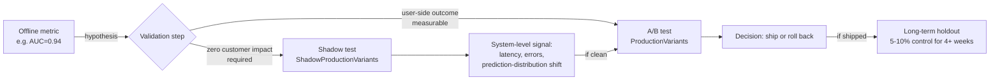
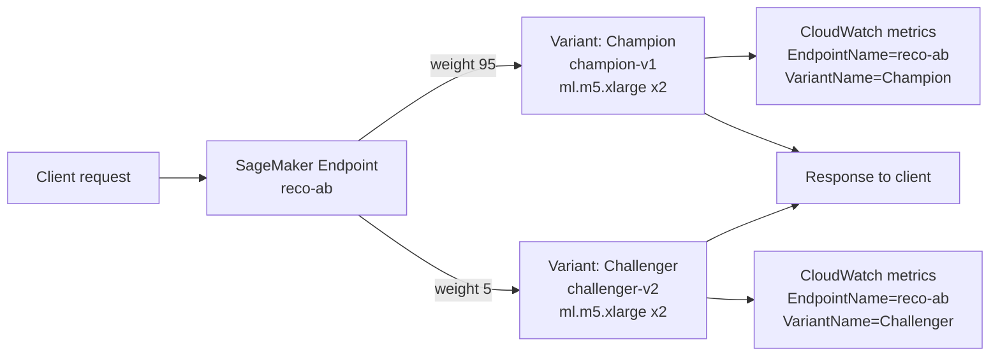
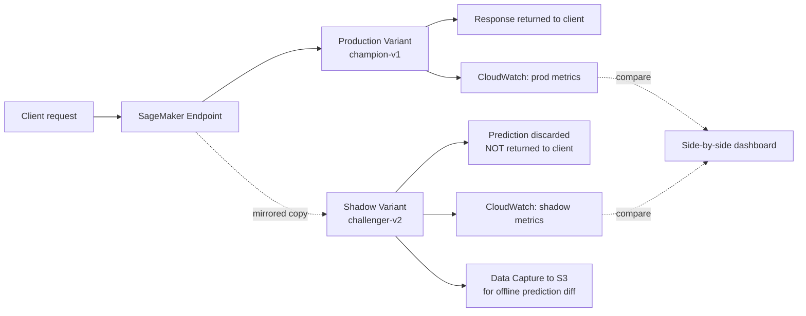
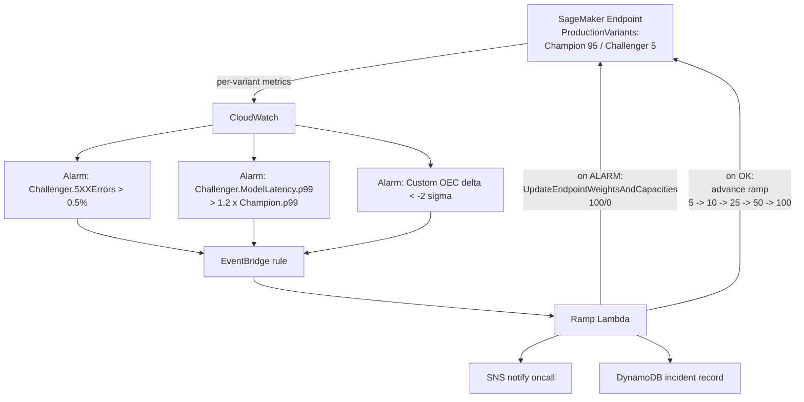

# Chapter 52 — A/B Testing and Shadow Variants in Production

> **Goal of this chapter:** to convert offline ML metrics — AUC, NDCG, perplexity, the comforting decimal on the back of a notebook — from an *answer* into a *hypothesis*, and to teach you the two production primitives that AWS gives you to actually test that hypothesis against the only judge that matters, which is live traffic. By the end of the chapter you should be able to (1) describe the offline/online gap in language a sceptical product manager will accept, (2) draw on a whiteboard the SageMaker `ProductionVariants` and `ShadowProductionVariants` API surface, (3) decide in fifteen seconds whether a given scenario calls for A/B or shadow, (4) write the `n ≈ 16·σ²/MDE²` sample-size formula from memory, (5) name at least five of the ten "we shipped the loser" pathologies, and (6) recognise the single most common exam trap on this material — that `InitialVariantWeight=0.1` is *not* zero customer impact, and the right answer when zero impact is required is *always* a shadow variant.

---

## 52.1 Offline accuracy is a hypothesis. Production traffic is the experiment.

There is a sentence senior ML engineers say to junior ones, usually about six months into the latter's career, that lands harder than any textbook can. It is: **the offline number was the hypothesis; only the online number was the experiment.** Every model you have ever trained, every metric you have ever reported in a sprint demo — AUC of 0.94, NDCG@10 of 0.62, perplexity of 8.3, ROUGE-L of 0.41 — was computed on a frozen snapshot of data that the model has never had the chance to influence. The dataset cannot fight back. It cannot exhibit novelty effects. It cannot expose latency-sensitive users. It cannot manifest the feedback loop where today's recommendation creates tomorrow's training label. Offline evaluation is, in the strict scientific sense, *retrospective*. It tells you the model is consistent with history. It does not tell you whether the model will produce a future that is better than the present.

The discipline of online experimentation is what closes that loop. And the central, awkward, empirical fact every large ML organisation has eventually published is the *offline/online gap*: a model that wins offline by +2pp of AUC routinely produces an online business-metric change anywhere between –1pp and +1pp. The sign of the offline win does not even reliably predict the *sign* of the online effect. Microsoft's ExP team has reported, across thousands of experiments, that roughly **one in three ideas with positive offline metrics is null or negative online**. Netflix has published the same calibration. Booking.com has been the loudest about it: of the thousands of A/B tests they run concurrently, only about 10% are wins, 10% are losses, and 80% are flat or noise. If your team is claiming a 70% win rate, you almost certainly have a methodology problem — and the most likely problem is that you are not actually running an online test, you are projecting an offline metric into production and hoping it lands.

The MLA-C01 exam will not phrase this as philosophy. It will phrase it as a scenario: *"A team has trained a new fraud-detection model that improves recall by 3pp on the holdout. What is the next step before promoting it to production?"* The wrong answers will offer to: deploy it directly to the live endpoint; replace the current model after one more round of offline validation; or wait for the data scientist to add more training data. The right answer is to validate it under live traffic in a controlled, reversible way — which on AWS means a SageMaker production variant (if you can measure a user-side outcome) or a SageMaker shadow variant (if you cannot, or if even a small percentage of users seeing the new model's predictions is unacceptable). The rest of this chapter is the mechanics, the statistics, and the failure modes of those two primitives.

It is worth pausing on *why* the offline/online gap exists, because the reasons are not artifacts of bad data science. They are structural:

1. **Distribution shift** between training data and live traffic. The training set is yesterday; live traffic is today. The two distributions are never identical and the gap widens with every passing day after the snapshot was frozen (Chapter 49 made this point in the context of drift; here we are paying the bill for it).
2. **Self-selection feedback loops**. The recommender that ships will surface different items, which will generate different click data, which will become tomorrow's training labels, which will produce a new model whose offline evaluation runs on a corpus the *current* model created. Offline evaluation is *counterfactually blind* — it cannot reason about the world it has not yet created.
3. **Proxy mismatch**. Offline metrics are model-internal — NDCG, AUC, F1, perplexity. The metric that pays the bills is user-facing — session retention, revenue-per-query, ticket-resolution rate, abandonment. The two are correlated but not identical, and a model can move the proxy without moving the business metric (or, worse, move them in opposite directions, as click-bait recommenders famously do — CTR rises, retention falls).
4. **Latency and reliability shifts**. A model that is "smarter" on paper but adds 200ms to the p99 latency will lose conversions even when its predictions are sharper. The offline benchmark almost never reflects production load profiles.
5. **Novelty effects**. The new model produces *different* recommendations, and a fraction of users will click on them simply because they are different, not because they are better. Two weeks of "win" followed by a slow regression to baseline.

These five failure modes are not solved by training better. They are solved by **letting the model touch live traffic in a controlled experiment** — which is what production variants and shadow variants are *for*.

There is a corollary that follows from the offline/online gap and that the exam can test as a values question: even when the offline win is large — say, +5pp of AUC — the responsible move is still to validate online. A 5pp AUC lift is not permission to skip A/B; it is *more* reason to A/B, because a 5pp offline lift on a model that has truly captured a new pattern in the world will probably show a positive (though smaller) online lift, and you want to *quantify* that lift, not assume it. Conversely, a 5pp offline lift on a model that has merely overfit to the holdout — perhaps because of leakage, perhaps because of an unlucky split — will show a flat or negative online effect, and you want to catch that *before* it reaches users. The size of the offline win does not change the obligation to validate; it only changes your prior about what you will find.

A second corollary is structural and worth saying explicitly: **the size of the validation infrastructure should scale with the cost of the wrong launch**, not with the size of the model. A small change to a recommender ranker that is one of fifty experiments running this quarter does not need a 30-day shadow plus a 30-day A/B. A model change that touches credit decisions for a regulated bank, or a model change that affects fraud blocks on legitimate customers, absolutely does — even if the model itself is smaller and simpler than the recommender. The validation budget is a function of *blast radius*, not *model size*.



---

## 52.2 SageMaker Production Variants — the A/B primitive

A SageMaker real-time endpoint is not a single model; it is a *cluster of models* with weighted traffic routing. Up to **ten production variants** can live behind one endpoint, each variant pointing at its own SageMaker `Model` resource, running on its own choice of instance type, scaling on its own auto-scaling policy. Traffic is split across the variants by an integer or float **weight** field, and the per-variant share is `weight_i / Σ weights`. Two variants at weight 1 each get 50% each; weights `(95, 5)` give the new variant 5%.

This is the AWS-native A/B primitive. It exists at the *endpoint configuration* level — meaning the routing logic is enforced inside SageMaker's invocation path, not by your application code. Your application calls `InvokeEndpoint`, and SageMaker decides which variant gets the request based on the configured weights. Per-variant CloudWatch metrics fall out for free: `Invocations`, `ModelLatency`, `Invocation4XXErrors`, `Invocation5XXErrors`, instance-level `CPUUtilization` / `MemoryUtilization` / `GPUUtilization` — all dimensioned by `EndpointName` *and* `VariantName`. You can compare the new variant's p99 latency against the incumbent's without writing a single line of custom emit code.

Two consequences fall out of this design that are worth pausing on. First, the routing is *sticky by request*, not *sticky by user*. SageMaker hashes the request as it arrives; the same user calling twice in quick succession can land on different variants. For experiments where you need a user's exposure to be consistent — e.g. measuring conversion across a multi-step funnel — you need to enforce stickiness at your application layer (hash `user_id` into a bucket, store the variant assignment in a session cache, pass `TargetVariant` on subsequent calls), not rely on SageMaker's per-request hashing. The exam can test this distinction by asking "does SageMaker's production-variant routing provide sticky-by-user assignment?" — and the correct answer is no, it does not, and you must build stickiness at the application layer if your test requires it.

Second, business-level metrics (conversion, CTR, revenue) are not emitted by SageMaker — only operational metrics are. Your application has to join business outcomes back to the variant assignment using the `(request_id, variant_name)` pair that SageMaker includes in the `InvokeEndpoint` response metadata. The pattern: log `(user_id, request_id, variant_name, prediction)` from your application; in your data warehouse, join those rows against your conversion / click / engagement event tables; compute the OEC and guardrails downstream. CloudWatch gets you operational comparison for free; business comparison is your application's job.

### 52.2.1 The `ProductionVariant` schema

Each entry in the `ProductionVariants[]` array of an `EndpointConfig` carries the fields below. The exam expects you to recognise the first five at sight; the rest are operational nuance.

| Field | Meaning | Default |
|---|---|---|
| `VariantName` | Logical name, e.g. `"Champion"`, `"Challenger"` | — |
| `ModelName` | The SageMaker `Model` resource being hosted | — |
| `InstanceType` | E.g. `ml.m5.xlarge`, `ml.g5.2xlarge` | — |
| `InitialInstanceCount` | Starting instance count behind the variant | — |
| `InitialVariantWeight` | Relative traffic-routing weight | `1.0` |
| `ContainerStartupHealthCheckTimeoutInSeconds` | Cold-start grace window | 600 |
| `VolumeSizeInGB` | EBS storage for the variant's instances | — |
| `ModelDataDownloadTimeoutInSeconds` | Window to download model artefacts | — |

### 52.2.2 Random routing versus targeted routing

There are two ways to invoke a multi-variant endpoint, and the distinction trips up almost every first-time MLA-C01 candidate.

1. **Random routing** — call `InvokeEndpoint` *without* a `TargetVariant` parameter. SageMaker hashes the request (or otherwise distributes it) according to the configured weights. **This is the A/B mode.** Every request lands on one variant, chosen probabilistically.
2. **Targeted routing** — call `InvokeEndpoint` with `TargetVariant="Challenger"`. The request is forced to that variant, regardless of weight. **This is the operations / debugging mode.** A support engineer reproducing a customer's prediction. A canary script confirming the new variant is alive. A side-by-side comparison script that sends the same input to both variants and diffs the outputs.

The crucial point: **targeted invocations do not participate in the A/B random assignment.** They bypass the weighted routing. If your application code is using `TargetVariant` to load-balance, you have built something that *looks* like an A/B test but is not one — there is no random assignment, so the resulting comparison is confounded by whatever logic chose the target. The exam loves this trap, usually phrased as "an engineer used `TargetVariant` to send 50% of traffic to each variant; is this a valid A/B test?" (No, because the choice of target is not random and any caller-side bias contaminates the comparison. Use `InitialVariantWeight` for A/B; reserve `TargetVariant` for ops and debug.)

### 52.2.3 `UpdateEndpointWeightsAndCapacities` — the ramp API

Once an endpoint is `InService` with multiple variants, the only safe way to shift traffic between them is `UpdateEndpointWeightsAndCapacities`. This call changes the weights — and optionally the desired instance count per variant — *without re-creating the endpoint* and *without dropping in-flight requests*. The endpoint transitions to `Updating`, the new weights take effect across the fleet, and it returns to `InService`. You do not need a new `EndpointConfig` for this. You do not need a deploy. You do not need application changes.

```python
sagemaker_client.update_endpoint_weights_and_capacities(
    EndpointName="reco-ab",
    DesiredWeightsAndCapacities=[
        {"VariantName": "Champion",   "DesiredWeight": 50},
        {"VariantName": "Challenger", "DesiredWeight": 50},
    ],
)
```

This is the API you will use for every traffic ramp, every rollback, every auto-controller. Memorise the name. Wrong-answer choices on the exam will offer to "update the endpoint config and re-create the endpoint" or "delete the variant and re-deploy" — both of those are full-deploy operations that drop in-flight requests. `UpdateEndpointWeightsAndCapacities` is the *safe* one.

### 52.2.4 End-to-end A/B deployment with boto3

The canonical pattern. Two models, one endpoint config with two variants, one endpoint, one ramp from 95/5 to 50/50.

```python
import boto3
sm = boto3.client("sagemaker")

# 1. Create two Model resources (one per algorithm version).
sm.create_model(
    ModelName="champion-v1",
    ExecutionRoleArn=role_arn,
    PrimaryContainer={"Image": image_uri_v1, "ModelDataUrl": s3_v1},
)
sm.create_model(
    ModelName="challenger-v2",
    ExecutionRoleArn=role_arn,
    PrimaryContainer={"Image": image_uri_v2, "ModelDataUrl": s3_v2},
)

# 2. One EndpointConfig with two variants at 95/5.
sm.create_endpoint_config(
    EndpointConfigName="ab-config-2026-05-27",
    ProductionVariants=[
        {
            "VariantName": "Champion",
            "ModelName": "champion-v1",
            "InstanceType": "ml.m5.xlarge",
            "InitialInstanceCount": 2,
            "InitialVariantWeight": 95,
        },
        {
            "VariantName": "Challenger",
            "ModelName": "challenger-v2",
            "InstanceType": "ml.m5.xlarge",
            "InitialInstanceCount": 2,
            "InitialVariantWeight": 5,
        },
    ],
)

# 3. Endpoint (or UpdateEndpoint on an existing one).
sm.create_endpoint(
    EndpointName="reco-ab",
    EndpointConfigName="ab-config-2026-05-27",
)

# 4. After 24-48h of guardrail signals look clean, ramp to 50/50.
sm.update_endpoint_weights_and_capacities(
    EndpointName="reco-ab",
    DesiredWeightsAndCapacities=[
        {"VariantName": "Champion",   "DesiredWeight": 50},
        {"VariantName": "Challenger", "DesiredWeight": 50},
    ],
)

# 5. Targeted ops/debug invocation (NOT part of the A/B).
boto3.client("sagemaker-runtime").invoke_endpoint(
    EndpointName="reco-ab",
    TargetVariant="Challenger",   # forces this variant; bypasses weights
    Body=payload,
    ContentType="application/json",
)
```



⚠️ **Exam alert — `InitialVariantWeight=0.1` is NOT zero customer impact.** A weight of `0.1` against another variant's weight of `1.0` routes ~9% of traffic to the new model. A weight of `0` *is* zero traffic, but then the variant is never invoked and you measure nothing. If a scenario requires "validate the new model with zero impact on customers," any answer containing `InitialVariantWeight` is wrong — the right answer is a shadow variant. This is the single most-tested trap on this material.

---

## 52.3 SageMaker Shadow Variants — silent validation

Shadow variants were GA'd at re:Invent 2022, and they exist to plug a hole that production variants cannot: validating a new model with **zero customer-facing impact** while still seeing how it behaves on real, live request traffic. The mechanic is brutally simple.

- The endpoint has one **production variant** (visible to clients) and one **shadow variant** (invisible to clients).
- A configurable percentage of inbound traffic is *mirrored* to the shadow.
- The shadow receives the mirrored request and produces a prediction.
- **The shadow's response is discarded.** Only the production variant's response is returned to the client.
- The shadow's prediction can be logged via SageMaker Data Capture to S3 for offline diffing.
- CloudWatch emits the same per-variant operational metrics (invocations, latency, errors, instance utilisation) for the shadow as it does for the production variant.

That is the entire feature. It is a one-line conceptual change with profound operational implications: you can observe how the new model behaves on production load, on the production data distribution, on the production hardware — without exposing a single customer to its outputs.

### 52.3.1 The EndpointConfig schema

A shadow test is just an `EndpointConfig` with both `ProductionVariants` and `ShadowProductionVariants` populated. The constraints are tight:

- **Max one shadow variant per endpoint.** You cannot shadow two candidates simultaneously.
- **Max one production variant when a shadow is configured.** You cannot run an A/B (two production variants) *and* a shadow at the same time on one endpoint.
- The shadow has its own `InitialInstanceCount`, its own auto-scaling, its own instance type. Size it independently of the production variant.

```python
sm.create_endpoint_config(
    EndpointConfigName="shadow-config-2026-05-27",
    ProductionVariants=[
        {
            "VariantName": "Production",
            "ModelName": "champion-v1",
            "InstanceType": "ml.m5.xlarge",
            "InitialInstanceCount": 2,
            "InitialVariantWeight": 1,
        }
    ],
    ShadowProductionVariants=[
        {
            "VariantName": "Shadow",
            "ModelName": "challenger-v2",
            "InstanceType": "ml.m5.xlarge",
            "InitialInstanceCount": 2,
            "InitialVariantWeight": 1,   # 100% of production traffic mirrored
        }
    ],
)
```

The `InitialVariantWeight` field on the shadow controls the *percentage of production traffic mirrored*, expressed as a ratio against the production variant's weight. With both at 1, all production traffic is mirrored. With production at 1 and shadow at 0.1, 10% of traffic is mirrored.

### 52.3.2 The console-managed shadow test workflow

The SageMaker console exposes a higher-level "shadow test" abstraction that wraps the raw API. You pick a duration (anywhere from 1 hour to 30 days, default 7), the console handles the EndpointConfig wiring, you get a live dashboard with side-by-side metric overlays, and **on completion the endpoint reverts to its pre-test state automatically.** You can promote the shadow into the production variant with one click, or discard it. This is the preferred path for any team that does not need to script shadow rollouts as part of a CI/CD pipeline. The API-level path (raw EndpointConfig) is for the latter case.



### 52.3.3 What shadow tests catch

- **Latency p99 regressions** under live load that synthetic benchmarks missed.
- **Memory or GPU OOM** at sustained QPS that a small-batch offline test never exercised.
- **Container startup or health-check regressions** from a framework upgrade.
- **Prediction-distribution shifts** — "the new model is calling 30% more items 'fraud'" — detectable by diffing logged predictions even without ground-truth labels.
- **Throughput cliffs** from a new tokenizer, a new framework version, or a hardware swap (CPU → Inferentia, x86 → Graviton).

### 52.3.4 What shadow tests cannot catch

- **User response.** Because shadow predictions are never shown, you cannot measure CTR, conversion, dwell time, or any user-side outcome. Only A/B can do that.
- **Feedback loops.** The shadow does not influence what the user sees, so the recommendation-engagement loop is never exercised.
- **Long-horizon outcomes.** Anything that depends on the user reacting to the *new* prediction is invisible to shadow.

### 52.3.5 The cost story and the typical adoption pattern

A common objection to shadow testing — usually from product managers, occasionally from finance — is that it doubles inference cost for the duration of the test. This is true and worth taking seriously, but the math almost always works out in favour of shadowing. AWS does not charge a separate fee for the shadow feature itself; you pay the standard ML instance and storage rates for the shadow fleet. For a `ml.g5.2xlarge` endpoint at roughly $1.50/hour, two weeks of shadow on a single instance is ~$500. For a 10-instance fleet, two weeks is ~$5,000 of incremental spend. Compared to the cost of a regression that affects user trust, that lands a bad model in front of millions of customers, or that requires emergency rollback and incident review, this is one of the cheapest insurance policies in MLOps. The "save $5K by skipping shadow" decision has lost six- and seven-figure amounts at multiple companies; the post-mortems are public.

The typical adoption pattern at a mid-size ML team, drawn from public case studies: a team migrating from XGBoost to a transformer-based ranker would (1) train offline, hit better AUC on the holdout, but be unwilling to flip user-facing traffic on the offline signal alone because the architecture is too different; (2) spin up shadow for 7-14 days at 10-50% traffic mirroring, costing perhaps $1,500-5,000; (3) discover that the new model is 80ms slower at p99 because the tokenizer is doing more work, and that a 3% of users are getting wildly different ranks (top recommendation completely changed). Fix the tokenizer perf, investigate the 3% slice, decide most are legitimate corrections; (4) promote to a real A/B at 5% → 25% → 50% → 100% with auto-ramp gated on latency and business KPIs. The shadow phase catches operational and slice-level issues. The A/B phase catches outcome issues. Skipping shadow and going straight to A/B is the classic too-fast deploy that ends with a post-mortem.

⚠️ **Exam alert — Shadow ≠ A/B.** The shadow variant never returns a response to the client. Any scenario that requires measuring a user-side outcome (click, conversion, engagement) cannot be answered with shadow alone. Conversely, any scenario that requires "zero customer impact" cannot be answered with production variants, no matter how small the weight. The two primitives are not interchangeable; they are complementary.

---

## 52.4 A/B vs Shadow — the decision rule

The single most useful artefact in this chapter, taped to your monitor:

| Question | A/B (Production Variants) | Shadow (ShadowProductionVariants) |
|---|---|---|
| Customers see new-model responses? | Yes (proportional to weight) | **No** |
| Can measure user response (CTR, conversion, retention)? | **Yes** | No |
| Can measure prediction-distribution shift? | Yes | **Yes** |
| Can measure system metrics (latency, errors, GPU util)? | Yes | **Yes** |
| Ground truth required? | Not for outcome-based metrics; user behaviour substitutes | Required for offline accuracy comparison; not for system metrics |
| Number of candidates supported | Up to **10** variants on one endpoint | **1** shadow per endpoint |
| Blast radius of a regression | Proportional to weight | **Zero** to customers |
| Cost | Two-model compute, no traffic duplication | Two-model compute **plus** duplicated inference for mirrored traffic |
| Best for | Recommenders, rankers, ads, search relevance — user response is observable | Fraud, infra/framework upgrades, new LLM swap-ins where prediction-level diff is the goal; delayed-ground-truth cases |

The decision rule in three lines:

1. **You can attribute a user-side outcome** → A/B.
2. **You only care about system metrics or prediction-distribution comparisons, or ground truth is delayed** → Shadow.
3. **Both** → Shadow first to confirm system health, then promote to A/B.

The diagnostic question that resolves most exam scenarios: *"If the new model is 30% slower at p99, who finds out first?"* In an A/B at 5% weight: 5% of users find out, and you find out from CloudWatch a few minutes later. In a shadow: only CloudWatch finds out. **Zero customer impact.** If "5% of users find out" is unacceptable in the scenario, the scenario needed shadow.

### 52.4.1 Worked scenarios

Three scenario walkthroughs that mirror the kind of phrasing the exam uses.

**Scenario A — framework upgrade.** A team is upgrading their inference container from TensorFlow 2.10 to 2.15. The model weights are unchanged; only the runtime is different. The team wants to confirm latency and error rate match before rolling out. → **Shadow.** The model logic is unchanged, so there is no user-side outcome to measure; the question is purely operational (does the new runtime serve identical predictions with comparable latency?). A shadow at 100% traffic mirror for a few days will catch any tail-latency or numerical-precision regression with zero customer impact. There is no reason to expose users to this change via A/B.

**Scenario B — new recommender.** A team has trained a transformer-based recommender that beats the incumbent gradient-boosted ranker by +3pp NDCG offline. The product team wants to know whether CTR moves. → **Shadow then A/B.** Shadow first because a transformer is structurally different from a GBM and is likely to have different latency, memory, and prediction-distribution behaviour — all of which you want to discover *before* user impact. Once shadow confirms the system behaves well, promote to a 5% A/B and measure CTR. The Netflix-style winner's curse defence applies: pre-register the OEC and the duration, and do not peek.

**Scenario C — regulated credit model.** A bank is testing a new credit-default model. Regulatory policy forbids *any* customer impact during validation; even a 1% routing weight is unacceptable until model risk management has signed off. → **Shadow only.** No A/B is permitted at this stage. The shadow lets the team compare the new model's predictions against the incumbent's on real customer applications, with no customer ever receiving the new model's decision. After model-risk sign-off, a small-weight A/B may be permitted; until then, shadow is the only legal option. This is also the canonical "the `InitialVariantWeight=0.1` distractor is wrong" exam pattern.

---

## 52.5 Statistical foundations — what every A/B owner has to know

This is the section the AWS docs do not teach. The exam asks "use A/B testing" but the day job — and any scenario question that talks about statistical significance, sample size, or peeking — requires that you actually understand the design.

### 52.5.1 The hypothesis-test scaffold

- **Null hypothesis H₀**: `E[Y | B] = E[Y | A]` — the new model has no effect on the OEC.
- **Alternative H₁**: `E[Y | B] ≠ E[Y | A]` — two-sided, the standard. (One-sided tests are rare in industry; you almost always want to detect regressions too, not only wins.)
- **Test statistic**: Welch's t-test for continuous OEC, z-test or chi-square for binary conversion, Mann-Whitney for heavily non-normal distributions, CUPED-adjusted t-test when you have pre-period covariates to reduce variance.
- **Decision rule**: reject H₀ if p < α.

### 52.5.2 The two errors

|  | H₀ true | H₀ false |
|---|---|---|
| **Reject H₀** | **Type I (false positive), α** | Correct (true positive) |
| **Fail to reject** | Correct (true negative) | **Type II (false negative), β** |

- **α = 0.05** is the industry convention — 5% chance of shipping a no-op as if it were a win.
- **β = 0.20**, i.e. **power = 1 − β = 0.80**, is the most common operating point — 80% chance of detecting a real effect of MDE size when one exists.
- Higher-stakes tests (medical, financial regulatory, safety-critical) tune both lower; α = 0.01 with power = 0.90 is common in those domains.

### 52.5.3 Minimum Detectable Effect (MDE)

The MDE is the smallest true treatment effect you want to be able to detect with the configured α and power. **It is a product decision, not a statistical one.** A recommender team might say "we only care about a +1% lift in CTR; anything smaller isn't worth the engineering." A fraud team might say "we need to detect a +0.1pp lift in catch rate because that's $5M/year in saved fraud."

Smaller MDE → larger sample → longer test. The relationship is quadratic, and that quadratic is the most useful single intuition in this section: **detecting half the effect requires four times the sample.** A test powered for a +2% lift that you want to re-power for +1% needs four times the duration. This is why teams negotiate MDE before they negotiate test design.

The corollary on the product side: any time the product team says "we want to be able to detect a 0.1% lift," your job as the MLE is to first ask "do you have the traffic to power that test?" If the answer is no — and at typical small-to-mid-scale SaaS metrics it usually is — the right next conversation is whether the MDE can be relaxed, or whether the team should use variance-reduction techniques (CUPED, stratification) to recover the missing power without quadrupling the test duration. CUPED in particular — Controlled-experiments Using Pre-Experiment Data — typically doubles the sensitivity of a test by regressing the metric on a pre-period covariate for the same user and using the residual variance. It is the closest thing to free statistical power that exists.

Airbnb's rule of thumb, published in their data-science blog, is **MDE of 2-5% for most business metrics**; if you cannot power the test for that range, do not run it — redesign. This is a useful default to remember on the exam: a question that frames a 0.1% MDE on a 50K-DAU product is signalling that the test design is unrealistic, and the right answer is to call that out rather than to suggest running a tiny under-powered test that will fail to detect any effect.

### 52.5.4 The sample-size formula — `n ≈ 16·σ²/MDE²`

For comparing two means with equal variance, the per-arm sample size is approximately:

```
n_per_arm ≈ ((z_{1-α/2} + z_{1-β})² · 2 · σ²) / MDE²
```

With the industry-standard α=0.05 and β=0.20, `z_{0.975} ≈ 1.96` and `z_{0.80} ≈ 0.84`. So `(1.96 + 0.84)² = 7.84`, and `7.84 · 2 ≈ 15.7`, giving the back-of-envelope formula every A/B owner has to be able to write on a whiteboard:

```
n_per_arm ≈ 16 · σ² / MDE²
```

For comparing two proportions (conversion rates `p_A` and `p_B`), with `p̄ = (p_A + p_B)/2`:

```
n_per_arm ≈ 2 · (z_{1-α/2} + z_{1-β})² · p̄(1-p̄) / MDE²
```

Worked example. Suppose the current CTR is 5%, you want to detect a +1pp lift (MDE = 0.01, so `p_A = 0.05`, `p_B = 0.06`, `p̄ = 0.055`). Then `n ≈ 2 · 7.84 · 0.055 · 0.945 / 0.0001 ≈ 8,150` per arm. At 50/50 split, that is ~16,300 users total. If your endpoint serves 50,000 users/day, the test reaches power in roughly 8 hours — but you still run it for two weeks to absorb weekday/weekend and seasonality effects.

Now halve the MDE to +0.5pp. Sample-size quadruples to ~32,600 per arm, ~65,000 total, four days at the same QPS. Halve again to +0.25pp: ~261,000 total, two weeks. This is the quadratic biting you.

### 52.5.5 Multiple testing

If you check 20 metrics at α=0.05, you expect **one false positive** in expectation even when the model does nothing. Two corrections are standard:

- **Bonferroni**: divide α by the number of tests `m`. New threshold: α/m per test. Very conservative — loses power as `m` grows. Use as the default when you have a small number (3-5) of primary metrics.
- **Benjamini-Hochberg FDR**: instead of controlling family-wise error rate (the chance of *any* false positive), control the *expected proportion* of false discoveries among rejected nulls. Order p-values `p_(1) ≤ … ≤ p_(m)` and reject all up to the largest `k` with `p_(k) ≤ k·q/m`. Standard `q = 0.1`. Much more powerful than Bonferroni for moderate-to-large `m`. Use when you have many secondary or diagnostic metrics.

In practice, the cleanest pattern is: pick a **single OEC** (see §52.6), set α=0.05 for it, and treat the rest as **descriptive guardrails** — you do not formally hypothesis-test 20 things. Bonferroni and BH-FDR are for when you genuinely cannot collapse to a single decision metric.

### 52.5.6 Peeking — the silent killer

Repeatedly checking a t-test as data accumulates and stopping when p < 0.05 inflates the true Type I rate **dramatically**. The exact figure depends on how often you peek, but a daily peek over two weeks pushes the effective false-positive rate from the nominal 5% to roughly **25%** — five times what you advertised. This is not a small effect. It is the difference between a credible statistical claim and astrology.

Three fixes:

1. **Pre-register the sample size and only look at the end.** The most rigorous; the least operationally useful.
2. **Sequential testing.** Use mSPRT, group-sequential boundaries, or Bayesian methods that maintain valid inference under continuous monitoring.
3. **Always-valid p-values.** Optimizely's Stats Engine, Eppo, and Statsig implement these in their commercial platforms — you can look at the dashboard every hour and stopping is statistically valid.

If you remember nothing else from this section: **a Welch t-test computed daily and stopped on first significance is broken.** This is the single most common statistical bug in production A/B testing, and the exam can test it as a scenario.

⚠️ **Exam alert — peeking inflates Type I error to ~25%.** A team that "checks the p-value every day and stops when it crosses 0.05" is not running a 5% Type I test; they are running a ~25% Type I test, regardless of how clean the dashboard looks. The fix is sequential testing or always-valid p-values, not "just check less often."

---

## 52.6 Metrics — OEC, proxies, guardrails

### 52.6.1 The Overall Evaluation Criterion (OEC)

Coined by Kohavi at Microsoft Bing. **One single decisive metric** that the test is decided on. It must satisfy three properties:

- **Sensitive** — moves enough under reasonable treatments to be measurable in a tractable sample size.
- **Aligned** — moving the OEC actually means the product got better. Click-through rate famously fails this for click-bait — CTR rises while user satisfaction falls.
- **Short-horizon** — measurable within the test window.

Real-world OECs that companies have published:

- Bing: "sessions per user per week".
- Netflix: "retention-weighted hours streamed".
- Amazon retail search: revenue per query (with caveats around novelty).
- LinkedIn feed: "weekly active feed sessions".

The discipline of choosing a single OEC *before the test* is what dodges most of §52.5.5 — you have collapsed the multiple-testing problem to one decision metric.

### 52.6.2 Proxy metrics

Cheaper, faster-converging signals that correlate with the long-horizon business metric. CTR as a proxy for engagement. Time-to-first-meaningful-action as a proxy for funnel completion. Add-to-cart as a proxy for purchase. Proxies are used to *steer* the ramp (early-stage canary alarms); the OEC decides the test.

### 52.6.3 Guardrails — the do-no-harm set

Metrics that **must not regress, even if the OEC wins**. A win on OEC with a guardrail regression is a *rejected* result.

| Guardrail | Typical threshold |
|---|---|
| `ModelLatency.p99` | ≤ 110% of champion |
| Error rate (4XX / 5XX) | No statistically significant increase |
| Cost per inference | ≤ 120% of champion (or per budget) |
| Fairness slice metrics (group-conditional outcome) | No regression on any protected slice |
| PII / privacy leak indicators | Zero |
| Support-ticket rate | ≤ baseline |

Stripe is the canonical example of guardrail discipline: every checkout-flow A/B has a primary (authorization rate, conversion) and a do-no-harm set (chargeback rate, customer-support contacts, downstream churn). A win on the primary that breaks a guardrail does not ship. Many post-mortems read "we shipped a +1% engagement lift that also added 200ms p99 and lost us 0.5% of conversions overall."

### 52.6.4 The end-to-end production playbook

Putting all of §52.5 and §52.6 together, here is what a mature team's ship sequence actually looks like:

1. **Offline candidate.** Train, evaluate on held-out test set, beat baseline on the primary offline metric by a pre-committed MDE. If the offline win is smaller than the MDE, do not proceed — even if p<0.05, the effect is too small to justify the deploy risk.
2. **Shadow deploy** for 7-14 days at 10-50% traffic mirroring. Monitor latency tails, error rate, prediction distribution vs production (KL divergence, large-shift slice detection), cost-per-1k-inferences.
3. **Decision gate after shadow.** If any monitored metric regresses meaningfully, fix or abandon. Do *not* promote to A/B "to gather more signal" — A/B costs you user-facing risk, shadow does not.
4. **A/B at 1-5%** with auto-ramp Lambda gated on guardrail CloudWatch alarms. Pre-register one primary business metric and a do-no-harm set. Pre-commit a duration (≥2 weeks, ideally 4) and *do not peek* for early significance.
5. **Mid-test review.** Halfway through, run a chi-square SRM check — does the actual traffic split match the intended split within tolerance? SRM failures invalidate everything; they usually mean a bug in variant assignment, not the model.
6. **End-of-test analysis.** Effect on primary metric with 95% CI; effect on do-no-harm set (no significant negatives); slice-level effects (devices, geos, user tenure); multiple-testing correction (Bonferroni or BH-FDR) across secondary metrics; novelty-adjusted estimate using a holdout split if the test ran <4 weeks.
7. **Ramp to 100%** via deployment guardrails (linear or canary), CloudWatch-alarm-gated for auto-rollback.
8. **Maintain a 5-10% long-term holdout** for 4+ weeks post-launch to validate persistent effect against the novelty curve.
9. **Archive the experiment** — design, decision, effect estimate, post-mortem in a permanent record. The point of an experimentation platform is *institutional memory*, not individual decisions.

---

## 52.7 Ramp strategies — getting from 0% to 100%

Different ramps trade off statistical power against blast radius. There is no universal best — pick based on the cost of being wrong about a regression.

### 52.7.1 50/50 immediate

Both variants at weight 1 from day one. **Maximum statistical power per unit time** (the sample-size formula in §52.5.4 is minimised at 50/50). **Maximum blast radius** if the challenger is bad — 50% of users immediately affected. Use when blast radius is low, you have already shadow-tested the system, and you trust the offline signal enough to skip operational canarying.

### 52.7.2 Cautious ramp — 95/5 → 90/10 → 50/50

Start at 95/5 for 24-48 hours. Monitor guardrails — latency, errors, instance utilisation. If clean, ramp to 90/10 for another window, then to 50/50 to actually run the A/B. **Statistical analysis only begins at the 50/50 stage** — the earlier stages are operational canaries, not A/B tests. Trying to run a test with 5% of traffic against 95% requires roughly 30× the sample of a 50/50 split for the same power, because variance is dominated by the small arm. This is the default for most ML rollouts where blast radius is moderate.

### 52.7.3 Auto-ramp via Lambda + CloudWatch

A common pattern for high-cadence teams. CloudWatch alarms on per-variant guardrails fire EventBridge rules that invoke a Lambda, which calls `UpdateEndpointWeightsAndCapacities` to either advance the ramp (alarm `OK`) or roll back (alarm `ALARM`). See §52.9 for the full architecture.

### 52.7.4 The 99/1 long-tail canary

Some teams keep the challenger at 1% indefinitely as a **drift-detection arm**: if the new model and old model diverge in business metrics weeks later, that is a data-shift early warning. Cost: an extra always-on variant. Benefit: continuous comparison without the risk of full traffic.

### 52.7.5 The unequal-split tax

A subtle but important point on ramp design: the sample-size formula in §52.5.4 assumes a 50/50 split. Unequal splits are *more expensive in total traffic* for the same statistical power. The general formula for a `p`-vs-`(1-p)` split needs total sample multiplied by `1/(4·p·(1-p))`. At 50/50, the multiplier is 1.0. At 90/10, it is `1/(4·0.9·0.1) = 2.78` — you need 2.78× the total sample to power the test compared to 50/50. At 95/5, it is 5.26×. At 99/1, it is 25.25×.

The operational implication: **a 95/5 ramp is not a 5%-power test**, it is a "20%-of-50/50-power" test. If a 50/50 test would reach significance in two weeks, the same effect at 95/5 takes roughly ten weeks. The 95/5 stage is therefore an *operational canary*, not a statistical experiment. The statistical comparison only begins when you ramp to 50/50 (or close to it). The exam can frame this as "team ran a 95/5 A/B for two weeks and saw p=0.18; can they conclude the new model is no better?" — and the right answer is "no, the test was massively underpowered at that split; either ramp to 50/50 or run for ~5× longer at 95/5 before drawing any conclusion."

---

## 52.8 Production stories at scale

### 52.8.1 Netflix — A/B testing as infrastructure

Netflix runs **thousands of concurrent A/B tests** across recommendation ranking, artwork selection, autoplay logic, trailer selection, and (in some regions) pricing. Their experimentation platform is treated as core infrastructure. Key practices, drawn from their public engineering blog:

- **Bayesian sequential testing** — analysts can stop early when posterior probability of "winner" crosses a threshold, without inflating false-positive rate the way naive p-value peeking would.
- **Holdout cells** — a permanent control population that never sees *any* treatment, used to measure the *long-run cumulative* impact of all shipped tests. The ratio of "sum of measured short-term lifts" to "holdout-measured long-term lift" is typically well below 1.0 — i.e. real shipped impact is consistently less than the sum of individually reported wins.
- **Winner's curse mitigation by data splitting** — when you pick the winner using 100% of the experiment's data, the estimated effect is biased upward (you selected on noise). Netflix splits — e.g. 90% of the data to *select* the winner, 10% holdout to get an *unbiased* magnitude estimate.
- **Interleaving for ranking** — instead of partitioning users between ranker A and ranker B, show a *blended* result list combining both rankers, then measure which ranker's items get clicked. Airbnb has reported ~50× speedup over A/B, and up to **100× speedup** when combined with counterfactual evaluation. This matters because at search-ranking scale you have hundreds of ranker variants per quarter and not enough traffic to A/B all of them.

### 52.8.2 Microsoft ExP — the 1-in-3 null-online rate

Kohavi's team at Bing established many of the field's conventions: OEC, peeking penalties, variance reduction via CUPED, the discipline of pre-registering metrics. ExP runs ~100+ concurrent experiments and reports that **roughly one in three ideas with positive offline metrics is null or negative online** — direct empirical evidence for the offline/online gap that §52.1 opened with. If you train ten models that all win offline, expect three to four of them to be flat or worse in production.

### 52.8.3 Commercial experimentation platforms

For teams that do not want to build Netflix's stats engine themselves, the 2026 vendor landscape:

- **Eppo** — warehouse-native, sits on top of Snowflake / Databricks / BigQuery, computes metrics where the data already lives. Strong for organisations with mature data infrastructure. Enterprise pricing.
- **Optimizely** — the longest-running player; Stats Engine implements always-valid p-values. Originally web-experimentation, now repositioned as a marketing suite.
- **Statsig** — purpose-built for product experimentation. CUPED, CURE, stratified sampling, switchback tests; both SaaS and warehouse-native. (Amplitude acquired the Statsig brand in 2026 after OpenAI's earlier acquisition of the engineering team, so roadmap is in flux as of this writing.)
- **GrowthBook** — the open-source choice for teams who do not want a vendor.
- **Amazon CloudWatch Evidently** — AWS's feature-flag experimentation product, now in maintenance mode (verify current status before recommending on the exam).

The build-vs-buy answer most ML teams land on: use SageMaker for the *model-level* mechanics (production variants, shadow variants, deployment guardrails), and layer a product-experimentation platform on top for *business-metric* A/B testing. The two operate at different layers and do not compete.

### 52.8.4 Airbnb, Pinterest, Stripe, Booking — the rest of the calibration set

A few more public reference points worth carrying in your head, because the exam loves "industry best practice" framings.

- **Airbnb** is the textbook source for the peeking pathology. Their data-science blog has been explicit that p-values are not a valid stopping criterion, and they bake this into onboarding. Their public defenses: MDE of 2-5% as standard, minimum two-week test duration to absorb seasonality, never trust p<0.05 alone — combine effect size, CI width, and pre-registered hypotheses. Airbnb is also the loudest about *interleaving* for search ranking (§52.8.1).
- **Pinterest** publishes heavily on CUPED-style variance reduction. They have reported that CUPED roughly doubles the sensitivity of typical ranking experiments — you get the same statistical power with about half the traffic, or twice the precision in the same window. For an ML practitioner, CUPED is essentially "use the pre-period as a covariate in a difference-in-differences regression"; the residual variance is smaller, so smaller effects reach significance with the same sample.
- **Stripe** runs unusually long, conservative conversion-funnel A/B tests because each percentage point of authorisation-rate lift is millions of dollars of absolute revenue. Their discipline is the "do-no-harm set" — chargeback rate, customer-support contacts, downstream churn — pre-registered as guardrails that override the primary metric if they regress.
- **Booking.com** is the loudest about *scale* — thousands of concurrent A/B tests, every visible page element experimented on. Their stated philosophy is that interaction effects are usually a feature, not a bug — by running tests in parallel without layered isolation, they observe how features combine in the wild. The single most important calibration number they publish is **the 10/10/80 split**: about 10% of tests are wins, 10% are losses, 80% are flat or noise. If your team is claiming a 70% win rate, you almost certainly have a methodology problem.

The common thread across all four: experimentation is a *product capability*, not a side project. Dedicated platform teams, internal training, SRE-style culture around metric reliability. And — crucially — they all publish their internal calibration data, so that everyone in the org has realistic priors about what to expect from their next test.

---

## 52.9 Auto-rollback architecture

The pattern that ties this chapter together: CloudWatch alarms gate a Lambda that adjusts variant weights on the SageMaker endpoint. Symmetric on the way up (advance the ramp when alarms are `OK`) and on the way down (snap to 100% champion when alarms fire).



A minimal ramp Lambda, roughly forty lines, that handles both directions:

```python
import boto3, os
sm = boto3.client("sagemaker")
cw = boto3.client("cloudwatch")

ENDPOINT = os.environ["ENDPOINT_NAME"]
CANDIDATE = "Challenger"
PRODUCTION = "Champion"
RAMP_SCHEDULE = [1, 5, 10, 25, 50, 100]  # percent of traffic to candidate

def get_current_weight(variant):
    desc = sm.describe_endpoint(EndpointName=ENDPOINT)
    for v in desc["ProductionVariants"]:
        if v["VariantName"] == variant:
            return v["CurrentWeight"]
    return 0

def alarms_green():
    alarm = cw.describe_alarms(AlarmNames=["candidate-health"])["MetricAlarms"][0]
    return alarm["StateValue"] == "OK"

def next_weight(current_pct):
    for step in RAMP_SCHEDULE:
        if step > current_pct:
            return step
    return current_pct

def lambda_handler(event, ctx):
    if not alarms_green():
        sm.update_endpoint_weights_and_capacities(
            EndpointName=ENDPOINT,
            DesiredWeightsAndCapacities=[
                {"VariantName": CANDIDATE,  "DesiredWeight": 0},
                {"VariantName": PRODUCTION, "DesiredWeight": 100},
            ],
        )
        return {"status": "rolled_back"}

    cand_pct = get_current_weight(CANDIDATE)
    new_pct  = next_weight(cand_pct)
    if new_pct == cand_pct:
        return {"status": "fully_ramped"}

    sm.update_endpoint_weights_and_capacities(
        EndpointName=ENDPOINT,
        DesiredWeightsAndCapacities=[
            {"VariantName": CANDIDATE,  "DesiredWeight": new_pct},
            {"VariantName": PRODUCTION, "DesiredWeight": 100 - new_pct},
        ],
    )
    return {"status": "ramped", "from": cand_pct, "to": new_pct}
```

Schedule this via EventBridge — every hour for slow ramps, every five minutes for fast ones — and point a CloudWatch composite alarm at the candidate's metrics. The hard parts are *not* the code; they are: defining the right composite alarm, picking a ramp cadence (too fast → not enough samples per step; too slow → bug burns customers for days), and knowing when to halt for human review.

For shadow tests, the equivalent auto-rollback is "alarm fires → cancel the managed shadow test → endpoint reverts to pre-test config" — which the console workflow does automatically on test completion.

This is also the surface where Chapter 49 (drift triggers retraining) hands off to Chapter 52: when drift monitoring fires, the retraining pipeline produces a new model artefact, and *that* artefact is deployed as a new variant on this same endpoint — first as shadow, then as low-weight production, then ramped through this controller.

---

## 52.10 The "we shipped the loser" pathologies

A taxonomy of how A/B tests lie. Every one of these has shipped a regression at a top-tier company. Memorise the names; the exam can test any of them.

1. **Multiple testing without correction.** Twenty metrics × α=0.05 ≈ one false positive guaranteed. Mitigate: single OEC + descriptive guardrails, or FDR correction on the whole panel (§52.5.5).
2. **Peeking.** Daily significance checks with a naive t-test inflate Type I from 5% to ~25% over two weeks (§52.5.6).
3. **Novelty effect.** Users click the new thing because it is new, not because it is better. Two weeks of "win", then regression to mean. Mitigate: minimum two-week test, segment by user tenure, look at "established users only" cells, maintain a long-term holdout.
4. **Primacy effect.** The opposite — power users dislike the new model the first week because they had muscle memory for the old recommendations. Mitigate: same as novelty.
5. **Sample-ratio mismatch (SRM).** The 50/50 split actually delivered 51.3 / 48.7. **A strong sign of an instrumentation bug** — variant-assignment leakage, cache poisoning, asymmetric error handling. Run a chi-square on observed vs expected counts every test; significant SRM means **discard the test result entirely** until the bug is fixed.
6. **Simpson's paradox.** Aggregate metric favours B. Sliced by mobile/desktop, both slices favour A. The aggregate is misleading because of a population-mix shift between variants. Mitigate: pre-register the slicing dimensions you will examine.
7. **SUTVA violation (network effects).** The Stable Unit Treatment Value Assumption requires that one user's treatment does not affect another user's outcome. Marketplace and social products break this constantly — variant B sellers get more visibility, which depresses variant A sellers' sales, which biases the comparison. Mitigate: cluster-randomise (by city, by social cluster), or use switchback designs.
8. **Underpowered test stopped at "no effect."** A test with 20% power that returns p > 0.05 does not mean "no effect" — it means "we would not have noticed even a meaningful effect 80% of the time." Always report the **confidence interval**, not just the p-value.
9. **Cherry-picked segment.** "It won on logged-in iOS users in the EU" — found post-hoc. The garden of forking paths. If you did not pre-register the segment, the result is hypothesis-generating, not confirmatory.
10. **Shipping on offline metrics without an A/B.** The first and final pathology — skip the online test because the offline numbers were "great." Microsoft's 1-in-3 null-online rate is the empirical refutation.

A useful exercise when designing a test: walk through these ten pathologies as a checklist *before* the test starts, and for each one write down what your test design does to defend against it. If the answer to any item is "nothing," consider whether the test needs a different design. This is the same principle as writing a runbook before the on-call shift — the time to think about how the test can lie to you is *before* the data starts arriving, not after you have already squinted at it for a week and convinced yourself the win is real.

There is an eleventh pathology that does not have an industry name but is the most common one in entry-level ML teams: **launching without a pre-registered analysis plan**. The team decides, mid-test, which metric they will declare as primary, which segments they will report on, and which direction of effect they will tolerate. The garden of forking paths becomes the entire garden. The fix is one document, written before the test starts, that pins down: primary metric (one), guardrails (small set), MDE and power, duration, ramp schedule, decision rule, who has authority to halt. Eppo, Statsig, and Optimizely all enforce this by making it a first-class object in their platform; on AWS you write the document yourself and check it into git alongside the EndpointConfig.

⚠️ **Exam alert — SUTVA violation invalidates A/B.** Any scenario where one user's experience can influence another user's outcome (marketplace pricing, social feeds, shared resources like inventory) violates the SUTVA assumption that underlies standard A/B testing. Cluster-randomisation or switchback designs are the right answer, not a vanilla 50/50 user-level split. If you see "two-sided marketplace" or "social network feature," default to questioning whether vanilla A/B is even valid.

---

## 52.11 A/B vs Multi-Armed Bandits

A/B is pure exploration for a fixed duration, then 100% exploitation of the winner. A multi-armed bandit (MAB) is continuous exploration plus exploitation — allocate more traffic to the leader, but always reserve some traffic for the others in case the leader degrades or context shifts.

**Where MAB beats A/B:**

- **Time-sensitive optimisation with a clear single metric.** Email subject lines, news headlines, ad creative, push notification copy. You do not need a clean causal estimate — you need to push more traffic to the winner *now*, and you will throw the experiment away in days regardless.
- **Many variants, small individual sample budget.** Testing twenty ad creatives with traffic only enough for two A/B-class experiments — bandits triage continuously.
- **Drift / non-stationarity.** Bandits adapt to a shifting environment; A/B assumes a stationary world during the test.
- **Personalisation (contextual bandits).** When the right choice depends on user features, contextual MAB is the natural fit. A/B cannot natively express "this variant wins for users like X but not Y."

**Where A/B beats MAB:**

- **You need a clean causal estimate.** Bandits' adaptive allocation makes the resulting effect estimate harder to interpret because traffic share is correlated with metric value.
- **High-stakes one-time decisions.** Pricing changes, terms-of-service language, anything you cannot undo cheaply.
- **Regulatory or auditability requirements.** A pre-registered A/B with a fixed analysis plan is much easier to defend than a bandit's adaptive history.

Default algorithm choices in production: **Thompson Sampling** (Bayesian, the default), **UCB** (when computational cost matters or you want deterministic behaviour), **epsilon-greedy** (simple baseline). Amazon Personalize's `aws-personalize-user-personalization` recipe is a managed contextual-bandit algorithm; Yahoo News and MSN Feed use contextual bandits for article ranking; Stripe checkout uses A/B because the decisions are high-stakes and need auditability; Booking.com explicitly does *not* use bandits at the search-ranking layer because they need clean per-experiment causal estimates.

---

## 52.12 GenAI A/B — the new hard problem

Comparing two LLM responses is fundamentally harder than comparing two CTRs. The output is unstructured, quality is multi-dimensional (factuality, helpfulness, tone, safety, latency, cost), and there is no single click-through metric.

The emerging stack:

1. **Offline LLM-as-judge.** A frontier model scores both responses against a rubric. Cheap (500-5000× cheaper than human eval), fast, consistent — but biased: position bias (preferring the first response), length bias (preferring longer outputs), self-preference (Claude-class judges prefer Claude-class responses). Mitigations: randomise position, instruct against length bias, use a different model family as judge than the candidates.
2. **Human eval on a sampled subset.** Calibrate the LLM judge against human labels on a representative sample (a few hundred to a few thousand examples). If agreement is high, trust the judge for the larger sweep. If not, refine the rubric. Recent research (mid-2025 medRxiv) finds even the strongest LLM judges achieve human-equivalent agreement on only ~4 of 11 typical eval criteria — so LLM-as-judge is necessary but not sufficient.
3. **Production shadow with implicit feedback capture.** Once a candidate passes offline eval, route a small percentage of live traffic to it (or shadow it first). Capture implicit signals — thumbs up/down, copy-to-clipboard, follow-up question rate, conversation abandonment, retry rate. These are the real product signals.
4. **Continuous monitoring.** Production traffic does not look like your eval set. Users find adversarial inputs, edge cases, and usage patterns you did not anticipate. LLM-as-judge running on a sample of *live* traffic catches degradations that offline eval misses.

A realistic GenAI deploy sequence: offline eval (LLM-judge + targeted human) → red-team safety gate → shadow on SageMaker (latency, error, cost gates) → small-% A/B with implicit-signal capture → ramped rollout via Lambda + CloudWatch → long-term holdout for novelty detection. Amazon Bedrock Evaluations covers the offline-eval part; SageMaker shadow variants cover the inference-system part; the implicit-signal A/B is built on top of production variants.

There is a structural difference between classical ML A/B and GenAI A/B that is worth naming. Classical ML A/B compares two *scores* on a fixed schema — both the champion and the challenger produce, say, a fraud probability in [0, 1] for the same input. The comparison is mathematically clean: same input, two scores, did one make better decisions? GenAI A/B compares two *trajectories of tokens* on an open-ended task. There is no single canonical "right answer" for most prompts, and the quality criteria are multi-dimensional. This is why GenAI A/B leans heavily on (a) LLM-as-judge to convert open-ended outputs into pairwise comparisons, (b) implicit user behaviour (thumbs, copy, retry) as the closest thing to a click-through metric, and (c) curated red-team test sets as gating checks before any user traffic is involved. The principle from §52.1 still holds — offline is a hypothesis, online is the experiment — but the *mechanics* of the experiment look more like a research evaluation than a ranker A/B. Expect this gap to close over the next two years as the tooling matures; expect the exam to test the *current* state, in which shadow + LLM-as-judge + small-% A/B with implicit signals is the consensus pipeline.

---

## 52.13 Exam-grade recap

Seven rules that the MLA-C01 has tested or can test on this material.

1. **A/B on one endpoint** = **production variants** with `InitialVariantWeight`, ramped via **`UpdateEndpointWeightsAndCapacities`**. Up to 10 variants per endpoint.
2. **Silent validation** = **shadow variants** (`ShadowProductionVariants`). Responses discarded. Max 1 shadow variant and max 1 production variant when shadow is configured.
3. **The wrong-answer trap**: a scenario that requires *zero customer impact* will offer "`InitialVariantWeight=0.1`" as a distractor. That still routes ~9% of customers to the new model. The right answer is **always** shadow.
4. CloudWatch metrics are dimensioned by `VariantName`, so per-variant latency / error / utilisation comparison is automatic.
5. `TargetVariant` on `InvokeEndpoint` **overrides** the weighted routing — operations / debugging only, not A/B. Using `TargetVariant` for traffic splitting is not a valid A/B.
6. Statistical literacy is fair game: peeking inflates Type I, OEC is a single decision metric, MDE is a product call, multiple-testing requires Bonferroni or BH-FDR, SRM failure invalidates the test, SUTVA violation invalidates user-level A/B in marketplace / social settings.
7. `UpdateEndpointWeightsAndCapacities` is the safe, no-redeploy traffic-shift call. Re-creating the endpoint config and redeploying is the wrong answer when the goal is to change weights only.

---

## 52.14 Exercises

1. **Schema recall.** Without looking back, write the four required fields of a `ProductionVariant` entry in `EndpointConfig`. Then write the schema-level constraint that distinguishes a shadow-test EndpointConfig from a vanilla one.

2. **Decision rule.** Classify each scenario as A/B, shadow, or "both, in this order":
   (a) Migrating the inference container from TensorFlow 2.10 to 2.15 with no model change.
   (b) Replacing a gradient-boosted ranker with a transformer-based ranker; CTR is observable.
   (c) Replacing a fraud-detection model where ground-truth labels arrive 30 days late; even a 1% increase in false positives blocks legitimate customers.
   (d) Comparing two LLM prompts for a customer-support chatbot; user thumbs-up/down are captured.
   (e) Promoting a new recommender that scored +3pp NDCG offline, in an organisation with no prior shadow infrastructure.

3. **Sample-size arithmetic.** Current conversion rate is 4%. You want to detect a +0.5pp lift (so `p_A = 0.04`, `p_B = 0.045`). Compute `n_per_arm` using the proportion formula in §52.5.4. At 100,000 visitors/day with a 50/50 split, how many days does the test require to reach power? Then halve the MDE to +0.25pp and recompute. By what factor did the test duration grow?

4. **The peeking pathology.** A team runs a two-week A/B with daily significance checks and stops the test on day six because p just crossed 0.048. Write a paragraph for the team's lead explaining (i) why this is not a valid α=0.05 result, (ii) what the effective Type I rate likely is, and (iii) two concrete fixes that allow continuous monitoring.

5. **Auto-rollback design.** Sketch the CloudWatch alarms (composite or individual) that you would attach to a 95/5 production-variant deployment for an image-classification model behind a `ml.g5.2xlarge` endpoint. Include thresholds for 5XX rate, p99 latency, and at least one model-quality proxy. Then write pseudocode for the Lambda branch that handles the `ALARM` state.

6. **Pathology identification.** A team reports a +6% engagement lift in week 1 and ships. By week 4 the metric is flat. Name the most likely pathology and the two design changes (one in test duration, one in post-launch monitoring) that would have caught it pre-ship.

7. **The exam-trap drill.** A scenario reads: *"A bank is testing a new credit-default model. Regulatory requirements forbid any customer impact during validation. The team plans to deploy the new model as a production variant with `InitialVariantWeight=0.05`. Is this approach correct?"* Write the correct answer in three sentences: what the team should do instead, what AWS primitive they should use, and what the specific schema-level constraint is on that primitive.

---

## 52.15 Cross-links

- **Back to Chapter 36 — Production variants and endpoint configuration.** The lower-level mechanics of `EndpointConfig`, `Endpoint`, and `UpdateEndpointWeightsAndCapacities` are introduced there; this chapter is the A/B and shadow application of those primitives.
- **Back to Chapter 40 — Deployment strategies.** Blue/Green, Canary, and Linear deployment guardrails are the AWS-managed analogue of the manual ramps in §52.7; the build-it-yourself Lambda controller in §52.9 is the un-managed analogue. The two are composable — a canary deployment can host an A/B inside it.
- **Back to Chapter 49 — Drift triggers retraining.** When Model Monitor's drift detector fires and SageMaker Pipelines kicks off a retrain, the output of that retrain is a new model artefact. *This* chapter is what you do with that artefact next — register it, attach it to a new variant, shadow first, then A/B, then ramp.
- **Forward to Chapter 64 — Capstone integration.** The capstone weaves all of these together: a real endpoint behind deployment guardrails, with a shadow variant for the next candidate, an auto-ramp Lambda gated on CloudWatch alarms, and a long-term holdout cohort to catch novelty effects post-ship.

---

## 52.16 What to take into the exam from this chapter

A condensed packing list, the kind you would tape inside the cover of your notes the night before the test:

- Two primitives, two purposes. **Production variants** = A/B (`ProductionVariants[]`, `InitialVariantWeight`, up to 10, customer-visible). **Shadow variants** = silent validation (`ShadowProductionVariants[]`, max 1, customer-invisible, response discarded). Knowing which one a scenario calls for is the most-tested concept on this material.
- The traffic-shift API is **`UpdateEndpointWeightsAndCapacities`**. It is the *only* way to change weights without redeploying the endpoint. Any answer involving "delete and re-create" is wrong when the goal is to ramp.
- `TargetVariant` on `InvokeEndpoint` is for ops and debug only. It bypasses the weighted routing. Do not use it for A/B traffic splitting.
- "Zero customer impact" = shadow. **No exceptions.** `InitialVariantWeight=0.1` still routes ~9% of users.
- Statistical literacy: OEC + guardrails + MDE + power + Bonferroni-or-BH-FDR. Peeking inflates Type I to ~25%. SRM failure invalidates the test. SUTVA violation invalidates user-level A/B for marketplace and social products.
- Per-variant CloudWatch metrics are dimensioned by `VariantName`. Latency, errors, instance utilisation are free; business metrics are your application's job to join back.
- Auto-rollback architecture = CloudWatch alarm → EventBridge → Lambda → `UpdateEndpointWeightsAndCapacities`. SageMaker Deployment Guardrails are the AWS-managed equivalent for blue/green and canary deploys.

---

*End of Chapter 52. The next chapter (Ch 53) picks up the operational side that this one only sketched — Model Monitor's data-quality, model-quality, bias-drift, and feature-attribution monitors, and the CloudWatch alarms that close the loop between drift detection and the retrain → shadow → A/B sequence laid out here.*
