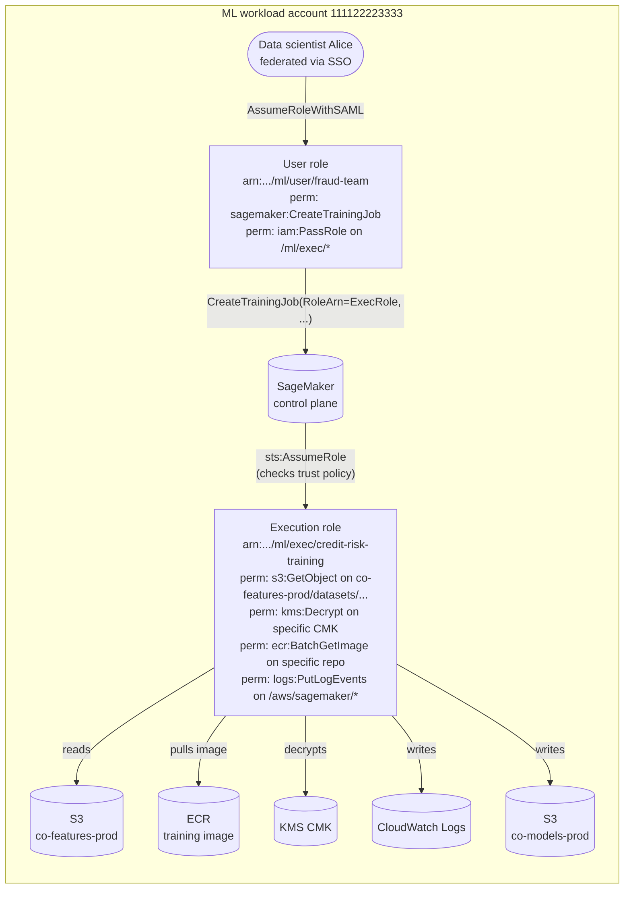
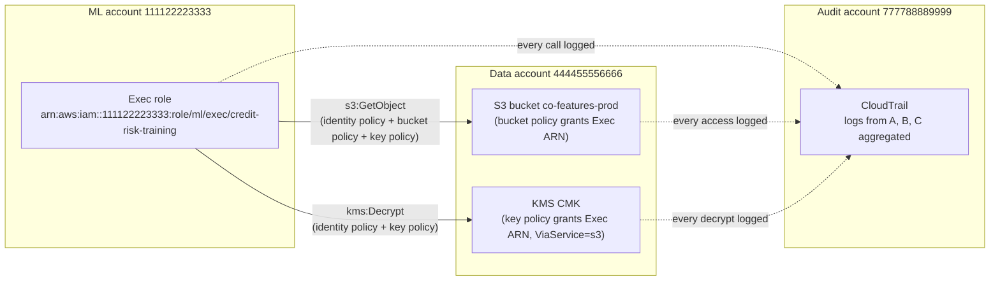
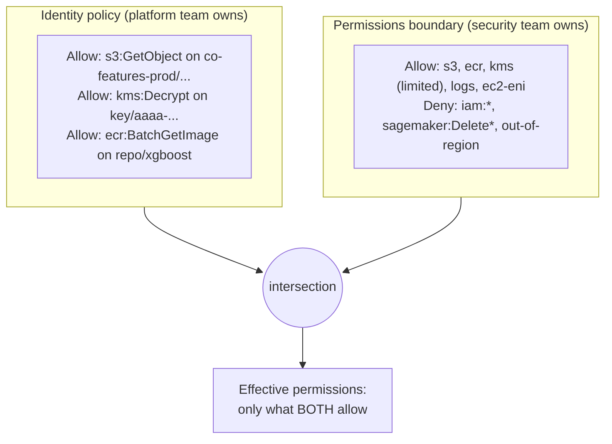

# Chapter 53 — The Least-Privilege ML Execution Role

> **Goal of this chapter:** to teach you how to actually *build, ship, and operate* a production-grade SageMaker execution role — not the one in the AWS quick-start, but the one that survives a SR 11-7 review, a HIPAA audit, an EU AI Act technical-documentation request, and a Friday-afternoon AccessDenied page from a data scientist who only wants their training job to start. Chapter 5 taught the IAM mental model — policy types, the seven-step evaluation algorithm, the `iam:PassRole` trap. This chapter is what happens *after* the mental model has to ship. By the end you should be able to: (a) draw the two-role pattern without confusing caller and callee, (b) write a least-privilege execution role policy by hand and explain every Sid, (c) attach a permissions boundary the central security team controls and you do not, (d) wire tag-based ABAC and SCPs so that "fifty teams, one platform" works, (e) debug `AccessDenied` from CloudTrail in under five minutes, (f) hand an auditor a one-page evidence table and watch them tick boxes, and (g) answer the Task 4.3 MLA-C01 questions without re-reading the policy four times.
>
> The role you ship is the role auditors read. They do not read your slide deck, your `README`, or your verbal assurance that "we use least privilege." They read the JSON in IAM, the boundary, the SCP, and the CloudTrail of who assumed the role last quarter. If those four artifacts disagree, you have a finding. This chapter is about making them agree.

---

## 53.1 Why this chapter exists separately from Chapter 5

Chapter 5 is the IAM theory you need to pass the exam blueprint's Task 4.3 questions in isolation: `iam:PassRole` is a same-account check, `AmazonSageMakerFullAccess` is a starter and not a destination, the execution role is *called by* SageMaker and therefore must never grant `sagemaker:*` to itself, KMS key policies are a separate gate from IAM identity policies, and explicit-deny beats explicit-allow beats implicit-deny in every evaluation. If you cannot name the five policy types in order from memory, go back to Chapter 5 first.

This chapter assumes all of that and walks into the room where a real security review takes place. In banking, healthcare, federal, and any FedRAMP, SOC 2, HITRUST, or PCI-DSS environment, "we attached `AmazonSageMakerFullAccess`" is a finding, not a starting point. The audit question is concrete and the auditor will ask it six times in six different ways: *show me the role; show me the policy; show me the boundary; show me the SCP; show me the Access Analyzer evidence that no permission is unused; show me the CloudTrail log proving no one bypassed it.* That is six artifacts, not one, and a working ML engineer is expected to produce all six within minutes, not days.

Roughly half of MLA-C01 Task 4.3 questions are written against this world. They will hand you a scenario — *"a data scientist gets `AccessDenied` on a training job; here is the CloudTrail event; what is the fix?"* — and offer four plausible-sounding answers. Three of them break the least-privilege posture in some specific way the question is written to detect; the fourth tightens scope. The right answer almost always tightens.

---

## 53.2 The two-role pattern — the single most important model

The mental model that resolves 70% of production SageMaker IAM confusion is this: **there are always two roles, and they live on opposite sides of the SageMaker control plane.** If you internalize nothing else from this chapter, internalize this.

| Role | Who/what assumes it | What it does | Where it lives in your account |
|------|---------------------|--------------|--------------------------------|
| **User role** (a.k.a. "caller role," "data scientist role," "Studio user profile role") | The human (or CI/CD pipeline) who calls SageMaker APIs | Calls `CreateTrainingJob`, `CreateModel`, `CreateEndpoint`; passes a role ARN as `RoleArn=`; reads job results | Federated via IAM Identity Center / Okta SAML, or assumed via STS from a CI runner |
| **Execution role** (a.k.a. "service role," "runtime role," "SageMaker role") | SageMaker itself, on your behalf | Runs inside the training container, processing container, or endpoint; reads training data from S3, writes artifacts, pulls images from ECR, calls KMS to decrypt, writes logs, attaches ENIs in VPC mode | An IAM role with a trust policy that names `sagemaker.amazonaws.com` |

Mixing them is the most common production mistake and the most common exam distractor. The cleanest disambiguator: **the user role *creates* the job; the execution role *runs* the job.** Anything to do with creating, describing, listing, stopping, or updating SageMaker resources belongs on the user role. Anything to do with reading data, writing artifacts, pulling images, or decrypting ciphertext from inside the container belongs on the execution role.



### 53.2.1 What the user role needs

The user role (often the Studio domain user-profile role or the data-scientist SSO role) needs the *control-plane* SageMaker permissions: `sagemaker:CreateTrainingJob`, `DescribeTrainingJob`, `CreateModel`, `InvokeEndpoint`, plus `iam:PassRole` on the *execution role's* ARN. It almost never needs S3 read on the training-data prefix — the *execution role* does the actual S3 read inside the container. If the data scientist also opens the same files locally in Studio for exploration, that is a separate narrower S3 grant on an "exploration prefix," not a reason to merge the roles.

A tight user-role policy is short and looks like this:

```json
{
  "Version": "2012-10-17",
  "Statement": [
    {
      "Sid": "SageMakerControlPlane",
      "Effect": "Allow",
      "Action": [
        "sagemaker:CreateTrainingJob", "sagemaker:DescribeTrainingJob",
        "sagemaker:StopTrainingJob", "sagemaker:ListTrainingJobs",
        "sagemaker:CreateProcessingJob", "sagemaker:DescribeProcessingJob",
        "sagemaker:CreateModel", "sagemaker:DescribeModel",
        "sagemaker:CreateEndpointConfig", "sagemaker:CreateEndpoint",
        "sagemaker:UpdateEndpoint", "sagemaker:InvokeEndpoint",
        "sagemaker:DescribeEndpoint", "sagemaker:ListEndpoints"
      ],
      "Resource": "*",
      "Condition": {
        "StringEquals": { "aws:ResourceTag/Project": "${aws:PrincipalTag/Project}" }
      }
    },
    {
      "Sid": "PassExecRoleToSageMakerOnly",
      "Effect": "Allow",
      "Action": "iam:PassRole",
      "Resource": "arn:aws:iam::111122223333:role/ml/exec/*",
      "Condition": {
        "StringEquals": { "iam:PassedToService": "sagemaker.amazonaws.com" }
      }
    }
  ]
}
```

Three things to notice. (1) `iam:PassRole` is scoped to an ARN *path prefix* (`/ml/exec/*`), not `*`, and is clamped by `iam:PassedToService = sagemaker.amazonaws.com` so the same role cannot be passed to Lambda or EC2. (2) The SageMaker actions use tag-based scoping — the user can only operate on resources tagged with the same `Project` value they carry. This scales five teams to fifty without writing fifty policies. (3) The user role has **no S3, no KMS, no ECR**. Those belong to the execution role.

### 53.2.2 What the execution role needs

The execution role is the opposite shape. It needs *data-plane* permissions on the resources the training job will actually touch: specific S3 prefixes, specific ECR repositories, specific KMS CMKs, specific CloudWatch log groups, and (in VPC mode) the EC2 actions needed to attach ENIs. It **must not** have `sagemaker:*` — code inside the container could then delete other people's jobs, modify endpoints, or list every model in the account. It must not have `iam:*` or broad `sts:AssumeRole`. Section 53.12 is a copy-paste-ready policy.

### 53.2.3 Why people mix them up

Three reasons. First, `AmazonSageMakerFullAccess` is attached to both roles in many tutorials, masking the distinction. Second, `sagemaker.Session().get_execution_role()` inside a notebook returns the notebook instance's role, which is used both for Studio operations *and* as the default `RoleArn=` for jobs — the same ARN plays both parts in dev, training the wrong reflex. Third, the SageMaker SDK encourages this in quick-starts: `estimator = SKLearn(role=role, ...)`. In production you almost never want a single role doing both jobs; the moment you do, you have lost the ability to give the data scientist Studio access without also giving them whatever S3 the training container needs (usually production data).

> ⚠️ **Exam alert.** A scenario question describes a data scientist who gets `AccessDenied` calling `CreateTrainingJob`, and the CloudTrail event lists `errorCode: AccessDenied` with `errorMessage: User is not authorized to perform: iam:PassRole on resource: arn:aws:iam::...:role/MLOpsTrainingRole`. The four choices are: (A) add `s3:GetObject` to the training role; (B) add `iam:PassRole` to the user role, scoped to the training role's ARN with `iam:PassedToService=sagemaker.amazonaws.com`; (C) attach `AmazonSageMakerFullAccess` to the user role; (D) modify the training role's trust policy. The correct answer is **(B)**. (A) treats the symptom on the wrong role. (C) loosens scope and re-introduces the substring trap (see 53.3). (D) is the wrong gate — the trust policy already names `sagemaker.amazonaws.com`; the failure is on the caller side, not the assume-role side. The diagnostic discipline: the error says *the user* was not authorized to *PassRole*; therefore the fix is on the *user role*.

---

## 53.3 `AmazonSageMakerFullAccess` — what it actually grants and why prod cannot use it

Chapter 5 covered this from the exam angle. Here is the production view, in enough detail that you can defend it in a design review. The 2024 revision of `AmazonSageMakerFullAccess` grants roughly:

- **S3** on buckets/objects whose *bucket name string* contains `sagemaker`, `SageMaker`, `Sagemaker`, or `aws-glue`. This is a string-match against the bucket name, not a tag, not an ARN path. If your bucket is `co-prod-features-2026`, this managed policy does not cover it, and the training job will fail at the data-read step with `AccessDenied`. If your bucket is `sagemaker-tmp-bob`, this managed policy *does* cover it, including someone else's bucket of the same name in your account.
- **ECR** read on all repositories in the account (no scoping).
- **CloudWatch Logs** create/put across the account, with no log-group scoping.
- **KMS** encrypt/decrypt on any key whose *grant* lists this role — typically none in a clean account, but the policy still claims the actions.
- **`iam:PassRole`** for `sagemaker.amazonaws.com` **only on roles whose name string contains "SageMaker."** This is the verbatim-naming trap. A role named `MLOpsTrainingRole` cannot be passed under this policy; a role named `SageMakerMLOpsTrainingRole` can. Naming-as-security is the anti-pattern this codifies.
- **`sagemaker:*`** on the SageMaker service itself — the execution role can call SageMaker APIs, which is the very privilege-escalation path you want to forbid.

The five reasons production cannot use it:

1. **It grants `sagemaker:*`** to the execution role. Anyone who can drop code into a training container can then delete production endpoints, list every endpoint in the account, or stop someone else's training job mid-run. SR 11-7 (banking model risk) and SR 26-2 (its 2026 successor) auditors flag this on the first pass.
2. **The S3 string match is a leak**, not a control. Any bucket someone happens to name `sagemaker-something` is in scope, including buckets created by other teams that may hold PII. There is no positive enumeration of buckets the role is allowed to read; there is a fuzzy pattern, and fuzzy patterns are not auditable.
3. **The PassRole substring rule** invites a *naming convention as security policy* anti-pattern. Renaming a role from `MLOpsTrainingRole` to `SageMakerMLOpsTrainingRole` should not change privilege. It does. That is a vulnerability disguised as a feature.
4. **No region scoping.** A compromised role can train in any region, defeating data-residency commitments (GDPR for EU customer data, RBI for Indian banking data, China cybersecurity law for PRC data).
5. **No CMK scoping.** The role can decrypt anything granted via a KMS key policy, but the managed policy does not limit *which* key, so a future careless grant on any key in the account opens a door this role can walk through.

> ⚠️ **Exam alert — the verbatim-naming trap.** When a question mentions a role named `MLEngineeringTrainingRole` or `DataScienceTrainingRole` (no "SageMaker" substring) and says `AmazonSageMakerFullAccess` is attached to the user calling `CreateTrainingJob`, the failure mode is **`iam:PassRole` denied because the target role's name does not contain `SageMaker`.** The "fix" the question wants you to *avoid* is renaming the role; the right answer is replacing the managed policy with a customer-managed policy that scopes `iam:PassRole` to the actual role ARN. Three out of four distractors on this question will involve renaming or attaching the managed policy elsewhere.

The canonical replacement path: keep `AmazonSageMakerFullAccess` in *sandbox* for thirty to ninety days of representative use, capture CloudTrail, then use **IAM Access Analyzer policy generation** to emit a least-privilege identity policy from real usage. Review by hand. Attach a customer-managed policy. Detach the managed one. Add a permissions boundary. Done. Section 53.15 walks this in concrete artifacts as a six-month migration.

---

## 53.4 The resource-by-resource least-privilege checklist

The mental model for constructing a least-privilege execution role is to walk every external resource the job will touch and grant the minimum action+resource combination. Six classes of resource matter for almost every ML workload. We walk each one in turn.

### 53.4.1 S3 — split read and write prefixes

The most common mistake is `s3:*` on `arn:aws:s3:::ml-data/*`. Two problems: `s3:*` includes `s3:DeleteObject` (a corrupt or malicious training job can wipe inputs that took six months to curate), and the same role can write back into the input prefix (artifact pollution, dataset corruption, and a delicious lateral-movement path for an attacker).

The correct pattern is to split *input* and *output* paths and grant minimal actions on each:

```json
{
  "Sid": "ReadTrainingData",
  "Effect": "Allow",
  "Action": ["s3:GetObject", "s3:GetObjectVersion"],
  "Resource": "arn:aws:s3:::co-features-prod/datasets/credit-risk-v3/*"
},
{
  "Sid": "ListTrainingDataBucket",
  "Effect": "Allow",
  "Action": "s3:ListBucket",
  "Resource": "arn:aws:s3:::co-features-prod",
  "Condition": {
    "StringLike": { "s3:prefix": ["datasets/credit-risk-v3/*"] }
  }
},
{
  "Sid": "WriteModelArtifacts",
  "Effect": "Allow",
  "Action": ["s3:PutObject", "s3:AbortMultipartUpload"],
  "Resource": "arn:aws:s3:::co-models-prod/credit-risk/v3/*"
}
```

Three subtleties. `s3:ListBucket` is granted on the *bucket* ARN (not the object ARN) because the underlying API targets the bucket; clamping it with `s3:prefix` ensures the job cannot enumerate other prefixes. The output Statement intentionally omits `s3:GetObject` — a training job has no reason to read back its own artifact mid-run, and if it does, that is suspicious. Add `s3:PutObjectAcl` only if you need to set ACLs explicitly; in a bucket-owner-enforced bucket (the recommended setting), you cannot set ACLs at all.

### 53.4.2 ECR — pin to approved repositories only

```json
{
  "Sid": "PullTrainingImage",
  "Effect": "Allow",
  "Action": ["ecr:BatchGetImage", "ecr:GetDownloadUrlForLayer"],
  "Resource": [
    "arn:aws:ecr:us-east-1:111122223333:repository/sagemaker-xgboost-builtin",
    "arn:aws:ecr:us-east-1:111122223333:repository/co-custom-training/*"
  ]
},
{
  "Sid": "ECRAuthToken",
  "Effect": "Allow",
  "Action": "ecr:GetAuthorizationToken",
  "Resource": "*"
}
```

`ecr:GetAuthorizationToken` is special — it does not support resource-level permissions, so it must be `Resource: "*"`. Every IAM linter complains; every reviewer accepts it because there is no alternative. Everything else is pinned. The repository wildcard `co-custom-training/*` is acceptable only if you also enforce a *repository creation* SCP that prevents anyone from creating a repo under that namespace outside the platform pipeline. Without that SCP, a malicious insider can create `co-custom-training/exfil`, push an image with credentials-exfil code, and your training role will happily pull it.

For cross-account training images (the typical "platform team builds, ML team consumes" pattern), the ECR repository policy in the *image account* must also allow this role's principal — the standard two-gate cross-account pattern.

### 53.4.3 KMS — encrypt/decrypt on specific CMKs only

KMS is the most common production-outage source after pure typos. Two things must be true for a KMS call to succeed: (1) the execution role's identity policy lists `kms:Decrypt` (and `kms:GenerateDataKey` for writes), and (2) the *key policy* on each CMK names the execution role's ARN. **Both gates are required**; KMS is the one service where the resource policy must explicitly grant access for anything to work, regardless of what the identity policy says.

```json
{
  "Sid": "DecryptTrainingDataKey",
  "Effect": "Allow",
  "Action": ["kms:Decrypt", "kms:DescribeKey"],
  "Resource": "arn:aws:kms:us-east-1:111122223333:key/aaaa-bbbb-cccc-dddd",
  "Condition": {
    "StringEquals": { "kms:ViaService": "s3.us-east-1.amazonaws.com" }
  }
},
{
  "Sid": "EncryptArtifactKey",
  "Effect": "Allow",
  "Action": ["kms:Encrypt", "kms:GenerateDataKey", "kms:DescribeKey"],
  "Resource": "arn:aws:kms:us-east-1:111122223333:key/eeee-ffff-gggg-hhhh",
  "Condition": {
    "StringEquals": { "kms:ViaService": "s3.us-east-1.amazonaws.com" }
  }
}
```

The `kms:ViaService` condition is a defense-in-depth trick worth understanding: it limits decrypt calls to those originating *through* S3 (i.e., the implicit decrypt that happens when SageMaker reads an S3 object encrypted with this key). It blocks a compromised container from calling `kms:Decrypt` directly with an arbitrary ciphertext piped in from somewhere else. Pair this with the key-policy grant on each CMK and you have a tight setup. If the training job also reads from DynamoDB or another KMS-encrypted service, add `kms:ViaService = dynamodb.us-east-1.amazonaws.com` as a separate Statement, never as an additional value in the same condition — `StringEquals` against a list is an *or*, not an *and*.

### 53.4.4 CloudWatch Logs — specific log groups, not `*`

```json
{
  "Sid": "TrainingJobLogs",
  "Effect": "Allow",
  "Action": ["logs:CreateLogStream", "logs:PutLogEvents", "logs:DescribeLogStreams"],
  "Resource": [
    "arn:aws:logs:us-east-1:111122223333:log-group:/aws/sagemaker/TrainingJobs:*",
    "arn:aws:logs:us-east-1:111122223333:log-group:/aws/sagemaker/ProcessingJobs:*",
    "arn:aws:logs:us-east-1:111122223333:log-group:/aws/sagemaker/Endpoints/*"
  ]
},
{
  "Sid": "CreateLogGroupOnce",
  "Effect": "Allow",
  "Action": "logs:CreateLogGroup",
  "Resource": "arn:aws:logs:us-east-1:111122223333:log-group:/aws/sagemaker/*"
}
```

`logs:CreateLogGroup` is broadly scoped to the SageMaker namespace because SageMaker creates per-job streams under predictable patterns and the role needs to be able to provision the group on first run. `logs:PutLogEvents` is the high-volume action and is pinned to the SageMaker log groups only — a compromised container cannot write into application log groups belonging to other teams, which is a common indirect-attack vector (log poisoning, log-volume exhaustion, log-cost attacks).

### 53.4.5 Network interfaces (VPC mode only)

If you run training jobs in your VPC (and in regulated finance/health you almost always do, per Chapter 54), SageMaker needs to create ENIs in your subnets *as the execution role* — not as the user role, not as the SageMaker service-linked role. The ENI permissions are part of the execution role:

```json
{
  "Sid": "VPCENIManagement",
  "Effect": "Allow",
  "Action": [
    "ec2:CreateNetworkInterface", "ec2:DeleteNetworkInterface",
    "ec2:DescribeNetworkInterfaces", "ec2:DescribeVpcs",
    "ec2:DescribeSubnets", "ec2:DescribeSecurityGroups",
    "ec2:CreateNetworkInterfacePermission"
  ],
  "Resource": "*",
  "Condition": {
    "StringEquals": { "aws:RequestedRegion": "us-east-1" }
  }
}
```

`Resource: "*"` is unfortunate but unavoidable for the `Describe*` calls — these do not support resource-level permissions. The region clamp via `aws:RequestedRegion` gives you back some control. If your security team objects further (and they should), scope `ec2:CreateNetworkInterface` further with `aws:RequestTag` to require Project and Environment tags on every ENI you create, and add a separate SCP that denies ENI creation in subnets outside your team's VPC.

### 53.4.6 The deliberate omissions: no `sagemaker:*`, no `iam:*`, no `sts:AssumeRole *`

- **No `sagemaker:*`.** The execution role is called *by* SageMaker, not *calling* SageMaker. Anything that needs to call SageMaker (orchestration, monitoring) belongs to a separate role. If a training script genuinely needs to spawn a child processing job, grant only the specific action with `aws:RequestTag` matching the parent's tags. Never grant `sagemaker:*`.
- **No `iam:*`.** The execution role should never read, write, or create IAM resources. To introspect its own role, use `sts:GetCallerIdentity` (in `sts`, not `iam`, and harmless).
- **No `sts:AssumeRole *`.** For cross-account S3 access (53.6), the *target* bucket's policy grants this role directly — chain-assume is rarely necessary and is the usual privilege-escalation route in pentest reports.

> ⚠️ **Exam alert — no `sagemaker:*` on the execution role.** When a question describes a training container that needs to call back into SageMaker (e.g., to launch a follow-up processing job), the wrong answer is "grant `sagemaker:*`" on the execution role. The right answer is "grant the specific action with a tag-scoped condition," or "use SageMaker Pipelines to orchestrate, so the execution role does not need to make follow-up calls at all." The exam writes this scenario specifically to catch candidates who think `sagemaker:*` is what makes SageMaker work.

---

## 53.5 Tag-based ABAC — the multi-team scaling pattern

Once you have more than two teams sharing a SageMaker account, hand-crafted role-per-team policies become unmaintainable. At Optum-scale (dozens of business units, hundreds of data scientists) and Capital One-scale (every model tagged with a model-id) the answer is **attribute-based access control (ABAC)** keyed on tags.

The pattern: every SageMaker resource is created with `Project=X` and `Environment=Y` tags; every IAM principal carries the same tags (set via SSO attribute mapping into session tags). Policies then compare them:

```json
{
  "Sid": "ScopedToOwnProject",
  "Effect": "Allow",
  "Action": ["sagemaker:DescribeTrainingJob", "sagemaker:StopTrainingJob"],
  "Resource": "*",
  "Condition": {
    "StringEquals": {
      "aws:ResourceTag/Project":     "${aws:PrincipalTag/Project}",
      "aws:ResourceTag/Environment": "${aws:PrincipalTag/Environment}"
    }
  }
}
```

This single Statement covers every team. The Compliance team's principal carries `Project=Compliance`; the Marketing team's principal carries `Project=Marketing`; neither can describe the other's training jobs without an admin re-tagging the principal, which is itself an auditable IAM event in CloudTrail.

For *create* actions, use `aws:RequestTag` to require tags at creation time, and `aws:TagKeys` to block creation without the canonical tag set:

```json
{
  "Sid": "MustTagOnCreate",
  "Effect": "Allow",
  "Action": "sagemaker:CreateTrainingJob",
  "Resource": "arn:aws:sagemaker:*:*:training-job/*",
  "Condition": {
    "StringEquals": {
      "aws:RequestTag/Project":     "${aws:PrincipalTag/Project}",
      "aws:RequestTag/Environment": "${aws:PrincipalTag/Environment}"
    },
    "ForAllValues:StringEquals": {
      "aws:TagKeys": ["Project", "Environment", "DataClassification", "CostCenter"]
    }
  }
}
```

`ForAllValues:StringEquals` on `aws:TagKeys` means *every* key in the request must be one of the listed ones — it blocks creation with arbitrary "free-form" tags that might be used to evade later resource-tag scoping. If a data scientist tries `--tags Key=Project,Value=ResearchSandbox,Key=Special,Value=true`, the second tag fails the `ForAllValues` check and the call is denied.

**The source-identity propagation extension.** In a shared Studio domain where dozens of named individuals share one execution role (the Optum / UnitedHealth Group pattern, per the practice research), HIPAA and HITRUST require that every PHI access be attributable to a *named individual*, not just to the shared role. Source identity solves this:

```json
{
  "Version": "2012-10-17",
  "Statement": [{
    "Effect": "Allow",
    "Principal": { "Service": "sagemaker.amazonaws.com" },
    "Action": ["sts:AssumeRole", "sts:SetSourceIdentity"]
  }]
}
```

The Studio user-profile name is set as the source identity at assumption, and `${aws:SourceIdentity}` propagates into CloudTrail on every API call the role makes. You can then scope S3 prefixes per user with `arn:aws:s3:::ml-bucket/users/${aws:SourceIdentity}/*` while keeping a single execution role. This is the standard pattern for healthcare shops and is the reference architecture the AWS ML Blog's *Implement user-level access control for multi-tenant ML platforms on Amazon SageMaker AI* (2025) walks through.

> ⚠️ **Exam alert — the PassRole tag trap.** AWS documentation explicitly warns against using `aws:ResourceTag` conditions on `iam:PassRole`: "this approach does not have reliable results." The reason is that the tag check happens at policy-evaluation time but the target role's tags can be modified between evaluation and use (a TOCTOU race), and IAM does not guarantee a consistent view across the two. Use ARN patterns instead — `arn:aws:iam::*:role/ml/exec/*` — which are bound at evaluation time and cannot drift. When the exam offers a choice between scoping `iam:PassRole` by `aws:ResourceTag/Project` versus by ARN path, the ARN-path answer is always correct.

---

## 53.6 Multi-account and cross-partition S3 access

In any non-trivial enterprise, training data lives in a *data* account and ML workloads run in an *ML* account. JPMorgan Chase's Federated Data Lake is the public reference for this — producer accounts hold the raw data, a governor account holds Glue Catalog and Lake Formation entitlements, and ML consumer accounts assume roles into the governor to read. The pattern:

1. **In the data account**: attach a bucket policy on `co-features-prod` that grants `s3:GetObject` and `s3:ListBucket` to the ML account's execution-role ARN, scoped by prefix.
2. **In the ML account**: the execution role's identity policy mirrors the same grants. Both sides are required — identity policy alone is not enough for cross-account, and resource policy alone is not enough either.
3. **For KMS**: the CMK in the data account must list the ML account's execution-role ARN in its key policy and (often) issue a grant from the data account's admin role to the consumer role.
4. **VPC endpoints**: if your buckets are restricted to specific VPCs via `aws:SourceVpce`, the ML account's training job must run in VPC mode with a connected gateway/interface endpoint.



A complete bucket-policy example in the data account:

```json
{
  "Version": "2012-10-17",
  "Statement": [{
    "Sid": "AllowMLAccountReadOnly",
    "Effect": "Allow",
    "Principal": { "AWS": "arn:aws:iam::111122223333:role/ml/exec/credit-risk-training" },
    "Action": ["s3:GetObject", "s3:ListBucket"],
    "Resource": [
      "arn:aws:s3:::co-features-prod",
      "arn:aws:s3:::co-features-prod/datasets/credit-risk-v3/*"
    ],
    "Condition": {
      "StringEquals": { "aws:SourceAccount": "111122223333" },
      "Bool": { "aws:SecureTransport": "true" }
    }
  }]
}
```

**Cross-partition** (commercial → GovCloud, commercial → China) is fundamentally different and worth understanding because the exam writes a question about it. You cannot directly access objects across partitions; you must replicate. The standard pattern is S3 Cross-Region Replication (CRR) into the target partition with a dedicated replication role, then ML workloads in the target partition read locally. `iam:PassRole`, KMS keys, CloudWatch log groups, and SageMaker resources *do not cross partitions* — every one of them is partition-scoped. If a scenario question describes a US-commercial team trying to train on GovCloud data, the answer is never "set up cross-account IAM" — it is always "replicate to the target partition and run training there."

---

## 53.7 Confused-deputy-guarded trust policy

The execution role's trust policy is where most production roles silently fail their first security review. The minimum trust policy is:

```json
{
  "Version": "2012-10-17",
  "Statement": [{
    "Effect": "Allow",
    "Principal": { "Service": "sagemaker.amazonaws.com" },
    "Action": "sts:AssumeRole"
  }]
}
```

This is the trust policy you will find in 90% of tutorials. It is **wrong for production** because it allows *any* SageMaker invocation from *any* account — even an account you do not own — to assume this role, provided the caller can convince the SageMaker service to pass your role's ARN. That is the textbook confused-deputy problem.

The production trust policy adds two conditions:

```json
{
  "Version": "2012-10-17",
  "Statement": [{
    "Effect": "Allow",
    "Principal": { "Service": "sagemaker.amazonaws.com" },
    "Action": "sts:AssumeRole",
    "Condition": {
      "StringEquals": {
        "aws:SourceAccount": "111122223333"
      },
      "ArnLike": {
        "aws:SourceArn": "arn:aws:sagemaker:us-east-1:111122223333:*"
      }
    }
  }]
}
```

`aws:SourceAccount` pins the assumption to a specific AWS account (yours). `aws:SourceArn` pins it further to SageMaker resources in a specific region of that account. AWS has been retrofitting these checks into its own managed roles since 2022, and any external pentest report from 2023 onward flags trust policies missing them. Always include them in custom roles.

For cross-account role chains (e.g., a training job in the ML account assuming a data-lake reader role in the data account), the data-lake role's trust policy uses `sts:ExternalId` as an additional gate:

```json
{
  "Effect": "Allow",
  "Principal": { "AWS": "arn:aws:iam::111122223333:role/ml/exec/credit-risk-training" },
  "Action": "sts:AssumeRole",
  "Condition": {
    "StringEquals": {
      "sts:ExternalId":         "fraud-ml-prod-2026",
      "aws:PrincipalTag/team":  "fraud-ml"
    }
  }
}
```

The external ID is a shared secret between the two teams, rotated on a documented cadence and stored in Secrets Manager. The classic outage: the data team rotates the external ID, the ML team's pipeline hard-codes the old one, training fails on Monday morning, and the incident review finds that nobody owned the rotation runbook. Make the rotation part of the Service Catalog product so the runbook is maintained by the platform team.

---

## 53.8 Permissions boundaries — the central security team's cap

A **permissions boundary** is a managed policy attached to a role that caps the maximum permissions the role can have, regardless of its identity policy. Effective permissions are the *intersection* of identity policy and boundary — an identity policy with `s3:*` plus a boundary that only allows `s3:GetObject` yields effective permission of `s3:GetObject` only. The identity policy is the platform team's lever; the boundary is the security team's lever.

This split is exactly what regulated shops want: the platform team writes the identity policy and ships it via Service Catalog; central security writes the boundary on their own cadence. Together they enforce a maximum that platform teams cannot exceed even if they accidentally attach `AdministratorAccess`. SR 11-7 calls this "segregation of duties between the first line and the second line" — the boundary is the mechanism that makes the segregation real.



A canonical ML execution-role boundary:

```json
{
  "Version": "2012-10-17",
  "Statement": [
    {
      "Sid": "AllowedServices",
      "Effect": "Allow",
      "Action": [
        "s3:*", "ecr:*", "kms:Decrypt", "kms:Encrypt", "kms:GenerateDataKey",
        "kms:DescribeKey", "logs:*", "ec2:CreateNetworkInterface",
        "ec2:DeleteNetworkInterface", "ec2:Describe*",
        "ec2:CreateNetworkInterfacePermission",
        "sagemaker:Describe*", "sagemaker:List*"
      ],
      "Resource": "*"
    },
    {
      "Sid": "DenyDangerousActions",
      "Effect": "Deny",
      "Action": [
        "iam:*", "organizations:*", "account:*",
        "kms:ScheduleKeyDeletion", "kms:Disable*", "kms:Delete*",
        "sagemaker:Delete*", "sagemaker:Update*", "sagemaker:Create*",
        "sagemaker:Stop*", "sagemaker:Start*"
      ],
      "Resource": "*"
    },
    {
      "Sid": "RegionLockProd",
      "Effect": "Deny",
      "Action": "*",
      "Resource": "*",
      "Condition": {
        "StringNotEqualsIfExists": {
          "aws:RequestedRegion": ["us-east-1", "us-west-2"]
        }
      }
    },
    {
      "Sid": "RequireTLS",
      "Effect": "Deny",
      "Action": "*",
      "Resource": "*",
      "Condition": { "Bool": { "aws:SecureTransport": "false" } }
    }
  ]
}
```

Read top-to-bottom: any action outside the allow-list is denied (implicit deny via intersection). Four explicit denies then veto IAM-modification, key destruction, mutating SageMaker calls, out-of-region traffic, and non-TLS traffic. `StringNotEqualsIfExists` matters — `aws:RequestedRegion` is null for global services (IAM, STS, CloudFront), and `IfExists` lets those through while still blocking regional services in disallowed regions. Without `IfExists`, the boundary silently breaks STS.

> ⚠️ **Exam alert — boundary intersection vs identity policy.** When a scenario says "the role's identity policy allows `s3:DeleteObject` on the data bucket, but the call still returns `AccessDenied`," and one of the choices is "the permissions boundary does not allow `s3:DeleteObject`," the exam is testing intersection logic. The effective permission is *identity ∩ boundary*; if either denies (explicitly or via not-allowing), the call is denied. The right answer is **modify the boundary** — but only if the security team approves; otherwise **modify the identity policy to not call `s3:DeleteObject`** (the better answer, since deletes from a training role are rarely justified).

### 53.8.1 Delegating role creation safely

Once the boundary exists, you can grant the ML platform team `iam:CreateRole` and `iam:AttachRolePolicy` **provided** they use the boundary. The condition key is `iam:PermissionsBoundary`:

```json
{
  "Sid": "CreateRolesOnlyWithBoundary",
  "Effect": "Allow",
  "Action": ["iam:CreateRole", "iam:PutRolePolicy", "iam:AttachRolePolicy"],
  "Resource": "arn:aws:iam::*:role/ml/exec/*",
  "Condition": {
    "StringEquals": {
      "iam:PermissionsBoundary": "arn:aws:iam::111122223333:policy/MLExecRoleBoundary"
    }
  }
}
```

The ML platform team can now mint execution roles under the path prefix `/ml/exec/`, but only with the boundary attached. They cannot un-attach the boundary (that would require `iam:DeleteRolePermissionsBoundary`, which the central security team retains). This is the **delegated administration** pattern, and it is exactly what SR 26-2 model risk auditors want to see: the central security function caps the platform function's authority, the platform function caps the ML team's authority, and the ML team caps the model's authority.

---

## 53.9 Service Catalog products and SageMaker Projects

The "platform team paves the road" answer to least-privilege at scale is **AWS Service Catalog**. The pattern: the platform team publishes a Service Catalog product called *"ML Training Project"* that, when launched, runs a CloudFormation/CDK template producing (a) an execution role with the canonical identity policy, (b) the permissions boundary already attached, (c) an S3 prefix in the shared bucket, (d) a KMS key with the role pre-listed in the key policy, (e) a Studio user profile attached to the role, (f) the Project and Environment tags set everywhere.

The data scientist clicks "Launch" in Service Catalog, types `Project=credit-risk`, `Environment=dev`, and gets a fully scoped sandbox in minutes. They cannot misconfigure it because the template owns every IAM decision. This is what AWS Solutions Architects in regulated industries recommend, what `SageMaker Projects` (the built-in Service Catalog templates) provide out of the box, and what the `aws-samples/amazon-sagemaker-secure-mlops` reference implementation packages as a production-ready deployment.

The `aws-samples/amazon-sagemaker-secure-mlops` reference splits this into a *core* portfolio (Studio domain, VPC endpoints, KMS CMK, IAM roles) and a *project* portfolio (CodeCommit, CodePipeline, EventBridge per project, using two pre-minted SC-managed roles `AmazonSageMakerServiceCatalogProductsLaunchRole` and `AmazonSageMakerServiceCatalogProductsUseRole`). The data scientist sees only the project portfolio in their Studio UI — they cannot reach IAM, raw CloudFormation, or the core portfolio. Updating a security policy means updating the portfolio version; the next pipeline run picks it up automatically.

The MLA-C01 exam-style question: *"What is the fastest way for a central platform team to provide each data science team with a least-privilege execution role at scale?"* The intended answer is **AWS Service Catalog + SageMaker Projects**, not "hand-write IAM JSON per team." Service Catalog is always the right answer when it appears.

---

## 53.10 IAM Access Analyzer — external, unused, and policy generation

**IAM Access Analyzer** has three features that matter for ML execution roles, and a mature shop runs all three continuously:

1. **External access findings.** Flags any role/bucket/key in your account that is accessible from outside the account or organization. In ML accounts the typical first-month finding is "this training role can be assumed by `*` from any AWS account" — usually a developer's first attempt at fixing a cross-account error by widening the trust policy. Severity: critical. SLA: seven days in any regulated environment.
2. **Unused access analyzer.** Examines the last 90 days of CloudTrail for a role and reports actions in the role's identity policy that were *never used*. This is the replacement for the older "Last Accessed" reports and is the right tool for trimming `AmazonSageMakerFullAccess` post-sandbox. Typical findings on a templated role: `dynamodb:*` (never called), `rds:DescribeDB*` (never called), `sns:Publish` (never called) — actions copied in from a generic template.
3. **Policy generation.** Reads up to 90 days of CloudTrail for a role and emits a candidate least-privilege identity policy. This is the fastest production-quality way to right-size an over-broad role, and it cuts the iteration count in half versus hand-rolling the policy from a usage report.

The canonical workflow:

```
[Sandbox] Attach AmazonSageMakerFullAccess to dev exec role.
[30-90 days] Run representative training, processing, endpoint workloads.
[Audit]   Access Analyzer → Generate policy from CloudTrail → review JSON by hand.
[Tighten] Replace S3 wildcards with prefix patterns; collapse repetitive Statements;
          add aws:SecureTransport=true; add aws:RequestedRegion clamp; add kms:ViaService.
[Deploy]  Attach as customer-managed policy; detach AmazonSageMakerFullAccess; attach boundary.
[Quarter] Access Analyzer unused-access view → remove dead Actions.
```

Quarterly trimming is non-optional in regulated environments. SR 11-7 audits will ask "when did you last review the execution role's permissions against actual usage?" and the only acceptable answer is "last quarter; here is the diff and the ticket that drove it."

The 2026 GA of **custom-policy-check** adds a fourth mode worth wiring into CI: it validates a candidate policy against a reference *should-not-grant* policy. Use this in your PR pipeline to block re-introducing `AmazonSageMakerFullAccess` or `iam:PassRole *` — the linter rejects the PR before it ever merges.

---

## 53.11 Debugging AccessDenied — the five-minute method

When a training job fails with `AccessDenied`, the panic instinct is to grant something broader. Resist. The disciplined method, in order:

**Step 1: Read the error message verbatim.** SageMaker bubbles up the AWS-SDK error word-for-word. It will tell you (a) the *principal* that was denied, (b) the *action* that was denied, (c) the *resource* it tried to act on. Example: `User: arn:aws:sts::111122223333:assumed-role/CreditRiskTraining/SageMaker is not authorized to perform: s3:GetObject on resource: arn:aws:s3:::co-features-prod/datasets/credit-risk-v3/2026-05/train.parquet because no identity-based policy allows the s3:GetObject action`. That tells you everything: the *execution role* `CreditRiskTraining` lacks `s3:GetObject` on that specific prefix.

**Step 2: Classify the failure into one of three classes.** ~95% of production failures are:

| Class | Symptom | Fix |
|-------|---------|-----|
| **Identity policy missing action** | "not authorized to perform: X on resource: Y because no identity-based policy allows" | Add the action to the execution role's policy, scoped to the specific resource |
| **KMS key policy missing principal** | "not authorized to perform: kms:Decrypt on resource: arn:aws:kms:..." even though identity policy has it | Add the execution role ARN to the *key policy* — KMS requires both gates |
| **iam:PassRole at job creation** | `User: ...:user/Alice is not authorized to perform: iam:PassRole on resource: arn:aws:iam::...:role/CreditRiskTraining` | Add `iam:PassRole` to *Alice's* policy, scoped to the role ARN with `iam:PassedToService=sagemaker.amazonaws.com` |

**Step 3: Verify with CloudTrail.** Find the underlying API call (`CreateTrainingJob`, `GetObject`, `Decrypt`) in CloudTrail. Look at the `errorCode` and `errorMessage` fields; they restate the IAM evaluation outcome. If the `userIdentity.arn` field shows a different role than you expected, that itself is the bug — you passed the wrong execution role.

**Step 4: Verify with the policy simulator.** `aws iam simulate-principal-policy --policy-source-arn <role-arn> --action-names s3:GetObject --resource-arns <s3-arn>` will tell you *which Statement* in *which policy* allowed or denied. Use this when the answer is non-obvious (boundary intersection, SCP, conflicting allow/deny).

**Step 5: Patch the right gate.** The most common production patch mistake is reading "no identity-based policy allows" and immediately attaching `s3:*` on `*`. The right fix is to add `s3:GetObject` on the exact ARN prefix in the role's customer-managed policy. Every patch should be narrower than the smallest grant that makes the test pass, never broader.

There is no `iam:PassRole` event in CloudTrail because PassRole is checked synchronously inside the receiving service; the only record is the `CreateTrainingJob` event itself. If `CreateTrainingJob` shows `errorCode: AccessDenied` and the message mentions PassRole, the *caller's* identity policy is the culprit, not the target role's trust policy.

### 53.11.1 The 14-error story — the first migration from FullAccess to least-privilege

The universal experience the first time you switch from `AmazonSageMakerFullAccess` to a real least-privilege role is so reproducible that mature shops keep the list in their runbook:

1. `s3:ListBucket` on the input bucket (bucket-level action missing; only object-level granted).
2. `s3:GetObject` on the input prefix (only granted on `/data/*`, missed `/data/manifest.json` at the root).
3. `kms:Decrypt` on the data KMS key (IAM policy had it, key policy didn't).
4. `ecr:GetAuthorizationToken` (account-level action; only had repo-level).
5. `ecr:BatchGetImage` and `ecr:GetDownloadUrlForLayer` on the training-image repo.
6. `logs:CreateLogStream` (had `logs:CreateLogGroup` but not the stream-level action).
7. `cloudwatch:PutMetricData` for training metrics under `/aws/sagemaker/TrainingJobs`.
8. `ec2:CreateNetworkInterface` / `DescribeNetworkInterfaces` / `DeleteNetworkInterface` (VPC mode).
9. `ec2:DescribeVpcs`, `DescribeSubnets`, `DescribeSecurityGroups` (control-plane validation at job creation).
10. `kms:CreateGrant` on the volume KMS key (EBS encryption of the training instance).
11. `s3:PutObject` and `s3:PutObjectAcl` on the output bucket (cross-account ACL set so destination owns).
12. `kms:GenerateDataKey` on the output KMS key (SSE-KMS writes).
13. `sagemaker:UpdateTrainingJob` (spot-training checkpoint resumption).
14. `iam:PassRole` on the training role itself (the Studio user role must be able to pass it).

This is why mature shops always run the new policy in **shadow mode** with a CloudTrail-fed dashboard counting `errorCode=AccessDenied` events tagged to the new role. Access Analyzer policy generation reads the CloudTrail history and emits a starter policy, collapsing 14 iterations into 3–4.

---

## 53.12 A full least-privilege execution role — copy-paste reference

Below is a production-grade execution-role policy for an XGBoost training pipeline reading from `co-features-prod`, writing to `co-models-prod`, pulling from your account's ECR, running in a VPC, using two specific CMKs, in `us-east-1` only. Read every line and understand why it is there.

```json
{
  "Version": "2012-10-17",
  "Statement": [
    {
      "Sid": "S3ReadTrainingData",
      "Effect": "Allow",
      "Action": ["s3:GetObject", "s3:GetObjectVersion"],
      "Resource": "arn:aws:s3:::co-features-prod/datasets/credit-risk-v3/*",
      "Condition": { "Bool": { "aws:SecureTransport": "true" } }
    },
    {
      "Sid": "S3ListTrainingPrefix",
      "Effect": "Allow",
      "Action": "s3:ListBucket",
      "Resource": "arn:aws:s3:::co-features-prod",
      "Condition": {
        "StringLike": { "s3:prefix": ["datasets/credit-risk-v3/*"] },
        "Bool":         { "aws:SecureTransport": "true" }
      }
    },
    {
      "Sid": "S3WriteModelArtifacts",
      "Effect": "Allow",
      "Action": ["s3:PutObject", "s3:AbortMultipartUpload"],
      "Resource": "arn:aws:s3:::co-models-prod/credit-risk/v3/*",
      "Condition": { "Bool": { "aws:SecureTransport": "true" } }
    },
    {
      "Sid": "ECRPullTrainingImage",
      "Effect": "Allow",
      "Action": ["ecr:BatchGetImage", "ecr:GetDownloadUrlForLayer"],
      "Resource": [
        "arn:aws:ecr:us-east-1:111122223333:repository/sagemaker-xgboost-builtin",
        "arn:aws:ecr:us-east-1:111122223333:repository/co-custom-training/credit-risk"
      ]
    },
    {
      "Sid": "ECRAuthToken",
      "Effect": "Allow",
      "Action": "ecr:GetAuthorizationToken",
      "Resource": "*"
    },
    {
      "Sid": "KMSDecryptDataKey",
      "Effect": "Allow",
      "Action": ["kms:Decrypt", "kms:DescribeKey"],
      "Resource": "arn:aws:kms:us-east-1:111122223333:key/aaaa-bbbb-cccc-dddd",
      "Condition": {
        "StringEquals": { "kms:ViaService": "s3.us-east-1.amazonaws.com" }
      }
    },
    {
      "Sid": "KMSEncryptArtifactKey",
      "Effect": "Allow",
      "Action": ["kms:Encrypt", "kms:GenerateDataKey", "kms:DescribeKey"],
      "Resource": "arn:aws:kms:us-east-1:111122223333:key/eeee-ffff-gggg-hhhh",
      "Condition": {
        "StringEquals": { "kms:ViaService": "s3.us-east-1.amazonaws.com" }
      }
    },
    {
      "Sid": "CloudWatchLogs",
      "Effect": "Allow",
      "Action": ["logs:CreateLogStream", "logs:PutLogEvents", "logs:DescribeLogStreams"],
      "Resource": [
        "arn:aws:logs:us-east-1:111122223333:log-group:/aws/sagemaker/TrainingJobs:*",
        "arn:aws:logs:us-east-1:111122223333:log-group:/aws/sagemaker/ProcessingJobs:*"
      ]
    },
    {
      "Sid": "CloudWatchCreateLogGroup",
      "Effect": "Allow",
      "Action": "logs:CreateLogGroup",
      "Resource": "arn:aws:logs:us-east-1:111122223333:log-group:/aws/sagemaker/*"
    },
    {
      "Sid": "VPCENI",
      "Effect": "Allow",
      "Action": [
        "ec2:CreateNetworkInterface", "ec2:DeleteNetworkInterface",
        "ec2:CreateNetworkInterfacePermission",
        "ec2:DescribeNetworkInterfaces", "ec2:DescribeVpcs",
        "ec2:DescribeSubnets", "ec2:DescribeSecurityGroups",
        "ec2:DescribeDhcpOptions"
      ],
      "Resource": "*",
      "Condition": {
        "StringEquals": { "aws:RequestedRegion": "us-east-1" }
      }
    },
    {
      "Sid": "DenyEverythingElseRegionally",
      "Effect": "Deny",
      "Action": "*",
      "Resource": "*",
      "Condition": {
        "StringNotEqualsIfExists": {
          "aws:RequestedRegion": "us-east-1"
        }
      }
    }
  ]
}
```

Trust policy (separate document, attached to the role):

```json
{
  "Version": "2012-10-17",
  "Statement": [{
    "Effect": "Allow",
    "Principal": { "Service": "sagemaker.amazonaws.com" },
    "Action": "sts:AssumeRole",
    "Condition": {
      "StringEquals": {
        "aws:SourceAccount": "111122223333"
      },
      "ArnLike": {
        "aws:SourceArn": "arn:aws:sagemaker:us-east-1:111122223333:*"
      }
    }
  }]
}
```

Permissions boundary (attached to the role; owned by central security):

```json
{
  "Version": "2012-10-17",
  "Statement": [
    {
      "Sid": "AllowedServicesForMLExec",
      "Effect": "Allow",
      "Action": [
        "s3:Get*", "s3:Put*", "s3:List*", "s3:AbortMultipartUpload",
        "ecr:BatchGetImage", "ecr:GetDownloadUrlForLayer", "ecr:GetAuthorizationToken",
        "kms:Decrypt", "kms:Encrypt", "kms:GenerateDataKey", "kms:DescribeKey",
        "logs:CreateLogGroup", "logs:CreateLogStream",
        "logs:PutLogEvents", "logs:DescribeLogStreams",
        "ec2:CreateNetworkInterface", "ec2:DeleteNetworkInterface",
        "ec2:DescribeNetworkInterfaces", "ec2:DescribeVpcs",
        "ec2:DescribeSubnets", "ec2:DescribeSecurityGroups",
        "ec2:CreateNetworkInterfacePermission", "ec2:DescribeDhcpOptions",
        "cloudwatch:PutMetricData"
      ],
      "Resource": "*"
    },
    {
      "Sid": "DenyDangerousActions",
      "Effect": "Deny",
      "Action": [
        "iam:*", "organizations:*", "account:*",
        "kms:ScheduleKeyDeletion", "kms:Disable*", "kms:Delete*",
        "s3:PutBucketPolicy", "s3:DeleteBucketPolicy",
        "s3:PutBucketAcl", "s3:DeleteBucketPublicAccessBlock",
        "sagemaker:*", "cloudtrail:Stop*", "cloudtrail:Delete*"
      ],
      "Resource": "*"
    },
    {
      "Sid": "RegionLock",
      "Effect": "Deny",
      "Action": "*",
      "Resource": "*",
      "Condition": {
        "StringNotEqualsIfExists": {
          "aws:RequestedRegion": ["us-east-1", "us-west-2"]
        }
      }
    },
    {
      "Sid": "RequireTLS",
      "Effect": "Deny",
      "Action": "*",
      "Resource": "*",
      "Condition": { "Bool": { "aws:SecureTransport": "false" } }
    }
  ]
}
```

These three documents — identity policy, trust policy, boundary — are the artifacts an auditor will ask for by name. Keep them in a git repo with one commit per change and a CODEOWNERS file pinning the boundary to the security team.

---

## 53.13 ML-relevant SCPs — four guardrails every regulated org should run

Service Control Policies live above identity policies and boundaries; they apply to *every* principal in an account or OU and can only cap, never grant. Four ML-relevant SCPs every regulated org should run.

**SCP 1: Deny non-approved regions.**

```json
{
  "Sid": "DenyOutOfRegion",
  "Effect": "Deny",
  "NotAction": ["iam:*", "organizations:*", "support:*", "cloudfront:*", "route53:*", "sts:*"],
  "Resource": "*",
  "Condition": {
    "StringNotEquals": { "aws:RequestedRegion": ["us-east-1", "us-west-2"] }
  }
}
```

The `NotAction` exclusion lets global services through.

**SCP 2: Require KMS encryption on training jobs.**

```json
{
  "Sid": "DenyUnencryptedTraining",
  "Effect": "Deny",
  "Action": ["sagemaker:CreateTrainingJob", "sagemaker:CreateProcessingJob",
             "sagemaker:CreateTransformJob"],
  "Resource": "*",
  "Condition": {
    "Null": { "sagemaker:VolumeKmsKey": "true" }
  }
}
```

Forces every training job to be created with a CMK on the local volume — required for HIPAA, PCI, and HITRUST.

**SCP 3: Deny IAM user creation.**

```json
{
  "Sid": "NoIAMUsers",
  "Effect": "Deny",
  "Action": ["iam:CreateUser", "iam:CreateAccessKey", "iam:CreateLoginProfile"],
  "Resource": "*"
}
```

Forces everyone onto SSO / Identity Center. Long-lived IAM users with static keys are the number-one cause of credential leakage in security incidents.

**SCP 4: Deny public S3 buckets in ML accounts.**

```json
{
  "Sid": "DenyPublicS3",
  "Effect": "Deny",
  "Action": ["s3:PutBucketPublicAccessBlock", "s3:DeleteBucketPublicAccessBlock",
             "s3:PutBucketAcl", "s3:PutObjectAcl", "s3:PutBucketPolicy"],
  "Resource": "*",
  "Condition": {
    "Bool": { "s3:PublicAccessBlockConfiguration.BlockPublicAcls": "false" }
  }
}
```

The SCP debugging gotcha: if "works in dev but not prod," check OU differences. Prod OUs typically carry one or two more SCPs than dev. CloudTrail does not show *which* SCP denied; it shows `AccessDenied` and you must reason about it from the principal's account membership and the OU stack.

---

## 53.14 Compliance angles — SR 26-2, HIPAA, GDPR, PCI-DSS

The reason all of this matters in practice is that the regulators have moved from "show me the policy document" to "show me the access logs that prove the policy worked." Four regimes shape what your ML execution role must satisfy.

### 53.14.1 SR 11-7 → SR 26-2 (April 17, 2026 revised interagency guidance)

SR 11-7 (2011) was the Federal Reserve's foundational model-risk-management guidance, and it was procedural and checklist-driven. Auditors asked "show me the model validation memo and the access control policy"; a static document satisfied them. SR 26-2 — the revised interagency guidance issued April 17, 2026 — explicitly shifts to **continuous, evidence-based, principles-driven** governance, and pulls AI and generative AI into scope by analogy. The auditor now expects:

- A unified audit trail showing data lineage, validation sign-offs, promotion approvals, and *who could have changed the model* at every stage.
- ABAC-driven proportionality: Tier-1 models with dual-approval gates evidenced in CloudTrail and the pipeline's IAM logs.
- Evidence produced *as a byproduct of how models are built*, not reconstructed after the fact. Translation: your CI/CD pipeline must log the role-assumption events, the model card, and the approval into the same trail.

In IAM terms, this means: different execution roles for dev and prod, in different OUs, with different permissions boundaries; CloudTrail in a separate audit account, retained seven years, reviewed quarterly; every grant in the policy maps to a documented use case (a `Sid` per use case); an independent model-risk team (separate from the ML team) reviews the boundary policy.

### 53.14.2 HIPAA (Security Rule §164.312)

HIPAA's Security Rule requires technical safeguards. For ML execution roles:

- **Access control (§164.312(a))** — unique principal per workforce member (SSO + ABAC), automatic logoff (STS session limits), encryption (CMK on every S3, every volume, every endpoint). Source-identity propagation (53.5) is the standard answer for shared-role multi-tenant Studio.
- **Audit controls (§164.312(b))** — CloudTrail on, in a separate audit account, immutable (object lock). Access Analyzer findings reviewed monthly.
- **Integrity (§164.312(c))** — S3 object lock on training-data prefixes for the legal retention period. The execution role cannot delete or modify objects (its policy only grants `Get` and `Put`, never `Delete`).
- **Transmission security (§164.312(e))** — `aws:SecureTransport=true` on every S3 statement in the role.

### 53.14.3 GDPR data minimization (Article 5(1)(c))

GDPR requires that personal data processing be limited to what is necessary. For ML execution roles:

- **Scope the S3 read prefix to only the files needed** — if the model needs `train.parquet`, the role's `s3:GetObject` should match only that prefix.
- **Time-bounded access** — the role's identity policy can include `aws:CurrentTime` conditions to expire access after the training window. Practical only for one-shot retraining; less practical for endpoints.
- **Right to erasure** — the execution role must not retain copies of personal data after training. Pair the role's policy with a lifecycle rule on the artifact bucket that deletes intermediate files after the retention period.

### 53.14.4 PCI-DSS 4.0 (payment ML)

Requirement 7 (least privilege) and Requirement 8 (unique IDs) map directly. PCI auditors specifically ask for the permission boundary policy and the SCP denying `iam:CreateUser`; the inability to produce either is a finding.

### 53.14.5 EU AI Act (high-risk systems, enforcement August 2, 2026)

The Act doesn't dictate IAM by name, but four sections functionally require it: **Human oversight (Article 14)** needs identity-bound access logs; **Risk management** requires "appropriate access controls" interpreted as least-privilege IAM with continuous review; **Lifecycle changes** requires logged, attributable model updates (IAM-authenticated CI/CD); **Post-market monitoring** uses access-control logs as part of the proof chain.

---

## 53.15 The six-month FullAccess → least-privilege migration playbook

Almost every large enterprise has lived this. The story: year one, an MVP ships with `AmazonSageMakerFullAccess`; year two, a security review flags it; year three, the regulator writes the finding and there is a real deadline. Here is what the migration actually looks like.

| Week | Workstream | Output |
|------|-----------|--------|
| 1–2  | **Inventory.** List every role tagged `sagemaker`, every Studio domain, every endpoint. Identify which roles have `AmazonSageMakerFullAccess` or `*FullAccess` attached. | Spreadsheet, owner per row |
| 3–4  | **CloudTrail baseline.** 90-day usage report per role. Run `aws iam generate-service-last-accessed-details` and Access Analyzer policy generation. | Per-role usage report |
| 5–6  | **Author boundary.** Security team writes the org's permission boundary policy. Pilot on one team's dev account. | Customer-managed policy |
| 7–8  | **Service Catalog product.** Build a CDK/CFN product that emits an execution role with the boundary attached. Add to portfolio. | Service Catalog product v1 |
| 9–12 | **Shadow run.** Pilot team uses the new role in dev. Iterate on AccessDenied (the 14-error story). Refine the boundary and identity policy together. | Stable boundary + identity policy pair |
| 13–16 | **Promote to test.** Roll out to all dev accounts. Rinse and repeat in test. | Two environments cut over |
| 17–20 | **Production cutover.** Blue/green by pipeline. Old role kept attached but unused; monitor for regressions. | Prod cut over |
| 21–22 | **Lock.** Detach old role, delete after 30-day soak. SCP added to deny re-attaching FullAccess. Access Analyzer continuous monitor on. | Hardening |
| 23–24 | **Audit pack.** Assemble the evidence — CloudTrail showing the role's usage matches the policy, Access Analyzer report showing no external trust, SCP attached at OU, boundary version-controlled in git, Service Catalog product audited. | MRM-ready evidence binder |

Common failure modes: the team that owns a critical pipeline says "freeze, we're shipping a feature" and the migration stalls in week 14. Mitigation: tie the migration to a budgeted quarterly OKR with an executive sponsor and a date past which `AmazonSageMakerFullAccess` simply cannot be attached anywhere in the org (the SCP enforces this on day one of the quarter).

---

## 53.16 Auditor-question evidence table

If you can produce this table on demand, you pass SR 26-2, the EU AI Act, HITRUST, and PCI-DSS audits. If you can't, the finding is "lack of demonstrable controls" regardless of how good your policy *documents* read.

| Auditor question | Evidence artifact | Where it lives |
|------------------|-------------------|----------------|
| "Show me every role that can train this Tier-1 model." | Tag-filtered IAM role list | AWS Config aggregator, exported to S3 nightly |
| "Show me the trust relationships for that role." | Role's trust policy JSON | IAM, plus git history of the Service Catalog product |
| "Show me what changed in that role's policy in the last 12 months." | git log + CloudTrail `iam:PutRolePolicy` / `iam:AttachRolePolicy` events | git repo + CloudTrail in Log Archive account |
| "Show me every time someone assumed that role and what they did." | CloudTrail `sts:AssumeRole` events filtered by `userIdentity.arn` | Athena query over CloudTrail in Log Archive |
| "Show me the ceiling — the maximum the role could ever have done." | Permission boundary policy JSON + the policy simulator output | IAM + a saved policy-simulator report |
| "Show me the organizational guardrail." | The SCP attached to the workload OU | Organizations console + git |
| "Prove this role cannot disable CloudTrail." | The SCP statement + the boundary statement + a policy-simulator screenshot | Three sources, all git-versioned |
| "Show me the human who approved promoting this model to prod." | CodePipeline manual-approval CloudTrail event + the approver's federated identity | CodePipeline + CloudTrail |
| "Show me that PHI access was attributable to a named individual." | CloudTrail event with `userIdentity.sourceIdentity` populated to the Studio user-profile name | CloudTrail in Log Archive |
| "Show me the daily Access Analyzer report and the open findings older than SLA." | Security Hub dashboard + JIRA query | Security Hub + JIRA |
| "Show me that no role in this OU has `AmazonSageMakerFullAccess`." | SCP statement denying `iam:AttachRolePolicy` for that ARN + Config rule | Org SCP + Config |
| "Show me that every training job in 2026-Q1 ran with a CMK." | SCP statement requiring `sagemaker:VolumeKmsKey`, plus Athena query over CloudTrail | Org SCP + Athena |

---

## 53.17 Exercises

1. **Two-role decomposition.** Take the following over-broad policy and split it into a user role and an execution role. Identify which Statements move where and why. Then identify the one Statement that should be removed entirely.

   ```json
   {
     "Statement": [
       {"Effect": "Allow", "Action": "sagemaker:*", "Resource": "*"},
       {"Effect": "Allow", "Action": "s3:*", "Resource": "*"},
       {"Effect": "Allow", "Action": "iam:PassRole", "Resource": "*"},
       {"Effect": "Allow", "Action": "kms:*", "Resource": "*"},
       {"Effect": "Allow", "Action": "ec2:*", "Resource": "*"}
     ]
   }
   ```

2. **The 14-error replay.** Set up a sandbox SageMaker training job using a role with only `s3:GetObject` on the training prefix. Run the job. Capture the first `AccessDenied` from CloudTrail. Add only the specific action needed to fix it. Repeat until the job runs. Compare your iteration count to 14.

3. **Boundary design.** Write a permissions boundary that allows the execution role from §53.12 to function but denies any S3 action whose target bucket is not in `co-features-prod` or `co-models-prod`. Test it by attaching to a copy of the role and attempting `s3:GetObject` against a third bucket; confirm the deny.

4. **SCP debugging.** Given a CloudTrail event showing `errorCode: AccessDenied` on a `kms:Decrypt` call by a SageMaker execution role, and given that the role's identity policy includes `kms:Decrypt` on the specific key, list the three other gates you need to check before concluding the SCP is the cause.

5. **Cross-account chain.** Design the IAM artifacts (trust policy, identity policy, bucket policy, key policy) for a training job in account A reading an encrypted parquet file from account B. Include the `aws:SourceAccount` and `sts:ExternalId` conditions in the right places.

6. **Audit walkthrough.** Pick one row from the §53.16 evidence table. Build the artifact end-to-end in your AWS account: write the SCP, attach it, generate the CloudTrail event, and produce the screenshot or Athena query an auditor would accept.

7. **Migration plan.** For a fictional ML team with `AmazonSageMakerFullAccess` attached to twelve roles across three accounts, draft the week-by-week migration plan from §53.15, including the specific tooling and metrics you would use at each step. Identify the two weeks where you would expect the plan to slip and write the mitigation.

---

## 53.18 What to remember walking into the exam

1. **The two-role pattern is the universal disambiguator.** When a question describes "a user gets AccessDenied," ask whether the issue is on the user role (PassRole, `sagemaker:Create*`) or the execution role (S3, KMS, ECR). Most Task 4.3 questions resolve immediately once you classify correctly.
2. **`AmazonSageMakerFullAccess` is never the right production answer.** When two choices both work and one uses the managed policy, the other is the correct exam answer.
3. **The verbatim-naming trap (`SageMaker` substring) is a high-yield distractor.** Memorize it.
4. **Permissions boundaries cap, identity policies grant.** When a scenario mentions a central security team capping a platform team, the answer is always a permissions boundary, never an SCP (SCPs apply to *accounts*, not specific roles).
5. **Tag-based ABAC scales. Tag-gated PassRole does not.** AWS docs explicitly warn against `aws:ResourceTag` on `iam:PassRole` — use ARN paths instead.
6. **KMS needs *both* identity policy and key policy.** This is the most common "but I granted it" outage and the most common exam scenario.
7. **Service Catalog (or SageMaker Projects) is the answer to "fastest way to deploy a least-privilege role across teams."** Hand-writing JSON per team is wrong on the exam.
8. **IAM Access Analyzer policy generation is the answer to "how do I right-size `AmazonSageMakerFullAccess`?"** Not "use the policy simulator," not "guess and check."
9. **`iam:PassRole` is never in CloudTrail as its own event.** It is checked synchronously by the receiving service; the CloudTrail record is the receiving API call (`CreateTrainingJob`, `CreateEndpoint`, etc.) with `AccessDenied`.
10. **Trust policies need `aws:SourceAccount` and `aws:SourceArn`** to prevent confused-deputy. Any trust policy in an exam scenario missing these is a security finding.

---

## What's next

- **Chapter 54 — VPC, PrivateLink, and the network layer for SageMaker.** Now that the role is right, the next gate is the network. Chapter 54 covers VPC-only Studio, gateway and interface endpoints, NACLs and security groups for training jobs, and the egress-control patterns that satisfy data-residency commitments.
- **Chapter 55 — KMS in depth for ML.** The role lists `kms:Decrypt`; the key policy must list the role. Chapter 55 walks the full CMK lifecycle for ML — key creation, grants, rotation, multi-region replicas, cross-account sharing, the difference between `kms:ViaService` and `kms:EncryptionContext`, and the audit evidence you produce from each.
- **Chapter 56 — Compliance evidence and audit prep.** The auditor-question table in §53.16 is one slice; Chapter 56 is the full pack — Config aggregators, Audit Manager assessment frameworks, automated evidence collection, and the model-card-to-CloudTrail join that SR 26-2 expects.
- **Back to Chapter 5 — IAM fundamentals.** If anything in this chapter felt fast, the prerequisite is the policy-evaluation algorithm in Chapter 5, which this chapter assumes throughout.

> **Sources.** SageMaker AI execution roles guide; SageMaker Role Manager (persona-based least-privilege roles); IAM permissions boundaries; `AmazonSageMakerFullAccess` managed-policy reference; `iam:PassRole` reference; `iam:PassedToService` condition key; AWS ML Blog *Implement user-level access control for multi-tenant ML platforms on Amazon SageMaker AI* (2025); AWS ML Blog *Governing the ML lifecycle at scale, Part 2: Multi-account foundations*; `aws-samples/amazon-sagemaker-secure-mlops`; `aws-samples/aws-service-catalog-sagemaker-studio-domain`; AWS re:Post *Resolve Amazon S3 AccessDenied errors in SageMaker AI training jobs*; SR 26-2 (Revised Interagency Guidance on Model Risk Management, Federal Reserve, April 17, 2026); EU AI Act Articles 6 and 14; HIPAA Security Rule §164.312; PCI-DSS 4.0 Requirements 7 and 8; Plerion *Privilege escalation with SageMaker and execution roles*; Capital One Cloud Custodian patterns; JPMorgan Chase Federated Data Lake reference architecture.
