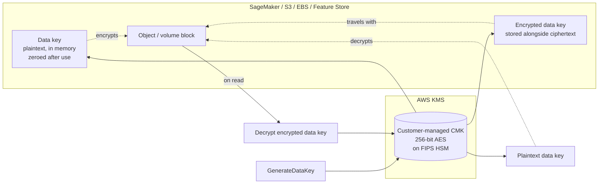
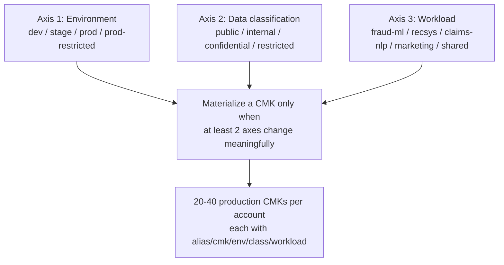
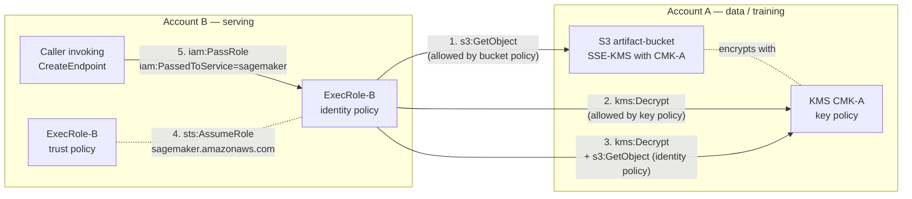

# Chapter 55 — Encryption End-to-End: KMS Keys Across the ML Lifecycle

> **Goal of this chapter:** to take the KMS primitives you already met in Chapter 8 — what a customer-managed CMK is, how envelope encryption works, what S3 Bucket Keys do — and trace them through every place a `KmsKeyId` parameter lives on the SageMaker API surface. By the end of the chapter you should be able to (a) name every `KmsKeyId` parameter on the SageMaker API, from `OutputDataConfig.KmsKeyId` on a training job to `OnlineStoreConfig.SecurityConfig.KmsKeyId` on a feature group; (b) draw the IAM and KMS-policy plumbing required for each of those parameters to actually work in production; (c) recognize and fix the five most common encryption-related failure modes — the CloudWatch Logs service-principal grant being the perennial favourite; and (d) explain the compliance posture (HIPAA, GDPR, FedRAMP, CNSSP-15) that the configuration produces. Chapter 8 was the *fundamentals* chapter. Chapter 55 is the *applied* chapter — we stop talking about KMS in isolation and start talking about KMS as it appears on the line of a `boto3.client('sagemaker').create_training_job(...)` call.

---

## 55.1 Why missing a `KmsKeyId` is a seven-figure audit finding

It is Friday afternoon at a US health payer. A SageMaker training job has been writing model artifacts to S3 for eight months. The bucket has SSE enabled — at first glance, everything looks fine. Then the auditor opens an object and reads the `x-amz-server-side-encryption` header. It says `AES256`, not `aws:kms`. The bucket was using SSE-S3, not SSE-KMS with a customer-managed key. The model artifacts contain features derived from claims data — PHI under the HIPAA Security Rule. The encryption key that protected those artifacts is an AWS-managed key whose key policy the customer does not control, whose `Decrypt` calls do not appear in the customer's CloudTrail, and which is shared across every other AWS customer in the region.

The remediation is technically simple: re-encrypt the bucket, set `OutputDataConfig.KmsKeyId` on every training job, fix the IaC. The auditor's finding letter is not technically simple. It cites §164.312(a)(2)(iv) of the HIPAA Security Rule, notes that the customer was unable to produce a key-usage audit trail for the period in question, and recommends a self-report to the Office for Civil Rights. The eventual settlement, the legal fees, the breach-notification process for the affected covered entities, and the corrective action plan that the customer's compliance team will live under for two years — the total cost runs comfortably into seven figures. The root cause is a single missing parameter on a single API call.

This chapter exists because Task 4.3 of the MLA-C01 Exam Guide — *"Secure AWS resources — encrypt data with AWS KMS"* — is not a fundamentals question. The exam does not ask you what envelope encryption is; Chapter 8 covered that, and the exam guide assumes it. The exam asks you which specific `KmsKeyId` parameter lives on which specific API, what permissions it requires, and what happens when you forget it. The questions are written in the form *"A SageMaker training job in account B fails to read encrypted data from a bucket in account A. Which of the following is missing?"* and every wrong answer is a leg of the policy chain that someone in the field has actually forgotten. We walk the chain end to end so that when one of the legs goes missing on exam day or in production, you recognize it instantly.

⚠️ **Exam alert.** The MLA-C01 Exam Guide names KMS exactly once, under Task 4.3. That single mention is responsible for an outsized share of the security-domain question pool because the test writers know KMS is the highest-leverage way to differentiate a candidate who has actually built SageMaker pipelines from one who has only read about them. Memorize Section 55.4 (the full `KmsKeyId` map) the same way you would memorize SQL keywords — by rote. There is no shortcut.

---

## 55.2 KMS in one paragraph (full detail in Chapter 8)

A **customer-managed symmetric KMS key (CMK)** is a 256-bit AES key whose material lives on FIPS-validated HSMs inside AWS KMS, identified by a UUID-style key ID and an ARN of the form `arn:aws:kms:<region>:<account>:key/<uuid>`. Access is authorized by three composable primitives: the **key policy** (mandatory, attached to the key itself, always evaluated), **IAM identity policies** (effective only when the key policy delegates to IAM via the `arn:aws:iam::<account>:root` principal), and **grants** (programmatic, narrowly-scoped, often created by AWS services on your behalf at resource-attach time and retired at resource-detach). The cardinal rule: **identity-policy permissions alone never authorize KMS use** — the key policy must explicitly allow the principal, either directly or by delegating to IAM. KMS itself never sees your data; it only wraps and unwraps small 256-bit data keys via the **envelope encryption** pattern. The HSMs are FIPS 140-2 Level 2 validated end-to-end with some Level 3 components — sufficient for HIPAA, PCI, SOC 2, FedRAMP Moderate, but not for CNSSP-15 / FIPS 140-2 Level 3 end-to-end (see Section 55.13 on CloudHSM and XKS). All of this is Chapter 8 material; we restate it here as a one-paragraph anchor and move on.

A second one-paragraph anchor worth stating once and never repeating: **the difference between an AWS-owned key, an AWS-managed key, and a customer-managed CMK is a difference of policy ownership, not of cryptographic strength.** AWS-owned keys are entirely opaque — you cannot see them, audit their use, or change their policy; many AWS services (S3 with SSE-S3, DynamoDB with the default option, Feature Store online store by default) use AWS-owned keys when no other key is specified. AWS-managed keys (the ones whose alias starts with `aws/`, like `aws/s3`, `aws/ebs`, `aws/sagemaker`) appear in your account, generate CloudTrail events for *some* operations, but have **policies you cannot edit** and **cannot be used cross-account**. Customer-managed CMKs are the only category whose policy you control end-to-end. Every interesting compliance and architecture decision in this chapter is a function of moving a particular resource from one of the first two categories into the third — and accepting the $1/month plus $0.03/10K-requests bill that comes with it.

---

## 55.3 Envelope encryption and S3 Bucket Keys — a recap with mermaid

Every "at-rest with KMS" feature on AWS implements **envelope encryption**: the service asks KMS to generate a 32-byte data key (`GenerateDataKey`), KMS returns both the plaintext and the encrypted form of that data key, the service encrypts your data with the plaintext data key (typically AES-256-GCM), zeroes the plaintext from memory, and stores the encrypted data key alongside the ciphertext. On read, the service hands the encrypted data key back to KMS via `Decrypt`, KMS returns the plaintext data key, and the service uses it to decrypt the object. KMS never sees the actual data. This matters for two reasons that recur throughout the chapter: KMS API call volume scales with the number of envelope operations (not with the size of the data), and the encryption context attached to each `GenerateDataKey` / `Decrypt` call is what lets you write IAM conditions like *"this role may decrypt only objects whose encryption context contains `sagemaker:training-job-name=fraud-xgb-*`"*.



**S3 Bucket Keys** are an optimization layered on top of SSE-KMS that caches one bucket-level data key for many objects, reducing per-object `Decrypt` / `GenerateDataKey` API volume by **up to 99%** ([Reducing the cost of SSE-KMS with S3 Bucket Keys](https://docs.aws.amazon.com/AmazonS3/latest/userguide/bucket-key.html)). Concretely: instead of one KMS round trip per S3 object, S3 derives per-object data keys locally from a time-limited bucket-level key that rotates approximately every minute. For a training-data bucket serving 100 million object reads per day, the math is brutal in both directions:

| Configuration | KMS requests/day | KMS cost/day |
| --- | --- | --- |
| SSE-KMS without Bucket Key | 100,000,000 | ~$300 |
| SSE-KMS **with** Bucket Key | ~144,000 (≈1 per minute per prefix) | ~$0.45 |

AWS publicly states the optimization has saved customers in aggregate well over $80M since launch. For any ML data lake with non-trivial object volume, Bucket Keys are not optional — the cost delta is two orders of magnitude, and the throttling story (Section 55.5) is what turns that cost into an actual production outage at scale.

⚠️ **Exam alert.** "Bucket Keys reduce SSE-KMS API costs by up to 99%" is the canonical phrasing. If a question gives you the choice between "enable S3 Bucket Keys," "switch to SSE-S3," "switch to `aws/s3`," and "request a KMS quota increase," the answer is almost always Bucket Keys. SSE-S3 sacrifices auditability, `aws/s3` cannot cross accounts, and a quota increase treats the symptom rather than the cause. Bucket Keys are off by default on existing buckets and must be enabled explicitly via `PutBucketEncryption` with `BucketKeyEnabled: true` — Terraform and CDK both require the explicit flag.

---

## 55.4 The full `KmsKeyId` map across the SageMaker API

This is the single most important table in the chapter. Every other section of the chapter is a footnote on one of its rows. **Memorize it cold for the exam.**

| API / Resource | Parameter path | What it encrypts | Default if omitted |
| --- | --- | --- | --- |
| `CreateTrainingJob` | `OutputDataConfig.KmsKeyId` | Model artifact `model.tar.gz` in S3 output location | SSE-S3 or bucket default |
| `CreateTrainingJob` | `ResourceConfig.VolumeKmsKeyId` | EBS on training instances | AWS-managed `aws/ebs`; **silently ignored on instance-store-heavy Nitro families** |
| `CreateTrainingJob` | `EnableInterContainerTrafficEncryption` (flag) | Inter-instance training traffic | Cleartext within VPC |
| `CreateProcessingJob` | `ProcessingOutputConfig.KmsKeyId` | Processing output S3 | SSE-S3 |
| `CreateProcessingJob` | `ProcessingResources.ClusterConfig.VolumeKmsKeyId` | EBS on processing cluster | AWS-managed |
| `CreateProcessingJob` | `NetworkConfig.EnableInterContainerTrafficEncryption` | Inter-instance processing traffic | Cleartext |
| `CreateTransformJob` | `TransformOutput.KmsKeyId` | Batch transform output S3 | SSE-S3 |
| `CreateTransformJob` | `TransformResources.VolumeKmsKeyId` | EBS on transform instances | AWS-managed |
| `CreateEndpointConfig` → `ProductionVariants[*]` | `KmsKeyId` (per variant) | EBS on inference instances | AWS-managed |
| `CreateEndpointConfig` → `AsyncInferenceConfig.OutputConfig` | `KmsKeyId` | Async inference output S3 | SSE-S3 |
| `CreateEndpointConfig` → `DataCaptureConfig` | `KmsKeyId` | Data-capture S3 objects | SSE-S3 |
| `CreateNotebookInstance` | `KmsKeyId` | Notebook EBS | AWS-managed |
| `CreateDomain` (Studio) | `KmsKeyId` | Per-user Studio EFS | `aws/elasticfilesystem` |
| `CreateUserProfile` (Studio) | *(inherits from domain)* | — | — |
| `CreateAutoMLJob` / V2 | `OutputDataConfig.KmsKeyId` | Autopilot outputs | SSE-S3 |
| `CreateAutoMLJob` / V2 | `ResourceConfig.VolumeKmsKeyId` | Autopilot training EBS | AWS-managed |
| `CreateFeatureGroup` | `OnlineStoreConfig.SecurityConfig.KmsKeyId` | DynamoDB-backed online store | AWS-owned key |
| `CreateFeatureGroup` | `OfflineStoreConfig.S3StorageConfig.KmsKeyId` | Offline-store Parquet/Iceberg objects | SSE-S3 |
| `CreateMonitoringSchedule` | *(inherits from underlying `ProcessingJob`)* | Model Monitor outputs | Per-processing-job |
| `CreateLabelingJob` (Ground Truth) | `OutputConfig.KmsKeyId` | Labeled output dataset | SSE-S3 |
| `CreateCompilationJob` (Neo) | `OutputConfig.KmsKeyId` | Compiled edge artifact | SSE-S3 |
| `CreatePipeline` (artifact location) | KMS on underlying default bucket | Pipeline metadata, step artifacts | SSE-S3 |
| `CreateModelPackage` (Model Registry) | *(inherits from model artifact)* | Model package metadata | Per-resource |
| `Model` (`CreateModel`) | **No `KmsKeyId`** | Pointer only; encryption is on S3 object | — |
| `CreateEndpoint` itself | **No `KmsKeyId`** (set on `EndpointConfig`) | — | — |

Also at the account / region level — not a parameter, but it controls every EBS attach in the region:

| Setting | What it controls |
| --- | --- |
| `EnableEbsEncryptionByDefault` (per region) | Forces every new EBS volume to be encrypted, using the EBS default KMS key |
| `ModifyEbsDefaultKmsKeyId` | Sets the default EBS key to a customer-managed CMK |

The reason this table is the heart of the chapter: the most common exam-question shape is *"A SageMaker [resource] must be encrypted with a customer-managed CMK. Which parameter do you set?"* If you can answer that in two seconds from memory, you save thirty seconds per question — and on a 65-question exam that's a full additional pass through the difficult ones at the end.

---

## 55.5 KMS throttling at high inference load — the 10,000 / 5,500 RPS wall

KMS request quotas are aggregated **per account, per region, per key type** and **averaged per minute**. The default symmetric-crypto quotas:

| Region tier | Symmetric crypto RPS (default) |
| --- | --- |
| Six high-traffic regions (`us-east-1`, `us-east-2`, `us-west-2`, `eu-west-1`, `eu-central-1`, `ap-northeast-1`) | **10,000 RPS** |
| All other commercial regions | **5,500 RPS** |
| GovCloud / China | Lower, request via Service Quotas |

Because the quota is averaged over a 60-second window, a 600,000-request-per-minute burst is the real ceiling. Bursty inference workloads can hit `ThrottlingException` at well below 100% utilization because the rate is averaged, not instantaneous.

The reason SageMaker inference hits this faster than people expect: a real-time endpoint that reads five features per request from an SSE-KMS-encrypted S3 bucket **without Bucket Keys** issues one `kms:Decrypt` per object read. A 1,000-RPS endpoint reading five features at five different prefixes is at **5,000 KMS RPS** — and that's *before* the same account counts RDS attach, EBS attach, Secrets Manager rotations, CloudTrail writes, container-image pulls, and every other AWS service that quietly hits KMS in the background.

The mitigations in priority order:

1. **Turn on S3 Bucket Keys** for every bucket SageMaker reads from at inference time. Up to 99% reduction. This is the single biggest lever and you should reach for it before any of the others.
2. **Cache features in-memory** in the inference container. The data key is captured at container init; warm requests don't go back to KMS.
3. **Use SageMaker Feature Store online store** (DynamoDB-backed) — DynamoDB has its own KMS optimization that does not make a per-item KMS call.
4. **Let SDK exponential backoff handle the rest.** SDK v3 / boto3 retry `ThrottlingException` with jittered backoff by default. Do not override this in custom inference code.
5. **Request a quota increase** via Service Quotas. Most prod accounts get approved for 30,000 RPS without question; 50,000+ requires a TAM conversation.
6. **Alarm on `KMS:CryptographicOperationsPerSecond`** at 70% of quota — that gives you about a minute of lead time before throttling kicks in.

The Bucket Keys math from Section 55.3 is the reason mitigation #1 dominates. Bucket Keys do not work for some features — S3 replication to a bucket in another account using a different KMS key still requires `Decrypt + Encrypt` per object, and S3 Object Lambda processing pipelines bypass Bucket Keys. Plan around these in cross-account replication topologies.

---

## 55.6 The three-axis CMK matrix — how regulated shops design key portfolios

Production regulated shops — banks, payers, pharma, defense — almost never use a single CMK. They build a **three-axis matrix** and materialize keys on the cross-product when at least two axes change meaningfully.



The math is misleading at first glance — `4 × 4 × 6 = 96` possible cells, but you do not provision 96 keys. You provision only the cells you actually use, and you collapse cells that share the same regulatory scope. A typical large enterprise lands on **20-40 customer-managed CMKs per account**, organized so that any single tag query — `Env=prod AND Classification=restricted` — returns the exact key set in scope for an audit.

The canonical alias convention is **`alias/cmk/{env}/{class}/{workload}`**. Aliases are free, you get up to 50 per key, and they are searchable in the console and SDK. A representative production layout for a health payer or a regulated bank:

```text
alias/cmk/prod/restricted/fraud-ml
alias/cmk/prod/restricted/claims-nlp
alias/cmk/prod/confidential/recsys
alias/cmk/prod/internal/feature-store
alias/cmk/stage/restricted/fraud-ml
alias/cmk/dev/internal/shared
alias/cmk/cicd/artifacts
alias/cmk/logs/cloudtrail
```

The single strongest operational reason to split keys per workload is not compliance — it is **incident containment**. If a SageMaker training role for `fraud-ml` is compromised, the grants attached to its CMK can be revoked in seconds without disrupting `recsys` or `claims-nlp`. With one shared CMK per environment, revoking the key disables every dataset, every model artifact, every endpoint EBS volume, and every CloudWatch log group encrypted with it — an IAM compromise becomes a cross-workload outage. The marginal $1/month per key is a rounding error against that risk.

### 55.6.1 CMK sprawl economics — $1 per key, $1 per rotation version

CMK pricing is deceptively cheap until you multiply it:

- **$1/month** per CMK (prorated hourly), single-region or multi-region primary.
- **$1/month** per **multi-region replica**, billed separately per region.
- **$1/month** per **rotation version** retained beyond the active one. After 2 years of annual auto-rotation: 3 versions = **$3/month per key**. After 5 years: **$6/month**.
- **$0.03 per 10,000 requests** symmetric; asymmetric and HMAC are 10× to 100× more expensive per request.

Organic sprawl in ML environments has predictable triggers:

| Trigger | What it creates |
| --- | --- |
| Per-tenant SaaS B2B ML platform | 1 CMK per customer; 500 customers = $500/mo storage alone |
| Per-feature-group CMK in Feature Store | 1 per group × N environments — explodes quickly |
| "Just-in-case" CMKs from IaC modules | Every Terraform module that *might* need encryption creates one |
| Pipeline-generated keys | CI/CD provisions a fresh CMK per branch or per training job |
| Multi-region replicas across six regions | $6/month per logical key, before rotation versions |
| Stale rotation versions | Annual rotation accumulates versions forever unless deleted |

A real anti-pattern: a 20-customer SaaS team running 20 CMKs with 2 years of rotation history pays **$60/month** in storage alone (~$720/year), before any data is encrypted. That number sounds small until you stack 12 accounts.

**Consolidation patterns:** the AWS Architecture Blog explicitly recommends *"one CMK per data classification, aliases per tenant for routing,"* not one CMK per tenant — but only when no tenant requires GDPR-style crypto-shredding (see Section 55.12). Other consolidation tactics: multi-purpose aliases (up to 50 per CMK); disabling rotation on rarely-used cold-archive keys; scheduling deletion of orphaned keys (KMS enforces a 7-30 day pending-deletion window for safety).

### 55.6.2 Per-workload separation in practice — a worked example

A health payer running fraud-ML, claims-NLP, recsys, and a shared feature store has a portfolio that looks roughly like:

```text
alias/cmk/prod/restricted/fraud-ml         # PCI + PHI; isolated; small reader population
alias/cmk/prod/restricted/claims-nlp       # PHI; isolated; small reader population
alias/cmk/prod/confidential/recsys         # PII; broader reader population
alias/cmk/prod/internal/feature-store-off  # offline; broad ML-engineer access
alias/cmk/prod/restricted/feature-store-on # online; production inference only
alias/cmk/prod/internal/cloudwatch-logs    # logs from all prod workloads
alias/cmk/prod/internal/cloudtrail         # account-isolated audit trail
alias/cmk/stage/restricted/fraud-ml        # stage mirror of fraud
alias/cmk/stage/confidential/recsys        # stage mirror of recsys
alias/cmk/dev/internal/shared              # one key for all dev experiments
alias/cmk/cicd/artifacts                   # CI/CD build artifacts
```

Eleven keys for a moderately complex ML organization. At $1/key/month plus rotation versions, this is $11-25/month in storage — a rounding error against the platform's overall AWS bill, and worth every cent because the blast radius of a compromise is now per-workload, not per-account. The portfolio is searchable by tag (`Env=prod`, `Classification=restricted`, `Workload=fraud-ml`) for audit, and the alias hierarchy is self-documenting for engineers.

---

## 55.7 `aws/sagemaker` vs customer-managed — when each is right

The AWS-managed `aws/sagemaker` key is free, requires zero setup, and is the default if you omit every `KmsKeyId` parameter we mapped in Section 55.4. The trade-off:

| Capability | `aws/sagemaker` | Customer-managed CMK |
| --- | --- | --- |
| Storage cost | Free | $1/month per key |
| Per-request cost | Free | $0.03 / 10,000 requests |
| Key policy you control | No | Yes |
| Per-request `Decrypt` events in **your** CloudTrail | Limited | Full |
| Can disable / delete | No | Yes (7-30 day window) |
| On-demand rotation | No | Yes |
| Cross-account access | **No** | Yes |
| Crypto-shredding capability | No | Yes (delete the key) |
| HIPAA / PCI / SOC 2 auditor friendly | "Acceptable" | "Preferred" / often required |
| FedRAMP High | Generally insufficient | Required |

The pragmatic rule: use `aws/sagemaker` for dev / test, public datasets, short-lived experiments. Use customer-managed CMK for anything touching production, anything containing PII / PHI / PCI, anything subject to external audit, anything that needs cross-account sharing. Trend Micro Cloud One Conformity flags every production SageMaker resource without a customer-managed CMK as HIGH severity. For the exam, the simple heuristic is: *if the scenario says "production," "regulated," "audited," "cross-account," or "sovereign," the answer involves a customer-managed CMK.*

A 2025 note: SageMaker HyperPod added support for customer-managed CMKs on root and secondary EBS volumes in August 2025. Before this, HyperPod EBS was restricted to AWS-managed encryption — a hard blocker for regulated customers running foundation-model pretraining on HyperPod. This is one of the most-asked-about recent additions on the MLA-C01 because it removes the previous "regulated customers cannot use HyperPod" exception from the answer set. If a question scenario invokes HyperPod and "PHI" or "PCI" or "FedRAMP" in the same breath, the answer now includes a customer-managed CMK on the HyperPod cluster's EBS volumes — no longer a trick.

The decision matrix gets reused on every new SageMaker resource type AWS launches. The question to ask in any architecture review is **two simple things**: *(a) does this resource handle data that an external auditor will ask about?* If yes, customer-managed CMK. *(b) Will this resource ever be read by a principal outside this AWS account?* If yes, customer-managed CMK (because `aws/...` keys cannot cross accounts). If the answer to both is no, `aws/sagemaker` is fine and saves you $1/month. If the answer to either is yes, the $1/month is not the constraint — the audit trail is.

---

## 55.8 Lifecycle walkthrough — every place a `KmsKeyId` appears

The map in Section 55.4 is the index. This section is the prose tour. We walk the data path from raw storage through inference output. Each subsection answers three questions: which parameter takes the `KmsKeyId`, what permissions does it require, and what goes wrong if you omit it.

The order of the walkthrough matters and is not the same as the order of the API table. Data flows lake → training inputs → training compute → training output → feature store → model artifact → endpoint → batch/async output → monitoring → pipelines. Auditors walk it in exactly that order, and so does the exam when it strings multiple resources into one scenario question.

### 55.8.1 Data lake (S3) — the source of truth

The buckets holding raw training data, feature engineering outputs, model artifacts, prediction logs, and data-capture outputs are the foundation. Get this layer wrong and nothing downstream can be made compliant. The hardened-bucket recipe:

```jsonc
// PutBucketEncryption — SSE-KMS + Bucket Keys
{
  "Rules": [
    {
      "ApplyServerSideEncryptionByDefault": {
        "SSEAlgorithm": "aws:kms",
        "KMSMasterKeyID": "arn:aws:kms:us-east-1:111122223333:key/abcd-..."
      },
      "BucketKeyEnabled": true
    }
  ]
}
```

Companion bucket-policy statements — apply all three: deny non-TLS access (`aws:SecureTransport=false`), require SSE-KMS on every PUT (`Null s3:x-amz-server-side-encryption-aws-kms-key-id`), and restrict GETs to your VPC endpoint (`aws:SourceVpce`). The cross-account caveat is non-negotiable: **`aws/s3` cannot be used for cross-account access** — its service-controlled key policy does not grant foreign principals and you cannot edit it. If any consumer outside this account will read the bucket, you must use a customer-managed CMK.

What goes wrong if you skip the bucket-policy companions: the bucket default of SSE-KMS prevents *new* objects from being written unencrypted, but it does not retroactively encrypt existing objects, and it does not stop a client with a valid `s3:PutObject` permission from explicitly overriding the encryption header to `AES256` (SSE-S3) on the PUT request. The `Deny` statement on `Null s3:x-amz-server-side-encryption-aws-kms-key-id` is what closes that hole. Similarly, the `aws:SecureTransport` deny is what prevents an inside-the-VPC misconfigured curl from leaking objects over HTTP. The bucket default sets the floor; the bucket policy enforces the ceiling. Both are required to satisfy any serious audit.

### 55.8.2 Training inputs (S3) — what the execution role must be able to read

When SageMaker pulls a training-data prefix from S3 (via `InputDataConfig.S3DataSource`), the execution role must be able to **decrypt** SSE-KMS-encrypted objects in that prefix. The pattern is one identity-policy block and one key-policy block. The identity policy on the role:

```json
{
  "Effect": "Allow",
  "Action": ["kms:Decrypt", "kms:DescribeKey"],
  "Resource": "arn:aws:kms:us-east-1:111122223333:key/<data-CMK-id>",
  "Condition": {
    "StringEquals": { "kms:ViaService": "s3.us-east-1.amazonaws.com" }
  }
}
```

And the matching grant on the data CMK key policy:

```json
{
  "Sid": "AllowSageMakerExecRoleToDecryptInputs",
  "Effect": "Allow",
  "Principal": { "AWS": "arn:aws:iam::111122223333:role/SageMakerExecRole" },
  "Action": ["kms:Decrypt", "kms:DescribeKey"],
  "Resource": "*"
}
```

The failure mode when this is misconfigured is one of the most confusing in all of SageMaker: `CreateTrainingJob` returns `200 OK` (the role can list-bucket), the job starts (the container can be pulled), and then the training script fails at the first `s3.get_object` call with `ClientError: An error occurred (AccessDenied) when calling the GetObject operation`. The clue is that CloudTrail will show a `Decrypt` event on KMS with `errorCode: AccessDenied` — but the error surfaces inside the user's training script, not as an API-level rejection, which is why new engineers chase the wrong logs.

### 55.8.3 Training compute and output

The training job has three KMS-related parameters at the API:

```python
sm.create_training_job(
    TrainingJobName="fraud-xgb-v42",
    OutputDataConfig={
        "S3OutputPath": "s3://ml-artifacts/fraud-xgb/",
        "KmsKeyId": "arn:aws:kms:...:key/<artifact-CMK>"
    },
    ResourceConfig={
        "InstanceType": "ml.m5.4xlarge",
        "InstanceCount": 4,
        "VolumeSizeInGB": 100,
        "VolumeKmsKeyId": "arn:aws:kms:...:key/<volume-CMK>"
    },
    EnableInterContainerTrafficEncryption=True,
    ...
)
```

`OutputDataConfig.KmsKeyId` encrypts the `model.tar.gz` and any other training outputs landing in S3. The execution role needs `kms:GenerateDataKey*`, `kms:Encrypt`, `kms:Decrypt` on the artifact CMK (S3 needs Decrypt for multipart-upload finalization), and the artifact CMK key policy must allow the role.

`ResourceConfig.VolumeKmsKeyId` encrypts the training instance's EBS volume — checkpoint files, scratch space, downloaded data, and on some algorithms shuffled training records. EBS creates a **grant** on the CMK at volume-attach and retires it at detach. The execution role needs `kms:CreateGrant`, `kms:Decrypt`, `kms:GenerateDataKey*` on the volume CMK.

⚠️ **Exam alert.** `VolumeKmsKeyId` is **silently ignored on instance-store-heavy Nitro families** (some `ml.p4d.*`, `ml.trn1.*`, `ml.g5.*` configurations with built-in NVMe instance store) — the local NVMe uses ephemeral instance-store encryption, not EBS. If the requirement is "training instance local storage encrypted with our CMK," pick an EBS-backed family (`ml.m5`, `ml.c5`, `ml.p3`). The API does not warn you; the parameter is accepted and the volume is *not* encrypted with your key.

### 55.8.4 Inter-container traffic encryption — `EnableInterContainerTrafficEncryption`

For distributed training across multiple instances — Horovod, PyTorch DDP, parameter-server, DeepSpeed, FSDP — SageMaker establishes peer-to-peer connections between containers. By default that traffic is **cleartext within the VPC**. Setting `EnableInterContainerTrafficEncryption=True` wraps it in IPsec.

Requirements:
- Security groups must allow **UDP 500** inbound from themselves (self-referencing rule) for IKE/IPsec negotiation.
- Security groups must allow **IP protocol 50 (ESP)** inbound from themselves for the encrypted payload.
- Performance overhead: **5-20% slower** for bandwidth-heavy deep learning (transformer pretraining, large vision models, NCCL all-reduce-bound jobs). Near zero for built-in algorithms like XGBoost, DeepAR, Linear Learner. GPU-to-GPU NCCL within an instance is unaffected — ICTE only wraps inter-instance traffic.

When to set it: **mandatory for PHI / PCI / FedRAMP distributed training**, recommended default for any production distributed DL, optional for single-instance and non-regulated experiments. AWS Config rule `sagemaker-training-job-inter-container-traffic-encryption-enabled` flags missing ICTE as HIGH severity for regulated workloads. Cross-reference: this is the "network" half of the encryption-in-transit picture; the rest is in Chapter 54 on VPC endpoints and SageMaker network isolation.

### 55.8.5 Processing jobs and batch transform

Mirror the training-job pattern. `CreateProcessingJob` (used for SageMaker Processing, Data Wrangler, Clarify, model-monitor baseline jobs, and bring-your-own preprocessing containers) has `ProcessingOutputConfig.KmsKeyId` for S3 outputs and `ProcessingResources.ClusterConfig.VolumeKmsKeyId` for EBS. `CreateTransformJob` has `TransformOutput.KmsKeyId` for batch outputs and `TransformResources.VolumeKmsKeyId` for EBS. Both support `EnableInterContainerTrafficEncryption` for multi-instance jobs. The semantics are identical to training: output `KmsKeyId` encrypts S3 outputs, `VolumeKmsKeyId` encrypts the cluster's EBS volume, and the same instance-store-Nitro gotcha applies — pick an EBS-backed family if the requirement is "local storage encrypted with our CMK." Permissions are identical: `kms:GenerateDataKey*` and `kms:Encrypt` on the output CMK; `kms:CreateGrant`, `kms:Decrypt`, `kms:GenerateDataKey*` on the volume CMK.

A pattern worth committing to memory: every SageMaker compute-and-output API in the system follows the **same triplet** — `OutputConfig.KmsKeyId` for the output S3 location, `VolumeKmsKeyId` (sometimes nested under `ResourceConfig` or `ClusterConfig`) for the instance EBS, and `EnableInterContainerTrafficEncryption` (or the same flag under `NetworkConfig`) for inter-instance traffic. If you can name the triplet for one API, you can name it for all of them. The MLA-C01 exploits this by asking the same question shape five different ways across training, processing, transform, AutoML, and HPO.

### 55.8.6 Notebook instances and Studio domains

Classic notebook instances take `KmsKeyId` directly on `CreateNotebookInstance` and it encrypts the EBS volume. Studio domains take `KmsKeyId` on `CreateDomain` and it encrypts the **per-user EFS file system** that backs each user profile's `/home/sagemaker-user`. Per-user profiles inherit from the domain — `CreateUserProfile` does not accept its own `KmsKeyId`. Omitted, notebook EBS uses `aws/ebs` and Studio EFS uses `aws/elasticfilesystem`; neither can be shared cross-account.

### 55.8.7 Feature Store — two separate CMKs

Feature Store is the only SageMaker resource with **two independent KMS keys**, because it has two independent backing stores:

| Store | Backed by | Parameter |
| --- | --- | --- |
| **Online store** | DynamoDB (managed by SageMaker, in your account) | `OnlineStoreConfig.SecurityConfig.KmsKeyId` |
| **Offline store** | S3 (your bucket, Iceberg / Parquet) | `OfflineStoreConfig.S3StorageConfig.KmsKeyId` |

The key-policy nuance trips candidates: the `kms:ViaService` condition is valid on the **online-store CMK** (`sagemaker.*.amazonaws.com`) but **must not** be set on the offline-store CMK. Setting `kms:ViaService` on the offline CMK causes `CreateFeatureGroup` to fail because the offline-store writer path goes through Athena and Glue, not directly through SageMaker. This is a high-frequency exam trap and a real-world misconfiguration that surfaces only after weeks of seemingly correct behavior.

Why two keys is the default best practice: offline-store readers are the broader population (every training-job execution role); online-store readers are the narrower production-inference population. Separating the keys lets you grant decrypt on the offline key to ML engineers without granting them production-inference access.

### 55.8.8 Model artifact — implicit, via S3

`CreateModel` does *not* accept a `KmsKeyId` parameter. The Model resource is a metadata pointer to `ModelDataUrl = s3://<bucket>/<prefix>/model.tar.gz`. The encryption posture of the artifact is inherited from the S3 bucket's encryption config (Section 55.8.1) and from the CMK that was passed to the training job's `OutputDataConfig.KmsKeyId` (Section 55.8.2). When a downstream consumer — endpoint, batch transform, model-package import — reads the model, they must have `s3:GetObject` on the bucket and `kms:Decrypt` on the CMK that encrypted `model.tar.gz`.

This is the single most-tested cross-cutting pattern on the exam: when a question describes a "model deployed in account B from an artifact trained in account A," every wrong answer omits one leg of the {S3 bucket policy, KMS key policy, IAM identity policy} triangle. See Section 55.11.

### 55.8.9 Endpoint configuration — variants, async, data capture

`CreateEndpointConfig` defines one or more **production variants**, each of which gets its own KMS key for the inference instances' EBS volumes:

```python
sm.create_endpoint_config(
    EndpointConfigName="fraud-xgb-prod-v42",
    ProductionVariants=[
        {
            "VariantName": "AllTraffic",
            "ModelName": "fraud-xgb-v42",
            "InitialInstanceCount": 2,
            "InstanceType": "ml.m5.xlarge",
            "KmsKeyId": "arn:aws:kms:...:key/<endpoint-CMK>"
        }
    ],
    AsyncInferenceConfig={
        "OutputConfig": {
            "S3OutputPath": "s3://ml-async-out/vision/",
            "KmsKeyId": "arn:aws:kms:...:key/<async-out-CMK>"
        }
    },
    DataCaptureConfig={
        "EnableCapture": True,
        "InitialSamplingPercentage": 100,
        "DestinationS3Uri": "s3://ml-data-capture/fraud/",
        "KmsKeyId": "arn:aws:kms:...:key/<capture-CMK>",
        "CaptureOptions": [{"CaptureMode": "Input"}, {"CaptureMode": "Output"}]
    }
)
```

Three independent CMKs: per-variant EBS, async output S3, data-capture S3. A blue/green deployment with two variants can use *two different* CMKs (e.g., during a key-rotation cutover). For serverless endpoints, there are no EBS volumes — the per-variant `KmsKeyId` is omitted and the underlying state uses the AWS-managed key. Captured data often contains raw inference inputs, which for many regulated workloads are PII — the capture CMK is a high-value compliance target and should be treated like the training-data CMK.

### 55.8.10 Ground Truth, Neo, Model Registry, AutoML

`CreateLabelingJob` (Ground Truth) takes `OutputConfig.KmsKeyId` for the labeled-output dataset — important because labeled training data for regulated workloads (medical-image annotations, financial-fraud labels) carries the same classification as the raw data, sometimes higher because human annotators have effectively confirmed the sensitive attribute. `CreateCompilationJob` (Neo edge packaging) takes `OutputConfig.KmsKeyId` for the compiled artifact, which is then shipped to edge devices; protect this key with the same discipline as a production endpoint CMK because the compiled artifact contains optimized model weights derived from your training data. `CreateModelPackage` (Model Registry) does not take its own `KmsKeyId` — the package metadata in S3 inherits from the bucket's encryption config, and the underlying model artifact inherits from its training-job `OutputDataConfig.KmsKeyId`. The Registry is metadata-only at the API level; its security posture is the union of the artifact bucket's posture and the metadata bucket's posture. AutoML V1 and V2 have both `OutputDataConfig.KmsKeyId` and `ResourceConfig.VolumeKmsKeyId`, semantically identical to a normal training job — AutoML is, under the hood, an orchestrator of training jobs and processing jobs that obey all the same `KmsKeyId` rules.

### 55.8.11 Pipelines — encryption as a discipline, not a parameter

A SageMaker Pipeline orchestrates many of the above steps. There is no single "encrypt this whole pipeline" parameter; instead, **every step's `KmsKeyId` parameters must point at the same CMK** (or at a documented curated set). The PipelineSession SDK makes this enforceable: define a single `ParameterString` at the top of the pipeline and reference it in every step. CI/CD validates that no step has a hard-coded ARN. The pipeline-wide checklist for production:

- Pipeline default S3 bucket: SSE-KMS with the pipeline CMK.
- Every `TrainingStep`: `output_kms_key` + `volume_kms_key` + `encrypt_inter_container_traffic=True`.
- Every `ProcessingStep`: output `KmsKeyId` + volume `KmsKeyId`.
- Every `TransformStep`: output `KmsKeyId` + volume `KmsKeyId`.
- `CreateModelStep` / `RegisterModelStep`: artifact bucket encrypted with pipeline CMK.
- `CallbackStep` outputs: SSE-KMS-encrypted SQS / S3.
- `ClarifyCheckStep` / `QualityCheckStep`: processing-job `KmsKeyId`.
- CloudWatch log group for pipeline execution: `logs:AssociateKmsKey` with the pipeline CMK.
- Any Lambda invoked from the pipeline: environment-variable encryption with the pipeline CMK.

The downstream pain of skipping this discipline shows up months later, when a step's output gets read cross-account and silently fails because that step used the bucket default (`aws/s3`) rather than the pipeline CMK. The pipeline ran green, the unit tests passed, and the failure surfaces only when a downstream consumer team — analytics, another model's training pipeline, a regulator's audit — tries to read the output and is denied. By then the artifact may be three releases old and the original pipeline run has been garbage-collected.

The operational way to prevent this: in every pipeline-definition file, declare exactly one `ParameterString` named `PipelineKmsKeyId` and one named `EncryptInterContainerTraffic`. Every step in the pipeline references those two parameters and nothing else. A pre-merge CI check parses the pipeline JSON / Python and fails the PR if any step uses a hard-coded ARN or if `EncryptInterContainerTraffic` is `False` for a distributed-training step on a restricted-classification CMK. The CI check is twenty lines of Python; the savings compared to discovering the issue post-audit are several orders of magnitude.

---

## 55.9 CMK rotation — what actually happens to your ML artifacts

When you enable automatic rotation on a symmetric CMK, KMS rotates the underlying **HSM Backing Key (HBK)** on a configurable schedule (default annual; range 90-2560 days). What stays the same: the key ID, the ARN, the alias, the key policy, and every grant. What changes: a new HBK becomes the *current* version used for new `Encrypt` and `GenerateDataKey` operations. **Old HBK versions are preserved** so that previously-encrypted data continues to decrypt without re-encryption.

What this means in practice for ML artifacts:

| Artifact | Re-encryption needed at rotation? |
| --- | --- |
| Model artifact (`model.tar.gz` in S3) | **No** — old object stays encrypted with old HBK; reads succeed |
| Training-data objects in S3 | **No** — same logic |
| EBS volume on a long-running endpoint | **No** during normal rotation; **yes** at endpoint update |
| Feature Store online store (DynamoDB) | **No** — DynamoDB handles HBK rollover transparently |
| Feature Store offline store (S3) | **No** for existing objects; new puts use new HBK |
| Secrets Manager values | **No** — re-encryption happens on next `RotateSecret` cycle |

**On-demand rotation** (introduced in 2023) lets you trigger a rotation event between scheduled ones — useful when you suspect a compromise. **Asymmetric keys do not auto-rotate** — manual rotation only, with a new key. For ML this rarely matters (model-artifact signing is the only common asymmetric use case). Rotation is **free** for the actual rotation event itself; the **per-rotation-version storage cost is $1/month per retained version**, which is the line item that catches finance teams off-guard five years into a production system.

The rotation-version accounting is worth walking through once because it does not match most engineers' mental model of "rotate" from other systems. KMS does not discard old HBKs when a new one becomes active — it keeps every HBK that has ever protected ciphertext you might still be holding, so that `Decrypt` of an old object still succeeds without a re-encryption migration. A 5-year-old production CMK with annual auto-rotation enabled has 6 HBKs (the original plus 5 rotation versions), each billed at $1/month. The annual rotation is operationally free; it is the retention of the old HBKs that costs money, and it is necessary for the system to keep working. You only avoid the cost by re-encrypting all ciphertext under the current HBK and then waiting for the old HBKs to be retired by KMS (which AWS does on its own schedule for HBKs no ciphertext still depends on).

Enable annual rotation on every customer-managed symmetric CMK unless you have a specific documented reason not to. The reasons not to: keys protecting truly cold archive data where the per-version storage cost outweighs the security benefit; keys where on-demand rotation gives you better control of the rotation schedule for a specific compliance reason; and keys backed by a CloudHSM custom key store where rotation is managed in CloudHSM rather than KMS.

---

## 55.10 Multi-region keys (MRK) for DR and cross-region inference

A **multi-region KMS key** is a primary key in one region with **replicas** in other regions. All replicas share the same key ID (prefixed `mrk-`) and the same key material, but each replica is an independent KMS resource for IAM/policy purposes — different key policies, different grants, different tags, different aliases. Rotation of the primary auto-syncs to replicas. A ciphertext encrypted under the primary in region A can be decrypted under the replica in region B *without re-encryption or a cross-region KMS call* — when both regions hold related MRKs.

The ML use case for MRKs is straightforward: a primary inference fleet in `us-east-1`, a DR fleet in `eu-west-1`, a model artifact in S3 that must be readable by both, and a Feature Store offline store likewise. The MRK collapses the key management for the artifact — one logical key ID, one rotation schedule, two regional policies you control independently.

⚠️ **Exam alert.** MRKs **do not eliminate** S3 Cross-Region Replication re-encryption. AWS documentation is explicit: *"Most AWS services that integrate with AWS KMS for encryption at rest currently treat multi-Region keys as though they were single-Region keys."* S3 CRR decrypts the source object's data key under the source-region MRK replica, calls `Encrypt` against the destination-region MRK replica, and re-encrypts the data key there. The MRK still helps — the destination key exists, with the right material, in the right region — but you do not get the "no re-encryption" optimization through CRR. Similarly, DynamoDB Global Tables handle their own replication and re-encrypt at the destination.

What MRKs do NOT do:
- They are **not global** — each replica is regional; decryption happens in the region you call.
- They **do not replicate data** — you still need S3 CRR, DynamoDB Global Tables, Aurora Global Database, etc.
- They **do not auto-replicate grants** — grants are regional. If your ML account has 200 grants on the primary, you must recreate them on each replica.
- They **cannot cross partitions** — you cannot replicate an `aws` MRK into `aws-cn` (China) or `aws-us-gov` (GovCloud).
- SageMaker domains themselves are regional and cannot be multi-region — the reference DR pattern is **active-passive** (primary domain only, EFS replicated to DR, new domain launched on failover) and the MRK is what lets the artifacts and S3 data survive the failover without rewriting permissions.

---

## 55.11 Cross-account KMS — the five-leg policy chain

The most-tested cross-account pattern: model trained in **Account A**, deployed as an endpoint in **Account B**. For this to work, five policy hops must all line up:



The five legs, named:

1. **Account A bucket policy** allows `ExecRole-B` to `s3:GetObject` on the artifact prefix and `s3:ListBucket` on the bucket.
2. **Account A KMS key policy** on the artifact CMK explicitly allows `ExecRole-B` (or `arn:aws:iam::B:root` with IAM delegation) for `kms:Decrypt` and `kms:DescribeKey`.
3. **Account B identity policy** on `ExecRole-B` allows `s3:GetObject` / `s3:ListBucket` on Account A's bucket ARN and `kms:Decrypt` / `kms:DescribeKey` on Account A's CMK ARN.
4. **`ExecRole-B` trust policy** allows `sagemaker.amazonaws.com` to assume it (with `aws:SourceAccount` confused-deputy guard).
5. **Account B caller's identity policy** allows `iam:PassRole` on `ExecRole-B` with the `iam:PassedToService=sagemaker.amazonaws.com` condition.

Miss any one leg and the endpoint fails — usually silently — with `Failed to download model.tar.gz`. The exam loves to write a question with four of the five present and ask which is missing.

Two things to commit to memory because they trip even experienced engineers:

- **`aws/s3` cannot do cross-account.** The AWS-managed key's policy does not grant foreign principals and you cannot edit it. If the bucket is encrypted with `aws/s3`, the `Decrypt` fails with `KMSAccessDeniedException` no matter how perfect the bucket policy is. Always switch to a customer-managed CMK before sharing.
- **CloudTrail for the failure lives in Account A**, not Account B. The KMS `Decrypt` event is logged in the key-owner account. Engineers debugging in Account B see only the downstream effect (`AccessDenied` on S3) and chase the wrong logs.

In the hub-and-spoke data-lake model — the lake in Account A, multiple ML accounts in B, C, D — **grants** are typically the better mechanism than direct key-policy statements. SageMaker, EBS, RDS create grants automatically when you specify a `KmsKeyId`; you rarely create them by hand. Grants are scoped to specific operations and can carry encryption-context constraints, and they retire cleanly when the underlying resource is deleted. The permissions the grant *creator* needs (typically the SageMaker service-linked role or the calling IAM role): `kms:CreateGrant`, `kms:DescribeKey`, `kms:RetireGrant`, `kms:GenerateDataKey`, `kms:GenerateDataKeyWithoutPlaintext`, `kms:Decrypt`.

A complementary enforcement layer that real teams add at the bucket level is a `Deny` for any write that does not specify the canonical CMK:

```json
{
  "Effect": "Deny",
  "Principal": "*",
  "Action": "s3:PutObject",
  "Resource": "arn:aws:s3:::ml-artifacts-prod/*",
  "Condition": {
    "StringNotEqualsIfExists": {
      "s3:x-amz-server-side-encryption-aws-kms-key-id":
        "arn:aws:kms:us-east-1:111:key/mrk-..."
    }
  }
}
```

This prevents tenant A's ML account from accidentally writing to the shared artifacts bucket with tenant B's key, or with `aws/s3`, or unencrypted. The condition is `StringNotEqualsIfExists` rather than `StringNotEquals` so that the deny does not fire on PUTs with no encryption header at all (those are caught by the separate `Null` deny in Section 55.8.1); it fires only on PUTs that affirmatively specify the wrong key. The combined effect of the three bucket-policy statements (SSE-KMS required, canonical CMK only, TLS only) plus the KMS key policy (cross-account principals enumerated) plus the consumer's identity policy is the well-architected, audit-passing posture.

---

## 55.12 GDPR crypto-shredding — per-tenant keys and the destruction window

GDPR Article 17 ("right to erasure") requires deletion of personal data on request. For terabyte-scale ML data lakes, physically deleting every object — including replicas, snapshots, backups, CloudTrail logs, Spark caches, monitoring outputs — is operationally infeasible. The European Data Protection Board has explicitly recognized **crypto-shredding** as a valid Article 17 mechanism: render data unrecoverable not by overwriting bytes but by destroying the encryption key. The ciphertext persists; the bytes are mathematically irrecoverable.

The per-tenant CMK pattern:

```text
Tenant A data → SSE-KMS with cmk-tenant-A
Tenant B data → SSE-KMS with cmk-tenant-B
...

Tenant A invokes right-to-erasure:
  1. Disable cmk-tenant-A (immediate — blocks new encrypt/decrypt)
  2. Revoke all active grants
  3. ScheduleKeyDeletion (7-30 day pending window)
  4. After window expires → key destroyed
  5. All ciphertext encrypted under cmk-tenant-A is now irrecoverable
  6. CloudTrail event provides audit proof of erasure
```

⚠️ **Exam alert.** The KMS pending-deletion window is **7 to 30 days** (configurable per call to `ScheduleKeyDeletion`, default 30). The window is a feature — recoverable in case of error — but means erasure is not instantaneous. GDPR's "without undue delay" standard accepts this. Document the window in your DPA. The corresponding API for instant lockout (`DisableKey`) is what you call first; it stops all crypto operations immediately, with the deletion completing the cycle.

The trade-offs that get glossed over in vendor blog posts:

1. **CMK sprawl explodes.** Ten thousand tenants = ten thousand CMKs = **$10,000/month** in storage alone. This is why crypto-shredding is reserved for B2B SaaS with high-value customers, not B2C consumer apps.
2. **Cross-tenant analytics becomes impossible** without a separate anonymized data store or a re-encryption pipeline. The very property that makes crypto-shredding work — keys do not cross tenant boundaries — also blocks the most natural analytics path.
3. **Backups encrypted with a different CMK survive** the tenant key destruction. This is a common audit finding: a tenant's data was crypto-shredded, but the cold-archive backup is encrypted under `cmk-backup-shared`, which is still alive. Either encrypt backups under the tenant key, or accept that backups are out of scope and document it.
4. **Snapshot exports and replicas** must use the same CMK family or be re-encrypted under the tenant key. This includes EBS snapshots, RDS snapshots, and any cross-region replica.
5. **The per-tenant cost is real and non-consolidable** if crypto-shredding is a requirement. The AWS Architecture Blog's "cost-conscious multi-tenant" pattern (one CMK per classification, aliases per tenant) explicitly does *not* support per-tenant crypto-shredding — you must accept per-tenant keys.

The AWS-specific implementation pattern for a "tenant key management service" sitting in front of KMS:

```text
Tenant onboarding (one-time, per new tenant):
  1. Create CMK with alias  alias/tenant/<tenant-id>
  2. Tag with TenantId, OnboardingDate, DataClassification
  3. Register in tenant directory (DynamoDB)
  4. Issue grants to SageMaker, S3, RDS service-linked roles
  5. Configure SCP that requires the tenant's CMK on any write
     to a path containing the tenant-id

Tenant erasure (Article 17 invocation):
  1. DisableKey(cmk-tenant-X)         → immediate; blocks new encrypt/decrypt
  2. Revoke all active grants         → idempotent; safe to repeat
  3. ScheduleKeyDeletion(7-30 days)   → starts the pending-deletion window
  4. Notify tenant + log audit event  → write to compliance ledger
  5. After window expires:
       - KMS destroys the HBKs        → ciphertext is now mathematically unrecoverable
       - CloudTrail records DeleteKey → auditable proof of erasure
       - Tenant directory marks tenant as "erased"
```

This is the operational shape of crypto-shredding as it is actually built in B2B health and finance SaaS. The cost is non-trivial — at 10,000 tenants you are paying $10K/month in KMS storage alone — but the alternative is operationally impossible: rebuilding the data lake, replicas, snapshots, monitoring outputs, and audit logs to physically expunge one tenant's bytes is a task that takes weeks per request and is never quite verifiable. Crypto-shredding gives you a one-line audit proof: *"The key that protected tenant X's data was destroyed on date Y; here is the CloudTrail event."* That sentence is what your GDPR DPA promises and what auditors will ask to see.

---

## 55.13 DSSE-KMS, CloudHSM, and XKS — beyond standard SSE-KMS

For most regulated ML — HIPAA, PCI, SOC 2, FedRAMP Moderate — standard SSE-KMS with a customer-managed CMK is sufficient. The Federal floor is FIPS 140-2 Level 2, which the KMS HSMs satisfy. Above that floor, three options exist for stricter postures:

**DSSE-KMS (Dual-layer SSE-KMS)** wraps each S3 object in **two independent layers** of AES-256 encryption, both keyed by KMS-managed keys derived from a single CMK. It is the recommended posture for CNSSP-15 / CNSA (Commercial National Security Algorithm Suite) workloads — typically classified federal data — where the requirement is *"defense-in-depth at the cryptographic layer, not just the access-control layer."* DSSE-KMS roughly doubles per-object KMS work (two `GenerateDataKey` calls per write); cost on ML data lakes is generally a wash because Bucket Keys still apply.

**KMS Custom Key Store backed by CloudHSM** keeps the KMS API surface but moves the key material into a dedicated CloudHSM cluster you operate. CloudHSM is **FIPS 140-2 Level 3** validated (`hsm1.medium`) or **FIPS 140-3 Level 3** (`hsm2m.medium`) — the highest commercial FIPS rating. Choose this when the scenario mentions *"FIPS 140-2 Level 3 for the entire key lifecycle"* or *"tamper-evident and tamper-responsive HSMs."*

**KMS External Key Store (XKS)** goes further: key material lives in a *third-party* HSM (Thales, Entrust, Atos) entirely outside AWS infrastructure. Every crypto operation makes a synchronous call out to your HSM via an XKS proxy. Choose this only when sovereignty rules require key material outside the cloud provider's control plane — typical of DORA-regulated European banks. The trade-offs are severe: latency goes from <10ms to 30-100ms per crypto operation; an HSM outage breaks every dependent AWS service (S3 reads, EBS attach, SageMaker endpoints) until the HSM is back; cost runs $1.50+/hour per CloudHSM instance plus vendor HSM costs plus the operations team to run it.

For the MLA-C01, the recognition pattern is:
- Generic regulated ML → **customer-managed CMK in standard KMS**.
- "Key material outside AWS" → **XKS**.
- "FIPS 140-2 Level 3 end-to-end" → **CloudHSM key store**.
- "Defense-in-depth at the cryptographic layer for classified S3 data" → **DSSE-KMS**.
- "FedRAMP High, classified, intelligence" → **CloudHSM**, usually mandated by the system-control assessor.

For typical regulated ML workloads, CloudHSM is overkill and a wrong answer.

---

## 55.14 HIPAA, FedRAMP, and data residency — compliance angles by name

**HIPAA / PHI.** HIPAA's Security Rule is technology-neutral, but the AWS Business Associate Agreement (BAA) and standard auditor practice expect customer-managed CMKs for any storage of PHI. The required posture:

- All PHI in S3 buckets encrypted with **customer-managed CMKs** (never `aws/s3`).
- Every SageMaker `KmsKeyId` parameter touching PHI set to a customer-managed CMK.
- CloudTrail logs of all `Decrypt` operations on the PHI CMK retained for the BAA-mandated period — typically 6 years.
- `EnableInterContainerTrafficEncryption=true` for any distributed training on PHI.
- Access to the PHI CMK restricted via key policy to the minimum set of execution roles — no broad `kms:*` grants.
- An SCP enforces `DataClassification` tags on every CMK in the org, blocking `kms:CreateKey` if the tag is absent.

The HIPAA control mapping that auditors look for: §164.312(a)(2)(iv) (encryption / decryption — customer-managed CMK on every PHI store), §164.312(b) (audit controls — CloudTrail KMS events enabled and retained), §164.312(d) (person/entity authentication — IAM + key-policy principals), §164.312(e)(1) (transmission security — TLS 1.2+, plus ICTE on distributed training), §164.308(a)(7) (contingency plan — multi-region CMK or documented key backup).

**FedRAMP / CNSSP-15.** FedRAMP Moderate is the typical federal floor and is satisfied by standard KMS customer-managed CMKs. FedRAMP High often demands FIPS 140-2 Level 3 — CloudHSM key store. CNSSP-15 / CNSA classified workloads typically require DSSE-KMS for S3 and CloudHSM for keys.

**Data residency.** For EU GDPR strict-residency: keep the CMK and the data both in EU regions (`eu-west-1`, `eu-central-1`, `eu-north-1`, etc.). MRKs help DR within the EU but cannot replicate outside the partition — no replicating an `aws` MRK into `aws-cn` or `aws-us-gov`. AWS documents this partition constraint explicitly.

The compliance overlay also has an enforcement story worth knowing about. The simplest version is an SCP at the org level that blocks any `kms:CreateKey` call missing a `DataClassification` tag:

```json
{
  "Effect": "Deny",
  "Action": "kms:CreateKey",
  "Resource": "*",
  "Condition": {
    "Null": { "aws:RequestTag/DataClassification": "true" }
  }
}
```

This single statement prevents the most common audit finding in regulated ML: a CMK that exists but has no classification tag, so the auditor cannot determine whether it should be in scope for the assessment. Senior architects in healthcare and finance run this SCP at the organization root and have done so for years; if you are designing the encryption posture for a new regulated environment, this is the first line of IaC to write.

---

## 55.15 Common failure modes — the field-tested diagnostic checklist

When something breaks with KMS in an ML pipeline, run through these in order. The order is roughly "most common first."

| Symptom | Most likely cause | Diagnosis | Fix |
| --- | --- | --- | --- |
| `CreateTrainingJob` succeeds; job fails in <60s with no log output | CloudWatch log group can't be encrypted because the CMK doesn't allow `logs.<region>.amazonaws.com` | CloudTrail shows `KMSAccessDeniedException` from the logs service | Add `logs.<region>.amazonaws.com` to the CMK key policy with `kms:Encrypt*`, `kms:Decrypt*`, `kms:ReEncrypt*`, `kms:GenerateDataKey*`, `kms:Describe*` |
| Training job fails reading S3 with `AccessDenied` despite correct bucket policy | KMS key policy on the **data** CMK doesn't allow the execution role | CloudTrail shows `Decrypt` on the data CMK with `errorCode: AccessDenied` | Add the execution-role ARN to the data CMK's key policy |
| Cross-account training-data read fails | One leg of the five-leg policy chain missing | Walk §55.11 in order | Add the missing leg |
| Distributed training hangs after `Reserved` state | ICTE enabled but SG doesn't allow UDP 500 / ESP | VPC Flow Logs show blocked UDP 500 inbound | Add self-referencing SG rules for UDP 500 (inbound) and IP protocol 50 (ESP, inbound) |
| `VolumeKmsKeyId` set, but volume is not encrypted with your CMK | Instance family is instance-store-heavy Nitro (`ml.p4d`, `ml.trn1`, some `ml.g5`) | API accepts the parameter silently | Switch to EBS-backed family (`ml.m5`, `ml.c5`, `ml.p3`) |
| `CreateFeatureGroup` fails with key-policy error | `kms:ViaService` set on the **offline-store** CMK (only valid on online-store) | Compare against Feature Store security docs | Remove `kms:ViaService` from offline-store CMK key policy, or use separate CMKs |
| Endpoint update appears to succeed; new variant doesn't come online | New `ProductionVariant.KmsKeyId` rejects SageMaker service grant | CloudTrail shows `CreateGrant` failure | Add `kms:CreateGrant` for the service principal to the new CMK key policy |
| Pipeline succeeds; downstream consumer can't read a step's output | One step omitted `KmsKeyId`; output is on bucket default `aws/s3` (cross-account-incompatible) | Inspect the object's `x-amz-server-side-encryption-aws-kms-key-id` header | Set the step's `KmsKeyId` to the pipeline CMK and re-run |
| Data-capture objects unreadable by Model Monitor | Monitor processing-job role lacks `kms:Decrypt` on the capture CMK | CloudTrail shows the monitor's role being denied | Add the Model Monitor role to the capture CMK key policy |
| Cross-region endpoint deploy fails with `KMSInvalidStateException` | CMK in `OutputDataConfig.KmsKeyId` is single-region and in the wrong region | Confirm the CMK ARN region matches the SageMaker API region | Convert to MRK and replicate to the endpoint region |

### 55.15.1 The CloudWatch Logs service-principal grant — the single most common production failure

The CloudWatch Logs service-principal grant deserves its own subsection because it is the single most common encryption failure mode in real-world SageMaker deployments and an exam favourite. When you encrypt a CloudWatch log group with a customer-managed CMK, the **CloudWatch Logs service** itself must be in the CMK's key policy as a principal — not the IAM role of the SageMaker job. The required policy statement:

```jsonc
{
  "Sid": "AllowCloudWatchLogsToUseTheKey",
  "Effect": "Allow",
  "Principal": { "Service": "logs.us-east-1.amazonaws.com" },
  "Action": [
    "kms:Encrypt*",
    "kms:Decrypt*",
    "kms:ReEncrypt*",
    "kms:GenerateDataKey*",
    "kms:Describe*"
  ],
  "Resource": "*",
  "Condition": {
    "ArnLike": {
      "kms:EncryptionContext:aws:logs:arn":
        "arn:aws:logs:us-east-1:111122223333:*"
    }
  }
}
```

Without this statement, every SageMaker job whose logs are emitted to that log group dies within sixty seconds of starting — and dies *silently*, because the very logs that would tell you why are the ones being blocked. The remediation is fifteen seconds of policy editing; the diagnosis without prior exposure can eat half a day. The right place to look is the **KMS** service in CloudTrail (not CloudWatch Logs and not SageMaker), filtering for `errorCode = KMSAccessDeniedException` with `userIdentity.invokedBy = logs.amazonaws.com`. The trail tells you what is happening; the SageMaker console only tells you that something failed.

The reason this is so common in real deployments: SageMaker's default behaviour is to write logs to `/aws/sagemaker/TrainingJobs` (or analogous log groups for other resources). When a security team enables customer-managed-CMK encryption on that log group via `logs:AssociateKmsKey`, they typically forget to update the CMK's key policy to allow the `logs.<region>.amazonaws.com` service principal — because the key policy is a separate API surface from the log-group association. The two operations are owned by different teams in many organizations, which makes the misconfiguration almost structurally inevitable on first encounter.

The exam writes this scenario as: *"A SageMaker training job in us-east-1 returns 200 OK from CreateTrainingJob and reaches the `InProgress` state. Sixty seconds later it transitions to `Failed` with no CloudWatch logs ever appearing. Which of the following is the most likely cause?"* The correct answer is always the missing CloudWatch Logs service-principal grant on the log-group CMK. Wrong answers usually involve "the execution role lacks `s3:GetObject`" (would fail later, with an `AccessDenied` in the container logs that *would* appear) or "the VPC has no NAT gateway" (would fail earlier, on container image pull, with a different error pattern).

---

### 55.15.2 Two more failure modes that are easy to miss

**The CMK-region mismatch on cross-region deploy.** A team running an active-passive DR setup in `us-east-1` (primary) and `us-west-2` (secondary) trains in `us-east-1`, gets a `model.tar.gz` encrypted under a single-region CMK, and tries to deploy the model in `us-west-2`. The SageMaker API in `us-west-2` does not have visibility into the `us-east-1` CMK, and the endpoint creation fails with `KMSInvalidStateException`. The remediation is to convert the single-region CMK to a multi-region key and replicate it to `us-west-2` (Section 55.10), or to re-encrypt the artifact under a `us-west-2`-native CMK before deploy. The exam writes this as: *"A model trained in us-east-1 must be deployed in us-west-2 for DR. The deploy fails with KMSInvalidStateException. What is the most appropriate fix?"* — and the right answer involves MRKs, not "create a new CMK in us-west-2 and re-train."

**The async-inference output reader.** Async inference writes prediction outputs to an S3 path encrypted with `AsyncInferenceConfig.OutputConfig.KmsKeyId`. The downstream service that picks up those predictions — a Lambda function, a Step Functions state machine, another SageMaker job — must have `kms:Decrypt` on that CMK. New teams routinely forget this: they set up async inference, the endpoint runs fine, the outputs are written, and the downstream consumer fails silently with `AccessDenied` on the S3 read. Diagnose by checking CloudTrail in the consumer's account for `Decrypt` events on the output CMK with `errorCode: AccessDenied`. Fix by adding the consumer's role to the output CMK's key policy.

---

## 55.16 The per-tenant SaaS anti-pattern and grant-based consolidation

A common architectural mistake in B2B ML SaaS: provision one CMK per tenant for every workload axis. A 500-tenant platform with prod / stage / dev environments and three classification levels ends up with `500 × 3 × 3 = 4,500` CMKs at $1/month each — $4,500/month in storage alone, plus rotation versions, plus replicas. The cost compounds for years as auto-rotation accumulates versions.

The AWS Architecture Blog's consolidation recommendation: **one CMK per data classification, per environment** (not per tenant), with **per-tenant grants** providing the actual isolation. The same CMK encrypts data for all tenants in the same classification tier; the grant scope (with encryption-context conditions binding the grant to a specific tenant ID) ensures that tenant A's principal cannot decrypt tenant B's data even though both share the underlying CMK.

This works *only* when crypto-shredding is **not** a requirement — destroying a shared CMK destroys data for every tenant on it. If GDPR right-to-erasure is in scope (Section 55.12), you must accept the per-tenant cost. The architecture decision is a regulatory one, not a cost one: ask the privacy officer whether crypto-shredding is the documented erasure mechanism before designing the key portfolio.

A worked comparison makes the trade-off concrete. A 500-tenant US-only ML SaaS (no GDPR exposure, no right-to-erasure) processing mixed PII and PHI runs comfortably on **eight CMKs per environment** — one per classification × workload combination — for a total of about $24/month across dev, stage, prod with rotation versions included. The same SaaS expanded to 500 EU tenants under GDPR with crypto-shredding-as-erasure has to add **500 EU-tenant CMKs**, taking storage cost from $24 to $524/month. The EU expansion adds $500/month in KMS storage alone — a real cost line but one the business has to absorb, because the alternative is being unable to fulfil an Article 17 request without months of re-architecture per tenant.

---

## 55.17 Exercises

Each exercise is solvable from this chapter plus Chapter 8 fundamentals. Spend at most ten minutes per exercise before checking the answer pattern against the chapter text.

**Exercise 55.17.1 — The missing parameter.** A regulated bank has a SageMaker training job that writes a `model.tar.gz` to a bucket whose default encryption is set to SSE-KMS with `cmk-prod-restricted-fraud-ml`. The training-job IaC does not set `OutputDataConfig.KmsKeyId`. The auditor opens the resulting `model.tar.gz` and inspects its `x-amz-server-side-encryption-aws-kms-key-id` header. (a) What header value will the auditor see, and why? (b) What is the remediation? (c) Why is the bucket default *not* sufficient?

**Exercise 55.17.2 — The five-leg cross-account check.** Account A trains a fraud model. Account B serves it. The endpoint launches but immediately fails with `Failed to download model.tar.gz`. Bucket policy in Account A allows `ExecRole-B` to read the artifact prefix. The trust policy on `ExecRole-B` is correctly set. CloudTrail in Account B is silent. Which legs of the five-leg chain (Section 55.11) are you missing? Where do you look first?

**Exercise 55.17.3 — The Feature Store `kms:ViaService` trap.** You define a `FeatureGroup` with `OnlineStoreConfig.SecurityConfig.KmsKeyId` and `OfflineStoreConfig.S3StorageConfig.KmsKeyId` pointing at two separate CMKs. Both key policies include the condition `"StringEquals": {"kms:ViaService": "sagemaker.us-east-1.amazonaws.com"}`. `CreateFeatureGroup` fails. Which CMK is at fault and why? What does the offline store actually access KMS through?

**Exercise 55.17.4 — The Bucket Keys throttle.** A SageMaker real-time endpoint serves 2,000 RPS, each request reading three features from three different S3 prefixes in an SSE-KMS-encrypted bucket. The account is in `us-east-1`. Estimate the KMS request rate per second with and without S3 Bucket Keys. Which one breaches the default quota? What other mitigations does Section 55.5 suggest, and in what order?

**Exercise 55.17.5 — The crypto-shredding architect's choice.** You are designing the key portfolio for a 200-tenant healthcare ML SaaS that processes PHI. Each tenant has a signed DPA accepting crypto-shredding as the GDPR Article 17 mechanism. (a) Can you use the AWS Architecture Blog's "one CMK per classification" consolidation pattern? Why or why not? (b) What is the monthly storage cost for 200 tenants if each gets a dedicated CMK? (c) How does the 7-30 day KMS pending-deletion window factor into your DPA wording?

**Exercise 55.17.6 — The silent training job.** A SageMaker training job in `us-east-1` is submitted via `CreateTrainingJob`. The API call returns `200 OK` with a job ARN. Sixty seconds later, the job is in `Failed` state with no CloudWatch logs ever written. What is the most likely cause, and which key-policy statement do you add to fix it? Why are there no logs to read?

**Exercise 55.17.7 — The instance-store gotcha.** A regulated training pipeline is configured with `ResourceConfig.InstanceType = "ml.p4d.24xlarge"` and `ResourceConfig.VolumeKmsKeyId = "arn:aws:kms:...:key/cmk-prod-restricted"`. The API call succeeds. An auditor later asks for proof that the local NVMe storage on the training instances was encrypted with the customer-managed CMK. What do you tell them, and what instance family would you switch to in order to satisfy the requirement?

---

## 55.18 What to internalize before the exam

Five hard requirements before sitting MLA-C01:

1. **The `KmsKeyId` map in Section 55.4.** When a question says "training output encrypted with our CMK," you reflexively name `OutputDataConfig.KmsKeyId`. When it says "training instance EBS," you say `ResourceConfig.VolumeKmsKeyId`. There are no shortcuts.
2. **The five-leg cross-account checklist in Section 55.11.** Memorize it as a single mental object. Every cross-account-encryption question is a variant.
3. **`aws/s3` cannot do cross-account.** If the scenario involves cross-account and an AWS-managed key, the answer is almost always *"switch to a customer-managed CMK."*
4. **The CloudWatch Logs service-principal grant.** The `logs.<region>.amazonaws.com` principal with `kms:Encrypt*`, `kms:Decrypt*`, `kms:ReEncrypt*`, `kms:GenerateDataKey*`, `kms:Describe*`. This is the most common "training job dies in 60s with no logs" failure in real systems and a perennial exam pattern.
5. **MRKs share material and key ID; they do not share policies, grants, tags, or aliases — and most service integrations re-encrypt at the destination region anyway.** S3 CRR is the canonical example. MRKs simplify key management; they do not magically eliminate per-region authorization or per-region re-encryption.

Plus three "softer" things that show up as scenario phrasing:

- The Bucket Keys 99% reduction trap — recognize it as the right answer when the scenario mentions KMS cost, KMS throttling, or high-RPS inference reading from S3.
- The CMK sprawl economics — recognize $1/key/month and $1 per rotation version per month; recognize that 5-year auto-rotation accumulates 6 versions per key.
- The crypto-shredding vs consolidation trade — recognize that per-tenant keys are non-negotiable when GDPR Article 17 erasure is in scope.

---

## 55.19 Putting it all together — the regulated ML KMS posture checklist

Before sealing the chapter, here is the cross-cutting checklist that a senior architect runs through when reviewing a regulated ML environment. Every item is grounded in a section of this chapter; treat the list as a final memorization aid:

1. **Every S3 bucket** holding training data, model artifacts, or feature data uses **SSE-KMS with a customer-managed CMK** and **Bucket Keys enabled**.
2. **Every CMK is tagged** with `Env`, `DataClassification`, `Workload`, `Owner`, and `CostCenter`. An SCP enforces the tags on `kms:CreateKey`.
3. **Annual automatic rotation** is enabled for production CMKs; stale rotation versions are pruned on a documented schedule.
4. **CloudTrail** logs all KMS events to an account-isolated S3 bucket encrypted with a separate `cmk-cloudtrail` key.
5. **Cross-account access** uses **grants** wherever possible (service-mediated paths through SageMaker, EBS, RDS), with the key-policy delegation pattern for IAM-direct access only when grants do not fit.
6. **No SageMaker resource** in production uses `aws/sagemaker` defaults — training jobs, endpoints, notebooks, HyperPod clusters, EFS, processing jobs, and feature groups all use customer-managed CMKs.
7. **Inter-container traffic encryption** is ON for any multi-node training job touching regulated data.
8. **Network isolation** is ON for any training job that does not need outbound internet (the vast majority of production jobs).
9. **VPC endpoints** for `kms`, `s3`, `sagemaker.api`, `sagemaker.runtime`, `ecr.api`, `ecr.dkr`, `logs`, `sts` prevent traffic from leaving the VPC.
10. **CloudWatch alarms** are configured on `KMS:ThrottlingExceptions` and on quota utilization over 70%.
11. **Multi-region replica keys** exist for every artifact subject to a DR RTO/RPO requirement; the failover runbook has been rehearsed at least once per year.
12. **Crypto-shredding** capability is documented and tested — at minimum, the runbook for disabling and scheduling deletion of a tenant key is written and has been exercised in a non-prod environment.

Pass that checklist and the encryption posture is audit-ready. Fail any one item and an experienced auditor will find it on the first day of fieldwork. The exam, much more gently, asks variants of "which of these is missing?" — and now that you have the full list, you can answer in seconds.

---

## 55.20 Looking forward to Chapter 56

This chapter mapped KMS across the SageMaker API surface. Chapter 56 — *Compliance posture as code* — takes the same lifecycle and overlays the *framework controls* on top: which HIPAA Security Rule control is satisfied by each `KmsKeyId` parameter, which FedRAMP Moderate control maps to `EnableInterContainerTrafficEncryption`, which SOC 2 Common Criterion is evidenced by CloudTrail KMS events. Chapter 56 also covers AWS Config rules, AWS Audit Manager assessments, and the SCP patterns that prevent the misconfigurations we listed in Section 55.15 from ever reaching production.

The chapter you have just read is the **mechanical** view. The next is the **regulatory** view of the same mechanics.

---

## Sources

### Official AWS docs
- [Protect Data at Rest Using Encryption (SageMaker)](https://docs.aws.amazon.com/sagemaker/latest/dg/encryption-at-rest.html)
- [Encryption at rest for notebooks, jobs, and endpoints](https://docs.aws.amazon.com/sagemaker/latest/dg/encryption-at-rest-nbi.html)
- [Encryption at rest for Studio notebooks](https://docs.aws.amazon.com/sagemaker/latest/dg/encryption-at-rest-studio.html)
- [Protect Communications Between ML Compute Instances (ICTE)](https://docs.aws.amazon.com/sagemaker/latest/dg/train-encrypt.html)
- [Protect data in transit with encryption (SageMaker)](https://docs.aws.amazon.com/sagemaker/latest/dg/encryption-in-transit.html)
- [Feature Store security and access control](https://docs.aws.amazon.com/sagemaker/latest/dg/feature-store-security.html)
- [Multi-Region keys in AWS KMS](https://docs.aws.amazon.com/kms/latest/developerguide/multi-region-keys-overview.html)
- [Key policies in AWS KMS](https://docs.aws.amazon.com/kms/latest/developerguide/key-policies.html)
- [Using grants](https://docs.aws.amazon.com/kms/latest/developerguide/grants.html)
- [Rotating AWS KMS keys](https://docs.aws.amazon.com/kms/latest/developerguide/rotate-keys.html)
- [AWS KMS quotas](https://docs.aws.amazon.com/kms/latest/developerguide/limits.html)
- [AWS KMS request quotas (per-second)](https://docs.aws.amazon.com/kms/latest/developerguide/requests-per-second.html)
- [Reducing the cost of SSE-KMS with S3 Bucket Keys](https://docs.aws.amazon.com/AmazonS3/latest/userguide/bucket-key.html)
- [Reducing AWS KMS costs by up to 99% with S3 Bucket Keys (AWS Storage Blog)](https://aws.amazon.com/blogs/storage/reducing-aws-key-management-service-costs-by-up-to-99-with-s3-bucket-keys/)
- [Manage AWS KMS API request rates — AWS Security Blog](https://aws.amazon.com/blogs/security/manage-your-aws-kms-api-request-rates-using-service-quotas-and-amazon-cloudwatch/)
- [DSSE-KMS for S3](https://docs.aws.amazon.com/AmazonS3/latest/userguide/UsingDSSEncryption.html)
- [AWS CloudHSM FIPS 140-2 Level 3 validation](https://docs.aws.amazon.com/cloudhsm/latest/userguide/fips-validation.html)
- [AWS KMS CloudHSM key stores](https://docs.aws.amazon.com/kms/latest/developerguide/keystore-cloudhsm.html)
- [AWS KMS external key stores (XKS)](https://docs.aws.amazon.com/kms/latest/developerguide/keystore-external.html)
- [SageMaker HyperPod customer-managed KMS for EBS](https://aws.amazon.com/about-aws/whats-new/2025/08/sagemaker-hyperpod-customer-managed-kms-ebs-volumes/)
- [Simplify multi-tenant encryption with a cost-conscious AWS KMS strategy — AWS Architecture Blog](https://aws.amazon.com/blogs/architecture/simplify-multi-tenant-encryption-with-a-cost-conscious-aws-kms-key-strategy/)
- [AWS KMS pricing](https://aws.amazon.com/kms/pricing/)
- [Cross-account MLOps with SageMaker model registry — AWS ML Blog](https://aws.amazon.com/blogs/machine-learning/build-a-cross-account-mlops-workflow-using-the-amazon-sagemaker-model-registry/)
- [SageMaker cross-region DR with custom EFS — AWS ML Blog](https://aws.amazon.com/blogs/machine-learning/implement-amazon-sagemaker-domain-cross-region-disaster-recovery-using-custom-amazon-efs-instances/)

### Internal cross-references
- Chapter 8 — KMS fundamentals (CMK, envelope encryption, Bucket Keys, Secrets Manager, Parameter Store). This chapter assumes that material.
- Chapter 54 — VPC endpoints and SageMaker network isolation. The "encryption in transit" half of the network/encryption picture.
- Chapter 56 — Compliance posture as code. The regulatory-control overlay on top of this chapter's mechanics.

### Exam guide
- [MLA-C01 Exam Guide (PDF)](https://d1.awsstatic.com/training-and-certification/docs-machine-learning-engineer-associate/AWS-Certified-Machine-Learning-Engineer-Associate_Exam-Guide.pdf) — Task 4.3 *"Secure AWS resources — encrypt data with AWS KMS."*
