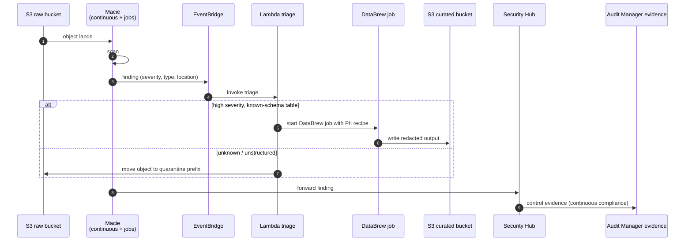
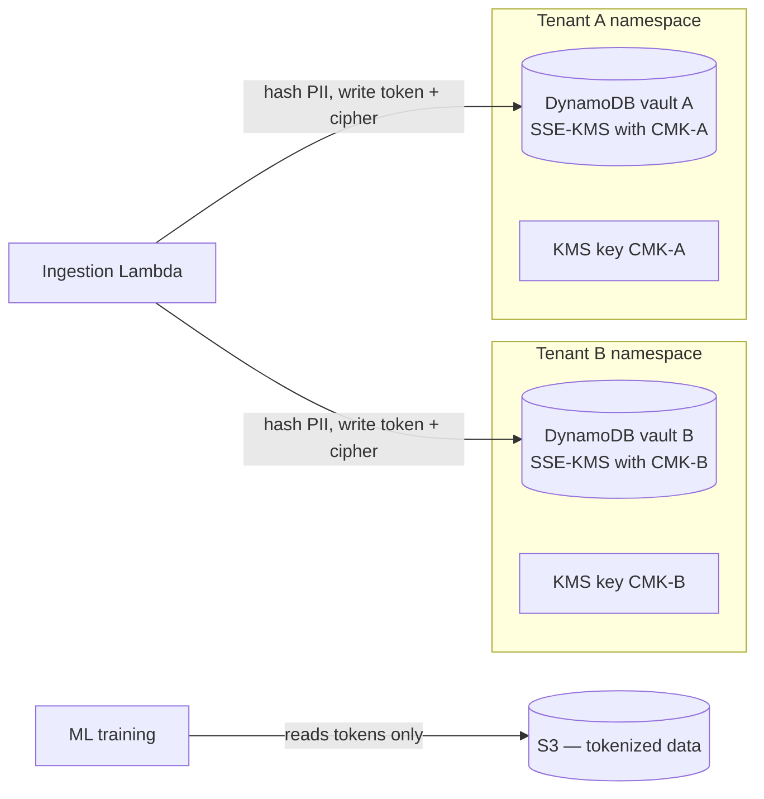
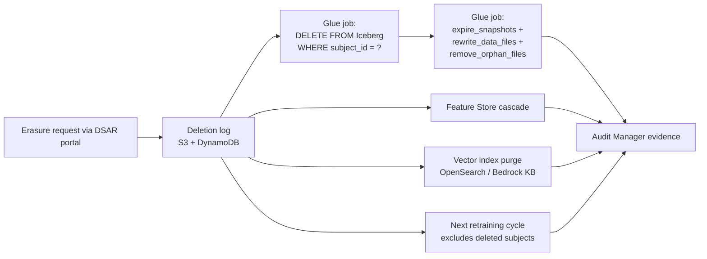
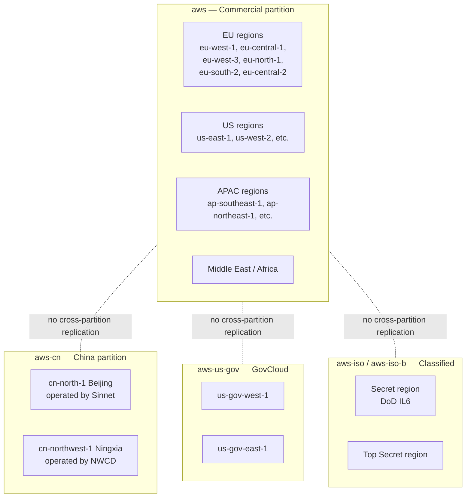
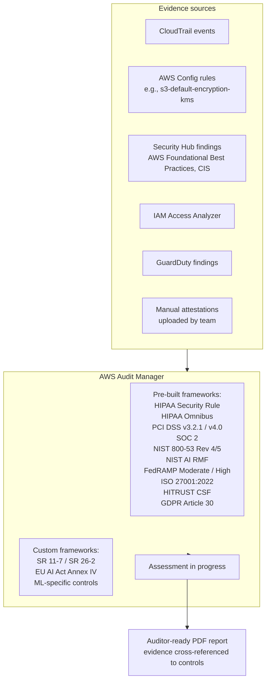

# Chapter 56 — Compliance & Data Residency: PII, PHI, GDPR, HIPAA on AWS

> **Goal of this chapter:** to teach you to read every MLA-C01 question that smells of compliance the way a regulator reads it — by tracing *legal obligation* → *AWS control* → *ML-engineer choice*. By the end of this chapter you should be able to answer, without hesitation: "Is Ground Truth Plus HIPAA-eligible?" (no — and that answer alone is worth two exam points); "If I delete a row from an Iceberg table today, when is it actually gone?" (not until snapshot expiry runs, which is the GDPR snapshot trap); "Why is SSE-S3 wrong for PHI?" (no audit trail of key use, customer-managed CMK is the defensible baseline); "What does Bedrock Global cross-region inference mean for data residency?" (nothing — your prompt may land anywhere on the planet, which is why Schrems II-strict pipelines must use Geographic instead). Compliance on AWS is *architectural*. It is not a service you turn on. It is a series of choices you make — at table-format time, at partitioning time, at training time, at inference time, at registration time — that either create or foreclose an audit answer twelve months from now.

---

## 56.1 The thesis: compliance is an architecture choice, not a service

Most teams who fail an audit do not fail because they were unlucky. They fail because someone in the room — usually a smart, well-intentioned engineer — believed one of these four sentences and built a system on top of it:

1. "AWS is HIPAA-certified, so we're fine."
2. "We've enabled Macie; we're covered for PII."
3. "We deleted the row from the table, so the user is forgotten."
4. "Bedrock is encrypted, so PHI in prompts is safe."

Every one of those sentences is wrong, and the *way* they are wrong is the substance of this chapter. AWS is **HIPAA-eligible**, not HIPAA-compliant on your behalf. Macie scans S3 only, samples by default, and surfaces *findings* — it does not redact. A deleted Iceberg row lives on in snapshots until expiry runs, which under default settings is 5 days, and which under naïve 90-day "we keep snapshots for incident recovery" retention is non-compliant by design. Bedrock encrypts your data, yes — but the Global cross-region inference profile may route your PHI-laden prompt to a region where Bedrock is not on the BAA, and the model invocation log contains the *original unmodified prompt* even when Guardrails redacted the response.

The exam guide hits this surface in **Task 1.3** (apply data integrity and prepare data for modeling — including PII/PHI handling, anonymization, masking) and **Task 4.3** (secure AWS resources for ML solutions — including regulatory compliance, BAA, encryption obligations). Expect 3–6 directly compliance-flavored items, plus another 4–8 questions where the regulated-workload framing changes the right answer. A typical pattern: the question reads like a vanilla labeling-workflow design question, then drops the sentence "the images contain patient injuries" in the last clause — and that single phrase eliminates Mechanical Turk, Vendor Workforce on Ground Truth, AND Ground Truth Plus, leaving Private Workforce on Ground Truth as the only HIPAA-eligible answer. The exam pays you for catching the phrase. It pays you twice if you can name *why* Ground Truth Plus is excluded (Plus uses an AWS-managed workforce outside the BAA boundary, per the AWS HIPAA Eligible Services Reference as of 2026-05-22).

Compliance, in short, is not a feature you flip on. It is a series of architectural choices, each one of which either creates an audit answer or forecloses one. The auditor's job is to read CloudTrail, the bucket policies, the KMS key policies, the Lake Formation grants, the Iceberg table properties, and the Model Cards, and to ask: "If a regulator demanded proof tomorrow, what would you hand them?" Every chapter of this section is in service of letting you answer that question with a service name plus an artefact, not a shrug.

---

## 56.2 The shared-responsibility line — what you own vs. what AWS owns

The exam tests, again and again, whether you know **which side of the shared-responsibility line each control sits on**. The mnemonic is: *AWS gives you the building blocks; you build the compliant system.*

```mermaid
flowchart LR
    subgraph AWS_RESP[AWS responsibility — Security OF the cloud]
        A1[Physical data centers]
        A2[Hypervisor + hardware]
        A3[Service-level certifications<br/>SOC, ISO, PCI, HIPAA-eligibility list,<br/>FedRAMP Moderate/High, IL5]
        A4[KMS HSM crypto modules<br/>FIPS 140-2/140-3]
    end

    subgraph CUST_RESP[Customer responsibility — Security IN the cloud]
        C1[Choose HIPAA-eligible services only<br/>for PHI workloads]
        C2[Sign the BAA via AWS Artifact]
        C3[Encrypt with CMK + restrict via IAM]
        C4[Classify data — Macie / resource tags]
        C5[Region selection for residency]
        C6[Audit log review + retention]
        C7[Lawful basis, consent, erasure pipeline<br/>for GDPR / CCPA]
        C8[Model-level controls — bias, explainability,<br/>output redaction via Guardrails]
    end

    AWS_RESP --> CUST_RESP
```



Concrete examples of which side a control sits on:

- "S3 is HIPAA-eligible" — AWS's side.
- "Our S3 PHI bucket has SSE-KMS encryption with a customer-managed CMK" — your side.
- "An EU region exists" — AWS's side.
- "Our SageMaker training job ran in eu-west-1, not us-east-1" — your side.
- "AWS holds a SOC 2 Type II report" — AWS's side.
- "We mapped that SOC 2 report to our controls in Audit Manager" — your side.
- "Macie has a managed identifier for US Social Security Numbers" — AWS's side.
- "We enabled Macie on every account in the Organization and route findings to Security Hub" — your side.

If you can sort any AWS feature into one of those two columns, you can read the question's stem and pick the right tool. Almost every wrong answer on a compliance question is wrong because it sits on the *other* side of the line from what the question is asking for. ("How do we prove the bucket is HIPAA-compliant?" — the right answer is *your* enabling-evidence work, not AWS's pre-existing certifications.)

A useful one-liner to commit to memory: **the BAA covers AWS's controls; it does not cover yours.** Signing it does not make your application compliant. It only makes AWS's services legally usable as building blocks for a compliant application that you still have to construct.

---

## 56.3 The PII / PHI identification toolkit

There are four AWS-native services for finding sensitive data in *data at rest* or *data in motion*, plus Bedrock Guardrails for the LLM runtime case. The right one depends on **where the data lives** and **whether you need detect-at-rest or detect-at-runtime**.

| Tool | Data location | Mode | Output | Cost model | Best for |
|---|---|---|---|---|---|
| **Amazon Macie** | S3 only | Continuous automated discovery OR scheduled jobs | Findings (severity-scored) in EventBridge / Security Hub | Per-GB scanned + per-object inspected | Discovering unexpected PII/PHI in data lakes; ongoing posture |
| **Comprehend `DetectPiiEntities`** | Any (you pass the text) | Real-time API call | Entity list with offsets + types | Per character | Runtime detection inside Lambda/Glue; redacting text *before* it lands |
| **Comprehend Medical `DetectPHI`** | Any clinical text | Real-time API call | PHI entity list (clinically aware) | Per character | HIPAA workloads where clinical PHI ≠ generic PII (MRN, encounter IDs, dosages) |
| **Glue DataBrew PII transforms** | S3, Glue Catalog, Redshift, JDBC | Recipe step in a transformation job | Transformed dataset written back | Per session-minute | Column-level mask / hash / encrypt / replace for known-PII columns |
| **Glue Data Quality** | Glue tables | Scheduled DQDL rule evaluations | Quality findings | Per DPU | *Schema integrity* — uniqueness, completeness, regex match — NOT PII detection |
| **Bedrock Guardrails — sensitive-info filter** | LLM prompts + responses | Inline on every Invoke | Block / mask / detect-only | Per 1K text-units | Generative-AI runtime — stop the model from echoing SSNs, financial info, custom regex |

### 56.3.1 Amazon Macie — S3 only, and you must know it

Macie scans **S3 and only S3**. Not EBS, not EFS, not RDS, not DynamoDB, not Redshift, not Lake Formation governed tables, not OpenSearch, not vector indexes, not the local disk of an EC2 instance. If a question reads "discover PII in our Redshift warehouse" or "scan our DynamoDB table for unexpected SSNs," **Macie is the wrong answer**. The right answers in that family are Comprehend `DetectPiiEntities` invoked from a Lambda or Glue job, DataBrew PII transforms (which can read from Redshift / JDBC), or column-level grants in Lake Formation. Cross-link forward: this is the same trap you saw building the data-quality pipeline in Chapter 21 (PII pattern catalogue) — the Macie scope is the most-tested fact in the whole compliance surface.

⚠️ **Exam alert.** Macie is S3-only. Any question that asks you to discover PII outside S3 — Redshift, DynamoDB, EFS, an OpenSearch cluster, a DocumentDB collection, a SageMaker Feature Store offline store using a non-S3 backend — Macie is wrong by definition. The exam reuses this distractor pattern often enough that it has become a meme in study groups. Memorise: *Macie scans S3*.

Macie has two scan modes, both heavily tested:

**(a) Automated sensitive-data discovery** is the default-on mode (GA 2023). It samples objects across **all general-purpose S3 buckets in the account continuously**. Statistical sampling — not exhaustive scan, not every byte of every object. Cost: a small per-bucket-per-month fee plus per-object inspection (a few cents per 1,000 objects). Cheap enough to leave on permanently in production. Output: a per-bucket sensitivity score (0–100) and findings. The right answer for "*continuously monitor* S3 for sensitive data with low overhead." The wrong answer for "*prove* a bucket is free of PII" — sampling does not prove absence.

**(b) Sensitive Data Discovery Jobs** is the exhaustive mode. You target specific buckets or prefixes and run a full scan of every matching object. Cost: per-GB inspected — meaningfully more expensive than automated discovery, especially at petabyte scale. Output: a full inventory of findings, suitable as **audit evidence**. The right answer for "generate a complete inventory of PII in this bucket for the auditor" or "pre-flight check before opening this bucket to a regulated workload."

**Managed identifiers + custom identifiers.** Macie ships with 100+ built-in managed data identifiers grouped by category (financial, health, US-specific, EU-specific, credentials). The PHI identifier set was expanded in 2023 to include Medicare/Medicaid IDs, NPI, DEA, and similar. You can also define **custom data identifiers** using a regex plus optional keyword proximity — for example, a regex for your internal patient-ID format anchored by the keyword "MRN" appearing within 50 characters.

### 56.3.2 Comprehend `DetectPiiEntities` — the runtime API

Comprehend `DetectPiiEntities` is a **synchronous text API**. You hand it a string (≤100 KB per call); it returns the list of detected entities as `(Type, Score, BeginOffset, EndOffset)` tuples. Entity types include `NAME, ADDRESS, AGE, AWS_ACCESS_KEY, AWS_SECRET_KEY, BANK_ACCOUNT_NUMBER, BANK_ROUTING, CREDIT_DEBIT_NUMBER, CREDIT_DEBIT_CVV, CREDIT_DEBIT_EXPIRY, DATE_TIME, DRIVER_ID, EMAIL, INTERNATIONAL_BANK_ACCOUNT_NUMBER, IP_ADDRESS, MAC_ADDRESS, PASSPORT_NUMBER, PASSWORD, PHONE, PIN, SSN, URL, USERNAME, VEHICLE_IDENTIFICATION_NUMBER` — plus the set grows periodically. Two related endpoints:

- `ContainsPiiEntities` returns a boolean (cheaper if you only need a yes/no).
- `StartPiiEntitiesDetectionJob` is the async batch variant for S3-resident text corpora.

Comprehend also exposes a **PII redaction job** (`StartPiiEntitiesDetectionJob` with `Mode=ONLY_REDACTION`) that emits redacted text back to S3 — perfect as a pre-Bedrock-RAG pipeline step that strips PII before documents land in a knowledge base.

**Comprehend Medical `DetectPHI`** is a *separate* API (and HIPAA-eligible). It is clinically aware: it recognises medication names with dosages, anatomical references, lab results, and clinical IDs (MRN, encounter numbers). For unstructured clinical notes, Comprehend Medical is almost always the right answer over generic Comprehend. The exam's tell: if the question says "clinical notes," "EHR," "discharge summary," "radiology report" — reach for Comprehend Medical.

### 56.3.3 DataBrew PII transforms — column-level remediation for known-schema data

DataBrew sits in the curation layer (Bronze → Silver). For tabular data with **known PII columns**, you don't need to *detect* — you need to *transform*. DataBrew ships eight PII transformations:

| Transform | Behaviour | Reversible? | When to use |
|---|---|---|---|
| **Mask** | Replace each char with a fixed token (e.g., `*`), preserving format | No | UI display, demo datasets |
| **Hash** | SHA-256 (configurable) — same input → same hash | One-way (deterministic) | Joining datasets on PII without revealing it; hashed email → session ID |
| **Encrypt — deterministic** | AES with a CMK; same input → same ciphertext | Yes (with KMS access) | Joinable analytics, reversible by privileged services |
| **Encrypt — probabilistic** | AES with random IV; same input → different ciphertext each row | Yes | Strongest confidentiality; not joinable |
| **Decrypt** | Reverse the encrypt transforms | — | Re-identify under controlled access |
| **Replace** | Substitute with a fixed or random value from a lookup | No (mapping may or may not be kept) | Synthetic test data |
| **Shuffle** | Randomly permute the column within the dataset | No | De-link a row from its values while preserving distribution; weak privacy guarantee |
| **Nullify** | Drop the value (set to NULL) | No | Hard deletion / right-to-erasure within a column |

DataBrew transforms operate on **Glue-cataloged tables, S3, Redshift, JDBC** — broader than Macie's S3-only scope. Recipes are versioned JSON documents that compliance can review and check into git — which is exactly why finserv teams prefer DataBrew over Comprehend in batch mode: the *recipe is auditable*.

### 56.3.4 Glue Data Quality — *not* a PII tool

Glue Data Quality enforces **schema and data-integrity rules** using **DQDL** (Data Quality Definition Language) — `RowCount > 1000`, `IsUnique "patient_id"`, `Completeness "email" > 0.95`, regex matches, freshness windows. It is the right answer for "ensure the labeled dataset has no NULL labels," "verify uniqueness of customer_id," "alert when row count drops 20%." It is the **wrong** answer for "detect PII." It complements Macie and Comprehend; it does not substitute for them. The exam uses Glue DQ as a distractor when the question stem is about *structural* integrity, not sensitive-data detection.

### 56.3.5 Bedrock Guardrails — the LLM runtime story

For generative AI, the **Bedrock Guardrails sensitive-information filter** is the answer when the question says "the LLM should never echo a customer's SSN" or "we need PII filtering on both prompts and responses." Forward link: Chapter 60 covers Guardrails end-to-end; here we cover only the PII-filter slice. The key facts:

- **Two actions per entity**: `BLOCK` (refuse the entire turn) or `ANONYMIZE`/`MASK` (replace with `{NAME}`, `{EMAIL}`, etc.). A third detect-only mode (`NONE`) just reports without acting.
- **Independent input vs. output controls** — set `inputAction` and `outputAction` separately. The canonical pattern: anonymize on input (don't trust the user), block on output (don't trust the model).
- **Built-in PII entities span six groups** (this list is exam-fodder; memorise the groups, not every entity):
  - **General**: ADDRESS, AGE, NAME, EMAIL, PHONE, USERNAME, PASSWORD, DRIVER_ID, LICENSE_PLATE, VEHICLE_IDENTIFICATION_NUMBER.
  - **Finance**: CREDIT_DEBIT_CARD_CVV, CREDIT_DEBIT_CARD_EXPIRY, CREDIT_DEBIT_CARD_NUMBER, PIN, INTERNATIONAL_BANK_ACCOUNT_NUMBER, SWIFT_CODE.
  - **IT**: IP_ADDRESS, MAC_ADDRESS, URL, AWS_ACCESS_KEY, AWS_SECRET_KEY.
  - **USA**: US_BANK_ACCOUNT_NUMBER, US_BANK_ROUTING_NUMBER, US_INDIVIDUAL_TAX_IDENTIFICATION_NUMBER, US_PASSPORT_NUMBER, US_SOCIAL_SECURITY_NUMBER.
  - **Canada**: CA_HEALTH_NUMBER, CA_SOCIAL_INSURANCE_NUMBER.
  - **UK**: UK_NATIONAL_HEALTH_SERVICE_NUMBER, UK_NATIONAL_INSURANCE_NUMBER, UK_UNIQUE_TAXPAYER_REFERENCE_NUMBER.
- **Custom regex entities** with optional name + description; **no lookaround support** in the regex engine.
- **Probabilistic detection** — Guardrails is an ML model, not pattern-only. It needs context; a bare 9-digit number with no surrounding context may not classify confidently.
- **KMS-encryptable** with a CMK; tag-able; versioned. Guardrails get their own cross-region profile parameter (`crossRegionConfig.guardrailProfileIdentifier`); choose a geographic profile to keep evaluations inside (say) the EU.

⚠️ **Exam alert — the Guardrails log-leak trap.** The sensitive-info filter has three documented limitations the exam loves:
1. The filter does **not** apply to tool-use / function-call outputs.
2. The filter does **not** redact **model invocation logs**: the `input` field written to CloudWatch Logs always contains the *original unmodified prompt*. If you log model invocations and the prompt contains an SSN, the SSN is in CloudWatch — Guardrails did not touch it. The defensive layer is **CloudWatch Logs data protection** (a separate feature) that masks at log time.
3. The `match` field in the API `trace` object returns the **original PII value, not the masked version**, by design so callers can implement downstream logic. If your application logs traces, those traces leak PII.

In other words: Guardrails protects the *response* but does not protect the *log of the request*. Many teams discover this on month four of production when the security team audits CloudWatch and finds SSNs.

---

## 56.4 The five anonymization patterns

There are five canonical patterns for de-identifying data on AWS. The exam doesn't go deep on cryptography here — but it does test "which pattern, which service, when."

### 56.4.1 The pattern catalogue

| Technique | What it does | AWS service(s) | Reversibility |
|---|---|---|---|
| **Masking** | Visually obscure (e.g., `***-**-1234`) | DataBrew, Comprehend redaction, Bedrock Guardrails (mask mode), Lake Formation cell-level filters | No |
| **Hashing** | One-way transform (SHA-256, optional salt) | DataBrew, Lambda + boto3 | One-way (deterministic if no salt or salt-per-tenant kept) |
| **Tokenization (vault)** | Replace PII with token; keep mapping in a separately-controlled vault | Custom: Lambda + DynamoDB + KMS, or third-party (Protegrity, Privitar, Vormetric) | Yes, with vault access |
| **Encryption (format-preserving or AES)** | Encrypt with CMK; ciphertext usable as a column value | DataBrew Encrypt transforms; KMS for column-level; OpenSearch field-level encryption | Yes, with KMS access |
| **Generalization / k-anonymity / Differential privacy** | Mathematically guarantee no record is uniquely identifiable; add calibrated noise | AWS Clean Rooms supports **differential privacy** (GA late 2023). For other uses, roll your own with `diffprivlib` / `opacus` in SageMaker. **No first-party AWS DP service outside Clean Rooms.** | Lossy by design |

### 56.4.2 Pattern A — Macie → EventBridge → Lambda → DataBrew/Glue redaction

The industry-canonical pattern for data-lake remediation. Macie discovers; EventBridge routes; Lambda triages; DataBrew (or a Glue job) remediates. Versioned, idempotent, audit-traceable.



Real-world cost note (from a 50 TB/month payer claims pipeline, anonymised but representative): Macie continuous discovery ~$2–4K/month; Comprehend `DetectPiiEntities` at scale ~$15–30K/month at $0.0001 per 100 chars; DataBrew jobs ~$1–2K/month; S3 Object Lambda compute ~$3–5K/month. Total: $20–40K/month for redaction *infrastructure*. That number is why mature teams cache redaction results aggressively — hash the input doc, store the redacted version, skip re-redaction for unchanged docs. The exam will not ask the cost, but it will ask which service does each step. Cross-link backward to Chapter 21 §4.3 where you built this pipeline as a Bronze→Silver curation pattern.

### 56.4.3 Pattern B — Comprehend PII redaction inline in text pipelines

The under-appreciated S3 Object Lambda pattern: put a Lambda in front of S3 `GetObject`. The Lambda calls Comprehend `DetectPiiEntities` → masks entities → returns the redacted stream to the caller. The reader thinks they are reading from S3; they are actually reading from a virtual view that redacts on read. Critical when downstream consumers (BI tools, ML training jobs, analyst notebooks) cannot be trusted to do redaction themselves.

Caveats: the Lambda has a 15-minute timeout cap (chunk big files); Comprehend has the 100 KB per-call ceiling (chunk longer documents and re-stitch offsets); S3 Object Lambda adds latency (typically 100–300 ms over baseline S3) which matters for streaming workloads.

### 56.4.4 Pattern C — Tokenization vaults (per-tenant)

For SaaS multi-tenant systems with strict tenant isolation, the canonical pattern is a **per-tenant tokenization vault**:



Properties of this design:

- Each tenant's PII is encrypted with **their own CMK**.
- Revoking access to a tenant's CMK destroys their ability to reverse tokens — this is **crypto-shredding**, the cleanest implementation of "right to erasure" via key destruction.
- The model trains on tokens; it never sees raw PII.
- Tokens are deterministic *within* a tenant (joins work) but **must NOT be deterministic across tenants** (or you leak cross-tenant identity through token collisions).

### 56.4.5 Pattern D — Bedrock Guardrails for LLM I/O

Covered in §56.3.5 above. The summary: Guardrails inline on every Invoke; input action `ANONYMIZE`, output action `BLOCK`; KMS-encrypted; geographic profile for residency. Cross-link forward to Chapter 60 for the full Guardrails feature set (content filters, denied topics, contextual grounding, automated reasoning policies).

### 56.4.6 Pattern E — Differential privacy (mention, with the AWS coverage caveat)

AWS does **not** have a first-party differential-privacy ML training service. The closest first-party offering is **AWS Clean Rooms with differential privacy** (GA late 2023, enhanced 2024), which adds calibrated noise to aggregate query results in cross-account data collaborations — useful for advertising or healthcare partnerships across organisations, but **not** a DP training framework. For DP-SGD on SageMaker, you bring your own library (`opacus`, `tensorflow-privacy`, `diffprivlib`). The exam will not ask you to implement DP, but it may include "differential privacy" as a distractor in a question about anonymization — recognise that AWS-native DP is Clean Rooms only.

---

## 56.5 GDPR — what an ML engineer must implement

GDPR (Regulation (EU) 2016/679) applies to processing of personal data of EU residents, regardless of where you are. It is *extraterritorial* — a US-based ML team training on EU user data is in scope. The penalty ceiling is the higher of €20M or 4% of global annual turnover, so the auditor's attention is real.

### 56.5.1 The rights, and what you build on AWS for each

| GDPR right | Plain meaning | What the ML engineer builds on AWS |
|---|---|---|
| **Right to access (Art. 15)** | User can demand all data you hold on them | Per-subject query against curated lake (Athena + Lake Formation tag-based access); export to a presigned S3 URL |
| **Right to rectification (Art. 16)** | User can correct inaccurate data | Idempotent updates in Iceberg/Hudi tables; cascaded refreshes of feature stores via Glue/Spark |
| **Right to erasure (Art. 17) — "right to be forgotten"** | User can demand deletion, including from *training datasets and models* | **Hardest one.** Iceberg v2/v3 deletion vectors + partition rewrite Glue jobs + deletion log + periodic retraining excluding deleted records + crypto-shredding via per-tenant CMK destruction |
| **Right to data portability (Art. 20)** | User can demand data in machine-readable form | Athena CTAS to JSON / CSV / Parquet, delivered via presigned URL |
| **Right to restrict processing (Art. 18)** | Pause processing on a user's data pending dispute | Tag-based filter at Glue / Lake Formation; per-row `processing_allowed` flag |
| **Right not to be subject to automated decision-making (Art. 22)** | User can demand human review of an algorithmic decision | A2I (Augmented AI) human-review loop; documented review workflow |
| **Right to explanation (Recital 71 / Art. 22)** | User can demand an explanation of an automated decision | **SageMaker Clarify SHAP per-prediction** values; **SageMaker Model Cards** documenting purpose & limitations |
| **Data minimization (Art. 5(1)(c))** | Process only what you need | Don't ingest unneeded columns; Lake Formation column-level grants; project early in Glue/Spark |
| **Purpose limitation (Art. 5(1)(b))** | Don't reuse data for incompatible purposes | Document purpose in Model Cards; per-purpose pipelines |
| **Consent + lawful basis (Art. 6)** | One of: consent, contract, legal obligation, vital interests, public task, legitimate interests | Track lawful basis in a per-record column; consent management platform (OneTrust, Cookiebot) feeds a Glue table |
| **Cross-border transfer (Ch. V)** | EU personal data leaves the EU only under specified safeguards | Region selection (eu-west-1 / eu-central-1 / eu-west-3 / eu-north-1 / eu-south-2); Standard Contractual Clauses; SCC + Transfer Impact Assessment (post-Schrems II) |

### 56.5.2 The right-to-erasure pipeline on AWS — and the snapshot trap

Right to erasure is the GDPR right that breaks the most ML pipelines. Naïve S3 + Parquet data lakes are **append-only** — there is no row-level delete. Three problems compound:

1. **Raw data lake.** Append-only Parquet partitions. Deleting one row means rewriting the whole partition.
2. **Training datasets.** Snapshots may have been copied to feature stores, into Bedrock knowledge bases, into vector indexes (OpenSearch, Pinecone). All must be cascaded.
3. **Trained models.** A model that has memorised training data (well-documented in LLMs) can leak it. The pragmatic compliance position — supported by EDPB guidance — is to maintain a deletion log and **retrain periodically excluding deleted records**, documenting the cadence and the residual-risk acceptance.

Modern table formats fix problem (1). **Apache Iceberg v2** introduced positional + equality delete files (lazy "merge-on-read" deletes — the row stays in the data file but is masked by a delete file at read time). **Iceberg v3** adds **deletion vectors** stored as Puffin files: one bitmap per data file per snapshot, consolidated, no file-level merge at read. On AWS, the writers are: **AWS Glue 5.x**, **EMR**, **Athena (Iceberg/Hudi/Delta)**, **Redshift Spectrum**, and **S3 Tables** (managed Iceberg, GA 2024). S3 Tables enables deletion vectors and automatic snapshot expiry by default.

⚠️ **Exam alert — the Iceberg snapshot trap.** Iceberg tables maintain **snapshots** for time travel. The default `history.expire.max-snapshot-age-ms` is **5 days**; default `min-snapshots-to-keep` is **1**. **A row "deleted" today is still in yesterday's snapshot, retrievable via time travel, until that snapshot expires.** If you keep 90 days of snapshots for incident recovery and a user demands erasure under GDPR's "without undue delay" standard (interpreted as ~30 days by EU DPAs), **you are non-compliant by design**. The fix is to set snapshot retention to ≤30 days *or* run targeted snapshot rewrites for each erasure request, then run the `expire_snapshots` + `rewrite_data_files` + `remove_orphan_files` chain to physically purge:

```sql
ALTER TABLE my_table SET TBLPROPERTIES (
  'history.expire.max-snapshot-age-ms' = '86400000',  -- 1 day
  'history.expire.min-snapshots-to-keep' = '1'
);
CALL system.expire_snapshots('my_table');
CALL system.rewrite_data_files('my_table');
CALL system.remove_orphan_files('my_table');
```

Without this chain, you have not actually deleted anything — and an auditor reading the table properties will catch it inside ten minutes. The exam tests this pattern because it is the single most common production bug in GDPR-touching data lakes.



**The "erasure broke our model" operational story.** A European fintech, recommendation model serving 30M users, trained monthly on 90 days of clickstream + transaction data, ~1,200 erasure requests per month and growing. Month 14: a user files a Subject Access Request that reveals their data was used to train the *current production model* and demands proof of removal from the model itself, not just the lake. Engineering says "we'll retrain." Finance says "a full retrain is $80K of Trainium compute plus six days of monitoring rollout — and the next SAR will demand the same." The accepted resolution, signed off by their Data Protection Authority in writing, is a four-part change: (1) Iceberg v3 + deletion vectors + 14-day snapshot retention down from 90; (2) daily targeted snapshot rewrites for all erasure requests completing within the 30-day SLA; (3) monthly cadence retrain with all-known-erasures applied — *no* out-of-cycle retrains for individual SARs; (4) a risk register entry framing the residual model influence as "compatible with state of the art" under GDPR's "appropriate technical and organisational measures" standard. This is the pragmatic answer the exam will not test directly but which informs the right answer on every "what about the model?" question. *Machine unlearning* (SISA, SCRUB) remains research, not production.

### 56.5.3 Right to explanation — Clarify + Model Cards

The right to explanation is interpreted variably across EU jurisdictions, but the consensus regulator expectation is: an auditable, per-decision rationale, comprehensible to a non-technical reviewer. The AWS stack:

- **SageMaker Clarify SHAP** — per-prediction explanations (online via Clarify Online Explainability, batch via Clarify processing jobs). For LLMs, partial-dependence and sampling-based explanations are emerging (Clarify added LLM evaluation in 2024).
- **SageMaker Model Cards** — structured artefact documenting model purpose, training data, performance, bias metrics, intended use, out-of-scope use. **Required column for any regulated workload.** Cross-link backward to Chapter 51 for the full Model Card schema.
- **Bias reports** — Clarify in `train` + `predict` modes — pre-training (data) bias and post-training (model) bias. Both go on the Model Card.

### 56.5.4 Schrems II, SCCs, adequacy — the cross-border transfer landscape

After **Schrems II** (CJEU 2020), transfers of EU personal data to the US are not blanketly lawful. You need one of:

- An **adequacy decision** — the **EU-US Data Privacy Framework** (in force since July 2023, replacing the invalidated Privacy Shield) currently covers AWS Inc.;
- **Standard Contractual Clauses (SCCs)** with a **Transfer Impact Assessment (TIA)**;
- **Binding Corporate Rules** (large enterprises only).

The AWS GDPR Data Processing Addendum, accepted via AWS Artifact, incorporates SCCs by reference. Many EU customers continue to use SCCs + a TIA as belt-and-braces given the lingering legal uncertainty around the Data Privacy Framework.

The practical implication for an ML engineer: **process EU personal data in EU regions** (eu-west-1, eu-central-1, eu-west-3, eu-north-1, eu-south-2, eu-central-2). Do not rely on legal mechanisms to paper over a region misconfiguration — the auditor reads CloudTrail, and CloudTrail tells the truth.

---

## 56.6 HIPAA — what an ML engineer must implement

HIPAA (US, 1996) governs **Protected Health Information (PHI)** held by covered entities (healthcare providers, health plans, clearinghouses) and their business associates (vendors that process PHI on their behalf — including AWS).

### 56.6.1 The BAA — where it comes from, what it covers

To process PHI on AWS, you **must** sign the AWS Business Associate Addendum via **AWS Artifact** (`AWS Artifact → Agreements → AWS Business Associate Addendum`). The BAA:

- Is a contract between AWS and you (the covered entity or business associate).
- Covers **only the HIPAA-eligible services** listed in the AWS HIPAA Eligible Services Reference (last updated 2026-05-22 as of this writing).
- Obliges AWS to follow the HIPAA Security Rule for the covered infrastructure.
- Does **not** make your application HIPAA-compliant by itself — you must still implement appropriate administrative, physical, and technical safeguards.

AWS Artifact is also where you download AWS's compliance attestations (SOC 1/2/3, ISO 27001, PCI DSS AoC, FedRAMP, HITRUST). It is the portal for *AWS's* compliance documents that you map into *your* compliance program.

### 56.6.2 The HIPAA-eligible services list — the matrix you must know

Per the AWS HIPAA Eligible Services Reference, the ML/data services relevant to MLA-C01 break down as follows.

**Eligible for PHI processing under the BAA:**
- Amazon **SageMaker AI** — with sub-service exclusions (see below).
- Amazon **Bedrock** — added to the BAA in 2024; **confirm region scope** per account.
- Amazon **Comprehend** and **Comprehend Medical**.
- Amazon **Textract**, **Translate**, **Transcribe** (including HealthScribe), **Polly**, **Rekognition**.
- AWS **HealthLake**.
- Amazon **Q Business**.
- AWS **Glue** and **Glue DataBrew**.
- Amazon **Athena**, **Redshift**, **Lake Formation**.
- Amazon **S3**, **KMS**, **Lambda**, **Step Functions**, **EventBridge**, **CloudTrail**, **CloudWatch**.
- **Amazon Macie**.
- **AWS Audit Manager**.

**Excluded from SageMaker BAA coverage (and therefore from PHI use):**
- SageMaker **Studio Lab** (the free, no-AWS-account learning environment).
- **Ground Truth Plus** — *not HIPAA-eligible*. This is confirmed from primary source (AWS HIPAA Eligible Services Reference). The distinction matters because **Ground Truth itself IS eligible** when used with a **Private Workforce**.
- **Public Workforce** (Mechanical Turk) and **Vendor Workforce** for all SageMaker features (Ground Truth, A2I).

**Q Developer** (the coding assistant) is not currently on the eligible list — do not paste PHI into Q Developer chat.

⚠️ **Exam alert — Ground Truth Plus is NOT HIPAA-eligible.** This is the most-tested compliance fact in the entire exam. Memorise the labeling-workforce matrix for PHI workloads:

| Workforce option | HIPAA-eligible? | When to use |
|---|---|---|
| Mechanical Turk (Public) | **No** | Never for PHI/PII |
| Vendor Workforce (managed list of AWS-curated vendors) | **No** | Non-PHI workloads only |
| Ground Truth **Plus** (AWS turnkey labeling service) | **No** | Non-PHI workloads only |
| Ground Truth with **Private Workforce** (your own annotators inside your VPC/Identity Center) | **Yes** | The only PHI-eligible labeling answer |
| Amazon A2I with Private Workforce | **Yes** | PHI-eligible human review of model outputs |

The canonical exam question: "We need to label 50,000 medical images of patient injuries; we have no labeling infrastructure; the data is PHI." Four options: Mechanical Turk (wrong); Ground Truth with vendor workforce (wrong); Ground Truth Plus (wrong — most-picked distractor!); Ground Truth with a Private Workforce (right). The reason candidates pick Plus is because the question stem says "we have no labeling infrastructure" — Plus *sounds* like the AWS-managed answer. It is, just not for PHI.

### 56.6.3 PHI encryption — why CMK, not SSE-S3

HIPAA Security Rule §164.312(a)(2)(iv) and §164.312(e)(2)(ii) treat encryption as an *addressable* (not strictly *required*) specification, but HHS guidance plus HITRUST plus the AWS BAA effectively make it required in practice. The defensible baseline is:

- **At rest**: SSE-KMS with a **customer-managed CMK**. Not SSE-S3, not AWS-managed key. The reason: with a CMK you control rotation, you can revoke via key policy, and **CloudTrail logs every `kms:Decrypt` call** so you have an audit trail of key use. SSE-S3 leaves you no such trail.
- **In transit**: TLS 1.2+ end-to-end. For VPC traffic use PrivateLink + VPC endpoints + (where required) MACsec on Direct Connect, or Nitro-instance VPC encryption between EC2 instances.
- **Application-level**: optional field-level encryption (DynamoDB encryption client, OpenSearch field-level encryption) for columns that must be opaque even to privileged operators.

⚠️ **Exam alert — CMK required for PHI, not SSE-S3.** The exam stem will say something like "PHI must be encrypted at rest; auditor needs to see who decrypted what." The wrong answers are SSE-S3 (no key-use audit trail) and SSE-KMS with the AWS-managed key (you don't control rotation; you can't restrict via key policy beyond IAM). The right answer is SSE-KMS with a **customer-managed CMK**, with CloudTrail capturing every `kms:Decrypt`, and a key policy restricting decrypt to a narrow set of IAM roles. Cross-link backward to Chapter 55 for the full KMS deep-dive (key types, rotation, multi-region keys, grants).

CMK additional configuration for PHI:
- Annual automatic rotation enabled.
- Key policy restricting `kms:Decrypt` to specific IAM roles (training role, inference role).
- Cross-account access (if used) gated by `kms:ViaService` and `aws:PrincipalOrgID`.
- For multi-region replication, **only to other HIPAA-eligible regions** where the BAA covers KMS in that region.

### 56.6.4 CloudTrail Data events for PHI

CloudTrail **management events** are on by default. For PHI you also need **CloudTrail Data events**:

- **S3 Data events** — every `GetObject`, `PutObject`, `DeleteObject` on the PHI bucket logged. Costs ~$0.10 per 100K events; significant for hot buckets but required for HIPAA audit.
- **Lambda Data events** — every Invoke of PHI-processing Lambdas.
- **DynamoDB Data events** — every read/write to PHI tables.
- **KMS** — `kms:Decrypt`, `kms:Encrypt` come through *management* events; data events generally not needed for KMS.

Retention: HHS guidance is **6 years** for HIPAA audit logs. Implementation: CloudTrail Lake (managed, queryable) or CloudTrail → S3 with Object Lock in compliance mode and a 6-year retention policy.

### 56.6.5 HHS Safe Harbor — the 18 PHI identifiers

§164.514(b)(2) defines **18 PHI identifiers** that must be removed to consider data "de-identified" under the Safe Harbor method (no expert determination needed): names; geographic subdivisions smaller than state; dates more specific than year (with exceptions for ages ≥90); phone; fax; email; SSN; MRN; health-plan beneficiary numbers; account numbers; certificate/license numbers; vehicle identifiers and license plates; device identifiers and serial numbers; URLs; IPs; biometric identifiers (fingerprints, voice); full-face photos; and "any other unique identifying number, characteristic, or code." Macie's PHI managed identifiers + Comprehend Medical + DataBrew nullify/hash transforms collectively cover this 18-item checklist.

The "Optum gotcha": even after Safe Harbor de-identification, *clinical narrative text* contains quasi-identifiers — rare diagnoses, unusual procedure combinations — that can re-identify a patient against external datasets. Production teams add a **k-anonymity check** on de-identified output: if any combination of (age band, ZIP3, diagnosis, procedure) appears fewer than k=5 times in the dataset, the record is further generalised or dropped.

---

## 56.7 CCPA / CPRA and the US state-law patchwork

CCPA (2018, California, effective 2020) and CPRA (2023 amendments) are the most stringent of the ~20 US state privacy laws. They are **GDPR-flavored but lighter** and apply to California residents whose data is processed by businesses meeting size thresholds.

| Right | CCPA / CPRA | GDPR equivalent |
|---|---|---|
| Right to know | "What categories and specific pieces of personal info do you hold?" | Right of access (Art. 15) |
| Right to delete | Same as erasure | Right to erasure (Art. 17) |
| Right to opt out of "sale" or "sharing" | Specific to ad-tech; "Do Not Sell My Personal Information" link | No exact analog |
| Right to correct | CPRA addition | Right to rectification (Art. 16) |
| Right to limit use of sensitive PI | CPRA addition; SSN, geolocation, race, health, biometric | Special-category protections (Art. 9) |
| Right not to be subject to automated decision-making | CPRA regulations finalised 2025 — still emerging | Art. 22 |
| Lawful basis | Not required (notice + opt-out instead) | Required (Art. 6) |

For an ML platform, **the GDPR pipeline you build also satisfies CCPA** with minor additions: the "Do Not Sell" workflow, sensitive-PI tagging, and notice at or before collection.

Similar laws are proliferating: Virginia CDPA, Colorado CPA, Connecticut CTDPA, Utah UCPA, Texas TDPSA, plus 2024–2026 entries (Oregon, Montana, Tennessee, Iowa, Indiana, Florida FDBR). None materially change the AWS architecture, but each adds notice + opt-out flow obligations to product teams. **California AB 2013** (effective Jan 1, 2026) additionally requires **training-data transparency** — public posting of high-level documentation of training datasets — which is exactly what SageMaker Model Cards exist to satisfy.

---

## 56.8 Industry-specific regulations — SR 11-7 / SR 26-2, FDA SaMD, FedRAMP, PCI DSS

### 56.8.1 SR 11-7 → SR 26-2 — US bank model risk management

**SR 11-7** is interagency Federal Reserve / OCC guidance on **model risk management** for US-regulated banks (issued 2011). Three components: model development, implementation, and use; model validation (independent, ongoing, with "effective challenge"); governance, policies, and controls (board reporting, inventory, roles).

**SR 26-2 (April 17, 2026)** is the revised interagency guidance that explicitly extends SR 11-7's scope to AI/ML and agentic systems. Operationally:

- **Vendor models are now in scope.** Bedrock foundation models, third-party APIs — the bank's model risk function must inventory and validate them as if developed internally. "Vendor" is no longer a shield.
- **Continuous validation expected** — not annual. Drift monitors with automated alerts to the validation team.
- **GenAI-specific guidance** on hallucination risk, prompt injection, output-format drift.
- **Outcomes analysis** (the perennial weak area — industry surveys put ~65% of banks weak here) now includes "fairness outcomes" as a first-class metric.

On AWS, the build is: **SageMaker Model Registry + Model Cards + Model Monitor + Clarify + Audit Manager**. Model Registry is the inventory; Model Cards are the documentation (effective challenge, intended use, limitations); Model Monitor + Clarify are continuous validation (drift, bias); Audit Manager collects evidence mapped to SR 11-7 / SR 26-2 controls (you build this as a custom Audit Manager framework — AWS does not ship one out of the box); EventBridge + SNS surface board notifications when controls trip.

### 56.8.2 FDA SaMD — Software as a Medical Device

**FDA Software as a Medical Device** classification applies when an ML model's output is *intended* to diagnose, treat, or prevent disease. Classes:

- **Class I** — low risk (wellness apps).
- **Class II** — moderate risk (most diagnostic ML — e.g., diabetic retinopathy screening); requires **510(k) clearance**.
- **Class III** — high risk (life-supporting); requires **PMA** (premarket approval).

The **AI/ML SaMD Action Plan** (2021, updated through 2024) introduced the **Predetermined Change Control Plan (PCCP)** — vendors document *in advance* the algorithm updates they may make post-clearance without resubmitting (e.g., retraining on more data). The FDA's accommodation of continuous-learning ML without abandoning premarket review.

For an AWS ML engineer building SaMD: SageMaker Model Cards become the FDA submission backbone; Model Registry approval gates become the change-control evidence; Clarify becomes the bias/fairness evidence; CloudTrail + Audit Manager become the lifecycle evidence.

### 56.8.3 FedRAMP / FISMA / DoD IL5 — federal cloud

US federal customers cannot use a cloud service that has not gone through **FedRAMP** authorisation:

- **FedRAMP Moderate** — most general-purpose US-federal workloads. AWS Commercial (us-east-1, us-west-2, etc.) is FedRAMP Moderate.
- **FedRAMP High** — sensitive but unclassified. AWS GovCloud (us-gov-west-1, us-gov-east-1) is FedRAMP High.
- **DoD Impact Level 4 / 5 (IL4 / IL5)** — controlled unclassified, mission-critical. AWS GovCloud is IL4/IL5.
- **DoD IL6** — Secret-level classified. AWS Secret Region (separate authorisation, separate network).

**FISMA** is the underlying statute mandating FedRAMP. **NIST 800-53** is the controls catalog FedRAMP draws from. **NIST AI RMF** (2023) and **NIST 800-218 SSDF** (2022) are the emerging ML-specific frameworks federal agencies map onto.

For MLA-C01: GovCloud regions exist; PHI/PII can be processed there; not every commercial service is in GovCloud (check service availability per region); CMK keys and BAA terms operate the same way. Practical note: not every Bedrock foundation model in commercial Bedrock is in GovCloud Bedrock — check the matrix every quarter.

### 56.8.4 PCI DSS 4.0 — payment card data

**PCI DSS 4.0** (in force; 4.0.1 from 2024, full enforcement of all new requirements by March 2025) governs storage, processing, or transmission of cardholder data (CHD). ML use cases: fraud-detection models, credit scoring, recommendation systems trained on transaction history.

Requirements that matter for ML:
- Encrypt CHD at rest with strong cryptography (PCI requires AES-128+ or similar; AWS KMS exceeds).
- Mask card numbers in display (max 6 leading + 4 trailing visible).
- Logging of all access to CHD (CloudTrail Data events on CHD buckets).
- Quarterly vulnerability scans + annual penetration test.

The Macie managed identifier `CREDIT_CARD_NUMBER` plus Bedrock Guardrails finance entities (CREDIT_DEBIT_CARD_NUMBER, CREDIT_DEBIT_CARD_CVV, CREDIT_DEBIT_CARD_EXPIRY, PIN, BANK_ACCOUNT_NUMBER, SWIFT_CODE, INTERNATIONAL_BANK_ACCOUNT_NUMBER) collectively cover the PCI detection surface.

---

## 56.9 Data residency — AWS controls

Data residency means "data must remain physically inside a defined jurisdiction (country, region, regulatory zone)." It is distinct from privacy compliance — a workload can be PHI-free and PII-free but still subject to residency (e.g., government datasets that cannot leave the country).

### 56.9.1 The four AWS partitions



A region-selection question is almost always answerable from the partition: "China-resident user data" → `aws-cn`. "US federal classified" → `aws-us-gov` or `aws-iso`. "EU resident" → an EU region in the commercial `aws` partition. "Cross-partition replication" is not a thing — you cannot copy a bucket from `us-east-1` to `cn-north-1`.

### 56.9.2 SCP deny-by-region — the canonical residency control

The single most common AWS-native residency control is a **deny-by-region Service Control Policy** at the Organization level:

```json
{
  "Version": "2012-10-17",
  "Statement": [{
    "Sid": "DenyAllOutsideEU",
    "Effect": "Deny",
    "NotAction": [
      "iam:*",
      "organizations:*",
      "route53:*",
      "cloudfront:*",
      "support:*",
      "trustedadvisor:*",
      "globalaccelerator:*",
      "waf:*"
    ],
    "Resource": "*",
    "Condition": {
      "StringNotEquals": {
        "aws:RequestedRegion": ["eu-west-1", "eu-central-1"]
      }
    }
  }]
}
```

Critical details:
- `aws:RequestedRegion` is the condition key that restricts regional service calls.
- **Global services** (IAM, Organizations, Route 53, CloudFront, IAM Access Analyzer, Global Accelerator, WAF v1) **cannot** be region-restricted — exclude them via `NotAction`, or your `iam:GetUser` will be denied and you will lock yourself out of the account.
- SCPs cap *all* identities in the OU/account including the root user. Test in a sandbox OU before applying broadly.
- **Resource Control Policies (RCPs, late 2024)** complement SCPs by capping *resource* policies — e.g., deny any bucket policy that allows cross-region replication out of the EU.

**AWS Control Tower** ships a "Region deny" landing-zone guardrail that implements this SCP for you across a pre-defined list of regions; use it instead of hand-rolling SCPs unless you have unusual region needs.

### 56.9.3 Bedrock cross-region inference — Geographic vs. Global

Bedrock has TWO cross-region inference modes, and the difference is a compliance landmine.

| Mode | Routing scope | Data residency | Cost | SCP requirement |
|---|---|---|---|---|
| **Geographic** | Within a geography (US, EU, APAC, Japan, Australia) | Within the geographic boundary | Standard | Allow all destination regions in the profile |
| **Global** | Any commercial region worldwide | **NO residency guarantee** | ~10% cheaper | Allow `aws:RequestedRegion: unspecified` |

⚠️ **Exam alert — Bedrock Global ≠ regional residency.** Geographic CRIS keeps your request inside (say) the EU geography; Global CRIS may route your prompt to *any* commercial region on the planet where Bedrock has spare capacity. For GDPR-sensitive workloads, the maximum permissible is Geographic CRIS pinned to the EU. For Schrems II-strict workloads, do **not** enable CRIS at all — use direct model invocation in `eu-west-1` or `eu-central-1` only, and accept the lower throughput. For HIPAA/PHI workloads, the Global profile may route to a region where Bedrock is not yet on the BAA — Geographic US is the only safe choice.

Additional Bedrock CRIS facts:
- Cross-region traffic **never traverses the public internet**; it stays on the AWS network, encrypted in transit between regions.
- CloudTrail logs are written in the **source** region; look for `additionalEventData.inferenceRegion` to discover where the request actually executed.
- No additional routing cost; you pay the source-region price.
- CRIS can route to regions not manually enabled in your account.
- The Global profile requires an SCP condition `aws:RequestedRegion: unspecified` to be allowed — without it, the call fails.

### 56.9.4 KMS multi-region keys — a residency caveat

KMS **multi-region keys** replicate **the key material** across regions while keeping the same key ID. Convenient for cross-region replication (S3 CRR with KMS encryption). For data residency this is a *trap*: replicating a KMS key from `eu-west-1` to `us-east-1` means the key material physically exists in the US, even if the data using it never leaves the EU. Some EU regulators (notably French CNIL post-Schrems II) consider this a transfer.

Defensive posture: use **single-region keys** per region for residency-strict workloads; replicate ciphertext only within the same regulatory boundary; or use **AWS CloudHSM** with your own keys that never leave the HSM.

### 56.9.5 S3 Object Lambda for residency-aware transformations

A specialised pattern: place an **S3 Object Lambda Access Point** in front of a bucket. The Lambda inspects the caller's geography (from STS / Identity Center / a custom claim) and applies different masking — return full data to EU callers, return name-and-address-redacted data to non-EU callers reading the same object. Rarely tested in MLA-C01 but a clean architectural option for shared datasets.

---

## 56.10 EU AI Act, NYC LL 144, Colorado SB 26-189 — algorithmic accountability

### 56.10.1 EU AI Act (Regulation (EU) 2024/1689)

Entered into force August 1, 2024. Phased application:

| Date | What applies |
|---|---|
| Feb 2, 2025 | Prohibited AI practices ban + AI literacy obligations |
| Aug 2, 2025 | GPAI (general-purpose AI) obligations |
| **Aug 2, 2026** | **High-risk system requirements — the big one** |
| Aug 2, 2027 | High-risk systems embedded in regulated products |

**Two paths to high-risk** (Article 6):
- **Annex I**: AI is a safety component of a product covered by existing EU product law (medical devices, machinery, automotive, aviation).
- **Annex III**: AI is used in biometrics, critical infrastructure, education, **employment**, **essential public/private services** (credit scoring, insurance, social benefits), law enforcement, migration, or justice.

Most enterprise ML systems hit **Annex III** — hiring, credit, insurance, healthcare. If you build any of these for EU users, your model is high-risk and the August 2, 2026 obligations apply.

The 12-item compliance burden includes a risk management system; data governance (training/validation/test data must be "relevant, representative, free of errors, complete"); technical documentation (Annex IV — think Model Card on steroids); record-keeping (automatic logs of risk-relevant events); human oversight (designed-in, not bolted-on); accuracy/robustness/cybersecurity (measurable, declared); a quality management system; conformity assessment before market; CE marking + EU database registration; post-market monitoring; incident reporting.

MLOps platform impact: the operational pattern emerging in 2026 is a **centralised AI inventory service** (often Audit Manager + a custom DynamoDB-backed registry) that every model registration flows through. SageMaker Model Registry metadata gets new required fields: `risk_category`, `intended_purpose`, `data_governance_record_uri`, `human_oversight_plan_uri`, `conformity_assessment_status`. A CI/CD compliance gate blocks promotion to production if any required field is missing or stale.

### 56.10.2 NYC Local Law 144 (in force July 5, 2023)

Applies to **Automated Employment Decision Tools (AEDTs)** that "substantially assist or replace discretionary decision making" for hiring or promotion of NYC residents. Three obligations:

1. **Bias audit by an independent auditor** within the past 12 months.
2. **Publish audit summary** on the employer's website.
3. **Notice to candidates** ≥10 business days in advance, including what data is collected.

Penalty: $500 first day + $1,500 per day continuing. Per DCWP rules, the audit computes *selection rate* and *impact ratio* by sex, race/ethnicity, and intersectional category. Impact ratio = group selection rate / most-selected-group selection rate. Below 0.8 (the 4/5ths rule) flags adverse impact.

The operational challenge: protected-class labels are often not collected, so the audit reconstructs them via **Bayesian Improved Surname Geocoding (BISG)** or similar. Audit auditors accept BISG; courts may not.

### 56.10.3 Colorado SB 26-189 (effective January 1, 2027)

Colorado's revised AI Act (signed May 14, 2026, repealing the original SB 24-205) regulates **automated decision-making technology (ADMT)** in "consequential decisions" — education, employment, housing, finance, insurance, healthcare, government services. Hybrid of EU AI Act + CCPA: consumer opt-out right from solely-automated consequential decisions; transparency obligations; impact assessments.

### 56.10.4 The patchwork operational pattern

A single hiring model serving US-wide candidates must comply with NYC LL 144, Illinois AI Video Interview Act, Colorado AI Act (from 2027), California ADMT regs (finalised 2025), and counting. The emerging response is a **jurisdiction-aware serving layer** that detects candidate location, applies the most-restrictive compliance profile, logs the decision and which rules applied, and falls back to human review if any compliance gate trips.

---

## 56.11 The audit-evidence stack — Audit Manager + Config + Security Hub

Three services with overlapping mandates. The clean mental model:

- **AWS Config** — "What is the configuration of every resource? Does it drift from policy?"
- **AWS Security Hub** — "What security findings exist across all my accounts?"
- **AWS Audit Manager** — "Collect evidence mapped to a compliance framework so I can hand it to an auditor."



**Audit Manager pre-built frameworks include**: HIPAA Security Rule (Feb 2003) + HIPAA Omnibus Final Rule; PCI DSS v3.2.1 and v4.0; SOC 2 Trust Services Criteria; NIST 800-53 Rev 4 + Rev 5; NIST CSF; **NIST AI RMF** (added 2024); FedRAMP Moderate + High; ISO 27001:2022; HITRUST CSF; GDPR Article 30 (Records of Processing).

**Custom frameworks** — bank model-risk teams typically build a custom **SR 11-7 / SR 26-2 framework** mapping each expectation to AWS service evidence (Model Registry approval state, Clarify reports, Model Card existence).

**Evidence sources**: automated (CloudTrail events, Config rule evaluations, Security Hub findings, IAM Access Analyzer, GuardDuty) plus manual attestations uploaded by the team (training rosters, signed policies).

The **exam decoder**: "Automated compliance evidence collection for HIPAA/PCI/SOC 2 across the AWS estate" → **AWS Audit Manager**. Distractors are Config (evaluates rules only), Security Hub (aggregates findings only), and AWS Artifact (stores *AWS's* attestations, not your evidence). Audit Manager is the only service that *maps your evidence to a framework's controls*.

**Cost reality at midsize-enterprise scale**: Config ~$5–10K/month (per-config-item recording + per-rule evaluation); Security Hub ~$1–3K/month (per-finding); Audit Manager ~$1.25 per resource assessment + $1.25 per assessment per month. Combined: $10–20K/month for the evidence stack. The board sees this as a "compliance tax" until the first audit, at which point the line is reframed as "audit-cost-avoidance."

The ML-specific custom-control gap: Audit Manager's pre-built frameworks do not cover things like "every production model has a documented bias audit" or "every Model Card has an intended-use section." You build those as **custom controls** that pull evidence from Model Cards, Clarify reports, and SageMaker Pipelines execution metadata.

---

## 56.12 The five canonical exam traps — quiz table

Memorise this table. If you can answer all five without hesitation, you are solid on this chapter.

| # | Trap stem | The bait answer | The right answer | Why |
|---|---|---|---|---|
| 1 | "Label 50K medical images of patient injuries; no labeling infra" | **Ground Truth Plus** | **Ground Truth with Private Workforce** | GT Plus is NOT HIPAA-eligible per the AWS HIPAA Eligible Services Reference; Plus uses an AWS-managed workforce outside the BAA |
| 2 | "Discover PII in our Redshift warehouse" | **Macie** | **Comprehend `DetectPiiEntities` in a Lambda/Glue job**, or DataBrew PII transforms | Macie scans S3 only; nothing else |
| 3 | "Stop the chatbot from echoing customer SSNs" | DataBrew, Macie | **Bedrock Guardrails sensitive-info filter** with `US_SOCIAL_SECURITY_NUMBER` set to BLOCK on output | Guardrails is the LLM-runtime tool; DataBrew is batch, Macie is S3-only |
| 4 | "PHI must be encrypted at rest; auditor needs to see who decrypted what" | **SSE-S3** or **SSE-KMS (AWS-managed key)** | **SSE-KMS with a customer-managed CMK** + CloudTrail | SSE-S3 leaves no audit trail of key use; only a CMK gives you `kms:Decrypt` CloudTrail events |
| 5 | "EU customer demands right to erasure; data is in S3 Iceberg tables" | **Delete the row** | **Delete the row + expire snapshots + rewrite data files + remove orphan files + cascade to Feature Store + log deletion + schedule retraining** | The Iceberg snapshot trap — deleted rows live on in snapshots until expiry runs |

---

## 56.13 The auditor's checklist — your final pre-flight

When a HIPAA / SOC 2 / GDPR auditor sits down with your AWS ML platform, they ask roughly this list. Train your architecture to answer each with a service plus an artefact.

| Auditor question | AWS answer |
|---|---|
| "Show me you signed the BAA." | AWS Artifact → Agreements → AWS BAA (signed PDF). |
| "Show me which services you use process PHI/PII." | Tag every resource with `data-classification = phi / pii / confidential / internal / public`. Config rule fails non-tagged resources. |
| "Show me you only process PHI on HIPAA-eligible services." | Config rule + SCP denying `sagemaker:CreateGroundTruthPlusProject` for accounts tagged `phi`. |
| "Show me data is encrypted at rest with a CMK." | Config rule `s3-default-encryption-kms`; KMS key policies; bucket-policy `aws:KMSKey` condition. |
| "Show me you log all access to PHI." | CloudTrail Data events on the PHI bucket; CloudTrail Lake or 6-year retention via S3 Object Lock. |
| "Show me a deletion request was honoured." | DynamoDB deletion-log table + Iceberg `DELETE` job logs + snapshot-expiry timestamps. |
| "Show me which IAM principals can decrypt PHI." | IAM Access Analyzer + KMS key policy + Org SCP. |
| "Show me your model's explainability output." | SageMaker Clarify per-prediction SHAP; Model Card. |
| "Show me your bias metrics." | Clarify pre-training + post-training bias reports linked from Model Card. |
| "Show me your model inventory." | SageMaker Model Registry with approval status; Audit Manager evidence. |
| "Show me automated controls evidence." | AWS Audit Manager with the relevant framework. |
| "Show me cross-border transfer controls." | SCP region-deny; AWS GDPR DPA in Artifact; Bedrock Geographic CRIS profile. |
| "Show me data minimisation." | Lake Formation column-level grants; Glue projection in curation. |
| "Show me consent / lawful basis tracking." | Per-record `lawful_basis` column from consent management platform. |

---

## 56.14 Exercises

**Exercise 56.1 — The labeling-workforce trap.** Your team needs to label 100,000 chest X-rays for a pneumonia-detection model. The data is PHI (HIPAA-covered). Rank the four labeling options (Mechanical Turk, Vendor Workforce, Ground Truth Plus, Ground Truth with Private Workforce) from worst to best for this workload, and write one sentence explaining *why* Ground Truth Plus — which sounds like the AWS-managed answer — is wrong.

**Exercise 56.2 — The Iceberg snapshot fix.** Your S3 Iceberg table currently has `history.expire.max-snapshot-age-ms = 7776000000` (90 days) and `min-snapshots-to-keep = 30`. A GDPR auditor flags this as non-compliant. (a) Why? (b) What ALTER TABLE statement do you run? (c) What additional system procedures do you call to physically purge the deleted data? (d) On what cadence do you schedule the expiry job, and why?

**Exercise 56.3 — Bedrock CRIS profile selection.** Your team operates a customer-service chatbot powered by Claude 3.5 Sonnet via Bedrock. You have three deployments: (a) US consumer, no residency requirements; (b) EU consumer, GDPR with Schrems II strict posture; (c) US healthcare, PHI-bearing prompts. For each, pick: direct invocation, Geographic CRIS, or Global CRIS — and justify in one line.

**Exercise 56.4 — The Guardrails log-leak.** A regulator notices that your CloudWatch Logs contain customer SSNs in the `input` field of Bedrock model-invocation logs, even though you have a Guardrails policy that anonymises `US_SOCIAL_SECURITY_NUMBER` on input. (a) Is this a Guardrails bug? (b) What is the correct mitigation? (c) Name two other places PII may leak that Guardrails does not protect.

**Exercise 56.5 — Macie scope quiz.** For each of the following data stores, state YES (Macie can scan it directly) or NO (you need an alternative tool, and name the alternative): S3 bucket; SageMaker Feature Store offline store backed by S3; Redshift warehouse; DynamoDB table; OpenSearch index; EFS filesystem; Glue Data Catalog table backed by S3 Iceberg.

**Exercise 56.6 — The CMK requirement.** Your platform team has standardised on SSE-S3 for all S3 buckets to "simplify operations." A new project ingests PHI claims data. (a) Why is SSE-S3 insufficient? (b) Write the bucket-policy `Condition` block that enforces SSE-KMS with a specific CMK on every `PutObject`. (c) What additional CloudTrail configuration captures `kms:Decrypt` events for HIPAA-required 6-year retention?

**Exercise 56.7 — Audit Manager vs. Config vs. Security Hub.** Match each auditor question to the single best AWS service: (a) "Show me which S3 buckets do not have default encryption." (b) "Show me all critical security findings across my 50 accounts in the last 30 days." (c) "Generate a PDF audit package mapped to HIPAA Security Rule controls for our annual audit." (d) "Continuously evaluate that all SageMaker endpoints are KMS-encrypted." For each, name the service and explain in one line why the other two are wrong.

---

## 56.15 Cross-references and what's next

Backward links:
- **Chapter 21 (PII pattern catalogue)** — built the Macie → DataBrew → Comprehend pipeline as a Bronze→Silver curation step; this chapter recasts the same pipeline in compliance language.
- **Chapter 51 (Model Cards)** — the full Model Card schema; this chapter uses Model Cards as the "right to explanation" + EU AI Act Annex IV + FDA SaMD submission artefact.
- **Chapter 55 (KMS for ML)** — the full KMS deep-dive (key types, rotation, multi-region keys, grants); this chapter uses CMK + key policies as the HIPAA-defensible PHI encryption baseline.

Forward link:
- **Chapter 60 (Bedrock Guardrails)** — the full Guardrails feature set (content filters, denied topics, contextual grounding, automated reasoning policies); this chapter covered only the sensitive-information-filter slice.
- **Chapter 64 (Audit-ready exam strategy)** — translates the compliance fluency you just built into a question-reading playbook: how to recognise the regulatory keyword in a stem and immediately eliminate the bait answer.

The unifying insight from this chapter, worth repeating because the exam tests it repeatedly: **compliance is not a service you turn on; it is an architecture you choose.** The choice happens at table-format time (Iceberg vs. raw Parquet), at partitioning time (hash vs. date), at training time (sharded vs. monolithic), at inference time (single-region vs. Geographic vs. Global CRIS), at encryption time (SSE-S3 vs. SSE-KMS with a CMK), and at registration time (Model Card populated or not). Every one of those decisions either creates or forecloses an audit answer twelve months later. The MLE who builds compliant systems is not the MLE who memorises a regulation — it is the MLE who, on every architecture call, asks one extra question: *"If a regulator demanded proof tomorrow, what would we hand them?"*

---

## 56.16 Sources

### Primary AWS documentation
- [AWS HIPAA Eligible Services Reference](https://aws.amazon.com/compliance/hipaa-eligible-services-reference/) — authoritative list of services covered by the AWS BAA; verified 2026-05-22.
- [Amazon Macie — Data classification & discovery](https://docs.aws.amazon.com/macie/latest/user/data-classification.html).
- [Macie — Managed data identifiers (PII)](https://docs.aws.amazon.com/macie/latest/user/mdis-reference-pii.html).
- [Macie — Managed data identifiers (PHI)](https://docs.aws.amazon.com/macie/latest/user/mdis-reference-phi.html).
- [Macie — Automated sensitive data discovery](https://docs.aws.amazon.com/macie/latest/user/discovery-asdd.html).
- [Comprehend — DetectPiiEntities API](https://docs.aws.amazon.com/comprehend/latest/dg/how-pii.html).
- [Comprehend Medical — DetectPHI API](https://docs.aws.amazon.com/comprehend-medical/latest/dev/textanalysis-phi.html).
- [Glue DataBrew — PII transformations reference](https://docs.aws.amazon.com/databrew/latest/dg/recipe-actions-reference.html).
- [Glue Data Quality — DQDL reference](https://docs.aws.amazon.com/glue/latest/dg/dqdl.html).
- [Bedrock Guardrails — Sensitive information filters](https://docs.aws.amazon.com/bedrock/latest/userguide/guardrails-sensitive-filters.html).
- [Bedrock — Geographic cross-region inference](https://docs.aws.amazon.com/bedrock/latest/userguide/geographic-cross-region-inference.html).
- [Bedrock — Global cross-region inference](https://docs.aws.amazon.com/bedrock/latest/userguide/global-cross-region-inference.html).
- [Securing Amazon Bedrock cross-Region inference — AWS ML Blog](https://aws.amazon.com/blogs/machine-learning/securing-amazon-bedrock-cross-region-inference-geographic-and-global/).
- [SageMaker Clarify — SHAP explanations](https://docs.aws.amazon.com/sagemaker/latest/dg/clarify-shapley-values.html).
- [SageMaker Model Cards](https://docs.aws.amazon.com/sagemaker/latest/dg/model-cards.html).
- [AWS Audit Manager — Framework library](https://docs.aws.amazon.com/audit-manager/latest/userguide/framework-overview.html).
- [AWS Audit Manager — HIPAA Security Rule framework](https://docs.aws.amazon.com/audit-manager/latest/userguide/HIPAA.html).
- [KMS — Multi-region keys](https://docs.aws.amazon.com/kms/latest/developerguide/multi-region-keys-overview.html).
- [Apache Iceberg on AWS — Glue 5.0 support + snapshot expiry](https://docs.aws.amazon.com/glue/latest/dg/aws-glue-programming-etl-format-iceberg.html).
- [Working with Apache Iceberg V3 — S3 Tables](https://docs.aws.amazon.com/AmazonS3/latest/userguide/working-with-apache-iceberg-v3.html).
- [Service Control Policies — `aws:RequestedRegion` example](https://docs.aws.amazon.com/organizations/latest/userguide/orgs_manage_policies_scps_examples_general.html).
- [Tutorial: S3 Object Lambda + Comprehend PII redaction](https://docs.aws.amazon.com/AmazonS3/latest/userguide/tutorial-s3-object-lambda-redact-pii.html).

### Regulator and standards primary sources
- [GDPR — full text (EUR-Lex)](https://eur-lex.europa.eu/eli/reg/2016/679/oj).
- [HHS — HIPAA Security Rule §164.312](https://www.hhs.gov/hipaa/for-professionals/security/laws-regulations/index.html).
- [HHS — De-identification under HIPAA (Safe Harbor 18 identifiers)](https://www.hhs.gov/hipaa/for-professionals/privacy/special-topics/de-identification/index.html).
- [Federal Reserve SR 11-7 — Model Risk Management Guidance](https://www.federalreserve.gov/supervisionreg/srletters/sr1107.htm).
- [Federal Reserve SR 26-2 — Revised guidance on model risk management (April 17, 2026)](https://www.federalreserve.gov/supervisionreg/srletters/SR2602.pdf).
- [FDA — AI/ML-Based SaMD Action Plan](https://www.fda.gov/medical-devices/software-medical-device-samd/artificial-intelligence-and-machine-learning-software-medical-device).
- [NIST AI Risk Management Framework 1.0](https://www.nist.gov/itl/ai-risk-management-framework).
- [PCI DSS 4.0 — official spec](https://www.pcisecuritystandards.org/document_library/).
- [CCPA / CPRA — California AG](https://oag.ca.gov/privacy/ccpa).
- [EU AI Act — Regulation (EU) 2024/1689](https://eur-lex.europa.eu/eli/reg/2024/1689/oj).
- [EU AI Act — Article 6 classification rules](https://ai-act-service-desk.ec.europa.eu/en/ai-act/article-6).
- [NYC Local Law 144 — Automated Employment Decision Tools (DCWP)](https://www.nyc.gov/site/dca/about/automated-employment-decision-tools.page).
- [Colorado SB 26-189 — Troutman Privacy analysis](https://www.troutmanprivacy.com/2026/05/colorado-legislature-passes-bill-to-repeal-and-replace-colorado-ai-act/).
- [EU-US Data Privacy Framework](https://www.dataprivacyframework.gov/).

### Industry practice sources
- [Detecting and Protecting PII in AWS — HanaByte (2025)](https://www.hanabyte.com/detecting-and-protecting-pii-in-aws-in-2025/).
- [Integrating Redaction of FinServ Data into ML Pipelines — AWS Architecture Blog](https://aws.amazon.com/blogs/architecture/integrating-redaction-of-finserv-data-into-a-machine-learning-pipeline/).
- [Common techniques to detect PHI and PII — AWS for Industries](https://aws.amazon.com/blogs/industries/common-techniques-to-detect-phi-and-pii-data-using-aws-services/).
- [Iceberg V3 deletion vectors and row lineage — AWS Big Data Blog](https://aws.amazon.com/blogs/big-data/accelerate-data-lake-operations-with-apache-iceberg-v3-deletion-vectors-and-row-lineage/).
- [GDPR Compliance with Apache Iceberg — Ryft.io](https://www.ryft.io/blog/gdpr-compliance-with-apache-iceberg-a-practical-guide).
- [Machine Unlearning in 2024 — Stanford CS (K. Liu)](https://ai.stanford.edu/~kzliu/blog/unlearning/).
- [Philips and AWS — PHI de-identification with ML](https://aws.amazon.com/blogs/industries/philips-and-aws-automate-phi-de-identification-with-machine-learning/).
- [Bedrock models get FedRAMP High + DoD IL4/5 in AWS GovCloud — AWS Public Sector](https://aws.amazon.com/blogs/publicsector/accelerating-government-innovation-amazon-bedrock-models-get-fedramp-high-and-dod-il-4-5-approval-in-aws-govcloud-us/).
- [SR 11-7 vs SR 26-2 — Sia Partners](https://www.sia-partners.com/en/insights/publications/sr-11-7-vs-sr-26-2-model-risk-management-modernization).
- [NYC LL 144 Compliance Guide — Warden AI (2026)](https://www.warden-ai.com/resources/hr-tech-compliance-nyc-local-law-144).
- [State AI laws — Cooley (April 2026)](https://www.cooley.com/news/insight/2026/2026-04-24-state-ai-laws-where-are-they-now).
