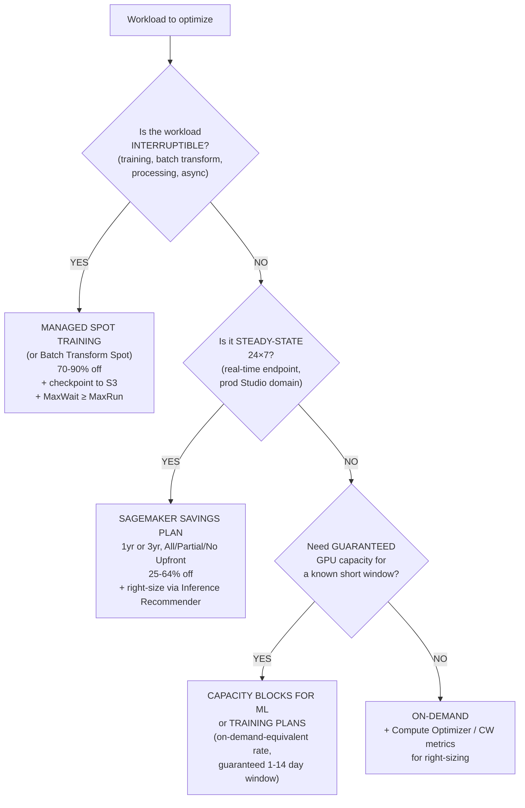
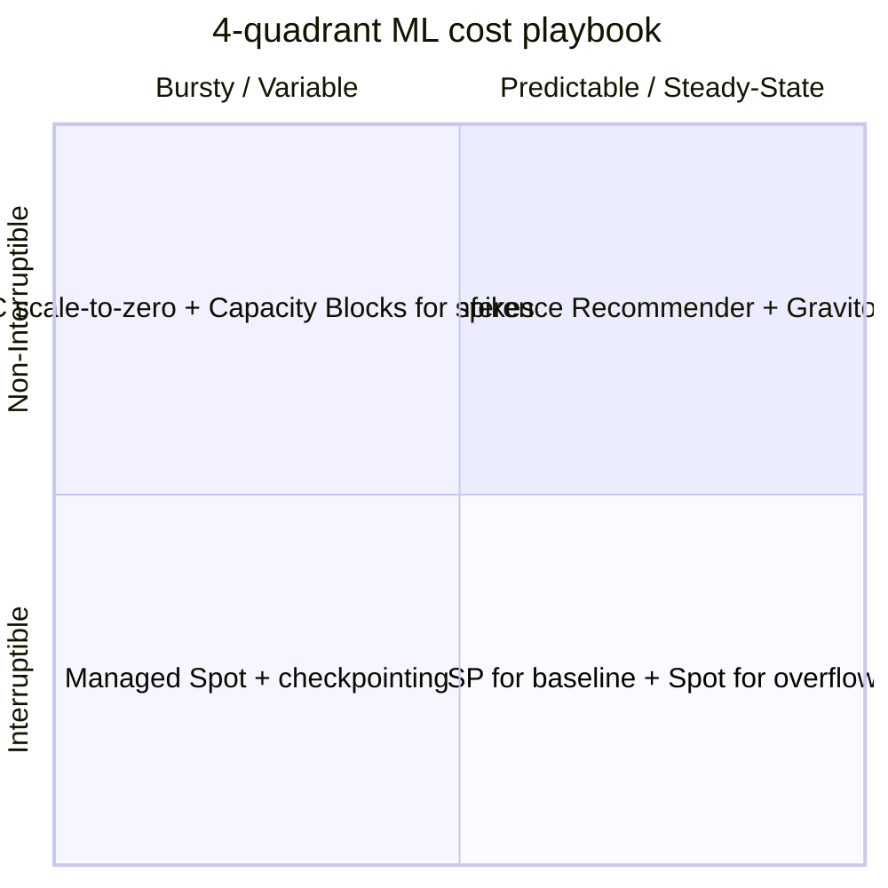
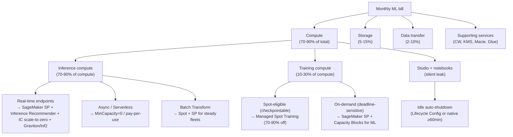

# Chapter 57 — Cost optimization: Spot, Reserved, Savings Plans, right-sizing

> **Goal of this chapter:** to make you fluent in the seven cost levers that AWS gives an ML engineer — Managed Spot Training, Savings Plans (Compute + SageMaker), Reserved Instances and Capacity Blocks, right-sizing tools (Inference Recommender + Compute Optimizer + CloudWatch), auto-stop patterns, custom silicon (Graviton/Inferentia/Trainium), and tag-based chargeback — and to give you the decision discipline to know which lever a given workload deserves. By the end of the chapter you should be able to read an exam stem like *"a team runs a 24-hour training job, can tolerate interruption, wants lowest cost on SageMaker"* and pattern-match to **Managed Spot Training with checkpointing and `MaxWaitTimeInSeconds ≥ MaxRuntimeInSeconds`** without re-reading the options. You should also be able to read *"a real-time SageMaker endpoint, lowest committed cost, no model architecture change"* and know that the answer is a **3-year all-upfront SageMaker Savings Plan plus an Inference Recommender right-sizing pass** — not a Reserved Instance (they do not exist for SageMaker) and not a Compute Savings Plan (it excludes SageMaker). This is the FinOps spine of Task 4.2 in the MLA-C01 exam guide; it is also the chapter that most directly translates into the dollar impact you can claim on a résumé.

---

## 57.1 Why cost discipline IS the architecture

There is a sentence that every senior ML platform lead at AWS-native shops eventually says out loud, usually after a bad billing month, and it is worth pinning at the top of this chapter:

> **Across the full lifecycle of a production ML model, inference is 70-90% of total compute spend.** Training is the photogenic line item; inference is what actually drains the budget.

Three independent sources — AWS's own Cloud Financial Management blog, the FinOps Foundation's ML cost benchmarks, and the public references from Anthropic, NVIDIA, and Salesforce — converge on this figure. Why is it so consistent? Because the arithmetic is invariant across teams: a frontier-model training run might cost $50M-$200M once or twice a year, but a *successful* product runs billions of inference requests at non-trivial per-request cost. Even within a single team, one GPU endpoint running 24×7 at roughly $3/hour costs about **$26,000/year**. Two of them — one primary, one shadow — and you are at $52K/year for *one model*. A scientist's training job spend over the same year is typically 10× lower.

The corollary, which the exam tests in subtle ways, is that **the lever you should reach for first depends on which side of that 70/30 split the workload sits on**:

- **Inference (the 70-90% bucket)** → Savings Plans are the primary lever, with right-sizing (Inference Recommender), elasticity (async/serverless/Inference Components), and silicon choice (Graviton, Inferentia2) stacked on top. **Spot is not available** for inference workloads — real-time, async, and serverless endpoints do not support it. This single fact reshapes the cost playbook for half your workloads.
- **Training (the 10-30% bucket)** → Managed Spot Training is the primary lever (up to 90% off), with checkpointing as the technical pre-requisite. Savings Plans cover the steady-state floor; Spot covers the bursty ceiling. For frontier-scale runs that need guaranteed GPU capacity, Capacity Blocks for ML and Training Plans replace Spot.

A senior MLE's first cost question for any workload is therefore not *"how do I save money?"* — that's too vague — but rather *"is this workload predictable or bursty, and is it interruptible or not?"* Those two binary questions give you four quadrants, and each quadrant has a primary tool. We will draw that quadrant grid explicitly in §57.13; everything else in the chapter is what fills the cells.

The deeper reframe is that **cost discipline IS the architecture** for production ML on AWS. The naïve mental model is "design the system, then make it cheap." The senior mental model is "the cost surface determines which serving topology, which training topology, and which silicon you can actually choose." A real-time endpoint with a strict p99 latency SLO and a small idle-traffic window is not the same architecture as a real-time endpoint with the same SLO but heavy 24×7 load. The first wants async + serverless + Inference Components scale-to-zero; the second wants a SageMaker Savings Plan plus right-sized provisioned capacity. Treat cost as a first-class architectural constraint and the rest of the design follows from it.

> ⚠️ **Exam alert.** When a question stem includes the phrase "lowest cost" or "most cost-effective," AWS is almost always pointing at one of the seven levers in this chapter — and the *order* of the candidate answers usually pairs the right lever with one trap (Compute SP for SageMaker, RI for SageMaker, Spot for endpoints, Compute Optimizer for SageMaker). Memorize the lever-to-workload mapping in §57.13 and you will eliminate two distractors before you finish reading the stem.

---

## 57.2 The cost surface for ML on AWS

Before you can optimize, you must know what you are paying for. AWS ML workloads spend money in five distinct buckets, each with its own dominant lever. The exam tests this surface explicitly — questions like *"the NAT Gateway bill exploded during training data download, what's the fix?"* are pure cost-surface recognition.

### 57.2.1 Compute (the dominant bucket — roughly 70-90% of most ML bills)

| Sub-workload | Billing model | Primary lever |
|---|---|---|
| **Training jobs** | Per instance-hour, ephemeral (cluster spins up + tears down per job) | **Managed Spot Training** (up to 90% off) |
| **Hyperparameter tuning (AMT)** | Per child-training-job hours | **Spot for child jobs** (`UseManagedSpotTraining=True`) |
| **Processing jobs** | Per instance-hour, ephemeral | **Spot not supported**; use SageMaker Savings Plans |
| **Real-time inference endpoints** | Per instance-hour, **even at idle** | **SageMaker Savings Plans** (up to 64% off), right-sizing, scale-to-zero patterns |
| **Async inference endpoints** | Per instance-hour, but can scale to zero (`MinCapacity=0`) | Scale-to-zero + SageMaker SP for steady floor |
| **Serverless inference** | **Per-request + memory-second**, no idle cost | Already pay-per-use; no extra lever beyond memory right-sizing |
| **Batch Transform** | Per instance-hour for job duration only; no idle | **Spot supported**; Savings Plans for steady batch fleets |
| **Studio apps (JupyterLab, Code Editor, RStudio)** | Per instance-hour, **billed while the app is "Running" even if idle** | Idle auto-shutdown lifecycle config + SageMaker SP |
| **HyperPod clusters** | Per instance-hour, persistent | **Capacity Blocks for ML** (ODCRs) or SP |

Two observations from this table are worth pulling out before we walk individual levers. **First**, the billing model for *real-time endpoints* is the single biggest cost trap in the SageMaker product surface — endpoints bill per instance-hour *even when handling zero requests*. The forgotten Friday-afternoon `ml.p4d.24xlarge` demo endpoint costs roughly $2,900 per instance × 24h × 4 days ≈ $11,000 over a long weekend, regardless of whether anyone hits it. Every cost-incident war story platform leads tell at re:Invent dinners (the canonical "Memorial Day $50K" story) is some variation of this one fact. **Second**, the billing models split cleanly into three patterns: (1) *ephemeral per-instance-hour* (training, processing, batch transform — Spot works), (2) *steady per-instance-hour with idle billing* (real-time endpoints, Studio apps — Spot does not work, SP is the right tool), and (3) *pay-per-use* (serverless inference — already cost-optimized). Once you can categorize a workload into one of these three patterns you have already eliminated half the possible levers.

### 57.2.2 Storage

| Service | Use in ML | Cost driver |
|---|---|---|
| **S3** | Training data, model artifacts, batch I/O, monitoring captures | Per-GB-month per storage class; requests; egress |
| **EBS gp3/io2** | Training instance local storage, notebook EBS | Per-GB-month + IOPS provisioned |
| **FSx for Lustre** | High-throughput POSIX file system for large GPU training | Per-GB-month + throughput tier |
| **EFS** | Shared notebook storage in Studio (`EFS` backing) | Per-GB-month with IA tier |

Storage is rarely the single biggest cost line, but it is the most-tested cost surface on the exam *outside of compute* because the answers are services you have already met in Parts C-D. The classic exam scenarios are: (1) move training data from S3 Standard to S3 Intelligent-Tiering when access patterns are unknown; (2) move infrequently accessed feature data to S3 Standard-IA or S3 Glacier Instant Retrieval; (3) use **FastFile** input mode instead of **File** mode to avoid duplicating the entire dataset onto the training instance's EBS volume. We covered FastFile in Chapter 19; if you flip back you will see that the cost framing was secondary in that chapter but is primary here — FastFile is, structurally, a cost optimization disguised as a performance optimization.

### 57.2.3 Data transfer — the silent cost driver

This is the single most common surprise in production ML bills. It is also the bucket where the answers are the most counter-intuitive.

- **Cross-AZ traffic** — free for SageMaker training-instance-to-S3 within the same Region, but cross-AZ traffic between EC2/EKS pods and an endpoint is billed at $0.01/GB each direction. At billions of inference requests/month, this is real money.
- **NAT Gateway** — $0.045/GB processed + $0.045/hour per NAT. If a training job in a private subnet downloads a 1 TB dataset from a public Hugging Face mirror via NAT, that is ~$45 in NAT processing charges alone, plus the hourly NAT cost. Fix: route via **S3 Gateway VPC Endpoint** (free for S3 traffic) or a **VPC interface endpoint** (~$0.01/hour + $0.01/GB, often cheaper at high volumes).
- **Public internet egress** — $0.05-$0.09/GB depending on Region. Pulling models from Hugging Face Hub in production at every endpoint cold-start = surprise bill.
- **Cross-Region replication** — explicit traffic charges; usually a deliberate DR decision, sometimes accidental cross-Region log replication.

### 57.2.4 Supporting services

| Service | Hidden ML cost |
|---|---|
| **CloudWatch Metrics** | Custom metrics $0.30/metric/month; **Model Monitor publishes one per violation** — at scale this adds up |
| **CloudWatch Logs** | $0.50/GB ingest + $0.03/GB-month storage; **default retention is "Never expire"** which is the #1 logs cost trap |
| **CloudWatch Logs Insights** | $0.005 per GB of data scanned |
| **KMS** | $1/key/month + $0.03 per 10,000 requests; SageMaker can call KMS thousands of times per training job |
| **Macie** | $1.25/GB-scanned for sensitive-data discovery on S3 — easy to scan a multi-TB training bucket by accident |
| **Glue / EMR** | DPU-hours; EMR Serverless and Glue Auto Scaling cut this |
| **Bedrock** | Per 1K input/output tokens; no idle cost on **On-Demand**; **Provisioned Throughput** is hourly-committed (1m or 6m) for guaranteed capacity |

The CloudWatch Logs default-retention trap deserves a specific callout. Every SageMaker training job, every endpoint, every processing job writes to a log group whose default retention setting is **Never Expire**. Six months into operating a fleet of 50 endpoints, the per-month logs storage bill is often a five-figure number that nobody noticed. Setting a 30- or 90-day retention on every log group is one of the highest-ROI 30-minute interventions you can run.

### 57.2.5 Exam tells for the cost surface

- "Endpoint costs money even when not handling requests" → real-time endpoint billing model; either scale to zero (async, serverless, IC) or down-size.
- "Notebook left running over the weekend" → idle auto-shutdown lifecycle config.
- "Training data downloaded over NAT" → S3 Gateway VPC Endpoint.
- "CloudWatch Logs bill exploded" → set explicit retention on log groups.

---

## 57.3 Managed Spot Training — the 90% lever

> **AWS source:** [Managed Spot Training in Amazon SageMaker AI](https://docs.aws.amazon.com/sagemaker/latest/dg/model-managed-spot-training.html). Back-reference: Chapter 33 walked through Spot training in the context of training infrastructure; this section is the cost-architecture view of the same mechanism.

### 57.3.1 Mechanism

Managed Spot Training uses EC2 Spot instances under the hood for SageMaker training jobs. AWS reclaims the instance when it needs the capacity back ("Spot interruption"), at which point SageMaker:

1. Captures the in-progress checkpoints from `/opt/ml/checkpoints/` into S3 (continuous sync via a sidecar).
2. Marks the job as "interrupted, waiting for capacity."
3. Polls Spot capacity. When capacity returns, it provisions a fresh instance, restores the checkpoints from S3 onto the new instance's `/opt/ml/checkpoints/`, and re-runs the entrypoint.
4. Your training script reads the checkpoint and resumes from the last completed step.

Savings up to **90%** versus on-demand. The **billable time formula** is published by AWS:

```
savings_pct = (1 - (BillableTimeInSeconds / TrainingTimeInSeconds)) * 100
```

`TrainingTimeInSeconds` includes Spot wait time; `BillableTimeInSeconds` is wall-clock minus the Spot-wait gaps. You only pay for the time the instance was actually running your code.

### 57.3.2 Required configuration

| Parameter | Required value | Purpose |
|---|---|---|
| `EnableManagedSpotTraining` | `True` | Opts the job into Spot |
| `StoppingCondition.MaxRuntimeInSeconds` | Your normal training-time budget | Wall-clock cap excluding Spot wait |
| `StoppingCondition.MaxWaitTimeInSeconds` | **Must be ≥ `MaxRuntimeInSeconds`** | Wall-clock cap *including* Spot wait. If exceeded, the job is killed. |
| `CheckpointConfig.S3Uri` | S3 path you own | Where checkpoints are continuously synced |
| `CheckpointConfig.LocalPath` | `/opt/ml/checkpoints/` (default) | Container path the sidecar watches |

```python
from sagemaker.estimator import Estimator

est = Estimator(
    image_uri=image,
    role=role,
    instance_count=2,
    instance_type="ml.g5.12xlarge",
    use_spot_instances=True,           # EnableManagedSpotTraining
    max_run=24 * 3600,                 # MaxRuntimeInSeconds = 24h
    max_wait=36 * 3600,                # MaxWaitTimeInSeconds = 36h (must be >= max_run)
    checkpoint_s3_uri="s3://my-bkt/ckpt/job-x/",
    checkpoint_local_path="/opt/ml/checkpoints/",
)
est.fit({"train": "s3://my-bkt/train/"})
```

The `max_wait > max_run` rule is exam-load-bearing. The reason: `MaxWaitTimeInSeconds` is wall-clock-including-Spot-wait — if Spot capacity is unavailable for 12 hours, then your 24-hour training job has only 24-12 = 12 hours of actual training time inside a 24-hour MaxWait, which is not enough. The convention is `max_wait = 1.5 × max_run` to 3 × `max_run`, depending on how scarce your target SKU is.

### 57.3.3 What is supported

| SageMaker job type | Spot supported? | Notes |
|---|---|---|
| **Training jobs** | **YES** | The flagship use case |
| **Hyperparameter tuning (AMT)** child training jobs | **YES** | `UseManagedSpotTraining=True` in the child training job definition — savings compound across the fan-out |
| **Processing jobs** | NO | Use Savings Plans instead |
| **Batch Transform jobs** | **YES** (since 2022) | `Transformer(use_spot_instances=True, ...)` — cost-effective offline scoring |
| **Real-time inference endpoints** | NO | Use SageMaker Savings Plans |
| **Serverless inference** | N/A | Already pay-per-use |
| **Async inference endpoints** | NO | Use SageMaker SP + scale-to-zero |
| **Studio apps / Notebook instances** | NO | Use idle auto-shutdown + SP |
| **HyperPod clusters** | NO | Use Capacity Blocks for ML (ODCRs) |

Three rows in this table are exam traps. **First**, Spot is unsupported on *every endpoint type* — real-time, async, and serverless all forbid it. The intuition is that endpoints serve user traffic that cannot tolerate a 2-minute interruption notice, so AWS does not expose Spot as an option at the API. **Second**, Spot *is* supported for Batch Transform (since 2022); a lot of older study material says otherwise, and the exam will sometimes use the older framing as a distractor. **Third**, AMT supports Spot at the *child training job* level, not at the tuning-job level — which means a 500-trial Bayesian search where each trial is 3 hours on an `ml.p3.8xlarge` can save 70-90% of the entire fan-out cost from one parameter flip. This is the difference between a $22,000 AMT run and a $3,000 AMT run.

> ⚠️ **Exam alert — Spot not supported for real-time endpoints, serverless inference, async endpoints, or Studio apps.** If an answer choice says "use Spot instances on a SageMaker real-time endpoint to cut cost," it is wrong by construction — Spot is not exposed at the endpoint API. The correct lever for endpoints is **SageMaker Savings Plans + right-sizing**.

### 57.3.4 Constraints and gotchas

1. **Checkpointing is functionally mandatory.** Without checkpoints, `MaxWaitTimeInSeconds` is capped at **3600 seconds (60 minutes)** for SageMaker built-in algorithms and Marketplace algorithms — so the job is at high risk of being killed by interruption before finishing. For framework containers (PyTorch/TF), there's no hard cap, but the math doesn't work without checkpoints either — a 24-hour job with a single Spot interruption restarts from zero.
2. **Mutually exclusive with Warm Pools** (`KeepAlivePeriodInSeconds` cannot be combined with `EnableManagedSpotTraining`). Warm Pools reduce *startup* latency for repeated short jobs; Spot reduces *steady-state* compute cost. The two answer different problems and AWS does not let you stack them.
3. **Heterogeneous clusters not supported** — if you mix `instance_groups` with different instance types in one training job, Spot is unavailable. Pick one or the other.
4. **Distributed training works** — both SMDDP and SMP v2 jobs can use Spot, but interruptions are more impactful (one node down = whole job paused). Use shorter checkpoint intervals.
5. **Job latency increases.** Spot capacity can be unavailable for hours, especially for scarce GPU SKUs (`ml.p4d.24xlarge`, `ml.p5.48xlarge`). For deadline-sensitive runs, prefer **Training Plans** or **Capacity Blocks for ML**.

> ⚠️ **Exam alert — Managed Spot is incompatible with Warm Pools.** The API rejects a `CreateTrainingJob` that sets both `EnableManagedSpotTraining=True` and `KeepAlivePeriodInSeconds>0`. If a question stem says "we want fast cold-start AND lowest cost on training," the answer is *not* "both" — you pick one. The conventional choice: Warm Pools for short, frequent, latency-sensitive training (HPO innermost loops, online learning); Spot for longer, occasional, cost-sensitive runs.

### 57.3.5 Cinnamon AI — the canonical 70% Spot training story

Cinnamon AI is a Tokyo-based document-AI startup (Flax Scanner: NLP on invoices, receipts, claims) and the most-cited public reference for Managed Spot Training. When they consolidated their ML stack on AWS and adopted Managed Spot Training, they posted the numbers everyone now quotes:

- **70% reduction in EC2 training costs** (Tetsuya Saito, GM of Infrastructure).
- **40% increase in daily training jobs** at the same budget.
- Implementation: standard PyTorch/TensorFlow training scripts on SageMaker, `UseSpotInstances=True`, `MaxWaitTimeInSeconds` set generously, checkpointing to S3 every epoch.

The key technique that made Spot viable: **frequent checkpointing**. When an interruption hits (2-minute warning), SageMaker writes the checkpoint to S3; when capacity returns, the job resumes from the last checkpoint. Net wait time goes up a bit; net cost goes down 70%. This pattern is now the de-facto first move for any non-time-critical training pipeline on AWS.

### 57.3.6 HyperPod checkpointless training — the "Spot-like reliability without the checkpoints" pattern

Announced December 2025 and now GA in all HyperPod regions: **checkpointless training** is AWS's answer to "checkpointing is now the bottleneck." For frontier-model training on 1,000+ GPU clusters, the time it takes to checkpoint a multi-hundred-billion-parameter model state to S3 *itself* becomes the dominant fraction of wasted GPU time.

The numbers AWS published from production-scale validation (a 2,304-GPU cluster):

- **80-93% reduction in recovery time** from a node/accelerator failure (from 15-30 minutes down to under 2 minutes; internal benchmarks under 90 seconds).
- **Up to 95% training goodput** on clusters with thousands of accelerators.
- **Over 80% reduction in idle GPU time per failure**.

How it works, in one paragraph: on a failure, instead of pausing the whole cluster and rolling everyone back to the last checkpoint, HyperPod hot-swaps the bad node and **streams model and optimizer state peer-to-peer from healthy GPUs** to the replacement. Forward training keeps progressing on the healthy fraction of the cluster during recovery. Combined with elastic training (the cluster can temporarily shrink rather than block on capacity), the net effect is that goodput at the 10,000-GPU scale starts looking like goodput at the 100-GPU scale.

Cost framing: at $40-$50/hour per H100 instance × thousands of instances, 15 minutes of cluster-wide pause per failure is $5K-$10K. Multiple failures per day on a multi-week pretrain run becomes seven-figure money. Checkpointless training is, in dollar terms, one of the biggest cost-per-token wins of the last 18 months for frontier-model trainers — and it is a *Reliability* feature that pays for itself as a *Cost Optimization* feature.

### 57.3.7 Exam tells for Spot

- "Long-running training job, can tolerate interruptions, lowest cost" → **Managed Spot Training with checkpointing**.
- "MaxWaitTimeInSeconds vs MaxRuntimeInSeconds" → MaxWait must be ≥ MaxRun, MaxWait includes Spot wait.
- "How much do you save with Spot?" → up to **90%**.
- "Spot training failed after 60 minutes" → no checkpointing on a built-in algo, hit the 3600-sec MaxWait cap.
- "Real-time endpoint, lowest cost commitment" → **NOT Spot** (unsupported) → SageMaker Savings Plans.
- "Warm Pools + Spot together" → **NOT allowed**; pick one.

---

## 57.4 Savings Plans — applicability matrix for ML

> **AWS source:** [Machine Learning Savings Plans](https://aws.amazon.com/savingsplans/ml-pricing/) and [Compute Savings Plans](https://aws.amazon.com/savingsplans/compute-pricing/).

### 57.4.1 Two flavors that touch ML workloads

There are two Savings Plan products that an MLE will ever care about, and the exam tests the boundary between them ruthlessly:

| Plan | Covers | Discount | Commit unit |
|---|---|---|---|
| **Compute Savings Plans** | EC2 (any instance, any Region, any OS, any tenancy), Fargate, Lambda | up to **66%** | $/hour |
| **SageMaker Savings Plans** | SageMaker Studio Notebook, On-Demand Notebook, **Processing**, Data Wrangler, **Training**, **Real-Time Inference**, **Batch Transform**, **Async Inference** | up to **64%** | $/hour |

The non-overlap of these two products is the most-tested cost concept on the exam:

- **Compute SP does NOT cover SageMaker.** This is the #1 trap. If a team buys a Compute SP and then deploys a SageMaker endpoint, the endpoint is billed on-demand and the SP commitment goes unused — you have paid for both. A scenario question that includes the option "buy a Compute Savings Plan to cover SageMaker spend" is always wrong.
- **SageMaker SP does NOT cover non-SageMaker ML compute** (e.g., self-managed inference on EC2/EKS) — use Compute SP for those.
- **Serverless Inference** is not explicitly listed under either SP (it's billed per-request); treat it as already cost-optimized.
- **Bedrock** is not covered by any SP. Bedrock cost optimization is via **Provisioned Throughput** for steady traffic or **Bedrock Batch Inference** for offline jobs (50% off On-Demand).

> ⚠️ **Exam alert — Compute SP does NOT cover SageMaker; SageMaker SP is the only SP that does.** A team running real-time SageMaker endpoints + an EC2-hosted vLLM fleet needs *both* a SageMaker SP (for the endpoints) and a Compute SP (for the EC2 fleet). One SP cannot cover both — they are non-overlapping product surfaces.

### 57.4.2 Commitment terms and payment options

Both Compute SP and SageMaker SP offer six purchase variants:

| Term | Upfront option | Effective discount |
|---|---|---|
| **1 year** | All Upfront | Highest 1-yr discount |
| **1 year** | Partial Upfront | Slightly less |
| **1 year** | No Upfront | Lowest 1-yr discount, no cash outlay |
| **3 year** | All Upfront | **Highest discount overall** (up to 64% / 66%) |
| **3 year** | Partial Upfront | Slightly less |
| **3 year** | No Upfront | Lowest 3-yr discount |

You commit to a steady dollar-per-hour spend; usage above the commit is billed on-demand, usage below is wasted commit. The framing exam questions use most often is *"what's the cheapest committed price for a known steady workload?"* — and the answer is always **3-year, All Upfront**. Real-world commitments are usually 1-year No Upfront or 1-year Partial Upfront because the cash flow is easier and the discount differential between 1-yr and 3-yr is around 10-15 percentage points.

Rough discount expectations (current as of 2026):

- SageMaker Savings Plan, 1-yr No Upfront: ~25-30% off on-demand.
- SageMaker Savings Plan, 3-yr All Upfront: ~45-64% off on-demand.
- Managed Spot Training: 70-90% off on-demand (capacity-dependent).
- Reserved Capacity / Capacity Blocks for ML: full on-demand-equivalent rate but with **guaranteed availability** for a 1-14 day window.

### 57.4.3 Flexibility — what makes SP different from Reserved Instances

SageMaker SP applies "as you change usage from a CPU instance ml.c5.xlarge running in US East (Ohio) to a ml.Inf1 instance in US West (Oregon)" while keeping the discount. In other words:

- Instance family changes: covered.
- Region changes: covered.
- Component changes (Training → Inference → Studio): covered.
- The only thing fixed is the **dollar-per-hour commitment**.

Compute SP is similarly flexible across EC2/Fargate/Lambda. This flexibility is the substantive difference between a Savings Plan and a Reserved Instance — RIs are family-locked (Standard) or family-flexible-with-exchange (Convertible), but neither maps as cleanly as SP across product surfaces.

### 57.4.4 SP does NOT stack with Managed Spot Training

This is the killer exam point: **SageMaker SP applies only to on-demand billing for in-scope services. Managed Spot Training jobs are billed via the Spot mechanism and do NOT consume SP commitment, nor do they receive any further SP discount.**

In practice:

- **Spot training: up to 90% off** → use Spot for everything checkpointable.
- **SageMaker SP: up to 64% off** → use for the things Spot *can't* cover (endpoints, Studio, Processing, the non-checkpointable parts of training).
- These are complementary across workloads, not additive on the same workload unit.

The operational rule platform teams paraphrase from FinOps practice:

> **"Savings Plans for the floor, Spot for the ceiling."**

Translation:

- Commit a Savings Plan to cover your **predictable baseline** — the 24×7 inference endpoints, the always-on Studio domains, the production training cadence you know you will hit every month. Aim for ~70-80% baseline coverage to leave room for variance. Over-commit and you pay for capacity you do not use; under-commit and you pay full on-demand for predictable load.
- Run **bursty, experimental, restartable** workloads on Spot — HPO sweeps, ad-hoc training reruns, large batch transforms. Set `MaxWaitTimeInSeconds` to 2-3× `MaxRuntimeInSeconds` so you tolerate interruptions.
- Reserve **on-demand** for short, urgent, deadline-driven jobs that cannot wait for Spot capacity and are not covered by the SP commitment.

> ⚠️ **Exam alert — SageMaker SP does NOT stack with Managed Spot Training on the same workload.** Spot already gives 70-90% off, and SageMaker SP only applies to on-demand billing. A question asking "we have a Spot training job and a SageMaker SP — what discount do we get on the training job?" has the answer **the Spot discount only; the SP does not apply**.

### 57.4.5 Comparison: SageMaker SP vs RIs

| Dimension | SageMaker Savings Plans | Reserved Instances (RIs) |
|---|---|---|
| Available for SageMaker? | **YES — the only commitment mechanism** | **NO** — there are no RIs for SageMaker |
| Available for EC2? | No (use Compute SP) | Yes (Standard or Convertible) |
| Region-flexible? | Yes | Only Convertible RIs (limited) |
| Instance-family-flexible? | Yes | Only Convertible RIs |
| Term options | 1-yr / 3-yr | 1-yr / 3-yr |

**Therefore: SageMaker training jobs and endpoints have no Reserved Instance option — the SP is the only path to a committed-use discount.** This is one of the highest-confidence exam tells in the entire cost domain.

> ⚠️ **Exam alert — there are NO Reserved Instances for SageMaker.** Any answer choice that says "buy a Reserved Instance for the SageMaker endpoint" is wrong by construction. The only committed-use discount for SageMaker is a SageMaker Savings Plan. RIs are an EC2 (and RDS/ElastiCache/OpenSearch/Redshift) product surface; they do not extend to SageMaker.

### 57.4.6 Exam tells for Savings Plans

- "Cheapest commitment-based discount for SageMaker endpoints" → **SageMaker Savings Plans, 3-year, All Upfront**.
- "We use both SageMaker endpoints and EC2-based inference; one commitment to cover both" → **NOT possible** with one SP; need SageMaker SP for the endpoints + Compute SP for the EC2 fleet.
- "Compute SP for our SageMaker workload" → **wrong** (Compute SP excludes SageMaker).
- "Reserved Instance for SageMaker" → **does not exist** (only SP).
- "Combining Spot training with SageMaker SP on the same job" → SP **does not apply** to Spot jobs.

---

## 57.5 EC2 Reserved Instances and Convertible RIs — for self-managed ML

Real-time inference can be served outside SageMaker — on EC2, ECS, EKS, or Fargate — when teams need full control. For those, the classic RI / Convertible RI model applies:

| Option | Discount | Flexibility |
|---|---|---|
| **Standard RI (1-yr / 3-yr, All / Partial / No Upfront)** | up to **72%** off on-demand for 3-yr All Upfront | Instance-family-locked; AZ-scoped or Regional-scoped |
| **Convertible RI** | up to **66%** off | Can be exchanged for a different family/OS/tenancy mid-term |
| **EC2 Instance SP** | up to 72% | Family-locked, Region-locked; **less flexible than Compute SP**, often slightly cheaper |
| **Compute SP** | up to **66%** | EC2 + Fargate + Lambda, Region-flexible, family-flexible |

For **GPU inference on EC2** (e.g., serving an open-weights LLM via vLLM on `g5.12xlarge`), Convertible RIs or Compute SPs are the typical commit. Standard RIs are dangerous for ML because GPU SKUs evolve quickly (`g4`/`g5`/`g6`/`p4`/`p5`/`p6`) and you may want to migrate during the 3-year term — locking yourself into `g5` in 2026 when `g6` is materially better $/throughput is the kind of mistake that haunts a FinOps roadmap.

### 57.5.1 Exam tells for RIs

- "Self-managed inference on EC2, steady 24/7 traffic, lock in 3 years" → Convertible RI or Compute SP.
- "Inference on SageMaker endpoint, want RI" → **wrong service; use SageMaker SP**.
- "Want to be able to change instance family mid-term" → Convertible RI or any Savings Plan.

---

## 57.6 HyperPod, Capacity Blocks, and Training Plans

For large-scale foundation-model training, on-demand GPU capacity (`p4d`, `p5`, `trn1`, `trn2`) is often unavailable and Spot is too volatile. AWS offers two reservation mechanisms specifically for ML, plus a SageMaker-native abstraction on top.

### 57.6.1 EC2 Capacity Blocks for ML

A purchase model where you **reserve** a contiguous block of GPU/Trainium capacity for a **specific future date range** (typically days to weeks). You pay for the entire block whether or not you use it; in return you are *guaranteed* the capacity will be there.

- Sold in EC2 (UltraCluster) form (e.g., 1-512 p5 instances, in an UltraCluster placement group).
- Term: 1 to 14 days (sometimes longer with negotiation).
- Pricing: per instance-hour, deeply discounted vs Spot-when-it-was-available, but you pay 100% of the block.
- Use case: planned FM pre-training runs where you know you need 256 H100s for 5 days starting March 14.
- Integrates with **SageMaker HyperPod** — clusters can be backed by Capacity Block reservations.

### 57.6.2 On-Demand Capacity Reservations (ODCRs)

Generic EC2 mechanism: reserve N instances of a specific type in a specific AZ, **starting now**. You pay on-demand pricing for the reservation hours; the only "value" is guaranteed availability. ODCRs can be combined with Savings Plans for discount, or sold back via Capacity Reservation marketplace in some cases.

For ML, ODCRs are the right answer when:

- You need GPU capacity *now* and Spot isn't reliable.
- You're willing to pay on-demand.
- You want a guarantee that the AZ will have the capacity when your training job starts.

### 57.6.3 Training Plans (SageMaker)

SageMaker Training Plans (2024) let you commit to a chunk of training capacity (e.g., "I need ~10,000 H100-hours over the next 3 months") and SageMaker schedules the work into a Capacity Block under the hood. This is the SageMaker-native abstraction over Capacity Blocks. The Training Plans innovation worth knowing: **start a reservation within 30 minutes** for short-term plans (1-14 days) for `p5`/`p5e` etc. — this dramatically shortens the procurement cycle versus the old "open a TAM ticket and wait" model.

### 57.6.4 UltraServer reservations

For the largest models that need single-NVLink-domain coherence across many accelerators (`trn2u`, `p6e-gb200.36xlarge`), the supply is constrained enough that AWS does not list-price the SKU on the public pricing page. These are **account-managed reservations** negotiated through your TAM. Expect multi-million-dollar commitments and multi-quarter capacity windows. Project Rainier — the ~500,000 Trainium2 chip cluster activated in late 2025 for Anthropic's Claude training runs — is the production reference for this tier.

### 57.6.5 Capacity procurement ladder

A useful mental ladder, from most flexible / most expensive at the top to most committed / cheapest at the bottom:

```
On-Demand                  ← any time, any duration, full price
   ↓
On-Demand Capacity Reservation (ODCR)
                          ← guarantee specific AZ capacity, still full price
   ↓
EC2 Capacity Blocks for ML
                          ← reserve 1-14 days of GPU in advance, ~on-demand rate, GUARANTEED
   ↓
SageMaker Training Plans
                          ← managed Capacity Blocks within SageMaker
   ↓
1-yr Savings Plan          ← sustained spend, ~25-30% off
   ↓
3-yr Savings Plan          ← mature predictable spend, ~45-64% off
   ↓
UltraServer reservation    ← TAM-negotiated, frontier-scale, multi-quarter
```

### 57.6.6 Exam tells

- "Guaranteed GPU capacity for a planned FM pre-training run" → **Capacity Blocks for ML** (or Training Plans).
- "Need a specific instance type guaranteed in a specific AZ for an indefinite period" → **ODCR**.
- "Lowest cost FM training, can tolerate interruption" → **Spot** (still cheaper than Capacity Blocks, but no capacity guarantee).
- "Frontier-scale training, single-NVLink coherence, talk to your TAM" → **UltraServer reservation**.

---

## 57.7 Right-sizing tools

> **AWS source:** [What is AWS Compute Optimizer?](https://docs.aws.amazon.com/compute-optimizer/latest/ug/what-is-compute-optimizer.html). Back-reference: Chapter 41 walked through Inference Recommender in the context of inference optimization; this section is the cost-architecture view.

### 57.7.1 The right-sizing tool matrix

| Tool | Covers | Lookback | Output |
|---|---|---|---|
| **AWS Compute Optimizer** | EC2, EC2 Auto Scaling Groups, EBS volumes, Lambda functions, ECS-on-Fargate, Aurora/RDS, NAT Gateway, commercial software licenses | 14 days (free) or 93 days (Enhanced Infrastructure Metrics, paid) | Under-provisioned / Over-provisioned / Optimized + recommended instance type |
| **SageMaker Inference Recommender** | SageMaker real-time and serverless endpoints | Single load-test run | Recommended instance type, count, throughput, $/inference |
| **SageMaker Inference Optimization Toolkit** | Generative AI endpoints (model compilation, quantization, speculative decoding) | N/A | Optimized model artifact + recommended SKU |
| **CloudWatch metrics analysis (manual)** | Anything with CW metrics, including SageMaker training and endpoints | User-defined | Manual right-sizing decisions |
| **AWS Trusted Advisor** | Idle EC2, idle RDS, **idle SageMaker notebook instances**, unused EIPs, underutilized Savings Plans/RIs | Continuous | Cost-optimization checks (full set requires Business or Enterprise Support) |

### 57.7.2 Critical: Compute Optimizer does NOT cover SageMaker

This is the single biggest right-sizing trap on the exam. **AWS Compute Optimizer's supported resources are: EC2, ASG, EBS, Lambda, ECS/Fargate, Aurora, RDS, NAT, and licenses.** SageMaker training jobs, endpoints, processing jobs, and notebooks are explicitly NOT in scope.

For SageMaker right-sizing, use:

- **Inference Recommender** for endpoints (Chapter 41) — runs a Default Job (~45 min, picks from ~70 instance types) or an Advanced Job (custom load test against your chosen instances) and returns ranked configs by latency, throughput, and `CostPerInference`.
- **CloudWatch metrics** for training — look at `GPUUtilization`, `GPUMemoryUtilization`, `CPUUtilization`, `MemoryUtilization` published to `/aws/sagemaker/TrainingJobs`. If your GPU sits at <40%, you're paying for compute you can't use — go smaller or fewer.
- **CloudWatch endpoint metrics** — `Invocations`, `ModelLatency`, `InvocationsPerInstance`, `CPUUtilization`, `GPUUtilization`. Look for endpoints averaging <20% utilization at peak; those are over-provisioned.

> ⚠️ **Exam alert — Compute Optimizer does NOT cover SageMaker.** For SageMaker endpoints, use **Inference Recommender**. For SageMaker training jobs, use **CloudWatch metrics** (no managed right-sizing tool exists). For Lambda functions and EC2 instances, Compute Optimizer is correct. Mixing these up costs you easy points.

### 57.7.3 Compute Optimizer mechanics

- **Opt-in**: must enable in console or API. Free tier covers 14-day lookback.
- **Enhanced Infrastructure Metrics**: paid feature, extends to **93 days** of lookback, increases recommendation accuracy. Requires CloudWatch agent for memory metrics on EC2.
- **External metrics ingestion**: can pull Datadog/Dynatrace memory metrics into Compute Optimizer to improve EC2 recommendations without installing the CW agent.
- **Recommendation categories**:
  - **Optimized**: nothing to do.
  - **Over-provisioned**: utilization low; downsize candidate.
  - **Under-provisioned**: utilization high; upsize or scale-out candidate.
  - **Idle (EC2 only, 2024+)**: < 1% CPU for 7+ days — terminate candidate.
- **Multi-account**: in an Organization, opt in at the management-account level to get an org-wide view.

### 57.7.4 Inference Recommender right-sizing flow

1. Register the model in Model Registry (or pass the model artifact + image).
2. Trigger a **Default Job** via `CreateInferenceRecommendationsJob` — SageMaker picks ~70 candidate instance types, deploys each transiently, runs a synthetic load, and returns top-K recommendations.
3. For tighter SLOs, run an **Advanced Job** with `EndpointConfigurations` (your candidates), `TrafficPattern` (Phases or Stairs), and `StoppingConditions` (e.g., p95 latency < 200 ms, cost per inference < $0.0001).
4. Pick the top recommendation or balance latency vs cost from the Pareto frontier.

The 2025-2026 GenAI extensions add LLM-specific optimization variables: tensor parallelism degree, KV-cache quantization, speculative decoding configuration, attention backend selection (FlashAttention, PagedAttention). Run Inference Recommender on every new model variant before promoting to production; benchmark existing production endpoints quarterly to catch drift where load has grown or shrunk relative to provisioned capacity.

### 57.7.5 Exam tells for right-sizing

- "Right-size EC2 inference fleet" → **Compute Optimizer**.
- "Right-size SageMaker endpoint" → **Inference Recommender** (NOT Compute Optimizer).
- "Right-size Lambda function used for feature engineering" → **Compute Optimizer** (it gives a single memory recommendation).
- "Right-size SageMaker training job" → **CloudWatch metrics on the training job** (no managed tool); look at GPU utilization.
- "Idle SageMaker notebook left running" → **Trusted Advisor** flags it; remediate with **Studio idle auto-shutdown lifecycle config**.

---

## 57.8 Auto-stop patterns — the single biggest waste category

Idle compute is the #1 source of wasted ML spend. The patterns below collectively cut 30-60% off most teams' SageMaker bills.

### 57.8.1 Studio app idle auto-shutdown

Two mechanisms, depending on Studio version:

- **Classic Studio**: lifecycle config script (a bash hook that installs the `auto-shutdown` Jupyter server extension; shuts down the kernel and the JupyterServer app after N minutes idle).
- **Studio Classic + new Studio (2024+)**: native idle shutdown in the user-profile or domain settings — **minimum 60 minutes**, no script required. Set `LifecycleConfigArns` or use the new `IdleSettings` block.

The fix-pattern question on the exam: "Data scientists leave Studio running overnight; reduce cost." Answer = **idle auto-shutdown via Lifecycle Config or native setting**. If the question specifies "auto-shutdown after 15 minutes idle" the answer is the *Lifecycle Config script* (native minimum is 60 min); if it specifies "after 60+ minutes" the answer is the *native IdleSettings* (simpler, no script).

### 57.8.2 Endpoint scale-to-zero patterns

| Endpoint type | Min instances = 0 supported? | How |
|---|---|---|
| **Real-time** with target-tracking autoscaling | NO — minimum 1 instance | You always pay for the floor |
| **Real-time** with step scaling + scheduled scaling | Effectively yes via scheduled `MinCapacity=0` actions during off-hours | But not automatic |
| **Real-time with Inference Components (IC, 2024+)** | YES — IC autoscaling can scale to 0 copies | Cost stops when no copies are deployed |
| **Async** | YES — `MinCapacity=0` natively supported | Instances spin up when SQS-like queue has messages |
| **Serverless** | N/A — always zero idle | Pay per invocation + memory-second |

If the question says "lowest idle cost on SageMaker, but I need an HTTP endpoint and Model Monitor integration" → **Async with `MinCapacity=0`** is the right answer. If it says "lowest idle cost, no SageMaker required" → **Lambda for tiny models** is cheaper.

### 57.8.3 Inference Components scale-to-zero — the cold-start tax

Inference Components (Chapter 39) are the 2024 capability that lets a real-time endpoint host multiple independently-scaled models on shared GPU. The scale-to-zero variant of IC autoscaling lets cold models drop to 0 copies entirely.

Cold-start numbers from AWS's production-tested benchmarks:

- **Llama 3.1 8B Instruct:** policy trigger ~1 min + instance provisioning ~1.7 min + model copy load ~2.3 min = **~5 min cold start**.
- **Llama 3.1 70B:** ~1 min + ~3 min + ~2 min = **~6 min cold start**.
- **Scale-down:** target tracking triggers after ~15 min idle, then ~10 min to terminate = **~25 min total** scale-down delay.

During scale-up from zero, initial requests get `NoCapacityInvocationFailures` — your client SDK must retry with backoff or, better, a queue (SQS) buffers them. **Scale-to-zero is right for dev/test, sporadic batch-style inference, and predictable off-hours.** It is wrong for interactive user-facing traffic at 99.9% latency SLOs.

### 57.8.4 The Salesforce 8× story (Inference Components)

Salesforce Engineering published the canonical IC cost story:

> "How AWS SageMaker Inference Components Save AI Inference Costs By Up to 8X"

Specifics:

- Salesforce's Einstein AI Platform Model Serving team runs a fleet of LLMs ranging from few-GB encoders to 30 GB generative models, with very different per-model traffic profiles.
- Before: each model = a Single Model Endpoint (SME) on dedicated `p4d` / `p5` / `g5.48xlarge` instances; idle models wasted GPU.
- After (with Inference Components on H100-class GPUs):
  - **Up to 8× cost reduction** for the multi-model serving fleet.
  - **Up to 80% reduction** vs. legacy Multi-Container Endpoints on `p4d` and `g5.48xlarge`.
  - GPU resources **dynamically redistribute** across models as traffic shifts; cold models drop to zero copies; hot models scale out copies.

The single most important post-2024 inference-cost pattern shipped on SageMaker. Memorize the headline: **Inference Components + scale-to-zero = up to 8× cost reduction on multi-model serving fleets.**

### 57.8.5 Training job runtime caps

Every training job submission **must** set `StoppingCondition.MaxRuntimeInSeconds` (default is 5 days, which is far too high for accidental runs). For Spot, you also need `MaxWaitTimeInSeconds`. A common policy is an SCP or service-control mechanism that rejects training jobs with `MaxRuntimeInSeconds > X` for development accounts. The "we burned $30K on AMT in a weekend" war story is, structurally, the absence of this cap plus the absence of `MaxNumberOfTrainingJobs` and `MaxParallelTrainingJobs` brakes on the tuning job.

### 57.8.6 Other auto-stop knobs

- **Processing job** `StoppingCondition.MaxRuntimeInSeconds` — same idea.
- **Notebook instance** `lifecycle config` with `autostop.py` — shuts down classic notebook instances after N minutes idle.
- **Model Monitor** scheduled jobs — set `ScheduleExpression` to `cron(0 */6 ? * MON-FRI *)` to run every 6 hours on weekdays, not every 5 minutes.
- **HyperPod clusters** — explicitly `delete-cluster` when the FM run finishes; persistent clusters keep billing.

### 57.8.7 Exam tells

- "Endpoint sits idle most of the day, occasional inference, wants HTTP endpoint" → **Async** (`MinCapacity=0`).
- "Inference Components, lowest idle cost on real-time" → **IC scale-to-zero copies**.
- "Studio costs balloon overnight" → **idle auto-shutdown lifecycle**.
- "Training job stuck in `InProgress` for days due to a bug" → **`MaxRuntimeInSeconds` cap**.
- "Cold start delay scaling from zero on a 70B model" → **~6 minutes**; mitigate with SQS buffer + retry.

---

## 57.9 Silicon choice — Graviton, Inferentia, Trainium

For workloads that fit, AWS's custom silicon offers substantial $/throughput improvements over x86/Nvidia at the cost of a one-time compilation step.

### 57.9.1 Graviton (ARM CPU)

- Instance families: `ml.m6g`, `ml.c6g`, `ml.c7g` (SageMaker); `m7g`/`c7g`/`r7g` (EC2).
- Savings: typically **20-40%** cheaper than equivalent x86 (`m5`/`c5`).
- Trade-off: your container must be ARM-compatible. Most modern Python ML stacks (`scikit-learn`, `xgboost`, `lightgbm`, ONNX Runtime, TensorFlow CPU, PyTorch CPU) ship multi-arch images.
- **NOT supported on SageMaker Multi-Model Endpoints** — exam trap (confirmed on AWS re:Post). If the question says "MME on cheapest CPU" the answer is `ml.m5` or `ml.c5`, NOT Graviton.

**Sprinklr — 25-30% reduction on mixed inference + search.** Published AWS reference: Sprinklr (enterprise CXM platform) migrated mixed AI inference and vector-search workloads from x86 instances (likely `c5`/`c6i`) to Graviton3-based `c7g` instances:

- 20% throughput improvement.
- 30% latency reduction.
- **25-30% cost reduction**.
- < 2 months migration time to production.

**Vociply AI — 35% LLM-inference cost cut on Graviton3.** The Arm Developer community case study (Vociply AI, ~12-person customer-support startup):

- Workload: 50,000 conversations/day, Llama 2 7B (~14 GB FP16).
- Monthly infra cost: **$2,000 → $1,300 (-35%)**.
- Hourly instance: $0.34 → $0.272 (-20%).
- Cost per 1,000 requests: $1.33 → $0.87 (-34.5%).
- Inference speed: 24.3 → 28.1 tokens/sec (+15.6%).
- P95 latency: 2.1s → 1.9s (-9.5%).
- Power: -23%.

The secret sauce: **they did NOT just port the container.** Initial naïve port was *25% slower* than x86. The win came from (1) replacing Hugging Face Transformers pipeline with **llama.cpp compiled with ARM NEON SIMD optimizations**, (2) **4-bit quantization** (14 GB → 3.8 GB memory; -72% footprint), and (3) multi-arch Docker with Kubernetes node-affinity to route compatible workloads to Graviton nodes only. **Lesson:** Graviton is a real 20-35% cost lever for inference, but you must do the SIMD/quantization work. The "lift and shift" version is a disappointment.

### 57.9.2 Inferentia / Inferentia 2

- `ml.inf1` — 1st gen, good for CV/NLP, requires Neuron SDK compile step.
- `ml.inf2` — 2nd gen, designed for **generative AI inference** (LLMs, vision transformers). Up to 384 GB accelerator memory across the chip.
- The exam-correct answer for "lowest cost generative AI inference on SageMaker" is **`ml.inf2`**.

Inferentia 2 headline specs:

- Up to **4× higher throughput** vs Inferentia 1.
- Up to **10× lower latency** vs Inferentia 1.
- Up to **50% cost reduction** vs comparable GPU instances on equivalent inference workloads.
- Up to **50% better performance/watt** — relevant for sustainability targets.

Anthropic is the loudest reference customer: **Claude models train and serve on Trainium and Inferentia 2**. AWS is Anthropic's primary cloud and Claude inference on Bedrock runs (in large part) on Inferentia 2 fleets. AWS internal benchmarks show ~54% lower cost per token vs A100 clusters at similar throughput for GPT-class models on Trainium.

### 57.9.3 Trainium / Trainium 2

- `ml.trn1` / `ml.trn1n` — 16 Trainium chips, up to 512 GB accelerator memory, 8 TB local NVMe.
- `ml.trn2` — Trainium 2; **30-40% better price-performance** than GPU-based `p5e` / `p5en` for FM training.
- `ml.trn2u` UltraServer: 16 Trainium 2 chips on a single NeuronLink fabric (4× scale-up vs `trn2.48xlarge`); required for the largest models that need 100s of GB of HBM in a single coherent memory domain.
- Designed for **training** but also supported on real-time and async endpoints when the model is too large for `inf2`.
- Requires Neuron SDK compile step; the AWS Neuron toolchain compiles PyTorch/TF graphs to Neuron-executable form.

Operational note for the exam and the job: **Trn1/Trn2 are not "drop-in" replacements for `p4d`/`p5`.** You compile with `neuronx-distributed` or `torch_neuronx`, and your model needs to be in a Neuron-compatible architecture (transformers, CNNs — yes; exotic custom CUDA kernels — no). The TCO win only materializes if you have engineers willing to do the porting.

### 57.9.4 Cost vs effort trade-off

| Workload | Default Nvidia | Custom AWS silicon | Effort | Savings |
|---|---|---|---|---|
| Sklearn / XGBoost CPU inference | `ml.m5` / `ml.c5` | `ml.m6g` / `ml.c7g` (Graviton) | Low (multi-arch container) | 20-40% |
| Resnet / BERT CV/NLP inference | `ml.g4dn` / `ml.g5` | `ml.inf1` or `ml.inf2` | Medium (Neuron compile) | 30-60% |
| LLM inference (Llama 3, Mistral) | `ml.g5` / `ml.p4d` | `ml.inf2` / `ml.trn1` | Higher (Neuron compile + tuning) | Often **largest single $/token improvement on AWS** |
| FM training (>10B params) | `ml.p4d.24xlarge` / `ml.p5.48xlarge` | `ml.trn1.32xlarge` / `ml.trn2.48xlarge` | High (Neuron compile, optimized libs) | 40-60% per chip-hour |

### 57.9.5 Exam tells

- "Lowest cost generative AI inference on SageMaker" → **`ml.inf2`**.
- "Cheap CPU endpoint, ARM-friendly, single model" → **Graviton `ml.m6g`/`ml.c7g`**.
- "Cheap CPU endpoint, multi-model (MME)" → **NOT Graviton** (not supported); use `ml.m5`.
- "Cheapest training for a 70B LLM, willing to compile" → **Trainium `ml.trn1.32xlarge`** or `ml.trn2.48xlarge`.

---

## 57.10 Storage and data-transfer optimization

### 57.10.1 S3 storage classes for ML

| Class | Use case | Cost (rough) |
|---|---|---|
| **S3 Standard** | Live training data, model artifacts being served | $0.023/GB-mo |
| **S3 Intelligent-Tiering** | Unknown/variable access patterns; auto-moves between tiers | $0.023 → $0.0125 → ... |
| **S3 Standard-IA** | Feature store snapshots accessed monthly | $0.0125/GB-mo + retrieval fee |
| **S3 Glacier Instant Retrieval** | Old training datasets retained for compliance | $0.004/GB-mo + retrieval fee |
| **S3 Glacier Deep Archive** | Long-term audit retention | $0.00099/GB-mo |

For training datasets, **Intelligent-Tiering** is the safe default if access pattern is uncertain.

### 57.10.2 Training data input modes (cost angle)

| Mode | What happens | Cost angle |
|---|---|---|
| **File** | Full download to EBS at job start | Pay for EBS sized to dataset; slow start |
| **Pipe** | Streamed from S3 | Cheap, but only sequential reads |
| **FastFile** | FUSE-mounted, lazy + cached | **Default since 2021**; minimal EBS, fast start |
| **FSx for Lustre** | High-throughput POSIX | Adds FSx cost ($0.14/GB-mo + throughput); only worth it for high-fan-in distributed training |

For most cost-conscious workloads, **FastFile** eliminates the need to provision a large EBS volume on every training instance.

### 57.10.3 Data-transfer cost killers

- **NAT Gateway** charges add up fast in training jobs that download from public mirrors. Always check whether you can replace public-internet traffic with:
  - S3 Gateway VPC Endpoint (free).
  - Interface VPC Endpoint for SageMaker APIs (~$0.01/hour + $0.01/GB).
  - PrivateLink to a vendor's service.
- **Cross-Region traffic** — pin model artifacts and training data to the same Region as your compute. Multi-Region replication should be deliberate.
- **CloudWatch Logs cross-Region** — log group must be in the same Region as the producer; cross-Region log replication is unusual but billable.

### 57.10.4 Exam tells

- "Training data in S3, GPUs idle waiting for data" → **FSx for Lustre** or **FastFile** mode.
- "Large training data, infrequent access, lowest storage cost while still usable" → **S3 Intelligent-Tiering** or **Standard-IA**.
- "NAT bill is huge" → **S3 Gateway VPC Endpoint**.

---

## 57.11 Tag-based chargeback maturity curve

You cannot optimize what you cannot see. Without good tagging, **you cannot tell who is spending what**, and therefore cannot drive behavior change. With it, you can name-and-shame in your monthly FinOps review and get scientists to clean up.

### 57.11.1 Cost-allocation tags

| Tag category | Activation required? | Used in |
|---|---|---|
| **AWS-generated** (`aws:createdBy`, `aws:cloudformation:stack-name`) | No | Cost Explorer, CUR |
| **User-defined** (`Project=fraud`, `Team=ml-platform`, `Environment=prod`, `Model=fraud-v3`, `CostCenter=1234`) | **Yes — must activate in Billing console → Cost allocation tags** | Cost Explorer, CUR, Budgets |

SageMaker resources that carry tags into the billing layer: `TrainingJob`, `HyperParameterTuningJob`, `ProcessingJob`, `Endpoint`, `EndpointConfig`, `Model`, `Pipeline`, `PipelineExecution`, `Studio Domain`, `UserProfile`, `Space`.

The minimum viable enterprise tagging schema:

| Tag | Example | Why |
|---|---|---|
| `Project` | `fraud-detection` | Business attribution |
| `Team` | `ml-platform` | Team-level chargeback |
| `Environment` | `prod` / `staging` / `dev` | Filter dev from prod cost trends |
| `Model` | `fraud-v3` | Per-model unit-economics |
| `CostCenter` | `1234-FraudOps` | Finance integration |
| `OwnerEmail` | `alice@example.com` | Idle-resource contact for cleanup |
| `WorkloadType` | `training` / `inference` / `processing` / `studio` | Inference vs training split |
| `Lifecycle` | `experimental` / `production` / `deprecated` | Cleanup candidate identification |

### 57.11.2 SageMaker-specific tagging mechanics

- SageMaker Studio **auto-propagates** domain-user tags to notebooks, jobs, and resources created from that user's space. This makes per-user chargeback feasible without scientist discipline.
- Tags propagate to **training jobs, processing jobs, batch transform, HPO jobs, model packages, endpoint configs, and endpoints**.
- **Activate cost allocation tags in the AWS Organizations payer account only** — they cannot be activated in member accounts. This is a common 2-week stumble for new platform teams.
- Use **Cost and Usage Reports (CUR)** exported to S3, grouped by your active tags, then query with Athena or Redshift. Cost Explorer is too aggregated for real chargeback.

### 57.11.3 The chargeback maturity curve

The non-glamorous but operationally decisive maturity model that mature ML platform teams converge on:

1. **Stage 0:** "Our AWS bill is $X this month, I don't know who spent it."
2. **Stage 1:** Tag everything; produce monthly per-team report; teams ignore it.
3. **Stage 2:** Per-team budget alerts via AWS Budgets; teams notice when they breach.
4. **Stage 3:** **Showback** — costs reported but not charged to team P&L.
5. **Stage 4:** **Chargeback** — costs literally transferred to team budgets; behavior changes overnight.
6. **Stage 5:** Per-model unit economics (cost per inference, cost per training run); FinOps × MLOps fully merged.

Most enterprise ML platforms in 2026 are at Stage 2-3. Stage 4-5 is the maturity target. The exam will not test the maturity-curve framing directly, but it will test the *mechanisms* that move you up it — activating cost allocation tags in the payer account, using CUR + Athena for per-model unit economics, configuring AWS Budgets per tag.

### 57.11.4 AWS Budgets

- Cost or usage budgets, scoped by service / linked account / tag / cost category.
- Alerts via SNS / Chatbot at thresholds (50%, 80%, 100%, 110%).
- **Budget Actions** — automatically attach an IAM/SCP "deny" policy when a threshold is crossed. Classic use: deny `sagemaker:CreateTrainingJob` and `ec2:RunInstances` in dev accounts that exceed 100% of monthly budget.

### 57.11.5 AWS Cost Anomaly Detection

Cost Anomaly Detection is "**SageMaker for your SageMaker bill**" — it uses an ML model (under the hood, an unsupervised time-series approach similar to Random Cut Forest) to learn normal spend patterns per service / linked account / tag, then alerts on statistical anomalies.

The setup pattern platform teams actually use:

1. **Three monitors, not one:**
   - Service monitor on **Amazon SageMaker** — catches the headline ML spend.
   - Service monitor on **Amazon EC2 + Amazon Bedrock** — catches GPU spend leakage outside SageMaker and FM spend.
   - **Cost-allocation-tag monitor on `team`** — per-team anomaly detection so a runaway in team A doesn't get drowned in team B's normal spend.
2. **Alert thresholds:** absolute (`>$500` over baseline) **AND** percentage (`>20%` over baseline). The single-threshold setup misses one of the two important failure modes.
3. **Subscriptions:** SNS to a `#cost-alerts` Slack channel for daily summary; email to the on-call ML platform engineer for individual alerts.
4. **Root-cause integration:** the alert payload includes the top dimensions (which account, which usage type, which tag) driving the anomaly — actionable, not just informational.

**What it catches:** forgotten endpoints suddenly running 24×7; AMT jobs that explode in parallelism; new model variants that landed with wrong instance type; Bedrock per-token usage spikes from a buggy retry loop.

**What it misses (by design):** slow, steady creep (5%/week for a year doubles year-over-year and never alerts); anomalies that fall inside known seasonality (monthly retrain spikes); anything below the noise threshold of the tag's daily spend. The slow-creep gap is why anomaly detection complements but does not replace **monthly forecast review + tag-based dashboards**.

---

## 57.12 The SP vs Spot decision tree



The operational rule that drives this tree: **"Savings Plans for the floor, Spot for the ceiling."** Commit SP to cover the predictable baseline (24×7 endpoints, always-on Studio, monthly training cadence); run bursty experimental restartable workloads on Spot; reserve on-demand and Capacity Blocks for urgent or guaranteed-capacity work.

---

## 57.13 The 4-quadrant ML cost playbook

If you can answer two binary questions for any ML workload — predictable vs bursty, interruptible vs non-interruptible — you have a cost plan. This is the single most powerful one-frame summary of the chapter.



| | Predictable / Steady-State | Bursty / Variable |
|---|---|---|
| **Interruptible** (training, batch, async) | Savings Plan + Spot (use SP to cover baseline batch volume; Spot for everything else) | **Managed Spot** — primary tool. Checkpoint frequently. |
| **Non-interruptible** (real-time endpoints, prod Studio) | **Savings Plan** — primary tool. Right-size with Inference Recommender. Graviton / Inferentia where workload permits. | **Scale-to-zero with Inference Components** — primary tool. Capacity Blocks for ML for known short-term spikes. |

Layered on top, the four enterprise controls (the maturity-curve mechanisms from §57.11):

1. **Tagging** (cost allocation tags + activation in payer account).
2. **Chargeback / showback** (CUR + Athena + Budgets per tag).
3. **Cost Anomaly Detection** (per-service AND per-tag monitors).
4. **Right-sizing cadence** (Inference Recommender quarterly on every prod endpoint).

That is the entire industry-practice playbook in one frame. Everything else in this chapter is implementation detail behind these four squares.

---

## 57.14 The cost-equation decomposition

When a senior MLE is asked "why does this model cost what it does?" they reach for a decomposition like the one below. Memorize the structure — it is the mental model that turns a raw monthly bill into a set of actionable levers.



The decomposition makes one thing visually obvious: **the inference branch is where the dollars are**, and the inference branch's biggest single lever is **right-sizing + scale-to-zero + silicon choice**, not commitment discounts. Commitment discounts (SP) are the *second* lever, applied once you have already right-sized.

---

## 57.15 The AMT cost-discipline checklist

The "we burned $30K on AMT in a weekend" story is structurally preventable. Every mature ML team eventually writes some version of the checklist below, and it is worth committing to muscle memory because at least one variant shows up on the exam.

Before submitting any HPO/AMT job:

1. **Set `MaxRuntimeInSeconds`** on the individual training jobs (not just on the tuning job). One slow-converging config should not run for 48 hours.
2. **Set `MaxNumberOfTrainingJobs` AND `MaxParallelTrainingJobs`** — the second is a fan-out brake.
3. **Use Hyperband strategy** with `MinResource` / `MaxResource` set. Hyperband **early-stops** under-performers; Bayesian and random do not.
4. **Use Spot** (`UseSpotInstances=True`) on the inner training jobs — AMT supports this end-to-end. 70-90% savings on every job in the fan-out.
5. **Set `MaxWaitTimeInSeconds`** to ~2-3× `MaxRuntimeInSeconds` so Spot interruptions can recover without failing the trial.
6. **Tag the tuning job** with `owner`, `team`, `project` so the bill lands in the right place.
7. **Pre-flight with a 1-job dry run** — actually estimate per-trial cost before fanning out.
8. **Budget alert at 50% / 75% / 100%** of the expected fan-out cost via AWS Budgets on the tag.

Most teams that have ever paid an $X0,000 AMT bill have a written runbook with most of these on it.

---

## 57.16 The Memorial Day $50K disaster — and other war stories

Every ML platform team has a story. The shape repeats:

- **The forgotten endpoint.** A data scientist deploys an `ml.p4d.24xlarge` real-time endpoint for a Friday-afternoon demo. Demo goes well. Endpoint goes home for the long weekend. By Tuesday morning the team has burned ~$2,900/instance × 24h × 4 days ≈ **$11,000** on an endpoint that served zero requests after Friday at 6pm. Multiply by half a dozen scientists doing the same thing once or twice a year and you are at the canonical "Memorial Day $50K" story platform leads tell at re:Invent dinners.
- **The runaway AMT job.** Section 57.15 in checklist form — without the checklist, $22,000 in a weekend.
- **The CloudWatch Logs sneak attack.** A model emits one debug log line per token at p99 throughput. The GPU is not what ate the budget — CloudWatch ingest at $0.50/GB plus storage was 30% of the model's monthly cost.
- **The shadow-traffic blast radius.** Team mirrors 100% of production traffic to a new endpoint variant on H100s "to validate latency" and forgets to disable shadow after launch. Two months of double inference cost.

The point of the stories: **cost incidents are operational mistakes, not pricing problems.** Every fix in this chapter is really a guardrail against one of these stories. The exam tests the *guardrail*, not the story — but the story is what makes the guardrail memorable.

---

## 57.17 Exam-pattern cheat sheet

| Question stem phrase | Correct lever |
|---|---|
| "Long training job, lowest cost, can tolerate interruption" | Managed Spot Training (+ checkpointing) |
| "Long training job, deadline, cannot tolerate interruption" | SageMaker SP + on-demand (or Capacity Blocks for big FM runs) |
| "MaxWaitTimeInSeconds vs MaxRuntimeInSeconds" | MaxWait ≥ MaxRun; MaxWait includes Spot wait |
| "Real-time endpoint, lowest cost, committed" | SageMaker Savings Plans (1yr or 3yr) |
| "Reserved Instance for SageMaker endpoint" | **Trick — does not exist** (use SP) |
| "Compute Savings Plan covers SageMaker" | **False** — Compute SP excludes SageMaker |
| "Spot + Savings Plan stacked on training job" | **Don't stack** — Spot wins (90% > 64%) |
| "Right-size EC2 inference fleet" | Compute Optimizer |
| "Right-size SageMaker endpoint" | Inference Recommender |
| "Right-size Lambda function for feature engineering" | Compute Optimizer |
| "Right-size SageMaker training job" | CloudWatch GPU/CPU util (no managed tool) |
| "Studio app left running overnight" | Idle auto-shutdown (Lifecycle Config or native) |
| "Endpoint idle most of the day, occasional requests, HTTP needed" | Async with MinCapacity=0 |
| "Tiny model, <2M req/month, zero idle cost" | Lambda (or Serverless Inference) |
| "Lowest $/token gen AI inference on SageMaker" | `ml.inf2` |
| "Cheapest CPU endpoint, ARM-friendly, single model" | Graviton `ml.m6g` / `ml.c7g` |
| "Cheapest CPU endpoint, MME" | NOT Graviton → `ml.m5` |
| "Guaranteed GPU capacity for planned FM run" | Capacity Blocks for ML / Training Plans |
| "Detect unusual ML cost spikes" | AWS Cost Anomaly Detection |
| "Auto-block more spend after budget breached" | AWS Budgets + Budget Actions |
| "Per-team/project cost attribution" | Cost-allocation tags + Cost Explorer |
| "Per-model $/inference dashboard" | CUR + Athena + `Model` tag |
| "NAT bill exploded during training data download" | S3 Gateway VPC Endpoint |
| "CloudWatch Logs bill exploded" | Log group retention policy |
| "Idle SageMaker notebook flagged" | Trusted Advisor cost check |
| "Steady Bedrock LLM workload, predictable throughput" | Bedrock Provisioned Throughput |
| "Large offline Bedrock job, 50% cheaper than On-Demand" | Bedrock Batch Inference |
| "Warm Pools + Spot together" | Not allowed — pick one |
| "Multi-model serving fleet cost 8× reduction" | Inference Components |
| "Frontier-scale training, 95% goodput" | HyperPod checkpointless |

---

## 57.18 Common traps recap

1. **Compute SP ≠ SageMaker SP.** Compute SP does NOT discount SageMaker.
2. **No RIs for SageMaker.** Reserved Instances do not exist for SageMaker — only Savings Plans.
3. **Spot does not work on endpoints.** Real-time, async, serverless — none of them support Spot. Endpoints use SP.
4. **Compute Optimizer does not cover SageMaker.** For SageMaker endpoints use Inference Recommender; for training use CloudWatch metrics manually.
5. **Spot + SP do not stack.** Spot already gives 70-90% off; SP applies only to on-demand.
6. **Without checkpointing, Spot's MaxWaitTime is capped at 3600 sec** for SageMaker built-in and Marketplace algorithms.
7. **MaxWaitTimeInSeconds ≥ MaxRuntimeInSeconds** is required for Spot jobs; otherwise CreateTrainingJob is rejected.
8. **Real-time autoscaling cannot scale to zero** with target-tracking (min=1). Use async, serverless, or Inference Components.
9. **Graviton is NOT supported on Multi-Model Endpoints** — exam trap.
10. **Studio idle shutdown native minimum is 60 minutes** — for shorter, use a Lifecycle Config script.
11. **CloudWatch Logs default retention is "Never expire"** — explicitly set a retention policy.
12. **Cost-allocation tags are inert until activated** in the Billing console of the payer account.
13. **Managed Spot is incompatible with Warm Pools** — pick one or the other.
14. **Heterogeneous clusters do not support Managed Spot Training.**

---

## 57.19 Exercises

1. **The forgotten endpoint.** Your team operates 12 real-time SageMaker endpoints on `ml.g5.2xlarge` ($1.52/hour on-demand). Eight of them serve <5% of their peak capacity 24×7. Walk through (a) the two levers you would apply first, (b) the AWS service that would have caught the over-provisioning, (c) the commitment instrument that would discount the right-sized survivors. For each, state explicitly which AWS service is the correct answer and what the wrong-but-tempting alternative is on an exam stem.

2. **The MaxWait calculation.** A team submits a Managed Spot Training job with `MaxRuntimeInSeconds=24*3600`. They observe that 1 in 4 jobs gets killed before completion, even though training only takes ~22 hours of actual compute. Their `MaxWaitTimeInSeconds` is set to `24*3600`. (a) Diagnose the bug. (b) Recommend a new value for `MaxWaitTimeInSeconds`. (c) Explain why a smaller multiplier might be acceptable for `ml.g5.12xlarge` but not for `ml.p5.48xlarge`.

3. **The Compute SP trap.** Your finance team buys a 3-year All-Upfront Compute Savings Plan for $400/hour to cover "all our ML workloads." Six months later, your SageMaker endpoint bill is still entirely on-demand. (a) Why? (b) What two SPs do you actually need? (c) How would you size the SageMaker SP commitment for a fleet that runs 20 endpoints at varying utilization?

4. **The right-sizing service mismatch.** Match each workload to the correct right-sizing tool, and state the trap answer: (a) Lambda feature-engineering function. (b) SageMaker real-time endpoint serving a vision transformer. (c) Self-managed EKS inference cluster on `g5.12xlarge`. (d) SageMaker training job exhibiting 35% GPU utilization. (e) Studio JupyterLab app left running.

5. **The cold-start tax.** A team wants to scale a Llama 3.1 70B endpoint to zero copies overnight. (a) What is the approximate cold-start delay when the first morning request arrives? (b) What client-side or architectural mitigation prevents user-facing 5xx errors during the cold start? (c) When is scale-to-zero the wrong choice for this workload?

6. **The Graviton MME trap.** Your team wants to serve 200 small XGBoost models on a Multi-Model Endpoint and asked whether to use `ml.c7g.xlarge` (Graviton) for cost. (a) What is the correct instance choice and why? (b) If MME is dropped in favor of one model per endpoint, can you use Graviton? (c) Sketch a path that keeps the multi-model density *and* the Graviton discount.

7. **The capacity procurement ladder.** Your org needs (a) 64 H100s for a 7-day pretrain starting in 3 weeks; (b) 4 H100s for ad-hoc fine-tuning over the next 12 months at varying utilization; (c) 200 g5 instances for steady inference across 5 teams; (d) a one-off `p5.48xlarge` for a 6-hour debugging session next Tuesday. Match each to the correct procurement instrument (On-Demand, ODCR, Capacity Blocks for ML, Training Plans, 1-yr SP, 3-yr SP, UltraServer reservation).

---

## 57.20 Sources and forward links

**Cross-links inside this textbook:**

- Chapter 33 (Spot training) — the training-infra view of Managed Spot Training; this chapter is the cost-architecture view of the same mechanism.
- Chapter 34 (training cost surfaces) — instance families and per-job cost equations.
- Chapter 35 (endpoint cost surface) — real-time, async, serverless, batch billing models recapped here under §57.2.
- Chapter 41 (Inference Recommender) — the right-sizing tool we cross-referenced in §57.7.
- **Forward to Chapter 58 (cost observability)** — Cost Explorer, CUR, Athena dashboards, and the FinOps × MLOps unit-economics dashboard pattern that completes this chapter's tagging story.

**AWS-official sources used in this chapter:**

1. [Managed Spot Training in Amazon SageMaker AI](https://docs.aws.amazon.com/sagemaker/latest/dg/model-managed-spot-training.html)
2. [Checkpoints in Amazon SageMaker AI](https://docs.aws.amazon.com/sagemaker/latest/dg/model-checkpoints.html)
3. [Machine Learning Savings Plans](https://aws.amazon.com/savingsplans/ml-pricing/)
4. [Compute Savings Plans](https://aws.amazon.com/savingsplans/compute-pricing/)
5. [What is AWS Compute Optimizer?](https://docs.aws.amazon.com/compute-optimizer/latest/ug/what-is-compute-optimizer.html)
6. [AWS Cost Explorer](https://docs.aws.amazon.com/cost-management/latest/userguide/ce-what-is.html)
7. [AWS Budgets](https://docs.aws.amazon.com/cost-management/latest/userguide/budgets-managing-costs.html)
8. [AWS Cost Anomaly Detection](https://docs.aws.amazon.com/cost-management/latest/userguide/manage-ad.html)
9. [SageMaker Inference Recommender](https://docs.aws.amazon.com/sagemaker/latest/dg/inference-recommender.html)
10. [SageMaker autoscaling](https://docs.aws.amazon.com/sagemaker/latest/dg/endpoint-auto-scaling.html)
11. [Amazon EC2 Capacity Blocks for ML](https://docs.aws.amazon.com/AWSEC2/latest/UserGuide/ec2-capacity-blocks.html)
12. [Reserve training plans for your training jobs or HyperPod clusters](https://docs.aws.amazon.com/sagemaker/latest/dg/reserve-capacity-with-training-plans.html)

**Public reference customer stories used in this chapter:**

- [Cinnamon AI saves 70% on ML model training costs with Amazon SageMaker Managed Spot Training](https://aws.amazon.com/blogs/machine-learning/cinnamon-ai-saves-70-on-ml-model-training-costs-with-amazon-sagemaker-managed-spot-training/)
- [Checkpointless training on Amazon SageMaker HyperPod](https://aws.amazon.com/blogs/machine-learning/checkpointless-training-on-amazon-sagemaker-hyperpod-production-scale-training-with-faster-fault-recovery/)
- [Sprinklr improves performance by 20% and reduces cost by 25% for ML inference on AWS Graviton3](https://aws.amazon.com/blogs/machine-learning/sprinklr-improves-performance-by-20-and-reduces-cost-by-25-for-machine-learning-inference-on-aws-graviton3/)
- [How we cut LLM inference costs by 35% migrating to Arm-based AWS Graviton (Vociply AI, Arm Developer Community)](https://developer.arm.com/community/arm-community-blogs/b/servers-and-cloud-computing-blog/posts/how-we-cut-llm-inference-costs-by-35-migrating-to-arm-based-aws-graviton)
- [Optimizing Salesforce's model endpoints with Amazon SageMaker AI inference components](https://aws.amazon.com/blogs/machine-learning/optimizing-salesforces-model-endpoints-with-amazon-sagemaker-ai-inference-components/)
- [How AWS SageMaker Inference Components Save AI Inference Costs By Up to 8X (Salesforce Engineering)](https://engineering.salesforce.com/how-aws-sagemaker-inference-components-save-ai-inference-costs-by-up-to-8x/)
- [Unlock cost savings with the new scale down to zero feature in Amazon SageMaker Inference](https://aws.amazon.com/blogs/machine-learning/unlock-cost-savings-with-the-new-scale-down-to-zero-feature-in-amazon-sagemaker-inference/)
- [AWS AI chips powering Amazon's partnership with Anthropic](https://www.aboutamazon.com/news/aws/what-you-need-to-know-about-the-aws-ai-chips-powering-amazons-partnership-with-anthropic)
- [AWS activates Project Rainier](https://www.aboutamazon.com/news/aws/aws-project-rainier-ai-trainium-chips-compute-cluster)
- [Secure short-term GPU capacity for ML workloads with EC2 Capacity Blocks for ML and SageMaker training plans](https://aws.amazon.com/blogs/machine-learning/secure-short-term-gpu-capacity-for-ml-workloads-with-ec2-capacity-blocks-for-ml-and-sagemaker-training-plans/)
- [Set up enterprise-level cost allocation for ML environments using resource tagging in Amazon SageMaker](https://aws.amazon.com/blogs/machine-learning/set-up-enterprise-level-cost-allocation-for-ml-environments-and-workloads-using-resource-tagging-in-amazon-sagemaker/)
- [Cost attribution — SageMaker Studio Administration Best Practices](https://docs.aws.amazon.com/whitepapers/latest/sagemaker-studio-admin-best-practices/cost-attribution.html)
