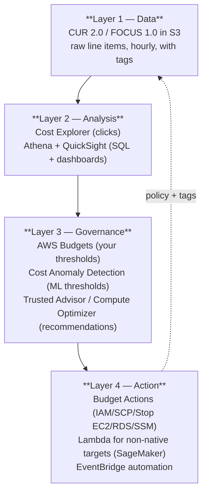
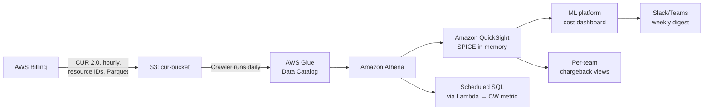
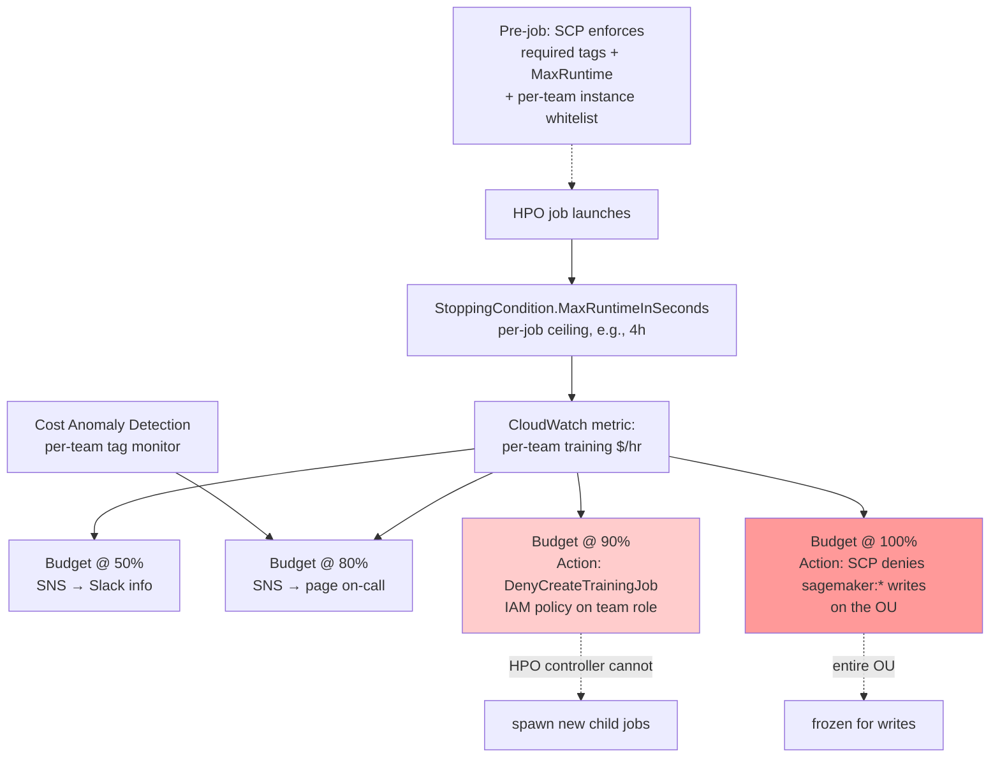
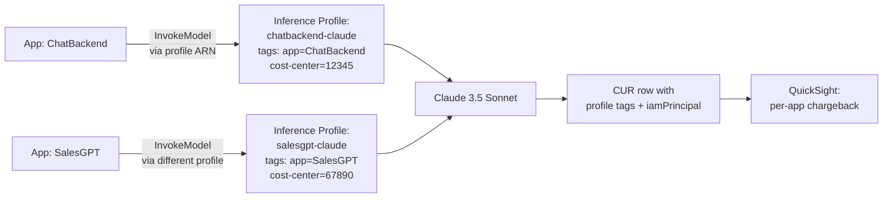

# Chapter 58 — Observability for Cost: Cost Explorer, Budgets, Trusted Advisor

> **Goal of this chapter:** to give you a FinOps mental model strong enough to answer any MLA-C01 Domain 4.2 cost question without guessing, and operational enough to walk into a real ML platform on Monday morning and tell the team where their money is actually going. By the end of the chapter you should be able to: (a) pick the right cost tool for any one-sentence scenario the exam can throw at you — Cost Explorer vs CUR vs Budgets vs Anomaly Detection vs Trusted Advisor vs Compute Optimizer vs Pricing Calculator vs Application Cost Profiler; (b) describe the four-layer FinOps stack and where each AWS service sits in it; (c) explain why a tagged SageMaker endpoint can still be invisible in Cost Explorer; (d) design a runaway-training defense that survives a weekend HPO incident; and (e) write a tag schema and chargeback policy that finance, security, and engineering will all sign off on. Chapter 57 covered the *optimization levers* — Spot training, Savings Plans, idle-shutdown, right-sized endpoints. This chapter covers the *observability* that tells you which lever to pull, and the *guardrails* that pull it for you when you're not looking.

---

## 58.1 You can't optimize what you can't see

It is a Sunday morning in March. A senior ML engineer at a mid-sized fintech opens Slack and sees a message from her platform partner: *"Hey, did we mean to spend $54,000 on SageMaker this weekend?"* On Friday afternoon, a junior teammate had kicked off a hyperparameter tuning sweep on `ml.p4d.24xlarge` instances — ten in parallel, two hundred trials, default `MaxRuntimeInSeconds` (which is to say, none). The job did not bug out. It did not crash. It ran exactly as configured. The team had a monthly cloud budget of $80,000. By 11:00 AM Sunday it had spent $54,000 of it in 41 hours, and the HPO controller was still happily spawning new child jobs.

The first instinct of every engineer hearing this story is to ask *what tool would have stopped it?* That's the wrong first instinct. The right first instinct is *what tool would have shown it before it got to $54K?* Stopping is a guardrail. Seeing is a precondition. You cannot build a guardrail against a number you are not measuring. The FinOps Foundation, the closest thing the cloud industry has to an authoritative practitioner body, ranks "full allocation" (knowing whose dollars are whose) as the **single most-prioritized FinOps capability across all technology categories in 2026** — ahead of rate negotiation, ahead of automation, ahead of forecasting. The reason is empirical: in 2024-2025 FinOps surveys, large enterprises typically report that **15–30% of their cloud spend is unallocated** — sitting in CUR rows that nobody can attribute to a team, a project, or a customer. ML workloads are the worst offenders because GPU bills are concentrated, lumpy, and easy to misattribute. The first FinOps win is almost never optimization. It's *seeing*.

This chapter is organized around that ordering. We start with **what AWS shows you for free** (Cost Explorer), drop down to **the raw line-item dataset** (the Cost and Usage Report, CUR 2.0, and FOCUS 1.0), build outward to **the alert and automation layer** (Budgets, Budget Actions, Cost Anomaly Detection), then layer in **the recommendation engines** (Trusted Advisor, Compute Optimizer), the **planning surface** (Pricing Calculator), the **specialty allocations** (Application Cost Profiler, Bedrock application inference profiles), and finally the **third-party landscape**. The unifying mental model is a four-layer stack, which we will return to repeatedly.



The arrows go both ways for a reason: the actions you take at Layer 4 (like enforcing tags via SCP) feed back into the quality of the data at Layer 1. A FinOps practice that only operates one layer is brittle. A practice that operates all four — and closes the feedback loop — is what AWS calls "Operate-phase mature."

---

## 58.2 AWS Cost Explorer — the cost-visualization workhorse

AWS Cost Explorer is the browser-based and API-accessible tool for analyzing past AWS spend and forecasting future spend. It uses the same dataset as CUR and the legacy detailed billing reports; the difference is that Cost Explorer is a *UI over aggregated views*, while CUR is the raw fact table you query yourself.

**Pricing.** The console view is **free**. The API is **$0.01 per paginated request** — every `GetCostAndUsage`, `GetCostForecast`, and `GetReservationCoverage` call is metered. A dashboard that polls Cost Explorer every five minutes from a Lambda quickly becomes its own line item in the very bill it is measuring. Once Cost Explorer is enabled for a payer account, it **cannot be disabled** — exam trivia that occasionally appears.

**Data freshness.** AWS refreshes Cost Explorer data **at least once every 24 hours**, in practice typically twice a day. When you first enable it, current-month data is queryable within ~24 hours; the **13-month historical backfill** takes a few days. The history window is **13 months back + current month**, and the **forecast window is 18 months forward**, recomputed on each refresh. Granularity choices are **monthly**, **daily**, and **hourly** — the last requires opt-in, costs the same $0.01/page, and is what you reach for when chasing a Saturday-night anomaly. Resource-level granularity (so individual endpoint ARNs and training job names appear) is a separate opt-in that retains the last 14 days.

**Filter dimensions.** This is the part of Cost Explorer the exam tests most directly. You can filter or group by any combination of: `SERVICE` (e.g., `Amazon SageMaker`, `Amazon Bedrock`), `LINKED_ACCOUNT`, `REGION`, `INSTANCE_TYPE` (critical for SageMaker endpoint right-sizing — this is how you spot `ml.p4d.24xlarge` lurking in dev), `USAGE_TYPE` (`USE1-Endpoint:ml.g5.xlarge`, `USE1-Training:ml.p4d.24xlarge` — the most granular non-tag filter), `TAG` (requires activation; see §58.6), `COST_CATEGORY` (custom hierarchies of tags + accounts + services), `RECORD_TYPE` (`Usage`, `Tax`, `Fee`, `Credit`, `Refund` — net-spend isolation), `PURCHASE_TYPE` (`On-Demand`, `Reserved`, `SavingsPlans`, `Spot`), `OPERATION` (`RunInstances`, `CreateTrainingJob`), and a few EC2-specific dimensions (`PLATFORM`, `TENANCY`). You can **stack filters** (`SERVICE = SageMaker AND TAG[Project] = fraud-prod`) and **group by a second dimension** to see, for example, per-instance-type spend within a SageMaker-filtered slice.

**Cost types.** Cost Explorer can show the same usage as several different dollar numbers, which trips up new FinOps practitioners every time:

- **Unblended cost** — the actual cost per linked account, what you'd see on a per-account invoice.
- **Blended cost** — averaged across the org for RIs (legacy; mostly for chargeback fairness in Consolidated Billing).
- **Amortized cost** — RI/SP upfront fees spread daily across the term. *This is the right default for ML chargeback* because it makes Savings Plans and on-demand comparable.
- **Net amortized** — after enterprise discount program (EDP) and private pricing discounts.
- **Usage quantity** — non-dollar; raw GB, hours, requests.
- **Normalized usage** — for size-flexible RIs.

**Forecasting.** Cost Explorer's forecast uses an internal time-series model (AWS hasn't disclosed the algorithm; behavior suggests an exponential-smoothing variant with seasonality). Forecasts have a configurable **prediction interval** — 50%, 80%, or 95% confidence — and recompute *per filter combination*. Forecast quality jumps after three months of history. Crucially, **AWS Budgets uses this exact forecast** for its forecasted thresholds, so understanding Cost Explorer's forecast behavior is the same as understanding when Budgets will fire proactively.

**Savings Plans / RI recommendations.** Cost Explorer surfaces these under separate console pages. The MLE-relevant one is **SageMaker Savings Plans**, which is a distinct SP product from Compute SP and EC2 Instance SP. It commits to **$/hour of SageMaker compute** (training, real-time inference, async, batch transform, processing, notebooks). 1- or 3-year term, up to 64% discount. The recommendation engine analyzes 7, 30, or 60 days of usage and proposes Standard or Convertible, 1y or 3y, with All / Partial / No Upfront. This is the recommendation surface; the actual purchase happens via the Billing console.

**Cost Explorer API.** Twelve operations, most important being `GetCostAndUsage`, `GetCostForecast`, `GetReservationUtilization` / `GetReservationCoverage`, `GetSavingsPlansUtilization` / `GetSavingsPlansCoverage`, `GetAnomalies`, `GetTags`, and `GetDimensionValues`. Limits: **120 requests per minute per account**; max 365 days in a single query.

```bash
aws ce get-cost-and-usage \
    --time-period Start=2026-04-01,End=2026-05-01 \
    --granularity DAILY \
    --metrics "AmortizedCost" "UsageQuantity" \
    --group-by Type=DIMENSION,Key=SERVICE Type=TAG,Key=Project \
    --filter '{
        "And": [
            {"Dimensions": {"Key": "SERVICE", "Values": ["Amazon SageMaker"]}},
            {"Tags": {"Key": "Environment", "Values": ["prod"]}}
        ]
    }'
```

**Amazon Q in Cost Explorer.** Since 2024, Cost Explorer has had a natural-language pane powered by Amazon Q Developer — "why did SageMaker spend jump last week?" drives Cost Explorer filters automatically. It is useful for executives but not yet load-bearing on the exam.

**When to use Cost Explorer (and when not to).** Cost Explorer is the right answer for: visualizing 13 months of spend without writing SQL, running the forecast for a budget, generating SP recommendations, and quickly grouping spend by an activated tag. It is the *wrong* answer when the question involves **per-hour line items**, **resource-level join with CloudWatch metrics**, **multi-cloud roll-ups**, or **custom KPIs like `$/1K invocations`**. Those belong to CUR.

---

## 58.3 The Cost and Usage Report — CUR, CUR 2.0, FOCUS 1.0

The **AWS Cost and Usage Report** is the most granular, line-item billing dataset AWS exposes. If Cost Explorer is the dashboard, CUR is the warehouse. Every usage record AWS generates — every endpoint-hour, every Bedrock invocation, every GB-month of S3 — appears as one row in CUR with every piece of metadata AWS knows about it: resource ID, tags, RI/SP attribution, blended/unblended/amortized cost, on-demand list price.

**Delivery.** CUR is delivered to an S3 bucket *you own*. Hourly or daily granularity (hourly for analytics use). It is **free to receive** — you pay only for the S3 storage and any downstream Athena, Glue, or QuickSight that touches it.

**Three generations.** AWS has consolidated cost reporting under **AWS Data Exports** (GA 2024). Three states coexist:

| Generation | Console name | Schema | When to pick |
|---|---|---|---|
| 1 (legacy) | "AWS Cost and Usage Reports" | "CUR" — wide CSV/Parquet | Existing pipelines only; will be deprecated. |
| 2 | "Data Exports → CUR 2.0" | "CUR 2.0" — nested, normalized | **Recommended for new builds.** Better Athena schema, FOCUS-aligned. |
| 3 | "Data Exports → FOCUS 1.0" | FOCUS open standard | Multi-cloud — when you need Azure and GCP rows in the same warehouse format. |

**CUR schema highlights.** Each row is a line item for a (resource, hour, usage type) tuple. The columns you'll actually use:

- `lineItem/UsageStartDate`, `lineItem/UsageEndDate` — hourly granularity.
- `lineItem/ProductCode` — `AmazonSageMaker`, `AmazonBedrock`, `AmazonS3`.
- `lineItem/UsageType` — `USE1-Endpoint:ml.g5.xlarge`, `USE1-Training:ml.p4d.24xlarge`.
- `lineItem/Operation` — `CreateEndpoint`, `InvokeModel`, `CreateTrainingJob`.
- `lineItem/ResourceId` — endpoint ARN, training job name (when resource-level enabled).
- `lineItem/UsageAmount` — quantity (hours, GB, requests).
- `lineItem/UnblendedCost`, `lineItem/BlendedCost`, `lineItem/AmortizedCost`.
- `pricing/publicOnDemandCost` — what it would have cost at on-demand list.
- `savingsPlan/SavingsPlanEffectiveCost`, `reservation/EffectiveCost` — SP/RI attribution.
- `resourceTags/user:Project`, `resourceTags/user:Team`, etc. — **one column per activated tag key.**
- `lineItem/IamPrincipal` and `tags/iamPrincipal:*` (CUR 2.0, 2025+) — the calling identity. Critical for Bedrock per-user attribution.

**The querying pattern.** The reference architecture for getting useful answers out of CUR is the same in every shop big enough to need one:



The CloudFormation template AWS publishes — the **Cloud Intelligence Dashboards (CID)** kit, sometimes called "CUDOS" — wires the Glue crawler, Athena tables, and a starter QuickSight dashboard in one stack. Most enterprises deploy CID first and then customize. The CID repo includes the **Cost Intelligence Dashboard**, **Trends Dashboard**, **KPI Dashboard**, and **Compute Optimizer Dashboard** — together they cover ~80% of what a FinOps team is likely to build from scratch.

**The ML queries that pay for the whole stack.** A FinOps-mature ML platform runs roughly these queries on a schedule:

```sql
-- Top 10 most expensive training jobs this week
SELECT line_item_resource_id,
       resource_tags_user_project,
       resource_tags_user_owner,
       SUM(line_item_unblended_cost) AS cost_usd
FROM cur_2026
WHERE product_product_name = 'Amazon SageMaker'
  AND line_item_usage_type LIKE '%Training%'
  AND line_item_usage_start_date >= date_add('day', -7, current_date)
GROUP BY 1, 2, 3
ORDER BY cost_usd DESC
LIMIT 10;

-- $/1K invocations per endpoint (joined with CloudWatch later)
SELECT line_item_resource_id           AS endpoint_arn,
       resource_tags_user_team         AS team,
       SUM(line_item_unblended_cost)   AS cost_usd
FROM cur_2026
WHERE line_item_usage_type LIKE 'USE1-Endpoint:%'
  AND year = '2026' AND month = '4'
GROUP BY 1, 2;

-- Spot vs on-demand training cost comparison
SELECT pricing_term, SUM(line_item_unblended_cost) AS cost_usd
FROM cur_2026
WHERE product_product_name = 'Amazon SageMaker'
  AND line_item_usage_type LIKE '%Training%'
GROUP BY pricing_term;
```

**CUR vs Cost Explorer — the canonical exam differentiator:**

| Need | Use |
|---|---|
| 13-month trend, clicks not SQL | Cost Explorer |
| Per-team chargeback at hour granularity | CUR + Athena |
| Custom dashboard ("$/1K invocations per endpoint") | CUR + QuickSight |
| Forecast next month | Cost Explorer |
| Programmatic alerting (API) | Cost Explorer API or CUR |
| Multi-cloud cost roll-up | CUR FOCUS 1.0 |
| Exam answer: "detailed line-item billing data to S3" | **CUR** |
| Exam answer: "visual exploration of last quarter's spend" | **Cost Explorer** |

---

## 58.4 AWS Budgets — the proactive alert tool

AWS Budgets converts spending data into *proactive notifications*. You declare an intent — "this team should not spend more than $5,000 on SageMaker this month" — and Budgets watches the actual or forecasted spend against that intent.

**Six budget types.** This is the exam's favorite Budgets table. Memorize the six:

1. **Cost budget** — dollar threshold. The most common.
2. **Usage budget** — usage-quantity threshold (e.g., "10,000 `ml.g5.xlarge`-hours/month").
3. **RI utilization budget** — alert if RI utilization < X% (default 80%).
4. **RI coverage budget** — alert if RI-covered usage < X%.
5. **Savings Plans utilization budget** — same idea for SPs.
6. **Savings Plans coverage budget** — same idea for SPs.

**Budget periods.** Daily, monthly, quarterly, annual, or **custom** (arbitrary start/end dates — useful for a 3-month project budget). Recurring resets each period; one-time runs once.

**Thresholds.** Up to **5 thresholds per budget** (typically 50%, 80%, 100%, 110%, 120%). Each threshold can fire on either **actual** (post-hoc, after you've already spent X%) or **forecasted** (proactive, when Cost Explorer's forecast says you *will* hit X%). Forecasted thresholds need ~5 weeks of history before they begin firing.

**Notification channels.** Up to 10 email recipients per threshold, plus an SNS topic. The SNS topic needs a policy that allows `budgets.amazonaws.com` to publish — the console will offer to create it. SNS fans out to Slack (via AWS Chatbot / Amazon Q in chat applications), PagerDuty, custom Lambda.

**Pricing.** First **2 budgets per account are free**. Each additional budget is **$0.02/budget/day** (~$0.60/month). Budget Action evaluations are free. Notifications themselves are free.

**Limits.** Default 100 budgets per account (raise via Service Quotas to 20,000). Up to 10 email recipients per threshold, 5 thresholds per budget. Updates run **up to 3 times per day** — so there can be a several-hour lag between a spend event and an alert. This matters when designing runaway-training defenses: don't expect minute-level latency from Budgets.

### 58.4.1 Budget Actions — turning Budgets into a kill switch

**Budget Actions** is the capability that promotes Budgets from "tell me" to "do something." When a threshold trips, an action runs. The exam tests the target matrix exactly:

| Action | What it does | ML use case |
|---|---|---|
| **Apply IAM policy** | Attach a deny-policy to a user/group/role | Deny `sagemaker:CreateEndpoint` once dev hits 110% of budget |
| **Apply SCP** (org-level) | Attach an SCP at the OU/account level | Hard-stop an entire OU from spinning up new resources |
| **Stop EC2 instances** | `StopInstances` on a list of instance IDs or a tag query | Auto-shutdown of EC2-based inference fleets |
| **Stop RDS DB instances** | Same for RDS | Feature-store metadata DBs in dev |
| **Run SSM Automation document** | Anything you can script | The only way to stop a SageMaker resource — see below |

As of the 2025 Budget Controls expansion, you can also tag SageMaker **notebook instances and domains** (and OpenSearch clusters) so they get auto-stopped on threshold breach without writing a Lambda.

**Approval modes.** Each action can be **Automatic** (fires immediately on breach) or **Manual** (requires a human to approve via console/email link before running). Manual is the right default in production; automatic is the right default in dev.

> **⚠️ Exam alert — there is no native Budget Action for SageMaker training jobs or endpoints.** Budget Actions stop EC2 and RDS natively, and stop SageMaker *notebooks* as of 2025. They do **not** stop SageMaker training jobs, processing jobs, or endpoints. The correct pattern is **Budget → SNS → Lambda → `StopTrainingJob` / `DeleteEndpoint`**, or **Budget Action → SSM Automation document that calls those APIs**. If the exam offers "Configure a Budget Action to stop the SageMaker training job," the answer is almost always *no*.

> **⚠️ Exam alert — Budget Action propagation has a delay.** Budgets refreshes up to 3 times per day, and Budget Actions inherit that cadence. There is typically a several-hour lag between the breach event and the action firing. The exam will sometimes offer "real-time stop on threshold" as the answer — that's the wrong answer; Budgets is *not* real-time. For real-time stops, layer in EventBridge or CloudWatch metric alarms.

### 58.4.2 The weekend HPO defense — a runaway-training playbook

Returning to the $54K incident from §58.1: what would have caught it? A *single* tool would not have. The defense-in-depth pattern that mature ML platforms run looks like this:



The thresholds the field uses on a $80K monthly team envelope:

- **50% of budget consumed by day 10** → informational Slack ping.
- **80%** → email all owners, page on-call FinOps engineer.
- **90%** → Budget Action: apply `DenyCreateTrainingJob` to the team's role. Already-running jobs continue; HPO controller cannot spawn new ones.
- **100%** → Budget Action: SCP on the OU denies all `sagemaker:*` write actions.
- **120%** (rare) → SCP that denies the whole account except `iam:*` for admins to clean up.

In the real incident the story was based on, the 90% threshold tripped at 10 PM Saturday. Final damage was ~$36K instead of a projected ~$70K worst-case if all 200 jobs had completed unchecked. The post-mortem layered on a *third* defense: an EventBridge rule on `CreateHyperParameterTuningJob` that triggers a Lambda which validates `MaxNumberOfTrainingJobs × MaxParallelTrainingJobs × InstanceCount × avg_runtime_estimate × instance_$_per_hour` against the team's remaining budget *before* the job is allowed to start. Preventive > reactive.

---

## 58.5 AWS Cost Anomaly Detection — the ML-based monitor

**AWS Cost Anomaly Detection (CAD)** is the complement to Budgets: where Budgets fires when you cross *your* threshold, CAD fires when spend deviates from *AWS's* learned baseline. It is **free**, GA since 2020, built into the Billing & Cost Management console.

**How it works.** CAD pulls from the same dataset as Cost Explorer (net unblended cost). It runs roughly **three times per day** after billing data refreshes. Detection latency is typically **24–72 hours** after the anomalous usage occurred, because billing data itself lags. New monitors take 24 hours to start detecting; new AWS service subscriptions need ~10 days of history before they can detect anomalies on that service. The model is proprietary — AWS hasn't disclosed it — and tunes to weekly/monthly seasonality and natural growth automatically.

**Monitor types.** You create one or more monitors, each of one of four types:

1. **AWS services** — monitor all services or a subset (e.g., only SageMaker, Bedrock, EC2).
2. **Linked accounts** — monitor specific member accounts.
3. **Cost categories** — monitor a defined cost-category dimension value.
4. **Cost allocation tags** — monitor a tag key/value (e.g., `Project=fraud-prod`). **Tag must be activated.**

A default **AWS-managed monitor** covers all services org-wide when you opt in.

**Alert subscriptions.** Each monitor has one or more subscriptions defining: a **threshold** (absolute dollar, percentage of expected, or AND/OR), a **frequency** (individual / daily summary / weekly summary), and a **channel** (email and/or SNS).

**Root-cause breakdown.** This is the differentiator vs Budgets. For each anomaly, CAD attributes the dollar impact across **four dimensions, ranked**: **service**, **region**, **linked account**, **usage type**. A Budget says "you breached"; an anomaly says "you breached, and 78% of the surprise was `USE1-Endpoint:ml.p4d.24xlarge` in `us-east-1`."

**EventBridge integration.** Anomaly events publish to EventBridge (`source = aws.ce`) so you can trigger Lambda, Step Functions, or SSM runbooks on detection.

> **⚠️ Exam alert — CAD is ML-based; Budgets is static-threshold.** The exam will offer scenarios where the *kind* of detection matters. "Alert me when my SageMaker spend spikes unexpectedly" → **CAD** (it learns what "normal" looks like). "Alert me when my SageMaker spend exceeds $5K/month" → **Budgets** (static threshold). The two are complementary; mature teams run both.

**The default-config trap.** CAD ships with defaults that are *too noisy* for ML workloads:

- Alert on anomalies exceeding **40% of expected spend**.
- Minimum impact threshold **$100**.

ML spend is intrinsically bursty — a single training job can be a 10× spike for the day. Run those defaults for two weeks and the team will stop reading the emails. The tuning playbook the field uses:

| Setup | Alerts/month | False positives | Useful alerts | Action rate |
|---|---|---|---|---|
| Default (1 monitor, 40%/$100) | 47 | 41 | 6 | 12% — alert fatigue |
| Tuned (4 monitors, per-workload) | 18 | 2 | 16 | 89% — actionable |
| Tuned + severity routing | 9 paged + 14 digest | 1 paged | 13 paged + 9 digest | 95% paged |

The two-week tuning investment pays back in the first month. The pattern: stratify monitors by workload type. **Stable production** (inference endpoints) → aggressive thresholds (20% / $50). **Volatile training** → loose thresholds (100% / $1000). **Experimentation / notebooks** → tightest (any spike means an idle resource). **Bedrock per-app** → one monitor per `Application` tag.

**Budgets vs Anomaly Detection — the exam-trap differentiator:**

| Aspect | AWS Budgets | Cost Anomaly Detection |
|---|---|---|
| Threshold | You define ($/usage/utilization) | AWS ML decides "normal" |
| Trigger | Crosses your number | Deviates from learned baseline |
| Cost | Free for first 2, then $0.02/day | Free |
| Best for | "I budgeted $5K, alert at 80%" | "Surprise me when something weird happens" |
| Root cause | None | Ranked across 4 dimensions |
| Action capability | Budget Actions | None (alert-only) |
| Latency | Up to 12 hours | 24–72 hours |

**Wiring CAD to ChatOps.** A common production pattern: CAD → SNS → Lambda → posts to Slack with a *deep-link* to Cost Explorer pre-filtered to the anomaly's service and time range. The deep-link is the difference between a clicked alert and an ignored one. The Lambda also annotates the message with the top-2 root-cause dimensions so the on-call engineer can triage in 10 seconds without opening the console.

**Where CAD misses things.** CAD looks at daily totals. A $50K Bedrock spike that lasts only one hour during a batch run typically crosses thresholds at the daily level — fine. But a *slow leak* — an endpoint that adds 5% to your bill every week — flies below CAD's "deviation from baseline" threshold because the new baseline grows with the leak. Cost Explorer *trend* analysis catches it; CAD does not. Use both.

---

## 58.6 Cost Allocation Tags — and the activation trap

Cost Allocation Tags are the primary primitive for showback and chargeback. They are also the single most common source of broken FinOps configurations. The exam loves them.

**Two kinds of tags.**
- **AWS-generated** (e.g., `aws:createdBy`) — automatically applied, limited set, must be activated separately.
- **User-defined** — anything you apply via API/console (`Project`, `Team`, `Environment`, `CostCenter`, `Owner`, `Model`).

**The activation step — and why it matters.** Tagging a resource only *records* the tag on the resource. To make a tag *cost-allocatable*, you must:

1. **Apply** the tag to the resource.
2. Open **Billing & Cost Management → Cost allocation tags**.
3. Find the tag key and click **Activate** (or call `UpdateCostAllocationTagsStatus` via API).
4. **Wait up to 24 hours** for propagation.

Until you activate, the tag exists on the resource and shows up in `ListTags`, but it does **not** appear as a filter dimension in Cost Explorer, does **not** appear as a column in CUR, and does **not** function as a filter for Budgets or Anomaly Detection.

> **⚠️ Exam alert — cost allocation tags must be activated, and activation is not retroactive.** The classic exam scenario: "Engineer applies `Project=recsys` to all SageMaker resources but the tag doesn't appear in Cost Explorer's Group-by dropdown. What is the issue?" The answer is *activation*, not propagation delay, not IAM, not the tag itself. Equally important: activated tags **only apply to usage going forward** — if you waited a month to activate, that month is forever unallocated.

**The propagation delays that catch people:**

- After you tag a resource, the tag key can take **up to 24 hours** to appear in the activation list.
- After you activate, it can take **another 24 hours** to take effect.
- If you move an account between AWS Organizations, **previously activated tags lose their activation status** in the new org.
- Tags on non-billable resources can be activated but **will not populate** in Cost Management.

**Limits.** **500 active cost allocation tag keys per account** — raised from 50 in 2024, but still a hard cap. **50 tags per resource** (separate AWS-wide limit). Plan your schema accordingly.

**The mandatory tag schema.** The set most mature ML platforms enforce:

| Tag key | Allowed values | Why |
|---|---|---|
| `Project` | Free-text, often validated against a registry | Primary chargeback dimension |
| `Owner` | Email or username | Who to call when it's over budget |
| `CostCenter` | Numeric (e.g., `^[0-9]{5}$`) | Maps to finance GL code |
| `Environment` | `dev` \| `staging` \| `prod` | Filter "dev shouldn't cost more than prod" anomalies |
| `Application` | Free-text | Finer than Project — one project may have 3 apps |
| `DataClassification` | `public` \| `internal` \| `confidential` \| `pii` | Security wants it co-enforced |
| `Experiment` (optional, ML-specific) | Free-text | Slice training cost by SageMaker Experiments campaign |
| `ModelId` (optional, ML-specific) | Free-text | Per-model inference cost attribution |

**Enforcement.** Tags only work if they're consistent. The enforcement stack:

- **AWS Organizations Tag Policies** — standardize allowed keys and value regexes.
- **SCPs** — deny resource creation if required tags are absent. ML-specific: deny `sagemaker:CreateTrainingJob`, `sagemaker:CreateEndpoint`, `sagemaker:CreateNotebookInstance`, `bedrock:InvokeModel` unless the tags-on-create include `Project`, `Owner`, `CostCenter`.
- **AWS Config managed rule `required-tags`** — retroactive compliance audit.
- **CI/CD enforcement** — tflint, cdk-nag, Checkov rules that fail PRs missing tags.
- A **scheduled Lambda** that activates newly-discovered tag keys automatically.

**Inheritance gotchas.** Tags do *not* propagate to all child resources. A tagged SageMaker training job creates EBS volumes that may not be tagged unless you tag them explicitly. CUR will show the EBS line items without your team tag. Pockets where propagation fails:

- **CloudWatch Log Groups** — usually inherit nothing.
- **VPC ENIs created by SageMaker for VPC-mode endpoints** — historically spotty.
- **S3 objects** — not tagged at object level by default; use Storage Lens or S3 Inventory for fine-grained S3 cost.
- **EFS storage classes** — tagged at file-system level only.

**The activation playbook (memorize this for the exam).**

1. Decide your schema (the table above).
2. Push the schema as **Tag Policies** in AWS Organizations.
3. Apply **SCPs** that deny `sagemaker:Create*`, `bedrock:InvokeModel`, `ec2:RunInstances` without the required tags.
4. Have engineering retroactively tag existing resources.
5. **Activate** every required tag key in the Billing console (or via `UpdateCostAllocationTagsStatus`).
6. **Wait 24 hours.**
7. Verify by opening Cost Explorer → Group by → Tag and confirming each key appears.
8. Build dashboards in QuickSight against CUR with the new columns.
9. Add an **AWS Config rule** `required-tags` to catch drift.
10. Schedule a **monthly tag-coverage report** — % of spend that is allocated vs unallocated. Target: > 95%.

**The activation timeline — what to expect on the calendar:**

| T+ | Event |
|---|---|
| T+0h | Engineer applies `Project=recsys` to a SageMaker training job at job creation. |
| T+0–24h | Tag key `Project` first appears in **Billing → Cost allocation tags** activation list. |
| T+24h | Engineer clicks **Activate** on `Project`. Status changes to **Active**. |
| T+24–48h | First CUR delivery containing a `resource_tags_user_project` column. Cost Explorer Group-by dropdown begins to show `Project` (but for tag *values* from new usage only). |
| T+48h+ | Budgets, CAD, and Cost Categories can filter by `Project`. Usage before T+24h is *permanently* unallocated under this tag key. |

The lesson: **activate tag keys before you actually need them in dashboards**, ideally at the same time as you publish your tag schema. Treating activation as a "do it when finance asks" task means a month of unallocated data the first time finance asks.

---

## 58.7 AWS Trusted Advisor — the recommendation engine

**Trusted Advisor (TA)** is AWS's best-practice recommendation engine, checking your account against patterns "learned from serving hundreds of thousands of AWS customers" across five pillars: **Cost Optimization, Performance, Security, Fault Tolerance, Service Limits**, plus a 6th category, **Operational Excellence**.

**The support-tier matrix — exam-critical:**

| Support plan | Trusted Advisor access |
|---|---|
| **Basic** | Service Limits + selected Security/Fault-Tolerance checks. Manual refresh only. |
| **Developer** | Same as Basic. |
| **Business / Business Support+ / Enterprise On-Ramp / Enterprise / Unified Operations** | **All checks**, automatic refresh, API, EventBridge, Trusted Advisor Priority. |

(Developer and Business Support are being discontinued in January 2027 and consolidated into Business Support+.)

This matters on the exam: if a scenario says "the customer is on Basic Support and wants to find idle SageMaker endpoints," **Trusted Advisor is not available for that check**. The fallback is **CloudWatch alarm on `Invocations = 0`** plus Lambda.

**Cost Optimization checks (the ones MLEs care about).** TA's cost pillar has ~28 checks (44+ once Cost Optimization Hub integration is counted). The ML-relevant ones:

- **Idle SageMaker endpoints** — flags endpoints with `Invocations = 0` over a lookback window. This is the canonical "find unused inference cost" recipe.
- **Low Utilization Amazon EC2 Instances** — CPU < 10% and Network I/O < 5 MB on 4+ days in the last 14.
- **Idle Load Balancers** — ELB with no healthy targets or `RequestCount` < 100/week.
- **Underutilized Amazon EBS Volumes** — IOPS < 1/day for 7 days.
- **Amazon RDS Idle DB Instances** — no connections for ≥ 7 days.
- **Unassociated Elastic IPs** — EIPs not attached to any running resource ($0.005/hr each).
- **Reserved Instance Optimization** / **Savings Plans** purchase opportunities.
- **NAT Gateway Idle** (2024) — NAT Gateways with no traffic.
- **Lambda functions with high error rate / over-provisioned memory** (via Compute Optimizer integration).
- **Cost Optimization Hub: SageMaker** (2025) — the new check that surfaces endpoint right-sizing, SP recommendations, and idle endpoints in one place.

**Refresh and API.** Auto-refresh every 24 hours on Business+. Manual refresh is rate-limited to ~1 per check per 5 minutes. The Trusted Advisor API (`support` namespace and the newer `trustedadvisor` API) lets you query checks programmatically. **EventBridge** publishes `Trusted Advisor Check Item Refresh Notification` when a check's status changes.

**Trusted Advisor Priority.** A premium feature (Enterprise Support / Enterprise On-Ramp) where AWS Technical Account Managers curate which checks are most relevant. Out of scope for MLA-C01 but worth knowing the name.

**Organizational view.** A management account can aggregate Trusted Advisor findings across all member accounts. Required for org-wide cost optimization governance.

---

## 58.8 AWS Compute Optimizer — right-sizing (almost) everything

**AWS Compute Optimizer** is the ML-powered right-sizing service. **Free**, opt-in per account or org-wide via Organizations. Uses at least 14 days of CloudWatch metrics (CPU, memory if the CloudWatch agent is installed, network I/O, disk I/O) to recommend instance types.

**Supported resource types (as of 2026):**

| Resource | Supported? | Notes |
|---|---|---|
| **EC2 instances** | Yes | Original use case |
| **EC2 Auto Scaling groups** | Yes | Instance type per ASG |
| **EBS volumes** | Yes | gp2 → gp3, IOPS/throughput right-sizing |
| **AWS Lambda** | Yes | Memory size recommendations |
| **ECS services on Fargate** | Yes | CPU/memory recommendations |
| **Amazon RDS DB instances** | Yes (2024) | MySQL, PostgreSQL, MariaDB |
| **Amazon RDS Aurora** | Yes | |
| **NAT Gateways** | Yes (2024) | Traffic-based idle detection |
| **Amazon SageMaker** | **NO** | The exam trap |
| **Amazon Bedrock** | No | No instance concept exposed |

> **⚠️ Exam alert — Compute Optimizer does NOT cover SageMaker.** This is the single most-tested cost-tool trap on MLA-C01. Compute Optimizer right-sizes EC2, EBS, Lambda, Fargate, RDS, Aurora, and NAT Gateway. It does **not** right-size SageMaker training jobs, processing jobs, real-time endpoints, async endpoints, batch transform, Studio kernels, or notebooks. For SageMaker right-sizing the correct answers are **SageMaker Inference Recommender** (endpoints), **CloudWatch training metrics + manual analysis** (training), and **JupyterLab idle-shutdown lifecycle configs** (notebooks).

**Recommendation output.** For each resource: current config + 14- or 90-day utilization, up to 3 alternative options with estimated monthly savings, performance-risk score (Very Low → Very High), and a findings classification (Optimized / Not Optimized / Under-provisioned / Over-provisioned).

**Compute Optimizer + Trusted Advisor integration.** Once Compute Optimizer is enabled, several Trusted Advisor cost checks delegate to Compute Optimizer recommendations — so Compute Optimizer becomes the source of truth and TA is just a different surface.

**Memory-metrics caveat for ML.** Default EC2 metrics in CloudWatch are CPU/network/disk only — **memory requires the CloudWatch Agent**. ML inference workloads are often memory-bound (model artifacts + activations), so without the agent, Compute Optimizer recommends instances that OOM in production. The fix is a fleet-wide CWAgent install via SSM State Manager.

---

## 58.9 AWS Pricing Calculator and Application Cost Profiler

**AWS Pricing Calculator** is the *pre-deployment* cost-modeling tool. Browser-based, no auth required for public estimates. Covers almost all AWS services. ML-relevant configurations include SageMaker (training jobs, real-time/async/batch/serverless endpoints, Studio notebooks), Bedrock (on-demand per-token and provisioned throughput per-unit-per-hour), Amazon Q (per-user/month), and the suite of managed AI services (Comprehend, Translate, Rekognition, Polly, Transcribe). Output is a per-service breakdown, total monthly + annual estimate, a shareable URL (permanent link), and CSV/PDF export.

**Exam rule.** "Estimate cost *before* launching" → **Pricing Calculator**. "See what we spent *after* launching" → **Cost Explorer / CUR**.

**AWS Application Cost Profiler** is for **SaaS multi-tenant cost allocation**. When one AWS account hosts workloads serving many tenants and you need per-tenant cost. The SaaS app emits usage records (`tenantId + invocationCount` per request) to S3; Application Cost Profiler joins them against the CUR and produces daily/hourly per-tenant reports.

The genAI use case: a SaaS where many tenants share a single SageMaker real-time endpoint or a single Bedrock provisioned-throughput pool. Tags can't separate the cost (one endpoint serves all). Application Cost Profiler is the answer. (Note: the service has been deprecated in some regions in favor of Billing Conductor + custom CUR dashboards. Verify the current exam guide — but the *concept* of per-tenant allocation for shared infra is fair game.)

---

## 58.10 Bedrock GenAI cost observability

GenAI cost is structurally different from classic ML cost: **token-priced, per-request, often multi-tenant**. AWS shipped specific features in 2024–2026 to handle it.

**Application Inference Profiles (Nov 2024).** A tagged wrapper around a foundation model ARN. Instead of calling `InvokeModel` against `anthropic.claude-3-5-sonnet-...` directly, you invoke through the inference-profile ARN, which carries your tags (`Application`, `CostCenter`, `Project`, `Tenant`). Tags propagate to CUR. **This is the primary mechanism for per-app Bedrock cost attribution.**



**Granular cost attribution by IAM principal (2025).** Bedrock auto-attributes inference costs to the calling IAM principal. CUR 2.0 has a `lineItem/IamPrincipal` field (full ARN of the caller) plus `tags/iamPrincipal:*` for principal tags and session tags. This unlocks four scenarios:

- **IAM users / API keys** — individual developer identities.
- **IAM roles** — service identity with optional `RoleSessionName` granularity.
- **Federated IdP (OIDC/SAML)** — session name identifies users; tags from IdP assertions.
- **LLM Gateway pattern** — gateway calls `AssumeRole` per tenant with `RoleSessionName = tenantId`, session tags carry tenant attributes. CUR 2.0 surfaces both, enabling per-tenant chargeback without Application Cost Profiler.

**CloudWatch metrics for Bedrock (2025-2026 additions).** `InvocationCount`, `InputTokenCount`, `OutputTokenCount` (filterable by model/region), `TimeToFirstToken` (TTFT — streaming-API latency), `EstimatedTPMQuotaUsage` (helps anticipate throttling and provisioned-throughput sizing).

**Token-level cost as a custom metric.** Per-request *cost* is not a native metric. The pattern: the app logs each request `(model_id, input_tokens, output_tokens, region, timestamp)`. A scheduled job multiplies by the rate card and emits `RequestCost` as a CloudWatch custom metric. Dashboards roll up by application/tenant tag.

**Provisioned Throughput cost trap.** Bedrock Provisioned Throughput is hourly committed capacity, billed whether you use it or not. For variable workloads, on-demand is usually cheaper. CAD will flag a sudden increase in on-demand spend but won't tell you "your provisioned commitment is over-sized." For that, build a QuickSight chart: provisioned-tokens-paid-for vs provisioned-tokens-actually-used per hour. If utilization < 60%, switch to on-demand.

**Bedrock Agents cost trap.** Agents make multiple model calls per user turn (reasoning, tool selection, response synthesis). Actual cost is often 2–5× the user-perceived "one question." Track it explicitly via the inference profile attached to the agent.

**Multi-tenant SaaS pattern (the field-standard recipe).** For a SaaS that serves Bedrock to N customers:

1. One inference profile per tier (or per tenant if tenants are few).
2. Gateway service authenticates the tenant, calls `sts:AssumeRole` with `RoleSessionName = tenantId`, and caches the credentials.
3. CUR 2.0 surfaces `tags/iamPrincipal:tenant` and the `lineItem/IamPrincipal` ending in the session name → per-tenant cost report.
4. CAD monitors per tenant for surprise spikes (often the symptom of prompt-injection abuse or a runaway agent loop on the customer side).
5. A per-tenant Budget caps spend; if a tenant blows their tier, Budget Action applies an IAM policy that denies that tenant's role from `bedrock:InvokeModel*` until reset.

This recipe replaces the older Application Cost Profiler pattern for genAI workloads — the IAM-principal attribution in CUR 2.0 is what made it possible.

---

## 58.11 The ML cost KPIs to dashboard

The point of all this observability is to compute and surface a small set of *derived KPIs* — the numbers that matter for ML, not just the raw $ buckets.

**Per-endpoint inference efficiency:**

| Metric | Formula | Source |
|---|---|---|
| `$/1K invocations` | `(endpoint_hourly_cost × hours) / (invocations / 1000)` | CUR + CloudWatch `Invocations` |
| Endpoint utilization | `Invocations / (instances × max_throughput)` | CloudWatch |
| `$ / second of ModelLatency` | `endpoint_cost / sum(model_latency_seconds)` | "Cost per thinking second" — useful for genAI |
| Idle-hour $ | `Hours where Invocations=0 × instance_$/hr` | Pure waste |

**Per-training-job efficiency:**

| Metric | Formula |
|---|---|
| `$ / training job` | `instance_count × instance_$/hr × training_hours` |
| `$ / epoch` | `cost_per_job / num_epochs` |
| `$ / accuracy point gained` | `cost_per_job / Δ(eval_metric)` |
| Spot interruption tax | `cost_of_restarts / cost_if_uninterrupted` |

**Storage & transfer:**

| Metric | Notes |
|---|---|
| S3 model-artifact `$/TB-month` | Standard ~$23/TB-month us-east-1 |
| Cross-AZ data transfer | $0.01/GB — multi-node distributed training surprise |
| NAT Gateway `$/GB` | $0.045/GB — replace with VPC Endpoints at $0.01/GB |

**Bedrock:**

| Metric | Notes |
|---|---|
| Input `$/1K tokens` | Model-specific list price |
| Output `$/1K tokens` | Typically 4–5× input |
| Provisioned throughput utilization | `actual_TPS / committed_TPS`; < 60% → switch to on-demand |

**The big four to put on the executive dashboard:** `$/1K predictions`, `$/training run`, idle-endpoint $/month, SP/RI coverage %.

---

## 58.12 FinOps lifecycle, chargeback vs showback, third-party tools

The FinOps Foundation defines three iterative phases:

1. **Inform** — visibility. Tag everything; CUR-backed dashboards; surface spend to engineering.
2. **Optimize** — reduce waste. Right-size with Compute Optimizer / Inference Recommender; buy SP/RI; Spot for training; idle-shutdown.
3. **Operate** — embed continuously. Guardrails (Budget Actions, SCPs), periodic anomaly reviews, monthly cost retros.

**Showback vs chargeback.**

- **Showback** — report each team's spend to them, central org pays. Lower friction. Useful when starting out.
- **Chargeback** — the team's cost-center is actually billed via internal accounting. Drives behavior change but requires accounting maturity, accurate allocation methodology, and a dispute-resolution process.

Most enterprises run **showback for 3–6 months** before moving to chargeback. ML platforms in particular benefit from showback first because cost variance is high — a chargeback on a $200K training spike could blow a team's quarterly budget unfairly. The primitive that supports both is the AWS **Cost Category** — a hierarchy (e.g., `Department > Team > Project`) of rules that slice CUR.

**Unit economics.** The FinOps-mature ML team tracks *business-unit cost*, not infrastructure cost: "cost per fraud prevented," "cost per qualified lead," "cost per GenAI conversation." These ratios determine whether the model is worth running — independent of whether it is cheap.

**Common ML cost antipatterns to catch:**

- Endpoint left running over the weekend on `ml.p4d` — $32/hr × 60 hr = $1,920 idle.
- Studio kernel not auto-shutdown — engineer leaves `ml.g5.xlarge` JupyterLab overnight: $30/day.
- Cross-AZ data transfer on multi-node distributed training dwarfs instance cost.
- VPC Endpoints not used — every S3 / SageMaker API call traverses NAT Gateway at $0.045/GB.
- Feature Store online store never purged — charged per row continuously.
- Bedrock provisioned throughput at 5% utilization — buys hours you don't use.

**Third-party FinOps tools — when AWS-native is not enough.** The 2026 landscape:

| Tool | Best for | When to pick over AWS-native |
|---|---|---|
| **CloudZero** | Unit economics, AI cost-per-customer, cost-per-feature | "What's our gross margin per AI feature?" |
| **Vantage** | Speed, developer UX, multi-cloud | Small platform team that wants a cleaner Cost Explorer |
| **Apptio Cloudability** | Large-enterprise, mature FinOps, budgeting/forecasting | Finance owns FinOps and needs ITFM integration |
| **ProsperOps** | Automated SP/RI commitment management | Algorithmic commitment optimization (5–15% savings typical) |
| **Finout** | Multi-cloud + SaaS unification (AWS+Azure+GCP+Datadog+Snowflake) | One pane across many vendors |
| **nOps** | Mid-market AWS-only, automation-heavy | Native AWS with autopilot on commitments and scaling |
| **AWS-native** (CE + CUR + QuickSight + Budgets + CAD) | Single-cloud, engineering-led | Always start here; sufficient for most orgs under ~$2–3M annual spend |

**Honest decision framework:**

- **AWS-native is enough** if: single-cloud AWS, annual spend < ~$2–3M, one engineer can spare ~20% time for FinOps, and you don't sell per-tenant pricing.
- **Add Vantage or Cloudability** when you cross ~$5M annual spend or hire a dedicated FinOps person.
- **Add CloudZero** when you need unit economics wired into product analytics, not finance reports.
- **Add ProsperOps** when steady-state spend is predictable but commitment management is sloppy.
- **Add Apptio Cloudability** when you're a Fortune 500 with a CFO-level FinOps mandate.

**The "don't pay for what AWS gives you free" trap.** Many third-party tools' core value is well-rendered Cost-Explorer-style dashboards. Before paying $50K–$500K/year, build CUR → Athena → QuickSight and see if it solves 80% of your needs. The remaining 20% — anomaly detection, automation, unit economics — is where third-party tools genuinely earn their seat.

---

### 58.12.1 CloudWatch billing alarms — the legacy alternative

Before AWS Budgets existed, the way to alert on spend was a CloudWatch alarm on a special metric: namespace `AWS/Billing`, metric `EstimatedCharges`, with dimensions `Currency=USD` and optionally `ServiceName=AmazonSageMaker` or `LinkedAccount`. The metric is **published only to `us-east-1` regardless of where the charges incurred** — a small piece of exam trivia that occasionally surfaces. Granularity is ~6 hours.

Billing alarms are inferior to Budgets in every meaningful way: dollar-only (no usage, no RI/SP utilization, no coverage); actual-only (no forecasted threshold); notification-only (no Budget Actions); limited multi-dimensional filtering. They show up in three places now: legacy accounts that set them up years ago, very simple "one big number" alerts where the $0.02/day Budgets pricing feels like overkill, and CloudWatch *composite* alarms that fuse billing with operational metrics. Don't introduce them on a new build; use Budgets.

### 58.12.2 The four-layer FinOps stack — operating in production

Earlier we sketched the four-layer stack abstractly. Here's what it looks like as a concrete operating contract for an ML platform team:

- **Layer 1 — Data.** CUR 2.0 enabled with hourly granularity and resource IDs, dropped to a dedicated `cost-data-<account>` S3 bucket with a 7-year lifecycle policy. Glue crawler runs daily at 03:00 UTC. Tag activation is reviewed monthly; any new tag key in the account that's not on the deny-list gets auto-activated by a scheduled Lambda.
- **Layer 2 — Analysis.** Cost Explorer is the default tool for finance partners. The ML platform team owns three QuickSight dashboards on top of Athena: an **executive dashboard** (envelope, forecast, anomaly count), a **team dashboard** (per-`Project` chargeback), and a **leaderboard dashboard** (top-N most-expensive endpoints/training jobs/notebooks this week). Each dashboard is reviewed in the monthly cost retro.
- **Layer 3 — Governance.** Six Budgets per business line: one cost budget at the OU level, one per environment (dev/staging/prod), one usage budget for high-cost instance types (e.g., `ml.p5.*`), and one SP coverage budget. Four CAD monitors per business line: per-workload-type (training, endpoints, notebooks, Bedrock). Trusted Advisor and Compute Optimizer enabled org-wide; Cost Optimization Hub is the consolidated recommendation surface.
- **Layer 4 — Action.** Budget Actions at 90% (IAM deny) and 100% (SCP). EventBridge rules for preventive checks on `CreateHyperParameterTuningJob` and `CreateTrainingJob` that validate against remaining budget. Idle-shutdown lifecycle configs on every Studio domain. A scheduled "weekend reaper" Lambda that stops any SageMaker notebook tagged `Lifecycle=experimental` on Friday at 19:00 UTC.

The feedback loop closes when the monthly retro produces *new* Layer 3 / Layer 4 rules based on what Layer 2 surfaced. A platform that runs all four layers and closes the loop typically reports allocation > 95% within 6 months and ML spend variance under control (month-over-month deviation < 15% on a per-team basis).

---

## 58.13 Decision tree — which cost tool for which question?

```
"I want to..."
├─ See historical / forecasted spend visually
│       → AWS Cost Explorer
├─ Query line-item billing data with SQL
│       → CUR 2.0 + Athena
├─ Build a custom shareable dashboard
│       → CUR + QuickSight (start with CID)
├─ Be alerted when I hit a $ / usage ceiling
│       → AWS Budgets
├─ Automatically take action on a budget breach
│       → AWS Budgets + Budget Actions
│         (or Budget → SNS → Lambda for SageMaker training jobs/endpoints)
├─ Be alerted on weird / surprise spend patterns
│       → AWS Cost Anomaly Detection
├─ Find idle SageMaker endpoints
│       → Trusted Advisor (Business+ Support)
│         OR CloudWatch alarm on Invocations=0 (any tier)
├─ Right-size EC2 / EBS / Lambda / Fargate / RDS / NAT
│       → AWS Compute Optimizer
├─ Right-size a SageMaker endpoint
│       → SageMaker Inference Recommender (NOT Compute Optimizer)
├─ Estimate cost before deploying
│       → AWS Pricing Calculator
├─ Allocate cost to SaaS tenants sharing infra
│       → AWS Application Cost Profiler (or IAM principal + session tags in CUR 2.0)
├─ Per-app Bedrock cost
│       → Application Inference Profiles + cost allocation tags
├─ Tag-based per-team chargeback
│       → Cost Allocation Tags (activate!) + Cost Categories
└─ Org-wide governance (no p4d in dev)
        → SCPs + Tag Policies (via AWS Organizations)
```

---

## 58.14 Exam-frequency table

The patterns most likely to appear on MLA-C01:

| Scenario | Right answer | Common wrong answer |
|---|---|---|
| Detect spike in SageMaker spend | Cost Anomaly Detection | CloudWatch alarm, Budgets |
| Stop dev EC2 at 100% of budget | Budgets + Budget Action | Lambda + EventBridge schedule |
| Per-team chargeback report | Cost Allocation Tags + CUR + QuickSight | Cost Explorer only |
| Find idle ML endpoints | Trusted Advisor *or* CloudWatch `Invocations=0` | Compute Optimizer |
| Right-size m5.large EC2 | Compute Optimizer | Trusted Advisor |
| Right-size `ml.g5.xlarge` endpoint | **Inference Recommender** | Compute Optimizer (NO) |
| Pre-launch cost estimate | Pricing Calculator | Cost Explorer forecast |
| Per-tenant cost in SaaS | Application Cost Profiler or IAM principal + CUR 2.0 | Tags alone (shared infra) |
| Block `p4d.24xlarge` in dev OU | SCP | IAM policy |
| Alert when SP coverage drops below 80% | Budgets — SP coverage budget | Cost Explorer alarm |
| Tag doesn't appear in Cost Explorer | Activate it in Billing console + wait 24h | IAM, propagation, re-tag |
| Stop training job at threshold | Budget Action → SNS → Lambda → `StopTrainingJob` | Native Budget Action (doesn't exist) |
| Auto-stop notebooks at threshold | Budget Action with SageMaker notebook tag (2025) | Lambda only |
| Per-app GenAI cost | Bedrock Application Inference Profiles + tags | Tags on the Lambda only |

---

## 58.15 Exercises

These are designed to be done with an open AWS console and the docs. The goal is to *operate* the tools, not just read about them.

**Exercise 58.1 — The activation playbook, end to end.** In a sandbox account: (a) launch a `ml.t2.medium` SageMaker notebook instance with tags `Project=upskill58`, `Owner=<you>@<domain>`, `CostCenter=99999`, `Environment=dev`. (b) Wait 24 hours (yes, really). (c) Open Cost Explorer → confirm the tag keys do *not* appear in Group-by. (d) Activate them in Billing → Cost allocation tags. (e) Wait another 24 hours. (f) Confirm they now appear, and that a filtered query returns the expected $ figure. Write down each timestamp — you'll cite this to a teammate someday.

**Exercise 58.2 — Build the four-budget guardrail.** For the same sandbox account, configure four budgets at 50% / 80% / 90% / 100% of a $50 monthly cost budget tagged `Project=upskill58`. At 50% and 80% email yourself. At 90% configure a Budget Action that applies an IAM policy denying `sagemaker:Create*` to your user. At 100% configure a Budget Action that applies an SCP (if the account is in an Organization) or a more aggressive IAM policy. Burn through the budget by spinning up resources. Confirm the lockout works. Then *manually* roll it back and document the rollback steps.

**Exercise 58.3 — Tune Cost Anomaly Detection.** Create three monitors: (a) AWS Services for SageMaker only; (b) Cost Allocation Tag on `Project=upskill58`; (c) Cost Category for "GenAI" (Bedrock + SageMaker). For each, configure two subscriptions — one daily summary, one severity-high page. Document the threshold values you chose and the reasoning. After two weeks, score each alert as signal or noise and re-tune.

**Exercise 58.4 — CUR + Athena + the $/1K invocations dashboard.** Enable CUR 2.0 with hourly granularity and resource IDs. Deploy the CID CloudFormation stack. Write a SQL query that returns top-10 most-expensive endpoints by `$/1K invocations` for the last 30 days (you will need to join CUR with the CloudWatch `Invocations` metric). Add it as a QuickSight visual. Schedule a weekly PDF export to yourself.

**Exercise 58.5 — Right-size with the right tool.** Pick five resources in your sandbox account: one EC2, one EBS volume, one Lambda function, one SageMaker endpoint, one SageMaker training job. For each, identify the *correct right-sizing tool* (Compute Optimizer for the first three; Inference Recommender for the endpoint; manual CloudWatch analysis for the training job). Run each and document the recommendations.

**Exercise 58.6 — The HPO defense walkthrough.** Without actually running a $54K HPO sweep, design the *configuration* that would have stopped the weekend incident at ≤$10K. Specify: (a) `StoppingCondition.MaxRuntimeInSeconds`; (b) per-trial `MaxConcurrentTrials`; (c) the four Budget thresholds and their actions; (d) the EventBridge rule on `CreateHyperParameterTuningJob` and the preventive Lambda's logic; (e) the SCP that backs it all up. Write it as a runbook.

**Exercise 58.7 — Bedrock per-app cost.** Create two Bedrock application inference profiles for "ChatBackend" and "SalesGPT", each with distinct tags. Make a few calls through each (any model). Wait 24 hours. Confirm in CUR that the rows carry the profile tags and `lineItem/IamPrincipal`. Build a QuickSight visual that breaks Bedrock spend by `Application` tag.

---

## 58.16 What's next

Chapter 57 was the optimization toolbox — *how* to reduce cost (Spot, Savings Plans, right-sizing, idle-shutdown). This chapter was the observability and governance layer — *seeing* where cost goes and *enforcing* limits when it goes wrong. The two compose into a complete FinOps practice: Chapter 57 gives you the levers; Chapter 58 tells you which lever to pull and pulls some of them automatically.

Chapter 64 — the capstone — integrates cost observability into the full ML platform reference architecture you'll have built by the end of Part J. There, the CUR pipeline, QuickSight dashboard, Budget Actions, and Cost Anomaly Detection wire into the same EventBridge bus as the model-monitoring and security-incident pipelines, so a single dashboard surfaces drift, security, and cost in one place. That's the AWS Well-Architected ML Lens "Operate" phase in operation, and it is the bar an MLA-C01 candidate is being credentialed against.

The exam doesn't test FinOps tools in isolation. It tests whether you reach for the *right* tool when given a scenario, and whether you understand the *seams* between them — that Budgets uses Cost Explorer's forecast, that Anomaly Detection feeds EventBridge, that Trusted Advisor delegates to Compute Optimizer, that Compute Optimizer skips SageMaker, that tags need activation, that there is no native Budget Action for training jobs. Those seams are where the real questions live. The decision tree in §58.13 and the exam-frequency table in §58.14 are the two pages to reread the morning of the exam.
