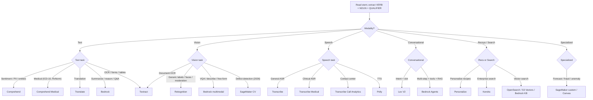
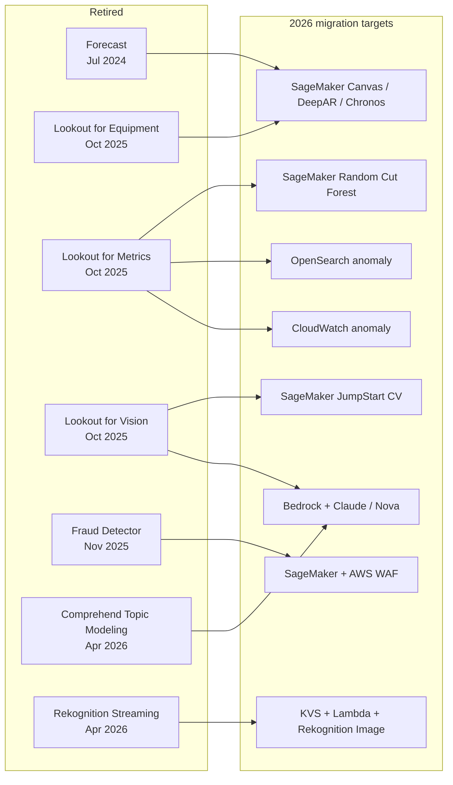
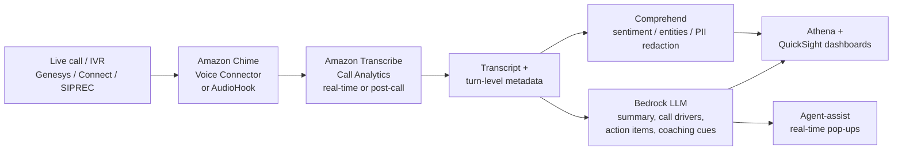
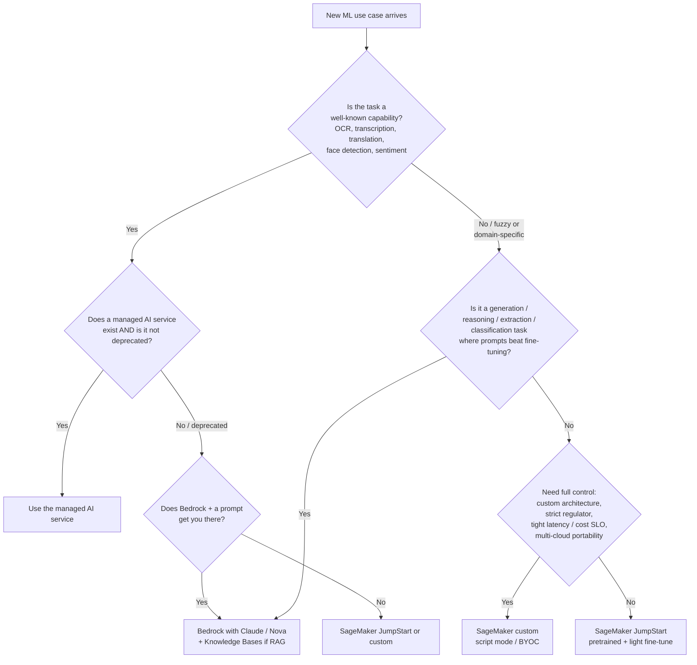

# Chapter 59 — The "Which AI Service?" Decision Tree

> **Goal of this chapter:** to convert every "which AWS AI service?" scenario question on the MLA-C01 into a one-step recognition reflex. By the end of the chapter you should be able to: (a) read any exam stem, isolate the **verb + noun + qualifier** triple, and route it to a single service in under five seconds; (b) recite the 2024-2026 deprecation slate from memory and name the migration target for each retired service; (c) draw the boundary between a pre-built AI service, a SageMaker custom model, and an Amazon Bedrock foundation model — and defend the choice; (d) name which AI services are HIPAA-eligible and which are explicitly excluded; (e) chain two or three AI services together into the canonical pipelines the exam loves (Transcribe → Comprehend → Bedrock; Textract → Comprehend → A2I; Lex V2 → Bedrock Agents). Roughly one in five MLA-C01 questions reduces to a service-picking judgment call — *this is the highest-leverage chapter in Part K* and the cleanest payoff per hour of study.
>
> Chapters 3 (the AWS ML stack map) and 20 (labeling workforces) set up the surface area; this chapter is the decision logic that operates over it. Chapter 60 picks up with Bedrock as a *substitute* path for many of these services, and Chapter 62 makes the deeper Bedrock-vs-JumpStart-vs-script-mode call for foundation-model hosting. Read this chapter as the routing layer that sits above both.

---

## 59.1 The one-question recognition pattern that wins the exam

Open any MLA-C01 practice book to a Domain 2 or Domain 4 scenario question. Strip the stem down to its essentials and you will find that every "which service?" question collapses to exactly **three lexical features**:

1. **A verb** — *detect, extract, translate, summarize, recommend, transcribe, classify, generate, recognize, search, redact, anonymize, predict, forecast, score, embed*.
2. **A noun** — *sentiment, PII, table, image label, user-item interaction, audio, text, document, form, face, defect, anomaly, intent, entity*.
3. **A qualifier** — *medical, contact center, manufacturing line, low-confidence, HIPAA, real-time, batch, streaming, multi-language, ACL-aware, regulated*.

If you can name those three features in under ten seconds of skimming, you can name the service in another five. **The exam is not testing your knowledge of any one service in depth** — Domain 4 of the blueprint will not ask you to write a Comprehend custom classifier configuration. It is testing whether, given a paragraph of business prose, you can recognize *which catalog entry the paragraph is describing.* That is a vocabulary task, not an engineering task, and it is the cheapest 20% of the exam to lock down once you have the right table memorized.

### The mental loop

```
1. Read the stem to its last sentence.
2. Underline the VERB.                  ("detect", "extract", "translate", "summarize")
3. Underline the NOUN.                  ("sentiment", "PII", "table", "image label")
4. Underline the QUALIFIER.             ("medical", "contact center", "low-confidence")
5. The (verb, noun) pair routes to ONE service ~95% of the time.
6. If the pair routes to multiple, the QUALIFIER picks among them.
7. If the result is a deprecated service, replace with the migration target.
```

That seventh step is new for the 2026 sitting and trips up most candidates who studied with older material. The deprecation wave of 2024-2025 retired or closed-to-new-customers five major AI services that older books treat as live — Amazon Forecast, the three Lookout services, and Amazon Fraud Detector. Section 59.4 covers each in detail. For now, internalize the rule: if your seven-step loop spits out one of those five services, **the new correct answer is almost always a SageMaker built-in algorithm or a Bedrock pattern.**

### The three meta-rules

Three priors govern every tie-breaker in the rest of this chapter. Memorize them as a stack — they apply in order, and the first one that resolves the ambiguity wins.

- **Rule of specificity.** The most domain-specific managed service almost always beats the generic one. Transcribe Medical beats Transcribe. Lookout for Vision beats Rekognition Custom Labels (when it existed). Transcribe Call Analytics beats `Transcribe → Comprehend`. If the stem contains a qualifier that names a specific service flavor, that flavor is the answer.
- **Rule of pre-built first.** If a managed service exists that does the capability out of the box, the exam wants you to use it. SageMaker is the *escape hatch* for problems the catalog cannot solve — not the default. Reach for SageMaker when the stem **explicitly** demands custom architecture, custom data, custom loss, or capabilities not in the AI service catalog.
- **Rule of GenAI = Bedrock.** Anything generative — *summarize, draft, paraphrase, answer questions over, chat with, reason about, explain why* — routes to Bedrock unless the stem explicitly contradicts (e.g., real-time streaming, deterministic OCR, structured form extraction).

When these three rules disagree — which they sometimes do — the **rule of specificity wins.** A "summarize a medical record" stem routes to *Bedrock with a HIPAA-eligible model* (Claude / Nova through Bedrock's HIPAA-eligible scope), not to Comprehend Medical, because summarization is generative even when the noun is medical. Conversely, "map this diagnosis to ICD-10" routes to Comprehend Medical `InferICD10CM` even though Bedrock could do it — because the AWS-specific ontology mapping is the most-specific catalog entry.

---

## 59.2 Pre-built AI services taxonomy (2026)

The catalog has 30-plus distinct service names, most of them grouped under five modalities: **text, vision, speech, conversational, recommendation/search**. The minor categories — human-in-the-loop labeling, time-series, anomaly detection — used to be larger before the 2024-2025 deprecation wave hollowed them out. Memorize the modality grouping and you have the skeleton; the leaves are scenario-by-scenario.

### 59.2.1 Text (NLP)

| Service | Core capability | Custom training surface | HIPAA |
|---|---|---|---|
| **Amazon Comprehend** | Sentiment, entities, key phrases, language detection, syntax, PII, **targeted sentiment**, **toxic content** | **Custom Classification**, **Custom Entity Recognition** | Yes |
| **Comprehend Medical** | Clinical entities, **ICD-10-CM**, **RxNorm**, **SNOMED CT**, PHI (HIPAA Safe Harbor) | None — model is fixed | Yes |
| **Amazon Translate** | Real-time + batch MT, 75+ languages | **Custom Terminology** (glossary), **Active Custom Translation (ACT)** (style/tone via parallel data) | (covered) |
| **Amazon Bedrock** | Foundation-model API for chat, RAG, agents, summarization, classification, extraction, reasoning | Fine-tune, continued pre-training, distillation, **Custom Model Import** | Yes |

Two things to commit. First, **Bedrock is now an NLP service** as much as it is a "GenAI" service. For any non-trivial text task — summarization, free-form Q&A, structured extraction with prompts, multi-turn reasoning — Bedrock often beats Comprehend on flexibility. Comprehend keeps its edge when you need a pre-built model with high-volume per-API pricing certainty and zero prompt engineering. Second, **Translate's two custom paths are not the same.** Custom Terminology is a glossary (enforce exact term mapping); Active Custom Translation is style/tone (match brand voice via parallel data files in TMX/TSV). Stems that say "match our brand voice" point to ACT; stems that say "enforce that 'Optum' is never translated" point to Custom Terminology. The exam mixes these up freely.

### 59.2.2 Vision

| Service | Core capability | Custom training | HIPAA |
|---|---|---|---|
| **Amazon Rekognition (Image / Video)** | Labels, faces, celebrities, moderation, PPE, text-in-image, **Face Liveness** | **Custom Labels** (classification + object detection) | Yes |
| **Amazon Textract** | OCR + forms + tables + queries + signatures + layout; **AnalyzeID**, **AnalyzeExpense**, **AnalyzeLending** | **Custom Adapters** per document type | Yes |
| **Bedrock (Claude/Nova multimodal)** | Free-form image understanding via LLM (describe, VQA, classify by prompt) | Fine-tune via Bedrock customization | Yes |
| **~~Lookout for Vision~~** *(EOL Oct 10, 2025)* | Manufacturing visual anomaly detection | Was supervised on small datasets | n/a |

The Textract feature flags are the most testable Vision content. There are now seven `FeatureType` values you can pass to `AnalyzeDocument`: `FORMS`, `TABLES`, `QUERIES`, `SIGNATURES`, `LAYOUT`, and the two domain-specialized siblings invoked through their own APIs — `AnalyzeID` (US driver's license, passport, federal IDs) and `AnalyzeExpense` (invoices, receipts). When the stem says "answer specific questions about a PDF" → `QUERIES`. When it says "preserve titles, headers, reading order" → `LAYOUT`. When it says "extract line items and totals from invoices" → `AnalyzeExpense`. When it says "improve accuracy on our specific document layout" → **Custom Adapters** (Textract's per-document-type fine-tuning surface, launched 2023).

### 59.2.3 Speech

| Service | Core capability | Custom surface | HIPAA |
|---|---|---|---|
| **Amazon Transcribe** | ASR — speech-to-text, batch + streaming, 30+ languages, diarization, channel ID | **Custom Vocabulary**, **Custom Language Model (CLM)** | Yes |
| **Transcribe Medical** | HIPAA-eligible ASR for clinical conversations; **HealthScribe** for clinical note generation | Custom vocabulary | Yes (specifically) |
| **Transcribe Call Analytics** | Contact-center ASR + sentiment + categories + generative summary, batch + real-time | Vocabularies + custom categories | Yes |
| **Amazon Polly** | TTS — Standard, Neural, **Long-form**, **Generative** engines | **Custom Lexicon (PLS)** (pronunciation only; voice is fixed) | Yes |

The Polly engines map directly to use-case verbs:

- **Generative engine** → "most natural / most human-like" (highest cost; best for premium product surfaces).
- **Long-form engine** → "narrate articles / audiobooks / podcasts" (built for prosody consistency across many minutes).
- **Neural engine** → "natural and cheap" (default for most production TTS).
- **Standard engine** → legacy concatenative voices (still listed but rarely the right answer in 2026).

Polly's **Speech Marks** feature deserves its own line: a stem that mentions *visemes* (mouth shapes for lip-sync animation), *sentence boundaries* (for captioning), or *word-level timing* (for highlighted-text-as-it's-read UIs) points to Speech Marks, not to a separate service.

### 59.2.4 Conversational

| Service | Core capability | When the exam routes here |
|---|---|---|
| **Amazon Lex V2** | Intent + slot chatbots / IVR; ASR + NLU + Polly TTS in one product | "Structured intents and slots", "IVR", "Amazon Connect integration" |
| **Bedrock Agents** | LLM-driven multi-step tool use, action groups, Knowledge Base integration, memory | "Agentic", "multi-step tool use", "reasoning over actions", "RAG + actions" |

Lex V1 is **already retired** — never the right answer. Lex V2 stays the right answer for traditional voice IVR and form-filling chatbots; Bedrock Agents is the right answer for anything where the bot needs to call multiple tools, reason about the result, and persist conversational memory across turns. The two compose well: a Lex V2 bot that drops to a Bedrock generative fallback when the user's utterance has confidence below threshold is a canonical 2025-2026 pattern. The exam phrases this as "Lex V2 with generative fallback" or "Lex V2 → QnAIntent (Bedrock)."

### 59.2.5 Recommendations

| Service | Core capability | Custom training |
|---|---|---|
| **Amazon Personalize** | Recsys — `aws-user-personalization`, `aws-similar-items`, `aws-personalized-ranking`, `aws-user-segmentation`, `aws-trending-now`, `aws-popularity-count` | Every recipe trains a private model |
| **Bedrock + Knowledge Bases** | "Recommended X based on Y" via LLM reasoning + RAG over catalog | Prompt engineering |

The Personalize recipe names are testable. *USER\_PERSONALIZATION* is the default for "next-best-item" (one user → ranked list). *SIMILAR\_ITEMS* is item-to-item ("more like this", "people who bought X also bought Y"). *PERSONALIZED\_RANKING* takes a candidate set from another system and re-ranks it for the user — common when you have a search engine producing candidates and want personalization on top. *USER\_SEGMENTATION* answers "who is likely to convert on this product?" — marketing-style. *TRENDING_NOW* and *POPULARITY_COUNT* are cold-start fallbacks. Stems that hint at *"new users we have no data on"* point to popularity-based recipes; stems that say *"we have 24 months of clickstream"* point to USER\_PERSONALIZATION.

### 59.2.6 Search

| Service | Core capability | Notes |
|---|---|---|
| **Amazon Kendra** | Enterprise semantic search; 40+ connectors; **ACL-aware** | Pre-LLM-era enterprise search, now usable as a retriever for Bedrock RAG |
| **Amazon Kendra GenAI Index** | High-accuracy retriever surfaced through Bedrock Knowledge Bases | Best retrieval quality at premium cost |
| **OpenSearch Service / Serverless** | Vector + lexical + hybrid (BM25 + k-NN) | Default vector store for Bedrock KB |
| **Amazon S3 Vectors** | Pure vector storage, GA Dec 2025 | Cheapest vector store; minimal features |

The 2026 collapse on this row matters: **Bedrock Knowledge Bases is the developer-facing surface for RAG**, and it can be backed by any of OpenSearch Serverless, Aurora pgvector, MongoDB Atlas, Pinecone, Redis Enterprise, **or** Amazon Kendra GenAI Index. The retrieval engine you pick underneath is a cost/quality choice — Kendra GenAI Index is the premium retriever, S3 Vectors is the floor. Section 59.10 walks through the picks.

### 59.2.7 Specialized / domain ML (mostly deprecated)

| Service | Status (mid-2026) | Migration target |
|---|---|---|
| **Amazon Forecast** | **Closed to new customers (Jul 29, 2024)** | **SageMaker Canvas** (no-code) or **SageMaker DeepAR** built-in algorithm |
| **Amazon Fraud Detector** | **Closed to new customers (Nov 7, 2025)** | **SageMaker AutoGluon** tabular + **AWS WAF** + GuardDuty patterns |
| **Lookout for Equipment** | **EOL Oct 10, 2025** | SageMaker custom + IoT SiteWise |
| **Lookout for Metrics** | **EOL Oct 10, 2025** | SageMaker Random Cut Forest / Canvas + QuickSight anomaly insight |
| **Lookout for Vision** | **EOL Oct 10, 2025** | SageMaker CV (custom) or Rekognition Custom Labels |
| **Comprehend Topic Modeling** | **Closed to new customers (Apr 30, 2026)** | **Bedrock** LLM-based topic extraction |
| **Comprehend Event Detection** | **Closed to new customers (Apr 30, 2026)** | **Bedrock** LLM extraction with prompts |
| **Rekognition Streaming Video** | **Closed to new customers (Apr 30, 2026)** | KVS → Lambda → Rekognition Image APIs |

Memorize these dates. The exam will not test the exact day, but it will test the *order* and the *migration target*. Section 59.4 unpacks the slate in full.

### 59.2.8 Human-in-the-loop / labeling

| Service | What it does | HIPAA |
|---|---|---|
| **Amazon Augmented AI (A2I)** | Routes low-confidence ML predictions to human reviewers; built-in flows for Textract + Rekognition | Yes (private + vendor workforces only) |
| **SageMaker Ground Truth** | Managed labeling pipelines for images, text, point clouds, video; auto-labeling via active learning | Yes (private + vendor workforces only) |
| **SageMaker Ground Truth Plus** | Fully-managed labeling service (AWS-run) | **Not HIPAA-eligible** |
| **Amazon Mechanical Turk** | Crowdsourced 500K+ public workforce | **Never HIPAA-eligible; no PHI ever** |

The Ground Truth / Ground Truth Plus split is one of the most-tested gotchas. **Ground Truth** is the labeling pipeline you build on AWS; you bring the workforce (private, vendor, or MTurk). **Ground Truth Plus** is a managed service where AWS provides the workforce and the labeling experts — and it is **explicitly excluded from HIPAA eligibility**, even though plain Ground Truth is in scope. Stems that mention PHI and labeling almost always route to **Ground Truth with a private workforce + A2I**, never to Ground Truth Plus and never to Mechanical Turk.

---

## 59.3 The stem-keyword → service map

This is the table to print out. Stems on the MLA-C01 exam follow predictable phrasing patterns, and once you've seen 100 practice questions the mapping below feels mechanical. The qualifier column resolves ties; the "see" column points to the section in this chapter that defends the call.

### 59.3.1 Text → service

| Stem keyword | Qualifier | Service | See |
|---|---|---|---|
| "Sentiment" | General text | Comprehend `DetectSentiment` | §59.5 |
| "Sentiment per entity/aspect" | "Which part of the review was positive?" | Comprehend `DetectTargetedSentiment` | §59.5 |
| "Sentiment in a call recording" | Contact center | **Transcribe Call Analytics** (not Comprehend) | §59.9 |
| "Detect PII in text" | General | Comprehend `DetectPiiEntities` | §59.5 |
| "Detect PII in transcript" | Audio source | **Transcribe PII Redaction** | §59.9 |
| "Detect PHI" | Healthcare | **Comprehend Medical** `DetectPHI` | §59.5 |
| "Entities (PERSON, ORG, DATE)" | General | Comprehend `DetectEntities` | §59.5 |
| "Custom entities (policy #, SKU)" | Need to train | **Comprehend Custom Entity Recognition** | §59.5 |
| "Key phrases" | General | Comprehend `DetectKeyPhrases` | §59.5 |
| "Classify text into a few categories" | 50-1000 examples per class | **Comprehend Custom Classification** | §59.5 |
| "Classify text into categories" | Few-shot / changing labels | **Bedrock** (Nova Micro / Claude Haiku) | §59.6 |
| "Translate text" | One-off, real-time | Translate `TranslateText` | §59.5 |
| "Translate a large batch" | S3 → S3 | Translate `StartTextTranslationJob` | §59.5 |
| "Translate matching our brand voice" | Style/tone | **Translate Active Custom Translation (ACT)** | §59.5 |
| "Translate enforcing exact term mapping" | Glossary only | **Translate Custom Terminology** | §59.5 |
| "Toxic content / harassment / hate" | Text only | Comprehend `DetectToxicContent` | §59.5 |
| "Toxic content in LLM output" | GenAI | **Bedrock Guardrails — Content Filters** | §59.6 |
| "Summarize a document" | Generative | **Bedrock** (Claude / Nova) | §59.6 |
| "Answer questions over our documents" | RAG | **Bedrock Knowledge Bases** | §59.10 |
| "Search our enterprise documents" | Connector-rich, ACL-aware | **Amazon Kendra** | §59.10 |
| "Search across SharePoint + Salesforce + Confluence with per-user ACLs" | SaaS + SSO | **Amazon Q Business** | §59.10 |
| "Map diagnosis → ICD-10" | Healthcare | Comprehend Medical `InferICD10CM` | §59.5 |
| "Map medication → RxNorm" | Healthcare | Comprehend Medical `InferRxNorm` | §59.5 |
| "Map clinical concept → SNOMED CT" | Healthcare | Comprehend Medical `InferSNOMEDCT` | §59.5 |
| "Detect language of incoming text" | Routing | Comprehend `DetectDominantLanguage` | §59.5 |
| "Topic modeling" | New project, 2026 | **Bedrock + Claude** (Comprehend Topic Modeling closed Apr 30, 2026) | §59.4 |

### 59.3.2 Vision → service

| Stem keyword | Qualifier | Service |
|---|---|---|
| "Detect objects / labels in an image" | General | Rekognition `DetectLabels` |
| "Detect faces and attributes" | Demographics | Rekognition `DetectFaces` |
| "Match a face against a roster" | 1:N | Rekognition `IndexFaces` + `SearchFacesByImage` |
| "Compare two faces" | 1:1 | Rekognition `CompareFaces` |
| "Face liveness for authentication" | Anti-spoofing | Rekognition **Face Liveness** |
| "Moderation — adult, violence, drugs" | Trust & safety | Rekognition `DetectModerationLabels` |
| "PPE detection (hardhat, gloves, masks)" | Workplace safety | Rekognition `DetectProtectiveEquipment` |
| "Detect text in a sign / license plate" | Short text in image | Rekognition `DetectText` |
| "OCR a document / form / table" | Structured | **Textract** `AnalyzeDocument` |
| "OCR preserving titles / headers / reading order" | Layout-aware | Textract `AnalyzeDocument` w/ **LAYOUT** |
| "Answer specific questions about a document" | NLQ over PDF | Textract **QUERIES** feature |
| "Extract fields from a US driver's license / passport" | Pre-mapped | Textract `AnalyzeID` |
| "Extract line items + totals from invoices / receipts" | Receipts | Textract `AnalyzeExpense` |
| "Process mortgage / loan packages end-to-end" | Lending | Textract `AnalyzeLending` |
| "Improve accuracy on our specific document layout" | Custom training | **Textract Custom Adapter** |
| "Identify custom labels (machine parts, brands)" | Small dataset | **Rekognition Custom Labels** |
| "Detect defects on a manufacturing line" | 2026 | **SageMaker CV custom** (Lookout for Vision retired) |
| "Describe what's in this image / VQA" | Free-form | **Bedrock Claude / Nova multimodal** |
| "Live video analytics (faces, labels)" | Streaming | **Kinesis Video Streams + Lambda → Rekognition Image APIs** (Rekognition Streaming Video closed Apr 30, 2026) |

### 59.3.3 Speech → service

| Stem keyword | Qualifier | Service |
|---|---|---|
| "Transcribe audio" | General | Transcribe |
| "Transcribe physician dictation / clinical conversation" | HIPAA | **Transcribe Medical** |
| "Generate clinical notes from a doctor-patient conversation" | Note generation | **Transcribe HealthScribe** |
| "Real-time agent assist + sentiment + categories" | Contact center | **Transcribe Call Analytics (real-time)** + **Amazon Q in Connect** |
| "Streaming transcription" | Real-time | Transcribe streaming (HTTP/2 or WebSocket) |
| "Boost recognition of jargon / brand terms" | Few terms | **Custom Vocabulary** |
| "Boost recognition in a jargon-heavy domain" | Many terms | **Custom Language Model (CLM)** |
| "Redact SSN/credit-card in transcript output" | Compliance | Transcribe **PII Redaction** |
| "Distinguish multiple speakers (single channel)" | Diarization | Transcribe **Speaker Identification** (up to 10) |
| "Separate agent / customer channels" | Multi-channel | Transcribe **Channel Identification** |
| "Generate speech from text — most natural / human" | Premium TTS | Polly **Generative engine** |
| "Narrate long-form articles / audiobooks" | Long content | Polly **Long-form engine** |
| "Cheaper but still natural TTS" | Balance | Polly **Neural engine** |
| "Custom pronunciation of brand acronyms" | Lexicon | Polly **Custom Lexicon (PLS)** |
| "Lip-sync mouth shapes for animation" | Visemes | Polly **Speech Marks** (`viseme` type) |

### 59.3.4 Conversational, recommendations, search

| Stem keyword | Qualifier | Service |
|---|---|---|
| "Chatbot with intents and slots" | Structured | **Lex V2** |
| "Chatbot that does multi-step tool use + RAG" | Agentic | **Bedrock Agents** |
| "Contact-center IVR" | Voice | Lex V2 + Amazon Connect + Polly |
| "Generative fallback for unknown chatbot queries" | OOS | Lex V2 → **Bedrock QnAIntent** (generative answers) |
| "Product recommendations (next-best item)" | E-commerce | **Personalize USER\_PERSONALIZATION** |
| "Similar items / 'more like this'" | Item-similarity | **Personalize SIMILAR\_ITEMS** (`aws-similar-items`) |
| "Rerank a list per-user" | Search rerank | **Personalize PERSONALIZED\_RANKING** |
| "Find users likely to convert on X" | Marketing | **Personalize USER\_SEGMENTATION** |
| "Trending items" | Recent popularity | **Personalize TRENDING\_NOW** (`aws-trending-now`) |
| "Cold-start fallback" | Popular items | **Personalize POPULARITY\_COUNT** |
| "Enterprise semantic search" | Standalone search UI | **Kendra** |
| "Vector search (raw)" | DIY RAG | **OpenSearch** (k-NN) or **S3 Vectors** |
| "Hybrid (BM25 + vector) search" | Best retrieval | **OpenSearch hybrid** or **Kendra GenAI Index** in Bedrock KB |
| "Enterprise GenAI assistant over 40+ SaaS" | SSO, ACLs | **Amazon Q Business** |
| "In-IDE coding assistant" | Dev productivity | **Amazon Q Developer** |
| "Natural-language BI over QuickSight" | GenBI | **Amazon Q in QuickSight** |

### 59.3.5 Specialized / domain (the 2026 migration map)

| Stem keyword | Qualifier | 2026 service answer |
|---|---|---|
| "Demand forecasting / time-series" | Historical sales / inventory | **SageMaker DeepAR** or **SageMaker Canvas** (Forecast closed to new customers) |
| "Predictive maintenance from sensors" | Multivariate time-series | **SageMaker custom** + **IoT SiteWise** (Lookout for Equipment retired) |
| "Anomaly on business KPIs (revenue, conversion)" | Multi-dim TS | **SageMaker Random Cut Forest** or **CloudWatch anomaly detection** (Lookout for Metrics retired) |
| "Online fraud detection" | Account takeover, CNP | **SageMaker AutoGluon** + **AWS WAF** (Fraud Detector closed to new customers) |
| "Anomaly on manufacturing images" | Visual inspection | **SageMaker CV** or **Rekognition Custom Labels** (Lookout for Vision retired) |

### 59.3.6 Human-in-the-loop

| Stem keyword | Qualifier | Service |
|---|---|---|
| "Human review of low-confidence ML predictions" | General | **Augmented AI (A2I)** |
| "Human review of low-confidence Textract output" | Built-in flow | **A2I + Textract integration** |
| "Human review of borderline Rekognition moderation labels" | Built-in flow | **A2I + Rekognition integration** |
| "Crowdsource data labeling" | High volume, no PII | **Mechanical Turk** via Ground Truth |
| "Label data containing PHI / PII" | Compliance | **Private workforce** in Ground Truth (NOT MTurk, NOT Ground Truth Plus) |
| "Domain expert labeling (medical, legal)" | Quality | **Private** or **Vendor** workforce |
| "Cut labeling cost via active learning" | Optimization | **Ground Truth automated labeling** |



---

## 59.4 The 2024-2025 deprecation wave

This is the **single most consequential change** between an MLA-C01 study book written in 2024 and one written in 2026. AWS quietly began rationalizing its "Era 2" domain ML services across 2024-2025, and by mid-2026 five major services are closed to new customers or fully retired. The exam is in transition: older question banks still reference them as live; new question banks expect the migration target. If a stem maps to a deprecated service in your verb-noun-qualifier reflex, **switch to the replacement on the second pass.**

### 59.4.1 The slate

| Service / feature | Status (mid-2026) | Recommended migration |
|---|---|---|
| **Amazon Forecast** | **Closed to new customers Jul 29, 2024.** Existing customers retain access; AWS adds only security/availability/performance fixes. | **SageMaker Canvas** time-series (no-code) for business analysts; **SageMaker DeepAR** built-in for engineering teams; **Chronos** foundation model (via JumpStart/Bedrock) for zero-shot |
| **Amazon Lookout for Equipment** | **Discontinued Oct 10, 2025.** Models deleted; API stops responding. | **SageMaker custom** + **IoT SiteWise** for industrial pipelines; third-party predictive maintenance as alternative |
| **Amazon Lookout for Metrics** | **Discontinued Oct 10, 2025.** Six recommended targets, no single replacement. | **OpenSearch** real-time anomaly detection; **CloudWatch** anomaly detection (ops); **Redshift ML** (warehouse); **QuickSight ML Insights** (BI); **Glue Data Quality** (pipelines); **SageMaker Canvas streaming TS anomaly** (ML teams) |
| **Amazon Lookout for Vision** | **Discontinued Oct 10, 2025.** | **SageMaker JumpStart vision** (ResNet/EfficientNet/DETR fine-tuned), **Bedrock multimodal** zero-shot ("is this defective?"), or **Rekognition Custom Labels** for simple classification |
| **Amazon Fraud Detector** | **Closed to new customers Nov 7, 2025.** | **SageMaker AutoGluon** tabular models + **AWS WAF** + **GuardDuty** patterns; for managed-service feel, **SageMaker Canvas** with the user's transaction history |
| **Comprehend Topic Modeling** | **Closed to new customers Apr 30, 2026.** AWS itself published a migration blog to Claude on Bedrock. | **Bedrock + Claude / Nova** with a topic-extraction prompt over batched documents |
| **Comprehend Event Detection** | **Closed to new customers Apr 30, 2026.** | **Bedrock + Claude / Nova** with a structured event-extraction prompt |
| **Comprehend Prompt Safety classification** | **Closed to new customers Apr 30, 2026.** | **Bedrock Guardrails — Prompt Attack filter** |
| **Rekognition Streaming Video Analysis** | **Closed to new customers Apr 30, 2026.** | DIY: **KVS → Lambda → Rekognition Image APIs** on sampled frames; **SageMaker CV** on full video frames for higher quality |
| **Rekognition Batch Image Content Moderation** | **Closed to new customers Apr 30, 2026.** | Use the **Image** `DetectModerationLabels` API directly in your own batch pipeline |
| **Amazon Lex V1** | **Already retired.** | **Lex V2** only |
| **Amazon CodeWhisperer** | **Replaced by Amazon Q Developer.** | Migrate to Q Developer subscription |



### 59.4.2 The "Lookout × 3 + Forecast + Fraud Detector" mnemonic

A clean way to memorize the slate: **the entire "domain-specific ML services" tier from 2018-2022 is gone or going.** AWS's pitch is that **Bedrock + SageMaker** cover those use cases more flexibly. On the exam, the mappings reduce to five lines:

- *"Predictive maintenance / sensors"* → **SageMaker custom**.
- *"Demand forecasting"* → **SageMaker DeepAR / Canvas**.
- *"Online fraud"* → **SageMaker AutoGluon + WAF**.
- *"Manufacturing defects"* → **SageMaker CV** (or Rekognition Custom Labels for simple classification).
- *"KPI anomaly"* → **SageMaker Random Cut Forest** or **CloudWatch / OpenSearch anomaly detection**.

⚠️ **Exam alert.** A 2026 stem of the form *"Build a demand-forecasting solution to predict store-level sales for the next 60 days"* will list Amazon Forecast among the answer choices. **Forecast is closed to new customers** — choose **SageMaker DeepAR** (built-in algorithm) or **SageMaker Canvas** (no-code) instead. The trap is that older study material treats Forecast as the correct answer; the 2026 exam expects the migration.

⚠️ **Exam alert.** All three Lookout services — **Lookout for Equipment, Lookout for Metrics, Lookout for Vision** — were **discontinued Oct 10, 2025**. Their APIs stop responding for new customers and existing models are scheduled for deletion. Do not pick a Lookout service as the right answer on any 2026 question, even if it appears as an option.

### 59.4.3 The safe core (not deprecated)

What stays alive and is still the right answer in 2026:

- **Amazon Bedrock** (every flavor: base, KB, Agents, Guardrails, Custom Model Import)
- **Comprehend** core APIs (sentiment, entities, PII, toxic content, key phrases, language detection)
- **Comprehend Medical**
- **Translate** (all flavors including ACT)
- **Transcribe** (all flavors: base, Medical, Call Analytics, HealthScribe)
- **Polly** (all engines)
- **Rekognition** core APIs (faces, labels, moderation, PPE, Face Liveness, Custom Labels)
- **Textract** (all flavors: AnalyzeDocument, AnalyzeID, AnalyzeExpense, AnalyzeLending, Custom Adapters)
- **Personalize** (all recipes)
- **Kendra** (and Kendra GenAI Index)
- **Lex V2**
- **A2I**, **Ground Truth**
- All of **Amazon Q** (Developer, Business, in Connect, in QuickSight)

These are stable through 2026 and beyond. If a stem lands on one of these, no deprecation footnote applies.

### 59.4.4 Why the deprecation wave matters strategically

Two observations worth holding in your head as the chapter progresses:

1. **AWS is admitting Era 2 was over-segmented.** Three separate "Lookout" services for three separate anomaly-detection use cases was not great product strategy. The center of gravity has shifted to a smaller, cleaner stack: **SageMaker AI + Bedrock**, both of which can be reshaped to fit the use cases the Lookout family targeted.
2. **For production work in 2026: do not start new projects on any of the Lookout services or Amazon Forecast.** Even if you have existing access, you will be migrating within a year. Pick the migration target on day one — it is the architect-grade move.

---

## 59.5 Comprehend, Translate, Comprehend Medical — the text capability core

Comprehend questions are over-represented on the MLA-C01 (perhaps a quarter of "which AI service?" stems). Three quick reference blocks below.

### 59.5.1 Comprehend API map

Built-in detection APIs the exam expects you to know by name: `DetectSentiment` (POS/NEG/NEUTRAL/MIXED), `DetectTargetedSentiment` (per entity), `DetectEntities` (PERSON, ORG, LOCATION, COMMERCIAL\_ITEM, EVENT, DATE, QUANTITY, TITLE, OTHER), `DetectPiiEntities`, `DetectKeyPhrases`, `DetectDominantLanguage`, `DetectSyntax`, `DetectToxicContent` (HATE, GRAPHIC, HARASSMENT, SEXUAL, INSULT, PROFANITY, VIOLENCE\_OR\_THREAT). Plus two **custom** training paths: **Custom Classification** (multi-class or multi-label; min ~50 examples/class; real-time endpoint or async batch) and **Custom Entity Recognition** (domain NER; min ~250 annotated documents; returns entity type + offset + confidence).

### 59.5.2 When Comprehend Custom beats Bedrock (and vice versa)

| Factor | Comprehend Custom wins | Bedrock few-shot wins |
|---|---|---|
| Volume | >100K classifications/day | <10K/day or spiky |
| Latency | Sub-100ms on dedicated endpoint | 800-2500ms p50 OK |
| Output determinism | Structured JSON, no prompt drift | LLM hallucination tolerated |
| Labeled data available | 50-1000+ per class | Few-shot works at <50 |
| Class taxonomy stability | Stable for months/quarters | Changes weekly — change the prompt |

### 59.5.3 Comprehend Medical and Translate — the three rules

**Comprehend Medical:** HIPAA-eligible; three ontology-mapping APIs purpose-built for healthcare — `InferICD10CM` (diagnoses), `InferRxNorm` (medications), `InferSNOMEDCT` (clinical concepts); plus `DetectPHI` under HIPAA Safe Harbor categories. Bedrock-with-Claude can approximate these but Comprehend Medical is the validated path the exam expects. **Translate** has three flavors with three distinct decision keys: **base** (`TranslateText` real-time, `StartTextTranslationJob` batch), **Custom Terminology** (glossary enforcement — term mapping only, not style), and **Active Custom Translation (ACT)** (style/tone via TMX/TSV parallel data).

### 59.5.4 Production exemplars

- **Schuh** (UK shoe retailer) — Comprehend color-codes support tickets by sentiment before agents log in.
- **Intuit** — Transcribe + Comprehend powers supervisor dashboards and agent-coaching identification.
- **Belle Fleur** (AWS partner, insurance/finserv client) — Textract + A2I reduced document review time by **up to 80%** with auditable accuracy.

If you see "insurance documents", "ticket triage", or "supervisor dashboards from calls" in a stem, these are the patterns being tested.

---

## 59.6 AI service vs SageMaker vs Bedrock — decision criteria

The most testable judgment call on the exam. AWS's own decision guide breaks into three buckets.

### 59.6.1 The three-bucket test

**Choose a pre-built AI service when:** the capability is a commodity (sentiment, OCR, basic CV, translation, common chatbot intents, generic recsys); you have little or no labeled data; you don't have a dedicated ML team; time-to-market matters more than peak accuracy; you need HIPAA/PCI/SOC compliance the service already provides; the accuracy delta over a custom model is small relative to the engineering cost.

**Choose SageMaker (custom) when:** the problem is idiosyncratic to your domain (custom assembly line, custom event stream, custom supply chain); you have lots of labeled data; you need specific architecture or training methodology (RL, GANs, novel transformers, time-series); you need fine-grained latency or cost control; the pre-built service is **deprecated** (Forecast, Lookout × 3, Fraud Detector); you need fully custom data prep + feature engineering.

**Choose Bedrock when:** the task is generative (write, summarize, draft, paraphrase, translate creatively, answer free-form); the task needs reasoning or chain-of-thought; you want flexibility without retraining (change the prompt, not the model); you need multimodal input; you need citations / grounded answers over enterprise documents (RAG); your dataset is too small to train a custom classifier (Bedrock does few-shot in the prompt).

### 59.6.2 The Bedrock-vs-AI-service overlap zone

| Traditional service | Can Bedrock replace it? | Trade-off |
|---|---|---|
| Comprehend `DetectSentiment` | Yes, easily | Bedrock pricier per call but more nuanced |
| Comprehend Custom Entity Recognition | Yes | Bedrock prompt > Custom NER if <250 labeled examples |
| Comprehend Custom Classification (few classes) | Yes | Few-shot prompt → done; no training step |
| Translate (creative content) | Yes, with caveats | Bedrock matches brand voice via prompt; Translate better at high-volume deterministic |
| Textract OCR / forms / tables | **No** | Deterministic + structured + cheap; LLM OCR hallucination-prone |
| Rekognition (faces, labels, moderation) | **No** | Cheaper per call + face-collection management |
| Rekognition free-form image description / VQA | Yes | Claude/Nova multimodal shine here |
| Personalize | **No** | LLMs don't scale to million-item catalogs efficiently |
| Transcribe | **No** | Bedrock can't do streaming ASR |
| Polly | **No** | Bedrock doesn't generate audio (yet) |
| Kendra | Yes for chat-style search | Bedrock KB is the GenAI-era replacement |

The 2024-2026 trend: **stable, structured, capability-style tasks stay on Era 1 services. Anything requiring custom categories, reasoning, or generation has migrated to Bedrock.**

### 59.6.3 The bottom-line architect's heuristic

> **Default to Bedrock if the task is fuzzy, varied, or needs reasoning. Default to capability AI services if the task is stable, high-volume, latency-sensitive, or compliance-locked. Default to SageMaker only when neither fits.**

### 59.6.4 Worked side-by-side: the IDP question

> *"We have customer support emails in English and Spanish. Classify them as billing / technical / sales, route to the right team, and summarize them for the agent."*

The pre-built answer: Comprehend `DetectDominantLanguage` → Comprehend **Custom Classification** (3 categories) → Bedrock (Claude Haiku / Nova Micro) for the summary → Comprehend `DetectSentiment` for the agent's pre-read. The DIY SageMaker alternative — fastText / DistilBERT / Llama-on-JumpStart / fine-tuned sentiment model — is over-engineering. **Idiomatic AWS = three managed services chained.** The exam awards the pre-built answer.

---

## 59.7 HIPAA-eligible AI services

The AWS HIPAA Eligible Services Reference, as of 2026, includes most of the major AI services. The exam tests this reference directly — usually with stems that contain "healthcare provider", "PHI", "BAA", "covered entity", or "HIPAA-compliant".

### 59.7.1 HIPAA-eligible (PHI / ePHI allowed under a BAA)

- **Amazon Bedrock** (including Bedrock AgentCore)
- **Amazon Comprehend** + **Comprehend Medical**
- **Amazon Transcribe** (base + **HealthScribe** + Medical + Call Analytics)
- **Amazon Polly**
- **Amazon Rekognition**
- **Amazon Textract**
- **Amazon Personalize**
- **Amazon Kendra**
- **Amazon Lex V2**
- **Amazon SageMaker AI** (excludes Studio Lab, Ground Truth **Plus**, Public and Vendor workforces)
- **Amazon Q Business**
- **Amazon Augmented AI (A2I)** (excludes Public and Vendor workforces)

### 59.7.2 NOT HIPAA-eligible (or unlisted — so off-limits for ePHI)

- **Amazon Q Developer** (developer IDE assistant — not for ePHI)
- **Amazon Fraud Detector** (also closed to new customers)
- **Amazon Lookout for Equipment** (also retired)
- **Amazon Lookout for Metrics** (also retired)
- **Amazon Lookout for Vision** (also retired)
- **Amazon Mechanical Turk** (the public workforce — **never** pass PHI here)
- **SageMaker Ground Truth Plus** (the AWS-managed labeling service — excluded even though plain Ground Truth is in scope)

### 59.7.3 Exam trap variants

> **Trap 1:** *"Use Mechanical Turk to label patient X-rays."*
> Wrong — Mechanical Turk public workforce explicitly **cannot** receive PHI. Use a **private workforce** in Ground Truth + A2I.

> **Trap 2:** *"Use Comprehend on clinical notes."*
> Suboptimal — Comprehend works on the text but isn't trained on clinical vocabulary and isn't the specialty HIPAA story. Use **Comprehend Medical**.

> **Trap 3:** *"Use SageMaker Ground Truth Plus for medical image labeling."*
> Wrong on HIPAA — Ground Truth **Plus** is explicitly excluded from the HIPAA scope. Use **Ground Truth (not Plus)** with a private workforce and a BAA in place.

> **Trap 4:** *"Use Q Developer in our hospital's clinical workflow code."*
> Wrong — Q Developer is not HIPAA-eligible. Code that handles ePHI shouldn't pass through Q Developer's models. Use Q Business (which is HIPAA-eligible) for the business surface, and avoid IDE assistants entirely on the ePHI path.

⚠️ **Exam alert.** Three services that *look* HIPAA-friendly are explicitly **NOT** eligible: **Ground Truth Plus** (the AWS-managed labeling variant), **Fraud Detector**, and **all three Lookout services**. Plus, **Mechanical Turk** is never eligible for PHI under any configuration. If the stem mentions PHI and one of those four service names appears among the choices, it is a distractor.

---

## 59.8 Rekognition Custom Labels vs SageMaker JumpStart CV vs script mode

When the stem says **"train an image classifier on our data,"** there are three production paths.

- **Rekognition Custom Labels** — AutoML; 10-1000 images per class; per-inference-hour endpoint pricing; classification or object detection only (no segmentation); no model export → **maximum lock-in**. Best for PoCs, MVPs, "we need this in two weeks," teams without ML engineers.
- **SageMaker JumpStart CV** — pre-trained backbone (ResNet, EfficientNet, DETR, SAM, Mask R-CNN, ViT) fine-tuned on your data; full endpoint control; model artifact exportable. Wins for segmentation, edge-case architectures, MLOps integration via Pipelines.
- **SageMaker script mode** — full custom (PyTorch/TF/JAX); BYOC or prebuilt framework containers; access to Trainium2 / Inferentia2; total architectural flexibility. For research-grade or unconventional CV (novel architecture, custom loss, RL on visual environments).

### 59.8.1 The decision matrix

| Need | Pick |
|---|---|
| Smallest team, fewest moving parts, OK with per-hour endpoint | **Rekognition Custom Labels** |
| Need segmentation / SAM / DETR | **SageMaker JumpStart CV** |
| Novel architecture, RL, GAN, custom loss | **SageMaker script mode** |
| Already in SageMaker MLOps (Pipelines, Model Registry) | **SageMaker JumpStart** or **script mode** |
| Cheapest sustained inference at >100 TPS | **SageMaker** (Custom Labels per-hour endpoint dominates at scale) |
| Multi-cloud / portability mandated | **SageMaker JumpStart / script mode** (Custom Labels has no model export) |
| HIPAA compliance | All three are eligible |

### 59.8.2 Cost sketch (rough 2026 dollars)

| Path | Training | Inference | Setup time |
|---|---|---|---|
| **Rekognition Custom Labels** | $1/training-hour (typically 1-5h) | ~$4/inference-hour endpoint | Hours |
| **SageMaker JumpStart CV** | ~$1.50/h × hours (g5.xlarge) | $0.40-$2/endpoint-hour | Days |
| **SageMaker script mode** | Same as JumpStart | Same as JumpStart | Days-weeks |

> **Exam framing:** *"500 labeled images, 10 product categories, cheapest classifier, minimal ML effort"* → **Rekognition Custom Labels**. *"Panoptic segmentation of warehouse SKUs"* → **SageMaker JumpStart**. *"Novel attention-based architecture for medical imaging"* → **SageMaker script mode**.

⚠️ **Exam alert.** *Custom Labels* (Rekognition image classification + object detection) and *Comprehend Custom* (text classification or NER) are sometimes treated as interchangeable on practice tests. They are **different model types on different modalities** — Custom Labels is vision, Comprehend Custom is text. The stem's noun (image vs text) routes you; the verb (classify vs extract entities) disambiguates within text.

---

## 59.9 Cross-service patterns the exam loves

The MLA-C01 frequently chains two or three AI services into a single architecture. These are the canonical chains; memorize the order and the tools at each step.

### 59.9.1 Transcribe → Comprehend (legacy call-center analytics)

```
Audio (S3 / stream) → Transcribe → Text
                                    ├── Comprehend DetectSentiment
                                    ├── Comprehend DetectEntities
                                    └── Comprehend DetectPiiEntities (redaction)
```

> **2026 update:** Use **Transcribe Call Analytics** when the stem is contact-center — it bundles sentiment, categories, summaries, and a generative summary in one API. Reserve the manual Transcribe → Comprehend chain for **non-call-center audio** (podcasts, voice memos, video).

### 59.9.2 Textract → Comprehend (document understanding)

```
PDF → Textract → Comprehend (Custom Classification → route)
              → Comprehend Custom Entity Recognition (extract domain fields)
              → A2I for low-confidence outputs
```

### 59.9.3 Textract → Comprehend → Bedrock (IDP + GenAI — the 2026 canonical IDP pipeline)

```
PDF → Textract AnalyzeDocument (LAYOUT, TABLES, FORMS, SIGNATURES)
   → Comprehend (classify doc type + extract entities + detect PII for redaction)
   → Bedrock (Claude / Nova) — generative tasks:
        • Summarize the document
        • Answer specific business questions
        • Generate next-best-action recommendation
   → Bedrock Guardrails (block PII leak in output)
   → A2I if any confidence < threshold
```

### 59.9.4 Five more canonical chains (compact)

- **Lex V2 → Bedrock (chatbot with generative fallback):** User → Lex V2 bot; if intent confidence ≥ threshold → Lambda fulfillment; below threshold → Bedrock QnAIntent / generative answer with system prompt.
- **Personalize + Bedrock (hybrid recsys with explanations):** User → API → Personalize (top-N candidates) → Bedrock (re-rank + generate "why we recommended this").
- **Kinesis Video → Rekognition Image → Lambda (2026 streaming-video replacement):** Camera → KVS (Producer SDK or WebRTC) → Lambda fan-out (1 frame/sec) → Rekognition Image APIs (DetectFaces / DetectLabels) → Kinesis Data Stream → Lambda → DynamoDB / SNS alert. (Rekognition Streaming Video Analysis closed Apr 30, 2026; this DIY pipeline is the migration target.)
- **Transcribe Medical → Comprehend Medical (clinical pipeline):** Physician audio → Transcribe Medical → clinical text → branches into `InferICD10CM`, `InferRxNorm`, `DetectPHI` (redaction) → KMS-encrypted S3 (Safe-Harbor de-identified).
- **Rekognition + A2I (moderation with human review):** User upload → S3 → Lambda → Rekognition `DetectModerationLabels`; confidence ≥ 90% auto-approve; 70-90% → A2I human review queue; <70% block + flag.
- **Bedrock Agent + KB + Action Group + Guardrails (canonical GenAI app):** User → API GW → Lambda → Bedrock Agent; Agent calls Knowledge Base (RAG over vector store), action groups (Lambda → DynamoDB / RDS / external API), and the foundation model (Claude / Nova); Bedrock Guardrails wrap input + output.

### 59.9.10 Rocket Mortgage — Transcribe Call Analytics + Comprehend + Bedrock

The flagship 2024-2026 production case: Rocket Mortgage's **Rocket Logic — Synopsis**, built on Transcribe Call Analytics + Comprehend + Bedrock. Public AWS case-study numbers:

- **40,000 team hours saved annually** on post-call wrap-up automation
- **10% increase in first-call resolution**, worth another ~20,000 hours
- Scaled from 30,000 servicing calls deployed in 10 days to 4× for operations and 6× for banking



The decision rule for new call-center analytics in 2026:

```
Real-time? → Transcribe streaming + Comprehend live + (optional) Bedrock agent-assist
Post-call only? → Transcribe Call Analytics + Bedrock for everything downstream, skip Comprehend
PII redaction required? → Always Comprehend on the path (don't send PII to LLM)
```

---

## 59.10 Kendra vs Bedrock Knowledge Bases vs Kendra GenAI Index — the 2026 collapse

Through 2023 these were three separate decisions. By 2026 they collapse into one architecture: **Bedrock Knowledge Bases is the developer surface**, and the retrieval engine underneath is the cost/quality choice.

### 59.10.1 The high-level comparison

| Dimension | Bedrock Knowledge Bases | Amazon Kendra (standalone) | Kendra GenAI Index in KB |
|---|---|---|---|
| Setup complexity | Low | High | Medium |
| Best for | Quick RAG, S3-resident docs | Enterprise multi-source search | RAG with high-accuracy retrieval |
| Connectors | S3, Confluence (limited), some web | **40+ enterprise connectors** | Inherits Kendra connectors |
| Retrieval quality | Vector search; depends on chunking | Hybrid (keyword + vector) + reranker | Hybrid + semantic embedding + reranker |
| Cost | Pay per token + storage | Higher base (per-index hour) | Higher than KB-only |
| Latency | Lower | Higher | Higher than KB-only |
| ACL respect | Limited | **Native row-level user/group filtering** | Native |
| Best fit | Customer support bot, FAQ, dev docs | Legal, compliance, research, regulated search | Enterprise RAG with quality + security |

### 59.10.2 The decision rule

```
Single-source S3 docs, internal team → Bedrock KB on Aurora/OpenSearch Serverless
Multi-source enterprise, ACLs matter → Kendra GenAI Index inside Bedrock KB
Legal / regulated / "missing a doc is a lawsuit" → Kendra GenAI Index inside Bedrock KB
Cheap-and-cheerful FAQ bot → Bedrock KB
Building an agent that searches → Bedrock KB as the agent's tool
```

### 59.10.3 The vector-store sub-decision (inside Bedrock KB)

When you pick Bedrock KB, you still choose the vector store underneath. The 2026 lineup:

- **OpenSearch Serverless** — default, hybrid (BM25 + k-NN), no infra to manage. Most flexible.
- **Aurora pgvector** — if you also want SQL/joins alongside vectors, and your data already lives in Aurora.
- **MongoDB Atlas** — third-party, supported via Bedrock KB. For MongoDB-native shops.
- **Pinecone / Redis Enterprise** — third-party, supported. Premium retrieval features.
- **Amazon S3 Vectors** — GA Dec 2025. **Cheapest** option; minimal features. Use for low-volume RAG where cost dominates.
- **Kendra GenAI Index** — premium retriever surface; pricier but the best retrieval quality.

---

## 59.11 Bedrock displacing AI services 2024-2026

The 15+ capabilities that have moved (or are moving) from Era 1 AI services to Bedrock for new projects:

| Capability | Era 1 service | 2026 default for new projects |
|---|---|---|
| Sentiment (custom categories) | Comprehend custom classifier | **Bedrock + Claude / Nova** |
| Sentiment (high-volume, standard) | Comprehend | Comprehend (still) |
| Document classification | Comprehend custom classifier | **Bedrock + Claude** |
| Entity extraction (custom) | Comprehend custom entities | **Bedrock + Claude with structured output** |
| Entity extraction (PII / medical / financial) | Comprehend / Comprehend Medical | Comprehend (still) |
| Topic modeling | Comprehend Topic Modeling *(closed Apr 2026)* | **Bedrock + Claude** |
| OCR + form/table extraction | Textract | Textract (still) for structured forms; **Bedrock** for free-form |
| Translation | Translate | Translate (still) for high volume; **Bedrock** for nuanced/literary |
| Speech-to-text | Transcribe | Transcribe (still); pipe to Bedrock for downstream NLP |
| Text-to-speech | Polly | Polly (still); Bedrock has limited TTS |
| Image classification | Rekognition Custom Labels | **Bedrock multimodal** (low-volume) or **JumpStart** (high-volume) |
| Image generation | (none in Era 1) | **Bedrock** (Titan Image, Stability, Nova Canvas) |
| Recommendations | Personalize | Personalize + **Bedrock reranker** hybrid |
| Forecasting | Forecast *(closed Jul 2024)* | **SageMaker Canvas / Chronos** |
| Anomaly detection | Lookout for Metrics *(retired)* | OpenSearch / CloudWatch / SageMaker |
| Enterprise search / RAG | Kendra | **Bedrock Knowledge Bases** (or Kendra GenAI Index inside KB) |
| Chatbot platform | Lex | Lex still for IVR; **Bedrock Agents** for richer agentic flows |

The pattern: **stable, structured, capability-style tasks stay on Era 1 services. Anything requiring custom categories, reasoning, or generation has migrated to Bedrock.**

**Why teams migrate to Bedrock:** one API (`InvokeModel` covers text, image, embeddings, soon audio); schema-free customization (change the prompt, not the model); multi-task in one call (sentiment + entity + summary + classification in one round-trip); better quality on edge cases (sarcasm, mixed sentiment, domain entities); one bill, one IAM model, one VPC pattern.

**Why teams don't migrate for everything:** latency (Bedrock p50 is 800-2500 ms vs Comprehend 50-200 ms — real-time surfaces still want Comprehend); cost at scale (billions of calls/month → capability services win on $/call); determinism (LLMs hallucinate; capability services don't); compliance audit cleanliness.

---

## 59.12 The unified decision tree (full picture)



The unspoken rule in most 2026 production reviews: **default to Bedrock for any text task and to base managed AI services for any obvious capability call.** Reach for SageMaker only when you have a reason to. This is the inverse of 2019, when the default was SageMaker and AI services were edge cases.

---

## 59.13 Fifteen worked scenarios with answers

Cover the right column and try to call the service in under fifteen seconds per stem.

1. *"Extract diagnoses and medications from physician notes, map diagnoses to ICD-10."* → **Comprehend Medical** `DetectEntitiesV2` + `InferICD10CM`. HIPAA-eligible.
2. *"Internal Q&A bot over 50K company PDFs, with citations, tight budget."* → **Bedrock Knowledge Bases** on **S3 Vectors** or **Aurora pgvector**; Claude Haiku or Nova Lite; add a **Guardrail** with contextual grounding.
3. *"Detect harmful content in user-uploaded images at 1,000 images/sec."* → **Rekognition `DetectModerationLabels`**; route 70-90% confidence to **A2I**.
4. *"Translate marketing campaigns to 10 languages, matching our brand voice."* → **Translate Active Custom Translation (ACT)** with TMX parallel data per language pair. Custom Terminology alone is wrong — it doesn't influence style.
5. *"Predict which customers will churn next month from 24 months of behavior data."* → **SageMaker** (XGBoost or AutoGluon). Not Forecast (closed; also wrong modality — churn is classification). Not Personalize.
6. *"Real-time speech analytics on contact-center calls."* → **Transcribe Call Analytics (real-time)** + **Amazon Q in Connect** for live agent-assist.
7. *"Natural-sounding audio narration of 200 long-form articles."* → **Polly Long-form engine** (consistent prosody across many minutes).
8. *"OCR insurance claim forms, extract policy numbers (inconsistent formatting), route to backends."* → **Textract `AnalyzeDocument` with QUERIES** (up to 15 NLQ queries/call) or train a **Custom Adapter**; **Comprehend Custom Classification** for routing; **A2I** for low-confidence pages.
9. *"Find users likely to convert on a new product."* → **Personalize USER\_SEGMENTATION** with `aws-item-affinity`.
10. *"Anomaly detection on factory sensor data (2026)."* → **SageMaker** custom (Random Cut Forest, DeepAR, or LSTM autoencoders); IoT SiteWise for sensor ingestion. Lookout for Equipment is retired.
11. *"Host a fine-tuned Llama 3.3 model with the same `InvokeModel` API surface."* → **Bedrock Custom Model Import**.
12. *"Live transcription with PII redaction for HIPAA patient intake."* → **Transcribe Medical** with PII redaction; KMS-encrypted S3; **private workforce** if A2I review is needed (not MTurk).
13. *"Cheapest vector store for a low-volume Bedrock RAG application."* → **S3 Vectors** (GA Dec 2025). Aurora pgvector is the close second when you also need SQL/joins.
14. *"Search across SharePoint, Salesforce, and Confluence with per-user ACL respect."* → **Amazon Q Business** (40+ enterprise connectors, document-level ACLs, SSO).
15. *"Compress an expensive Bedrock workflow into a cheaper model without losing accuracy."* → **Bedrock Model Distillation** (Nova Premier or Claude Sonnet as teacher; Nova Lite or Haiku as student). ~90% cost reduction at ~95% quality.

---

## 59.14 Exam-vs-production reconciliation

The exam still treats some services as live that production teams have moved off of. Hold both maps in your head and switch on context.

| Topic | What older study material says | What production teams (and 2026 exam) do |
|---|---|---|
| "Need time-series forecasting?" | Amazon Forecast | SageMaker Canvas / DeepAR / Chronos (Forecast closed 2024) |
| "Need anomaly detection on business KPIs?" | Lookout for Metrics | OpenSearch / CloudWatch / SageMaker (Lookout retired) |
| "Need defect detection on a production line?" | Lookout for Vision | SageMaker JumpStart or Bedrock multimodal |
| "Need predictive maintenance?" | Lookout for Equipment | SageMaker custom (Lookout retired) |
| "Need to classify text into custom categories?" | Comprehend custom classifier | Bedrock + Claude (if <250 labels); Comprehend custom (if >1000 + stable) |
| "Need a recommendation engine?" | Personalize | Personalize + Bedrock reranker hybrid |
| "Need enterprise search with RAG?" | Kendra | Bedrock KB on S3, or Kendra GenAI Index inside KB |
| "Need to summarize calls?" | Transcribe + Comprehend | Transcribe + Bedrock (Comprehend for PII redaction only) |
| "Need fraud detection?" | Fraud Detector | SageMaker AutoGluon + WAF (Fraud Detector closed Nov 2025) |

---

## 59.15 Recap card (cut this out)

- **Recognition loop:** stem → verb + noun + qualifier → service. ~95% resolve at (verb, noun); qualifier breaks ties.
- **Three meta-rules:** (1) specificity wins (Transcribe Medical > Transcribe); (2) pre-built first; (3) GenAI → Bedrock unless contradicted.
- **Deprecation slate:** Forecast (Jul 2024), Fraud Detector (Nov 2025), Lookout × 3 (Oct 2025), Comprehend Topic Modeling + Event Detection + Rekognition Streaming Video (Apr 2026). All replaced by SageMaker or Bedrock.
- **HIPAA NOT eligible:** Q Developer, Fraud Detector, all three Lookout services, MTurk public workforce, Ground Truth **Plus**.
- **Custom Labels vs Comprehend Custom:** different modalities — Custom Labels = images; Comprehend Custom = text. Don't confuse them.
- **Textract feature flags:** FORMS, TABLES, QUERIES, SIGNATURES, LAYOUT + AnalyzeID + AnalyzeExpense + AnalyzeLending.
- **Polly engines:** Generative (most natural), Long-form (articles/books), Neural (default), Standard (legacy). Custom Lexicon = pronunciation only. Speech Marks = visemes/timing.
- **Personalize recipes:** USER\_PERSONALIZATION (next-best), SIMILAR\_ITEMS (item-to-item), PERSONALIZED\_RANKING (rerank), USER\_SEGMENTATION (audiences), TRENDING\_NOW + POPULARITY\_COUNT (cold-start).
- **Canonical IDP pipeline:** Textract → Comprehend → Bedrock → A2I.
- **Canonical call-center pipeline:** Transcribe Call Analytics → Comprehend (PII redact) → Bedrock (summary/drivers/coaching). Rocket Mortgage saved 40K team hours/year + 10% FCR lift on this stack.
- **Bedrock-or-not heuristic:** Bedrock if fuzzy/varied/reasoning; capability service if stable/high-volume/latency-sensitive; SageMaker if neither fits.
- **Kendra vs Bedrock KB:** Bedrock KB is the surface; Kendra GenAI Index is the premium retriever. Use Kendra GenAI Index in KB when ACLs + connectors matter; plain Bedrock KB on S3 for cost-sensitive RAG.

---

## 59.16 Exercises

Attempt these cold. The goal is not perfect scores — it is to find the gaps in your service-routing reflex and patch them by re-reading the relevant section.

1. **The verb-noun-qualifier reflex.** For each stem, name the service in under fifteen seconds. Cover the answers below.
   1. *"A call-center supervisor wants to flag agents who handled complaints poorly. Each call has a sentiment timeline."*
   2. *"A pharmacy chain wants to map physician-handwritten medication names to their RxNorm codes."*
   3. *"A logistics firm wants to predict next-quarter inbound container volumes from 36 months of port data."*
   4. *"A clothing retailer wants 'people who bought this also bought…' on every PDP."*
   5. *"A bank wants to translate marketing emails to Spanish while keeping the legal disclaimer phrasing exact."*
   6. *"A car insurance startup wants to extract claim numbers from inconsistently formatted PDFs."*
   7. *"A streaming service wants subtitles for new episodes in five languages."*
   8. *"A hospital wants HIPAA-compliant audio→text on physician-patient conversations."*
   9. *"A telco wants to detect and block toxic chat in its multiplayer game."*
   10. *"A SaaS company wants employees to ask 'how do I expense a flight?' over their HR/legal/IT docs respecting per-user ACLs."*

2. **The deprecation slate.** Without looking, name the **migration target** for each of these retired services:
   1. Amazon Forecast
   2. Lookout for Equipment
   3. Lookout for Metrics
   4. Lookout for Vision
   5. Amazon Fraud Detector
   6. Comprehend Topic Modeling
   7. Rekognition Streaming Video Analysis

3. **HIPAA discrimination.** For each pair, identify which is HIPAA-eligible and which is not. Briefly justify.
   1. SageMaker Ground Truth vs SageMaker Ground Truth Plus
   2. Mechanical Turk vs A2I with a private workforce
   3. Amazon Q Developer vs Amazon Q Business
   4. Comprehend vs Fraud Detector

4. **AI service vs Bedrock vs SageMaker.** For each scenario, pick **one** of those three buckets and defend in two sentences.
   1. Classify 50 million tweets per day into 8 fixed categories.
   2. Summarize 200 attorney-client emails per day into a 3-sentence brief each.
   3. Predict tomorrow's gas-station pump price at every station in a 12-state network.
   4. Detect defects on a brand-new luxury watch assembly line where you have 100 labeled defect images.
   5. Build a chatbot that books appointments, looks up clinic capacity, and falls back gracefully when the user goes off-script.

5. **The chain.** Draw the service chain (with arrows) for each end-to-end use case. Name each service node.
   1. Customer uploads a scanned mortgage application; route to the right underwriter team with a summary.
   2. A live agent on a contact-center call needs sentiment + suggested response in real time, with PHI redacted before any LLM call.
   3. A user uploads a photo; you want to identify on-brand product placements but the system has never seen these products before.

6. **Rekognition Custom Labels vs SageMaker JumpStart CV.** A marketing team has 500 images each across 8 product categories. They will run inference on roughly 50 images per day. The team has no ML engineers. Pick a service and justify in three sentences. Then change the volume to **50,000 images/day** and re-decide.

7. **Kendra vs Bedrock KB.** Your company has 80,000 product manuals in S3, all internal, all readable by every employee. They want a chat-with-the-manuals bot live in three weeks. Cost matters. Pick a retrieval architecture and justify. Then change the requirement: the bot needs to also search SharePoint and Confluence, and only show users content their AD group can see. Re-decide.

<details>
<summary>Answers</summary>

1. (1) Transcribe Call Analytics. (2) Comprehend Medical `InferRxNorm`. (3) SageMaker DeepAR / Canvas (Forecast closed). (4) Personalize `aws-similar-items`. (5) Translate Custom Terminology (exact phrasing). (6) Textract QUERIES → Comprehend Custom Classification. (7) Transcribe + Translate. (8) Transcribe Medical. (9) Comprehend `DetectToxicContent`. (10) Amazon Q Business.

2. (1) SageMaker Canvas / DeepAR / Chronos. (2) SageMaker custom + IoT SiteWise. (3) OpenSearch / CloudWatch / SageMaker Random Cut Forest. (4) SageMaker JumpStart CV or Bedrock multimodal. (5) SageMaker AutoGluon + AWS WAF. (6) Bedrock + Claude / Nova. (7) KVS + Lambda + Rekognition Image APIs.

3. (1) Ground Truth eligible; Ground Truth **Plus** explicitly excluded. (2) A2I with private workforce eligible; MTurk public workforce never. (3) Q Developer not eligible; Q Business is. (4) Comprehend eligible; Fraud Detector not (and closed to new customers).

4. (1) AI service — Comprehend Custom Classification (high volume, stable categories). (2) Bedrock (generative, low volume, reasoning). (3) SageMaker custom — DeepAR or tabular with station features. (4) Bedrock multimodal (zero-shot) or Rekognition Custom Labels (small labeled set); Lookout for Vision is retired. (5) Bedrock Agents over Lex V2 (multi-step tool use + RAG + voice).

5. (1) S3 → Textract AnalyzeLending → Comprehend Custom Classification → Bedrock summarize → A2I → backend. (2) Live audio → Transcribe Call Analytics → Comprehend PII redaction → Bedrock suggested response → Amazon Q in Connect. (3) S3 → Bedrock Claude/Nova multimodal (zero-shot); Custom Labels needs labels the system doesn't have.

6. **50 images/day:** Rekognition Custom Labels — no ML team dominant, AutoML, per-hour endpoint cost acceptable at low volume. **50K/day:** SageMaker JumpStart CV — Custom Labels per-hour pricing becomes punishing at scale; engineering investment amortizes.

7. **First version:** Bedrock KB on S3 + OpenSearch Serverless (or S3 Vectors for cost). Days to ship; no ACL needed. **With ACL + SaaS connectors:** Kendra GenAI Index inside Bedrock KB, *or* Amazon Q Business directly (purpose-built turnkey assistant with SSO + per-user filtering). Q Business when you want the assistant UI; Kendra GenAI Index in KB when wrapping in a custom Bedrock Agent.

</details>

---

## 59.17 What this builds on / where this returns

**Builds on:**

- [Chapter 3 — The AWS ML stack map](../part_a_landscape/03_aws_ml_stack_map.md) introduced the catalog at a survey level; this chapter is the decision logic that operates over it.
- [Chapter 20 — Labeling and workforces](../part_d_data_prep_features/20_labeling_workforces.md) covers Ground Truth, Mechanical Turk, and the private/vendor/public workforce distinction this chapter draws on for HIPAA routing.

**Returns:**

- [Chapter 60 — Bedrock as the alternative path](60_bedrock_alternative.md) takes the "Bedrock displacing AI services" trend from §59.11 and builds out the full Bedrock-only architecture for each capability — what it looks like when you bet on Bedrock for everything except where physics forbids it (streaming ASR, structured OCR, large-catalog recsys).
- [Chapter 62 — Bedrock vs JumpStart vs script mode](62_bedrock_vs_jumpstart.md) goes deeper on the foundation-model hosting decision introduced in §59.6 and §59.8 — when you fine-tune in Bedrock, when you host in JumpStart, and when you go full script mode.
- The deprecation slate in §59.4 is referenced again in Chapter 63 (capstone case studies), where every retired service is recast into its migration architecture.
- The HIPAA matrix in §59.7 connects directly to Chapter 56 (compliance) and Chapter 53 (least-privilege roles for AI services).
- The Textract + A2I pattern (Belle Fleur, 80% review reduction) returns in Chapter 63's IDP capstone.

---

*End of Chapter 59 — "The 'which AI service?' decision tree".*
