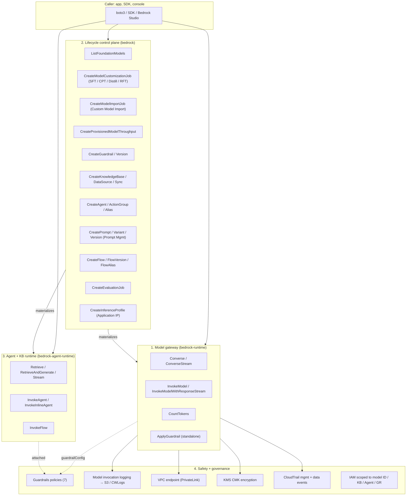
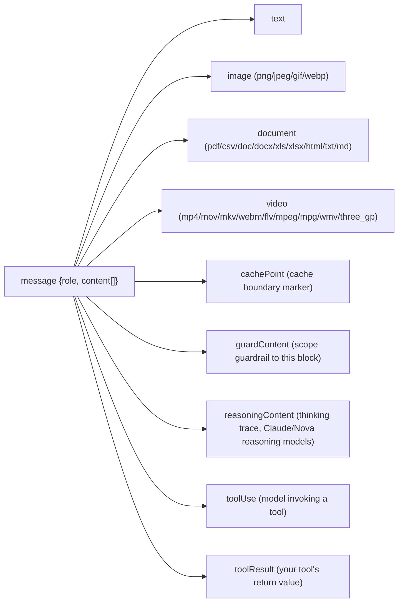
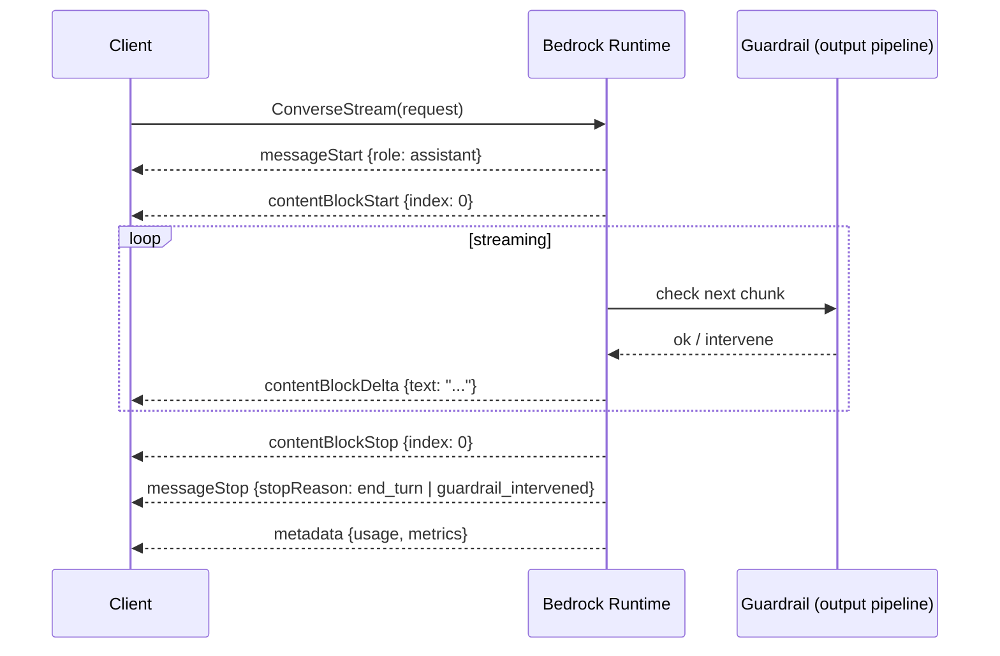
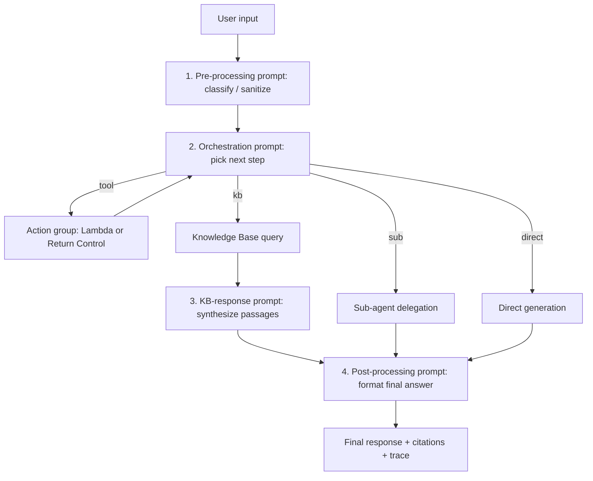
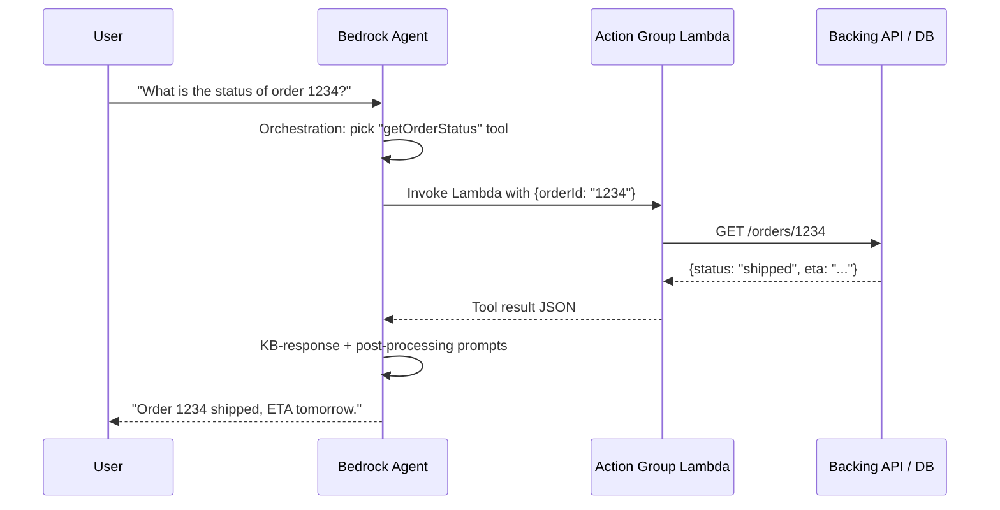

# Chapter 60 — Amazon Bedrock: the Foundation-Model Platform

> **Goal of this chapter:** Bedrock is the most consequential service in the second half of the MLA-C01 exam, and it is also the most architecturally dense — four products sit behind one console tab, each with its own pricing model, its own IAM resource type, and its own failure mode. By the end of the chapter you should be able to look at any of the ~25 Bedrock exam scenarios in the wild and immediately identify *which of Bedrock's four facets* the question is actually testing: the model gateway, the lifecycle control plane, the Agent/Knowledge-Base runtime, or the safety layer. You should know — without flipping back to a cheat sheet — when Provisioned Throughput is mandatory rather than optional, what the `aws:RequestedRegion: unspecified` SCP pattern protects against, why a custom-imported Llama and a Bedrock-fine-tuned Llama are billed completely differently, and the precise content-block taxonomy of the Converse API. The chapter is long because Bedrock is broad; it is broad because AWS has bolted the entire generative-AI stack onto a single service surface, and the exam will not give you credit for treating that surface as a single thing.

---

## 60.1 Mental model — Bedrock as four products in one

If you read AWS marketing pages, Bedrock looks like "an API for foundation models." That framing is useful for a first paragraph and actively misleading for the rest of the chapter. The product you are actually buying has four distinct pillars, each with its own SDK surface, its own pricing meter, its own IAM resource ARN family, and its own set of exam scenarios:

1. **A managed model gateway.** One HTTPS endpoint (`bedrock-runtime`) that fronts roughly 100 foundation models behind opaque model IDs like `anthropic.claude-3-5-sonnet-20241022-v2:0` or `amazon.nova-pro-v1:0`. You send a prompt, you get a completion. You never see a GPU, never run a container, never load weights. The gateway is the part of Bedrock that competes with the OpenAI API and the Anthropic console.
2. **A lifecycle control plane for foundation models.** A separate endpoint (`bedrock`, no `-runtime` suffix) that owns the *artifacts*: listing available models, creating fine-tuning jobs, registering custom imported models, defining guardrails, knowledge bases, agents, evaluations, application inference profiles, prompt versions, flows. Provisioned-throughput purchases live here. Nothing on this endpoint produces tokens; it produces *resources*.
3. **A managed agent + RAG runtime.** Bedrock ships managed runtimes for **Knowledge Bases** (`bedrock-agent-runtime`'s `Retrieve` / `RetrieveAndGenerate`) and **Agents** (`bedrock-agent-runtime`'s `InvokeAgent` / `InvokeInlineAgent`). These hide the "ReAct + retrieve + ground + cite" plumbing you would otherwise build in LangChain or LlamaIndex. The runtime is what competes with LangServe and the LangGraph cloud.
4. **A safety + governance layer.** **Guardrails** (seven policy types), **model invocation logging** to S3/CloudWatch, **VPC endpoints** (PrivateLink), **KMS customer-managed-key** encryption, **CloudTrail data events**, **IAM policies** that scope down to individual model IDs. This is the part of Bedrock that competes with NeMo Guardrails, Lakera, and the long tail of LLM safety vendors.

> ⚠️ **Exam alert.** The single fastest way to misread a Bedrock question is to assume "Bedrock" means "the model gateway." When a question mentions "track cost per app team" the answer is in pillar 2 (Application Inference Profiles in the control plane). When it mentions "police outputs of our self-hosted Llama" the answer is in pillar 4 (standalone `ApplyGuardrail`, no model call involved). Practice naming the pillar before naming the feature.

### 60.1.1 Why Bedrock is the AWS default for generative AI

Across the entire Part-K exam blueprint, **Bedrock is the AWS path to use a foundation model unless the prompt explicitly demands SageMaker JumpStart**. The exam does not ask you to pick "Bedrock or SageMaker" in a vacuum — it asks you to recognize the narrow set of conditions that push a workload off Bedrock onto JumpStart. Those conditions, covered in depth in Chapter 62, are:

- The model is open-weight but **not in Bedrock's catalog** (e.g., a niche vision model, a time-series foundation model, an old research model).
- You need **GPU-instance-level control** — specific Trainium/Inferentia hardware, custom Docker containers, multi-model endpoints, autoscaling tuned to your traffic shape.
- You need a **true air-gap** — Bedrock's VPC endpoints reach private subnets but Bedrock itself still has an AWS-region control plane. Defense and some healthcare workloads need *no* egress, period; those go to JumpStart in a private VPC.
- You need to **train from scratch** (Bedrock customization paths assume you are tuning a hosted base model, not building one).

Everything else — chatbots, RAG, agents, summarization, classification, multimodal extraction — goes to Bedrock. The MLA-C01 spends a meaningful slice of its exam weight (Domain 2 + Domain 4) on whether you can recognize that default.

### 60.1.2 The four-pillar architecture, visualized



Read the diagram twice. The pattern that recurs across every Bedrock exam question is *which arrow you traverse*: a caller hitting the gateway directly, the gateway calling the safety layer, the control plane materializing a resource the runtime then serves, or the runtime delegating back to the gateway for generation. None of these arrows is internal AWS plumbing — every one corresponds to an IAM action you can deny and a CloudWatch metric you can alarm on.

---

## 60.2 The foundation-model catalog

Bedrock hosts roughly **100 serverless foundation models across 10+ providers** as of 2026. You do not need to memorize the catalog (no exam question rewards "name three Llama variants"), but you do need to know who owns what family and what each is *good at* — because the exam questions are written as scenarios like "lowest-cost multimodal", "highest reasoning quality on legal documents", "best long-output context window", and the right answer is a family-level recognition.

### 60.2.1 Provider × family map

| Provider | Family | Strengths | Notable 2026 models |
|---|---|---|---|
| **Anthropic** | Claude | Long context (200K+), reasoning, tool use, coding, low hallucination | Claude Opus 4.6, Sonnet 4.6, Haiku 4.5 |
| **Amazon** | Nova + Titan | AWS-native price-leadership, multimodal, embeddings, image, video | Nova Micro / Lite / Pro / Premier; Nova Canvas (image); Nova Reel (video); **Nova 2 Lite** (RFT launch model, re:Invent 2025); Titan Embed Text v2; Titan Multimodal Embed; Titan Image Generator |
| **Meta** | Llama | Open-weight, good price-perf, customizable, supported by Custom Model Import | Llama 4 Scout/Maverick, Llama 3.3 70B Instruct, Llama 3.2 (multimodal 11B/90B), Llama 3.1 (8B/70B/405B) |
| **Mistral AI** | Mistral / Mixtral | Open-weight, MoE, multilingual | Mistral Large 3, Mixtral 8x7B / 8x22B, Mistral Small/Medium |
| **AI21 Labs** | Jurassic / Jamba | Long-context, structured outputs, state-space hybrid | Jamba 1.5 Large/Mini |
| **Cohere** | Command + Embed + Rerank | RAG-tuned generation, multilingual embeddings, rerank-as-a-service | Command R+, Command R, Embed English/Multilingual v3, Rerank 3.5 |
| **Stability AI** | Stable Diffusion / Stable Image | Image generation | Stable Image Ultra, Stable Image Core, SD 3.5 Large |
| **DeepSeek** | DeepSeek | Reasoning, coding (open-weight) | DeepSeek V3.2, R1 |
| **Google** | Gemma | Open-weight, efficient | Gemma 3 |
| **NVIDIA** | Nemotron | Open-weight, NVIDIA-optimized | Nemotron 4 family |

### 60.2.2 The Amazon Nova family — AWS's price-leadership wedge

The Nova family arrived at re:Invent 2024 (Micro, Lite, Pro, Premier), gained image (Canvas) and video (Reel) variants through 2025, and matured into **Nova 2** at re:Invent 2025, with **Nova 2 Lite** as the launch model for **Reinforcement Fine-Tuning (RFT)**. AWS markets Nova as "~75% cheaper than competitor models in its intelligence class" — and unlike most vendor claims, this one has held up in published head-to-heads on document VQA, claims classification, and routing workloads.

Memorize the Nova lineup the way you memorized the EC2 instance families in Chapter 5:

- **Nova Micro** — text-only, fastest + cheapest. Classification, extraction, routing, intent detection. Comparable to Haiku-class speed at lower cost. **Typical use:** the router in front of a mixed-fleet assistant.
- **Nova Lite** — multimodal in, text out. Low-cost workhorse for image/document understanding pipelines; up to 30-minute video in a single request. **Typical use:** claims-doc OCR + extraction, batch document classification, video summarization.
- **Nova Pro** — multimodal, **300K input tokens**, top-tier on DocVQA / ChartQA / IFEval. Best speed/accuracy/cost balance for "general production." **Typical use:** the synthesis hop in a RAG chatbot when Sonnet is overkill.
- **Nova Premier** — most capable Nova. Explicit role as **teacher in Bedrock model distillation** (see §60.6.3). **Typical use:** generate the training set that distills into a Nova Lite student.
- **Nova Canvas** — image generation. Negative prompts, inpainting, outpainting, image-conditioned generation, image variation. **Typical use:** marketing-asset workflows, e-commerce product variants.
- **Nova Reel** — short text-to-video; 6-second clips at launch, extended through 2026. **Typical use:** social-media short-form video, ad-creative iteration.
- **Nova 2 Lite** — re:Invent 2025 launch model for **RFT**. Used as the substrate when you want to push a model toward a reward function (math accuracy, code correctness, structured-output compliance). See §60.6.4.

> ⚠️ **Exam alert (Nova 2 Lite + RFT).** Reinforcement Fine-Tuning launched at re:Invent 2025 on **Amazon Nova 2 Lite as the launch model**. When the exam says "use a reward function," "optimize for math/code accuracy with a grader," or "push the model toward a measurable score," the answer is **RFT on Nova 2 Lite**, not SFT and not distillation. AWS publishes accuracy gains of up to ~66% on math benchmarks for RFT-tuned models.

### 60.2.3 Modality cheat sheet

- **Text → text** — every chat-shaped model. Use **Converse**.
- **Text → embeddings** — **Titan Embed Text v2** (configurable 1024 / 512 / 256 dims), **Cohere Embed English/Multilingual v3**, **Titan Multimodal Embed** (text + image into a shared 1024-dim space). Use `InvokeModel` (Converse is chat-only).
- **Text + image → text** — Claude 3.5/4 Opus/Sonnet/Haiku, Nova Lite/Pro/Premier, Llama 4 Scout/Maverick, Llama 3.2 11B/90B Vision.
- **Text + video → text** — Nova Lite/Pro/Premier; Claude (limited).
- **Text → image** — Stable Image Ultra/Core, SD 3.5, Titan Image Generator G1 v2, **Nova Canvas**.
- **Text → video** — **Nova Reel**, partner integrations.

The exam-relevant cross-link: any chapter you read on chunking, embedding, retrieval, multimodal RAG, or video understanding will lean on these modality boundaries. When a scenario describes inputs that include video, the answer is almost always Nova.

---

## 60.3 The API surface — Converse, InvokeModel, streaming, CountTokens, ApplyGuardrail

Bedrock's runtime exposes five operations on `bedrock-runtime` that you will see on the exam: **Converse**, **ConverseStream**, **InvokeModel**, **InvokeModelWithResponseStream**, **CountTokens**, and **ApplyGuardrail**. The agent + KB runtime adds **Retrieve**, **RetrieveAndGenerate**, **RetrieveAndGenerateStream**, **InvokeAgent**, **InvokeInlineAgent**, and **InvokeFlow** on `bedrock-agent-runtime`. The control plane has dozens more operations, but the exam only quizzes the ones in this section.

### 60.3.1 Converse — the unified, recommended path

**Converse** is the chat-shaped, model-agnostic operation. AWS recommends it for any new code, and the entire Bedrock ecosystem (cache points, tool use, reasoning blocks, request metadata, service tiers, mid-stream guardrails) ships features on Converse first. Why it matters:

- **One JSON shape across all chat models.** You do not need to know that Claude wants `system` at the top level and Llama wants `<|begin_of_text|><|start_header_id|>system<|end_header_id|>...` chat-template tokens. Bedrock applies the per-model templating internally.
- **Multimodal natively** — content blocks for **text**, **image**, **document**, **video**, plus newer **cachePoint**, **guardContent**, **reasoningContent**, **toolUse**, **toolResult**.
- **Built-in tool-use protocol** — `toolConfig` defines tool schemas; the model returns `toolUse` blocks; you call the tool and feed back a `toolResult` block on the next turn.
- **Built-in Guardrails integration** — `guardrailConfig` parameter; optional `guardContent` blocks to scope a guardrail to specific messages.
- **Prompt-caching support** — insert a `cachePoint` block to mark a cache boundary for models that support it.
- **Service tiers** — `serviceTier`: `default` / `flex` / `priority` / `reserved` (latency-cost trade-off; some tiers are global-CRIS only).
- **Request metadata** — `requestMetadata` tags (key/value) recorded in invocation logs; usable for cost-allocation filtering downstream.

#### Content blocks — the taxonomy

The single most exam-worthy detail of Converse is the **content-block taxonomy**. A message is a list of blocks, each of one type:



A real Converse turn for a paralegal summarizer looks like this:

```
POST /model/{modelId}/converse
{
  "messages": [
    { "role": "user",
      "content": [
        { "text": "Summarize this contract in 5 bullets." },
        { "document": { "format": "pdf",
                         "name": "msa-acme-2026",
                         "source": { "bytes": "<base64>" } } },
        { "cachePoint": { "type": "default" } }
      ] }
  ],
  "system": [{ "text": "You are a paralegal summarizer." }],
  "inferenceConfig": { "maxTokens": 1024, "temperature": 0.2, "topP": 0.9,
                        "stopSequences": ["\n\nUser:"] },
  "additionalModelRequestFields": { "top_k": 200 },
  "guardrailConfig": { "guardrailIdentifier": "abc123",
                        "guardrailVersion": "DRAFT",
                        "trace": "enabled" },
  "toolConfig": { "tools": [ {...openapi-ish tool schema...} ] },
  "requestMetadata": { "team": "claims-bot", "env": "prod" }
}
```

The response carries the matching shape, with the model's content blocks under `output.message.content`:

```
{
  "output": { "message": { "role": "assistant",
                            "content": [{ "text": "..." },
                                        { "toolUse": {...} }] } },
  "stopReason": "end_turn" | "tool_use" | "max_tokens" | "stop_sequence"
                | "guardrail_intervened" | "content_filtered",
  "usage": { "inputTokens": 125, "outputTokens": 60, "totalTokens": 185,
             "cacheReadInputTokens": 0, "cacheWriteInputTokens": 0 },
  "metrics": { "latencyMs": 1175 }
}
```

Fields the exam consistently tests:
- **`inferenceConfig.maxTokens / temperature / topP / stopSequences`** — the **portable** parameters (work across all models).
- **`additionalModelRequestFields`** — the **per-model escape hatch** (e.g., `top_k` for Anthropic, `repetition_penalty` for some Llama variants).
- **`additionalModelResponseFieldPaths`** — pull through model-specific output fields via JSON Pointer.
- **`stopReason`** — read this on every response. `guardrail_intervened` is your "Guardrail blocked" signal; `tool_use` is your "the model wants me to call a tool" signal.
- **`usage.cacheReadInputTokens` / `cacheWriteInputTokens`** — your prompt-caching observability hook. If `cacheReadInputTokens` stays zero, your cache point is misplaced.

### 60.3.2 ConverseStream — token streaming

`ConverseStream` wraps the same request and returns an **event stream** with this ordered choreography:

1. **`messageStart`** — role announced.
2. **`contentBlockStart`** — emitted for tool-use blocks (so the consumer can correlate by `contentBlockIndex`).
3. **`contentBlockDelta`** — repeated; carries one of `text`, `reasoningContent`, or `toolUse` partial JSON. The bulk of the events.
4. **`contentBlockStop`** — block boundary.
5. **`messageStop`** — includes `stopReason`.
6. **`metadata`** — final `usage` + `metrics`.



IAM: `Converse` requires `bedrock:InvokeModel`; `ConverseStream` requires `bedrock:InvokeModelWithResponseStream`. The exam will sometimes phrase a question as "we want to use streaming with attached guardrails" — the right answer is `ConverseStream` because the output guardrail pipeline runs **mid-stream**, blocking generation as soon as a violation appears rather than waiting for the full response.

### 60.3.3 InvokeModel + InvokeModelWithResponseStream — the legacy per-model API

`InvokeModel` is the **older** operation. It sends a raw byte body in each model's **native request format**, which differs per provider:

- **Anthropic Claude (Messages API)** — `{ "anthropic_version": "bedrock-2023-05-31", "max_tokens": ..., "messages": [...], "system": "..." }`.
- **Meta Llama** — `{ "prompt": "<chat-template-encoded string>", "max_gen_len": ..., "temperature": ... }`; you build the chat template yourself, including the special tokens.
- **Amazon Titan Text** — `{ "inputText": "...", "textGenerationConfig": {...} }`.
- **Mistral** — its own JSON shape; instruction-tuned models want `<s>[INST]...[/INST]` framing.
- **Stability** — image params (`text_prompts`, `cfg_scale`, `seed`, `steps`).
- **Titan Embed / Cohere Embed** — embedding-specific JSON (no `messages`, just `inputText` or `texts`).

Use `InvokeModel` when:

- You need a **non-chat** model — **text-to-image, text-to-video, and embeddings are `InvokeModel`-only** because Converse is chat-shaped.
- You are calling a **custom-imported model** that uses its source family's native API shape.
- **Migration:** existing code already calls `InvokeModel` and is not worth refactoring this sprint.

For everything chat-shaped on a current model, prefer Converse. AWS has been moving the ecosystem there since mid-2024 and continues to land new features on Converse first.

`InvokeModelWithResponseStream` is the streaming sibling; you decode the `chunk` events into the per-model streaming format.

### 60.3.4 CountTokens — billing-aware token counting

Introduced in 2024, **CountTokens** lets you pre-compute the **input token count** for a model **before** you send the actual `InvokeModel` / `Converse` request. Two key use cases:

- **Cost control** — reject too-large prompts before they hit the meter, or pick a cheaper model based on token count.
- **Context-window enforcement** — pre-truncate or summarize when a prompt would exceed the model's max context.

`CountTokens` is **free to call** (you are billing for the model's own tokenizer, not generation). The 2026 catalog supports Claude and Nova at minimum and continues to grow.

### 60.3.5 ApplyGuardrail — standalone safety

`ApplyGuardrail` invokes a guardrail **standalone** on arbitrary text or images, **without any model call attached**. The endpoint:

```
POST /guardrail/{guardrailIdentifier}/version/{guardrailVersion}/apply
{
  "source": "INPUT" | "OUTPUT",
  "content": [{ "text": { "text": "..." } }]
}
```

> ⚠️ **Exam alert (standalone `ApplyGuardrail`).** When the question asks "police outputs of a **non-Bedrock** model — a self-hosted Llama on SageMaker, an external API, or an on-prem model," the answer is **`ApplyGuardrail` standalone**. Do not reach for `Converse` with `guardrailConfig` (that requires a Bedrock-hosted generation). Do not reach for a separate moderation service. Bedrock Guardrails are a *cross-LLM* safety layer when invoked this way.

### 60.3.6 Model-specific API quirks that survive Converse

Two quirks remain even with Converse abstracting most things:

- **Claude system prompt** — Claude uses a `system` parameter that is **separate from the messages array**. In Converse this is the `system` field; in `InvokeModel` it is a top-level `system` string. Anthropic models will **not honor** "system" content stuffed into a `user` message.
- **Llama prompt template** — Llama-Instruct models expect special tokens around system/user/assistant turns. Converse generates these for you. `InvokeModel` does not — you must build the template yourself or use the published recipe.

---

## 60.4 Pricing modes — On-Demand, Provisioned Throughput, Batch, Cross-Region

Bedrock has three **primary** billing modes (On-Demand, Provisioned Throughput, Batch) plus a **modifier** (Cross-Region Inference). The exam reliably asks one of these per test. Know all four cold.

### 60.4.1 On-Demand

- **Unit:** per 1,000 input tokens + per 1,000 output tokens, priced per model.
- **Commitment:** none.
- **Throughput:** subject to per-account-per-region service quotas (TPM and RPM). Throttling appears as `ThrottlingException`.
- **Best for:** dev, variable traffic, low-to-medium prod, anything where unit cost matters more than throughput SLAs.
- **Gotcha:** for some models (custom imported, some new releases), on-demand may not be available in a region; you may be forced to Provisioned Throughput or cross-region routing.

### 60.4.2 Provisioned Throughput (PT)

- **Unit:** **Model Unit (MU)**. Each MU guarantees a fixed TPM (input + output) for a specific model and region.
- **Commitment:** 1-month or 6-month term. The 6-month term gives a 15–40% discount.
- **Pricing example (illustrative 2026):** Llama PT ≈ $21 / MU-hour for the 1-month term; larger models reach ~$50 / MU-hour. Custom-imported / fine-tuned models often higher.
- **Required for:**
  - Custom models from **Bedrock fine-tuning** or **continued pre-training** (after customization, the resulting model is **only** servable via PT).
  - Workloads needing TPM beyond the on-demand quota.
- **Not allowed for:**
  - Inference profiles (cross-region inference) — those are on-demand only.
- **Best for:** steady high-traffic prod, latency SLAs, custom fine-tuned models.

> ⚠️ **Exam alert (PT mandatory for custom models).** Any model produced **inside** Bedrock — SFT, continued pre-training, distillation, or RFT — is **only servable via Provisioned Throughput**. This is the most common cost gotcha. Fine-tuning itself can be cheap; **hosting** the custom model means paying for MUs continuously. When the question says "after fine-tuning, how do we serve?" the answer is always PT.

> ⚠️ **Exam alert (the $350/month minimum trap).** Once you provision a Model Unit, **you pay for that hour whether you use it or not.** At ~$21/MU-hour × 720 hours/month, the minimum PT bill is roughly **$15,000/month** for one MU on a Llama-sized model. Cloud Burn and Caylent both publish post-mortems where a test/dev MU left running over a weekend triggered surprise spend in the high-three to low-four figures (the often-cited "$350/month" floor reflects shorter no-commit experimental pricing on the smallest models). Always **tag PT resources** and enforce TTL via Lambda or AWS Budgets actions.

### 60.4.3 Batch inference

- **Unit:** per-token, **~50% off vs On-Demand**.
- **Commitment:** none.
- **SLA:** asynchronous; results materialize to S3, typically within hours; **24-hour SLA** for completion.
- **Best for:** bulk offline scoring — score 10M customer reviews, classify 50M product descriptions, generate embeddings for a 100M-doc corpus, run a regression eval over 50K examples on every PR.
- **How it runs:** create a `CreateModelInvocationJob` pointing at an **input JSONL** file in S3 (one record per line), an output bucket, and an IAM role. Bedrock spins up workers and writes results to your output prefix.
- **Supported models:** Anthropic Claude, Meta Llama, Mistral, Amazon Nova/Titan, embedding models. Not every catalog model is batch-eligible at all times.

### 60.4.4 Cross-Region Inference (CRIS) — capacity expansion modifier

Cross-region inference is **not a separate pricing tier** — it is a way to wrap any on-demand invocation in an inference profile that routes the request to whichever region in a defined geography has capacity. Three flavors:

| Flavor | ARN prefix | Behavior | Pricing |
|---|---|---|---|
| **Geographic** | `us.*`, `eu.*`, `apac.*` | Routes within a geography that respects data residency | Same as on-demand source region price; no surcharge in same geography |
| **Global** | `global.*` | Routes anywhere worldwide; **does not respect data residency** | Small surcharge (~10%) on most models; some models (Claude Sonnet 4.5 noted) price *lower* on global than geographic |
| **Application** (user-created) | custom | See §60.13 — your own profile wrapping one or more regions, primarily for tagging | Same as source region |

- Invoke CRIS by using the **inference profile ID** as the `modelId` (for example, `us.anthropic.claude-3-5-sonnet-20241022-v2:0`).
- CRIS **multiplies effective TPM** — you get the sum of the regions in the profile.
- CRIS is **on-demand only** — it cannot combine with Provisioned Throughput.

> ⚠️ **Exam alert (global CRIS data-residency caveat).** Geographic CRIS keeps data within a continent — `us.*` stays in US regions, `eu.*` stays in EU regions, `apac.*` stays in APAC regions. **Global CRIS may route to any AWS region worldwide.** When the question mentions GDPR, BDSG, Australian APP, or US sovereign data, the correct answer is **never global CRIS**. The compensating control most regulated shops use is an **organization SCP** that denies any Bedrock call whose `aws:RequestedRegion` is `unspecified` (the placeholder global CRIS sets), or that pins `bedrock:InferenceProfileArn` to only the geographic ARNs:

```json
{
  "Effect": "Deny",
  "Action": "bedrock:InvokeModel*",
  "Resource": "*",
  "Condition": {
    "StringEqualsIgnoreCase": { "aws:RequestedRegion": "unspecified" }
  }
}
```

### 60.4.5 Pricing decision tree

```
"Cheapest per-token bulk job, OK to wait a day?"            → Batch (-50%)
"Steady prod with TPM higher than on-demand quotas?"        → Provisioned Throughput
"Custom fine-tuned model in production?"                    → Provisioned Throughput (required)
"Variable traffic, no SLA needed?"                          → On-Demand
"On-demand but hitting throttles in one region?"            → Geographic CRIS profile
"Need max capacity, fine with global routing, no residency" → Global CRIS profile
"Need cost attribution per app/team?"                       → Application Inference Profile (§60.13)
```

---

## 60.5 Custom Model Import — bring your own weights

You fine-tuned an open-weight model outside Bedrock (on SageMaker, on your own H100s, on a Hugging Face Trainer run) and you want to **serve it through the same Bedrock API surface** as the catalog models — so your app code, your Guardrails, your Knowledge Bases, your Agents all work unchanged. **Custom Model Import (CMI)** is the bridge.

### 60.5.1 Supported architectures (2026)

CMI accepts models whose architecture **matches** an open-weight family Bedrock knows how to host:

- **Meta Llama** — 2, 3, 3.1, 3.2, 3.3 (and Llama 4 once GA in 2026).
- **Mistral** — Mistral 7B, Mixtral 8x7B.
- **Flan-T5**.
- **Mllama** (multimodal Llama variants).
- Additional architectures (Gemma, Qwen, etc.) are being added — check current docs at exam time.

What this means: if your fine-tuned model is **Llama-architecture-compatible** (same number of layers, same tokenizer family, same head structure), import works. A custom transformer architecture you invented from scratch is **not** supported — for that you go to SageMaker hosting with a custom container.

### 60.5.2 Format and source

- **Hugging Face Safetensors** is the de-facto format (preferred over PyTorch `.bin` for security and integrity).
- Source: an **S3 prefix** containing the model files (weights, `tokenizer.json`, `config.json`, etc.), or import from SageMaker model artifacts.
- **Size limits:** roughly **< 200 GB** for text-only models, **< 100 GB** for multimodal.
- Bedrock imports the weights, registers them as a **custom model ID** in your account, and provisions an internal serving image.

### 60.5.3 Serving mode

- **On-Demand only** for imported models (per-token billing, no PT commitment).
- **Cold start applies** if the model has been idle (several seconds of latency for the first request). Mitigations: keep-warm pings, or push high-throughput workloads to PT-only catalog models.

### 60.5.4 What you get

- Same `InvokeModel` / `InvokeModelWithResponseStream` API surface (Converse support depends on architecture).
- Works behind **Guardrails** (`ApplyGuardrail` always; native `guardrailConfig` for some).
- Works as the **generation model** for Knowledge Bases.
- IAM-controlled like any other model ID — `bedrock:InvokeModel` on the custom model ARN.

### 60.5.5 The Salesforce blueprint — when CMI wins

Salesforce's published architecture is the canonical CMI reference: **train and fine-tune on SageMaker**, then **import to Bedrock CMI for serverless serving**. Salesforce reports **30% faster deployments and 40% cost savings** versus their prior managed GPU stack, because dev/test workloads only spin up GPUs during active development and production lives on CMI with predictable per-token economics. The hybrid pattern — train on SageMaker, serve on CMI — is the architecture you should default to when an exam scenario describes a fine-tuned Llama or Mistral in regulated finance, healthcare, or SaaS.

---

## 60.6 Fine-tuning paths — SFT, CPT, distillation, RFT

Bedrock supports **four customization paths**, all of which keep your data in your account, encrypted, and **never used to improve the base model or shared with the model provider**.

| Path | Input data | Goal | When |
|---|---|---|---|
| **Supervised fine-tuning (SFT)** | Labeled prompt → completion pairs (JSONL on S3) | Adapt model to a task / style | Hundreds-to-thousands of high-quality examples |
| **Continued pre-training (CPT)** | Unlabeled domain text (JSONL on S3) | Inject domain knowledge / vocabulary | Lots of raw domain text (legal corpus, internal wiki, biomedical literature) |
| **Model distillation** | Teacher model + unlabeled prompts | Compress a large model's quality into a faster/cheaper student | Want Opus-level quality at Haiku-level cost |
| **Reinforcement Fine-Tuning (RFT)** *(re:Invent 2025, GA on Nova 2 Lite)* | A reward function (LLM-as-judge or deterministic grader) + prompts | Optimize toward a measurable reward | High-stakes accuracy targets (math, code, structured output). AWS reports ~66% accuracy gains on math benchmarks |

### 60.6.1 SFT — supervised fine-tuning

The classic. JSONL where each line carries the model's expected request shape (e.g., for Claude: `{ "messages": [...] }`; for Titan: `{ "prompt": "...", "completion": "..." }`). You configure hyperparameters (epochs, learning rate, batch size) and submit a fine-tuning job via `CreateModelCustomizationJob`. Bedrock provisions compute, runs the job, produces a custom model ID. The custom model is **only servable via Provisioned Throughput**.

Use SFT when you have curated input/output pairs — ticket classification, structured-output extraction, persona/voice adaptation, refusing certain queries.

### 60.6.2 Continued pre-training (CPT)

For when you have **a lot of unlabeled domain text** and want the model to absorb the vocabulary and style of your domain. Same plumbing as SFT but with unlabeled text. Use when fine-tuning would be premature — you do not yet have task-specific examples and want to broaden the model's "knowledge." Available on Titan and select Llama variants (catalog evolves).

### 60.6.3 Model distillation

Distillation is a **two-step pipeline managed by Bedrock**:

1. You provide **unlabeled prompts** that represent your production traffic.
2. Bedrock invokes the **teacher** (Nova Premier, Claude Opus, etc.) to generate completions.
3. Those teacher completions become a training set.
4. Bedrock fine-tunes a **student** (Nova Lite, Claude Haiku, etc.) on the teacher's outputs.

Result: a student model with ~teacher-grade quality on your distribution at the student's price and latency. Serve via Provisioned Throughput.

### 60.6.4 Reinforcement Fine-Tuning (RFT) — re:Invent 2025

The newest customization path. Instead of supervised pairs, you supply a **reward function** (an LLM-as-judge prompt that scores outputs 0–1, or a deterministic grader for math/code). Bedrock runs RL (PPO-style) to push the model's policy toward higher-reward outputs.

- **Launch model:** **Amazon Nova 2 Lite** (re:Invent 2025).
- **Use cases:** math reasoning, code correctness, format compliance ("output must be valid JSON conforming to this schema"), domain-specific accuracy.
- **Reported gains:** up to **~66% accuracy improvement** over base on math benchmarks.
- **Cost shape:** more expensive per training run than SFT, but for high-stakes tasks the accuracy lift can justify it.

### 60.6.5 Post-customization — Provisioned Throughput mandate

Once more, for the cheap seats: **any custom model produced inside Bedrock — SFT, CPT, distillation, RFT — can only be served via Provisioned Throughput.** Budget for it.

---

## 60.7 Bedrock Knowledge Bases — managed RAG

Knowledge Bases is Bedrock's **managed Retrieval-Augmented Generation** stack. The product pitch is "I have a pile of documents; I want an LLM that can answer questions citing them, without me writing chunking / embedding / vector-store / retriever / re-ranker / prompt-templating glue."

### 60.7.1 The pipeline

```mermaid
flowchart LR
  subgraph SOURCES["Data sources"]
    S3[(S3 prefix)]
    CONF[Confluence]
    SP[SharePoint]
    SF[Salesforce]
    WEB[Web crawler]
  end
  subgraph INGEST["Ingestion (managed)"]
    PARSE[Parse: text / FM parser]
    CHUNK[Chunk: fixed / hierarchical / semantic / none]
    EMBED["Embed: Titan v2 / Cohere v3"]
  end
  subgraph STORE["Vector store (pick one)"]
    OS["OpenSearch Serverless"]
    AUR[Aurora pgvector]
    PIN[Pinecone]
    NEP["Neptune Analytics (GraphRAG)"]
    S3V["S3 Vectors (GA Dec 2025)"]
    MONGO["MongoDB Atlas"]
    REDIS[Redis Enterprise]
  end
  subgraph QUERY["Query path"]
    R[Retrieve API]
    HY["Hybrid search: vector + BM25"]
    RR["Optional rerank"]
    META[Metadata filter]
    RAG["RetrieveAndGenerate: prompt + model + guardrail"]
  end
  SOURCES --> PARSE --> CHUNK --> EMBED --> STORE
  STORE --> HY --> RR --> META --> R --> RAG
```



### 60.7.2 Data sources

- **Amazon S3** — most common; S3 prefix(es) of supported file types (PDF, HTML, Markdown, plain text, Word, etc.).
- **Confluence** — Server + Cloud, OAuth.
- **Salesforce** — Knowledge articles, records.
- **SharePoint Online**.
- **Web crawler** — point at public/internal URLs; respects `robots.txt`.
- **Custom** — push your own documents via API.

Sync modes: **manual**, **scheduled**, or **event-driven** (S3 Event Notifications trigger a sync).

### 60.7.3 Parsing and chunking

- **Parsers** — default extracts text directly; for complex layouts you can plug a **foundation-model parser** (e.g., Claude or Nova reads PDFs and produces clean Markdown — better for tables, equations, figures).
- **Chunking strategies:**
  - **Default fixed-size** — ~300 tokens per chunk with overlap.
  - **Hierarchical** — parent + child chunks; retrieve child but return parent context.
  - **Semantic** — chunk boundaries at semantic breakpoints (uses embedding similarity).
  - **No chunking** — for small docs that fit in context.

### 60.7.4 Embedding models

- **Titan Embed Text v2** (default) — 1024 / 512 / 256 dim configurable; English + many languages.
- **Cohere Embed Multilingual v3** — strong cross-lingual retrieval.
- **Cohere Embed English v3**.

### 60.7.5 Vector stores (the nine-option matrix)

| Vector store | Strengths | Cost shape | Notes |
|---|---|---|---|
| **OpenSearch Serverless** | Bedrock can auto-create the collection; fast setup | Floor ~$175/mo dev (1 OCU min, 2025+) up to ~$700/mo prod (4 OCUs) | The "ready to demo" default |
| **OpenSearch Managed Cluster** | Per-instance tuning, large scale | Per-instance | Added 2025 for enterprise |
| **Aurora PostgreSQL + pgvector** | SQL/joins/ACID, mature, cheap at small/medium scale | $30–$100/mo at small scale | The cost-optimization answer |
| **Aurora Serverless v2 + pgvector** | Auto-scaling pgvector | Per-ACU | Sweet spot for variable load |
| **Neptune Analytics** | Combined graph + vector (**GraphRAG**) | Per query/instance | When relationships matter (entity-rich corpora) |
| **MongoDB Atlas** | Multi-cloud, document model | MongoDB pricing | Third-party |
| **Pinecone** | Managed dedicated vector DB | Pinecone pricing | Third-party |
| **Redis Enterprise Cloud** | Sub-ms latency | Redis pricing | Real-time use cases |
| **Amazon S3 Vectors** *(GA Dec 2025)* | **Lowest-cost** vector storage; native S3 | S3 storage + per-query | The 2026 "cheapest RAG" answer |

**Exam pattern recognition:**

- "Cheapest" / "cost-optimized" → **S3 Vectors** (newest, lowest cost) or **Aurora pgvector** (mature, cheap, SQL).
- "Fastest to stand up" / "let Bedrock manage it" → **OpenSearch Serverless**.
- "ACID, joins, SQL" → **Aurora pgvector**.
- "Graph + vector combined" → **Neptune Analytics** (GraphRAG).
- "Sub-ms latency" → **Redis Enterprise**.

### 60.7.6 Retrieval

- **Hybrid search** (vector + BM25 keyword) — default in 2026.
- **Metadata filtering** — filter by custom fields (department, year, doc type).
- **Reranking** — Cohere Rerank or Amazon Rerank as a post-retrieval step; significantly improves precision@k.
- **Confidence scores** — returned per chunk; you can threshold downstream.

### 60.7.7 Generation — `Retrieve` vs `RetrieveAndGenerate`

- **`Retrieve`** — vector + hybrid search only; returns top-k passages with citations. You do the prompting yourself. Use when you want to compose your own prompt or when the generation step lives in a different system.
- **`RetrieveAndGenerate`** — does retrieval + builds the prompt + calls the generation model + applies Guardrails + returns answer with citations. Supports session state for multi-turn ("the previous answer", "follow-up").
- **`RetrieveAndGenerateStream`** — streaming variant.

### 60.7.8 Multimodal + structured-data + GraphRAG

- **Multimodal KBs** parse PDFs with images, charts, tables; pair a multimodal parser (Nova Lite / Claude) with a multimodal embedding (Titan Multimodal Embed) to retrieve images alongside text.
- **Structured-data KBs** point at Athena / Redshift; the runtime generates SQL against your schema and retrieves rows as context (a "text-to-SQL + RAG" hybrid).
- **GraphRAG** via Neptune Analytics extracts entities and relationships; useful when "who knows whom" or "which contract depends on which" matters more than pure text similarity. Use cases: drug-target discovery, KYC entity-relationship resolution, supply-chain dependency mapping.

### 60.7.9 KB vs roll-your-own RAG (LangChain on OpenSearch)

The temptation is to build your own RAG with LangChain + OpenSearch + boto3 — and that is a fine path. KB's value: **no glue code to maintain**, **integrated with Agents and Guardrails**, **citations first-class**, **sync orchestration built-in**, **document-level ACLs respected** for some sources, **swap embedding model / vector store without rewriting the app**.

**Decision rule:** if your retrieval logic is "embed query → top-k cosine sim → stuff in prompt," **use Knowledge Bases**. The day you need a custom re-ranker, multi-step retrieval, or query rewriting, **graduate to LangChain/LlamaIndex on OpenSearch (or Aurora pgvector for cost)**. Chapter 61 walks the RAG pattern catalog in depth.

---

## 60.8 Bedrock Agents — tool use and orchestration

Agents wrap a foundation model with **tool use, multi-step planning, memory, and (since 2024) multi-agent collaboration**. Exam shorthand: when the question describes "an LLM that calls APIs, queries a DB, looks up enterprise docs, and remembers the conversation across turns" — that is Bedrock Agents.

### 60.8.1 Components

| Component | Role |
|---|---|
| **Foundation model** | The brain. Pinned at agent creation (Claude, Nova, etc.). Switchable on revision. |
| **Instructions** | The system-prompt-shaped agent persona. |
| **Action groups** | Tools the agent can call. Each is backed by either a **Lambda function** (Bedrock invokes Lambda with the agent-determined input) or **Return Control** (Bedrock returns the tool call to your app to execute, useful when the tool runs outside AWS). |
| **OpenAPI / function schemas** | How each action group's interface is described to the model. Two flavors: full OpenAPI 3.0 spec uploaded to S3, or simpler function-schema definitions inline. |
| **Knowledge bases** | One or more KBs attached; the agent decides when to query. |
| **Code interpreter** | A Bedrock-provided sandboxed Python execution action group; the agent can write and execute code for calculations, parsing, plotting. |
| **Prompt overrides** | Override the pre-processing / orchestration / KB-response / post-processing prompts that Bedrock uses internally. Used to tune behavior. |
| **Session state** | Per-session memory; multi-turn conversation context. Includes `sessionAttributes` (your app-supplied state) and `promptSessionAttributes` (injected into prompts). |
| **Guardrails** | Optional safety layer attached at agent level. |
| **Multi-agent collaboration** *(2025)* | A "supervisor" agent delegates to "sub-agents" — each with its own model, tools, and KBs. Trace surfaces through the supervisor. |

### 60.8.2 The ReAct-style orchestration loop



Each step is **traceable** by setting `enableTrace=true` on the API call. The trace JSON tells you exactly which tool the agent considered, what input it passed, the result, and how it iterated. Critical for debugging "why did the agent pick the wrong tool?" — and an explicit exam scenario.

### 60.8.3 Action Group execution — the Lambda path



### 60.8.4 Multi-agent collaboration

Added in 2024 and matured through 2025. You designate one agent as the **supervisor** and add one or more **collaborator** agents. The supervisor's instructions describe each collaborator's specialty; the supervisor decides which collaborator to delegate to. The trace surfaces the delegation chain.

> ⚠️ **Exam alert (multi-agent collaboration).** When the scenario describes splitting a monolithic agent's tool surface by domain — a "returns" sub-agent, a "shipping" sub-agent, an "account" sub-agent under a "customer-service supervisor" — the answer is **multi-agent collaboration**, not "build a bigger single agent with more tools." Single agents with too many tools degrade fast on tool-choice accuracy beyond ~20 tools; the supervisor pattern is the architectural fix.

### 60.8.5 Classic Agents vs AgentCore

In **October 2025** AWS shipped **Amazon Bedrock AgentCore**, a separate runtime layer for production agents that supplements (and over time supersedes) classic Bedrock Agents for serious deployments. AgentCore brings:

- **Framework-agnostic runtime** — works with LangGraph, CrewAI, Strands Agents, custom code.
- **Automatic session isolation** — critical for multi-tenant SaaS agents.
- **Managed memory** — short-term and long-term memory primitives.
- **AgentCore Gateway** — centralizes tool definitions and auth as reusable, secured endpoints.
- **AgentCore Identity** — auth/authz for both the agent and the tools it calls.
- **AgentCore Observability** — auto-instrumented telemetry to CloudWatch, integrated with X-Ray.

For the MLA-C01 you should be able to recognize *both* patterns — classic Bedrock Agents (action groups + KBs + Lambda) and AgentCore (framework-agnostic runtime + Gateway + Identity + Memory + Observability). Chapter 61 dives into when each wins.

---

## 60.9 Bedrock Guardrails — the safety layer

Guardrails is a **policy layer** that sits between the user and the FM and between the FM and the user. You define a Guardrail (a logical resource with a version) and attach it to any model invocation — `Converse`, `InvokeModel`, Agents, Knowledge Bases — via the `guardrailConfig` field. You can also invoke a Guardrail standalone via `ApplyGuardrail` to police text or images from a non-Bedrock model.

### 60.9.1 The seven policy types

| Policy | What it does | Configurability |
|---|---|---|
| **Content filters** | Detect/block harmful content in input prompts and model output across six categories: **Hate, Insults, Sexual, Violence, Misconduct, Prompt Attack** | Per-category strength: `NONE` / `LOW` / `MEDIUM` / `HIGH`. Separate strengths for input and output. Image inputs supported for Hate/Sexual/Violence/Misconduct (2025+). |
| **Prompt-attack filter** | Sub-category within content filters that targets **jailbreaks, prompt injections, prompt leakage** | LOW / MEDIUM / HIGH (Standard tier). |
| **Denied topics** | Free-text definitions of topics the model must refuse (e.g., "give investment advice", "discuss competitors") | Up to **30** denied topics per guardrail. Each defined by name + description + sample utterances. |
| **Word filters** | Block exact words/phrases. Includes a managed **profanity** list. | Custom word list (thousands) + managed profanity. |
| **Sensitive information filters (PII)** | Detect and **block** or **mask** PII entities (SSN, DoB, email, phone, address, IP, credit card, MAC, age, name, password, license plate, URL, US-passport, AWS access keys, etc.) **plus custom regex** | Per-entity action: `BLOCK` (reject prompt/response), `ANONYMIZE` (replace with `{ENTITY_TYPE}`), implicit `NONE`. Custom regex patterns get the same action choices. |
| **Contextual grounding check** | Catch hallucinations: response must be **grounded** in the provided source AND **relevant** to the query | Two thresholds: **grounding score** (0–1) + **relevance score** (0–1). Below threshold → BLOCK or surface to caller. |
| **Automated Reasoning checks** *(GA 2025–2026)* | Formal-logic verification against a customer-defined policy (natural-language rules translated to logic) | Define policy → Guardrail validates that the model's response satisfies the logical constraints. For high-stakes deterministic checks (regulatory rules, eligibility logic). |

### 60.9.2 How a Guardrail is invoked

Two pipelines run in parallel:

- **Input pipeline** — runs on the user prompt **before** the model sees it. Can block the prompt entirely or anonymize PII.
- **Output pipeline** — runs on the model output **before** the user sees it. Can block or mask. With Converse streaming, the output pipeline runs **mid-stream** — Guardrails can stop generation as soon as a violation appears (rather than waiting for the full response).

### 60.9.3 Exam-triggering keywords

| Phrase in question | Policy you want |
|---|---|
| "hallucination", "made up information", "not grounded in source" | Contextual grounding check |
| "PII leakage", "redact SSN/email/credit card", "anonymize before logging" | Sensitive information filter (ANONYMIZE) |
| "compliance with company policy on disallowed topics" | Denied topics |
| "jailbreak", "prompt injection", "instruction override" | Prompt-attack filter (under content filters) |
| "block profanity / specific competitor names" | Word filters |
| "safety across **any** LLM, not just Bedrock" | `ApplyGuardrail` standalone |
| "verify the answer follows logical rules / regulatory policy" | Automated Reasoning checks |
| "code with harmful content (variable names, comments)" | Content filters Standard tier (code-aware) |

### 60.9.4 Vertical-specific Guardrail recipes

**Financial services.**
- Denied topics: "specific investment advice," "tax advice," "guaranteed returns."
- Word filters: SEC-flagged phrases ("get rich quick," "no risk").
- PII filters: SSN, account numbers, brokerage IDs.
- Automated Reasoning: encode "outputs must never recommend a specific security to a specific person" as a logical policy.

**Healthcare (HIPAA-eligible workloads).**
- Denied topics: "medical diagnosis," "treatment recommendation," "drug dosing."
- PII filters: PHI — names, dates, MRNs, lab IDs, addresses.
- Contextual grounding: must cite from approved clinical knowledge base.
- VPC endpoints, KMS-CMK encryption, BAA in place with AWS.

**HR / talent.**
- Denied topics: any inference of protected class (race, religion, age, disability, pregnancy, national origin).
- PII filters: salary, performance ratings.
- Word filters: discriminatory phrasings flagged by EEOC.

---

## 60.10 Bedrock Prompt Management + Flows

### 60.10.1 Prompt Management

A **versioned prompt registry** inside Bedrock. Each prompt is a logical resource that contains:

- The prompt template (with `{{variable}}` placeholders).
- Target model and inference config.
- Up to **three prompt variants** per prompt for A/B testing.
- Tags for cost attribution.
- Versions + drafts.

You reference a Prompt Management prompt by its ARN in Converse — `modelId` becomes `arn:aws:bedrock:...:prompt/PROMPT_ID:VERSION` — and pass `promptVariables` to fill the placeholders.

**Prompt Optimization** is a Bedrock feature that auto-rewrites a prompt to be more accurate or concise against a specific target model. Useful when migrating a prompt from Claude to Nova (or vice versa) — Bedrock suggests a tuned variant. A 2026 addition, the **cross-model prompt migration tool**, ports a prompt tuned for one model to another, accounting for tokenizer differences, system-prompt conventions, and tool-use schema differences.

### 60.10.2 Bedrock Flows

A **visual drag-and-drop workflow builder** for chaining together:

- Foundation models.
- Prompts (from Prompt Management).
- Agents.
- Knowledge Bases.
- Lambda functions.
- S3 reads/writes.
- Conditions and routers.

Think Step Functions but tuned for GenAI primitives. Each Flow is versioned, deployable via console / SDK, traceable per node, and rollback-friendly. Use Flows when an Agent's single-loop orchestration isn't enough — you want explicit branching, retries, parallel sub-flows, or human-in-the-loop steps.

---

## 60.11 Bedrock Evaluations

Evaluate models and RAG systems against your own data and prompts.

### 60.11.1 Modes

- **Automatic evaluation** — LLM-as-judge scoring (judge is another Bedrock model). Metrics: accuracy, robustness, toxicity, refusal. Curated benchmark datasets or bring-your-own.
- **Human evaluation** — bring your own workforce (employees), use AWS-managed evaluators, or use a third-party (SageMaker Ground Truth integration). Build rubrics; evaluators score.
- **RAG evaluation** — purpose-built for Knowledge Bases. Retrieval-side metrics (**context relevance**, **context recall**) and generation-side metrics (**faithfulness**, **answer relevance**).

### 60.11.2 What you get

A per-metric report card you can use to:

- Choose between candidate generation models for a given workload.
- Choose between KB configurations (chunking strategy, embedding model, vector store, reranker on/off).
- Track quality across releases (regression detection).

When a question asks "how do you compare two Bedrock models on your dataset" or "how do you measure whether your RAG hallucinations decreased after a change," the answer is **Bedrock Evaluations** — do not reach for SageMaker Clarify or custom MLOps unless explicitly framed.

---

## 60.12 Bedrock Studio

A **web UI gated by AWS IAM Identity Center (SSO)** that lets non-developers experiment with FMs, build agents, attach KBs, and ship Flows without writing SDK code. Aimed at line-of-business teams who want a managed "GenAI workbench" inside their AWS account.

Features:

- Workspaces (per-team isolation).
- Project canvas for building Agents / Flows / Apps visually.
- Shared prompt libraries.
- Quotas and cost tracking per workspace (typically via Application Inference Profiles under the hood — see §60.13).

For the exam: **Studio is not the same as the AWS Console's Bedrock pages.** Studio is a separate SSO-fronted UI for non-developers. It is the "where do business analysts go to build GenAI apps" answer.

---

## 60.13 Application Inference Profiles — cost attribution + per-app rate limits

**Application Inference Profiles (AIPs)** are user-created inference profiles (as opposed to the system-defined cross-region profiles). They solve two practical problems that come up at scale:

### 60.13.1 Problem 1: Cost attribution

One AWS account hosts Bedrock workloads for five product teams. They all hit the same model IDs. How do you know which team caused $X of the bill?

**Solution:** create an AIP per team (or per app, or per environment). Tag it with cost allocation tags (`team=claims-bot`, `env=prod`). Each team's app uses **its own AIP ARN** as the `modelId` in Converse / InvokeModel. Bedrock surfaces per-AIP usage to AWS Billing's Cost Allocation Tags; you get per-team line items.

### 60.13.2 Problem 2: Per-app rate limiting + IAM-principal attribution

Same setup — five teams sharing one account's on-demand TPM quota. Team A's runaway batch job can starve Team B's interactive chat. AIPs let you size and monitor each team's usage separately via CloudWatch metrics emitted per-AIP. They also enable **IAM-principal attribution**: an IAM policy can require that a given role *only* invoke the model through its own AIP (`bedrock:InferenceProfileArn` condition key), so a stray script from Team C cannot accidentally bill against Team A's AIP.

### 60.13.3 How they work

An AIP is created by referencing **one or more underlying models or system-defined cross-region profiles**:

- **Single-region AIP** — wraps a single model in a single region. Mostly for tagging / cost attribution.
- **Multi-region AIP** — wraps a system-defined cross-region profile (e.g., `us.anthropic.claude-3-5-sonnet`). Inherits the cross-region capacity, adds the per-app tagging layer.

Call Converse / InvokeModel using the **AIP ARN as `modelId`**. Bedrock routes the request to the underlying model, emits CloudWatch metrics tagged with the AIP, and bills usage against the AIP's cost allocation tags.

### 60.13.4 Pricing implications

AIPs **do not change unit pricing** — you pay the same per-token rate as the underlying model in the source region. Their value is **observability and accountability**, not direct discount.

### 60.13.5 Feature interaction

AIPs work with:

- `InvokeModel`, `InvokeModelWithResponseStream`, `Converse`, `ConverseStream`.
- Knowledge Bases (generation and parsing).
- Model evaluation (specify the AIP as the model to evaluate).
- Prompt Management (use AIP for generation in stored prompts).
- Flows (specify AIP per prompt node).

They do **not** work with:

- Provisioned Throughput (AIPs are on-demand-only — they wrap on-demand or cross-region on-demand).
- Some legacy custom model setups.

---

## 60.14 Production stories — who is running Bedrock at scale

Bedrock has moved past the "POC slideware" stage. By 2025-2026, AWS reports adoption from "tens of thousands of customers across industries" for the Nova family alone, and the broader Bedrock customer base spans the Fortune 500 in finance, healthcare, insurance, professional services, and SaaS. The named anchor customers you should be able to recall:

- **Salesforce (Agentforce 360 for AWS).** Anthropic's Claude on Bedrock now powers Salesforce's Atlas Reasoning Engine for regulated industries — financial services, healthcare, cybersecurity, life sciences. Named customers include **CrowdStrike** and **RBC Wealth Management**. All Claude traffic stays inside the Salesforce VPC; every agent action generates an immutable audit trail.
- **Salesforce (internal AI platform).** Beyond Agentforce, Salesforce's own AI platform team uses Bedrock **Custom Model Import** to run fine-tuned Llama, Qwen, and Mistral variants — **30% faster deployments, 40% cost savings** vs. their prior self-managed GPU stack.
- **nCino.** Banking software vendor (loan origination, credit underwriting). Runs Claude on Bedrock for document understanding, credit-memo drafting, and customer comms for community and regional US banks. Cleanest "regulated finance ISV on Claude-via-Bedrock" reference.
- **Hebbia.** Used by "over a third of the top 50 asset managers and Tier 1 investment banks and law firms." Canonical Claude-on-Bedrock buy-side and Big Law deployment.
- **Newfront.** Insurance brokerage. ~20% of the US unicorn-startup insurance market. Uses Claude on Bedrock for policy comparison, certificate generation, broker-of-record automation.
- **Swisscom.** First public production reference for **Amazon Bedrock AgentCore** (GA October 2025). Enterprise customer-support and sales agents leveraging AgentCore's session isolation, memory, and observability.
- **PwC.** Claude on Bedrock for finance practice transformation in banking, insurance, and healthcare — reconciliation, KYC review, full CFO-office redesign engagements.
- **Rocket Mortgage.** Bedrock-powered Rocket Logic Agent for mortgage origination automation; cited in AWS executive-summit decks through 2025-2026.

These are the names that appear in MLA-C01 prep decks and AWS re:Invent breakouts. You will not be asked "name a Bedrock customer" — but you will see scenarios where the right-shaped answer maps to one of these archetypes (regulated-finance ISV, multi-tenant SaaS agent, claims-processing batch, mortgage automation).

---

## 60.15 Cost and performance levers

A consolidated table of the levers that show up in cost-optimization scenarios. Ordered by typical impact.

| Lever | Mechanism | Typical impact |
|---|---|---|
| **Right-size the model** | Route 60-80% of traffic from Sonnet/Opus to Nova Lite/Micro or Haiku via a classifier router | 40–70% cost reduction on aggregate spend |
| **Bedrock Batch** | Anything non-real-time goes through `CreateModelInvocationJob` | **50% off** on-demand |
| **Prompt caching** | Insert `cachePoint` blocks around stable system prompts, RAG context, few-shot examples | 30–50% input cost reduction on cacheable traffic |
| **KB → Aurora pgvector** | Migrate from OpenSearch Serverless to Aurora Serverless v2 with pgvector at small/medium scale | ~90% vector-store cost reduction |
| **Cap `max_tokens` aggressively** | Default of 4096 is fine for dev; production chatbots usually fit in 512 | Hidden 5x amplification reversed |
| **Smallest embedding model that hits recall** | 384-d embeddings often meet recall@10 vs 1024-d | 40-60% embedding storage + query cost |
| **Provisioned Throughput at 50–70% utilization** | 6-month commitment for steady high-volume | 30–50% vs equivalent on-demand spend |
| **Cross-region inference (geographic)** | Sum TPM across regions; relieve single-region throttling | Capacity, not unit cost |
| **Mixed-fleet routing** | Cheap classifier (Nova Micro) → cheap model for easy, expensive model for hard | Blended cost down without quality loss |
| **Retrieval result caching** | ElastiCache + cosine similarity for in-session repeated queries | 30% retrieval-call reduction |

---

## 60.16 The 25-row exam-trigger decision table

Compact mapping of business problem → Bedrock answer. Memorize this table the way you memorized the AWS-service map in Chapter 6.

| # | Scenario | Answer |
|---|---|---|
| 1 | "Chatbot that answers questions from our company PDFs" | Bedrock Knowledge Bases + Converse |
| 2 | "Same chatbot, but also needs to call our internal order-status API" | Bedrock Agents (action group) + KB attached |
| 3 | "Hallucinations from our RAG bot are a compliance issue" | Guardrails contextual grounding check |
| 4 | "Redact SSN/email from all prompts and responses" | Guardrails sensitive-information filter (ANONYMIZE) |
| 5 | "Bot must refuse to give investment advice" | Guardrails denied topics |
| 6 | "Detect prompt injections in user input" | Guardrails content filter → prompt-attack |
| 7 | "Police outputs of a self-hosted Llama, not just Bedrock" | `ApplyGuardrail` standalone |
| 8 | "Cheapest way to embed and store vectors for RAG" | KB with **S3 Vectors** (or Aurora pgvector for SQL/joins) |
| 9 | "Fastest way to spin up a managed RAG without picking infra" | KB with **OpenSearch Serverless** |
| 10 | "Score 50M product descriptions overnight" | **Batch inference** (50% off, 24h SLA) |
| 11 | "Steady 10M tokens/min in prod with latency SLA" | **Provisioned Throughput** |
| 12 | "Variable traffic, no SLA needs" | **On-Demand** |
| 13 | "Hitting throttles in us-east-1 only" | **Geographic CRIS** profile (`us.*`) |
| 14 | "Max capacity for a dev tool, no residency constraints" | **Global CRIS** profile (`global.*`) |
| 15 | "Track Bedrock cost by team/app/environment" | **Application Inference Profile** + cost allocation tags |
| 16 | "Fine-tuned a Llama 3 outside Bedrock; want serverless serving" | **Custom Model Import** (Safetensors → on-demand) |
| 17 | "Train a custom model on labeled examples" | Bedrock **SFT** (then Provisioned Throughput) |
| 18 | "Inject domain vocabulary with unlabeled text" | **Continued pre-training** |
| 19 | "Shrink Opus quality into Haiku cost" | **Model distillation** (Premier/Opus as teacher) |
| 20 | "High-stakes accuracy with a reward function (math/code)" | **Reinforcement Fine-Tuning** (Nova 2 Lite at launch) |
| 21 | "Compare two models on our dataset" | **Bedrock Evaluations** (automatic) |
| 22 | "Compare two RAG configs on our dataset" | **Bedrock Evaluations** (RAG mode) |
| 23 | "Visual workflow chaining prompts, models, KBs, Lambda" | **Bedrock Flows** |
| 24 | "SSO-fronted GenAI workbench for non-developers" | **Bedrock Studio** |
| 25 | "Estimate input tokens before paying for the call" | **CountTokens** API |

---

## 60.17 Bedrock vs SageMaker JumpStart — a preview

This is the architect-level decision and a near-certain MLA-C01 exam topic. Chapter 62 unpacks it in full; for now, internalize the simple rule:

> **Bedrock for ~80% of enterprise GenAI workloads.** Default to Bedrock.
> **SageMaker JumpStart (or SageMaker AI broadly)** when you hit a specific constraint Bedrock cannot solve.

What pushes a workload to JumpStart:

1. **Model not in Bedrock catalog** (niche vision models, time-series FMs, smaller open research models).
2. **True air-gapped VPC** (defense, intelligence, some healthcare).
3. **Fine-grained hyperparameter / training control** (optimizer, LR schedule, LoRA rank, cluster topology).
4. **Massive scale (>1M req/hour sustained)** where dedicated `g5.48xlarge` or `g6e` can beat Bedrock PT.
5. **Model-vendor-specific behavior** not exposed by Bedrock's unified API.

What keeps a workload on Bedrock:

- Serverless economics — zero idle cost matters more than peak unit economics.
- Model swap as a one-line code change (Claude → Nova → CMI Llama → Mistral).
- AgentCore + Knowledge Bases + Guardrails integration — these are Bedrock-native.
- Faster compliance onboarding — Bedrock inherits AWS's compliance posture.

The hybrid pattern most mature shops run: **train and customize on SageMaker → deploy via Bedrock Custom Model Import** for serverless inference + Bedrock's safety/agent ecosystem.

---

## 60.18 Cross-cutting concerns — data residency, IAM, encryption, observability

### 60.18.1 Data privacy

- Prompts, completions, fine-tuning data, KB documents — **never leave your AWS account**, **never used to train base models**, **never shared with model providers**.
- Encryption at rest (KMS, customer-managed keys supported) and in transit (TLS).
- Model invocation logging is **opt-in** and writes to your S3 / CloudWatch Logs.

### 60.18.2 IAM

Bedrock IAM permissions can be scoped down to:

- A specific model ID (`bedrock:InvokeModel` with `Resource: arn:aws:bedrock:us-east-1::foundation-model/anthropic.claude-...`).
- A specific Inference Profile ARN (`bedrock:InferenceProfileArn` condition).
- A specific Knowledge Base, Agent, Guardrail.

This is how organizations enforce "only the legal team can use Claude Opus; everyone else gets Nova Lite."

### 60.18.3 Networking

- **VPC endpoints (PrivateLink)** for the runtime and control plane — no traffic over the public internet.
- **CloudTrail** for control-plane API calls.
- **CloudTrail data events** *(opt-in)* for runtime calls (InvokeModel/Converse) — pricey but auditable.

### 60.18.4 Observability

- **CloudWatch metrics** — invocations, tokens (input/output), latency, errors. Sliced by model and optionally by Inference Profile.
- **Model invocation logging** — full prompt + completion in S3 / CloudWatch Logs, **including blocked content** (so you can audit Guardrails decisions).
- **Agent traces** — per-step orchestration trace JSON for debugging.

### 60.18.5 Quotas

Per-account-per-region quotas on TPM, RPM, concurrent batch jobs, count of guardrails / agents / KBs / custom models / prompt versions / inference profiles. Most quotas raisable via Service Quotas. Cross-region inference helps when you have maxed a single region's TPM.

---

## 60.19 Common production anti-patterns

Cataloged from published incident postmortems, AWS field-architect blog posts, and re:Invent breakout sessions. Each of these has appeared as a "what is wrong with the proposed architecture?" exam scenario:

1. **"Default to Sonnet for everything."** Burns budget on simple lookups. Always classify-then-route.
2. **"On-demand inference for a steady 50 req/s workload."** Should be Provisioned Throughput; can be 30-50% cheaper.
3. **"Re-embed the entire corpus on every doc change."** Should be incremental ingestion + Bedrock Batch.
4. **"No Guardrails because we trust the prompt."** Prompt injection plus PII leakage eventually creates a Slack incident. Guardrails are cheap insurance.
5. **"Skip CMI and run our fine-tuned Llama on a self-managed EKS GPU cluster."** Operational nightmare; CMI is almost always cheaper at sub-1M req/hour and dramatically simpler.
6. **"Global CRIS for GDPR-regulated workloads."** Compliance failure waiting to happen. Use Geographic CRIS or single-region.
7. **"Build a custom RAG with LangChain when KB would do."** Time-to-prod four weeks instead of four days.
8. **"Bake `max_tokens=8192` into the SDK default."** Hidden 5x cost amplification.
9. **"No prompt caching."** Leaves 30-50% input-cost savings on the table.
10. **"Treat AgentCore as a wrapper around classic Bedrock Agents."** AgentCore is a different architecture (framework-agnostic runtime, memory primitives, Gateway, Identity). Lift-and-shift wastes most of its value.

---

## 60.20 Exercises

Attempt all of these cold. The goal is not to get them all right on the first pass — it is to find the gaps in your Bedrock model and patch them by re-reading the relevant section.

1. **Four pillars in one sentence each.** In your own words, give a one-sentence definition of each of Bedrock's four pillars (gateway, control plane, agent/KB runtime, safety layer). For each, name one operation (or resource type) that lives *only* in that pillar. Do not peek at §60.1.

2. **Converse content blocks.** A teammate proposes building a multi-turn agent that uploads a PDF, asks the model to summarize, and then has the model call an internal `lookupClause` tool. List the content-block types you expect to see in (a) the first user message, (b) the first assistant message, (c) the second user message. Reference §60.3.1.

3. **The Provisioned Throughput trap.** Your team fine-tunes Claude Haiku via Bedrock SFT for a ticket-classification workload that runs 200 requests/day. What is wrong with the architecture? What would you propose instead? Reference §60.4.2 and §60.6.5.

4. **Global CRIS and BDSG.** A German subsidiary asks you to enable global cross-region inference for their internal copilot to reduce throttling. The legal team says BDSG forbids cross-border data transfer. Write a one-paragraph response explaining (a) why global CRIS is the wrong fit, (b) what mitigation you would put in place via SCP, and (c) what alternative gives them more capacity without breaching residency. Reference §60.4.4 and §60.18.

5. **The vector-store nine-option matrix.** For each of the following scenarios, pick the Bedrock KB vector store and justify in one sentence: (a) a startup needs the cheapest possible RAG for 5M PDFs; (b) a bank needs RAG over a corpus that fits in 10M vectors but they need SQL-style joins and ACID; (c) a pharma firm needs to do "drug X interacts with what proteins also interacted with by Y"; (d) a SaaS multi-tenant chatbot needs sub-50ms retrieval latency for an interactive UI. Reference §60.7.5.

6. **The router design.** Design a router-based mixed-fleet for a customer-service assistant that processes 5M tickets/month. Specify (a) the router model, (b) the cheap-path model, (c) the expensive-path model, (d) which Guardrails policies apply to which path, (e) how you would attribute cost across the two paths. Use the levers from §60.15 and AIPs from §60.13.

7. **Multi-agent collaboration.** A monolithic Bedrock Agent has accumulated 27 tools across "returns", "shipping", "billing", and "account" domains. Tool-choice accuracy has degraded. Walk through the redesign as a supervisor + collaborator pattern: how many sub-agents, what model each, where the KBs attach, how the trace surfaces. Reference §60.8.4.

---

<details>
<summary>Answers</summary>

1. *Sample.* **Gateway** — "the API that takes a prompt and returns tokens" (Converse / InvokeModel). **Control plane** — "the API that creates and manages model + safety + RAG resources" (CreateGuardrail, CreateKnowledgeBase, CreateAgent). **Agent + KB runtime** — "the API that runs ReAct + retrieve + ground" (Retrieve, RetrieveAndGenerate, InvokeAgent). **Safety layer** — "the policy layer between caller and model" (ApplyGuardrail standalone, guardrailConfig attached, model invocation logging).

2. *Sample.* (a) `text` (the user question) + `document` (the PDF bytes); optional `cachePoint` if you expect to reuse this PDF. (b) `text` (the model's summary) + possibly `toolUse` (a request to call `lookupClause`). (c) `text` (the next user question) + `toolResult` (returning the `lookupClause` output back to the model).

3. *Sample.* SFT-produced custom models are **only servable via Provisioned Throughput**, with a minimum bill of roughly $15K/month for one MU on a Haiku-class model. At 200 requests/day, on-demand pricing on the base Haiku would be negligible. **Alternatives:** (i) keep base Haiku + few-shot prompting; (ii) use a Knowledge Base with retrieved examples; (iii) if accuracy is truly insufficient, run SFT *only if* the workload is projected to grow to PT-justifying volume.

4. *Sample.* (a) Global CRIS may route the request to any AWS region worldwide, breaching BDSG transfer rules. (b) Apply an organization SCP that denies `bedrock:InvokeModel*` whose `aws:RequestedRegion` is `unspecified` (the global-CRIS placeholder) and that pins `bedrock:InferenceProfileArn` to `eu.*` profiles. (c) Use the `eu.*` **geographic CRIS** profile, which sums TPM across EU regions while keeping all data inside the EU geography.

5. *Sample.* (a) **S3 Vectors** — the 2026 cheapest option, native S3, low-QPS-friendly. (b) **Aurora pgvector (Serverless v2)** — joins + ACID + cost-friendly at this scale. (c) **Neptune Analytics (GraphRAG)** — combined graph + vector is exactly the entity-relationship use case. (d) **Redis Enterprise Cloud** — sub-ms latency is the differentiator.

6. *Sample.* (a) Nova Micro classifier as router. (b) Nova Lite + KB for the easy path. (c) Claude Sonnet for the hard path. (d) Both paths share Guardrails for PII anonymize + denied-topics; the hard path additionally enables contextual-grounding (because RAG is in play). (e) Create two AIPs (`router-prod`, `cs-easy-prod`, `cs-hard-prod`) tagged with cost allocation tags; AWS Billing then exposes per-path spend.

7. *Sample.* Four sub-agents — Returns, Shipping, Billing, Account — each with ~7 tools and a focused KB; supervisor agent owns intent classification and delegation. Each sub-agent can use a different model (Nova Lite for Returns/Shipping; Claude Sonnet for Billing where reasoning depth matters). KBs attach at the sub-agent level (returns policy doc on Returns; shipping carrier docs on Shipping). The supervisor's trace surfaces the full delegation chain, making "why did the agent pick the wrong department?" debuggable.

</details>

---

## 60.21 What this builds on / where this returns

**Builds on:**

- Chapter 6 (Topic 06 AI services + GenAI) — Bedrock's place in the broader AWS-AI-service map.
- Chapter 21 (PII handling) — the PII filter policy in §60.9 reuses the same entity taxonomy as Comprehend PII detection; the choice between `BLOCK` and `ANONYMIZE` is the same choice you made in Ch 21 between deny-on-detect and redact-on-detect.
- Chapter 26 (SageMaker JumpStart) — the alternative Bedrock displaces by default; §60.17 sets up the deep comparison in Ch 62.
- Chapter 56 (compliance) — Guardrails (§60.9) is the operational arm of the compliance posture covered in Ch 56; the Automated Reasoning policy in §60.9.1 is the deterministic mechanism that satisfies model-risk-management requirements.

**Returns:**

- **Chapter 61 (RAG + Agent patterns)** — the KB pipeline (§60.7) and Agent loop (§60.8) are the two primitives Ch 61 composes into the canonical RAG-and-agent reference architectures (router + KB + agent + guardrail).
- **Chapter 62 (Bedrock vs JumpStart deep dive)** — the §60.17 preview becomes a full chapter that walks the decision boundary scenario by scenario, including the hybrid "train on SageMaker, serve via CMI" pattern.
- **Chapter 63 (capstone)** — the production-story names in §60.14 reappear as the inspiration for the capstone architecture exercise.

If you remember nothing else from this chapter: **Bedrock is four products in one, and every Bedrock exam question is really a question about which of the four pillars to deploy.** Practice naming the pillar first, then naming the feature; that habit alone is worth a question or two on test day.
