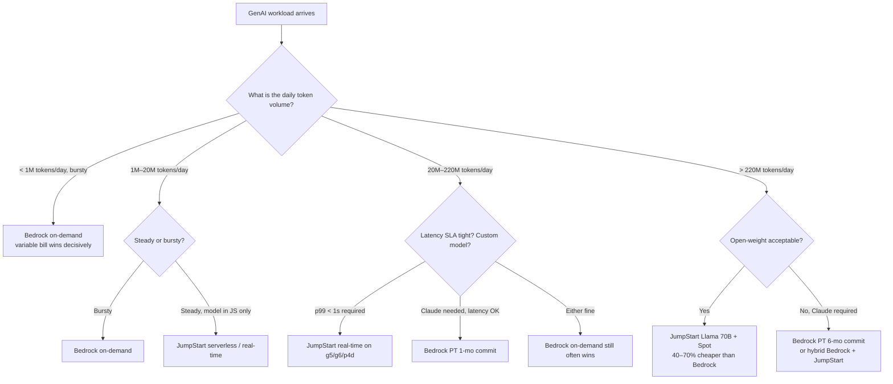
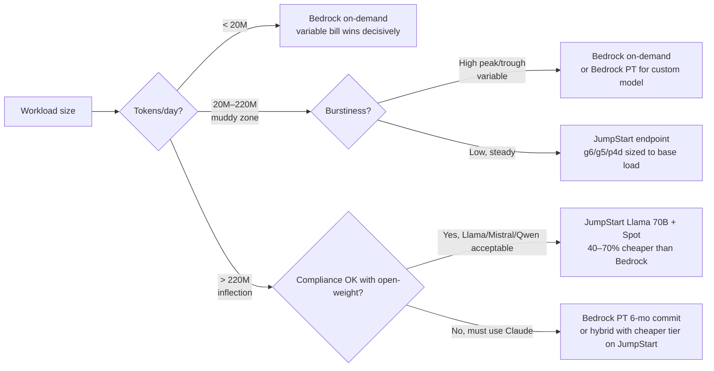
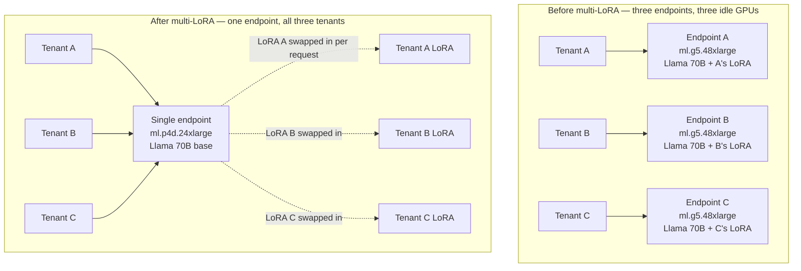
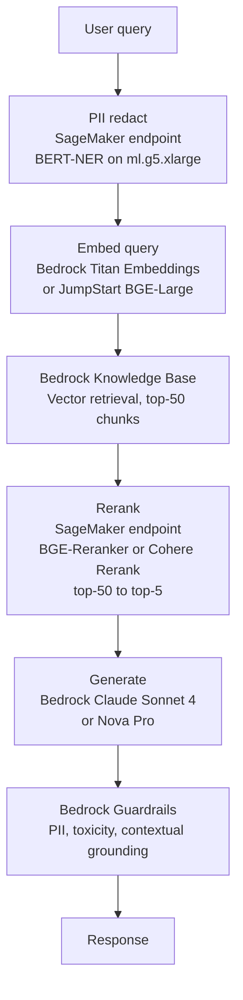

# Chapter 62 — Bedrock vs SageMaker JumpStart: When Each Wins

> **Goal of this chapter:** to give you the single, durable decision framework for the question every AWS architect gets asked in 2026 — *"should we use Bedrock or SageMaker JumpStart for this generative AI workload?"* — and to give it to you with enough numbers, enough hardware specifics, and enough exam-stem patterns that you can defend the answer to a finance partner, a security reviewer, and the MLA-C01 question writer. By the end of the chapter you should be able to: (a) recite the **fundamental abstraction contrast** — Bedrock is a managed token-priced API, JumpStart is a SageMaker endpoint you operate by the instance-hour; (b) walk a workload through the **six decision axes** the exam buries inside scenario stems; (c) compute, on paper, the **monthly bill** at 1M, 10M, and 100M tokens/day for both services and explain where the lines cross; (d) name the **canonical 2026 hybrid pattern** — Bedrock for generation, JumpStart for reranking and embedding and PII — and explain why pure-Bedrock and pure-JumpStart deployments are increasingly rare at scale; and (e) map at least fourteen exam stem fragments to the right service in under five seconds. Chapter 26 covered JumpStart in depth as a model garden and training surface; chapter 60 covered Bedrock as the managed FM API; chapter 61 surveyed the generative-AI design patterns (RAG, agents, guardrails). This chapter is the **decision chapter** that sits on top of all three — the place where the textbook stops asking *how does this service work?* and starts asking *which service should I have picked in the first place?*

---

## 62.1 The question every architect gets asked — and why the answer almost always starts "it depends on…"

The most-asked question in 2026 AWS GenAI design reviews is one variant or another of:

> *"We want to ship a GenAI feature. Should we use Bedrock or SageMaker JumpStart?"*

It is asked by product managers who want a yes/no, by finance partners who want a dollar figure, by security reviewers who want to know where the data lives, and by ML engineers who want to know whether they're about to inherit an endpoint to operate. The honest, professional answer always starts the same way:

> *"It depends on five things: how much traffic, how steady that traffic is, which model you need, how much customization you need, and how much of your data is allowed to touch shared infrastructure."*

If you can ask that one-sentence follow-up before opening a console, you have already done 80% of the architectural work. The remaining 20% is the math, the model catalog, and the network diagram — all of which this chapter teaches.

The reason the question even *has* two answers is that AWS, by design, offers **two different abstractions over the same underlying GPU fleet**. Bedrock is the **managed, multi-tenant, per-token API** abstraction — you call `InvokeModel`, you get tokens back, you pay per million tokens, and you never see an instance. JumpStart is the **single-tenant, instance-priced, customer-owned-endpoint** abstraction — you pick a `ml.g5.12xlarge`, you deploy the model, you autoscale it, you pay by the hour, and the GPU is yours until you delete the endpoint. Both abstractions wrap the same physical hardware. The difference is who handles capacity planning, who absorbs idle cost, and who controls the model code.

The exam tests exactly this — *the abstraction match between workload shape and service shape*. It does not test "which service is better" because that question has no answer. It tests "which service fits this workload" because that question has exactly one right answer per workload.

---

## 62.2 The fundamental contrast — two paths, two philosophies

Before any decision axes, internalize the philosophical split. Bedrock and JumpStart sit at **opposite ends of the AWS abstraction spectrum** for foundation models:

```
                  Less control                                          More control
                  Faster time-to-value                                  More flexibility
                  Pay-per-token                                         Pay-per-instance-hour
                  Multi-tenant compute                                  Single-tenant compute
   ┌──────────────────────┬─────────────────────────┬──────────────────────────────────┐
   │   Bedrock on-demand  │   Bedrock PT            │   JumpStart endpoint             │
   │   (per-token, no     │   (per-MU-hour,         │   (per-instance-hour,            │
   │    commit)           │    1- or 6-month        │    autoscaling you tune,         │
   │                      │    commit)              │    in your VPC)                  │
   │                      │                         │                                  │
   │   Serverless         │   Reserved capacity     │   Customer-owned ml.* instance   │
   │   multi-tenant API   │   per-MU on shared      │   with your KMS, your SGs,       │
   │                      │   infra                 │   your container                 │
   └──────────────────────┴─────────────────────────┴──────────────────────────────────┘
```

### 62.2.1 Bedrock — "foundation models as a managed API"

The cleanest mental model for Bedrock is *Lambda for generative AI*. You never see a GPU. You do not pick an instance type. You do not load weights. You call:

- `InvokeModel` / `InvokeModelWithResponseStream` — model-native JSON payloads.
- `Converse` / `ConverseStream` — a provider-agnostic chat envelope so you can swap Claude for Llama for Nova without rewriting application code.
- `RetrieveAndGenerate` — managed RAG against a Bedrock Knowledge Base.
- `InvokeAgent` — a managed ReAct loop against a Bedrock Agent.

…and you are billed **per token in + per token out**. There is no `CreateEndpoint`. There is no `UpdateEndpointWeightsAndCapacities`. There is no scaling policy to tune. There is no instance to right-size. You write code. You ship.

The Bedrock value proposition resolves into five line items:

1. **Multi-vendor catalog under one API.** Anthropic Claude, Amazon Nova/Titan, Meta Llama, Mistral, Cohere, AI21, Stability, DeepSeek, Google Gemma, NVIDIA Nemotron, OpenAI's open-weight gpt-oss family, Moonshot Kimi, MiniMax. Switching providers is a `modelId` string change.
2. **Zero infrastructure.** No instance choice, no patching, no capacity planning, no driver upgrades, until you opt into Provisioned Throughput.
3. **Time-to-value measured in minutes.** An IAM role plus an `InvokeModel` call is a production path.
4. **Managed plumbing for the boring-but-hard parts of GenAI.** Knowledge Bases (RAG ingestion + retrieval), Agents (multi-step tool-use loop), Guardrails (content filters, denied topics, PII, contextual grounding, automated reasoning), Evaluations (model-graded and human-graded), Prompt Management (versioned prompts and A/B variants), Flows (visual orchestration).
5. **Data privacy by default.** Customer prompts, completions, and fine-tuning data stay in your AWS account, are not used to train base models, and are not shared with model providers.

### 62.2.2 JumpStart — "a curated model garden on SageMaker hosting"

JumpStart is the inverse abstraction: *a catalog of pretrained models plus the SageMaker primitives to fine-tune and host them yourself.* You pick a model from the Studio UI (or the `JumpStartModel` / `JumpStartEstimator` Python SDK classes), choose an instance type, click Deploy, and SageMaker spins up an **endpoint you own**. That endpoint is a long-running container behind an AWS-managed load balancer, in your account, in your VPC if you choose, **billed by the instance-hour** (or by ACU for Serverless Inference) for as long as it is up.

The JumpStart value proposition resolves into five line items of its own:

1. **Hundreds of models** spanning open-weight LLMs (Llama 2/3/3.1/3.2/3.3, Mistral, Mixtral 8x7B/8x22B, Falcon 7B/40B/180B, MPT, Code Llama, StarCoder, Qwen), diffusion models (SD 1.x/2.x/XL/3, Stable Video Diffusion, ControlNet), classic NLP transformers (BERT, RoBERTa, DistilBERT, T5, BART, GPT-2), vision (ViT, DETR, ResNet, EfficientNet, Swin), embeddings (BGE, GTE, E5, sentence-transformers), tabular (XGBoost, LightGBM, AutoGluon), and over 300 AWS Marketplace proprietary models from third-party ISVs.
2. **Full SageMaker training control** — Estimators, Spot training, distributed training (FSDP, SMP, DeepSpeed Zero-3), custom training scripts, custom containers (BYOC), Trainium TRN1/TRN2 and Inferentia INF2 hardware paths.
3. **Full SageMaker hosting control** — pick the instance family (`ml.g5.xlarge`, `ml.g6.12xlarge`, `ml.p4d.24xlarge`, `ml.p5.48xlarge`, `ml.inf2.48xlarge`), set min/max instance count, configure autoscaling (target-tracking, step, scheduled), choose inference flavor (real-time, serverless, async, batch transform, multi-model endpoint, inference component).
4. **Network isolation by default available.** Endpoints can live entirely inside your VPC, traffic stays on your subnets, the model artifact is in your S3, the keys are your KMS keys, the audit log is in your CloudTrail.
5. **PEFT plus custom training loops.** LoRA, QLoRA, DoRA, full fine-tune, continued pre-training, DPO, RLHF — anything you can script in PyTorch or JAX you can run on SageMaker training.

### 62.2.3 The one-line mental model

> **Bedrock is for builders shipping LLM features. JumpStart is for ML engineers operating LLM endpoints.**

If the question describes someone calling an API to add chat, summarization, or RAG to an application, Bedrock is the answer. If the question describes someone who has training data, picks an instance type, needs autoscaling control, must run in a customer VPC, or wants a specific open-source model that Bedrock does not host, JumpStart is the answer. Hold that one-liner; it resolves more exam stems than any decision tree.

---

## 62.3 The six decision axes the exam tests

The MLA-C01 rarely asks "Bedrock or JumpStart?" in isolation. It hides the decision inside a scenario and tests whether you can extract the **shape** of the workload along these axes. Internalize the six.

| Axis | Bedrock wins when… | JumpStart wins when… |
|---|---|---|
| **Throughput shape** | Bursty, sporadic, low-volume, dev/test, irregular daily patterns; median QPS much lower than peak | Steady, predictable, high-volume continuous inference; utilization stays above ~30% on a dedicated endpoint |
| **Customization depth** | Prompt engineering, RAG, Guardrails, light SFT, distillation on the Bedrock allow-list | Full fine-tune, continued pre-training, custom PEFT scripts, novel architectures, RLHF with your own reward model |
| **Data privacy / network** | "Stays in AWS account" + PrivateLink endpoints satisfies the requirement | Model itself must run **inside customer VPC** on customer-owned compute, no managed multi-tenant data plane allowed |
| **Latency profile** | P50 is fine on shared infra; some P99 tail is acceptable | Tight P99 SLA (<1s TTFT); need dedicated GPU, warm pool, IC-level co-location |
| **Cost shape** | Low volume or very bursty (per-token wins because there is no floor) | Steady high volume (instance-hour wins once utilization is high enough to amortize the 24×7 floor) |
| **Operations overhead** | Zero-ops, no SREs to spare, ship features not infra | Already operating SageMaker; have MLOps muscle; want endpoint-level CloudWatch, autoscaling, blue/green |

### 62.3.1 Throughput shape — the most predictive axis

The single biggest cost-driver in the Bedrock-vs-JumpStart decision is **how the traffic distributes over time**. It is not how many tokens. It is not how big the model is. It is the *shape* of the curve.

```
Bedrock on-demand        Pay per token. Idle costs zero.
                         Best when: median QPS << peak QPS, or low average load,
                         or you are still figuring out the workload.

Bedrock Provisioned       Pay per MU-hour, 1- or 6-month commit.
Throughput (PT)           Best when: latency SLA, custom model required for
                         serving, or very high steady tokens/min.

JumpStart real-time       Pay per instance-hour, 24×7 if endpoint is up.
endpoint                  Best when: steady load with utilization > ~30%.

JumpStart serverless      Pay per ACU-second, scales to zero.
inference                 Best when: bursty + you still need SageMaker hosting
                         (e.g., the model is not in Bedrock).
```

The arithmetic that drives the axis: an `ml.g5.2xlarge` at on-demand is roughly **$1.52/hr × 730 hr ≈ $1,110/month** to keep one endpoint up. That is your floor on JumpStart real-time, even at zero requests. Bedrock on-demand has no floor — one request, one charge.



### 62.3.2 Customization depth

```
                            Customization spectrum
   None ── Prompt ── RAG ── SFT ── PEFT/LoRA ── Continued pre-train ── RLHF ── BYOC
    │        │        │      │         │              │                 │        │
    └────────┴────────┴──────┘         │              │                 │        │
              Bedrock fully covers     │              │                 │        │
                                       └──────────────┴─────────────────┴────────┘
                                                  JumpStart territory
                       (Bedrock supports SFT + continued pre-train + RFT + distillation
                        on a curated subset of models; JumpStart supports anything you can script)
```

Bedrock has been steadily climbing this spectrum across 2024–2026:

- **Supervised fine-tuning (SFT)** on Nova, Llama 3.x, Titan, Cohere Command, and Claude Haiku 3 (limited).
- **Continued pre-training** on Nova, Llama, Titan.
- **Reinforcement Fine-Tuning (RFT)** on Nova (announced Dec 3, 2025 at re:Invent, expanded Feb 2026 to gpt-oss-20B and Qwen 3 32B). AWS reports **66% average accuracy gain over base models** across their benchmark suite.
- **Model distillation** on the Nova family (Premier as teacher, Pro/Lite/Micro as student), GA in 2024–2025.

But JumpStart still wins when you need:

- **A model not on the Bedrock customization allow-list.** Mixtral 8x22B, Falcon-180B, DeepSeek-VL, custom HuggingFace forks.
- **Custom training scripts.** A paper's repo you cloned, a research codebase with bespoke optimizers.
- **Distributed training across many GPUs.** FSDP, SMP, DeepSpeed Zero-3 across `ml.p5.48xlarge` H100 clusters.
- **Domain-specific objectives.** Contrastive learning, masked LM with custom token masking, RLHF with your own reward model, DPO training loops via TRL.

> **⚠️ Exam alert — Bedrock customization is narrow; JumpStart customization is open-ended.** The exam regularly offers two equally-plausible scenarios: "We need to fine-tune Llama 3 with our proprietary data" → both work, but the next clause decides. If it says "with sensible defaults and no MLOps team," answer **Bedrock SFT**. If it says "with our custom training script using DeepSpeed Zero-3 on 16 GPUs," answer **JumpStart**. The discriminator is *how much control of the training loop is required*, not *which model family*.

### 62.3.3 Data privacy and network

Both services keep customer data in the customer AWS account and never use it for service improvement; this is contractual in the Bedrock User Guide and the SageMaker Service Terms. The differentiator is **network shape**:

- **Bedrock.** The inference data plane is a regional managed endpoint that AWS operates. Reach it via **VPC Endpoints (PrivateLink)** so traffic does not leave AWS networking, but the inference compute is **multi-tenant under the hood**. For the exam: if the scenario says "data must not leave the customer VPC at the network level," PrivateLink to `com.amazonaws.<region>.bedrock-runtime` satisfies it. If it says "the **model itself** must run in our VPC on our instances," that is JumpStart, full stop.
- **JumpStart endpoint.** By default the endpoint is reachable via the public SageMaker runtime URL (still IAM-protected) but you set `VpcConfig` at endpoint creation to put the ENIs **in your VPC subnets** with your security groups. The model is loaded from your S3 (with VPC endpoints), runs on your instances, logs to your CloudWatch. End-to-end isolation.

For HIPAA, both are **BAA-eligible** — Bedrock was added to the AWS BAA list in 2024 and expanded with Bedrock AgentCore coverage in 2026. For FedRAMP High / IL5 / sovereign-cloud scenarios, JumpStart on a GovCloud account is typically the simpler story because the surface area is smaller and feature parity has been longer-established.

### 62.3.4 Latency profile

**Bedrock on-demand** shares capacity across all customers in a region for a given model. P50 time-to-first-token (TTFT) is excellent — typically sub-second for small and medium prompts. P99 can spike to 2–5 seconds during regional capacity events because of multi-tenant queueing. You cannot pre-warm. You cannot pin to a specific GPU. There is no on-demand TTFT SLA.

**Bedrock Provisioned Throughput** dedicates capacity (Model Units, MUs) to your account, smoothing tail latency and removing the throttling risk. MUs are expensive and commit you for 1 or 6 months.

**JumpStart real-time endpoint** is yours. Pick a fast GPU, set `MinInstanceCount: 2` to keep warm replicas, tune `model-server-workers`, deploy on Inferentia2 for cost-optimized dedicated inference, use Inference Components to colocate multiple models on the same instance. P50 TTFT on a Llama 3.3 70B on `p4d.24xlarge` with LMI v15 lands at 150–300ms; P99 typically under 800ms under controlled load. For sub-50ms P99 SLAs you generally want JumpStart (or Bedrock PT).

The 2026 BentoML LLM-Optimizer benchmarks on SageMaker reported **sub-24s p99** for latency-sensitive workloads at 5.63 req/s, with 4–33% p99 improvement scaling from 5 to 20 instances — a degree of latency control Bedrock on-demand does not surface to you.

### 62.3.5 Cost shape

The full cost arithmetic comes in §62.4. The short version: at low volume Bedrock on-demand wins dramatically because JumpStart has a 24×7 instance floor; at high steady volume JumpStart wins because instance-hour amortizes well; in the middle band the answer turns on burstiness and whether the model is in the Bedrock catalog at all.

### 62.3.6 Operations overhead

| Concern | Bedrock | JumpStart |
|---|---|---|
| Patching, OS updates | AWS | AWS (managed container) |
| Driver / CUDA upgrades | AWS | AWS for prebuilt; customer for BYOC |
| Autoscaling | None on PT (fixed MUs); built-in for on-demand | Customer configures target-tracking / step / scheduled |
| Endpoint metrics | Per-model CloudWatch (invocations, throttles, latency) | Per-endpoint CloudWatch (latency, invocations, errors, instance utilization, custom metrics) |
| Blue/green deploys | N/A | Built in via `DeploymentConfig` (canary / linear / all-at-once) |
| Cold start | Sub-second for catalog models; few seconds for Custom Model Import | Cold start on serverless inference; warm on real-time |
| MLOps headcount required | Effectively zero | At least one ML platform engineer at production scale |

The exam framing is consistent: "a small team with no SREs" → Bedrock. "An MLOps team already operating SageMaker today" → JumpStart fits the existing stack.

---

## 62.4 Pricing — worked examples at 1M, 10M, and 100M tokens/day

Pricing is the most testable axis. Here we work three traffic profiles and compute monthly cost on Bedrock on-demand, Bedrock Provisioned Throughput, and a JumpStart real-time endpoint hosting a comparable open-weight model.

### 62.4.1 Pricing primitives (mid-2026)

**Bedrock on-demand — selected per-token prices** (US regions, standard tier, per **1M tokens**):

| Model | Input $ | Output $ | Notes |
|---|---:|---:|---|
| Claude Opus 4.x | $15.00 | $75.00 | Top of the line; reasoning-heavy work |
| Claude Sonnet 4.x | $3.00 | $15.00 | Workhorse; most use cases |
| Claude 3.5 Sonnet | $6.00 | $30.00 | Legacy pricing on Bedrock pricing page |
| Claude Haiku 4.5 | $0.80 | $4.00 | Fast and cheap; bulk classification |
| Nova Micro | $0.035 | $0.14 | Cheapest text |
| Nova Lite | $0.06 | $0.24 | Cheap multimodal |
| Nova Pro | $0.80 | $3.20 | Balanced multimodal |
| Llama 3.3 70B Instruct | $0.72 | $0.72 | Symmetric — Meta convention |
| Titan Text Express | $0.20 | $0.60 | AWS first-party text |
| Titan Embeddings v2 | $0.02 / 1M input tokens | — | Embeddings |

**Bedrock batch inference** — **50% off** on-demand pricing, asynchronous, results to S3, 24-hour SLA. Use for nightly summarization, bulk classification, dataset annotation.

**Bedrock prompt caching** — where supported, cache writes priced ~25% above input tokens; cache reads priced ~90% below input tokens. Massive savings on long system prompts that repeat across requests.

**Bedrock Provisioned Throughput** — per Model Unit (MU) per hour, 1-month or 6-month commitment. Each MU guarantees a model-specific tokens/min throughput. Illustrative 2026 list rates:

- Llama 3.x Instruct PT ≈ **$21–$25 / MU-hour** (1-mo term)
- Nova Pro PT ≈ **$35–$45 / MU-hour**
- Claude Sonnet PT ≈ **$80–$120 / MU-hour** (1-mo term)
- 6-month commit: 15–40% off the 1-month rate

> **⚠️ Exam alert — Bedrock PT has a $15K+/month floor.** One Llama MU at $21/hr × 730 hr ≈ **$15,330/month** minimum, locked in for at least one month. Buying PT for an unproven, low-volume workload is one of the most-tested anti-patterns on MLA-C01. The exam will offer "Configure Provisioned Throughput to control costs" as a wrong answer when the scenario is a new workload with no validated traffic — the right answer is on-demand until you have data.

**JumpStart real-time endpoint** — per instance-hour. Example ml hosting rates (us-east-1, on-demand):

| Instance | $/hr | $/month (730h) | Use case |
|---|---:|---:|---|
| `ml.g5.xlarge` (1× A10G) | ~$1.41 | ~$1,030 | 7B–13B int4/fp16 |
| `ml.g5.2xlarge` (1× A10G) | ~$1.52 | ~$1,110 | 7B fp16 / 13B int8 |
| `ml.g5.12xlarge` (4× A10G) | ~$7.09 | ~$5,180 | 70B int4 |
| `ml.g5.48xlarge` (8× A10G) | ~$20.36 | ~$14,860 | 70B fp16 |
| `ml.g6.12xlarge` (4× L4) | ~$6.69 | ~$4,880 | Cheaper 70B int4 |
| `ml.g6e.12xlarge` (4× L40S) | ~$8.10 | ~$5,913 | 70B fp16 with more memory |
| `ml.p4d.24xlarge` (8× A100 40GB) | ~$37.69 | ~$27,510 | Large LLMs fp16 |
| `ml.p5.48xlarge` (8× H100) | ~$98.32 | ~$71,773 | Frontier model training/inference |
| `ml.inf2.xlarge` (1× Inferentia2) | ~$0.99 | ~$725 | Cost-optimized 7B |
| `ml.inf2.48xlarge` (12× Inf2) | ~$13.83 | ~$10,094 | 70B on Inferentia |

(Prices fluctuate; use these for relative comparison and exam-scenario arithmetic.)

> **⚠️ Exam alert — a JumpStart endpoint is billed 24×7 even when idle.** This is the canonical MLA-C01 cost trap. The instance-hour clock starts when `CreateEndpoint` succeeds and stops when `DeleteEndpoint` is called. "The endpoint received zero requests last weekend" does not reduce the bill. Idle-shutdown lifecycle configs work on Studio notebooks; **they do not exist for real-time endpoints**. If the exam scenario describes an endpoint that handles 100 requests/day and bills $1,030/month, the answer is one of: (a) switch to Bedrock on-demand, (b) switch to JumpStart Serverless Inference, (c) delete the endpoint outside business hours via scheduled Lambda.

**JumpStart Serverless Inference** — billed per ACU (Adapter Compute Unit) per second plus per-request fees. Scales to zero. Cold-start penalty of a few seconds on first request after idle. Best when traffic is bursty *and* you must use JumpStart because the model is not in Bedrock.

### 62.4.2 Worked example 1 — 1M tokens/day

Profile: **50/50 input/output**, business hours only (~8 hr/day), 22 business days/month → **22M tokens/month** input + 22M output.

**Bedrock on-demand (Nova Pro):**
22 × $0.80 + 22 × $3.20 = $17.60 + $70.40 = **~$88/month**

**Bedrock on-demand (Claude Sonnet 4):**
22 × $3.00 + 22 × $15.00 = $66 + $330 = **~$396/month**

**Bedrock on-demand (Haiku 4.5):**
22 × $0.80 + 22 × $4.00 = $17.60 + $88 = **~$106/month**

**JumpStart Llama 3.1 8B on `ml.g5.2xlarge`** (always-on):
730h × $1.52 = **~$1,110/month** floor — even though the endpoint is only used 8 hr × 22 days = 176 hr (24% utilization).

**Verdict at 1M tokens/day:** Bedrock on-demand wins by **10×–60×**. The most expensive Bedrock-Claude option still costs less than the cheapest JumpStart endpoint. **A JumpStart real-time endpoint at 1M tokens/day is indefensible on cost** unless there is a model-availability or compliance constraint that forces it.

### 62.4.3 Worked example 2 — 10M tokens/day

Profile: **24×7 chat-style workload**, ~10M tokens/day (~7,000 tokens/min average; bursty up to ~30,000/min). 300M tokens/month input + 300M output.

**Bedrock on-demand (Nova Pro):**
300 × $0.80 + 300 × $3.20 = $240 + $960 = **$1,200/month**

**Bedrock on-demand (Llama 3.3 70B):**
300 × $0.72 + 300 × $0.72 = **$432/month** — symmetric pricing makes this great for chat workloads.

**Bedrock on-demand (Claude Sonnet 4):**
300 × $3.00 + 300 × $15.00 = $900 + $4,500 = **$5,400/month**

**JumpStart Llama 3.1 70B Instruct on `ml.g5.12xlarge`** (always-on):
- 730 × $7.09 = **~$5,180/month** for a single replica
- Realistically you need 2 replicas for HA, so **~$10,360/month**
- Throughput: a 70B model on `ml.g5.12xlarge` at int4 with vLLM/TGI does 3,000–8,000 output tokens/sec aggregate, easily handling 10M/day.

**JumpStart Llama 70B on `ml.g6e.12xlarge` × 2** (fp16, L40S):
- 730 × $8.10 × 2 = **~$11,830/month** for the cheaper L40S path

**Bedrock PT (Llama 3.x, 2 MUs)** at $22/MU-hr × 2 MUs × 730h ≈ **$32,120/month** — terrible economics at this scale unless PT is required to serve **a fine-tuned custom Bedrock model**.

**Verdict at 10M tokens/day:**
- **Cheapest:** Bedrock on-demand Llama 70B at ~$432/month — and you operate zero infrastructure.
- **JumpStart only wins** if you must host a model Bedrock does not offer, you have tight latency SLAs that only dedicated hardware can meet, or your inference is part of a larger SageMaker stack you already operate.
- **Bedrock PT only wins** if you have a custom fine-tuned Bedrock model that *requires* PT to serve and your QPS justifies the MU cost.

### 62.4.4 Worked example 3 — 100M tokens/day

Profile: **24×7 high-volume**, e.g., bulk RAG-backed search, content moderation, document summarization. 3B tokens/month input + 3B output.

**Bedrock on-demand (Nova Pro):**
3,000 × $0.80 + 3,000 × $3.20 = $2,400 + $9,600 = **$12,000/month**

**Bedrock on-demand (Llama 3.3 70B):**
3,000 × $0.72 + 3,000 × $0.72 = **$4,320/month**

**Bedrock batch (Nova Pro, 50% off):**
**$6,000/month** — if 24-hour latency is acceptable.

**JumpStart Llama 3.1 70B Instruct on 4× `ml.g6e.12xlarge`** (HA + capacity):
730 × $8.10 × 4 = **~$23,650/month**

**JumpStart Llama 3.1 70B on 4× `ml.g5.12xlarge`** (cheaper int4 path):
730 × $7.09 × 4 = **~$20,720/month**

**JumpStart Llama 3.1 70B on `ml.inf2.48xlarge` × 2:**
730 × $13.83 × 2 = **~$20,200/month** — Inferentia2 economics are competitive but not always cheaper than g5/g6.

**JumpStart on `ml.g6.12xlarge` × 4** (L4 GPUs):
730 × $6.69 × 4 = **~$19,536/month** — the cheapest dedicated GPU path.

**Verdict at 100M tokens/day:**
- **Cheapest dollar-per-month** is still Bedrock on-demand for Llama 70B (~$4,320/month) IF the multi-tenant tail-latency profile is acceptable.
- **JumpStart becomes competitive** when you also need (a) latency control, (b) PEFT adapters for many tenants, or (c) a custom model. At ~$20K/month you have a dedicated fleet you can saturate, and Spot can reduce that 40–70% further.
- **Bedrock batch at 50% off** is the dark-horse winner for offline workloads — $6,000/month for a workload that costs $12,000/month interactively.

### 62.4.5 The cost crossover — where the lines actually meet

The conventional wisdom in the AWS community is that there is **a crossover zone, not a crossover point**. The two best-known numbers in the 2026 literature:

1. **The muddy zone — 10K to 50K requests/day.** Below this, Bedrock on-demand essentially always wins. Above this, the answer depends on burstiness and model choice. Inside this band, the math turns on whether your traffic is bursty (Bedrock wins) or steady (JumpStart wins).
2. **The inflection — ~220M tokens/day (≈6.6B/month).** Past this volume, SageMaker JumpStart's fixed-instance cost beats Bedrock's variable-token cost on nearly every model family, *assuming the same model is hosted on both*.

The most-quoted single comparison in 2026 industry guides is the Claude 3 Sonnet vs Llama 70B story:

- **Claude 3 Sonnet on Bedrock at 40M tokens/day** ≈ **$12,000/month**.
- **Llama 70B on 2× ml.g5.2xlarge** (smaller, open-weight equivalent) ≈ **$2,218/month**.

That **81% gap** at 40M tokens/day is the canonical "we migrated from Bedrock to JumpStart" cost story — and the savings comfortably pay for the ML platform engineer who keeps the JumpStart endpoints fed.



The rule of thumb that compresses this onto an exam answer sheet:

- **"Low volume / variable / starting out / dev"** → **Bedrock on-demand**
- **"Custom fine-tuned Bedrock model in prod with steady QPS"** → **Bedrock PT** (you have no choice; custom models cannot be served on-demand)
- **"Steady high QPS on an open-weight model, tight P99, need GPU choice"** → **JumpStart**
- **"Nightly bulk job, 24h latency acceptable"** → **Bedrock Batch** (50% off)

---

## 62.5 Models available — the catalog decision

Sometimes the model itself decides the service, full stop.

### 62.5.1 Bedrock catalog (mid-2026, ~100 serverless FMs)

| Provider | Family | Strength | Notable models |
|---|---|---|---|
| **Anthropic** | Claude | Reasoning, long context, tool use, coding | Opus 4.6/4.7, Sonnet 4.6, Haiku 4.5 |
| **Amazon** | Nova | Multimodal, price leadership | Micro / Lite / Pro / Premier; Canvas (image); Reel (video) |
| **Amazon** | Titan | Embeddings, foundational | Titan Embed Text v2 (1024/512/256-d), Titan Multimodal Embed, Titan Image |
| **Meta** | Llama | Open-weight, broad reasoning | Llama 4 Scout / Maverick, Llama 3.3 70B |
| **Mistral** | Mistral / Mixtral | MoE, multilingual | Mistral Large 3, Mixtral 8x7B |
| **AI21 Labs** | Jamba | Long context, structured outputs | Jamba 1.5 |
| **Cohere** | Command + Embed | RAG-optimized, multilingual | Command R+, Embed Multilingual v3, Rerank |
| **Stability AI** | Stable Image / SD | Image generation | Stable Image Ultra, SD3.5 |
| **DeepSeek** | DeepSeek | Reasoning, coding | DeepSeek V3.2 |
| **Google** | Gemma | Open-weight | Gemma 3 |
| **NVIDIA** | Nemotron | Open-weight | Nemotron 4 |
| **OpenAI** | gpt-oss | Open-weight (Bedrock 2026) | gpt-oss-120b |
| **Moonshot AI, MiniMax** | Various | 2026 additions | Kimi, MiniMax 2.1 |

**Critical exclusives:** Claude is **only on Bedrock** among the big-three clouds' first-party catalogs. If a scenario specifies Claude → Bedrock, full stop.

### 62.5.2 JumpStart catalog (hundreds of models)

JumpStart's catalog is broader and shallower per-model than Bedrock's. It includes:

- **Open-weight LLMs:** Llama 2 / 3 / 3.1 / 3.2 / 3.3, Mistral 7B, Mixtral 8x7B and 8x22B, Falcon 7B / 40B / 180B, MPT, Code Llama, StarCoder, Qwen.
- **Embedding models:** BGE, GTE, E5, Cohere Embed via Marketplace, sentence-transformers.
- **Vision-language:** LLaVA, BLIP-2, IDEFICS.
- **Diffusion:** Stable Diffusion 1.x / 2.x / XL / 3, Stable Video Diffusion, ControlNet variants.
- **Classic NLP transformers:** BERT, RoBERTa, DistilBERT, T5, BART, GPT-2 — for classification, QA, summarization at the small-model price.
- **CV models:** ViT, DETR, ResNet, EfficientNet, YOLOv8 (via Marketplace), Swin.
- **Tabular:** XGBoost, LightGBM, AutoGluon.
- **AWS Marketplace proprietary models** — over 300 paid models from third-party ISVs with one-click deploy.

**Deprecation note:** On March 13, 2026, AWS delisted a subset of JumpStart models — existing endpoints continue to work, but you cannot deploy delisted models new. Always check the current catalog for exam-recent additions and removals.

### 62.5.3 The catalog decision

```
Need a specific named model?
│
├── Claude / Nova / Titan / Bedrock-first-party-exclusive
│   └── Bedrock (only path)
│
├── Llama / Mistral / Cohere Command / Stable Diffusion
│   ├── Want a managed API + no infra → Bedrock
│   └── Want PEFT control + own endpoint → JumpStart
│
├── Falcon 180B, Mixtral 8x22B, BLIP-2, ViT, BERT, T5, BGE
│   └── JumpStart (not in Bedrock catalog)
│
└── A HuggingFace model not in either catalog
    └── SageMaker (deploy via Hugging Face DLC or BYOC) — JumpStart-adjacent
```

---

## 62.6 Fine-tuning workflows — Bedrock native vs JumpStart PEFT

### 62.6.1 Bedrock customization paths (2026)

Bedrock supports **four** customization paths:

| Path | Data shape | Mechanism | Typical models |
|---|---|---|---|
| **Supervised fine-tuning (SFT)** | Labeled prompt → completion JSONL | Adapter or full fine-tune on Bedrock-managed training infra | Nova family, Llama 3.x, Titan, Cohere Command, Haiku 3 (limited) |
| **Continued pre-training** | Unlabeled domain text JSONL | Continue base-model training on your corpus | Nova, Llama, Titan |
| **Reinforcement Fine-Tuning (RFT)** | Reward function (Bedrock evaluates outputs) | RL loop with reward signal | Nova Micro/Lite/Pro (GA from re:Invent 2025), gpt-oss-20B, Qwen 3 32B (added Feb 2026) |
| **Model distillation** | Teacher model + unlabeled prompts | Bedrock generates teacher outputs and trains the student | Nova Premier (teacher) → Nova Pro/Lite/Micro (student) |

**Bedrock SFT workflow:**

1. Prepare JSONL training file in S3.
2. `bedrock.create_model_customization_job(...)` with `baseModelIdentifier`, `customizationType`, `trainingDataConfig`, `outputDataConfig`, `hyperParameters`, IAM role.
3. Bedrock runs the job on AWS-managed infra. You do not pick instance types. You do not pick distributed strategy. You set hyperparameters and hit go.
4. Custom model artifact lands in your account. **To serve it you must purchase Provisioned Throughput Model Units** — this is the gotcha. Bedrock custom models cannot be served on-demand.
5. Invoke via the custom model ARN using `InvokeModel` or `Converse`.

**Bedrock RFT — the new wedge (Dec 2025):**

RFT replaces the labeled dataset with a **reward function**. The model generates responses, the reward function scores them, the model updates from those scores in an iterative loop. Two reward styles:

- **RLVR (Reinforcement Learning with Verifiable Rewards)** — rule-based graders. Used for math, code, structured-output tasks where correctness is checkable. Cheap, fast, deterministic.
- **RLAIF (Reinforcement Learning from AI Feedback)** — a judge LLM (often Claude or Nova Pro) scores responses. Used for subjective tasks like summarization style or tone.

AWS press release headline: **66% average accuracy gain over base models** across their benchmark suite. The strategic implication is large: pre-RFT, "I need to RL fine-tune my model" forced you onto SageMaker (build a PPO pipeline with HuggingFace TRL). Post-RFT, you can do reinforcement fine-tuning on Bedrock with managed reward functions and no GPU management. This pulls a class of workload that would have moved to JumpStart back onto Bedrock — watch for it in exam questions and in architecture interviews.

### 62.6.2 JumpStart customization paths

JumpStart inherits the full SageMaker training stack:

| Path | Mechanism | Notes |
|---|---|---|
| **Click-to-fine-tune in Studio** | Pick a JumpStart model → upload data → click Fine-tune | Sensible defaults; runs PEFT (LoRA) for big models, full fine-tune for small |
| **`JumpStartEstimator`** | SDK Estimator preconfigured for a JumpStart model | Replace training data, override hyperparameters, swap instance type |
| **Full custom training** | Standard `Estimator` + JumpStart starter script as base | Bring your own training loop, distributed strategy |
| **PEFT (LoRA / QLoRA / DoRA)** | Adapters trained via PyTorch + PEFT library | Adapter weights are 10s of MB — multi-adapter serving feasible |
| **Continued pre-training** | Mask-LM or causal-LM on your corpus with full Estimator | Domain-heavy use cases |
| **RLHF / DPO** | Custom training loops (TRL, DPOTrainer) | JumpStart base + custom container |
| **Distributed training** | FSDP, SMP, DeepSpeed Zero-3, Trainium TRN1 | Up to thousands of GPUs |
| **Spot training** | `use_spot_instances=True` | 70%+ savings on training cost |

**The big differences from Bedrock fine-tuning:**

- **You pick the instance** — `ml.g5.24xlarge`, `ml.p4d.24xlarge`, `ml.trn1.32xlarge`, `ml.p5.48xlarge` H100s.
- **You can train very large models** — Bedrock fine-tuning caps you at whatever the base model supports; JumpStart lets you run Mixtral 8x22B fine-tunes with FSDP across 32 H100s.
- **You can use Spot** — Bedrock fine-tuning has no Spot equivalent.
- **You can iterate the recipe** — change tokenizer, change loss function, change masking strategy, add a contrastive head. None of that is possible on Bedrock.

### 62.6.3 Fine-tune decision

```
Have labeled prompt→completion pairs, want it quick, base model is on Bedrock allow-list?
   → Bedrock SFT  (and budget for PT to host the result)

Have a reward function but not labeled pairs?
   → Bedrock RFT  (RLVR for verifiable tasks, RLAIF for subjective tasks)

Need full control of the training loop, large open-weight model, distributed training, Spot savings?
   → JumpStart + SageMaker training

Want a "Claude that knows our company"?
   → Bedrock SFT on Claude Haiku 3 (limited) OR Bedrock Knowledge Base (RAG)
     — you cannot fine-tune Opus or Sonnet today
```

---

## 62.7 Customizability — the full control-surface comparison

| Concern | Bedrock | JumpStart |
|---|---|---|
| **Prompt engineering** | First-class: Prompt Management, versioning, A/B variants, Prompt Optimization | Same as any LLM endpoint — handle prompts in your app |
| **RAG** | Bedrock Knowledge Bases (managed ingestion, chunking, embedding, vector store, Retrieve + RetrieveAndGenerate) | DIY — pick vector store, write ingestion, embed, retrieve, format. LangChain / LlamaIndex |
| **Tool use / agents** | Bedrock Agents (managed ReAct loop, action groups, KB integration, session memory, multi-agent collaboration) | DIY — implement in app code, use Strands Agents SDK or LangGraph |
| **Safety / guardrails** | Bedrock Guardrails (content filters, denied topics, PII, contextual grounding, automated reasoning) — works mid-stream | DIY — call ApplyGuardrail standalone against Bedrock, or roll your own with content classifiers |
| **Custom inference code** | None — model = inputs + outputs. No pre/post-processing hooks beyond Guardrails | Full — your container, your `inference.py`, your batching, your tokenizer tricks |
| **Custom training code** | None — fine-tune is a managed job with limited hyperparameters | Full — anything PyTorch / JAX can express |
| **Multi-LoRA serving** | No (Nova has some adapter support; not exposed for custom open-weight models) | Yes — SageMaker LMI container supports multi-LoRA; canonical SaaS pattern in 2026 |
| **Triton inference** | No | Yes — Triton container, ensemble models, dynamic batching, GPU pinning |
| **Custom hardware** | No (AWS picks) | Yes — g5/g6/g6e/p4d/p5/inf2/trn1/trn2 |
| **Caching** | Native prompt caching for supported models | DIY (or rely on framework support inside the model server) |
| **Evaluation** | Bedrock Evaluations (model-graded + human-graded) | SageMaker Clarify FM eval; manual scripts; or LLM-as-judge endpoints you host |

**Key takeaway:** Bedrock has a deeper *managed* feature set (Guardrails, Agents, Knowledge Bases, Evaluations, Flows). JumpStart has a deeper *DIY* feature set (instance choice, training scripts, custom containers, multi-LoRA, Triton).

### 62.7.1 The multi-LoRA Llama 70B pattern — JumpStart's killer SaaS feature

The vLLM and AWS February 2026 collaboration made multi-LoRA on JumpStart legitimately production-ready. The pattern matters because it solves a multi-tenant SaaS problem Bedrock has no answer to for custom open-weight fine-tunes:

- Adapters of LoRA rank 32 add ~50–200 MB each. You can host **8+ adapters on a single 70B base model** on one node.
- Per-request adapter swap is sub-millisecond.
- AWS-tuned vLLM hit **171 OTPS at 124ms TTFT** for GPT-OSS 20B with 8 simultaneous adapters on H200 — a 19% OTPS gain over baseline vLLM 0.15.0.

The use case: tenants in a multi-tenant SaaS where each tenant has their own fine-tune. You used to need N endpoints (one per tenant); now you need **one endpoint plus N adapters**. This is functionally not possible on Bedrock for custom open-weight fine-tunes — Bedrock's per-model deployment model bills per imported model unit, with no concept of per-request adapter routing for customer-uploaded LoRAs.



For a 100-tenant SaaS with custom fine-tunes, this is the difference between operating 100 endpoints (≈$1.5M/month at g5.48xlarge each) and one (≈$23.6K/month on p4d.24xlarge) — a 60× cost reduction that JumpStart enables and Bedrock currently cannot.

---

## 62.8 Hosting shapes — every flavor of each service

### 62.8.1 Bedrock hosting modes

| Mode | What it is | When to use |
|---|---|---|
| **On-Demand** | Default — per-token, multi-tenant, no commitment | Variable / dev / low-volume / catalog models |
| **Provisioned Throughput** | Reserved Model Units (MUs), 1- or 6-month commit | Required for custom models; capacity SLA; very high steady volume |
| **Batch inference** | Async S3-in/S3-out, 50% discount, 24h SLA | Nightly bulk jobs, dataset processing |
| **Cross-Region Inference** | Routes to whichever region in the geography has capacity | Burst capacity, avoid throttling; ~10% surcharge on global profile |
| **Custom Model Import** | Bring a Llama / Mistral / Mixtral fine-tune from outside, serve via Bedrock API | Want unified Bedrock UX without re-doing the training |

You cannot pick a GPU, scale a replica count, or set autoscaling — Bedrock is **serverless to the point of opacity**.

### 62.8.2 JumpStart hosting modes

| Mode | What it is | When to use |
|---|---|---|
| **Real-time endpoint** | Long-running container behind a load balancer | Steady or near-steady load, low latency |
| **Serverless inference** | Pay-per-ACU-second, scales to zero | Bursty, sporadic, dev/test |
| **Async inference** | Queue-backed, large payloads (up to 1 GB), long timeouts | Document processing, video, batch-shaped requests |
| **Batch transform** | One-shot job: S3 → process → S3 | Periodic bulk inference |
| **Multi-model endpoint (MME)** | Many models dynamically loaded onto one fleet | Hundreds–thousands of small models per tenant |
| **Inference Components (IC)** | Multiple models / variants colocated on one fleet with per-IC scaling | Right-sized cost for many medium models |
| **Multi-LoRA serving** | One base model + many LoRA adapters per tenant | SaaS multi-tenancy (see §62.7.1) |

You **must** pick:

- Instance type and count (or ACU max-concurrency for serverless).
- Inference container (JumpStart default DLC, your custom container, TGI, vLLM, LMI v15, Triton).
- Autoscaling target (CPU% / invocations / custom CloudWatch metric).
- VPC configuration if isolation is required.

### 62.8.3 Hosting decision

```
Want zero-ops, catalog model, OK with shared infra?           → Bedrock on-demand
Custom (fine-tuned) Bedrock model in prod?                    → Bedrock PT (mandatory)
Bulk nightly job, 24h latency OK?                             → Bedrock Batch (50% off)
Need GPU choice / autoscaling / VPC isolation / Triton /
  multi-LoRA / multi-model?                                   → JumpStart real-time
Many tiny tenants on a shared fleet?                          → JumpStart MME or IC
Bursty + must run open-weight model not in Bedrock?           → JumpStart Serverless
Document / video / large-payload async?                       → JumpStart Async
```

---

## 62.9 Compliance, networking, data privacy

| Concern | Bedrock | JumpStart |
|---|---|---|
| HIPAA BAA | Eligible (added to AWS BAA list 2024; AgentCore added 2026) | Eligible — SageMaker has been BAA-eligible for years |
| FedRAMP High / IL5 | GovCloud regions; check feature parity | Available; broader feature parity in GovCloud historically |
| Customer data used to train models? | No — by contract | No — by contract |
| Data stays in AWS account? | Yes — prompts, completions, fine-tune data | Yes — model + data in your account |
| Network isolation | VPC endpoints (PrivateLink) for both control + data plane; inference compute is multi-tenant under the hood | Endpoint can be launched into VPC subnets with your SGs |
| KMS CMK encryption | At rest + on custom model artifacts | At rest (endpoint, training, model artifacts) |
| CloudTrail audit | Yes | Yes |
| Model isolation | Multi-tenant on on-demand; single-tenant on PT | Single-tenant by definition (your endpoint) |
| Air-gapped / Outposts | No (cloud-only) | Yes via SageMaker on Outposts |

**Exam framing:**

- "Sensitive data, managed service acceptable" → **Bedrock** with VPC endpoints + KMS.
- "Sensitive data, must run on customer-owned compute in customer VPC" → **JumpStart** in your VPC.
- "HIPAA covered entity wants generative AI for clinical summary" → either; the typical pattern is **Comprehend Medical for entity extraction + Bedrock for generative summary**. The exam will pick Bedrock unless the question implies a specific model that is not in catalog.
- "Air-gapped, on-prem, or sovereign-cloud requirement" → **JumpStart on SageMaker on Outposts** (Bedrock has no on-prem story).

---

## 62.10 Hybrid patterns — the dominant 2026 answer

The most sophisticated production deployments combine both services. The AWS Decision Guide explicitly says: *"the choice between Amazon Bedrock and Amazon SageMaker AI is not always mutually exclusive. In some cases, you may benefit from using both services together."* In 2026 this is no longer aspirational — it is the **modal architecture** at enterprise scale.

> **⚠️ Exam alert — the hybrid pattern is the default 2026 answer.** When the scenario describes a serious production RAG application with PII redaction, custom reranking, and Claude-quality generation, the right architecture is *not* "all Bedrock" and *not* "all JumpStart" — it is **Bedrock for generation + JumpStart for the cheap, high-volume small models (rerank, embed, PII)**. The exam will increasingly favor hybrid answers when the scenario includes multiple LLM-adjacent components.

### 62.10.1 Bedrock generation + JumpStart for reranking, embedding, PII

The canonical 2026 hybrid RAG architecture:



Why split this way and not the other way?

- **Generation is hard and expensive to host.** A 70B Claude-quality generation requires 8× A100 plus serving expertise. For variable traffic, Bedrock's per-token pricing wins. For the *handful* of teams large enough to keep a 70B GPU farm fully utilized, JumpStart wins generation too — but they are rare.
- **Reranking and embedding are small and steady.** A 300M-parameter BGE-Large fits on `ml.g5.xlarge` ($1.41/hr), handles thousands of queries/second, costs ~$1K/month per instance, and scales to zero on Serverless Inference. Bedrock per-token pricing is calibrated for 70B+ generation; for 1B-parameter reranking and embedding it overpays by 5–20×.
- **PII redaction and intent classification** are model-plus-rules pipelines you want to **own end-to-end**. JumpStart endpoints with VPC + PrivateLink give you that.

### 62.10.2 JumpStart-trained custom model imported into Bedrock

```
SageMaker training (JumpStart Estimator + custom data + FSDP + Spot)
   │
   ▼
Fine-tuned Llama 3.3 70B (safetensors in S3)
   │
   ▼
Bedrock Custom Model Import
   │
   ▼
Bedrock InvokeModel — unified API, behind Guardrails + Agents + KB
```

Why hybrid: you need full SageMaker training control (Spot, distributed, custom loss, custom tokenizer), but you want production application code to use the Bedrock API surface (Guardrails, Agents, KB, Evaluations) so the integration tax is paid once.

### 62.10.3 JumpStart for embeddings, Bedrock for generation

Embeddings are cheap-per-token but **high-volume** — every chunk in your corpus needs one, plus every query at runtime. A fine-tuned domain-specific embedding model on a small JumpStart endpoint can be cheaper than Titan Embed at very high scale, while you keep generation on Bedrock for ease and Claude exclusivity.

### 62.10.4 Bedrock for prod, JumpStart for offline eval

Use JumpStart endpoints to host **judge models** (Llama 3.1 405B as LLM-as-judge) for evaluation runs against Bedrock-generated outputs. Bedrock Evaluations does this for catalog models, but if you want a custom judge model — say, one fine-tuned on your domain — host it on JumpStart and orchestrate via Step Functions.

### 62.10.5 The LegalTech 45% cost-cut story

The most-cited 2026 migration narrative: a LegalTech company ingesting "millions of pages" of court documents prototyped on Bedrock with Claude 3 Sonnet. Per-page processing was prohibitively expensive *and* per-request latency spiked during peak court cycles when shared Bedrock capacity got crowded. They:

1. Stood up an MLOps team.
2. Migrated the high-volume per-page extraction tier to a fine-tuned, quantized Llama on JumpStart with dedicated GPU instances.
3. Inserted **custom pre-processing for PII redaction and domain-specific tokenization** that the Bedrock API did not allow them to inject.
4. Kept Bedrock Claude Sonnet for the small fraction of queries that needed top-tier reasoning.

Result: **45% per-document cost reduction**, **halved false-positive risk detections** (because of the custom pre-processing), and the MLOps team salary paid for itself inside six months.

This is the canonical *"we started on Bedrock and migrated to JumpStart"* arc. The forcing functions, in order of frequency:

1. **Cost.** Past ~40M tokens/day on Claude or comparable Bedrock models, the crossover math becomes unambiguous.
2. **Latency.** P99 spikes during peak hours from shared on-demand capacity.
3. **Control.** Need for custom pre-processing (PII, tokenizer, domain features) that Bedrock does not allow injection of.
4. **Compliance.** Regulator demands data never touch shared infrastructure.
5. **Model availability.** A model you need is not in the Bedrock catalog.

### 62.10.6 The phased migration story

Almost every "we moved to JumpStart" team follows the same four phases:

1. **Phase 1 (weeks 0–8)** — Prototype on Bedrock. Pick Claude Sonnet or Nova Pro. Build the RAG pipeline. Prompt-engineer. Ship to first customers. Bill is $1–5K/month. Nobody cares.
2. **Phase 2 (months 3–6)** — Traffic 5–10×. Bill is $20–80K/month. Finance starts asking. The team realizes 70% of calls are summarization or classification that an open-weight 13B–70B could do at a fraction of the price.
3. **Phase 3 (months 6–12)** — Decision point.
   - Sub-decision A: "We can't afford an MLOps team. Stay on Bedrock; switch to Nova Lite/Micro for the volume tier; reserve Claude for the hard 10% of queries." (Hybrid by model tier on Bedrock.)
   - Sub-decision B: "We can afford it. Migrate the high-volume tier to JumpStart Llama 70B on Spot. Keep Bedrock for fallback and for hard queries." (Hybrid Bedrock + JumpStart.)
4. **Phase 4 (months 9–18, migration)** — 6–10 week project to stand up JumpStart endpoints, evaluate model quality against Bedrock, build the routing layer, run dual-write shadow tests, cut over.

The exam framing that maps to this:

- "Team has no ML engineers, traffic <100K/day" → Bedrock answer.
- "Team has ML platform team, traffic >500K/day, mostly steady" → JumpStart answer.
- "Cost just exploded after launch, need to cut" → migrate volume tier to JumpStart, keep Bedrock for tail.
- "We need a custom CUDA kernel / custom container / custom tokenizer" → JumpStart (or EC2). Bedrock cannot.

---

## 62.11 Decision tree — the master reference

```
START — "I need a foundation model on AWS"
│
├── Is the model only in Bedrock (Claude, Nova, Titan)?
│   ├── YES → Bedrock
│   └── NO  → continue
│
├── Is the model only in JumpStart / on Hugging Face (Falcon 180B, Mixtral 8x22B, BLIP-2, BERT, T5)?
│   ├── YES → JumpStart (or SageMaker BYOC)
│   └── NO  → continue (model is in both)
│
├── Do you need a custom training loop, custom container, or distributed training?
│   ├── YES → JumpStart
│   └── NO  → continue
│
├── Do you need to fine-tune?
│   ├── YES → Bedrock allow-list covers the base model?
│   │         ├── YES + don't want to manage infra → Bedrock SFT (budget for PT)
│   │         └── NO → JumpStart fine-tune
│   └── NO  → continue
│
├── Traffic shape:
│   ├── Low / variable / bursty → Bedrock on-demand
│   ├── Steady high QPS on catalog model → Bedrock on-demand still fine; PT if SLA tight
│   ├── Steady high QPS on custom fine-tuned model → Bedrock PT (mandatory)
│   └── Need GPU choice, tight P99, multi-LoRA, VPC isolation → JumpStart real-time
│
├── Need RAG, Agents, Guardrails as managed features?
│   ├── YES → Bedrock (use the managed stack)
│   └── NO  → either; pick on cost and latency
│
└── Need bulk async, OK with 24h?
    ├── YES → Bedrock Batch (50% off)
    └── NO  → JumpStart Async or Batch Transform
```

### 62.11.1 The fourteen exam-stem mappings

| Stem fragment | Likely answer |
|---|---|
| "uses Claude" | Bedrock |
| "uses Amazon Nova" | Bedrock |
| "uses Llama 3 with custom LoRA adapter per tenant, has data scientists on staff" | JumpStart (multi-LoRA serving) |
| "needs to fine-tune an open-source LLM with proprietary data and full control of training" | JumpStart |
| "needs to fine-tune a model and serve it through the same managed API as the base FMs" | Bedrock SFT + PT (or Custom Model Import) |
| "small startup, needs LLM chat in their app yesterday, no ML engineers" | Bedrock on-demand |
| "Regulated bank, must keep all inference on customer-owned compute inside VPC" | JumpStart (or SageMaker custom) inside VPC |
| "Wants RAG over their S3 documents with minimal code" | Bedrock Knowledge Base |
| "Wants an agent that calls internal APIs to book travel" | Bedrock Agents |
| "Wants to mask PII in LLM responses and block hate-speech outputs" | Bedrock Guardrails |
| "Wants nightly bulk summarization of 50K documents at lowest cost" | Bedrock Batch (50% off) |
| "Already operating a SageMaker MLOps stack, wants to add LLMs" | JumpStart (fits existing tooling) |
| "Needs to deploy a Hugging Face transformer not in any AWS catalog" | SageMaker custom (JumpStart-adjacent path) |
| "Wants the same prompt to run against multiple LLMs to A/B test cost vs quality" | Bedrock (one API, many `modelId`s; use Prompt Management variants + Evaluations) |
| "Has a high-traffic SaaS with per-tenant fine-tuned adapters at 70B base" | JumpStart with multi-LoRA on LMI v15 |
| "Custom-trained on SageMaker but team wants Bedrock API surface for serving" | Bedrock Custom Model Import |

### 62.11.2 Anti-patterns to recognize and reject

- **Hosting a 7B Llama on `ml.g5.xlarge` 24×7 for a dev team that hits it 100 times/day** — ~$1,030/month, wildly wasteful. Use Bedrock on-demand (Llama or Nova Lite) for $5–$20/month.
- **Buying Bedrock PT for an unproven low-volume workload** — PT is 1-month minimum at $15K+. Stay on-demand until you have data justifying PT.
- **Trying to fine-tune Claude Opus on Bedrock** — not supported. Only Haiku 3 has limited SFT support. Use prompt engineering plus RAG instead.
- **Building a custom RAG stack when Bedrock Knowledge Bases would suffice** — adds weeks of engineering for marginal gain.
- **Hosting Stable Diffusion on JumpStart when Bedrock has Stable Image Ultra, Titan Image, and Nova Canvas** — unless you need a specific custom model.
- **Provisioned Throughput plus Cross-Region Inference** — they are mutually exclusive on the Bedrock side; PT is regional dedicated capacity, cross-region is on-demand-only.
- **Picking JumpStart Serverless Inference for a steady high-volume workload** — Serverless Inference is for bursty workloads. At steady high volume the cold-start cost and ACU pricing both lose to a right-sized real-time endpoint.

---

## 62.12 The cheat sheet — when each wins, in one sentence each

- **Bedrock on-demand:** low or variable traffic, catalog model, no infra ops desired.
- **Bedrock PT:** required to host a custom-trained Bedrock model, OR you need a capacity SLA at very high steady volume.
- **Bedrock Batch:** nightly bulk jobs, 50% off, 24h SLA acceptable.
- **Bedrock Custom Model Import:** you fine-tuned a Llama or Mistral elsewhere and want the Bedrock API surface (Guardrails, Agents, KB).
- **Bedrock RFT:** you have a reward function (verifiable or judge-LLM) but not labeled training pairs, and no ML platform team.
- **JumpStart real-time:** steady high QPS, need GPU choice, tight latency, VPC isolation, multi-LoRA, Triton, or custom container.
- **JumpStart serverless inference:** bursty open-weight workload not in Bedrock; OK with cold start.
- **JumpStart MME / IC:** many tenants on a shared fleet for cost efficiency.
- **JumpStart fine-tune:** full SageMaker training, Spot, distributed, custom loss, custom tokenizer.
- **Hybrid (Bedrock + JumpStart):** generation on Bedrock, reranking + embedding + PII on JumpStart — the modal 2026 enterprise architecture.

### 62.12.1 The one-table summary

| Question | Bedrock | JumpStart |
|---|:---:|:---:|
| Per-token billing? | yes | no (instance-hour or ACU) |
| Per-instance-hour billing? | only PT (per MU) | yes |
| Can I pick a GPU? | no | yes |
| Can I run in my VPC? | via PrivateLink; compute multi-tenant | yes — endpoint in your VPC |
| Built-in RAG? | yes (Knowledge Bases) | no (DIY) |
| Built-in agents? | yes (Bedrock Agents) | no (DIY or Strands) |
| Built-in guardrails? | yes (Bedrock Guardrails) | only via `ApplyGuardrail` against Bedrock |
| Built-in evaluation? | yes (Bedrock Evaluations) | manual or SageMaker Clarify FM eval |
| Custom training scripts? | no | yes |
| Distributed training? | n/a (Bedrock manages) | yes (FSDP / SMP / DeepSpeed) |
| Spot training? | no | yes (70%+ savings) |
| Multi-LoRA serving? | no | yes (via LMI v15) |
| Triton inference? | no | yes |
| Trainium / Inferentia? | no | yes |
| Claude available? | yes (exclusive) | no |
| Stable Diffusion 3.5 / SDXL? | yes (Stable Image family) | yes |
| Falcon 180B / Mixtral 8x22B / BLIP-2? | no | yes |
| Auto patch + scale? | yes | no (you tune autoscaling) |
| Custom Model Import (bring fine-tuned Llama/Mistral)? | yes | n/a (lives natively) |
| Batch inference 50% off? | yes | only via Batch Transform (not a discount, just async) |
| On-prem / Outposts? | no | yes (SageMaker on Outposts) |

---

## 62.13 Exercises

1. **Pricing arithmetic — variable traffic.** A SaaS application generates 5M tokens/day, evenly split input/output, only during US business hours (8h × 22 days). The product manager proposes hosting Llama 3.1 8B on a single `ml.g5.2xlarge` JumpStart endpoint to "save money." Compute the monthly bill on JumpStart vs Bedrock on-demand for both Llama 3.3 70B and Nova Pro. Which is cheapest, by how much, and what would change your answer? *(Hint: 5M tokens/day × 22 days = 110M tokens/month split 50/50.)*

2. **Pricing arithmetic — steady high volume.** Your team runs a continuous content-moderation pipeline at 80M tokens/day, 24×7. Compute the monthly bill for: (a) Bedrock on-demand with Nova Pro, (b) Bedrock on-demand with Llama 3.3 70B, (c) Bedrock Batch with Nova Pro, and (d) JumpStart with Llama 70B on 3× `ml.g6.12xlarge` for HA. The latency requirement is "best-effort within 6 hours." Which option do you pick and why?

3. **Customization choice.** A healthcare client needs an LLM fine-tuned on 10,000 internal de-identified discharge summaries. Constraints: HIPAA BAA required, must run in customer VPC, team has two data scientists and one ML platform engineer, model must produce structured JSON output. Which service do you pick for fine-tuning, which for inference, and why? Map the answer to specific AWS service names.

4. **Hybrid architecture design.** Sketch a RAG-over-documents architecture for a financial services company with: (a) 500K queries/day, (b) PII redaction requirement before any text leaves their VPC, (c) Claude Sonnet 4 required for final generation, (d) custom reranking model already fine-tuned on their domain. Draw the data flow as a mermaid diagram and label each step with the AWS service that handles it. Explain why each piece sits where it does.

5. **Migration trigger.** A startup is currently spending $48,000/month on Bedrock Claude 3.5 Sonnet at 35M tokens/day, growing 15% month-over-month. The CTO asks: "When do we migrate to JumpStart Llama 70B?" Define the decision criteria in numbers — at what monthly bill, what traffic volume, and what team size is the migration justified? What is the engineering cost in weeks, and what does the post-migration architecture look like?

6. **Multi-LoRA tenancy.** Your SaaS has 50 enterprise tenants, each with a fine-tuned Llama 70B LoRA adapter (rank 32). Average traffic per tenant: 20 requests/minute during business hours. Compare two architectures: (a) 50 separate JumpStart endpoints, one per tenant, on `ml.g5.48xlarge`; (b) one `ml.p4d.24xlarge` multi-LoRA endpoint via LMI v15. Compute monthly cost for both. What is the headcount and operational difference?

7. **Exam-stem speed run.** For each stem fragment below, identify Bedrock or JumpStart in under 10 seconds: (a) "needs to A/B test Claude vs Llama on the same prompt with managed evaluations"; (b) "needs to run a custom CUDA kernel for an embedding pipeline"; (c) "wants nightly bulk summarization of 50K documents at lowest cost with 24h SLA"; (d) "needs to fine-tune Mixtral 8x22B with DeepSpeed Zero-3 across 32 H100s"; (e) "wants an agent that books travel by calling internal APIs"; (f) "small startup, no ML engineers, needs chat in their app yesterday"; (g) "regulated bank, model must run on customer compute in customer VPC, no shared infra".

---

## 62.14 What's next — Chapter 63 (Capstone integration)

Chapter 63 — the final chapter of Part K and of the textbook — walks through a **capstone reference architecture** that uses *both* Bedrock and JumpStart in their respective sweet spots. We stand up a multi-tenant RAG application with PII redaction (JumpStart), embedding (JumpStart), reranking (JumpStart), generation (Bedrock Claude), and guardrails (Bedrock), integrated through SageMaker Pipelines for retraining, EventBridge for drift response, Model Registry for governance, and CloudWatch + Cost Explorer for observability. The point of the capstone is to show that the question is rarely "Bedrock or JumpStart" — at production scale, it is "Bedrock for this part, JumpStart for that part, and the glue between them is the architecture you ship."

For backward references: Chapter 26 covered JumpStart in depth as a model garden and training surface; Chapter 60 covered Bedrock as the managed FM API and the model catalog economics; Chapter 61 covered the canonical GenAI design patterns (RAG, agents, guardrails, evaluation). This chapter sat on top of all three. Chapter 63 will close the book by showing them all working together.

---

*End of Chapter 62 — Bedrock vs SageMaker JumpStart.*
