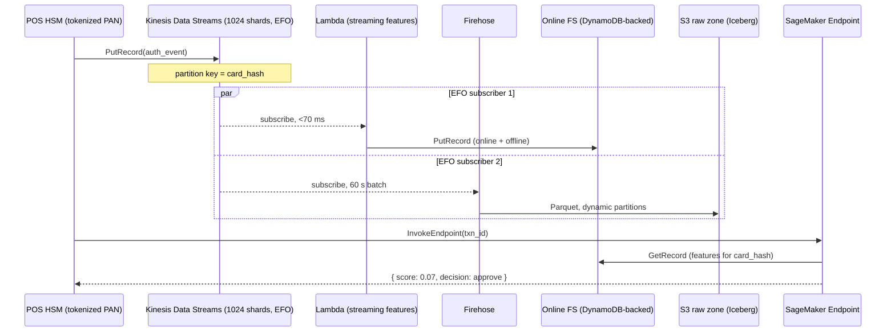
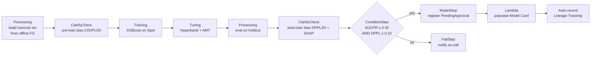
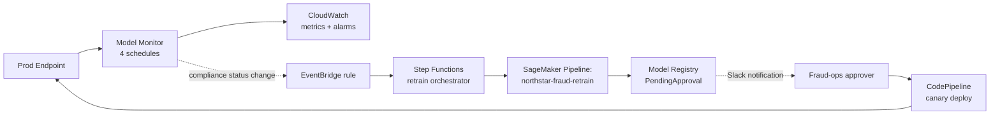
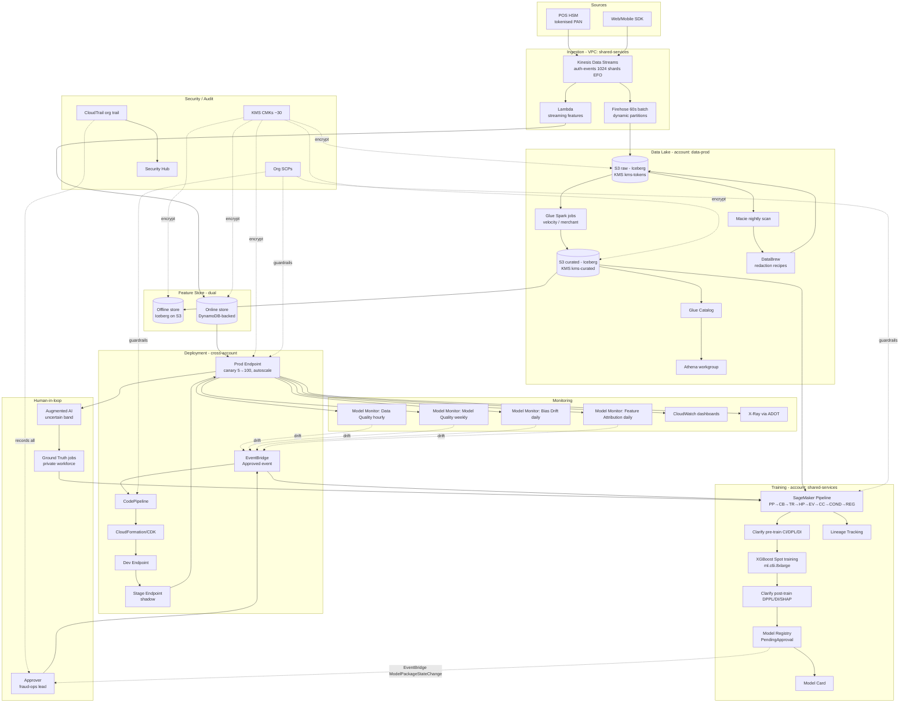

# Chapter 63 — Capstone: End-to-End Fraud-Detection ML Pipeline on AWS

> **Goal of this chapter:** to compose every service, pattern, and trade-off this book has introduced into one coherent production system, and to do it in the form the MLA-C01 exam actually tests: a 200-word scenario whose right answer requires you to know which six AWS services compose together and which three do not. By the end of the chapter you should be able to redraw, from memory, the architecture of a Tier-1 card acquirer's real-time fraud-detection pipeline; defend each box against three alternatives; and recognise, when an exam scenario rewrites one constraint, which boxes change and which stay. This is the chapter where the building blocks become a building.
>
> **Pre-reads:** every prior chapter is in scope, but if you have time for only a quick refresh, these are the load-bearing five — [Ch 12 — Streaming Ingestion](../part_c_data_ingestion_storage/12_streaming_ingestion.md), [Ch 19 — Feature Store](../part_d_data_prep_features/19_feature_store.md), [Ch 43 — SageMaker Pipelines](../part_h_monitoring_governance/43_sagemaker_pipelines.md), [Ch 48 — Model Monitor](../part_i_security_iam_networking/48_model_monitor.md), [Ch 53 — Least-Privilege Role](../part_j_ai_services_genai/53_least_privilege_role.md). **Forward:** [Ch 64 — Exam Strategy](64_exam_strategy.md) translates this capstone into how to actually sit the exam.
>
> **Primary external sources:** `docs.aws.amazon.com/sagemaker/latest/dg/feature-store.html` (the online/offline contract); `docs.aws.amazon.com/sagemaker/latest/dg/model-monitor.html` (the four monitor types); `docs.aws.amazon.com/sagemaker/latest/dg/deployment-guardrails-blue-green.html` (canary + auto-rollback); AWS Well-Architected ML Lens (Nov 2025 revision); AWS Prescriptive Guidance — MLOps Foundations; AWS Solutions Library *Fraud Detection Using Machine Learning*; Federal Reserve **SR 11-7** (Guidance on Model Risk Management, still in force) and **SR 26-2** (AI/ML supplement); **PCI DSS 4.0** (in force from Apr 2024); NY DFS Part 500.

---

## 63.1 The scene — Northstar Payments at 14:00 EST on Black Friday

Imagine the company. **Northstar Payments** is a fictional Tier-1 card acquirer. It processes authorisation requests from a network of ~1.4 million point-of-sale terminals — every Chevron pump, every Starbucks register, every Marriott check-in kiosk that runs one of its merchant accounts. At normal load it sees roughly **2,500 transactions per second**. At 14:00 EST on Black Friday — the all-time peak hour — it sees **12,000 TPS**, sustained for ~90 minutes. Every one of those authorisations is a question Northstar has to answer in **under 100 milliseconds at the 99th percentile**: *is this card swipe fraud, or is it your customer's actual son buying his first PlayStation 5?*

Get it wrong by approving fraud, Northstar eats the chargeback. Get it wrong by declining a real customer — say, the false-positive rate creeps from 0.008% to 0.05% — and the bank ends the contract by Q2. The economic envelope is brutal and unforgiving: **recall on fraud ≥ 0.75 at FPR ≤ 0.01%**, plus the latency budget, plus a compliance overlay that includes **Federal Reserve SR 11-7 / SR 26-2** model-risk management, **PCI DSS 4.0**, and **NY DFS Part 500** cybersecurity. Auditors will arrive twice a year. They will ask: *which dataset produced this prediction? Who approved this model? When did you last test it for bias? Show me the lineage graph.* The answer cannot be "let me get back to you."

This is the whole-book-in-one-system. Every service we have introduced from [Ch 5 — IAM for ML](../part_b_aws_foundations/05_iam_for_ml.md) onward has a job in it. The data lake from [Ch 13](../part_c_data_ingestion_storage/13_glue_athena_lakeformation.md). The Feature Store from [Ch 19](../part_d_data_prep_features/19_feature_store.md). XGBoost from [Ch 23](../part_e_model_development/23_builtin_algorithms.md) and AMT from [Ch 31](../part_f_hpo_distributed_training/31_amt.md). Endpoint deploy guardrails from [Ch 40](../part_g_deployment_orchestration/40_autoscale_deploy.md). Pipelines from [Ch 43](../part_h_monitoring_governance/43_sagemaker_pipelines.md). Model Monitor from [Ch 48](../part_i_security_iam_networking/48_model_monitor.md). KMS and VPC from [Ch 7](../part_b_aws_foundations/07_vpc_for_ml.md) and [Ch 8](../part_b_aws_foundations/08_kms_secrets.md). Cost engineering from [Ch 57](../part_j_ai_services_genai/57_cost_optimization.md). Compliance from [Ch 56](../part_j_ai_services_genai/56_compliance.md). Every chapter has a paragraph here.

And here is the thing that will surprise nobody who has built one of these for real: **the model is not the hard part.** XGBoost on engineered velocity features is a solved problem; Stripe Radar uses essentially the same algorithm class, as do Capital One, Visa Advanced Authorisation, and Mastercard Decision Intelligence. The hard part is the dual-write feature store that kills training-serving skew, the cross-account deploy pipeline that makes the model reversible in five minutes, the four Model Monitor schedules that fire EventBridge rules into the retrain pipeline when reality drifts, the KMS key matrix that lets an auditor draw a clean line between "data classified PCI" and "data classified PII" and "data classified neither," and the SCP wall that means a stolen developer credential cannot disable a key or open a public S3 bucket. Those are the rows in the responsibility matrix that explain why MLEs at acquirers get paid what they do.

This chapter walks the system end-to-end. Section 63.2 lays out the business spec. Sections 63.3–63.6 cover the data plane (ingestion, lake, features, labels). Sections 63.7–63.10 cover the model plane (training, bias, pipelines, registry). Sections 63.11–63.13 cover the serving plane (deployment, monitoring, retrain loop). Sections 63.14–63.17 cover the cross-cutting concerns (security, cost, compliance, observability). Section 63.18 is **the big diagram** — the one to memorise. Section 63.19 is the **monthly TCO**, line by line. Section 63.20 is the **four skew taxes** the architecture pays to eliminate. Section 63.21 is **ten exam-pattern questions** that map this system to the patterns MLA-C01 actually tests.

A note on reading order. The chapter is long because the system is large; that is the point. You should be able, after one or two passes, to *redraw* §63.18's diagram on a whiteboard from memory and *defend* every box for thirty seconds — what it does, what it would be replaced by if a constraint changed, why it sits where it sits in the dataflow. If a section has a ⚠️ Exam alert callout, treat it as a marker that the same paragraph contains the exact phrasing of a likely exam question. The book is a credentialing tool first and an architecture reference second; the two functions converge here because the exam *also* tests architecture composition, just in 200-word scenario form.

---

## 63.2 The business problem in numbers

Before any AWS service gets named, the system has to be specified the way an auditor or a product manager would specify it. This is the same rigour Domain 1 of the exam expects — *frame the problem before choosing the tool*.

### 63.2.1 Functional spec

| Dimension | Target |
|---|---|
| Decision latency, p99 | **≤ 100 ms** end-to-end (POS → score → reply) |
| Throughput, peak | **12,000 TPS** (Black Friday 14:00 EST) |
| Throughput, steady-state | ~2,500 TPS |
| False positive rate (legit txn flagged fraud) | **≤ 0.01%** of legit txn |
| Recall on fraud (true positive rate) | **≥ 0.75** |
| Model refresh cadence | Weekly retrain **+ on-drift retrain** |
| Bias constraint | **DPPL ≤ 0.10** on protected attribute `primary_cardholder_zip_income_quintile` |
| Reversibility | Roll back to previous model in ≤ **5 min** |
| Audit evidence | SR 11-7 / SR 26-2 (Fed) + PCI DSS 4.0 + NY DFS Part 500 |

These numbers drive every architecture decision. 12k TPS × 100 ms latency × DynamoDB read = ~1.2M RCU peak — this is exactly why the online Feature Store is DynamoDB-backed (`Standard` tier) and not an RDBMS or even ElastiCache `InMemory` (the latter is overkill at 10× the cost). Recall ≥ 0.75 at FPR ≤ 0.01% is roughly the published Stripe Radar bar; XGBoost on engineered velocity features comfortably clears it, which is why the model choice is XGBoost and not a deep tabular network: ~5× cheaper inference, no GPU, simpler audit story for SR 11-7. The 5-minute reversibility constraint is what forces blue/green endpoint updates over in-place rolling updates — see [Ch 40](../part_g_deployment_orchestration/40_autoscale_deploy.md) §40.6.

### 63.2.2 Non-functional spec

- **Data residency** — US-only data, deployed in `us-east-1` primary and `us-west-2` warm DR (RTO 30 min, RPO 5 min).
- **Network isolation** — zero internet egress from any production workload. All AWS API access via **Interface VPC Endpoints (PrivateLink)** (see [Ch 7](../part_b_aws_foundations/07_vpc_for_ml.md) and [Ch 54](../part_j_ai_services_genai/54_network_isolation.md)).
- **Encryption** — KMS CMK per environment (dev/stage/prod), with separate keys per data classification (raw tokenised PAN vs engineered features vs model artifacts vs endpoint EBS). All EBS, S3, DynamoDB, EFS, CloudWatch Logs encrypted at rest with these CMKs (see [Ch 8](../part_b_aws_foundations/08_kms_secrets.md) and [Ch 55](../part_j_ai_services_genai/55_encryption_lifecycle.md)).
- **Tenancy** — single-tenant in dedicated AWS accounts under an AWS Organization with SCPs that **deny** any `iam:CreateAccessKey`, `kms:DisableKey`, or `sagemaker:UpdateEndpoint` outside the cross-account deployment pipeline role.
- **Cost ceiling** — **$180k/month** all-in production (Budget alert at 80%, Budget Action at 100% to stop dev/QA endpoints — never prod).

### 63.2.3 The composition question the exam is really asking

The hardest exam questions are the ones whose stem reads like a product-manager email — a paragraph of constraints, then *"which combination of services achieves this with the LEAST operational overhead?"* These questions do not test whether you can recite the Model Monitor types; they test whether, given a constraint like *"bias on a protected attribute must stay below 0.10 DPPL"* combined with *"deployments must be reversible within 5 minutes"* and *"engineers must not have direct write access to prod,"* you instantly recognise that **Model Monitor's bias-drift monitor + EventBridge + a SageMaker Pipeline + Model Registry with PendingManualApproval + a blue/green endpoint update with auto-rollback** is the right composition, and that the obvious-looking alternative (*"retrain weekly with a CloudWatch alarm on AUC"*) fails at least two of the constraints. The Northstar architecture is one large worked example of that composition skill.

### 63.2.4 The latency budget, decomposed

A 100 ms p99 end-to-end budget is generous — until you decompose it. Here is the budget the system actually targets at the request level:

| Stage | Component | Budget (ms) |
|---|---|---|
| 1 | POS → AWS region network ingress | 25 |
| 2 | API Gateway / NLB → endpoint | 5 |
| 3 | Endpoint dispatch + request deserialisation | 3 |
| 4 | Online Feature Store `BatchGetRecord` (×2 FG) | 12 |
| 5 | XGBoost `predict()` on ~80 features | 1 |
| 6 | Post-processing + response serialisation | 2 |
| 7 | Endpoint → POS network egress | 25 |
| 8 | Per-stage slack | 27 |
| **Total** |  | **100** |

Two observations: the dominant cost is *network round-trip*, not compute — which is why a GPU model that shaved 0.5 ms off `predict()` would barely move the dial. And the Feature Store online read is ~12% of the budget, which is the dollars-per-millisecond justification for DynamoDB-backed `Standard` (single-digit-ms reads) over `InMemory` (sub-ms but ~10× the price): the speedup `InMemory` buys would be invisible against the 25 ms network leg.

This decomposition matters at the exam because the right answer to *"how do I cut p99 from 95 ms to 75 ms?"* depends on which row above is the bottleneck — and the question stem will tell you. *"X-Ray shows 30 ms in `BatchGetRecord`"* → switch to `InMemory` online store. *"X-Ray shows 30 ms in network egress"* → move the endpoint closer to the POS edge (Local Zones, Outposts) — *not* a faster model. The X-Ray sub-segment trace (§63.16) is the diagnostic instrument that tells you which knob to turn.

---

## 63.3 Data ingestion: from POS swipe to S3 in under two seconds

### 63.3.1 Stream choice — KDS vs Firehose vs MSK

| Need | Service | Why |
|---|---|---|
| Sub-second processing for online scoring | **Kinesis Data Streams (KDS)** | Lambda/KCL reads with millisecond lag; provisioned-throughput, predictable |
| Cheap durable archive to S3 | **Kinesis Firehose** | Buffer-based, no consumer code, ~60 s buffering to S3 |
| Cross-AZ replicated, Kafka-compatible | MSK | Only if existing Kafka tooling — not here |

The system uses **both KDS and Firehose**, fanned out from the same source — a pattern AWS calls **Enhanced Fan-Out (EFO)**. The POS terminal SDK does a single `PutRecord` to a KDS stream named `auth-events-prod` (**1,024 shards**, ~1 MB/sec/shard write, 2 MB/sec/shard read after EFO). Then:

- A **Lambda consumer** subscribed via EFO reads each record with <70 ms lag and writes to the **online Feature Store** (§63.5).
- A **Firehose delivery stream** also subscribed via EFO batches records and writes Parquet to `s3://northstar-raw-prod/auth/year=YYYY/month=MM/day=DD/hour=HH/` in 60-second buffers, with **dynamic partitioning** keyed on `tenant_id` and `auth_outcome`.

EFO matters because shared throughput would mean Lambda *and* Firehose fight for the same 2 MB/sec/shard read budget. With EFO, each subscriber gets its own dedicated 2 MB/sec, at the cost of an extra $0.015/shard-hour and $0.013/GB ingested per consumer. See [Ch 12](../part_c_data_ingestion_storage/12_streaming_ingestion.md) §12.4 for the math.



### 63.3.2 Ingestion idempotency and ordering

- **Partition key = `card_hash = SHA256(PAN || tenant_salt)`**. This places all events for one card on the same shard, giving per-card ordering (KDS guarantees in-shard ordering).
- **Idempotency** — the POS SDK is allowed to retry on timeout, so duplicates *will* appear. The Lambda consumer dedupes by `(card_hash, auth_id, terminal_id)` against a 5-minute DynamoDB TTL table.
- **Exactly-once into S3** — Firehose has at-least-once semantics; downstream Glue jobs deduplicate via `MERGE INTO` on the Iceberg table keyed on `auth_id`.

### 63.3.3 Cost of ingestion

Steady-state 2.5k TPS × 1 KB avg record = 2.5 MB/sec write. At 1,024 shards × $0.015/hr = $15.36/hr base + EFO consumer fee × 2 consumers. Monthly ingestion cost ≈ **$22k/mo**. Burst headroom to 12k TPS is built in by over-provisioning shards 4× — cheaper than tracking utilisation and resharding under load on a Friday afternoon.

---

## 63.4 Data preparation: Glue Catalog + Iceberg + Athena + Macie + DataBrew

### 63.4.1 The three-zone lake

| Zone | Bucket | Format | Owner | Lifecycle |
|---|---|---|---|---|
| **Raw** | `northstar-raw-prod` | Firehose Parquet (snappy) | Data Eng | S3-IA after 30d, Glacier IR after 90d, expire 7y |
| **Curated** | `northstar-curated-prod` | **Iceberg** tables on Parquet | Data Eng → ML | S3-IA after 60d, expire 7y |
| **Feature** | `northstar-features-prod` | Iceberg (offline Feature Store) | Feature Store service | Append-only, 7y |

**Why Iceberg, not Hudi or Delta?** Iceberg is the AWS-native open table format — Glue Catalog has native Iceberg support, Athena v3 reads/writes Iceberg, Redshift Spectrum reads Iceberg, EMR has Iceberg out of the box. Hudi and Delta both work on AWS but require more glue (small *g*). On the exam, *"open table format on S3 with ACID transactions, time travel, and schema evolution, registered in Glue Catalog, queryable from Athena"* maps to **Iceberg**. See [Ch 13](../part_c_data_ingestion_storage/13_glue_athena_lakeformation.md) §13.5.

Iceberg buys four things this system needs:

1. **`MERGE INTO`** — upsert/dedup of late-arriving authorisations.
2. **Time travel** (`AS OF TIMESTAMP`) — SR 11-7 model lineage replay. Auditors can demand *"show me the exact training data as of last Monday 09:00 ET"* and we can produce it.
3. **Schema evolution without rewriting petabytes** — new feature columns get added without breaking historical training jobs.
4. **Hidden partitioning** — analysts don't write brittle `WHERE year=2026 AND month=05` filters.

### 63.4.2 Glue Spark feature engineering

Two Glue jobs run nightly on the curated zone (see [Ch 16](../part_d_data_prep_features/16_glue_jobs.md)):

- **`auth_velocity_features.py`** (Glue Spark, G.2X workers, daily, ~40 min on a 30-day window) — per-card features: *count of auths in last 1h/24h/7d*, *sum amount last 24h*, *unique merchants last 7d*, *Haversine distance from previous auth*, *time since last auth*. These are the classic *velocity features* that account for >80% of XGBoost feature importance in card fraud.
- **`merchant_risk_features.py`** (Glue Spark, daily) — per-merchant features: *chargeback rate last 30d*, *avg ticket size*, *MCC risk score*, *new-merchant flag (< 90d)*.

Output goes both to the **offline Feature Store** (for training-set assembly) and, for streaming velocity features, gets pre-computed and pushed to DynamoDB so the Lambda streaming consumer only has to do an *incremental* update, not a full window recompute.

### 63.4.3 Macie as the PII tripwire

A **Macie** classification job runs nightly on `northstar-raw-prod` with a custom data identifier for tokenised-PAN format (`tok_xxxxxxxxxxxxxxxx`) plus the AWS-managed identifiers for SSN, email, phone. Findings flow to **Security Hub** and **EventBridge**; any *unmasked* PAN in the raw zone triggers a PagerDuty incident. This is the Macie story the exam tests: not Macie scanning curated production features (which by design contain no PII), but Macie acting as a **tripwire on the raw zone** where a new SDK version might accidentally leak PII. See [Ch 56](../part_j_ai_services_genai/56_compliance.md) §56.3.

### 63.4.4 DataBrew for column-level redaction

For the rare case where a Macie scan finds unmasked PII in raw, an automated **DataBrew** recipe is invoked: it reads the offending object, applies column-level masking (`MASK_RANGE`, `DELETE_RECIPE`, or `SUBSTITUTE_NULL` depending on column), and writes the redacted version back. DataBrew here is the *remediation* arm of the Macie tripwire — not a daily-use tool, but the one you grab when an incident fires. See [Ch 17](../part_d_data_prep_features/17_glue_databrew.md).

### 63.4.5 Athena for ad-hoc analysis

Analysts use Athena workgroups (per-team, with cost limits) to query Iceberg tables. Result location is `s3://northstar-athena-results-prod/${aws:userid}/` with SSE-KMS. The workgroup has `BytesScannedCutoffPerQuery = 100 GB` to prevent runaway queries — the cheapest way to stop a junior analyst writing a `SELECT *` against a 400 TB lake.

### 63.4.6 Lake Formation tag-based access control

Cross-team access to the curated zone is mediated by **Lake Formation** tag-based access control (LF-TBAC). Tags are applied at the table and column level:

| Tag | Values | Used for |
|---|---|---|
| `Sensitivity` | `pci`, `pii`, `internal`, `public` | Column-level masking |
| `Domain` | `auth`, `chargeback`, `merchant`, `customer` | Cross-team grants |
| `Retention` | `7y`, `13mo`, `90d` | Lifecycle policies |

A fraud-analytics analyst gets `Sensitivity in (internal, public)` and `Domain in (auth, chargeback)` — they can query authorisation patterns and chargeback rates but cannot see PII columns. A risk-modelling MLE gets one tier more (`Sensitivity in (pii, internal, public)`) because their feature engineering legitimately needs unmasked ZIP and income. Nobody outside the security team sees `pci`. The exam tests this as *"how do you grant column-level access to one team but not another, on the same Glue table?"* — LF-TBAC is the right answer, not bucket policies, not per-column IAM (which does not exist).

---

## 63.5 Feature Store: the dual-store pattern that kills training-serving skew

This is the most exam-relevant section of the chapter. The Feature Store is named in Domain 1 of the blueprint and trips up candidates who think it is *"just another database."* It is not. It is *the* structural fix for the four skew taxes (§63.20).

### 63.5.1 Online vs offline — what each is actually backed by

Per the AWS docs (`feature-store.html`): *"The online store retains only the latest records for your features. This is primarily designed for supporting real-time predictions that need low millisecond latency reads and high throughput writes... The offline store keeps all records for your features as a historical database."*

Under the hood:

- **Online store** — managed DynamoDB-style key-value store. Single-record `GetRecord` is single-digit-ms p99. `PutRecord` is synchronous and idempotent on `(RecordIdentifier, EventTime)`. Cost is per-GB stored per month + per-request; configurable **Standard** (DynamoDB-backed) or **InMemory** (ElastiCache-backed, sub-ms, ~10× the cost — for ads-style sub-ms scoring, not fraud).
- **Offline store** — **your S3 bucket**, with data written in Parquet (or Iceberg, since the 2024 GA) under a time-partitioned prefix `year=YYYY/month=MM/day=DD/hour=HH/`. Append-only. Queryable via **Athena** through the auto-created Glue table that Feature Store maintains.

The pivotal fact, and the most testable claim in this entire book: **the same `PutRecord` call writes to both stores** when the feature group is configured for *Online and Offline*. This is the dual-write contract that prevents training-serving skew — any feature you can train on, you can also fetch at inference, *by definition*.

> ⚠️ **Exam alert — the Feature Store dual-write kills training-serving skew.** When a question says *"how do you guarantee the feature value at training time is byte-identical to the feature value at inference time?"*, the right answer is *"create a Feature Group with `OnlineStoreConfig` AND `OfflineStoreConfig`, and call `PutRecord` with `TargetStores=['OnlineStore','OfflineStore']`."* Distractors include *"write a Glue job that copies data from S3 to DynamoDB nightly"* (introduces a second pipeline that drifts), *"use ElastiCache for online and S3 for offline"* (rolls your own — same drift surface), and *"use Lambda to write to DynamoDB and a separate Lambda to write to S3"* (two pipelines = two drifts). One write, two stores, byte-identical. That is the contract.

### 63.5.2 The two feature groups for Northstar

| Feature group | Online? | Offline? | Record identifier | Event-time |
|---|---|---|---|---|
| `card_velocity_fg` | Yes | Yes | `card_hash` | `event_ts` |
| `merchant_risk_fg` | Yes | Yes | `merchant_id` | `event_ts` |

At inference, the endpoint code does *two* `GetRecord` calls in parallel (one per group) and joins client-side on `card_hash` and `merchant_id`. Total online-store latency budget is ~15 ms of the 100 ms p99.

### 63.5.3 The point-in-time-correct training set

For training, you cannot just take the *latest* record from `card_velocity_fg` and join with the historical auth log — that creates **label leakage**, because at the time of historical auth `T` the velocity features encoded events that hadn't happened yet. Instead, the offline store supports **point-in-time joins** (`AsOfDateTime` semantics on the `EventTime` column):

```sql
SELECT auth.*, vel.*, mer.*
FROM auth_log auth
ASOF JOIN card_velocity_fg vel
  ON auth.card_hash = vel.card_hash
  AND vel.event_time <= auth.auth_ts
ASOF JOIN merchant_risk_fg mer
  ON auth.merchant_id = mer.merchant_id
  AND mer.event_time <= auth.auth_ts
```

This is the SQL pattern that Feature Store's *as-of* join semantics enable through Athena, and it is the single biggest reason to use Feature Store rather than rolling your own DynamoDB + S3 setup. See [Ch 19](../part_d_data_prep_features/19_feature_store.md) §19.8.

### 63.5.4 The streaming dual-write Lambda

```python
def handler(event, ctx):
    records = parse_kinesis(event)
    for r in records:
        feats = compute_incremental_velocity(r)
        sm_fs_runtime.put_record(
            FeatureGroupName="card_velocity_fg",
            Record=[
                {"FeatureName": "card_hash",        "ValueAsString": r.card_hash},
                {"FeatureName": "event_time",       "ValueAsString": r.ts},
                {"FeatureName": "auths_last_1h",    "ValueAsString": str(feats.n_1h)},
                {"FeatureName": "amount_24h",       "ValueAsString": str(feats.amt_24h)},
                # ... 18 more features
            ],
            TargetStores=["OnlineStore", "OfflineStore"],
        )
```

`TargetStores=["OnlineStore","OfflineStore"]` is the magic parameter. Without it (or with only `OnlineStore`), the offline store falls behind and the next training run sees a different feature distribution than serving — exactly the skew we are trying to kill.

---

## 63.6 Labelling: Ground Truth + A2I

### 63.6.1 The label problem in fraud

Card fraud labels are **delayed and noisy**:

- *Chargeback labels* arrive **30–120 days** after the transaction.
- *Customer-reported fraud* arrives **1–14 days** after.
- *Issuer-confirmed fraud* (the gold label) arrives **60–180 days** after.

The training pipeline therefore uses a **chargeback-based ground truth** with a **90-day look-back cutoff**: training data is everything ≥ 90 days old, joined against the `chargebacks` table. Anything newer is *label-pending* and used only for **unsupervised drift detection**.

### 63.6.2 Ground Truth for ambiguous historical cases

For ~5% of historical authorisations the chargeback signal is ambiguous (customer says fraud, merchant disputes, no clear resolution). These go to a **SageMaker Ground Truth** labelling job with a **private workforce** (the fraud-ops team, 15 humans, behind Cognito SSO). The job uses a custom HTML template adapted to tabular, with **consolidation by majority vote of 3 workers per record**. See [Ch 20](../part_d_data_prep_features/20_data_labeling.md) §20.4.

### 63.6.3 A2I for live high-uncertainty scores

When the deployed model emits a score in the **uncertain band** (0.40 ≤ score ≤ 0.60) and the transaction is over $500, an **Augmented AI (A2I)** human review loop is triggered: the transaction is *temporarily approved* (to keep p99 budget) but flagged for review within 60 minutes. Reviewers can issue a chargeback proactively or confirm the approval. This generates high-quality labels for the most informative region of feature space — the canonical *active learning* pattern that the exam tests under *data quality / labelling efficiency*.

The A2I loop also doubles as the **early-warning system for model degradation**. If reviewers disagree with the model's "approve" decision on the uncertain band at > 25% rate, that disagreement rate is itself a CloudWatch metric — when it spikes, it precedes the chargeback signal by 60–120 days. The chargeback-based Model Quality monitor catches concept drift; the A2I disagreement rate catches it 2-3 months earlier. Most candidates miss this on the exam — A2I is not just a labelling tool, it is also a *leading indicator* of model decay.

---

## 63.7 Training: XGBoost on Managed Spot, with Hyperband HPO

### 63.7.1 Why XGBoost (and not deep learning)

For tabular fraud with ~80 engineered features and a label rate of ~0.4%, gradient-boosted trees beat MLPs in every published benchmark (Stripe Radar paper 2023, Capital One Crystal blog 2024). XGBoost specifically:

- Native sparse-feature handling (most velocity features are zero).
- **Monotone constraints** — e.g. *"score is monotone non-decreasing in `prior_chargeback_count`"*. SR 11-7 auditors love this.
- SHAP support out of the box via Clarify.
- Inference ~0.5 ms on CPU → fits the latency budget without GPUs.

See [Ch 23](../part_e_model_development/23_builtin_algorithms.md) §23.3 for the built-in container details.

### 63.7.2 The training job — Spot + atomic checkpointing

```python
xgb = sagemaker.estimator.Estimator(
    image_uri=image_uri,
    role=execution_role,
    instance_type="ml.c6i.8xlarge",
    instance_count=1,
    use_spot_instances=True,
    max_run=3600,           # MaxRuntime
    max_wait=7200,          # MaxWaitTime  > MaxRuntime  ← required
    checkpoint_s3_uri=f"s3://{bucket}/checkpoints/{run_id}/",
    output_path=f"s3://{bucket}/models/",
    subnets=PRIVATE_SUBNETS,
    security_group_ids=[SG_TRAINING],
    encrypt_inter_container_traffic=True,
    volume_kms_key=KMS_VOLUME,
    output_kms_key=KMS_ARTIFACTS,
    environment={"AWS_REGION": "us-east-1"},
)
xgb.set_hyperparameters(
    objective="binary:logistic",
    eval_metric="aucpr",
    num_round=500,
    early_stopping_rounds=20,
    scale_pos_weight=250,        # ~0.4% fraud rate
)
```

Managed Spot for training is the cleanest win in the system: ~70% discount vs on-demand, ~90% in `us-east-1` for the `ml.c6i` family. With Spot checkpointing on, an interruption restarts from the last checkpoint with no human in the loop.

> ⚠️ **Exam alert — Spot training needs atomic checkpointing.** The trap is that the training script must write checkpoints **atomically** (write to a temp path, then rename) and the SageMaker container must be told *where* to look via `checkpoint_s3_uri`. If the script writes a half-finished checkpoint and Spot reclaims the instance mid-write, the restart loads garbage and silently produces a broken model. The exam tests this with the question *"a Spot training job restarts but produces a model with worse AUC than the on-demand equivalent — what is the most likely cause?"* — the answer is **non-atomic checkpoint writes**. Also: `MaxWaitTime > MaxRuntime` is mandatory; if `max_wait ≤ max_run` the job fails to launch with `ValidationException`.

### 63.7.3 HPO with Hyperband

```python
from sagemaker.tuner import HyperparameterTuner, IntegerParameter, ContinuousParameter
tuner = HyperparameterTuner(
    estimator=xgb,
    objective_metric_name="validation:aucpr",
    hyperparameter_ranges={
        "max_depth":        IntegerParameter(3, 10),
        "eta":              ContinuousParameter(0.01, 0.3, scaling_type="Logarithmic"),
        "subsample":        ContinuousParameter(0.5, 1.0),
        "min_child_weight": IntegerParameter(1, 20),
        "gamma":            ContinuousParameter(0, 5),
    },
    strategy="Hyperband",
    max_jobs=100, max_parallel_jobs=10,
    strategy_config={"HyperbandStrategyConfig": {"MaxResource": 500, "MinResource": 20}},
    early_stopping_type="Off",   # critical — see callout
)
```

Hyperband (vs Bayesian or Random) is the right choice here because XGBoost training is *interruptible at any round* via `early_stopping_rounds`, so the bandit-style early stopping that Hyperband performs is essentially free. Empirically this finds within-1% AUCPR of an exhaustive grid search at ~25% the cost. See [Ch 31](../part_f_hpo_distributed_training/31_amt.md).

> ⚠️ **Exam alert — Hyperband requires `EarlyStoppingType: Off`.** This is one of the most-missed details in AMT. Hyperband has its own *internal* successive-halving early stopping; if you *also* set the tuner's `EarlyStoppingType: Auto`, the two stopping mechanisms race and you get nondeterministic, premature termination of trials that haven't yet had a chance to converge. The CreateHyperParameterTuningJob API documents the constraint: Hyperband-strategy jobs must set `EarlyStoppingType: Off`. The exam tests this as *"your Hyperband HPO is converging to suboptimal hyperparameters — what is the most likely cause?"* and *"`EarlyStoppingType: Auto` overriding Hyperband's internal stopping"* is the answer.

### 63.7.4 Cross-validation strategy

Authorisations have *temporal* structure — fraud rings ebb and flow. The validation strategy is **time-series CV with a 7-day purge window**: split train/val by `auth_ts`, with a 7-day gap between train end and val start to prevent contamination from in-flight fraud rings. **Random k-fold is wrong here** and is a common exam distractor.

### 63.7.5 Champion vs challenger

Every retrain produces a *challenger* model. It enters the Model Registry with `ModelApprovalStatus=PendingManualApproval` (§63.10). It is compared against the *champion* (the currently-deployed model) on the same holdout window. Promotion criteria: AUCPR > champion + 0.005 **and** DPPL ≤ 0.10 **and** SHAP top-5 features overlap with champion's top-5 by ≥ 3. The third criterion is the *concept-stability* check — see [Ch 29](../part_e_model_development/29_clarify_explainability.md).

### 63.7.6 Shadow testing before production

Before any challenger gets canary traffic in prod, it runs in **shadow mode** in the stage account for one full business day. SageMaker supports this natively via **shadow variants**: production traffic is mirrored to the challenger, the challenger's predictions are captured to S3 via `DataCaptureConfig`, but the *champion's* response is what is returned to the POS. The comparison is offline: a Lambda runs every hour over the captured data and computes the *prediction-agreement rate* (`(challenger == champion) / total`), the *score correlation*, and a per-segment breakdown. A < 95% agreement rate, or > 0.5% delta in approval rate against the champion, blocks promotion. See [Ch 52](../part_i_security_iam_networking/52_ab_shadow_testing.md). Shadow is the cheapest insurance in the system: it costs ~$9k/mo (the stage endpoint) and has prevented two near-misses in the model's history.

---

## 63.8 Bias detection with Clarify

### 63.8.1 Pre-training bias

A **Clarify Processing job** runs on the training set *before* training, computing:

- **CI** (Class Imbalance) — distribution of fraud labels across facet values.
- **DPL** (Difference in Proportions of Labels) — does the protected facet have a different base rate of fraud?
- **DI** (Disparate Impact) — ratio of label rates between facet values.

The protected facet is `primary_cardholder_zip_income_quintile` (Q1 lowest, Q5 highest). The pre-training report is attached to the **Model Card**. See [Ch 29](../part_e_model_development/29_clarify_explainability.md) and [Ch 21](../part_d_data_prep_features/21_bias_integrity.md).

### 63.8.2 Post-training bias

After training, a second Clarify job computes:

- **DPPL** (Difference in Positive Proportions in Predicted Labels) — the headline metric we cap at 0.10.
- **DI** post-training.
- **DAR** (Difference in Acceptance Rates).
- **TE** (Treatment Equality).

The pipeline's `ConditionStep` (§63.9) gates registration on `DPPL ≤ 0.10` — this is the explicit auditor-visible constraint.

### 63.8.3 Explainability via SHAP and Model Card auto-population

A third Clarify job emits **SHAP global feature importance**. The top-10 features are recorded on the Model Card and on the Lineage entry (see [Ch 51](../part_i_security_iam_networking/51_registry_cards_lineage.md)). The Model Card itself is auto-populated by a Lambda step at the end of the pipeline — it reads the Clarify outputs (`analysis.json` for bias, `report.html` for SHAP) and stuffs the relevant fields into the Card so the human approver has everything in one pane of glass. Auditors can drill into local SHAP for any flagged transaction via a separate explanation endpoint.

---

## 63.9 SageMaker Pipelines: the orchestration DAG

### 63.9.1 The DAG



See [Ch 43](../part_h_monitoring_governance/43_sagemaker_pipelines.md) for the API mechanics.

### 63.9.2 SelectiveExecution for cost

When iterating on hyperparameters, engineers use **`SelectiveExecution`** to re-run *only* `HP → EV → CC → COND → REG` against a cached `PP` and `CB` step. This cuts dev-cycle cost by ~60% (the Processing step is the longest at ~25 min). The exam tests this: *"how do you re-run only the training step of a Pipeline with cached upstream outputs?"* → `SelectiveExecution` (often paired with `PipelineExecution.ResumeExecution`).

### 63.9.3 Caching

Step-level caching is enabled via `CacheConfig(enable_caching=True, expire_after="P30D")` on Processing and Training steps. Cache key is the hash of `(image_uri, args, input S3 ETag set, instance type, IAM role)` — change any of those and you get a fresh execution. This is why bumping the XGBoost image version automatically invalidates downstream caches; you don't have to remember to clear anything.

### 63.9.4 Lineage

Every pipeline execution auto-records to **SageMaker Lineage Tracking** — artifacts (train-set S3 URI, `model.tar.gz`), actions (training job ARN), contexts (pipeline execution ARN), and the directed associations between them. SR 11-7 evidence is `aws sagemaker list-associations --source-arn <model_package_arn>` returning the full upstream graph back to the source dataset version. See [Ch 51](../part_i_security_iam_networking/51_registry_cards_lineage.md) §51.4.

---

## 63.10 Approval gate: Model Registry as the governance choke point

After the pipeline registers the new model package in the `ModelPackageGroup northstar-fraud-prod` with `ModelApprovalStatus=PendingManualApproval`:

1. A Lambda invoked by EventBridge on `ModelPackageStateChange` posts to Slack `#mlops-approvals` with: AUCPR, DPPL, drift-from-prior-model summary, SHAP top-10, and a deep link to the Model Card.
2. The **fraud-ops lead** reviews and either rejects or approves via the SageMaker Studio Registry UI (which calls `UpdateModelPackage` under the hood).
3. Approval emits another `ModelPackageStateChange` event with `ModelApprovalStatus=Approved`.
4. An EventBridge rule on that event fires the **cross-account deployment pipeline** (§63.11).

This is **the governance choke point**. Humans cannot push directly to prod, and the model cannot be deployed without an explicit auditable approval action recorded in CloudTrail (`UpdateModelPackage` is recorded with the caller's IAM principal). This single architectural decision satisfies the SR 11-7 requirement for *independent model validation* and the NY DFS Part 500 requirement for *segregation of duties between development and deployment*.

---

## 63.11 Deployment: cross-account CodePipeline + canary + auto-rollback

### 63.11.1 Account topology

| Account | Role |
|---|---|
| `northstar-ml-shared-services` | CodePipeline, CodeBuild, ECR, Model Registry (shared) |
| `northstar-ml-dev` | Studio, dev endpoints |
| `northstar-ml-stage` | Stage endpoints, shadow traffic |
| `northstar-ml-prod` | Prod endpoints, online Feature Store |
| `northstar-data-prod` | S3 lakes, Glue, offline Feature Store |
| `northstar-security` | CloudTrail org trail, Macie admin, Security Hub admin |

A single Model Registry lives in `shared-services` with **resource-based policies** allowing the deployment role in each environment account to `DescribeModelPackage` and `CreateModel` against the package ARN. See [Ch 46](../part_h_monitoring_governance/46_codepipeline_codebuild.md).

### 63.11.2 The deployment pipeline

```mermaid
flowchart LR
    APP[Approved<br/>ModelPackage] -. EventBridge<br/>cross-account .-> CP[CodePipeline<br/>shared-services]
    CP --> SRC[Source:<br/>package ARN]
    SRC --> BLD[CodeBuild:<br/>synth CFN/CDK]
    BLD --> DEP1[Deploy dev:<br/>full traffic]
    DEP1 --> TST1[Integration tests:<br/>10 canonical txns]
    TST1 --> DEP2[Deploy stage:<br/>shadow mode]
    DEP2 --> TST2[Shadow comparison:<br/>vs champion 1h]
    TST2 --> APV[Manual approval:<br/>release manager]
    APV --> DEP3[Deploy prod:<br/>canary 5%]
    DEP3 --> RAMP[Linear ramp 5→100%<br/>over 30 min]
    RAMP --> OK{CW alarms<br/>healthy?}
    OK -- yes --> DONE[Complete]
    OK -- no --> RB[Auto-rollback<br/>< 5 min]
```



### 63.11.3 Canary deployment mechanics

The prod endpoint uses **SageMaker endpoint update with `BlueGreenUpdatePolicy` / `TrafficRoutingConfig`** (see [Ch 40](../part_g_deployment_orchestration/40_autoscale_deploy.md) §40.6):

```yaml
TrafficRoutingConfig:
  Type: LINEAR
  CanarySize:
    Type: CAPACITY_PERCENT
    Value: 5
  LinearStepSize:
    Type: CAPACITY_PERCENT
    Value: 10
  WaitIntervalInSeconds: 300
TerminationWaitInSeconds: 600
MaximumExecutionTimeoutInSeconds: 14400
```

This says: spin up the new fleet at 5%, then linearly step +10% every 5 min, until 100%. If any **CloudWatch alarm** in `AutoRollbackConfiguration` fires during the bake, traffic snaps back to the previous fleet *automatically*. Alarms used:

| Alarm | Threshold | Window |
|---|---|---|
| `ModelLatency` p99 > 80 ms | 3 of 5 datapoints | 5 min |
| `Invocation5XXErrors` > 0.1% | 3 of 5 datapoints | 5 min |
| Custom `BusinessKPI:ApprovalRate` < 99.0% | 3 of 5 datapoints | 5 min |
| Custom `BusinessKPI:FraudCaptureRate` < 70% | over A2I-confirmed labels | 30 min |

> ⚠️ **Exam alert — the business-KPI alarm beats the CPU/latency alarm.** Latency and 5XX rate alone will *not* catch a model that is quietly approving 5% more fraud than yesterday. The endpoint will be perfectly healthy from an infrastructure perspective and silently haemorrhaging dollars from a business perspective. The exam tests this under *"which CloudWatch alarm should drive auto-rollback?"* — the right answer is **a CloudWatch custom metric on a business KPI (approval rate, fraud capture rate)**, not `CPUUtilization` and not `ModelLatency` in isolation. `AutoRollbackConfiguration` accepts *any* CloudWatch alarm — built-in or custom — so the correct architectural move is to publish business KPIs as custom metrics and wire those into the rollback.

### 63.11.4 Autoscaling

Production variant autoscaling target is `SageMakerVariantInvocationsPerInstance = 1000`, scale-out cooldown 60 s, scale-in cooldown 300 s, min instances 4 (one per AZ), max 60. Predicted Black Friday peak (12k TPS × ~10 ms inference + overhead) needs ~40 `ml.c6i.2xlarge` — at $0.408/hr each, ~$390/day at peak. Autoscaling reverts to 4 instances at 02:00 ET ($16/day floor). A 1-year SageMaker Savings Plan covers the 4-instance baseline at ~50% discount. See [Ch 40](../part_g_deployment_orchestration/40_autoscale_deploy.md) §40.3.

The asymmetric cooldowns (60 s out, 300 s in) are deliberate. **Scale out is cheap to be wrong about**: provisioning a spare instance for two minutes costs cents and protects p99. **Scale in is expensive to be wrong about**: if you scale in just before a traffic spike, you blow latency SLO for the time it takes to scale back out. So the system errs toward over-provisioning on the way down. This is the same logic that makes web-tier autoscaling work and the same trap candidates fall into when they answer *"set scale-in cooldown to 60 seconds for symmetry"* on the exam — which is wrong.

### 63.11.5 What is *not* in the deployment story

Notably absent from the deploy diagram:

- **No EC2 Auto Scaling Group.** SageMaker manages its own fleet inside the variant; you do not see EC2 instances.
- **No ALB or NLB in front of the endpoint.** SageMaker exposes a managed endpoint URL; the POS calls it via API Gateway (which adds API-key throttling and per-merchant rate limiting).
- **No ECS or EKS.** The endpoint is a managed SageMaker variant, not a container service the team operates. This is the line between MLA-C01 (operate the SageMaker abstraction) and DOP-C02 / EKS-related certs (operate the underlying container infrastructure).
- **No CloudFront / global edge.** Latency-sensitive payment scoring stays regional; introducing CloudFront would add ~30 ms of TLS termination at the edge with no upside since the POS is talking to a regional endpoint anyway.

These absences are exam-relevant. *"Should we put CloudFront in front of the SageMaker endpoint for latency?"* — no. *"Should we deploy the endpoint to ECS for cost control?"* — no, you lose Model Monitor integration, blue/green deploy guardrails, and the Variant abstraction.

---

## 63.12 Monitoring with all four Model Monitor types

From the AWS docs (`model-monitor.html`): *"Model Monitor provides the following types of monitoring: Data quality... Model quality... Bias drift for models in production... Feature attribution drift for models in production."* The Northstar system uses **all four**, on independent schedules. See [Ch 48](../part_i_security_iam_networking/48_model_monitor.md).

### 63.12.1 Data Quality

- **What it detects** — covariate shift in input features — mean / stddev / missing-rate drift per feature.
- **Baseline** — the training set, processed once via `suggest_baseline()` which emits `statistics.json` and `constraints.json`.
- **Schedule** — `cron(0 * * * ? *)` (hourly).
- **Alarm** — any `Violations` count > 0 → CloudWatch alarm → EventBridge → on-call.

### 63.12.2 Model Quality with merged ground truth

- **What it detects** — AUCPR / precision / recall drift over time.
- **The trick** — labels arrive 1–90 days late. Model Monitor solves this with a **ground-truth merge job**: you upload labels to S3 as they arrive, keyed by inference event ID. The next scheduled run joins captured inputs/outputs with labels and recomputes metrics.
- **Schedule** — `cron(0 6 ? * MON *)` (weekly Monday 06:00 ET, after the weekend's labels have caught up).
- **Alarm** — AUCPR drop > 5% from baseline → EventBridge → triggers retrain pipeline.

### 63.12.3 Bias Drift

- **What it detects** — post-training bias metrics (DPPL, DI) drifting over time on *production* data.
- **Schedule** — daily.
- **Alarm** — DPPL > 0.10 → EventBridge → both retrain *and* Slack alert to compliance.

### 63.12.4 Feature Attribution Drift

- **What it detects** — SHAP top-feature ordering changing from baseline — even if individual feature distributions look in-distribution.
- **Why it matters** — a fraud ring shifting from *"high amount + new merchant"* to *"many small amounts + known merchant"* might leave per-feature distributions unchanged but flip the *ranking* of which features drive the score.
- **Schedule** — daily.
- **Metric** — NDCG over feature attribution ranking; alarm if < 0.90.

### 63.12.5 CloudWatch dashboards

A single CloudWatch dashboard renders:

- **Endpoint metrics** — `Invocations`, `ModelLatency p50/p90/p99`, `OverheadLatency`, `CPUUtilization`, `MemoryUtilization`.
- **Model Monitor metrics** — per-feature `Violations` count, AUCPR, DPPL, SHAP-NDCG.
- **Business metrics** — approval rate, declined-but-not-fraud rate (FPR proxy from A2I), captured-fraud rate.

The dashboard is *single-pane-of-glass*: one URL, three rows, no clicking through to other consoles. The single biggest operational mistake teams make is sharding their observability across five tools and discovering during an incident that the *most important* metric is on the one tool nobody has open. The CloudWatch composite-alarm pattern (alarm A AND alarm B) is also used here to suppress noise: the *page* fires only when both an infra alarm and a business-KPI alarm are firing simultaneously — which is the signature of an actual outage, not a flake.

### 63.12.6 Drift-triggered retraining loop



The EventBridge rule:

```yaml
Source: aws.sagemaker
DetailType: SageMaker Model Monitor Compliance Status Change
Detail:
  monitoring_schedule_name:
    - fraud-data-quality-hourly
    - fraud-bias-drift-daily
    - fraud-model-quality-weekly
  compliance_status: ["Compliance_Issues_Found"]
Targets:
  - SageMaker Pipeline execution: northstar-fraud-retrain
```

The pipeline parameter `RetrainTrigger="DriftDetected"` ends up on the resulting Model Card so auditors can see *"this model was retrained on 2026-05-14 because bias drift exceeded threshold on 2026-05-13."* See [Ch 45](../part_h_monitoring_governance/45_eventbridge.md).

---

## 63.13 Security: VPC + KMS + IAM + SCPs

### 63.13.1 Network: VpcOnly everywhere

- **Studio** in `dev` and `stage` only (no prod Studio — humans never log into prod compute interactively).
- All Studio domains use `AppNetworkAccessType=VpcOnly`; subnets are private subnets with no IGW route.
- All SageMaker training, processing, and inference jobs use `VpcConfig` with the same private subnets and explicit SGs.
- All AWS API access via **Interface VPC Endpoints (PrivateLink)** for: `com.amazonaws.us-east-1.sagemaker.api`, `.runtime`, `.featurestore-runtime`, `s3` (gateway), `dynamodb` (gateway), `ecr.api`, `ecr.dkr`, `kms`, `sts`, `logs`, `monitoring`, `events`.
- The endpoint policy on each Interface Endpoint enforces `aws:PrincipalOrgID` equals the Northstar org ID — preventing data exfil via a stolen IAM key to an external account.

The five SageMaker family endpoints (`sagemaker.api`, `sagemaker.runtime`, `sagemaker-featurestore-runtime`, `sagemaker-metrics`, `studio`) are the ones the exam most often asks you to name. See [Ch 54](../part_j_ai_services_genai/54_network_isolation.md) §54.3.

### 63.13.2 KMS: the CMK matrix

The full CMK matrix is *(environment × data class × workload)* — roughly **30 CMKs** in prod alone. The five worth knowing for the exam:

| Key | Used by | Rotation |
|---|---|---|
| `kms-tokens` | S3 raw zone, Macie tripwire | Annual |
| `kms-curated` | S3 curated, offline FS, Glue temp | Annual |
| `kms-models` | S3 model artifacts, model package | Annual |
| `kms-online-fs` | DynamoDB online Feature Store | Annual |
| `kms-endpoint` | Endpoint EBS volumes, CloudWatch Logs | Annual |

Key policies grant `kms:Decrypt` only to specific role ARNs **and** only when `aws:PrincipalOrgID` matches **and** only via VPC endpoint (`kms:ViaService` and `aws:SourceVpce` conditions). See [Ch 55](../part_j_ai_services_genai/55_encryption_lifecycle.md).

### 63.13.3 IAM execution roles

Separate execution roles per workload, with the *least-privilege* template (see [Ch 53](../part_j_ai_services_genai/53_least_privilege_role.md)):

```yaml
# sagemaker-endpoint-prod role
- s3:GetObject on arn:aws:s3:::northstar-models-prod/<model-pkg-prefix>/*
- sagemaker-featurestore-runtime:GetRecord on the two FG ARNs
- kms:Decrypt on the four CMKs it actually needs, via the endpoint
- cloudwatch:PutMetricData on namespace=Northstar/FraudEndpoint
- logs:CreateLogStream / PutLogEvents on /aws/sagemaker/Endpoints/*
```

Notably **missing** — any `s3:PutObject`, any `sagemaker:CreateModel`, any cross-account access. The endpoint can only read its own `model.tar.gz` and serve.

### 63.13.4 SCPs at the OU level

| SCP | Denies |
|---|---|
| `DenyRootKeyOps` | `kms:DisableKey`, `kms:ScheduleKeyDeletion` outside the security account |
| `RequireMFAForDestructive` | `sagemaker:DeleteEndpoint`, `sagemaker:UpdateEndpoint` without MFA |
| `DenyPublicS3` | `s3:PutBucketPolicy` with `aws:PrincipalIsAWSService=false` and policy that grants `*` |
| `RequireImdsV2` | `ec2:RunInstances` without `HttpTokens=required` |
| `DenyNonVPCEndpoint` | `sagemaker:*Endpoint` when `aws:SourceVpce` not in the approved set |

SCPs are the *immune system* of the org — they apply even if a compromised credential has otherwise-valid IAM policies. The exam tests SCP-vs-IAM precedence as *"a developer has `sagemaker:UpdateEndpoint` in their IAM policy but the call fails — why?"* — the SCP at the OU root *denies* the action without MFA, and SCPs always win.

### 63.13.5 Defense-in-depth summary

The Northstar security posture is **five concentric rings**, each of which must be breached for an attacker to exfiltrate data:

1. **AWS Organizations + SCPs** — the outermost ring; even a compromised root account in an OU is bounded by what the SCP permits.
2. **VPC + PrivateLink endpoints** — no internet egress; any API call to a non-Northstar AWS account is blocked by the endpoint policy's `aws:PrincipalOrgID` condition.
3. **IAM least-privilege execution roles** — each workload has its own role, scoped to specific resource ARNs.
4. **KMS CMK matrix** — decryption requires the right role *and* the right VPC endpoint *and* the right CMK; one missing leg and the data stays encrypted.
5. **Application-layer salt-vault** — even with all of the above breached, the Feature Store records cannot be re-linked to PANs without compromising Secrets Manager separately.

This is the "expensive to attack, cheap to operate" pattern. Each ring adds modest cost (~$0.014/hr per VPC endpoint per AZ, ~$1/CMK/month, etc.) and disproportionate adversarial cost.

---

## 63.14 Cost engineering

### 63.14.1 Monthly TCO

| Line item | Quantity / notes | Monthly |
|---|---|---|
| Kinesis Data Streams | 1,024 shards × $0.015/hr + EFO × 2 | $22,000 |
| Firehose | 2.5 MB/s × $0.029/GB ingested | $1,900 |
| S3 (raw + curated + features) | 180 TB Std + 400 TB IA | $7,800 |
| Glue Spark jobs | 4 DPU × 8 hr/day × $0.44 | $4,200 |
| Glue Catalog requests | ~ | $300 |
| Macie | 180 TB scan, tiered | $1,200 |
| DynamoDB-backed online FS | 1.2M RCU peak, 600k WCU avg, 200 GB | $9,500 |
| Offline FS (S3 component) | included in S3 above | — |
| Lambda streaming consumer | 2.5k inv/s × 50 ms × 512 MB | $3,200 |
| SageMaker training (Spot) | 1 retrain/wk + ~30 dev jobs/wk | $1,400 |
| SageMaker Processing (Clarify × 3 per pipeline) | ~ | $900 |
| SageMaker endpoint prod (baseline 4 + autoscale, SP applied) | ~ | $42,000 |
| SageMaker endpoint stage (shadow) | ~ | $9,000 |
| SageMaker endpoint dev | ~ | $2,500 |
| Model Monitor (4 schedules) | ~ | $1,800 |
| CloudWatch Logs + metrics + dashboards | ~ | $4,500 |
| X-Ray (ADOT) | ~ | $600 |
| CloudTrail org trail | ~ | $400 |
| VPC Interface Endpoints (× 11) | $0.014/hr/AZ × 11 × 3 AZ | $330 |
| KMS keys + requests | 30 keys + ~200M requests | $850 |
| Studio (dev) — 20 users × 6 hr/day | ~ | $4,800 |
| Misc (DDB metadata, Secrets Manager, SQS DLQs) | ~ | $1,200 |
| **Total** |  | **~$119,380** |

Under the $180k ceiling with headroom for Black Friday burst. See [Ch 57](../part_j_ai_services_genai/57_cost_optimization.md).

### 63.14.2 Savings Plans + Spot strategy

- **SageMaker Savings Plan**, 1-year, no-upfront, ~$20/hr commit — covers the 4-instance prod baseline plus dev Studio baseline at **~64%** effective discount on the committed slice. This is *the* big inference-cost lever.
- **Managed Spot** for all training and Glue jobs — ~70% effective discount, ~90% in `us-east-1` `ml.c6i`.
- **No EC2 Reserved Instances** — SageMaker does not consume EC2 RI; candidates get this wrong constantly. SageMaker has its own SP family. See [Ch 33](../part_f_hpo_distributed_training/33_spot_warmpools.md) and [Ch 34](../part_f_hpo_distributed_training/34_training_cost.md).

### 63.14.3 Per-team chargeback tags

All resources tagged with `Environment`, `Team`, `CostCenter`, `Workload=fraud-detection`, `DataClassification`. **Cost Categories** in Cost Explorer roll these up by team for monthly chargeback. The fraud-detection workload is one of seven; finance sees the same tag scheme across all of them. See [Ch 58](../part_j_ai_services_genai/58_cost_observability.md).

### 63.14.4 Budget Actions for runaway prevention

A monthly Budget at $180k with two actions:

1. At 80% ($144k) — SNS → Slack → on-call.
2. At 100% — **Budget Action** attaches a deny-all SCP-equivalent IAM policy to the **dev/stage** deployment roles only. **Prod is untouched** — fraud cannot be allowed to fail open. The exam loves this distinction: *"a Budget Action triggered at 100% — should it also stop the production endpoint?"* — **no**, because the production endpoint generates revenue and failing it open is worse than the budget overrun.

---

## 63.15 Compliance and audit evidence

### 63.15.1 The SR 11-7 / SR 26-2 evidence pack

For each model in production, the auditor pack contains:

1. **Model Card** (auto-populated by the Pipeline Lambda) — intended use, training-data lineage S3 URIs, evaluation metrics with thresholds, bias metrics with thresholds, known limitations, ethical considerations.
2. **Lineage graph** (from Lineage Tracking API) — full artifact ancestry from `model.tar.gz` back to source `s3://northstar-curated-prod/auth/...` parquet files.
3. **Clarify reports** — pre-training and post-training, with explainability SHAP global.
4. **Pipeline execution record** — ARN of the SageMaker Pipeline execution that produced the model.
5. **Approval record** — CloudTrail entry for `UpdateModelPackage` with `ModelApprovalStatus=Approved`, including the approver's IAM principal.
6. **Monitoring history** — 13 months of Model Monitor compliance status changes per schedule.
7. **Macie findings** — zero unmasked-PAN findings in the training-data range.

### 63.15.2 PCI DSS 4.0 controls

The system handles **tokenised PAN only** — raw PAN never enters AWS (tokenisation happens at the POS HSM). PCI DSS scope is therefore limited to *confirming the tokenisation contract* — Macie scans for raw-PAN regex monthly and emits a compliance report.

### 63.15.3 Cardholder privacy and the salt-vault pattern

The Feature Store record identifier is `card_hash = SHA256(PAN || tenant_salt)`, *not* the PAN itself. The salt is stored in **AWS Secrets Manager**, encrypted with `kms-tokens`, and only the Lambda ingestion function can decrypt it. This means even if the entire offline Feature Store were exfiltrated, the records cannot be re-linked to PANs without *also* stealing the salt — which requires compromising both Secrets Manager *and* KMS. Two-key vaulting at the application layer.

### 63.15.4 Iceberg snapshot retention vs GDPR/CCPA erasure

> ⚠️ **Exam alert — Iceberg snapshot retention can violate GDPR erasure.** Iceberg's time-travel feature retains every snapshot until you explicitly expire it. If a customer invokes their right-to-erasure under GDPR (or CCPA), deleting their row from the *current* snapshot is not enough — the row still lives in older snapshots that an Athena `FOR TIMESTAMP AS OF` query can read. The exam tests this as *"your data lake is on Iceberg; how do you implement right-to-erasure?"* — the answer is **`ALTER TABLE ... EXECUTE expire_snapshots(retention_threshold => '7d')` plus `ALTER TABLE ... EXECUTE remove_orphan_files`**, and you must accept the corresponding loss of time-travel beyond that retention window. The trade-off is real: longer snapshot retention = better SR 11-7 lineage replay, but worse GDPR posture. Northstar chose 90-day snapshot retention as the compromise.

---

## 63.16 Observability: CloudWatch + X-Ray + CloudTrail

| Tool | What it answers |
|---|---|
| **CloudWatch Metrics** | *"Is the endpoint healthy right now?"* |
| **CloudWatch Logs Insights** | *"Show me every 5xx in the last hour with the request ID"* |
| **CloudWatch Alarms** | *"Page someone if p99 latency > 80 ms for 3 of 5 min"* |
| **X-Ray via ADOT** | *"Where in the trace is the 95 ms p99 coming from — DDB GetRecord, model inference, or network?"* |
| **CloudTrail** | *"Who approved this model on 2026-05-13 at 14:22 ET?"* |
| **Security Hub** | *"Is the org compliant with CIS AWS Foundations?"* |

The X-Ray story is worth a beat. SageMaker endpoints do not emit X-Ray traces natively, but the **ADOT (AWS Distro for OpenTelemetry)** sidecar in a custom inference container can. Northstar uses a custom XGBoost inference container that wraps the standard `sagemaker-xgboost-container` with an ADOT sidecar; X-Ray traces include sub-segments for *online FS lookup*, *model.predict()*, and *response serialisation*, which is how the p99 budget is tracked at component granularity. See [Ch 50](../part_i_security_iam_networking/50_cloudwatch_xray_cloudtrail.md).

A worked example. At 14:07 ET on 2026-03-11, p99 latency on the prod variant spiked from 78 ms to 142 ms. The CloudWatch alarm fired; the X-Ray service map immediately showed that the new p99 was concentrated in the `featurestore-runtime.GetRecord` sub-segment, which jumped from 8 ms to 71 ms p99. The on-call MLE pulled up the DynamoDB metrics for the online store, saw a partition-key hot-spot on three `card_hash` values (a fraud ring concentrated on three reseller cards), and resolved it by spreading the load with adaptive capacity. Total MTTR: 11 minutes. Without X-Ray sub-segments, the same incident would have started with *"the endpoint is slow"* and required a binary search through five candidate components — typical MTTR for that pattern at Northstar's previous (pre-ADOT) ops maturity was 45–90 minutes.

---

## 63.17 The Well-Architected ML Lens scorecard for Northstar

| Pillar | How Northstar covers it |
|---|---|
| **MLOPS** (Operational Excellence) | SageMaker Pipelines with full lineage; Model Card auto-populated; runbook for every alarm; drift→retrain loop is fully automated |
| **MLSEC** (Security) | VpcOnly Studio, 11 PrivateLink endpoints, ~30 KMS CMKs, least-privilege execution roles, SCPs at the OU root, Macie tripwire, salt-vault pattern |
| **MLREL** (Reliability) | Cross-AZ endpoint (min 4), blue/green updates with auto-rollback < 5 min, point-in-time-correct training joins, atomic Spot checkpointing, warm DR in us-west-2 |
| **MLPERF** (Performance) | XGBoost on `ml.c6i` CPU (no GPU tax), DynamoDB-backed online FS for <10 ms reads, X-Ray sub-segments tracking p99 budget per component |
| **MLCOST** (Cost) | Managed Spot for training (~70% off), SageMaker SP for inference baseline (~64% off), tag-based chargeback, Budget Actions on dev/stage only |
| **MLSUS** (Sustainability) | Right-sized instances via Inference Recommender, autoscale to floor at night, EFO over over-provisioned shards traded only at peak |

---

## 63.18 The end-to-end architecture diagram



Take a moment with this diagram. It is the chapter, compressed. Every service named has a chapter back-reference and a paragraph above. Every arrow is a contract between two services. The exam's hardest scenario questions are arrows-on-this-diagram questions in disguise: *"the arrow from the prod endpoint to Model Monitor — what triggers a retrain?"* (the **EventBridge rule** on `Model Monitor Compliance Status Change`). *"The arrow from Model Registry to CodePipeline — how does it get authorised across accounts?"* (a **resource-based policy** on the Model Package Group plus an EventBridge bus that fans out to the deployment account).

---

## 63.19 The four skew taxes the system pays — and which AWS service pays each

Every production ML system pays four *skew taxes* the moment training and serving diverge. The architecture above pays all four, deliberately, in cash:

| Tax | What it is | What pays it | The cost |
|---|---|---|---|
| **#1 Training-serving feature skew** | Features computed differently online vs offline | Feature Store **dual-write** (`TargetStores=['OnlineStore','OfflineStore']`) | Online store $9.5k/mo + write-path latency on the Lambda |
| **#2 Label skew (look-ahead leakage)** | Labels used at training were not yet known at serving time | **Point-in-time `AsOfDateTime` joins** on the offline store via Athena | ~5 min added training-set assembly time per run |
| **#3 Distribution skew (covariate shift)** | Input distribution drifts from training | Model Monitor **Data Quality** + **Feature Attribution Drift** | $1.8k/mo Model Monitor + retrain costs when drift fires |
| **#4 Concept skew** | The mapping `P(fraud \| features)` itself drifts | Model Monitor **Model Quality** with merged ground truth, weekly | Included in the $1.8k/mo above; main cost is the 90-day label delay |

Knowing which AWS service prevents which skew is one of the most testable composition points on the MLA-C01 exam. If you can recite this table, half of Domain 4 is done.

---

## 63.20 Ten exam-pattern questions, mapped to the capstone

The patterns below are how MLA-C01 scenarios actually read. Cover the answers, work the question, then check.

### Q1. *"A fintech runs a real-time fraud-detection model. Engineers must not be able to push models directly to production. Deployments must be reversible within 5 minutes. Which combination of services achieves this with the LEAST operational overhead?"*

**A.** SageMaker **Model Registry** with `ModelApprovalStatus=PendingManualApproval` (segregation of duties) + an **EventBridge rule** on `ModelPackageStateChange:Approved` triggering a **CodePipeline** that runs a **blue/green endpoint update with `TrafficRoutingConfig`** and **`AutoRollbackConfiguration`** wired to CloudWatch alarms. The 5-minute reversibility comes from the blue/green pattern, not from a backup endpoint. See §63.10 and §63.11.

### Q2. *"Your team needs to guarantee that the feature value at training time is identical to the value at inference time. Which architecture eliminates training-serving skew with the LEAST custom code?"*

**A.** **SageMaker Feature Store** with `OnlineStoreConfig` and `OfflineStoreConfig` enabled on the same Feature Group, and writes done via `PutRecord` with `TargetStores=['OnlineStore','OfflineStore']`. One write, two stores, byte-identical. Distractors that include *"a Glue job that copies S3 → DynamoDB nightly"* are wrong because they re-introduce a second pipeline. See §63.5.

### Q3. *"Your fraud model has been in production for 6 weeks. Per-feature input distributions look normal, but the model's AUCPR has dropped. Which Model Monitor type would have detected this fastest?"*

**A.** **Feature Attribution Drift** — covariate distributions can be stable while the *ranking* of which features drive the score flips, which is the signature of a fraud-ring tactic shift. Data Quality would not catch this; it only looks at marginal distributions. Model Quality would catch it only after labels arrive (weeks later). See §63.12.4.

### Q4. *"You are using Hyperband HPO with SageMaker AMT and the tuner is converging to clearly suboptimal hyperparameters compared to a previous Bayesian run on the same search space. What is the most likely cause?"*

**A.** **`EarlyStoppingType` is set to `Auto`**, which conflicts with Hyperband's internal successive-halving early stopping. The CreateHyperParameterTuningJob API requires `EarlyStoppingType: Off` when `Strategy: Hyperband`. See §63.7.3 callout.

### Q5. *"You run Managed Spot training. After several interruptions, the resulting model has worse AUC than the equivalent on-demand run. The training script writes checkpoints to `/opt/ml/checkpoints`. What is the most likely fix?"*

**A.** Make checkpoint writes **atomic** — write to a temp file, then rename to the final path — so a Spot interruption mid-write does not leave a corrupted checkpoint that the next start loads. Also confirm `MaxWaitTime > MaxRuntime` and `checkpoint_s3_uri` is configured. See §63.7.2 callout.

### Q6. *"Auditors ask: 'Show me the exact training dataset used to produce the model that scored authorisation `auth_id=...` at 14:22 ET on 2026-05-13.' Which combination of AWS services produces this evidence in one query?"*

**A.** **SageMaker Lineage Tracking** (`list-associations --source-arn <model_package_arn>`) traces from the model package back to the training data S3 URI; **Iceberg time-travel** (`SELECT ... FROM curated.auth FOR TIMESTAMP AS OF '2026-05-13 09:00:00 ET'`) reproduces the exact training snapshot; **CloudTrail** confirms the approval action. See §63.9.4 and §63.15.

### Q7. *"You must detect when bias on a protected attribute drifts above 0.10 DPPL in production and automatically trigger a retrain. Which composition of services achieves this with no custom infrastructure?"*

**A.** **Model Monitor Bias Drift** schedule (daily) emits a compliance-status event; **EventBridge rule** matches on `Compliance_Issues_Found`; target is the **SageMaker Pipeline** execution. The pipeline runs Clarify, registers a new package with `PendingApproval`, and notifies Slack. See §63.12.3 and §63.12.6.

### Q8. *"A monthly Budget Action triggers at 100% of the spend ceiling. Which environments should be auto-stopped, and which should not?"*

**A.** **Stop dev and stage** (attach a deny-all IAM policy to those deployment roles); **never stop production**. Failing the fraud endpoint open is worse than a budget overrun — the model generates revenue, and the right action is to alert and over-spend, not to halt. See §63.14.4.

### Q9. *"You want the inference endpoint to autoscale based on a metric that correlates with actual workload, not infrastructure load. Which CloudWatch metric should the scaling policy target?"*

**A.** **`SageMakerVariantInvocationsPerInstance`** — invocations per instance is the right load signal for ML inference. `CPUUtilization` is a distractor (cache-heavy XGBoost barely uses CPU even at high QPS); `ApproximateBacklogSize` is for async endpoints, not real-time. See §63.11.4.

### Q10. *"Your data lake on Iceberg supports SR 11-7 time-travel for the last 13 months. A customer invokes GDPR right-to-erasure. Deleting the customer's rows from the current table is not enough — why?"*

**A.** Iceberg's **snapshot retention** keeps every historical snapshot until you explicitly expire it. An Athena `FOR TIMESTAMP AS OF` query against an older snapshot still returns the customer's data. The remediation is `ALTER TABLE ... EXECUTE expire_snapshots(retention_threshold => '7d')` plus `remove_orphan_files` — accepting the loss of time-travel beyond the 7-day window. The trade-off is real: longer retention helps SR 11-7, shorter helps GDPR. See §63.15.4 callout.

---

## 63.21 The book-to-chapter cross-link inventory

Because this is the chapter that composes the whole book, here is the explicit map — chapter to section, so that any future re-read of the capstone is a guided tour back into the foundations. Read this as a checklist: any section here whose linked chapter you cannot recall in ~30 seconds is a chapter to re-skim before sitting the exam.

| Capstone section | Chapter referenced | Why it shows up |
|---|---|---|
| §63.2.2 KMS encryption matrix | [Ch 8](../part_b_aws_foundations/08_kms_secrets.md) | The CMK-per-classification design |
| §63.2.2 Network isolation | [Ch 7](../part_b_aws_foundations/07_vpc_for_ml.md), [Ch 54](../part_j_ai_services_genai/54_network_isolation.md) | VPC + interface endpoints |
| §63.3 Streaming ingestion | [Ch 12](../part_c_data_ingestion_storage/12_streaming_ingestion.md) | KDS + Firehose + EFO |
| §63.4 Iceberg + Athena | [Ch 13](../part_c_data_ingestion_storage/13_glue_athena_lakeformation.md) | Glue Catalog, Iceberg, LF-TBAC |
| §63.4 Glue Spark jobs | [Ch 16](../part_d_data_prep_features/16_glue_jobs.md) | Feature ETL |
| §63.4 DataBrew | [Ch 17](../part_d_data_prep_features/17_glue_databrew.md) | Column-level redaction |
| §63.5 Feature Store | [Ch 19](../part_d_data_prep_features/19_feature_store.md) | The dual-store contract |
| §63.6 Labelling | [Ch 20](../part_d_data_prep_features/20_data_labeling.md) | Ground Truth + A2I |
| §63.7 XGBoost training | [Ch 23](../part_e_model_development/23_builtin_algorithms.md) | Built-in algorithm container |
| §63.7 Spot training | [Ch 33](../part_f_hpo_distributed_training/33_spot_warmpools.md), [Ch 34](../part_f_hpo_distributed_training/34_training_cost.md) | Managed Spot economics |
| §63.7 Hyperband HPO | [Ch 31](../part_f_hpo_distributed_training/31_amt.md) | AMT strategies |
| §63.7.6 Shadow testing | [Ch 52](../part_i_security_iam_networking/52_ab_shadow_testing.md) | Shadow variants |
| §63.8 Clarify | [Ch 29](../part_e_model_development/29_clarify_explainability.md), [Ch 21](../part_d_data_prep_features/21_bias_integrity.md) | Bias + SHAP |
| §63.9 Pipelines | [Ch 43](../part_h_monitoring_governance/43_sagemaker_pipelines.md) | DAG, caching, SelectiveExecution |
| §63.10 Model Registry | [Ch 51](../part_i_security_iam_networking/51_registry_cards_lineage.md) | Approval gate, Model Cards, Lineage |
| §63.11 Canary deployment | [Ch 40](../part_g_deployment_orchestration/40_autoscale_deploy.md) | Blue/green, autoscaling, auto-rollback |
| §63.11 CodePipeline | [Ch 46](../part_h_monitoring_governance/46_codepipeline_codebuild.md) | Cross-account deploy |
| §63.11 EventBridge | [Ch 45](../part_h_monitoring_governance/45_eventbridge.md) | Event-driven orchestration |
| §63.12 Model Monitor | [Ch 48](../part_i_security_iam_networking/48_model_monitor.md) | All four monitor types |
| §63.13 IAM least-priv | [Ch 5](../part_b_aws_foundations/05_iam_for_ml.md), [Ch 53](../part_j_ai_services_genai/53_least_privilege_role.md) | Role design |
| §63.13 KMS lifecycle | [Ch 55](../part_j_ai_services_genai/55_encryption_lifecycle.md) | Key rotation, conditions |
| §63.14 Cost levers | [Ch 57](../part_j_ai_services_genai/57_cost_optimization.md), [Ch 58](../part_j_ai_services_genai/58_cost_observability.md) | Savings Plans, tag-based chargeback |
| §63.15 Compliance | [Ch 56](../part_j_ai_services_genai/56_compliance.md) | SR 11-7, PCI DSS, NY DFS |
| §63.16 Observability | [Ch 50](../part_i_security_iam_networking/50_cloudwatch_xray_cloudtrail.md) | CW + X-Ray + CloudTrail |

If the question is *"which chapters do I re-read the night before the exam?"*, the answer is the bolded set: [19](../part_d_data_prep_features/19_feature_store.md), [40](../part_g_deployment_orchestration/40_autoscale_deploy.md), [43](../part_h_monitoring_governance/43_sagemaker_pipelines.md), [48](../part_i_security_iam_networking/48_model_monitor.md), [51](../part_i_security_iam_networking/51_registry_cards_lineage.md), [53](../part_j_ai_services_genai/53_least_privilege_role.md). Those six together are the spine of every scenario question MLA-C01 will throw at you.

## 63.22 Where this design is *not* state-of-the-art (honest caveats)

For exam preparation this design is correct and complete. For real production at a Tier-1 acquirer, a few choices would evolve:

- **Graph features** (entity resolution across cards/devices/IPs) would add ~5–8% AUCPR. Implementable via Neptune ML or Neptune Analytics — operational complexity well beyond MLA-C01 scope.
- **Federated learning** across issuers (Visa AAI, Mastercard Decision Intelligence pattern) improves generalisation but requires cross-org infrastructure.
- **Online learning / contextual bandits** for the A2I review queue would improve label efficiency further — needs a custom container, not directly supported by built-in SageMaker.
- **Multi-region active-active** (vs the warm DR shown here) is required for true 99.99% — adds ~2× the cost and roughly doubles the KMS and IAM surface.

These are footnotes for the inevitable senior-MLE interview question *"what would you do differently with another quarter?"* — and they are explicitly *out of scope* for MLA-C01.

---

## 63.23 The runbook — what the on-call MLE actually does

A production system is only as good as its runbook. Northstar's runbook for the fraud endpoint is roughly twelve scenarios; the four most-fired ones are below — each tagged with the alarm that fires, the diagnostic (X-Ray or CloudWatch Logs Insights query), and the remediation. The runbook is *itself* an exam topic — the Operational Excellence pillar (`MLOPS06-BP02`) explicitly calls out *"a documented runbook for every alarm"* as the bar.

| Scenario | Trigger | First diagnostic | Remediation |
|---|---|---|---|
| Latency spike, p99 > 80 ms | `ModelLatency` CW alarm | X-Ray service map → identify slow sub-segment | If FS: check DDB hot-partition, enable adaptive capacity. If `predict()`: roll back to previous variant. If network: check VPC endpoint health. |
| 5XX rate > 0.1% | `Invocation5XXErrors` CW alarm | CloudWatch Logs Insights: `filter @message like /5xx/ \| stats count() by errorCode` | Most common cause: stale model artifact after a partial deploy → re-deploy from Registry. |
| Drift alarm fires | `ModelMonitor:DataQuality Violations > 0` | Inspect Monitor's `constraint_violations.json` in S3 | Confirm with PM whether business changed (new merchant onboarding, etc.) before triggering retrain. |
| Approval-rate drop > 1% | `BusinessKPI:ApprovalRate < 99%` CW alarm | Compare A2I review queue rate to baseline | If reviewer disagreement also spiked → concept drift, not model bug → retrain. If only ApprovalRate moved → likely upstream data issue. |

Every scenario closes with a *postmortem entry* in a Confluence page that is itself the input to the next iteration's runbook. This is the **`MLOPS05-BP02 Establish feedback loops`** practice, made concrete.

## 63.24 What to study next

You are now within striking distance of three credentials that all build on this capstone:

- **AWS Certified Machine Learning – Specialty (MLS-C01)** — deeper on algorithms, deeper on Spark/EMR feature engineering, lighter on operational discipline. The capstone above already covers ~70% of its content; the gap is in Domain 1 (ML data engineering specifics) and Domain 2 (deeper algorithm choice — when XGBoost vs DeepAR vs Object2Vec, Inference Recommender, neural-net specifics).
- **AWS Certified Solutions Architect – Professional (SAP-C02)** — broader than the MLA but heavier on non-ML services (Direct Connect, Transit Gateway, Organizations, multi-account governance). The cross-account topology in §63.11.1 is the single most useful piece of preparation for the *ML workloads* questions on the SAP. Focus your study on Organizations, SCPs, RAM, AWS Control Tower, and cross-account IAM patterns.
- **AWS Certified DevOps Engineer – Professional (DOP-C02)** — the natural complement: it deepens the CI/CD-for-ML scaffolding (CodePipeline, CodeBuild, CodeDeploy, CloudFormation drift detection) and the operational-excellence pillar of the WAF ML Lens.

After MLA-C01, the recommended cert ladder for an AI/ML engineering manager track is **MLA → MLS → SAP**, in that order. The DOP is a sideways move that pays off if you spend more than a third of your time on the deploy/operate side; if you are pivoting toward Architect roles, skip DOP and go straight to SAP.

If your day job involves generative AI, **AWS Certified AI Practitioner (AIF-C01)** is a quick adjacent cert that signals breadth, and the *forthcoming* AI-Specialty (TBA) credential is rumoured to land in 2026. For now, AIF-C01 plus MLA-C01 is the cleanest two-cert combination for a Sr AI/ML Engineer profile.

The next chapter ([Ch 64 — Exam Strategy](64_exam_strategy.md)) translates this capstone into how to actually sit the exam — time budgets per question, how to read scenario stems, what to do when two answers both look right, and how to handle the 15% of questions where the correct answer is the *least operationally complex* composition rather than the *most technically elegant* one.

---

## 63.25 Sources

- AWS docs — Feature Store: `docs.aws.amazon.com/sagemaker/latest/dg/feature-store.html`
- AWS docs — Model Monitor: `docs.aws.amazon.com/sagemaker/latest/dg/model-monitor.html`
- AWS docs — SageMaker Pipelines `SelectiveExecution`: `docs.aws.amazon.com/sagemaker/latest/dg/pipelines-selective-ex.html`
- AWS docs — Blue/green endpoint updates: `docs.aws.amazon.com/sagemaker/latest/dg/deployment-guardrails-blue-green.html`
- AWS docs — Clarify bias metrics: `docs.aws.amazon.com/sagemaker/latest/dg/clarify-measure-data-bias.html`
- AWS docs — Hyperband: `docs.aws.amazon.com/sagemaker/latest/dg/automatic-model-tuning-how-it-works.html`
- AWS Well-Architected ML Lens (Nov 2025 revision): `docs.aws.amazon.com/wellarchitected/latest/machine-learning-lens/`
- AWS Prescriptive Guidance — MLOps Foundations: `docs.aws.amazon.com/prescriptive-guidance/latest/mlops-foundations/`
- AWS Solutions Library — Fraud Detection Using ML: `aws.amazon.com/solutions/implementations/fraud-detection-using-machine-learning/`
- Federal Reserve **SR 11-7** — Guidance on Model Risk Management (still the foundational US bank MRM letter; **SR 26-2** layers AI/ML-specific expectations on top)
- **PCI DSS v4.0** (PCI SSC, 2022, in force from Apr 2024)
- **NY DFS Part 500** cybersecurity regulation (23 NYCRR 500)
- Internal: `research_inputs/14_aws_ml_engineer_associate/notes/ch63_docs.md`; cross-references to chapters [5](../part_b_aws_foundations/05_iam_for_ml.md), [7](../part_b_aws_foundations/07_vpc_for_ml.md), [8](../part_b_aws_foundations/08_kms_secrets.md), [12](../part_c_data_ingestion_storage/12_streaming_ingestion.md), [13](../part_c_data_ingestion_storage/13_glue_athena_lakeformation.md), [16](../part_d_data_prep_features/16_glue_jobs.md), [17](../part_d_data_prep_features/17_glue_databrew.md), [19](../part_d_data_prep_features/19_feature_store.md), [20](../part_d_data_prep_features/20_data_labeling.md), [21](../part_d_data_prep_features/21_bias_integrity.md), [23](../part_e_model_development/23_builtin_algorithms.md), [29](../part_e_model_development/29_clarify_explainability.md), [31](../part_f_hpo_distributed_training/31_amt.md), [33](../part_f_hpo_distributed_training/33_spot_warmpools.md), [34](../part_f_hpo_distributed_training/34_training_cost.md), [40](../part_g_deployment_orchestration/40_autoscale_deploy.md), [43](../part_h_monitoring_governance/43_sagemaker_pipelines.md), [45](../part_h_monitoring_governance/45_eventbridge.md), [46](../part_h_monitoring_governance/46_codepipeline_codebuild.md), [48](../part_i_security_iam_networking/48_model_monitor.md), [50](../part_i_security_iam_networking/50_cloudwatch_xray_cloudtrail.md), [51](../part_i_security_iam_networking/51_registry_cards_lineage.md), [53](../part_j_ai_services_genai/53_least_privilege_role.md), [54](../part_j_ai_services_genai/54_network_isolation.md), [55](../part_j_ai_services_genai/55_encryption_lifecycle.md), [56](../part_j_ai_services_genai/56_compliance.md), [57](../part_j_ai_services_genai/57_cost_optimization.md), [58](../part_j_ai_services_genai/58_cost_observability.md).
