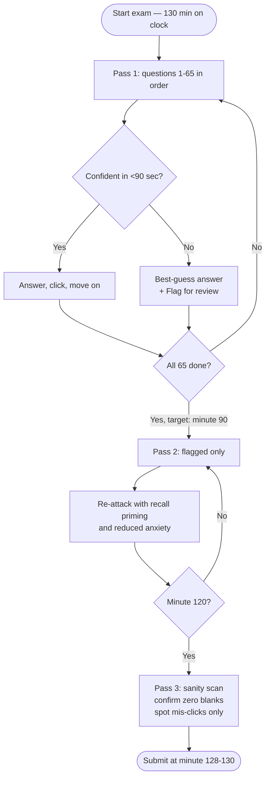
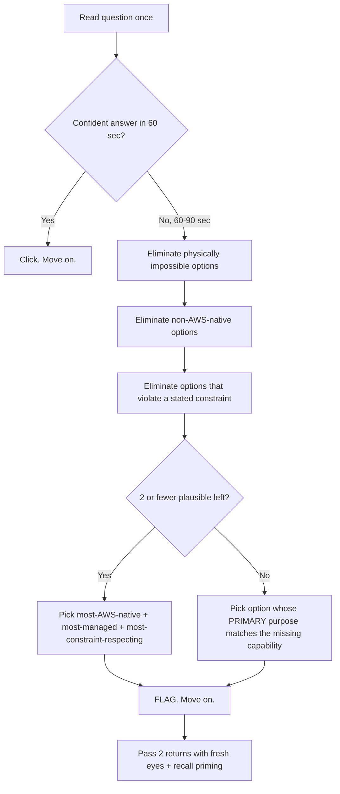
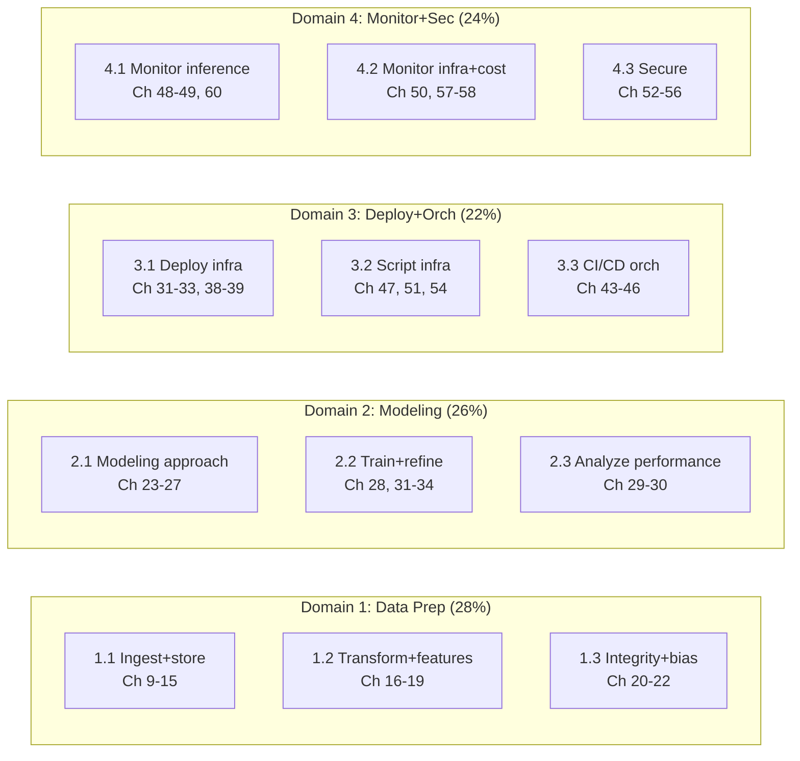

# Chapter 64 — Exam-Day Strategy and Self-Assessment

> **Goal of this chapter:** to convert sixty-three chapters of curriculum into a passing scaled score on a single 130-minute exam. The book is done. The Lending-Club-style capstone of Chapters 62 and 63 walked you end-to-end from S3 ingest through Model Monitor in production. Now you have one job left, and that job is not "learn more material" — it is to prepare for the **130 minutes that prove you read the book**. This final chapter is the calibration and execution layer: how AWS structures the exam, how to pace it, how to recognise the five question archetypes, how to triage when you genuinely do not know, and how to walk into the testing room — or the OnVUE webcam frame at your kitchen table — without leaving any avoidable points on the table. Sixty-three chapters bought you the knowledge. This chapter buys you the points.

---

## 64.0 Why a strategy chapter is non-optional

If you skip this chapter, the most likely failure mode is this: you walk into the testing centre on a Saturday morning at 9 a.m. having read every chapter twice, having done every exercise, having drilled the most-confused-pairs table from Chapter 2 — and at minute 87 you find yourself on question 41, staring at a five-paragraph case study about a healthcare ML team trying to choose between SageMaker Pipelines and Step Functions, with two sub-questions left and 43 minutes on the clock. You realise you have eaten too much time on the early questions because you did not commit to a three-pass strategy, and the panic of being behind on the clock makes you re-read the next four questions twice each, and now you are out of time on the last six questions and you guess them. You fail by 25 scaled points. The 25 points were not knowledge — they were *time management* and *anxiety control*, and they cost you another $150 and 14 days.

Knowledge is necessary but not sufficient on a high-stakes timed exam. Every year, hundreds of well-prepared MLA-C01 candidates fail by 10–30 scaled points not because they did not know the material but because they:

- ran out of time on questions worth no more than the easy ones,
- panicked over a single ordering question and lost four minutes they later wished they had,
- selected two correct answers and one wrong on a "Select THREE" multiple-response question and got **zero** credit instead of partial,
- prepared deeply for topics that are **explicitly out of scope** in the published exam guide (greenfield solution architecture, novel algorithm design, quantization-impact analysis),
- over-studied SageMaker algorithm tuning (Domain 2, 26%) and under-studied the **46% of the exam** that is deployment + monitoring + security + cost (Domains 3 + 4 combined).

Treating the exam itself as a *system to be understood* is the cheapest win available before you ever click "Start Exam." That is the work of this chapter, in fifteen sections culminating in a 55-item self-assessment checklist mapped to all 12 task statements and back to the chapters of this book.

---

## 64.1 The shape of the exam (recap from Chapter 2)

From the official **AWS Certified Machine Learning Engineer – Associate Exam Guide** and the AWS certification page, verified May 2026:

| Property                  | Value                                                                    |
| ------------------------- | ------------------------------------------------------------------------ |
| Exam code                 | **MLA-C01**                                                              |
| Level                     | Associate                                                                |
| Total questions           | **65**                                                                   |
| Scored questions          | **50**                                                                   |
| Unscored (pre-test) items | **15** — research items, indistinguishable from scored ones              |
| Time                      | **130 minutes** (≈ 2 minutes per question, global budget)                |
| Score scale               | **100 – 1000** (scaled, not raw percentage)                              |
| Passing score             | **720** (not 700 — easy to misremember)                                  |
| Section minimums          | **None** — compensatory scoring across all 4 domains                     |
| Penalty for wrong         | None — unanswered counts as wrong                                        |
| Delivery                  | Pearson VUE testing centre **or** OnVUE online-proctored                 |
| Cost (USD)                | **$150**                                                                 |
| Languages                 | English, Japanese, Korean, Simplified Chinese                            |
| ESL extension             | +30 minutes for non-native speakers (request once, before scheduling)    |
| Validity                  | 3 years from pass date                                                   |

⚠️ **Exam alert — the passing score is 720, not 700.** Every cohort has at least one candidate who mis-remembers the cutoff, gets a 712, and walks out thinking they passed by 12 points. They did not. They failed by 8 points. The cutoff is exactly seven-hundred-and-twenty, on a 100-to-1000 scaled curve. Internalise the number.

**Why these numbers matter for strategy.** The 2-minute-per-question average is *not* a per-question budget — it is a global budget across a non-uniform distribution:

- About **40 questions** are short MCQ scenarios you can answer in 45–90 seconds.
- About **15 questions** are 2–3 minute MRQ or multi-step decision-tree questions.
- About **5–10 question slots** are case-study clusters with 100–300 word scenarios and 2–3 sub-questions each — those routinely take **4–7 minutes per cluster**.

The 720/1000 cutoff translates *approximately* (AWS does not publish the curve) to **~75–80% raw correct** on the 50 scored items. The 15 unscored items are indistinguishable from scored ones; you must answer them all anyway because you cannot tell which is which.

The **compensatory scoring** clause is the single most important policy detail: there is no per-domain minimum. A strong Domain 1 (Data Prep, 28%) and Domain 2 (Modeling, 26%) can compensate for a shaky Domain 4 (Monitoring + Security + Cost, 24%) as long as the **total** scaled score clears 720. This rewards breadth-with-strength over patching the single weakest link to the same depth as your strongest.

The five question types defined by the **AWS Certification: Addition of new exam question types** announcement (Nov 2024) are:

1. **Multiple Choice (MCQ)** — 1 stem, 4 options, 1 correct, all-or-nothing.
2. **Multiple Response (MRQ)** — 1 stem, 5+ options, 2 or more correct (count stated in stem as "Select TWO" or "Select THREE"), all-or-nothing on the count.
3. **Ordering** — 3–5 items in scrambled order, drag/click into correct sequence, all-or-nothing.
4. **Matching** — 3–7 prompts paired to a response list, all-or-nothing per question.
5. **Case Study** — 1 scenario (100–300 words) followed by 2–3 sub-questions, each sub-question scored independently (**the only format where partial credit exists at the question level**).

Internalise that last detail before any other: a case-study scenario is **not** a high-risk single question. It is 2–3 scored items where missing one does not zero the cluster. That changes how you pace them.

---

## 64.2 Three-pass pacing strategy

The single highest-yield tactic from Chapter 2 (§2.6) bears restating because most candidates do not internalise it until their second sit. The MLA-C01 is *built* for a three-pass strategy. Trying to single-pass it — read each question once, answer it definitively, never come back — is the most common reason well-prepared candidates fail.



### 64.2.1 Pass 1 — skip-flag-answer (target: 90 minutes for 65 questions, ≈ 80 sec/Q average)

Walk through all 65 in the order presented. For each question:

- If you can answer it confidently in **under 90 seconds**, do so. Click. Move on. Do not flag — flagging is for uncertainty.
- If you cannot, **commit to a best-guess answer first**, then click the "Flag for review" checkbox at the top of the question. *Never* leave a question blank, even on the first pass — you might run out of time and a flagged-answered question scores while a flagged-blank one does not.
- If a question is taking longer than 2 minutes, stop. Best-guess, flag, move on. The 2-minute rule is non-negotiable on Pass 1.

The goal of Pass 1 is to lock in your easy points before fatigue and time pressure degrade your judgment. A well-prepared candidate clears 35–45 of 65 questions confidently on Pass 1. The remaining 20–30 are flagged for Pass 2.

### 64.2.2 Pass 2 — flagged review (target: 30 minutes on flagged items)

Open the review screen, filter to **Flagged**, work through them one at a time. You now have 1.5–3 minutes per flagged question and the benefit of two effects:

- **Recall priming.** A question 50 spots later may have triggered recall on a concept you needed at question 12. The exam itself becomes a memory aid.
- **Reduced anxiety.** Knowing you have already answered every question (with a best guess at minimum) reduces panic and unlocks clearer reading.

Re-read the stem *slowly* with the qualifier-word lens from §64.4 ("least operational overhead," "lowest cost," "real-time," "fully managed"). For multi-response questions, count your selections against the stem — "Select TWO" → exactly two highlighted, neither one nor three.

### 64.2.3 Pass 3 — sanity pass (last 5–10 minutes)

Open the review screen, filter to **All**, and scroll-scan. The goal of Pass 3 is **not** to re-think questions you confidently answered on Pass 1 — that is one of the most common ways well-prepared candidates lose points. The goal is:

1. Confirm every question has an answer (no accidental blanks).
2. Sanity-check the *very long* case-study questions one more time — the kind where you might have mis-clicked a sub-question.
3. Spot any obviously-mis-answered question (e.g., you picked "real-time endpoint" on a question whose stem says "overnight batch of 10M records" — the kind of careless click that catches everyone occasionally under time pressure).

Then **stop**. Submit. Trust your work. The clock-second-guessing trap of minute 125 is real and is documented in the cognitive-biases section below (§64.10.5).

### 64.2.4 Hard time-guards

| Wall-clock minute | You should be on... | If behind                                              |
| ----------------: | ------------------- | ------------------------------------------------------ |
| 30                | Question 20 or later| Speed up; accept more uncertainty; flag more aggressively |
| 65 (halfway)      | Question 35 or later| Major speed-up; cap any question at 90 sec on Pass 1   |
| 90 (Pass 1 done)  | All 65 attempted    | Stop deep-thinking on remainder; rush to completion    |
| 110               | Pass 2 wrapping up  | Begin Pass 3 sanity scan                               |
| 120               | Pass 3 begun        | Last 10 min are sanity, **not** for changing answers   |

The discipline of these guards is what separates first-time passers from second-time passers. Every cohort sees the same pattern: the candidates who internalise the three-pass cadence pass on attempt one; the candidates who treat every question as a "must answer right now or I will fail" event burn out by question 50.

---

## 64.3 Per-question time budgeting by question type

Time budgets vary substantially with question type. Internalise these targets — they are the difference between finishing comfortably and panicking at minute 110:

| Question type                                    | Pass-1 target | Pass-2 ceiling | Notes                                                            |
| ------------------------------------------------ | ------------: | -------------: | ---------------------------------------------------------------- |
| MCQ short scenario (1 stem, 4 options, 1 right)  |    45–75 sec  |       2 min    | The bulk of the exam. Bank time here.                            |
| MCQ comparison (A vs B mentioned in stem)        |    60–90 sec  |       2 min    | Recognise the pair, recall the differentiator.                   |
| MRQ multi-select (Select TWO / Select THREE)     |    90–120 sec |       3 min    | All-or-nothing scoring → read carefully, count selections.       |
| Ordering (3–6 items)                             |    90–150 sec |     2.5 min    | Anchor first + last step, middle resolves.                       |
| Matching (3–7 pairs)                             |    90–150 sec |     2.5 min    | Start with most certain pair, eliminate from response list.      |
| Case study (1 scenario + 2-3 sub-questions)      |    4–6 min    |       7 min    | Read scenario *once*; partial credit *across* sub-questions.     |

**Calibration stretch.** If you have written real SageMaker / Glue / IAM JSON on a daily basis, your MCQ pace will be closer to the 45-second floor. If you are leaning entirely on book-and-practice study, expect closer to the 90-second ceiling. Practice exams under timed conditions are the only reliable calibration. Cold-start practice-bank performance and exam-day performance differ by roughly 5–10 scaled points for well-prepared candidates — a 75% practice score typically yields an 80–85% real score because of the recall-priming effect noted in §64.2.2 above.

---

## 64.4 The five question archetypes — tactical playbook

From Chapter 2 (§2.5), the MLA-C01 questions cluster into five recognisable archetypes. Each rewards a specific tactical approach beyond just reading carefully. Recognising the archetype in the first 5 seconds of reading the stem cuts your per-question time by 20–30%.

### 64.4.1 Archetype 1 — Decision tree ("which service?")

**Shape.** A scenario describes constraints (latency, throughput, traffic shape, budget, compliance). Four answers are all valid AWS services. One is best for *these constraints*.

**Tactical approach.** Underline the **qualifier word(s)** in the stem mentally. Eliminate any answer that violates a constraint. The qualifier vocabulary that drives elimination:

| Qualifier in stem                     | Favours                                                              | Rules out                                                                   |
| ------------------------------------- | -------------------------------------------------------------------- | --------------------------------------------------------------------------- |
| "least operational overhead"          | Fully-managed (Bedrock, SageMaker JumpStart, serverless endpoints)   | EC2 / EKS / self-managed Kubernetes / build-it-yourself                     |
| "most cost-effective"                 | Spot, serverless, batch, async, Savings Plans, right-sized instances | Always-on real-time on oversized instances; on-demand for predictable load  |
| "lowest latency"                      | Real-time endpoint + provisioned + same-region + provisioned concurrency | Serverless cold starts; cross-region invocations                            |
| "minimum code changes"                | Managed APIs (Comprehend, Translate, Rekognition, Bedrock)           | Custom SageMaker training; self-coded inference                             |
| "fully managed"                       | SageMaker AI; AI services; Bedrock                                   | EC2-based anything; EKS/ECS self-managed clusters                           |
| "within the existing VPC"             | VPC endpoints (interface/gateway); VPC-mode SageMaker                | Public-internet endpoints; default-VPC services                             |
| "meets HIPAA / PCI / FedRAMP"         | Compliance-eligible services with proper KMS + CloudTrail audit      | Services not on the in-scope compliance list                                |
| "near real-time"                      | Streaming + small-window batch (Kinesis, Flink, async endpoint)      | "Real-time" interpreted literally (sub-50ms requirement)                    |
| "audit trail" / "compliance log"      | CloudTrail; data events; KMS key audit                               | CloudWatch alone (CloudWatch ≠ CloudTrail)                                  |
| "version-pin dataset → model"         | SageMaker **Model Registry** + Lineage                               | Generic S3 versioning; Glue Data Catalog versions                           |

### 64.4.2 Archetype 2 — Comparison (A vs B)

**Shape.** Two AWS options that solve the same general problem are pitted against each other. The differentiator is usually one of: cost, latency, throughput, payload size, request duration, team workflow, or integration surface.

**Tactical approach.** The §64.6 most-confused-pairs table is the highest-yield drill for this archetype — the table is essentially the answer key for every Comparison archetype question.

### 64.4.3 Archetype 3 — Architecture completion

**Shape.** A multi-step ML pipeline is described, with one step left as `[?]`. The candidate picks the service or pattern that fills the gap.

**Tactical approach.** Identify the *missing capability* (lineage? bias detection? drift detection? feature reuse?). Pick the AWS service whose **primary purpose** matches that capability. Beware "partially right" answers — e.g., S3 object versioning *can* version-pin a dataset but is not the *primary* lineage tool; Model Registry + Lineage is.

### 64.4.4 Archetype 4 — Trap distractor (3 plausible + 1 best)

**Shape.** All four answers would technically work. One is best under the stated constraint. The other three each violate exactly one constraint — usually cost, latency, operational overhead, or security.

**Tactical approach.** Walk each option against the constraint qualifier in §64.4.1. If three answers all "work" but only one is fully-managed and the stem says "least operational overhead," the answer is the fully-managed one — even if the other three look better in isolation. The exam writers are not asking which option *could* solve the problem; they are asking which option *best* solves it under the stated constraint.

### 64.4.5 Archetype 5 — Case study (scenario + sub-questions)

**Shape.** One 100–300 word scenario followed by 2–3 sub-questions, each scored independently. Sub-questions can be any of archetypes 1–4.

**Tactical approach.** Read the scenario *once* slowly, taking mental note of:

- Compliance constraints (HIPAA, PCI, residency)
- Latency targets (sub-100ms, near real-time, overnight)
- Cost constraints (budget cap, "intermittent traffic")
- Team skill ("the team is unfamiliar with Kubernetes," "the team already runs Airflow")
- Existing infrastructure ("data already in S3 in Parquet")

Then attack the sub-questions in order. **Do not re-read the full scenario for each sub-Q** unless a sub-Q references a detail you missed. The 100–300 word scenario is the most expensive thing to re-read on the exam, and partial credit *across* sub-questions means a missed sub-Q is not the disaster it would be in a single-question format.

---

## 64.5 The SageMaker Trap — over-studying training, under-studying ops

The single most predictable failure mode for first-time MLA-C01 candidates is the **SageMaker Trap**: spending 60% of study time on Domain 2 (Model Development — algorithms, HPO, AMT, training fundamentals) and 15% on Domains 3 + 4 (Deployment, Orchestration, Monitoring, Security, Cost) combined. The exam's weights tell the opposite story:

```
Domain 1  Data Prep:                   28%
Domain 2  Modeling:                    26%
Domain 3  Deployment / Orchestration:  22%
Domain 4  Monitoring / Security / Cost: 24%

Operationalisation (Domains 3 + 4):    46%  ← nearly half the exam
Modeling (Domain 2 alone):             26%  ← far less than felt intuition
```

If a candidate masters Domain 2 to 95% but is at 50% on Domains 3 + 4, the math is:

- 26 × 0.95 + 28 × 0.75 + (22 + 24) × 0.50 = 24.7 + 21.0 + 23.0 = **68.7% raw** → fails.

Conversely, mastering Domains 3 + 4 to 85% and accepting 70% on Domains 1 + 2 yields:

- (28 + 26) × 0.70 + (22 + 24) × 0.85 = 37.8 + 39.1 = **76.9% raw** → passes comfortably.

⚠️ **Exam alert — the SageMaker Trap.** Operationalisation knowledge is worth more on this exam than model-training depth. This is the conceptual centre-of-gravity shift from MLS-C01 (the retiring Specialty exam, written for data scientists) to MLA-C01 (the current Associate, written for ML engineers / MLOps engineers). If you are coming from MLS-C01 study material, **rebalance**. The hyperparameter math you spent three weekends on is one or two questions; the endpoint-selection decision tree is five to seven.

**Practical implication for the last week before the exam.** If you have not nailed:

- The endpoint-selection decision tree (real-time vs serverless vs async vs batch — see Ch 31, 32, 33),
- Model Monitor's four monitor types (data quality / model quality / bias drift / feature attribution drift — see Ch 48),
- The SageMaker Pipelines step types and EventBridge triggers (see Ch 43, 45),
- The CodePipeline + CodeBuild + CodeDeploy split (see Ch 46),
- IAM least-privilege patterns for SageMaker execution roles (see Ch 53),
- VPC config for SageMaker endpoints — interface vs gateway endpoints (see Ch 54),

— **stop drilling algorithms and drill those instead.** Every hour spent on Domains 3+4 in the final week is worth roughly 1.8× an hour spent on Domain 2.

---

## 64.6 The 35+ most-confused service pairs (the highest-yield drill list)

This is the single highest-yield review asset in this entire chapter. Every pair below shows up at least once in a typical MLA-C01 form. **Be able to articulate the differentiator from memory in under 15 seconds for each.** If you can do that for all 35+ pairs, you have closed the largest single category of avoidable losses on the exam.

### Orchestration & pipelines

| Pair                                                   | The differentiator                                                                       |
| ------------------------------------------------------ | ---------------------------------------------------------------------------------------- |
| **SageMaker Pipelines** vs **Step Functions**          | Pipelines is ML-native (auto-lineage, MLflow-like tracking, Model Registry integration); Step Functions is general-purpose orchestration with broader service integration. *(Ch 43, 44)* |
| **SageMaker Pipelines** vs **MWAA (Airflow)**          | Pipelines for AWS-native ML; MWAA when the org already runs Airflow, or for non-ML upstream/downstream steps. *(Ch 43, 44)* |
| **MWAA** vs **Step Functions**                         | MWAA = code-first Python DAGs, Airflow ecosystem; Step Functions = JSON state machines, deep AWS service catalog. *(Ch 44)* |
| **EventBridge Scheduler** vs **CloudWatch Events**     | Scheduler is the new dedicated service (one-time + recurring with timezones); CloudWatch Events is the legacy umbrella, kept alive but feature-frozen. *(Ch 45)* |
| **CodePipeline + CodeBuild + CodeDeploy**              | Pipeline = orchestrator (stages, transitions); Build = compile/test/package (BuildSpec); Deploy = blue/green or canary rollout. *(Ch 46)* |

### Inference endpoints

| Pair                                            | The differentiator                                                                                                  |
| ----------------------------------------------- | ------------------------------------------------------------------------------------------------------------------- |
| **Real-time** vs **Serverless**                 | Steady-state traffic + sub-second latency → real-time. Bursty / intermittent traffic + cold-start OK → serverless.  *(Ch 31, 32)* |
| **Real-time** vs **Async**                      | Request duration ≤ 60 sec AND payload ≤ 6 MB → real-time. Long-running (≤ 1 hour) OR large payload (≤ 1 GB) → async. *(Ch 31, 33)* |
| **Serverless** vs **Async**                     | Serverless = short-running + cold-start-tolerant; Async = long-running, S3-pull / S3-push, queue-based.  *(Ch 32, 33)* |
| **Async** vs **Batch Transform**                | Async scores one-by-one as records arrive (queue); Batch scores a whole dataset in one job, no persistent endpoint. *(Ch 33)* |
| **MME (Multi-Model Endpoint)** vs **MCE (Multi-Container Endpoint)** | MME: many models *same framework + container*, loaded from S3 on demand. MCE: up to 15 *different containers/frameworks* on one endpoint, addressable directly or chained. *(Ch 38)* |
| **Inference Components (IC)** vs **MME**        | IC: per-model scaling, isolated, GPU sharing across components on one endpoint. MME: model-cache eviction, lighter footprint, no per-model scaling. *(Ch 38)* |

### Data & feature tooling

| Pair                                                                     | The differentiator                                                                              |
| ------------------------------------------------------------------------ | ----------------------------------------------------------------------------------------------- |
| **Glue DataBrew** vs **Data Wrangler**                                    | DataBrew = visual data cleaning, business-analyst persona, recipe-based. Data Wrangler = SageMaker ML feature engineering, data-scientist persona, generates training code. *(Ch 17, 18)* |
| **Glue ETL** vs **Glue DataBrew**                                         | ETL = code-first PySpark / Glue Studio for scale ETL. DataBrew = 250+ point-and-click transforms. *(Ch 16, 17)* |
| **Data Wrangler** vs **Feature Store**                                    | Wrangler = transformation tooling. Feature Store = the *destination* for engineered features (online + offline). *(Ch 18, 19)* |
| **Feature Store online** vs **offline**                                   | Online = DynamoDB-backed, sub-10ms read for real-time inference. Offline = S3 + Glue Catalog, point-in-time-correct for training. *(Ch 19)* |
| **Ground Truth** vs **Ground Truth Plus** vs **Mechanical Turk**          | Ground Truth = labeling jobs with workforces. Plus = AWS-managed labeling service. Mechanical Turk = pure crowdsourced workforce that GT can plug into. *(Ch 20)* |

### Model & metadata management

| Pair                                                            | The differentiator                                                                          |
| --------------------------------------------------------------- | ------------------------------------------------------------------------------------------- |
| **Model Registry** vs **Model Cards** vs **Lineage Tracking**   | Registry = versioning + approval workflow. Cards = governance/risk documentation. Lineage = automatic graph of dataset → step → model artefact for audits. *(Ch 28)* |
| **Clarify pre-training bias** vs **post-training bias**         | Pre-training = on the training data (CI, DPL). Post-training = on predictions (DPPL, DI, FT, etc.). *(Ch 21, 29)* |
| **Clarify bias detection** vs **Model Monitor bias drift**      | Clarify = point-in-time analysis (training, evaluation). Model Monitor = scheduled re-analysis on production traffic for drift over time. *(Ch 29, 48)* |
| **Model Monitor data-quality** vs **model-quality**             | Data quality = feature distributions drifted. Model quality = ground-truth labels arrived and the prediction accuracy drifted. *(Ch 48)* |

### Training & HPO

| Pair                                                | The differentiator                                                                                   |
| --------------------------------------------------- | ---------------------------------------------------------------------------------------------------- |
| **SageMaker built-in algos** vs **JumpStart** vs **Bedrock** | Built-in = AWS-trained algos (XGBoost, Linear Learner, etc.) you bring data to. JumpStart = pre-trained models you fine-tune. Bedrock = managed API to foundation models, no training infrastructure. *(Ch 23, 26)* |
| **AMT random search** vs **Bayesian** vs **Hyperband**       | Random = embarrassingly parallel, no info reuse. Bayesian = surrogate model + acquisition fn, lower trial count. Hyperband = early-stop bad trials, good for deep nets. *(Ch 31)* |
| **Spot training** vs **On-Demand** vs **Reserved**           | Spot = up to 90% off, interruption-tolerant (checkpoint!), longest training. On-Demand = no interruption, full price. Reserved = 1/3 yr commitment, predictable workloads. *(Ch 33)* |
| **SageMaker Savings Plans** vs **Compute Savings Plans**     | SageMaker SP = SageMaker-only; Compute SP = EC2/Lambda/Fargate (does *not* cover SageMaker). *(Ch 34, 57)* |

### Deployment strategies

| Pair                                          | The differentiator                                                                                |
| --------------------------------------------- | ------------------------------------------------------------------------------------------------- |
| **Blue/Green** vs **Canary** vs **Linear**    | Blue/Green = 0→100% in one cutover (CodeDeploy). Canary = small % first, then 100%. Linear = stepped percentages over time. *(Ch 46)* |
| **Shadow variant** vs **A/B variant**         | Shadow = receives copy of traffic, response is discarded (offline comparison). A/B = receives a portion of *real* traffic with response served to users. *(Ch 30, 60)* |
| **Production variant** vs **Shadow variant** vs **Inference Component** | Production variant = real traffic split. Shadow = comparison-only. IC = isolated, scalable, multi-model on one endpoint. *(Ch 30, 38)* |

### Security & networking

| Pair                                          | The differentiator                                                                                |
| --------------------------------------------- | ------------------------------------------------------------------------------------------------- |
| **IAM role** vs **bucket policy** vs **resource policy** | Role = identity-based, attached to a principal. Bucket policy = resource-based, attached to S3 bucket. Resource policy = generalisation across many services. *(Ch 53)* |
| **VPC Interface endpoint** vs **Gateway endpoint** | Gateway = S3 and DynamoDB only, route-table-based, free. Interface = ENI in subnet, billed per hour + GB, most other services. *(Ch 54)* |
| **KMS CMK** vs **AWS-owned key** vs **AWS-managed key** | Customer CMK = full control, key policy, rotation choice. AWS-managed = auto-managed per service. AWS-owned = AWS-account-internal, you cannot see it. *(Ch 55)* |
| **CloudTrail data events** vs **management events** | Management = control-plane (Create/Delete API calls). Data = data-plane (S3 GetObject, Lambda Invoke) — opt-in, billed per event. *(Ch 50)* |

### Monitoring & observability

| Pair                                            | The differentiator                                                                                                   |
| ----------------------------------------------- | -------------------------------------------------------------------------------------------------------------------- |
| **CloudWatch Logs** vs **CloudWatch Logs Insights** | Logs = the storage. Insights = the query language over the storage. *(Ch 50)* |
| **CloudWatch Metrics** vs **CloudWatch Alarms**     | Metrics = the timeseries data. Alarms = thresholding + notification + auto-scaling triggers on metrics. *(Ch 50)* |
| **CloudWatch** vs **CloudTrail**                    | CloudWatch = "what is the system doing now?" (metrics, logs, traces). CloudTrail = "who did what and when?" (API audit log). *(Ch 50)* |
| **X-Ray** vs **CloudWatch Logs Insights**           | X-Ray = distributed traces, latency breakdowns across services. Insights = log-line queries within CloudWatch. *(Ch 50)* |

### Cost & optimisation

| Pair                                                | The differentiator                                                                                  |
| --------------------------------------------------- | --------------------------------------------------------------------------------------------------- |
| **Cost Explorer** vs **AWS Budgets** vs **Trusted Advisor** | Cost Explorer = retrospective analysis + forecasting. Budgets = proactive alerts when projected spend exceeds a threshold. Trusted Advisor = automated best-practice checks across cost/security/perf. *(Ch 57, 58)* |
| **Compute Optimizer** vs **Inference Recommender** vs **Trusted Advisor right-sizing** | Compute Optimizer = EC2 / EBS / Lambda right-sizing. Inference Recommender = SageMaker endpoint instance type + count. Trusted Advisor = high-level under-utilisation checks. *(Ch 58)* |

If you can speak the differentiator for all 35+ of these pairs in under 15 seconds each, you have closed the largest single category of avoidable losses on the exam. Print this section. Take it to a café. Drill it. The yield per hour is unmatched.

---

## 64.7 Type-specific tactics for each question format

The exam guide promises five question formats. Each rewards a specific tactical approach beyond reading carefully.

### 64.7.1 Multiple Choice (MCQ) — the workhorse

- **Anatomy.** 1 stem, 4 options, 1 correct.
- **Scoring.** All-or-nothing.
- **Tactic.** Read the stem *twice*, eliminate by constraint, pick the best of remaining. If all four are plausible, look for the qualifier word that differentiates (§64.4.1). The AWS distractors are designed to look right at a glance; the *best* answer is right against the stated constraints.

### 64.7.2 Multiple Response (MRQ) — "Select TWO" or "Select THREE"

- **Anatomy.** 1 stem, 5+ options, 2 or more correct. The stem **always** states the count: "Select TWO" or "Select THREE."
- **Scoring.** All-or-nothing per question. AWS does not publish partial credit at the Associate level — treat MRQ as binary.

⚠️ **Exam alert — MRQ is all-or-nothing.** Two correct + one wrong on a three-required question = **zero credit**. Not partial credit. Not 67%. Zero. The count in the stem ("Select THREE") is therefore a *hard constraint*, not a hint. Count your highlighted options before you click Next. Every cohort has multiple candidates who select two on a Select-THREE and walk out thinking they got 67% of three questions; they got 0.

- **Tactic.**
  1. The count is a constraint, not a hint — if you select more or fewer than asked, you cannot win.
  2. Identify the **most confident** correct answer first; lock it in.
  3. Eliminate any answer that *contradicts* a constraint in the stem.
  4. From the remainder, pick the next most confident.
  5. If you can only identify one of two requested, guess from the eliminated-but-plausible pile rather than leaving an empty slot (an empty slot is automatically wrong; a guess has > 0% chance).
- **Pattern signal.** On MLA-C01, MRQ stems often pair *complementary* services: "Which TWO services would you use to set up..." → expect one capability per service (e.g., CloudTrail for API audit + KMS for encryption-at-rest together cover one compliance bullet each).

### 64.7.3 Ordering — arrange 3–6 items in correct sequence

- **Anatomy.** A stem describing a procedure or workflow. 3–6 items in scrambled order; drag/click to reorder.
- **Scoring.** All-or-nothing — every step in correct position to score.
- **Tactic.**
  1. **Eliminate impossible orders first.** Some steps are logically inseparable (you cannot deploy a model before training it; you cannot register a model version before creating the model package). Lock those.
  2. **Anchor the first and last steps.** First step is usually the one with no dependencies (data source / IAM role / source repo). Last step is usually the user-facing or downstream-callable outcome (endpoint live / dashboard published / alert triggered).
  3. **Resolve the middle once endpoints are fixed.** With first and last anchored, the middle is usually a 3-4-item permutation that resolves by data flow.
- **Common ordering topics on MLA-C01.**
  - Steps to construct and execute a SageMaker Pipeline (Define steps → Compile → Upsert → Start execution → Monitor).
  - Steps to deploy with CodePipeline + CodeDeploy blue/green to a SageMaker endpoint.
  - Steps to set up Model Monitor scheduled monitoring (Capture → Baseline → Schedule → Inspect violations).
  - Steps to set up Feature Store ingestion → online publish → real-time inference lookup.
  - IAM trust policy setup for cross-account SageMaker access.

### 64.7.4 Matching — 3–7 prompts ↔ responses

- **Anatomy.** A list of prompts (left), a list of responses (right). Match via dropdown.
- **Scoring.** All-or-nothing — every prompt must be correctly matched.
- **Important caveat.** Responses may be used once, multiple times, or not at all. *Read the instructions for each matching question* — the rule varies.
- **Tactic.**
  1. **Start with the most certain pair.** If a prompt has exactly one obvious response, lock it in first.
  2. **Eliminate.** Cross off the matched response from the list of remaining options (when the instructions say "once").
  3. **Disambiguate.** For the remaining responses that could fit multiple prompts, look for the *primary purpose* match — the response whose canonical use is the prompt's scenario.
- **Common matching topics on MLA-C01.**
  - Match each SageMaker deployment option (real-time / serverless / async / batch) to its latency-throughput profile.
  - Match each AI service (Comprehend / Translate / Rekognition / Transcribe / Bedrock) to a business use case.
  - Match each instance family (P4, G5, M5, C5, R5, Inf2, Trn1) to a workload type (training, GPU inference, CPU inference, RAM-bound preprocessing).
  - Match each Model Monitor type (data quality / model quality / bias / feature attribution) to the symptom it detects.
  - Match each IAM concept (role / policy / group / federated identity) to its purpose.

### 64.7.5 Case study — 1 scenario + 2–3 sub-questions

- **Anatomy.** A 100–300 word scenario describing a customer environment, followed by 2–3 sub-questions that reference back. Each sub-question may be any of the four prior types.
- **Scoring.** **Each sub-question scored independently.** This is the *only* question format on the MLA-C01 where partial credit exists at the exam level.
- **Tactic.**
  1. Read the scenario *once*, slowly. Note key constraints (compliance, latency, cost, team skill, existing infra) — mentally or on the on-screen whiteboard.
  2. Move through sub-questions in order. Each sub-Q is fully scored on its own.
  3. **Do not re-read the full scenario for each sub-Q.** Only re-read if a sub-Q references a detail you cannot recall.
  4. If sub-Q 1 stumps you, take your best guess, flag, **move on to sub-Q 2** — partial credit means sub-Q 2 and 3 are still yours to win.

A panicking candidate burns 6 minutes re-reading the scenario four times for three sub-questions. A calm candidate reads once for 90 seconds, then spends ~2 minutes per sub-Q referring back only when needed. The calm pace saves ~3 minutes per case-study cluster — and there are typically 3–5 clusters on a form.

---

## 64.8 Wrong-answer triage protocol

Even well-prepared candidates encounter 3–8 questions per exam where they have no confident answer. The triage protocol below is the difference between losing those points and recovering ~50% of them via informed guessing.



### 64.8.1 The four elimination heuristics, in order

1. **Eliminate physically impossible options.** An async-inference answer on a question whose stem says "synchronous request-response under 100 ms" is physically impossible — async is a queue. Cross it out.
2. **Eliminate non-AWS-native options first** (rare on MLA-C01, but appears for tools like Apache Airflow + Kafka). The exam is testing AWS, so the AWS-native equivalent is usually the answer unless the stem explicitly says "the team already runs Airflow." If the stem says nothing about team familiarity, default to the AWS-native option.
3. **Eliminate options that violate a stated constraint.** "Least operational overhead" rules out anything self-managed; "lowest cost" rules out always-on real-time on a large instance; "within the VPC" rules out public-internet endpoints; "fully managed" rules out EC2-based anything.
4. **Eliminate options that solve a *different* problem.** A question about *bias drift in production* should not be answered with "Clarify pre-training bias detection" — Clarify *can* check production bias, but the *primary purpose* mapping is Model Monitor bias drift for ongoing detection.

### 64.8.2 The "most-AWS-native" tiebreaker

When two answers are genuinely close, prefer:

- A **SageMaker** service over a generic AWS service (Pipelines > Step Functions for ML-specific orchestration).
- A **purpose-built ML service** over a custom build (Bedrock + Knowledge Bases > self-built RAG on EC2).
- An **ML-specific monitoring service** over a generic one (Model Monitor > generic CloudWatch alarm for drift detection — though CloudWatch is the right answer for endpoint-latency monitoring).

The exception: when the stem explicitly says "the team is comfortable with X and unfamiliar with Y," respect the team-skill constraint and pick X.

---

## 64.9 Five cognitive biases on the exam and how to defend against them

Five biases reliably degrade performance even for prepared candidates. Pre-empting them is a form of preparation.

### 64.9.1 Confirmation bias

You read the first option and it "looks right." You then read options 2–4 looking for *reasons to reject* them rather than reading each fresh. The trap: you confirm option A even when option C is better.

**Defence.** Read all four options *before* picking. On each, ask "what constraint does this best satisfy?" Then compare against the stem's qualifiers.

### 64.9.2 Anchoring

The first number in the stem (e.g., "10 million records per day") becomes a mental anchor that biases your interpretation of subsequent constraints. You may pick "batch transform" because of the volume even when the latency requirement actually rules it out.

**Defence.** Scan the *whole stem* for constraint words before settling on any single number. List the constraints mentally in priority order (compliance > latency > cost > team skill).

### 64.9.3 Recency bias

The last topic you studied feels disproportionately likely to be the answer. If you spent the morning reviewing Bedrock, you over-pick Bedrock on questions where SageMaker JumpStart is the better answer.

**Defence.** Trust the stem, not your study sequence. If the constraint says "fine-tune a base model with our own labeled dataset using SageMaker tooling we already pay for," that is JumpStart, regardless of what you reviewed last.

### 64.9.4 Sunk-cost trap

You have spent 4 minutes on a hard question. Walking away feels like wasted effort. So you spend 2 more minutes. Then 2 more. You have now lost 8 minutes on one question that you still cannot answer.

**Defence.** The 2-minute rule. After 2 minutes on any single question, you owe yourself a best-guess-and-flag. The 4–6 questions later that you skipped during that 8-minute black hole would have been worth 5–8 raw points; the one question was worth 1.4%.

### 64.9.5 Availability / second-guessing fatigue

By minute 110, you are tired. You return to a question you confidently answered in minute 12 and start questioning your gut. Cert-community lore — borne out repeatedly across subreddits and post-exam debriefs — is: **your first instinct on a confidently-answered question is right ~85% of the time**. Switching on a hunch at minute 110 has a ~60% chance of being wrong.

**Defence.** Only change a Pass-1 answer if you have a *concrete new reason* — recalled a fact, noticed a constraint you missed, or worked out the math on the scratch pad. Vague unease is not a concrete reason.

---

## 64.10 The 55-item self-assessment checklist — mapped to all 12 task statements

If you can answer each of these questions cold, in your own words, in under 90 seconds, you are exam-ready. If you stumble on more than ~10 of the 55, the chapter mapping points you to the right curriculum chapter for re-review.



### Domain 1 — Data Preparation for ML (28%)

#### Task 1.1 — Ingest and store data

1. **What are the four primary data formats supported by SageMaker built-in algorithms, and when do you choose Parquet over CSV?** *(Ch 10)*
2. **Compare S3, EFS, and FSx for ONTAP for training data — name one scenario where each is the right answer.** *(Ch 11)*
3. **When ingesting streaming data, when do you choose Kinesis Data Streams vs Kinesis Firehose vs MSK?** *(Ch 12)*
4. **What is the read-throughput differentiator between EBS gp3 and EBS io2 for a training job pulling 2 TB of features?** *(Ch 11)*
5. **What is S3 Transfer Acceleration, and when does it pay off?** *(Ch 11)*

#### Task 1.2 — Transform data and feature engineering

6. **When do you use Data Wrangler vs Glue DataBrew vs Glue ETL?** *(Ch 16, 17, 18)*
7. **Name three SageMaker Feature Store concepts: online store, offline store, point-in-time correctness — explain each in one sentence.** *(Ch 19)*
8. **What is the most common encoding technique for high-cardinality categorical features in tree models, and why is OHE wasteful there?** *(Ch 18)*
9. **Define one-hot, label, binary, target encoding — pick the right one for an XGBoost training on a 500-category column.** *(Ch 18)*
10. **What does Ground Truth Plus do that Ground Truth alone does not?** *(Ch 20)*

#### Task 1.3 — Data integrity and prep

11. **Define pre-training bias metrics CI (class imbalance) and DPL (difference in proportions of labels). How does Clarify report them?** *(Ch 21)*
12. **Name three techniques to mitigate class imbalance and one situation where each is preferred.** *(Ch 21)*
13. **What is the difference between encryption-at-rest using SSE-S3 vs SSE-KMS vs SSE-C?** *(Ch 55)*
14. **Define PII, PHI, data residency — and explain why these constraints would rule out a particular region.** *(Ch 56)*
15. **What does Glue Data Quality do, and how does it integrate with a SageMaker Pipeline?** *(Ch 13)*

### Domain 2 — ML Model Development (26%)

#### Task 2.1 — Choose a modeling approach

16. **Match each AI service (Comprehend / Translate / Rekognition / Transcribe / Polly / Bedrock) to a one-line use case.** *(Ch 27)*
17. **When do you use a SageMaker built-in algorithm vs JumpStart vs Bedrock?** *(Ch 23, 26)*
18. **Name three SageMaker built-in algorithms and one canonical use case for each (XGBoost, Linear Learner, Object2Vec, BlazingText, etc.).** *(Ch 23)*
19. **Why does interpretability matter, and which AWS service helps explain a complex tree-ensemble model's predictions?** *(Ch 29)*

#### Task 2.2 — Train and refine models

20. **Define epoch, step, batch size — explain how they interact in a typical training run.** *(Ch 28)*
21. **Name three methods to reduce training time, and one tradeoff for each.** *(Ch 32)*
22. **Define L1 vs L2 regularisation, dropout, and weight decay. Which one zeros out features (feature selection)?** *(Ch 28)*
23. **Compare AMT random search vs Bayesian optimisation vs Hyperband — when is each best?** *(Ch 31)*
24. **What is the SageMaker Model Registry, and what does an "approval status" do?** *(Ch 28)*
25. **How does SageMaker AI script mode work, and how is it different from script-mode-with-BYO-container (BYOC)?** *(Ch 24, 25)*

#### Task 2.3 — Analyze model performance

26. **Define precision, recall, F1, AUC, RMSE — when is each metric misleading?** *(Ch 29)*
27. **What does SageMaker Clarify produce as a "model explainability report," and how is it structured?** *(Ch 29)*
28. **What is SageMaker Model Debugger, and which kinds of convergence issues does it detect (e.g., vanishing gradients)?** *(Ch 30)*
29. **How do you compare a shadow variant to a production variant in SageMaker?** *(Ch 30, 60)*

### Domain 3 — Deployment and Orchestration (22%)

#### Task 3.1 — Select deployment infrastructure

30. **Without looking, write the decision tree: real-time vs serverless vs async vs batch transform. What are the request-duration and payload-size limits for each?** *(Ch 31, 32, 33)*
31. **What is a Multi-Model Endpoint (MME), and when do you use it vs a Multi-Container Endpoint (MCE)?** *(Ch 38)*
32. **What is an Inference Component (IC), and why does it improve GPU sharing?** *(Ch 38)*
33. **When do you use SageMaker Neo? What kinds of edge devices is it for?** *(Ch 39)*
34. **Compare CPU vs GPU vs Inferentia (Inf2) vs Trainium (Trn1) instance families. Which for training, which for inference, which for both?** *(Ch 33)*

#### Task 3.2 — Create and script infrastructure

35. **Compare CloudFormation vs CDK — when do you choose each?** *(Ch 47)*
36. **How do you configure auto-scaling on a SageMaker endpoint, and what target metrics make sense (model latency, CPU utilisation, invocations-per-instance)?** *(Ch 51)*
37. **How do you put a SageMaker endpoint inside a VPC? What VPC endpoints do you need for the SDK and for ECR pull?** *(Ch 54)*
38. **What is the difference between an on-demand and a provisioned-concurrency Lambda — and why does it matter for the Lambda-in-front-of-SageMaker pattern?** *(Ch 51)*

#### Task 3.3 — Automated orchestration & CI/CD

39. **Walk through a SageMaker Pipeline with a Preprocessing step + Training step + Conditional step + Registry step. What does each step type produce?** *(Ch 43)*
40. **Compare CodePipeline vs CodeBuild vs CodeDeploy — what does each do, and how do they connect?** *(Ch 46)*
41. **What is blue/green vs canary vs linear deployment? Which has the fastest rollback?** *(Ch 46)*
42. **What is the difference between an EventBridge schedule rule and an EventBridge event-pattern rule for triggering retraining?** *(Ch 45)*
43. **How do you trigger SageMaker Pipeline execution on a data-arrival event in S3?** *(Ch 45)*

### Domain 4 — Monitoring, Maintenance, Security (24%)

#### Task 4.1 — Monitor model inference

44. **Name the four Model Monitor types (data quality / model quality / bias drift / feature attribution drift). What does each detect?** *(Ch 48)*
45. **What does a Model Monitor baseline contain, and how is it generated?** *(Ch 48)*
46. **What is concept drift vs data drift, and which Model Monitor type catches which?** *(Ch 49)*
47. **How do you set up A/B testing between two model versions on a single SageMaker endpoint?** *(Ch 60)*

#### Task 4.2 — Monitor and optimise infra + cost

48. **Compare CloudWatch Logs Insights vs X-Ray vs CloudTrail. What is each one's primary purpose?** *(Ch 50)*
49. **How does SageMaker Inference Recommender choose an instance type? What metric is the recommendation optimising?** *(Ch 58)*
50. **What is the difference between SageMaker Savings Plans and Compute Savings Plans? Which covers SageMaker?** *(Ch 57)*
51. **What is a tagging strategy for ML cost allocation, and how do you query costs by tag in Cost Explorer?** *(Ch 57)*

#### Task 4.3 — Secure AWS resources

52. **Explain least-privilege for a SageMaker execution role. What three things does it always need permission for?** *(Ch 53)*
53. **What is SageMaker Role Manager, and how does it differ from writing IAM JSON directly?** *(Ch 53)*
54. **Walk through configuring a SageMaker endpoint inside a private VPC with no public-internet access. What VPC endpoints are required?** *(Ch 54)*
55. **What CloudTrail events fire when a SageMaker training job starts and finishes, and how would you alarm on a failed training job via EventBridge?** *(Ch 50)*

**Self-grading rubric.** If you can answer 50 of 55 cold, you are ready. If you stumble on 11–15, you have 2–3 weak chapters to revisit before sitting. If you stumble on more than 15, **push the exam date out by a week** and re-drill those areas — the $150 retake fee and the 14-day cooldown are much more expensive than a one-week delay.

---

## 64.11 Verbatim exam-objective coverage pass — the commonly-overlooked bullets

The exam guide's **Knowledge of** and **Skills in** bullets under each of the 12 task statements are the *literal scope* of the exam. Before sitting, do one final pass with the exam guide PDF (`research_inputs/14_aws_ml_engineer_associate/exam_guide_excerpt.md`) open and check each bullet against your knowledge:

- Read each bullet.
- Confirm you can give a one-sentence definition or an example.
- Note any bullet you cannot.
- Re-read the relevant chapter for any bullet you flagged.

The bullets that most candidates over-look — and which appear on the exam more often than expected:

- **"Data formats and ingestion mechanisms (e.g., validated and non-validated formats, Apache Parquet, JSON, CSV, Apache ORC, Apache Avro, RecordIO)"** *(Ch 10)* — most candidates can articulate Parquet vs CSV but freeze on **ORC** and **Avro**. Be able to articulate one differentiator for each:
  - **ORC** = column-oriented, optimised for the Hive ecosystem; best Hive/Presto compatibility.
  - **Avro** = row-oriented + schema evolution; canonical for Kafka-style streaming.
  - **RecordIO** = SageMaker-native binary format for streaming Pipe Mode training input.
- **"Pre-training bias metrics for numeric, text, and image data (e.g., class imbalance [CI], difference in proportions of labels [DPL])"** *(Ch 21)* — Clarify exposes ~20 metrics; CI and DPL are the two AWS calls out by name and are the two most-tested.
- **"Methods to optimize models on edge devices (e.g., SageMaker Neo)"** *(Ch 39)* — Neo is a single bullet but covers compile + runtime + IoT Greengrass integration. Underread by candidates.
- **"Resource tagging for cost allocation"** *(Ch 57)* — tagging strategy questions are 1–2 questions per form and are easy points if you have the pattern (project / environment / cost-center / owner). Activate tags in Cost Explorer's preferences before they show up.
- **"SageMaker Role Manager"** *(Ch 53)* — explicitly named in the exam guide. Many candidates have never opened the service. It is a UI for generating IAM JSON for SageMaker personas (data scientist / ML engineer / admin) with least-privilege scaffolding.
- **"Inference Recommender"** *(Ch 58)* — explicitly named. Easy to under-prepare. It benchmarks your model on a set of candidate instance types and recommends the one optimising cost-per-inference under your latency SLO.
- **"CI/CD bias and explainability metrics"** *(Ch 29, 48)* — Clarify reports bias and explainability metrics; Model Monitor checks for drift on those metrics in production. The boundary between the two is a common confusion.

The verbatim exam-objective check is the lowest-effort, highest-yield final pass. Budget ~90 minutes for it the week before the exam.

---

## 64.12 Day-of strategy — hydration, breaks, anxiety, and proctoring

### 64.12.1 The night before

- **Sleep.** Eight hours uninterrupted is worth more than two hours of last-minute cramming. The exam tests recall and reasoning under fatigue; you cannot out-study sleep deprivation.
- **Light review only.** Skim the §64.6 most-confused-pairs table and the §64.10 self-assessment checklist. Confirm you can articulate the differentiators cold. Do *not* attempt new material the night before.
- **Confirm exam logistics.** Verify your Pearson VUE testing-centre address and parking, or — if testing online — confirm webcam, microphone, room layout, and OnVUE client install. The most common avoidable disaster is a webcam permission issue 10 minutes before the exam.

### 64.12.2 The morning of

- **Eat a real breakfast.** Carbs + protein. Avoid sugar spikes (no doughnut + coffee on an empty stomach — the crash hits at minute 60).
- **Hydrate, then taper.** Two glasses of water in the morning, but **stop drinking 60 minutes before the start** — you *cannot leave* the room or video frame during the 130 minutes without ending the exam. A full bladder at minute 70 is one of the most common reasons candidates rush the last 40 questions.
- **Caffeine.** Have your usual amount. If you do not normally drink coffee, do not start today.
- **Arrive 30 minutes early.** Pearson VUE check-in takes 10–15 minutes (ID verification, biometrics, locker). Online proctoring requires room scan, ID hold-up to camera, and OnVUE software handshake.

### 64.12.3 During the exam — the 4-7-8 breathing reset

⚠️ **Exam alert — there are no scheduled breaks.** AWS Associate-level exams have **no break** built into the 130 minutes. The clock runs continuously. If you leave the testing room (or video frame, in OnVUE) for any reason, the exam ends. This is the second most common avoidable failure after the SageMaker Trap. Plan your hydration and bathroom timing around this fact.

When your heart races (it will at least once, usually around question 30–40 when you hit a hard case study), do this:

1. Look away from the screen for 5 seconds (if at a testing centre) or close your eyes (if online — OnVUE allows brief closed-eye pauses without flagging).
2. **The 4-7-8 breathing technique** — four-count breath in through the nose, seven-count hold, eight-count exhale through the mouth. Repeat three times. This is a parasympathetic reset that takes 60 seconds and lowers heart rate by 10–15 BPM measurably.
3. Remind yourself: any single question is worth ~1.4% of your scaled score. Flag it. Move on.

**Track your pace.** Glance at the on-screen timer every ~15 questions. If you are at minute 30 and on question 15, you are exactly on pace. If you are on question 10, speed up; if on question 25, you are ahead — bank the time for case studies later.

### 64.12.4 Testing centre (Pearson VUE) vs online proctoring (OnVUE)

| Factor                | Pearson VUE testing centre                | OnVUE online proctored                       |
| --------------------- | ----------------------------------------- | -------------------------------------------- |
| Anxiety               | Higher (other test-takers, formality)     | Lower (own environment) but variable         |
| Distractions          | Minimal (silent room, monitored)          | Variable (household noise, network blips)    |
| Technical risk        | Near zero (their equipment)               | Moderate (your webcam, mic, network)         |
| Bathroom              | Cannot leave room (ends exam)             | Cannot leave video frame (ends exam)         |
| Whiteboard / scratch  | Physical scratch paper (sometimes plastic)| Built-in digital whiteboard only             |
| Identity verification | ID + biometrics on arrival                | ID held to camera + room scan                |
| Room requirements     | N/A — they own the room                   | **Private room, alone, no other people, no second monitor, no phone, walls visible** |
| Eye contact rules     | Look at screen normally                   | **Eyes-only break allowed** (closed eyes briefly); looking off-screen flagged by AI |
| Cost                  | Same ($150)                               | Same ($150)                                  |

⚠️ **Exam alert — OnVUE requires a private room and only allows closed-eyes breaks.** OnVUE's webcam AI monitors for eye movement off-screen, second people in the room, and any second device. If your spouse walks in to ask a question, the proctor pauses the exam and may end the session. If you look at the ceiling to think, the AI may flag you. The legitimate "thinking pose" under OnVUE is **closed eyes** — that does not trigger the AI. If you are choosing between Pearson VUE in-centre and OnVUE for a first sit, in-centre has lower technical and procedural risk; OnVUE is for repeat takers who already know its quirks.

---

## 64.13 Post-exam debrief — score interpretation and retake plan

### 64.13.1 Score interpretation

You receive your scaled score (100–1000) on screen at the end of the exam as a **provisional pass/fail**. The official confirmation arrives by email within **5 business days**, along with a per-domain "meets / needs improvement" categorical breakdown. There is no per-domain percentage published — only the categorical signal.

The pass/fail decision is binary at 720. If you pass with, say, 750–800, you cleared comfortably. If you pass with 720–750, you cleared narrowly but you cleared. Some communities place outsized weight on the scaled score for self-assessment; **the credential itself is binary** — your résumé does not display 752 vs 845, only "AWS Certified Machine Learning Engineer – Associate."

The per-domain sub-section feedback ("Domain 3: Meets Competencies") is useful for self-knowledge but is *not* a granular score. Treat it as a 4-bucket signal, not a percentage.

### 64.13.2 If you fail — the 14-day retake plan

A failed exam is a calibration event, not a verdict. AWS's published retake policy (as of May 2026):

- **Wait period.** AWS does not publish a mandatory wait, though Pearson VUE will not let you re-book the same exam within **14 days**. Treat 14 days as the floor.
- **Retake fee.** Full price each attempt ($150 USD). There is no free retake voucher at the Associate level.
- **Attempts allowed.** No published cap on lifetime attempts for the same exam version.

A practical retake plan if you fail by ≤30 scaled points:

| Day after fail | Action                                                                          |
| -------------- | ------------------------------------------------------------------------------- |
| 0–2            | Rest. Look at the per-domain categorical report. Identify 1–2 weakest domains.  |
| 3–7            | Re-read the chapters mapped to your weak domains. Re-do the practice questions. |
| 8–12           | Targeted drill on the 5–8 lowest-confidence sub-topics from §64.10.             |
| 13             | Light review. Full timed practice exam to confirm calibration.                  |
| 14             | Retake.                                                                         |

If you fail by >30 points, the gap is structural — single weak domains rarely cost 30 points. Plan **4–6 weeks** of re-prep and re-walk the §64.10 self-assessment systematically. Consider hands-on lab time: most repeat-fail candidates are reading-heavy and console-light. Spinning up real SageMaker endpoints, real Pipelines, and real Model Monitor schedules on a personal account closes the gap that books cannot.

### 64.13.3 After passing — what comes next

- Your credential is valid for **3 years**. AWS will email you renewal options ~6 months before expiry; the renewal exam is usually a shorter free recertification exam available to active credential-holders.
- Update your LinkedIn within 24 hours. The Credly badge syncs automatically once AWS Certification processes your pass (typically within 2–5 business days).
- Add "AWS Certified Machine Learning Engineer – Associate (MLA-C01)" to your résumé under Certifications. Some recruiter ATS systems specifically search for the cert code.

**The natural next certifications**, in order of relevance to an MLE career:

- **AWS Certified Machine Learning – Specialty (MLS-C01)** — retires March 2026; the replacement Specialty (likely MLS-C02) is expected to land 2026–2027 and will go deeper than MLA-C01 on algorithms, novel architectures, and end-to-end design. Watch the AWS Certification roadmap.
- **AWS Certified Solutions Architect – Professional (SAP-C02)** — broadens you across the entire AWS surface; valuable for ML engineers moving toward ML architect or staff-level roles. The natural pair to MLA-C01 for senior MLEs.
- **AWS Certified Security – Specialty (SCS-C02)** — for MLEs in regulated industries (finance, healthcare, government). The IAM + KMS + VPC depth complements the MLA-C01's necessarily-superficial security coverage.
- **AWS Certified DevOps Engineer – Professional (DOP-C02)** — the natural pair for MLEs deeply involved in CI/CD and platform work.

A pragmatic two-cert ladder is **MLA-C01 → SAP-C02** for the architect track, or **MLA-C01 → SCS-C02** for the regulated-industry MLE track. The MLS-C01 replacement, when it arrives, is the depth ladder for staying in pure ML engineering.

---

## 64.14 The senior MLE mindset — judgment over memory

The MLA-C01, fundamentally, tests whether you have *operationalised* ML on AWS — not whether you can derive gradient descent or argue about hyperparameter theory. The candidates who pass comfortably are not the ones who memorised the most algorithm hyperparameters. They are the ones who:

- Can draw the real-time-vs-serverless-vs-async-vs-batch decision tree in 30 seconds.
- Can recite the four Model Monitor types and the four production-deployment strategies.
- Can write a SageMaker execution role's least-privilege policy from memory.
- Can pace a 130-minute exam in three passes without panicking on the hard ones.

That same mindset — judgment over memory — is what a senior MLE brings to a production system. The exam is a proxy for the role. The questions you find "easy" on the exam are the questions you find "easy" in real production work, because both reduce to: *given these constraints (cost, latency, compliance, team skill, existing infra), what is the right AWS service to use?* If you can answer that question reliably under time pressure on 50 scored items, you can answer it reliably under outage pressure at 2 a.m. when the pager goes off.

The point of the curriculum was the operational competence underneath. The exam is a side effect. If the exam is the only thing this curriculum gave you, it failed. If the exam is the most superficial thing this curriculum gave you, it succeeded — and the rest is your career.

The book is done. You built it, chapter by chapter, from "What an ML Engineer actually does" in Chapter 1 through the Lending-Club capstone in Chapters 62 and 63. The cross-links from this chapter back to every Part of the book are intentional — this chapter is the index back into the textbook by exam objective:

- **Part A (Landscape, Ch 1–4)** → the role definition, the exam dissection, the AWS ML stack map, SageMaker anatomy — re-read Ch 2 if any of §64.1 or §64.4 felt unfamiliar.
- **Part B (Foundations, Ch 5–8)** → IAM, S3, networking primitives — re-read if any of §64.6's security/networking pairs were not instant recall.
- **Part C (Data Ingestion + Storage, Ch 9–15)** → covers Task 1.1 entirely; checklist items 1–5.
- **Part D (Data Prep + Features, Ch 16–22)** → covers Tasks 1.2 and 1.3; checklist items 6–15.
- **Part E (Model Development, Ch 23–30)** → covers Domain 2 entirely; checklist items 16–29.
- **Part F (HPO + Distributed Training, Ch 31–34)** → covers Task 2.2 and parts of Task 3.1; checklist items 23, 25, 30, 34.
- **Part G (Deployment + Orchestration, Ch 35–46)** → covers Domain 3 entirely; checklist items 30–43.
- **Part H (Monitoring + Governance, Ch 43–47)** → covers Task 3.3 and parts of Task 4.1; checklist items 39–43, 44–47.
- **Part I (Security + IAM + Networking, Ch 48–55)** → covers Tasks 4.1 and 4.3 and parts of 4.2; checklist items 44–47, 52–55.
- **Part J (AI Services + GenAI, Ch 53–58)** → covers Task 2.1 (AI services) and Task 4.2 (cost); checklist items 16, 48–51.
- **Part K (Capstone, Ch 62–64)** → the end-to-end project and this strategy chapter.

If a checklist item stumped you, the cross-link tells you exactly which chapter to revisit. There is no chapter that does not bear on at least one exam objective.

Good luck on exam day. You have done the work; trust it.

---

## 64.15 Exercises — a mini practice set

These ten questions are calibration drills, not a practice exam. Time yourself: 18 minutes for ten questions (= 1.8 min/Q exam pace). Score yourself honestly. If you miss more than two, revisit the §64.10 checklist before sitting the real exam.

1. **A team needs to serve a fraud-detection model at sub-50ms p99 latency with steady traffic of 2,000 RPS during business hours and zero traffic overnight. The team wants the lowest total cost. Which SageMaker endpoint type is best?**
   - A. Serverless endpoint
   - B. Real-time endpoint with auto-scaling to zero
   - C. Real-time endpoint with auto-scaling and SageMaker Savings Plan commitment for business hours
   - D. Asynchronous endpoint
2. **Select TWO services that together provide automatic lineage tracking from raw S3 dataset to deployed SageMaker model version, suitable for SR 11-7 audit:**
   - A. SageMaker Pipelines
   - B. AWS Config
   - C. SageMaker Model Registry (with Lineage Tracking)
   - D. S3 Object Versioning
   - E. Glue Data Catalog
3. **Order these steps for setting up Model Monitor data-quality monitoring on a SageMaker endpoint:**
   - (a) Enable data capture on the endpoint
   - (b) Generate a baseline from the training dataset
   - (c) Inspect the violations report in S3
   - (d) Create a monitoring schedule referencing the baseline
4. **Match each AWS service to its primary purpose:**
   - Prompts: (1) IAM least-privilege scaffolding for SageMaker personas (2) SageMaker endpoint instance recommendation (3) EC2/EBS/Lambda right-sizing (4) Forecasting next month's AWS spend
   - Responses: (a) Compute Optimizer (b) Inference Recommender (c) SageMaker Role Manager (d) Cost Explorer
5. **A healthcare ML team must train a model on PHI data with the constraint that all training infrastructure and S3 storage must remain in a private VPC with no public-internet route. Which TWO are required?** (Select TWO)
   - A. VPC interface endpoints for SageMaker API + SageMaker Runtime
   - B. NAT Gateway in a public subnet
   - C. VPC gateway endpoint for S3
   - D. Internet Gateway in the private subnet
   - E. SSE-C client-managed encryption keys
6. **You have a model that needs to score 100M records once a day from a 200 GB Parquet file in S3. Latency is irrelevant. Cost matters. Which is best?**
   - A. Real-time endpoint invoked in a loop
   - B. Serverless endpoint invoked in a loop
   - C. Batch Transform job
   - D. Asynchronous endpoint
7. **Case study — A bank's MLE team uses SageMaker Pipelines for retraining, with Model Registry approval gates. Production traffic is 500 RPS at sub-100ms p99. The compliance team requires (1) audit trail of every model deployment and (2) ability to roll back to the previous model version in under 5 minutes.**
   - **Sub-Q 7a:** Which deployment strategy best supports the 5-minute rollback SLO?
     - A. Blue/Green with all-at-once cutover
     - B. Linear deployment over 24 hours
     - C. Canary 10% for 1 hour, then 100%
     - D. Direct in-place model swap on the endpoint
   - **Sub-Q 7b:** Which AWS service provides the audit trail of every model deployment API call?
     - A. CloudWatch Logs Insights
     - B. CloudTrail
     - C. X-Ray
     - D. AWS Config
8. **What is the differentiator between SageMaker Multi-Model Endpoint (MME) and Multi-Container Endpoint (MCE) in one sentence?**
9. **A team uses Bedrock for inference but needs to monitor for prompt-injection-induced output drift over time. Which SageMaker service is most applicable, and why?**
10. **You select two correct answers on a "Select THREE" MRQ. What score do you receive?**
    - A. 67% partial credit
    - B. 50% partial credit (proportional to MRQ scoring formula)
    - C. 0% — MRQ scoring is all-or-nothing on the count
    - D. Depends on the question's individual weight

**Answer key (do not peek until you have attempted all ten):** 1-C; 2-A and C; 3 order: a→b→d→c; 4: 1-c, 2-b, 3-a, 4-d; 5-A and C; 6-C; 7a-A, 7b-B; 8 — MME = many models same framework/container loaded on demand from S3, MCE = up to 15 different framework containers chained or directly addressed on one endpoint; 9 — Model Monitor (Bedrock outputs can be captured and analysed for distribution drift via Bedrock data capture + Model Monitor feature-attribution drift schedules); 10-C.

---

## 64.16 Closing message — you built the textbook; now sit the exam

Sixty-three chapters ago, you opened Chapter 1 and read about the data scientist who handed you a 1,800-cell Jupyter notebook with `# REMEMBER TO CHANGE THIS BEFORE TRAINING` in cell 412. You did not know, at that point, what a SageMaker execution role's trust policy looked like, or what a Model Monitor baseline contained, or why an async endpoint accepts a 1-hour request duration while a real-time endpoint cannot. You know now. You walked the data prep pipeline in Part D, the model development in Part E, the deployment topology in Part G, the monitoring scaffolding in Part H, the IAM and VPC minutiae in Part I, and the AI-services-versus-build decision in Part J. You built the Lending-Club capstone in Chapter 62 and put it in production in Chapter 63.

The MLA-C01 is the credential that says you can do that work. It is not the work itself. The work itself is your career — every retraining cadence you tune, every endpoint you size, every IAM policy you write, every alarm you configure, every cost-allocation tag you apply. The certification is one signal among many. It is a useful signal because it is recognisable, gated, and time-bounded. But it is not the point.

The point was the operational competence underneath. If you have it, the exam is a 130-minute formality. If you do not, the exam is a $150 calibration check. Either way, you have nothing to fear from sitting it.

Walk in. Sit down. Click Start. Three passes. 720 to pass. Submit.

You have done the work.

---

## 64.17 Sources & references

Official (verified for this chapter):

- **AWS Certified Machine Learning Engineer – Associate (MLA-C01)** — exam details page. https://aws.amazon.com/certification/certified-machine-learning-engineer-associate/ (Verified May 2026: 65 questions / 130 min / $150 / 3-year validity / English-Japanese-Korean-Simplified-Chinese.)
- **AWS Training and Certification blog — "AWS Certification: Addition of new exam question types"** — definitive source on ordering, matching, case study formats. https://aws.amazon.com/blogs/training-and-certification/aws-certification-new-exam-question-types/ (Verified May 2026: ordering 3-5 items, matching 3-7 prompts, case study 2+ sub-questions, each sub-Q scored independently.)
- **AWS Certification policies (Before Testing)** — retake, ESL, accommodations. https://aws.amazon.com/certification/policies/before-testing/ (Verified May 2026: ESL +30 min, accommodations on request.)
- **AWS Certified Machine Learning Engineer – Associate Exam Guide (PDF)** — local copy in `research_inputs/14_aws_ml_engineer_associate/official/aws_mla_c01_exam_guide_docs.pdf`; verbatim Knowledge/Skills extract in `research_inputs/14_aws_ml_engineer_associate/exam_guide_excerpt.md`.

Cross-references in this repo:

- `research_inputs/14_aws_ml_engineer_associate/notes/ch02_docs.md` — exam dissection (the source of the three-pass strategy in §64.2 and the archetype taxonomy in §64.4).
- `research_inputs/14_aws_ml_engineer_associate/domain_breakdown.md` — domain weights and the 500-question practice-bank allocation table.
- `research_inputs/14_aws_ml_engineer_associate/in_scope_services.md` — the AWS service list bounded by the exam guide.
- `research_inputs/14_aws_ml_engineer_associate/FACTS.md` — exam metadata facts.
- Chapter notes `notes/01_sagemaker_core.md` through `07_orchestration_cicd.md` — per-domain depth.
- `topics/09a_databricks_ml_associate/part_m_capstone/76_exam_strategy.md` — parallel exam-strategy chapter for the Databricks ML Associate; the structural template for this chapter, adapted to MLA-C01's larger exam and four-domain split.

---

*End of Chapter 64. End of Topic 14.*
